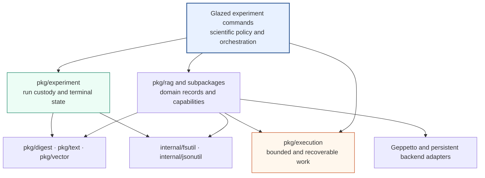
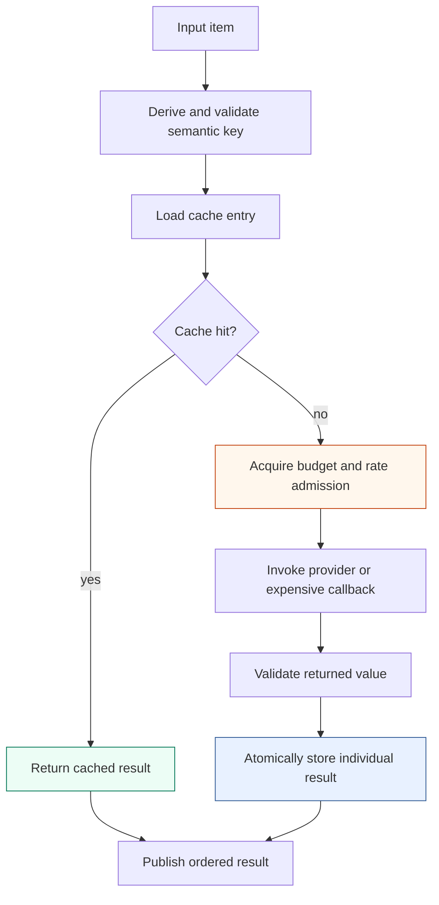

# rag-ttc: Simplifying a Recoverable and Measurable RAG Experiment System

`rag-ttc` is a Go repository for running retrieval-augmented generation
experiments against the Tree Center evaluation corpus. Its defining
architectural decision is that an experiment remains a concrete Go program.
The repository shares stable mechanisms—chunking, retrieval, provider access,
bounded execution, caching, and artifact custody—but does not represent the
experiment itself as a workflow graph, stage registry, or domain-specific
language.

This report examines the system after completion of
`RAG-TTC-SIMPLIFY-001`, a 491-task refactor that reorganized generic
mechanisms, reduced duplicated experiment code, removed redundant artifacts,
and validated the resulting architecture on deterministic fixtures, the real
TTC corpus, and bounded OpenAI calls. The focus is the resulting engineering
system: its dependency rules, execution semantics, experiment contracts, and
measured behavior.

The broader implementation history is documented in
[[PROJECT REPORT - rag-ttc - From Clean-Slate Toolbox to Live TTC Answer Quality Evaluation]].
The pre-refactor system reference is
[[ARTICLE - rag-ttc - Architecture of a Reproducible Go RAG Evaluation System]].
The initial clean-slate rationale is in
[[PROJECT REPORT - rag-ttc - Clean-Slate RAG Experiments in Plain Go]].
All three are indexed by [[rag-ttc]].

> [!summary]
> - Generic bounded execution, budgets, rates, and cache composition now live
>   in `pkg/execution`; they do not import RAG domain types.
> - Domain-neutral identities, text analysis, and vector mathematics live in
>   `pkg/digest`, `pkg/text`, and `pkg/vector`. Private durable filesystem and
>   strict JSON mechanisms live in `internal/fsutil` and `internal/jsonutil`.
> - RAG packages retain only semantic operations and adapters. Experiment
>   commands retain scientific policy, arm selection, result schemas, and
>   artifact decisions.
> - Cache lookup occurs before budget and rate admission. Successful items are
>   committed individually, allowing a failed 2,000-item operation to resume
>   from the completed prefix.
> - Selected retrieval arms determine required providers, indexes, and resource
>   ceilings. A BM25-only answer run performs no embedding, constructs no
>   vector index, and spends no embedding or reranking budget.
> - Validation included all six examples, full tests and linters, a
>   200-document TTC backend run, recovery after a 1,000-item budget stop,
>   OpenAI summary and embedding recovery, and a literal-zero-budget replay of
>   a grounded OpenAI answer.

## 1. The problem the refactor solved

The repository began with a sound clean-slate boundary, but implementation
pressure had introduced smaller forms of accidental complexity:

- generic parallel execution lived under `pkg/rag/execution`;
- hashing, Unicode term analysis, vector mathematics, atomic writes, and strict
  JSON decoding were duplicated or assigned to domain packages;
- experiment commands repeated provider-cache decoration and artifact-writing
  mechanics;
- some generated files duplicated canonical result streams;
- answer-quality setup resolved embedding and reranking providers even when
  the selected experiment arm did not require them;
- package names implied RAG ownership for mechanisms that could execute any
  typed expensive operation.

These defects did not require another framework. They required stricter
ownership. The final design uses two questions when placing code:

1. Can the contract be described without documents, chunks, retrieval,
   embeddings, generation, or evaluation?
2. Does more than one concrete consumer require the mechanism?

If both answers are yes, the mechanism may belong in a focused generic
package. If the contract refers to model requests, source evidence, ranking,
or evaluation meaning, it remains in RAG. If the behavior selects arms,
defines a benchmark matrix, names artifacts, or chooses a failure policy, it
remains in the experiment command.

This rule produced a compact dependency hierarchy.



The lower packages cannot import commands or experiments. The generic packages
cannot import RAG. This is enforced through source inspection and `go list`,
not merely through documentation.

## 2. Plain Go experiments as the control plane

The repository intentionally contains no generic workflow runner. Each
experiment command performs a readable sequence:

```text
decode Glazed settings
load immutable inputs
select queries and experimental arms
derive required capabilities and conservative call ceilings
validate provider budgets and price information
create the experiment directory
prepare chunks and representations
construct only required indexes and providers
run bounded, cached work
append completed canonical rows
derive aggregates
write terminal status
```

The sequence is repeated at a conceptual level across three experiment
families:

| Command | Scientific purpose | Canonical completed stream |
| --- | --- | --- |
| `backend-bakeoff` | Compare lexical and exact-vector retrieval backends | `results/variants.jsonl` |
| `answer-quality` | Compare retrieval arms and grounded generated answers | `results/per-query.jsonl` |
| `summary-perf` | Measure summary packing, concurrency, turns, and embedding batching | `results/variants.jsonl` |

Shared packages do not decide the matrix or stage order. For example,
`pkg/execution` can map cached work, but it does not know whether an item is a
chunk summary, query embedding, or reranking request. The summary experiment
decides that a variant uses one request per chunk, several summaries in a
request, or a complete document with marked chunk boundaries.

This keeps a hypothesis visible in the program that measures it. Adding a new
experimental technique usually means adding explicit command-local control
flow and reusing existing capabilities. It does not require extending a
workflow schema.

## 3. Generic execution primitives

Expensive work is governed by three independent controls.

### 3.1 Worker bounds

A worker count limits simultaneous goroutines. The generic ordered map accepts
a context, a slice of typed inputs, and a callback. It uses `errgroup` and
returns results in input order even when callbacks finish out of order.

```go
results, err := execution.Map(ctx, inputs, execution.MapOptions[Input]{
    Workers: 4,
    Limiter: limiter,
    Cost:    func(Input) int { return 1 },
}, work)
```

Worker bounds protect local resources and restrict concurrent provider
requests. They do not represent a request rate or a total experiment budget.

### 3.2 Rate limits

A rate limiter controls admission over time. It can model requests per second
or another resource-specific cadence. Rate limiting remains independent from
worker count because a provider may allow many in-flight requests but only a
fixed admission rate.

### 3.3 Finite budgets

A budget caps total admitted resource units. The answer experiment maintains
separate budgets for:

- embedding items;
- generation calls;
- reranking calls.

`execution.ResourcePlan` records the conservative ceiling, admitted budget,
and optional unit price for one named resource:

```go
type ResourcePlan struct {
    Name    string
    Ceiling int
    Budget  int
    UnitUSD *float64
}
```

Preflight rejects negative values, duplicated resource names, insufficient
budgets for complete-run policy, unknown pricing unless explicitly allowed,
and estimated cost above the configured monetary ceiling. Prices are not
fabricated. If a provider profile does not supply them, the resulting
observation states that actual or estimated price information is unavailable.

The runtime limiter composes the finite budget with an optional rate:

```text
named resource
  -> finite budget admission
  -> temporal rate admission
  -> provider callback
```

The controls measure different quantities. Embedding 100 items in one provider
batch consumes 100 embedding budget units and one work call. Cache observations
therefore record items, hits, misses, writes, and work calls separately.

## 4. Cache-first recoverability

The execution cache is a correctness mechanism for costly experiments, not
only a performance optimization. A cache entry represents a completed typed
operation under a semantic key. The key includes the operation namespace,
version, provider or model identity, and request identity required to
distinguish results.

The critical order is:



Cache hits are resolved before limiter admission. This property allows replay
with no authority to perform new provider work. A zero budget must not prevent
the program from reading a result that was already purchased and validated.

### 4.1 Per-item durability with provider batches

Embedding providers benefit from batches, but a batch must not become the
recovery unit. `execution.MapCachedBatches` groups unique misses into bounded
provider calls while storing every successful item under its own key.

Its simplified algorithm is:

```text
derive keys for all inputs
coalesce duplicate keys
load every unique key
copy hits into all corresponding input positions

partition unique misses into provider batches
for each admitted batch, with bounded parallelism:
    call provider once
    require one result per unique input
    for each returned item:
        atomically store its individual entry

restore original input order
return results and cache report
```

If the 1,999th item of a 2,000-item campaign fails, successful earlier entries
remain on disk. A retry loads them and executes only misses. Duplicate items
execute once and are copied to each original position.

Cache stores use `context.WithoutCancel` after successful provider work. A
caller cancellation that occurs after a valid result is received must not
unnecessarily discard that completed value. Atomic publication is provided by
`internal/fsutil`: write a temporary sibling, sync it, rename it, and sync the
parent directory.

### 4.2 Fail-closed cache behavior

Cache corruption is not interpreted as a miss. Invalid JSON, trailing values,
identity disagreement, or malformed cached results return an error. Silent
recomputation would obscure corruption and could spend money under an
incorrect assumption that replay was free.

The strict JSON decoder in `internal/jsonutil` accepts exactly one JSON value,
rejects unknown fields where the caller requests strict decoding, and rejects
trailing data. It provides syntax mechanics only; a RAG adapter still validates
model-specific meaning.

## 5. RAG-specific adapters

Generic execution does not know how to validate an embedding or answer. The
RAG subpackages own those semantics.

### 5.1 Embeddings

`pkg/rag/embedding` contains local embedding behavior, cached embedding
decoration, and provider-facing validation. It checks model agreement, result
count, vector dimensions, finite values, and request identity. Numerical
normalization and cosine similarity are delegated to `pkg/vector`; the meaning
of an embedding result remains in RAG.

### 5.2 Generation

`pkg/rag/generation` wraps `rag.Generator` with caching and observation. The
answer command supplies a strict grounded-answer contract. The summary command
supplies a strict summary contract. Invalid model output is recorded as a
contract failure; it is not heuristically repaired into a valid result.

### 5.3 Reranking

`pkg/rag/reranking` contains the cached reranker decorator and the local
term-overlap baseline. It preserves query and evidence identity while the
generic cache handles persistence.

### 5.4 Retrieval

Lexical and vector indexes return `rag.Hit` values containing representation,
chunk, document, channel, rank, and score identity. Retrieval composition
collapses representations to a target level, performs weighted reciprocal-rank
fusion, and hydrates selected hits back to source chunks.

Generated representations may be searchable, but answer evidence is hydrated
from source chunks. A generated chunk summary is a representation when it is
used as searchable derived text; it is not the cited source itself.

## 6. Focused generic utility packages

The refactor removed a collection of small duplicated mechanisms without
creating a miscellaneous `util` package.

| Package | Contract | Explicit non-responsibility |
| --- | --- | --- |
| `pkg/digest` | SHA-256 byte, text, JSON, and truncated identities | Deciding semantic key fields |
| `pkg/text` | One deterministic Unicode letter/number term policy | Provider tokenization or language analysis |
| `pkg/vector` | Dimension checks, finite checks, cosine, normalization | Constructing search hits or indexes |
| `internal/fsutil` | Atomic writes, directory sync, containment, recursive size | Artifact naming and retention |
| `internal/jsonutil` | Strict single-value decoding and complete-fence removal | Repairing model output |

Each package has a coherent vocabulary and multiple consumers. None exposes an
extension registry. The internal packages remain repository-private because
their contracts support this codebase's persistence boundaries and do not need
to become public APIs.

The extraction was performed atomically: callers moved to the new packages and
replaced helpers were deleted. There are no forwarding aliases or
backward-compatibility packages.

## 7. Experiment directories as durable evidence

`pkg/experiment` owns execution custody rather than execution policy. A run
directory contains immutable inputs, prepared data, observations, canonical
results, aggregates, and terminal state:

```text
<run-root>/<run-id>/
├── config.json
├── manifest.json
├── status.json
├── inputs/
├── preparation/
├── indexes/
├── observations/
├── results/
└── summary.md
```

The package can:

- create a run and hash its configuration;
- copy inputs with digest-bearing manifests;
- atomically write JSON artifacts;
- append synchronized JSON Lines observations and result records;
- record terminal completion or failure.

It does not schedule stages or interpret retrieval metrics.

### 7.1 Canonical streams

The refactor established one durable completed stream per experiment. A row is
appended immediately after its unit reaches a terminal state. Aggregates and
Markdown reports are derived from these streams.

This supports two important properties:

1. A later variant failure does not erase completed earlier variants.
2. Export tools consume an explicit stream rather than inferring completion
   from a collection of filenames.

### 7.2 Artifact reduction

Files were retained only if they support reproduction, recovery, inspection,
measurement, human review, or index inspection. Redundant files were removed.
Examples include:

- backend-specific hit and metric files duplicated by `variants.jsonl`;
- full `vectors.json` duplicated by the persistent vector index;
- per-arm retrieval files duplicated by `per-query.jsonl`;
- per-variant summary payload files duplicated by the completed stream and
  request observations.

Large or detailed data is still retained when it is authoritative. Chunks,
representations, request observations, budgets, provider usage, failures,
review queues, and private review keys remain explicit.

## 8. Arm-aware dependency planning

The most consequential final simplification occurred in the answer-quality
command. Before commit `0f30fad`, a BM25-only experiment still:

- resolved an embedding provider;
- declared a ceiling of 1,983 embedding items;
- embedded all 1,982 corpus representations;
- embedded the query;
- built a SQLite exact-vector index;
- emitted vector preparation artifacts.

None of that work could affect a lexical-only result. The defect was not only
performance overhead. It made budget preflight describe irrelevant work and
prevented a zero-embedding-budget lexical experiment from starting.

The corrected design derives requirements from the selected arms:

| Selected arm | Generation | Embeddings | Reranker | Vector index |
| --- | ---: | ---: | ---: | ---: |
| BM25 | required | not required | not required | not built |
| Vector | required | required | not required | built |
| RRF | required | required | not required | built |
| RRF reranked | required | required | required | built |

Resource ceilings use the same predicates:

```text
generation ceiling = query count × selected arm count

if any arm needs vector retrieval:
    embedding ceiling = representation count + query count
else:
    embedding ceiling = 0

reranking ceiling =
    query count × number of selected reranked arms
```

Provider construction, index construction, artifact production, and budgeting
now agree on the same selected capabilities. A focused regression test runs
BM25 with a nil embedder and zero embedding budget. It completes successfully
and emits neither a vector manifest nor a SQLite vector index.

This is a general design requirement for experiments: configuration should
select the dependency graph before resources are acquired. Optional scientific
arms must not cause unconditional operational dependencies.

## 9. Provider configuration and command contracts

All executable commands are Glazed commands. Provider profiles are loaded
through Pinocchio and Geppetto configuration rather than direct environment
access. The command boundary resolves the selected composite profile, exposes
only non-secret provider metadata to the run, and owns cleanup.

The live TTC profile selected:

```text
generation: openai-responses / gpt-5-nano
embedding:  openai / text-embedding-3-small / 1536 dimensions
```

The repository profile composed a project registry with the user's default
Pinocchio registry. This composition was necessary because the project profile
referenced generation and embedding profiles stored in different registries.

`glazed-lint` is part of the repository checks and reports direct environment
access. The completion audit found no `os.Getenv` or `os.LookupEnv` in Go
source.

The structural refactor preserved the external command API. Phase 0 and final
`--print-schema` outputs were byte-identical:

| Command | SHA-256 |
| --- | --- |
| `backend-bakeoff run` | `fe1ada95ecbf20f44c7e932486251cc3689ce23702a40a659f98e5dbd7df936e` |
| `answer-quality run` | `ecddc388762a0f00e57ddcda7a4dd2997a4f932e5f44f40074f893f761172b60` |
| `summary-perf run` | `0b14cabc10e124a38de09274ef77e9c35101e718d24f78f1208102e71fbd6b7b` |
| `summary-perf export` | `e6f101e8a1be416a10872f7887d1055cc87ba9a71624fbf2eb24a7d60238bac2` |

This was verified with exact fixtures, not through a compatibility adapter.

## 10. Identity as an experimental contract

Refactoring reusable mechanisms can unintentionally change results without
changing types. The project therefore locked identities and formats with
golden fixtures:

- cache input digest, key digest, and relative path;
- sample corpus and document digests;
- experiment configuration digest;
- exact hash-embedding components;
- chunk and representation IDs;
- the 21-column summary CSV header;
- blinded review identifiers;
- all four Glazed schemas.

These fixtures identify the properties that must remain stable across a
structural refactor. They are narrow and exact. A test failure means either the
refactor changed a persisted contract or the fixture was derived incorrectly.

One fixture initially asserted the wrong hash-vector positions. Inspection
showed that the implementation folds the first sixteen hexadecimal characters
and uses character fifteen for sign selection. The fixture was corrected to
the actual contract: the normalized `oak tree` vector has nonzero values only
at indices 11 and 14.

Golden tests are not a substitute for semantic measurements. They protect
identity and interchange surfaces, while dataset runs protect scientific and
operational behavior.

## 11. Validation on deterministic examples

All six examples completed with `-buildvcs=false`:

```text
examples/01_chunking
examples/02_lexical_search
examples/03_hybrid_evaluation
examples/04_controlled_execution
examples/05_cached_recovery
examples/06_end_to_end_experiment
```

They demonstrated:

- stable digest-derived chunk IDs;
- expected BM25 ordering;
- Recall@3 of `1.00` for all five sample hybrid queries;
- ordered parallel results and exact six-unit budget spending;
- a ten-item cached operation that preserved nine items after a late failure
  and made only one call on retry;
- a complete terminal experiment directory.

The examples are executable package documentation. They verify individual
concepts without requiring provider credentials.

## 12. Real TTC backend measurement

The local backend validation used:

- 200 TTC documents;
- 1,982 fixed chunks and raw representations;
- the first 10 evaluation queries;
- 128-dimensional deterministic hash embeddings;
- four workers;
- Bleve BM25;
- SQLite exact cosine search.

The first pass deliberately provided only 1,000 embedding budget units.
Execution stopped at item 1,000, and the completed 1,000 entries remained
durable. The resumed run reported:

- 1,000 corpus cache hits;
- 982 new corpus embeddings;
- 10 query embeddings;
- completed lexical and vector indexes.

The measured retrieval results were:

| Backend | MRR | Recall@10 | nDCG@10 | Hit rate@10 |
| --- | ---: | ---: | ---: | ---: |
| Bleve BM25 | 0.683333 | 0.75 | 0.681472 | 0.8 |
| SQLite exact hash vectors | 0.061667 | 0.3 | 0.117374 | 0.3 |

The deterministic hash embedder is a local execution oracle, not a claim about
semantic embedding quality. Its poor result relative to BM25 is expected to be
reported exactly because the purpose of this run was backend execution,
metrics, failure recovery, and replay.

An identical replay with budget zero produced:

- 1,982 corpus cache hits;
- 10 query cache hits;
- zero writes;
- zero work calls;
- zero budget spend;
- identical metrics.

This is the corpus-scale proof of per-item recovery.

## 13. Live summary generation and embedding

An authorized OpenAI campaign selected one real TTC document, which produced
11 chunks. It used:

- `gpt-5-nano` for structured summaries;
- `text-embedding-3-small` for summary embeddings;
- one generation worker;
- embedding batch size 10;
- fresh caches;
- a \$0.25 estimated-cost ceiling;
- a conservative preflight estimate of \$0.01111.

The first attempt made two generation calls and failed on the second item
because the response included an unsupported `notes` field. Strict decoding
correctly rejected it. The first valid summary was already cached.

The identical retry recovered that item, generated the other ten summaries,
and embedded all eleven:

| Stage | Items | Cache hits | Provider calls | Duration | Reported usage |
| --- | ---: | ---: | ---: | ---: | --- |
| Summary generation retry | 11 | 1 | 10 | 40.997 s | 5,186 input; 4,116 output tokens |
| Summary embedding | 11 | 0 | 2 | 0.685 s | embedding tokens unavailable |

Across the failed attempt and successful retry, generation made 12 calls and
reported 6,277 input and 5,232 output tokens. Eleven responses became valid
cached summaries; one remained a recorded contract failure. The cache
contained 11 generation entries and 11 embedding entries.

The provider profiles did not report actual cost, so the project does not
derive one from incomplete information.

An admitted replay reported 11 hits and zero provider calls for both stages.
The summary command's complete-campaign preflight currently requires budgets
large enough to cover the declared ceiling, even when every item is cached.
Consequently, literal-zero summary budgets stop at preflight. This is a
documented command policy boundary, distinct from cache behavior.

## 14. Live grounded answer and literal-zero replay

After arm-aware dependency planning was implemented, a one-query BM25-only
answer run used:

- query `ttc-expand-001`;
- five retrieved evidence chunks;
- `gpt-5-nano`;
- one generation request;
- no embedding provider;
- no reranker;
- no vector index.

The result was:

| Measurement | Value |
| --- | ---: |
| Generation calls | 1 |
| Input tokens | 824 |
| Output tokens | 179 |
| Generation duration | 2.316 s |
| Generation budget | 1 of 1 |
| Embedding budget | 0 of 0 |
| Reranking budget | 0 of 0 |

The answer satisfied the strict grounded-answer schema, cited evidence, and did
not abstain. Only the Bleve index was created.

An identical replay set all provider budgets to literal zero and used the
existing explicit partial-run admission policy. It completed with:

- one generation cache hit;
- zero cache misses;
- zero cache writes;
- zero provider work calls;
- no provider usage;
- zero spend for embedding, generation, and reranking;
- terminal status `complete`.

This run verifies the strongest replay property in the repository: a cached
answer can be reproduced when the process has no budget authority to call the
provider.

## 15. Full source and quality gates

The completed refactor passed:

```text
go fmt ./...
go test ./... -count=1
go test -race <execution, experiment, adapters, and experiment runners>
go build -buildvcs=false ./...
go generate ./...
make lint
go tool glazed-lint ./...
git diff --check
```

The race suite covered generic execution, experiment artifact custody, cached
embedding, cached generation, cached reranking, answer quality, and summary
performance. The Glazed analyzer reported no direct environment access. Source
inspection confirmed:

- no imports of the deleted `pkg/rag/execution`;
- no experiment implementation importing another experiment implementation;
- no RAG imports from `pkg/execution`, `pkg/digest`, `pkg/text`, or
  `pkg/vector`;
- no workflow framework or compatibility forwarding package.

The repository worktree contained unrelated answer-review and live-E2E work.
Those paths were excluded from the refactor commits and from the evidence
claims in this report.

## 16. Engineering conclusions

The final system is small in the dimensions that affect experiment authoring,
but strict in the dimensions that affect cost and evidence.

First, reuse occurs at capability and mechanism boundaries. A cached batch map
is reusable. A vector cosine function is reusable. A fixed sequence named
“prepare, retrieve, generate, evaluate” is experiment policy and remains
ordinary Go.

Second, recovery granularity must be smaller than provider-call granularity.
Batching improves throughput, while individual cache entries preserve
completed work. These requirements are compatible when batches are execution
units and items are commit units.

Third, budgets must describe resources that can actually be consumed by the
selected experiment. Arm-aware planning aligned provider construction,
resource ceilings, indexes, and artifacts. It removed 1,983 irrelevant
embedding items from a one-query BM25 experiment.

Fourth, run directories and canonical JSONL streams provide sufficient
experiment custody without a workflow service. They retain immutable inputs,
terminal state, completed units, observations, and derived reports. Failure
does not erase prior evidence.

Fifth, strict parsing and fail-closed caching expose defects early. The live
summary run rejected an unexpected field and recovered the valid prefix.
Corrupted cache data would likewise stop the run rather than be silently
recomputed.

Finally, simplification requires executable preservation criteria. The
refactor combined package-dependency checks, golden identities, byte-identical
command schemas, deterministic examples, real dataset execution, live-provider
execution, late-failure recovery, and zero-work replay. No single test class
would establish the same result.

## 17. Repository reading guide

An engineer joining the project should read the following files in order:

1. `pkg/rag/types.go` and `pkg/rag/components.go` for domain records and narrow
   capabilities.
2. `pkg/execution/map.go`, `budget.go`, `rate.go`, `cache.go`, and
   `cached_batch_map.go` for bounded recoverable work.
3. `pkg/rag/embedding/cached_embedder.go`,
   `pkg/rag/generation/cached.go`, and `pkg/rag/reranking/cached.go` for
   semantic cache adapters.
4. `pkg/experiment/run.go`, `observation.go`, `results.go`, and `terminal.go`
   for run custody.
5. `cmd/rag-ttc/cmds/experiments/answerquality/arms.go`, `budgets.go`, and
   `runner.go` for arm-aware orchestration.
6. `cmd/rag-ttc/cmds/experiments/summaryperf/matrix.go` and `runner.go` for
   benchmark-matrix execution.
7. `internal/fsutil` and `internal/jsonutil` for repository-private persistence
   and parsing boundaries.
8. The six `examples/` programs for executable, credential-free usage.

The ticket evidence is under:

```text
ttmp/2026/07/26/
  RAG-TTC-SIMPLIFY-001--simplify-and-refactor-the-ttc-rag-experiment-codebase/
```

Its two design documents explain the ownership decisions. The investigation
diary records 38 implementation steps. The artifact inventory defines
canonical and derived files. The validation report records commands, fixtures,
dataset measurements, provider behavior, and replay evidence. `tasks.md` is the
authoritative 491-item completion ledger.

## 18. Current boundary

The simplification ticket is complete. The repository supports direct,
measurable, recoverable experiments without the earlier RAG DSL,
Researchctl, or Scraper workflow control plane.

Future work should preserve the current boundary:

- add a shared component only after a second concrete consumer exists;
- keep experimental matrices and arm policy under `cmd/`;
- derive provider requirements from selected capabilities;
- cache before budget admission;
- commit expensive work per recoverable item;
- append canonical completed records before computing aggregates;
- preserve source, request, model, and configuration identity;
- report unavailable usage or price data as unavailable;
- validate changes with both deterministic contracts and bounded real runs.

The project now provides a constrained foundation for retrieval, summary,
embedding, reranking, and answer experiments. Its main technical result is not
the number of available components. It is that costly experiments can be
assembled directly, measured explicitly, interrupted safely, and replayed
without hidden provider work.
