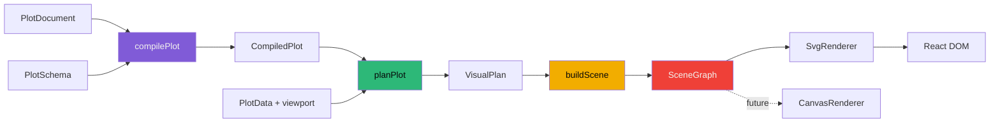
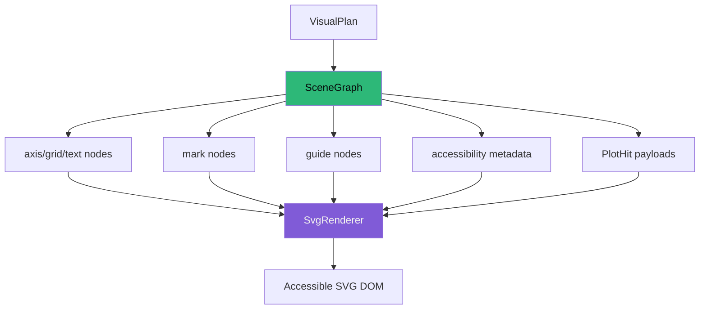
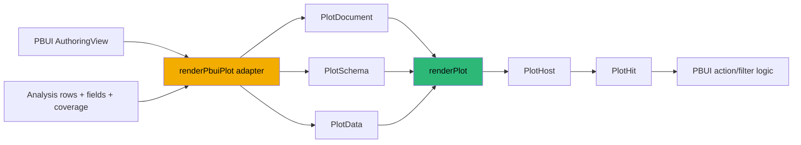

# Hyperslop Plot: Building a Frontend Grammar of Graphics as a Staged Compiler

`@hyperslop-systems/plot` is a frontend grammar-of-graphics compiler and React renderer host extracted from PBUI's original plot-drawing code. It accepts a serializable plot document, an explicit schema, bounded row data, and a viewport. It binds logical field identities, executes small frontend statistics, resolves scales and facets, plans geometry, and emits a renderer-neutral scene graph. The first renderer interprets that scene as accessible SVG.

The project was created to improve the plotting system without changing DataDrop's backend. That constraint is part of the architecture, not a temporary limitation. PBUI remains responsible for loading data, holding application state, compiling backend relations, and translating user actions. The plotting package owns visual semantics and rendering. The separation permits useful work now while preserving a direct path to richer authoring controls, another renderer, and measured performance work.

> [!summary]
> - The public plot document describes visual intent; it does not contain React elements, callbacks, SQL, or PBUI state.
> - Compilation is staged so field binding, statistical transformation, scale training, geometry, and rendering can be tested independently.
> - The scene graph is the only renderer input. SVG is an implementation of that contract, not the plot model.
> - Phases 1 through 5 now cover parity, layered graphics, scientific statistics, richer scales, facets, guides, and themes. Canvas remains a later phase that should be justified by measurement.

## 1. Why this project exists

PBUI already had working charts. The problem was not an absence of marks on a screen. The problem was that the old plotting seam collapsed several responsibilities into one application-specific path:

- PBUI authoring state selected fields and marks.
- Physical row properties were treated as field identity.
- geometry policy, scale decisions, SVG construction, and interaction behavior were coupled.
- reference lines were special configuration rather than ordinary layers.
- extending the system meant editing application code that also knew about Redux actions, backend result shapes, and PBUI's persisted document.

That structure could support a small set of point, line, area, and bar plots. It could not support a growing grammar without repeatedly increasing coupling. A histogram introduces a statistical transform and derived columns. A confidence ribbon introduces multiple generated bounds. Free scales require scale training per facet panel. A future Canvas renderer requires interaction metadata that is not encoded as React event handlers. Each addition exposes another reason to separate authoring intent, semantic compilation, visual planning, and rendering.

The replacement therefore had four initial requirements:

1. It had to become a private package in the Hyperslop Systems publishing ecosystem.
2. It had to provide real PBUI functionality early rather than wait for a complete grammar.
3. Its early public contracts had to leave room for later phases without pretending to implement them.
4. It could not require a backend migration.

The result is not a compatibility wrapper around the old engine. PBUI has one explicit composition boundary into the new package, and the superseded plotting engine was removed after parity. This matters because two long-lived plotting models would otherwise require every new feature to be implemented, translated, and tested twice.

## 2. Scope and ownership

The simplest way to understand the system is to identify what crosses the package boundary. The package receives four values:

```ts
interface PlotRequest {
  document: PlotDocument;
  schema: PlotSchema;
  data: PlotData;
  viewport: Viewport;
}
```

It returns a structured outcome:

```ts
interface PlotOutcome {
  compiled: CompiledPlot | null;
  plan: VisualPlan | null;
  scene: SceneGraph | null;
  diagnostics: readonly Diagnostic[];
}
```

This request and outcome shape is defined in `plot/src/render.ts`. It is intentionally more informative than a function returning an SVG element. Tests, developer tools, and future authoring interfaces can inspect the compiled model and visual plan without parsing rendered markup.

The ownership boundary is:

| Concern | Owner | Reason |
|---|---|---|
| Persisted PBUI authoring document | PBUI | It is an application and product contract. |
| Redux state and RTK Query | PBUI | The plotting package has no application store. |
| DuckDB relations and backend requests | PBUI/backend | The frontend plot compiler never emits SQL. |
| Plot document and schema contracts | Plot package | They define portable visual intent and field semantics. |
| Frontend statistics | Plot package | Their outputs feed visual mappings directly. |
| Scale, facet, guide, and geometry policy | Plot package | These semantics must be renderer-independent. |
| Scene graph | Plot package | It is the stable boundary consumed by renderers. |
| SVG DOM | SVG renderer | It interprets scene nodes without recomputing plot semantics. |
| Filtering actions | PBUI | A plot reports a hit; the application decides its meaning. |

The package has no backend dependency. It does not fetch data, own a cache, or infer whether a query is complete. Instead, the caller provides explicit coverage metadata. A bounded window is represented as bounded, and the resulting plot can disclose that fact rather than silently presenting a sample as a complete population.

## 3. The architecture in one pass

The runtime is a deterministic pipeline:



Each stage removes ambiguity and adds concrete information:

- `PlotDocument` says what the author intends.
- `CompiledPlot` replaces references with bound schema fields and validates semantic combinations.
- `VisualPlan` applies statistics, trains scales, lays out panels, and computes geometry in viewport coordinates.
- `SceneGraph` expresses drawing primitives, styles, accessibility, and interaction payloads.
- `SvgRenderer` maps scene primitives to SVG elements.

The stages are data structures rather than hidden control flow. This makes intermediate invariants observable. If a field cannot bind, compilation fails before geometry. If a histogram produces the wrong bin counts, the statistical result can be tested without examining SVG. If a guide reports the wrong filter property, the scene interaction payload reveals the error.

The orchestration code is correspondingly small:

```text
function renderPlot(request):
    compiled = compilePlot(request.document, request.schema)
    if compilation has errors:
        return outcome(compiled = null, plan = null, scene = null)

    planned = planPlot(compiled.value, request.data, request.viewport)
    diagnostics = compilation diagnostics + planning diagnostics
    if planning has errors:
        return outcome(compiled, plan = null, scene = null)

    scene = buildScene(planned.value)
    return outcome(compiled, planned.value, scene, diagnostics)
```

Expected authoring and data errors become diagnostics rather than exceptions. Internal invariant violations may still throw; an invalid user mapping should not.

## 4. The serializable grammar

The durable public model is defined primarily in `plot/src/document.ts`. A version-one document contains metadata, root mappings, ordered layers, optional scales and facets, and bounded render policy:

```ts
interface PlotDocument {
  format: "hyperslop.plot";
  version: 1;
  id: string;
  title?: string;
  description?: string;
  mapping?: MappingSpec;
  layers: readonly LayerSpec[];
  scales?: Partial<Record<ScaleChannel, ScaleSpec>>;
  facets?: FacetSpec;
  render?: RenderPolicySpec;
  metadata?: Readonly<Record<string, JsonValue>>;
}
```

The model is data-only. It can be serialized, diffed, stored, validated, migrated by version, or generated by another frontend. It contains no React component, closure, class instance, DOM node, or application action.

### 4.1 Layers are the unit of composition

Every enabled layer combines four independent decisions:

```ts
interface LayerSpec {
  id: LayerId;
  enabled?: boolean;
  inheritMapping?: boolean;
  mapping?: MappingSpec;
  stat: StatSpec;
  geom: GeomSpec;
  position: PositionSpec;
}
```

The four decisions answer different questions:

- A **mapping** selects source or derived values for channels such as `x`, `y`, `color`, `shape`, or `facet`.
- A **stat** transforms input rows into rows that a geometry can consume.
- A **geom** defines what visual form to plan.
- A **position** resolves overlap or aggregation layout after values exist.

The root mapping provides defaults. A layer inherits it unless `inheritMapping` is false, then applies local overrides. Ordered layers preserve deterministic z-order. Stable layer IDs and derived scene-node IDs preserve meaningful interaction identity across renders.

Reference lines demonstrate why composition matters. A target is not a special property attached to a chart. It is a normal rule layer with one constant coordinate:

```ts
{
  id: layerId("target"),
  inheritMapping: false,
  mapping: {
    y: { kind: "constant", value: 75 }
  },
  stat: { kind: "identity" },
  geom: {
    kind: "rule",
    label: "Target",
    intent: "target",
    facetMode: "all"
  },
  position: { kind: "identity" }
}
```

This decision removes a special rendering branch and gives annotations the same ordering, faceting, clipping, styling, diagnostics, and future extensibility as other layers.

### 4.2 Field identity is not a row property

`PlotField` separates three concepts:

```ts
interface PlotField {
  id: FieldId;          // stable logical identity
  name: string;         // author-facing name
  label?: string;       // presentation label
  semanticType: "quantitative" | "nominal" | "ordinal" | "temporal";
  nullable: boolean;
  unit?: string;
  timezone?: string;
  column: string;       // executable row-data property
}
```

The distinction between `id` and `column` is essential. An ID remains stable as physical execution changes. A column is the property used to read the current row object. A name is a human-facing reference and can be ambiguous.

Compilation prefers a stable `fieldId`. A name-only reference is accepted only when exactly one schema field has that name. If two fields share a name, compilation emits `FIELD_AMBIGUOUS` and requires an ID. This prevents a visually plausible plot from binding to an unintended column.

The same distinction applies to interaction. A legend hit carries both:

```ts
{
  kind: "legend";
  fieldId: string; // semantic identity
  field: string;   // executable row property
  value: string;
  label: string;
}
```

This dual representation was validated by a real PBUI defect. The first legend integration sent the stable ID into PBUI's filter action. PBUI filters execute against row properties, so a predicate against `data.station` became a predicate against an internal ID and removed every row. The correction was not to weaken stable identity. It was to preserve both values through the guide and scene layers and use each for its proper purpose.

### 4.3 Derived values are explicit

Statistics do not overwrite the meaning of source fields. They emit named derived columns referenced with `afterStat`:

```ts
mapping: {
  x: { kind: "field", fieldId: fieldId("measurement") },
  y: { kind: "afterStat", field: "density" }
}
```

Version one exposes derived values for interval bounds, counts, quartiles, whiskers, and density. This lets the document describe a histogram, confidence ribbon, or boxplot without pretending that generated values existed in the supplied schema.

## 5. Compilation: binding before drawing

`compilePlot` in `plot/src/compile.ts` converts a permissive authoring document into a stricter intermediate representation. Its most important operation is field binding.

The compiler builds schema indexes by stable ID and by name:

```text
index.byId   : FieldId -> PlotField
index.byName : name -> list[PlotField]
```

It then resolves each `ValueRef`:

```text
function bindValue(ref):
    if ref is afterStat:
        return bound after-stat reference
    if ref is constant:
        return bound constant
    if ref contains fieldId:
        require index.byId[fieldId]
    else:
        matches = index.byName[name]
        require exactly one match
```

The resulting `BoundFieldRef` contains the complete `PlotField`, including its executable `column` and semantic type. Downstream stages no longer repeat lookup or ambiguity handling.

Compilation also validates combinations that are independent of the actual row values. Examples include:

- required channels for each geometry,
- exactly one coordinate for a rule,
- compatible semantic types,
- valid `afterStat` outputs for a selected statistic,
- supported channels,
- scale/channel compatibility,
- legal render-policy limits.

Layer mapping inheritance is resolved here. Disabled layers are removed here. Default render limits—5,000 marks, eight categories, and six facets—become explicit compiled values here. This keeps the planner focused on data-dependent work.

The compiler returns diagnostics with a severity, stable code, message, document path, node ID, and optional details. Stable codes allow Storybook, tests, and future authoring UI to distinguish a missing field from an unsupported channel without matching prose.

## 6. Statistical transformations

Phase 4 introduced the scientific plotting layer. The implementation lives in `plot/src/stats.ts`, and each transformation returns both transformed data and `StatisticalMetadata`.

The metadata is not auxiliary logging. It records:

- the layer and method,
- grouping fields,
- input measure,
- output schema,
- invalid-value count,
- interval definition,
- method parameters,
- regression estimates or assumptions where applicable.

This prevents a rendered interval or curve from losing the information required to interpret it.

### 6.1 Summary intervals

The summary statistic groups rows, computes a mean, then emits lower and upper bounds for either standard deviation or standard error.

For observations $x_1, \ldots, x_n$:

$$
\bar{x} = \frac{1}{n}\sum_{i=1}^{n}x_i
$$

$$
s = \sqrt{\frac{\sum_{i=1}^{n}(x_i-\bar{x})^2}{n-1}}
$$

The interval half-width is either $m s$ or $m s/\sqrt{n}$, where $m$ is the requested multiplier. Error-bar and ribbon geometries consume the resulting `lower` and `upper` values.

The distinction is recorded because standard deviation describes sample spread while standard error describes uncertainty in the estimated mean. Rendering both as vertical intervals does not make them statistically interchangeable.

### 6.2 Deterministic histograms

The bin statistic reads the mapped quantitative x field, removes non-finite values, and computes an explicit sequence of equal-width bins. If the document does not request a bin count, the current default is:

$$
b = \lceil \sqrt{n} \rceil
$$

For each bin, the transform emits its center, start, end, and count. The final input maximum is forced into the last bin:

```text
index = min(
    bins - 1,
    max(0, floor((value - minimum) / width))
)
```

That boundary rule makes repeated compilation deterministic and prevents the maximum value from falling outside the array due to the half-open convention used by preceding bins.

### 6.3 Position adjustments

Position logic is distinct from statistical transformation:

- `stack` accumulates series values on a common category.
- `fill` normalizes each stack to a common total.
- `dodge` allocates adjacent horizontal slots.
- `jitter` adds deterministic displacement from a required seed.

The explicit seed is a reproducibility requirement. A plot document should not produce different point locations every time React renders. Deterministic jitter also permits scene-level tests with stable coordinates.

### 6.4 Grouped ordinary least squares

The regression statistic computes an independent OLS model per group. For each group:

$$
\hat{\beta}_1 =
\frac{\sum_i(x_i-\bar{x})(y_i-\bar{y})}
     {\sum_i(x_i-\bar{x})^2}
$$

$$
\hat{\beta}_0 = \bar{y} - \hat{\beta}_1\bar{x}
$$

It emits fitted values and confidence bounds at sorted observed x coordinates. Metadata records the intercept, slope, $R^2$, residual standard error, count, confidence level, and normal-approximation assumption. The implementation is intentionally bounded. It supports an immediately useful frontend regression without claiming to provide a general statistical modeling environment.

### 6.5 Tukey boxplots

The boxplot statistic uses R7 quantiles and Tukey whiskers. It emits $Q_1$, median, $Q_3$, and the most extreme observed values within:

$$
[Q_1 - 1.5\,IQR,\; Q_3 + 1.5\,IQR]
$$

where $IQR = Q_3 - Q_1$. The geometry planner receives explicit quartile and whisker channels rather than recomputing statistical meaning during drawing.

### 6.6 Gaussian kernel density estimates

The density statistic evaluates a Gaussian kernel over a deterministic grid. It accepts an explicit bandwidth and point count. When bandwidth is omitted, it derives a robust spread estimate from standard deviation and interquartile range, then applies a sample-size term:

```text
robustSpread = min(standardDeviation, IQR / 1.34)
bandwidth = 0.9 * robustSpread * n^(-1/5)
```

Degenerate samples use a finite fallback. The output contains the original measurement coordinate and an `afterStat("density")` value suitable for line or area geometry.

## 7. Visual planning: where values become coordinates

`planPlot` in `plot/src/plan.ts` is the largest semantic stage. It receives bound fields and actual rows, applies statistics and positions, trains scales, lays out facets, computes marks, and constructs guides.

The planner produces a `VisualPlan` containing:

- viewport and panel rectangles,
- per-panel x and y scales,
- planned axes and ticks,
- ordered planned layers,
- merged guides,
- coverage and row counts,
- diagnostics,
- statistical metadata.

This is still not a rendering vocabulary. A planned bar is a bar with x, y, width, height, and its source datum. A planned line is grouped ordered data with resolved visual properties. Scene emission decides which primitive nodes express those plans.

### 7.1 Shared and free scales

Layered plots require shared scale training. If an area, line, and point layer show the same measurement, their coordinates must be comparable. Training a separate domain per layer would produce aligned axes with misaligned marks.

Faceting extends the rule. The document chooses one of four policies:

| Policy | x scale | y scale |
|---|---|---|
| `fixed` | Shared across panels | Shared across panels |
| `free-x` | Trained per panel | Shared across panels |
| `free-y` | Shared across panels | Trained per panel |
| `free` | Trained per panel | Trained per panel |

Manual domains override automatic training, including automatic zero expansion. This precedence is an invariant: an author who specifies `[40, 60]` must not receive `[0, 60]` because the default linear scale normally includes zero.

### 7.2 Aesthetic scale families

Version one supports position and aesthetic channels:

- x and y: linear, logarithmic, temporal, and band scales as appropriate,
- color and fill: categorical palettes or quantitative color interpolation,
- size and opacity: quantitative ranges,
- shape: categorical symbol ranges.

Categorical domains are bounded by render policy. If the data contains too many categories for the available palette or shape set, the planner diagnoses the condition rather than silently assigning unstable or misleading encodings.

Units belong to quantitative formatting, and IANA timezones belong to temporal formatting. The planner also applies deterministic label-collision pruning. Automatic pruning preserves endpoints and removes overlapping intermediate labels while retaining original data order. `labelCollision: "none"` permits an author to opt out.

### 7.3 Guide merging

Separate channels may encode the same field. If color, fill, and shape use the same stable field identity and ordered values, separate legends would repeat the same categories. The planner merges compatible channels into one guide entry set.

Merging requires semantic equality, not matching titles alone:

```text
merge guides when:
    fieldId is equal
    ordered domain values are equal
    channel families are compatible
```

Categorical guide entries carry interactions because equality filtering has a clear value. Quantitative guide entries are visible but noninteractive; selecting one sample from a continuous ramp would not define a valid general filter operation.

## 8. The scene graph and renderer boundary

`buildScene` in `plot/src/scene.ts` converts the visual plan into a compact set of primitives:

```ts
type SceneNode =
  | SceneGroup
  | SceneCircle
  | SceneSymbol
  | SceneRect
  | ScenePath
  | SceneLine
  | SceneText;
```

Each node has a stable ID, optional semantic role, style, and optional `PlotHit`. The scene also contains accessibility title and description plus metadata about source rows, valid data, rendered data, rendered marks, coverage, and diagnostics.

This boundary prevents two forms of renderer drift:

1. A renderer cannot independently decide how to train a scale or compute a boxplot.
2. Interaction cannot be hidden inside renderer-specific closures.

The SVG renderer in `plot/src/renderers/svg/SvgRenderer.tsx` has a narrow job. It converts scene styles to React CSS properties, paths to SVG path data, symbols to SVG elements, and interactions to keyboard-accessible hit targets. It does not know about schemas, statistics, facets, or PBUI.



`PlotHost` is the React integration surface. It handles loading, empty, ready, and diagnostic states; selects the renderer; applies a theme; and exposes `onHit` and `renderInteractive`. The latter allows an application to wrap an interactive scene element without requiring application components inside the scene.

## 9. PBUI integration

PBUI integrates through one function:

`pbui/packages/datalab-ui/src/appkit/plotAdapter.ts`

`renderPbuiPlot` projects the current PBUI authoring view and analysis result into package contracts:



The adapter is deliberately asymmetric. It knows both PBUI and plot contracts. The plot package knows only its own contract. No package source imports PBUI model types, Redux actions, or backend response structures.

Today the adapter lowers the established PBUI marks, y-scale choice, nominal line/area grouping, references as rule layers, and bounded result coverage. PBUI's current authoring model still emits identity statistics and uses dodge for bars. The package can perform summaries, histograms, regressions, boxplots, density estimation, richer scale configuration, and free facets, but the product authoring controls do not expose all of those capabilities yet.

That gap defines the next useful phase. It is product integration, not compiler invention.

## 10. Styling, embedding, and layout stability

The package supports three host themes:

- `embedded` inherits application variables and fonts and is the default for PBUI.
- `publication` provides a deterministic high-contrast light presentation.
- `dark` uses the Hyperslop Systems palette.

The dark palette is:

```css
--bg: #050607;
--fg: #f3f3ef;
--green: #2db878;
--purple: #805bd7;
--yellow: #f2ad00;
--red: #ef4038;
```

The important theme is `embedded`. The package is rendered inside PBUI, so it must participate in the application's daylight mode, typography, and surrounding layout. Consumers can set `--hs-plot-*` variables around the host, while `unstyled` disables package styling.

Two integration defects clarified this surface.

First, the live graph slowly grew larger. The cause was a feedback cycle between measured container size and rendered child size. A plot derived its viewport from a container whose intrinsic dimensions were affected by the newly rendered SVG; the next observation produced a slightly larger viewport, which produced a slightly larger child. The stable rule is:

```text
application layout defines a bounded host rectangle
    -> observer measures that rectangle
    -> plot receives width and height
    -> SVG uses a fixed viewBox and fits inside the rectangle
    -> child intrinsic size must not redefine the host
```

Second, plot typography was too large and did not fit the design system. The solution was not to hard-code PBUI's complete stylesheet into geometry. Tick and label styles use package variables with compact defaults, while embedded mode inherits the surrounding font family. This preserves application integration without coupling scene planning to CSS measurements.

These defects also justify screenshot-based review. Unit tests can prove that a tick exists and that a viewBox is stable; they do not establish whether a font fits the surrounding application or whether a layout feedback loop appears over several frames.

## 11. Storybook as an executable contract

Storybook was introduced early and remained active throughout the implementation. It is not only a component gallery. Each story is a controlled integration fixture for a semantic capability:

- layered area, line, and point plots,
- summary intervals and ribbons,
- deterministic histograms,
- grouped regression confidence ribbons,
- boxplots and density estimates,
- stack, fill, dodge, and jitter positions,
- manual aesthetic scales,
- fixed and free facet scales,
- merged guides,
- crowded label behavior,
- embedded, publication, and dark themes,
- loading, empty, bounded-data, and diagnostic states.

Visual screenshots were taken at phase boundaries. The review checked facts such as symbol counts, per-panel axes, merged guide entries, retained collision endpoints, computed theme colors, and inherited font behavior. Storybook therefore complements three lower testing layers:

1. Unit tests validate compiler, scale, statistic, and geometry invariants.
2. Scene tests validate renderer-neutral structure and interactions.
3. Storybook validates composed behavior and appearance in a browser.

The release gate also performs a static Storybook build. A story that only works under the development server is not sufficient release evidence.

## 12. The phased implementation

The project was intentionally built as a sequence of useful vertical slices.

| Phase | Delivered capability | Architectural preparation |
|---|---|---|
| 0 | Repository, pnpm package, private GitHub Packages workflow, Storybook, docmgr | Established release and documentation discipline before feature growth. |
| 1 | Serializable contracts, binding, diagnostics, point/line path, scene, SVG host | Established the compiler and renderer boundary. |
| 2 | PBUI parity and cutover for existing plots | Proved the package in the real application and removed the old engine. |
| 3 | Ordered multiple layers, shared scales, local mappings, rule annotations | Made composition the normal extension mechanism. |
| 4 | Summary, binning, positions, OLS, boxplots, KDE, statistical metadata | Added scientific transforms without changing the backend. |
| 5 | Scale families, fixed/free facets, merged guides, collision control, themes | Completed the current visual system and embedding surface. |
| 6 | Canvas and renderer-independent interaction | Open; should begin only after dense-scene measurement establishes a need. |
| 7 | Export, advanced interaction, further performance work | Future product-driven work. |

This ordering avoided two failure modes. Building Canvas first would have duplicated semantics before the scene contract was stable. Designing every statistic and scale before integrating PBUI would have delayed user value and left the package untested in its actual host.

The rule for each phase was:

```text
choose one user-visible capability
define only the public contract needed for it
implement the complete document-to-render path
test each intermediate representation
inspect the result in Storybook
integrate with PBUI when the capability crosses the product boundary
run package and consumer release gates
```

Later phases were anticipated through explicit discriminated unions and boundaries, not through empty abstractions. For example, `renderer` accepts a component implementation because the scene graph already makes another renderer meaningful. There is no unused renderer registry, plugin runtime, or general SQL lowering layer.

## 13. Quality and release engineering

The package exposes three entrypoints:

- `@hyperslop-systems/plot` for data-only contracts and the pure pipeline,
- `@hyperslop-systems/plot/react` for `PlotHost`, `SvgRenderer`, and React props,
- `@hyperslop-systems/plot/styles.css` for opt-in styles and stable `data-part` hooks.

This separation keeps the compiler usable without importing React and keeps CSS opt-in. React 18.3 and 19 are peer dependency ranges. Node 20 and pnpm 10 are the declared development baseline.

The release workflow follows the PBUI publication model but adds package-specific evidence:

```text
typecheck
-> lint
-> unit and integration tests
-> package build
-> static Storybook build
-> npm pack
-> install tarball in a clean consumer
-> build consumer
-> publish only after explicit confirmation
```

The clean-consumer smoke test catches defects that source-repository tests cannot: missing declaration files, incorrect export maps, omitted CSS, undeclared dependencies, and package contents that work only because the monorepo supplies an accidental module.

At the close of Phase 5, the package gate covered 64 tests across 13 test files, type checking, linting, package build, Storybook build, tarball packing, and a clean React consumer build. PBUI and Datalab gates were also run because package correctness is incomplete if the actual consumer no longer builds or passes its behavior tests.

## 14. Important failure modes and working rules

The project produced several durable rules.

### 14.1 Do not collapse identity and execution

A stable field ID is correct for document identity and guide merging. A physical column is correct for reading a row and executing a PBUI filter. Preserve both. Do not select one representation for every layer.

### 14.2 Do not let the renderer recover semantics

If SVG code needs to infer groups, calculate bins, train a scale, or decide facet domains, the scene boundary has failed. Those operations belong in compilation or planning and must be observable before rendering.

### 14.3 Do not hide incomplete data

`PlotData.coverage` must remain attached to the plan and scene. A bounded head or latest window can support immediate analysis, but it must not be presented as complete.

### 14.4 Do not make random visual output nondeterministic

Jitter requires a seed. Domains, category ordering, node keys, group ordering, and tick pruning must be stable. Determinism supports user trust, reproducible screenshots, and useful regression tests.

### 14.5 Do not let child content determine an observed viewport

The host owns the rectangle. The plot fits inside it. Otherwise resize observation can become a positive feedback loop.

### 14.6 Do not force application typography into scene geometry

The scene may carry semantic font-size tokens, but the host theme and CSS should resolve application fonts. Embedded plots must look like part of PBUI without importing PBUI.

### 14.7 Do not implement Canvas because it appears on a roadmap

SVG provides accessibility, inspectability, and sufficient performance for the current mark limits. Measure dense scenes in the real product first. If the evidence justifies Canvas, implement it against the existing `SceneGraph` and preserve `PlotHit` behavior.

## 15. How to navigate the code

The core package is small enough to read in pipeline order:

1. `plot/src/document.ts` — serialized grammar, identifiers, layers, stats, positions, geometries, scales, facets, and render limits.
2. `plot/src/schema.ts` — semantic fields, physical columns, rows, and data coverage.
3. `plot/src/diagnostics.ts` — structured failure and warning vocabulary.
4. `plot/src/compile.ts` — normalization, field binding, semantic validation, and compiled IR.
5. `plot/src/stats.ts` — frontend statistical transforms and audit metadata.
6. `plot/src/scales.ts` — continuous/band training, ticks, formatting support, colors, shapes, and collision pruning.
7. `plot/src/plan.ts` — data-dependent scale training, facets, positions, guides, and planned geometry.
8. `plot/src/scene.ts` — scene primitives, interactions, accessibility, and scene emission.
9. `plot/src/render.ts` — top-level orchestration.
10. `plot/src/renderers/svg/SvgRenderer.tsx` — scene-to-SVG interpretation.
11. `plot/src/react/PlotHost.tsx` — loading, empty, theme, renderer, and interaction host.
12. `plot/src/react/PlotHost.stories.tsx` — executable visual capability matrix.
13. `pbui/packages/datalab-ui/src/appkit/plotAdapter.ts` — the sole PBUI composition boundary.

The detailed design and chronological record remain in:

- `/home/manuel/workspaces/2026-07-28/split-datadrop/plot/ttmp/2026/07/29/HSPLOT-001--build-the-hyperslop-grammar-of-graphics-frontend-package/design-doc/01-grammar-of-graphics-frontend-architecture-and-phased-implementation-guide.md`
- `/home/manuel/workspaces/2026-07-28/split-datadrop/plot/ttmp/2026/07/29/HSPLOT-001--build-the-hyperslop-grammar-of-graphics-frontend-package/reference/01-investigation-diary.md`
- `/home/manuel/workspaces/2026-07-28/split-datadrop/plot/ttmp/2026/07/29/HSPLOT-001--build-the-hyperslop-grammar-of-graphics-frontend-package/sources/datadrop-plotting-suite-report.md`

## 16. The next product phase

The compiler now supports more than PBUI exposes. The next phase should make a narrow set of those capabilities useful in real authoring:

1. Add histogram authoring by selecting `stat: bin`, a bar geometry, and `afterStat: count`.
2. Add summary means with standard-deviation or standard-error intervals.
3. Expose boxplot where the current data model can identify the measure and grouping fields unambiguously.
4. Add scale and facet controls that map directly to the existing document types.
5. Keep embedded theme selection at the application boundary.
6. Run the real PBUI site and capture end-to-end screenshots for each control.
7. Publish a versioned package and validate PBUI against the published artifact rather than only the workspace link.

This work should extend PBUI's authoring model and its single adapter. It should not add a second plot document, reintroduce special chart components, or move query execution into the package.

Canvas should remain the following phase. Before starting it, record:

- scene-node counts for representative plots,
- compile, plan, scene, and render timings separately,
- interaction latency,
- browser memory behavior,
- the mark count at which SVG no longer meets the product target.

Those measurements determine whether Canvas is needed, which scenes need it, and whether an automatic renderer threshold is justified.

## 17. Closing perspective

The central achievement of `@hyperslop-systems/plot` is not the number of supported geometries. It is the preservation of meaning through explicit stages. A field remains a stable field after binding. A statistical transform records what it computed. A scale owns domain and formatting policy. A planned mark owns coordinates. A scene node owns renderer-neutral drawing and interaction data. PBUI owns the product action that follows a hit.

That separation made it possible to replace the old plot engine without changing the backend, then add layers, scientific statistics, facets, richer aesthetics, and themes without rewriting the runtime for each feature. It also leaves a direct path to Canvas because the existing SVG renderer already consumes a complete scene rather than owning plot semantics.

The current system is ready for product integration. The next valuable work is to expose a controlled subset of the completed grammar in PBUI, validate it in the real application, publish it through the established package workflow, and measure performance before expanding the renderer surface.
