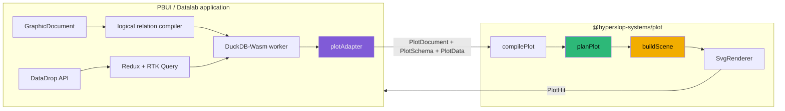
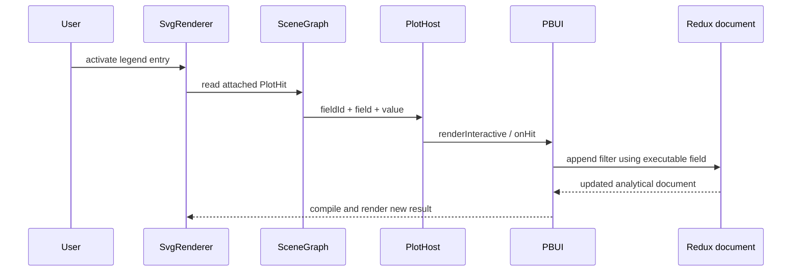

# PROJECT REPORT - Hyperslop Plot v0.2 - From Grammar to Published PBUI Runtime

`@hyperslop-systems/plot` version 0.2.0 is the first published form of the
frontend grammar-of-graphics system used by PBUI's Datalab workbench. The
package is now more than an extracted renderer. It contains a serializable plot
language, a semantic compiler, frontend statistical transformations, visual
planning, a renderer-neutral scene graph, an accessible SVG renderer, React
hosting, Storybook specimens, packaging verification, and an explicit adapter
from PBUI authoring state.

This report explains the completed system as an engineering design. It focuses
on the boundaries that make the implementation extensible without making it
large: the distinction between application documents and plot documents, the
separation of statistics from geometry, the preservation of field identity
through interaction, the staged lowering process, and the rule that a renderer
receives a scene rather than analytical intent.

The earlier note, [[PROJ - Hyperslop Plot - Building a Frontend Grammar of Graphics as a Staged Compiler]],
records the initial architecture and the implementation through the first five
phases. This report begins from the completed system, follows one authored plot
through every stage, and records the real-stack integration and publication
results.

> [!summary]
> - PBUI owns data access, analytical documents, Redux state, DuckDB execution, and user commands. Plot owns visual semantics from a bounded typed result onward.
> - Plot compilation is a sequence of data transformations: authoring document → compiled plot → statistical rows and visual plan → scene graph → SVG.
> - Scientific authoring is stored as a small PBUI recipe and lowered by the adapter into ordinary plot layers. The plot package does not contain application-specific chart modes.
> - Real HTTP-backed validation exercised raw, histogram, summary, regression, boxplot, density, and free-facet output before publishing `@hyperslop-systems/plot@0.2.0`.
> - A 50,000-mark planning and scene-construction baseline averaged approximately 289 ms. Canvas remains a renderer project, not a reason to alter documents or statistics.

## 1. The system boundary

The most important design decision is that Plot does not own the complete data
application. Datalab already has a substantial execution model:

- RTK Query loads datasets and table windows from DataDrop.
- `GraphicDocument` stores the user's analytical document.
- the logical compiler resolves fields and constructs a relation graph.
- DuckDB-Wasm executes relations in a browser worker.
- Redux stores documents, workspaces, tiles, history, and interaction state.
- PBUI presents typed objects and maps gestures to commands.

Moving these responsibilities into a plotting package would create a second
application runtime. It would also make the plot package unusable in a Storybook
fixture, a different React application, or a future server-side export tool.
The package boundary therefore begins only after the application has produced a
typed, bounded row result.



The boundary is bidirectional but narrow. PBUI sends data and declarative visual
intent into Plot. Plot sends typed hit records back when a mark or legend entry
is activated. Plot never dispatches a Redux action and never constructs a
backend filter.

The concrete implementation boundary is primarily:

- Plot: `src/document.ts`, `src/compile.ts`, `src/stats.ts`, `src/plan.ts`,
  `src/scene.ts`, `src/render.ts`, and `src/renderers/svg/SvgRenderer.tsx`.
- PBUI: `packages/datalab-ui/src/appkit/plotAdapter.ts`,
  `packages/datalab-ui/src/model/graphic.ts`, and the Chart and Encoding
  applications.

This is a strict ownership rule. If a new feature needs backend aggregation,
server sampling, or a DuckDB relation, it belongs outside Plot. If it needs a
visual scale, statistical layer, geometry, guide, or scene primitive, it belongs
inside Plot.

## 2. Two documents with different responsibilities

PBUI and Plot both use the word “document,” but their documents describe
different systems.

`GraphicDocument` is the application document. It includes the source,
analytical relation, authoring view, snapshots, coverage, and UI-editable
choices. It must remain meaningful even when no chart is visible.

`PlotDocument` is a rendering-language document. It includes mappings, layers,
statistics, geometries, positions, scales, facets, annotations, and render
limits. It does not know which tile contains it or which DataDrop dataset
produced the rows.

The adapter translates between them:

```text
function adaptGraphicToPlot(graphic, logicalView, result):
    schema = adaptFields(result.fields)
    recipe = graphic.view.analysis
    layers = lowerRecipe(recipe, logicalView.encodings)

    document = {
        format: "hyperslop.plot",
        version: 1,
        id: graphic.id,
        mapping: adaptMappings(logicalView.encodings),
        layers: layers,
        facets: { scales: graphic.view.facetScales },
        render: boundedRenderPolicy(result.coverage)
    }

    data = {
        rows: result.rows,
        coverage: adaptCoverage(result.coverage)
    }

    return renderPlot({ document, schema, data, viewport })
```

The adapter is deliberately the only module that knows both contracts. Plot
does not import PBUI types. PBUI does not construct scene nodes. This prevents a
feature from creating parallel implementations on both sides.

## 3. The staged compiler

A chart renderer can be written as one function that reads rows and emits SVG.
That design makes every intermediate decision implicit. Hyperslop Plot uses
four explicit stages instead.

| Stage | Input | Output | Main responsibility |
|---|---|---|---|
| Compilation | plot document and schema | `CompiledPlot` | Bind fields, resolve inheritance, validate semantic combinations, materialize defaults. |
| Planning | compiled plot, rows, coverage, viewport | `VisualPlan` | Run statistics, train scales, lay out facets, compute geometry, construct guides. |
| Scene construction | visual plan | `SceneGraph` | Convert planned geometry into stable drawing primitives and interaction records. |
| Rendering | scene graph | SVG DOM | Interpret primitives, accessibility metadata, styles, and hit boundaries. |

The stages are observable values. A test can inspect a bound field before rows
exist, inspect regression coefficients before SVG exists, or inspect a legend
hit without simulating a browser event.

### 3.1 Compilation removes authoring ambiguity

Plot fields contain a stable logical ID and an executable row column:

```ts
interface PlotField {
  id: FieldId;
  name: string;
  label?: string;
  column: string;
  semanticType: "quantitative" | "nominal" | "ordinal" | "temporal";
  nullable: boolean;
  unit?: string;
  timezone?: string;
}
```

An author can refer to a field by name when the name is unique. Compilation
resolves that reference to a complete bound field. Downstream code then reads
the bound `column`; it does not perform another name lookup.

This prevents two semantic failures:

1. A rename cannot silently change which row property is read.
2. Two fields with the same display name cannot bind according to iteration
   order.

Ambiguity becomes a diagnostic with a stable code and document path. The
planner never receives an unresolved authoring reference.

### 3.2 Planning makes data-dependent decisions

Planning begins only after compilation succeeds. It applies each layer's
statistic, applies its position adjustment, trains aesthetic and positional
scales, assigns facets, computes panel rectangles, produces axes, and limits
marks according to the compiled render policy.

Conceptually:

```text
for each enabled layer in z-order:
    inputRows = select rows visible to layer
    statisticalRows, metadata = applyStat(layer.stat, inputRows)
    positionedRows = applyPosition(layer.position, statisticalRows)
    extractedValues = resolveMappings(layer.mapping, positionedRows)

train shared or per-facet scales from extracted values
lay out panels inside viewport

for each panel:
    for each layer:
        select panel rows
        map values through scales
        emit planned geometry

merge compatible guide candidates
return VisualPlan
```

Scale training belongs here because it depends on actual values and the
viewport. SVG construction does not. This distinction is what permits fixed,
free-x, free-y, and fully free facet scales to share one renderer.

### 3.3 Scene construction removes plot semantics

The scene contains groups, rectangles, lines, paths, circles, symbols, and
text. Coordinates are already in viewport space. Styles are already resolved
to CSS values or custom-property references. A scene node may carry a
`PlotHit`, but it does not carry a Redux callback.

The SVG renderer is therefore small. It switches on the primitive kind and
creates the corresponding SVG element. A future Canvas renderer will traverse
the same nodes and issue drawing commands. It will not need to understand
histograms, confidence intervals, field binding, or facet-scale policy.

## 4. Layers unify ordinary and scientific plots

The unit of composition is a layer:

```ts
interface LayerSpec {
  id: LayerId;
  enabled?: boolean;
  inheritMapping?: boolean;
  mapping?: MappingSpec;
  stat: StatSpec;
  geom: GeomSpec;
  position: PositionSpec;
}
```

This representation avoids a growing catalog of chart classes. A grouped
regression plot is not a special renderer. It consists of three ordinary
layers:

1. identity-stat point geometry for observations;
2. OLS-stat ribbon geometry for confidence bounds;
3. OLS-stat line geometry for fitted values.

A target line is another layer with a constant y mapping and rule geometry. It
participates in z-order, facets, scale-domain extension, diagnostics, and scene
construction through the same paths as every other layer.

The separation among `stat`, `geom`, and `position` is necessary because each
answers a different question:

- `stat` determines which values exist.
- `geom` determines which visual primitive consumes those values.
- `position` modifies overlap after values exist.

Stacking bars is not a statistic. Computing bin counts is not geometry.
Treating them independently makes combinations explicit and testable.

## 5. Scientific authoring in PBUI

PBUI does not expose the complete layer grammar directly. That would make a
common operation require editing several low-level objects. It stores a bounded
analysis recipe in the application document and lets the adapter lower it.

The authoring surface currently provides:

- raw identity display;
- histogram with bounded bin-count presets;
- summary intervals using standard error or standard deviation;
- grouped ordinary least squares with configurable confidence;
- Tukey boxplots;
- Gaussian kernel density estimates;
- fixed, free-x, free-y, and free facet scales.

The recipe is durable application intent. The resulting layers are derived.
This means a future plot-package improvement can change internal layer details
without migrating PBUI documents, provided the recipe semantics remain stable.

### 5.1 Summary intervals

For a group of observations $x_1,\ldots,x_n$, the summary statistic computes:

$$
\bar{x} = \frac{1}{n}\sum_{i=1}^{n}x_i
$$

and the sample standard deviation:

$$
s = \sqrt{\frac{\sum_{i=1}^{n}(x_i-\bar{x})^2}{n-1}}
$$

A standard-deviation interval uses $m s$. A standard-error interval uses
$m s/\sqrt{n}$. The method and multiplier are recorded in statistical
metadata because equal-looking error bars can represent different quantities.

### 5.2 Histogram binning

The bin statistic emits derived bin centers, starts, ends, and counts. The
maximum input value is assigned explicitly to the final bin:

```text
index = min(
    binCount - 1,
    max(0, floor((value - minimum) / binWidth))
)
```

This gives deterministic boundary behavior and prevents a maximum value from
falling outside the half-open bins used before the final boundary.

### 5.3 Grouped OLS

Regression is computed independently for each grouping value. For each group:

$$
\hat{\beta}_1 =
\frac{\sum_i(x_i-\bar{x})(y_i-\bar{y})}
     {\sum_i(x_i-\bar{x})^2}
$$

$$
\hat{\beta}_0 = \bar{y} - \hat{\beta}_1\bar{x}
$$

The output includes fitted values and confidence bounds at sorted observed
x-coordinates. Metadata includes intercept, slope, $R^2$, residual standard
error, count, confidence level, and the interval assumption. The frontend
implementation is intentionally bounded; it is a reproducible visual statistic,
not a general modeling API.

### 5.4 Boxplots and density

Boxplots use R7 quantiles and Tukey whiskers. The statistic emits quartiles,
median, and observed whisker endpoints so the geometry stage does not recompute
statistics.

Density uses a Gaussian kernel over a deterministic grid. Explicit bandwidth is
accepted; otherwise the implementation derives a robust spread from standard
deviation and interquartile range and applies the sample-size term. Degenerate
groups receive a finite fallback rather than producing invalid scene
coordinates.

## 6. Interaction requires two forms of field identity

The most important integration defect appeared in legend filtering. Plot
correctly preserved a stable field ID, but PBUI's filter predicate executes
against physical row properties. Passing the stable ID as the predicate column
produced a valid filter against a property that no row contained, so the plot
became empty.

The fix was to preserve both values:

```ts
interface LegendHit {
  kind: "legend";
  fieldId: FieldId;  // semantic identity
  field: string;     // executable row property
  value: string;
  label: string;
}
```

PBUI uses `field` when constructing the executable predicate and retains
`fieldId` when it needs logical identity. Neither value can replace the other.

The complete interaction path is:



The scene is application-neutral throughout this sequence. It reports what was
hit. PBUI decides that the hit means “keep,” “exclude,” or “filter.”

## 7. Facets, scales, and guide layout

Facet scale policy changes how scale domains are trained:

- `fixed` trains x and y once from all panels;
- `free-x` trains x per panel and shares y;
- `free-y` shares x and trains y per panel;
- `free` trains both per panel.

Explicit domains take precedence over free-scale inference. This rule matters
for scientific comparison: an author who sets a domain has requested a
particular coordinate system and should not have it replaced by facet policy.

Real PBUI screenshot review found two layout defects after the semantics were
already correct. A derived plot title was always rendered, but the planner
reserved title space only when the document contained an explicit title. In a
faceted plot, the first strip label consequently occupied the same line as the
derived title. The shared legend was positioned after the first panel rather
than after the complete grid, placing it inside the second panel column.

The final layout rule is direct:

```text
single-panel top margin = 48
faceted top margin      = 60
legend x                = max(panel.x + panel.width) + 24
```

Regression tests assert both the facet-strip reservation and guide placement.
This defect is significant because it demonstrates where visual planning ends:
the correct fix was in panel and guide coordinates, not CSS and not the SVG
renderer.

## 8. Theme integration

Plot can render as a standalone package, but its primary use is inside PBUI.
The default theme therefore inherits typography and surface context instead of
installing an unrelated product font.

The public theming contract uses CSS custom properties and preset host classes.
It supports:

- an embedded daylight mode that follows the containing application;
- a publication-oriented mode;
- the Hyperslop dark palette;
- direct overrides for background, foreground, muted text, grid lines,
  categorical colors, and font sizes.

The Hyperslop palette is:

```css
:root {
  --bg: #050607;
  --fg: #f3f3ef;
  --green: #2db878;
  --purple: #805bd7;
  --yellow: #f2ad00;
  --red: #ef4038;
}
```

PBUI uses daylight mode in the current workbench. The plot package retains
toggleable presets because Storybook, publication output, and later hosts do
not share PBUI's surrounding surface.

## 9. Verification against the real stack

The final integration was tested against the merged `go-go-datadrop` main
branch rather than only fixture data. The backend ran with the existing
host-development ZITADEL configuration, a fresh SQLite database, a fresh blob
root, and seeded welcome datasets.

The browser loaded workspace `6·operations`, selected the 40-row
`production-batches` dataset, and exercised:

- mass versus yield points;
- mass histograms;
- grouped density curves;
- per-line OLS fits and confidence ribbons;
- per-line summary intervals;
- per-line boxplots;
- fixed and free facets.

This validation covered the complete production path:

```text
DataDrop HTTP table
  -> RTK Query
  -> PBUI source and logical document
  -> plot adapter
  -> published plot contracts
  -> statistical planning
  -> scene graph
  -> SVG
  -> PBUI presentations and menus
```

The final clean browser reload reported zero errors. The automated gates were:

| Component | Result |
|---|---|
| Plot tests | 65/65 across 13 files |
| Plot typecheck, lint, and build | passed |
| Plot static Storybook | passed |
| Plot clean React 19 tarball consumer | passed |
| Datalab tests before registry cutover | 403/403 across 37 files |
| Datalab typecheck and browser/node/declaration builds | passed |
| Go backend tests | all packages passed |
| Go backend build | passed with VCS stamping disabled for the multi-repository workspace |

After installing the immutable registry artifact, one PBUI wall-clock test
proved unstable. It requires thirteen schema resolutions to complete in less
than 5 ms. Full-suite runs measured 30.16 ms and 8.28 ms, while the isolated
test passed; the other 402 tests passed. This is a benchmark-design problem, not
a functional plot failure. An absolute 5 ms threshold inside a parallel test
suite measures scheduler and garbage-collection noise along with the target
operation. The product requirement does not currently depend on this
microsecond-scale budget.

## 10. Publication and immutable consumption

Version 0.2.0 was published to the private GitHub Packages registry through the
repository's guarded workflow. The workflow performed install, typecheck,
lint, tests, package build, Storybook build, clean tarball consumer validation,
and publication.

The release workflow completed successfully at GitHub Actions run
`30555616042`, from plot commit `78dc927`.

PBUI was then changed from:

```json
"@hyperslop-systems/plot": "link:../../../plot"
```

to:

```json
"@hyperslop-systems/plot": "0.2.0"
```

The lockfile now contains the GitHub Packages tarball URL and integrity digest,
and pnpm resolves the dependency through its content-addressed store rather
than through a workspace link. This changes the integration test from “PBUI can
compile against the neighboring checkout” to “PBUI can compile against the
artifact another consumer receives.”

## 11. Performance baseline and the Canvas boundary

A direct Node measurement processed 50,000 grouped point rows after two warmup
passes. Five samples produced:

| Stage | Observed range |
|---|---:|
| Compilation | 0.17–0.50 ms |
| Planning | 217–304 ms |
| Scene construction | 14–29 ms |
| Total | 243–332 ms |

Mean total compile-plan-scene time was approximately 289 ms. The output
contained 50,000 marks and 50,028 root scene nodes.

Planning dominates CPU time. The browser cost of creating and updating 50,000
SVG elements is a separate concern and is expected to be larger than scene
construction. The current default mark limit remains lower because dense
interactive SVG is not the primary operating mode.

Phase 6 should add Canvas only at the established scene boundary:

```text
PlotDocument
    -> compile
    -> statistics and planning
    -> SceneGraph
        -> SvgRenderer
        -> CanvasRenderer
```

Canvas should not introduce a second planner, a second statistics library, or a
Canvas-specific document. Hit testing can build an index from scene nodes while
preserving the existing `PlotHit` contract.

## 12. Failure modes and engineering rules

Several rules are now supported by implementation evidence.

### Do not let renderers bind fields

Binding in SVG or Canvas recreates ambiguity after compilation. Renderers must
receive coordinates and interaction payloads that are already resolved.

### Do not use stable IDs as executable columns

Stable IDs identify logical fields. Row predicates require physical columns.
Interaction records that cross into an application may need both.

### Do not store generated layers when a stable recipe is sufficient

PBUI's scientific modes are durable product intent. Generated layers are a
compiler result. Persisting both creates synchronization and migration
requirements without adding information.

### Do not silently treat bounded data as complete

Coverage crosses the package boundary explicitly. Statistics and metadata must
retain enough information for the UI to disclose incomplete source windows.

### Do not repair planning defects with renderer CSS

Overlapping panels, titles, strips, and guides are coordinate-planning defects.
CSS adjustments can conceal one viewport while leaving the underlying plan
invalid for another renderer.

### Do not add Canvas before preserving the scene contract

Canvas is useful for dense output, but it must interpret the same scene. A
Canvas-specific analytical path would double the most complex parts of the
system.

## 13. Current status and next work

Phases 1 through 5 are complete:

1. staged compilation and basic point/line output;
2. PBUI visual parity and removal of the legacy renderer;
3. ordered layers and rule annotations;
4. scientific statistics, intervals, positions, regression, boxplots, and density;
5. scale families, free facets, guides, label collision policy, and themes.

Version 0.2.0 is published and PBUI resolves it as an immutable private package.
The next architectural phase is a Canvas renderer and hit-testing index, but it
should be scoped by measured target workloads. The 50,000-mark baseline
identifies planning and DOM volume as separate costs; it does not justify
changing the document or statistical contracts.

Near-term work should remain narrow:

- commit the PBUI dependency and lockfile update after accepting or replacing
  the unstable 5 ms wall-clock assertion;
- add Canvas behind the existing `SceneGraph` interface;
- compare SVG and Canvas using identical documents, data, viewports, and scene
  metadata;
- preserve Storybook as the visual acceptance surface for every new renderer;
- add authoring controls only for workflows required by Datalab rather than
  exposing the complete low-level grammar at once.

## 14. Code and document index

The principal implementation files are:

- `/home/manuel/workspaces/2026-07-28/split-datadrop/plot/src/document.ts`
  — public grammar and stable identifiers.
- `/home/manuel/workspaces/2026-07-28/split-datadrop/plot/src/compile.ts`
  — binding, validation, inheritance, and compiled defaults.
- `/home/manuel/workspaces/2026-07-28/split-datadrop/plot/src/stats.ts`
  — scientific transformations and provenance metadata.
- `/home/manuel/workspaces/2026-07-28/split-datadrop/plot/src/plan.ts`
  — statistics orchestration, scales, facets, geometry, and guides.
- `/home/manuel/workspaces/2026-07-28/split-datadrop/plot/src/scene.ts`
  — renderer-neutral primitives and interaction records.
- `/home/manuel/workspaces/2026-07-28/split-datadrop/plot/src/render.ts`
  — public orchestration and outcome.
- `/home/manuel/workspaces/2026-07-28/split-datadrop/plot/src/renderers/svg/SvgRenderer.tsx`
  — accessible SVG interpretation.
- `/home/manuel/workspaces/2026-07-28/split-datadrop/pbui/packages/datalab-ui/src/appkit/plotAdapter.ts`
  — the only PBUI-to-Plot semantic adapter.
- `/home/manuel/workspaces/2026-07-28/split-datadrop/pbui/packages/datalab-ui/src/model/graphic.ts`
  — durable PBUI authoring recipes and logical field identity.

The ticket workspace is:

`/home/manuel/workspaces/2026-07-28/split-datadrop/plot/ttmp/2026/07/29/HSPLOT-001--build-the-hyperslop-grammar-of-graphics-frontend-package`

Its architecture guide explains the phased plan, its source directory preserves
the supplied plotting-suite research, and its investigation diary records
commands, failures, screenshots, validation gates, and implementation commits.

## Closing

Hyperslop Plot v0.2 establishes one visual semantics pipeline for PBUI. Field
binding occurs once. Statistics produce explicit derived rows. Scales and
facets are planned independently of SVG. Interaction preserves both logical and
executable identity. Scientific modes are application recipes lowered into
ordinary grammar layers. The published package is consumable without a sibling
checkout.

These properties define the system more strongly than its current geometry
catalog. New statistics, authoring controls, and renderers can be added at
their existing boundaries. The next phase can concentrate on dense rendering
because the document, compiler, planner, scene, and PBUI integration no longer
need to be redesigned first.
