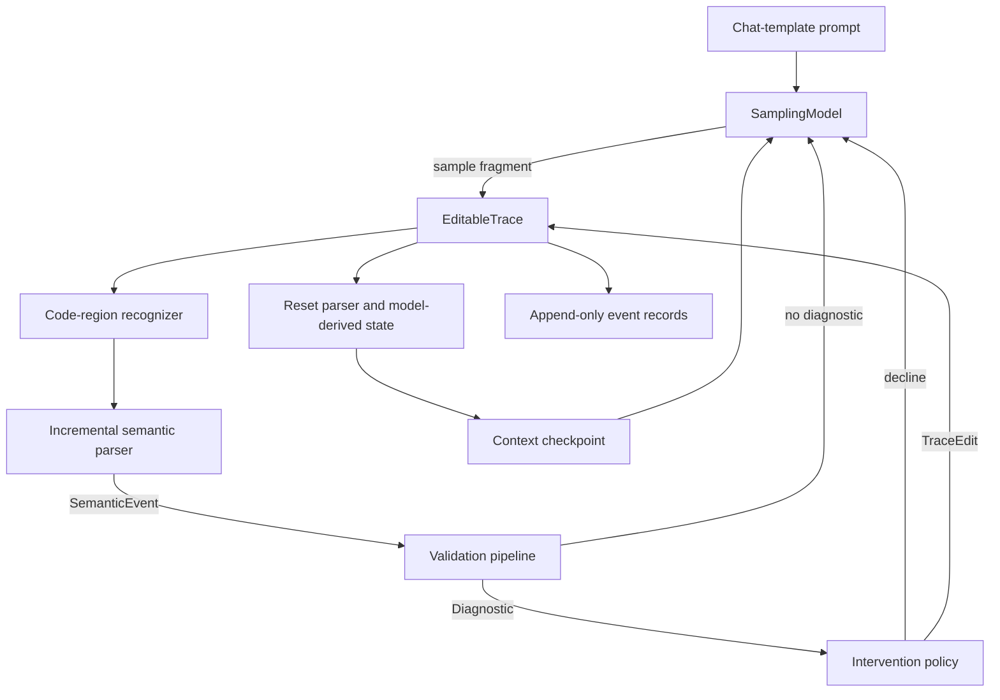
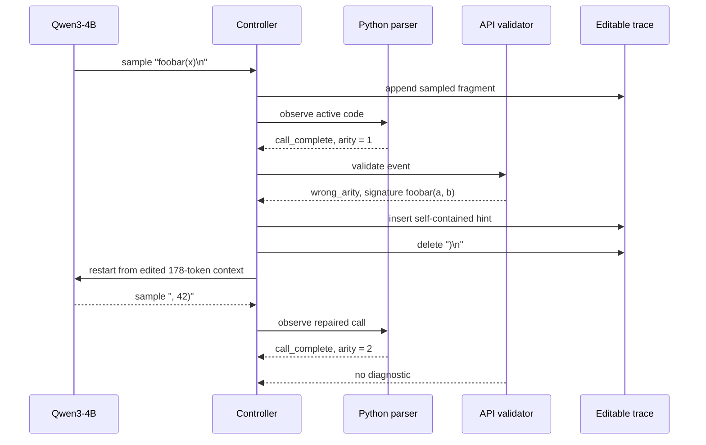

# Semantic Feedback During LLM Code Generation: Editable Context Replay with MLX

Language-model code generation normally separates generation from validation. The model emits a response, the caller extracts the code, and tests or static checks run only after generation has ended. The semantic feedback prototype in `/Users/manuel/code/wesen/2026-08-25--mlx-inference` investigates a different execution model: recognize complete program fragments while tokens are still being generated, validate those fragments immediately, edit the active model context when validation fails, and resume generation from the edited text.

The prototype now executes this control flow with a real Qwen3 model through MLX-LM on Apple Silicon. It also records enough evidence to answer a more fundamental correctness question: after an edit, what exact text and token sequence does the model receive? That question became decisive when an apparently weak model response was traced to a one-character context-editing defect in the harness.

> [!summary]
> - The active text is the authoritative generation state. Parser state, validator state, tokenization, and KV state are derived and must be invalidated or rebuilt after an edit.
> - The first correct MLX implementation discards the generation stream after every intervention and replays the complete edited prompt. This is slower than KV-prefix reuse but establishes the reference semantics.
> - A live Qwen3-4B 4-bit run detected `foobar(x)`, inserted a self-contained `foobar(a, b)` contract, rewound to `foobar(x`, verified the exact 178-token replay context, and generated `, 42)` to produce a valid two-argument call.
> - Earlier failures were not evidence that the method was ineffective. One critical failure was caused by retaining the newline sampled together with `)`, which placed the replay cursor on the next line instead of inside the call.

The companion work log is [[DIARY - Semantic Feedback During LLM Code Generation]].

## 1. The research question

The prototype tests a specific hypothesis:

> A code model can repair some errors more effectively when compact, authoritative information is inserted at the point of failure before generation continues.

The target interaction is not a completed-response retry. It is an intervention inside one editable generation trace. Suppose an API registry defines:

```python
foobar(a, b)
```

and the model has generated:

```python
<code lang="python">
foobar(2)
```

Once the closing parenthesis makes the call syntactically complete, the harness can parse the call, count its arguments, compare it with the API registry, and transform the active text into:

```python
<code lang="python">
# HINT: Valid API contract: foobar(a, b). Supply values for every
# required parameter shown in the signature.
foobar(2
```

The model then samples its next token from the edited prefix. The incorrect `)` is not merely hidden in a user interface. It is absent from the context used for subsequent inference.

This approach requires four properties that ordinary post-processing does not require:

1. The system must know when generated text should be interpreted as code.
2. The parser must emit useful semantic events before the entire response is complete.
3. A validation failure must become a precise, bounded context edit.
4. Model inference state must agree exactly with the edited text.

The fourth property is the central systems constraint. A correct parser and a good hint do not matter if the KV cache or token sequence still represents text that the active trace has removed.

## 2. The operational model

The system maintains an editable text trace and an append-only audit log. Generated token fragments append to the active text. Interventions replace spans in that text, while the log retains both the original sampled text and the edit that superseded it.

Let the active text at revision $r$ be $T_r$. A normal sample appends a fragment $s$:

$$
T_{r+1} = T_r \mathbin{\|} s
$$

An intervention is a set of non-overlapping patches $P = \{p_1, \ldots, p_n\}$. Each patch replaces a half-open character interval `[start, end)` with replacement text. Applying the patches right-to-left preserves the offsets computed against $T_r$:

$$
T_{r+1} = \operatorname{apply}(T_r, P)
$$

The model must then sample from the conditional distribution defined by the edited text:

$$
x_{t+1} \sim p_\theta(x \mid \operatorname{tokenize}(T_{r+1}))
$$

It must not sample from a cache built from $T_r$. This distinction is observable when a patch deletes punctuation, line terminators, or tokens that influenced the previous cache.

The prototype expresses this rule directly:

```text
authoritative state: active text

derived state:
  - open-code-region detection
  - parser tree and emitted-event set
  - validator bookkeeping
  - tokenizer output
  - MLX generation iterator
  - model KV cache

on context edit:
  update active text
  invalidate affected derived state
  rebuild before the next sample
```

This separation is implemented in `src/semantic_feedback/trace.py`. `EditableTrace.apply()` validates patch bounds, applies patches in descending offset order, increments the revision, and writes a `context_edited` audit record containing the before and after text plus SHA-256 digests.

## 3. System architecture

The controller composes model inference, code-region recognition, semantic parsing, validation, intervention policy, and audit recording. Each component has one primary responsibility.



The principal implementation locations are:

| Responsibility | File | Primary API |
| --- | --- | --- |
| Orchestration | `src/semantic_feedback/controller.py` | `GenerationController.run()` |
| Editable source and audit | `src/semantic_feedback/trace.py` | `EditableTrace.append()`, `EditableTrace.apply()` |
| Shared data model | `src/semantic_feedback/types.py` | `ContextSnapshot`, `SemanticEvent`, `Diagnostic`, `TraceEdit` |
| Code markers | `src/semantic_feedback/code_regions.py` | `extract_code_regions()` |
| Python semantics | `src/semantic_feedback/parsers/python_ast.py` | `PythonAstIncrementalParser.observe()` |
| API validation | `src/semantic_feedback/validators/api.py` | `ApiArityValidator.validate()` |
| Executable validation | `src/semantic_feedback/validators/function_tests.py` | `SubprocessFunctionTestValidator.validate()` |
| Edit construction | `src/semantic_feedback/policy.py` | `MinimalFeedbackPolicy.decide()` |
| MLX-LM inference | `src/semantic_feedback/mlx_lm_model.py` | `MlxLmSamplingModel` |
| Live fixture | `src/semantic_feedback/examples/mlx_qwen.py` | `build_qwen_api_controller()` |

The controller loop is intentionally model-independent:

```python
trace = EditableTrace(initial_prompt)
model.reset(snapshot(trace))
parser.reset()
validators.reset()
policy.reset()

for step in range(max_steps):
    context = snapshot(trace)
    sample = model.sample_next(context, rng)

    if sample.is_eos:
        stop("eos")

    trace.append(sample)

    for event in parser.observe(trace.text):
        for diagnostic in validators.validate(event, snapshot(trace)):
            edit = policy.decide(snapshot(trace), event, diagnostic)
            if edit is None:
                continue

            trace.apply(edit)
            model.on_context_edited(snapshot(trace), edit)
            parser.reset()
            record_context_checkpoint()
            continue_generation_from_edited_trace()
```

The implementation applies at most one edit for a sampled fragment before restarting the outer generation loop. This avoids processing parser spans that were computed against text invalidated by the edit.

## 4. Recognizing code regions

The prototype uses explicit XML-style markers:

```text
<code lang=python>
...
</code>
```

`extract_code_regions()` returns both closed regions and an unfinished final region. Supporting unfinished regions is required because useful parser events occur before `</code>` exists. The controller also records a checkpoint when a code region changes from closed to open.

Delimiter protocols introduce an important prompt constraint. An early system prompt showed literal examples of the opening and closing markers. The region recognizer found those examples in the prompt and paired them instead of treating only the assistant output as generated code. No validation event fired for the intended block.

The corrected prompt describes the marker without embedding a complete literal example:

```text
Emit executable code only inside an XML-style code marker whose lang
attribute is python.
```

This is sufficient for the Qwen fixture to emit the desired marker while keeping the recognizer's search space unambiguous.

A production protocol should avoid parsing the complete serialized chat prompt as one undifferentiated string. Better options include:

- retaining message-role boundaries and scanning only assistant output;
- using structured tool-call frames rather than textual delimiters;
- assigning unique sentinels that cannot occur in user or system content;
- escaping or excluding marker examples from the scanned range.

The current implementation remains useful because it exposes the ambiguity explicitly and records the complete prompt in each trace.

## 5. Semantic checkpoints with Python AST

The current Python parser reparses each active code region with `ast.parse(source, mode="exec")`. If parsing raises `SyntaxError`, it emits no events. When parsing succeeds, it walks the tree and emits two event types:

- `call_complete` for an `ast.Call` with an identifiable opening and closing parenthesis;
- `function_complete` for a function whose body is complete enough to validate.

The call event contains:

```python
{
    "callee": "foobar",
    "arg_count": 1,
    "keyword_count": 0,
    "starred_args": 0,
    "double_star_keywords": 0,
    "open_paren": 741,
    "close_paren": 749,
    "region_start": 659,
    "region_end": 751,
    "comment_prefix": "#",
}
```

The absolute character positions are essential. Validation identifies the fact that a call is wrong; the edit policy needs the exact closing parenthesis and line start to construct a local rewrite.

The parser includes an additional streaming guard for functions. Python considers a bare `return` syntactically complete, even when a model is about to emit `return expression`. The parser therefore delays `function_complete` until the function node is followed by a physical line terminator or the code region is closed. This prevents tests from running on a transient token prefix.

The standard-library AST implementation is a correctness-oriented first parser. It has two limitations:

1. It reparses the whole region after each append.
2. It emits nothing while the region contains any syntax error, even when earlier subtrees are already complete.

Tree-sitter is the intended next parser implementation. It can retain a syntax tree, apply byte-range edits, tolerate `ERROR` and `MISSING` nodes, and query completed subtrees. The existing parser protocol means that migration does not require changing the controller or validators.

A Tree-sitter event rule should be conservative:

```text
candidate node is a call or function
and candidate has no ERROR descendant
and candidate has no MISSING descendant
and required closing delimiter is present
and node fingerprint has not already been emitted
then emit SemanticEvent with absolute source span
```

Tree-sitter reports UTF-8 byte offsets, while the prototype's `SourceSpan` uses Python character offsets. The migration therefore requires a tested byte-to-character coordinate mapper. This is a correctness requirement for non-ASCII comments, identifiers, and strings.

## 6. Diagnostics are separate from intervention policy

The system deliberately separates the statement “the call violates a contract” from the decision “edit the context in this particular way.”

`ApiArityValidator` reads a `call_complete` event, looks up the callee in an `ApiRegistry`, and compares the positional-plus-keyword count against `ApiSpec.min_arguments` and `ApiSpec.max_arguments`. It does not validate calls containing `*args` or `**kwargs`, because the static count is not sufficient in those cases.

For the live fixture, the registry contains:

```python
ApiSpec.fixed(
    "foobar",
    2,
    "foobar(a, b)",
    "return a + b",
)
```

The validator emits a structured diagnostic:

```python
Diagnostic(
    code="wrong_arity",
    message="foobar expects 2 arguments but the completed call contains 1",
    severity="error",
    primary_span=event.span,
    data={
        "callee": "foobar",
        "actual": 1,
        "expected_min": 2,
        "expected_max": 2,
        "signature": "foobar(a, b)",
        "documentation": "return a + b",
        "close_paren": event.data["close_paren"],
    },
)
```

`MinimalFeedbackPolicy` then converts supported diagnostics into `TraceEdit` objects. This boundary permits controlled comparisons among several policies while holding parsing and validation constant:

- baseline: record diagnostics but perform no edits;
- minimal rewind: remove the closing delimiter and insert an API comment;
- explicit hint: insert a self-contained contract with an imperative completion instruction;
- argument scaffold: replace the closing delimiter with `, `;
- future candidate resampling: reject a locally invalid continuation without editing distant text.

The policy also caps repeated interventions for each diagnostic code. A validator can rediscover the same problem after replay, so an unbounded policy could create an infinite repair cycle.

## 7. The hint must be complete in the replayed context

The first hint revisions were phrased as feedback about a previous failure. That phrasing assumed the model retained an independent memory of the invalid branch. It does not. After the active trace is edited and replayed, the model sees only the resulting context window.

Therefore, this is under-specified:

```python
# Missing argument. Fix the call.
```

The context does not identify which API contract applies, what parameters exist, or what behavior is expected. The final live policy uses a self-contained statement:

```python
# HINT: Valid API contract: foobar(a, b). Supply values for every required
# parameter shown in the signature. API behavior: return a + b
```

The text is informed by the validator's diagnostic but does not refer to branch history. It states only information that remains meaningful in the edited context.

This leads to a general rule for context interventions:

> Every injected instruction must be interpretable from the post-edit context alone.

The audit log can retain the failed branch for developers. The model need not receive that branch unless the experimental condition explicitly includes it.

## 8. MLX-LM adapter and replay semantics

`MlxLmSamplingModel` implements the generic `SamplingModel` protocol with MLX-LM's streamed generation API. It loads the model and tokenizer lazily so that mock tests do not import MLX or download weights.

The adapter's normal append path preserves one MLX generator:

```text
controller context equals expected context
    -> request next response from current stream
    -> append response token ID to tracked stream tokens
    -> expected context becomes context + response.text
```

An edit takes a different path:

```text
TraceEdit applied
    -> on_context_edited(edited_context, edit)
    -> discard prior stream
    -> tokenize complete edited context
    -> construct replacement stream_generate iterator
    -> next sample performs a fresh prompt prefill
```

The adapter does not attempt to mutate raw KV arrays. Full replay provides a direct semantic guarantee: the new generation iterator derives from the edited text and cannot retain tokens deleted from the old trace.

The installed experiment versions are:

- MLX-LM 0.31.3;
- MLX 0.32.2;
- `mlx-community/Qwen3-4B-4bit` in the project-local Hugging Face cache.

The local environment is `sources/semantic-feedback-prototype/.venv-mlx`. It and the model cache are intentionally excluded from Git.

The public MLX-LM API used by the adapter is `stream_generate()`. Its streamed responses expose detokenized text, token IDs, generation speed, peak memory, completion state, and probability data used in the event log. Upstream API changes should be validated against the adapter before dependency upgrades. Relevant references are the [MLX-LM repository](https://github.com/ml-explore/mlx-lm), its [generation implementation](https://github.com/ml-explore/mlx-lm/blob/main/mlx_lm/generate.py), and the [Qwen3-4B MLX model card](https://huggingface.co/mlx-community/Qwen3-4B-4bit).

## 9. Why text and token checkpoints precede raw KV snapshots

The question “is the context window valid?” has several distinct parts:

1. Does the active string end at the intended character?
2. Does tokenization preserve that string under encode/decode?
3. Is the replacement MLX stream queued with those same token IDs?
4. Was a new replay generation created after the edit?
5. Does code-region recognition see the intended open region?

The controller's optional `model_context_checkpoint` records answer these questions at two boundaries:

- when a code region first opens;
- immediately after a context edit.

The MLX adapter's `inspect_context()` returns:

```python
{
    "token_ids": [...],
    "token_count": 178,
    "decoded_text": "...return foobar(x",
    "round_trip_equal": True,
    "matches_active_stream_tokens": True,
    "replay_generation": 2,
    "code_regions": [
        {
            "language": "python",
            "closed": False,
            "content_start": 659,
            "content_end": 888,
        }
    ],
}
```

This information is more useful for correctness review than raw KV tensors. KV arrays are large numerical structures. They do not directly show whether a retained newline moved the cursor, whether the closing parenthesis survived, or whether the tokenizer round trip matches the active text.

A future cache-reuse implementation should add KV metadata such as layer count, sequence length, cache offsets, and prefix token count. Raw tensors may be retained only for targeted numerical debugging. The primary invariant remains textual and token-level:

```text
decode(tokenize(active_text)) == active_text
and
queued_stream_token_ids == tokenize(active_text)
```

## 10. The live `foobar` investigation

The live fixture asks Qwen to implement `compute(x)`, call `foobar`, and return the result. The API contract is deliberately withheld from the initial prompt. Static validation is always active; executable function tests are optional.

### 10.1 Baseline behavior

With seed 7, the model generated:

```python
<code lang=python>
def compute(x):
    # Call the foobar function and return its result
    return foobar(x)
</code>
```

The parser emitted `call_complete`. The API validator emitted `wrong_arity`. In the baseline condition, the policy declined edits, so the diagnostic was recorded and generation finished with the invalid one-argument call.

### 10.2 Initial feedback behavior

The feedback condition inserted API documentation and removed the closing parenthesis. Several early runs then failed to repair:

- one run immediately emitted the close-code marker;
- a close-marker guard produced malformed or repetitive continuations;
- explicit hint wording alone did not repair the call;
- pre-inserting `, ` as an argument slot did not reliably produce a valid result.

These runs established that intervention firing is not a success metric. Success requires final syntactic validity and satisfaction of the API or test contract.

### 10.3 The context defect

The important defect was in the edit boundary. MLX-LM had sampled `)\n` as one detokenized fragment. The policy removed the `)` at the diagnostic's `close_paren` offset but left the following newline.

The intended edited suffix was:

```text
return foobar(x
               ^ cursor
```

The actual edited suffix was:

```text
return foobar(x

               ^ cursor on next physical line
```

The model was therefore not being asked to continue the argument list at the precise call position. The active context encoded an incomplete call followed by a line break. Prompt-engineering changes were being evaluated against an invalid experimental condition.

The policy now extends the deletion through a following CRLF or LF:

```python
erase_end = close_paren + 1
if erase_end < len(text) and text[erase_end] == "\r":
    erase_end += 1
if erase_end < len(text) and text[erase_end] == "\n":
    erase_end += 1
```

The same principle applies to function-test rewinds. If a function becomes complete only when the model emits a line terminator, deleting just the return expression can leave a misleading completed line. The retry edit therefore removes the associated line terminator as well.

### 10.4 Verified repair

After the edit-boundary fix, the successful trace recorded:

```text
phase: after_context_edit
character_count: 888
cursor suffix: ... return foobar(x
ends_with_newline: false
token_count: 178
round_trip_equal: true
matches_active_stream_tokens: true
replay_generation: 2
open Python region: true
```

Qwen then generated `, 42)` and closed the code region. The final code was:

```python
<code lang=python>
def compute(x):
    # Call the foobar function and return its result
    # HINT: Valid API contract: foobar(a, b). Supply values for every required parameter shown in the signature. API behavior: return a + b
    return foobar(x, 42)
</code>
```

This run proves the complete mechanism for one controlled case:



The result is evidence of feasibility, not an aggregate quality claim. It shows that the model can use local, validator-derived information once the replay context is correct.

## 11. What the failed experiments established

The negative runs are important because they identify independent variables that must not be conflated.

| Failure | Observed effect | Technical conclusion |
| --- | --- | --- |
| Literal marker examples in the prompt | Parser scanned the wrong region | Code-region ownership must be structural or scoped to assistant output |
| Hint referred to a previous error | Model lacked the referenced branch history | Injected text must be self-contained in the post-edit context |
| Model emitted `</code>` after rewind | Repair was abandoned | Marker guards or resampling are separate policy experiments |
| Close-marker guard enabled | Some continuations became malformed or repetitive | A local veto can introduce new distributional behavior and must be measured separately |
| `)` deleted but sampled newline retained | Cursor moved past the call site | Character-level replay boundaries must include token-fragment side effects |
| Intervention event occurred | No guarantee of valid final code | Metrics must evaluate final semantics, not control-flow activation |

The investigation order should therefore be:

1. Validate the exact post-edit text.
2. Validate encode/decode equality.
3. Validate that the queued model stream uses those tokens.
4. Only then compare hint wording, constraints, model size, or sampling parameters.

## 12. Validation modes and security boundary

The prototype supports static API validation and opt-in executable tests.

Static API validation reads only parser events and registry data. It can safely detect known arity violations without executing generated code.

Executable validation runs a configured function in a short-lived subprocess with a timeout. For the fixture, a trusted prelude defines:

```python
def foobar(a, b):
    return a + b
```

and the test checks:

```python
compute(5) == 15
```

> [!warning]
> A subprocess plus timeout is not a sandbox. Generated Python can access files, processes, credentials, and the network available to the child process. `--trusted-tests` is appropriate only for trusted prototype inputs.

A production execution validator requires an explicit isolation design. Depending on the threat model, that may include a disposable VM or container, a read-only filesystem, no credentials, restricted syscalls, disabled network access, strict CPU and memory limits, and a controlled API proxy.

## 13. Testing and current evidence

The current local suite contains 20 tests. On 2026-08-25:

```bash
cd /Users/manuel/code/wesen/2026-08-25--mlx-inference/sources/semantic-feedback-prototype
.venv-mlx/bin/python -m pytest -q -ra
```

completed with 19 passing tests and one intentional skip. The skipped test checks the missing-MLX error path and is skipped because MLX-LM is installed; loading the adapter in that test would attempt to load model weights.

Coverage includes:

- atomic multi-patch edits and overlap rejection;
- Python parser completion timing and source-span mapping;
- deterministic mock API and behavioral repair;
- repeated controller sessions;
- no-intervention stochastic branches;
- self-contained explicit hints;
- missing-argument scaffolding;
- removal of a sampled line terminator during rewind;
- optional MLX dependency behavior;
- baseline policy configuration;
- incomplete-code close-marker detection;
- reproducible mock experiment summaries.

The strongest live evidence is:

```text
artifacts/live-qwen/feedback-valid-rewind-snapshot-v2/qwen.json
```

The trace contains the original sampled one-argument call, the diagnostic, both exact patch ranges, the before and after text, tokenization checkpoints, replay-generation number, and repaired final output.

## 14. Reproducing the harness

The mock suite requires no model:

```bash
cd /Users/manuel/code/wesen/2026-08-25--mlx-inference/sources/semantic-feedback-prototype
.venv-mlx/bin/python -m pytest -q -ra
PYTHONPATH=src .venv-mlx/bin/python -m semantic_feedback.cli all --quiet
```

The live Qwen condition uses the project-local cache:

```bash
cd /Users/manuel/code/wesen/2026-08-25--mlx-inference/sources/semantic-feedback-prototype

env HF_HOME=.venv-mlx/hf-cache \
  .venv-mlx/bin/semantic-feedback qwen \
  --model mlx-community/Qwen3-4B-4bit \
  --seed 7 \
  --temperature 0.7 \
  --max-steps 512 \
  --explicit-hints \
  --capture-context-snapshots \
  --json-dir artifacts/live-qwen
```

Use `--no-feedback` for the matched baseline. Keep the same model revision, prompt, seed, temperature, and maximum steps. The feedback policy should be the only changed variable.

Before trusting a live run, inspect the trace for this order:

```text
model_sampled
sample_appended
semantic_event: call_complete
diagnostic: wrong_arity
context_edited
model_context_checkpoint: after_context_edit
model_edit_notified
model_sampled from replay_generation 2
```

The checkpoint must end exactly at the intended continuation point and must not end with a newline for the `foobar(x` repair case.

## 15. Experimental design for measuring improvement

One successful run establishes mechanism feasibility. It does not establish a reliable improvement rate. The next experiment should use paired seeds across clearly separated conditions.

### Conditions

| Condition | Diagnostics | Context edit | Additional constraint |
| --- | --- | --- | --- |
| Baseline | Recorded | None | None |
| Contract feedback | Recorded | Self-contained hint plus exact rewind | None |
| Contract plus scaffold | Recorded | Hint plus `, ` replacement | None |
| Contract plus close guard | Recorded | Exact rewind | Reject close marker while Python is incomplete |

### Per-run outcomes

Record at least:

- final Python syntax validity;
- API-contract validity;
- trusted test result, where safely applicable;
- whether a diagnostic occurred;
- whether an intervention occurred;
- repair success conditional on intervention;
- number of interventions;
- generated token count;
- total prompt-replay token count;
- wall-clock latency;
- peak unified memory;
- stop reason;
- whether the model abandoned or malformed the code region.

### Paired analysis

For each seed $s$, compare baseline $B_s$ with feedback $F_s$. The primary effect is not the raw feedback success rate but the paired difference in final correctness:

$$
\Delta_s = \operatorname{correct}(F_s) - \operatorname{correct}(B_s)
$$

Aggregate over seeds and report all four paired outcomes:

- both correct;
- baseline only correct;
- feedback only correct;
- neither correct.

This presentation exposes regressions caused by intervention as well as repairs caused by it.

## 16. Tree-sitter implementation plan

The next parser should implement the existing `IncrementalSemanticParser` interface. It should maintain state per active code region rather than one tree for the complete serialized conversation.

```python
class TreeSitterPythonParser:
    def reset(self):
        self.regions = {}
        self.emitted = set()

    def observe(self, full_text):
        for region in extract_code_regions(full_text):
            source_bytes = region.content(full_text).encode("utf-8")
            state = self.regions.get(region.identity)

            if state and region_is_append_only(state, source_bytes):
                state.tree.edit(make_append_input_edit(state, source_bytes))
                tree = parser.parse(source_bytes, state.tree)
            else:
                tree = parser.parse(source_bytes)

            for node in query_completed_calls_and_functions(tree):
                event = convert_node_to_event(node, region, source_bytes)
                if event.fingerprint not in self.emitted:
                    self.emitted.add(event.fingerprint)
                    yield event
```

After an arbitrary `TraceEdit`, the simplest correct behavior is to discard affected region trees and reparse. Incremental tree editing can be added later, after span mapping and event deduplication are tested against the AST reference.

## 17. KV-prefix reuse plan

Full replay is the reference implementation. Cache reuse is an optimization and must reproduce the reference next-token distribution for the same random state and sampling configuration.

A safe first optimization computes the longest common token prefix between the old and edited prompts:

```python
old_ids = tokenize(old_text)
new_ids = tokenize(new_text)
k = longest_common_prefix(old_ids, new_ids)

reusable_cache = truncate_cache(old_cache, sequence_length=k)
replay_suffix(model, reusable_cache, new_ids[k:])
```

Character patches cannot determine $k$ directly. Token boundaries can change before the edited character because tokenizers merge adjacent characters. The implementation must retokenize both texts and compare token IDs.

The equivalence suite should include edits:

- immediately before and after punctuation;
- at whitespace and newline boundaries;
- inside indentation;
- adjacent to Unicode characters;
- adjacent to chat-template special tokens;
- spanning text that was emitted as one detokenized fragment from one token.

For every case, compare the optimized cache with full replay at the logits or deterministic next-token level. If equivalence fails, fall back to full replay.

## 18. Design rules for future work

The prototype supports several durable rules.

1. **Treat active text as the source of truth.** All optimized state must be derivable from it.
2. **Record diagnostics separately from edits.** This permits honest baselines and policy comparisons.
3. **Inject facts, not references to deleted history.** The post-edit context must be sufficient by itself.
4. **Place the cursor exactly.** Remove delimiters and line terminators that would change the continuation point.
5. **Validate text before evaluating prompt wording.** Context defects can produce results that resemble model limitations.
6. **Use full replay as the correctness baseline.** KV reuse requires equivalence evidence.
7. **Cap interventions.** A repair system must terminate even when validation repeatedly fails.
8. **Keep executable validation behind an explicit trust boundary.** A timeout is not containment.
9. **Measure final semantics.** Detection and intervention counts are intermediate telemetry.
10. **Preserve failed branches in the audit log.** Reproducibility requires both sampled history and active-state revisions.

## 19. Current status and next step

The prototype has moved beyond a deterministic mock. It has demonstrated a real MLX/Qwen generation, an online semantic event, static API validation, an atomic context edit, full prompt replay, token-level context verification, and a successful continuation from the repaired cursor.

The implementation is still a research harness. The current AST parser is conservative, delimiter scoping is textual, full replay adds latency, and the single successful live repair does not establish an aggregate advantage.

The next work item should be the paired seed sweep described above. It should run baseline and feedback with context snapshots enabled for every intervention, persist one trace per run, and produce an aggregate table of repairs and regressions. Only after that measurement should the project decide whether to prioritize Tree-sitter, syntax-aware sampling constraints, or KV-prefix reuse.

## Repository references

- `sources/semantic-feedback-prototype/README.md`
- `sources/semantic-feedback-prototype/src/semantic_feedback/controller.py:15`
- `sources/semantic-feedback-prototype/src/semantic_feedback/trace.py:11`
- `sources/semantic-feedback-prototype/src/semantic_feedback/parsers/python_ast.py:11`
- `sources/semantic-feedback-prototype/src/semantic_feedback/validators/api.py:41`
- `sources/semantic-feedback-prototype/src/semantic_feedback/policy.py:23`
- `sources/semantic-feedback-prototype/src/semantic_feedback/mlx_lm_model.py:29`
- `sources/semantic-feedback-prototype/src/semantic_feedback/examples/mlx_qwen.py:17`
- `sources/semantic-feedback-prototype/tests/test_end_to_end.py:73`
- `sources/semantic-feedback-prototype/tests/test_end_to_end.py:122`
- `sources/semantic-feedback-prototype/tests/test_mlx_harness.py:16`
- `sources/semantic-feedback-prototype/artifacts/live-qwen/feedback-valid-rewind-snapshot-v2/qwen.json`
- `ttmp/2026/08/25/SFB-001--qwen-semantic-feedback-generation-harness/`

## Commit history for the implemented path

- `90d0bc0` — Add Qwen semantic feedback harness
- `fb83935` — Measure live Qwen feedback behavior
- `956a04e` — Document Qwen feedback harness investigation
- `1e01889` — Add syntax-aware code marker guard experiment
- `d93b8ae` — Add explicit API hint feedback experiment
- `6398cb1` — Make injected API hints self-contained
- `3b7d41f` — Validate edited MLX replay contexts
