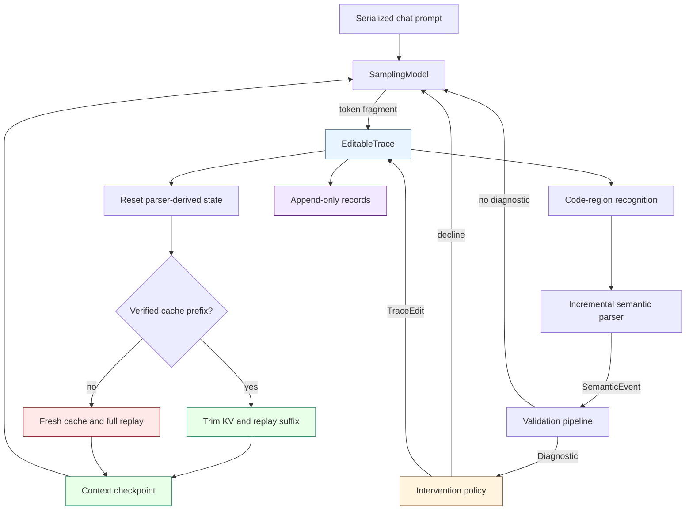
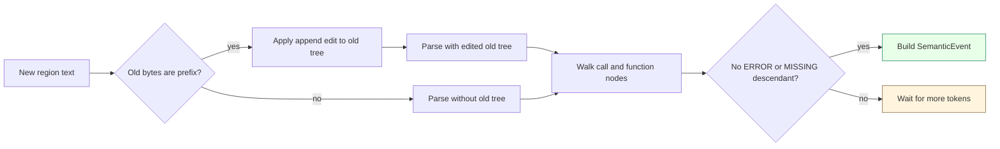
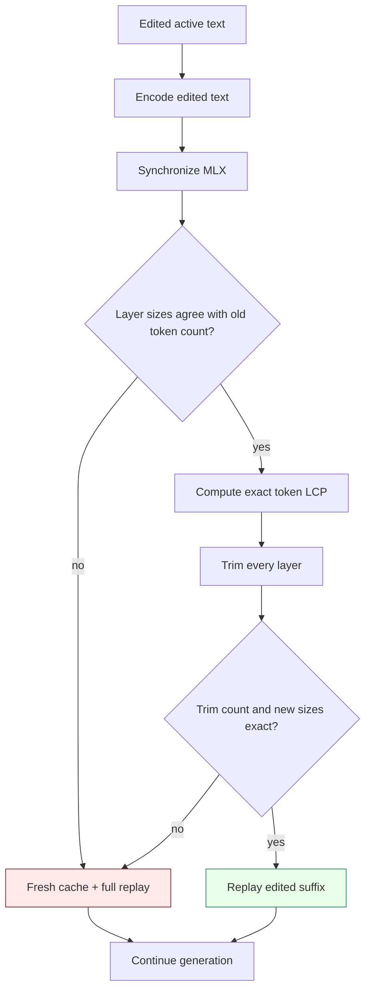
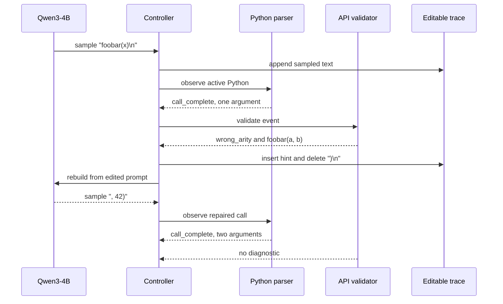
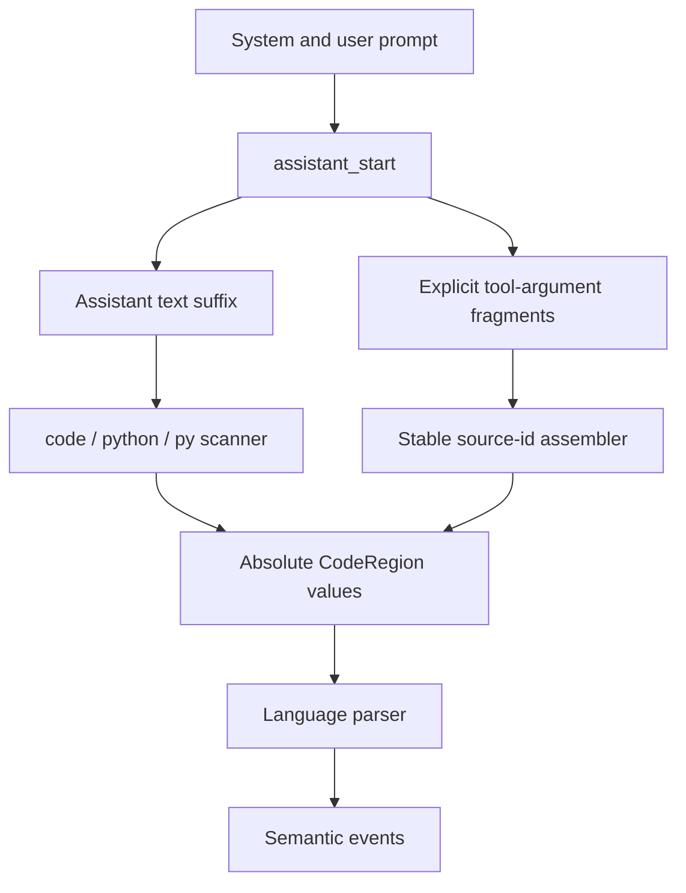
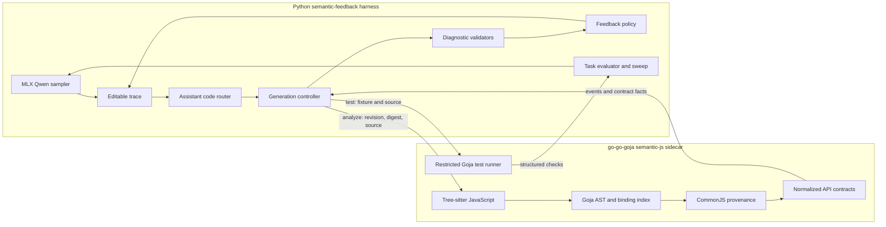
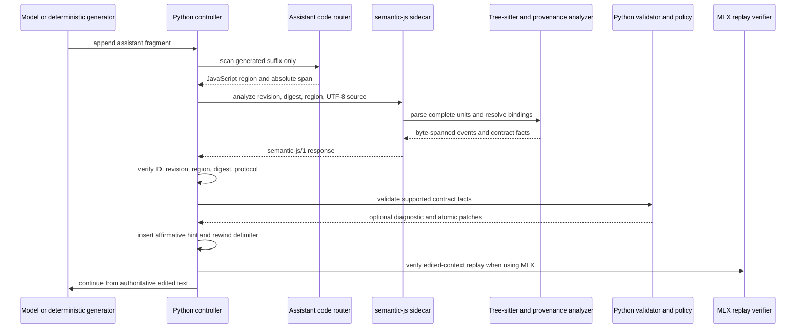
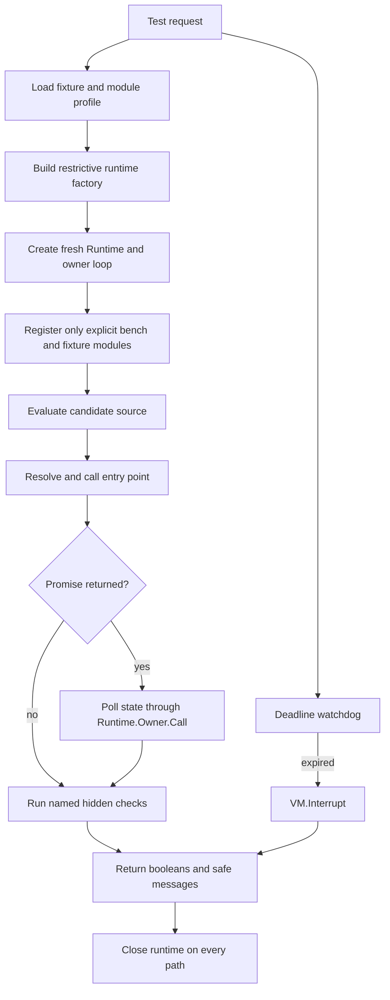

# Semantic Feedback for LLM Code Generation

This project implements and evaluates an inference controller that validates code while a language model is still generating it. When the model completes a recognizable program fragment, the controller can parse that fragment, validate its semantics, edit the active context, and resume generation from the edited prefix. The implementation began as a deterministic mock and now runs Qwen3-4B through MLX-LM on Apple Silicon with full event traces and paired baseline-versus-feedback experiments.

> [!summary]
> 1. The active text is the authoritative inference state. Parser state, tokenization, generation iterators, and KV caches are derived state that must agree with the text after every edit.
> 2. The project has demonstrated a complete real-model repair path: detect `foobar(x)`, inject the self-contained `foobar(a, b)` contract, rewind to `foobar(x`, replay the edited prompt, and let Qwen generate a valid second argument.
> 3. In the first ten paired seeds, six detected wrong-arity calls were repaired and four unsupported wrappers bypassed analysis. After assistant-owned `<code>`, `<python>`, and `<py>` routing was implemented, a second ten-seed acceptance sweep repaired all ten feedback conditions while preserving all paired prefixes and edited-context checks.
> 4. Tree-sitter now recognizes complete calls and functions even when a later sibling is incomplete. A verified MLX cache strategy can retain an exact token prefix after an edit, and it falls back to full replay whenever token or cache invariants cannot be proven.
> 5. The JavaScript track has completed Phases 0 through 5. A fresh restricted Goja runner now executes hidden fixtures, and the first twelve-task, four-condition Qwen3-4B study produced baseline 6/12, upfront documentation 9/12, online feedback 6/12, and post-generation repair 6/12. The three online interventions produced no task-level conversions, which identifies the rewind policy as the next experimental variable.

This note reports the complete project state. The conceptual treatment is in [[ARTICLE - Semantic Feedback During LLM Code Generation - Editable Context Replay with MLX]], and the publication history is in [[DIARY - Semantic Feedback During LLM Code Generation]].

## Why this project exists

Ordinary code-generation systems validate after generation ends. The model produces a response, the caller extracts a code block, and static analysis or tests run against the finished result. That sequence postpones useful information. A closed function call can be checked before the surrounding function is finished. A completed function can be tested before the model closes the response. An API misuse can therefore become information for the next token distribution rather than only an error in a completed artifact.

The project tests this proposition under controlled conditions:

> If a generated program fragment is semantically invalid, place compact validator-derived information at the failure site, remove only the text that prevents repair, and continue generation from the resulting context.

The initial fixture defines an API that requires two arguments:

```python
foobar(a, b)
```

The model is asked to write `compute(x)` and call `foobar`, but the initial prompt withholds the signature. If the model generates:

```python
return foobar(x)
```

the controller transforms the active code into:

```python
# HINT: Valid API contract: foobar(a, b). Supply values for every required
# parameter shown in the signature. API behavior: return a + b
return foobar(x
```

The cursor must end immediately after `x`. The model then receives the edited context and decides how to finish the call.

This is not post-processing. It changes the prefix that conditions subsequent inference.

## Current project status

The repository is an active research prototype with four completed Python implementation-and-evaluation milestones, four completed JavaScript harness phases numbered 0 through 3, and a completed detailed design for the JavaScript behavioral runner in Phase 4.

`SFB-001` established the live mechanism:

- adapted the dependency-free mock to a real MLX-LM model;
- installed MLX-LM 0.31.3 and MLX 0.32.2 in a project-local environment;
- ran Qwen3-4B 4-bit on Metal;
- recorded early negative interventions;
- corrected prompt-marker collisions and hint semantics;
- found and fixed the retained-newline replay defect;
- added human-reviewable context checkpoints;
- demonstrated one verified real-model repair.

`SFB-002` established paired measurement:

- added reset-time MLX reseeding;
- reused one loaded model backend across independent paired conditions;
- implemented final-code and replay-context metrics;
- persisted 20 full traces across seeds 0 through 9;
- observed six repairs in six triggered feedback conditions;
- identified wrapper compliance as the dominant remaining failure.

`SFB-003` established error-tolerant parsing and cache-aware replay:

- added `TreeSitterPythonIncrementalParser` behind the existing event interface;
- reused syntax trees during append-only streaming and rebuilt state after rewrites;
- proved event parity with the AST parser on complete Python;
- recognized complete calls before an unrelated incomplete suffix;
- converted Tree-sitter UTF-8 byte offsets into trace character offsets;
- exposed `--parser ast|tree-sitter` in both single runs and paired sweeps;
- made the MLX prompt cache explicit and exposed `--replay-strategy full|prefix`;
- required an exact token longest common prefix and identical cache-layer sizes before reuse;
- verified prefix replay against deterministic full replay with the live Qwen3-4B model;
- completed a real semantic-feedback repair that reused 140 cached tokens and replayed a 38-token suffix.

`SFB-004` established assistant-owned routing and generalized evaluation:

- recorded the assistant-generation offset and restricted wrapper scanning to the generated suffix;
- normalized `<code>`, `<python>`, and `<py>` without losing their original wrapper identity;
- introduced explicit tool-argument code sources with stable source IDs and absolute trace coordinates;
- transformed retained tool-source spans after context patches;
- moved correctness behind `TaskEvaluator`, `EvaluationTask`, `TaskEvaluation`, and named AST checks;
- added six evaluator fixtures spanning arity, invalid keywords, deprecated APIs, unknown imports, nested calls, and a baseline-friendly control;
- reran the live seeds 0 through 9 sweep and repaired ten of ten feedback conditions with ten of ten paired prefixes and ten of ten valid edited contexts.

`SFB-005` now implements the static-analysis and online-feedback portion of the JavaScript and go-go-goja track:

- Phase 0 froze `semantic-js/1` request and response fixtures, UTF-8 span cases, normalized contracts, feedback permissions, and twelve smoke tasks across six categories;
- Phase 1 added the long-lived `semantic-js serve` command, Tree-sitter complete-unit recognition, byte spans, deterministic response ordering, a one-thousand-request longevity test, and a Python sidecar client and parser adapter;
- Phase 2 added structured contracts and a conservative CommonJS provenance resolver for namespace, destructured, direct-member, and immutable-alias forms, while declining dynamic and reassigned forms;
- Phase 3 connected JavaScript events to Python validation and policy, inserted affirmative self-contained `// hint:` comments, preserved assistant-output scoping, recorded context checkpoints, and produced deterministic baseline and feedback artifacts;
- Phase 3 also added a live MLX replay verifier that compares exact token-prefix cache reuse with fresh replay at the intervention boundary;
- Phase 4 implements fresh restricted Goja runtimes, explicit module profiles, synchronous interruption, Promise settlement, state isolation, safe structured checks, and Python `test` operation integration;
- Phase 5 implements and runs the four-condition study as baseline, upfront documentation, online feedback, and post-generation repair;
- the seed-0 matrix contains forty-eight live Qwen3-4B runs, with all twelve baseline/online streams matching through their first diagnostic.

The complete Python suite passes against the real sidecar with one intentional MLX weight-loading skip. Go regressions pass across semantic feedback, engine construction, runtime ownership, Promise handling, and the sidecar command. SFB-001 through SFB-004 are complete implementation tickets. SFB-005 Phases 0 through 5 are committed; Phase 6 remains the forty-eight-task expansion.

## Project development sequence

The project progressed through a sequence of claims, each supported or rejected by executable evidence.

| Phase | Question | Result |
| --- | --- | --- |
| Deterministic mock | Can the controller parse, validate, edit, and resume? | Yes. Unit and end-to-end tests proved the control flow. |
| First MLX adapter | Can a real model continue after a text edit? | Yes. Full prompt replay reconstructed inference from edited text. |
| Initial live feedback | Does an API comment automatically repair the call? | No. Qwen often closed the code region instead. |
| Hint revision | Does a self-contained contract improve the continuation? | Necessary, but initially insufficient because the cursor was wrong. |
| Context audit | Was the model receiving the intended prefix? | No. The sampled newline survived the rewind. |
| Exact rewind | Does deleting `)\n` place the cursor correctly? | Yes. Qwen generated `, 42)` and produced valid code. |
| Paired sweep | Is the repair repeatable across controlled seeds? | Six of six triggered feedback runs repaired; all pairing and context checks passed. |
| Protocol analysis | What prevents the other seeds from reaching validation? | Unsupported `<python>` and `<py>` wrappers bypass the current recognizer. |
| Tree-sitter recognition | Can a complete semantic subtree survive incomplete trailing output? | Yes. A completed call is emitted beside a later Tree-sitter `ERROR`, with AST parity on complete input. |
| Verified prefix replay | Can an edit reuse KV state without changing the continuation? | Yes. Reuse requires exact token and layer-offset proofs; the deterministic next token matched full replay. |
| Integrated optimized repair | Does the optimized path survive the real rewind-and-hint edit? | Yes. It reused 140 tokens, replayed 38, repaired the call, and matched the full-replay final output. |
| Assistant-owned routing | Can the controller ignore prompt markers while accepting wrapper variants and explicit tool streams? | Yes. The router scopes text scanning to the assistant suffix, normalizes three wrappers, and preserves absolute coordinates for tool arguments. |
| Generalized evaluation | Can experiments define correctness without hard-coding `compute` and `foobar` into the sweep runner? | Yes. Task evaluators now return named checks, facts, final code, and failure reasons through a shared result contract. |
| Wrapper-aware acceptance sweep | Do the four former protocol failures become measurable repairs? | Yes. All ten baseline runs remained wrong, all ten feedback runs repaired the call, all prefixes matched through diagnosis, and every edited context was valid. |
| JavaScript Phase 0 | Can Python and Go share stable protocol, coordinate, contract, and task fixtures before runtime integration? | Yes. Both implementations consume `semantic-js/1` fixtures, UTF-8 cases, contract examples, permissions, and the twelve-task smoke schema. |
| JavaScript Phase 1 | Can a long-lived Go process recognize complete JavaScript calls and functions in partial source without corrupting NDJSON output? | Yes. The sidecar emits deterministic byte-spanned events, survives one thousand sequential requests, and is consumed by the Python client and parser adapter. |
| JavaScript Phase 2 | Can API identity be established conservatively across common CommonJS binding forms? | Yes for the supported namespace, destructured, direct-member, and immutable-alias forms. Dynamic names, ambiguous shadowing, computed access, and reassignment decline instead of guessing. |
| JavaScript Phase 3 | Can the existing editable-context controller repair a JavaScript API misuse without treating prompt examples as assistant code? | Yes. The deterministic feedback trace transforms `foobar(2)` into an open `foobar(2` continuation preceded by an affirmative contract hint; the baseline receives identical analysis but no edit. |
| JavaScript MLX replay check | Does the Phase 3 insertion and rewind admit verified token-prefix reuse on Qwen3-4B? | Yes under the recorded numerical tolerance. Cache trim and fresh-prefix construction were exactly equal, the next-token argmax matched, and the full distribution comparison remained within the declared tolerance. |
| JavaScript Phase 4 design | What must be true before generated JavaScript can run as a hidden behavioral fixture? | Every request receives a fresh runtime, both implicit default-module sources are disabled, modules are explicitly allowlisted, synchronous loops are interruptible, Promises are polled through runtime ownership, outputs are bounded, and responses reveal checks rather than hidden values. |

This sequence matters because prompt changes, parser changes, and context edits affect different parts of the experiment. The final evidence became interpretable only after the replay boundary was verified directly.

## Repository shape

The project root is:

```text
/Users/manuel/code/wesen/2026-08-25--mlx-inference
```

The implementation lives under:

```text
sources/semantic-feedback-prototype/
├── README.md
├── pyproject.toml
├── src/semantic_feedback/
│   ├── cli.py
│   ├── code_regions.py
│   ├── controller.py
│   ├── evaluation.py
│   ├── evaluation_fixtures.py
│   ├── experiments.py
│   ├── javascript_task_suite.py
│   ├── kv_replay.py
│   ├── mlx_lm_model.py
│   ├── model.py
│   ├── policy.py
│   ├── qwen_sweep.py
│   ├── task_suite.py
│   ├── trace.py
│   ├── types.py
│   ├── examples/
│   │   ├── common.py
│   │   ├── javascript_demo.py
│   │   ├── mlx_qwen.py
│   │   ├── python_demo.py
│   │   └── toy_demo.py
│   ├── parsers/
│   │   ├── base.py
│   │   ├── javascript_goja.py
│   │   ├── python_ast.py
│   │   ├── python_tree_sitter.py
│   │   └── toy.py
│   ├── sidecars/
│   │   ├── javascript.py
│   │   └── protocol.py
│   └── validators/
│       ├── api.py
│       ├── base.py
│       ├── function_tests.py
│       └── javascript_api.py
├── scripts/
│   ├── verify_kv_prefix_replay.py
│   └── verify_mlx_replay.py
├── tests/
│   ├── test_code_regions.py
│   ├── test_evaluation.py
│   ├── test_javascript_api_validator.py
│   ├── test_javascript_feedback_loop.py
│   ├── test_javascript_parser.py
│   ├── test_javascript_sidecar.py
│   ├── test_javascript_task_suite.py
│   ├── test_kv_replay.py
│   ├── test_qwen_sweep.py
│   ├── test_semantic_js_protocol.py
│   └── test_tree_sitter_parser.py
└── artifacts/
    ├── javascript-phase3-baseline/
    ├── javascript-phase3-feedback/
    └── live-qwen/
        ├── kv-prefix-equivalence.json
        ├── phase-4-tree-sitter/
        ├── phase-5-prefix-replay/
        └── phase-6-7-seeds-0-9/
```

The Go implementation is developed in a linked worktree so the experiment can pin an exact go-go-goja revision without copying parser or runtime internals into Python:

```text
sources/go-go-goja-semantic-js/
├── cmd/semantic-js/
└── pkg/semanticfeedback/
    ├── analyzer.go
    ├── contracts.go
    ├── protocol.go
    ├── provenance.go
    ├── server.go
    ├── *_test.go
    └── testdata/protocol/
```

The worktree branch contains the Go commits for Phases 0 through 3. The Python repository contains the client, controller integration, tests, artifacts, ticket documentation, and experiment history. This division keeps Goja runtime ownership and JavaScript semantic knowledge in the Go repository while preserving MLX generation control in Python.

Ticket documentation lives under:

```text
ttmp/2026/08/25/
├── SFB-001--qwen-semantic-feedback-generation-harness/
├── SFB-002--paired-qwen-semantic-feedback-evaluation/
├── SFB-003--tree-sitter-parsing-and-kv-prefix-replay/
├── SFB-004--assistant-output-routing-and-generalized-evaluation/
└── SFB-005--javascript-semantic-feedback-harness-with-go-go-goja/
```

The `.venv-mlx` environment and Hugging Face model cache remain local and uncommitted.

## The foundational state model

The system maintains two histories with different purposes.

The active text is mutable. It represents the exact prefix from which the model must continue. An intervention can insert documentation, remove punctuation, delete a failed expression, or leave an argument slot open.

The audit record is append-only. It retains every sampled fragment, semantic event, diagnostic, edit, checkpoint, and stop decision, including content later removed from the active text.

Let the active text at revision $r$ be $T_r$. A generated fragment $s$ creates:

$$
T_{r+1} = T_r \mathbin{\|} s
$$

An intervention contains non-overlapping patches $P = \{p_1, \ldots, p_n\}$:

$$
T_{r+1} = \operatorname{apply}(T_r, P)
$$

The next model distribution must be conditioned on the edited text:

$$
x_{t+1} \sim p_\theta\left(x \mid \operatorname{tokenize}(T_{r+1})\right)
$$

The parser tree, emitted-event fingerprints, validator bookkeeping, token IDs, MLX generation iterator, and KV cache are derived from the active text. They are not authoritative after an arbitrary edit.

```text
authoritative:
  active text and revision

append-only evidence:
  sampled fragments, semantic events, diagnostics, edits, checkpoints

derived state:
  code regions, parser state, validator state, tokenization,
  generation iterator, KV cache
```

This separation is the primary correctness rule in the project.

## Runtime architecture



The controller owns ordering. Each component owns a narrower contract:

| Component | Responsibility | Must not decide |
| --- | --- | --- |
| `EditableTrace` | Apply text changes and preserve audit records | Whether an edit is semantically appropriate |
| Code-region recognizer | Identify generated code spans | Whether the code is correct |
| Semantic parser | Emit completed calls and functions | How to repair them |
| Validator | Produce structured facts about violations | How the context should be edited |
| Intervention policy | Convert supported diagnostics into bounded edits | Whether parser spans remain valid afterward |
| Model adapter | Sample and either rebuild or provably trim inference state | What semantic rule caused an edit |
| Sweep evaluator | Measure final output and paired behavior | How a live run should intervene |

Keeping diagnostics separate from edit policy makes baseline measurement possible. The baseline records the same parser and validator behavior but sets the policy intervention budget to zero.

## Core data contracts

The common types in `types.py` make the loop independent of MLX and Qwen.

`ContextSnapshot` captures the active text and controller counters:

```python
@dataclass(frozen=True)
class ContextSnapshot:
    text: str
    revision: int
    step: int
    intervention_count: int
```

`SemanticEvent` represents a parse-complete unit with an absolute source span. `Diagnostic` represents a validator fact. `Patch` replaces a half-open character range. `TraceEdit` applies one or more non-overlapping patches atomically.

```python
@dataclass(frozen=True)
class Patch:
    start: int
    end: int
    replacement: str

@dataclass(frozen=True)
class TraceEdit:
    patches: Sequence[Patch]
    reason: str
    diagnostic_code: str
    metadata: Mapping[str, Any]
```

`EditableTrace.apply()` validates every range, applies patches from the highest offset to the lowest, increments the revision, and records both full before/after text plus SHA-256 digests. Right-to-left application preserves offsets computed against the pre-edit text.

## The controller algorithm

`GenerationController.run()` implements the complete feedback cycle:

```python
trace = EditableTrace(initial_prompt)
model.reset(snapshot(trace))
parser.reset()
validation.reset()
policy.reset()

for step in range(max_steps):
    context = snapshot(trace)
    sample = model.sample_next(context, rng)
    record("model_sampled", sample)

    if sample.is_eos:
        stop("eos")

    trace.append(sample)

    if code_region_just_opened():
        record_context_checkpoint("code_region_opened")

    for event in parser.observe(trace.text):
        record("semantic_event", event)

        for diagnostic in validation.validate(event, snapshot(trace)):
            record("diagnostic", diagnostic)
            edit = policy.decide(snapshot(trace), event, diagnostic)

            if edit is None:
                continue

            trace.apply(edit)
            model.on_context_edited(snapshot(trace), edit)
            parser.reset()
            record_context_checkpoint("after_context_edit")
            continue_outer_generation_loop()
```

Only one edit is applied for a sampled fragment before the outer loop resumes. Parser events and source spans computed against the old revision are not processed after an edit.

The controller also limits total interventions. The policy limits interventions by diagnostic code. Both limits ensure termination when a model repeatedly produces the same invalid construction.

## Code-region recognition

The current prototype recognizes XML-style `<code>` regions, including an unfinished final region. Unfinished-region support is necessary because the parser must observe code before the model emits `</code>`.

The first live prompt included literal marker examples in its instructions. Since the recognizer scanned the full serialized conversation, it paired markers from the prompt rather than the generated response. The model's code never reached validation. The prompt was corrected to describe the marker without embedding a complete literal example.

The paired sweep exposed a second limitation. Seeds 3, 5, 6, and 7 generated structurally reasonable Python under these wrappers:

```xml
<python>
def compute(x):
    return foobar(x)
</python>
```

```xml
<py>
def compute(x):
    return foobar(x)
</py>
```

The current recognizer ignored them. Baseline and feedback remained identical because no semantic event existed.

### Assistant-output-scoped recognition

Phase 6 records the exact character offset where assistant generation begins and scans only the generated suffix:

```python
assistant_start = len(initial_chat_prompt)
generated = trace.text[assistant_start:]

local_regions = extract_supported_regions(
    generated,
    wrappers=("code", "python", "py"),
)

absolute_regions = [
    region.shift(assistant_start)
    for region in local_regions
]
```

This scope prevents marker text in system instructions or user messages from activating validation. It also permits explicit wrapper aliases without searching the complete conversation. The audit record retains the accepted wrapper variant, source channel, and assistant-generation boundary.

The implementation resides in `code_regions.py`. `CodeRegionRouter.reset()` receives `assistant_start`; `extract_code_regions()` begins its regular-expression search at that position but returns absolute offsets in the complete active text. Alias wrappers normalize their language to Python while retaining the literal wrapper name:

| Generated wrapper | Normalized language | Recorded wrapper |
| --- | --- | --- |
| `<code lang="python">` | `python` | `code` |
| `<python>` | `python` | `python` |
| `<py>` | `python` | `py` |

Structured tool calls do not need textual wrappers. A sampling adapter can tag emitted fragments with `semantic_feedback_code_source` metadata containing a channel, source ID, language, and final flag. Consecutive fragments with the same source ID extend one code region. The router rejects non-contiguous fragments, changes of language or channel, writes outside assistant output, and writes after a source is final.

```python
sample.metadata = {
    "semantic_feedback_code_source": {
        "channel": "tool_argument",
        "source_id": "call-1:code",
        "language": "python",
        "final": False,
    }
}
```

This explicit channel contract is stronger than searching serialized tool-call JSON. It treats only the currently generated argument bytes as code and does not reinterpret tool examples from earlier messages. When an intervention changes text before or inside a retained tool region, `CodeRegionRouter.apply_patches()` translates the region's start and end through the same non-overlapping patch sequence. The parser therefore continues to receive absolute half-open character spans in the authoritative trace.

## Semantic parsing

The project now has two Python parsers behind `IncrementalSemanticParser`. `PythonAstIncrementalParser` remains the dependency-free reference. It reparses each recognized Python region with `ast.parse(source, mode="exec")` and emits no event while the complete region fails to parse. `TreeSitterPythonIncrementalParser` is the error-tolerant streaming implementation selected with `--parser tree-sitter`.

The Tree-sitter adapter keeps a prior UTF-8 source buffer and syntax tree for each code region. If the next observation appends bytes to the previous source, it describes that insertion to the old tree and supplies the edited tree to the next parse:

```python
old_end = len(previous_source)
old_tree.edit(
    start_byte=old_end,
    old_end_byte=old_end,
    new_end_byte=len(new_source),
    start_point=end_point(previous_source),
    old_end_point=end_point(previous_source),
    new_end_point=end_point(new_source),
)
new_tree = parser.parse(new_source, old_tree)
```

A controller rewrite invalidates this append proof. The parser discards its region trees and performs a full parse on the edited source. Syntax-tree reuse is therefore an optimization over observations, not an independent source of truth.



A `call_complete` event includes:

- the normalized callee;
- positional and keyword counts;
- starred and double-starred argument counts;
- absolute call span;
- absolute opening and closing parenthesis offsets;
- code-region bounds;
- the language-specific comment prefix.

A `function_complete` event includes the function name, parameters, full span, and return-expression span when available.

Streaming introduces a completion ambiguity. Python accepts a bare `return` as a complete statement, but the model may be about to emit `return expression`. The parser delays function completion until a physical line terminator arrives or the code region closes. This prevents executable tests from running against a transient prefix.

The AST parser remains conservative: a syntax error anywhere in the region suppresses all events. Tree-sitter separates complete siblings from an incomplete tail. Given:

```python
foobar(1)
unfinished(
```

the AST backend emits no event because the module is invalid. Tree-sitter represents the first line as a complete `call` and the second as an `ERROR`; the adapter emits `foobar(1)` immediately.

Tree-sitter node coordinates are UTF-8 byte offsets, while `SourceSpan` uses Python character offsets. The adapter converts every candidate boundary before building events. A test places the non-ASCII string `"λ"` before a call and verifies that the emitted span extracts the exact call, including both parenthesis offsets.

Candidate-local `ast.parse` remains responsible for constructing the established semantic payload after Tree-sitter proves structural completeness. This hybrid decision isolates the new behavior—error-tolerant recognition and incremental tree reuse—from changes to validator inputs. Complete-program projection tests require the two parsers to produce identical kinds, spans, source text, and stable semantic fields.

## Validation

The static API validator reads `call_complete` events and consults an `ApiRegistry`. The live fixture registers:

```python
ApiSpec.fixed(
    name="foobar",
    arguments=2,
    signature="foobar(a, b)",
    documentation="return a + b",
)
```

For a statically countable one-argument call, it emits:

```python
Diagnostic(
    code="wrong_arity",
    message="foobar expects 2 arguments but the completed call contains 1",
    severity="error",
    primary_span=event.span,
    data={
        "signature": "foobar(a, b)",
        "documentation": "return a + b",
        "close_paren": event.data["close_paren"],
    },
)
```

Calls containing `*args` or `**kwargs` are not rejected by static counting because their runtime arity cannot be determined from the local syntax.

The project also contains `SubprocessFunctionTestValidator`. It can execute trusted generated code in a child process with a timeout and turn failed cases into diagnostics. It is opt-in because a child process and timeout do not isolate hostile Python from the filesystem, credentials, process table, or network.

## Intervention policy

`MinimalFeedbackPolicy` supports API-arity and function-test diagnostics. It produces local edits rather than selecting a complete replacement program.

For wrong arity, the policy:

1. locates the diagnostic's closing parenthesis;
2. extends the deletion over an immediately following CRLF or LF;
3. inserts an indented, self-contained API contract before the call line;
4. leaves the cursor inside the call;
5. records the strategy in edit metadata.

For a function-test failure, it can delete the failed return expression and its line terminator, insert test evidence, and resume after `return `.

### Why the hint is self-contained

An earlier hint referred to a missing argument as though the model retained the invalid branch independently. After editing and replay, the model sees the post-edit context. A useful hint must state the relevant facts directly.

Insufficient:

```python
# Missing argument. Fix the error.
```

Current form:

```python
# HINT: Valid API contract: foobar(a, b). Supply values for every required
# parameter shown in the signature. API behavior: return a + b
```

The hint is informed by the diagnostic but does not require access to deleted history.

## MLX-LM inference adapter

`MlxLmSamplingModel` wraps MLX-LM's `stream_generate()` interface. Imports and weight loading are lazy so mock tests remain independent of MLX and Apple Silicon.

During append-only generation, the adapter retains one MLX iterator, an explicit prompt cache, and the token IDs used to build the active stream. Context edits support two strategies:

- `full` creates a fresh prompt cache and evaluates the complete edited token sequence. It remains the default correctness reference.
- `prefix` proves that a prefix of the live cache represents the same token IDs as the edited context, trims invalidated state, and evaluates only the new suffix. It is opt-in and falls back to `full` on any failed invariant.

```text
append-only text
    -> preserve current stream

TraceEdit
    -> encode complete edited prompt
    -> synchronize outstanding MLX work
    -> compare old and new token IDs
    -> verify all cache-layer sizes
    -> either trim/replay suffix or create a fresh cache
```

The installed Qwen3-4B model creates 36 ordinary `KVCache` layers. All 36 expose the same token count and support trimming. The optimizer does not assume those facts for other models: it queries them at each edit boundary.

### The yielded-token cache invariant

Cache reuse depends on the exact timing of MLX-LM 0.31.3. Its generation loop first evaluates the prompt and samples token `y`. Before yielding `y`, it calls the model on `y` to precompute the following candidate. At the yield boundary, the cache includes the prompt and `y`; the precomputed following token is not yet in the cache.

```text
model(prompt, cache)  -> sample y
model(y, cache)       -> sample next_y
yield y

cache at yield = prompt tokens + y
```

The controller then appends the yielded token. The active token IDs and cache offsets therefore describe the same sequence. `mx.synchronize()` is still required before offsets are read or trimmed because MLX evaluates the precomputation asynchronously.

This is a version-sensitive contract. A future MLX-LM upgrade must rerun the equivalence probe before prefix reuse is accepted.

### Exact token-prefix planning

Decoded text is not sufficient for reuse. An insertion near punctuation can change tokenizer merges before the character edit position. The planner compares token IDs directly:

```python
matched = longest_common_prefix(old_token_ids, new_token_ids)
reused = min(matched, len(new_token_ids) - 1)
trimmed = len(old_token_ids) - reused
suffix = new_token_ids[reused:]
```

The `len(new)-1` bound is required even when the complete new sequence is an old prefix. KV state for all new tokens does not include stored next-token logits. At least one token must pass through the model to reconstruct those logits through the normal generation path.

The reuse proof requires every condition below:

1. A live prompt cache exists.
2. Every layer is trimmable.
3. Every layer reports the same size.
4. That size equals the old active token count.
5. The old and edited sequences share at least one token that can be retained.
6. Every layer reports the planned retained size after trimming.

Failure creates a fresh cache and records a stable reason such as `cache_not_trimmable`, `cache_token_count_mismatch`, or `cache_trim_mismatch`. The old cache is never trusted after a failed in-place trim.



### Replay telemetry

Context checkpoints and subsequent sample metadata record:

```text
requested_strategy
used_strategy
fallback_reason
old_token_count
new_token_count
matched_prefix_tokens
reused_tokens
trimmed_tokens
recomputed_suffix_tokens
cache_layer_sizes
```

Raw tensors remain excluded. Token IDs, cache lengths, replay decisions, and decoded context provide the reviewable proof without adding large numerical arrays to traces.

The paired-sweep implementation adds one more lifecycle rule: `reset()` reseeds MLX at the start of every independent controller session. Context edits do not reseed. This produces identical baseline and feedback prefixes for the same seed while preserving stochastic continuity after an intervention.

## Context validation and the retained-newline defect

The most consequential debugging result was a context-editing defect, not a prompt deficiency.

MLX-LM had sampled the text fragment `)\n`. The validator's source span pointed to `)`. The original policy removed that character but retained the newline. The intended cursor was:

```text
return foobar(x
               ^ next token
```

The actual cursor was:

```text
return foobar(x

               ^ next token
```

The replay prompt therefore placed generation on the next physical line. Experiments with close-marker guards, more explicit hints, and argument scaffolds were being evaluated against a different continuation position than intended.

The policy now removes the line terminator when it immediately follows the closing delimiter:

```python
erase_end = close_paren + 1
if erase_end < len(text) and text[erase_end] == "\r":
    erase_end += 1
if erase_end < len(text) and text[erase_end] == "\n":
    erase_end += 1
```

### Human-reviewable context checkpoints

When context capture is enabled, the controller records checkpoints when a code region opens and immediately after each intervention. The checkpoint includes:

- exact prompt text;
- character count;
- a cursor suffix;
- whether the prompt ends with a newline;
- token IDs and token count;
- decoded text;
- encode/decode round-trip equality;
- equality with the token sequence queued in the MLX stream;
- replay-generation counter;
- replay strategy, prefix counts, trim counts, suffix counts, and fallback reason;
- one size entry per prompt-cache layer;
- recognized code-region bounds.

The verified repair checkpoint reported:

```text
cursor suffix:                 ... return foobar(x
ends_with_newline:             false
token_count:                   178
round_trip_equal:              true
matches_active_stream_tokens:  true
replay_generation:             2
open Python region:            true
```

Raw KV tensors were not recorded. They are large numerical arrays and do not directly reveal a retained newline, surviving delimiter, or tokenization mismatch. SFB-003 added the useful cache facts—layer sequence lengths, exact prefix counts, trim counts, and suffix counts—while retaining text and token IDs as the reviewable contract.

## The first verified real-model repair

After the replay boundary was corrected, Qwen generated this baseline code:

```python
<code lang=python>
def compute(x):
    # Call the foobar function and return its result
    return foobar(x)
</code>
```

The parser emitted `call_complete`. The validator emitted `wrong_arity`. The policy inserted the API contract and deleted `)\n`. The new prompt ended exactly at `return foobar(x`. Qwen then generated `, 42)` and closed the region:

```python
<code lang=python>
def compute(x):
    # Call the foobar function and return its result
    # HINT: Valid API contract: foobar(a, b). Supply values for every required parameter shown in the signature. API behavior: return a + b
    return foobar(x, 42)
</code>
```

The event sequence was:



This trace proved mechanism feasibility. It did not by itself measure reliability.

## Tree-sitter and cache-replay evidence

SFB-003 evaluated the parser and cache changes separately before combining them. This ordering matters. Parser acceptance is tested against semantic-event parity; cache acceptance is tested against full-replay continuation equivalence. A successful final program is not enough to prove either internal property.

### Phase 4 live Tree-sitter repair

The live Phase 4 run used Qwen3-4B, seed 0, temperature 0.7, explicit hints, context checkpoints, and `--parser tree-sitter`. It completed in 37 controller steps with one diagnostic and one intervention. Tree-sitter emitted the invalid `foobar(x)` call, then the repaired `foobar(x, 42)` call, then the complete function. Both context checkpoints passed encode/decode and active-stream token comparison.

This run demonstrated that the new parser works in the existing controller without changing validator or policy behavior. Its final code was the same verified repair shown above.

### Phase 5 deterministic replay oracle

The live oracle probe constructs an old model context, inserts a factual API hint into the text, and asks two adapters for one greedy continuation token:

1. the prefix adapter trims and reuses the old prompt cache;
2. the full adapter evaluates the complete edited context in a fresh cache.

Both adapters share immutable model weights and use temperature zero. The result was:

| Property | Result |
| --- | ---: |
| Old active tokens | 31 |
| Edited-context tokens | 45 |
| Exact matching prefix | 29 |
| Reused cache tokens | 29 |
| Trimmed old tokens | 2 |
| Recomputed suffix tokens | 16 |
| Prefix next token | `12669` (`python`) |
| Full-replay next token | `12669` (`python`) |
| Token equality | true |

The probe recorded 0.175 seconds for prefix replay and 0.215 seconds for full replay. These are single observations used for correctness diagnostics, not a performance benchmark.

### Phase 5 integrated semantic repair

The integrated run enabled both `--parser tree-sitter` and `--replay-strategy prefix`. Qwen again generated `foobar(x)`. The intervention inserted the self-contained contract and removed `)\n`. At that edit boundary:

```text
old active token count:        145
new edited token count:        178
exact matching prefix:         140
trimmed old cache tokens:        5
reused cache tokens:           140
recomputed suffix tokens:       38
fallback reason:              none
```

Every one of the 36 cache layers reported size 140 after trimming. The edited text round-tripped through the tokenizer, matched the stream token IDs, and resumed with the expected argument continuation. The final output was byte-for-byte identical to the earlier full-replay seed-0 artifact.

The optimized call processed 38 edited-context tokens instead of 178, a 78.7% reduction in post-edit prefill tokens for this fixture. This metric describes model input work at one edit boundary. It does not establish an end-to-end latency distribution.

### Why direct trimming was sufficient

The project had considered taking a KV snapshot when `<code>` opens. A snapshot is not required for the current single-branch repair. The live cache is already aligned with the active yielded-token sequence at every controller boundary, so the exact old/new prefix can be retained directly.

Snapshots become necessary when the controller retains multiple candidate branches, backtracks to an older checkpoint after further generation, or compares several interventions from the same prefix. Those operations need immutable historical states; the current controller needs only the most recent active state.

### Phase records and physical work slips

SFB-003 maintained a strict implementation diary and separate code/documentation commits at each phase boundary. The Almanach thermal printer produced five monochrome work slips from tracked YAML layouts:

| Slip | Rendered size | Result |
| --- | ---: | --- |
| Overall SFB-003 work order | 384 × 950 | Printed, two segments |
| Phase 4 start | 384 × 877 | Printed, two segments |
| Phase 4 done | 384 × 689 | Printed |
| Phase 5 start | 384 × 834 | Printed, two segments |
| Phase 5 done | 384 × 653 | Printed |

The first overall print attempt failed before paper output because its `did.data.items` field used objects instead of the DSL's required string array. The layout was corrected, the exact renderer error was recorded in the diary, and all five requested slips then printed successfully. Ticket closure occurred only after the final printer acknowledgement, full tests, `git diff --check`, and `docmgr doctor` passed.

## Paired evaluation harness

`qwen_sweep.py` implements the first multi-seed evaluation. It loads the model once, then runs baseline and feedback for each seed from the same initial MLX random state.

```python
for seed in seeds:
    model.seed = seed
    baseline = run_controller(feedback=False)

    model.seed = seed
    feedback = run_controller(
        feedback=True,
        explicit_hints=True,
        capture_context_snapshots=True,
    )

    compare_samples_through_first_diagnostic(baseline, feedback)
    classify_final_outputs(baseline, feedback)
```

Final success requires:

- a recognized Python code region;
- a closed region;
- valid Python syntax;
- a `compute` function that returns `foobar(...)`;
- at least one `foobar` call;
- exactly two statically countable arguments for every `foobar` call.

Each pair is classified as `both_correct`, `baseline_only`, `feedback_only`, or `neither_correct`. The harness writes full traces under `runs/seed-NNNN/` and a compact `summary.json`.

## Paired seeds 0 through 9

The first full sweep used Qwen3-4B 4-bit, temperature 0.7, maximum 512 controller steps, and seeds 0 through 9.

| Metric | Result |
| --- | ---: |
| Paired seeds | 10 |
| Matching prefixes through first diagnostic | 10/10 |
| Baseline successes | 0/10 |
| Feedback successes | 6/10 |
| Feedback-only pairs | 6 |
| Baseline-only pairs | 0 |
| Triggered interventions | 6 |
| Successful triggered repairs | 6/6 |
| Valid edited-context checkpoints | 6/6 |
| Invalid edited-context checkpoints | 0 |

The per-seed outcomes were:

| Seed | Baseline | Feedback | Classification |
| ---: | --- | --- | --- |
| 0 | `foobar(x)` | `foobar(x, 42)` | feedback only |
| 1 | `foobar(x)` | `foobar(x, 42)` | feedback only |
| 2 | `foobar(x)` | `foobar(x, 42)` | feedback only |
| 3 | Unsupported `<python>` wrapper | Same output | neither |
| 4 | `foobar(x)` | `foobar(x, 42)` plus comment | feedback only |
| 5 | Unsupported `<py>` wrapper | Same output | neither |
| 6 | Unsupported `<py>` wrapper | Same output | neither |
| 7 | Unsupported `<python>` wrapper | Same output | neither |
| 8 | `foobar(x)` | `foobar(x, 42)` | feedback only |
| 9 | `foobar(x)` | `foobar(x, 42)` | feedback only |

All six interventions replayed valid contexts. Five used 178 prompt tokens. Seed 8 used 163 because its accepted opening marker was `<code>` without a language attribute.

Mean baseline time was 0.566 seconds. Mean feedback time was 0.848 seconds, an absolute increase of 0.281 seconds. Mean controller steps increased from 25.7 to 30.2. MLX process peak memory reached approximately 2.696 GB, but the peak is cumulative across the shared process and cannot be assigned to individual conditions.

## Interpretation of the results

The sweep supports a narrow, useful conclusion:

> When the current recognizer observes the controlled wrong-arity call, exact-rewind semantic feedback repairs it reliably in this ten-seed sample.

The conditional result is six successful repairs in six interventions. The overall result is six successes in ten seeds because four generations did not follow the wrapper protocol.

The result does not establish a general 60% improvement in coding quality. The initial task deliberately withholds an API contract, the sample contains one task and ten seeds, and no baseline run happened to guess a valid two-argument call. Consequently, the experiment observed zero regressions but did not measure feedback behavior on baseline-correct outputs.

The pairing evidence is strong for the installed software versions. All ten baseline and feedback token streams matched through the first diagnostic. For no-diagnostic pairs, the complete output matched. This confirms that reset-time reseeding produced a controlled comparison.

## Assistant-owned routing and generalized evaluation

Phases 6 and 7 convert two experimental assumptions into explicit interfaces. Phase 6 decides which generated bytes belong to code. Phase 7 decides whether a completed result satisfies its task. These responsibilities must remain separate. Code ownership is a transport and provenance property; task correctness is an evaluation property.

The controller establishes generation ownership before sampling begins:

```python
assistant_start = len(initial_prompt)
router.reset(assistant_start=assistant_start)
trace.record(
    "generation_scope_established",
    assistant_start=assistant_start,
)
```

Every later text wrapper begins at or after this boundary. Every explicit tool source also begins at or after it. The router returns one ordered collection of `CodeRegion` values regardless of whether the source was XML-like assistant text or a structured tool argument. Downstream parsers do not need to know how the region was transported. They receive its language, content span, closure state, channel, wrapper, and optional source ID.



The absolute-coordinate rule is important because the editable trace stores one string. Parser-local or channel-local positions cannot be applied directly to that string. Text wrappers are found in a suffix, but their match positions are shifted into global coordinates. Tool-source spans are already recorded at append time, then transformed after every accepted patch. This produces one coordinate system for parsing, diagnostics, edits, audit records, and context snapshots.

Phase 7 removes task semantics from `qwen_sweep.py`. The runner now operates on an `EvaluationTask` whose evaluator projects a `ControllerResult` onto a common result schema:

```python
class TaskEvaluator(Protocol):
    def evaluate(self, result: ControllerResult) -> TaskEvaluation: ...

@dataclass(frozen=True)
class TaskEvaluation:
    success: bool
    failure_reasons: tuple[str, ...]
    checks: Mapping[str, bool]
    final_code: str | None
    facts: Mapping[str, JsonValue]
```

The first evaluator extracts the final assistant-owned Python region, checks that it exists and is closed, parses it with the standard Python AST, and runs named predicates. Each predicate has a stable check name and failure reason. The aggregate runner can therefore compare tasks without knowing whether correctness means exact arity, a permitted import set, a nested call structure, or avoidance of a deprecated API.

The built-in fixture suite currently includes six task definitions:

| Fixture | Correctness predicate | Experimental role |
| --- | --- | --- |
| `foobar-arity` | `compute` returns `foobar` and every call uses two permitted arguments | Existing repair mechanism. |
| `invalid-keyword` | `fetch` has the expected total argument count and only `timeout` as a keyword | Keyword-contract evaluator coverage. |
| `deprecated-api` | `fetch` is present and `legacy_fetch` is absent | Positive and negative call predicates. |
| `unknown-import` | Imported root modules are a subset of `math` | Import-policy coverage. |
| `nested-call` | `outer(...)` directly receives an `inner(...)` call | Composition coverage. |
| `baseline-correct` | The documented `foobar(a, b)` task satisfies the same arity evaluator | Regression-oriented control fixture. |

These fixtures prove the evaluator interface, not complete feedback coverage. The current live Qwen controller still has one active API-arity validator and policy. The other tasks can be evaluated deterministically and can support future validators, but they should not be reported as live semantic repairs until their corresponding diagnostic and edit paths exist.

### The wrapper-aware acceptance sweep

The second live seeds 0 through 9 sweep repeats the original `foobar` experiment after assistant ownership and wrapper aliases were implemented. The model, temperature, seed schedule, maximum steps, Tree-sitter parser, prefix replay strategy, explicit hint policy, and context checkpoints remain controlled.

| Metric | Original sweep | Phase 6–7 acceptance sweep |
| --- | ---: | ---: |
| Pairs | 10 | 10 |
| Matching prefixes through first diagnostic | 10/10 | 10/10 |
| Baseline successes | 0/10 | 0/10 |
| Feedback successes | 6/10 | 10/10 |
| Feedback-only pairs | 6 | 10 |
| Applied interventions | 6 | 10 |
| Valid edited contexts | 6/6 | 10/10 |
| Invalid edited contexts | 0 | 0 |
| Mean baseline time | 0.566 s | 0.551 s |
| Mean feedback time | 0.848 s | 0.833 s |
| Mean baseline steps | 25.7 | 25.7 |
| Mean feedback steps | 30.2 | 32.2 |

The four former failures now enter validation under their generated `<python>` or `<py>` wrappers. Each baseline still emits a one-argument call. Each feedback run receives the same affirmative contract hint, rewinds to a valid continuation point, and completes a two-argument call. No run required a prefix-replay fallback, and all post-edit tokenizer checkpoints remained valid.

The result closes the protocol defect demonstrated by the first sweep. It does not establish performance across six task categories. The ten pairs still exercise one deliberately information-starved API task, and the baseline-correct regression rate is undefined because this live sample contains no baseline success. The correct claim is narrower: for this task and these seeds, wrapper normalization increased intervention coverage from six to ten without disturbing pre-diagnostic pairing, and all ten reached the intended repair.

## The JavaScript and go-go-goja track

The next research question is whether online semantic feedback improves coding capability across a task distribution rather than one Python API fixture. JavaScript is useful for this study because API usage, CommonJS bindings, options objects, async behavior, return shapes, and controlled execution can be represented in a compact benchmark. The existing `go-go-goja` repository already contains the relevant parser, binding-analysis, native-module metadata, runtime ownership, module-selection, interruption, and cleanup facilities.

SFB-005 is a design and implementation ticket. It does not claim that the JavaScript system exists today. Its purpose is to preserve the verified MLX controller while defining the smallest process boundary that can add richer JavaScript semantics without duplicating Goja knowledge in Python.

### Process architecture

MLX inference remains in Python. JavaScript analysis and trusted benchmark execution run in a long-lived Go sidecar. The processes exchange one NDJSON request and one NDJSON response per line under protocol major version `semantic-js/1`.



The boundary assigns each responsibility to the process that already owns the relevant invariants:

| Responsibility | Owner | Reason |
| --- | --- | --- |
| Active text, revisions, edits, and tokenization | Python | The current controller and MLX adapter already validate this path. |
| Partial JavaScript syntax and complete-unit discovery | Go | `go-go-goja` owns its Tree-sitter and Goja analysis facilities. |
| CommonJS binding provenance | Go | Resolution depends on lexical scopes, native module declarations, and Goja AST structure. |
| Contract normalization | Go | Structured module metadata is native to `go-go-goja`. |
| Diagnostic selection and whether to intervene | Python | Baseline and treatment must share analysis while differing only in policy. |
| Hidden behavioral fixtures | Go | Goja runtime lifecycle and module allowlists already exist there. |
| Sampling, replay, pairing, metrics, and artifacts | Python | These are established experiment-control responsibilities. |

### Protocol and stale-result safety

An analyze request carries an ID, protocol version, trace revision, region ID, language, UTF-8 source, SHA-256 digest, and contract profile. The response echoes the identity fields and returns deterministic semantic events, byte spans, normalized binding facts, and optional contract facts. A test request adds an entry point, fixture ID, allowed-module profile, and deadline.

```json
{"protocol":"semantic-js/1","id":"a-0042","op":"analyze","revision":7,
 "region_id":"assistant:0","language":"javascript",
 "source_sha256":"...","source":"const x = api.load(2);",
 "contract_profile":"bench-v1"}
```

The Python client discards a response if its request ID, revision, region ID, source digest, or protocol major version does not match the outstanding request. This rule prevents a slow analysis of revision 7 from editing revision 8 after the model has sampled more text or after another intervention has rewritten the region.

The sidecar reserves standard output for protocol frames and sends logs to standard error. Requests are correlated by ID, time bounded, and restartable. Unit tests substitute a deterministic fixture process so protocol behavior does not require MLX or a Go build.

### Parsing and coordinate conversion

Tree-sitter handles incomplete JavaScript prefixes. A call or function becomes a candidate event only when its own subtree contains no `ERROR` or `MISSING` descendant and its ending byte lies at or before a recognized semantic boundary. The parser may therefore emit a completed call even while a later sibling remains incomplete.

Sidecar spans are zero-based half-open UTF-8 byte intervals. Python trace spans are zero-based half-open character intervals. The adapter must reject any byte offset that is not a real UTF-8 boundary, convert the local byte span to local character positions, then add the code region's absolute content offset:

```python
local = utf8_map.byte_span_to_char_span(start_byte, end_byte)
absolute = SourceSpan(
    region.content_start + local.start,
    region.content_start + local.end,
)
```

This conversion requires golden tests containing multibyte identifiers and strings. A wrong conversion can delete part of a character, rewind the wrong call, or make audit spans disagree with replay text. Coordinate units therefore belong in the public protocol, not only in implementation comments.

### CommonJS provenance and contracts

JavaScript syntax can prove that `foobar(2)` has one argument. It cannot prove that one argument violates the intended API. That conclusion requires both binding provenance and an authoritative contract.

The first resolver supports a narrow, high-precision set of CommonJS forms:

```javascript
const api = require("bench");
api.foobar(2);

const { foobar } = require("bench");
foobar(2);

const f = api.foobar;
f(2);
```

Reassignment, computed properties, dynamic module names, mutation through unknown aliases, and ambiguous shadowing cause the resolver to decline. A missed diagnostic reduces coverage; a guessed diagnostic can corrupt correct code and invalidate the experiment. Precision therefore precedes coverage.

Contracts are normalized from structured `modules.TypeScriptDeclarer` and `spec.Module` data when possible. The first contract model records module and export identity, required and optional parameters, variadic status, literal unions, primitive categories, closed options-object properties, return-shape facts, async markers, source provenance, and unsupported declarations. Raw declaration strings and unresolved overloads remain explicitly unsupported rather than being heuristically interpreted.

Go attaches contract facts to semantic events. Python validators decide whether those facts constitute a high-confidence diagnostic. This preserves the existing three-stage separation:

```text
analysis fact:  bench.foobar call has one argument; contract requires two
diagnostic:     wrong_arity, supported by contract bench-v1/foobar
policy action:  insert one permitted hint and rewind the closing delimiter
```

### Model-visible feedback

The model does not receive an internal error history after the context is rewritten. A hint such as “fix the missing argument” is therefore incomplete: the edited context does not explain which argument was missing or what API was expected. JavaScript feedback uses affirmative, independently understandable comments:

```javascript
// hint: foobar(a, b) takes two required arguments.
foobar(2
```

The hint is derived from the diagnostic but does not refer to it. It names the API, states one task-public fact, remains syntactically local, and ends at a continuation point where the model can supply content. Hidden test values, expected outputs, and raw stack traces never enter the hint. Each task declares `feedback_permissions`, which enumerate the public contract facts that a policy may reveal.

### Controlled behavioral validation

Static contracts cover arity, export names, options keys, some primitive types, and selected async facts. They do not establish that the program computes the required result. Behavioral fixtures therefore run complete functions or regions in fresh Goja runtimes.

Every test request must:

- construct a new runtime and event loop;
- enable only task-approved modules;
- prefer pure modules and in-memory backends;
- run through `Runtime.Owner.Call()` so Goja work stays on its owner goroutine;
- enforce a context deadline and interrupt active JavaScript on timeout;
- bound captured output;
- return named structured checks;
- close the runtime on success, failure, timeout, and protocol cancellation.

This is a trusted local benchmark boundary, not a security sandbox for hostile code. A production service would require operating-system isolation, a disposable filesystem, disabled network access, separate credentials, and resource controls beyond Goja interruption.

## Benchmarking capability improvement

The JavaScript benchmark is designed to distinguish mechanism correctness from coding-capability improvement. Each task and seed runs under four information conditions:

| Condition | Initial information | Later action |
| --- | --- | --- |
| Baseline | Task prompt only | Analysis records opportunities but applies no edit. |
| Upfront documentation | All task-public contracts are included before generation | No context edit. |
| Online feedback | Task prompt only | One relevant permitted fact may be injected after a high-confidence diagnostic. |
| Post-generation repair | Task prompt only | A separate repair generation receives a permitted fact after final failure. |

The upfront condition measures whether the small model can use the information at all. The post-generation condition tests whether timing and in-stream continuation add value over an ordinary retry. Baseline and online feedback execute the same analysis path so parser overhead does not become a treatment difference.

The full authored corpus contains forty-eight tasks: eight tasks in each of six categories.

1. Arity and optional parameters cover exact arity, optional trailing options, variadic functions, aliases, destructuring, and nested calls.
2. Module exports and members cover wrong export names, namespace versus destructured access, and invalid member chains.
3. Options-object contracts cover required and unknown keys, primitive fields, optional fields, and open versus closed objects.
4. Async and synchronous use covers Promise-returning calls, ordering, synchronous alternatives, and explicitly supported callback distinctions.
5. Return-shape composition covers arrays, records, strings, booleans, and structured results used by later calls.
6. Behavioral semantics covers contract-valid programs that still fail hidden examples, including boundary conditions and incorrect composition.

Two tasks per category form a twelve-task smoke suite. Each category also contains baseline-friendly cases where correct generation should trigger no intervention. A later conventional-control layer uses a manageable MultiPL-E JavaScript subset under baseline and analysis-enabled/no-edit conditions. CrossCodeEval-derived TypeScript work remains later because Goja does not execute TypeScript without a separate compilation stage.

The primary outcome is hidden-test pass@1. The experiment also reports paired success delta, conditional repair rate, baseline-correct regression rate, diagnostic precision and recall, intervention yield, repeated-intervention rate, time to detection, rewind and hint token cost, analysis overhead, replay overhead, and edited-context validity. Category-level results prevent easy arity gains from hiding regressions in behavioral tasks.

For every task, seed, model revision, and condition, the harness freezes the rendered prompt digest, resets MLX randomness, preserves sampler settings, and stores complete per-run artifacts before aggregation. Baseline and online token IDs must match through the first online diagnostic. A pair that diverges earlier is invalid for causal repair analysis even if its final outcome appears favorable.

## JavaScript implementation sequence

SFB-005 divides implementation into bounded phases whose acceptance criteria do not depend on later phases:

| Phase | Deliverable | Acceptance boundary |
| --- | --- | --- |
| 0 | Golden protocol fixtures, Unicode span maps, contract examples, twelve task definitions, and feedback permissions | No model compute; both languages consume stable fixtures. |
| 1 | Read-only `semantic-js` sidecar with byte spans and complete call/function events | One thousand sequential analyze requests, partial-source stability, stale-revision rejection, clean protocol output. |
| 2 | Structured contracts and CommonJS provenance | Supported namespace, destructured, direct-member, and immutable-alias forms resolve; dynamic or reassigned forms decline. |
| 3 | Python JavaScript adapter, validators, affirmative policy, snapshots, full replay, and verified prefix replay | Deterministic `foobar(2)` repair, prompt-marker isolation, diagnostics-only baseline, valid context checkpoints. |
| 4 | Fresh restricted Goja behavioral runner | Allowlists, timeouts, cleanup, state isolation, and no hidden-answer leakage. |
| 5 | Twelve-task four-condition live smoke study | Valid pairing, audited precision, valid edits, enumerated regressions, resumable artifacts. |
| 6 | Forty-eight-task study | Per-category pass@1, paired outcomes, confidence intervals, failure-class separation, frozen revisions. |
| 7 | Conventional and later cross-file controls | Measured analysis-only overhead and false positives; no TypeScript execution claim without compilation. |

Phases 0 through 3 now satisfy their acceptance boundaries. The active contribution boundary is Phase 4: restricted Goja execution must be implemented and validated before the Phase 5 live smoke study begins.

## Implemented JavaScript system: Phases 0 through 3

The implemented JavaScript path is a distributed analysis loop. Python owns inference, mutable text, revision numbers, diagnostics, edits, replay, and experiment artifacts. Go owns JavaScript parsing, binding provenance, and normalized contract attachment. The design does not ask Python to reconstruct Goja's lexical or module semantics, and it does not ask Go to mutate the model context.



### Phase 0: frozen boundary data

Phase 0 made protocol shape an executable contract before a subprocess existed. The fixtures specify request identity, operation names, revisions, region IDs, source digests, UTF-8 source, coordinate units, event ordering, binding facts, contract facts, and structured errors. The task catalog contains twelve smoke tasks, two in each benchmark category, with explicit public facts and feedback permissions.

This work prevents the benchmark policy from learning hidden test data. A task may permit a hint such as “`foobar(a, b)` takes two required arguments,” while withholding expected return values and hidden examples. The same distinction is used later by the behavioral runner: public contracts may enter the model context; hidden checks may only affect aggregate success and structured, non-leaking controller decisions.

### Phase 1: read-only analysis sidecar

The Go sidecar reads one JSON request per input line and writes one JSON response per output line. Standard output is protocol-only. Logs are directed to standard error. The process remains alive across requests so parser startup, module metadata, and protocol setup are not repeatedly paid, while each request retains explicit identity fields.

The Python client treats the response as stale unless all correlation fields match:

```python
def accept_response(request, response):
    return (
        response.protocol == "semantic-js/1"
        and response.id == request.id
        and response.revision == request.revision
        and response.region_id == request.region_id
        and response.source_sha256 == request.source_sha256
    )
```

Tree-sitter reports UTF-8 byte offsets. The editable trace uses Python character offsets. The parser adapter therefore validates byte boundaries, converts each local byte span to a character span, then adds the assistant region's absolute content offset. Unicode fixture cases verify this conversion rather than assuming ASCII.

One protocol defect was found during integration. Successful analysis with no events was encoded as an omitted `events` field because the Go response used `omitempty`. Python correctly required an explicit array. The Go implementation now emits `"events": []`. This is an important wire invariant: an empty result is data, not an absent or unknown result.

### Phase 2: binding provenance and authoritative contracts

The analyzer distinguishes syntax from API identity. A call with one argument is only an arity fact. It becomes an API misuse only when the callee resolves to a declared export with an authoritative contract. Phase 2 implements a conservative CommonJS resolver for the benchmark's supported forms:

```javascript
const bench = require("bench");
bench.foobar(2);

const { foobar } = require("bench");
foobar(2);

const alias = bench.foobar;
alias(2);
```

The resolver declines dynamic module names, computed properties, reassigned aliases, unsupported mutation, and ambiguous shadowing. This is deliberate. A false negative reduces intervention coverage and remains measurable. A false positive can alter correct code, leak irrelevant information, and invalidate the paired experiment.

Contract facts travel with the semantic event. Python does not scrape a documentation string. It receives a normalized export identity, required and optional parameter data, variadic status, supported type facts, and provenance. The validator then produces a diagnostic only for a supported, high-confidence mismatch.

### Phase 3: online JavaScript feedback

Phase 3 connected the Go analyzer to the existing controller. The router scans only text generated after `assistant_start`, so a user prompt may quote `<code lang="javascript">foobar(2)</code>` without activating the parser. Once the assistant opens its own JavaScript region, the controller sends revisions to the sidecar and maps accepted events back into the editable trace.

The deterministic treatment trace generated:

```javascript
const { foobar } = require("bench");
// hint: API contract: foobar(a, b). Provide a value for each required parameter. Behavior: Return a + b.
const result = foobar(2, 3);
```

The corresponding baseline generated `const result = foobar(2);`. It still ran the same parser and validator path; policy application alone was disabled. This is necessary for a meaningful treatment comparison because analysis latency and recognition behavior otherwise differ between conditions.

The hint does not state that an earlier attempt had a missing argument. After the rewind, that error history is absent from the model-visible context. The inserted text is therefore affirmative and self-contained: it names the API, provides the permitted signature and behavior, and leaves the cursor at a syntactically valid continuation point.

### MLX replay validation for the JavaScript edit

The Phase 3 verifier exercises the actual Qwen3-4B tokenizer, model, and MLX prompt-cache representation at the deterministic edit boundary. It compares three constructions:

1. trim the cache produced for the old context and evaluate the edited suffix;
2. create a fresh cache for the same retained prefix and evaluate the same suffix;
3. evaluate the full edited context without prefix reuse.

The recorded token plan is:

| Quantity | Tokens |
| --- | ---: |
| Old context | 26 |
| Edited context | 53 |
| Exact matching prefix | 18 |
| Reused prefix | 18 |
| Trimmed old suffix | 8 |
| Recomputed edited suffix | 35 |

The trimmed-cache and fresh-prefix split produced a maximum logit difference of exactly `0.0`. The prefix-replay and one-chunk full-replay paths selected the same next-token argmax, token ID `522`. Their maximum absolute logit difference was `0.375`, mean absolute difference was `0.03369140625`, maximum probability difference was `0.0234375`, and total variation distance was `0.0245361328125`.

The acceptance bound was declared as `atol=0.5` and `rtol=0.01`, and the result passed. A strict `1e-4` comparison failed and was retained as evidence rather than hidden. The exact equality between trimmed-cache and fresh-prefix split localizes the larger numerical difference to MLX evaluation shape between split prefill and one-chunk prefill, not to incorrect cache trimming. The result supports continuation equivalence at the recorded boundary; it is not a universal floating-point identity claim.

## Phase 4 restricted Goja behavioral execution

Phase 4 adds hidden behavioral validation without allowing execution state to leak across candidates. The implementation follows the earlier design and creates one fresh runtime per test request.



The go-go-goja engine has two sources of implicit modules. A restricted runner must disable both:

```go
engine.WithImplicitDefaultRegistryModules(false)
engine.WithDataOnlyDefaultRegistryModules(false)
```

The runner then applies an explicit registry allowlist and registers only fixture-owned native modules such as `bench` and a deterministic in-memory `fetch` substitute. Network access is not required for the smoke study and is therefore not exposed.

Runtime ownership is also part of correctness. JavaScript evaluation and Promise inspection occur through `Runtime.Owner.Call()` on the runtime owner goroutine. A caller context deadline alone cannot stop a synchronous infinite loop already executing inside Goja. A watchdog must invoke `rt.VM.Interrupt(...)`, wait for the active owner callback to return, and clear the interrupt only after that callback has ended. Promise-returning entry points are polled through owner calls using the same lifecycle pattern already established in `pkg/jsverbs/runtime.go`.

The response exposes named checks, pass booleans, safe messages, duration, and an error category. It does not expose hidden inputs, expected values, raw stack traces containing fixture data, or unrestricted captured output. This remains a trusted local benchmark runner, not a hostile-code security sandbox.

The implementation acceptance tests are:

- no state survives from one request to the next;
- a permitted module loads and an unlisted module fails closed;
- both implicit default-module sources remain disabled;
- synchronous infinite loops terminate through Goja interruption;
- fulfilled and rejected Promises settle within the deadline;
- stdout and stderr capture are bounded;
- runtime closure occurs after pass, failure, syntax error, timeout, and cancellation;
- protocol responses contain no hidden fixture values;
- Python maps structured test results into task evaluation without bypassing existing trace and artifact rules.

Focused tests verify fresh state, denied unlisted modules, synchronous-loop interruption, fulfilled Promise settlement, and absence of hidden actual values in responses. The broader Go engine, runtime-owner, and Promise suites pass. A real Python integration test sends `op: "test"` through the long-lived sidecar and receives passing zero-boundary checks.

Phase 4 is therefore an execution-boundary implementation, not itself a capability claim. Phase 5 consumes this boundary in the twelve-task, four-condition smoke study.

## Phase 5 JavaScript capability smoke study

The seed-0 study ran forty-eight live Qwen3-4B generations: twelve tasks under baseline, upfront documentation, online feedback, and post-generation repair. Every generation produced an assistant-owned JavaScript region and every candidate was evaluated through the restricted runner.

| Condition | Passed | Total | Interventions |
|---|---:|---:|---:|
| Baseline | 6 | 12 | 0 |
| Upfront documentation | 9 | 12 | 0 |
| Online feedback | 6 | 12 | 3 |
| Post-generation repair | 6 | 12 | 0 |

Upfront documentation converted three baseline failures: required options, asynchronous fetch, and YAML return-shape use. This proves that the model can apply additional public API facts on this matrix. Online feedback detected three contract-backed arity errors but converted none into a passing task. Two options edits left the cursor after a completed object literal without an argument separator, and Qwen produced invalid syntax. The composition edit repaired arity but produced `x.add(...)` calls on a number, so behavior remained invalid.

All twelve baseline/online token streams matched through the first diagnostic. Pairs without a diagnostic matched completely. Post-generation repair gained the required-options task but regressed the path-extension task, leaving its aggregate unchanged. One upfront timer task timed out; the other forty-seven behavioral evaluations did not.

The study is a single-seed smoke result, not a population estimate. Its strongest implication is experimental: information availability matters, but delimiter-only rewind is not a sufficient online action for the observed JavaScript failures. The committed result must remain unchanged while argument-scaffolding and positional-role policy variants are tested on additional seeds.

## Mock and unit-test evidence

The deterministic mock remains important because it isolates controller semantics from model behavior. Tests cover:

- atomic multi-patch edits;
- overlap rejection;
- parser completion timing;
- source-span mapping;
- API repair;
- behavioral-test repair;
- repeated controller sessions;
- stochastic no-intervention branches;
- self-contained hint construction;
- argument scaffolding;
- sampled-newline deletion;
- optional MLX dependency behavior;
- shared-model controller assembly;
- final-output evaluation;
- context-checkpoint evaluation;
- paired repair classification;
- artifact persistence;
- empty seed rejection.
- Tree-sitter parity with AST events on complete Python;
- recognition of a completed call before an incomplete trailing expression;
- Unicode byte-to-character source-span conversion;
- Tree-sitter append reuse, rewrite invalidation, and reset;
- exact token-prefix planning and the required one-token replay suffix;
- fail-closed behavior for non-trimmable and count-mismatched caches;
- fake-backend reproduction of the yielded-token/cache timing contract;
- full replay fallback after a cache-layer mismatch;
- CLI selection of Tree-sitter and verified prefix replay;
- assistant-boundary scoping and prompt-marker exclusion;
- `<code>`, `<python>`, and `<py>` wrapper normalization;
- explicit tool-argument assembly, finalization, and invalid-fragment rejection;
- tool-source span translation after context patches;
- evaluator extraction from the sweep runner;
- named AST checks for signatures, required calls, forbidden calls, imports, and nested calls;
- six built-in task fixtures and task-specific failure facts;
- regression-rate and conditional-repair aggregation.

The default Python verification command is:

```bash
cd /Users/manuel/code/wesen/2026-08-25--mlx-inference/sources/semantic-feedback-prototype
.venv-mlx/bin/python -m pytest -q -ra
```

Current default result, without configuring the real Go sidecar binary, is:

```text
61 passed, 3 skipped
```

Two skips are integration cases guarded by `SEMANTIC_JS_BINARY`; the third verifies the installed-MLX branch without loading model weights during the ordinary unit suite. With the Go binary configured, the two JavaScript integration cases execute instead of skipping. The collected suite contains 64 tests.

The current Go verification command and result are:

```bash
cd /Users/manuel/code/wesen/2026-08-25--mlx-inference/sources/go-go-goja-semantic-js
env GOCACHE=/private/tmp/sfb005-go-build \
  go test ./cmd/semantic-js ./pkg/semanticfeedback
```

```text
?  github.com/go-go-golems/go-go-goja/cmd/semantic-js  [no test files]
ok github.com/go-go-golems/go-go-goja/pkg/semanticfeedback
```

## Running the project

### Mock demonstrations

```bash
cd /Users/manuel/code/wesen/2026-08-25--mlx-inference/sources/semantic-feedback-prototype

PYTHONPATH=src .venv-mlx/bin/python -m semantic_feedback.cli all
```

### One live Qwen run

```bash
env HF_HOME=.venv-mlx/hf-cache \
  .venv-mlx/bin/semantic-feedback qwen \
  --model mlx-community/Qwen3-4B-4bit \
  --seed 7 \
  --temperature 0.7 \
  --parser tree-sitter \
  --replay-strategy prefix \
  --explicit-hints \
  --capture-context-snapshots \
  --json-dir artifacts/live-qwen/manual-run
```

Add `--no-feedback` for a diagnostics-only baseline.

Use `--parser ast` to retain the reference parser and `--replay-strategy full` to retain the reference replay path. Both are defaults unless explicitly changed.

### Deterministic cache equivalence probe

```bash
env HF_HOME=.venv-mlx/hf-cache \
  PYTHONPATH=src \
  .venv-mlx/bin/python scripts/verify_kv_prefix_replay.py \
  --output artifacts/live-qwen/kv-prefix-equivalence.json
```

The command exits unsuccessfully if the greedy prefix and full-replay token IDs differ.

### Deterministic JavaScript feedback demonstration

Build or locate the Go sidecar, then run the same analysis path under feedback and baseline policy:

```bash
cd /Users/manuel/code/wesen/2026-08-25--mlx-inference/sources/semantic-feedback-prototype

SEMANTIC_JS_BINARY=../go-go-goja-semantic-js/semantic-js \
  PYTHONPATH=src .venv-mlx/bin/python -m semantic_feedback.cli javascript \
  --json-dir artifacts/javascript-phase3-feedback

SEMANTIC_JS_BINARY=../go-go-goja-semantic-js/semantic-js \
  PYTHONPATH=src .venv-mlx/bin/python -m semantic_feedback.cli javascript \
  --no-feedback \
  --json-dir artifacts/javascript-phase3-baseline
```

The feedback artifact must contain one intervention and a repaired two-argument call. The baseline artifact must contain no intervention and the original one-argument call.

### JavaScript MLX replay verifier

```bash
env HF_HOME=.venv-mlx/hf-cache \
  .venv-mlx/bin/python scripts/verify_mlx_replay.py \
  --output artifacts/javascript-phase3-feedback/replay-equivalence.json
```

The verifier checks the exact token plan, cache sizes, trim-versus-fresh split equality, next-token argmax equality, and declared distribution tolerances. The JSON artifact retains the numerical evidence.

### Paired sweep

```bash
env HF_HOME=.venv-mlx/hf-cache \
  .venv-mlx/bin/semantic-feedback qwen-sweep \
  --seed 0 \
  --runs 10 \
  --temperature 0.7 \
  --max-steps 512 \
  --parser tree-sitter \
  --replay-strategy prefix \
  --json-dir artifacts/live-qwen/paired-sweep-seeds-0-9
```

The command writes one baseline and one feedback trace per seed plus `summary.json`.

The current wrapper-aware acceptance artifact is:

```text
artifacts/live-qwen/phase-6-7-seeds-0-9/summary.json
```

## Security boundary

Static parsing and API validation do not execute generated code. The optional function-test validator does.

> [!warning]
> The subprocess validator is for trusted prototype inputs. A child process plus timeout is not a security sandbox.

A production execution environment requires an explicit threat model and isolation controls. Depending on deployment, those controls may include a disposable virtual machine or container, a read-only filesystem, no inherited credentials, disabled network access, restricted syscalls, process and memory limits, and a narrow API proxy.

The current project makes no claim that arbitrary model-generated Python can be executed safely.

## Known limitations

The current implementation has several explicit limits.

1. Assistant routing accepts three Python wrapper forms and explicit tool-argument metadata, but arbitrary Markdown fences and provider-specific tool protocols require adapter support.
2. Python Tree-sitter currently recognizes calls and function definitions. Imports and assignments are evaluator-visible through the final AST but do not yet produce online semantic events.
3. The Tree-sitter adapter uses candidate-local Python AST parsing to preserve event payload parity and rebuilds its tree after an arbitrary context edit. It does not yet apply `TraceEdit` patches incrementally to the prior tree.
4. The live correctness predicate is specific to `compute(x)` and `foobar(a, b)`.
5. Prefix replay has one live deterministic next-token equivalence case and one integrated edit trace. It does not yet have a broad insertion/deletion/replacement matrix or full-logit comparison across model versions.
6. The prefix strategy depends on the yielded-token/cache timing of MLX-LM 0.31.3. Unknown or incompatible cache types fall back to full replay.
7. The live paired samples contain one task, ten seeds each, and no baseline-correct outputs. The generalized fixture suite proves evaluation structure but not live feedback efficacy across its six categories.
8. Peak-memory telemetry is process-cumulative in the shared-backend sweep.
9. Executable tests are not safe for hostile code.
10. Parser and replay timing have not been measured with warm-up, synchronization, repeated edits, and confidence intervals.
11. The JavaScript analyzer reparses the active region at semantic boundaries. It does not yet apply incremental Tree-sitter edits across arbitrary controller rewrites.
12. CommonJS provenance is intentionally narrow. Dynamic `require`, computed members, reassigned aliases, ambiguous shadowing, and unsupported mutation decline instead of producing contract-backed diagnostics.
13. The current JavaScript online policy repairs the controlled wrong-arity case. The twelve-task schema is implemented, but its other task categories do not yet have complete online diagnostic and edit policies.
14. The long-lived Python sidecar client uses request timeouts and lifecycle cleanup, but continuous high-volume standard-error drainage and process supervision require further hardening.
15. The JavaScript replay verifier establishes one intervention boundary on Qwen3-4B. The accepted distribution tolerance reflects MLX split-prefill numerical variation; it is not a proof that logits are bitwise identical across all edits or model versions.
16. Restricted Goja execution is trusted local infrastructure, not an operating-system sandbox. Rejected and permanently pending Promise cases and bounded console capture need additional coverage.
17. The Phase 5 result contains one seed. Its pass rates are descriptive and cannot support a general capability estimate.
18. Online JavaScript feedback currently diagnoses mainly resolved arity errors. It does not yet provide complete online policies for export, options-key, async, return-shape, or behavioral failures.
19. The delimiter-only rewind policy converted zero of three seed-0 interventions into task success; two edits produced invalid syntax and one repaired arity without repairing behavior.

These limitations define the next experiments. They are not hidden implementation details.

## Completed roadmap items

The Python track has completed seven ordered capabilities:

1. deterministic parse–validate–edit–resume control;
2. real Qwen3-4B sampling through MLX-LM with correctness-first full replay;
3. paired baseline/feedback runs with context checkpoints and persisted traces;
4. error-tolerant Tree-sitter parsing with UTF-8 coordinate conversion;
5. opt-in verified KV-prefix reuse with fail-closed full replay;
6. assistant-owned wrapper and structured tool-source routing;
7. task-owned evaluators, named checks, regression metrics, and a six-fixture evaluation suite.

The mechanism evidence now includes a ten-of-ten wrapper-aware live acceptance sweep. Broader capability evidence remains open because only the API-arity fixture has a live online validator and repair policy.

The JavaScript track has completed four ordered phases, numbered 0 through 3:

1. frozen versioned protocol, Unicode coordinate, contract, permission, and twelve-task fixtures;
2. long-lived read-only Go analysis plus Python sidecar and parser integration;
3. conservative CommonJS provenance with normalized authoritative contract facts;
4. assistant-scoped JavaScript validation, affirmative online feedback, persisted treatment and baseline traces, and an MLX replay-equivalence artifact.

The JavaScript track has now completed restricted behavioral execution and its first live smoke matrix. The next capability is a pre-registered policy-variant and multi-seed experiment on the same twelve tasks. Phase 6 expansion should wait until that experiment resolves delimiter-only rewind, argument scaffolding, and timer behavior.

## Recommended next phases

### Next phase — pre-register policy variants and additional seeds

Preserve the committed seed-0 matrix. Compare delimiter-only rewind with explicit `, ` scaffolding and, for object-first mistakes, a positional-role edit that places the task's public `name` argument before the existing options object. Keep tasks, public facts, model revision, seed schedule, and evaluation fixtures fixed across variants.

Audit the timer Promise timeout and add rejected and permanently pending Promise tests before treating runtime timeout rate as a model metric. Report diagnostic-property repair separately from full task success.

### Subsequent phases — expand only after smoke acceptance

Phase 6 expands to forty-eight tasks with confidence intervals and frozen revisions. Phase 7 adds conventional JavaScript controls and later cross-file experiments. TypeScript execution remains out of scope until a separately verified compilation stage exists.

### Parallel Python work — broader online validators

The generalized evaluator suite should gain corresponding online event and validator paths for invalid keywords, deprecated calls, imports, and nested composition. This work can provide a smaller regression corpus while the JavaScript sidecar is being built.

### Later systems work — isolation and branching

Move hostile-code execution into an operating-system sandbox before treating the harness as a service. Add immutable KV snapshots only when experiments require several candidate continuations or true backtracking. Until then, exact prefix trim-and-replay remains sufficient and easier to verify.

The immediate recommendation is to run the registered policy-variant experiment on several seeds before expanding the corpus. The seed-0 evidence shows that the model can use upfront facts, while the current online cursor action does not reliably convert those facts into a valid continuation.

## Recommended onboarding order

A new engineer should read and run the project in this order:

1. Read `types.py` to understand spans, diagnostics, and edits.
2. Read `trace.py` and its tests to understand authoritative text and audit history.
3. Read `controller.py` to understand ordering and invalidation.
4. Read `python_ast.py`, `python_tree_sitter.py`, `api.py`, and `policy.py` together.
5. Run the mock demonstrations and end-to-end tests.
6. Read `kv_replay.py` and its tests to understand exact-token prefix planning and fail-closed cases.
7. Read `mlx_lm_model.py`, especially `reset()`, `_restart_full()`, `_restart_with_prefix()`, and `inspect_context()`.
8. Inspect the verified full-replay, Tree-sitter, and prefix-replay traces.
9. Run the deterministic cache equivalence probe.
10. Read `code_regions.py`, then inspect assistant wrapper and explicit tool-source tests.
11. Read `evaluation.py`, `task_suite.py`, and `qwen_sweep.py` to understand task-owned correctness and aggregation.
12. Compare the original seeds 0 through 9 summary with the Phase 6–7 wrapper-aware acceptance summary.
13. Read the SFB-005 primary design and Phase 0 through 3 diary entries, then run the deterministic JavaScript baseline and feedback artifacts.
14. Read `sidecars/protocol.py`, `sidecars/javascript.py`, `parsers/javascript_goja.py`, `validators/javascript_api.py`, and `javascript_task_suite.py` in that order.
15. In the Go worktree, read `pkg/semanticfeedback/protocol.go`, `analyzer.go`, `provenance.go`, `contracts.go`, and `server.go`, then their tests.
16. Inspect `artifacts/javascript-phase3-feedback/replay-equivalence.json`, including the retained nonzero split-versus-one-chunk differences.
17. Read `design-doc/02-phase-4-restricted-goja-behavioral-execution-design.md` before adding any code-execution path.
18. Read all ticket diaries before changing task prompts, feedback permissions, model settings, or pairing rules.

The representative live artifacts are:

```text
successful repair:
  artifacts/live-qwen/paired-sweep-seeds-0-9/runs/seed-0000/

wrapper failure:
  artifacts/live-qwen/paired-sweep-seeds-0-9/runs/seed-0003/

aggregate:
  artifacts/live-qwen/paired-sweep-seeds-0-9/summary.json

Tree-sitter live repair:
  artifacts/live-qwen/phase-4-tree-sitter/qwen.json

KV next-token oracle:
  artifacts/live-qwen/kv-prefix-equivalence.json

integrated prefix repair:
  artifacts/live-qwen/phase-5-prefix-replay/qwen.json

wrapper-aware acceptance:
  artifacts/live-qwen/phase-6-7-seeds-0-9/summary.json

JavaScript baseline:
  artifacts/javascript-phase3-baseline/javascript.json

JavaScript online feedback:
  artifacts/javascript-phase3-feedback/javascript.json

JavaScript MLX replay evidence:
  artifacts/javascript-phase3-feedback/replay-equivalence.json
```

## Important project documentation

- [[ARTICLE - Semantic Feedback During LLM Code Generation - Editable Context Replay with MLX]]
- [[DIARY - Semantic Feedback During LLM Code Generation]]
- `ttmp/2026/08/25/SFB-001--qwen-semantic-feedback-generation-harness/design-doc/01-semantic-feedback-qwen-harness-design-and-implementation-guide.md`
- `ttmp/2026/08/25/SFB-001--qwen-semantic-feedback-generation-harness/reference/01-implementation-diary.md`
- `ttmp/2026/08/25/SFB-002--paired-qwen-semantic-feedback-evaluation/design-doc/01-paired-qwen-semantic-feedback-experiment-design.md`
- `ttmp/2026/08/25/SFB-002--paired-qwen-semantic-feedback-evaluation/analysis/01-seeds-0-through-9-paired-sweep-results.md`
- `ttmp/2026/08/25/SFB-002--paired-qwen-semantic-feedback-evaluation/reference/01-paired-evaluation-implementation-diary.md`
- `ttmp/2026/08/25/SFB-003--tree-sitter-parsing-and-kv-prefix-replay/design-doc/01-phases-4-and-5-implementation-plan.md`
- `ttmp/2026/08/25/SFB-003--tree-sitter-parsing-and-kv-prefix-replay/reference/01-phases-4-and-5-implementation-diary.md`
- `ttmp/2026/08/25/SFB-004--assistant-output-routing-and-generalized-evaluation/design-doc/01-phases-6-and-7-design-and-implementation-plan.md`
- `ttmp/2026/08/25/SFB-004--assistant-output-routing-and-generalized-evaluation/reference/01-implementation-diary.md`
- `ttmp/2026/08/25/SFB-005--javascript-semantic-feedback-harness-with-go-go-goja/design-doc/01-javascript-semantic-feedback-harness-analysis-design-and-implementation-guide.md`
- `ttmp/2026/08/25/SFB-005--javascript-semantic-feedback-harness-with-go-go-goja/design-doc/02-phase-4-restricted-goja-behavioral-execution-design.md`
- `ttmp/2026/08/25/SFB-005--javascript-semantic-feedback-harness-with-go-go-goja/analysis/01-phase-5-seed-0-javascript-smoke-study-results.md`
- `ttmp/2026/08/25/SFB-005--javascript-semantic-feedback-harness-with-go-go-goja/reference/01-investigation-diary.md`

## Commit history

The main implementation sequence is:

- `90d0bc0` — Add Qwen semantic feedback harness
- `fb83935` — Measure live Qwen feedback behavior
- `1e01889` — Add syntax-aware code marker guard experiment
- `d93b8ae` — Add explicit API hint feedback experiment
- `6398cb1` — Make injected API hints self-contained
- `3b7d41f` — Validate edited MLX replay contexts
- `ac036ce` — Add paired Qwen feedback evaluation
- `e90b026` — Measure paired Qwen feedback outcomes
- `53ba597` — Analyze paired Qwen feedback sweep
- `b668f83` — Close paired Qwen evaluation ticket
- `a2dc8f1` — Add incremental Tree-sitter parser
- `4e53163` — Document Phase 4 parser implementation
- `687c9fc` — Add verified MLX KV-prefix replay
- `194e0da` — Document Phase 5 cache replay results
- `60f11e5` — Close Tree-sitter and KV replay ticket
- `98a5dae` — Add assistant-scoped code source routing
- `b97d8be` — Generalize paired task evaluation
- `0b7ab6e` — Record assistant routing live sweep
- `c1fddd5` — Record full routing acceptance sweep
- `6374d56` — Close routing and evaluation phases
- `c35ad30` — Create JavaScript semantic feedback design ticket
- `06652f7` — Design JavaScript semantic feedback harness
- `b034176` — Document SFB-005 validation and delivery status
- `91ea426` — Record successful SFB-005 reMarkable upload
- `e8a5e40` — Freeze JavaScript sidecar protocol fixtures
- `14fd8d3` — Record SFB-005 Phase 0 in the implementation diary
- `ee44a11` — Add JavaScript sidecar client and parser adapter
- `b91d1d6` — Record SFB-005 Phase 1 in the implementation diary
- `c03798c` — Validate resolved JavaScript API contracts
- `4a6860e` — Record SFB-005 Phase 2 in the implementation diary
- `46a1086` — Integrate online JavaScript semantic feedback
- `79e0ba4` — Record SFB-005 Phase 3 in the implementation diary
- `58a3ae8` — Design restricted Goja behavioral execution
- `7852a47` — Integrate the Goja behavioral test protocol
- `c52d9fc` — Record SFB-005 Phase 4 in the implementation diary
- `7980e40` — Add the JavaScript four-condition smoke runner
- `72c1a0b` — Record the JavaScript Phase 5 smoke study
- `1407a2e` — Record SFB-005 Phase 5 in the implementation diary

The linked go-go-goja worktree contains the corresponding implementation commits:

- `844b23e4` — Freeze `semantic-js/1` protocol contracts
- `f3780960` — Add the read-only JavaScript sidecar
- `b74283cb` — Resolve CommonJS API contracts
- `7b93ad4d` — Encode successful empty event arrays explicitly
- `7b2531ad` — Add the restricted behavioral runner
- `4a5ab1f1` — Align smoke fixture module behavior

## Project working rules

- The active text is authoritative; every cache must be justified against it.
- A diagnostic is evidence; an edit is policy. Keep them separate.
- Injected text must be understandable from the post-edit context alone.
- Validate exact cursor placement before changing prompt wording or sampling constraints.
- Use full replay as the reference for every cache optimization.
- Reuse cache state only when exact token identity and every layer offset are proven.
- Leave at least one edited-context token outside a reused cache so next-token logits are recomputed.
- Treat MLX-LM yield/cache timing as a versioned compatibility contract.
- Scope code recognition to generated assistant content.
- Treat an empty semantic result as an explicit `events: []` protocol value.
- Decline unresolved API provenance instead of inferring a contract from syntax alone.
- Derive hints from diagnostics, but write them as self-contained affirmative facts that remain meaningful after rewind.
- Never place hidden fixture inputs, expected values, or raw execution details into model-visible context.
- Construct a fresh Goja runtime for every behavioral request and disable implicit module defaults before applying an allowlist.
- Count final semantic outcomes, not interventions.
- Report conditional repair rates and overall protocol rates separately.
- Preserve complete traces for every published aggregate.
- Do not execute untrusted generated code without a real isolation boundary.

The project now has evidence that semantic feedback can improve a real model's code within generation, that error-tolerant parsing can surface complete units before the surrounding output is complete, that verified token-prefix reuse can reduce post-edit prefill work without changing a deterministic continuation, and that assistant-owned routing can eliminate protocol misses without breaking causal pairing. The JavaScript track adds a working cross-language analyzer, conservative API provenance, a fresh restricted behavioral runner, and a forty-eight-run capability matrix. That matrix supplies both positive and negative evidence: upfront information improved seed-0 pass@1 from six to nine tasks, while three online interventions produced no task-level conversions. The next challenge is therefore controlled policy improvement, especially continuation scaffolding and broader diagnostic coverage, before empirical breadth is increased.
