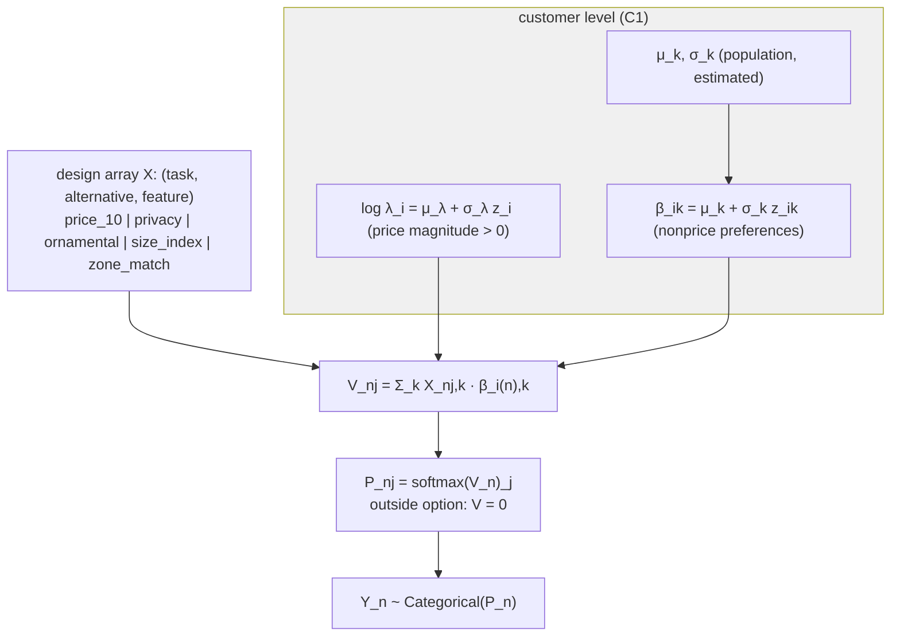

# PROJECT REPORT - Bayesian Marketing Day 3 - Product Choice, Willingness to Pay, and the Posterior Price Decision

Days 1 and 2 of the Bayesian Marketing workshop modeled how much customers buy: a repeat probability, then customer-level order rates drawn from an estimated population. Day 3 changes the question to *what* customers choose. Products compete inside a choice set at each purchase occasion, the model is a random-utility multinomial logit, and the deliverables run from preference recovery through willingness to pay to a posterior price recommendation. The day's sharpest result is a separation: two models that disagree about shares and about preference recovery agree, to the dollar, about the profit-maximizing price. The fit layer can be wrong in known ways while the decision layer is robust — and the workshop's job is to show when that claim is and is not licensed.

This report is the complete technical account of Day 3 (ticket `day3-lab3-proj3`): the choice-task generator and its audit, the design array with its ordering gate, the homogeneous and hierarchical logit fits (including a two-round sampler repair), preference recovery against hidden truth, willingness to pay computed from joint posterior draws, the price simulation, and the engineering record. Everything reproduced from seed 20260831 in the repo's frozen environment.

> [!summary]
> - The prior predictive check answered Task 2 with a number: before the data speak, the prior makes the outside option dominant (mean share 87.4%, upper band 99.8%). The likelihood then moves the outside share to its observed 13.2%.
> - The homogeneous model's coefficients are choice-set-specific quantities, not preference estimates: with four fixed product profiles and no alternative-specific intercepts, the generator's +4.1 inside constant is absorbed by the features — zone 2.20 against a true 1.60, the size coefficient sign-flipped to −1.71 against a true +0.55, and the price magnitude attenuated to 0.28 against a true 0.77 by aggregation over heterogeneous customers.
> - The hierarchical model (300 customers × 5 random-coefficient blocks) required the §C.5 repair ladder: 24 divergences at the handout's settings, R-hat 1.024 at `target_accept` 0.98, clean only at 0.99 with tune 4,000 — the funnel lives at near-zero heterogeneity scales, and the bimodal privacy preference mixture is beyond what normal random effects can represent.
> - Individual recovery is partial by design: price magnitude correlates 0.63 and type-driven ornamental preference 0.55 with truth; privacy recovers 0.42 with compression 0.06 (the mixture averages away); six choices per customer do not identify a preference vector.
> - Willingness to pay, computed draw-wise (never as a ratio of posterior means), came out wide and asymmetric: zone compatibility $78 [68, 92], privacy suitability $62 — levels confounded with the choice set, ratios more defensible than levels.
> - The price decision: cut the Premium Specimen from $109 to $74, expected profit +\$5.6k, P(beats current) = 0.99, the 5th-percentile profit at \$74 exceeds the *expected* profit at \$109, and both models put the optimum at exactly \$74.

## 1. The choice problem, and what the prior believes

Each of 1,800 tasks (300 customers × 6 tasks) shows four synthetic tree products — Fast Privacy Evergreen ($69), Compact Evergreen ($54), Flowering Ornamental ($64), Premium Specimen Tree ($109) — with displayed prices randomized ±\$10, and records one choice among the four products and an outside option. Hidden from the analyst, each customer has a type (casual 55%, privacy 25%, ornamental 20%) driving preference mixtures: privacy types weight privacy features at mean 1.55 versus 0.20 for others, ornamental types weight flowering appeal at 1.30 versus 0.10, and every customer carries an idiosyncratic lognormal price magnitude (center 0.75 per \$10), a size taste, and a strong zone-compatibility preference (center 1.60). All inside products share a +4.1 utility constant.

The audit records the mechanisms before any model runs: the outside option wins 13.2% of tasks; Compact Evergreen leads at 42.3% and Premium Specimen trails at 1.2%; 87.5% of chosen products are zone-compatible for their customer; chosen products' displayed prices average $58 against $78 for unchosen. Zone compatibility and price are visible in the raw conditional frequencies.

The prior predictive check asks what the model believes before conditioning. The answer is not subtle:

Under the prior, the outside option takes a mean 87.4% share with a band reaching 99.8%. The feature-coefficient priors (N(0,1)) and the lognormal price magnitude are not strong enough to make inside products attractive when utility differences are small, and the softmax amplifies small differences into near-certain choices in either direction. Task 2's question — does the prior imply any alternative is almost always selected? — has the answer *yes, the outside option*. Seeing this before fitting is the point: it establishes that the observed 13.2% outside share is a likelihood-driven result, not a prior-driven one.

## 2. Random utility, normalization, and the ordering gate

Utility is $U_{nj} = V_{nj} + \epsilon_{nj}$ with type-I extreme-value errors, giving softmax probabilities over the five alternatives. Only utility *differences* are identified — adding a constant to every alternative leaves choice probabilities unchanged — so the model needs a fixed reference. The outside option provides it: its feature row is all zeros, so its systematic utility is zero by construction.

The design array has shape (1,800, 5, 5). The alternative axis must match the integer choice labels exactly — the workshop's Hint 1 warns that a silent ordering error produces a well-sampled, meaningless model. The pipeline enforces the gate with assertions: the shape, the label range, and — decisively — that the outside option's row is all-zero. One design property dominates everything downstream: the four inside products have *fixed* profiles, so cross-product feature differences are perfectly collinear with product identity. Only the ±\$10 price noise varies within product.

## 3. The homogeneous model: coefficients as choice-set quantities

Model C0 fits one preference vector for the population, with the price coefficient constrained negative through a positive lognormal magnitude. It samples cleanly (4 chains, zero divergences, bulk ESS 1,269, 93 seconds) — and its posterior is the day's first teaching result:

| Coefficient | Posterior [90% HDI] | Generator center |
|---|---|---:|
| price magnitude (per \$10) | 0.282 [0.233, 0.331] | 0.77 |
| privacy | 1.760 [1.406, 2.126] | 0.54 |
| ornamental | 1.126 [0.846, 1.411] | 0.34 |
| size index | −1.705 [−2.366, −1.065] | +0.55 |
| zone match | 2.205 [2.057, 2.359] | 1.60 |

Every coefficient is displaced from its generator center, and the pattern is the finding. The model has no alternative-specific intercepts, so the generator's +4.1 inside constant must be absorbed by the feature coefficients. Zone match — equal to 1 for 87.5% of chosen products — takes most of it (2.20 against a true 1.60). The size coefficient flips sign because the only size-1.0 product is the rarely-chosen Premium Specimen: pushing that product's utility down requires a negative size weight. The price magnitude is attenuated by aggregation: the aggregate response to a price change is driven by customers near indifference, not by the average price coefficient — the homogeneous model estimates an average *marginal* response, not an average parameter.

Task 3 asks which averages are meaningful and which mask structure. The answer here is sharp: no coefficient level recovers a preference center, because with four fixed profiles the levels are not separately identified from the inside constant and product position. What the model supports is prediction within this choice set — shares, elasticities, counterfactual prices — and those are exactly the quantities the later tasks use.

## 4. The hierarchical model, and a funnel worth repairing

Model C1 gives every customer a price magnitude and four nonprice preferences, non-centered, drawn from estimated population distributions. Its first fit, at the handout's settings (tune 2,000, `target_accept` 0.95), produced 24 divergences — and the pipeline's §11.6 assertion gate refused to let it through. The cause is visible in the posterior: several heterogeneity scales concentrate near zero (σ_privacy 0.19, σ_log_price 0.22), and near-zero scales create funnel geometry even in non-centered form.

The §C.5 repair ladder prescribes reparameterization before tuning. The model was already non-centered with regularizing priors, so the correct action was the ladder's final step: raise `target_accept` (0.95 → 0.98 → 0.99) and extend tuning (2,000 → 4,000). The second fit reached zero divergences but R-hat 1.024 with bulk ESS 219 on σ_log_price — caught again. The third fit passed every gate: zero divergences, R-hat 1.007, bulk ESS 779, 952 seconds.

 Two lessons are worth keeping. First, assertion gates that fail loudly are cheaper than diagnostics read after the fact. Second, the funnel's root cause is substantive: the privacy preference is a bimodal mixture with separation ≈ 1.35 that a normal random effect cannot represent, so chains fight over how small σ should be — the sampler difficulty is a model-misspecification signal, not merely a numerical one.

## 5. Recovery: population levels confounded, individuals partial

Per-feature individual recovery, posterior means against truth: price magnitude correlates 0.63 (compression 0.14 — heavy shrinkage), ornamental preference 0.55, privacy 0.42 with compression 0.06 — the posterior means barely vary because the bimodal mixture exceeds the normal random-effect family. Zone recovers only 0.15 because its estimated heterogeneity (σ 0.85 against a true 0.20) absorbed residual product-position noise instead of true preference spread; size recovers 0.04. Six choices per customer do not identify a preference vector precisely. Hierarchical Bayes does not manufacture information; here it says so through wide individual posteriors, and what *is* recovered — price and the type-driven ornamental preference — is exactly what varies most systematically in the data.

## 6. Share posterior predictive checks

The conditional checks separate mechanisms that overall shares cannot. Zone-*match* choice probability is reproduced almost exactly (observed 0.277, replicates 0.276), but zone-*miss* is under-predicted (observed 0.086 against replicate bands 0.037–0.058): the models know compatibility helps but under-learn how much incompatibility hurts. The price-level curve shows both models under-responding at the extremes: at \$44 the observed choice probability is 0.599 against replicate means near 0.37. Heterogeneous price sensitivity is exactly what a near-homogeneous response function under-represents. Overall, Compact Evergreen's 42.3% observed share sits above both replicate bands (≈32%), and the outside option is over-predicted (18% versus 13%) — the residual is the type mixture that normal random effects average away. PSIS-LOO prefers C1 decisively (ELPD −2,190 versus −2,270, difference 80 with DSE 12, stacking weight 1.0), but the PPCs remain the honest ledger: neither model is fully adequate, and the residuals point at the mixture.

## 7. Willingness to pay, from joint draws

For feature f, willingness to pay per posterior draw is \$10 \cdot \beta_f / \lambda\$ — computed draw-wise, never as a ratio of posterior means. Two facts make the joint posterior the only correct source: the expectation of a ratio is not the ratio of the expectations, and the ratio's tails are governed by the denominator's lower tail (draws where λ is small produce extreme WTP). Only the draw-wise distribution shows that behavior.

The distributions are wide and asymmetric: zone compatibility \$78.33 [67.69, 92.41], privacy suitability $62.46 [46.65, 82.51], ornamental appeal $39.81, and a size-index increase −\$60.56 — the confounded sign from Section 3 carried into dollars. The interpretable reading is comparative: the constant-absorption confounding multiplies all coefficients by a common factor that partially cancels in β_f/λ, so *ratios* between features are more defensible than levels. The levels are dollar scalings of preference *within this four-product set with its inside constant*, not absolute valuations — RAM Chapter 11's caveat (WTP is a monetary scaling of preference, not automatically a market price) applies with extra force. The C1 cross-check (population mean zone WTP \$87 [74, 107]; individual medians spanning $45–$105) confirms the magnitude class rather than the exact number.

## 8. The price decision

The simulation rebuilds the design with the Premium Specimen at each candidate price, recomputes choice probabilities under 500 posterior draws, aggregates to demand at a market of 10,000 occasions, and applies a stated synthetic marginal cost of $38.

| Quantity | C1 | C0 |
|---|---:|---:|
| Profit-maximizing price | **$74** | \$74 |
| Expected profit at optimum | \$22,998 | \$22,745 |
| 90% profit interval at optimum | [\$17,575, $29,410] | [$17,237, \$28,474] |
| Expected profit at current \$109 | $17,431 | $17,617 |
| P(optimum beats current) | 0.992 | 0.998 |

The recommendation is to cut the Premium Specimen from $109 to $74. The decision-theory content is in the downside comparison, not the argmax: the 5th-percentile profit at $74 ($17.6k) exceeds the *expected* profit at the current price ($17.4k). And the robustness argument is structural rather than statistical: the two models disagree about shares, about recovery, and about heterogeneity scales — and agree about the optimum to the dollar. When the fit layer is known-imperfect in specific ways and the decision layer is invariant across those imperfections, the recommendation stands on the invariance, not on either model's adequacy.

## 9. Engineering notes

Three items from the ticket diary worth preserving:

- **Assertion gates caught both failed C1 fits.** The 24-divergence fit and the R-hat 1.024 fit were rejected before any interpretation was drawn from them. A gate that fails loudly is worth more than a diagnostic read afterward.
- **The einsum axis bug.** The price simulation's utility contraction was written `np.einsum("tnk,stk->sta", ...)` when the design array's axes are (task, alternative, feature) — the correct subscripts are `"tak,stk->sta"`. The error (`einstein sum subscripts string included output subscript 'a' which never appeared in an input`) was immediate and unambiguous; the lesson is that per-task coefficient gathering (draws × tasks × features) deserves a shape test before the grid loop.
- **Drafting residue.** `observed_stats` carried an unused merge and a malformed `set(zip(...))` fragment removed before first run. Static review of one's own draft remains cheaper than runtime archaeology.

## 10. Working rules

- Fix the utility reference before anything else: the outside option's all-zero row is both the normalization and a checkable invariant.
- Read homogeneous coefficients as choice-set quantities. With fixed profiles and no alternative-specific intercepts, levels are confounded with the inside constant; prediction within the set and feature ratios are what survive.
- Treat sampler difficulty as model information. A funnel at near-zero heterogeneity scales pointed at a mixture the random-effect family could not represent.
- Compute WTP draw-wise. Ratios of posterior means are not posterior summaries, and the ratio's tails live in the denominator.
- Report the decision layer's robustness explicitly. Two disagreeing models agreeing on the optimum is the strongest available evidence when neither model is fully adequate.
- Separate what the model learned, what WTP assumes, what profit assumes, and what the choice set limits — the Task 8 discipline. A price recommendation that blurs those four claims is not defensible.

## Related notes

- [[PROJECT REPORT - Bayesian Marketing Day 1 - Generative Models, Conjugate Validation, and the Poisson Failure Pattern]]
- [[PROJECT REPORT - Bayesian Marketing Day 2 - Hierarchical Recovery of Customer Heterogeneity]]
- Source repo: `/home/manuel/code/wesen/2026-08-31--bayesian-marketing` — ticket `day3-lab3-proj3` (intern guide, 4-step diary, chapter `artifacts/report-day3.md` with 7 figures); models in `day3/models.py`, the ordering gate in `day3/choice_data.py:build_design_array`, WTP in `day3/wtp.py`, the decision layer in `day3/pricing.py`.
