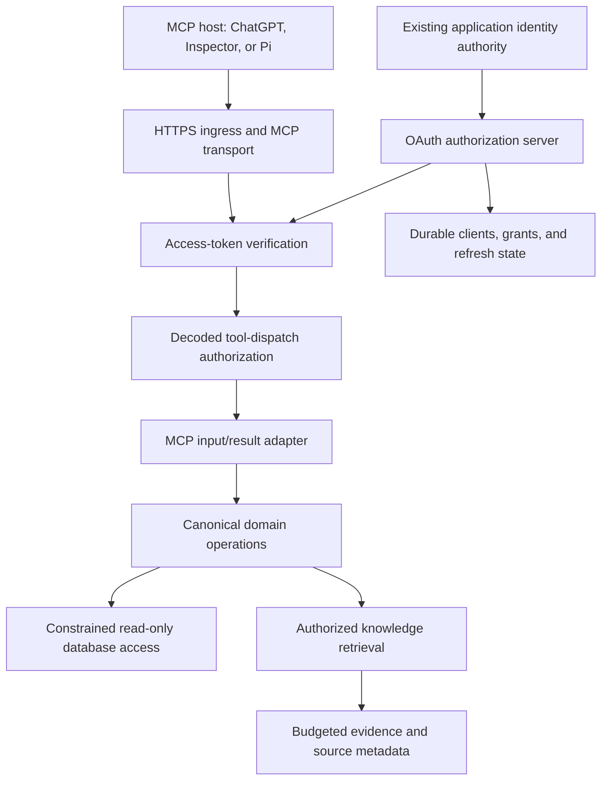
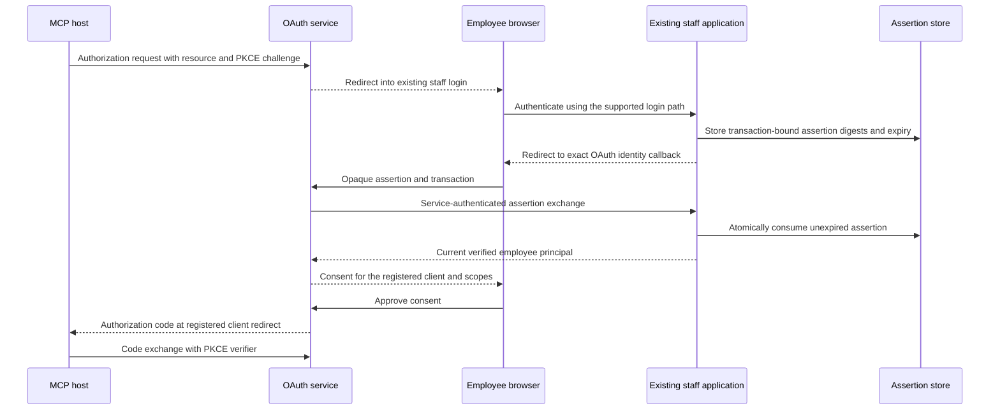

# Building a Production MCP Service

A production MCP service must do more than execute functions through JSON-RPC. It must explain those functions to independent clients, authenticate a caller, restrict delegated authority, preserve that authority through several software interfaces, and remain correct when its deployment changes. Each responsibility has a different failure mode and requires different evidence. A successful health check proves almost none of them.

This report develops an implementation method from the CoinVault MCP project, which progressed from local protocol tests to a working production ChatGPT connector. The purpose is not to reproduce an ecommerce application's internals. It is to identify what should be designed, tested, deployed, and observed when building another authenticated remote MCP service—particularly one involving `/home/manuel/code/ttc/rag-ttc` and `/home/manuel/code/ttc/ttc`.

The material combines source inspection, implementation diaries, commit history, deployment results, and the operator's final confirmation that the production connector works. Code examples labeled *pseudocode* express a contract, not a promise that the exact API exists in a particular SDK release. Protocol observations are dated evidence from this project, not an assertion about every MCP host or every future SDK.

> [!summary]
> - Separate domain operations, MCP transport, token issuance, identity verification, and document disclosure. Reusing domain functions does not mean combining their security responsibilities.
> - Prove authority at the final tool-dispatch boundary. Validating a token at HTTP ingress is insufficient if its scopes disappear before dispatch.
> - Test the real client and the complete HTTP response path. Inspector success does not prove ChatGPT compatibility; handler tests do not prove final headers.
> - Treat environment identity, image identity, Terraform state, and process ownership as explicit deployment inputs. Incorrect inputs can make a syntactically valid plan destructive.

## 1. Define the service before choosing its deployment

An MCP server exposes named operations with structured inputs, descriptions, and results. An MCP client discovers those operations and invokes them on behalf of a user or application. The transport carries requests; it does not decide which business operations are appropriate to expose.

For the first service, choose a small, read-only domain surface. CoinVault exposed SQL documentation, constrained SQL queries, and knowledge search. Those operations already existed outside MCP. The implementation adapted their registry into MCP definitions rather than maintaining a second implementation of retrieval or query validation. This choice made it possible to compare browser-assistant behavior with MCP behavior and to improve the underlying tools without creating parallel execution paths. [S1]

A useful initial architecture is:



The distinction between the domain layer and the adapter is operationally valuable. If a query is invalid, the query policy should reject it regardless of whether the call came from MCP, a browser assistant, or a test. Conversely, an invalid MCP request should not reach the domain function merely because that function is read-only.

For SQL tools, read-only behavior is a conjunction of controls: an approved statement policy, bounded execution, permitted schemas or tables, and a database account that cannot write. A model instruction to “only run SELECT” is not an enforcement mechanism. For knowledge search, read-only behavior says nothing about disclosure: a service can perform no writes and still return a document the caller must not see.

**First deliverable:** an operation inventory stating the function, input contract, result contract, required scope, data dependencies, and actual side effects. Do this before writing an ALB rule or registering a connector.

## 2. Write an identity contract, not a collection of URLs

A remote OAuth-protected MCP service has several identifiers that look similar but serve different purposes. Confusing them creates failures that often appear only after an external client begins discovery.

| Identifier | Meaning | Example for a proposed service |
| --- | --- | --- |
| Issuer | Identifies the authorization server whose tokens are trusted. | `https://mcp.example.test` |
| Resource | Identifies the protected service requested by the client. | `https://mcp.example.test/mcp` |
| Token audience | Identifies the intended recipient of the access token. | The exact configured MCP resource |
| Client redirect URI | Receives the OAuth authorization response in the MCP host. | Registered by that client |
| Application-identity callback | Returns the browser from an existing employee login system to the OAuth server. | `https://mcp.example.test/oauth/identity/callback` |
| Protected-resource metadata URL | Tells an unauthenticated client how to discover authorization. | `https://mcp.example.test/.well-known/oauth-protected-resource/mcp` |

The two callbacks are especially easy to conflate. The MCP host has its own registered redirect URI. Separately, an application-backed OAuth server may send the employee through another site's login and receive a one-time identity assertion at its own callback. These are different transactions with different validation rules.

For a protected resource at `/mcp`, the project had to expose the path-specific RFC 9728 metadata endpoint. Having metadata only at the origin root was insufficient for the observed client. An unauthorized MCP request advertised the exact location:

```http
HTTP/1.1 401 Unauthorized
WWW-Authenticate: Bearer resource_metadata="https://mcp.example.test/.well-known/oauth-protected-resource/mcp"
```

A resource document then identifies the resource and its authorization servers. Authorization-server metadata identifies registration, authorization, token, and other supported endpoints. Discovery is therefore an executable chain, not a README feature. Each returned URL must be reachable through the deployed ingress configuration. [S2]

A common deployment error is forwarding only `/mcp`. That makes the JSON-RPC route reachable but leaves registration, consent, callbacks, or metadata inaccessible. CoinVault used a dedicated host rule covering the service origin, rather than putting every OAuth path into a fragile path list. Another service can use different routing, but it must prove the entire discovery and authorization path through that routing.

### 2.1 Environment identity is larger than DNS

Production is not defined by a production-looking hostname. During early acceptance, the stable CoinVault hostname routed to a development service and development data. The later cutover created a production-owned service and moved development to its own hostname.

The complete environment identity was the combination of hostname, issuer, resource audience, identity authority, signing key, service bearer, OAuth state, database reader, and knowledge bundle. Changing only the DNS name would not have changed the authority behind the service. Copying development OAuth state would have created a different problem: development client registrations and refresh-token families could acquire production significance.

For TTC, decide the development and production origins before the first hosted authorization flow. Create separate state and secrets from the beginning. If a hostname must move, explicitly require re-registration or reauthorization where the client depends on the old authorization state. Do not assume that an unchanged connector URL implies an unchanged grant.

## 3. Authentication and delegated authorization are separate computations

Authentication establishes a principal: a verified subject and the attributes needed for policy. Authorization determines what that principal may do in a particular request. OAuth adds a delegation boundary: an eligible employee need not grant every available permission to every client.

The project represented several namespaces separately:

- **Application capabilities** describe durable employee entitlements.
- **OAuth scopes** describe the permissions available to a delegated token.
- **MCP dispatch scopes** are the verified scope representation used by the transport's tool policy.
- **Document access classes** determine which knowledge content may be disclosed.

A string with the same spelling in two namespaces does not automatically have the same authority. Explicit adapters make the intended conversion reviewable. Typed wrappers also prevent a function expecting an OAuth scope from accidentally receiving a capability name or a document class. The `CV-AUTHZ-TYPES-001` work made these conversions part of the design rather than leaving them as repeated string manipulation. [S3]

The central grant rule is an intersection:

$$
G = R \cap C \cap E \cap K
$$

Here, $R$ is the resource's supported scope set, $C$ is the client's allowed/requested scope set at the relevant transition, $E$ is the current employee-derived entitlement, and $K$ is the consented scope set. A detailed implementation separates client registration policy from each authorization request, but the invariant is the same: no one input can manufacture a permission absent from another required boundary.

```text
pseudocode: issue a grant

principal = verify_current_employee(identity_assertion)
resource = require_exact_registered_resource(request.resource)
client = require_registered_client(request.client_id)
require_exact_redirect_uri(client, request.redirect_uri)
require_pkce_s256(request)

available = project_capabilities(principal.capabilities, resource)
granted = intersect(resource.supported_scopes,
                    client.allowed_scopes,
                    request.requested_scopes,
                    available,
                    approved_consent.scopes)

persist_and_issue(subject=principal.subject,
                  resource=resource.id,
                  scopes=granted)
```

### 3.1 Coarse employee permissions do not require coarse tokens

The initial employee schema exposed several CoinVault-specific capabilities. Later review simplified this to one `coinvault` capability, with the existing administrator entitlement also authorizing all CoinVault scope types. The Go projection was correspondingly reduced: `admin` or `coinvault` yields the available scope set; neither yields no domain scopes. Commit `d93d80e` records that change. [S4]

This simplified employee administration without removing the token boundary. A client can still request a subset, the user can still consent to a subset, and a tool still requires its particular scope. Analyst knowledge remains a distinct disclosure scope even though the employee-level capability can make it available.

The change does broaden what a `coinvault`-only employee can request compared with the earlier implementation. That is an intentional policy change, not a behavior-preserving refactor. The report should not call it “unchanged authorization” merely because the code becomes shorter. TTC must decide independently whether a similarly coarse staff permission is appropriate for its customer, order, inventory, and internal-document data.

### 3.2 Check at decoded dispatch, not by parsing arbitrary request JSON twice

After token verification, a protected operation still needs a dispatch-time check. The authorization decision should happen where the SDK has decoded the request and identified the tool. Reimplementing JSON-RPC parsing in middleware creates disagreement about malformed envelopes, batching, method names, and handler selection.

The project found a concrete failure here. The custom HTTP verifier created an application principal containing the correct scopes, but the official SDK's decoded tool request looked for scopes in its own token-information field. That field was empty. Tool discovery worked; protected invocation failed as if the employee had no scopes.

The fix translated the verified principal into the official SDK token context. CoinVault consumed the corrected dependency in commit `0a7a378`. The lesson is to test a real protected invocation through the middleware and SDK, asserting that the handler runs exactly once when authorized and zero times otherwise. Testing the verifier and the policy function separately would not detect the missing context propagation. [S5]

Unknown tools also need explicit policy. A robust registration contract requires either a protected scope policy or an intentional public designation; accidentally registering a new domain function must not silently expose it. Public diagnostic tools should return no sensitive state.

## 4. Reuse an existing login without trusting the browser to assert identity

An application-backed OAuth server is useful when an organization already has employee accounts and a well-defined login process. It is not necessary to duplicate the password system. The OAuth server can obtain an authenticated employee assertion from that application and then perform its own client, consent, and token transitions.

The browser transports an opaque, short-lived assertion. It must not provide authoritative employee attributes directly. In the implemented pattern, the existing application stores digests of a random assertion code and the OAuth transaction, along with an employee identifier, exact allowed return URL, expiry, and consumption state. The OAuth service exchanges that assertion over a service-authenticated back channel. [S6]



Atomic consumption is essential. A select followed by an unconditional update can allow two callers to redeem the same assertion. The implemented pattern conditionally updates an unused, unexpired record and requires exactly one affected row before returning the principal. Only digests are persisted for the one-time code and transaction. The raw values still cross the browser and service interfaces, so they must remain excluded from logs.

Three details caused substantial hosted debugging:

1. **Use the supported login route.** A legacy Google login page and an ALB-managed OIDC route were not interchangeable. The wrong route failed with an origin mismatch even though both appeared to be employee login mechanisms.
2. **Preserve the transaction server-side through login.** The solution did not relax a generic return URL validator to carry arbitrary query parameters. It staged the transaction in the application session and resumed through an exact permitted path.
3. **Keep the service bearer separate from employee identity.** A back-channel 401 means the service credential was rejected. It does not prove that the employee is ineligible.

For TTC, reuse these contracts, not the PHP classes or URL layout. WordPress authentication, TreeAdmin role policy, route registration, and deployment behavior need their own inspected adapter.

## 5. OAuth is a durable state machine, not just token signing

Token signing is a small part of the authorization server. Dynamic registrations, authorization transactions, consent decisions, one-time codes, refresh generations, replay detection, and revocation all require explicit lifecycle rules.

OH Auth supplied reusable machinery for these transitions; CoinVault supplied the identity adapter, resource registry, capability projection, and deployment configuration. This separation allowed improvements to generic OAuth behavior without putting application database knowledge into the OAuth library.

### 5.1 Distinguish denial from inability to decide

Refresh revalidation must distinguish an authoritative policy decision from a temporary dependency failure. The project explicitly modeled eligible, ineligible, and unknown outcomes. A timeout, malformed upstream reply, or service-credential failure must not be treated as permanent employee revocation. [S7]

| Revalidation outcome | Issue a token? | Mutate the refresh family? |
| --- | --- | --- |
| Eligible, with current entitlements | Only within the existing grant and current policy | Perform the accepted atomic rotation |
| Authoritatively ineligible | No | Revoke according to policy |
| Upstream unavailable or result unknown | No | Preserve retryability; do not claim permanent revocation |
| Proven refresh replay | No | Apply the family-revocation policy |

“Fail closed” means issuing no unauthorized token. It does not mean destroying credentials whenever a dependency fails. Conflating these behaviors turns a short identity-service outage into a mass reauthorization event.

### 5.2 Expiration does not bound storage

Public Dynamic Client Registration and authorization endpoints create durable records. A TTL governs whether a record remains valid; it does not physically remove that record. The state-lifecycle investigation identified that registration limits alone would not bound transactions, consent records, codes, or refresh history.

A production design needs request-size limits, bounded field lengths, transactional admission limits, and a pruning policy. Refresh replay evidence must remain available for its required retention period; deleting every consumed refresh record immediately can remove information needed to detect replay. Rate limiting and storage quotas complement each other rather than replacing each other. [S8]

When carrying the implementation to TTC, verify which of these behaviors exists in the selected released OAuth library and which remains application or operational policy. A historical design ticket is not evidence that every proposed quota has shipped.

### 5.3 DCR metadata is not verified client identity

An anonymous client can choose a friendly display name. A consent screen must not imply that this makes the client trustworthy. Bind the consent record to the actual registered redirect URI, client identity, resource, and requested scopes. Display enough of that binding for an employee to recognize where authorization is going.

The hosted client also exposed an omitted-field problem: a registration without optional scope metadata resulted in an unusably empty client scope ceiling. The chosen default made omitted metadata use the server-supported set, while later request, resource, employee, and consent intersections continued restricting actual grants. Distinguish omission from an explicitly empty request; neither should be handled accidentally by a generic empty-string conversion.

### 5.4 Browser policy is part of the state machine's observable behavior

A consent form can succeed on the server and still fail in the browser. In the Inspector flow, a restrictive CSP `form-action 'self'` blocked the redirect to the registered cross-origin client callback after the one-time consent state had already been consumed. Clicking again then produced an invalid-grant error. The second error was a consequence, not the original cause.

The correction allowed the validated, snapshotted client callback origin rather than arbitrary request input. This preserves the security purpose of CSP while permitting the actual OAuth transition. Commit `2c5f3ea` records the application-side change. Browser testing is necessary here: a direct HTTP client does not enforce browser CSP. [S9]

## 6. Choose transport behavior deliberately and test the client's actual sequence

MCP transport compatibility is not established by installing a recent SDK. The SDK version, transport configuration, authentication adapter, and host's protocol sequence must agree.

Early tests exercised `initialize`, `tools/list`, and `tools/call` with an official SDK client. Inspector then proved the browser-driven OAuth path. Nevertheless, ChatGPT still reported no available actions. Secret-safe lifecycle logs showed that the observed ChatGPT client sent `server/discover` with protocol version `2026-07-28`, without a transport session. The then-selected SDK exposed that modern discovery behavior through stateless Streamable HTTP; the server was configured statefully. [S10]

The resulting CoinVault change, `35ec724`, made stateless Streamable HTTP the default while retaining explicit stateful and JSON-response options. This is a dated interoperability result: do not turn it into a universal statement that every MCP server must always be stateless or that every host uses that protocol version.

Three separate questions must be answered:

- Does the transport retain MCP session state?
- Does an HTTP response use JSON or Server-Sent Events?
- Does the application retain OAuth, conversation, or other durable state?

Stateless transport does not imply JSON-only responses, and it does not eliminate OAuth persistence. A client must inspect response content type and parse SSE when the selected transport returns it. An authorization store still needs persistence even if no `Mcp-Session-Id` is issued.

The implementation should test legacy initialization and the intended modern discovery path independently. Also verify that session requirements are not silently reintroduced by middleware, ingress affinity, or a default constructor. When diagnosing an external host, record what it actually sent instead of assuming it follows the same sequence as your smoke script.

## 7. Tool descriptors are an API surface

Tool names and argument schemas are not enough for a good host integration. A client needs to understand results and operational semantics before deciding how to present or invoke a tool.

The project added output schemas and behavioral annotations to the simple embeddable registration path in go-go-mcp, then attached explicit per-tool policies in CoinVault. Output schemas were derived from concrete result types with deterministic normalization. Definitions and references were inlined for the host-facing schema, while SQL-query alternatives remained explicitly represented. This work is recorded in `6e3cfab` and the descriptor diary. [S11]

```text
pseudocode: register a domain-backed MCP tool

definition = canonical_registry.lookup("knowledge_search")
register_tool(
    name = definition.name,
    input_schema = definition.parameters,
    output_schema = schema_for(SearchOutput),
    annotations = reviewed_behavior_for(definition.name),
    required_scopes = ["example:knowledge:read"],
    handler = invoke_canonical_function(definition.function)
)
```

The reviewable annotation policy described the three tools as read-only, non-destructive, idempotent, and closed-world. These terms require care. Idempotent does not promise identical query results as the database changes; it describes repeated invocation's additional effects. Closed-world does not mean the implementation never makes a network request: the service can use configured databases or embedding providers without permitting the caller to select arbitrary external entities.

Annotations are descriptive hints, not permissions. A malicious client can ignore them. Required scopes, query restrictions, and document policy remain server-enforced. Unknown tools should not inherit reassuring annotations merely because they share a registry with read-only tools.

Schema tests should validate actual structured results, including empty arrays, omitted optional fields, and each union variant. A snapshot test can detect drift in the advertised schema, but it cannot prove that every runtime result conforms to it. Treat schema changes as API changes, not formatting cleanup.

## 8. Evidence must be authorized before it becomes a citation

Knowledge tools return both content and metadata. A source list can leak information even when the content itself is withheld: a title, canonical URL, or document identifier may disclose that a protected document exists.

CoinVault therefore constructed its compact `sources` projection in the same admission loop as the final authorized, budget-constrained results. It did not build sources from the raw retrieval candidate pool. Commit `91b3d69` is the concrete implementation. [S12]

```text
pseudocode: produce an evidence-bearing result

for candidate in ranked_candidates:
    if not document_policy.allows(candidate, principal):
        continue
    evidence = ledger.admit(candidate)
    if evidence.was_omitted:
        increment_omission_count()
        continue
    results.append(evidence.authorized_content)
    sources.append(project_citation_metadata(evidence))

assert sources refer only to admitted results
```

This ordering gives an important invariant: anything cited was actually permitted and included within the invocation's output budget. Trimming the text after constructing sources would violate it.

The evidence ledger also needed the correct lifetime. An MCP transport session can span unrelated answers; it is not a reliable answer-run identifier. The safe default in this implementation was a fresh bounded ledger per tool invocation. A host-specific answer-run protocol could support a different lifetime, but it must be explicit rather than inferred from connection reuse.

Clickable Markdown links were the portable first step. Rich MCP App evidence cards were deferred because the library lacked the necessary resource-serving layer. A `sources` array does not automatically become an interactive widget. For TTC, start with authorized structured results and usable citations, then separately evaluate host support for resources and UI rendering.

## 9. Observability must preserve the security boundary

The hardest failures were initially indistinguishable to the operator: registration failed, consent failed, or a client showed no actions. Returning detailed internal errors to an unauthenticated client would have been the wrong solution. Instead, the project added structured internal events and coarse public errors.

Useful fields included route category, status, duration, request correlation ID, protocol version, decoded method name, transport mode, and typed failure category. Back-channel errors distinguished service authentication, employee ineligibility, invalid assertion, replay, expiry, upstream failure, and invalid response. That classification made it possible to diagnose an Apache forwarding defect without printing the bearer. [S2, S13]

Never log access or refresh tokens, authorization codes, PKCE verifiers, cookies, raw assertions, transactions, signing keys, client secrets, authorization headers, tool arguments, tool results, or transport session identifiers. An error object's string representation can contain a response body, so “we only log errors” is not a sufficient guarantee.

The lifecycle observer needed another invariant: observing a request must not consume or corrupt it. It inspected a bounded JSON-RPC envelope and restored the bytes before dispatch. That behavior belongs in tests, alongside tests proving that sensitive fields never appear in emitted events.

A compact diagnostic classification is more useful than an undifferentiated debug log:

| Observation | Next boundary to inspect |
| --- | --- |
| Protected-resource metadata is missing | Ingress routing and exact discovery path |
| Registration fails before browser navigation | Registration validation, schema migrations, state admission |
| Browser login succeeds but callback fails | Return allowlist, assertion binding, service authentication |
| Token issued; protected tool says missing scope | Middleware-to-SDK token context and dispatch policy |
| Inspector works; ChatGPT exposes no tools | Host protocol sequence and descriptor interpretation |
| ECS repeatedly starts and stops a task | Task events, image resolution, init containers, bundle startup |

These are diagnostic directions, not proof of a single cause. The point is to narrow the investigation without exposing request contents.

## 10. Deploy application code, schema, proxy configuration, and secrets separately

The production bridge required several independently managed changes. The PHP release contained a migration file, but the deployment script did not execute it. The repository contained an Apache vhost file, but deployment did not install it. The application needed a service bearer and callback allowlist, but those lived in shared configuration outside the release directory.

The reusable lesson is to inventory deployment mechanisms rather than equating a successful release workflow with a complete system change.

| Layer | Evidence required |
| --- | --- |
| Application release | The deployed commit contains the intended handler and policy code. |
| Database schema | Required columns, constraints, and tables exist in the actual target database. |
| Reverse proxy | The active configuration forwards authentication and routes only the intended paths. |
| Application configuration | The running configuration reader resolves the expected non-secret settings and a present secret. |
| Secret delivery | The workload can read only the intended secret references; its configured counterpart matches. |
| OAuth state | The environment owns its registrations, grants, signing key, and refresh lifecycle. |

For configuration edits, create a private verified backup before modifying the file. For database changes, a config backup is irrelevant. Inspect database recovery coverage, execute the approved migration normally, and verify the resulting schema. An idempotent migration can still be disruptive or destructive; do not run it merely as a status check.

Production verification found the employee authorization-version column, the single capability member, and the assertion table missing even though the PHP bridge was deployed. After explicit approval, the normal migration command completed and information-schema checks confirmed the column default, SET definition, InnoDB table, unique code-hash constraint, and employee foreign key. [S14]

### 10.1 Test success and failure through the final responder

The Apache configuration update enabled the service bearer to reach PHP. Missing and wrong bearers returned 401; a valid bearer returned 200. That established authentication forwarding, but inspecting the response headers found another defect.

`CoinvaultAuthorizationRest::noStore()` set `Cache-Control: no-store, private, max-age=0`. After a successful handler returned, the REST dispatcher executed `header("Cache-Control: no-cache, must-revalidate")`, replacing the earlier header. Authentication failures threw an exception and bypassed that success-path overwrite.

`no-cache` permits storage subject to revalidation; `no-store` prohibits storage by compliant caches. Therefore the successful identity response violated the intended storage policy even though authentication worked. The user explicitly deferred this hardening issue to activate production MCP. It remains an open issue, not an implemented fix. The observed development success response had the same overwrite. [S15]

For the next implementation, use real HTTP regression tests through the dispatcher and reverse proxy, covering valid and invalid credentials. Tests that call the handler directly can pass while the deployed response is wrong.

## 11. Immutable artifacts require authoritative identity verification

The most consequential deployment mistake was selecting an image digest from a workflow log with a generic SHA-256 search. Build logs contain many digests: layers, caches, intermediate manifests, and pushed images. A syntactically valid digest is not proof that the expected repository contains that image.

The incorrect value was copied into deployment inputs and later into the production activation example during review remediation. When development deployed it, ECS reported `CannotPullContainerError` because the manifest was not found. Both old tasks had already stopped under the single-task replacement policy, leaving the browser and MCP services unavailable.

Recovery resolved the image using the exact merge-commit tag in ECR and deployed the returned manifest digest:

```text
source commit: 0142e6ac66fa418d2b922bd6cbb247a8c3aebe96
ECR image tag: sha-0142e6ac66fa418d2b922bd6cbb247a8c3aebe96
verified digest:
sha256:67ce9de8e09df570ab6fcec19723413e3a385e31dbc8efe4cc2b70e5c172dd47
```

Commit `2917903e2` corrected the production example. The final production deployment verified this manifest directly before applying. [S16]

A deployment preflight should establish the entire chain:

```text
pseudocode: resolve a release artifact

commit = exact_approved_commit()
image = registry.describe(repository, tag="sha-" + commit)
require(image.exists)
require(image.platform matches task_runtime)
require(scan_result(image.digest) satisfies release_policy)
require(smoke_evidence covers every serving command in the image)

plan_input.image_uri = repository + "@" + image.digest
```

One image was shared by the browser service and MCP service. That reduced divergent serving artifacts but expanded the required smoke coverage. An earlier release had a Go typed-nil defect in the optional browser RAG verifier: a nil pointer stored in a non-nil interface activated an unintended code path. MCP could work while browser startup failed. The corrective commit was `3440a05`. Every command actually executed from a shared image needs a production-shaped startup test. [S17]

The image pipeline also rejected an image for a high-severity dependency finding. The dependency was updated rather than weakening the Inspector gate. Build success, scan acceptance, registry existence, and successful startup are four separate facts.

## 12. Terraform correctness depends on checkout identity and state ownership

A valid Terraform configuration can be the wrong configuration for the existing state. The development MCP resources originally lived only on the long-running infrastructure branch. A plan generated from a develop-based checkout without that wiring proposed deleting the live MCP service, target group, alarms, and listener rule. The plan was inspected and rejected before apply. [S14]

This was not a provider bug. A feature gate defaulted false in a root that did not pass the MCP inputs. Given that configuration, deletion was the expected Terraform result. The missing input was the identity of the intended source checkout.

Before planning, record repository, commit, worktree, module source, backend, variable file, and target environment. Then inspect resource actions, not only counts. “Two resources destroyed” could mean retiring immutable task-definition revisions or deleting persistent storage. Those are not equivalent risks.

The final production activation plan was seven additions and four updates, with no deletions. It added the MCP service, task definition, target group, host rule, and alarms; expanded exact secret-read permissions and ALB-only ingress; and updated the browser service to the shared serving image. The browser health-check adjustment was separately visible in the plan. No database, EFS, or shared ALB replacement was included. [S14]

Terraform contract checks require their own implementation discipline. A `check` block assertion is not equivalent to a blocking resource precondition: failed checks can be reported as warnings. For TTC, startup prerequisites such as nonempty embedding configuration and valid resource identity should be enforced through appropriate variable validation, blocking preconditions, application startup validation, or an explicit plan gate. Merely adding an assertion does not prove that an invalid deployment cannot proceed.

### 12.1 A state lock is evidence of ownership, not proof of a crash

An old production state lock recorded an apply operation from August 27. The stored task definition referred to an inactive revision while the live service used a newer one. Early diary entries concluded that a crashed apply caused the mismatch. The evidence supports an old lock and a state/live mismatch; it does not, by itself, establish the exact historical cause.

The investigation also used `-lock=false` while saying it had not bypassed the lock. That description was incorrect: the operation did not release the lock, but it did bypass lock acquisition. A safer procedure is to stop, identify the owner and active process, and obtain an explicit decision before continuing against possibly changing state. Age alone is insufficient.

Similarly, refresh-only apply does not adopt an arbitrary replacement resource. It updates Terraform's observations of tracked resources. If a tracked ECS revision is inactive, refresh does not automatically import a different revision as its replacement. Reconciliation may require an explicitly reviewed import or a planned new revision; it should not be promised as automatic cleanup.

### 12.2 The applying process must outlive the interactive tool timeout

The failing development apply also outlived the command runner's timeout. A subsequent attempt encountered a lock. The corrected production run used a detached process, a private log, and an explicit exit-status file; the operator polled service health and completion without killing Terraform.

The general rule is not “use nohup everywhere.” It is to choose a process supervisor or execution environment with a lifetime compatible with the deployment, preserve its exit status, and inspect ownership before retrying. If an operation times out at the caller, the remote or child operation may still be running. Never immediately force-unlock and replay the saved plan without checking.

Single-writer persistent state also affects rollout strategy. The service used one task and a replacement policy that can temporarily reach zero running tasks. Simply changing minimum healthy percentage to preserve the old task could introduce concurrent writers to the same state. Availability improvements require an explicit storage/concurrency design, not just a load-balancer setting.

## 13. Make acceptance a sequence of falsifiable claims

Testing became more effective when each stage proved one boundary. The initial status-only server should not require a populated knowledge bundle. The first authenticated tool test should not require production employee login. The first hosted discovery probe should not require a valid bearer.

| Stage | Claim to prove | Required evidence |
| --- | --- | --- |
| Local transport | Requests reach the intended MCP handler and results are parseable. | Discover or initialize, list, and a harmless status call |
| Local authenticated domain | Token verification and a real domain operation compose correctly. | Deterministic issuer, fixture data, protected invocation |
| Scope enforcement | Verified scopes survive to dispatch and denial prevents execution. | Handler invocation counts and negative-scope cases |
| Evidence policy | Citations and content obey the same authorization and budget. | Hidden-document and omitted-result tests |
| Hosted discovery | Every advertised endpoint is reachable through ingress. | Metadata 200s and exact unauthorized challenge |
| Browser authorization | Login, callback, consent, CSP, and PKCE work together. | A real browser completion, not only redirects from curl |
| Host integration | The intended MCP host discovers and invokes the tools. | Inspector/Pi/ChatGPT evidence kept distinct |
| Production deployment | Approved workload and identity are actually running. | Registry identity, completed ECS rollout, correct production metadata |
| Production acceptance | The operator can use the production connector. | User confirmation plus targeted authenticated checks as available |

The project used `scripts/test-mcp-deterministic.sh`, an official-SDK smoke client, Pi, Inspector, and ChatGPT. Their results should not be collapsed into one “MCP tests passed” statement. Each exercised different behavior.

Review automation needs similar precision. The first PR review ran on a stale head before later commits were pushed. A later “completed” status was mistakenly described as clean because issue comments were checked while inline review comments were not. New findings existed in the inline review API. Query all review surfaces and record the reviewed commit; a reaction disappearing is not proof of approval.

The final production evidence is narrower and stronger than an inflated completion claim: Terraform exited zero; browser and MCP services each ran one desired task with completed rollouts; production metadata returned the correct issuer/resource; unauthorized MCP returned the correct challenge; and the user subsequently said the connector worked. This does not claim a newly executed exhaustive production scope matrix or a fixed cache-header defect.

## 14. Transfer the method to rag-ttc and ttc

The next deployment should reuse tested contracts while preserving TTC's product boundaries. It should not be a rename of CoinVault's application-specific code.

### 14.1 Establish the actual source snapshot first

Inspection of `/home/manuel/code/ttc/rag-ttc` found a bare Git repository with stale scaffold files in the directory. Reading only the filesystem would suggest an empty `cmd/rag-ttc/main.go`. However, the locally available `origin/main` snapshot at `37e9e9e797fc9842912198af4a05003b0dfc7616` contains substantial customer/admin applications, an evaluation CLI, shared retrieval packages, and conversation authorization. `git worktree list` identifies an active worktree under `/home/manuel/workspaces/2026-09-01/add-plot-editor/rag-ttc`.

That repository detail matters because the CoinVault deployment already demonstrated the consequences of planning from the wrong checkout. Before TTC implementation, select the intended feature/release commit explicitly. The observations below refer to the inspected `origin/main` Git snapshot, not an assertion that the stale directory files describe the deployed product. [T1]

The inspected README describes separate customer and AdminOps assistants with distinct entry points and ownership directories. It also distinguishes reusable RagKit mechanisms, Optkit experimentation, and TTC product policy. MCP belongs beside the selected product's serving composition, not inside generic retrieval or optimization infrastructure.

### 14.2 Do not expose the loopback authorizer as remote authentication

In the inspected snapshot, `internal/admin/chatserver/authorization.go` explicitly describes `SQLiteAuthorizer` as enforcing application/session ownership for an approved loopback deployment. It does not authenticate an operating-system user; the server maps requests to a configured allowed principal. The server also uses fixed-subject integrations for related conversation features. [T2]

That can be correct for its stated local contract. It is not a remote employee authentication mechanism. Putting the existing server behind HTTPS would not transform the configured principal into a verified caller.

A TTC MCP service should obtain its principal from token verification on every request and enforce tool policy separately from conversation ownership. If it shares conversation features with the existing application, those features must accept the verified subject rather than reuse a process-global identity. Alternatively, keep MCP's stateless domain-tool surface separate from the browser conversation server and avoid exposing conversation management at all in the first release.

### 14.3 The TTC application identity adapter should use TTC's own policy

The TTC monorepo at `/home/manuel/code/ttc/ttc` is WordPress/WooCommerce-based. The inspected TreeAdmin plugin registers application endpoints through `TAPI::RegisterAPI`, and `tadmin/plugin/src/UserCaps.php` defines role/capability policy, including an inactive role. This is not the same persistence or authorization model as CoinVault's employee SET column. [T3]

The first implementation task should identify the supported staff login path, authenticated principal lookup, inactive-account semantics, and capability checking APIs. Do not infer authorization from frontend route visibility or copy the CoinVault SQL migration into WordPress.

A proposed adapter contract is:

```text
pseudocode: TTC employee adapter

begin_authorization(browser_session, transaction, return_url):
    require_exact_allowlisted_return_url(return_url)
    user = verify_supported_staff_session(browser_session)
    require_current_ttc_eligibility(user)
    return create_one_time_assertion(user.id, transaction, return_url)

exchange_assertion(service_credential, code, transaction):
    require_service_authentication(service_credential)
    assertion = consume_once(code, transaction)
    return current_verified_ttc_principal(assertion.user_id)

revalidate_subject(service_credential, subject):
    require_service_authentication(service_credential)
    return Eligible(current_principal) | Ineligible | Unknown(error)
```

This is a proposal, not an existing TTC endpoint. The exact subject format, route namespace, service-authentication method, revocation version, and persistence mechanism require a TTC-specific decision. Stable user IDs are preferable to mutable email addresses as subjects.

### 14.4 Keep customer and staff authority separate

The inspected rag-ttc architecture has separate customer and admin products. That separation should survive MCP exposure. An internal staff knowledge search and a public plant-information search may use common retrieval mechanisms while differing in corpus, document policy, query capability, and logging constraints.

Start with an internal read-only tool set if the goal is an employee connector. An optional coarse `ttc_mcp` permission could make a set of staff scopes available, but this is a policy proposal requiring review—not a name to silently add to `UserCaps`. Avoid automatically granting access to every administrator or every internal document without deciding whether TTC's existing role semantics warrant that expansion.

The MCP adapter should reuse audited domain functions. Arbitrary SQL is not a required feature of an MCP deployment. If rag-ttc's existing typed operations already satisfy the intended questions, exposing those can produce a smaller permission surface than introducing a general query endpoint.

### 14.5 Do not copy AWS resource assumptions

TTC already has infrastructure under `infra/terraform/dev` and `infra/terraform/prod`, alongside other deployment tooling. This report did not perform a live TTC infrastructure inventory. Therefore it does not assign an ALB priority, hostname, account, database reader, EFS path, or secret ARN for TTC. [T4]

Before deployment, identify the active application release mechanism, proxy configuration owner, certificate coverage, DNS ownership, database credentials, network boundaries, and backup/recovery process. Then decide whether ECS with a separate MCP task is appropriate. CoinVault's shared-image and single-task choices are useful options, not mandatory architecture.

A separate MCP process is a strong starting point when it allows independent authentication, resource identity, health checks, secrets, and rollout. It can still use the same built artifact as the browser service if every serving mode is tested and the broader rollout impact is accepted.

## 15. An implementation sequence for the TTC service

The following sequence is designed to avoid the failures observed in this project. Each phase ends with evidence that permits the next phase, rather than merely producing code.

### Phase 0 — Source and policy baseline

Select the actual rag-ttc worktree and commit, and pin the TTC application revision used for identity integration. Document which product owns the MCP service and which domain operations it exposes. Define development and production issuer/resource identities and the proposed staff eligibility policy.

**Exit evidence:** source snapshots recorded; operation inventory reviewed; exact identity table written; no production credentials or hostnames copied from CoinVault.

### Phase 1 — Local protocol and descriptors

Add a dedicated command/handler that adapts canonical domain operations. Begin with a harmless fixture, then one deterministic real operation. Advertise explicit input/output schemas, reviewed behavioral annotations, and per-tool policy. If the first fixture disables authentication, bind it to loopback and keep it out of public ingress; an unauthenticated test mode is not a deployment shortcut.

**Exit evidence:** discover/initialize, list, and call pass with the selected SDK; schema/result tests cover empty and error cases; transport mode and response encoding are explicit.

### Phase 2 — Authentication and authority propagation

Integrate the selected OAuth components or a suitably capable external authorization server. Add a TTC identity adapter only where the existing identity system does not already provide the required resource-bound delegated tokens. Keep capability, OAuth-scope, SDK-scope, and document-class conversions explicit.

**Exit evidence:** wrong issuer/audience denied; missing scope prevents handler execution; valid scope reaches the handler; inactive users cannot obtain new authority; transient revalidation failure preserves retryability.

### Phase 3 — Full browser flow and durable lifecycle

Test the supported staff login, transaction-bound callback, DCR behavior, consent display, CSP, PKCE, code consumption, refresh rotation, and revocation. Decide and test storage admission and pruning behavior. Do not describe a public registration endpoint as production-ready without considering its durable write capacity.

**Exit evidence:** real browser authorization completes; replay and expiry cases are covered; successful and unsuccessful identity responses preserve intended cache headers through the final dispatcher.

### Phase 4 — Development deployment

Build one immutable candidate, verify its manifest in the target registry, pass the scan policy, and smoke every command used by the deployment. Prepare independent application, schema, proxy, configuration, and secret-delivery changes. Plan from the intended source commit and backend.

**Exit evidence:** narrow reviewed plan; no unrelated destruction; secrets not logged; development services stable; callback allowlist matches the development issuer; real host discovers and invokes a protected domain tool.

### Phase 5 — Production preparation and cutover

Create production-owned state, secrets, and identity configuration. Verify recovery coverage before schema work. Separate resource-state reconciliation from service activation where possible. Prefer finishing production prerequisites before moving a shared public hostname, unless the operator explicitly accepts downtime.

**Exit evidence:** operator-approved changes applied; exact registry artifact running; health and OAuth discovery verified; application and proxy deployment states both known; production authenticated acceptance completed by the intended client.

### Phase 6 — Operational closure

Record what was actually tested, what remains deferred, and how to reproduce diagnostics without credentials in logs. Restore a steady-state no-op plan or document the remaining intentional differences. Keep an auditable mapping from source commit to artifact digest to deployed service revision.

For rag-ttc, use its documented release-mode checks (`GOWORK=off` or the matching Make targets) rather than relying only on a parent workspace. For TTC PHP changes, its agent instructions require Psalm and the relevant local test runners; TreeAdmin changes also have module-specific checks. These are implementation requirements to verify on the selected checkout, not tests executed by this report. [T1, T3]

### A small set of commands that make the sequence concrete

Use commands that make the source and artifact identities explicit. The following inspection commands do not deploy anything; adapt paths and profiles to the selected TTC checkout. In a bare repository, choose a real worktree before running builds or Terraform.

```bash
# Identify the source rather than assuming the current directory is main.
git rev-parse --show-toplevel
git rev-parse HEAD
git status --short
git worktree list

# CoinVault's existing deterministic, non-production acceptance harness:
GOWORK=off ./scripts/test-mcp-deterministic.sh

# Look up the image associated with the approved commit, not a log substring.
aws ecr describe-images \
  --repository-name "$REPOSITORY" \
  --image-ids "imageTag=sha-$APPROVED_COMMIT" \
  --query 'imageDetails[0].{digest:imageDigest,tags:imageTags}'
```

Planning has remote-backend effects even though it does not apply resource changes: normal Terraform planning can acquire and release a backend lock. Explain that distinction when an operator requests strictly read-only work, and stop on an existing unexplained lock rather than silently using `-lock=false`.

```bash
# Review the configuration and resource actions before an approved apply.
terraform validate
terraform plan -var-file="$REVIEWED_INPUTS" -out="$PRIVATE_PLAN"
terraform show -json "$PRIVATE_PLAN" |
  jq '.resource_changes[] | select(.change.actions != ["no-op"])
      | {address, actions: .change.actions}'

# After deployment: public discovery needs no bearer or employee data.
curl --fail --silent --show-error \
  "$ISSUER/.well-known/oauth-protected-resource/mcp"
```

Store plans privately: Terraform plans can contain sensitive values even when a human-readable summary redacts them. For authenticated probes, obtain credentials through the approved secret mechanism and retain only status, header-policy results, and bounded verdicts. Do not copy full tool responses into operational logs to prove that a test passed.

## 16. What the completed project actually established

As of September 6, 2026, production MCP was deployed at `https://coinvault.goldeneaglecoin.com/mcp`, with development isolated at `https://coinvault-dev.goldeneaglecoin.com/mcp`. The final activation used the ECR-verified manifest associated with CoinVault merge `0142e6ac`; production browser task definition `coinvault:6` and MCP task definition `coinvault-mcp:1` each reached one running task and a completed rollout. Terraform reported seven additions, four changes, and no destruction.

The operator then confirmed that the connector worked. That completes the narrative from a local MCP experiment to a usable production service. It does not erase the limitations: the successful-response `no-store` fix was explicitly deferred, early operational diagnoses were sometimes stronger than their evidence, and several review findings required more than one pass.

The reusable result is a method. Define identities precisely, preserve authority through every adapter, reuse domain operations, test client-specific protocol behavior, verify artifacts in the registry, inspect deployment plans from the correct checkout, and separate what is configured from what is demonstrably running. Those practices are directly transferable to TTC even where the application framework and infrastructure differ.

## Sources and evidence map

The primary evidence is local source and Git history. Paths below are relative to the named repository unless absolute. Historical diary statements are treated as reports of work, not automatically as current verified behavior. In particular, the old-lock crash explanation and early “review clean” statements are qualified in this article.

### CoinVault implementation and diaries

- **[S1] Canonical MCP adapter:** `coinvault/internal/mcpconn/tool_adapter.go`, especially `ToolOptions`, `coinVaultToolAuthorizationPolicy`, and `adaptToolHandler`. Tool execution remains the canonical registered function.
- **[S2] Discovery and hosted diagnostics:** `coinvault/ttmp/2026/09/02/CV-OAUTH-OBS-001--oauth-and-mcp-structured-observability-for-hosted-connector-debugging/reference/01-investigation-diary.md`, especially Steps 1–5 and 9–15; `internal/mcpconn/server.go` and `internal/mcpconn/observability.go`.
- **[S3] Typed authority and local acceptance:** `coinvault/ttmp/2026/09/02/CV-AUTHZ-TYPES-001--type-safe-authorization-namespace-boundaries/reference/01-investigation-diary.md`; Steps 11–13 record transport, deterministic authenticated-tool, and Pi acceptance. See also `internal/documentauthz/` and `internal/mcpconn/principal_scopes.go`.
- **[S4] Coarse capability projection:** [CoinVault commit d93d80e](https://github.com/goldeneagle/coinvault/commit/d93d80efad73a16ea72cf765242e090583c5aeea), `internal/mcpauthz/capabilities.go`, `internal/mcpoauth/provider.go`; paired with GEC PR #1026 and the production ticket's Phase B2 diary.
- **[S5] Scope propagation correction:** [CoinVault commit 0a7a378](https://github.com/goldeneagle/coinvault/commit/0a7a378352a9fcd92e2a0136cbd292a188b63a47); go-go-mcp token-context integration and decoded tool authorization under `pkg/embeddable/`.
- **[S6] Existing-application assertion adapter:** `goldeneaglecoin.com/src/lib/CoinvaultAuthorizationService.php`, `src/rest/CoinvaultAuthorizationRest.php`, and `misc/schema/coinvault_authorization_assertions.sql`. These are examples of the contract, not TTC implementation templates.
- **[S7] Refresh failure semantics:** `coinvault/ttmp/2026/09/01/COINVAULT-OAUTH-REFRESH-REVALIDATION--separate-authoritative-refresh-denial-from-transient-gec-failures/reference/01-investigation-diary.md`; implementation adapter in `internal/mcpoauth/provider.go`, `gecRevalidator`.
- **[S8] Durable-state lifecycle analysis:** `coinvault/ttmp/2026/09/01/COINVAULT-OAUTH-STATE-LIFECYCLE--bound-dynamic-registration-and-oauth-state-persistence/reference/01-investigation-diary.md`. Also the consent-identity ticket in the same date directory. These distinguish design requirements from implementation evidence.
- **[S9] Browser consent redirect fix:** [CoinVault commit 2c5f3ea](https://github.com/goldeneagle/coinvault/commit/2c5f3ea384c7c74eb39e21367fd8f7125801fc9b), and the earlier hosted acceptance report linked below.
- **[S10] Stateless discovery integration:** [CoinVault commit 35ec724](https://github.com/goldeneagle/coinvault/commit/35ec7248842d61496a0204b50e1d2fbdb8ea9695), CLI transport flags and `internal/mcpconn/server.go`. The `2026-07-28` client behavior is a historical observed integration fact.
- **[S11] Output descriptors:** [CoinVault commit 6e3cfab](https://github.com/goldeneagle/coinvault/commit/6e3cfab703949b46f3955908a085bba8f4509c0a), `internal/coinvaulttools/descriptors/`, `internal/mcpconn/tool_descriptor_test.go`; `CV-MCP-EVIDENCE-UI-001` diary under `ttmp/2026/09/03/`.
- **[S12] Linked-source projection:** [CoinVault commit 91b3d69](https://github.com/goldeneagle/coinvault/commit/91b3d6932a193ab0448a449ecca3d6ad598fbc0e), `internal/knowledge/tool.go`, particularly `SearchSource` and the `runSearch` admission loop.
- **[S13] Proxy and login boundary:** `goldeneaglecoin.com/docs/coinvault-mcp-authorization-boundaries.md`, `infra/webserver-config/prod/apache/admin.conf`, `docs/deploy.md`. The deployment script is `.github/workflows/deployprod.yml` plus `deploy2/deploy.sh`.
- **[S14] Production deployment chronology:** `coinvault/ttmp/2026/09/04/CV-MCP-PROD-001--coinvault-mcp-production-deployment-and-dev-host-split/reference/01-investigation-diary.md`, particularly Steps 5, 9, 14, 15, and 16. Step 16 records the final production plan, service revisions, and endpoint checks. Documentation commit `e7067c7` records successful activation; the subsequent operator message confirms connector usability.
- **[S15] Final-header overwrite:** `goldeneaglecoin.com/src/vendor/php-restserver/lib/RestServer.php:250–257`, inspected in the live production release; `CoinvaultAuthorizationRest.php` sets no-store before service authentication after [commit 2c92890fb](https://github.com/goldeneagle/goldeneaglecoin.com/commit/2c92890fb4527083dd92840ae3c66b7072574f26). The dispatcher overwrite is a separate unresolved issue.
- **[S16] Artifact correction:** [GEC commit 2917903e2](https://github.com/goldeneagle/goldeneaglecoin.com/commit/2917903e20b550264c471e3db90cc7ef6452571f), PR #1028; ECR verification and recovery in production diary Step 14. Final deployment rechecked the tag/digest association instead of relying on the workflow-log extraction.
- **[S17] Shared-image browser startup regression:** CoinVault commit `3440a05`, `cmd/coinvault/cmds/serve.go`; `CV-MCP-ACCEPT-001` diary Steps 23–24 records the typed-nil failure and recovery. Dependency vulnerability repair is recorded in CoinVault commit `3befc1d` and PR #27.

### TTC inspection: bounded transfer evidence

- **[T1] rag-ttc source identity:** bare repository `/home/manuel/code/ttc/rag-ttc`; inspected local remote-tracking snapshot `origin/main` at `37e9e9e797fc9842912198af4a05003b0dfc7616`. Sources read through Git include `README.md`, the repository tree, and the admin authorization/server files. The root directory's scaffold files are not the basis for the transfer design.
- **[T2] Loopback ownership contract:** at that snapshot, `internal/admin/chatserver/authorization.go`, `SQLiteAuthorizer`, `ConversationAuthorizer`, and `AuthorizeConversation`; `internal/admin/chatserver/server.go` uses the configured principal and fixed-subject adapters. These observations are not a complete security audit of rag-ttc.
- **[T3] TTC identity and workflow:** `/home/manuel/code/ttc/ttc` inspected at `9b7a7998687c953bad86c032aacf2924eed220ac`; `AGENTS.md`, `tadmin/AGENTS.md`, `tadmin/plugin/src/UserCaps.php`, and endpoint registration in `tadmin/plugin/src/Plugin.php`.
- **[T4] TTC deployment inventory:** directory inspection of `ttc/infra/terraform/dev`, `ttc/infra/terraform/prod`, and related tooling. No live TTC cloud resources were queried or changed for this report; proposed deployment details remain decisions to make.

### Related vault reading

- [[PROJECT REPORT - CoinVault MCP - From Local Conformance to ChatGPT 2026-07-28]] documents the earlier hosted acceptance phase in greater application-specific detail. Its development-owned stable hostname describes the state at that earlier date, not the final production topology.

The report preserves that history rather than rewriting it. The next service should inherit the verified contracts and the corrected procedures—not the transient deployment values or the mistakes that exposed them.
