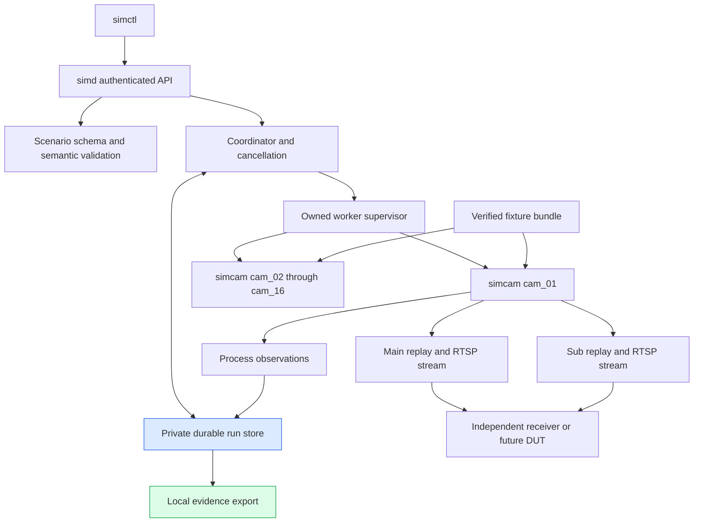
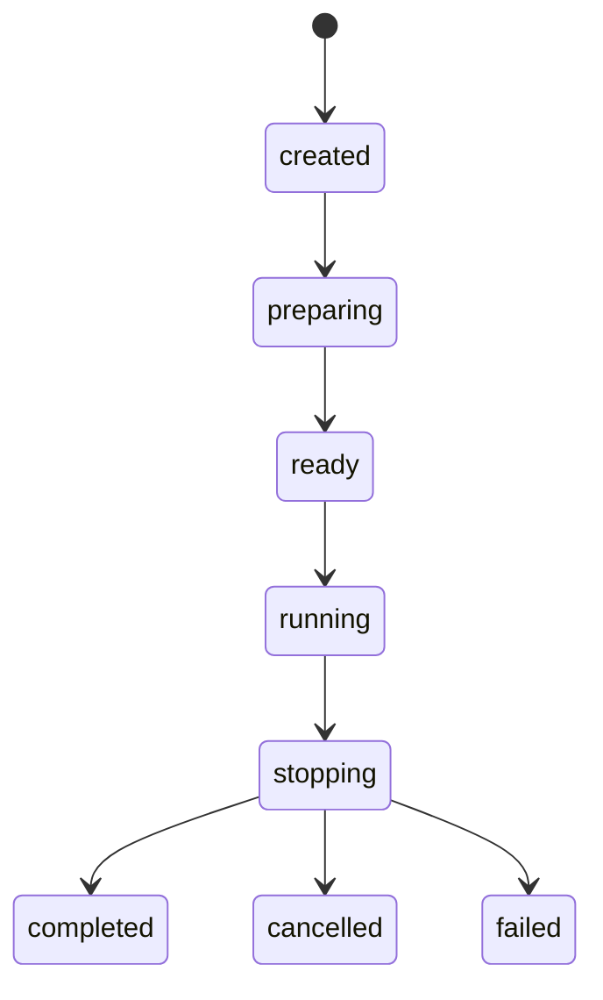

# Camera Simulator: Deterministic Replay, Process Ownership, and Evidence-Based Reporting

A video-system experiment is only interpretable if the source of its video is itself understood. A missing frame might be an intentional omission, a generator scheduling failure, a transport failure, or a recording failure. A timestamp error might originate in the source clock rather than the recorder. A successful stream write says less than a successful independent decode. The camera simulator in this project makes those distinctions explicit in its scheduling, process ownership, fault injection, and retained evidence.

This report explains the implemented `camera-simulator/` component of Video Observatory. It develops the media and time model before examining the Go implementation, then follows an actual four-fault run from scenario admission to an exported report. The implementation checkpoint is **`35ec406`**, which adds durable process-epoch observations and local evidence export. The project is not yet a complete or performance-qualified experiment laboratory. Sibling backend and web-UI implementations are outside this report's implementation audit; their presence in the repository does not establish simulator-to-backend integration.

> [!summary]
> - Pre-encoded calibration fixtures are replayed by independent camera processes against a shared monotonic schedule.
> - Worker startup is authorized by a durable identity record before the worker opens its media resources; recovery uses exact identities and Linux pidfds.
> - Four source faults operate at distinct points before packetization, after packetization, or during RTCP emission.
> - The current report exports measured local facts and declares acceptance **inconclusive**. It does not substitute stream publication for receiver delivery or synthetic fixtures for semantic accuracy data.

## 1. What the project measures—and what it does not yet measure

The intended system has three distinct participants: a controlled video source, the device under test, and an independent observer. The source produces encoded media and applies selected faults. The device under test records, analyzes, and presents that media. The observer determines whether the intended effects occurred and whether the resulting output satisfies the experiment's assertions.

The current implementation supplies the first participant and several independent conformance observers. It does not yet provide the complete backend workload driver, browser runner, resource qualification, or 24-hour acceptance procedure described in the specifications. This distinction determines what a successful test means. Opening 32 endpoints and decoding samples demonstrates real transport behavior across independently running cameras. It does not establish sustained capacity at the required bitrate, model correctness, browser smoothness, or bounded resource use over a day.

The repository is `/home/manuel/code/wesen/2026-09-07--streaming-system`. The normative handoff is under `video_platform_v1/`; the simulator keeps exact embedded contract copies and drift checks under `camera-simulator/contracts/`. The design and chronological implementation record belong to ticket `CAMSIM-001`, under:

```text
ttmp/2026/09/08/
  CAMSIM-001--implement-camera-simulator-and-reproducible-load-laboratory/
```

The project directory records a September 7 start date; the retained report and this analysis were produced on September 9. The code uses Go toolchain **1.26.8** and gortsplib **v5.6.5**. Offline fixture creation and independent decode use FFmpeg; the earlier conformance documentation records FFmpeg 6.1.1. These are implementation and evidence versions, not a claim that every supported platform or later dependency version behaves identically.

### Current implementation boundary

| Implemented and exercised | Still required for the full laboratory |
|---|---|
| Verified golden main/sub calibration fixtures | Complete fixture variants, B-frame support, and licensed semantic datasets |
| Rational frame schedules and same-host clock anchors | Independently decoded cross-camera phase acceptance |
| Independent RTSP camera processes and bounded readers | Deterministic wire SSRC control |
| Durable admission, idempotency, scheduling, stop, and local crash recovery | Ownership and recovery for privileged network/backend resources |
| Four automatic source-fault adapters | Remaining fault types and dynamic/manual fault operations |
| Local Markdown/JSON evidence export | Canonical acceptance reports, fault receipts, full provenance, and truth export |
| Independent packet and FFmpeg conformance tests | Backend/browser/model integration, load qualification, and an actual 24-hour soak |

The distinction is not merely documentary. Unsupported execution requirements are rejected during preflight instead of being silently omitted. A successful run lifecycle does not evaluate every assertion in the scenario's `expected` section.

## 2. The media model: pictures, access units, profiles, and transport

An H.264 access unit, abbreviated AU, contains the encoded material for a picture. It consists of one or more NAL units. Some NAL units describe decoder configuration; others contain encoded image slices. An IDR picture provides a random-access boundary that removes dependencies on pictures preceding it. An ordinary predictive picture can require earlier decoded pictures even if all of its own bytes arrive intact.

An MP4 file is a container for these encoded samples and their timing metadata. It is not a stream of RTP packets. RTP packetization takes the NAL units of an AU and produces one or more packets. RTSP controls discovery, setup, and playback of the resulting streams. RTCP sender reports associate RTP time with source wall time and carry sender counters. Treating these as separate representations is necessary to inject faults at a well-defined stage.

Each simulated camera exposes two independent profiles:

| Profile | Image dimensions | Frame rate | Frame interval |
|---|---:|---:|---:|
| Main | 1920 × 1080 | 15 fps | 1/15 second |
| Sub | 640 × 360 | 10 fps | 1/10 second |

The profiles represent the same content timeline but sample it on different grids. At 200 ms, main frame index 3 and sub frame index 2 refer to the same logical instant. Comparing their integer frame indexes directly would therefore be incorrect.

The initial golden fixtures use closed one-second GOPs and prohibit B-frame reordering. This restriction simplifies the implemented timing model: presentation time and decoding time must agree. It is an explicit subset, not evidence that reordered video is already supported. The binary index retains both PTS and DTS fields so that the distinction remains visible in the data model.

## 3. Offline fixtures keep encoding out of the run's critical path

Encoding every camera continuously would make encoder scheduling and encoder resource consumption part of the source workload. That can be appropriate for a different experiment, but it is not the desired baseline here. The current simulator prepares compressed media offline and spends runtime resources selecting samples, pacing them, packetizing them, and serving readers.

The controlled builder generates deterministic calibration imagery, encodes both profiles, inspects the resulting media, and verifies markers after compression. A bundle contains media, binary sample indexes, a manifest, labels, licensing information, and checksums. The fixture is published only after the preparation steps succeed.

```mermaid
flowchart LR
    A[Calibration recipe] --> B[Render marker and imagery]
    B --> C[Offline FFmpeg encoding]
    C --> D[Inspect sample layout and timing]
    D --> E[Independently decode and verify markers]
    E --> F[Write manifest and checksums]
    F --> G[Publish verified fixture bundle]
    G --> H[Runtime indexed AU reads]
    style G fill:#dbeafe,stroke:#2563eb
    style E fill:#dcfce7,stroke:#16a34a
```



### 3.1 The sample index is a checked media representation

`internal/fixture/index.go` defines an index with a magic/version header, a track timescale, a sample count, and fixed-size **40-byte** records. Records are serialized in big-endian field order:

```go
type Sample struct {
    Offset       uint64
    Length       uint32
    PTS          int64
    DTS          int64
    Duration     uint32
    RandomAccess uint32
    ConfigID     uint32
}
```

The loader checks bounds before allocating or reading payloads. A sample cannot extend past its media file, overlap an earlier payload, have zero duration, refer to an unknown configuration, or violate the continuous golden decode timeline. The first sample must begin at time zero and provide random access. A sample with `PTS != DTS` is rejected by this golden implementation.

AVCC parsing checks each length-prefixed NAL unit rather than trusting the container's offsets alone. The implementation bounds sample count at three million, sample size at 32 MiB, and the number of NAL units per AU at 4,096. These limits prevent unbounded input expansion; they are not a measurement that the largest admitted index is inexpensive on a particular host.

`Source.UnitAt` binary-searches the sample timeline using loop-relative microseconds. One immutable AU is cached per source. Its returned NAL slices can refer to the cached bytes, so callers must not mutate them to implement a fault. A packet-drop decision can omit a packet without modifying the fixture's underlying image data.

### 3.2 Integrity is not the same as provenance

`OpenBundle` verifies a fixed allowlist of files and their checksums, checks manifest shape, validates the indexes against media sizes, and compares decoder configuration with encoded data. It uses a rooted filesystem API rather than interpreting scenario input as arbitrary local paths.

A checksum manifest can detect a changed file relative to that manifest. It cannot establish authenticity if someone replaces both the file and its checksum. The loader explicitly documents this limitation. The trusted registry and readiness checks pin a manifest digest; the digest is the relevant identity when deciding whether a worker opened the configured fixture.

The exported local report does not yet include the complete fixture/build provenance package required for full reproducibility. A scenario's `fixture_id` is a logical reference, not a replacement for retaining the actual manifest and toolchain inputs.

### 3.3 What a calibration marker establishes

The marker records a fixture/sample identity with a CRC and is checked after compression. The calibration scheme uses a common 30 Hz counter so that the 15 fps and 10 fps profiles can be compared at shared content instants.

A pre-encoded marker does not contain the live run's wall-clock time. Replaying a fixture repeats marker values. To interpret one decoded marker as a particular run event, an observer must also know the camera/session identity, loop mapping, and process or transport epoch. Sixteen cameras reusing one fixture do not acquire sixteen distinct visual identities merely by having sixteen RTSP paths.

This is also why calibration data cannot establish detector accuracy. Moving synthetic shapes are useful for timing and continuity. Semantic evaluation still needs appropriate footage, annotations, rights, and real model configurations.

## 4. Deriving the schedule from the frame index

The simulator separates four time coordinates:

1. **Monotonic elapsed time** determines when work should happen.
2. **Fixture content time** determines which encoded sample should be selected.
3. **Source UTC** supplies a wall-time label for the stream.
4. **RTP time** supplies a protocol timestamp at a 90 kHz clock rate.

If these coordinates are collapsed into one variable, a clock fault can accidentally change frame pacing or content selection. The implementation instead maps from a shared elapsed-time coordinate into each output domain.

### 4.1 Rational deadlines avoid accumulated rounding error

For frame rate $p/q$, the deadline of frame $n$, relative to the run anchor, is:

$$
d_n = \left\lfloor\frac{nq\cdot 10^9}{p}\right\rfloor
\quad\text{nanoseconds}.
$$

At 15 fps, the first deadlines are 0, 66,666,666, 133,333,333, and 200,000,000 ns. They are derived independently from the index. Repeatedly adding a rounded interval would accumulate the rounding error. Rounding 1/15 second to 67 ms is especially damaging: the 333⅓ μs error per frame adds up to roughly 432 seconds across the nominal 1,296,000 frame intervals of a day. This is an arithmetic illustration, not a measured drift result from this implementation.

`Grid.DeadlineNS` uses checked multiplication and division. `Grid.IndexAt` implements the inverse of the **floored** deadline, not an approximate floating-point inverse. For elapsed integer nanoseconds $t$:

$$
\left\lfloor\frac{nq\cdot 10^9}{p}\right\rfloor\le t
\iff nq\cdot 10^9 < (t+1)p.
$$

The code uses that strict inequality to calculate the last eligible frame without an off-by-one error at quantized boundaries. It also enforces the implementation's 24-hour arithmetic range. Testing that range is different from running for 24 hours.

### 4.2 Content phase and clock drift are different operations

Let $e$ be elapsed nanoseconds, $\phi$ the content phase in microseconds, and $L$ the fixture duration in microseconds. The selected content coordinate is:

$$
c(e) = \left(\left\lfloor e/1000\right\rfloor + \phi\right) \bmod L.
$$

The loop index is the corresponding integer quotient. Applying a phase changes the selected imagery without changing the monotonic send deadline.

For source-clock drift $\rho$, expressed in parts per billion, the mapper approximately adds $e\rho/10^9$ nanoseconds before converting to UTC microseconds. An explicit offset is then added to the wall-time label. RTP time has its own drift parameter in the clock package and is computed modulo $2^{32}$. The current RTSP configuration supplies its configured drift to both source and RTP mapping; this is not a claim that every scheduled clock-fault domain from the specification is implemented.

An offset of +30 seconds should change the advertised source time, not delay every packet by 30 seconds. Independent wire tests exercise a +30-second offset and +500 ppm drift. They test the protocol mapping rather than trusting a log message that merely repeats the requested parameters.

### 4.3 Rollover is normal protocol behavior

At 90,000 ticks per second, a 32-bit RTP timestamp wraps after:

$$
\frac{2^{32}}{90000} \approx 47,721.86\text{ seconds} \approx 13.26\text{ hours}.
$$

A day-long run crosses that boundary. Modular arithmetic is therefore necessary even if a short fixture loops every few seconds. A fixture loop and a timestamp wrap are different events: looping selects earlier fixture samples while RTP time continues through the run. An intentional timestamp-reset fault would introduce yet another event, requiring explicit epoch semantics; that adapter remains future work.

### 4.4 Sharing a monotonic anchor across processes

Go's `time.Time` does not preserve its private monotonic state through ordinary serialization. Sending a serialized `time.Time` to sixteen workers would not, by itself, establish a common pacing coordinate.

`HostAnchor` instead records Linux `CLOCK_MONOTONIC`, UTC microseconds, and sampling uncertainty. The sampler brackets `time.Now()` with two monotonic reads and uses their midpoint. Its uncertainty includes half the bracketing interval, rounded upward, plus a microsecond of wall-time quantization allowance. Each worker reconstructs a local Go deadline using the shared monotonic coordinate.

This is a **same-host, same-time-namespace** mechanism. It does not establish synchronization between independent hosts. Cross-host latency measurements would require their own clock-offset uncertainty accounting.

Absolute `start_at_us` scheduling projects a future UTC instant onto monotonic time once. Later wall-clock changes do not move the resulting deadline. A distant run can be admitted durably without allocating workers immediately; preparation begins within a five-minute window. The five-minute bound limits early resource allocation, not how far ahead an absolute start may be scheduled.

## 5. Runtime architecture and the RTSP adapter

The implementation separates control-plane work from media production. `simctl` is a remote client. `simd` owns the authenticated API, trusted configuration, durable run store, and coordinator. A `simcam` process owns one camera and both of its profiles.



A separate process per camera gives crash tests a real process boundary. Killing one camera does not terminate the address space of every other camera. It does not isolate shared host CPU, memory bandwidth, disk, or network capacity. The sixteen-process conformance test establishes process and endpoint behavior, not sixteen physically isolated sources.

### 5.1 The replay loop retains evidence of missed work

The following pseudocode simplifies `internal/rtsp/server.go`; it preserves the order relevant to scheduling and fault semantics:

```text
index = grid.IndexAt(max(0, elapsed_since_anchor))
epoch_start_frame = index
scheduled = index
skipped = index

until cancelled:
    deadline = grid.DeadlineNS(index)
    wait until anchor + deadline
    actual = elapsed_since_anchor
    record maximum lateness

    current = grid.IndexAt(actual)
    if current > index + 1:
        scheduled += current - index
        skipped += current - index
        index = current
        deadline = grid.DeadlineNS(index)

    mapping = clock.Map(deadline)
    scheduled += 1
    decision = faults.At(deadline, index)
    apply AU-level omission or packetize selected fixture AU
    apply packet-level omission and publish remaining packets
    account for reader presence and local publication
    emit or suppress due RTCP report using actual elapsed time
    index += 1
```

When production falls sufficiently behind, the loop does not send an unbounded backlog as a burst. It advances to the current frame position and records skipped work. That policy preserves a bounded scheduling response, but the skips must remain visible to later qualification. Silently lowering the advertised frame rate would produce a different experiment without saying so.

The initial `scheduled` and `skipped` baselines include frame positions before this process began replaying. This supports run-global indexing, but it also creates an accounting obligation when processes restart. The `epoch_start_frame` field added in the report slice exposes that baseline explicitly.

### 5.2 Reader isolation is bounded, not unlimited buffering

The RTSP adapter configures gortsplib with a write queue size of 256, a two-second write timeout, a ten-second read timeout, and a thirty-second idle timeout. Reader admission is bounded; the configured per-profile limit must be between 1 and 64. An abandoned reader is disconnected rather than allowed to accumulate unlimited pending media.

The conformance test for slow readers verifies that an abandoned main-profile reader is evicted while independent sub-profile decode continues. These fixed bounds are useful failure controls. They do not establish a complete CPU/RSS/file-descriptor budget or prove that every legal configuration meets the desired latency envelope.

### 5.3 A decoder passed while the sender report was wrong

The most instructive protocol defect concerned SSRC, the RTP synchronization-source identifier. The simulator derived seeded packetizer identities. gortsplib, however, owns an internal stream SSRC and rewrites outbound packets to that value. The original custom RTCP sender report used the requested seed rather than the actual wire identity.

A video decoder could still decode the pictures while this RTP/RTCP association was wrong. Independent packet parsing exposed the discrepancy. The implemented correction reads the stream's actual `LocalSSRC` from gortsplib statistics and uses it in the custom sender report. Automatic library sender reports are disabled so that two inconsistent senders do not emit competing mappings.

This fixes **RTP/SR identity correlation**. It does not fix **deterministic wire SSRC seeding**. The library still chooses the wire SSRC randomly. A supported upstream configuration hook or a reviewed, maintained dependency extension is required before that specification requirement can be closed. No hidden packet rewrite or private-field mutation was introduced to conceal the limitation.

The general testing consequence is precise: decode success proves less than protocol conformance. The observer must inspect the property being asserted.

## 6. Durable run admission and lifecycle semantics

Scenario parsing is shared between the API and CLI. The decoder rejects oversized bodies, duplicate keys, aliases, tags, multiple documents, non-finite values, and excessive nesting or node counts. JSON Schema validation then establishes structural constraints. Semantic validation resolves fixture/profile references, trusted targets, camera selections, capability availability, schedules, and incompatible overlaps.

A scenario's own target allowlist is not authority to operate on that target. The daemon's trusted configuration must also permit it. Recognizing a fault name in the schema similarly does not mean its adapter is executable on this host.

The coordinator persists the normalized scenario and admission decision before launching resources. A typical successful lifecycle is:



Failures and cancellations can initiate cleanup before the normal running phase; the diagram shows the principal progression rather than every allowed error transition.

### 6.1 Idempotency and resource exclusion have different scopes

The run store records principal-scoped idempotency mappings with a 24-hour lifetime. Retrying the same key and normalized request returns the original run. Changing the request, target, or explicit start timestamp with the same live key conflicts.

Replay lookup precedes validation that depends on current conditions. A valid retry after the requested start time has passed must still retrieve the existing run; it must not become a new invalid request merely because time advanced. The same reasoning applies when current capabilities differ from those present at original admission.

Run visibility is principal-scoped, but active-slot exclusion applies across principals sharing the store. Otherwise rotating operators could allocate overlapping workers while an earlier operator's run was still active or unresolved. The `stopping` state retains that slot until cleanup reaches a terminal state. This is not a host-wide scheduler across arbitrary independent state directories; it is the exclusion domain implemented by the shared store.

### 6.2 Persistence failure is not permission to leak workers

The store uses a private directory, private files, a no-follow lock/database boundary, and an exclusive filesystem lock. Mutations clone state, write a temporary file, synchronize it, rename it, and synchronize the directory. If publication leaves durability uncertain, the store becomes unavailable rather than pretending its in-memory state is authoritative.

Cleanup cannot depend on a subsequent successful database read or write. If stop discovers that persistence is unavailable, it still cancels an execution it already owns and reaps its workers. The persistence error remains observable. The real-worker test for this path verifies cleanup without manufacturing a successful terminal state.

The current database is bounded at 1,000 retained runs and 64 MiB. Those are capacity limits, not a complete retention policy. Automatic retention and full artifact quota management remain additional work.

### 6.3 Pagination freezes membership, not historical field values

Run listing uses signed cursors over a principal-scoped snapshot of run IDs. Creation time and run ID determine ordering; the snapshot keeps later insertions from shifting page membership. The implementation retains at most 64 snapshots, each with at most 1,000 IDs, for fifteen minutes.

A page still reads the current fields for its member runs. Thus a run can transition from running to completed during traversal without changing membership. Expired, evicted, or restart-lost snapshots return 410; tampering or query mismatch returns 400. A snapshot token does not promise a historical transaction-wide image of every field.

## 7. Worker ownership must be established before media starts

Durably writing a PID after a child has started serving creates an interval in which a daemon crash can leave a live resource without a corresponding ownership record. The simulator avoids that ordering by starting the child in a supervised mode that waits on an inherited stdin control channel.

The child does not open fixture/listener resources until release. The supervisor installs its child handle and reaper, captures a process identity, persists that identity through `RecordChild`, and only then releases the child.

```mermaid
sequenceDiagram
    participant S as Supervisor
    participant W as simcam
    participant D as Run store
    S->>W: Start supervised child with stdin channel
    W->>W: Wait before fixture/listener opening
    S->>S: Install child handle and reaper
    S->>S: Capture direct-child process identity
    S->>D: Persist identity and synchronize state
    D-->>S: Durable success
    S->>W: Release startup
    W-->>S: Validated readiness and bound endpoint
    Note over S,W: Parent retains channel; EOF revokes worker lifetime
```

The stdin channel also supplies a parent-lifetime condition. If the daemon is killed, its channel closes and the worker observes EOF. This avoids relying on thread-sensitive Linux parent-death-signal behavior from Go's multithreaded runtime.

A journal write failure leaves the worker unreleased. Cancellation and failed preparation still reap owned children. Readiness is not accepted merely because a process printed a line: the supervisor verifies effective settings, fixture identity, endpoints, shared anchor, and fault-plan digest.

### 7.1 A durable identity is more than a PID

Recovery records include:

- PID;
- process start ticks;
- boot ID;
- PID namespace;
- executable SHA-256.

A PID can be reused. Start ticks distinguish the recorded process from a later process with the same numeric PID. Boot and namespace information establish the scope of that identity. The executable digest detects an unexpected image change under an otherwise matching identity.

`ReconcileProcess` opens a Linux pidfd and sends signals through that descriptor. An absent process or different start ticks means the recorded process is gone; recovery does not signal the replacement. A foreign boot/namespace or unexpected executable is an ownership error, not permission to terminate a process that looks similar. Graceful termination is bounded before escalation to SIGKILL, and there is no bare-PID fallback for recovery.

The implementation requires Linux pidfd support, introduced in kernel 5.3. Legacy unfinished records without the gated ownership protocol fail closed. Foreign-scope records also require explicit recovery. This is intentionally narrower than claiming automatic recovery across every host reboot or namespace migration.

### 7.2 An interrupted run is failed, not resumed

Daemon startup obtains the store lock, reconciles recorded workers, and resolves interrupted runs before admitting new work. Reconciled runs become failed with `DAEMON_INTERRUPTED` and unknown generator health. The last durable elapsed value is retained; the reconciliation timestamp is not represented as a measured instant of the crash.

Idempotency continues to return the interrupted run. Automatically rerunning the same scenario would create new media activity under an identity that the caller expected to refer to the original execution.

## 8. Four source faults and their exact application points

The implemented automatic source faults are interval-scoped, camera/profile-scoped transformations. Their intervals are start-inclusive and end-exclusive. The plan is bounded at 256 faults and 1 MiB, parsed against the canonical fault shape, and transported through a sealed Linux memfd. Sealing prevents mutation, growth, or truncation after preparation. This avoids placing a large plan in argv, granting authority to an arbitrary filesystem path, or blocking on a write-before-read pipe transfer.

The worker verifies the plan digest during readiness. The plan is not an executable script. Manual recovery and live add/remove operations are not silently emulated by these automatic adapters.

| Fault | Application point | Local effect | Independent property to inspect |
|---|---|---|---|
| `pause_media` | Before selecting/packetizing an AU for transmission | Media omitted while clocks advance; optional RTCP continuation | Media absence with the declared RTCP behavior |
| `drop_access_units` | Before packetization | Whole scheduled AU omitted | Missing media without consuming RTP sequence numbers for that AU |
| `drop_rtp_packets` | After packetization | Selected generated packets omitted | Sequence gaps, including TCP-interleaved transport |
| `drop_rtcp` | Sender-report emission | Due RTCP reports suppressed while RTP can continue | Missing SRs without corresponding media suppression |

### 8.1 An AU omission is not packet loss

If an AU is dropped before packetization, the encoder never allocates its packet sequence numbers. The next transmitted AU can therefore have contiguous packet sequence numbers even though a source picture was omitted.

If packets are dropped after packetization, their sequence numbers have already been allocated. The receiver can observe a gap. This remains possible over TCP-interleaved RTSP because the application omits packets before TCP transmission; TCP cannot retransmit application data that was never written into its byte stream.

The distinction affects both diagnosis and counters. A packet-drop interval that suppresses every packet in an AU increments dropped-packet counters and the dropped-AU counter. These measurements describe related events at different granularities; adding them as if they were disjoint losses would be incorrect.

### 8.2 Deterministic selection is conditional on the event coordinates

Rules derive a seed from the scenario seed, camera, stream, and fault identity. AU selection uses a one-based run frame ordinal for `every_n`. If both every-N and probability are provided, either condition can select the AU.

Packet probability starts a burst when no burst is in progress. A burst then consumes consecutive generated packets. Probability is therefore a burst-initiation probability, not a promise that the final aggregate loss percentage equals that number. Its `remaining` state is process-epoch state and is cut by restart or the end of the fault interval.

Given the same rule and frame/packet coordinates, the selection calculation is reproducible. That does not imply byte-identical network traffic under arbitrary host scheduling and reader behavior. Missed frame deadlines change which events are processed; worker restarts create new epochs; the dependency still chooses random wire SSRCs.

### 8.3 Pause does not freeze content

A media pause continues advancing the source schedule. Recovery selects the sample appropriate to the current content coordinate rather than resuming from the last emitted image. A content-freeze fault would require a different implementation that repeats suitable encoded imagery with advancing timestamps.

Reference loss also affects recovery. Receiving a later predictive picture is not enough if its decoding dependencies were omitted. The raw-wire conformance test therefore includes independent post-fault decode, not just an assertion that packets resumed. This distinction matters when eventually measuring recovery latency against a declared fault end.

## 9. Durable observations preserve process epochs without inventing totals

Before the latest slice, worker counters were available through live supervisor snapshots but disappeared from the coordinator's usable state when cleanup discarded the supervisor. A terminal run therefore lacked the data needed for even a limited post-run explanation.

The new path persists an observation after a process exits. The observation is bound to the identity journaled before launch and includes the camera, PID, last observation time, profile statistics, finality, and exit error. One immutable observation is retained per epoch, with a maximum of 16 × 101 epochs per run.

Finality has a specific meaning:

```text
final = terminal counters were received
        AND the process subsequently exited successfully
```

A final observation is not an assertion that the generator was healthy or that a receiver obtained the media. A process killed before terminal output can still leave a useful prefix from its last heartbeat. A process with no sample contributes missing data, not zero activity.

The persistence callback completes before the supervisor releases the exited epoch for restart or terminal cleanup. Persistence errors are exposed to the coordinator. Readers receive copies of stored state; caller mutations cannot rewrite retained observations.

### 9.1 Why the implementation does not fsync every heartbeat

Workers emit bounded observations approximately once per second. Persisting the entire run database at each heartbeat would couple observation rate to repeated serialization and durable writes of unrelated historical runs. The implemented policy instead persists one exit observation per epoch.

This reduces write frequency but has a defined loss window: if the daemon dies, the current in-memory prefix may be lost. Recovery can identify the interrupted run and its current worker identity, but it cannot reconstruct an unpersisted sample. The local evidence document explicitly lists cameras without final current-epoch observations.

That policy is suitable for the current local slice. It is not a substitute for the bounded ground-truth stream and resource telemetry required by the full specification.

### 9.2 Restarted epochs must not be summed blindly

Consider an illustrative restart at elapsed 5.45 seconds on a 10 fps profile. The active frame index is 54. A new process can initialize `epoch_start_frame = 54`, `scheduled = 54`, and `skipped = 54` before replaying its first AU. Those 54 baseline positions are not 54 scheduling failures of the new process.

The previous process may already have emitted frame 54 before exiting. Consequently, two process epochs can cover an overlapping source frame position even when their process lifetimes do not overlap. Subtracting the per-epoch baseline is necessary for interpreting local counters, but it is not by itself a complete whole-run reconciliation algorithm. Gap and overlap analysis must operate on source positions and evidence availability.

The current report exposes separate epochs and their baselines. It deliberately does not claim a whole-run delivery percentage by adding incompatible counters.

## 10. A real twelve-second run, read as evidence

The retained example is available directly in the vault:

- [Machine-readable evidence](_assets/camera-simulator-2026-09-09/source-fault-report/evidence.json)
- [Generated human report](_assets/camera-simulator-2026-09-09/source-fault-report/report.md)
- [Normalized scenario](_assets/camera-simulator-2026-09-09/source-fault-report/scenario.json)
- [Original artifact checksum manifest](_assets/camera-simulator-2026-09-09/source-fault-report/artifact-manifest.json)
- [Real-binary integration receipt](_assets/camera-simulator-2026-09-09/p4-local-report-integration.log)

The bundle was copied without modifying its contents, and the original manifest's file sizes and SHA-256 hashes were verified after copying. The integration receipt retains the original source-checkout output path; the links above point to the preserved vault copy.

### 10.1 The scenario and observed lifecycle

Run `run_3770618611ef8c2403925976` used one camera, seed 1701, aligned phase, a two-second start delay, and a twelve-second duration. The four faults targeted only the sub profile:

| Interval relative to run start | Fault | Parameters |
|---|---|---|
| [1 s, 2 s) | Pause media | Keep RTCP enabled |
| [3 s, 4 s) | Drop AUs | Every AU |
| [5 s, 6 s) | Drop RTP packets | Probability 1; burst length 3 |
| [7 s, 9 s) | Drop RTCP | Suppress due reports |

The stored start was `2026-09-09T04:07:55.438283Z`; the stored end was `2026-09-09T04:08:07.447474Z`. The recorded monotonic elapsed value was **12.009263785 seconds**. These are run lifecycle fields, not independently measured first- and last-packet arrival times.

The integration script built a real daemon, worker, CLI, and calibration fixture. It launched an FFmpeg receiver against the unaffected main profile for an eight-second media decode, waited for terminal cleanup, exported the report, and checked its artifacts. The script's recorded result was:

```json
{
  "run_id": "run_3770618611ef8c2403925976",
  "execution": "completed",
  "independent_main_decode": "passed",
  "four_source_effects_observed": true,
  "report_export_exit": 6,
  "acceptance": "inconclusive"
}
```

This excerpt omits only the receipt's local bundle path. It is not a synthetic example.

### 10.2 Reading the actual counters

The final observation belongs to PID 1611449, with one persisted epoch and no missing final current-epoch observations:

| Observation | Main | Sub |
|---|---:|---:|
| Epoch start frame | 0 | 0 |
| Scheduled | 181 | 121 |
| Published with readers (`sent`) | 124 | 0 |
| No-reader AUs | 57 | 91 |
| Skipped | 0 | 0 |
| Paused AUs | 0 | 10 |
| Dropped AUs | 0 | 20 |
| Dropped RTP packets | 0 | 12 |
| Submitted RTP packets | 189 | 115 |
| Emitted RTCP reports | 12 | 10 |
| Suppressed RTCP reports | 0 | 2 |
| Maximum local lateness, ns | 1,094,066 | 1,095,375 |

Several interpretations follow from the counter definitions rather than from the numbers alone.

First, the main profile's 124 published AUs and 57 no-reader AUs account for its 181 scheduled positions. The receiver was not attached for the entire worker lifetime. A no-reader count is not unexplained downstream loss.

Second, this example does **not** attach a receiver to the impaired sub profile. Its zero `sent` count therefore does not contradict its 115 RTP packet submissions: the producer can submit packets to a stream without an active reader. The four positive fault counters establish local adapter activity in this run. The separate raw-wire fault conformance test establishes wire suppression and decode recovery; it must not be confused with a substream receiver measurement from this particular example.

Third, the sub profile's 20 dropped AUs include both pre-packetization omission and AUs for which all generated packets were suppressed. The three AU outcome categories shown here—91 no-reader, 10 paused, and 20 dropped—account for 121 scheduled positions. The 12 dropped packets measure a different unit and must not be added to that AU total.

Fourth, `sent` increments when at least one packet was written and readers were present. It is not an acknowledgment that a receiver obtained or decoded a complete AU. Even the label “published with readers” needs that qualification.

Finally, the maxima correspond to approximately 1.094 ms and 1.095 ms of local lateness during this short run. They are not p95 or p99 measurements, do not quantify host resource headroom, and cannot establish long-duration capacity. The frame-zero convention and cancellation near the twelve-second boundary also mean that the 181/121 counts should not be silently replaced with nominal 180/120 totals.

The scenario requests generator-health qualification through `expected.require_generator_healthy: true`. The run still reports `generator_health: "unknown"` and acceptance `inconclusive`. Execution completed; the requested acceptance condition has not thereby been evaluated and passed.

## 11. Report export is a useful subset, not a counterfeit canonical report

The canonical `RunReport` contract requires fields such as environment booleans, timestamps, and generator-health counters. The current runtime does not have sufficient facts to fill all of those fields honestly for every outcome. A run cancelled before starting has no observed start timestamp; an unmeasured browser environment is not equivalent to a measured negative boolean.

The implementation therefore exposes a separately named, versioned local document: **`local-evidence/1`**. The authenticated route is:

```text
GET /sim/v1/runs/{run_id}/evidence
```

It is operator-scoped and returns 409 until the run is terminal. It is not the canonical `/report` endpoint, and the run's `report_url` remains null. The local document carries the scenario, run state, separate process epochs, missing-current-observation list, and explicit limitations. Its acceptance conclusion is inconclusive by construction.

### 11.1 Publication protects previous evidence

`simctl report export` validates the response and scenario hash before publishing a bundle. It writes private files into a temporary sibling directory, synchronizes them, writes a manifest, synchronizes the temporary directory, then uses Linux `renameat2` with `RENAME_NOREPLACE` to publish the result. The destination is never replaced, including when two exporters race.

```text
validate local evidence and scenario identity
require a new destination
create private temporary sibling directory
write evidence.json, scenario.json, and report.md
write SHA-256 artifact-manifest.json
synchronize files and temporary directory
rename without replacement
synchronize parent directory
```

A parent-directory synchronization failure can occur after the renamed bundle becomes visible. The command reports an error rather than claiming durable success. An operator should inspect that visible bundle rather than blindly retrying with overwrite behavior.

The report is transportable: its file references are relative to the bundle, and the manifest verifies the three content artifacts. The manifest does not hash itself; it is the file that records those checksums, not an external signature of their provenance.

### 11.2 Exit codes separate export from acceptance

A successful local export returns **6**, meaning acceptance remains inconclusive. A failed run or export error returns **4**. The JSON result and diagnostic distinguish an exported failed-run report from an I/O or validation failure. A successful status query still returns ordinary command success; it is not an acceptance result.

When scripting these codes, use the built `simctl` binary. `go run` wraps a nonzero program exit, so it does not preserve the intended shell-level status in the same way.

## 12. What the retained verification establishes

Verification used several observers because their guarantees differ. The fixture decoder inspects pictures and markers. The standard-library wire parser inspects RTSP/RTP/RTCP relationships. The process tests inspect actual PIDs and survival behavior. API and store tests inspect authority, replay, and persistence semantics. None replaces all the others.

| Retained test or procedure | What it establishes | What it does not establish |
|---|---|---|
| Compressed-marker fixture verification | Generated media decodes and marker data survives compression | Semantic model accuracy |
| Independent FFmpeg TCP/UDP tests | Playable streams across exercised joins and loops | Complete clock metadata correctness |
| Raw source-clock test | RTP/SR association and exercised offset/drift mapping | Full deterministic wire identity |
| Raw four-fault test | Suppression, sequence behavior, sibling decode, post-fault decode | Generalized fault receipts for arbitrary runs |
| Sixteen-process test | Sixteen PIDs, 32 decoded endpoints, selected sibling continuity after a camera kill | Sustained sixteen-camera capacity |
| Real daemon SIGTERM/SIGKILL tests | Owned cleanup, lease revocation, durable interrupted-run replay | Universal host-reboot or privileged-resource recovery |
| Four-fault report example | Working local execution-to-export path and artifact integrity | Backend, browser, model, or whole-run health acceptance |
| Publication/auth race checks | Principal isolation, terminal gating, integrity rejection, no-overwrite publication | Full adversarial evaluation of every future API |

The copied [source-fault milestone log](_assets/camera-simulator-2026-09-09/p3-source-faults-milestone-check.log) includes an initial `go vet` failure for an unkeyed cross-package `ProfileStats` literal, followed by its correction and a successful full `make check` / `make conformance` run. Keeping that failed attempt makes the evidence more precise than presenting a selectively edited successful tail.

That full milestone belongs to the source-fault checkpoint preceding the latest evidence-export addition. The latest slice was verified by the complete real-binary example and targeted [authorization/publication checks](_assets/camera-simulator-2026-09-09/p4-report-authorization-publication-check.log), with preceding persistence/worker/coordinator checks recorded in the diary. **A new full-suite run was not claimed for `35ec406`.** No simulator tests were rerun merely to write this vault report.

The implementation rhythm was deliberately changed during the work: finish a feature slice, integrate it once it is usable, use targeted checks for debugging or risky authority/data-loss behavior, and run the full suite at larger milestones. The report slice demonstrates why that matters. Persisting counters alone was useful infrastructure; executing a real scenario and exporting an inspectable report exposed the practical remaining gaps.

## 13. Reproducing the local path

The ordinary workflow requires a prepared calibration fixture, a private operator token, a built worker, and a daemon with execution enabled. The following commands run from the simulator module; the fixture destination must not already contain the same published bundle:

```sh
cd /home/manuel/code/wesen/2026-09-07--streaming-system/camera-simulator

go run ./cmd/fixturebuild --output data/fixtures --id calibration-v1
go build -o bin/simcam ./cmd/simcam
go build -o bin/simctl ./cmd/simctl

# Supply a random, test-scoped token through the environment.
export SIM_OPERATOR_TOKEN='<your-random-token-of-at-least-16-bytes>'

go run ./cmd/simd \
  --fixtures data/fixtures \
  --worker "$PWD/bin/simcam" \
  --state-dir data/runs \
  --rtsp-base-port 0
```

From another terminal with the same token, submit the scenario and poll the returned run ID until cleanup is terminal:

```sh
bin/simctl run start examples/source-faults.yaml \
  --target local-test \
  --idempotency-key report-example-001 \
  --json

bin/simctl run status RUN_ID --json
bin/simctl report export RUN_ID --output reports/RUN_ID --json
# Successful local export is expected to return 6, not 0.
```

The daemon defaults to loopback control binding. The client rejects unsafe address choices, does not inherit proxy routing, and does not follow redirects that could move an authenticated request to another destination. Scenarios select trusted IDs rather than arbitrary executables or remote URLs.

For the exact self-contained real-binary procedure, run this from the repository root with a new output destination:

```sh
T=ttmp/2026/09/08/CAMSIM-001--implement-camera-simulator-and-reproducible-load-laboratory
python3 "$T/scripts/02-source-fault-report.py" \
  --output /tmp/new-camera-report
```

The script owns its temporary fixture, binaries, token, daemon, receiver, and cleanup. It verifies that report export returns 6 and that all four source-effect counters are positive. Its own success means the functional smoke procedure passed, not that acceptance became conclusive.

## 14. Engineering trade-offs and the next meaningful extensions

The current design makes several deliberate trade-offs. Pre-encoding removes runtime encoder variability, but low-motion calibration media does not necessarily reach a nominal bitrate. Separate processes improve crash isolation while retaining shared-host contention. Exit-only observation persistence avoids frequent whole-database writes but loses the latest prefix on daemon failure. Conservative recovery refuses ambiguous ownership instead of maximizing automatic cleanup. Local evidence export is immediately useful but intentionally does not satisfy the canonical acceptance-report contract.

These trade-offs identify concrete next extensions rather than a generic request for more tests.

**Complete the measurement model before claiming capacity.** Retain fixture/build provenance, generator resource samples, pacing distributions, actual receiver evidence, and explicit fault activation/recovery receipts. Reconcile source frame coverage across epochs rather than deriving delivery from publication counters. The short-run maximum lateness values are useful inputs, not a health qualification.

**Resolve wire identity as a dependency decision.** The SSRC issue is not fixed by reseeding the packetizer more carefully. The adapter must expose supported control over the stream-owned identity, or the project must adopt a reviewed dependency extension. Until then, full deterministic wire identity remains open.

**Extend authority before adding privileged effects.** Network impairment, backend service control, and disk-pressure actions need narrowly scoped resource ownership and recovery. Worker PID manifests do not grant authority over qdiscs, namespaces, volumes, or backend registrations. Broad host cleanup would contradict the resource model already implemented.

**Add workloads against real configured services.** Backend registration, recording verification, browser actions, semantic clips, and real model calls require actual deployments and data. Mock orchestration can test a control flow, but it must not become evidence for model accuracy or visible hardware-accelerated rendering.

**Run long-duration acceptance as a real experiment.** Arithmetic rollover tests and short process tests are necessary preparation. They do not substitute for a measured 24-hour soak with memory, disk, transport, cleanup, and timestamp evidence. Full load qualification should also use measured fixture bitrate rather than configuration labels alone.

## 15. Source map and further reading

All implementation paths below are relative to `camera-simulator/` at checkpoint `35ec406` unless otherwise stated. They are source references in the separate project checkout, not Obsidian notes.

| Source | Read it to understand |
|---|---|
| `internal/fixture/builder.go`, `index.go`, `source.go`, `marker.go` | Controlled fixture production, binary media indexing, immutable reads, marker checks |
| `internal/clock/clock.go`, `host_linux.go` | Rational deadlines, inverse mapping, separate clock domains, host anchor uncertainty |
| `internal/rtsp/server.go` | Reader bounds, scheduling loop, fault application, counter definitions, custom RTCP |
| `internal/rtsp/wire_test.go`, `fault_test.go` | Independent clock and source-effect observations |
| `internal/worker/supervisor.go`, `ownership_linux.go`, `lease_test.go` | Gated launch, restart ordering, identity-based recovery, parent-lifetime behavior |
| `internal/scenario/` | Shared normalization and semantic capability validation |
| `internal/runstore/store.go`, `ownership.go`, `observations.go` | Durable admission, recovery, immutable observation epochs |
| `internal/coordinator/manager.go` | Scheduling, lifecycle, cancellation despite persistence errors, terminal observation integration |
| `internal/api/runs.go`, `pages.go`, `evidence_test.go` | Scoped run operations, bounded pagination, local evidence authorization |
| `internal/evidence/report.go`, `export_linux.go`, `export_test.go` | Honest local report structure and atomic non-overwriting publication |
| `cmd/simctl/main.go` | Remote command behavior and evidence-export exit codes |
| `internal/integration/process_test.go`, `cmd/simd/lifecycle_test.go` | Multi-process transport and actual daemon interruption/replay |

The ticket's `design-doc/01-camera-simulator-architecture-and-intern-implementation-guide.md` contains the larger intended architecture and requirement ledger; its earlier sections include planned components, so they should be read alongside the implementation addenda. `reference/01-diary.md`, particularly Steps 22–24, records recovery, source faults, and the evidence-report slice. The original P1 guide was delivered to reMarkable; later local additions had not been re-uploaded at the stopping checkpoint.

For a related but different source-side video project, see [[PROJECT REPORT - Wyze Cam v2 - Direct Frame-Bus Streaming Verified on Hardware]]. That work concerns a physical camera's capture path. This project instead creates controlled replay sources and fault schedules for testing a downstream system; this report does not imply shared implementation or a completed integration between them.

## Conclusion

The implemented simulator has a coherent local execution model: validated fixtures provide encoded samples; a shared monotonic coordinate determines source timing; separate camera processes provide crash boundaries; durable identities authorize startup and recovery; fault decisions operate at explicit media stages; and exited process epochs provide retained observations for an inspectable report.

The strongest result is not that every experiment now passes. It is that the implementation can execute a useful source-fault scenario and explain which facts it has, which facts it lacks, and why the result remains inconclusive. Extending that system into the complete laboratory requires adding the missing observations and integrations without weakening those distinctions.
