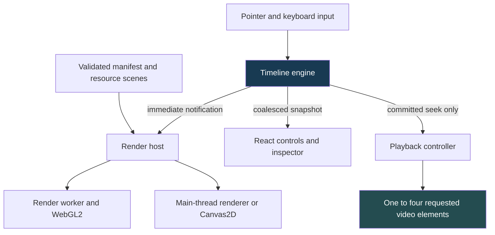

# Video Observatory: Evidence Correctness in a Browser Video Timeline

A browser video investigation interface must preserve the meaning of time, missing data, authorization, and asynchronous results while the user changes what they are inspecting. Rendering an image is only one part of that responsibility. The interface must also establish which camera produced it, which interval it represents, which permissions allow it to be displayed, and whether it still belongs to the current interaction.

Video Observatory implements this separation through synchronized thumbnail timelines, typed numeric and event scenes, bounded workers and image resources, and explicitly requested historical HLS players. This report explains the current implementation from those correctness requirements outward. It describes the code at checkpoint `9df0183`, including playback implementation `4ac4855` and initial telemetry implementation `58d3bf4`. It is a technical analysis of an unfinished system, not a release announcement.

> [!summary]
> Sixteen timeline rows do not require sixteen video decoders. Thumbnail atlases and numeric tiles support investigation; one to four historical players are allocated only on request.
>
> Viewport generations, resource revisions, authorization lifetimes, and media epochs identify different kinds of change. Treating them as interchangeable produces stale displays or incorrect time mappings.
>
> Generated-media browser tests establish decoding and UI behavior. They do not establish real-backend interoperability, physical camera synchronization, or foreground hardware capacity.

## 1. Define the evidence before choosing the renderer

The repository began as a specification-driven implementation of a video platform, with separate directories for the browser, backend, and camera simulator. The repository date is September 7, 2026; the implementation ticket is WEBUI-001. The authoritative inputs are now the supplied `video_platform_v1/` bundle, especially `02_web_ui_spec.md`, `01_video_backend_spec.md`, and their machine-readable contracts. Duplicate root specifications are not the generation source.

The browser's central task is to place several kinds of evidence on one UTC domain without making them appear equivalent. A thumbnail has an actual capture time. A numeric bucket summarizes observations over an interval. Recording coverage indicates whether source media exists. Analytics coverage indicates whether a computation produced usable results. An event may refer to an earlier evidence interval even if the server reported it later.

Consider a detector bucket whose count is zero. If the bucket is valid, zero is a measurement. If the detector did not run, displaying zero would manufacture a measurement. A valid value can also coexist with partial source coverage. The scene therefore needs validity and coverage independently of the numeric value. This distinction affects the inspector, the geometry builder, and the binary decoder; it cannot be repaired by changing a tooltip after the renderer has already discarded the information.

The same reasoning applies to privacy. A missing redacted thumbnail cannot be replaced with raw imagery to maintain visual continuity. Redaction is an authorization constraint, not an image effect that may be omitted when a dependency fails. The normal application starts from server capabilities. The synthetic development workspace is available only through an explicit fixture URL.

### Current scope

The checkpoint has a working browser implementation for capability/catalog discovery, generation-checked timeline manifests, numeric protobuf tiles, thumbnail atlases, live-tail invalidation, and requested historical HLS playback. It also has a small working telemetry upload path. The remaining requirements are substantial: separate live playback, quality and admission controls, complete telemetry instrumentation, resource/protocol and accessibility qualification, real service integration, and performance/soak acceptance.

This report was requested after the implementation was stopped at a clean checkpoint. Publishing it now does not close those requirements or imply that the originally planned final acceptance report has become unnecessary.

## 2. Separate the interaction clock from React publication

A pointer gesture needs an immediate answer to a geometric question: which time corresponds to this coordinate? It should not wait for a network request or a React render. `src/engine/timeline.ts` therefore owns a framework-independent state containing the domain, cursor, selection, viewport generation, and live-follow flag. It exposes immediate listeners for rendering and coalesced listeners for the React shell.

The distinction is operational. Immediate state changes notify frame listeners. A timer publishes a shell snapshot approximately every 100 milliseconds. Forms, labels, and inspectors can use that slower publication cadence without introducing latency into pointer-to-time computation. This bounds ordinary shell updates, although it is not by itself proof of a frame-rate target.



A cursor update is not necessarily a playback seek. During a scrub, the engine may publish many cursor positions. The canvas input handler commits a seek only on release; a click and a keyboard step are also committed actions. Playback listens through `onSeekCommit`, while ordinary playback clock updates use `setCursor` without emitting another seek. This prevents a feedback loop in which updating the displayed playback cursor repeatedly seeks the player.

Cancellation has a related subtlety. Canceling a pan restores the old domain and selection, but it must not restore an old generation number. The geometry can return to a previous value while the interaction history still advances. Otherwise a response from an abandoned request could once again appear current.

### Integer time and relative coordinates

The application represents signed Unix microseconds as `bigint` internally and decimal strings in HTTP JSON. `parseTimeUs` validates the string and signed int64 range. This keeps the full declared wire domain intact. Current-era epoch microseconds still fit within JavaScript's safe integer range; the reason for bigint is the int64 contract and exact arithmetic, not a claim that every present-day timestamp already exceeds that range.

For a viewport $[s,e)$, a time $t$, and width $W$, the horizontal transform is:

$$
x = \frac{t-s}{e-s}W.
$$

The implementation subtracts bigint timestamps first, then converts the bounded differences to numbers for pixel calculations. It does not convert the complete epoch to floating point before subtraction. The inverse transform rounds a relative pixel-derived offset to microseconds and adds it to the bigint origin.

The domain is half-open: an event exactly at `endUs` belongs to the next interval, not both intervals. Canonical tile indexing also needs mathematical floor division. JavaScript bigint division truncates toward zero, so negative timestamps require a correction when a remainder exists. That detail makes tiles before the Unix epoch follow the same grid as tiles after it.

## 3. A timeline is a multiresolution representation, not continuous playback

The numeric grid starts with 64-second tiles containing 256 buckets. The base bucket width is therefore 250 milliseconds. At level $L$, the tile span is:

$$
T_L = 64\cdot 2^L\text{ seconds}.
$$

Thumbnail tiles have 32 slots, giving a base slot interval of two seconds on the same base span. The implementation chooses numeric and thumbnail levels from seconds per pixel, with different density targets. Numeric information can use subpixel-scale buckets; thumbnails need enough horizontal space to remain useful images. A hysteresis band retains the previous level around a threshold instead of repeatedly changing resource requests during small zoom movements.

The synthetic one-hour workspace is not evidence that its demonstration grid is a canonical server grid. Production resource validation checks supplied identities and grid semantics separately. This is an example of why fixture convenience must not define the production protocol.


*Figure 1. Earlier P2 synthetic workspace showing the sixteen-row interaction model; its status text predates the later playback implementation. This is renderer and interaction evidence, not sixteen live camera feeds. The initial timeline allocates no historical video players.*

Numeric tiles retain count and validity alongside minimum, maximum, and mean. Rendering a min/max envelope preserves a range that an average-only curve would conceal. The inspector can expose the exact bucket interval and statistics without inventing point samples. Event intervals and coverage bands are separate scene elements, allowing a user to inspect their different meanings.

The project already provides keyboard cursor movement, layout controls, absolute-time validation, camera ordering, virtualized expanded rows, and typed inspection. These are meaningful accessible interaction paths, but they are not a completed accessibility audit. Remaining keyboard and thumbnail-inspection coverage still belongs to acceptance work.

## 4. Compile the contracts, then validate their meaning

`web-ui/scripts/generate-contracts.mjs` generates API types and standalone read validators from the authoritative OpenAPI document. It also generates stream types and validation from `websocket.schema.json`. Protobuf generation uses `timeline.proto`, pinned protoc 3.21.12, and the pinned JavaScript/TypeScript plugin. Generated provenance and byte-for-byte regeneration checks make the source of those artifacts reviewable.

TypeScript types do not validate a network response. They describe what the program expects after a boundary has been checked. The runtime validators enforce the wire shape before code treats a response as a typed manifest or playback index. Read validation tolerates additive fields, while preserving required fields and declared constraints. Semantic checks then validate relationships that a structural schema does not establish by itself: requested camera identity, view, generation, canonical intervals, resource URL scope, and byte admission.

The simplified path is:

```text
HTTP response
  -> bounded body and content-type check
  -> generated structural validator
  -> request-specific semantic checks
  -> typed scene or playback resource
  -> current-generation presentation
```

The ordering matters. A correctly shaped response for the wrong camera is still wrong. A valid protobuf message with an excessive declared allocation is still inadmissible. Binary tile handling includes a preflight before normal decoding, followed by validation of identity, grid, validity, statistics, and coverage.

### Two concrete boundary failures

One early production failure came from generated validator support code: `at is not a function` appeared in the Unicode helper path. A self-contained, pinned helper was emitted during generation rather than compiling schemas dynamically in the browser. Development module execution had not been enough to establish production-bundle correctness.

A later telemetry change failed typecheck because `Accepted` was not in the selected generated read-validator set. The correction was to add that canonical schema to generation and regenerate the outputs. Casting the response to an expected type would have removed the check precisely where the compiler identified an uncovered boundary.

The API client also constrains URLs to the same-origin `/api/v1/` namespace, rejects redirects, and sends same-origin credentials. Browser POSTs use `X-VO-CSRF: 1`. The browser supplies the Origin header; the deployment gateway supplies the verified HttpOnly session cookie. These client choices must still be qualified against the real HTTPS and gateway configuration.

## 5. Resource correctness requires explicit ownership

An atlas exists in several representations over its lifetime: encoded response bytes, a decoded `ImageBitmap`, a pending upload, and a renderer-owned resource. A limit on only one of these representations does not bound the others. For example, reducing the texture cache does not prevent a queue of decoded bitmaps from growing while uploads are delayed.

The data worker shares bounded download scheduling between tiles and atlases. Numeric tile bytes have a 64-MiB encoded cache. Atlas admission remains charged across decoding and transfer until ownership is explicitly acknowledged. Canceling a request does not mean an already-running image decode has stopped; the accounting remains active until that decode settles and its result is either transferred or closed.

`ByteCache.put` uses an admission-before-mutation pattern. It computes the bytes and entries that must be evicted, identifies eligible unpinned candidates, and verifies that the complete insertion is possible before deleting anything. If pinned entries prevent admission, the insertion fails without first damaging the working set.

```text
neededBytes   = currentBytes - replacedBytes + incomingBytes - budget
neededEntries = currentEntries - replacementCount + 1 - entryLimit

select unpinned eviction candidates
if candidates cannot satisfy both requirements:
    reject insertion without changing the cache
else:
    release candidates and replaced ownership
    insert the new value
```

This is a local cache guarantee. It does not establish that every planned encoded, parsed, and decoded cache layer has been implemented. The ticket still records parsed tile and atlas byte-caching work and a broader protocol/resource audit.

| Resource boundary | Checkpoint configuration | What it does not prove |
|---|---:|---|
| Data resource downloads | Eight active; two per camera | Aggregate process/network behavior under all subsystems |
| Encoded numeric tile cache | 64 MiB | Total browser heap usage |
| Atlas texture / Canvas decoded-image budget | 192 MiB | Driver allocation or physical GPU residency |
| Pending renderer images | 8 MiB | That transferred ownership is free |
| Atlas uploads | 4 MiB per frame | A guaranteed GPU execution time |
| Historical media downloads | Four shared active; two per camera | A total browser-wide limit of four requests |
| HLS buffering per requested player | Five-second back buffer, thirty-second forward target, 32-MiB configured size | A hard bound on decoder, MSE, worker, and process memory combined |

### Atlas geometry and composition

A V1 atlas contains 32 thumbnails in an 8-by-4 layout. At 160 by 90 pixels per cell, the complete image is 1280 by 360 pixels. A slot identifies a normalized texture rectangle, but its display metadata also retains the actual capture timestamp and frame identity. The slot's nominal grid time is not substituted for the capture time.

Before image decoding, the WebP boundary inspects the RIFF structure and image dimensions. Unsupported animation and conflicting payload structures are rejected. This avoids treating `createImageBitmap` as the first resource-size validator.


*Figure 2. P3 manifest-driven atlas fixture in the normal workspace, before the historical-player slice. The important evidence is the path from validated atlas metadata to a cropped image and capture-time inspection, not the synthetic image content.*

Composition order is background, thumbnails, graph/event overlays, then cursor and selection. Drawing an opaque background after the thumbnail pass erases valid imagery; successful decoding alone would not detect that error. The thumbnail renderer reserves two solid passes within a 150-draw budget, allowing at most 148 texture batches. Both WebGL and Canvas behavior have dedicated fixture tests.

Renderer failure adds another ownership transition. A transferred bitmap cannot simply be reused from its former owner. Recovery retains CPU-side descriptions and requests fresh image replay. A ready acknowledgement is delayed until queued renderer resources have drained through frame-paced uploads; receiving geometry is not the same as having all associated imagery ready for presentation.

## 6. Live-tail messages invalidate HTTP authority

The live-tail connection subscribes to `/api/v1/stream` with subprotocol `vo.v1` and a cursor obtained from an HTTP snapshot. Its purpose is to indicate that previously fetched resources may be stale. A notification is not treated as permission to construct a new asset URL or replace a validated manifest with guessed data.

The client checks subscription scope, camera/view identity, and resource revisions. Closely spaced changes are coalesced over 250 milliseconds before refreshing HTTP authority. Resource revisions suppress duplicate or older notices; the replay cursor remains an opaque server token rather than being interpreted as a timestamp or numeric sequence.

There is an important distinction between acknowledging a notice and successfully refreshing its data. The current acknowledgement means that invalidation has been accepted into the client workflow. It does not mean a later HTTP request has completed. Error reporting and subsequent refresh attempts remain necessary after acknowledgement.

Retention or replay uncertainty requires a fresh snapshot and a purge of incompatible local representations. Policy changes refresh authorization. Heartbeat monitoring, up to eight reconnect attempts, and five-second polling provide bounded recovery behavior. These mechanisms have mocked HTTP/WebSocket browser coverage, but a deployment soak has not established their long-running behavior against the real service.

Live-tail invalidation must also be distinguished from live video playback. The former is implemented here; the latter still requires its separate live-session lifecycle. A functioning WebSocket connection does not imply that a masked live HLS session exists.

## 7. Historical playback starts with an admitted intent

Opening historical playback creates a bounded request for selected camera IDs, target UTC, requested interval, stream profile, authorized view, preferred mode, and generation. The initial window is ten seconds before and 120 seconds after the target, constrained by the server's maximum span. Additional coverage clipping and deployment admission still require qualification.

The session response must match the admitted intent. Camera descriptors cannot introduce an unrequested camera or point to another session's camera resource. A ready descriptor needs manifest and index URLs. Index pagination is bounded, and the client constructs explicit grants for the manifest, initialization media, and logical media segments.

The HLS loader can fetch only granted URLs. It validates byte-range requests against their admission limits, checks media types, rejects redirects, and requires matching partial-response semantics when a range is requested. Session authorization failures cause teardown rather than switching to an alternate view.

Two integration details were discovered with actual browser decoding. First, the manifest passed to HLS needed an absolute URL before the custom loader could validate it. Second, hls.js uses zero-valued range fields to mean a full-resource request. Treating every defined `rangeEnd` as a range produced `Invalid HLS byte range`. Recognizing that library sentinel is different from accepting an ignored or malformed real range: actual ranges still require a matching 206 response and byte count.

### Session lifetime and seek lifetime are different

A seek inside the admitted interval can reuse the current server session. The client increments its presentation generation, pauses players, conceals their previous imagery, and seeks through the existing authorized map. A seek outside the interval creates another session and releases the previous one. Reusing a session is not permission to reuse evidence that a previous target frame is current.

The panel renews sessions on a twenty-second cadence. Changing pending descriptors must not repeatedly restart that cadence. Renewal responses must preserve session identity, and stale renewal or release failures must not overwrite a newer interaction. Closing playback destroys HLS instances and media sources and requests session release.

These paths are implemented, but the short browser fixture is not a thirty-minute session test. Expiry, maximum lifetime, delayed creation, repeated authorization failures, and long renewal behavior remain separate acceptance workloads.

## 8. Map media time locally across gaps and epochs

A video element reports seconds on its media timeline. The application needs canonical UTC. The tempting formula, `UTC = currentTime + oneStartOffset`, is invalid when media time is discontinuous or when separate UTC recording intervals are adjacent in the player timeline.

For a mapping entry with media start $m_0$ and UTC start $u_0$, local conversion is:

$$
u(m) = u_0 + \operatorname{round}((m-m_0)10^6).
$$

This conversion is valid only inside that entry's admitted media interval. `MediaTimeMap` binds fragment media timing and program-date-time to the authorized server index. Entries retain source epoch and UTC/media bounds. Unknown intervals and declared gaps return no mapping; the implementation does not extrapolate across them.

A concrete test uses these two entries:

| Entry | Media interval | UTC interval relative to base |
|---|---|---|
| A | `[0, 4)` seconds | `[0, 4)` seconds |
| B | `[4, 8)` seconds | `[10, 14)` seconds |

Media time 4 seconds maps to UTC base plus 10 seconds, not base plus 4. A request for UTC base plus 5 seconds has no media mapping. The test also covers a declared gap inside a fragment interval, because asset availability does not override explicit missing-coverage metadata.

### The master clock does not come from a camera

The master clock anchors bigint UTC to monotonic browser time:

$$
u_{master}(p)=u_{anchor}+\operatorname{round}((p-p_{anchor})1000r),
$$

where $p$ is `performance.now()` in milliseconds and $r$ is playback rate. Pause, seek, and rate changes reset the anchors atomically. A stalled camera therefore cannot implicitly pause or redefine time for every other player.

Every 100 milliseconds, a player's mapped timing is compared with the master. Drift up to 50 milliseconds leaves the requested rate unchanged. Between 50 and 200 milliseconds, the implementation permits a five-percent nudge at 1×. Drift above 200 milliseconds must persist for 500 milliseconds before hard correction. Nudges are not enabled at the other selectable rates by this implementation.

The specification's p95 alignment target is at most 150 milliseconds in canonical media time. It is not a promise about physical camera exposure time. Source-clock basis and uncertainty are displayed independently, and no percentile benchmark has established that target at this checkpoint.

## 9. A new `currentTime` is not a new displayed frame

Assigning `video.currentTime` changes seek intent before it proves what frame is being presented. The player uses `requestVideoFrameCallback` where available, with per-seek callback epochs, and keeps an opaque cover over the video until mapped frame evidence is close enough to the selected target and the media element is no longer seeking. The polling alternative on browsers without that callback is weaker evidence and still requires browser qualification.

The cover is functional, not decorative. It prevents a previous frame from being presented as current while keeping the video element available to the compositor. Fully removing the element from rendering can prevent the very frame observations needed to establish readiness.

```mermaid
sequenceDiagram
    participant U as Timeline input
    participant P as Playback panel
    participant V as Historical player
    participant H as HLS and media element
    U->>P: Commit target UTC
    P->>P: Pause master; increment seek generation
    P->>V: New target generation
    V->>V: Cover old imagery; invalidate frame callback epoch
    V->>H: Seek using verified local map
    H-->>V: Frame callback and seek completion
    V->>V: Validate mapped frame against current target
    V-->>P: Ready for this generation
    P->>P: Release readiness barrier or reach two-second deadline
```

The barrier waits for target-generation readiness, with a two-second deadline. Slow or gapped players remain concealed while admitted ready players can resume. Late readiness from an older generation cannot release the current barrier.

Two observed failures explain why these checks are separate. A frame callback can precede the `seeked` event. Discarding that callback because the element is still seeking can leave paused playback waiting indefinitely; the fix captures its timestamp and checks seek completion before presentation. Separately, an offscreen transition can interrupt manifest discovery. On return, seeking through an empty map will never resume media loading. The player now distinguishes incomplete discovery from a recording gap and restarts manifest discovery before attempting a mapped seek.


*Figure 3. Four generated-media players after the fourth camera's explicit initial gap. The images deliberately share one test pattern. The displayed frame counters and UTC labels illustrate browser behavior, but this screenshot is not a measured alignment distribution or a camera-identity content test.*

Offscreen players pause playback and media loading independently of the master clock. On visibility return they establish a new mapped seek. View changes unmount incompatible players immediately through keyed ownership, rather than waiting for a label update to make stale raw imagery appear harmless.

## 10. Telemetry must retain distributions and qualification boundaries

The initial telemetry slice connects validated manifest latency and supported long-task durations. It does not yet instrument every required render, data, and player metric. Unobserved quantities remain absent rather than being emitted as zero.

`BrowserTelemetry` aggregates counts, sums, minima, maxima, and cumulative histogram buckets. If raw bin counts are $b_i$, cumulative bucket count $c_i$ is $\sum_{j\leq i}b_j$. The final bucket has a null upper bound representing positive infinity, and its cumulative count equals the metric count. These properties allow server-side aggregation across compatible intervals without attempting to average percentiles.

The unit fixture observes 10, 100, 200, and 1000 milliseconds. Its histogram has count 4, sum 1310, min 10, max 1000, and cumulative count 2 at the 100-millisecond boundary. Nonfinite values and accidental epoch-sized timing inputs are rejected.

Uploads use memory-only batches, at most 64 KiB each, with four queued batches, three attempts, and a five-second request deadline. A transient failure preserves the body and idempotency key until a later periodic or visibility-triggered flush. It does not create a tight retry loop. Queue pressure does not evict the in-flight batch, and telemetry failure does not block timeline interaction.

Visibility changes separate observation intervals. Delayed long-task entries at that boundary are excluded rather than assigned to the wrong cohort. The capability profile distinguishes automated or unqualified browser runs and whether long-task observation was successfully established. The build identifier is explicitly `web-ui-0.1.0-unqualified`; release provenance and qualified hardware cohorts remain future work.


*Figure 4. Redacted workspace retained after the production telemetry transport test. The screenshot establishes visible UI state; the test's intercepted request establishes the histogram, CSRF, idempotency, byte-size, and fixed-label assertions. No historical decoder is allocated.*

The current labels contain only `route=workspace`. There is no caller-supplied camera ID, URL, event text, or session token label. The pseudonymous client identifier and telemetry interval timestamps are explicit contract fields, not media-session credentials or investigation-range labels. Compatibility with the real server's rate and label policy remains unverified.

## 11. What the recorded validation actually establishes

The evidence is strongest when tests are interpreted at the boundary they exercise. A property test can prove relationships across generated inputs; a browser decoding fixture can reveal compositor and loader behavior; neither substitutes for a real deployment workload.

| Recorded checkpoint | Result | Scope and limit |
|---|---|---|
| P3 live-tail milestone | 68 unit/property tests; 22 production browser cases passed | Mocked API/WebSocket integration, not deployment soak |
| Initial P4 milestone | 77 unit/property tests; 22 existing production cases passed, two new playback cases failed | Exposed real seek/offscreen defects; not a fully passing new suite |
| Playback recovery follow-up | One/four-player production cases passed three repetitions each | Six passes after fixes; not a fresh rerun of every prior case |
| Telemetry slice | Ten targeted telemetry/API tests and one production transport case passed | Measured upload path, not full telemetry instrumentation |
| Generation/build checks | Contract regeneration, typecheck, lint and production build passed at recorded checkpoints | Does not establish runtime performance |
| Documentation delivery | Docmgr doctor passed; P4 guide upload reported success | Documentation hygiene and delivery only |

The playback fixture generates six seconds of 320×180 H.264/fMP4 using FFmpeg and libx264. It exercises actual HLS/MSE decoding through mocked authorized endpoints. The one-player flow verifies keyboard seek reuse without another session creation. The four-player flow verifies an explicit gap, later recovery, and transition to a redacted view with player removal and no continued media requests in the asserted window.

The retained failures matter as much as the final passes. The report does not combine independently recorded successes into a claim that the latest entire suite was rerun successfully. Nor does it infer a total memory ceiling from the configured HLS buffer size.

The last recorded build also retains Vite's warning that the HLS-containing chunk exceeds 500 kB after minification. That chunk is approximately 596.56 kB, or 186.18 kB gzip; the initial application chunk after telemetry is approximately 476.46 kB, or 103.73 kB gzip. These are build artifacts, not measured startup latency. The threshold was not raised to remove the warning.

### Reproducing the browser evidence

From `web-ui`, the principal commands are:

```bash
npm ci
npm run check
npm run test:e2e:production

# Focused media/debugging work, against a freshly built app:
npm run build
npx playwright test e2e/playback.spec.ts \
  --config playwright.production.config.ts --repeat-each=3
npx playwright test e2e/telemetry.spec.ts \
  --config playwright.production.config.ts
```

The media fixture needs FFmpeg with libx264. Contract regeneration needs the pinned protoc toolchain. Playwright needs its matching browser installation; on a shared host, the recorded installation workflow uses `PLAYWRIGHT_SKIP_BROWSER_GC=1` to avoid removing other projects' cached browsers. These commands are reproduction instructions, not a claim that this report-writing session reran implementation tests.

## 12. Backend integration is a concrete dependency, not an unspecified future task

The backend is implemented separately in the same checkout and was actively changing during UI work. Its README did not always reflect the latest routes. Direct inspection of `control/internal/api/server.go` at this checkpoint found session GET, DELETE, renewal, manifest delivery, and GET/HEAD logical-media routes. It also found camera, policy, catalog, model, and operation-related routes.

That route registration did not yet include the browser's capability discovery, track catalog, timeline query, WebSocket stream, playback session creation, or per-camera playback index endpoints. This is a specific reason the UI's complete production startup and playback path cannot be declared integrated. It is not a claim that the backend has no media work: its archive preparation and protected logical delivery are separate implementation progress.

The next integration exercise must start with an actual authorized principal and gateway cookie, then load capabilities and a camera, resolve a recording interval, create a session, validate its index, fetch its granted media, and compare displayed media UTC with that index. A forced recording gap and permission downgrade should be added only after that first path is observable. Backend modifications require coordination with its owner; browser fixtures should not be converted into an unauthenticated production bypass.

## 13. Review priorities and the next implementation boundary

The most important remaining work is not cosmetic. The worker protocol still needs reconciliation against the specification's complete version/request/generation envelope. Cache layers and permission-partition invalidation need an end-to-end audit. Playback needs its separate live lifecycle, quality and high-rate admission behavior, longer expiry/renewal/stale-response tests, and browser-specific mapping qualification. Accessibility must be tested across the complete investigation workflow rather than inferred from the existence of keyboard handlers.

Telemetry must then connect render submission, input-to-submit latency, tile fetch/parse, atlas decode/upload, resource readiness, player drift, seek latency, rebuffering, active players, caches, and recovery/error counts with accurately named units. Where an implementation can only estimate a quantity, its name and cohort must preserve that distinction.

Only after those implementation gaps and service dependencies are addressed can foreground hardware and soak workloads establish the specified acceptance targets. The experimental WebCodecs and other advanced paths remain feature gates, not substitutes for an unfinished HLS baseline.

The current architecture provides useful foundations for that work: exact canonical time at boundaries, local media mappings, explicit resource ownership, independent master-clock control, and fail-closed presentation during authorization or generation changes. Its remaining correctness claims must be established through the corresponding workloads, not inferred from these design choices.

## 14. Source map and retained artifacts

All source paths below are relative to:

`/home/manuel/code/wesen/2026-09-07--streaming-system`

The report is based on repository checkpoint `9df018364cd52460b2c2b0b2bbd280edf586e7aa`. The checkpoint contains concurrent backend/simulator work as well as the UI; commit attribution below identifies the browser changes discussed here.

| Topic | Primary implementation or evidence |
|---|---|
| Authoritative requirements | `video_platform_v1/02_web_ui_spec.md`; `01_video_backend_spec.md`; `contracts/` |
| Integer time, grid, LOD and gestures | `web-ui/src/engine/time.ts`; `timeline.ts` |
| Capability/manifest workspace | `web-ui/src/app/ApiWorkspace.tsx`; `src/data/api.ts`; `workspace.ts` |
| Contract generation | `web-ui/scripts/generate-contracts.mjs`; `generate-protobuf.mjs` |
| Binary/resource admission | `web-ui/src/data/binary.ts`; `tiles.ts`; `tile-loader.ts`; `webp.ts`; `cache.ts`; `scheduler.ts` |
| Resource ownership and rendering | `web-ui/src/workers/data.worker.ts`; `src/render/host.ts`; `atlases.ts`; `textures.ts`; `canvas.ts` |
| Live-tail | `web-ui/src/data/live-tail.ts`; `src/app/useLiveTail.ts` |
| Historical lifecycle and mapping | `web-ui/src/playback/session.ts`; `loader.ts`; `time-map.ts`; `barrier.ts`; `PlaybackPanel.tsx`; `HistoricalPlayer.tsx` |
| Telemetry | `web-ui/src/data/telemetry.ts`; `src/app/useTelemetry.ts` |
| Playback and telemetry tests | `web-ui/tests/playback.test.ts`; `telemetry.test.ts`; `web-ui/e2e/playback.spec.ts`; `telemetry.spec.ts` |
| Backend registration audit | `video-backend/control/internal/api/server.go` |

The ticket root is:

`ttmp/2026/09/08/WEBUI-001--implement-video-observatory-web-ui/`

Its intern guide is `design-doc/01-web-ui-architecture-and-intern-implementation-guide.md`. Its chronological implementation record is `reference/01-diary.md`, through Step 27. The evidence directory contains the initial failing and subsequent passing playback logs, telemetry validation log, screenshot sources, and printer/reMarkable receipts.

The most relevant retained logs under `sources/` are `p3-live-tail-followup-validation.log`, `p4-playback-slice-validation.log`, `p4-playback-followup-validation.log`, `p4-playback-recovery-validation.log`, and `p4-telemetry-slice-validation.log`. The first P4 log includes the initial failing production cases; the recovery log records the six passing repetitions. `p4-guide-remarkable-upload.log` records the successful refreshed guide delivery.

The main implementation checkpoints for this report are `289969c` for live-tail, `4ac4855` for historical playback, and `58d3bf4` for bounded telemetry. Documentation/evidence checkpoints include `d29e3a7` and `9df0183`. The refreshed guide was uploaded as **WEBUI-001 Intern Guide P4 Checkpoint.pdf** to `/ai/2026/09/09/WEBUI-001`, preserving the previous document rather than overwriting its annotations.

The figures embedded in this note are copied into the adjacent `_assets/` directory so the report remains readable independently of the source checkout. They are deliberately captioned with their fixture and measurement limits. P2, P3, P4, and overall acceptance remain open at the reported checkpoint.
