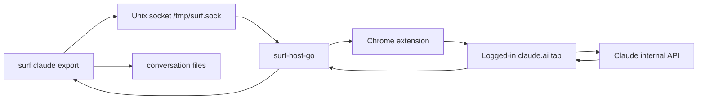
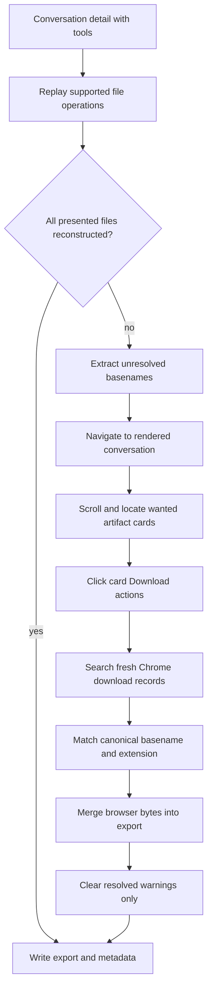
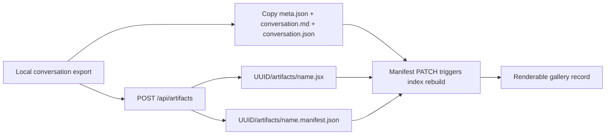
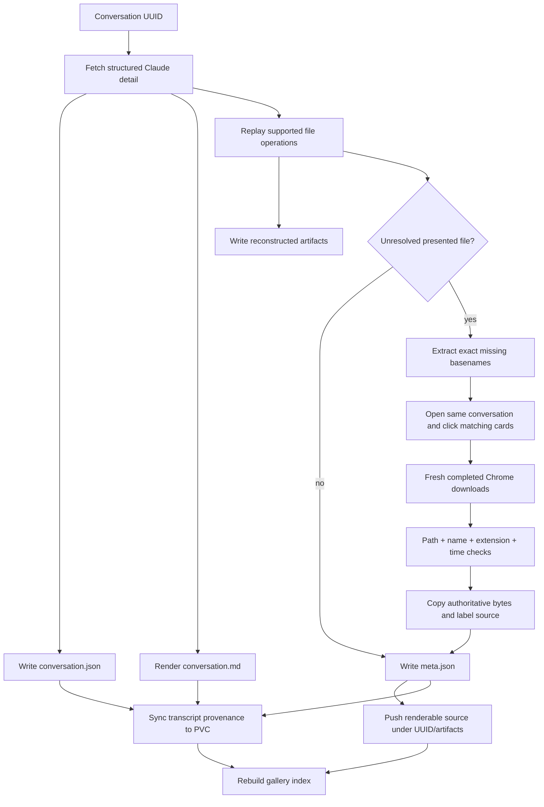

# Claude Artifact Export in surf-cli

A Claude conversation is not fully preserved by saving its visible prose. A useful export must retain the structured conversation payload, a readable transcript, final artifact files, and enough metadata to prove which conversation produced each file. The hard part is final artifact recovery. Modern Claude artifacts may be assembled incrementally inside a sandbox through file tools, shell commands, copies, and generated output. The conversation API records many of those operations, but it does not guarantee that an external exporter can replay every operation into the final bytes.

This report explains how `surf-cli` exports Claude conversations, why deterministic file-tool reconstruction is necessary but insufficient, and how the implementation now falls back to Claude's rendered browser Download action for files that cannot be reconstructed. It also examines the provenance error discovered during live validation: Chrome's download history is global, so filename equality does not prove conversation identity. The final design accepts browser files only when the current conversation named them as unresolved deliverables and Chrome recorded them after the current download operation began.

The report is based on source code, the implementation diary, focused tests, commit history, authenticated runs against Claude, and publication to the `serve-artifacts` service on the DGX k3s cluster. It distinguishes verified behavior from proposed follow-up work.

> [!summary]
> - The Claude API is the authoritative source for transcript structure and file-tool history; `render_all_tools=true` is required to expose modern tool blocks.
> - File reconstruction replays known operations and reconciles full `view` results, but it cannot safely emulate arbitrary shell execution.
> - Browser recovery is invoked only for unresolved deliverables, clicks the rendered Claude Download action, and accepts only fresh Chrome download records matching the expected filename and extension.
> - Provenance is a data contract. A valid file with the expected basename is not sufficient when two conversations can publish `stage-ide.jsx`.
> - Live validation recovered `factoryflow-ide.jsx` and a distinct `stage-ide.jsx`, then published each under its conversation UUID with transcript metadata on DGX.

## 1. The preservation contract

The exporter writes one directory per conversation UUID:

```text
<export-root>/<conversation-uuid>/
├── conversation.md
├── conversation.json
├── meta.json
└── artifacts/
    ├── deliverable-a.jsx
    └── deliverable-b.md
```

Each file has a separate role. `conversation.json` retains the structured API response needed for future reprocessing. `conversation.md` gives a readable transcript independent of Claude's current UI. `meta.json` records identity, timestamps, project association, artifact paths, artifact source methods, byte lengths, and unresolved warnings. The `artifacts/` directory contains files that can be opened, compiled, rendered, or published without extracting them from a transcript.

The stable unit of identity is the conversation UUID, not its title. Titles can change, collide, contain path separators, or describe several revisions of a project. Artifact basenames are also not globally unique. The pair

\[
(\text{conversation UUID}, \text{artifact-relative path})
\]

is the minimum practical identity used by the export and publication system.

A correct export should satisfy four invariants:

1. **Transcript fidelity:** the exported structured payload represents the selected conversation and includes tool content.
2. **Artifact byte correctness:** each artifact file contains the final bytes presented by Claude, or it remains explicitly unresolved.
3. **Provenance correctness:** no artifact is associated with a conversation merely because its filename matches.
4. **Failure visibility:** partial success remains usable, but unresolved reconstruction or browser failures appear in `meta.json` warnings.

These invariants define why a hybrid API-and-browser implementation is needed. The API supplies structure and identity. The browser can supply final bytes when operation replay is incomplete.

## 2. The existing API export path

The Claude commands execute same-origin JavaScript through the surf browser session. The command opens or reuses a logged-in `claude.ai` tab, injects JavaScript, and lets the page call Claude's internal API with its existing cookies. Authentication remains in the browser; the CLI does not copy session credentials into an independent HTTP client.



The export script resolves the chat-capable organization through `/api/bootstrap`, then fetches conversation detail with:

```text
/api/organizations/<org>/chat_conversations/<uuid>
  ?tree=True
  &rendering_mode=messages
  &render_all_tools=true
```

The final query parameter is essential. Without `render_all_tools=true`, the API can replace tool blocks with an unsupported-device placeholder. With it, the response includes `tool_use` and `tool_result` blocks required for artifact reconstruction.

Large responses cannot be returned as one arbitrary JavaScript result. The browser script creates a slim payload containing the fields used by transcript rendering and reconstruction, serializes it as UTF-8 JSON, base64-encodes it, and caches it in the page. Go requests 40,000-character chunks by offset and reconstructs the payload locally.

```text
pseudocode: chunked conversation transfer

offset = 0
encoded = ""
repeat:
    result = run_browser_export_script(uuid, offset)
    encoded += result.chunk
    offset += length(result.chunk)
until result.done or result.chunk is empty

payload = JSON.parse(base64_decode(encoded))
```

This transport has two useful properties. The browser fetches each conversation once per cached export, and Go controls reassembly without depending on a single native-messaging frame for the entire conversation.

## 3. Reconstructing artifacts from tool history

Modern Claude artifacts often appear as files under `/mnt/user-data/outputs/`. Claude may create an initial file, apply edits, inspect the file, copy an intermediate file into the output directory, and finally call `present_files`. The exporter processes tool blocks in message order because later operations depend on earlier state.

The reconstruction state is a mapping from sandbox path to current text:

\[
F_t : \text{path} \rightarrow \text{content at operation } t
\]

A `create_file` or `rewrite` operation assigns complete content. A successful `str_replace` performs one ordered replacement. A parsed heredoc writes or appends its body. A parsed `cp` copies known content; `mv` also removes the source. A full `view` result can replace reconstructed state because it reports the sandbox's file content at that point.

```text
pseudocode: reconstruction

files = {}
creation_order = []
presented = set()
tool_results = index_results_by_tool_use_id(messages)

for block in tool_blocks_in_message_order(messages):
    if block is create_file or rewrite:
        files[path] = complete_text(block)

    if block is bash:
        apply_recognized_heredoc_writes(files, command)
        apply_recognized_cp_and_mv(files, command)

    if block is str_replace:
        if corresponding_result_is_error(block, tool_results):
            continue
        replace_first_unique_target(files[path], old, new)

    if block is full_view and result_contains_numbered_file_text:
        files[path] = strip_view_line_numbers(result)

    if block is present_files:
        presented.add_all(block.filepaths)

return files named by presented
```

The `view` reconciliation rule is important. Replay may drift because a shell command changed a file in a way the parser does not model. If Claude later performed a full `view`, that result is stronger evidence than the replayed state. Ranged views are not authoritative because they contain only part of the file.

The implementation deliberately does not execute recorded shell commands. A conversation is untrusted historical input, and shell commands can contain arbitrary effects. Even a restricted emulator would need to model languages, generated files, pipes, substitutions, archive tools, package managers, and process output. It would still be incomplete and would create a large security boundary. The parser recognizes a bounded set of file-producing operations instead.

When `present_files` names a deliverable that reconstruction cannot produce, the exporter records a warning such as:

```text
deliverable factoryflow-ide.jsx could not be reconstructed
(built by an unsupported sandbox operation)
```

That warning is not a generic log message. It is the input to the browser recovery stage.

## 4. Why browser recovery is a separate stage

Claude's rendered artifact card has a Download action that retrieves the final file. This path can succeed even when the conversation history cannot be replayed. The browser therefore provides an authoritative byte-recovery operation, but it does not replace the API export.

The two sources provide different information:

| Source | Strongest evidence | Limitation |
| --- | --- | --- |
| Conversation API | UUID, message structure, tool order, timestamps, project metadata, presented paths | May not expose final bytes for arbitrary sandbox-generated files |
| Reconstructed state | Deterministic result for supported operations; detailed operation provenance | Cannot model every shell or build operation |
| Rendered Download action | Final bytes delivered by Claude's user-facing interface | Requires DOM interaction and correlation with Chrome download records |

The fallback is invoked only when reconstruction produced warnings. Clean exports do not navigate to the conversation UI or download files that were already reconstructed. When recovery runs, the unresolved warning parser extracts expected basenames such as `factoryflow-ide.jsx`. These names are passed into the browser script as a `wanted` set.



## 5. Walking the rendered conversation

The browser script must handle lazy rendering and two artifact-card DOM variants. Document cards expose the Download label on a split-button group. Code cards expose it directly on the primary button. A selector that handles only one variant can download Markdown while silently missing JSX.

The script scans `[data-sheet-kind]` elements and resolves the control in this order:

```javascript
const labelledButton = card.querySelector(
  'button[aria-label^="Download "]'
);
const group =
  labelledButton?.closest('[role="group"]') ||
  card.querySelector('[role="group"][aria-label^="Download "]');
const button = labelledButton || group?.querySelector('button');
```

It derives a canonical candidate filename from the accessible label and the displayed artifact type. A card labelled `Download Factoryflow ide` with `Code·JSX` becomes `factoryflow-ide.jsx`. Only candidates present in `wanted` are eligible for clicking.

The scroll root may be the document or a nested element with `overflow-y: auto|scroll`. The script searches ancestor elements for a scrollable container, resets it to the beginning, advances by approximately 80% of the viewport, and waits between passes. A `WeakSet` prevents clicking the same rendered card twice within one execution. Several idle passes at the end allow delayed content to appear before the scan terminates.

The result reports each clicked card as structured data:

```json
{
  "kind": "claude-artifact-downloads",
  "clicked": [
    {"label": "Factoryflow ide", "extension": "JSX"}
  ],
  "clickedCount": 1,
  "errors": [],
  "scrolls": 6,
  "root": "document"
}
```

This result does not claim that a file reached disk. It records attempted browser actions. Chrome's downloads API supplies completion evidence.

## 6. Download completion and native-host routing

The service worker already implemented `DOWNLOADS_SEARCH` through `chrome.downloads.search`. The initial recovery implementation added a mapping only to the Node host. Live validation failed because this machine was using the installed Go host. The Go router also needed to map the internal tool name `downloads.search` to the extension message.

```text
Go command
  -> ExecuteTool("downloads.search", {searchParams: ...})
  -> surf-host-go router
  -> {type: "DOWNLOADS_SEARCH", searchParams: ...}
  -> Chrome extension
  -> chrome.downloads.search(...)
  -> [{id, filename, state, error}]
```

Chrome's runtime schema requires `startedAfter` as an ISO timestamp string. Passing epoch seconds produced an explicit type error. The final implementation uses UTC `RFC3339Nano`, preserving fractional seconds so earlier downloads in the same second are less likely to be included.

For each polling pass, the exporter:

1. searches records created after the current operation began;
2. restricts filenames to the configured `--download-dir`;
3. keeps records with `state=complete` and no error;
4. canonicalizes Chrome's conflict suffix, such as `factoryflow-ide (1).jsx` to `factoryflow-ide.jsx`;
5. matches the canonical stem and extension against the card descriptor;
6. selects the newest matching record by download ID.

The directory confinement check is a security boundary. Chrome returns local paths, and the exporter reads their contents. The code resolves both the configured download directory and candidate path to absolute, clean paths, computes their relative relationship, and rejects candidates outside the configured directory.

```text
pseudocode: directory confinement

root = absolute(clean(download_dir))
file = absolute(clean(download_filename))
relative = rel(root, file)

if relative == ".." or relative starts with "../":
    reject
else:
    read file
```

## 7. The provenance failure that changed the design

An early attempt made retries convenient by searching all completed Chrome downloads and choosing the newest filename match. This passed for `factoryflow-ide.jsx`, whose name was unique in the observed download history. It failed as a provenance rule.

Two different conversations contained `stage-ide.jsx`:

- `1ba7c451-f91b-4154-aebc-fd3da8bd34ab` produced a Stage Asset API IDE.
- `0cea217c-37da-4e8a-87c1-f869a39e2326` produced a composable manufacturing visualization IDE.

A global history query cannot determine which conversation produced a matching file. Choosing the latest `stage-ide.jsx` can return valid JSX with the wrong content and attach it to the wrong UUID. Syntax validation and render success would not detect this error.

The unsafe rule was:

\[
\text{same basename} \Rightarrow \text{same artifact}
\]

The corrected acceptance rule is:

\[
\begin{aligned}
&\text{basename is named by this conversation's unresolved warning} \\
\land{}&\text{the rendered card in this conversation matches the basename and extension} \\
\land{}&\text{Chrome created the download record after this operation began} \\
\land{}&\text{the record completed without error} \\
\land{}&\text{the file is inside the configured download directory}
\end{aligned}
\]

All conditions are required. The final implementation does not reuse global history to recover an unresolved artifact. This means a retry can still fail if Chrome refuses to create a fresh record, but it cannot silently substitute a same-named artifact from another conversation. For preservation systems, explicit incompleteness is preferable to false provenance.

## 8. Merging authoritative bytes

A completed browser file is copied into the conversation's `artifacts/` directory. Chrome's collision suffix is removed because it reflects local download-directory state, not the artifact's authored name. If multiple browser files in the same recovery operation canonicalize to the same name, the exporter applies its own numeric suffix to preserve both.

The in-memory artifact record is replaced when its basename matches an existing reconstructed record. Otherwise, the browser artifact is appended. Each browser artifact receives:

```json
{
  "file": "artifacts/factoryflow-ide.jsx",
  "path": "/Users/manuel.odendahl/Downloads/factoryflow-ide (1).jsx",
  "bytes": 99191,
  "source": "browser-download"
}
```

The source path records where Chrome wrote the file during recovery. The export-relative `file` field identifies the durable copy. `source=browser-download` distinguishes authoritative browser bytes from `file-tool` reconstruction and legacy artifact-version content.

Warning removal is exact and conservative. The exporter removes an unresolved-deliverable warning only when a browser artifact has the same basename. Other warnings, including failed edit replay or unrelated browser errors, remain. This preserves the meaning of `warnings=[]`: every warning known to this export was resolved, not merely hidden by a successful download elsewhere.

## 9. Command behavior

The user-facing commands are:

```bash
surf claude export <uuid> \
  --out ./claude-export \
  --browser-artifacts \
  --download-dir ~/Downloads

surf claude export-all \
  --since 2026-09-11 \
  --out ./claude-export \
  --browser-artifacts \
  --download-dir ~/Downloads
```

`--browser-artifacts` defaults to true but activates only when reconstruction emits warnings. `--download-dir` must match Chrome's configured download location.

Single-conversation export is the preferred operation for provenance-critical browser recovery. Bulk export remains valuable for API extraction and cleanly reconstructed artifacts, but browser recovery of several unresolved conversations adds browser permission, lazy-rendering, timing, and same-name concerns. The final code prevents global-history substitution; operationally, individual recovery also produces clearer evidence and easier review.

## 10. Validation sequence and observed failures

The implementation was developed in small commits because each live failure changed a concrete contract.

| Commit | Change established |
| --- | --- |
| `46239ee` | Added browser recovery, export integration, metadata merge, and initial tests. |
| `38ee2ad` | Added `downloads.search` routing to the Go host. |
| `7beb602` | Sent Chrome's `startedAfter` value as an RFC3339 string. |
| `1f98465` | Supported direct code-card Download buttons. |
| `3211c24` | Canonicalized Chrome suffixes and cleared resolved warnings. |
| `9e654bf` | Added card-aware download selection during the idempotency investigation. |
| `8bf05e6` | Restricted recovery to unresolved deliverables and fresh records. |
| `6fbf612` | Recorded live validation and publication evidence. |

The principal failures were useful because they separated assumptions from runtime contracts:

- Running Go tests from the repository root failed because the module is under `surf-cli/go`.
- The Node host mapping was irrelevant on a machine using `surf-host-go`.
- Chrome rejected numeric `startedAfter` values.
- Document and code cards had different accessible-control structures.
- Counting all clicked cards caused timeouts when only a missing code artifact needed recovery.
- Global download-history reuse created a cross-conversation provenance risk.
- Restarting the installed native host temporarily removed `/tmp/surf.sock`; the extension needed time to reconnect.
- A publication helper that omitted the `artifacts/` path component created duplicate root-level records, which were removed from the PVC before final verification.

The focused validation command was:

```bash
cd /Users/manuel.odendahl/code/wesen/surf-cli/go
go test ./internal/cli/commands ./internal/host/router ./cmd/surf-go
go vet ./internal/cli/commands ./internal/host/router ./cmd/surf-go
```

The JavaScript probe was also compiled through an async function wrapper to detect syntax errors despite its top-level `await` and `return` being valid only in surf's injected execution context.

## 11. Live recovery results

Two conversations proved the final path with distinct output bytes.

### 11.1 FactoryFlow IDE

Conversation:

```text
edee4cf3-901e-4282-843b-709429c7de58
```

Final export:

| Artifact | Bytes | Source |
| --- | ---: | --- |
| `factoryflow-mock-api.md` | 17,997 | file-tool reconstruction |
| `factoryflow-ide.jsx` | 99,191 | browser download |

Full local SHA-256 for `factoryflow-ide.jsx`:

```text
56c63f1ffda627121240447da653ed894e042f2dd4fc7c5753ce745d6d8b476b
```

The DGX index reported short hash `56c63f1ffda62712`, `render_ok=true`, no warnings, transcript presence, and the correct Claude URL.

### 11.2 Manufacturing visualization Stage IDE

Conversation:

```text
0cea217c-37da-4e8a-87c1-f869a39e2326
```

Final export:

| Artifact | Bytes | Source |
| --- | ---: | --- |
| `line-builder-design.md` | 18,838 | file-tool reconstruction |
| `stage-asset-design.md` | 20,839 | file-tool reconstruction |
| `stage-ide.jsx` | 152,130 | browser download |

Full local SHA-256 for `stage-ide.jsx`:

```text
f7c23bddc2e7246c33c2f773e179e075d898fc3e405e3c6e28e0d979bc911a1d
```

This hash differs from the Stage IDE associated with `1ba7...`, confirming that the basename collision represented different content. The DGX index reported short hash `f7c23bddc2e7246c`, no warnings, transcript presence, and the correct conversation URL.

## 12. Publishing to `serve-artifacts`

Renderable artifacts are stored under a conversation-scoped path:

```text
<uuid>/artifacts/<artifact-name>
```

The publication request writes source bytes and a manifest through the `serve-artifacts` API. Transcript provenance is copied separately to the PVC because the artifact push endpoint writes source and manifest but does not install the full conversation export.



The metadata sync matters because the gallery derives fields such as model, source UUID, update time, warnings, transcript availability, and Claude URL from the conversation directory. A source file alone can render, but it does not provide a complete preservation record.

The final remote records were:

```text
edee.../artifacts/factoryflow-ide
  size: 99191
  hash: 56c63f1ffda62712
  render_ok: true
  warnings: none
  transcript: present

0cea.../artifacts/stage-ide
  size: 152130
  hash: f7c23bddc2e7246c
  warnings: none
  transcript: present
```

During the second publication, k3s temporarily refused API connections on `127.0.0.1:6443`. Retrying succeeded. Subsequent inspection showed that the `serve-artifacts` pod was not the source of the interruption: embedded etcd stalled, control-plane leader leases expired, the monolithic k3s process exited with status 1, and systemd restarted it. This infrastructure issue is independent of the Claude export design but affects operational publication reliability.

## 13. Correctness rules derived from the project

### 13.1 Preserve raw input before deriving convenience forms

`conversation.json` makes reconstruction improvements retroactive. A future parser can process the same source payload without refetching Claude or depending on the current UI. The readable transcript and artifact directory are derived forms; they should not replace the raw structured input.

### 13.2 Separate reconstruction from recovery

Reconstruction is deterministic computation over recorded operations. Browser recovery is an authenticated side effect that produces a local download. Their evidence and failure modes differ, so they should remain separate stages with explicit source labels.

### 13.3 Do not infer identity from names

A filename is a presentation field. The project demonstrated a real collision with two different `stage-ide.jsx` files. Any archival or synchronization system that indexes by basename alone can silently corrupt provenance.

### 13.4 Prefer unresolved state over unproven substitution

An export warning is actionable and honest. A syntactically valid file from the wrong conversation can pass compilation and render tests while remaining semantically incorrect. Recovery logic must reject ambiguous evidence even when that reduces apparent success rates.

### 13.5 Validate every transport layer used in production

The initial implementation updated the Node host while the machine ran the Go host. Unit tests for Go command logic did not reveal that integration gap. The final validation covered command construction, Go routing, extension handling, Chrome's API schema, filesystem merge, metadata rewrite, and remote publication.

### 13.6 Keep publication paths structurally exact

`<uuid>/stage-ide` and `<uuid>/artifacts/stage-ide` are different records. The latter participates in the conversation artifact hierarchy and provenance scanner. Path construction should be centralized and tested rather than repeated in ad hoc scripts.

## 14. Remaining limitations

The current implementation is intentionally bounded.

- Card filename derivation uses accessible labels and displayed extensions. Non-ASCII titles and unusual punctuation need additional live tests.
- Several unresolved deliverables in one conversation may encounter Chrome's automatic multiple-download policy. Partial recovery remains possible, but a dedicated download-event correlation mechanism would be stronger.
- `--download-dir` is user-configured. The command cannot verify Chrome's configured directory before clicking.
- Browser recovery depends on Claude's current artifact-card DOM. Accessible labels reduce fragility, but UI changes can still require selector updates.
- Chrome download correlation uses start time, canonical filename, extension, completion state, and download ID. A host primitive that returns the exact download ID caused by one click would reduce temporal ambiguity.
- The branch containing the implementation was eight commits ahead of its tracked remote at the end of the work session. The code was committed locally and the native host was installed, but upstream publication of the surf branch was not part of the completed artifact-sync operation.

## 15. Recommended next implementation steps

The next work should strengthen evidence rather than broaden parsing indiscriminately.

1. Add a socket-level test that sends `downloads.search` through the Go host and parses a realistic Chrome response.
2. Add fixture tests for unresolved-deliverable extraction and browser-card filtering with several filenames.
3. Add an explicit one-card-at-a-time browser protocol if several missing deliverables become common.
4. Introduce a publication command that consumes one conversation export and always constructs `<uuid>/artifacts/<stem>` internally.
5. Store a content hash in local `meta.json` for every artifact, not only byte length and source method.
6. Record a bounded publication receipt containing local SHA-256, remote short hash, source UUID, artifact path, and transcript status.
7. Investigate k3s embedded-etcd latency separately; publication clients should retry transient control-plane failures but should not hide repeated cluster restarts.

## 16. Final architecture

The completed system is a staged evidence pipeline:



The central design decision is not the use of a browser. It is the separation of claims. The API proves conversation identity and records operations. Reconstruction proves what can be derived from supported operations. The browser supplies final bytes for specifically unresolved files. Chrome supplies completion state. The filesystem guard constrains what may be read. Metadata records the source method. The remote index binds the artifact to its conversation directory.

That separation made the implementation capable of detecting its own most serious error: a valid `stage-ide.jsx` associated with the wrong conversation. The final result is not merely a downloader that produces files. It is a preservation workflow that records what it knows, how it obtained each artifact, and where uncertainty remains.

## Source locations

Primary implementation:

- `/Users/manuel.odendahl/code/wesen/surf-cli/go/internal/cli/commands/claude_export.go`
- `/Users/manuel.odendahl/code/wesen/surf-cli/go/internal/cli/commands/claude_export_all.go`
- `/Users/manuel.odendahl/code/wesen/surf-cli/go/internal/cli/commands/claude_artifacts.go`
- `/Users/manuel.odendahl/code/wesen/surf-cli/go/internal/cli/commands/claude_browser_artifacts.go`
- `/Users/manuel.odendahl/code/wesen/surf-cli/go/internal/cli/commands/scripts/claude_export.js`
- `/Users/manuel.odendahl/code/wesen/surf-cli/go/internal/cli/commands/scripts/claude_artifact_download.js`
- `/Users/manuel.odendahl/code/wesen/surf-cli/go/internal/host/router/toolmap.go`
- `/Users/manuel.odendahl/code/wesen/surf-cli/src/service-worker/index.ts`

Tests and evidence:

- `/Users/manuel.odendahl/code/wesen/surf-cli/go/internal/cli/commands/claude_artifacts_test.go`
- `/Users/manuel.odendahl/code/wesen/surf-cli/go/internal/cli/commands/claude_browser_artifacts_test.go`
- `/Users/manuel.odendahl/code/wesen/surf-cli/go/internal/host/router/toolmap_contract_test.go`
- `/Users/manuel.odendahl/code/wesen/surf-cli/ttmp/2026/07/13/SURF-20260713-CLAUDEAI--claude-ai-session-download-rename-and-move-to-project-verbs/reference/01-claude-artifact-browser-download-recovery-implementation-diary.md`
- `/Users/manuel.odendahl/code/wesen/surf-cli/ttmp/2026/07/13/SURF-20260713-CLAUDEAI--claude-ai-session-download-rename-and-move-to-project-verbs/design/01-claude-ai-session-export-artifacts-rename-and-move-analysis-and-design-guide.md`

Related vault note:

- [[PROJ - claude.ai Artifact Import to artifacts.yolo - Export Diff, the Push API Provenance Gap, and Syncing the Live Gallery]]
