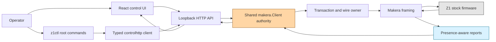
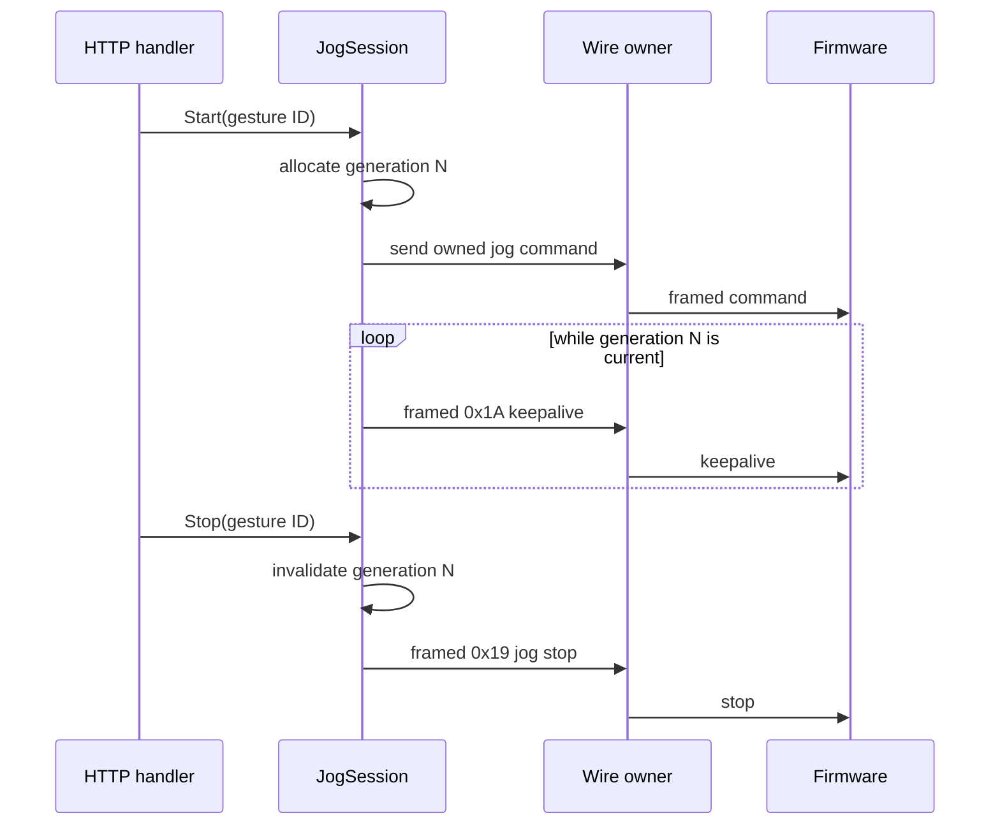

# Makera Z1 Control — Protocol Hardening and Spindle Stop Safety

A machine-control client must distinguish what it transmitted, what the firmware acknowledged, what telemetry subsequently reported, and what the mechanism physically did. The Makera Z1 work in DropCut now represents those stages separately. It also places command ownership, protocol selection, spindle admission, path encoding, and transfer integrity below the HTTP and browser layers, where every consumer is subject to the same rules.

This report explains the controller at implementation checkpoint `f9d0dd4`. It covers the architecture established through MZ1-008 and MZ1-009, the source-grounded firmware work in MZ1-010 and MZ1-011, and the protocol and safety remediation completed in MZ1-012. Its main subject is not the user interface in isolation. It is the complete control path from a browser or CLI request to a native framed command, the evidence returned from the machine, and the policy that decides whether another enabling action is admissible.

> [!summary]
> - The supported operator path is a protobuf-defined HTTP JSON API served on loopback. Root `z1ctl` commands use that API; direct TCP access remains explicit under `z1ctl native` and is never an automatic fallback.
> - A command outcome records dispatch, firmware acceptance, later observation, and physical verdict independently. An `ok`, sentinel, or HTTP 200 cannot by itself establish physical completion.
> - Spindle admission is shared by the native client. A stop sends M5 exactly once, observes bounded coast-down, and escalates at most once to framed realtime Ctrl-X only when the normal stop remains unconfirmed.
> - Session protocol, transaction routing, jog keepalive ownership, path grammar, transfer ordering, and digest verification are enforced as controller invariants rather than UI conventions.

## 1. The control problem

DropCut combines CAM work with a controller for a physical CNC mill. That controller communicates with the Z1 over a firmware-specific TCP protocol, exposes a loopback HTTP service, and serves a React interface. Each boundary changes the representation of an operation, but none is allowed to increase certainty without new evidence.

Consider one request to stop the spindle. The HTTP handler can prove that it received a request. The native client can prove that it wrote one framed M5 transaction. Firmware text can prove that a transaction reached its terminator and can sometimes prove refusal. Fresh status can show the controller state and measured spindle speed. A bounded sequence of low-speed samples can support a physical stop verdict. These are different statements:

| Stage | Evidence | What it establishes | What it does not establish |
|---|---|---|---|
| Request | Valid HTTP body | The server understood the requested operation | Any native write |
| Dispatch | Successful framed write and completed transaction | The command exchange was sent and correlated | Firmware acceptance or motion completion |
| Acceptance | Source-grounded response classification | A known refusal occurred, or acceptance remains unknown | Physical completion |
| Observation | Fresh, structurally valid telemetry | Reported state at a known time | Hidden mechanism state not present in telemetry |
| Physical verdict | Operation-specific observation rule | The configured completion criterion was observed | Certified emergency-stop performance |

The architecture is built around this separation. It avoids two common but unsafe conversions: treating transport success as machine success, and treating missing telemetry as a zero-valued observation.

## 2. System shape

The active repository is:

```text
/home/manuel/workspaces/2026-08-11/cnc-control-dropcut/dropcut-studio
```

The principal components are:

- `apps/control`: the React operator interface, RTK Query API layer, generated TypeScript protobuf messages, tests, and Storybook stories.
- `proto/control/v1/control.proto`: the schema for HTTP JSON request and response bodies. It is explicitly not the machine wire protocol.
- `makera-z1-cli/cmd/z1ctl`: the CLI. Ordinary root commands call the loopback HTTP authority; `native` is the explicit direct-machine namespace.
- `makera-z1-cli/pkg/controlhttp`: the typed HTTP client used by CLI commands.
- `makera-z1-cli/pkg/webui`: the loopback HTTP server, API handlers, protobuf serialization, and embedded frontend.
- `makera-z1-cli/pkg/makera`: native framing, transport, transactions, telemetry parsing, safety policy, motion, filesystem operations, and file transfer.
- `ttmp/2026/09/12/MZ1-010...` through `MZ1-012...`: source analysis, protocol reference, design, fixtures, diary, and acceptance evidence.



The important boundary is `makera.Client`. It is not just a convenience wrapper around a socket. It owns mutable session truth and the policies that must survive changes in caller, endpoint, or UI process.

## 3. One authority, two explicit transports

Earlier CLI behavior could encourage direct access to the machine from multiple surfaces. The mature design gives normal commands one control authority: the loopback HTTP server. This lets the browser and root CLI commands share connection state, transaction ordering, safety admission, and observations.

There is no automatic HTTP-to-native fallback. If the server is unavailable, a normal command fails. It does not silently establish a second machine session. Direct TCP remains available only when the operator chooses the `z1ctl native` namespace.

This rule matters because fallback changes ownership. A request that begins under one process's spindle latch, protocol selection, and transaction router cannot safely migrate to a new socket whose state starts unknown. The apparent convenience would bypass the exact authority that makes the normal path predictable.

The same rule applies to retries. Mutating operations are one invocation, one HTTP request, and one native command transaction unless an operation-specific protocol explicitly defines bounded transfer retries. In particular, M5 is never replayed automatically. If its outcome is uncertain, replaying it would erase the distinction between one requested stop and an unknown number of native writes.

## 4. The native protocol session

### 4.1 Framing

The reviewed Makera dialect wraps ordinary text and realtime bytes in binary frames. A frame contains a fixed prefix, a big-endian body length, a packet type, a payload, a CRC, and a fixed suffix:

```text
86 68 | length:u16-be | type:u8 | payload | crc:u16 | 55 aa
```

Ordinary textual commands use packet type `0xA2`. Realtime controls use packet type `0xA1`. This means Ctrl-X is not written as an unframed byte to the TCP stream; the emergency software halt path emits one framed `PTYPE_CTRL_SINGLE` payload containing `0x18`.

The decoder validates structural boundaries rather than searching indefinitely for plausible output. Invalid body lengths and malformed frames are rejected, and recovery is bounded. These checks are important because a parser that accepts malformed frame boundaries can assign bytes to the wrong transaction or mistake payload data for control data.

### 4.2 Immutable protocol selection

A session negotiates or detects its protocol once. The selected protocol becomes immutable for that session. A later contradictory announcement quarantines the session rather than replacing the protocol object while readers and writers are active.

The invariant is:

```text
protocol(session) = unknown  -> selected dialect
protocol(session) = dialectA -> dialectA
protocol(session) = dialectA + announcement(dialectB) -> quarantine
```

Protocol selection affects framing, transaction terminators, transfer support, and realtime behavior. Replacing it in place would let an active read loop decode with one dialect while a concurrent writer encodes with another. Quarantine preserves uncertainty and requires read-only reconciliation or reconnection rather than continued mutation.

### 4.3 Atomic command and sentinel writes

A normal transaction sends a command and a controlled echo sentinel. The sentinel lets the client identify the end of that command's output even when firmware uses textual, interleaved responses. The two frames are emitted as one ordered write batch under the wire owner.

```text
acquire transaction ownership
  encode command frame
  encode unique sentinel frame
  write both in one ordered batch
  route incoming lines to this transaction
  finish on matching sentinel
release ownership
```

If command and sentinel were separately scheduled, an urgent or concurrent write could appear between them. That would weaken correlation and make later output attribution ambiguous. Atomic emission does not prove firmware acceptance; it proves that the host maintained command ordering.

## 5. Telemetry must preserve absence

Go zero values are useful for ordinary data structures and dangerous for machine observations. If a parser maps a missing RPM field to `0`, safety code can conclude that a stopped spindle was observed when no spindle field was present. If an absent E-stop input maps to `false`, preflight can conclude the E-stop is clear without evidence.

The corrected report model preserves at least three properties for each safety-relevant value:

1. Was the field present at the expected position?
2. Was its syntax and arity valid?
3. What value did it carry?

A value becomes usable only when presence and validity are true. Unknown appended vendor fields remain available as raw input rather than being assigned invented meanings.

The distinction appears in operation code as an explicit guard:

```go
if !status.StateObserved.Valid || !status.SpindleObserved.Valid() {
    return errors.New("spindle stop telemetry missing, malformed, or incomplete")
}
```

The browser receives optional protobuf fields where absence matters. `Rate.current`, `Rate.target`, and `Rate.override` are optional. Stop samples use optional RPM values. An omitted current RPM therefore survives Go serialization, JSON, generated TypeScript decoding, Redux state, and rendering as omitted. It does not become zero during transport.

### Freshness and correlation

A valid old status is not evidence for a new command. Post-operation observations are collected after dispatch and include observation timestamps. Observation errors are retained in the command response. They are not swallowed while the response reports success.

Report correlation also moved away from a shared lossy queue. A shared queue can let one consumer remove a report another transaction needs, especially when periodic status and command output overlap. Transaction ownership and operation-specific observation make the expected recipient explicit.

## 6. Outcome algebra

The HTTP `CommandResponse` is the public expression of the certainty model. Its relevant fields include:

- `dispatch_completed`: whether the command transaction completed at the host protocol level.
- `acceptance`: `unknown` or `refused`; there is deliberately no generic `accepted` value.
- `observation_error`: a later observation failure, kept separate from dispatch.
- `physical_verdict`: `not_applicable`, `confirmed`, `unconfirmed`, or `unavailable`.
- `stop_samples`: timestamped state and optional current/target RPM values.
- `emergency_escalated`: whether the distinct realtime Ctrl-X path was used.
- `normal_stop_error`: the reason normal M5 confirmation failed before escalation.

The absence of generic `accepted` is deliberate. Stock firmware output often establishes that an exchange ended, but that is not the same as semantic acceptance. Known source-grounded phrases such as soft-endstop violations, asserted halts, aborted operations, missing homing, or already-playing conflicts classify as refusal. Unfamiliar output remains unknown.

```text
HTTP 200
  + dispatch_completed = true
  + acceptance = unknown
  + physical_verdict = unconfirmed
```

is a coherent result. It says that the server and transport worked while physical completion was not established. Consumers must not compress these fields into a single green indicator.

## 7. Shared spindle admission

### 7.1 Why the latch moved below HTTP

A previous web-server-local `spindleStopUnconfirmed` latch protected only requests passing through that server instance. A CLI native path, another handler, or a reconnected client could avoid it. The remediation moved admission into `makera.Client`, the shared owner of the machine session.

Spindle admission has two meaningful states:

```text
SpindleOffConfirmed
SpindleOnOrStopUnconfirmed
```

New sessions begin unknown, represented by `SpindleOnOrStopUnconfirmed`. Enabling the spindle requires either an already-confirmed off state or successful read-only reconciliation. Any spindle-on attempt marks the state unconfirmed before dispatch. A stop marks it unconfirmed before M5 and returns it to confirmed only after the stop observation criterion succeeds.

This order prevents a failed write, lost response, or handler crash from leaving stale permission behind.

### 7.2 Normal stop algorithm

M5 is the source-grounded normal spindle stop. The reviewed firmware waits for conveyor idle and invokes spindle `turn_off()`. Its target RPM remains retained after stopping, so target zero is not a valid completion criterion.

The host algorithm is adaptive because observed state changes before measured RPM reaches zero:

```text
set admission = on-or-stop-unconfirmed
send M5 exactly once
observe fresh status for up to 15 seconds

if valid Idle and measured RPM <= 50 for 5 consecutive samples:
    set admission = off-confirmed
    return confirmed without escalation

if state remains Run beyond the short normal-stop window:
    record normal-stop failure
    send one framed realtime Ctrl-X
    observe Alarm-or-Idle with stable low RPM

if telemetry is absent, malformed, contradictory, stale, or times out:
    keep admission unconfirmed
    return an explicit failure
```

A single immediate `Run` sample is not terminal failure. The spindle can still be decelerating after M5. Likewise, `Idle` with nonzero current RPM is not immediate confirmation. In the source, Idle indicates that the firmware spindle-on flag is false and the conveyor is idle; the rotor can still coast physically. The policy therefore grants a bounded coast-down interval and requires five consecutive finite measured-RPM samples in `[0, 50]`.

### 7.3 Distinct software emergency halt

If normal M5 remains unconfirmed because the machine stays in `Run`, the client may escalate once to realtime Ctrl-X. This is not an M5 retry. It is a distinct controller reset/halt mechanism with its own outcome field and its own postcondition.

Ctrl-X and M112 are software stops. Neither supersedes the machine's physical E-stop. Feed hold `!` also is not a spindle stop: it requests motion hold and does not imply that spindle output was disabled. These controls are classified separately because their firmware paths and physical claims differ.

M112 is always admitted as a stop command. It must not be rejected by a motion preflight or confirmation gate. A safety system that refuses an available stop because another check is failing has reversed its priorities.

## 8. Supervised spindle evidence

The acceptance work used the machine's installed firmware, which reports `1.0.15.0.1.11`. The source tree used for reasoning is commit `1683b6fb5c7ec1d341c476c6fdb2a22f7a26220e`; no build mapping proves byte identity. Source conclusions are therefore indicative unless a behavior was also observed on hardware.

### M957 diagnostics

A typed read-only diagnostic path was added for M957. The command reports local spindle state, current RPM, retained target RPM, and PWM duty. During supervised testing it produced the following pattern:

| Condition | State | Current | Target | PWM |
|---|---:|---:|---:|---:|
| Stopped | off | 0 | retained value | 0.000 |
| Running near 6000 RPM | on | approximately 5982–6606 | 6000 | approximately 0.27–0.30 |

This command is valuable because aggregate status and the spindle controller's local diagnostics come from different firmware reporting paths. Agreement between Idle/current zero and M957 state off/PWM zero strengthens the stop conclusion.

### Failed and successful runs

Initial 3000 RPM testing exposed two separate problems. A stop that physically worked was first reported as failure because the first observed sample remained `Run` near 3979 RPM. Later trials showed M5 return its textual completion while the machine remained `Run` near 3950 RPM for fifteen seconds; the physical E-stop was used. Waiting two seconds before M5 did not eliminate that behavior.

The host was changed rather than rewriting the evidence. First, it observed a bounded deceleration window. Then it gained M957 diagnostics and one Ctrl-X escalation. A further supervised run showed that M5 had already changed the machine to Idle and that RPM was coasting toward zero before the fixed escalation timer sent an unnecessary Ctrl-X and produced Alarm. That trace led to the adaptive split between persistent `Run` and `Idle` coast-down.

The final supervised acceptance at stable 6000 RPM used binary `/tmp/z1ctl-mz1-012-adaptive`, built from `f9d0dd4`, with SHA-256:

```text
f67144927513272331d9ddc55e96c0a6135f6a6403d6ddd8c241ce9c21044f30
```

The exact sequence was:

| Event | UTC timestamp | Observation |
|---|---|---|
| M3 request | `2026-09-12T21:49:34.301919714Z` | Requested 6000 RPM |
| Stop request | `2026-09-12T21:49:50.113459072Z` | Sent exactly `M5` |
| First stop sample | `21:49:50.398846145Z` | Run, 6084.9 RPM |
| First Idle sample | `21:49:50.699211034Z` | Firmware spindle flag off; physical coast-down continued |
| First zero sample | `21:49:52.022223589Z` | Idle, measured zero |
| Confirmation | `21:49:53.572796787Z` | Five consecutive terminal samples completed |

The result reported `sent:["M5"]`, `emergencyEscalated:false`, and `physicalVerdict:"confirmed"`. Final aggregate status was Idle with measured RPM zero and retained target 6000. Final M957 reported state off, current zero, target 6000, and PWM 0.000. No physical E-stop, Ctrl-X, M112, or M5 retry was used in that run.

This establishes the current acceptance criterion. It does not explain the earlier intermittent persistent-Run behavior, certify all tools and inertias, or prove installed firmware/source identity.

## 9. Command risk is a controller property

The native package classifies commands by effect:

| Class | Meaning | Examples |
|---|---|---|
| Read | Reports state without intended mutation | `version`, `model`, M957, status |
| Stop | Reduces activity and must remain available | M5, M112, `abort`, `suspend`, jog stop |
| Accessory | Dedicated output operation with explicit capability | light, fan, air, vacuum where configured |
| Data | Mutates files, clock, or configuration | upload, delete, configuration writes |
| State-enabling | Permits later activity without directly commanding motion | unlock, resume, cycle start, soft reset |
| Motion | Moves or can start unbounded physical activity | G-code motion, homing, jog, spindle on, play |

Risk is derived from the entire grammar, not a familiar prefix. Unsafe characters, unknown G/M forms, and ambiguous commands fail toward the motion class. Stops are never blocked by enabling preflight. Motion requires an authorized typed path and the full preflight. The generic text path does not become safe because a caller supplied a Boolean named `confirm`.

Accessory capability is explicit and model-specific. Stock firmware's Switch module can bind M-code numbers, pins, polarity, output type, default values, and subcodes through configuration. The Z1 profile therefore records indicative capabilities rather than claiming that every compiled M-code exists on every machine. Sigma-delta output values preserve their native 0–255 meaning; they are not silently normalized as percentages.

## 10. Jog ownership and realtime authorization

Continuous jog is not a command followed by a harmless heartbeat. The firmware uses realtime `0x1A` as a keepalive that can prolong movement. Public generic realtime access therefore excludes it.

A `JogSession` owns one generation token. Only the current generation may emit keepalives. Stop, cancellation, replacement, or disconnect invalidates the generation before further writes. A stale goroutine cannot continue keeping an old jog alive.



Ownership is checked at the point of emission, not only when the goroutine starts. This closes the interval in which a cancelled task wakes and writes one more enabling byte.

## 11. Paths are grammar, not strings

Filesystem commands place a path inside a firmware command line. A newline, carriage return, control byte, quote, comment marker, or already-escaped sequence can change the number or meaning of commands emitted. Escaping therefore begins with a strict domain:

- the path must be absolute;
- every character must be printable ASCII;
- forbidden command/control characters are rejected;
- encoding happens exactly once;
- a rejected path causes no write.

`EncodePath` centralizes these rules. Typed operations such as directory listing and remote MD5 computation use it directly. Consumers no longer call a low-level escape helper and assemble command lines independently.

```text
validate(raw path)
  -> reject non-absolute or non-printable input
  -> encode once according to firmware path grammar
  -> construct typed command
  -> perform one transaction
```

A useful test is not merely “the encoder returned an error.” It also asserts that the fake transport observed zero writes. This establishes the controller-owned no-side-effect invariant without pretending to prove installed firmware behavior.

## 12. File transfers are protocols with integrity outcomes

The transfer layer now rejects unsupported negotiated dialects immediately with `ErrUnsupportedTransfer` instead of waiting for a timeout. Upload and download transitions are ordered, bounded, and tested under duplicate, delayed, and malformed transport events.

Download success requires digest agreement when the protocol advertises a digest. A mismatch returns `ErrIntegrityMismatch`; it is not represented as a successful download plus a warning field that consumers might ignore. Retries are bounded and apply only to transfer protocol states where repetition is defined. This exception does not generalize into mutation retries for machine commands.

The transfer result distinguishes bytes received, advertised digest, actual digest, protocol support, and terminal state. Integrity is part of the operation outcome, not a logging detail.

## 13. The browser contract

The React interface uses generated TypeScript messages from the same protobuf schema that generates Go response structures. The schema defines HTTP JSON only. Native framing remains confined to the Go client.

This division has three benefits:

1. The browser cannot construct arbitrary native frames.
2. Optional machine observations retain presence across Go and TypeScript.
3. Contract tests can serialize actual Go-generated JSON and decode it with the frontend runtime.

The UI renders uncertainty rather than maintaining its own safety truth. The old web-local spindle latch was removed. A new page load, a second browser, and a CLI request all receive the shared client's admission decision. The frontend still implements usability guards such as single-flight buttons and typed confirmation, but these are not relied upon as the sole enforcement layer.

HTTP command timeouts are thirty-five seconds so the client can receive the controller's bounded stop observation and escalation outcome. Increasing the HTTP timeout does not increase the native mutation count; it allows one request to finish its evidence collection.

## 14. Validation strategy

The implementation uses fake transports for controller invariants: exact writes, ordering, ownership, timeout behavior, parser bounds, no-write rejection, and fault transitions. These tests do not establish stock firmware semantics. Firmware claims come from pinned source review or supervised hardware evidence.

The consolidated software gate passed:

```text
go test -race ./...
go vet ./...
go build ./cmd/z1ctl
buf lint
buf generate
pnpm test       # 16 Vitest tests at this checkpoint
TypeScript typecheck
Vite production build
```

Tests cover malformed and absent telemetry, firmware refusal classification, protocol contradiction and quarantine, atomic transaction emission, stale jog generations, M112 admission, path rejection with no writes, transfer support and integrity mismatch, consumer JSON contracts, persistent-Run escalation, and Idle spindle coast-down without escalation.

Software validation and physical acceptance remain separate columns. A fake machine can prove that one M5 frame was written; it cannot prove that a physical spindle stopped. The final supervised run supplies the latter evidence for the present machine, firmware, and test condition.

## 15. What remains unknown

Several unknowns are intentionally preserved:

- The exact source commit corresponding to installed firmware `1.0.15.0.1.11` is not proven.
- The cause of earlier intermittent M5 persistent-Run behavior is not known.
- Dynamic Switch commands, pins, polarity, and output types depend on installed configuration.
- The complete hard-limit topology and all diagnostic vector positions have not been physically mapped.
- Stop timing for every possible tool, collet, and rotational inertia has not been characterized.
- A software halt is not a certified physical emergency stop.

These are not unfinished fields to fill with defaults. They define where future evidence is required.

## 16. Practical operating rules

The controller's current rules are concise:

- Use root `z1ctl` commands through the loopback HTTP authority.
- Use `z1ctl native` only as an explicit diagnostic or development choice.
- Never add automatic HTTP-to-native fallback.
- Never retry M5 automatically.
- Keep M112, jog stop, suspend, abort, and other true stop paths ungated.
- Treat Ctrl-X as a distinct software emergency escalation and expose whether it occurred.
- Require fresh, valid measured RPM and state evidence for a spindle-stop claim.
- Interpret retained target RPM as firmware state, not proof that the spindle is active.
- Reject unknown or malformed safety telemetry rather than substituting zero values.
- Keep path validation and transfer integrity inside typed native operations.
- Require fresh supervised authorization before further physical spindle experiments.

## 17. Repository evidence

The main implementation series is:

| Commit | Change |
|---|---|
| `dd1d504` | Source-grounded protocol audit and remediation design |
| `c4216a4` | Fault and hardware evidence fixtures |
| `0d2b09b` | Presence-aware telemetry and outcomes |
| `345d8c2` | Immutable protocol and atomic wire ownership |
| `eda776f` | Shared spindle authority, M112, and jog ownership |
| `8f27cde` | Path and transfer hardening |
| `c44d21e` | Truthful consumer outcomes and capability contracts |
| `7fa7ff3` | Bounded spindle deceleration observation |
| `2bb1754` | M957 diagnostics and one realtime halt escalation |
| `f9d0dd4` | Adaptive Idle coast-down without unnecessary escalation |

The primary long-form artifacts are:

- `ttmp/2026/09/12/MZ1-012--makera-protocol-implementation-source-grounded-audit-and-remediation-design/design-doc/01-makera-protocol-implementation-audit-and-remediation-design.md`
- `ttmp/2026/09/12/MZ1-012--makera-protocol-implementation-source-grounded-audit-and-remediation-design/reference/01-investigation-diary.md`
- `ttmp/2026/09/12/MZ1-010--stock-spindle-stop-observability-and-m5-investigation/analysis/01-indicative-stock-firmware-m3-m5-control-path.md`
- `ttmp/2026/09/12/MZ1-011--makera-z1-stock-firmware-source-grounded-command-reference/reference/01-stock-firmware-command-and-telemetry-reference.md`

## 18. Related notes

This report continues the earlier project sequence:

- [[PROJ - Makera Z1 Control - Reverse-Specifying a CNC Wire Protocol]]
- [[PROJ - Makera Z1 Control - Crossing into Motion]]
- [[PROJ - Makera Z1 Control - What the Machine Does Not Say]]
- [[PROJ - Makera Z1 Control - Typed Interfaces and Explicit Uncertainty]]
- [[ARTICLE - Makera Z1 Stock Firmware - Source-Grounded Command and Telemetry Reference]]

## 19. Current status and next work

The MZ1-012 implementation is complete at `f9d0dd4`, its software gate passes, and the supervised 6000 RPM adaptive stop criterion passed without emergency escalation. The appropriate next action is not additional physical repetition. If persistent `Run` after M5 recurs during ordinary work, capture aggregate status and M957 immediately around the event, preserve the exact binary and timestamps, and investigate from that evidence.

The durable project rule is: **authority belongs below every consumer, and certainty advances only when a new layer contributes evidence.**
