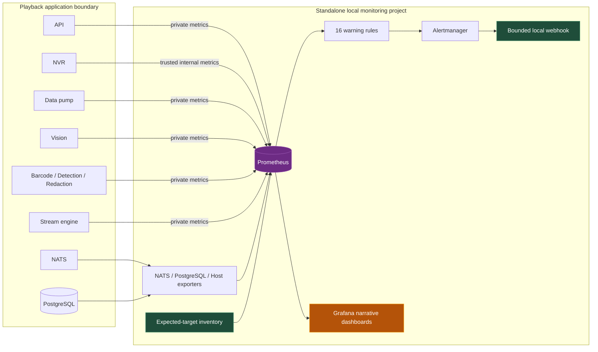
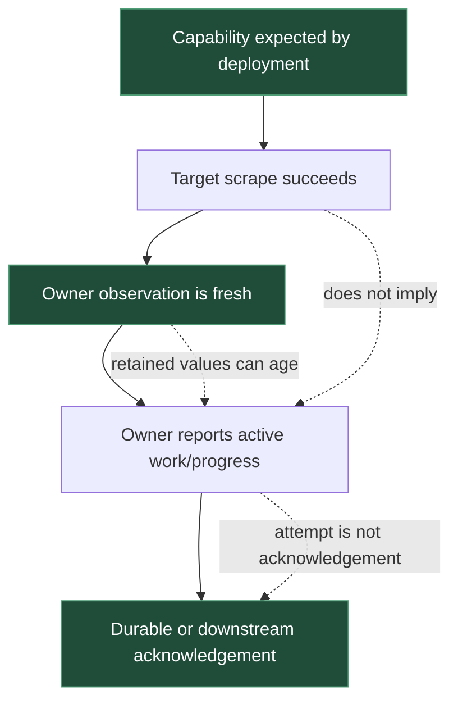

# Playback Observability - Narrative Local Operations

Playback now has a complete local Docker Compose/DGX observability layer built around Prometheus, Grafana, and Alertmanager. The work is not merely a collection of service metrics: it establishes ownership and freshness semantics, keeps sensitive identities out of the ordinary monitoring path, and gives developers a symptom-driven route from “something is wrong” to the subsystem that owns the evidence.

> [!summary]
> - Fourteen privately scraped targets cover infrastructure, common service health, recording/ingestion durability, native inference, stream-engine progress, background work, and selected persistence state.
> - Grafana presents nine narrative dashboards in four operational folders; the exhaustive metric catalog and rollout record live separately under reference.
> - Sixteen warning-only rules have fixture tests, exact runbooks, and a bounded local firing/resolution route. Production paging, k3s, and central retention are intentionally not claimed.

## Why this project exists

Playback is an on-premises computer-vision system. A green process is not enough to establish that it is doing useful work: a recorder can be alive without writing media, a data-pump can accept input without committing it, an inference endpoint can return a cached success without moving the GPU, and a publisher can be connected without proving consumer delivery.

Before PB-OBS-001, these distinctions were distributed across private health routes, service-specific counters, logs, and developer knowledge. The project creates one bounded operational model while preserving the boundaries that make the measurements trustworthy.

The design answers six recurring questions:

1. Is this installation expected to be running, and can its telemetry be trusted?
2. Is the host or recording filesystem under pressure?
3. Are cameras producing current media and are segments being indexed?
4. Are inputs surviving buffering and reaching an acknowledged database commit?
5. Are inference and background pipelines making progress under shared GPU/database load?
6. Is selected embedding persistence healthy, and which capabilities are intentionally absent?

## Current project status

Local Docker Compose/DGX Phases 0–5 are accepted on branch `feat/pb-obs-001-prometheus`.

What is implemented and deployed:

- a standalone seven-container monitoring project
- fourteen expected/scraped targets on the GPU deployment model
- seven-day/5 GB Prometheus block-retention policy
- loopback-only Prometheus, Grafana, and Alertmanager access
- an independent expected-target inventory and bounded local alert sink
- whole-family metric allowlists with identity-bearing sample rejection
- application-owned freshness, durability, recording, inference, and persistence signals
- eleven provisioned dashboards in five filesystem-derived Grafana folders
- sixteen warning-only alert rules, all with promtool fixtures and runbook anchors
- a detailed local operator runbook and reusable deployed acceptance scripts

Current acceptance snapshot:

- 14/14 targets up
- 1,957 Prometheus head series
- 16/16 alert rules evaluated healthy and inactive before synthetic testing
- 120/120 dashboard PromQL expressions executed
- 111 expressions returned current series; nine were valid empty states
- sequential query latency: 0.678 ms median, 1.2 ms p95, 2.195 ms maximum
- local firing/resolution batches reached only the bounded webhook
- approximately 247 MiB across the seven monitoring containers in a one-shot active-query snapshot
- approximately 20.5 MB in the current Prometheus data directory snapshot

What remains intentionally outside this result:

- production paging ownership and service-level objectives
- external dead-man monitoring for total host/power loss
- Kubernetes/k3s packaging and failover
- central retention/remote write and traces
- per-container cgroups, filesystem inodes, host-network pressure, and qualified GPU capacity/ECC export
- expected cameras that never instantiate an NVR worker
- API traffic/error SLO denominators, search traffic, and backup/vacuum alerts
- long-term TSDB compaction and capacity qualification

## Project shape

The implementation lives primarily in these paths:

- `/Users/manuel.odendahl/code/tulip/playback-pb-obs-001/docker-compose.observability.yml`
- `/Users/manuel.odendahl/code/tulip/playback-pb-obs-001/observability/`
- `/Users/manuel.odendahl/code/tulip/playback-pb-obs-001/observability/RUNBOOK.md`
- `/Users/manuel.odendahl/code/tulip/playback-pb-obs-001/ttmp/2026/09/09/PB-OBS-001--playback-system-metrics-and-health-observability/`

The ticket contains the architecture guide, metric-contract checklist, chronological investigation diary, sanitized schemas and rollout receipts, and reusable scripts for runtime acceptance.

## Architecture



The monitoring project joins the private Playback network only where it must scrape application/exporter targets. Operator interfaces bind to host loopback. There is no Docker socket, host PID/network namespace, privileged container, application volume, camera media mount, or public Caddy route.

Prometheus and the expected-target inventory are independent of application databases and broker health. This is essential: a failed service cannot be expected to emit its own desired state.

## The core mental model: evidence layers

A dashboard is trustworthy only when the reader knows which layer produced the statement.



Examples:

- `up=1` means a scrape rendered; it does not mean the service is ready or making progress.
- A cached queue/filesystem/database value is usable only with availability and a recent owner timestamp. A scrape never refreshes that timestamp.
- A data-pump transaction counter advances at COMMIT acknowledgement. It is not subscriber delivery or a unique-row count.
- NATS incoming/outgoing totals measure broker activity. Fanout means outgoing can legitimately exceed incoming.
- Native inference HTTP success includes valid no-result/no-person responses. Redaction success may also be a cache hit and therefore does not prove GPU progress.
- Stream-engine publisher connection proves a local connection, not consumer acknowledgement.
- Vision queue and persistence gauges represent shared singleton state and must never be summed across replicas.

## Dashboard information architecture

The initial metric coverage catalog grew to thousands of lines because it intentionally gives every selected family a query. That is valuable as a contract and terrible as an incident entry point. The final Grafana layout separates those jobs.

### 01-start-here

**Installation overview** establishes whether Prometheus, inventory, targets, rule evaluation, and cached observations are trustworthy. It shows firing alerts and three high-level subsystem indicators without pretending blanks are healthy.

**Developer incident triage** is the primary developer surface. Its rows encode an ordered workflow:

1. Can I trust the observations?
2. Is this a recording/playback gap?
3. Is input failing to become durable?
4. Is inference or analysis delayed?

Each path shows only the signals needed to choose the next subsystem and links directly to a runbook section.

### 02-system-runtime

**Host resources and recording storage** tells a pressure story rather than presenting raw node-exporter metrics. It starts with CPU, normalized load, and memory; then uses PSI to distinguish actual contention; then connects NVMe throughput/busy time to fresh recording-filesystem capacity.

**NATS health and traffic** starts with exporter versus broker health, then connection/subscription context, traffic counts/bytes, and finally slow consumers plus broker process resources. It repeatedly warns that activity is not durable delivery.

**Common service observations** groups bounded pool, database-probe, queue, driver, and admission snapshots for dependency-level comparison.

### 03-data-path

**Recording observations** separates driver state, current worker/media progress, index registration, filesystem capacity, and eviction outcomes.

**Ingestion durability** follows attached and detached buffers through writer acknowledgement, flush finalization/rebuffering, notification decisions, input rejection, and pipeline outcomes.

**Embedding persistence and database** combines singleton persistence queue/health/watermarks with application-owned database probes, PostgreSQL activity, and API pool occupancy. Disabled embedding/VLM/reranker providers remain absent by configuration.

### 04-inference

**Inference and GPU pipeline** connects stream-engine physical requests/latency/queues, desired camera reconciliation, publisher connection, native readiness/outcomes/in-flight state, Vision queue/background outcomes, and selected persistence state.

### 99-reference

**Metric coverage catalog** is the exhaustive “which selected family exists and how is it gated?” surface. **Rollout overview** is the dated deployment/evidence checkpoint. Neither is the normal incident entry point.

## Choosing a visualization by question

The dashboards deliberately use several widget types:

| Question | Widget | Why |
| --- | --- | --- |
| What is the current bounded value? | Stat with sparkline | Current value stays prominent while preserving recent direction |
| How is a fixed population distributed? | Bar gauge | Worker states/capacity are easier to compare than overlapping lines |
| Was a binary/categorical verdict healthy over time? | State timeline | Transitions and unknown gaps are visible without implying magnitude |
| Which targets or alerts need action? | Table | Labels and runbook context matter more than a plotted y-axis |
| How did rate, latency, pressure, or progress change? | Time series | Trend and temporal correlation are the actual question |
| What should the reader do next? | Text/row narrative | Interpretation and ordering cannot be inferred safely from metric names |

The final Host dashboard has fourteen panels and the NATS dashboard eleven. This is more coverage than the original five-panel versions, but organized into three question-driven rows rather than a graph wall.

## Alerting model

All deployed alerts are initial local warnings owned by `local-operator`. Every alert has a symptom, gate, persistence window, bounded labels, runbook, and fixture.

The rules cover:

- expected target and inventory disappearance
- NATS upstream health separate from exporter reachability
- Prometheus rule evaluation failures
- per-target sample-limit headroom
- stale/never-initialized and fresh-false database probes
- stale and sustained-backlog Vision queue observations
- stale and below-reserve recording filesystem state
- owner-derived NVR media progress stalls
- sustained data-pump detached work
- bounded overflow/input rejection loss
- redaction admission saturation (not an inferred GPU wedge)
- bounded visual-embedding persistence failure reasons

Fixture tests include missing data, never initialized state, zero traffic, disabled capability omission, sustained conditions, recovery, and counter reset. A local routing smoke posts one fixed synthetic alert through Alertmanager and verifies both firing and resolved notification batches at the internal sink. The sink retains counts only, not payloads.

## Runbook design

`observability/RUNBOOK.md` is part of the executable contract. Tests require every rule's anchor to exist.

Each runbook section explains:

- what the alert proves and does not prove
- required freshness or expected-work gating
- correct aggregation
- first bounded diagnostic actions
- actions that are specifically unauthorized or misleading
- the narrowest recovery owner

The runbook also preserves a non-obvious deployment failure: replacing a Docker single-file bind source with atomic `mv` changes the host inode. The container can keep reading the old mounted inode, and Prometheus can log a successful HUP while loading stale bytes. Generated config must be copied into the existing file before HUP and verified through `/api/v1/status/config`. If replacement already happened, recreate only Prometheus while preserving its named TSDB volume.

## Implementation details

### Expected target detection

A service cannot reliably report its own absence. The independent inventory emits expected capabilities, and Prometheus compares them with successful scrapes:

```promql
playback_target_expected == 1
unless on (deployment, node, service)
up == 1
```

Disabled providers are removed from both sides by generation, so they do not become permanent false alarms.

### Fresh observation gating

Cached gauges require both source validity and time validity:

```promql
vision_queue_depth
and on (deployment, node, service)
  (vision_queue_observation_available == 1)
and on (deployment, node, service)
  (time() - vision_queue_observation_last_success_timestamp_seconds >= 0)
and on (deployment, node, service)
  (time() - vision_queue_observation_last_success_timestamp_seconds < 90)
and on (deployment, node, service)
  (up == 1)
```

This preserves three different states:

- observed zero
- stale/unknown
- target absent/down

Using `or vector(0)` would collapse them and is rejected by tests.

### Shared-state aggregation

For database-wide Vision queue/persistence state, one reporter or a fresh maximum is valid. Summing replicas duplicates the same underlying state. Event counters are different: rates may be summed after preserving bounded outcome dimensions.

```promql
max by (deployment, node, service) (vision_queue_depth)

sum by (deployment, node, service, outcome) (
  rate(data_pump_write_transactions_total[5m])
)
```

### Bounded dashboard acceptance

Ticket script 09 recursively reads the checked-in dashboard tree, retrieves each UID from live Grafana, executes every panel expression against Prometheus, verifies folder placement, waits for all rule groups to evaluate, and sends/resolves one synthetic local alert. Its receipt stores only dashboard/rule names, counts, timings, and fixed labels.

Pseudocode:

```text
for dashboard in checked_in_tree:
    assert live_grafana.dashboard(uid)
    assert live_folder(uid) == parent_directory
    for panel_query in dashboard:
        result = prometheus.instant_query(panel_query)
        record parse success, series count, elapsed time

wait until all 16 loaded rules have health=ok
assert every expected target is up
post fixed local smoke alert
wait for firing counter increment
resolve fixed local smoke alert
wait for resolved counter increment
```

## Important failure modes and lessons

### Loaded rules are not yet evaluated rules

Immediately after HUP, a rule group may be loaded but report `health=unknown` and a zero evaluation time until its first scheduled evaluation. Acceptance waits up to one minute for every group; it does not call this a rule failure.

### PromQL comparisons retain the left value

Without `bool`, comparisons act as filters and preserve the left-hand sample value. An early fixture incorrectly wrapped a timestamp-age comparison in `max` and then compared that result with `== 1`, which only matched exactly one second. The corrected rule uses the comparison itself as the set filter.

### A catalog move can feel like graph loss

When dashboards moved into folders, Host and NATS retained all original panels, but the detailed per-family catalog moved to `99-reference`. The operator reasonably perceived missing graphs. The response was to verify historical and live counts, make the reference location explicit, and enrich Host/NATS with the useful retained families—not to move the graph wall back to the start folder.

### Monitoring data is operationally sensitive

Even without media, metrics reveal topology, activity timing, capability state, and pressure. Loopback binding and operator tunneling are security boundaries. Grafana's anonymous Viewer mode is acceptable only for this single-operator host-local trial; it is not tenant authentication.

## Validation record

The final milestone passed:

- 15 observability configuration/receiver/provisioning tests
- Prometheus 3.5.0 rule validation: 16 rules
- all three promtool fixture files
- Alertmanager 0.28.1 `amtool check-config`
- JSON parsing for every dashboard
- live Grafana provisioning under all five folders
- all 120 live PromQL expressions
- bounded local firing and resolution
- repository formatting and linting (only pre-existing size warnings)
- docmgr frontmatter/doctor validation

Only Grafana was recreated to load the new folder provisioning. Prometheus used an in-place rule update plus HUP. Inventory and application containers were unchanged.

## Important project docs

- Architecture and implementation guide: `/Users/manuel.odendahl/code/tulip/playback-pb-obs-001/ttmp/2026/09/09/PB-OBS-001--playback-system-metrics-and-health-observability/design-doc/01-system-metrics-architecture-and-intern-implementation-guide.md`
- Metric contract/checklist: `/Users/manuel.odendahl/code/tulip/playback-pb-obs-001/ttmp/2026/09/09/PB-OBS-001--playback-system-metrics-and-health-observability/reference/02-metrics-contract-and-rollout-acceptance-checklist.md`
- Investigation diary: `/Users/manuel.odendahl/code/tulip/playback-pb-obs-001/ttmp/2026/09/09/PB-OBS-001--playback-system-metrics-and-health-observability/reference/01-investigation-diary.md`
- Phase 5 receipt: `/Users/manuel.odendahl/code/tulip/playback-pb-obs-001/ttmp/2026/09/09/PB-OBS-001--playback-system-metrics-and-health-observability/sources/61-phase-5-narrative-dashboards-rules-routing-and-runbooks.md`
- Operator runbook: `/Users/manuel.odendahl/code/tulip/playback-pb-obs-001/observability/RUNBOOK.md`

## Open questions

- Who owns production warning/page policy for each capability, and what representative operating cycle defines thresholds?
- Which external system should provide the total-host-loss heartbeat?
- Which existing platform monitoring stack should own the k3s version?
- Is local metric-history loss acceptable after telemetry disk failure, or does it need backup/replication?
- Which identity-bearing drilldowns should exist behind an authorized workflow without entering ordinary metric labels?
- What sustained recording/GPU/compaction workload defines the final appliance capacity envelope?

## Near-term next steps

- review Host/NATS/stat/state widgets visually at narrow, medium, and wide browser widths
- review initial warning thresholds with actual owners before enabling any external receiver
- preserve the local warning-only policy until service objectives are explicit
- decide whether to merge the branch and retain the DGX monitoring trial
- hand k3s parity and central retention to their owning projects rather than extending the Compose ticket

## Project working rule

> [!important]
> Start with expected state and observation freshness, then follow owner work to acknowledgement or progress. Never turn missing data into zero, never infer durable delivery from an attempt, and never infer GPU progress from a cacheable HTTP success.
