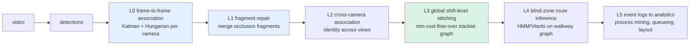
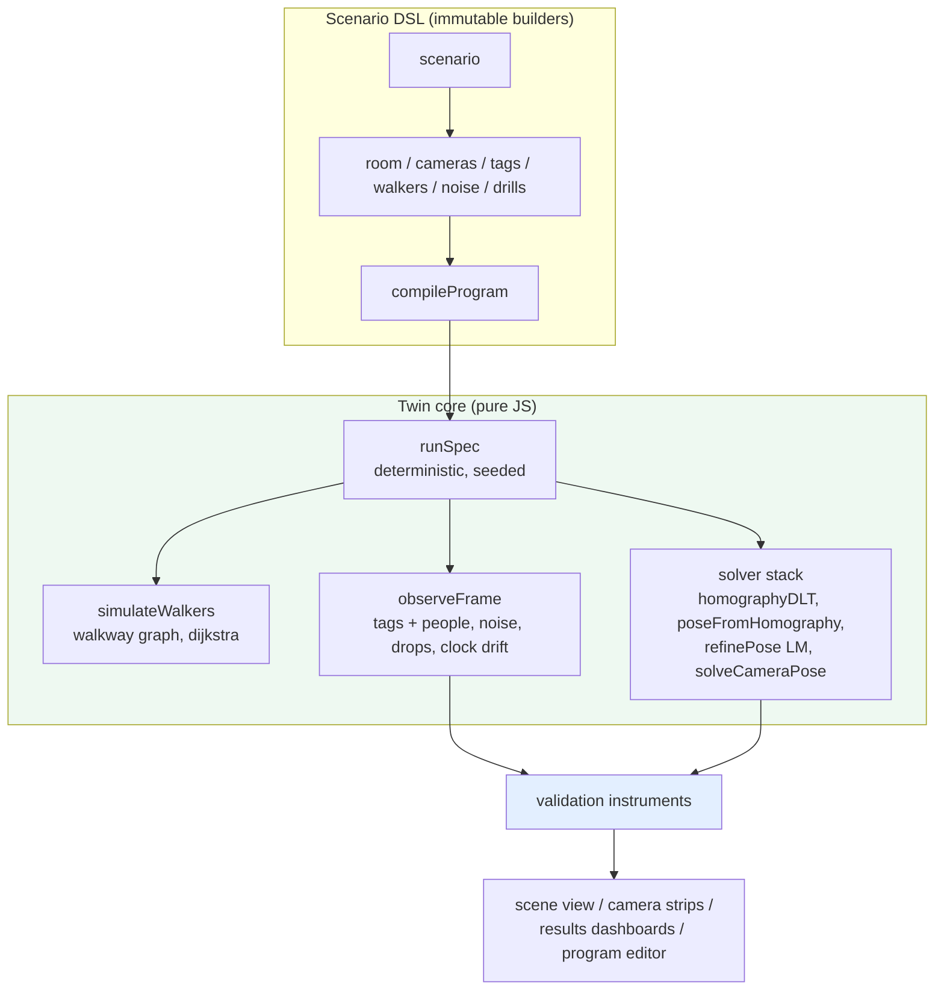

# Factory Multi-Camera Person Tracking

This report documents a research program for building a multi-camera person-tracking system in a factory: cameras observe workers; the system maintains identities across cameras and occlusions; reconstructed trajectories become event logs that feed process mining, queueing analysis, and facility-layout decisions. The program covered four work streams — a cross-disciplinary literature study, a legal-acquisition survey of the relevant books, the production of a browser-based deterministic simulation laboratory, and a staged design for ten self-contained algorithm labs. The reader of this report should come away understanding how the problem decomposes, which published knowledge governs each part, how the twin laboratory validates algorithms against exact ground truth, and what the next engineering steps are.

> [!summary]
> - The tracking problem decomposes into six levels (L0–L5). No single book covers the system; each level belongs to a different research tradition — radar data association, combinatorial optimization, modern multiple-object tracking, camera geometry, and industrial engineering.
> - A factory inverts the difficulty of generic street tracking: identical PPE destroys appearance evidence while floor geometry, topology, and timing are known. Association must therefore be motion-, geometry-, time-, and topology-dominant, with appearance demoted to a tie-breaking term.
> - The explicit "tracklet stitching" literature is paper-only (network-flow association from 2008 onward, plus a radar "track stitching" lineage that never used appearance). Three books supply the mathematics: *Network Flows* (Ahuja/Magnanti/Orlin), *Assignment Problems* (Burkard et al.), and *Design and Analysis of Modern Tracking Systems* (Blackman & Popoli).
> - Every algorithm enters the system through a deterministic twin-lab that measures it against exact ground truth before it enters a pipeline. Lab 0 (calibration and reconstruction) is implemented; Lab 1 (per-camera floor tracking) is designed and specified by its interface contracts.

## 1. Why this program exists

A person-tracking system for a factory floor must answer one hard question repeatedly: when a person disappears from one camera and later appears on another, was it the same person? Answering this once is a classification problem; answering it consistently for every worker over an entire shift is a joint estimation and combinatorial-optimization problem. The failure modes of the downstream analytics — travel distances, station visits, dwell times, bottleneck statistics — are dominated by identity errors, not by detection errors. A system that detects people perfectly but switches identities at 2% of handoffs produces systematically wrong flow statistics.

The program therefore started with research rather than code. The relevant knowledge is spread across four communities that historically cite each other rarely: the radar data-association tradition (Kalman filtering, gating, JPDA/MHT, multi-sensor track fusion, 1960–1999), combinatorial optimization (assignment and min-cost flow, 1955–1993), computer-vision tracking (2016–present, deep detectors plus association), and industrial engineering (queueing, variability laws, process mining). No curriculum covers the intersection. The first deliverable of the program was to build that curriculum from primary sources, second-hand prices, and legally free author-hosted editions, and to record it as four cross-linked HTML reports.

The second deliverable was infrastructure. Algorithms in this domain fail silently: an overconfident covariance, a systematic foot-point bias, a greedy association choice, or an unpriced unmatched alternative each produce plausible-looking output that is wrong in ways invisible without ground truth. The twin laboratory exists because ground truth for real footage is scarce and expensive, while ground truth in a deterministic simulation is a property of the world rather than a measurement effort.

## 2. The problem decomposition

The pipeline from video to operations analytics decomposes into six levels. Each level has distinct failure modes, distinct literature, and a distinct lab.

| Level | Problem | Status of knowledge |
|---|---|---|
| L0 | Frame-to-frame assignment per camera | Commoditized (SORT lineage: Kalman filter plus Hungarian algorithm around a deep detector) |
| L1 | Repairing fragments within one camera | Mostly solved by modern trackers (ByteTrack low-confidence association, BoT-SORT camera-motion compensation, OC-SORT occlusion-robust state) |
| L2 | Identity across non-overlapping cameras | Active research (MTMCT); appearance-dominated in the literature |
| L3 | Entire-shift global identity resolution | The core design problem; paper literature only |
| L4 | Inferring routes through unobserved regions | Settled mathematics (HMM/Viterbi on a known zone graph) applied rarely |
| L5 | Event logs to factory decisions | Mature industrial science (process mining, queueing, simulation) |

L3 is the project's center of gravity and the reason the bookshelf spans four fields. The formulation — every tracklet is a node, every feasible continuation is an edge weighted by an appearance-plus-motion-plus-time-plus-topology cost, and one global optimization resolves all identities jointly — descends from a specific lineage: Zhang, Li, and Nevatia mapped maximum-a-posteriori data association onto a min-cost flow network in 2008; Berclaz et al. recast it as K disjoint shortest paths; Dehghan et al. added lifted constraints; and a parallel radar community published the same construction under the literal name "track stitching" without any appearance model at all. The radar lineage matters for the factory: when appearance carries no signal, association succeeds on motion, geometry, timing, and topology — exactly the regime identical PPE creates.

## 3. The literature system

### 3.1 Four cross-linked reports

The reports live in `/home/manuel/Books/` (copies staged in `/tmp/books/` for transfer to another machine). They are HTML documents with relative links to each other.

1. **Report I — `textbook-report.html`**: the classic bookshelf (Bar-Shalom, Blackman & Popoli, Hartley & Zisserman, Ahuja et al., Heragu, Gershwin, Law, Hopp & Spearman, van der Aalst) with live Amazon and eBay prices gathered via the `surf` CLI's Amazon/eBay verbs.
2. **Report II — `modern-textbook-report.html`**: the 2015–2025 shelf (Barfoot, Särkkä & Svensson, Corke RVC3, Korte & Vygen, Burkard et al., Bellet et al., Gong et al. 2014, Gu et al. 2025, Szeliski 2022, Santambrogio) with prices and free-edition status.
3. **Report III — `literature-map-report.html`**: the long-form literature map — the L0–L5 stack, eight literature veins (classical estimation; global association as network flow; radar track stitching; modern deep MOT; MTMCT; re-ID embeddings and metric learning; camera topology and blind-zone inference; trajectory analytics and factory OR), a book-to-level matrix, an ethics section, and a three-tier reading strategy.
4. **Report IV — `textbook-foundations-report.html`**: an audit of the two project textbooks' combined ~90 primary sources, documenting the assignment-algorithm canon (Kuhn 1955 through Jonker–Volgenant 1987 and the SciPy implementation), the ReID model lineage (OSNet, OSNet-AIN, FastReID, TransReID, PersonViT, plus the training-recipe papers), evaluation metrics (HOTA, IDF1), queueing rigor (Little 1961, heavy-traffic limits), the browser-platform documentation layer, a completed geometry shelf, and a completeness pass pricing every remaining book.

### 3.2 The free and legal library

Twelve books and surveys were downloaded into `/home/manuel/Books/`, every one an author-, publisher-, or archive-sanctioned free edition. Pirated shadow-library sources were excluded throughout the program as a matter of policy, not convenience: owning a print copy does not license an unauthorized distribution channel.

| Item | Edition status | Serves |
|---|---|---|
| Särkkä & Svensson, *Bayesian Filtering and Smoothing* (2nd ed.) | Author pre-publication PDF | L0 filtering, L4 decoding |
| Barfoot, *State Estimation for Robotics* (2nd ed.) | Author preprint | L0, batch estimation |
| Boyd & Vandenberghe, *Convex Optimization* | Author-hosted complete PDF | Duality, optimality certificates |
| LaValle, *Planning Algorithms* | Author-hosted complete PDF | Graph search, planning under uncertainty |
| Peyré & Cuturi, *Computational Optimal Transport* | Official arXiv edition | Soft matching, transport distances |
| Santambrogio, *OT for Applied Mathematicians* | Author version | Transport theory |
| *Process Mining Handbook* (2022) | Open access (OAPEN deposit) | L5 |
| Hartley & Zisserman, *Multiple View Geometry* (8 chapters) | Authors' official free set | Camera geometry, homographies |
| Bashar et al., *In Pursuit of Many* (survey) | arXiv | L0/L1 landscape |
| Ye et al., *Re-ID Survey and Outlook* | arXiv | Embedding-model landscape |
| Metric-learning overview papers (2) | arXiv | Embedding losses |
| Szeliski, *CV: Algorithms and Applications* (2nd ed.) | Author final-draft PDF (download form) | Homography, alignment, tracking |

### 3.3 Acquisition findings

Every book mentioned anywhere in the four reports carries both an Amazon and an eBay price. The program distilled to a three-item purchase list, selected for contribution per dollar rather than completeness:

- *Network Flows* (Ahuja, Magnanti, Orlin, 1993) — the min-cost-flow engine of L3; used copies at \$10–35 on eBay.
- *Assignment Problems* (Burkard, Dell'Amico, Martello, SIAM 2012) — the Hungarian and auction algorithms at full depth, multi-index assignment for joint multi-camera association; \$44 new on eBay.
- *Design and Analysis of Modern Tracking Systems* (Blackman & Popoli, 1999) — the only book-level doctrine of appearance-free multi-sensor track association; \$180 used on eBay, or interlibrary loan.

Two purchases were displaced entirely by free editions: the duality theory behind the Hungarian optimality certificate is covered completely by the free Boyd & Vandenberghe PDF, and graph search by the free LaValle PDF. The remaining notable deals on record: Bishop's *PRML* international edition at \$19.99 used, Law's *Simulation Modeling and Analysis* 5th edition at \$22.95, and Ma et al.'s *An Invitation to 3-D Vision* at \$43.57 used.

### 3.4 What no book covers

No book titled or dedicated to tracklet stitching exists in either report's price research. The phrase belongs to the radar fusion community; the computer-vision formulation lives in four papers (Zhang/Li/Nevatia 2008; Berclaz et al. 2011; Dehghan et al. 2015; Milan et al. 2016); the multi-camera survey literature (Neurocomputing 2023) is the closest long-form reference. This absence is a structural fact about the field, not a research gap in the reports: the knowledge is real but lives in paper-length units, which is why the program's reading strategy pairs three books with a paper list rather than searching for a fourth book.

## 4. Technical foundations

### 4.1 Geometry: from pixels to floor coordinates

A camera measures rays. An image point identifies a viewing ray, and every point along that ray projects to the same pixel. The floor plane supplies the missing constraint: intersecting the ray with the plane recovers a two-dimensional position. With the pinhole model $\tilde{\mathbf u} \sim K[R \mid \mathbf t]\tilde{\mathbf X}$ and the floor at $Z = 0$, the third column of $R$ drops out and the projection reduces to a plane-to-image homography:

$$
\tilde{\mathbf u} \sim K[\mathbf r_1 \; \mathbf r_2 \; \mathbf t]\,[X, Y, 1]^\top .
$$

With full camera pose from fiducial markers — the project's calibration path — floor projection is exact ray–plane intersection rather than homography estimation, but the error analysis is shared. Three results govern the level:

1. **The contact-point convention.** A person's bounding-box center is not on the floor. The bottom-center convention $(u_f, v_f) = ((u_{\min}+u_{\max})/2,\, v_{\max})$ is a declared measurement convention, not a geometric theorem; occluded feet, truncated boxes, and machine-blocked legs each violate it differently. The measurement adapter must emit a contact point plus a reliability class, not a bare coordinate.
2. **Uncertainty propagation.** For pixel covariance $R_{uv}$, floor covariance is approximately $R_{XY} \approx J_H R_{uv} J_H^\top$, where $J_H$ is the Jacobian of the image-to-floor map. Near projective singularities (small denominator $w = h_{31}u + h_{32}v + h_{33}$), small pixel errors become large floor errors.
3. **Shared bias.** Calibration error is common to every observation from a camera; it is not independent per-frame noise. Averaging many frames does not attenuate it. Two cameras mapping into one shared frame can still disagree systematically — a shared coordinate system is not fusion.

### 4.2 Association: gating and the assignment problem

Frame-to-frame association compares a prediction $\hat p_i$ with an observation using the innovation $\nu_{ij} = p_j - \hat p_i$ and innovation covariance $S_{ij}$. The squared Mahalanobis distance $d_M^2 = \nu_{ij}^\top S_{ij}^{-1} \nu_{ij}$ is compared against a chi-square threshold to gate impossible pairs before optimization. Gating is a hypothesis test on the motion model, not an identity proof; empirical gate coverage on held-out true correspondences replaces the nominal 9.21 constant.

The assignment problem itself is a linear program. With binary variables $x_{ij}$ and costs $C_{ij}$:

$$
\min_x \sum_{ij} C_{ij}x_{ij}, \qquad \sum_j x_{ij} = 1, \qquad \sum_i x_{ij} = 1 .
$$

The Hungarian method maintains potentials $u_i, v_j$ with $u_i + v_j \le C_{ij}$, defines reduced costs $r_{ij} = C_{ij} - u_i - v_j \ge 0$, and grows a matching along tight edges ($r_{ij} = 0$) by augmenting paths. When a complete matching uses only tight edges, its cost equals the potential lower bound $\sum u_i + \sum v_j$, which certifies optimality. The certificate, not the pair list, is the durable output: it states why no better assignment existed.

The tracking problem is not the complete assignment problem. Tracks can be temporarily undetected and detections can be new objects, so the formulation needs explicit unmatched alternatives with penalties $\mu_i$ (leave track $i$ unobserved) and $\beta_j$ (leave detection $j$ unassigned):

$$
\min \Big[\sum_{ij} C_{ij}x_{ij} + \sum_i \mu_i a_i + \sum_j \beta_j b_j\Big], \quad \sum_j x_{ij} + a_i = 1, \quad \sum_i x_{ij} + b_j = 1 .
$$

Solving the complete problem and discarding expensive matches afterward is not equivalent. A worked counterexample: with costs $C = \begin{bmatrix} 0.10 & 0.60 \\ 0.60 & 0.90 \end{bmatrix}$ and a 0.70 admissibility threshold, the complete solution selects the diagonal (cost 1.00) and the 0.90 match is then discarded, leaving one match; the cross-assignment (0.60 + 0.60 = 1.20) keeps two admissible matches and wins under any unmatched penalty below 0.60. Gating, unmatched pricing, and optimization must be formulated jointly.

### 4.3 Stitching: min-cost flow over the tracklet graph

Each camera produces tracklets — maximal observation-consistent fragments. The program's interchange representation is the tuple

$$
T_i = (t_i^s,\; t_i^e,\; p_i^s,\; p_i^e,\; v_i^e,\; \Sigma_i,\; e_i,\; z_i),
$$

with start/end times, floor start/end positions, exit velocity, positional uncertainty, an appearance embedding reference, and a zone/camera identifier. A candidate continuation of $i$ by $j$ costs

$$
c_{ij} = \lambda_a d_{\mathrm{appearance}}(i,j) + \lambda_m d_{\mathrm{motion}}(i,j) + \lambda_t d_{\mathrm{time}}(i,j) + \lambda_z d_{\mathrm{topology}}(i,j),
$$

with the motion term the Mahalanobis innovation under the Kalman prediction and the appearance term a cosine distance between normalized embeddings. Hard gates run before optimization: physically impossible travel times, prohibited camera transitions, and wall-crossing paths are removed from the graph entirely rather than penalized. The global problem — choose a minimum-cost set of node-disjoint paths covering the tracklet graph — is a min-cost flow problem, solved exactly by classical algorithms at costs negligible relative to neural inference.

Stitching is not interpolation. An association between an exit observation and a later entry observation licenses the claim that one person connects them; it does not observe the path between. The representation must distinguish measured trajectory segments from inferred transitions, and downstream analytics must weight them differently.

### 4.4 The factory asymmetry

Generic multi-camera research assumes appearance is informative and geometry is not: open streets have unknowable topology, and clothing varies. A factory inverts both. Uniforms, hairnets, and PPE compress the appearance distribution of different workers toward each other; in cosine space two distinct workers in the same PPE can rank closer than the same worker under different lighting. Meanwhile the floor plan, the walkway graph, and plausible travel-time distributions are known or learnable to high precision. The design consequence is an ordered cost model — geometry, time, topology, motion, appearance — with appearance priced as a tie-breaker that never overrides physical impossibility. The radar track-stitching literature demonstrates that the first four terms alone suffice in structured environments.

## 5. The twin laboratory (Lab 0)

### 5.1 Purpose and form

The twin laboratory is a browser application containing a deterministic three-dimensional model of a factory scene, emulated cameras observing it, and the same reconstruction algorithms later applied to real cameras, evaluated against ground truth that is exact by construction. It exists to make algorithmic failure visible and explainable before deployment: every estimate — camera pose, floor projection, walker position — is compared against the true value that produced the observation.

The implementation is a single-file React application at `~/Downloads/twin-lab(1).jsx` (1,675 lines): a pure-JavaScript twin core (mathematics, camera model, observation generation, a scenario DSL with compiler and runner) plus a three.js viewport, per-camera strips, results dashboards, and a program editor. No DOM code enters the core; every result is a pure function of the scene specification and a seed.

### 5.2 Architecture

Three properties of the core carry the program's determinism discipline:

1. **Seeded randomness with label splitting.** A FNV-1a-derived PRNG exposes `split(label)`, producing an independent stream per noise source. Changing the dropout rate does not perturb the pixel-noise sequence; every run is reproducible from (scene, seed).
2. **An observation model with explicit error channels.** `observeFrame` emits tag observations (view-angle limit 75°, minimum 6-pixel edge, occlusion by scene geometry via segment–box intersection, per-observation noise σ, dropout probability, custom noise hooks) and person observations constructed from an 8-segment vertical sampling of each walker: a bounding box, a foot point under a selectable convention (`boxBottom` or `keypoint`), reliability flags (`usable`, `clipped`, `truncated`), a reported timestamp `tRep` carrying clock offset and drift, and the true foot pixel for instrument calibration.
3. **A solver stack implemented from primary sources.** Normalized-DLT homography estimation, pose-from-homography, Levenberg–Marquardt refinement over a 6-parameter (so(3) increment plus translation) pose, and a PnP pipeline — each returning intermediate traces so the reconstruction is inspectable step by step.

### 5.3 Validation instruments

| Instrument | Question it answers |
|---|---|
| Ghost frustum overlay | Do estimated camera poses agree with the true poses, to visible precision? |
| Reprojection error tables and heatmaps | What is the per-camera, per-corner residual after calibration? |
| Floor-plane error curves | How does reconstruction error scale with range and view angle? |
| Tape-measure check | Do estimated distances between floor points match true distances within tolerance? |
| Leave-one-marker-out | How much does calibration generalize to unseen fiducials? |
| Parameter sweeps | Fiducial count, marker size, overlap fraction, noise level versus error |
| Degradation drills | Which metric moves first when a camera is bumped, a clock drifts, or a view is occluded? |
| Golden-scene regression | Does an unchanged (scene, seed) produce an unchanged output hash after a code change? |

The degradation drills deserve emphasis. A "bump camera" event rotates the true pose mid-recording, and the instrument rack races the metrics against each other: reprojection error, floor error, and ghost deviation respond in a fixed order. That ordering is operational knowledge for the production system's monitoring design — it converts calibration drift from an incident into a diagnosable signal.

### 5.4 What Lab 0 established

Lab 0 recovers camera poses and floor positions from emulated observations, proves their accuracy in several independent ways, and degrades visibly under injected faults. Its scene files are the test fixtures for the rest of the lab series, and its noise model is calibrated to match real cameras: reprojection noise measured on real fiducial footage parameterizes the emulator, so later experiments run under realistic error statistics before touching real video.

## 6. The lab series

Each lab is a self-contained application with a fixed input contract, a deterministic seed, one output artifact, and an inspection interface. The seam discipline is strict: a lab consumes its predecessor's output schema and may not depend on later labs.

| Lab | Scope | Primary output |
|---|---|---|
| 0 | Calibration and reconstruction (implemented) | Per-camera calibration files with diagnostics and version hashes |
| 1 | Per-camera floor tracking | Tracklet JSONL with honest covariance |
| 2 | Tracker tuning against labeled truth | Tuned tracker constants per scene |
| 3 | Gate and filter pedagogy | Covariance-ellipse visualizer with chi-square experiments |
| 4 | Assignment inspection | Instrumented Hungarian with potentials and unmatched pricing |
| 5 | Tracklet interchange | The tuple schema as a versioned contract |
| 6 | ReID feasibility on real PPE footage | Evidence for or against appearance as a first-class cost |
| 7 | Topology and travel-time distributions | Zone transition probabilities and travel-time histograms |
| 8 | The stitcher | Min-cost flow over the tracklet graph, with ablations |
| 9 | Evaluation harness | HOTA/IDF1 plus downstream business-metric error |
| 10 | Blueprint assembly | Production deployment on the DGX Spark |

Lab 1, designed and not yet implemented, extends the twin with a per-camera tracking chain: a measurement adapter (box and foot point to floor coordinates with Jacobian-propagated covariance and reliability classes), a constant-velocity Kalman filter on the floor with an explicit inflation term for shared contact-point and calibration error, chi-square gating, Hungarian assignment with explicit unmatched alternatives, and a track lifecycle state machine (tentative → confirmed → coasting → dead) exercised by Lab 0's occlusion events. Its validation instruments include a normalized-innovation-squared (NIS) whiteness test against the chi-square distribution — the check that the reported covariance is honest — and a fragmentation histogram: for each true walker, the durations and displacements of observation gaps, measured per camera. That histogram is the empirical input to the stitcher's cost model, obtained before the stitcher exists.

## 7. Deployment doctrine

The production target is an NVIDIA DGX Spark: ARM64 CPU (20 cores, SVE2), a Blackwell GPU with TensorRT, and — the binding constraint — a single NVDEC engine. Three rules follow.

1. **Benchmark decode first.** With multiple high-resolution streams, video decoding, not detection, may saturate the hardware. The decode benchmark belongs at the start of the pipeline work, not the end.
2. **Split work by inspectability.** The GPU runs decode, detection, and embedding models (TensorRT, FP16). The CPU runs Kalman filtering, gating, assignment, and min-cost flow, which are negligible relative to neural inference and gain nothing from GPU acceleration but lose debuggability.
3. **Replay, do not stream, during development.** Cameras are recorded once with a synchronization event, and every lab runs on identical inputs. Deterministic comparison against golden outputs replaces live debugging.

NVIDIA Blueprints (Vision AI Blueprint, Metropolis microservices, DeepStream) serve as the final deployment shell of Lab 10, not as the development environment: they hide precisely the decisions — gating thresholds, unmatched pricing, lifecycle parameters — that the lab series exists to make visible.

## 8. Ethics and governance

Workplace person tracking records workers, not pedestrians. The DukeMTMC dataset — the founding benchmark of cross-camera re-identification — was withdrawn by its own authors in 2019 over privacy concerns; that event set the field's norms, and this program treats it as precedent rather than footnote. Four engineering decisions carry most of the compliance weight. First, the system's analytical value survives on aggregate flow statistics (zone occupancy, transit-time distributions, queue lengths); identity is needed only transiently inside the stitching window and can be discarded afterward. Second, appearance embeddings are biometric-adjacent; keeping them in GPU memory as ephemeral association evidence rather than persisting them reduces both risk surface and legal exposure. Third, the event-log schema encodes observed-versus-inferred status, confidence, and retention class from the start, which is cheaper than retrofitting purpose limitation. Fourth, transparency with the workforce — what is measured, what is never measured (breaks by identity, individual productivity rankings), and who can see what — is part of the system design. The NIST AI Risk Management Framework supplies the audit scaffolding; the analytics vocabulary of L5 (WIP, flow, bottlenecks — quantities of systems rather than persons) is what keeps the deployment a measurement instrument rather than a surveillance instrument.

## 9. Current status and next steps

Implemented and on disk:

- Four cross-linked HTML reports in `/home/manuel/Books/` (staged copies in `/tmp/books/`).
- Twelve-item free and legal library in `/home/manuel/Books/`, including complete author-hosted editions of six books and the full open-access Process Mining Handbook.
- Twin Lab 0 at `~/Downloads/twin-lab(1).jsx`: deterministic scene DSL, emulated cameras with noise/clock/occlusion channels, calibration and pose solver stack, and the full validation instrument rack.
- Two project textbooks in `~/Downloads/` — *From Pixels to Factory Flow* (110 pp) and *Identity, Appearance, and Assignment* (115 pp) — whose bibliographies Report IV audits.

Next steps, in order:

1. Fix the Lab 1 interface contracts — tracker function signatures and the tracklet JSONL schema — before implementing the tracker module.
2. Implement Lab 1 in six increments: measurement adapter; Kalman filter with greedy assignment; Hungarian with unmatched pricing; lifecycle; Gantt and frame inspector; NIS and gap-histogram instruments plus JSONL export with golden hashes.
3. Complete the Szeliski draft download (author form, one manual click) and finalize the library entry.
4. Measure real-camera reprojection noise and fit the twin's noise model to it.
5. Acquire the three-book purchase list and run the Lab 6 ReID feasibility experiment on real PPE footage, which decides appearance's role in the cost model before Lab 8 is built.

## 10. Open questions

- How much fragmentation will real per-camera tracking produce once tracker constants are tuned to the factory scene? (Lab 1's gap histograms answer this; the stitcher's cost weights depend on it.)
- Does OSNet separate workers in identical PPE on this specific footage at all? (Lab 6; the design currently assumes it does not, per the factory asymmetry.)
- Will single-NVDEC decode sustain the intended number and resolution of streams, or does the design need a capture-host split? (Decode benchmark, first week of pipeline work.)
- What is the smallest fiducial layout that achieves the floor-accuracy target? (Twin sweeps; leave-one-marker-out generalization estimates.)
- How much identity error propagates into the business metrics — travel distance, station visits, dwell time — before the analytics lose decision value? (Lab 9's downstream-error measurement; unpublished for manufacturing settings.)

## Important project docs

- Reports: `/home/manuel/Books/textbook-report.html`, `modern-textbook-report.html`, `literature-map-report.html`, `textbook-foundations-report.html`
- Twin Lab 0: `~/Downloads/twin-lab(1).jsx`
- Textbooks: `~/Downloads/From_Pixels_to_Factory_Flow.md`, `~/Downloads/Identity_Appearance_and_Assignment.md`
- Free library: `/home/manuel/Books/` (PDF collection)

## Project working rule

Every algorithm enters the system through a lab that proves it against exact ground truth before it enters a pipeline. A pipeline component without a lab is unvalidated, regardless of how well it performs on live footage.
