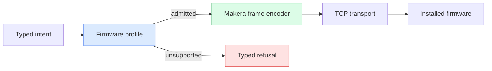
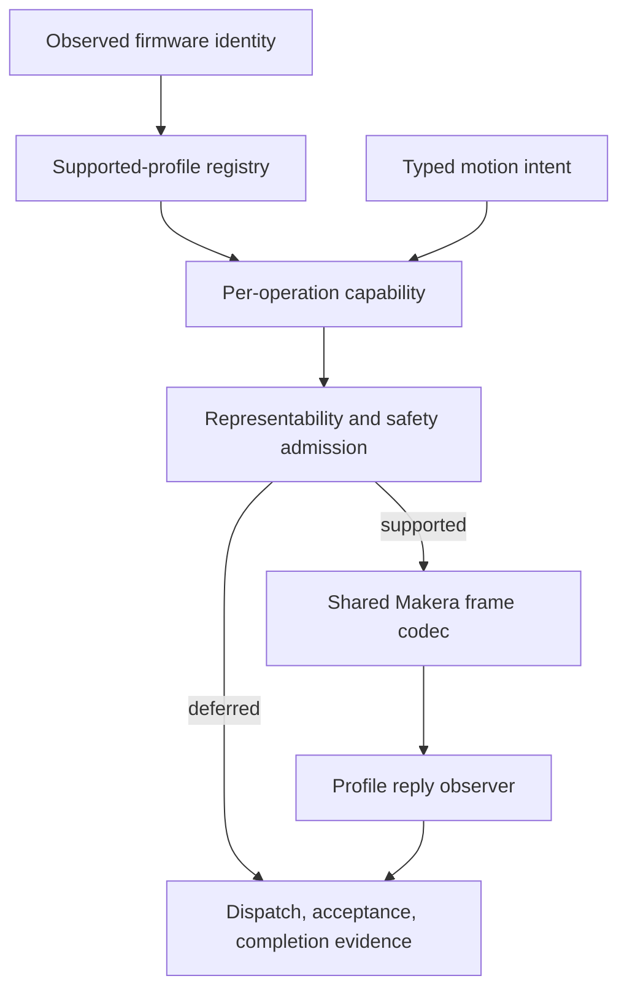

# Firmware Profiles: When Correct Framing Carries the Wrong Command

A CNC controller can encode every byte correctly and still issue an operation the installed firmware does not implement. This article examines that failure through a continuous-jog implementation for a stock Makera Z1. The host used valid Makera frames, but the payload and stop handshake came from Carvera Community firmware. A supervised test produced no observed continuous motion and no expected acknowledgement. The implementation was then reduced to stock-proven bounded jog, with continuous behavior explicitly deferred before any write.

> [!summary]
> - Transport framing identifies how bytes are carried, not what the firmware implements.
> - A firmware-specific operation includes command syntax, units, continuation, stop, replies, timing, and physical completion evidence.
> - Unsupported behavior should be represented by an executable refusal object, not by fallback rendering or a permissive fake.
> - Bounded stock Makera jog remains supported; continuous jog is deferred until a complete stock contract exists.

## Why this incident matters

Protocol implementations often begin from several imperfect sources: public firmware, an official or community controller, packet captures, observed machine reports, and tests built before hardware is available. Each source can be accurate within its scope. The failure occurs when evidence is transferred across scopes without an explicit applicability decision.

The Z1 host had a correct Makera frame codec. It had a typed motion API, fresh preflight, exclusive renewable authority, browser-held intent, and careful release ordering. Those mechanisms solved real ownership and concurrency problems. They did not prove that stock firmware understood the continuous command inside the frame.

The central engineering rule is therefore stronger than “validate protocol bytes”:

> Validate every operation as a firmware-profile contract. Framing, payload syntax, units, reply grammar, timing, and physical evidence must agree for the same installed profile.

## The installed system

The machine reports:

```text
version = 1.0.15.0.1.11
model ID = 3
FuncSetting = 1
protocol = makera
```

A raw read-only exchange encoded `version` as a Makera command frame:

```text
TX 86 68 00 0a a2 76 65 72 73 69 6f 6e cc a0 55 aa
RX 86 68 00 1b 90 76 65 72 73 69 6f 6e 20 3d 20
   31 2e 30 2e 31 35 2e 30 2e 31 2e 31 31 0a a4 fa 55 aa
```

The outbound type `0xA2` carries a textual command. The reply type `0x90` carries normal informational text. This establishes framing and observed identity. It does not establish a hash match between the installed binary and any public source revision.

## Makera framing

The runtime frame shape is:

```text
header | length | packet type | payload | CRC-16/CCITT | footer
8668   | 2 B    | 1 B         | N B     | 2 B          | 55AA
```

The host uses at least two relevant outbound packet types:

- `0xA2` carries a textual command such as `$J X-0.1 F0.01`.
- `0xA1` carries a single realtime byte such as `?` or `!`.

A frame codec can encode `$J -c`, `0x1A`, or `0x19` even when the installed firmware has no corresponding operation. The encoder’s domain is byte integrity. Firmware capability belongs to a higher layer.



The profile must make the operation decision before the encoder is invoked.

## Bounded stock Makera jog

Stock Makera firmware implements bounded relative jog. Its public handler documents:

```text
$J X0.01 [F0.5]
```

The axis word combines an axis and a finite displacement. Examples include:

```text
$J X0.1 F0.01
$J X-0.1 F0.01
$J Z0.01
```

The stock `F` word is a scale, not a conventional G-code feed rate. The implementation obtains the relevant axis maximum rate and executes a finite delta move at `rate_mm_s * scale`. Values should therefore remain in `[0,1]`; larger values saturate at the axis maximum in observed behavior.

The host retains this operation because its essential contract is supported by stock source and physical observation:

1. The payload names a finite relative displacement.
2. The speed is a dimensionless fraction of maximum.
3. One invocation produces one bounded command.
4. The command is subject to typed distance bounds and fresh preflight.
5. It is not retried automatically.

This is the ordinary X/Y/Z step-jog UI that remains available.

## Continuous jog is a different operation

A held control cannot be represented safely by an arbitrarily large bounded distance. It needs an operation whose continuation depends on fresh liveness evidence and whose termination semantics are known.

The removed implementation used:

```text
start: $J -c X1 F0.01
keep:  ? followed by 0x1A
stop:  0x19
ack:   ^Y
```

The exact framed start was:

```text
86 68 00 11 a2 24 4a 20 2d 63 20 58 31 20 46 30 2e 30 31 49 d7 55 aa
```

The payload is valid ASCII inside a valid Makera command frame. It is not a stock-supported command according to the retained public stock handler.

### Stock parser

The stock handler removes `$J` and then reads every token as either an `F` scale or an axis word. Its validation is structurally equivalent to:

```cpp
char axis = toupper(token[0]);
if (axis == 'F') {
    scale = parse(token.substr(1));
    continue;
}
if (!is_axis(axis)) {
    print("error:bad axis");
    return;
}
delta[index(axis)] = parse(token.substr(1));
```

For `-c`, `token[0]` is `-`. The token is not an axis and is rejected.

### Community parser

The community firmware inserts option parsing before axis parsing:

```cpp
if (token.size() == 2 && token[0] == '-') {
    if (toupper(token[1]) == 'C') {
        continuous_mode = true;
        continue;
    }
    print("error:illegal option");
    return;
}
```

That implementation then owns continuous block generation, continuation timing, stop-request state, soft-limit handling, and `^Y` output. The `-c` token is not a portable extension to stock `$J`; it selects a distinct firmware state machine.

## The continuation and stop protocol

In the removed design, the browser owned human intent and the server owned exclusive authority. Each accepted browser renewal produced one firmware renewal. There was no server timer that could continue motion after browser intent disappeared.

```mermaid
sequenceDiagram
    participant U as Operator gesture
    participant B as Browser controller
    participant S as Server lease
    participant F as Firmware

    U->>B: pointer/key down
    B->>S: start(gesture ID)
    S->>F: framed $J -c command
    S-->>B: opaque lease ID
    loop one request per held renewal
        B->>S: keep(lease ID)
        S->>F: framed ? and 0x1A
    end
    U->>B: release/liveness loss
    B->>S: stop(lease ID)
    S->>S: fence lease; suppress future keep
    S->>F: framed 0x19
    F-->>S: ^Y
```

The authority architecture was sound for a firmware that implements this contract. The installed stock profile did not establish that premise.

### Why `^Y` mattered

The stop path registered an acknowledgement channel before sending `0x19`, then waited for an inbound text message beginning with `^Y`. Registering first avoids a race in which a fast reply arrives before the waiter exists.

The implementation also accepted messages containing `Stop request timeout` and `Internal stop request reset`. Source review showed that this was incorrect. The community handler can emit those messages while entering continuous mode, clear old request state, and proceed. Neither phrase is general terminal evidence.

The broader completion model must therefore distinguish:

| Evidence | Meaning |
|---|---|
| Write returned | Bytes entered the local transport path. |
| Firmware refusal text | Firmware rejected the command. |
| `^Y` in a matching profile | Profile-specific stop acknowledgement. |
| Fresh repeated Idle/feed-zero status | Controller reports a terminal state over time. |
| Operator observation | Physical behavior was observed under the test conditions. |

No single row implies every other row.

## What happened during supervised acceptance

The candidate used commit `c6ab0df` and SHA-256 `d58172c2c27a5d08cbce198afda826ff38c50355722fc3957ce750819810d753`. Before the test, the machine was Idle, the enclosure was closed, the spindle reported zero RPM, no cutter was installed, and the physical E-stop was available.

The browser initiated a held control. The server logged that it wrote a continuous X-positive command. The operator observed no physical motion. On release, the server suppressed continuation and sent `0x19`. No `^Y` arrived within two seconds. The server faulted the authority, and the browser latched uncertainty.

Two ordinary bounded X-negative jogs did work. Across the broader interaction window, machine X changed by negative 0.2 mm, which corresponds to those bounded requests rather than proving continuous movement.

Five later status samples remained Idle with feed zero. This evidence supports safe cessation of the observed interaction. It does not establish that the continuous command was accepted, that stock recognizes `0x19`, or that omission of `0x1A` is a stock dead-man mechanism.

The correct result was a failed capability test, not a successful stop test.

## The uncertainty UI exposed a second ownership defect

The control panel combined one-shot command uncertainty and held-controller uncertainty into one `unknown` boolean. A generic “clear local uncertainty” button invoked the one-shot controller even when the held controller owned the error. The held authority on the server had also faulted after cleanup uncertainty, so clearing browser state alone could not reconcile it.

The repair separates state owners and removes the connected held transport entirely:

- one-shot errors render the one-shot acknowledgement;
- held errors render their own error and reconciliation wording;
- the connected stock application does not mount a held-jog adapter;
- held buttons are omitted in the stock UI;
- the server start route returns HTTP 501 before body decoding or connection work.

Acknowledgement is a local state transition. It is not transport recovery, firmware recovery, or proof of physical state.

## The removal

The final change intentionally removed executable compatibility rather than hiding it behind configuration.

### Domain and profile API

The host now has an explicit support boundary:

```go
type FirmwareSupport interface {
    Name() string
    AdmitMotion() error
}

type StockMakeraFirmware struct{}
type DeferredCommunityFirmware struct{}
```

The stock profile admits implemented stock motion. The deferred profile returns a typed `ErrFirmwareSupportDeferred`. A community identity cannot select alternate rendering or silently reuse stock commands.

`Client.Motion` resolves firmware support before motion preflight and before any motion write. A version identity query may occur; the requested motion cannot.

### Jog API

These compatibility mechanisms were deleted:

- the stock/community jog dialect enum;
- version-selected `F` versus `S` rendering;
- absolute-feed `JogFeed` and `FeedMMMin`;
- continuous `$J -c` rendering;
- realtime continuation emission;
- `0x19` stop dispatch and `^Y` observer;
- fake stock dead-man and fake `^Y` behavior.

Continuous API names remain as explicit deferred boundaries. `ContinuousJog`, `JogStart`, `JogStartManual`, `JogSession.Keepalive`, and `JogSession.Stop` all refuse without writing. This leaves one visible extension point without retaining hidden executable behavior.

### Wire-facing APIs

`AssertRealtimeAllowed` now permits only the stock-proven status byte `?` and feed hold `!` on that path. It rejects `0x19` and `0x1A`.

The protobuf jog request removed `feed_mm_min` and reserved field 4. Reserving prevents a future schema from accidentally assigning unrelated semantics to the old wire number.

`POST /api/jog/start` returns:

```text
501 Not Implemented
continuous jog support is deferred for stock Makera firmware; no command was sent
```

The handler returns before decoding, locking, dialing, preflight, or authority acquisition.

### Browser API

The concrete HTTP lease adapter was removed. Generic browser intent components remain useful as transport-independent code, but the connected stock application supplies no lease port. The UI states that continuous jog is deferred and directs the operator to bounded step jog.

## Why repeated step jog is not a held-jog substitute

A tempting implementation sends small bounded jogs repeatedly while the pointer is down. That design does not have omission-to-stop semantics. Requests can be accepted into browser, HTTP, server, socket, and firmware queues before release. Releasing the pointer prevents future requests but does not retract already accepted displacements.

The resulting stop distance is a function of queued commands rather than one firmware continuation deadline:

```text
residual travel = accepted-but-unexecuted steps + current-step remainder
```

Network delay can increase that quantity while making the UI appear responsive. The project therefore refuses continuous intent rather than implementing it as repeated step motion.

## A generic future firmware architecture

Future multi-firmware support should not restore a global `community bool` or distribute `if community` branches throughout command constructors. Firmware differences are operation-specific. One family may share file transfer framing while differing in jog units; another may share bounded `$J` while differing in stop evidence.

Use typed capabilities:

```go
type FirmwareProfile interface {
    Identity() FirmwareIdentity
    StepJog() StepJogCapability
    ContinuousJog() ContinuousJogCapability
    Spindle() SpindleCapability
    Programs() ProgramCapability
    Transfers() TransferCapability
}
```

Each mutating capability should own six things:

1. **Intent validation** defines the domain values the firmware can represent.
2. **Encoding** maps intent to command and realtime frames.
3. **Acceptance observation** distinguishes accepted, refused, malformed, and unknown outcomes.
4. **Continuation** defines renewal causality and timing when applicable.
5. **Termination** defines stop dispatch and valid acknowledgement grammar.
6. **Completion evidence** defines the telemetry and physical observations required beyond acknowledgement.

Unsupported behavior should be an object, not `nil` and not fallback:

```go
type DeferredContinuousJog struct {
    Firmware string
    Reason   string
}

func (d DeferredContinuousJog) Validate(intent ContinuousJogIntent) error {
    return fmt.Errorf("%w: %s: %s",
        ErrFirmwareSupportDeferred, d.Firmware, d.Reason)
}
```

The shared Makera codec should remain below these capabilities. Profiles produce typed encoded operations; the codec validates framing and CRC without knowing whether `$J` means bounded or continuous motion.



### Profile selection must fail closed

Version strings can select only explicitly supported ranges. Unknown or ambiguous identity resolves to deferred. A profile should carry an evidence manifest:

```yaml
profile: makera-z1-stock-1.0.15
identity:
  model_id: 3
  version_range: "1.0.15.0.1.x"
capabilities:
  step_jog:
    status: supported
    sources: [stock-source, physical-observation]
  continuous_jog:
    status: deferred
    reason: "no matching command/stop/watchdog contract"
```

This manifest is not a runtime feature flag. It is a reviewed statement of representable operations.

### Tests must identify their firmware profile

A fake with a stock version cannot implement community behavior. Tests should be divided into:

- codec fixtures that validate raw framing;
- profile conformance fixtures from source or captures;
- domain tests for bounded values and refusal;
- authority tests independent of firmware bytes;
- hardware acceptance records that remain model/version-specific.

A passing fake proves only the contract encoded by the fake. Profile labeling makes that contract reviewable.

## Evidence required before continuous jog returns

A future implementation must obtain all of the following for one exact profile:

- installed identity applicability;
- start syntax and direction encoding;
- speed units and bounds;
- command acceptance/refusal grammar;
- continuation bytes and timing;
- explicit stop bytes;
- acknowledgement grammar;
- terminal telemetry criteria;
- browser-loss, server-loss, and network-loss behavior;
- measured detection, deceleration, and residual travel.

The best source would be matching stock source or a capture of the official Makera controller exercising held jog on the same firmware family. Raw probing should begin read-only and proceed to one explicitly reviewed mutation at a time, with exact frames archived. Hardware acceptance remains separate from source confidence.

## Current result

The codebase now has one implemented motion profile: stock Makera. Bounded step jog uses finite displacement and stock `F<scale>`. Continuous jog cannot write. Community firmware motion is represented by an explicit deferred profile. Makera framing remains the sole runtime transport.

The implementation passed 34 frontend tests, TypeScript checking, full Go race tests, Go vet, binary build, Buf lint, embedded frontend generation, and five offline lifecycle tests. The server remained stopped throughout removal and validation.

The durable lesson is specific: **a correct frame carrying an unsupported command is still an incorrect control operation. Firmware profiles must own command meaning and evidence, while the transport owns bytes.**

## Related notes

- [[PROJ - Makera Z1 Control - Three Refactors for Authority Evidence and Browser Intent]]
- [[05 - Exclusive Renewable Authority - A Linearizable Lease for Hazardous Continuation]]
- [[07 - Browser Intent Ownership - Confirm Once and Renew Only While Held]]
