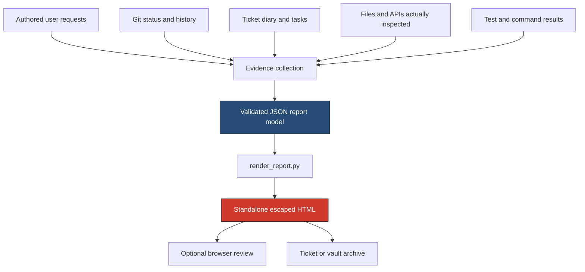
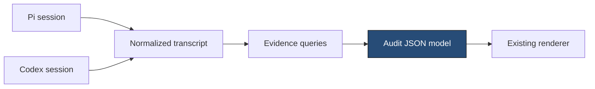

# Session Context Audits: Evidence Models, Classified Timelines, and Reusable HTML Reports

A coding-agent session accumulates several different kinds of knowledge. The agent reads source code, receives user instructions, observes command output, edits files, encounters failures, and records decisions. A useful session report must distinguish these categories instead of presenting one undifferentiated summary. The `session-context-audit` skill defines that distinction as a repeatable workflow and renders the result as a standalone HTML artifact.

The skill was developed during implementation of ticket `DEVCTL-ROBUST-LIFECYCLE` in `/home/manuel/workspaces/2026-09-13/devctl-improve/devctl`. Its installed source is `/home/manuel/.codex/skills/session-context-audit`, committed at revision `4e6e3d5`. A project copy also exists under `skills/session-context-audit/` in the devctl repository. The report that triggered the extraction is stored beside the ticket diary at:

`ttmp/2026/09/13/DEVCTL-ROBUST-LIFECYCLE--explicit-lifecycle-plans-safe-plugin-execution-and-artifact-provenance/reference/02-context-window-and-session-timeline.html`

> [!summary]
> - A session audit is an evidence projection, not a transcript rewrite and not a disclosure of hidden reasoning.
> - The skill separates evidence collection from rendering through a validated JSON model.
> - Authored turns, work classifications, files, APIs, failures, and uncertainty each have distinct representation rules.
> - A deterministic renderer converts the model into escaped, standalone, ticket-archivable HTML.

## 1. The problem the skill solves

When a user asks, “What do you currently know?”, a short answer can list facts but cannot show how those facts entered the session. It cannot reliably distinguish a file whose contents were read from a filename returned by search. It often merges authored prompts with injected runtime metadata. It can also collapse expected test failures, accidental rework, and substantive engineering defects into one vague “issues” section.

These distinctions affect review quality. A maintainer deciding whether an agent can safely continue a refactor needs to know whether the agent read the relevant interfaces, whether it only saw symbol names in search output, whether the working tree contains uncommitted edits, and whether current conclusions are supported by tests. A generic conversation summary does not provide that structure.

The session-context audit defines a report with four related goals:

1. **Inventory current context.** State what instructions, design constraints, files, APIs, and unresolved questions are represented in the current work.
2. **Preserve provenance.** Explain whether a claim comes from an authored prompt, source inspection, Git evidence, command output, or an existing diary.
3. **Classify the work.** Separate analysis, engineering, support activity, and avoidable churn.
4. **Create a durable artifact.** Produce static HTML that remains readable after the live session and temporary browser server are gone.

The report does not attempt to reconstruct private chain-of-thought. It records observable work: files read, commands run, decisions stated, edits made, tests executed, failures observed, and recoveries applied.

## 2. Foundational terms

The skill depends on a small vocabulary. Each term identifies a different unit of evidence.

An **authored turn** is one user-authored request and the assistant work that responds to it. Tool calls, hidden bookkeeping notices, injected model metadata, and background continuation ticks are not authored turns.

A **source probe** is a filename or symbol observed through search, directory listing, or compiler output. A source probe establishes relevance but does not prove that the file contents were read.

A **read artifact** is a file whose contents were actually inspected. The report may list the file or concrete symbols read from it.

A **change artifact** is a path classified by Git evidence as edited, added, or removed. Uncommitted changes must be labeled as such.

An **API inventory item** names a concrete symbol or package and states its responsibility. Examples include `operator.Controller.Restart`, `runtime.Factory.Start`, and `cli.BuildCobraCommandFromCommand`.

A **timeline classification** assigns one of four meanings to a bounded interval or ordered step:

| Classification | Meaning |
|---|---|
| `analysis` | Contract reading, control-flow tracing, comparison, design, or a decision. |
| `engineering` | Implementation, refactoring, intended validation, or repair of a product defect. |
| `menial/support` | Formatting, staging, ticket updates, printing, archival, and routine cleanup. |
| `issue/churn` | Avoidable rework, incorrect assumptions, accidental artifacts, tool friction, or repeated ineffective attempts. |

The word **churn** is intentionally narrow. A negative test that exposes a genuine race is engineering evidence. Writing a malformed fixture and immediately replacing it is churn. The distinction prevents the report from treating every failure as wasted work while still making preventable friction visible.

## 3. Architecture of the skill

The skill is a standard Agent Skills package:

```text
session-context-audit/
├── SKILL.md
├── assets/
│   └── example-report.html
├── references/
│   └── report-contract.md
└── scripts/
    ├── fixtures/
    │   └── minimal.json
    ├── render_report.py
    └── test_render_report.py
```

Each file has one responsibility.

- `SKILL.md` defines when the skill should load, what evidence to gather, the required section order, archival behavior, and safety constraints.
- `references/report-contract.md` specifies the intermediate JSON model and classification semantics.
- `scripts/render_report.py` validates that model and renders HTML.
- `scripts/fixtures/minimal.json` provides a complete small input.
- `scripts/test_render_report.py` verifies required sections, escaping, churn advice, and standalone output.
- `assets/example-report.html` preserves the report that motivated the extraction as a visual reference. It is not a source of facts for future reports.

The processing path is explicit:



The intermediate model is the key architectural boundary. Evidence collection is contextual and requires judgment. Rendering should not. The renderer receives already-classified data, validates the structure, escapes all supplied values, and applies a deterministic layout.

## 4. The report model

The model is one JSON object with required top-level fields:

```json
{
  "title": "Example Session",
  "kicker": "CONTEXT AUDIT / 2026-09-13",
  "subtitle": "repository · branch",
  "turns": [],
  "timeline": [],
  "knowledge": [],
  "file_groups": [],
  "change_groups": [],
  "api_groups": [],
  "state": []
}
```

The fields are intentionally presentation-oriented but not HTML-oriented. They contain strings, lists, and named items. No field accepts trusted markup.

### 4.1 Turns

Each turn contains a user-facing number, title, and bullet list:

```json
{
  "number": "3",
  "title": "Clarify process-group terminology",
  "bullets": [
    "Explained main-process exit separately from descendant cleanup."
  ]
}
```

Turn numbers belong to authored prompts. If session metadata reports a total prompt number, the report can mention it as metadata, but it must not create artificial turns for hidden bookkeeping messages.

### 4.2 Timeline entries

A timeline entry adds classification and optional prevention advice:

```json
{
  "period": "after Phase 1",
  "category": "issue/churn",
  "title": "Workspace dependency mismatch",
  "bullets": [
    "Tests resolved Glazed from an incompatible workspace checkout."
  ],
  "advice": [
    "Record go env GOWORK and compare workspace and module baselines before attributing dependency failures."
  ]
}
```

The renderer rejects an `issue/churn` entry with no advice. This is a semantic validation, not merely a shape check. A churn section that states only that something went wrong does not improve the next session.

### 4.3 Files and APIs

File and API groups share a compact item form:

```json
{
  "title": "Runtime APIs read",
  "items": [
    {
      "name": "runtime.Factory.Start",
      "purpose": "Creates a plugin process, validates its handshake, and establishes cleanup ownership."
    }
  ]
}
```

The `purpose` field forces the report to explain why a name matters. A long list of paths without responsibilities does not show useful understanding.

The standard API groups are:

- **Read**: inspected to recover a contract.
- **Edited**: existing behavior changed during the session.
- **Added**: new session-owned symbols or packages.
- **Removed/replaced**: deleted behavior, deleted APIs, or an honestly labeled migration in progress.

## 5. Evidence collection

The renderer cannot determine whether a report claim is true. The skill therefore places evidence discipline before rendering.

A reliable collection sequence is:

```text
1. Read current authored request.
2. Inspect repository and branch state.
3. Read the latest relevant diary checkpoint and active tasks.
4. Collect committed and uncommitted changed paths from Git.
5. List files actually read during the session.
6. Extract concrete symbols from those reads and changes.
7. Collect validation commands and exact meaningful failures.
8. Mark unresolved questions and incomplete phases.
9. Build the JSON model.
10. Render and inspect the report.
```

Git answers change questions. The diary answers why and when questions. Source reads answer contract questions. Tests answer bounded behavior questions. None of these sources substitutes for the others.

Consider the difference between these claims:

```text
Observed by search:
  pkg/operator/controller.go contains Controller.Restart

Established by reading:
  Controller.Restart prepares the plan before acquiring the lifecycle lock

Established by test:
  a planning failure leaves the current service running
```

A strong report preserves those evidence levels. It does not turn the first statement into the third.

## 6. Rendering safely

`render_report.py` uses only the Python standard library. The core safety rule is that every value supplied by the model passes through `html.escape(..., quote=True)`.

The renderer does not accept raw body HTML. Section structure and CSS are fixed in code. This prevents a filename, error message, prompt fragment, or API description from injecting markup into the archived report.

The rendering sequence is approximately:

```python
def render(model):
    validate(model)

    turn_html = render_turns(model["turns"])
    timeline_html = render_timeline(model["timeline"])
    file_html = render_groups(model["file_groups"])
    change_html = render_groups(model["change_groups"])
    api_html = render_groups(model["api_groups"])

    return standalone_document(
        title=escape(model["title"]),
        embedded_css=STYLE,
        sections=[turn_html, timeline_html, file_html, change_html, api_html],
    )
```

The generated document contains embedded CSS, no JavaScript, and no remote assets. It remains usable through a local browser, a Git web view, or a ticket archive without a build pipeline.

The visual hierarchy encodes report structure:

- large black section headers identify major evidence classes;
- blue period blocks identify turn or timeline order;
- bordered category badges distinguish analysis, engineering, support, and churn;
- red prevention blocks make churn advice visible;
- responsive grids hold file and API groups.

The style is not part of the evidence model. It can change without changing report facts.

## 7. Validation strategy

The bundled tests cover four contracts.

### Required sections

A rendered report must contain:

- conversation turns;
- session timeline;
- current classified knowledge;
- files inspected or analyzed;
- files edited or created;
- API and package inventory;
- repository and report state.

### HTML escaping

The test injects a script-shaped title and verifies that the output contains escaped text rather than a `<script>` element.

```python
model["title"] = "<script>alert('x')</script>"
output = render(model)
assert "<script>alert" not in output
assert "&lt;script&gt;" in output
```

### Churn advice

The test removes advice from an issue entry and expects validation to fail. This preserves the report's process-improvement purpose.

### Standalone output

The test checks for a doctype and embedded style block and rejects remote `https://` dependencies in the minimal report.

Run the suite from any directory:

```sh
PYTHONDONTWRITEBYTECODE=1 \
python3 -m unittest -v \
  /home/manuel/.codex/skills/session-context-audit/scripts/test_render_report.py
```

Render the fixture:

```sh
python3 /home/manuel/.codex/skills/session-context-audit/scripts/render_report.py \
  --input /home/manuel/.codex/skills/session-context-audit/scripts/fixtures/minimal.json \
  --output /tmp/session-context-audit.html
```

`PYTHONDONTWRITEBYTECODE=1` is useful in repository workflows because it prevents `__pycache__` artifacts from appearing during validation.

## 8. Archiving with a ticket diary

The report is most useful when stored near the investigation diary whose evidence it summarizes. The skill uses a numeric filename so ordering remains visible:

```text
reference/
├── 01-investigation-diary.md
└── 02-context-window-and-session-timeline.html
```

The relation is recorded explicitly:

```sh
docmgr doc relate \
  --doc ttmp/.../reference/01-investigation-diary.md \
  --file-note "/absolute/path/reference/02-context-window-and-session-timeline.html:Browser-readable session context and timeline audit"
```

The ticket copy is authoritative. A copy under `/tmp` may be served for browser review, but it should not become the only surviving artifact. Browser snapshots, temporary HTTP logs, and `.playwright-mcp/` output are excluded unless a user explicitly requests them as evidence.

## 9. Failure modes and prevention

### Treating metadata as conversation

Injected session counters and hidden bookkeeping messages can look like user turns. Including them distorts the interaction history.

**Prevention:** derive turns from authored prompts. Present runtime counters in scope metadata only.

### Claiming a file was read because search mentioned it

Search results often show filenames and matching lines. They do not establish the complete contract around a symbol.

**Prevention:** classify search results as probes. Add a file to the read inventory only after a content read relevant to the claim.

### Deriving changes from memory

Session memory can omit a path, especially after several commits and amendments.

**Prevention:** use `git status`, `git diff --name-status`, and bounded commit history as the source for edited, added, and removed paths.

### Inventing exact timestamps

A narrative often has a reliable order but no exact clock evidence.

**Prevention:** use commit, command, diary, or runtime timestamps when available. Otherwise use relative periods such as “after the runtime checkpoint.”

### Calling every failure churn

A failing race test that exposes a real concurrency defect is valuable engineering. Labeling it churn discourages useful validation.

**Prevention:** classify the discovery and repair as engineering. Reserve churn for preventable fixture mistakes, wrong environment assumptions, accidental generated files, and repeated ineffective actions.

### Writing prevention advice that changes nothing

“Be careful next time” does not create a different process.

**Prevention:** recommend a concrete guard, command, test order, ignore rule, instruction, or validation boundary.

### Copying the motivating report as current evidence

The example report contains ticket-specific facts and visual choices. Reusing its content would create false claims.

**Prevention:** use `assets/example-report.html` only as a visual reference. Generate current facts through the JSON model.

## 10. Design decisions

### Why JSON is the intermediate representation

JSON provides a strict boundary between contextual evidence gathering and deterministic output. It is directly inspectable, easy to validate with standard Python, and does not permit implicit executable behavior. The renderer can reject malformed classifications before writing HTML.

Markdown could serve as an intermediate source, but parsing custom semantic sections back out of Markdown would require additional conventions. Direct HTML would combine evidence and presentation and make escaping discipline harder to audit.

### Why the renderer contains no JavaScript

The report needs navigation by scrolling, not application state. Static HTML reduces the execution surface, remains readable from disk or a simple HTTP server, and archives cleanly in Git.

### Why the skill does not parse transcripts automatically

The current skill describes the active-session workflow. Transcript reconstruction requires source-specific discovery, normalization, and attribution rules already owned by `go-minitrace` skills. Combining both responsibilities would make a simple context audit depend on a historical transcript pipeline.

A future integration can populate the same JSON model from normalized transcript evidence. The report contract permits that extension without changing the renderer.

### Why the report preserves uncertainty

A context inventory cannot prove that every detail from earlier turns remains available to the active model. It can state which materials were loaded, summarized, or recorded in the diary. It must not claim perfect retention.

The report's state section therefore includes unresolved decisions and incomplete phases. This is part of the technical model, not a disclaimer added after the fact.

## 11. Extending the skill

Three extensions are technically plausible.

### Add a schema version

External automation may begin generating report models. At that point, add an explicit `schema_version` and reject unsupported versions. The current package is internally versioned by its Git revision but the JSON document has no version field.

### Add transcript-backed evidence import

A separate adapter could query normalized session archives and emit authored turns, tool activity, command failures, and file operations into the model. That adapter should preserve evidence levels and avoid marking a search result as a full read.



### Add machine-readable report validation

The hand-written validation functions can be complemented by a published JSON Schema. Runtime validation should remain because semantic rules such as “churn requires advice” are clearer as explicit code and tests.

## 12. Recommended operating procedure

A complete report workflow is:

```text
Collect authored prompts and session scope.
Read current Git and ticket state.
Separate source probes from full reads.
Derive changed paths from Git.
Name concrete APIs and their responsibilities.
Classify timeline segments.
Attach prevention advice to avoidable churn.
Record uncertainty and remaining work.
Validate the JSON model.
Render escaped standalone HTML.
Inspect visually when requested.
Archive beside the diary.
Relate and commit only intended artifacts.
```

The most important working rules are:

- Report observable evidence rather than private reasoning.
- Keep turn identity tied to authored requests.
- Keep analysis, implementation, support activity, and churn distinct.
- State what each file or API contributes; names alone are insufficient.
- Use Git for change provenance and tests for bounded behavior claims.
- Turn churn into a concrete prevention change.
- Keep the ticket copy authoritative and temporary browser output disposable.

## 13. Current status

The skill is implemented, installed, tested, and committed in the shared skill repository at revision `4e6e3d5`. Its project copy was originally committed in devctl at `b9d859f`; the ticket's HTML report and API inventory were committed in adjacent documentation checkpoints.

The skill currently generates a safe static report from a manually assembled evidence model. It does not yet ingest native transcripts or publish a JSON Schema. Those are explicit future capabilities rather than implied behavior.

## Related notes

- [[ARTICLE - Pi Session Context - Prompt Metadata Injection Deep Dive]] — how runtime session metadata enters Pi prompts.
- [[PROJ - Transcript Doc-Friction Analysis - Mining Agent Sessions to Optimize go-go-golems Documentation]] — transcript-backed analysis of documentation consumption and friction.
- [[ARTICLE - Deep Dive - Recovering Deleted Source Code From Coding Agent Transcripts]] — reconstruction from concrete transcript tool evidence.
- [[PROJ - Pi Extensions - Session Metadata and Commit Provenance]] — session identity and commit attribution.
