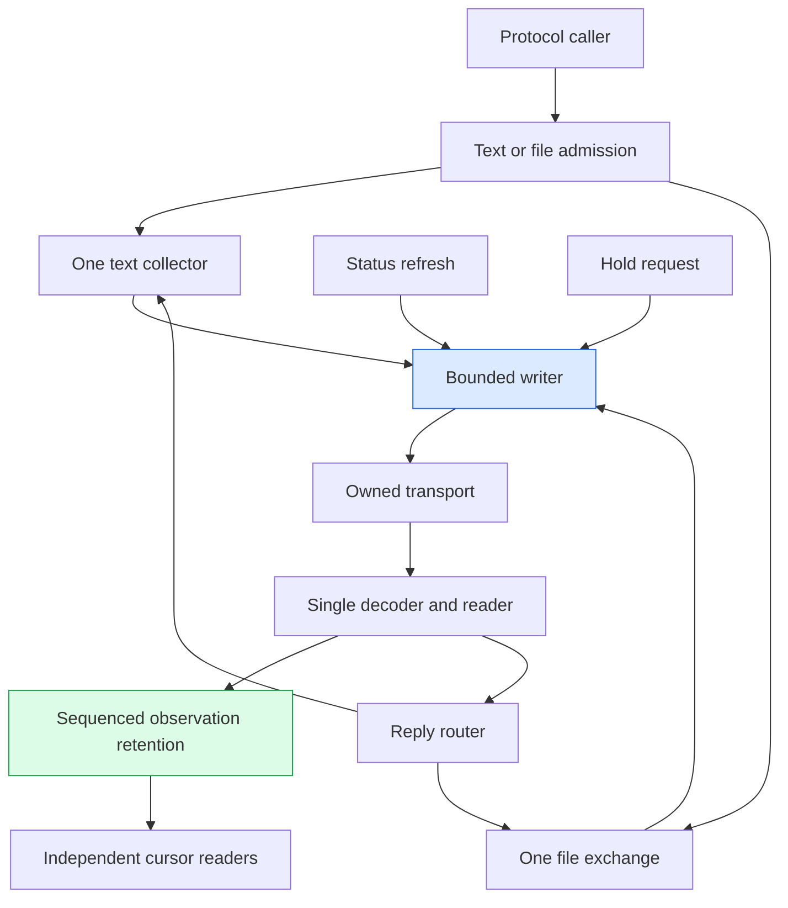
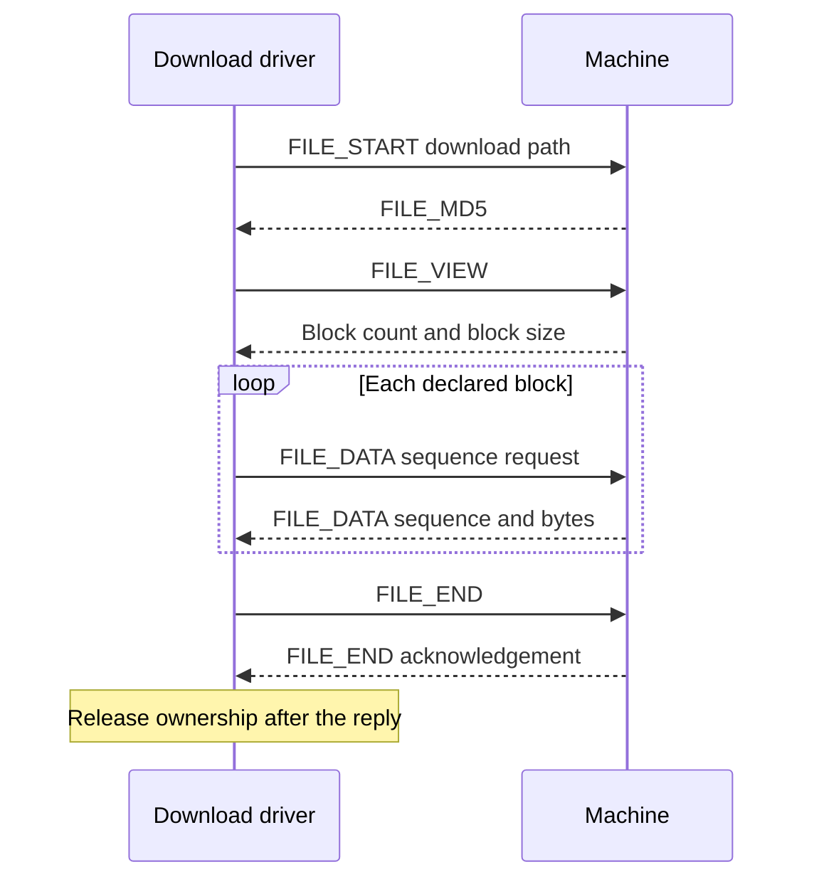

# Makera Z1 Control — P1 and P2 Protocol Ownership and Hardware Evidence

A machine connection carries several kinds of information at once. A command may be waiting for its final reply while a status report arrives. A file transfer may be waiting for a block request while an operator asks to hold motion. Correct handling requires more than serializing access to a socket: the program must decide who receives each response, which writes can proceed independently, and what remains unknown after a timeout.

This report explains the first two implementation phases of MZ1-016, the architecture refactor of the Go Makera Z1 controller inside DropCut Studio. P1 separated framing, transport and stock-firmware interpretation into distinct packages. P2 implemented an independent reader, a bounded writer, sequenced observations and explicit text/file exchange ownership. The discussion follows the actual implementation through command collection, cancellation, file transfer and two hardware experiments.

The distinction between implementation and deployment is essential. The new protocol core exists and has been exercised directly. The existing HTTP and native execution adapters have not yet been replaced. This report is therefore about an implemented protocol foundation, not a completed migration of the whole machine controller.

> [!summary]
> - P1 established package boundaries; P2 changed who owns I/O, replies and bounded retained state.
> - A pending command or file exchange no longer requires its protocol reader or urgent writer to wait for completion.
> - Deterministic byte-peer tests establish software ordering. Installed-machine tests separately confirmed version/echo/status behavior and a two-block upload/download with exact readback.
> - Protocol completion is not physical completion. Controller admission, persistent operation state, adapter cutover and physical hold qualification remain later work.

## 1. Begin with one command and three different outcomes

Consider a caller asking the machine for its firmware version. The host constructs a framed text command, writes it to the connection, receives a version line, and waits for an echo record that marks the end of that command's collected output.

A **frame** is the protocol's encoded packet: a type and payload enclosed by framing fields and an integrity check. A **transaction** is a host-managed exchange that groups outgoing command frames with the incoming records used to finish collection. The transaction is not a database transaction and does not promise rollback. An **observation** is a received frame made available to consumers with a host timestamp and ordering metadata, independently of any transaction.

These definitions explain why a single Boolean success result is inadequate. A successful socket write establishes that the host transport accepted bytes. A matching echo establishes that a text collection boundary was received. Neither statement establishes that a machine operation reached a physical target. The distinction is easy to overlook for a version query because the query has no motion effect; it becomes central when the same infrastructure supports machine operations.

The implemented version exchange has this logical shape:

```text
host writes:  CTRL_MULTI("version")
host writes:  CTRL_MULTI("echo \x04")
machine sends: NORMAL_INFO("version = 1.0.15.0.1.11\n")
machine sends: NORMAL_INFO("echo: \x04\r\n")
```

Here `\x04` denotes the EOT byte. The notation describes decoded packets, not literal strings sent with backslashes. Other frames may arrive between these records. The protocol must publish those observations without assigning them incorrectly to the command or waiting for the echo.

This small example defines the central design requirement: **serialize exchanges that cannot be correlated independently, but do not serialize unrelated observation and urgent dispatch behind their completion.**

## 2. Why this refactor preceded embedded TypeScript

DropCut Studio combines a CAM frontend with a nested Go module, `makera-z1-cli`, that communicates with a stock Makera Z1. The machine accepts one native control connection. The installed firmware observed during this work is `1.0.15.0.1.11`; this is not an implementation against Carvera Community firmware.

The next planned extension was an embedded TypeScript procedure interface using Goja. That would add another way to request machine operations, alongside HTTP and native CLI entrypoints. It would not remove the need for a single machine owner. If each adapter retained its own execution and cancellation semantics, the scripting interface would increase the number of inconsistent paths.

The old implementation already contained important safety and protocol work, but ownership was distributed across layers. `Client.cmdMu` covered command collection and file transfers. A transfer mode redirected incoming frames into a shared transfer channel. At the HTTP layer, `Server.withClient` held `s.mu` around the callback using the machine client. A separate `motionBusy` flag handled another part of admission.

This creates a particular failure mode. A low-level hold method may bypass the command mutex, yet an HTTP request invoking it can still wait behind the server's outer mutex. Improving one method does not establish end-to-end independence if a higher layer serializes the entire operation.

The transfer reader had a related problem. Routing a frame into a channel is not inherently nonblocking. If the transfer consumer stops reading and the channel fills, the socket reader can stop processing subsequent status frames. The apparent separation between command and status packet types then provides no scheduling independence.

The refactor therefore moved responsibility before adding another adapter. P1 made the lower-level dependencies explicit. P2 supplied connection mechanisms that do not need broad callback locks. P3 is intended to add machine-operation ownership above those mechanisms; P4 will replace the old adapter paths rather than preserve them as compatibility alternatives.

## 3. P1: package boundaries that preserve meaning

The first phase extracted three lower-level packages:

| Package | Responsibility | What it deliberately does not establish |
|---|---|---|
| `pkg/makera/wire` | Encode frames, decode incremental input, enforce frame bounds, expose decoder statistics | Whether a command is supported by stock firmware |
| `pkg/makera/transport` | Open and close TCP connections, perform byte I/O, apply independent deadlines | How replies belong to operations |
| `pkg/makera/stock` | Interpret reports and stock-specific values; validate and escape arguments | Whether a current caller has authority to act |

The extraction was a hard cutover for those package APIs. Parent-package compatibility aliases were not retained merely to avoid changing imports. This matters because a nominal package extraction can leave the old package as the effective dependency owner if every caller continues importing through aliases.

### 3.1 Incremental framing and narrowly shared statistics

TCP delivers bytes, not application message boundaries. A read can contain the beginning of one frame, several complete frames, or the remainder of a frame begun in an earlier read. The decoder therefore retains partial parsing state across `Feed` calls.

That state still has one owner. P1 did not make `Feed` or `Reset` generally concurrent. Instead, it made the diagnostic drop counter safe to read concurrently through `Decoder.Drops()`. The counter is private and atomic; mutable parser state remains single-owner. Reset preserves the cumulative statistics.

This is a useful distinction in concurrency design. A monitoring consumer may need to inspect one statistic without needing concurrent access to the parser itself. Protecting or copying the whole decoder would solve a broader problem than the actual requirement and could obscure the intended ownership contract.

The wire layer also retains bounded frame parsing. The maximum declared data length is 8200, sufficient for the file-transfer packet shape with an 8192-byte data block. Framing correctness is necessary for all subsequent interpretation, but it does not validate command applicability. A correctly encoded unsupported command remains unsupported.

### 3.2 Read polling is not write boundedness

The transport API separates connect, read and write timeouts. A short read timeout lets a reader periodically check lifecycle state; it should not accidentally dictate how long a network write may take.

The extracted TCP transport therefore uses an independent finite write deadline, with a two-second default when no write timeout is supplied. A zero read timeout means blocking reads until input or closure. Negative timeout values are rejected before dialing, and a failure to set a deadline is returned before performing the corresponding I/O.

For the later urgent writer, this separation is structural. An urgent request cannot interrupt bytes already being written. Its ability to make progress depends on the selected write eventually returning. Finite transport deadlines bound that obstruction without pretending to provide physical stop guarantees.

### 3.3 An absent value is not a measured zero

Report interpretation moved into `stock`, including explicit observed-value types. A plain Boolean or number cannot distinguish a valid false/zero measurement from a missing or malformed field. That distinction is important when an admission decision depends on actual evidence.

The implementation uses structures with the following shape:

```go
type Observed[T any] struct {
    Value   T
    Present bool
    Valid   bool
    Error   string
}
```

For a binary sensor, a valid observation requires a present, finite integer equal to zero or one. A display field may still show false when nothing useful was parsed, but code making an evidence-based decision must inspect validity rather than reading the display value alone.

The same principle appears in the later hardware harness. It requires valid observed state, current feed and current spindle speed. It does not infer Idle or zero RPM from Go's default values after a missing report field.

### 3.4 What P1 did not fix

P1 made the code easier to reason about and test, but it did not remove the old client or server locks. Package extraction and runtime ownership are different changes. Claiming concurrency improvement solely from the directory structure would have overstated the phase's result.

## 4. P2: the connection becomes the protocol owner

P2 introduced `pkg/makera/protocol.Connection`. It takes ownership of an already constructed transport and creates a reader, writer and observation generation. The connection itself does not dial or reconnect automatically.

An **owner** here is the component responsible for a mutable resource and its lifecycle. File-exchange ownership is ownership of response routing, not operator authority to change a machine file. A **generation** identifies one connection incarnation, and a **sequence** orders the observations recorded within it. The future controller is responsible for supplying appropriate generation identities when it creates connections.



This diagram describes the new protocol package, not the current HTTP deployment. The old adapters still use the previous client until the later cutover.

The connection admits at most one text collector or file exchange at a time. It rejects a conflicting request immediately with `ErrTransactionBusy`, rather than blocking that request behind another operation. Hold and status refresh submit writes independently of the active collector.

There are still mutexes. The connection mutex protects short changes to admission, active exchange pointers and failure state. The writer mutex protects queues and lifecycle state. The observation mutex protects retained entries and cursor reads. The change is not the elimination of locks; it is the elimination of socket I/O and reply waiting inside those critical sections.

## 5. The writer: priority at an explicit boundary

The writer owns all output I/O through one worker. It has separate normal and urgent queues. In a connection, each queue has capacity 16, so normal admission cannot consume urgent capacity. A submitted batch is copied and limited to 32 KiB.

A batch is the unit of scheduling. The command and its echo sentinel form one batch, preserving their ordering without allowing another queued write between them. File-transfer responses use individual framed writes. At each selection boundary, the worker checks the urgent queue before selecting normal work.

The following pseudocode summarizes the implementation rather than reproducing it line for line:

```text
repeat:
    under the queue mutex:
        if stopped: exit
        choose urgent batch if available
        otherwise choose normal batch

    if no batch exists:
        wait for a queue/lifecycle notification
        continue

    if its request context is already cancelled:
        finish receipt without attempting I/O
        continue

    write every frame in the selected batch
    stop and fault the writer on an error or short write
    publish the actual transport receipt
```

The priority promise is narrower than “hold is immediate.” An urgent item cannot preempt the selected batch or a system call already executing. The transport write deadline applies to each write, not to the entire batch. Current builders keep batches small, but the 32-KiB byte limit alone should not be interpreted as a hard real-time latency guarantee for arbitrary future batch shapes.

### 5.1 Receipts preserve what was actually attempted

A `WriteReceipt` records whether any write was attempted, bytes and frames completed, start/finish timestamps and an error. A short write without an explicit error is converted to `io.ErrShortWrite`; the layer does not silently continue writing the remainder as a retry.

A `PendingWrite` allows a caller to stop waiting without destroying the eventual receipt. Cancelling `Wait` is different from cancelling the context used to submit the request. The submission context can prevent queued work from executing when cancellation is observed before I/O, but it cannot undo a selected write.

The public connection helpers take a conservative approach when their wait ends uncertainly: they classify the session as uncertain rather than reporting that no dispatch occurred. They do not expose every internal pending receipt as a durable machine-operation handle. That richer operation lifecycle belongs to the controller phase.

### 5.2 Writer failure and transaction uncertainty are different

A partial or failed write faults the writer and rejects its queued and future work. In contrast, an ambiguous text transaction can invalidate further text admission even while the underlying socket and writer remain healthy. Hold is permitted to use that healthy writer despite text-session uncertainty.

Combining those two states into one generic “busy” flag would lose useful behavior. One means reply correlation is no longer trustworthy; the other means the output mechanism itself has failed. Neither state authorizes automatic replay or reconnect.

## 6. Observations do not consume another caller's evidence

A shared channel provides one recipient for each consumed item. That is suitable for work distribution but insufficient when multiple consumers need to inspect the same report. P2 instead retains observations in a bounded ring and gives each consumer an independent cursor.

An observation contains a generation, a sequence, a host receipt timestamp and a validated frame. The connection's retention capacity is 256 frames. Payloads are copied on append and again on read, so one consumer cannot alter another consumer's retained evidence.

A reader asks for observations strictly after its cursor. If none are available, it waits on a shared notification channel. Appending closes the current channel and replaces it, waking waiters without creating one queue or goroutine per subscriber.

The read operation rejects three distinct cursor problems:

| Condition | Meaning |
|---|---|
| Wrong generation | The cursor belongs to a different connection incarnation |
| Sequence ahead of the current tail | The caller supplied an invalid future position |
| Cursor older than retained history | Evidence was lost before this consumer read it |

Retention loss is not repaired by silently advancing the cursor. A completion observer that needs several distinct qualifying samples must be told that its evidence sequence has a gap. Otherwise it could present an incomplete history as uninterrupted confirmation.

This feed is not a durable event log, and it does not claim to reconstruct every physical state change. It retains received frames, including file frames, not only status samples. Consumers must filter by packet type and understand that host receipt time is neither the firmware's sampling instant nor proof that a particular query caused the report.

“Nonblocking publication” also has a precise meaning here: the producer never waits for a subscriber to consume a message. It still acquires a mutex and performs bounded copies. The implementation is not lock-free, and a large cursor read has a bounded but nonzero cost under that mutex.

## 7. Text collection and the decision not to reuse uncertainty

A text command reserves its collector before submitting its command/echo batch. This prevents a fast response from arriving before ownership is installed. The caller then waits outside the connection mutex.

The router publishes frames to the observation feed before routing them to a collector. Status frames do not count as text replies. Diagnostic and bulk packets remain typed frames in the result, but only normal-info text can satisfy the echo sentinel. Normal-info fragments are assembled into lines, with both LF and CRLF handling; an exact echo record without a trailing newline is also accepted at a frame boundary.

These choices address a concrete false-completion risk. A diagnostic payload containing `echo: EOT` should not terminate a normal text transaction merely because the bytes match. The tests include that decoy and require the actual normal-info echo fragments to appear in the final collected frames.

The collector is bounded to 15 seconds, 1 MiB of collected payload and 4096 frames. Decode loss, collection overflow, transport read failure or cancellation after admission can terminate the exchange with session uncertainty.

The connection then refuses another conflicting exchange. This is not unnecessary pessimism. The firmware does not provide an application-generated transaction identifier in its echo response. If a request is abandoned and a new command begins immediately, a late echo from the old command could be misassigned to the new command. A new host-side operation ID would not create correlation information in the firmware protocol.

The quarantine rule therefore preserves an important negative result: **the host no longer knows enough to safely correlate another ambiguous exchange on that session.** Observation may continue, and a healthy urgent writer remains available, but ordinary transaction reuse is not silently restored.

## 8. File exchanges: ownership plus a terminal state machine

File transfer uses its own packet types but shares the same connection. P2 gives each admitted transfer a private eight-frame inbox and a single typed driver. A normal text transaction and a file transfer cannot own the connection's ambiguous exchange state simultaneously.

The socket reader attempts nonblocking admission into the inbox. Overflow faults the exchange instead of blocking the reader. A file packet with no active file owner also invalidates transaction trust. Generic text `Command` refuses upload/download verbs, preventing those initiation paths from bypassing typed file ownership.

The transfer driver performs the waiting and validation. No filesystem or caller callback runs in the socket reader. The current APIs take or return bounded in-memory data, limiting uploads and downloads to 16 MiB. Each transfer has a 30-second total ceiling and five-second waits for individual replies.

### 8.1 Download: sending the final packet is not enough

Download begins with a newline-terminated FILE_START payload. The host receives an advertised digest, requests the layout, validates its six-byte count/size description, requests blocks and checks each sequence and length.



The last two messages are a substantive correction relative to the old client. The old download code sent FILE_END, finalized its local result and returned. Stock `Player.cpp` explicitly sends FILE_END back before leaving the download loop. Returning before that response risks leaving a terminal packet to be processed after another exchange starts.

The new implementation waits for the acknowledgement. A test deliberately withholds it and proves that competing text/download admission stays busy while status and hold still progress. After the reply, a subsequent text transaction succeeds.

Zero-block downloads go directly to the end handshake. They do not request block one of an empty file.

### 8.2 Upload: the machine requests the next block

The stock upload receive loop is sequential. The host starts the upload and supplies its computed MD5. The machine requests layout, then requests each block number. The host validates the request before sending the corresponding bytes. After the last block, the machine sends FILE_END.

```text
FILE_START upload path
    → host MD5
    → machine FILE_VIEW request
    → host block count and block size
    → machine FILE_DATA request 1
    → host FILE_DATA block 1
    → ...
    → machine FILE_END
```

The implementation reports dispatched byte/block counts and a `Completed` field. Completion means the firmware sent FILE_END; it does not claim independent readback verification or persistence through a power failure. The live experiment supplies the separate readback check.

The API intentionally does not implement retry negotiation, cache shortcuts or empty-file upload at this checkpoint. FILE_CAN is failure, not assumed cache success. Those limitations are recorded for later adapter migration, rather than hidden behind a claim of full parity with the old community-derived transfer implementation.

### 8.3 Integrity and synchronization answer different questions

A download can finish its wire protocol while failing data verification. The implementation computes a digest over the received bytes, but does not call it verified merely because the advertised string is 32 characters long. The machine can advertise a placeholder rather than a usable hexadecimal digest.

Likewise, a QuickLZ-looking payload is not verified against a digest that describes its decompressed content. The current driver does not decompress it. It returns explicit verification status and a reason when verification is skipped.

A real digest mismatch after a valid terminal acknowledgement is a file-result error, not automatically a loss of protocol synchronization. Conversely, an overflow or disconnect racing the terminal response must not be transformed into success. `endFile` checks the latched exchange failure under the connection mutex before releasing ownership.

## 9. The acknowledgement detail that source inspection corrected

Both transfer drivers initially treated terminal acknowledgements as empty payloads. Examining stock call sites appeared compatible with that assumption because they passed a size argument of zero. Following the helper changed the interpretation:

```cpp
// Stock Player::SendMessage, relevant expression:
size_t total_length = size == 0 ? strlen(s) : size;
```

Zero requests string-length calculation; it does not request a zero-byte payload. At the relevant call sites, the buffer contains `ok\r\n`.

The shared acknowledgement predicate was therefore corrected to accept an empty payload or the exact `ok\r\n` payload. The upload fixture exercises the latter form. This correction was made before the real transfer attempt, not discovered through a failed live upload.

The installed device then provided a useful distinction: its upload FILE_VIEW request was empty, while both upload and download FILE_END replies contained `ok\r\n`. Public source established a plausible encoding rule, but it did not prove every installed call site's behavior. The implementation now handles both observed/fixture forms without accepting arbitrary response text as success.

## 10. Testing software ordering without simulating CNC behavior

The protocol tests use a scripted byte peer rather than a model of motion. The real connection, writer, decoder, router and observation feed execute on the host side. The peer controls which bytes arrive and when it receives outgoing bytes.

The central test sends a command and echo request, then withholds the echo response. Before releasing it, the peer sends status, the observer receives that status, and the peer receives the actual framed hold byte. Only after those events does the fixture send the command's terminal response.

This establishes an ordering property in the host implementation. It does not require a simulated moving state or a simulated stopped state. In particular, the peer does not return “hold succeeded” and ask the test to trust that answer.

The scenario runs over both `net.Pipe` and loopback TCP, the latter using the real TCP transport. Explicit reads and channels establish the order; deadlines bound failing tests rather than define the desired ordering through sleeps.

A negative-control experiment deliberately changed hold to wait for the active transaction. Both variants failed at the hold-receipt boundary:

```text
pipe:          read pipe: i/o timeout
loopback TCP:  read tcp ...: i/o timeout
```

The ticket script restored the original source byte-for-byte afterward. This experiment demonstrates that the test rejects the specific broad-serialization regression it was designed to catch. It does not establish the absence of every possible concurrency bug.

Other focused fixtures cover queued cancellation, short/failed writes, independent urgent capacity, observation gaps, late replies, disconnects, transfer inbox exhaustion and malformed download data. Upload added only a two-block happy path and a FILE_CAN failure case. The user explicitly requested minimal further testing instead of an extensive final protocol audit. The final protocol package race run passed; no exhaustive final audit is claimed.

## 11. First hardware boundary: version, echo and status

The initial real-machine checkpoint deliberately avoided file mutation and motion. A ticket-local harness used the new connection with an exact allowlist: `version`, its echo sentinel and `?` status queries. It made one connection attempt, recorded bounded raw traffic and emitted its report after shutdown.

The run produced one completed version transaction and eight status observations. Its first three observation records were:

| Sequence | UTC receipt time, 2026-09-13 | Decoded content |
|---|---|---|
| 1 | 18:07:13.258139576 | Status, Idle |
| 2 | 18:07:13.259111540 | `version = 1.0.15.0.1.11` |
| 3 | 18:07:13.260477400 | `echo: EOT CRLF` |

Status therefore arrived before the version transaction's collection boundary. The remaining status samples continued through 18:07:16.716717299. All eight reported unchanged MPos `-1.2000,-1.0000,-1.0000,0.0000,0.0000`, current feed zero and current RPM zero.

The trace contains ten outgoing records: version, echo and eight status queries. It does not contain hold or motion requests. This run confirms concrete installed-firmware syntax and interleaving. It does not replace the deliberately withheld-completion test, because the real machine's response ordering was observed rather than controlled.

## 12. Second hardware boundary: upload, download and independent readback

After upload implementation, the user explicitly requested both transfer paths be tested against the machine. The experiment used 9,000 bytes of inert text, large enough to require an 8192-byte block and an 808-byte final block over TCP.

The harness generated a scratch filename with a cryptographically random 128-bit suffix. It did not select an existing job or configuration file for overwrite. Its transport wrapper enumerated the exact permitted frames: that upload path, that download path, the corresponding digest/layout/data frames, terminal packet and status queries. It could not issue arbitrary text commands, execute the file or send motion/hold requests.

Before writing, between transfers and after readback, it required valid observed Idle, zero current feed and zero current spindle speed. The whole experiment used a 25-second operation context and a two-second cleanup wait. It completed on the first attempt.

```text
Remote path:
/sd/mz1-016-7eefd063c60ecc5cdb98caca424e77cd.txt

Upload:   9000 bytes, 2 blocks, Completed = true
Download: 2 blocks, Verified = true, Compressed = false
Exact byte comparison: true

MD5, advertised and computed:
8227b6dddda9ce585d59422b76170c5d

SHA-256, source and downloaded bytes:
8c1b1b8bb361e65f70a57fc6ffaaf5676c9e5f51186e121f52d69fba8f82c0ad
```

The three status checks occurred at 18:27:21.080774934, 18:27:21.386695855 and 18:27:21.792030961 UTC. All reported Idle, zero current feed/RPM and MPos `-1.2,-1,-1,0,0`. The raw receipt contains 32 records and 13 outgoing writes. Its error field and captured stderr are empty.

Both terminal replies were received with `ok\r\n`. After the harness exited, no matching local machine TCP connection remained. The scratch text file was intentionally left in place; no deletion command was sent. Firmware-created digest metadata may also remain.

This experiment provides stronger evidence than upload completion alone because it independently reads the stored data through the new download driver. Its scope is still one concrete round trip. It does not qualify every file size, interrupted upload, retry sequence, SD-card failure or power-loss scenario. Stable sampled position is not a physical-stop certification, and no hold behavior was exercised.

## 13. Shutdown and the limits of the current foundation

Connection shutdown ends admission, marks active exchanges terminal, closes the owned transport to interrupt blocked I/O, and waits for reader/writer termination with a caller-supplied context. The writer's own close operation drains queued work but does not independently own transport closure; the connection supplies that lifecycle responsibility.

These actions are software resource cleanup. Closing TCP does not establish that a machine stopped. Similarly, a request context ending cannot erase a machine operation that may still be held or unknown. Those distinctions are why P3 remains necessary even after P2's successful hardware tests.

The current boundary can be summarized precisely:

| Implemented in P1/P2 | Not established by this checkpoint |
|---|---|
| Separate framing, transport and stock interpretation | Complete production adapter migration |
| One reader and bounded prioritized writer | Hard real-time stop latency |
| Independent sequenced frame observations | Durable operation history or firmware sample timestamps |
| Exclusive text/file reply ownership | Operator permission and machine-operation admission |
| Conservative quarantine after uncertainty | Automatic reconciliation or safe command replay |
| Source-backed transfer states and one verified live round trip | General transfer fault qualification |
| Software hold-ordering tests | Installed-machine physical hold acceptance |

The implementation task for P2 was marked complete under the requested focused-test scope. The broader controller/adapter integration task remains open. This is not a contradiction: finishing a protocol component is different from proving every execution path in the application uses it correctly.

## 14. What P3 and P4 must preserve

P3 must represent machine operations independently of their callers. A browser request, CLI wait or future Goja runtime can terminate while the machine's outcome remains unresolved. The controller needs retained operation identity, permission checks, phase-aware cancellation and explicit held/unknown outcomes above the protocol's transport receipts.

P4 must then replace the existing execution owners. Leaving the new connection behind an HTTP callback that holds a broad mutex for the operation's duration would reproduce the original blocking problem despite the correct protocol implementation. Native CLI, HTTP and future scripting should use the same controller semantics rather than develop separate interpretations of timeout and success.

The hard-cutover policy is intentional. Command and route inventories record capabilities to preserve, replace or explicitly defer; they are not a requirement to retain old names, compatibility aliases or duplicate execution paths. Transfer limits and unsupported retry/cache behavior are already listed as migration decisions that must remain visible.

The principal result of P1/P2 is therefore a more precise set of implementation contracts. The code can now state who writes, who receives a reply, how observations are retained, when ownership ends and when correlation has become uncertain. The next phase can build machine-operation policy on those contracts without asking the socket reader or an HTTP mutex to serve that role.

## 15. Evidence and source navigation

This report is grounded in the source and recorded experiments at code commit `814738290fb2eea9a46271f05ff3244292aa14d7`, with the P2 print/diary checkpoint at `0d26b27`. Source commits were local at the completion checkpoint; GitHub links below may not resolve until that branch is pushed. The vault report's publication is a separate Git operation.

**Repository:** `/home/manuel/workspaces/2026-08-11/cnc-control-dropcut/dropcut-studio`

**Go module:** `makera-z1-cli/`

**Ticket directory:** `ttmp/2026/09/13/MZ1-016--controller-architecture-refactor-before-embedded-scripting/`

### Primary code

- `pkg/makera/wire/frame.go`: bounded incremental framing and decoder statistics.
- `pkg/makera/transport/transport.go`: connect/read/write deadlines and TCP ownership.
- `pkg/makera/stock/observed.go`, `status.go`, `diagnose.go`, `escape.go`: evidence validity and stock-specific interpretation.
- `pkg/makera/protocol/writer.go`: batch selection, receipts, queue admission and writer failure.
- `pkg/makera/protocol/observations.go`: copied retained frames, cursors and explicit gaps.
- `pkg/makera/protocol/connection.go`, `transaction.go`: independent reader, command admission, routing and uncertainty.
- `pkg/makera/protocol/transfer.go`, `download.go`, `upload.go`: private transfer owner and typed state machines.
- `pkg/makera/protocol/connection_test.go`, `transfer_test.go`, `download_fault_test.go`, `upload_test.go`: the concrete software scenarios discussed above.

These paths are relative to the Go module. A revision-specific source entry point is [the protocol package at the implementation commit](https://github.com/wesen/dropcut-studio/tree/814738290fb2eea9a46271f05ff3244292aa14d7/makera-z1-cli/pkg/makera/protocol).

### Ticket evidence

Paths below are relative to the ticket directory:

- `design-doc/01-clean-controller-architecture-concurrency-and-implementation-guide.md`: original phased architecture plan; distinguish its planned integration gates from current results.
- `reference/01-architecture-investigation-and-delivery-diary.md`: chronological implementation reasoning, commands, results and explicit user scope changes.
- `reference/02-behavior-inventory-and-cutover-checklist.md`: capability accounting and transfer limitations for later migration.
- `reference/08-hold-ordering-negative-control.txt`: actual failure output from deliberately serializing hold behind a transaction.
- `reference/09-readonly-offline.json` and `10-readonly-machine.json`: offline and installed-device version/status evidence.
- `reference/11-file-roundtrip-machine.json`: exact transfer bytes, results and sampled status from the live upload/download.
- `scripts/05-hold-ordering-negative-control.py`: temporary source mutation and byte-for-byte restoration experiment.
- `scripts/06-readonly-connection.go` and `07-file-roundtrip.go`: bounded experimental harnesses, not alternate production controllers.

The retained stock source is under the MZ1-010 ticket's `sources/stock-carvera-firmware/`, revision `1683b6fb5c7ec1d341c476c6fdb2a22f7a26220e`. Relevant `src/modules/utils/player/Player.cpp` sections are upload around lines 1121–1459, download completion around 1625, and `SendMessage` around 1687. That public source is not proof of installed binary identity.

### Implementation checkpoints

| Commit | Change |
|---|---|
| `2489098` | P1 wire and bounded TCP transport extraction |
| `c4c969a` | Stock report package and command-surface checkpoint |
| `59bc208` | Bounded writer and independent observations |
| `6202670` | Connection/text routing and negative-control ordering evidence |
| `15f7612` | Installed-machine read-only checkpoint |
| `43acfea` | File ownership and download terminal acknowledgement |
| `8147382` | Stock upload, acknowledgement payload correction and verified live round trip |
| `0d26b27` | P2 completion print and diary checkpoint |

The focused offline check is run from `makera-z1-cli`:

```bash
GOWORK=off go test -race ./pkg/makera/protocol
```

`GOWORK=off` is required because the workspace's root `go.work` lists other modules, not this nested controller module. The wider Makera race suite and protocol vet also passed at earlier P2 integration checkpoints. Those historical runs should not be misrepresented as a newly executed exhaustive final gate.

Do not casually rerun the hardware harness from the evidence appendix: it writes a machine file and requires current authorized single-owner access. The negative-control script also temporarily edits a source file and must not run concurrently with source editing.

## Related notes

- [[PROJ - Makera Z1 Control - Three Refactors for Authority Evidence and Browser Intent]] — earlier authority, completion and browser-intent work; its historical state is preserved rather than rewritten by this report.
- [[ARTICLE - Firmware Profiles - When Correct Framing Carries the Wrong Command]] — why framed transport compatibility does not establish stock command semantics.
