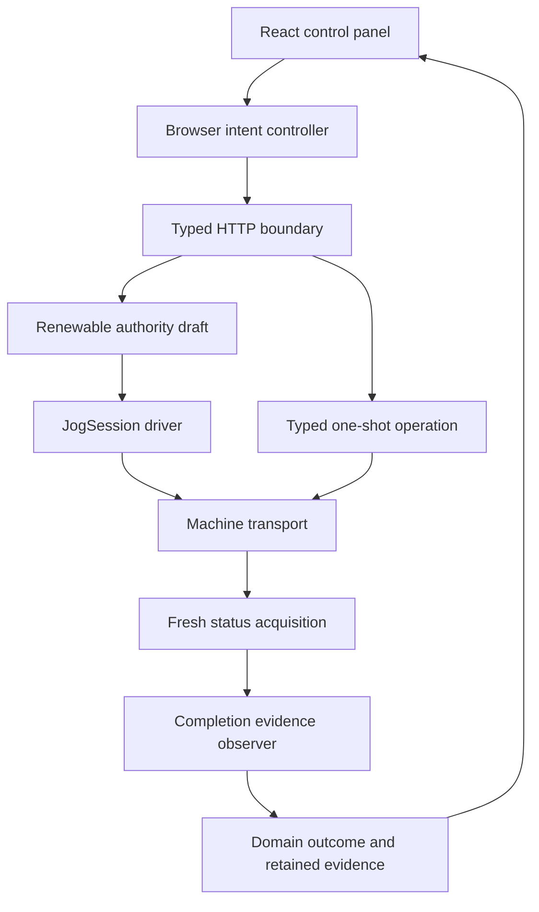
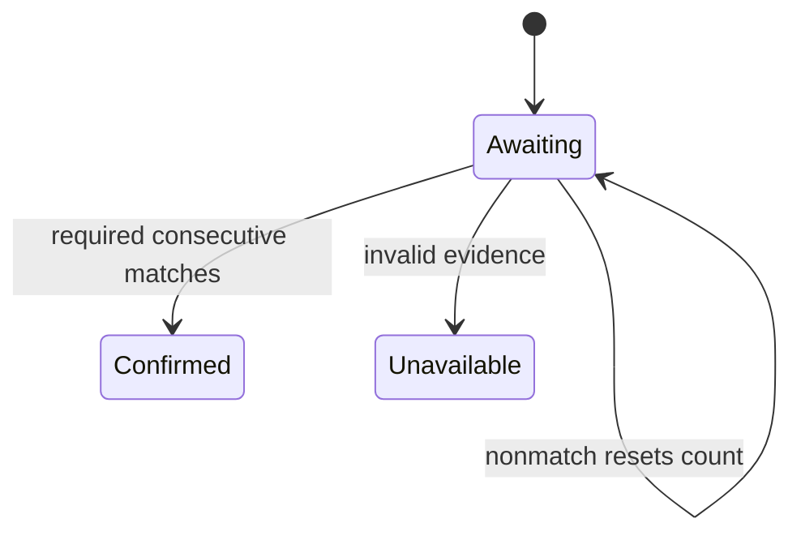

# Makera Z1 Control — Three Refactors for Authority, Evidence, and Browser Intent

A machine controller must distinguish permission to act, evidence that an action completed, and the operator intention that initiated the action. These concepts interact, but they are not interchangeable. A live browser does not establish physical safety. A command response does not prove that motion stopped. A valid server session does not make an old pointer gesture current.

This report examines three related refactors in the Makera Z1 controller inside `dropcut-studio`. The work extracted browser-held jog ownership into a proposed generic renewable authority, moved consecutive completion evaluation into a small Go observer, and moved browser command lifecycles out of React rendering into independently tested controllers. The useful result is not simply more reusable classes. It is a clearer assignment of responsibility for decisions that were previously mixed into transport loops and UI callbacks.

The report is grounded in the source tree and its implementation diaries as inspected on 2026-09-13. Two refactors are committed. The authority extraction is still uncommitted and has unresolved lifecycle and timing questions. No new hardware acceptance or live deployment was performed for these refactors.

> [!summary]
> - **Authority** answers which current owner may continue an operation. Its central invariants are exclusivity, fencing, and revocation ordering.
> - **Completion observation** answers whether a declared criterion has been satisfied by acquired evidence. Its central invariants are explicit invalidity, consecutive matching, and terminal decisions.
> - **Browser intent** answers whether an asynchronous effect still belongs to the operator request that created it. Its central invariants are one-shot confirmation, no resurrection of released gestures, and preservation of uncertainty.
> - The completion and browser implementations passed software validation. The authority draft and eventual physical held-jog path remain separate acceptance work.

## 1. Project context: one machine connection and several kinds of truth

The repository is a TypeScript CAM project with a nested Go controller, `makera-z1-cli`. The normal operator path uses the reviewed loopback HTTP server, which owns a shared connection to the machine. React renders telemetry and control surfaces. The Go client owns protocol decoding, command exchanges, machine admission, and typed operations.

The controller had already undergone substantial protocol and spindle-stop hardening. Earlier work separated command dispatch, firmware acceptance, telemetry observation, and physical verdict. It also established explicit uncertainty handling rather than retrying an enabling command after a timeout. The refactors discussed here build on those boundaries; they do not replace them.

The immediate development context was MZ1-013, a ticket for probe and fixed-tool-setter characterization. Before contact motion, the plan requires lower-risk continuous-jog dead-man and spindle-off air-cut acceptance. Inspection found that continuous jog was deliberately unavailable in the deployed HTTP route. A lower-level `JogSession` existed, but a complete browser-owned lifecycle and its acceptance evidence did not.

That gap prompted a broader question: which pieces of state deserve their own implementation owner? Three candidates emerged. Jog ownership needed a reusable concurrency structure. Spindle completion contained a small reusable evidence algorithm. The browser control panel contained asynchronous intent logic that did not belong in rendering code.

## 2. Reading the status of this work correctly

The implementation history contains three focused commits for the later two refactors:

| Revision | Deliverable | Status |
|---|---|---|
| `971cf97` | Completion and browser designs, detailed diaries, task tracking | Committed |
| `a5faea1` | Generic completion reducer and spindle integration | Committed |
| `8b8d947` | Browser controllers, React integration, tests, and documentation | Committed |
| Working tree based on `8b8d947` | Generic renewable authority, jog driver, HTTP/schema changes | Uncommitted draft |

The authority draft is not hidden behind the later commits. It is present in `pkg/authority`, `pkg/webui/jog_authority.go`, and modified web/schema files, but has not reached the same reviewed checkpoint as the completion and browser work. The browser held controller was intentionally implemented against a typed port rather than directly importing the draft lease fields. This permits a focused browser commit without implicitly qualifying the server draft.

The distinction also applies to tests. The final full-worktree run passed Go race tests and vet, and the frontend run passed 31 tests, TypeScript checking, and a Vite build. Those results include the then-current worktree. They do not establish correctness for every untested authority transition, nor do they prove installed firmware behavior.

## 3. The architecture after extraction

Each component owns a different decision:



This is a responsibility diagram, not a claim that every path is enabled. The normal one-shot controls use the intent controller. The held controller exists but is not mounted as a continuous-jog button. The observer is integrated into spindle-stop observation. The authority path remains under development.

Three terms will recur throughout the analysis. An **invariant** is a condition that must remain true across every admitted transition. A **generation** identifies one incarnation of an owner or intention so that old callbacks can be rejected. A **linearization point** is the instant at which a concurrent operation takes effect in the model. Defining that instant makes it possible to reason about which of two racing operations happened first.

## 4. Refactor one: from handler-owned jog timers to renewable authority

### 4.1 Why a session pointer and timer were insufficient

The initial handler draft stored a jog session pointer, a browser gesture ID, and a resettable timer. Start installed the pointer. Keep looked it up and called `Keepalive`. Stop or expiry removed it and invoked the stop handshake.

Two races exposed the weakness of that representation.

First, keep could validate the pointer under a mutex, release the mutex, and then perform its enabling write. Expiry could detach the session in the interval between validation and write. The program would then emit a pulse after logical revocation had begun.

Second, resetting a timer did not prove that an earlier callback was not already queued. A successful renewal could extend the deadline, followed by an old callback expiring the renewed owner.

Neither problem is fundamentally an HTTP problem. Both arise because ownership checks, enabling effects, and revocation were not controlled by one semantic operation.

### 4.2 The selected API: a typed driver

The selected design was Pattern B, a generic exclusive authority whose domain behavior is supplied once:

```go
type Driver[T any] interface {
    Renew(context.Context, T) error
    Revoke(context.Context, T, Reason) error
}

type Policy struct {
    TTL           time.Duration
    RevokeTimeout time.Duration
}

func NewExclusive[T any](Policy, Driver[T]) (*Exclusive[T], error)
func (a *Exclusive[T]) Acquire(context.Context, func(context.Context) (T, error)) (Grant, error)
func (a *Exclusive[T]) Renew(context.Context, ID) (Grant, error)
func (a *Exclusive[T]) Release(ID) (Revocation, error)
func (a *Exclusive[T]) Abandon(error) (Revocation, error)
func (a *Exclusive[T]) Snapshot() Snapshot
```

The draft's actual type is `Exclusive[T]`. Earlier exploratory APIs also discussed `Close` and a permanent closed state; those are not implemented in the current draft and must not be treated as available methods.

The jog driver supplies the two machine effects. Renewal calls the existing `JogSession.Keepalive`; revocation calls `JogSession.Stop`. This preserves firmware encoding and handshake semantics in the domain layer. The generic package does not know the realtime byte values or how firmware acknowledges stopping.

### 4.3 Ownership before start, exclusion during cleanup

The authority state machine includes intermediate states:

```text
Idle → Starting → Active → Revoking → Idle
```

`Acquire` reserves `Starting` before invoking the start function. Otherwise two callers could each start a resource before discovering that only one can install its lease. The callback-based acquisition API closes that ownership gap.

`Revoking` has an equally important role. The authority must fence future renewals before cleanup, but must not immediately permit a new resource while cleanup for the old one is still executing. Revocation is therefore two-stage: change authority state, then run the domain cleanup, then decide whether the owner can be reused.

The draft returns a receipt separating those facts:

```go
type Revocation struct {
    ID             ID
    Reason         Reason
    AuthorityEnded bool
    CleanupStarted bool
    CleanupError   error
    StartedAt      time.Time
    FinishedAt     time.Time
}
```

An ended authority and an unavailable stop acknowledgement can coexist. A single success Boolean cannot communicate that distinction.

### 4.4 Caller fencing and timer fencing are separate

The external grant ID contains a generation and random nonce, encoded as an opaque string. The server compares the complete ID before permitting renewal or release. It is authority-bearing data and should not be treated as an ordinary log correlation field.

Inside one generation, every successful renewal also advances a renewal epoch. Timer callbacks capture both numbers:

```text
(generation, renewalEpoch)
```

Generation answers whether the callback still belongs to the current owner. Epoch answers whether it still belongs to that owner's current deadline. An old timer may match the owner but not the deadline.

This illustrative trace shows the distinction:

```text
acquire       generation=7 epoch=1
renew         generation=7 epoch=2
old callback  generation=7 epoch=1 → ignored
release       generation=7         → Active becomes Revoking
late renew    generation=7         → rejected
```

These are controller state transitions, not captured machine output.

### 4.5 What serialization establishes—and what it does not

The draft holds the authority mutex while invoking the renewal driver. This orders the pulse against release and expiry. Either renewal is admitted first and completes its effect before revocation transitions, or revocation transitions first and renewal is rejected.

That proof depends on driver behavior. The callback must be short, non-reentrant, and bounded. It must not call back into the same authority or wait indefinitely. Creating a Go context does not enforce a timeout against a driver that ignores it.

The current jog driver ignores the renewal context and relies on the lower transport's configured write deadline. The default transport timeout is 300 ms; positive configuration causes `TCPTransport.Write` to set a write deadline. This is not a universal bound for all possible drivers, all configurations, or time spent waiting for other locks.

A useful engineering expression is therefore conditional:

$$
T_{host\ cleanup} \lesssim TTL + J_{scheduler} + W_{contention+effect} + C_{cleanup}
$$

The terms must actually be bounded for the expression to serve as a guarantee. A general-purpose OS and Go scheduler do not supply a hard real-time bound. The device-side watchdog remains necessary for omission-to-stop physical behavior if the host stalls.

### 4.6 Remaining defects and review requirements in the draft

The extraction improves structure, but source inspection still identifies work before acceptance.

**Deadline admission is not yet explicit.** `requireActiveLocked` checks state and ID but not whether `ExpiresAt` has already passed. If the expiry callback is delayed and a renewal obtains the lock first, it can renew an overdue grant. Epoch fencing prevents stale callbacks from expiring a renewed grant; it does not by itself prevent renewal after the previous deadline. A strict lease contract needs a time check at admission and a defined expired transition.

**Cleanup failure returns the generic state to Idle.** The draft records `CleanupError` but permits reuse afterward. That may be acceptable only when domain admission independently quarantines uncertain state. The reusable contract must say whether cleanup failure blocks reacquisition, requires reconciliation, or delegates that decision explicitly to the adapter.

**Abandonment has limited lifecycle coverage.** It operates on the current active owner without a caller-supplied expected generation. It does not invalidate an in-flight `Starting` callback. Shutdown, session replacement, and callbacks that finish after a transport loss need generation-scoped behavior. There is no permanent `Closed` state yet.

**Cancellation does not force callbacks to stop.** Acquisition does not independently prevent a callback that ignores cancellation from returning a resource after the request has disappeared. A design for late successful start must revoke or otherwise retain ownership deliberately.

**Lower-level callers still need their own ordering.** The generic authority serializes calls routed through it. It does not repair every possible direct `JogSession.Keepalive` versus `Stop` race in callers that bypass the authority. Atomic checks followed by a later transport write are not automatically a single linearized effect.

These are source-review findings and follow-up requirements, not claims that corresponding physical failures have been observed. They explain why the authority refactor remains a draft despite passing its current tests.

## 5. Refactor two: a completion observer that does not own polling

### 5.1 The smallest useful abstraction

`Client.observeSpindleOffFor` originally combined fresh queries, telemetry validation, consecutive-sample counting, deadline management, and error reporting. The refactor extracted only the count-and-decision reducer.

The restraint is important. The loop already knows when another transaction is too close to the observation deadline. Moving acquisition into a general polling framework would have hidden that transport-specific rule. Instead, the observer receives samples chosen by the existing loop.

Its public contract is small:

```go
func New[T any](required int, classify func(T) Classification) (*Observer[T], error)
func (o *Observer[T]) Observe(sample T) Result
func (o *Observer[T]) Snapshot() Result
```

The observer has no clock, network connection, timer, history buffer, or command callback. It is a single-owner reducer, not a concurrent service.

### 5.2 Three classifications preserve uncertainty

The classifier returns `Match`, `Pending`, or `Invalid`. A valid nonmatch is not the same as an invalid observation.

For ordinary spindle stop, an Idle report with valid measured RPM in `[0,50]` matches. A valid Run report during coast-down is pending and resets the streak. Missing or malformed required telemetry is invalid and terminates the observer as unavailable.

Let `c` be the streak and `N` the requirement. While awaiting:

$$
Match: c' = c+1,\quad Pending: c'=0
$$

The decision becomes confirmed when `c' ≥ N`. Invalid evidence becomes unavailable immediately. Both terminal decisions remain terminal even if additional samples are submitted later. A new observation attempt requires a new observer.



The default branch also treats unknown classification values as unavailable. Extending a classifier incorrectly must not accidentally produce a confirming sample.

### 5.3 Domain policy remains visible at the use point

The client supplies a classifier that preserves existing behavior:

```go
observer, err := completion.New(n, func(st Status) completion.Classification {
    spindle := st.SpindleObserved
    if !st.StateObserved.Valid || !spindle.Valid() {
        return completion.Invalid
    }
    stateOff := st.State == "Idle" || (allowAlarm && st.State == "Alarm")
    if stateOff && spindle.Current.Value >= 0 && spindle.Current.Value <= threshold {
        return completion.Match
    }
    return completion.Pending
})
```

The loop still queries fresh status, retains each acquired report, and produces the exact domain error when evidence is incomplete. It still uses the configured sample count, interval, threshold, and optional Alarm policy. It still avoids starting a transaction within one interval of the deadline.

The refactor does not change how many M5 commands are sent, when emergency escalation is allowed, or whether target RPM must become zero. Those decisions remain outside the observer.

### 5.4 Five samples are not five intervals of proof

A count reducer cannot establish observation freshness. Calling `Observe` five times with a cached zero-RPM report will satisfy a five-match policy even though no new physical evidence was acquired. The caller's acquisition contract is therefore part of the overall correctness argument.

A count also does not establish a minimum elapsed dwell. Five regularly spaced samples span approximately four intervals. Actual query and scheduling durations affect the timestamps. If a future requirement specifies one second of stable evidence, the API must represent timestamps, allowed gaps, and minimum duration explicitly.

Nor does repetition alone yield a statistical confidence level. That requires a measurement model and assumptions about error and independence. The implemented result means only that the declared consecutive-sample criterion passed.

### 5.5 What changed and what was tested

Commit `a5faea1` added a 62-line implementation and a 46-line test file, with a focused edit to the existing client loop. Tests cover partial streaks, reset, invalid evidence, terminal behavior, invalid constructor policy, and independent operation instances. Existing spindle tests exercised the integrated loop, including bounded deceleration and coast-down behavior.

The extraction creates a plausible future use for fixed-setter release evidence without prematurely implementing probing. A probe adapter could classify selected-sensor observations, but it must first establish sensor identity and presence/validity. The generic observer cannot supply those facts.

## 6. Refactor three: browser intent becomes an explicit lifecycle

### 6.1 What left ControlPanel

The original ControlPanel owned confirmation, in-flight exclusion, pending state, notice text, local uncertainty, and asynchronous command handling. Those variables formed an implicit state machine inside rendering code.

The refactor introduced `IntentController.ts`, `HeldIntentController.ts`, and a domain adapter hook, `useOperatorIntent.ts`. ControlPanel now projects snapshots rather than implementing the enabling lifecycle itself. Its edited region shrank substantially, although total project code grew because the state machines and tests became explicit.

That is an appropriate trade-off when the added code owns previously implicit invariants. Extraction is not measured only by line-count reduction.

### 6.2 One-shot confirmation is consumed before dispatch

The one-shot driver defines three operations:

```ts
interface IntentDriver<C, R> {
  check(command: C): boolean;
  dispatch(command: C): Promise<R>;
  isUncertain(result: R): boolean;
}
```

At the use point:

```ts
const intents = createIntentController(driver);
const id = intents.propose(command);
if (id !== undefined) await intents.confirm(id);
```

Proposal captures cloneable request data. Confirmation validates ID and phase, rechecks current eligibility, and transitions synchronously to dispatching before calling the driver. A duplicate confirmation cannot dispatch again because it sees the changed phase. A stale ID cannot confirm a newer proposal.

New proposals during dispatch are rejected rather than queued. Cancellation removes a pending confirmation but cannot undo an already-issued command. Disposal suppresses future publication; it is not physical cancellation.

The controller's snapshots are read-only by convention, not deeply frozen capabilities. Callers must not mutate them. The input copy prevents later mutation of the original request from changing the confirmation, but it does not make arbitrary external mutation of returned state impossible.

### 6.3 Urgent stops and uncertainty do not share the enabling gate

Urgent stops bypass one-shot enabling exclusion. A pending homing request must not prevent spindle-off dispatch. The hook routes non-enabling requests separately and feeds uncertain outcomes back into local admission.

It also distinguishes notice ownership from uncertainty ownership. Every dispatch advances a notice generation; only the latest request may replace the visible notice. All uncertain results still matter, including obsolete results whose text should not be published.

An illustrative sequence demonstrates why:

```text
home dispatch starts          → notice generation 1
spindle-off dispatch starts   → notice generation 2
spindle-off result uncertain  → display warning, latch local uncertainty
home result succeeds late     → do not overwrite warning; retain uncertainty
```

The implementation combines result uncertainty with existing uncertainty rather than overwriting the flag with the latest success. Local acknowledgement is disabled while an enabling request is in flight. Otherwise the operator could clear uncertainty while a still-running request remained able to produce a contradictory outcome.

Local acknowledgement still does not reconcile the machine. Shared server admission retains that responsibility.

### 6.4 Held gestures need a different controller

A held operation is not a repeated one-shot command. It starts once, obtains server authority, and renews only while the original gesture remains active:

```ts
interface HeldDriver<C> {
  start(command: C, gestureId: string): Promise<{ leaseId: string }>;
  renew(leaseId: string): Promise<void>;
  release(leaseId: string): Promise<void>;
}
```

The browser gesture ID is correlation for the press. The server lease ID is authority for keep and stop. The controller must retain both meanings.

The decisive race occurs when release precedes the start response:

```text
press → start sent
release → mark gesture no longer held
late grant → release returned lease once; never start renewal
```

The controller retains the pending gesture until its start settles. It blocks replacement presses so unresolved starts cannot accumulate unowned grants. Disposal suppresses publication but still permits cleanup of a late successful grant.

Renewals are single-flight. The next timer is scheduled after the previous request settles, avoiding catch-up queues. A failure suppresses later renewal and triggers one release attempt. No start, renewal, or release failure is automatically retried.

The chosen 200 ms delay is therefore a delay between completed work and the next request, not a guaranteed 5 Hz request rate. If round-trip duration is `R`, request-start spacing is approximately `200 ms + R`, plus scheduling delay. Server TTL and device timing assumptions need to accommodate that behavior.

### 6.5 Release during an in-flight renewal

Release immediately clears the held flag and cancels future scheduling. It attempts cleanup even if renewal is still pending. Local ownership is retained until both cleanup and renewal settle, preventing a replacement gesture from overlapping unresolved work.

This establishes browser ordering, not transport arrival order. If keep and stop HTTP requests are concurrent, the server must independently serialize them and reject a keep that arrives after authority revocation. This is where the browser pattern composes with, rather than replaces, server authority.

A permanently unresolved promise can keep the local slot occupied. The fail-closed choice prevents another start, but the API adapter still needs explicit request timeout and reconciliation behavior. A server expiry remains essential when a browser cannot obtain the grant or cannot finish cleanup.

### 6.6 React lifetime is distinct from operation lifetime

The hook uses `useSyncExternalStore` to subscribe to stable snapshots. Driver closures use current props through a ref, preventing the controller from retaining an outdated execute function or eligibility state.

React StrictMode replays effect setup and cleanup. The hook therefore marks the component unmounted during cleanup and defers permanent disposal to a microtask. If setup immediately follows, it restores the mounted flag; a real unmount disposes the controller. Integration tests cover replay and a changed execute callback.

These concerns stay in the adapter. The standalone controller does not import React and can be tested without a DOM.

### 6.7 What is integrated and what remains intentionally absent

The one-shot controller is used by the actual ControlPanel. The held controller is tested and has a `createJogIntent` adapter accepting a typed `JogLeaseAPI` port. That port translates gesture identity for start and server lease identity for keep/stop.

It is not mounted as a physical hold-to-jog UI. Concrete HTTP integration, pointer capture, pointer cancellation, visibility/page-lifetime bindings, server draft hardening, and supervised dead-man acceptance remain separate work. The UI continues to report continuous jog as unavailable.

This is a software component checkpoint, not a hidden expansion of machine-control authority.

## 7. How the three patterns compose

The patterns form a useful separation, but not a universal framework:

| Question | Owner | What success means |
|---|---|---|
| Does this callback belong to current browser intent? | Intent controller | A local effect is still admissible for this intent |
| May this owner continue the operation? | Server authority | A renewal or release belongs to the current grant |
| Does the evidence satisfy the operation's criterion? | Completion observer plus domain classifier | Required consecutive evidence has been acquired and matched |

A hypothetical accepted held-jog path would create local intent, acquire server authority, forward renewals, revoke on release or silence, and then collect physical terminal evidence. Only the domain can decide which evidence is sufficient for the final physical verdict. A lease receipt is not that verdict.

Likewise, spindle-off observation already uses the completion reducer without becoming a lease. Spindle enablement is persistent actuation; host silence has not been established as a firmware-enforced spindle stop. Reusing a host timer would not manufacture that property.

Probe contact remains a bounded at-most-once operation. Manual M6 continuation is a candidate for a related consumable capability, not a long-duration renewable lease. These distinctions prevent reuse from erasing domain semantics.

## 8. Validation, failures, and what the evidence covers

The work used design-first commits and detailed investigation diaries. The completion design and browser design were committed before implementation. The reducer and its spindle integration were committed after targeted race tests and vet. The browser slice was committed after controller, adapter, and UI validation.

Two test-authoring errors were recorded during the broader work. The authority draft initially used an unavailable `assert.After` helper and retained regression references to the removed `jogMu`. The browser tests initially used a matcher unavailable in Vitest 2.1.9:

```text
Error: Invalid Chai property: toHaveBeenCalledExactlyOnceWith
```

Replacing it with separate call-count and argument assertions preserved the intended test. These failures are worth recording because a passing implementation claim must not be inferred from a test that did not compile or execute its assertion.

The final recorded validation at the browser milestone was:

```text
pnpm --dir apps/control test              → 7 files, 31 tests passed
pnpm --dir apps/control exec tsc --noEmit → passed
pnpm --dir apps/control build             → 151 modules built
cd makera-z1-cli && go test -race ./...   → all packages passed
cd makera-z1-cli && go vet ./...          → passed
docmgr doctor --ticket MZ1-013            → all checks passed
```

The controller tests use deferred promises and fake timers to force important orderings. They establish no duplicate dispatch, eligibility rechecks, release-before-start cleanup, no catch-up renewal, error no-retry behavior, and uncertainty persistence. UI tests verify actual urgent-stop availability and current-prop behavior.

The observer tests establish reducer transitions. Existing spindle tests check integration under fake-machine conditions. Neither test category establishes physical stop latency, firmware dead-man behavior, or the identity of installed firmware relative to the reviewed source.

Go's race detector detects unsynchronized memory access in exercised paths. It does not prove lease deadline semantics, guarantee bounded callbacks, or establish all legal lifecycle transitions. The authority review findings above illustrate the difference between a data-race-free test run and a complete semantic safety argument.

## 9. What to review next

The most urgent next work is not another generic abstraction. It is completing the authority contract: explicit deadline checks, cancellation and shutdown behavior during start, generation-scoped abandonment, and a defined policy after cleanup failure. Tests should force those transitions rather than relying on short real-time sleeps.

Next, the concrete browser HTTP adapter should be reviewed for one-request semantics, bounded waits, strict response handling, and no retries. DOM bindings must cover release, pointer cancellation, lost capture, blur, hidden documents, page teardown, and component disposal. None of those bindings proves operator attentiveness; they establish the software's interpretation of held intent.

Only after those boundaries are software-qualified should the exact candidate binary be built and deployed for fresh read-only preflight and separately authorized physical acceptance. Physical E-stop remains the final authority. Software cleanup success does not supersede it.

The completion reducer is ready for additional policy-specific use when genuine evidence paths exist. The next natural candidate is fixed-setter release observation, after presence-aware sensor contracts and bounded contact/retract behavior have been implemented and validated.

## 10. Project-level conclusion

The three refactors clarify different kinds of state rather than collapsing them into one abstraction. Renewable authority controls continuation. Completion observation evaluates evidence. Browser intent controls asynchronous local effects. Each is useful because its responsibility is narrow enough to state and test precisely.

The implementation also demonstrates a necessary limit on architectural claims. A cleaner state machine can still have an overdue-renewal defect. A passing observer can still receive stale samples from its caller. A correct browser controller can still depend on an unfinished server protocol. The design becomes safer when these dependencies are explicit, not when the names of the abstractions imply guarantees they do not enforce.

The committed result is a small evidence reducer and a browser lifecycle layer with concrete use-point tests. The authority extraction is a promising but incomplete draft. Preserving that distinction is part of the technical result.

## Source map and related notes

All repository paths below are relative to `/home/manuel/workspaces/2026-08-11/cnc-control-dropcut/dropcut-studio`.

| Area | Primary files |
|---|---|
| Authority draft | `makera-z1-cli/pkg/authority/exclusive.go`, `exclusive_test.go` |
| Jog adapter draft | `makera-z1-cli/pkg/webui/jog_authority.go`, `motion.go`, `webui.go` |
| Completion reducer | `makera-z1-cli/pkg/completion/observer.go`, `observer_test.go` |
| Spindle use point | `makera-z1-cli/pkg/makera/client.go`, `motion_test.go` |
| Confirmed intent | `apps/control/src/intent/IntentController.ts`, its test |
| Held intent | `apps/control/src/intent/HeldIntentController.ts`, its test |
| React adapter | `apps/control/src/intent/useOperatorIntent.ts` |
| Typed held port | `apps/control/src/intent/jogIntent.ts`, its test |
| Actual control UI | `apps/control/src/components/organisms/ControlPanel/ControlPanel.tsx`, `apps/control/src/controls.test.tsx` |

Ticket workspace: `ttmp/2026/09/12/MZ1-013--z-probe-and-tool-setter-characterization-and-typed-probe-authority/`. Documents `design-doc/02-*` and `reference/02-*` cover completion; documents `design-doc/03-*` and `reference/03-*` cover browser intent. The earlier main design and diary contain authority extraction history.

Standalone pattern chapters:

- [[Research/Software Architecture Garden/dropcut-studio/designs/05 - Exclusive Renewable Authority - A Linearizable Lease for Hazardous Continuation|Exclusive Renewable Authority]]
- [[Research/Software Architecture Garden/dropcut-studio/designs/06 - Consecutive Evidence Observer - Completion Without Owning the Operation|Consecutive Evidence Observer]]
- [[Research/Software Architecture Garden/dropcut-studio/designs/07 - Browser Intent Ownership - Confirm Once and Renew Only While Held|Browser Intent Ownership]]

Prior project context:

- [[Projects/2026/09/12/PROJ - Makera Z1 Control - Protocol Hardening and Spindle Stop Safety|Protocol Hardening and Spindle Stop Safety]]
- [[Projects/2026/09/12/ARTICLE - Makera Z1 Stock Firmware - Source-Grounded Command and Telemetry Reference|Source-Grounded Firmware Reference]]

The standalone authority chapter records an earlier candidate design. Where its timing language appears stronger, use the explicit current implementation limitations in this report: timer callbacks, cooperative contexts, and generation checks do not by themselves establish strict expiry or physical stop guarantees.
