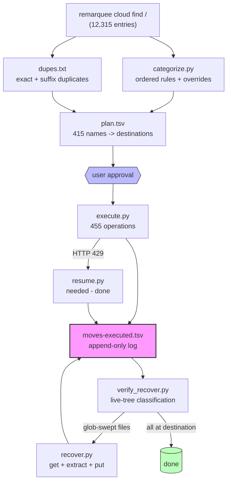
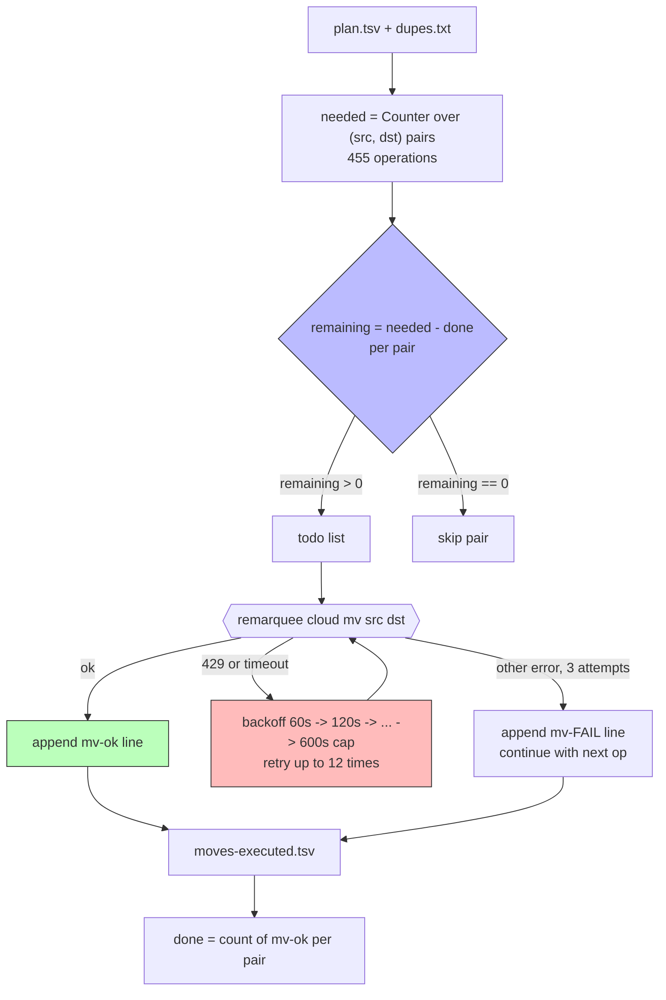
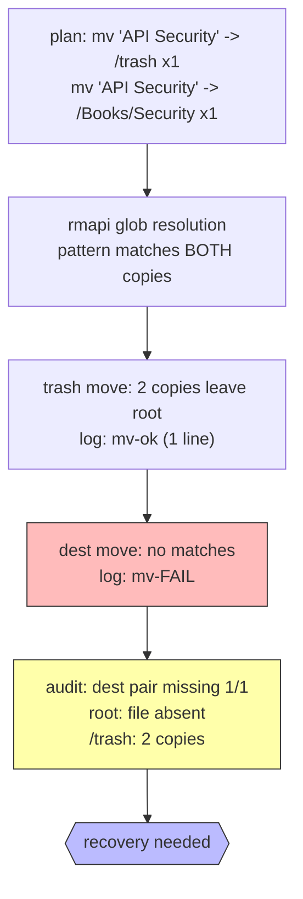
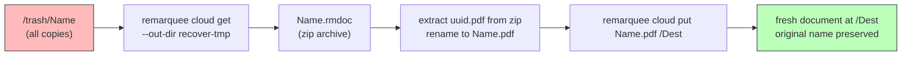

# reMarkable Cleanup 2

This project is the second bulk reorganization of the reMarkable tablet's cloud storage, executed six months after [[PROJ - reMarkable Cleanup - Tablet Root Reorganization|the first cleanup]] (2026-03-16). The root directory had regrown from 2 files to 462 files. The work was executed in a single session through the `remarquee` CLI: a rule-based categorizer classified 415 of 462 files, the plan was approved before execution, and 455 move operations were carried out by an idempotent, crash-resumable executor. Three rmapi behaviors that the first cleanup had not surfaced became the technical core of this project: cloud-side rate limiting, glob semantics that move *all* same-named copies in one operation, and a working escape syntax for bracket characters in filenames.

> [!summary]
> The project has three results that outlive the filing work itself:
> 1. a **resume protocol** based on pair-level operation accounting — the executor rebuilds its full operation list from immutable inputs on every start, subtracts the operations already logged as successful, and continues with the remainder; a crash at any point loses at most one in-flight move
> 2. a **failure-mode catalog for rmapi batch operations** — HTTP 429 token throttling, glob-matching that sweeps every same-named copy into the destination, and `path.Match` backslash escaping for `[` `]` filenames (which reverses the first cleanup's conclusion that brackets were unmanageable)
> 3. a **recovery pipeline** for files swept by glob semantics — download from `/trash` as `.rmdoc`, extract the original PDF from the zip archive, and re-upload it to the planned destination

## Why this project exists

The first cleanup established that the reMarkable tablet accumulates documents at the root directory by default: every upload through the web interface, email, or third-party tools lands at `/` unless it is filed manually. Six months of normal use — book downloads, arXiv papers, blog clippings, generated research reports — regrew the root from 2 files to 462 files spread over 24 existing topic folders.

The 24 folders from the first cleanup (`Books/Software`, `Papers/Unsorted` did not exist yet, `Articles/2025/`, `Deep Researches/2026/`, and so on) were still the right taxonomy. What had changed was the composition of the mess: this round contained far more self-generated documents (theses, textbooks, implementation guides produced by research agents), a large typography and design book collection, roughly 50 duplicate copies, and a higher proportion of files whose names carry glob metacharacters.

The manual-filing argument from the first cleanup applies with larger numbers. Filing 462 documents through the tablet's touchscreen interface is not a reasonable use of an evening. An automated pipeline with a human approval gate can do it in one session. What the first cleanup could not teach — because its 250 files moved without hitting rate limits or multi-copy globs — is how the rmapi transport layer behaves under a 455-operation batch. This project exists to file the documents and to document that behavior.

## Current project status

The project is complete. The root went from 462 files to 8 files. All 454 actionable file copies left the root: 400 arrived at their planned destination, 13 were intentional trash moves (11 suffixed duplicate copies plus 2 redundant copies of a file that already exists in `/Articles`), and 3 filenames turned out to have copies already archived in the synced `/PARC` and `/ai` folder trees, so their root copies were left in `/trash` as spares.

What was accomplished:

- 462 root files inventoried; 415 classified by a rule-based categorizer, 8 left for manual decision
- 6 new destination folders created (`/Design/Typography`, `/Design/Graphic-Design`, `/Design/Editorial-Design`, `/Books/Security`, `/Papers/Unsorted`, `/Datasheets/Patents`)
- 455 planned move operations, of which 403 delivered files to destinations and 52 moved duplicate copies to `/trash`
- 35 files recovered after being swept to `/trash` by glob semantics, via download-extract-reupload
- 6 bracket-named files moved using backslash escaping (the first cleanup left 2 such files stuck)
- Every operation logged with timestamp, source, destination, and status to a single TSV file (713 log lines across all phases)
- Final state verified against the live cloud tree with a classifier that checks every planned file against its destination

What remains:

- The 8 unknown-named files (`069Wj000009h3NGIAY`, `3fa211c3-…`, `annas-arch-…`, `DynamicalBook`, `HARSKT.p`, `SIGNATURE`, `supernormal-sensations`, `The Price of Truth`) stay in root until identified
- `/trash` holds one spare copy beyond plan for each of the ~38 glob-swept duplicate names; purge when confident
- The 3 files whose copies already live in `/PARC/…` and `/ai/2026/08/27/PAPERS-DL/` were not re-filed to their plan destinations

## How the reorg worked

The pipeline had seven stages: inventory → categorize → duplicate analysis → approval → execution → verification → recovery. Each stage wrote its output to a file under `scripts/2026/09/13/remarkable-root-reorg/`, and no stage modified the tablet before the approval gate.

### Stage 1: Inventory

`remarquee cloud find / --with-glaze-output --format json --output-fields name,type,path` returned the full cloud tree as structured data — 12,315 entries. Filtering to entries whose path contains exactly one slash yields the root population: 24 directories and 462 files. The structured form matters: the same JSON snapshot later served the duplicate analysis, the executor's plan construction, and the final verification, so every stage operated on one consistent inventory rather than re-parsing free-text listings.

### Stage 2: Categorize

A Python script (`categorize.py`) applies an ordered list of 26 regex rules to each filename. First match wins. The rule order encodes domain constraints: own-generated research documents are matched before book rules, so `optkit-theoretical-foundations` lands in `Deep Researches/2026` rather than a topic bucket; an article rule for the Bourbaki piece runs before the mathematics rule, so `Inside the Secret Math Society Known Simply as Nicolas Bourbaki` is filed as an article rather than under `Books/Mathematics`. Files that match no rule fall into a review bucket instead of being forced into a wrong category.

The rules classified 366 of 462 files on the first pass. Rule refinements (misroute fixes described under [Coverage validation](#coverage-validation)) raised the total to 415, and 47 explicit name-to-destination overrides resolved the remainder of the clear cases. Eight names with no identifying signal (`HARSKT.p`, `SIGNATURE`, `The Price of Truth`, and five others) were presented to the user and deliberately left in root.

### Stage 3: Duplicate analysis

Two duplicate classes were detected from the inventory alone:

- **Exact-name duplicates**: names occurring more than once in root (38 names, 39 extra copies). The tablet permits same-named files in one directory, and repeated uploads produce them routinely.
- **Suffixed near-duplicates**: names ending in `-1`, `_0-1`, `(1)`, or `(2)` whose base name also exists in root (11 copies). These suffixes are collision renames added at upload time.

For each exact-duplicate name with *n* copies, the plan becomes *n−1* moves to `/trash` and 1 move to the destination. This multiplicity is attached to the `(source, destination)` pair, not to the name — the property that later makes the executor idempotent.

### Stage 4: Approval

The user reviewed the destination mapping in chat — 23 destinations with counts and examples, the duplicate-trashing policy, the 6 new folders, and the 8 unknowns — and approved before any mutation of the tablet. This round used chat review instead of the March webapp; the review surface matters less than the fact that no move executes before approval.

### Stage 5: Execution

Execution ran in three passes, all driven by the same plan files:

1. **`execute.py`** — created the 6 new folders, then ran the 455 planned operations in a fixed order (duplicate copies to `/trash` first, survivors to destinations after). About 60 operations in, the reMarkable cloud began rejecting token requests with HTTP 429.
2. **`resume.py`** — the idempotent resume executor described in detail below. It rebuilt the operation list, subtracted the 83 moves already logged as successful, and ran the remaining 372 with exponential backoff on 429 responses.
3. **`recover.py`** — handled the two classes of failures the resume passes surfaced: bracket-named files that glob interpretation blocked, and duplicate names whose *entire* copy set had been swept to `/trash` by a single glob-matched move.

### Stage 6: Verification

A final script (`verify_recover.py`) fetches the live cloud tree and classifies every planned file into one of five states: at destination, still in root, only in trash, elsewhere in the tree, or gone. The verification is independent of the operation log — it checks ground truth, which is how it caught the glob-sweep failures that the log's success statuses had masked.

### Stage 7: Recovery

40 recovery actions: 5 bracket-named files moved with escaped paths, 35 glob-swept files restored to their destinations via download-extract-reupload. All 40 succeeded. Three additional files were skipped after the verification showed they already have copies in `/PARC/Projects`, `/PARC/Transcripts/…`, and `/ai/2026/08/27/PAPERS-DL/`.

## Project shape

The working directory is self-contained under the dated topic-folder convention:

| File | Purpose |
|------|---------|
| `full-tree.json` | pre-move snapshot of the entire cloud tree (12,315 entries) |
| `root-files.txt` | the 462 root filenames |
| `categorize.py` | ordered-rule categorizer with 47 name overrides |
| `plan.tsv` | the approved plan: name → destination → matching rule |
| `dupes.txt` | exact-name and suffixed duplicate report |
| `review.txt` | the 8 unresolved names |
| `execute.py` | first-pass executor (mkdir + 455 moves) |
| `resume.py` | idempotent resume executor with 429 backoff |
| `recover.py` | bracket-escape and glob-sweep recovery |
| `verify_recover.py` | five-state final verification against the live tree |
| `moves-executed.tsv` | append-only operation log: timestamp, status, source, destination, note |
| `root-after.txt` | post-reorg root listing |
| `README.md` | narrative summary with rollback pointers |

The mental model is a pipeline in which every stage's output is a plain file and the tablet is only touched at the execution stage:



## Architecture

### The plan as an accounting problem

The central data structure is not the destination assignment but the **operation multiset**: a `Counter` over `(source, destination)` pairs. For a file named *X* with 3 root copies and destination `/Books/Technology`, the plan does not say "move X to /Books/Technology"; it says:

```
("/X", "/trash")                 -> 2
("/X", "/Books/Technology")      -> 1
```

This representation carries multiplicity explicitly. A naive name-level plan ("X has been handled") cannot express that two copies must go to trash and one must survive, and any crash-resume logic built on it will either skip the surviving copy or re-trash already-trashed copies. Pair-level accounting makes the plan itself the resume protocol, because the number of operations needed for each pair is derivable from immutable inputs (`plan.tsv` + `dupes.txt`) at any time.

### The log as single source of truth

`moves-executed.tsv` is append-only and line-buffered. Each line records timestamp, status (`mv-ok`, `mv-FAIL`, `retry429`, `mkdir-ok`), source, destination, and an error fragment. Because writes flush per line, a hard kill can cost at most the one operation in flight. Because the log is the only durable state, the resume executor and the final audit both read it rather than a separate checkpoint file, and the two can disagree only if the log lies.

### Error classification

The executor distinguishes three error classes, each with its own response:

| Error class | Detection | Response |
|---|---|---|
| Rate limit (HTTP 429) | `"429" in stderr` or subprocess timeout | exponential backoff, retry up to 12 times |
| Hard failure (no matches, upload rejected) | any other nonzero exit | 3 attempts, then log `mv-FAIL` and continue |
| Subprocess hang | `subprocess.TimeoutExpired` after 180 s | treated as rate-limit class: backoff, retry |

The subprocess timeout deserves its own row because it is the failure that killed the first resume run: a rate-limited `mv` call can block for minutes without returning, and an uncaught `TimeoutExpired` terminates the whole executor. Catching the exception and mapping it to the rate-limit class converts a crash into a retry.

## Implementation details

This section walks through the four technically interesting components: the categorizer, the idempotent resume executor, the rate-limit handling, and the recovery pipeline forced by rmapi's glob semantics.

### Categorizer: ordered rules as a decision list

The categorizer is a decision list — a sequence of `(destination, regex)` rules applied in order, first match wins:

```python
RULES = [
    ("PBUI",     r"^(PBUI-|PRESENTATION-BASED-UI|...)"),      # own project cluster first
    ("DEEPRES",  r"(research[_ -]report|foundation[_ -]report|...|-textbook|Thesis|...)"),
    ("TYPO",     r"(Typograph|Typefaces|Bringhurst|Tschichold|...)"),
    ...
    ("PAPERS",   r"^(\d{4}\.\d{4,5}|\d{6,9}\.\d{5,7}|AIST_|AITR-|...)"),
    ("ARTICLES", r"(Fast\(er\) JavaScript|Cranelift|Happier DOMs|...)"),
    ("MANUALS",  r"(kitty_cheatsheet|Driver_Manual_FINAL)"),
    ("NOTES",    r"(Notebook 9|ChatGPT Image|Test image)"),
]
for name in root_files:
    for key, pattern in RULES:
        if re.search(pattern, name):
            plan[name] = DEST[key]
            break
    else:
        review.append(name)
```

Two design decisions shape this component.

First, **own-work rules come before topic rules**. A majority of this round's files were self-generated — research-agent theses, textbook drafts, implementation guides. Their titles overlap topic vocabulary (`Compositional_Probabilistic_Optimization_Textbook` contains "Optimization"; `rag-ttc-research-projects-compendium` contains "research projects"), so the `DEEPRES` rule must run before the mathematics and software rules or those files scatter into topic buckets.

Second, **the review bucket is a feature, not a fallback**. Forcing every file into a category guarantees silent misfiling for names like `turing` or `beting`, where the correct destination is genuinely undecidable from the filename. Eight files were held back and surfaced to the user instead.

#### Coverage validation

Rule-based classification is only trustworthy if its output is inspected. Sampling each destination bucket caught four misroutes before execution:

| Symptom | Root cause | Fix |
|---|---|---|
| `Topology Through Inquiry` filed under Editorial-Design | keyword `Franci` matched inside the author name `Francis` | removed the over-broad keyword |
| `Inside the Secret Math Society… Bourbaki` filed as a math book | keyword `Bourbaki` in the mathematics rule, which runs before the articles rule | article-specific rule inserted before mathematics |
| `Life Beyond Distributed Transactions` filed as a software book | keyword present in the software rule, which runs before the papers rule | keyword removed from software; the papers rule already covered it |
| `Grid systems in graphic design…` filed under Typography | keyword `typograph` matched the word `typographers` in the subtitle | explicit override to Graphic-Design |

A fifth class of misroute was conceptual rather than mechanical: papers about algebra (`reasoning-about-algebraic-data-types-with-abstractions`, `initial-algebras-unchained`) matched the mathematics rule through the substring `algebra` even though they are programming-language research. These moved to papers destinations by override. The pattern in all five cases is the same: regex keywords are cheap and scalable, but they match *substrings*, not *semantics*, so every rule set needs a human sampling pass before it is allowed to move files.

### The idempotent resume executor

The executor's contract is: **given immutable inputs and the log, compute the remaining work exactly, then do it.** The reconstruction is four lines:

```python
needed = Counter(ops)                  # full operation multiset from plan.tsv + dupes.txt
done   = Counter()                     # successful operations, from the log
for line in open(LOG):
    if status == "mv-ok":
        done[(src, dst)] += 1

todo = []
for (src, dst), n in needed.items():
    remaining = n - done.get((src, dst), 0)
    todo.extend([(src, dst)] * remaining)
```

Three properties follow from this construction:

1. **Crash safety at operation granularity.** A kill between operations loses nothing: the log has the completed lines, the reconstruction subtracts them, and the next run resumes with the exact remainder. A kill *during* an operation is also safe, because an operation that completed cloud-side but was killed before its log line was written is simply executed again — and a repeated move of an already-moved file fails with "no matches," which the audit classifies as a benign no-op rather than a data-loss event.
2. **Multiplicity correctness for duplicates.** Because `done` is counted per pair, a name with 3 planned trash operations and 2 logged successes resumes with exactly 1 remaining trash operation — not zero, and not three.
3. **No state beyond the log.** There is no cursor file, no checkpoint format, no "phase" variable. Any tool that can read the plan files and the log can compute the remaining work, which is also what made the post-hoc audit possible.



### Rate limiting: what HTTP 429 actually looked like

The reMarkable cloud throttles token creation. Around operation 60 of the first pass, `remarquee cloud mv` calls began failing with:

```
ERROR: 2026/09/12 22:13:36 auth.go:53: failed to create user token
from device token request failed with status 429
```

The failure mode has two properties that shaped the backoff design:

- **It is bursty, not absolute.** Failures interleaved with successes; a throttled call is followed seconds later by one that succeeds. A fixed long sleep after any 429 would waste most of the window. The executor therefore uses exponential backoff with *decay*: start at 60 s, double on each consecutive 429 up to a 600 s cap, and subtract 60 s from the current backoff after each success. The wait grows under sustained throttling and shrinks as soon as the cloud accepts calls again.
- **It manifests as hangs as well as errors.** A throttled call can block for minutes instead of returning 429 quickly. The first resume run died on exactly this: a `mv` hung past its 120-second subprocess timeout, the uncaught `TimeoutExpired` propagated, and the process exited with 60 operations' worth of work in the log. The fix is to catch the exception and classify it with the 429s:

```python
def mv(src, dst):
    try:
        r = subprocess.run(
            ["remarquee", "cloud", "mv", src, dst, "--non-interactive"],
            capture_output=True, text=True, timeout=180)
    except subprocess.TimeoutExpired:
        return False, "timeout after 180s", True   # treated as rate-limit class
    err = (r.stderr + r.stdout).strip()
    return r.returncode == 0, err, "429" in err
```

Because the executor is idempotent, the crash cost nothing but time: the relaunched process rebuilt the todo list, skipped the 102 logged successes, and continued.

A separate hazard in the same phase was self-inflicted: cleanup commands like `pkill -f "remarquee cloud mv"` and progress checks like `pgrep -c -f "resume.py"` match the shell wrapper that *contains* the pattern text, killing or counting the polling command instead of the target process. Every process-management pattern in this directory must be written to exclude its own command line — or, more simply, process control should happen by PID.

### rmapi glob semantics: one move, all copies

The most consequential discovery of this session is that `cloud mv` resolves its source argument as a glob pattern and moves **every matching entry**, not the first match. For unique filenames this distinction is invisible. For the 38 exact-duplicate names it changed the meaning of every duplicate-trashing operation: moving one copy of `API Security in Action…` to `/trash` moved *both* copies, because both match the pattern.

The failure was invisible to the operation log. The trash move reported success; the destination move — executed later for the surviving copy — then failed with `no matches`, which reads as an ordinary error. The pattern only emerged when the final audit compared planned pairs against logged successes and found 47 destination moves "unexecuted" while the root listing showed those files *gone*:

```
ok: 383/455   fail: 109        # log-level view
root files remaining: 14        # ground-truth view (8 unknowns + 6 bracket-named)
```

Forty-seven missing destination moves cannot be reconciled with 6 files left in root unless some operations moved more than one file. Counting copies in `/trash` confirmed it: `API Security in Action` had 2 copies there, `Sheaf Theory through Examples` had 3, `Zwicky` had 3 — every copy of every glob-swept name, plus the intended trash copies.

The verification-driven diagnosis matters more than the specific bug. A log can only answer "did the command succeed?" Ground truth answers "is the system in the intended state?" The two diverge whenever one operation has multi-file effects, and only the second question matters.



### Recovery: why re-upload was the only path

Restoring one copy of a glob-swept name requires addressing a *specific* document among same-named copies. Three mechanisms were tested:

1. **Move by document ID.** `cloud stat` exposes UUIDs, but `cloud mv <uuid> <dest>` fails with `no matches for '<uuid>'` — the ID is fed to the same glob resolver, which matches it against filenames. IDs are not addresses for `mv`.
2. **Move all copies out of trash, then re-trash *n−1*.** Circular: the same glob semantics sweep every copy back in a single operation, and no operation can address an individual copy to re-trash.
3. **Glob-pattern differentiation.** Identical names cannot be distinguished by any pattern; a pattern matches either all copies or none.

The working approach reconstructs the file server-side:



Each step encodes a constraint of the transport layer:

- `cloud get` downloads the first glob match as a `.rmdoc` zip. For identical duplicate uploads, any copy is acceptable, and the swept originals remain in `/trash` if a specific copy is ever needed.
- `cloud put` uploads only PDF/EPUB. Uploading the `.rmdoc` directly fails with HTTP 400, so the original PDF must be extracted from the archive (`uuid.pdf` inside the zip) and renamed to the document's name, because `put` derives the cloud document name from the local filename.
- The re-uploaded document is a fresh upload: modification dates reset, and any annotations on the swept copies do not carry over. For duplicate book uploads this is acceptable; for annotated documents the originals in `/trash` are the fallback.

### Bracket filenames: the March conclusion, reversed

The March cleanup concluded that `[bracketed]` filenames were permanently unmanageable via CLI, having tried direct moves, search-then-move, and rename — all blocked because rmapi resolves paths with Go's `path.Match`, where `[` opens a character class and no escape syntax was found at the time.

This session found the escape syntax: **backslash**, exactly as `path.Match` documents. `mv` succeeds when every metacharacter in the source path is backslash-escaped:

```python
def esc(p):
    return (p.replace("\\", "\\\\")
             .replace("[", "\\[").replace("]", "\\]")
             .replace("*", "\\*").replace("?", "\\?"))
```

With escaping, all 6 bracket-named files in root moved cleanly, including nested brackets (`…[_software_,_Prosody_,_XMPP server_]…`) and the previously-stuck FAQ files from March (`FAQ- Lisp Frequently Asked Questions 1-7 [Monthly posting]…`). The March project's open item "manually move the 2 remaining FAQ files via the reMarkable app" is resolved: `cloud mv` with escaped paths is the complete fix.

### Final verification: five states, one tree

The verification script does not read the log. It fetches the live tree and classifies every planned (name, destination) pair:

| State | Meaning | Action taken |
|---|---|---|
| at destination | a copy exists under the planned folder | none |
| still in root | file never moved (bracket names) | escaped `mv` |
| only in trash | all copies swept, none at destination | recover pipeline |
| elsewhere | copy exists under an unplanned path | skip if content is already archived there |
| gone | no copy anywhere | investigate |

The "elsewhere" state exposed the last trap of the session: `cloud find /` returned trees of different completeness on different runs — presumably a caching boundary in the rmapi tree sync at this tree size. Three files (`ARTICLE - Instrumenting Sessionstream…`, `Compositional_Retrieval_Systems_Thesis`, `linked-tiles-research-report`) appeared "only in trash" in one verification but had copies under `/PARC/Projects/2026/05/07/`, `/PARC/Transcripts/…` (6 copies across session folders), and `/ai/2026/08/27/PAPERS-DL/` in a fuller listing. The lesson generalizes: **when a verification result contradicts a plausible alternative explanation, re-fetch the ground truth before acting** — a direct `cloud ls` of the destination folders confirmed the situation in seconds.

## Failure-mode catalog

| # | Failure | Layer | Detection | Mitigation |
|---|---|---|---|---|
| 1 | HTTP 429 on token requests | reMarkable cloud | error text in `mv` stderr | exponential backoff with decay, idempotent resume |
| 2 | Subprocess hang on throttled call | transport | `subprocess.TimeoutExpired` | catch, classify as 429, retry |
| 3 | Glob moves all same-named copies | rmapi path resolution | log/ground-truth divergence in final audit | recovery via get → extract → put |
| 4 | `[` `]` in filenames match nothing | rmapi path resolution | `no matches for '…'` | backslash-escape all glob metacharacters |
| 5 | `put` rejects `.rmdoc` (HTTP 400) | reMarkable upload API | upload error | extract `uuid.pdf` from the rmdoc zip, rename, upload |
| 6 | `mv` cannot address a document by ID | rmapi path resolution | `no matches for '<uuid>'` | no direct fix; avoid needing per-copy addressing |
| 7 | `find /` returns incomplete trees | rmapi tree cache | verification contradicted by direct `ls` | re-fetch, verify destinations directly |
| 8 | `pkill`/`pgrep -f` matches own wrapper | shell tooling | command kills its own shell | manage processes by PID |
| 9 | Substring keyword matches inside words (`Franci` in `Francis`, `algebra` in PL-paper titles) | categorizer | manual bucket sampling | remove keyword or add override before execution |

## Comparison with the March cleanup

| Dimension | March (250 files) | September (462 files) |
|---|---|---|
| Coordination store | SQLite database | TSV files + append-only log |
| Categorization | hand-written SQL INSERTs with reasons | ordered regex rules + overrides, 8-file review bucket |
| Review surface | Go webapp | chat-approval of the mapping |
| Execution | generated bash, then Python second pass | one Python executor, idempotent by construction |
| Crash recovery | none (single pass) | pair-level accounting, resume from log |
| Rate limiting | not encountered | HTTP 429, backoff with decay |
| Duplicates | 5, resolved incidentally | 50, explicit pair-level plan — and the glob sweep |
| Bracket filenames | stuck, "no escape mechanism" | moved via backslash escaping |
| Moves per second | ~1 | ~0.15 under throttling, ~1 when unthrottled |
| Final accounting | 243 moved, 2 stuck | 400 at destination, 13 planned trash, 3 archived-elsewhere, 8 unknown, 0 lost |

The differences are not improvements for their own sake. SQLite and the webapp were right for a dataset explored for the first time; this round's inputs were filenames alone, and a TSV plan plus an approval conversation was sufficient review. What the second round adds is the execution layer: the March cleanup could tolerate a single fragile pass at 250 operations, and the September batch — nearly double, against a throttling cloud — could not.

## Lessons about rmapi batch operations

1. **`mv` source arguments are glob patterns.** Every operation can affect multiple files. Plans for duplicate names must be built knowing this, and the executor should count per-pair successes rather than trusting "the command succeeded."
2. **Backslash escaping is the path syntax for metacharacters.** The March conclusion that brackets were unmanageable was wrong; the escape was documented in `path.Match` all along.
3. **Documents cannot be addressed by ID through `mv`.** Any workflow that needs to act on one specific copy among same-named files needs a workaround (this project: download-and-reupload).
4. **Throttling produces hangs as well as 429s.** Any long batch needs both a timeout on every call and a policy for mapping timeouts to the retry path.
5. **Tree listings can be stale or truncated.** Verify against the specific destination directory when a global listing and a local fact disagree.
6. **An append-only, line-buffered log plus deterministic plan reconstruction is a complete crash-resume protocol.** No checkpoint format was necessary at any point.

## Important project docs

- `/home/manuel/code/wesen/claw-stuff/scripts/2026/09/13/remarkable-root-reorg/README.md` — narrative summary, destination counts, rollback pointers
- `/home/manuel/code/wesen/claw-stuff/scripts/2026/09/13/remarkable-root-reorg/plan.tsv` — the approved name → destination mapping (415 entries)
- `/home/manuel/code/wesen/claw-stuff/scripts/2026/09/13/remarkable-root-reorg/moves-executed.tsv` — full operation log (713 lines)
- `/home/manuel/code/wesen/claw-stuff/scripts/2026/09/13/remarkable-root-reorg/recover.py` — glob-sweep recovery implementation
- [[PROJ - reMarkable Cleanup - Tablet Root Reorganization]] — the first round; its open bracket-file item is closed by this project

## Open questions

- Should the 8 unknown-named files be identified by downloading and inspecting their contents, rather than decided by filename alone?
- Does the glob-sweep behavior also apply to `rm`, and if so, does a same-named `rm` delete every copy at once? (Not tested; the recovery workflow assumed copies in `/trash` were safe.)
- Is the ~60-operation threshold for token throttling stable, or does it vary with account state and time of day?
- Would a batch verb (`mv --batch` reading pairs from stdin, or a `mv --by-id`) remove the need for the download-reupload recovery path? This is the highest-value remarquee improvement surfaced by this session.
- Should an auto-filing daemon watch the root directory so a third cleanup is never needed?

## Near-term next steps

- Purge `/trash` once the recovered destinations are confirmed stable on the tablet
- Identify the 8 unknown root files by content inspection
- Report the glob-semantics finding and the batch-verb proposal to the remarquee/rmapi projects
- Revisit the March cleanup's `reports/improvements.md` wishlist: the bracket item is resolved, the ID-addressing item is confirmed still missing

## Project working rule

> [!important]
> Represent bulk plans as multisets of `(source, destination)` pairs and count successes per pair; an append-only log plus deterministic reconstruction is the resume protocol.
> Treat every rmapi path argument as a glob pattern — escape metacharacters, and never assume one command moved one file.
> Verify final state against the live tree, not the operation log; the log answers "did the command succeed," the tree answers "is the system in the intended state."
> Map transport failures to a small closed set of classes with distinct responses: rate-limit (backoff and retry), hard failure (bounded retries then continue), hang (catch the timeout and treat as rate-limit).
