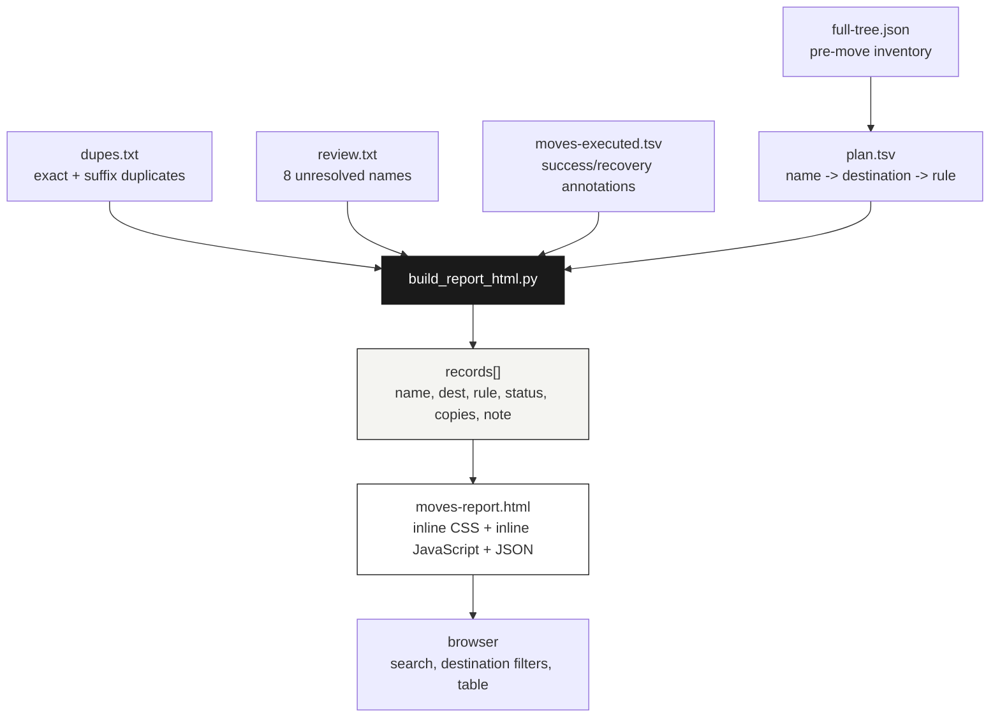
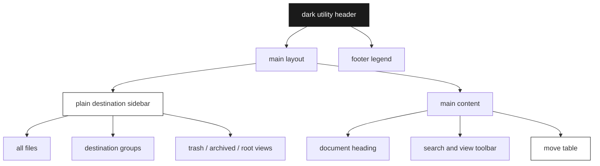

# reMarkable Move Report

This project adds a self-contained HTML report for the September 2026 reMarkable root reorganization. The page answers one operational question directly: for each file in the approved plan, where did it go? It embeds the generated records, exposes the destination mapping through a searchable table, and preserves the operational notes that distinguish ordinary moves from duplicate handling, recovery uploads, glob escaping, intentionally retained root files, and files already archived elsewhere.

The report is generated by `build_report_html.py` from the evidence files in `/home/manuel/code/wesen/claw-stuff/scripts/2026/09/13/remarkable-root-reorg/`. It does not require the move log or the categorization files at runtime. The resulting `moves-report.html` can be opened directly or served as a static file.

> [!summary]
> The implementation has four defining properties:
> - **The source data is reproducible.** The generator reads `plan.tsv`, `dupes.txt`, `review.txt`, and `moves-executed.tsv`; it does not contain a separately maintained copy of the move list.
> - **The page uses the publish-vault visual language without reproducing its application windows.** It keeps the dark utility header, system typography, monochrome palette, hard borders, and compact controls, while using a plain sidebar/content document layout with no cards, drop shadows, or title bars.
> - **The page explains operational state.** A row can be an ordinary move, a recovered re-upload, a glob-escaped move, an intentional trash copy, an already-archived file, or an unresolved root file.
> - **The output is static.** All 423 records, CSS, and JavaScript are embedded in one 90 KB HTML file.

## Why this project exists

The reMarkable root cleanup produced several durable artifacts: a categorization plan, a duplicate report, an operation log, and recovery scripts. Those files are useful for auditing, but they are not convenient for answering a simple browsing question. A TSV file exposes the mapping as rows without grouping, filtering, or status interpretation. A raw operation log exposes retries and failures without showing the final destination. A report needs to combine both kinds of information.

The first reMarkable cleanup included a Go and vanilla JavaScript review application backed by SQLite. That application was appropriate for a first investigation because categorization, annotation scanning, paper research, and review were still active tasks. The September cleanup did not need a new backend or an interactive database. The plan was already approved and the final evidence was already on disk. A static generated page was the smaller correct implementation.

The page has a narrow scope:

- It documents the root reorganization; it is not a general reMarkable file manager.
- It displays the approved plan and its operational annotations; it does not issue cloud commands.
- It treats one distinct filename as one report record, even when the tablet contained multiple physical copies of that name.
- It preserves the eight unresolved filenames as explicit `root` records rather than hiding them from the report.

This separation is important. A report that can also mutate the cloud tree would need authentication, error recovery, confirmation flows, and a much stronger security boundary. The current artifact only renders evidence.

## Current project status

The project is complete. The generator produces a valid report with 423 records and 24 destination groups. The generated page has been loaded through a local HTTP server with Playwright, and its JavaScript has passed a syntax check after extraction from the HTML document.

The displayed data consists of:

- 415 categorized plan names from `plan.tsv`
- 8 unresolved names from `review.txt`, displayed as files left in `/`
- 400 ordinary or recovered records at their planned destinations
- duplicate and suffix-copy records with explicit trash status
- archived-elsewhere notes for three names whose content already existed under `/PARC` or `/ai`

The report is generated at:

```text
/home/manuel/code/wesen/claw-stuff/scripts/2026/09/13/remarkable-root-reorg/moves-report.html
```

The generator is:

```text
/home/manuel/code/wesen/claw-stuff/scripts/2026/09/13/remarkable-root-reorg/build_report_html.py
```

The source checkpoint for the report and its underlying reorganization artifacts is commit `8589806` in `claw-stuff`.

## Design constraints

The implementation follows five constraints.

### 1. Generate from evidence, not from manually copied HTML data

The report must be rebuildable after a correction to the plan or operation log. `build_report_html.py` therefore reads the evidence files every time it runs. The generated HTML is a derived artifact; the TSV and JSON files remain authoritative.

### 2. Preserve filename bytes as readable Unicode

The source names include curly quotes, em dashes, accented characters, square brackets, and private-use or entity-like text. The generator loads UTF-8 text and serializes JSON with `ensure_ascii=False`. This keeps the displayed names readable and prevents a report build from converting every non-ASCII character into an escape sequence.

### 3. Make operational exceptions visible

A destination alone does not explain the execution. The report adds status and note fields for conditions that affect interpretation:

- duplicate copies moved to `/trash`
- records restored through PDF extraction and re-upload
- filenames moved with escaped glob characters
- files intentionally left in root for later identification
- files for which content already existed in another archive path

### 4. Use the publish-vault style without its application-shell framing

The final page uses the publish-vault palette and compact controls, but it does not use framed windows, card shadows, title-bar stripes, or a statistics-card row. The visible structure is a header, a plain navigation column, a document heading, a toolbar, a table, and a footer legend.

### 5. Keep the page usable at the scale of the dataset

423 records are small enough for client-side filtering. The browser receives one embedded array, and filtering changes only the table rendering. No server, database, framework, or client-side build system is required.

## Architecture

The implementation is a two-stage transformation. The Python generator creates a normalized report record for each distinct plan name and then embeds those records into an HTML document containing the CSS and browser logic.



There is no runtime read of the source directory. Once generated, the HTML contains all information needed to render the table. This makes the report suitable for a local file, a simple static HTTP server, or later publication through the vault's web infrastructure.

## Source data model

The plan file has one row per distinct categorized name:

```text
name<TAB>destination<TAB>rule
```

The duplicate report supplies physical-copy context. Exact duplicates are represented by a count, while suffix duplicates are represented as `(copy, base)` pairs. The operation log records individual attempts and recovery annotations. The generator joins these sources by filename.

The normalized browser record has this shape:

```javascript
{
  name: "API Security in Action (Neil Madden) ...",
  dest: "/Books/Security",
  rule: "SECURITY",
  status: "moved",
  copies: 2,
  note: "1 of 2 copies kept, 1 duplicate copies trashed; " +
        "recovered by download + re-upload after glob sweep"
}
```

The fields have independent meanings:

| Field | Meaning |
|---|---|
| `name` | The distinct document name displayed to the user. |
| `dest` | The planned destination from the approved plan. For root records it is `/`. |
| `rule` | The categorizer rule or `override` that selected the destination. |
| `status` | One of `moved`, `trash`, `archived`, or `root`. |
| `copies` | Exact-name duplicate count when known; otherwise `1`. |
| `note` | Human-readable operational explanation derived from the log and special cases. |

The physical-copy count is not expanded into multiple ordinary table rows. Expanding it would make the report appear to contain more independent documents than the user actually needs to browse. Duplicate information is instead displayed as a tag and a note on the distinct filename record.

## Record construction

The generator first loads the plan into an ordered mapping. It then parses exact duplicate counts and suffix pairs. The operation log is scanned for two annotations:

```python
recovered, escaped = set(), set()
for line in open("moves-executed.tsv"):
    fields = line.rstrip("\\n").split("\\t")
    if len(fields) >= 5 and fields[1] == "mv-ok":
        name = fields[2].lstrip("/")
        if fields[4] == "recover":
            recovered.add(name)
        elif fields[4] == "escaped-mv":
            escaped.add(name)
```

This scan is intentionally narrow. It does not infer success from a failed operation, and it does not treat every log line as a display annotation. Only successful recovery and escaped-move entries affect the badges shown in the table.

The status precedence is explicit:

```python
for name, (dest, rule) in plan.items():
    copies = dup_counts.get(name, 1)
    note_parts = []
    status = "moved"

    if name == CODEBASE:
        status = "trash"
        note_parts.append("both copies trashed — /Articles already holds two copies")
    elif name in ARCHIVED_ELSEWHERE:
        status = "archived"
        note_parts.append(ARCHIVED_ELSEWHERE[name])
        note_parts.append("root copies left in /trash as spares")
    elif name in suffix_copy_names:
        status = "trash"
        note_parts.append("duplicate copy (-1/(2) collision rename) trashed")
    else:
        if copies > 1:
            note_parts.append(f"1 of {copies} copies kept, {copies - 1} duplicate copies trashed")
        if name in recovered:
            note_parts.append("recovered by download + re-upload after glob sweep")
        if name in escaped:
            note_parts.append("moved with backslash-escaped [brackets] filename")
```

The order prevents an operational exception from being overwritten by the ordinary move path. For example, a suffix copy remains `trash` even if its name also appears in the generated plan. An archived-elsewhere exception remains `archived` even though the approved plan retains its intended destination for reference.

The eight review names are appended as records after the categorized plan:

```python
for name in unknown:
    records.append({
        "name": name,
        "dest": "/",
        "rule": "review",
        "status": "root",
        "copies": 1,
        "note": "unidentifiable filename — left in root for manual decision",
    })
```

This gives the browser a single record collection and a single filtering model. The unresolved files do not need a special rendering path.

## Browser state and filtering

The browser keeps only two pieces of mutable state:

```javascript
let currentKey = "__all__";
let query = "";
```

`currentKey` is either the all-files sentinel, a concrete destination, `/` for unresolved root files, `@trash`, or `@archived`. The sidebar stores that key in `data-key` attributes. The table does not perform a new data request when the key changes.

The destination predicate is deliberately explicit:

```javascript
function matchKey(r, key) {
  if (key === "__all__") return true;
  if (key === "@trash") return r.status === "trash" && r.dest !== "/";
  if (key === "@archived") return r.status === "archived";
  if (key === "/") return r.status === "root";
  return r.dest === key;
}
```

Search applies to three fields rather than only the filename:

```javascript
function matchesQuery(r) {
  if (!query) return true;
  const q = query.toLowerCase();
  return r.name.toLowerCase().includes(q)
    || r.dest.toLowerCase().includes(q)
    || (r.note || "").toLowerCase().includes(q);
}
```

Searching the note is useful because operational terms such as `re-upload`, `brackets`, `glob`, or `archived` identify classes of files that are not visible from their names alone.

The render function applies both predicates, sorts by filename, and constructs the table. The global view includes the destination column; a destination-filtered view omits that column because the selected heading already identifies it:

```javascript
let rows = RECORDS
  .filter(r => matchKey(r, currentKey) && matchesQuery(r));
rows.sort((a, b) => a.name.localeCompare(b.name));

const showDest = currentKey === "__all__";
```

This is a client-side view transformation, not a second data model. The same record remains the source for the all-files table, destination view, trash view, archived view, and root review view.

## HTML escaping and filename handling

Document names are external data from the cloud listing. The JavaScript rendering path escapes the characters that could otherwise be interpreted as HTML:

```javascript
function esc(s) {
  return s.replace(/&/g, "&amp;")
    .replace(/</g, "&lt;")
    .replace(/>/g, "&gt;");
}
```

The generator HTML-escapes server-produced labels before inserting them into the sidebar and page shell. The report does not use `innerHTML` for unescaped filenames or notes. The `tagFor()` function generates only fixed markup and values drawn from controlled status/rule values; filename and note text pass through `esc()`.

The generator preserves Unicode at serialization time:

```python
data_json = json.dumps(records, ensure_ascii=False)
```

This is required for names such as `Typography - A Manual of Design [ Typographie ]`, `Récoltes et semailles`, `Cults, Games, Platforms and Politics`, and filenames containing curly punctuation. Readability is part of the report's purpose; converting every character outside ASCII into a numeric escape would make investigation harder.

## Publish-vault visual system

The page borrows the stable visual tokens from `/home/manuel/code/wesen/go-go-golems/publish-vault/web/src/styles/tokens.css` rather than importing that project's runtime or CSS bundle. The relevant palette is:

```css
:root {
  --ink: #1a1a1a;
  --paper: #ffffff;
  --ink-muted: #696966;
  --link: #0000cc;
  --panel: #f4f4f1;
  --panel-dark: #e5e5e1;
  --chrome: #ecece8;
  --destructive: #cc0000;
  --warning: #cc7700;
  --tag: #005500;
}
```

The body uses the system-ui stack from publish-vault, while filenames and destination paths use a Monaco/Courier-style monospace stack. This establishes a visual distinction between explanatory interface text and document identifiers without requiring a webfont.

The first version of the report used framed panels, title-bar stripes, offset shadows, and a statistics-card row. Those elements were removed after review. The final structural CSS is intentionally plain:

```css
body {
  background: var(--paper);
  padding: 0;
  height: 100vh;
  display: flex;
  flex-direction: column;
}

.layout {
  flex: 1;
  display: flex;
  min-height: 0;
}

.sidebar {
  width: 250px;
  display: flex;
  flex-direction: column;
  border-right: 1px solid var(--ink);
}

.content {
  flex: 1;
  min-width: 0;
  display: flex;
  flex-direction: column;
}
```

The result keeps the publish-vault header and compact controls while presenting the report as a document page. There are no `box-shadow` declarations, no `.win` elements, no `.win-title` elements, and no top cards in the generated output.

## Page structure

The final DOM has five visible regions:



### Header

The header identifies the project, report type, date, tool, planned operation count, and log size. It uses the publish-vault dark menubar treatment, but it is static text rather than a route/navigation system.

### Sidebar

The sidebar groups destinations by top-level folder. Each concrete destination has a count calculated from the embedded records. It also contains pseudo-destinations for unresolved root files, trash records, and archived-elsewhere records. Clicking a row sets `currentKey` and re-renders the table.

### Heading and toolbar

The heading changes with the selected destination. The toolbar contains a search field, an `All files` button, a reset button, and a result count. The result count is updated after every filter operation and reports both the visible count and the total record count.

### Table

The global table has four columns:

1. `File` — the full document name, rendered in monospace and allowed to wrap
2. `Moved to` — the planned destination
3. `Tags` — categorizer, duplicate, recovery, escape, trash, root, or archived labels
4. `Note` — operational context

When a destination is selected, the `Moved to` column is removed because every row shares the same destination. This keeps the filtered view readable without changing its data.

### Footer

The footer records the final accounting in compact text: files at destination, suffix duplicates and Codebase copies in trash, archived-elsewhere exceptions, unresolved root files, bracket-escaped files, and the source artifact path. The footer is explanatory; it is not used as the filtering source.

## Status tags and operational meaning

The tag system uses fixed colors from the publish-vault palette:

| Tag | Meaning |
|---|---|
| Categorizer rule | The classification rule or override that selected the destination. |
| `1 OF N` | The filename had N exact-name copies in the original root inventory. |
| `RE-UPLOADED` | The destination copy was reconstructed from a `.rmdoc` download and PDF upload after a glob sweep. |
| `GLOB-ESCAPED` | The source filename contained glob metacharacters and was moved with backslash escaping. |
| `TRASH` | The record represents an intentional duplicate or special trash copy. |
| `ARCHIVED` | A copy already existed elsewhere in the cloud tree, so no destination re-upload was needed. |
| `ROOT` | The filename remained in root because it was unresolved during approval. |

The report does not claim that a `moved` row proves a particular physical copy's identity. The reMarkable API does not expose ID-based `mv` addressing for same-named files. The report communicates the final organizational result and records the recovery mechanism where relevant.

## Why the report is static

A static report is the appropriate boundary for this artifact because the underlying operation is complete and the user asked to inspect the result. A server-backed implementation would introduce several unnecessary responsibilities:

- serving the plan and operation log separately from the generated page
- deciding which local paths are allowed to be read
- handling refresh consistency between the cloud and the report
- exposing an API that could be mistaken for an operation endpoint
- maintaining a runtime dependency on Python or a Go service

The generated page has none of those responsibilities. Regeneration is explicit:

```bash
cd /home/manuel/code/wesen/claw-stuff/scripts/2026/09/13/remarkable-root-reorg
python3 build_report_html.py
```

This command makes source changes visible in the generated artifact and allows the HTML to be versioned or copied independently.

## Validation

Validation covered generation, JavaScript syntax, structural requirements, and browser rendering.

### Generation

```text
python3 build_report_html.py
wrote moves-report.html: 423 records, 24 destinations
```

### JavaScript syntax

The inline script was extracted to a temporary file and checked with Node:

```bash
python3 - <<'PY'
from pathlib import Path
s = Path('moves-report.html').read_text()
Path('/tmp/moves-report-check.js').write_text(
    s.split('<script>', 1)[1].split('</script>', 1)[0]
)
PY
node --check /tmp/moves-report-check.js
```

The check passed after replacing a failed process-substitution attempt. The failed attempt was a shell validation issue: Node tried to read a transient `/proc/.../fd/pipe` path. It did not indicate a syntax error in the page.

### Structural checks

The generated output was checked for the requested visual constraints:

```bash
! grep -q 'box-shadow' moves-report.html
! grep -q 'class="win\|class="win-title' moves-report.html
! grep -q '<div class="stats">' moves-report.html
```

All checks passed. The final output contains no drop shadows, window classes, or top statistics-card markup.

### Browser load

The file was served through a local `python3 -m http.server` process and loaded with Playwright. The page title was:

```text
reMarkable Cleanup 2 — Root Reorg Report
```

The accessibility tree exposed the expected structure: the dark header, `Destinations` complementary region, `All files — moved where` heading, search controls, table, and footer legend. The earlier local browser run reported only a missing `/favicon.ico`; the application itself did not report a JavaScript error.

## Failure modes and corrections

The webpage implementation had a smaller failure surface than the cloud operation, but several issues were important enough to preserve.

| Failure or review issue | Cause | Correction |
|---|---|---|
| Page used a collection of application-window panels | Initial CSS and markup copied too much of the retro window treatment | Replaced framed panels with a plain sidebar/content document layout. |
| Top section consumed space with summary cards | Statistics-card row was added before the table | Removed the entire row; operational totals remain in the header and footer. |
| Drop shadows conflicted with the requested plain site | Publish-vault window tokens were initially carried into the report | Removed every `box-shadow` declaration from the generator and output. |
| Some records appeared to have no destination | Glob-swept duplicate copies were in `/trash` while the plan destination was empty | Added recovery status and re-upload notes; special archived-elsewhere records are explicit. |
| Unicode names could become unreadable | HTML and JSON serialization can escape or interpret special characters | Used UTF-8, `ensure_ascii=False`, controlled HTML escaping, and monospace wrapping. |
| A syntax check appeared to fail | Node process substitution referenced a transient pipe | Used a real temporary JavaScript file for validation. |
| Local browser reported one console error | Static server had no `/favicon.ico` | Classified as non-application noise; the page rendered and interacted correctly. |

## Review of the implementation boundary

The generator is deliberately a single Python file rather than a general-purpose reporting package. That choice keeps the report reproducible in the dated investigation directory and avoids adding dependencies for one dataset. The code has three separable responsibilities:

1. parse the evidence files
2. construct normalized records and destination groups
3. render the static document and browser script

If this report format becomes a recurring tool, these responsibilities should be extracted into tested modules. At the current scale, the single-file generator is easier to inspect and rerun than a package with configuration, templates, and a build pipeline.

The browser code also favors explicit string rendering over a component framework. There are only two state variables, one table, and a fixed set of controls. The current implementation does not need a virtualized list, a router, a state library, or a server-side query layer. The record count is small enough that filtering and sorting the embedded array on every input event are straightforward.

## Reproduction and review instructions

From the source directory:

```bash
cd /home/manuel/code/wesen/claw-stuff/scripts/2026/09/13/remarkable-root-reorg
python3 build_report_html.py
python3 -m http.server 8765
```

Open:

```text
http://127.0.0.1:8765/moves-report.html
```

Review paths:

- Click `/Books/Security` and confirm the table switches to the 22 security records.
- Search for `re-upload` and confirm recovered records are shown.
- Search for `brackets` and confirm escaped filenames are shown.
- Select `Left in root — unknowns` and confirm the eight unresolved names remain visible.
- Select `/trash — duplicate copies` and inspect suffix and special trash records.
- Select `All files` and confirm the `Moved to` column returns.

The source artifact, plan, log, generator, and final HTML are all in the same dated directory, so a reviewer can compare a displayed row with its source plan and operational evidence.

## Open questions

- Should the report be copied into the go-go-parc vault as a published static asset, or should the vault retain only this project report and the source path?
- Should the generator use a small fixture dataset to test duplicate, archived, recovered, escaped, and root statuses without requiring the full operation log?
- Should the page include direct links to the relevant vault report and the local audit files when it is served from a known repository URL?
- Should a future report use one row per physical copy when the reMarkable API exposes stable copy identifiers?
- Should the report add a browser-side export of the filtered table as TSV, or is the source `plan.tsv` sufficient for export needs?

## Near-term next steps

- Keep the generated page and generator together with the reMarkable operation evidence.
- Add fixture-based tests if the report format is reused for another cleanup.
- Consider publishing the HTML through the same static hosting path as the vault after deciding whether local source paths should be replaced with repository-relative links.
- Purge `/trash` only after the user confirms that the recovered destinations are correct; the report intentionally does not perform that mutation.

## Project working rule

> [!important]
> Generate operational reports from the evidence files rather than maintaining a second hand-edited dataset.
> Represent exceptional operational states explicitly in the record model; do not force recovered, archived, trash, and unresolved files into the ordinary move status.
> Use the publish-vault visual tokens as a system, but choose page structure according to the document's purpose. This report needs a plain navigation column and table, not a collection of framed windows.
> Validate both the generated artifact and the browser behavior. A passing Python build does not prove that the inline JavaScript parses or that the intended filtering controls are reachable.

## Related notes

- [[PROJ - reMarkable Cleanup 2 - Batch Reorg, Rate Limit Backoff, and Glob Recovery]] — cloud reorganization, execution, recovery, and final audit
- [[PROJ - reMarkable Cleanup - Tablet Root Reorganization]] — first cleanup and its original review application
- [[PROJ - Remarquee - reMarkable Toolkit]] — broader toolkit context
