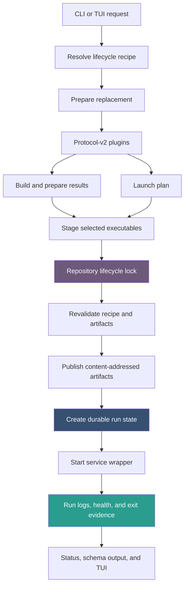
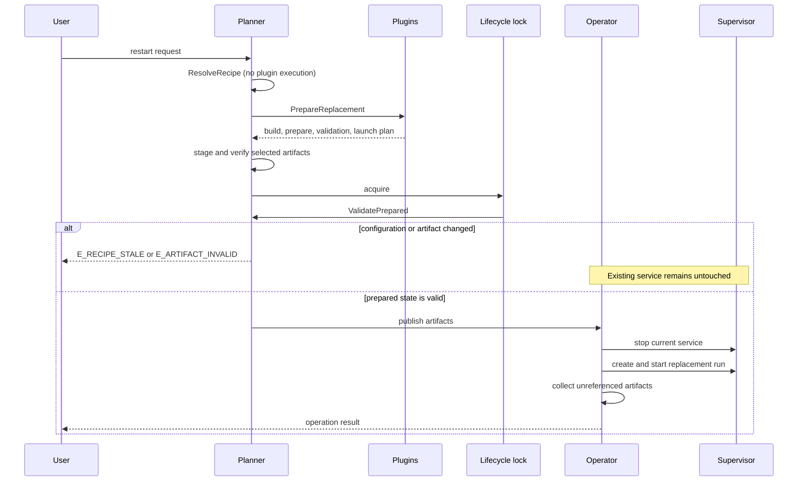
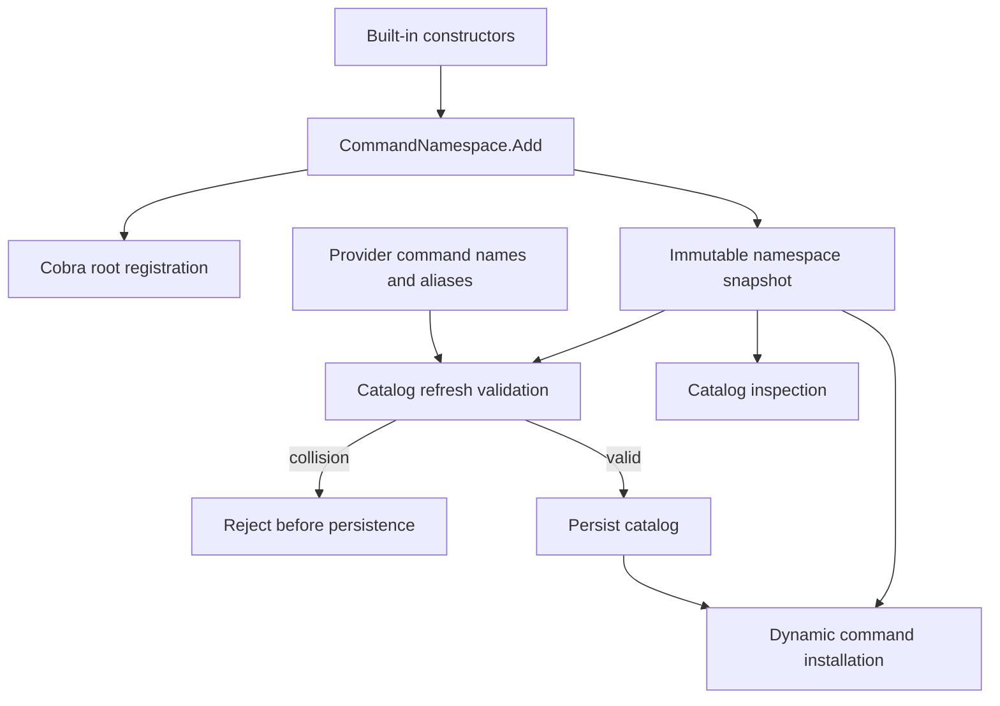

# devctl — Transactional Lifecycles, Process Ownership, and Executable Provenance

A development-environment command is correct only if its result remains meaningful after partial failure. A successful build followed by a failed restart must not destroy the previous environment. A plugin process that exits while leaving descendants behind is not fully stopped. A health check from a terminated run is historical evidence, not current health. A service launched from a mutable build path cannot be identified later by that path alone.

This report explains how `DEVCTL-ROBUST-LIFECYCLE` made those statements explicit in devctl. The work turned lifecycle execution into a staged transaction, gave plugin processes a single shutdown owner, attached cryptographic identity to build-produced executables, separated current projections from historical evidence, and tightened the CLI contracts through catalog provenance, namespace validation, and Glazed v1.4 structured output.

> [!summary]
> - Lifecycle execution now separates effect-free recipe resolution, effectful replacement preparation, and locked validation/application. A failed or stale replacement does not stop the current environment.
> - Plugin shutdown has one `Cmd.Wait` owner and a bounded EOF → TERM → KILL protocol that checks the entire process group, including adopted descendants.
> - Native service executables selected from build results are copied into a content-addressed store, recorded in run schema v2, verified before launch, and retained by current/last-run references.
> - Catalog inspection, health projection, command registration, CLI output, and migration behavior now expose precise current state without executing providers or fabricating compatibility.

The implementation is PR [#13](https://github.com/go-go-golems/devctl/pull/13), titled “Introduce service artifact provenance and enhance CLI.” At the time of this report, it contains 27 commits, changes 99 files, and adds roughly 7,000 lines including tests, embedded help, ticket evidence, a Python subprocess SDK, and a reusable session-audit skill. The size is a consequence of qualifying ownership and failure semantics across the operator, runtime, CLI, state store, TUI, and documentation rather than implementing artifact storage in isolation.

## 1. The system boundary

Devctl coordinates repository-defined development environments. Repository configuration selects plugins. Plugins mutate configuration, build outputs, perform finite preparation, validate prerequisites, and return service launch plans. The operator creates durable run records and delegates service process ownership to wrappers. CLI and TUI commands project that state for users and automation.

These responsibilities form four planes:

1. **Planning** resolves repository policy into phase intent and launch facts.
2. **Lifecycle control** serializes state changes and decides whether to preserve or replace current service ownership.
3. **Execution ownership** starts processes, captures output, proves readiness or exit, and performs bounded shutdown.
4. **Evidence and presentation** retain run history while deriving truthful current status.



The central rule is that plugins compute intent while devctl owns long-running processes and durable lifecycle state. A plugin may execute a bounded build or migration command, but it does not daemonize services, maintain service PID files, or implement a restart loop. A service belongs in `launch.plan`; devctl creates and supervises it.

This ownership boundary matters because two independent supervisors cannot produce one authoritative answer. If a plugin and devctl both record PIDs, capture logs, or restart a process, neither state record alone proves what is running. The durable operator model removes that ambiguity.

## 2. Why the original lifecycle needed staging

A restart combines two operations with different risk profiles:

- preparation may fail because configuration is invalid, a plugin cannot start, a build fails, validation rejects the environment, or an artifact is missing;
- replacement mutates ownership by stopping the current service and installing a new run.

If those operations are interleaved, preparation failure can occur after the old environment has already been stopped. The resulting outage is not required by the user's request; it is created by command ordering.

The corrected lifecycle has three explicit values and stages:

```go
type Planner interface {
    ResolveRecipe(context.Context, string, UpRequest) (LifecycleRecipe, error)
    PrepareReplacement(context.Context, LifecycleRecipe) (PreparedLaunch, error)
    ValidatePrepared(context.Context, PreparedLaunch) error
}
```

A `LifecycleRecipe` describes what should be evaluated. It includes the selected profile, service selection, enabled or skipped phases, policy, and a SHA-256 fingerprint of the resolved repository configuration. Resolution reads configuration but does not start plugins or execute phases.

A `PreparedLaunch` contains the facts produced by executing that recipe: the launch plan, retained build and prepare results, selected artifact records, and the repository fingerprint against which those facts were prepared.

Application takes the repository lifecycle lock, validates the prepared value against current configuration, publishes immutable artifacts, updates run state, and starts wrappers. Restart stops the old environment only after validation and publication prerequisites succeed.



### 2.1 Configuration staleness is an apply error

Preparation deliberately runs outside the lifecycle lock. Builds and plugin calls may take seconds or minutes; holding the lock would block an explicit `down` or another operator action for the full duration. That choice creates a concurrency interval in which repository configuration can change.

The implementation does not silently replan under the lock. `ResolveRecipe` computes a canonical fingerprint over the recipe schema version, selected profile, and merged repository configuration. `PrepareReplacement` checks it before doing work. `ValidatePrepared` recomputes it after taking the lock:

```go
if fingerprint != prepared.RepositoryFingerprint ||
   fingerprint != prepared.Recipe.RepositoryFingerprint {
    return staleRecipeError(prepared.Recipe.ID)
}
```

A mismatch returns `E_RECIPE_STALE` before restart stops any service. The caller must resolve and prepare again. This preserves a comprehensible contract: the applied result is the result that was inspected and prepared, not a different plan computed inside a critical section.

### 2.2 Timeout semantics remain explicit

`--timeout` remains a fresh per-phase budget. Configuration mutation, build, preparation, validation, and launch planning each receive a child context with the configured duration. The caller's context is still an overall upper bound if it contains a deadline or is cancelled.

This avoided an incompatible semantic change in which the same flag would become one shrinking budget for the entire lifecycle. A future operation-wide deadline needs a different name and field. The Python subprocess runner has its own one-budget-per-request contract; that does not redefine operator phase timing.

### 2.3 Explain is resolution, not simulation

`devctl up --explain` and `devctl restart SERVICE --explain` expose the resolved recipe without starting plugins. Their output lists phase order, enabled and skipped phases, selected steps, and facts that remain unresolved until preparation.

This distinction is important. A dry-run may execute planning dependencies depending on the public command contract; explain is explicitly effect-free. The implementation includes marker tests proving that recipe explanation does not launch provider processes.

## 3. Process ownership and bounded plugin shutdown

The plugin runtime is an NDJSON request/response system over subprocess pipes. Its shutdown problem is more demanding than calling `Process.Kill`: stdout and stderr consumers may still be active, responses may still be routed, descendants may outlive the leader, and more than one caller may invoke `Close` concurrently.

The implementation establishes one `processLifetime` owner for every plugin subprocess. That owner alone calls `Cmd.Wait`. Other goroutines observe its `done` channel and shutdown result.

### 3.1 Pipe readers complete before `Cmd.Wait`

Go's `StdoutPipe` and `StderrPipe` contract makes ordering significant. `Cmd.Wait` closes the pipes after observing process exit. If it runs before reader goroutines consume the final frames, a fast-exiting plugin can lose its final response or produce a closed-file error.

The lifetime owner therefore accepts reader completion channels:

```go
func (l *processLifetime) startWaitAfter(readers ...<-chan struct{}) {
    l.waitOnce.Do(func() {
        go func() {
            for _, readerDone := range readers {
                <-readerDone
            }
            err := l.cmd.Wait()
            l.exit = processExit{err: err, exitCode: processExitCode(err)}
            close(l.done)
        }()
    })
}
```

The process can already have exited while readers drain buffered bytes. Reaping waits for the consumers because final protocol frames are part of the operation result. Tests include a plugin that exits immediately after its final response.

### 3.2 Shutdown is an escalation protocol

The shutdown owner performs three bounded steps:

1. Close plugin stdin and allow an EOF grace period.
2. Send `SIGTERM` to the plugin process group and allow a signal grace period.
3. Send `SIGKILL` to the process group and require confirmed disappearance.

The result records whether shutdown completed by EOF, TERM, KILL, or remained unconfirmed. The sequence is guarded by `sync.Once`, so concurrent `Close` calls do not create competing signals or waiters.

```go
closeInput()
if wait(eofGrace) {
    mode = ShutdownEOF
    return
}
signalGroup(SIGTERM)
if wait(signalGrace) {
    mode = ShutdownTerminated
    return
}
signalGroup(SIGKILL)
if wait(signalGrace) {
    mode = ShutdownKilled
    return
}
mode = ShutdownUnconfirmed
```

Cancellation of one caller does not abandon process cleanup. The caller can receive its context error while bounded cleanup continues under the lifetime owner. That behavior separates request latency from ownership completion.

### 3.3 Leader exit does not prove group exit

A plugin can start a descendant and then exit. Waiting only for the leader would report success while the descendant remains alive. Devctl records the process group ID and tests group existence with signal zero. Shutdown completes only when the leader has been reaped and the process group no longer exists.

Linux adds another requirement. An orphaned descendant may become a zombie adopted by PID 1, and container PID 1 may not reap it promptly. A zombie still occupies the process-group identity checked by `kill(-pgid, 0)`. Both the Go runtime and Python runner enable child-subreaper behavior, then perform nonblocking, group-scoped `wait4`/`waitpid` calls after the leader exits. They reap only adopted descendants from the owned plugin group, avoiding competition with the goroutine responsible for the leader's `Cmd.Wait`.

The qualification matrix covers:

- clean EOF exit without TERM;
- TERM escalation when EOF is ignored;
- KILL escalation when TERM is ignored;
- descendants that survive leader exit;
- immediate final-response exit;
- concurrent `Close` calls;
- cancellation during close;
- repeated race-detector execution.

### 3.4 Stream delivery must not block shutdown

A later review exposed a separate ownership interaction. A plugin can publish a stream faster than a client consumes it. If routing holds a mutex while sending to a full subscription channel, the stdout reader blocks. Since `Cmd.Wait` correctly waits for readers, process shutdown then waits forever for a reader that cannot progress.

The router now has a stop channel independent of its main mutex. Shutdown closes that channel, blocked stream sends select the stop case, release routing state, and allow `failAll` to close subscriptions. A regression publishes 1,000 events into an abandoned stream and verifies bounded shutdown.

The lesson is precise: waiting for pipe consumers is correct only if cancellation can release every consumer-side blocking operation.

## 4. A supported bounded subprocess runner for plugins

Plugins often need to invoke build tools or finite preparation commands. Ad hoc `subprocess.run(..., timeout=...)` calls do not provide one shared deadline across lookup, spawn, output collection, termination, and descendant cleanup. They also encourage each plugin to invent different output and cancellation behavior.

`sdk/python/devctl_runner.py` is a standalone, standard-library-only reference implementation. It uses one monotonic `Budget` for a request, captures bounded output, supports dry-run, reports missing executables deterministically, starts a process group, and performs TERM/KILL cleanup for the group. On Linux it also becomes a subreaper and reaps adopted descendants.

A single budget answers one question: how much request time remains now? Every blocking operation derives its timeout from the same monotonic deadline. This prevents sequential cleanup stages from each consuming the full original timeout.

The runner is intentionally an SDK helper rather than a new declarative execution protocol. Plugin authors can use it without requiring devctl core to understand every tool invocation. Six tests cover normal execution, timeout behavior, output bounds, dry-run, missing executables, cancellation, and descendant removal.

## 5. Executable artifact provenance

A service command such as `build/bin/api` identifies a filesystem name. It does not identify the bytes read by `execve`. A subsequent build can replace the path while a run record still points to it. After a failure, the operator cannot determine whether the file currently at that path is the executable used by the run.

The first provenance implementation deliberately covers one narrow case: a native executable produced by build or prepare and selected explicitly by a service launch plan. It excludes scripts interpreted by another executable, container images, shared libraries, plugin binaries, and arbitrary asset trees.

### 5.1 The plan selects an artifact by ID

Build and prepare responses return named artifact paths:

```json
{
  "artifacts": {
    "api-server": "build/bin/api-server"
  }
}
```

A service chooses one artifact and supplies arguments:

```json
{
  "name": "api",
  "executable": {
    "artifact_id": "api-server",
    "args": ["--port", "8080"]
  }
}
```

A service declares either `command` or `executable`, never both. The artifact ID must use the accepted grammar and must exist in the merged build/prepare result. Dry-run validates those declarations and intended paths but does not read, hash, stage, or rewrite bytes.

### 5.2 Preparation captures bytes before replacement

For a real apply, preparation opens the selected executable, verifies that it is regular and executable, copies it into recipe-owned staging, and computes SHA-256 and byte size during the copy. The prepared plan now refers to a staged identity rather than a mutable build location.

The run-state record is compact:

```go
type ArtifactRecord struct {
    ID        string `json:"id"`
    Path      string `json:"path"`
    SHA256    string `json:"sha256"`
    SizeBytes int64  `json:"size_bytes"`
}
```

This answers which named output was selected, where its content-addressed copy was published, what its digest was, and how many bytes were verified.

### 5.3 Publication is content-addressed and locked

Application validates staged identity again, then publishes the executable beneath:

```text
.devctl/artifacts/sha256/<digest>/executable
```

Identical bytes converge on the same destination. Concurrent preparations use separate staging paths, so one operation cannot overwrite another operation's candidate. Once the lifecycle lock is held, publication either atomically installs the staged file or verifies and reuses an existing object with the same digest and size.

The selected content-addressed path is written into the run record before wrapper launch. The supervisor performs one final verification before starting the process. Corruption between preparation and apply returns `E_ARTIFACT_INVALID` without stopping the current service; corruption after publication prevents wrapper launch and marks the attempted run failed.


### 5.4 Retention follows authoritative references

Artifact garbage collection protects the digest referenced by every service's current run and immediately previous run. Other valid digest directories are removed. Historical run records remain, including artifact ID and digest, but an older record does not promise that its executable bytes remain available.

```text
protected = {}
for each service slot:
    for run_id in [current_run_id, last_run_id]:
        run = load and validate run(run_id)
        if run.artifact exists:
            protected.add(run.artifact.sha256)

for each valid digest directory:
    if digest not in protected:
        remove directory
```

The bound is simple:

```text
protected distinct digests <= 2 × known services
```

Deduplication can reduce the count. Malformed names and symlink entries are ignored. If authoritative environment or run state cannot be read, collection deletes nothing.

This design intentionally omits leases, quotas, pinning, quarantine, manifests, configurable age windows, and a background collector. Those mechanisms would solve requirements that the project does not currently have. If longer executable retention becomes necessary, the extension point is the protected-reference calculation.

### 5.5 Schema v2 is a clean compatibility cut

Artifact provenance changes the meaning of a run record, so `RunSchemaVersion` advanced to 2. Version-1 records are rejected; devctl does not fabricate missing provenance or add a compatibility reader.

A final review found that a version-2 environment could retain a version-1 `LastRunID`. If that record was first loaded during post-start garbage collection, `up` could start a service and then report partial failure. The correction preserved the clean-cut policy while moving validation earlier: `up` and `restart` load every current/last retention reference under the lifecycle lock before artifact publication, stop, or start. Legacy state now yields `E_STATE_CORRUPT` before mutation.

The migration guide is explicit:

1. Use the older binary to inspect and stop the environment.
2. Confirm that recorded processes have exited.
3. Archive `.devctl` elsewhere if its logs or evidence are needed.
4. Remove the repository-local `.devctl` directory.
5. Run the current binary and let it create fresh v2 state.

This is not automatic migration. It is a fail-fast incompatible schema with a documented operator procedure.

## 6. Truthful state and health projection

Durable records preserve observations after a run terminates. Presentation must not confuse retention with current truth.

A failed service may contain a successful health check from an earlier point in the same run. Rendering that stored boolean as current “healthy” is incorrect because the process is no longer running. Deleting the check would also be incorrect because it is useful evidence.

`runstate.ProjectHealth` derives a current state while retaining the last observation:

```go
type HealthView struct {
    Current HealthState   `json:"current"`
    Last    *HealthResult `json:"last,omitempty"`
}

func ProjectHealth(phase RunPhase, last *HealthResult) HealthView {
    view := HealthView{Current: HealthUnknown, Last: last}
    switch phase {
    case RunExited, RunFailed:
        view.Current = HealthNotRunning
    case RunReady:
        if last != nil && last.Healthy {
            view.Current = HealthHealthy
        } else if last != nil {
            view.Current = HealthUnhealthy
        }
    }
    return view
}
```

CLI structured status, human status, and the TUI use the same projection. Terminal attempts report `not_running`; planned, starting, stopping, and unknown phases do not claim health; ready runs project the last check as healthy or unhealthy. The original `HealthResult` remains available with its timestamp and detail.

This pattern applies beyond health: an evidence field records what was observed at a time, while a projection combines evidence with current lifecycle state. Stored observations should not be relabeled as live facts merely because they remain in the record.

## 7. Catalog provenance without provider execution

Top-level plugin commands must be discoverable by help and completion without starting every provider. Devctl therefore stores a command catalog produced by explicit refresh. A cached catalog is useful only if the operator can determine what inputs produced it and whether those inputs still match the repository.

Catalog schema v2 records:

- provider name and executable identity;
- source configuration;
- explicitly declared `catalog_inputs`;
- repository-relative, symlink-resolved regular-file checks;
- SHA-256 fingerprints for those inputs;
- generated command specifications and generation time.

`plugincatalog.Inspect` computes the expected fingerprint and reads the cache without starting a plugin:

```go
func Inspect(repo *repository.Repository, reserved map[string]bool) (Inspection, error) {
    expected, err := Fingerprint(repo)
    // Read cache, decode it, and validate fingerprint and conflicts.
    // Return missing, stale, valid, or conflicted with a next action.
}
```

The states are operational, not merely descriptive:

| State | Meaning | Action |
|---|---|---|
| `missing` | No catalog exists. | Run `devctl plugins refresh`. |
| `stale` | Configuration, provider identity, schema, or declared input fingerprint differs. | Refresh explicitly. |
| `valid` | Stored provenance matches current inputs. | No action. |
| `conflicted` | A dynamic command collides with the host namespace or another command. | Resolve names and refresh. |

Old catalog schemas are invalidated rather than adapted. Explicit refresh is the compatibility mechanism because catalog production is safe and deterministic.

## 8. The command namespace is one policy object

Catalog validation originally relied on a manually maintained list of built-in command names. Cobra registration was a separate source of truth. Adding the `schema` command updated Cobra but not the reserved list, allowing refresh to accept a plugin command that dynamic installation later rejected.

The correction introduced `CommandNamespace`, a small symbol registry for one Cobra parent's immediate children:

```go
func (n *CommandNamespace) Add(parent, command *cobra.Command) error {
    for _, name := range commandNames(command) {
        if n.Contains(name) {
            return fmt.Errorf("command namespace collision: %q is already reserved", name)
        }
    }
    n.Reserve(command)
    parent.AddCommand(command)
    return nil
}
```

Built-in registration, aliases, catalog refresh, inspection, static fallback, explicit plugin execution, and dynamic bootstrap all use this policy. Catalog APIs receive a copied snapshot, so they cannot mutate registry state. `RootCommandNamespace` can discover commands from a completed Cobra root and reserves Cobra's lazily materialized `help` and `completion` names.



Cobra remains responsible for command rendering and execution. It is not the policy authority for extension-name collisions. The same design can govern any extensible symbol set—routes, event names, schema IDs, or capabilities—when producers and consumers must agree on one namespace. The requirement is not a specific data structure; it is a single registration and validation boundary.

## 9. Glazed v1.4 and executable CLI contracts

The CLI migration removed a private legacy output bridge and adopted current Glazed APIs directly:

- commands use `cli.BuildCobraCommandFromCommand` and current dual-mode options;
- structured output uses `--format` rather than the removed output path;
- streaming commands request JSONL explicitly;
- constructor errors propagate instead of being discarded;
- command output honors `cmd.OutOrStdout`, which keeps tests and embedding correct.

A defect found during this work existed in Glazed itself: when command execution emitted rows and then returned an error, structured output was not always closed and flushed. The Glazed fix preserves emitted rows, closes the processor, and joins execution and close errors. It was contributed and merged upstream as Glazed PR #632.

Devctl added built-executable contracts for `devctl schema`, raw help export, structured status, logs, streams, artifact provenance, and phase ordering. These tests execute the command surface rather than proving only that internal constructors compile.

The migration also exposed CI isolation. The workspace contained a Glazed revision with v1.4 changes, but devctl's module file still declared v1.2.5. Local workspace builds passed while `GOWORK=off` CI failed. The required Glazed revision and Go 1.26 dependencies were pinned so the repository builds independently. The lint workflow was then updated to a Go 1.26-compatible golangci-lint release.

The resulting rule is straightforward: workspace qualification verifies active multi-repository development, while `GOWORK=off` qualification verifies the dependency contract that CI and downstream users receive. Both are necessary when a change spans repositories.

## 10. Review findings that changed the design

The review process did more than identify local defects. Several findings exposed missing invariants.

### 10.1 Waiting and pipe consumption

The first runtime implementation centralized `Cmd.Wait`, but immediate process exit showed that ownership alone was insufficient. The owner must wait after pipe consumers complete. The implementation and tests were changed accordingly.

### 10.2 Descendant zombies

Process-group signaling handled live descendants but did not guarantee disappearance in containers where PID 1 failed to reap adopted children promptly. Child-subreaper behavior and group-scoped reaping made shutdown completion observable and bounded.

### 10.3 Dry-run side effects

Initial artifact preparation read and staged executable bytes even during dry-run. This violated the command contract. Dry-run now validates declarations, IDs, launch-form exclusivity, and intended paths without requiring output files or creating `.devctl` state.

### 10.4 Error-code preservation

Preparation-time artifact failures were initially wrapped as configuration failures. The operator now preserves `E_ARTIFACT_INVALID`, allowing automation to distinguish an invalid executable from invalid repository configuration.

### 10.5 TUI projection drift

The TUI computed health independently and displayed stale historical checks as current. It now uses the same `ProjectHealth` function as CLI status. A canonical projection should be shared, not duplicated by each presentation layer.

### 10.6 Namespace list drift

The missing `schema` reservation demonstrated that parallel static lists are not reliable. The fix replaced the list with an authoritative namespace abstraction rather than appending one more string.

### 10.7 Abandoned stream deadlock

Correctly delaying `Cmd.Wait` revealed that a blocked router could prevent readers from completing. The shutdown path gained a lock-independent cancellation signal and high-volume abandoned-stream regression coverage.

### 10.8 Legacy state after successful start

Strict schema rejection was correct, but validation occurred too late for retained `LastRunID` references. The fix retained strict rejection and moved it before lifecycle mutation. Compatibility policy and failure ordering are separate design questions; a clean cut still requires fail-fast behavior.

## 11. Qualification as part of the architecture

The implementation was qualified through focused behavioral tests and broad repository checks. Important boundaries have dedicated fixtures rather than relying on one end-to-end success case.

| Boundary | Evidence |
|---|---|
| Resolve is effect-free | Provider marker remains absent during explain/recipe tests. |
| Prepare precedes stop | Build and prepare failures leave the old run active. |
| Stale apply is rejected | Fingerprint change produces `E_RECIPE_STALE` before stop. |
| Artifact identity is immutable | Staged and published corruption tests prevent apply or launch. |
| Artifact storage is bounded | Current/last objects survive; unreferenced digests are removed. |
| Plugin shutdown is owned | EOF, TERM, KILL, immediate exit, descendants, cancellation, and concurrent close are tested. |
| Catalog inspection is passive | Missing/stale/conflicted/valid inspection never executes providers. |
| Health is current | CLI and TUI project terminal runs as `not_running` while retaining observations. |
| Namespace policy is shared | Built-in names and aliases reject plugin collisions during refresh. |
| Legacy state fails before mutation | A v2 slot referencing a v1 last run does not invoke the supervisor. |

The main qualification commands included:

```bash
GOWORK=off go test ./... -count=1
go test -race ./pkg/operator ./pkg/runtime ./pkg/plugincatalog \
  ./pkg/runstate ./pkg/supervise ./pkg/tui
golangci-lint run -v
go vet ./...
go build ./...
PYTHONDONTWRITEBYTECODE=1 python3 sdk/python/test_devctl_runner.py -v
docmgr doctor --ticket DEVCTL-ROBUST-LIFECYCLE --stale-after 30
```

One pre-push run also exposed a tooling race: the hook ran golangci-lint and GoReleaser concurrently, while GoReleaser's `--clean` removed a `dist` directory that lint was traversing. Lint had passed immediately before, release and tests passed, and independent lint passed again. The push used that evidence rather than treating an orchestration race as a source failure. The incident remains recorded in the ticket diary because validation infrastructure is part of reproducibility.

## 12. Files that define the implementation

The report is not a file-by-file changelog, but several paths form the shortest review route:

| Concern | Primary files |
|---|---|
| Recipe, preparation, fingerprinting | `pkg/operator/planner.go` |
| Locked apply, restart ordering, fail-fast state checks | `pkg/operator/controller.go` |
| Artifact staging, publication, and collection | `pkg/operator/artifacts.go` |
| Artifact inspection and persisted schema | `pkg/runstate/artifact.go`, `pkg/runstate/schema.go` |
| Wrapper launch verification | `pkg/supervise/supervisor.go` |
| Plugin process lifetime | `pkg/runtime/process_lifetime.go` |
| Linux descendant reaping | `pkg/runtime/process_reaper_linux.go` |
| Cancelable stream routing | `pkg/runtime/router.go` |
| Catalog state and provenance | `pkg/plugincatalog/catalog.go`, `inspection.go` |
| Root command namespace | `cmd/devctl/cmds/command_namespace.go` |
| Canonical health projection | `pkg/runstate/health.go` |
| Python bounded execution | `sdk/python/devctl_runner.py` |
| Operator and plugin help | `pkg/doc/topics/` |

The complete reasoning and evidence live in the docmgr ticket at:

```text
/home/manuel/workspaces/2026-09-13/devctl-improve/devctl/
  ttmp/2026/09/13/
  DEVCTL-ROBUST-LIFECYCLE--explicit-lifecycle-plans-safe-plugin-execution-and-artifact-provenance/
```

Its investigation diary records implementation steps and failures; the qualification matrix maps requirements to fixtures and revisions; the artifact-retention and namespace documents preserve the narrow design decisions.

## 13. Engineering rules preserved by this work

The implementation supports a compact set of reusable rules:

- Resolve intent without effects when users or automation need inspection.
- Prepare replacement facts before mutating current ownership.
- Revalidate prepared facts inside the lock that protects application.
- Give each subprocess exactly one wait and shutdown owner.
- Treat process-group disappearance, not leader exit, as shutdown completion when descendants are possible.
- Ensure every blocked reader or publisher has a shutdown cancellation path.
- Store evidence as observations and derive current truth through canonical projections.
- Identify launched mutable outputs by content, not by source path.
- Keep retention proportional to authoritative references when richer policy is unnecessary.
- Make incompatible schemas fail before mutation and provide a direct migration procedure.
- Use one namespace registry for host and extension symbols.
- Inspect caches without executing providers, and make freshness depend on declared provenance.
- Qualify both workspace integration and isolated module dependency contracts.
- Preserve machine-readable error codes across abstraction boundaries.

## 14. Current status and next steps

The ticket implementation is complete and its docmgr tasks are closed. PR #13 is open and mergeable, with the final review correction at commit `bc78963`. CI was running when this report was authored.

The remaining immediate work is operational:

1. Confirm the final CI and review results.
2. Merge PR #13 after all required checks pass.
3. Exercise the migration guide against representative repositories with existing plugins.
4. Preserve the intentionally narrow artifact scope unless a concrete requirement justifies scripts, containers, or multi-file runtime closures.

Several extensions are possible but are not implied requirements. A separately named overall operation deadline could complement per-phase timeout. Longer artifact retention could extend the protected-reference set. Nested plugin command trees could instantiate one namespace per Cobra parent. None of these require weakening the current ownership or transaction boundaries.

## Conclusion

`DEVCTL-ROBUST-LIFECYCLE` changed the unit of correctness from “the command returned” to “the operator can prove what it prepared, what it launched, what remains running, and what happened when cleanup was required.” That proof depends on ordering and ownership: prepare before stop, validate under lock, wait in one place, cancel every blocked path, record immutable executable identity, and project current state separately from historical observations.

The result is a lifecycle implementation whose failure cases are explicit. Stale configuration preserves the current service. Invalid artifact bytes never become an unverified launch. Abandoned streams do not prevent plugin cleanup. Retained health checks do not claim that exited processes are healthy. Old schemas fail before mutation and have a documented clean-cut upgrade. Dynamic commands cannot occupy names accepted by one subsystem and rejected by another.

Those properties are now represented in code, tests, embedded help, ticket evidence, and the shared architecture garden. They form the stable basis for future devctl features.

## Related notes

- [[devctl]]
- [[glazed]]
- [[Research/Software Architecture Garden/devctl/01 - Project Architecture Overview|devctl Project Architecture Overview]]
- [[PROJECT REPORT - devctl - Durable Operator State, Structured Logs, and Robust Dynamic Commands]]
- [[ARTICLE - devctl Service Lifecycle Controls - Start Stop Restart and the Midstream Redesign]]
- [[ARTICLE - devctl Service Restart - Replanning Service Specs Without Persisting Secrets]]
- [[ARTICLE - Session Context Audits - Evidence Models Timelines and Reusable HTML Reports]]
