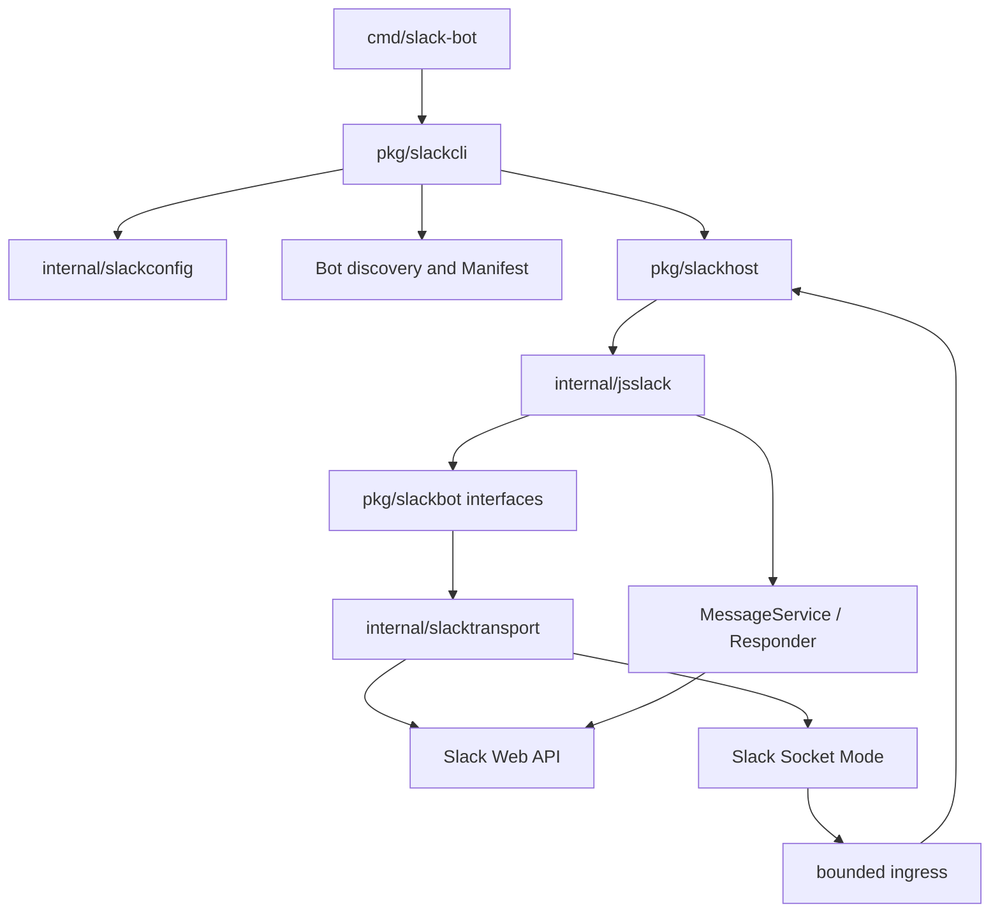
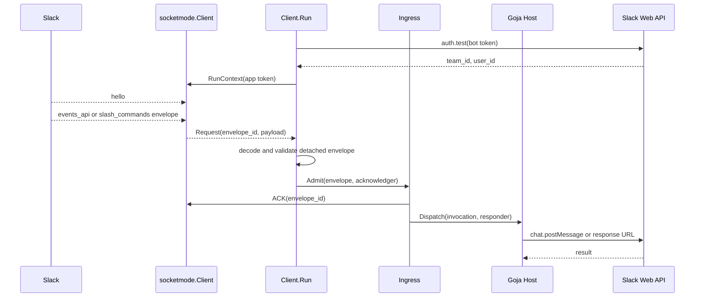

# Discord Bot Slack Support: A Deep Technical Analysis

The `discord-bot` repository now contains an independent Slack bot runtime implemented in Go and JavaScript. Go owns process lifetime, Slack authentication, Socket Mode, event acknowledgment, ingress policy, and Web API side effects. JavaScript owns bot declarations and handler behavior through `require("slack")`. The implementation supports offline inspection and simulation, local app creation and installation, private credential profiles, and a real `bots run` command for an installed workspace.

This report explains the system as it exists on 2026-09-14. It follows the path from a JavaScript file to a Slack event and then to a reply. It also documents credential lifecycle, the private Slack CLI installation endpoint, the request-shape failure that corrected it, test boundaries, and remaining work before broader deployment support.

> [!summary]
> - The runtime is a one-bot-per-process Goja host with a typed Slack JavaScript API.
> - A profile separates management credentials, app registration data, and workspace installation tokens.
> - `bots run` reuses the same Socket Mode ingress and JavaScript dispatch path for local fixtures and real Slack.
> - App installation uses Slack CLI's observed `apps.developerInstall` method for local development; documented browser OAuth is separate.

## Why this project exists

The repository originally hosted Discord bots whose Go runtime owned the Discord gateway and exposed a JavaScript registration API. Slack support needed the same development properties—declarative JavaScript bots, typed context, bounded execution, explicit configuration, and testable side effects—without translating Discord concepts into Slack terminology. Slack commands, event payloads, response URLs, timestamps, Socket Mode envelopes, and installation credentials have different semantics. The implementation uses the same architectural separation while defining Slack-specific domain types and transport behavior.

The immediate goal was a local development workflow. A developer should be able to inspect a bot without credentials, generate its manifest, create an app, install that app into a known workspace, and run the bot with one profile selection. The workflow does not require a hosted callback service, a database, background credential renewal, or cloud deployment. Manual recovery is acceptable for this scope.

## Current project status

The completed path is:

```text
JavaScript bot
  -> offline discovery and manifest generation
  -> Slack app creation
  -> local developer installation
  -> private profile storage
  -> real Socket Mode runtime
  -> JavaScript handler and Slack reply
```

The real `ping` app was created as `A0C1YJCCCP6` and installed in workspace `T0C1UJMCPGA`. Its profile is `go-go-golems`; the installation record is `go-go-golems-T0C1UJMCPGA`. The runtime was started in tmux and confirmed working through Slack interaction. Token values are stored locally and are intentionally absent from this report.

The runtime remains a local development system. It supports `app_mention` events and slash commands, but it does not provide a general OAuth callback server, distributed installation management, durable event processing, or a deployment supervisor.

## Conceptual foundation: three identities and one execution unit

A Slack bot process combines four distinct objects. Confusing them produces incorrect credential selection and incorrect event routing.

The **JavaScript bot descriptor** is produced by loading a bot entrypoint. It contains the bot name, declared configuration fields, slash commands, and event handlers. The descriptor is local data and can be inspected without network access.

The **Slack app** is a remote registration. It has an app ID and app-level configuration such as Socket Mode and event subscriptions. App-level credentials belong to this registration. The Socket Mode token is represented in the store as `AppToken`.

The **workspace installation** grants a bot token for one app in one workspace. A single app can have multiple installations, and each installation can have a different bot token. The installation record stores the workspace ID and bot token.

The **profile** is local configuration that selects one management identity, one app, and one installation. It contains names rather than copies of secrets:

```text
profile go-go-golems
  management  -> management credential pair
  app         -> app_id A0C1YJCCCP6
  installation -> workspace T0C1UJMCPGA
```

| Operation | Credential | Purpose |
|---|---|---|
| `bots create-app` | Management access token | Submit an app manifest to Slack. |
| `bots install` | Management access token | Install the app and obtain runtime tokens. |
| `auth.test` | Bot token | Verify the workspace and bot identity. |
| Socket Mode connection | App-level token | Open the event WebSocket. |
| `chat.postMessage` | Bot token | Post a channel or threaded message. |
| Slash response URL | Temporary URL capability | Send an ephemeral interaction response. |

The profile store is implemented in `internal/slackconfig/store.go`. Metadata is YAML in `config.yaml`; secrets are JSON in `credentials.json`. The directory is created with mode `0700`, files with mode `0600`, and writes use a same-directory temporary file followed by rename.

## Architecture and ownership

The composition root is `cmd/slack-bot/main.go`. It registers the `bots`, `credentials`, and `profiles` command groups. `pkg/slackcli/commands.go` resolves a bot descriptor and dispatches the selected operation. `pkg/slackhost` wraps the internal Goja host. `internal/slacktransport` adapts the Slack SDK to the domain interfaces in `pkg/slackbot`.



The ownership rule is direct: Go owns credentials and network objects; JavaScript receives detached strings, maps, and typed results. The JavaScript context cannot read environment variables, token files, response URLs, or Go SDK clients.

## From JavaScript declaration to descriptor

The example bot is `examples/slack-bots/ping/index.js`:

```javascript
const { defineBot } = require("slack");

module.exports = defineBot(({ configure, command, event }) => {
  configure({
    name: "ping",
    description: "Offline Slack runtime example",
    run: { fields: {
      greeting: { type: "string", default: "pong" }
    }}
  });

  command("/golem-ping", { description: "Check the development bot" }, async ctx => {
    return { text: ctx.config.greeting };
  });

  event("app_mention", async ctx => {
    await ctx.reply({ text: "I received your mention." });
  });
});
```

Loading is synchronous and declarative. `defineBot` registers the exported definition, `configure` establishes the descriptor, and `command`/`event` associate handlers. `internal/jsslack/host.go` creates a Goja runtime through go-go-goja, registers the native `slack` module, loads the entrypoint, validates the descriptor, and projects only declared configuration fields into `ctx.config`.

The descriptor is used in three independent paths. `bots inspect` reports it, `bots manifest` converts it to Slack app manifest data, and `bots run` uses its absolute script path to construct the runtime. This reuse prevents app creation from requesting scopes that differ from the bot's declared event and command set.

## The JavaScript handler contract

`pkg/slackbot/model.go` defines detached invocation and message types. A handler receives `id`, `teamId`, `channelId`, `userId`, `command`, `event`, `text`, `ts`, `threadTs`, and declared `config` values. It also receives `reply`, `slack.messages.post`, an in-memory JSON store, and structured logging.

The host validates text length, required IDs, event type, and timestamp presence before a handler can produce a side effect. A returned `{text}` claims the implicit reply slot. Calling `ctx.reply` claims the same slot explicitly. A second implicit reply fails with `already_replied`.

Asynchronous Go services are represented as JavaScript promises. `internal/jsslack/dispatch.go` keeps Goja ownership on one runtime owner while allowing bounded service work outside that owner. Each invocation has a 16-operation worker limit and a timeout. Host shutdown cancels the invocation lifetime and waits for the runtime to close.

## Current Slack surface and manifest development loop

The supported Slack surface is deliberately narrower than Discord's. It currently includes plain text replies, text `chat.postMessage` calls with optional thread targeting, ephemeral slash-command responses, slash commands, and `app_mention` events. There is no Slack Block Kit or UI DSL yet. Buttons, select menus, modals, Home tabs, shortcuts, message actions, attachments, files, rich-text blocks, and canvases require additional Slack-specific domain types, validation, payload encoding, and event decoding.

The existing Discord UI builders cannot be copied directly. Slack uses different JSON schemas, interaction acknowledgment rules, and lifecycle constraints. A future Slack UI package should define builders around Block Kit and interaction payloads, then expose them through a separate native module or typed host service. The first useful milestone would be one validated message builder and one button interaction path, with fixtures for both acknowledgment and follow-up responses.

Manifest development has two distinct steps. `bots manifest NAME` always regenerates a reviewable manifest from the current JavaScript descriptor. The current `slack-bot` CLI creates an app but does not update an existing app manifest. After changing commands or event subscriptions, the developer must apply the reviewed manifest through Slack CLI or the Slack app settings before running the new behavior. The management configuration token can be reused for multiple app operations that the identity is authorized to perform; bot and Socket Mode tokens remain bound to their specific app installation.

## Socket Mode event flow

`internal/slacktransport/run.go` contains the common event loop used by local and remote clients. The loop first calls `auth.test` with the bot token and compares the returned team ID with the configured installation. It then creates `slackbot.Ingress` with the configured app and workspace identity.



Acknowledgment is independent of handler completion. The acknowledgment path reports accepted, duplicate, dropped, or busy admission. For a slash command that accepts a response payload, busy admission can return an ephemeral “Bot is busy” response; accepted envelopes receive an empty acknowledgment.

`slackbot.Ingress` requires matching app and workspace IDs, drops bot-authored events and the bot's own user ID, rejects malformed invocations, deduplicates Events API deliveries by workspace and `event_id`, and bounds queue and dedupe capacity. It is best-effort in-memory admission, not a durable queue or exactly-once execution system.

## Message delivery and response URLs

Mention replies use `chat.postMessage`. `internal/slacktransport/client.go` constructs `slack.MsgOptionText` and, when present, `slack.MsgOptionTS` for the thread root. Returned channel and timestamp values remain strings; Slack timestamps are identifiers and must not become floating-point numbers.

Slash commands carry a temporary `response_url`. The transport keeps that URL in a private responder and sends an ephemeral JSON payload. Local fixtures accept only the configured loopback origin. Remote clients accept HTTPS URLs on Slack webhook hosts and reject other hosts, non-HTTPS schemes, userinfo, fragments, and empty paths. The URL is never included in the JavaScript context or logs.

## Credential lifecycle and local app installation

`pkg/slackcli/credentials.go` manages the local store. Management access and refresh tokens are imported explicitly, and refresh is explicit rather than automatic. `bots create-app --profile` submits the generated manifest with the saved management access token and saves app metadata after Slack returns an app ID.

`bots install` completes the local developer flow. Its request is based on the open-source Slack CLI implementation in `/home/manuel/code/others/slack-cli/internal/api/app.go`:

```http
POST https://slack.com/api/apps.developerInstall
Authorization: Bearer <management access token>
Content-Type: application/json

{"app_id":"A0C1YJCCCP6","bot_scopes":["chat:write","commands","app_mentions:read"],"outgoing_domains":[]}
```

The response contains `api_access_tokens.bot` and `api_access_tokens.app_level`. The command stores the bot token under `go-go-golems-T0C1UJMCPGA` and the app-level token on the app record. It emits only profile, installation, app ID, and team ID.

The endpoint is not documented as a general public Slack Web API method. It is a local convenience derived from Slack CLI behavior. A first live attempt included `team_id` and returned `invalid_argument`. Slack CLI clears that field for standalone apps; the implementation was corrected to omit it, and the corrected request succeeded.

Browser OAuth is a different workflow. It is required when other users install an app, arbitrary workspaces are supported, or public distribution is needed. That path requires client credentials, an HTTPS redirect, state validation, browser authorization, and an `oauth.v2.access` exchange. The local developer command already has a management token and known workspace, so a callback server would add a separate service without improving this setup.

## CLI workflow

The repository README and embedded `slack-offline` help topic document the sequence:

```sh
go run ./cmd/slack-bot bots list
go run ./cmd/slack-bot bots inspect ping
go run ./cmd/slack-bot bots manifest ping

go run ./cmd/slack-bot credentials import-management \
  --profile go-go-golems --management go-go-golems \
  --access-token-file /tmp/access-token.txt \
  --refresh-token-file /tmp/refresh-token.txt

go run ./cmd/slack-bot bots create-app ping --profile go-go-golems
go run ./cmd/slack-bot bots install ping --profile go-go-golems --team-id T0C1UJMCPGA
go run ./cmd/slack-bot bots run ping --profile go-go-golems --log-level debug
```

`bots run-local` remains the fixture-driven path. It requires a loopback connection file and cannot connect to Slack. The real `run` path requires an app ID, installation team ID, bot token, and Socket Mode app token in the selected profile. Optional declared settings use `--bot-config-file`.

## Testing strategy

Tests are divided by boundary:

| Boundary | Main tests | Evidence |
|---|---|---|
| Domain | `pkg/slackbot/*_test.go` | Invocation, message, and admission validation. |
| JavaScript host | `internal/jsslack/*_test.go` | Module registration, promise settlement, reply ownership, and timeouts. |
| Transport | `internal/slacktransport/*_test.go` | HTTP encoding, Socket Mode envelopes, ACK timing, dedupe, and URL guards. |
| CLI/storage | `pkg/slackcli/*_test.go`, `internal/slackconfig/*_test.go` | Profile resolution, private modes, installation persistence, and redaction. |
| Repository gate | offline wrapper | Full tests, build, vet, help, and docmgr validation. |

The install tests use an injected `http.RoundTripper`. They assert the exact endpoint, bearer header, manifest-derived scopes, omitted standalone `team_id`, response checks, and persistence separation between `bot_token` and `app_token`. No test uses a real credential or mutates Slack.

Validated commands include:

```text
04-go-offline.sh test ./...
04-go-offline.sh build -buildvcs=false ./...
04-go-offline.sh vet ./...
04-go-offline.sh run ./cmd/slack-bot bots run --help
docmgr doctor --ticket SLACK-CREDENTIALS-001
```

The full test suite passes. The offline wrapper selects the cached Go 1.26.4 toolchain and disables dependency downloads. Transport tests that bind loopback sockets require the socket-enabled execution environment.

## Failure modes and design limits

The implementation chooses explicit local behavior for the failures most likely to matter:

- Missing or conflicting profile, app, or installation fails before network use.
- A workspace or app mismatch is reported rather than silently relabeled.
- Token files are bounded and never printed.
- Ambiguous API and WebSocket outcomes are not automatically retried.
- Slack `ok:false` responses become safe error codes.
- Response URLs are host-validated before use.
- Queue overflow returns bounded `busy` admission instead of unbounded memory growth.

The project does not implement process supervision, durable event storage, multi-process locking, automatic token rotation, or generalized OAuth installation. These are deliberate scope decisions for a local bot.

## Repository documentation and code map

The operator-facing documentation is split between `README.md` and the embedded `pkg/slackdoc/slack-offline.md`. The main implementation files are:

- `cmd/slack-bot/main.go` — CLI composition root.
- `pkg/slackcli/commands.go` — Glazed command registration and dispatch.
- `pkg/slackcli/create_app.go` — manifest submission and app persistence.
- `pkg/slackcli/install_app.go` — developer installation and runtime token persistence.
- `pkg/slackcli/run_remote.go` — profile resolution and runtime construction.
- `internal/slackconfig/store.go` — YAML metadata and private JSON secrets.
- `internal/slacktransport/client.go` — local and remote SDK constructors.
- `internal/slacktransport/run.go` — auth, Socket Mode, decoding, acknowledgment, and ingress.
- `internal/jsslack/` — Goja host, module, dispatch, promises, and reply ownership.
- `examples/slack-bots/ping/index.js` — smallest complete bot.

The ticket package contains the design documents, source archives, tasks, changelog, and diary at:

`/home/manuel/workspaces/2026-09-10/add-slack-support/discord-bot/ttmp/2026/09/14/SLACK-CREDENTIALS-001--local-slack-credentials-and-app-creation/`

## Near-term next steps

1. Add a supervised live smoke procedure for one mention and one `/golem-ping` command.
2. Add startup logging for successful `auth.test` and Socket Mode connection establishment.
3. Add more Slack-specific examples such as echo, status, and store-backed configuration bots.
4. Add documented OAuth installation only if the project must support other users or arbitrary workspaces.
5. Add buttons, modals, and richer Block Kit payloads only with Slack-specific contracts and tests.

The immediate operator command is:

```sh
go run ./cmd/slack-bot bots run ping --profile go-go-golems --log-level debug
```

## Key points

- Go owns network access, token handling, acknowledgment, ingress policy, and lifecycle cancellation.
- JavaScript owns declarations and handler behavior through a narrow typed module.
- Profiles refer to management identities, apps, and installations; they do not duplicate shared secrets.
- App-level and bot tokens have different scopes and are stored against different records.
- `apps.developerInstall` matches Slack CLI's local behavior but is not a documented public installation API.
- `run-local` and `run` share ingress and dispatch contracts while using different client constructors.
- Tests establish exact wire and lifecycle behavior without requiring Slack credentials.

## References

Repository and ticket references:

- `/home/manuel/workspaces/2026-09-10/add-slack-support/discord-bot/ttmp/2026/09/10/DISCORD-SLACK-001--add-slack-support-to-discord-bot/design-doc/02-full-local-testing-plan-and-slack-mock-evaluation.md`
- `/home/manuel/workspaces/2026-09-10/add-slack-support/discord-bot/ttmp/2026/09/14/SLACK-CREDENTIALS-001--local-slack-credentials-and-app-creation/design-doc/01-pragmatic-implementation-plan.md`
- `/home/manuel/workspaces/2026-09-10/add-slack-support/discord-bot/ttmp/2026/09/14/SLACK-CREDENTIALS-001--local-slack-credentials-and-app-creation/design-doc/02-local-app-installation-with-slack-cli-developerinstall.md`
- `/home/manuel/code/others/slack-cli/internal/api/app.go`
- `/home/manuel/code/others/slack-cli/internal/pkg/apps/install.go`

Public API references:

- [Slack Socket Mode](https://docs.slack.dev/apis/events-api/using-socket-mode/)
- [Slack `apps.manifest.create`](https://api.slack.com/methods/apps.manifest.create)
- [Slack `apps.connections.open`](https://api.slack.com/methods/apps.connections.open)
- [Slack `chat.postMessage`](https://docs.slack.dev/reference/methods/chat.postMessage/)
- [Slack OAuth v2 access](https://api.slack.com/methods/oauth.v2.access)
- [Slack CLI app install](https://docs.slack.dev/tools/slack-cli/reference/commands/slack_app_install/)
