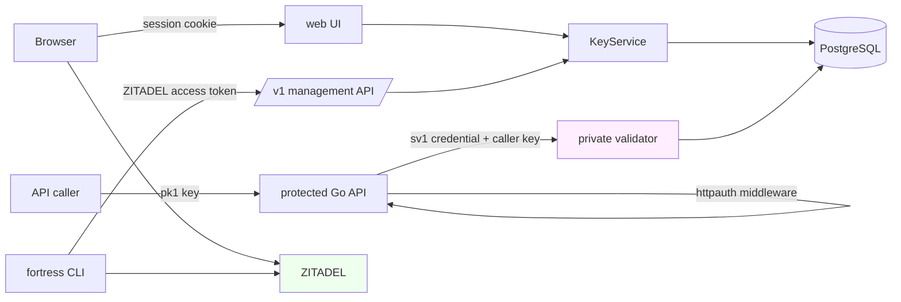
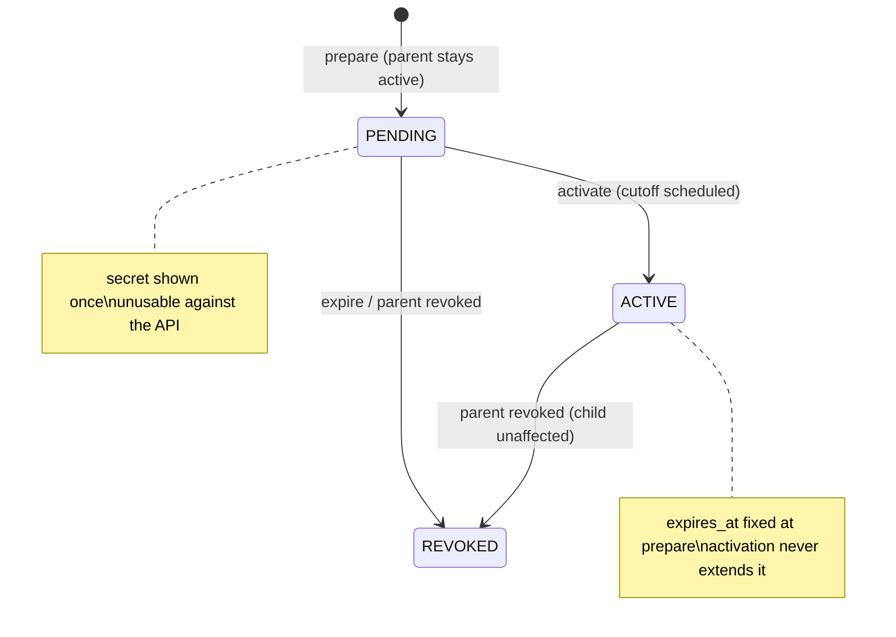

# Fortress

Fortress is a self-hosted developer portal and Go authentication toolkit. It exists so that a fleet of small, independent HTTP APIs can share one signup, one scoped-API-key system, and one per-request authentication mechanism, without each service reimplementing any of them. The implementation is driven by a complete requirements specification (the "developer portal design" document, imported byte-identical into the project's docmgr ticket workspace) and was executed milestone by milestone in a single working session, with every milestone leaving behind a ticket, an intern guide, a diary, and a commit.

> [!summary]
> The project currently has three important identities:
> 1. a developer portal per the source specification: ZITADEL-backed login, a PostgreSQL catalog of applications and memberships, scoped API keys, and a private validation endpoint consumed by protected APIs
> 2. a documentation-first workflow demonstration: an umbrella docmgr ticket with an imported source spec, a system-wide intern guide, eight milestone tickets with per-ticket guides, diaries, and seeded tasks — all written before and alongside the code they specify
> 3. a reference implementation of the hard parts of credential management: opaque high-entropy keys with domain-separated digests, reveal-once secrets, idempotent creates, and a two-phase rotation protocol whose concurrency behavior is race-tested against live PostgreSQL

## Why this project exists

The owner operates many small services with public APIs and already runs ZITADEL for identity and Argo CD with k3s for deployment. Each new API otherwise requires its own user registration, email verification, API-key storage, and bearer-token checking. The design document rejects this repetition directly: the portal owns application permissions and key state once, and each protected service imports a small middleware package and declares its route scopes.

Three properties define the security model, and every later design decision follows from them:

- **One authority per fact class.** ZITADEL is authoritative for identity (who logged in); the portal's PostgreSQL is authoritative for application permissions (what a logged-in person may delegate to a key); Git is authoritative for application definitions. No system mirrors another's facts, so no reconciliation layer exists to write or to break.
- **Three credential classes that never mix.** A portal management login (ZITADEL access token or web session cookie), a caller API key (`pk1_<id>.<secret>`), and a per-application service validation credential (`sv1_<id>.<secret>`). A key of one class is structurally rejected where another class is required.
- **Possession is not authorization.** A valid key only carries the intersection of what it was issued, what its owner's membership currently grants, and what the application's catalog currently has enabled. Narrowing any of the three narrows the key at the next validation.

## Current project status

All eight milestones (M0–M7) from the design document have been implemented and committed, each at its own boundary:

| Milestone | Commit | Delivered |
| --- | --- | --- |
| M0 foundation | `604fbbb` | module rename to `github.com/go-go-golems/fortress`, Glazed settings catalog, Docker Compose ZITADEL lab, OpenAPI draft |
| M1 storage | `83c1aaf` | 6 Goose migrations (14 tables), pure authorization functions, pgx store with lock ordering, registry parser, operator commands |
| M2 web portal | `dd98c50` | credentials package, shared KeyService, OIDC login with single-use transactions, sessions, server-rendered UI |
| M3 validation | `4ef86d8` | exported `httpauth` middleware, private validation listener, screenshots example API |
| M4 CLI and API | `e215221` | `/v1` management JSON API with fail-closed introspection, typed client SDK, `fortress` CLI with exit-code mapping |
| M5 rotation | `c1dbc2b` | two-phase rotation, idempotency records, concurrency gates, `-race` clean |
| M6+M7 delivery assets | `69900a0` | Helm charts, Terraform module, ApplicationSet, runbooks, integration guide |

Twelve Go test packages pass under `go test ./... -race`; `golangci-lint` reports zero issues; the Glazed v1.4.4 analyzer is clean. The compose lab (ZITADEL v4.17.3 and two PostgreSQL 17 instances) is running, and the live exit demonstrations were recorded per milestone: the M1 operator bootstrap and enrollment via psql, the M3 request matrix (201/403/200/401/503) through the real validator, the M4 fail-closed CLI demo, and the M5 exactly-one-winner rotation race.

Work that remains open is recorded honestly in the milestone ticket task lists: provisioning the portal project and clients inside the compose ZITADEL (which unblocks interactive login, the device-flow decision, and the management client allowlist), the keyring-profile and PKCE login commands, the web rotation screens, the real-cluster Argo CD walkthrough, the optional embeddable CLI package, and the recorded acceptance walkthrough. A final in-progress item: running the portal server itself inside compose (an `app` profile was added to the compose file) is blocked on container-to-host-gateway connectivity to the ZITADEL issuer, which was being debugged when this report was written.

## Project shape

The repository at `/home/manuel/workspaces/2026-09-15/fortress-initial/fortress` is a single Go module. The workspace also contains a checkout of the Glazed framework at v1.4.4, joined via `go.work`, which is how the settings catalog stays aligned with the framework's actual API.

- `cmd/fortress-server` — the server binary: `serve`, `migrate`, `bootstrap-admin`, `registry apply`, `service-credentials issue`
- `cmd/fortress` — the CLI: `apps`, `scopes`, `keys` (create/list/inspect/revoke/rotate/activate), `auth whoami`
- `pkg/cli-sections`, `pkg/serverconfig` — the Glazed settings catalog and whole-config validation
- `internal/store` — pgx repositories, migrations, transaction helpers, lock ordering
- `internal/authorization` — pure scope-set and role functions
- `internal/credentials` — key generation, digests, parsing, constant-time verification
- `internal/identity` — OIDC login transactions, sessions, introspection
- `internal/service` — the shared KeyService and rotation policy behind web, JSON and CLI
- `internal/api`, `internal/web`, `internal/validator`, `internal/server` — management API, UI, private validation listener, two-listener runtime
- `httpauth`, `client` — the exported packages protected APIs and operators import
- `migrations/`, `deploy/` (compose, Helm, Terraform, Argo CD), `docs/`, `examples/screenshots/`
- `ttmp/2026/09/15/` — the docmgr ticket workspace: the `fortress-portal` umbrella (source spec, system-wide intern guide, roadmap, session diary) and the eight milestone tickets with guides, tasks, and implementation diaries

## Architecture

The runtime has one codebase and two HTTP listeners. The public listener serves login, the web UI, and the `/v1` management API. The private listener serves exactly one route, `POST /internal/v1/validate`, accepts only service credentials, and is never exposed through public ingress.



The validation request path carries the design's most consequential rule. A protected API returns `401` to its caller only when the caller's credential is missing or validator-authoritatively inactive. When the validator itself is unreachable, misconfigured, returns a decision for the wrong application, or rejects the API's own service credential, the protected API returns `503`, because the failure belongs to the API's dependencies, not to the caller.

| Connection | Authentication |
| --- | --- |
| Browser → portal | opaque session cookie, `__Host-` prefixed, digest stored server-side |
| CLI → portal | ZITADEL access token, introspected fail-closed at the issuer |
| Caller → protected API | `pk1` API key |
| Protected API → validator | `sv1` service credential over TLS |

Effective permissions for a key are computed, never stored:

```
effective_scopes = key.issued_scopes
                 ∩ owner.current_app_scopes
                 ∩ app.enabled_scopes
```

A membership role change therefore takes effect at the next validation without touching the key row, and a narrowed role can never be repaired into a widening by restoring the role later: only scopes inside the key's original issued ceiling can come back.

## Implementation details

### Configuration as Glazed sections

Every setting in fortress — server and CLI — is a field in a Glazed section, per the owner instruction to use the framework for all settings. A section is a declarative group of typed field definitions; mounting it on a command renders the fields as Cobra flags with help text, defaults, and secret redaction, and the same definitions drive config-file and environment layers in deployment.

```go
func NewDatabaseSection() (schema.Section, error) {
    return schema.NewSection("database", "Database", schema.WithPrefix("database-"),
        schema.WithFields(
            fields.New("host", fields.TypeString, fields.WithDefault("localhost")),
            fields.New("password", fields.TypeSecret, fields.WithHelp("Database password")),
            ...
        ),
    )
}
```

The `serve` command is a `cmds.BareCommand` (a long-running process with no structured output) that mounts seven server sections; `FromValues` in `pkg/serverconfig` decodes them once into a `Config`, and `Validate` enforces the cross-field contract the sections cannot express: an `http://` issuer is allowed only for loopback hosts, the private listener requires both TLS files, the session cookie must carry the `__Host-` prefix, the cache TTL cannot exceed fifteen seconds, and application lifetimes must satisfy default ≤ maximum. Handlers never re-check raw flags.

Two field-type semantics matter and were learned the hard way. `TypeSecret` redacts the value wherever Glazed renders it, which is how database passwords and OAuth client secrets stay out of help output. `TypeFile` reads the file at parse time and delivers its content as the value; it is the correct type for key material (the session encryption key, validator credentials, CA bundles) and the wrong type for path-valued flags — the registry `--file` flag initially used it and tried to `os.ReadFile` the YAML content as a filename.

### The data model and its invariants

Six Goose migrations create fourteen tables. Three constraints do most of the correctness work:

1. `api_keys.secret_digest bytea CHECK (octet_length(secret_digest) = 32)` — digests are fixed-width SHA-256 outputs.
2. `api_keys FOREIGN KEY (app_id, principal_id) REFERENCES memberships(app_id, principal_id)` — a key cannot exist without its owner's membership row, so revocation-by-membership is a single transactional `UPDATE`.
3. A partial unique index enforcing one live rotation child per parent:

```sql
CREATE UNIQUE INDEX one_live_rotation_child_per_parent
  ON api_keys (rotates_key_id)
  WHERE rotates_key_id IS NOT NULL
    AND state IN ('pending', 'active');
```

The strict form (no `revokes_at IS NULL` escape) means an activated child also blocks a second replacement of an already-retiring parent; the database backs the service-layer rule rather than merely approximating it.

All write paths take row locks in one order — principal, app, membership, key — and perform no network I/O while holding locks. The introspection call to ZITADEL happens before the transaction opens; the portal's own status is then checked inside it. The validation read itself is a single statement, so no decision can combine snapshots from different moments:

```sql
SELECT k.secret_digest, k.state, k.expires_at, k.revokes_at, k.pending_until,
       k.principal_id, p.status, m.status, a.status,
       ARRAY(SELECT scope FROM api_key_scopes WHERE key_id = k.id) AS issued,
       ARRAY(SELECT rs.scope FROM membership_roles mr
             JOIN role_scopes rs ON rs.app_id = mr.app_id AND rs.role_id = mr.role_id
             WHERE mr.app_id = k.app_id AND mr.principal_id = k.principal_id) AS owner_scopes,
       ARRAY(SELECT sc.scope FROM app_scopes sc
             WHERE sc.app_id = k.app_id AND sc.enabled) AS app_enabled
FROM api_keys k
JOIN principals p ON p.id = k.principal_id
JOIN memberships m ON m.app_id = k.app_id AND m.principal_id = k.principal_id
JOIN apps a ON a.id = k.app_id
WHERE k.id = $1 AND k.app_id = $2;
```

Registry reconciliation follows a retire-don't-delete rule discovered by a live failure: re-applying a catalog definition originally deleted the `roles` rows, which violated the `membership_roles` foreign key as soon as any membership referenced a role. The apply now replaces role scopes only for roles present in the new definition and deletes only roles with no remaining membership references. Removed scopes are disabled rather than deleted; disabled scopes are excluded from the effective-scope intersection, so historical keys keep their metadata while losing their effect.

### Credential format and hashing

A credential is `pk1_<uuid>.<secret>` or `sv1_<uuid>.<secret>`, where the secret is 32 cryptographically random bytes in unpadded base64url. The stored digest is:

```
SHA256(class || 0x00 || canonical-uuid || 0x00 || secret)
```

The class prefix and the zero-byte separators are domain separation: identical id and secret material produce different digests for `pk1` and `sv1`, so a service validation credential can never be accepted as a caller key even if the validator's class check were somehow bypassed. Parsing enforces canonical encodings — an uppercase UUID is rejected rather than normalized, because the digest must always be computed over one representation. Verification compares the recomputed digest with the stored one using `subtle.ConstantTimeCompare` after a single digest-keyed lookup.

Fast hashing is correct here because the secret is high-entropy random material; a database compromise exposes authorization state but yields no reusable secret. The system stores no passwords, so no deliberately expensive password hash is needed anywhere.

Secrets are revealed exactly once, at creation or rotation, with `Cache-Control: no-store` on the response. No endpoint ever returns one again; lists and inspection return metadata only. Create and rotate accept an `Idempotency-Key`; a repeated identical request returns `409 secret_not_replayable` carrying the existing key ID, and the same key with different request content returns `409 idempotency_conflict`. The server deliberately does not keep encrypted secret copies for replay — a client that lost the response is told which key was created so it can revoke and replace it.

### Login transactions and sessions

Browser login stores one server-side row per attempt in `oauth_transactions`: the digests of the random `state` and of a separate browser-binding cookie, the nonce, the PKCE verifier encrypted under the session key, and an allowlisted return path. The callback requires both matching state and matching cookie, and consumption is a single atomic `UPDATE ... WHERE consumed_at IS NULL AND expires_at > now()`, so a replayed callback fails with no race window.

The ID token is verified by the OIDC library — issuer, client audience, signature, expiry — and the nonce claim must equal the stored one. Onboarding then applies the human gate: only a trusted `email_verified` claim from the identity response creates a usable principal. A missing `email_verified` is not treated as verification, and no client-supplied field is ever consulted.

Sessions are opaque random handles; only the digest is stored. The cookie is `__Host-` prefixed (which forces `Secure`, `HttpOnly`, `Path=/` and no domain), regenerated at login, with `SameSite=Lax`. OAuth tokens persist server-side, encrypted with AES-256-GCM under a separately managed 32-byte key. Idle and absolute deadlines are evaluated against database time, not application clocks, so a skewed replica cannot extend a session.

### Two-phase rotation and the `FOR KEY SHARE` deadlock

Rotation is the highest-risk operation in the system: it must survive lost network responses without ever retiring the only usable credential. The protocol has five steps. Prepare creates a pending child whose scope ceiling must be a subset of the parent's current effective scopes, with `expires_at` fixed at preparation; the child secret is revealed once. Persist is the user's problem and the UI's acknowledgement. Activate marks the child active and schedules the parent's `revokes_at` to the earlier of the parent's own expiry and activation plus the requested overlap. Migrate happens during the overlap. The cutoff is enforced by the validation query itself — no background worker participates — and a sweeper only normalizes metadata later.



The first implementation of prepare deadlocked itself, and the mechanism is worth stating precisely. The rotation opened a transaction that locked the parent key row with `SELECT ... FOR UPDATE`, then called the key-creation function, which opened its own transaction to insert the child. The child's foreign key `rotates_key_id REFERENCES api_keys(id)` makes the `INSERT` take a `FOR KEY SHARE` lock on the referenced parent row. `FOR UPDATE` conflicts with `FOR KEY SHARE`, so the inner transaction blocked waiting for a lock held by the outer one, while the outer transaction waited in Go for the inner one to return. PostgreSQL's deadlock detector never fires in this situation: from the database's perspective one session is idle-in-transaction, and the wait has no cycle that spans two backends. The test suite hung to its ten-minute timeout.

The fix removed the nesting: `KeyRepository.CreateTx` performs the insert inside the caller's transaction. The rule that falls out of this incident generalizes: an `INSERT` participates in row locking through its foreign keys, and a key-share lock conflicts with an update lock, so nested transactions against related rows deadlock with no SQL-visible cycle. Repository methods that will be called from within another transaction must take the transaction as a parameter.

Idempotent activation stores the evidence of the original request rather than a separate log: the child's `activated_at` and the parent's `revokes_at` are written in the activation transaction, and a repeated activation computes the stored overlap as `revokes_at − activated_at`. An identical overlap returns the original schedule; a different overlap returns `rotation_conflict`. Concurrent rotations of one parent are settled by the partial unique index — the loser's insert fails with SQLSTATE 23505, which the service maps to `rotation_conflict` — and the test proves exactly one winner.

### Fail-closed management authentication

The management API accepts either the web session or a bearer token, and rejects requests presenting both. Bearer validation never parses the token locally: the portal POSTs it to the issuer's discovered introspection endpoint, authenticating as the portal's API application. Any transport failure, malformed response, `active=false`, empty subject, or client outside the allowlist is a `401`. The recorded live demonstration used a deliberately bogus token against the real ZITADEL: the introspection endpoint rejected it, the portal returned `unauthenticated`, and the CLI exited with code 3 per the exit-code contract. There is no code path that could accept a token because of a local parsing assumption.

### The compose lab and its environment findings

The development stack pins ZITADEL v4.17.3 and PostgreSQL 17 in `deploy/compose/docker-compose.yaml`, and every integration test and live demonstration in the project ran against it. Three findings came out of standing the lab up:

- ZITADEL's `start-from-init` connects as a database superuser to create its schema, so the compose file configures both an `admin` and an application `user` block; the first attempt failed with a SASL authentication error against a misconfigured superuser.
- The masterkey must be exactly 32 bytes; a 28-byte key failed during the default-instance migration, not at flag parsing.
- The ZITADEL image ships no shell and no `wget`, so no container-level healthcheck is possible; readiness is verified from the host in `make dev-up` with `curl /debug/healthz`. The compose healthcheck that used `wget` reported unhealthy 2880 consecutive times while the service was actually serving.

The environment itself contributed two more. The machine's `/home` is currently mounted read-only, and Buildx keeps its state under `~/.docker/buildx`; image builds fail with "read-only file system" until `DOCKER_CONFIG` is redirected to a writable directory. And running the portal server itself as a compose service — an `app` profile added after the milestones — is blocked on an unresolved container-to-host-gateway connectivity question: the portal dials the ZITADEL issuer exactly as advertised (`http://localhost:8080`), reached through an `extra_hosts: localhost:host-gateway` mapping, and currently receives an EOF instead of the discovery document, even though host-side curls succeed. This is the debugging thread that was open when the report was requested.

## Verification evidence

Each milestone's exit demonstration was executed against the live lab and recorded in its ticket diary, with the exact commands and outputs:

- **M1**: `fortress-server migrate` applied all migrations; `bootstrap-admin` enrolled the operator with an audit row; `registry apply` registered the screenshots application and enrolled two users, verified by psql queries over `memberships`, `app_scopes`, and `audit_events`.
- **M3**: with the portal's private TLS listener and the screenshots example API running, a create+read key produced `201`, a read-only key on the create route produced `403`, an owner read produced `200`, a garbage credential produced `401`, and stopping the portal produced `503` within 0.1 seconds. Cross-app validation returns exactly `{"active":false}` with no metadata, proven by an integration test.
- **M4**: a CLI call with a token ZITADEL will not accept was introspected at the real endpoint, rejected, surfaced as `Error: unauthenticated: token not accepted (HTTP 401)`, and exited with code 3.
- **M5**: two concurrent rotations of one parent produced exactly one pending child and one `rotation_conflict`; replayed activation returned the original cutoff to the second; a zero overlap produced a near-immediate cutoff enforced with no worker; revoking a parent before activation cancelled the pending child; an expired pending child could not activate but freed the parent for a fresh rotation.

The release gate is mechanical: `go test ./... -race -count=1` green across all twelve packages, `golangci-lint` zero issues, `make glazed-lint` clean, `go vet` clean, `git diff --check` clean, and `docmgr doctor` passing on all nine tickets.

## Important project docs

- Requirements source: `fortress/ttmp/2026/09/15/fortress-portal--implement-fortress-developer-portal-and-go-authentication-toolkit/sources/developer-portal-design.md` (md5 `008d8f55ba7e42daf1a07a7d158e9817`)
- System-wide intern guide: same ticket, `design-doc/01-fortress-developer-portal-intern-analysis-design-and-implementation-guide.md`
- Roadmap and ticket map: same ticket, `reference/01-fortress-implementation-roadmap-ticket-map-and-sequencing.md`
- Milestone guides and diaries: `ttmp/2026/09/15/fortress-portal-m0..m7` — each ticket's `design-doc/` and `log/`
- Operator runbooks: `fortress/docs/runbooks.md` (all eleven from the specification)
- Integration guide for protected APIs: `fortress/docs/integration-guide.md`
- Verified-compatibility record: `fortress/docs/compatibility.md`
- Deployment assets: `fortress/deploy/` (compose, Helm, Terraform, Argo CD ApplicationSet, CI gates)
- OpenAPI contract draft: `fortress/api/openapi.yaml`

## Open questions

- The portal project and its web/native/API clients do not yet exist inside the compose ZITADEL; the Terraform module is the entrypoint, and its resource bodies must be written against the pinned provider's actual schemas rather than guessed attributes. This blocks interactive login, the device-flow decision, and the management client allowlist.
- The compose `app` profile's host-gateway connectivity failure (EOF reaching the ZITADEL discovery document from inside the portal container) is unresolved; the alternatives are a service-alias issuer identity or publishing the validator for host-loopback testing only.
- The Terraform module pins the ZITADEL provider at `~> 2.0`; whether that major matches the deployed ZITADEL v4 line is unverified until the first apply.
- Lock ordering in rotation is parent-first by necessity, while membership grants lock app-first; PostgreSQL detects genuine cycles, but the mixed-workload serialization deserves a review pass before two-replica operation.

## Near-term next steps

1. Resolve the compose app-profile networking (or re-home the issuer on an in-network alias), then re-run the M3 matrix fully containerized.
2. Provision the ZITADEL portal project and clients through the Terraform module; record versions and flows in `docs/compatibility.md`.
3. Run the M0 harness (web login, native PKCE login, introspection allowlist, device-flow decision) against the provisioned clients.
4. Implement the keyring-backed profiles and `auth login`, then close the M4 remainder and record the twelve-step acceptance walkthrough.

## Project working rule

Three invariants survive every layer of this codebase and should govern any change to it: a key's permissions are always the three-way intersection computed at validation time, never a stored copy; every secret is revealed exactly once and compared only by digest; and every dependency failure is reported as the failure it is (`503`), never disguised as the caller's `401`.
