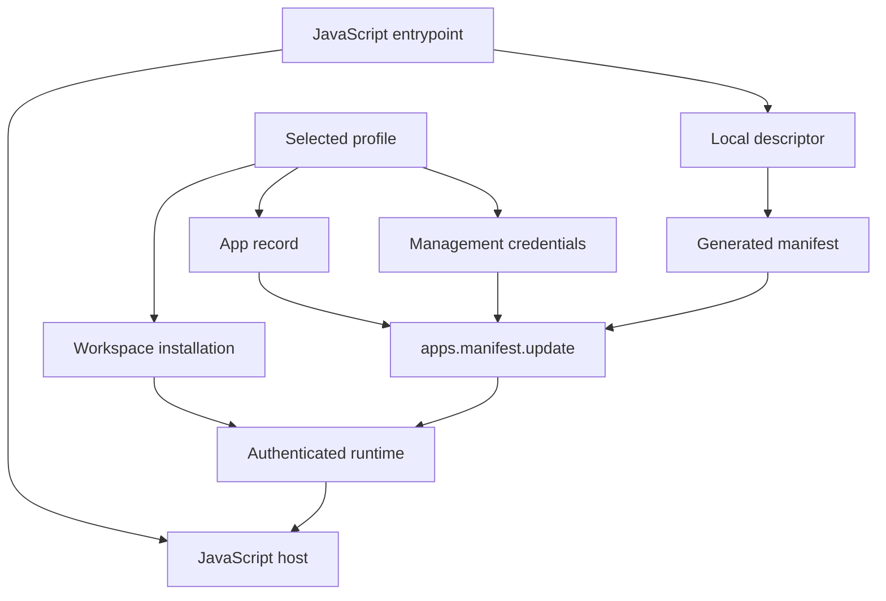
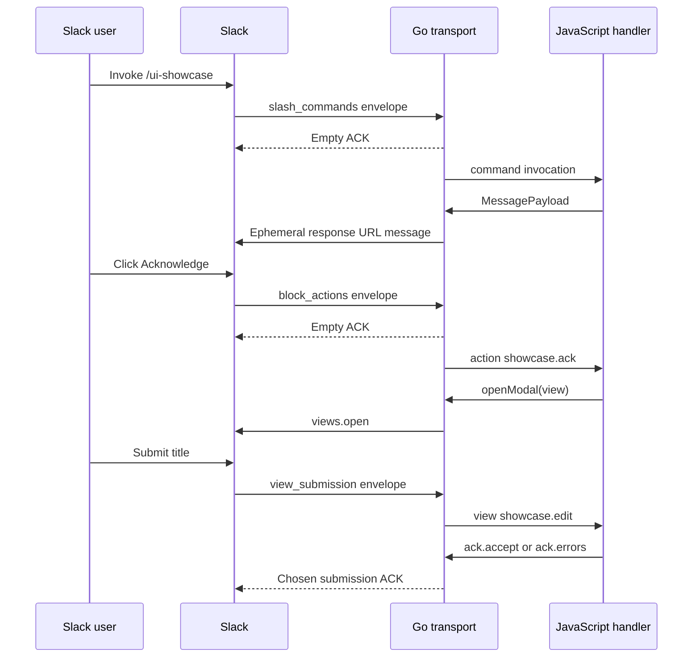

# Slack Bot UI Runtime: Native Builders, Interaction ACKs, and Manifest Synchronization

The Slack implementation in the Discord bot repository now supports interactive messages, buttons, modal forms, field validation, and explicit submission acknowledgments. Bot authors use JavaScript to define behavior. Go loads that code, owns the Slack connection, converts incoming payloads into application values, and performs network operations. A local developer can inspect a bot without credentials, simulate its handlers, update an installed app's manifest, and run the same code against Slack.

This report explains the implementation through one concrete interaction: a slash command produces a message with a button, the button opens a title editor, and submitting the form either displays a field error or closes the modal. That interaction exercises most of the new architecture. It also reveals the current boundary of the example: pressing Save accepts the input and logs its title, but does not yet persist a record or update the original message.

The report describes the source at revision `bf79512` on 2026-09-15. It follows [[PROJECT REPORT - Discord Bot Slack Support - Deep Dive Technical Analysis]], which covers the initial runtime and credential installation work. The broader port of every Discord example is now tracked separately in `SLACK-PORT-001`; it is not complete at this revision.

> [!summary]
> - The Slack UI DSL constructs native Block Kit objects through Go-backed JavaScript builders.
> - Modal submissions carry a Go-owned acknowledgment capability with a single-use decision and a deadline.
> - Live startup now synchronizes the chosen bot's manifest before opening Socket Mode.
> - Offline simulation, local HTTP/WebSocket tests, and a manual live test provide different kinds of evidence.
> - Full feature-equivalent ports of the 13 Discord examples remain a separate implementation program.

## 1. The entities that must agree

A **Slack app** is a remote registration with an app ID, display information, commands, events, and permissions. Its **manifest** is the JSON or YAML representation of that configuration. A **workspace installation** grants tokens for using the app in one workspace. A **local bot** is a JavaScript program loaded by the Go process. These are related entities, but they have independent lifecycles.

The **profile** joins them for local execution. It names a management credential, an app record, and an installation record. Choosing a profile selects credentials and remote identity. Choosing a JavaScript bot selects the registered local handlers and configuration schema. Neither name alone fully identifies what Slack will invoke.

The distinction became observable during the first UI test. The selected JavaScript program was `ui-showcase`, but the installed app still declared `/golem-ping`. The process could connect successfully while Slack rejected `/ui-showcase` before any event reached it. Loading a handler locally cannot create a remote command registration.

The runner now addresses that mismatch directly. Unless `--skip-manifest-update` is supplied, it uploads the chosen bot's generated manifest before connecting. The selected local program becomes the source of the app configuration for that development run.



A consequence follows from this design: running another bot with the same profile changes the configuration of the same app. It does not create another installation. This is convenient for switching development examples, but it also replaces generated display information and command definitions. The runtime documents that behavior rather than treating the update as an invisible side effect.

## 2. Package boundaries and data ownership

The implementation separates Slack-independent domain values, JavaScript integration, transport, and CLI orchestration. This division gives tests control over side effects and prevents Slack SDK types from becoming the JavaScript API.

| Location | Responsibility |
| --- | --- |
| `pkg/slackbot/model.go` | Invocation, message, action, modal, and acknowledgment contracts. |
| `pkg/slackbot/ingress.go` | Admission, duplicate detection, work queue, and automatic ACK boundary. |
| `pkg/slackbot/recording.go` | Offline service implementations that record operations. |
| `internal/jsslack/host.go` | Runtime creation, lifetime, inspection, and ownership. |
| `internal/jsslack/module.go` | Bot configuration and handler registration. |
| `internal/jsslack/ui_module.go` | Native Block Kit builders. |
| `internal/jsslack/dispatch.go` | Handler selection, context methods, promises, and implicit replies. |
| `internal/slacktransport/client.go` | Slack SDK/Web API services and response URL delivery. |
| `internal/slacktransport/run.go` | Socket Mode decoding, receipt state, and runtime loop. |
| `pkg/slackhost/host.go` | Public Go embedding API. |
| `pkg/slackcli/` | Discovery, manifest generation, app lifecycle, simulation, and execution. |

An **invocation** is the normalized input passed to one handler. It contains exactly one command, supported event, block action, or view submission. It also carries workspace and user identity. A command requires a channel; a view submission may have none. Preserving that difference avoids accidentally assuming that every handler can reply to a source conversation.

Goja is the JavaScript engine. Its runtime values must be accessed through the runtime owner. The host performs JavaScript calls and object manipulation through that owner, but moves network work outside it. Network operations receive detached Go values, not mutable `goja.Value` objects.

The host additionally serializes entire invocations with a gate. This is a different constraint from serializing access to the VM. A handler awaiting network I/O may release the VM owner while still retaining its invocation slot. That detail matters for modal deadlines: a queued submission does not receive a new three-second interval merely because its handler starts later.

## 3. Building a Slack-native DSL

Block Kit is Slack's structured vocabulary for message and view content. A **block** is a layout unit, such as a section or actions row. An **element** is a control within that block, such as a button or text input. A **composition object** represents reusable content such as plain text or Slack-formatted text.

The module `require("slack/ui")` exposes construction functions for these objects. Some return JSON immediately; others return builders with chainable methods. Builder methods update Go-owned state and return the same JavaScript wrapper. `.build()` produces a JSON-compatible object for inspection or delivery.

```javascript
const ui = require("slack/ui");

const message = ui.message("UI showcase: choose an action")
  .block(ui.header("Slack UI showcase"))
  .block(ui.section(ui.mrkdwn(
    "This message was built by the native Slack UI module."
  )))
  .block(ui.actions(
    "showcase-actions",
    ui.button("showcase.ack", "Acknowledge").value("showcase")
  ))
  .build();
```

There are three identifiers in this small example with different roles. The slash command selects the initial command handler. The button's `action_id` selects its action handler. The actions block's `block_id` identifies its containing block. The button value can carry a record identifier without changing handler routing.

The fluent construction pattern comes from the Discord implementation, but the payload representation is Slack-specific. Discord embeds, component rows, user interactions, and roles do not become Slack values by renaming fields. The Slack module explicitly emits `text`, `blocks`, `action_id`, and modal view fields.

The implementation uses ordinary wrapper methods rather than reproducing the Discord DSL's Proxy-based dispatch. This is enough for the current API. It keeps the surface inspectable and avoids introducing a generic cross-platform UI abstraction before the native payloads are understood.

### Validation and preservation of raw blocks

The domain message type carries required fallback text and an optional block array. It enforces selected constraints, including the 50-block message limit and 1–4000-character text rule. Modal validation similarly checks its basic shape and block count. These checks are useful, but they are not complete validation against Slack's full Block Kit schema.

This limitation matters when using raw blocks. A bot can supply a block without a dedicated helper, but Slack may still reject fields or combinations that local validation accepts. Supporting the visual JSON also does not automatically implement the corresponding event decoder, state accessor, or handler registration.

The pinned Slack SDK introduced another issue: using its generic unknown-block representation could discard fields needed by newer or unsupported blocks. The transport instead uses a small wrapper that implements the SDK block interface while marshaling the complete detached map. This is serialization preservation, not an attempt to claim typed support for every Slack block.

```text
JavaScript builder
    -> detached map
    -> domain MessagePayload
    -> SDK block interface wrapper
    -> original block JSON on the wire
```

A source review also found an existing optional-input defect. `textInput().optional()` places `optional` on the element, while the containing input block needs that setting. The new UI reference records this limitation and a raw-block workaround. The report does not count that helper as live-qualified behavior.

## 4. From a slash command to an ephemeral message

Socket Mode is Slack's WebSocket delivery mechanism. It lets the local process receive app events without hosting a public HTTP callback endpoint. Each delivered request has an envelope identifier used for acknowledgment.

The transport first authenticates the bot token and checks the workspace. It then runs the Socket Mode client and ingress worker under a shared cancellation context. Slash-command payloads are decoded into an invocation, while their response URLs remain inside Go-owned responder objects.

A **response URL** is a capability for replying to a specific Slack interaction. It is not exposed as a JavaScript string. The handler receives `ctx.reply` or returns a message object; the host invokes the responder internally.

The showcase's command handler returns the built message. Dispatch recognizes that result and consumes the invocation's implicit reply slot. A handler that already called `ctx.reply` cannot also return another implicit reply. That second attempt fails with `already_replied`.

The response URL body uses `response_type: "ephemeral"`, so the invoking user sees the showcase without posting a normal channel message. This explains why the first demonstration appeared as “Only visible to you.”

An explicit call to `ctx.slack.messages.post` is a separate operation. It targets a channel and returns a channel/timestamp reference. It does not consume the implicit reply slot. This distinction is useful for applications that acknowledge a private command while creating a public result, but the application must choose that behavior explicitly.

## 5. Button actions and modal forms

A **block action** is the interaction Slack sends when a user operates an interactive element. The transport extracts its action ID, block ID, value, selected-option data, message timestamps, and trigger information. Dispatch constructs an action routing key and selects the registered JavaScript function.

The current button handler opens a modal through `ctx.openModal`. The short-lived trigger used by `views.open` stays in the Go invocation; JavaScript supplies the view definition.

```javascript
action("showcase.ack", async ctx => {
  await ctx.openModal(
    ui.modal("showcase.edit", "Edit showcase")
      .metadata("showcase")
      .input(
        "title",
        "Title",
        ui.textInput("title_input").initial("Acknowledge")
      )
      .submit("Save")
      .build()
  );
});
```

A modal has its own routing identifier, `callback_id`. Its submitted state is nested under input block IDs and element action IDs. The helper `ctx.values.text(blockId, actionId)` reads a string from that nested structure and returns `undefined` when it is absent or not a string.

The two identifiers are both necessary. A modal can contain several controls, and Slack's state representation must identify both the layout block and the element within it. Using the button action ID or modal callback ID as a form field key would read the wrong location.

```javascript
view("showcase.edit", async ctx => {
  const title = ctx.values.text("title", "title_input");
  if (!title || title.trim().length < 3) {
    return ctx.ack.errors({title: "Use at least three characters."});
  }
  await ctx.ack.accept();
  ctx.log.info(`Saved ${title.trim()}`);
});
```

The error map is keyed by the input block ID, `title`. The accepted case closes the modal and writes a log message. The word “Saved” in that example's log is not evidence of persistence: the handler contains no database write or store update.



The same UI sequence therefore has different acknowledgment timing for the button and the form submission. Treating all interactions as ordinary commands would acknowledge the submission too early to return field errors.

## 6. ACK ownership, deadlines, and replay

An **ACK**, or acknowledgment, tells Slack that an envelope has been handled at the protocol level. For a modal submission it can also carry a response that keeps the modal open and associates errors with fields. It is distinct from an ordinary message.

The transport represents this choice as a Go-owned receipt implementing the domain acknowledgment interface. The receipt contains the envelope ID, deadline, whether response payloads are permitted, and a mutex-protected used flag. JavaScript receives only the narrow methods `accept` and `errors`.

The central state transition can be described as follows. This pseudocode summarizes the implementation rather than adding a new abstraction:

```text
respond(choice):
    validate choice and required error fields
    lock receipt
    reject if already used
    reject if current time is after deadline
    reject errors payload when envelope disallows it
    mark receipt used
    unlock receipt
    schedule Socket Mode ACK with deadline-bound context
    remember scheduled payload for duplicate-envelope replay
```

Marking the receipt used before sending prevents two concurrent choices from both being emitted. It also has a consequence: if scheduling fails after this transition, the receipt cannot simply choose another response. This is a deliberate single-use boundary with a limited local recovery model, not a transaction guaranteeing successful delivery.

The pinned SDK's `AckCtx` queues a Socket Mode response. A successful return means that scheduling succeeded; it does not prove Slack received or applied the response. Documentation and tests must preserve that distinction.

The receipt deadline is three seconds from receipt creation. That is not a fresh deadline from the first JavaScript statement. Time in ingress or behind the host invocation gate reduces what remains. A slow handler can therefore delay a modal beyond its response interval even though ordinary envelopes are acknowledged quickly.

The user explicitly accepted the complexity of ACK handling while deferring a separate interaction scheduler, worker reservation, priority policy, or bounded interactive execution path. The implementation keeps the existing host and ingress model. It does not claim a timing guarantee that would require those additional mechanisms.

A process-local replay map retains scheduled interactive ACK payloads for five minutes under envelope IDs. Duplicate recognized submissions can reuse the recorded response without rerunning JavaScript. It does not provide durable exactly-once processing: process restarts lose both application state and replay data, and failure before a payload is recorded remains observable.

## 7. App creation, installation, and manifest synchronization

The local store separates management credentials from runtime credentials. Under the default user configuration directory, `config.yaml` holds profile/app/installation relationships and `credentials.json` holds secret values. The store uses private file permissions and writes updates through temporary files. It is intended for one developer workstation; it is not a multi-process credential coordination service.

| Operation | Selected credential or record |
| --- | --- |
| Create/update an app manifest | Management access token. |
| Refresh management credentials | Management refresh token; both returned values replace the old pair. |
| Developer installation | Management access token and app ID. |
| Authenticate/post messages | Workspace bot token. |
| Open Socket Mode | App-level token. |

The `bots install` path uses the `apps.developerInstall` method observed in Slack CLI's source. Its request contains app ID, bot scopes, and outgoing domains. It stores returned bot and app-level tokens. This is a developer convenience relying on an undocumented endpoint, not a completed browser OAuth distribution flow.

The manifest update uses the documented `apps.manifest.update` endpoint. Slack specifies that the submitted manifest replaces prior configuration and must include the settings to retain. The current runner submits the selected bot's complete generated manifest. The response's `permissions_updated` flag signals whether a reinstall is needed. [Slack manifest-update reference](https://docs.slack.dev/reference/methods/apps.manifest.update/).

The startup order is important:

```text
resolve bot descriptor
load selected profile and credential records
validate app/workspace/runtime token relationships
construct services and load the JavaScript host
unless skip-manifest-update:
    require management access token
    submit generated manifest with selected app ID
    stop on API failure
    if permissions changed:
        stop with an installation command
authenticate workspace
connect Socket Mode
dispatch invocations until cancellation
```

Loading the host before changing remote configuration catches script/configuration failures first. Updating before connecting prevents a successful live process from silently operating under a stale command manifest. Startup errors identify expired management credentials and tell the developer to run the existing refresh command.

The live development token had expired during the first synchronization attempt. Refreshing the stored management pair and restarting produced a successful update with `permissions_updated=false`. The existing app ID and runtime tokens remained usable. [Slack app lifecycle and reinstall rules](https://docs.slack.dev/app-management/distribution/).

There is a recovery limitation when permissions change: the runner stops after the manifest has already been applied. The operator must follow the printed install instruction. The current code does not retain a durable “reinstallation pending” marker, so ignoring that instruction and repeatedly restarting is not a substitute for granting the new permissions.

## 8. What the live investigation established

The initial live failure was a registration mismatch. Slack rejected `/ui-showcase` because it was absent from the installed manifest. A tmux process showing “loaded Slack bot” proved only local loading, not that the remote configuration matched.

Additional logging made each stage visible. Startup reports the profile, script, local bot name, app ID, workspace ID, and PID. Authentication and Socket Mode lifecycle events show whether the process actually connects. Ingress logs command and envelope identifiers. Dispatch logs the route's start, completion, duration, or classified failure.

A separate report of an unexpected `pong` prompted a more careful investigation. The source search found no such fallback in the showcase transport or Slack SDK. The local wire reproduction inspected both examples in CLI order, loaded the showcase, then delivered `/golem-ping` and `/ui-showcase`. It observed two empty ACKs and one HTTP reply containing only the showcase message. A read-only manifest export also showed only `/ui-showcase`.

The user later confirmed that `/golem-ping` failed and `/ui-showcase` worked, and suggested the earlier result may have been misread. No root-cause code defect was established for the unexpected pong. The investigation did produce useful outgoing-reply diagnostics and a regression test, but it would be incorrect to describe them as a fix for a proven duplicate bot.

Outgoing reply logs contain a text fingerprint, byte count, block count, bot, command, invocation, and delivery result. They do not include full message text or response URLs. A fingerprint can identify a known fixed reply across the dispatch path, while invocation IDs tie it to its input.

## 9. Tests as separate evidence boundaries

Offline simulation, local transport tests, and live testing answer different questions. Passing one layer does not imply that every other layer works.

| Evidence | What it demonstrates | What it does not demonstrate |
| --- | --- | --- |
| Descriptor inspection | Script registration and declared configuration are loadable. | Remote app command registration. |
| Recorder simulation | Normalized invocation selects handlers and emits intended operations. | Valid live triggers, scopes, or Slack UI rendering. |
| Local HTTP/WebSocket fixtures | Real transport encoding, decoding, and ACK flow against controlled endpoints. | Workspace permissions or production Slack behavior. |
| Live manual showcase | Registered command, button, modal and acceptance work in the development workspace. | Complete feature coverage, persistence, or overload behavior. |

The checked-in fixtures under `examples/slack-bots/fixtures/` cover the showcase command, button action, and view submission. Each `bots simulate` call starts a new host. The action records `open_view`; the view records an acceptance ACK. Separate simulation processes do not share in-memory state.

The wire-level reproduction in `internal/slacktransport/showcase_wire_test.go` adds a stronger check. It runs a real local WebSocket exchange and captures HTTP response bodies, after normal CLI discovery has inspected ping and showcase. This exercises the potential for leaked handler registrations as well as the response encoding.

Building that fixture exposed a useful SDK requirement: slash-command decoding expects `is_enterprise_install` with a Boolean or parseable string value. Omitting it causes the SDK to reject the request before the framework decoder sees it. A normalized fixture can therefore succeed while an incomplete wire fixture fails.

Full repository tests passed at the manifest-sync checkpoint. Build and vet required `-buildvcs=false` because VCS stamping failed in this worktree setup. The Glazed analyzer still reports pre-existing raw Cobra flag definitions in the credential commands. The vulnerability scan reports reachable findings in the selected Go toolchain and existing dependencies. These results are recorded in the diary; they were not silently reclassified as successful checks.

## 10. Documentation as part of the runtime contract

The original embedded help page was called `slack-offline` because inspection, manifest generation, and simulation were the first operations implemented. Live installation and UI behavior were later added without changing that title. Several paragraphs still described implemented features as future work.

The documentation is now split into two discoverable topics:

```sh
go run ./cmd/slack-bot help slack-bot-guide
go run ./cmd/slack-bot help slack-ui-dsl
```

The general guide covers credentials, app lifecycle, manifest synchronization, runtime configuration, simulation, and Go embedding. The UI guide covers builders, identity fields, action routing, modal state, ACK choices, known limits, and troubleshooting. Both are embedded into the CLI through `pkg/slackdoc/doc.go`.

The TypeScript declarations were also brought closer to the implementation by adding the missing view registration and input-builder overloads. These declarations help authors discover the API, but they do not replace the runtime's validation rules or tests.

The research ticket remains useful as a deeper design/reference package. Its broader surface survey includes App Home, shortcuts, files, canvases, Lists and other APIs. Some narrative sections are historical proposals; the implemented help pages and source are the current API contract. Research coverage must not be confused with implementation coverage.

## 11. Current coverage and the full bot-port program

The delivered UI slice supports rich message payloads, native construction helpers, button/static-select action decoding, basic modal opening, submitted text access, and acceptance/error ACKs. Static-select decoding does not mean a select builder exists; the current `actions` helper accepts buttons. Message updates, modal replacement responses, Home publication, external option loading, and broader operational services remain outside this slice.

The user has requested every Discord example feature that has a Slack equivalent. This is a stronger requirement than adding similarly named commands or minimal counterparts. The source inventory contains 13 examples:

| Example | Work required beyond the initial Slack foundation |
| --- | --- |
| announcements | Block Kit preview; an initial port is present. |
| ping | Broader API demonstration beyond the basic existing ping. |
| hater | Buttons, forms, reply behavior and explicit trigger equivalents; an initial port is present. |
| interaction-types | Slack-specific equivalents for structured options and user/message context actions. |
| unified-demo | Configuration plus CLI integration semantics; initial Slack status/configuration commands exist. |
| poker | Reuse game algorithms, port state scope and native interactions. |
| support | Ticket UI and Slack thread operations. |
| custom-kb | Persistent link store, forms, search and selection. |
| knowledge-base | Persistent entries, capture, review, source links, search and export. |
| show-space | Persistent shows, posting/pinning, dates, permission checks and operational commands. |
| archive-helper | Paginated channel/thread retrieval and archive file delivery. |
| moderation | Native workspace/member/channel operations with appropriate authorization. |
| ui-showcase | Extend the current basic example to the broader interaction collection. |

The initial four additional scripts were checkpointed in `bf79512`. They are explicitly preliminary and do not fulfill the full-parity requirement. Several Discord concepts have no direct mapping, such as guild roles with their exact permission behavior. Their treatment must be justified individually. Conversely, a missing framework wrapper around a supported Slack API is implementation work, not a reason to silently remove a feature.

The next design package needs a feature-level matrix linking each source handler to its Slack behavior, service requirements, permission scopes, fixtures, and acceptance test. Durable stores must remain durable in the port. Administrative operations must have explicit authorization checks. UI convenience methods should be added when these real workflows require them.

## 12. Revision and source guide

All repository paths in this report are relative to:

```text
/home/manuel/workspaces/2026-09-10/add-slack-support/discord-bot
```

The main implementation checkpoints are:

| Revision | Contribution |
| --- | --- |
| `6b52d43` | Rich message payloads and native UI builders. |
| `95bca2a` | Block-action routing. |
| `564cf15` | Modal/view submission and interactive ACK surfaces. |
| `e203a08` | Runtime identity and dispatch diagnostics. |
| `cf38157` | Default manifest synchronization on remote startup. |
| `4d1af50` | Reply tracing and local wire reproduction. |
| `883eee7` | General/UI help split, fixtures and declaration corrections. |
| `bf79512` | Initial additional examples and full-parity port ticket. |

For implementation study, read `pkg/slackbot/model.go` before the runtime glue. Follow one invocation through `internal/slacktransport/run.go`, `pkg/slackbot/ingress.go`, and `internal/jsslack/dispatch.go`. Then inspect `internal/jsslack/ui_module.go` together with `examples/slack-bots/ui-showcase/index.js`.

The authoritative investigation history is under ticket `SLACK-UI-001`, especially `reference/01-investigation-diary.md`. Its sources directory contains the archived Slack references, including the manifest-update and lifecycle pages added during live debugging. The guide's reMarkable v3 delivery is recorded in `artifacts/delivery-receipt.txt`.

Related vault notes provide the earlier design context:

- [[PROJECT REPORT - Discord Bot Slack Support - Deep Dive Technical Analysis]]
- [[PROJ - Slack Bot - Runtime Ownership Admission and Local Verification]]
- [[ARTICLE - Go-Side JavaScript DSLs for Discord Bots - Types, Errors, and In-Place Updates]]

The immediate implementation direction is concrete: retain the working local runtime and ACK boundary, complete visible stateful interactions, then add the Slack services and UI controls required by the full bot inventory. Each task should demonstrate a real workflow in simulation or controlled wire tests before any live operational test.
