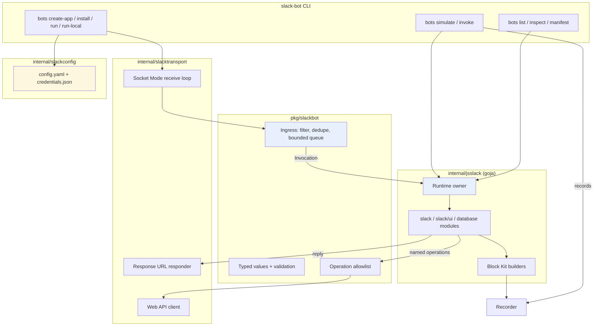
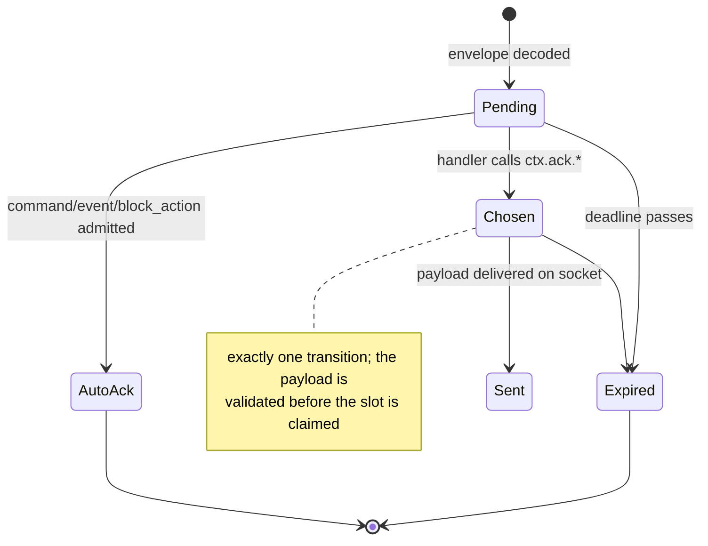
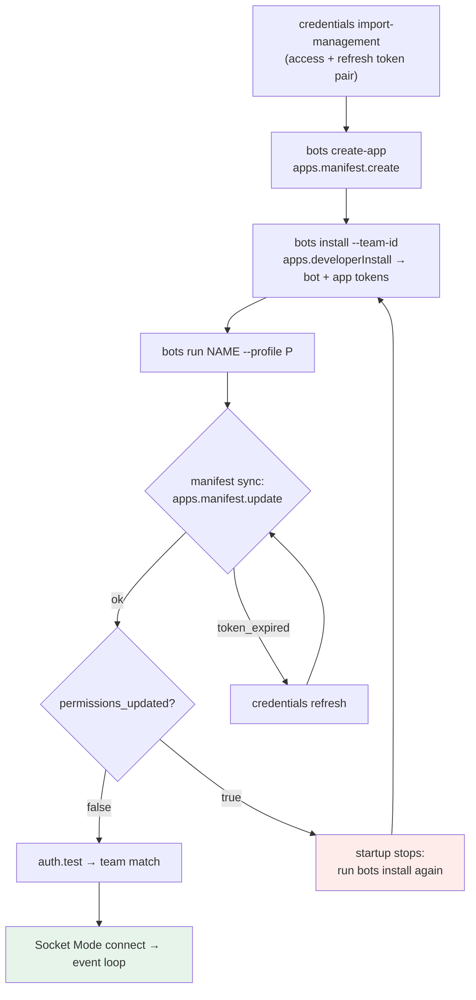

# Slack Support for discord-bot: The Complete Branch

The branch `task/add-slack-support` turns a repository that previously spoke only Discord into a two-platform bot framework. It adds 54 commits on top of upstream `main` (`ff70844`), of which 53 are Slack work, touching 676 files with roughly 110,000 inserted lines: a complete Go runtime that embeds a JavaScript interpreter, a native Slack interaction layer, a local credential and app lifecycle, thirteen example bots ported from the Discord collection, and a reproducible validation pipeline. The work is organized in four docmgr tickets under `ttmp/2026/09/{10,14,15}/`, each carrying a design document, a chronological implementation diary, archived Slack API documentation with checksums, and validation artifacts.

This report describes the branch as one system at revision `0c95573`. It is the fourth report in a series. Three earlier reports documented the offline runtime's ownership and admission model ([[PROJ - Slack Bot - Runtime Ownership Admission and Local Verification]]), the credential store, app installation and first live runtime ([[PROJECT REPORT - Discord Bot Slack Support - Deep Dive Technical Analysis]]), and the native UI DSL with interaction acknowledgments and manifest synchronization ([[PROJ - Slack Bot - Native UI ACKs and Manifest Synchronization]]). Those documents remain accurate for their slices. This report restates the parts of the system a new reader needs, and adds what none of them could cover: the named Web API service surface, lifecycle-owned SQLite persistence, the port of all thirteen example bots, live bot switching, the Git history redaction, and the blocking validation pipeline that now guards every push.

> [!summary]
> - The branch delivers a complete, independent Slack runtime: offline discovery and simulation, manifest generation, app creation, developer installation, Socket Mode ingress, a Block Kit UI DSL, an allowlisted Web API surface of 31 named operations, and lifecycle-owned SQLite persistence — with no compatibility layer to the Discord runtime.
> - Go owns process lifetime, credentials, the network, the JavaScript VM, and every side effect; JavaScript owns bot declarations and handler behavior through two typed modules, `slack` and `slack/ui`.
> - All thirteen Discord example bots were re-expressed as native Slack workflows; 167 literal source-handler mappings are machine-checked against inspected Slack descriptors by `TestSourceRegistrationParity`.
> - Live operation was proven by installing and switching between the Poker and Hater bots in a real workspace, each switch passing through an active manifest-synchronization gate that blocks startup until changed permissions are reinstalled.
> - Documentation token examples were removed from outgoing Git history with `git-filter-repo`, and the ancestry was rebased back onto upstream `main` after the filter had rewritten shared history.
> - Validation is blocking and reproducible: pinned golangci-lint, GoSec, govulncheck and a module-matched Glazed analyzer, with identical checks in local hooks and CI.

## 1. What the branch contains

The branch is best understood as five layers added to an existing Go module, plus the example collection that exercises them.

| Layer | Files | Lines | Contents |
| --- | --- | --- | --- |
| Go source (`*.go`) | 59 | +6,950 | Domain contracts, VM integration, transport, CLI, credential store, tests (24 test files), generated loggers |
| JavaScript examples (`examples/slack-bots/`) | 27 | +4,274 | 13 bots, shared libraries, invocation fixtures, TypeScript declarations |
| Embedded documentation (`pkg/slackdoc/`) | 5 | +887 | Bot guide, UI DSL reference, example operations guide |
| Ticket workspaces (`ttmp/**`) | 572 | +96,144 | Four tickets: design docs, diaries, archived Slack documentation, print artifacts, receipts |
| CI and tooling | 8 | — | Makefile targets, lefthook hooks, GitHub Actions, pinned tool versions |

The Go source is small relative to the documentation because the project was built research-first: every implementation phase was preceded by an archived design document, and every phase recorded its failures and validation results in a diary. The four tickets divide the work cleanly:

| Ticket | Date | Scope | Primary code |
| --- | --- | --- | --- |
| `DISCORD-SLACK-001` | 2026-09-10 | Architecture research, offline runtime, SDK probe, local Socket Mode runner | `pkg/slackbot`, `internal/jsslack`, `internal/slacktransport`, `pkg/slackhost`, `pkg/slackcli`, `internal/slackprobe`, `cmd/slack-bot` |
| `SLACK-CREDENTIALS-001` | 2026-09-14 | Local credential profiles, app creation, developer installation, live `bots run` | `internal/slackconfig`, `pkg/slackcli/{create_app,install_app,run_remote,update_manifest,credentials}.go` |
| `SLACK-UI-001` | 2026-09-14 | Slack surfaces research, Block Kit DSL, interaction ACKs, manifest synchronization | `internal/jsslack/{ui_module,ui_elements}.go`, receipt in `internal/slacktransport/run.go` |
| `SLACK-PORT-001` | 2026-09-15 | Port of all thirteen Discord example bots, operational services, persistence, qualification | `examples/slack-bots/*`, `internal/jsslack/{operations,verbs}.go`, `pkg/slackbot/{operations,recording}.go`, `internal/slacktransport/operations.go` |

No new Go module was created. The Slack runtime lives beside the Discord runtime in the same repository, imports nothing from it, and shares only the pinned engine dependency (`go-go-goja v0.8.3`, which provides Goja runtime construction, native module registration, and the runtime owner) and the CLI framework (Glazed v1.3.6, which provides field descriptions, parsing, and the embedded help system).

## 2. The ownership model, and why the implementation is independent

The discord-bot repository embeds [goja](https://github.com/dop251/goja), a JavaScript interpreter written in Go. A bot is a JavaScript file that calls `require("slack")` and exports the result of `defineBot`. This is not Node.js: scripts run inside the host process with no npm packages, no timers, and no filesystem access unless the host provides them. Every platform capability a script sees is a function the Go side registered deliberately.

The design work in `DISCORD-SLACK-001` started from the Discord runtime's central lesson: **Go owns connectivity, credentials, typed data, validation and lifecycle; JavaScript owns bot composition.** The Slack implementation adopted the lesson but rejected code reuse. Three findings drove that decision:

- Discovery, settings, descriptors, and response handling in the Discord runtime are coupled to Discord types, not just to the transport. A `DiscoveredBot` in `pkg/botcli` is a `jsdiscord` type; a Discord "intent" has no Slack equivalent, and Slack's interaction lifecycle has no Discord equivalent.
- Slack identifiers and deadlines differ in ways that break naive mappings. A message is addressed by `channel` plus `ts`, where `ts` is a timestamp-shaped **string** that loses identity if converted to a number. A thread is addressed by the root message's `ts` passed as `thread_ts`. Slash commands must be acknowledged within three seconds or Slack reports the command as failed.
- The Discord runtime projects runtime configuration into JavaScript using a **blacklist** of host-managed fields. The Slack design replaced this with an **allowlist**: only fields a bot declares in `configure.run.fields` can appear in `ctx.config`. A future credential added to host settings then cannot leak into scripts when a developer forgets to extend a blacklist.

The result is a set of packages with Slack-specific names and contracts (`slackbot.Invocation`, `slackbot.Action`, `slackbot.Interaction`, `slackbot.Block`) and a separate binary, `cmd/slack-bot`. The two runtimes do share architectural vocabulary — descriptor, dispatch, owner-thread promise settlement — because both are built on the same engine primitives.

One process runs one selected bot. This is a deliberate constraint, not a limitation to be engineered around: it makes identity unambiguous (the running process is exactly the installed app for one bot's manifest), keeps credential selection trivial, and matches the local development workflow the tool targets.

## 3. Package architecture

The packages form a strict layering. Reading them in dependency order explains the whole system:

| Package | Layer | Responsibility |
| --- | --- | --- |
| `pkg/slackbot` | Domain (no goja, no SDK) | Values and validation (`model.go`): `Invocation`, `Action`, `Interaction`, `ModalView`, `MessagePayload`, `Error`; ingress admission (`ingress.go`); the named operation allowlist (`operations.go`); the offline recorder (`recording.go`) |
| `internal/jsslack` | VM integration | Script loading and inspection (`host.go`), the `require("slack")` module and registration (`module.go`), owner-thread dispatch and promise settlement (`dispatch.go`), the `slack/ui` builders (`ui_module.go`, `ui_elements.go`), operation bindings (`operations.go`), the workspace-scoped store (`store.go`), local verbs (`verbs.go`) |
| `internal/slacktransport` | Transport | Socket Mode and Web API clients (`client.go`), the receive loop, envelope decoding, and the acknowledgment receipt (`run.go`), named Web API operations and file upload (`operations.go`) |
| `internal/slackconfig` | Local state | Two-file credential and profile store (`store.go`) |
| `pkg/slackhost` | Public composition | `Load`, `Inspect`, `Dispatch`, `InvokeVerb`, `Close` without exposing the VM |
| `pkg/slackcli` | CLI | Discovery, inspect/manifest/simulate/invoke, create-app, install, run, run-local, credentials, profiles |
| `pkg/slackdoc` | Documentation | Three embedded guides rendered by `slack-bot help` |
| `cmd/slack-bot` | Entry point | Cobra root, signal handling, error ownership |
| `internal/slackprobe` | Verification | The SDK-interop probe that first proved slack-go against a local mock |



The import direction is one-way: `jsslack` consumes `slackbot` interfaces; `slacktransport` implements them; `pkg/slackhost` composes both behind a public API. The composition root — `pkg/slackcli` and `cmd/slack-bot` — is the only place where a transport implementation is handed to the host. This structure exists to avoid the import cycle the design document predicted: a domain package that imported its own implementation would force the implementation to import the domain back.

## 4. The JavaScript authoring contract

A bot file registers its entire surface synchronously during loading. Registration is closed afterwards; handlers defined at runtime are rejected. The following is a complete, working bot from the README:

```javascript
const { defineBot } = require("slack");
const ui = require("slack/ui");

module.exports = defineBot(({ configure, command, action }) => {
  configure({ name: "hello", description: "An interactive Slack greeting" });

  command("/hello-slack", { description: "Say hello" }, async () =>
    ui.message("Hello from JavaScript")
      .block(ui.header("Hello, Slack!"))
      .block(ui.section(ui.mrkdwn("Go runs the connection; JavaScript handles the interaction.")))
      .block(ui.actions("greeting", ui.button("hello.wave", "Wave back")))
      .build()
  );

  action("hello.wave", async () => ({ text: "Wave received!" }));
});
```

`defineBot` executes the registration function immediately and returns an object the host recognizes. A script that fails to export that object fails to load. Registration accepts seven kinds, each becoming a routing key in a Go map:

| Registration | Key format | Descriptor records |
| --- | --- | --- |
| `command("/name", {description}, handler)` | `command:/name` | `commands` (name validated as a `/`-prefixed string of 2–32 characters, no whitespace) |
| `event(name, handler)` | `event:name` | `events` (from a supported list) |
| `action(actionId, handler)` | `action:actionId` | `actions` |
| `view(callbackId, handler)` | `view:callbackId` | `views` |
| `options(actionId, handler)` | `options:actionId` | `options` (external select suggestions) |
| `shortcut({callbackId, name, description, type}, handler)` | `shortcut:callbackId` | `shortcuts` (type `message` or `global`) |
| `verb(name, {description}, handler)` | `verb:name` | `verbs` (synchronous, offline-only) |

Duplicate registrations fail loading with the offending key. A registration function that returns a promise fails loading: the contract requires synchronous registration so that inspection is bounded and deterministic.

`configure` declares the bot's name, description, optional extra OAuth scopes, and its runtime configuration schema. The schema is the allowlist described in section 2: `ctx.config` contains only declared fields, with declared types (`string`, `bool`, `number`) and defaults, projected from `--bot-config-file`. Field names must match `[a-z][a-zA-Z0-9]*`; the bot name must match `[a-z][a-z0-9-]*`.

Every value crossing the Go/JavaScript boundary in either direction passes through a strict decoder: the value is marshaled to JSON and decoded with `DisallowUnknownFields` into a Go struct. A script that sends `{threadTS: "..."}` receives the error `unknown field; use threadTs` rather than a silently ignored typo. This strictness costs an encoding step and buys a contract that fails at the boundary instead of at the Slack API.

The handler context is built per invocation. Its members are:

| Member | Contract |
| --- | --- |
| `ctx.teamId`, `channelId`, `userId`, `id` | Immutable string identifiers |
| `ctx.command`, `ctx.text` | Slash command name and argument text (Slack delivers arguments as unparsed text; there are no structured options) |
| `ctx.event` | Detached event snapshot: `type`, `text`, `ts`, `threadTs`, `channelId`, `userId`, `data` (the raw event map) |
| `ctx.action` | Normalized block action: type, `actionId`, `blockId`, `value`, `selectedOption(s)`, `selection` (all element-specific `selected_*` fields), source message timestamps |
| `ctx.view`, `ctx.values`, `ctx.query` | View submission state: callback ID, private metadata, block-keyed values, `values.text(blockId, actionId)` accessor; suggestion query for `options` handlers |
| `ctx.config` | Declared fields only |
| `ctx.reply(payload)` | One implicit reply per invocation; slash commands and actions reply ephemerally through the response URL, events post to the channel, threading into the source message's thread when one exists |
| `ctx.openModal(view)` | Uses the invocation's `trigger_id` (valid for a short window; the host rejects the call when none is available) |
| `ctx.ack` | The single-use interaction acknowledgment (section 8) |
| `ctx.slack.*` | Named operation groups (section 10) |
| `ctx.store` | Process-local, workspace-scoped key/value state (JSON values) |
| `ctx.log` | Structured logging; message text only, never payloads or credentials |
| `ctx.replaceOriginal(payload)` | Response-URL replacement for message actions |

The one-reply rule is enforced in Go, not by convention. The invocation carries a `replied` flag that only owner-thread code can set. A handler that calls `ctx.reply` and then also returns a message payload fails with `already_replied` instead of sending two messages. Returning `undefined` sends nothing. An explicit `ctx.slack.messages.post` does not consume the reply slot — it is a different operation with a different result contract (a real `{channelId, ts}` reference, versus the reply's `{delivered: true, via: "response_url"}` receipt, which deliberately does not promise a timestamp, because a response-URL delivery cannot be edited later through `chat.update`).

## 5. Runtime ownership and dispatch

Goja is not safe for concurrent use. One virtual machine must be accessed by one goroutine at a time, while a Slack bot process must handle concurrent envelopes, perform network calls that outlast JavaScript execution, and shut down cleanly. The engine's **runtime owner** serializes VM access; the host's dispatch builds everything else around that primitive.

`Host.load` constructs the runtime with only the `slack`, `slack/ui`, and `database` modules registered (the engine's implicit default registry is disabled), loads the script under a timeout, validates the descriptor, and — only when loading for execution, not inspection — resolves the declared configuration. Every VM entry goes through one function:

```go
// call interrupts CPU-bound JS on cancellation, and clears the interrupt
// before the next owner entry.
func (h *Host) call(ctx context.Context, op string, fn func(*goja.Runtime) (any, error)) (any, error) {
    return h.runtime.Owner.Call(ctx, op, func(_ context.Context, vm *goja.Runtime) (any, error) {
        done := make(chan struct{})
        stop := context.AfterFunc(ctx, func() { vm.Interrupt(ctx.Err()); close(done) })
        defer func() {
            if !stop() { <-done }
            vm.ClearInterrupt()
        }()
        return fn(vm)
    })
}
```

Two details carry the correctness. First, cancelling an owner call alone would not stop a CPU-bound `while (true)` loop already executing, because the owner is inside the VM. The `AfterFunc` watcher interrupts the VM from outside; the interrupt is cleared before the next entry so a cancelled invocation cannot damage an unrelated one. Second, the host's `Close` takes the same capacity-1 gate channel that dispatch uses, so shutdown cannot interleave with a dispatch's VM entries.

Dispatch serializes **complete invocations**: the gate channel has capacity 1, so while one invocation settles, another incoming envelope waits rather than entering the VM. Within one invocation, asynchronous service work runs outside the VM in a bounded errgroup (16 workers per invocation):

```text
dispatch(invocation):
  validate; derive timeout ctx; arm lifetime watcher
  acquire gate (capacity 1)                       # whole-invocation serialization
  build invocation state {ctx, input, responder, replied=false, workers(limit 16)}
  defer: cancel(); workers.Wait()                  # no work outlives the invocation
  on owner: find handler by routing key; invoke with built context
  poll on owner every 1ms:
      result = handler result (may be a promise)
      promise pending  → keep polling; owner stays free for completions
      promise rejected → preserve JS stack text; fail
      value present    → strict-decode to MessagePayload; validate
  settled:
      interaction without chosen ACK → fail "ack_required"
      message present → claim reply slot on owner; deliver outside owner
  wait for all outstanding service workers
```

The polling design is the resolution of a deadlock risk. If the handler awaits a network promise, the settlement callback must run on the owner; if dispatch held the owner while waiting, settlement could never run. The loop releases the owner between polls, so `async` operations can complete. Each async operation follows the same shape:

```text
JS calls an async capability, on the owner:
    validate and decode arguments into detached Go values
    allocate a promise on this VM
    schedule worker:  service.Call(invocationCtx, decoded)
                     then owner call: resolve or reject the promise
    return the promise immediately
```

The worker receives only decoded Go values — never a goja object — and touches the VM only through the owner callback. If the invocation is already closed, the call fails with `context_closed` before a worker is scheduled; if the worker pool is saturated, the promise rejects with `busy` rather than queueing without bound.

Three lifetimes are independent and must not be confused:

- **The receipt context** is owned by the transport and lives only long enough to acknowledge the envelope (section 6).
- **The invocation context** carries the handler timeout (default 5 seconds, CLI-bounded to 1–60,000 ms) and cancels when the invocation settles, releasing all outstanding service calls.
- **The host lifetime** cancels everything when the process stops; `Close` is idempotent and also closes the SQLite connections the host owns.

A stored invocation context used after settlement fails with `context_closed` — a retained `ctx` cannot silently borrow the credentials or routing of a later invocation.

## 6. Bounded ingress and admission

Between the socket receive loop and the dispatcher sits the ingress, a pure-Go component that decides whether an envelope becomes work. It never enters JavaScript. Its contract is bounded: fixed queue capacity, fixed deduplication capacity, explicit overload behavior, and an acknowledgment that does not wait for handler progress.

```text
admit(envelope):
  if closed → Closed
  if channel not allowed (when a list is configured)
     or envelope authored by a bot
     or authored by the bot itself
     or app_id ≠ configured app
     or team_id ≠ configured team
     or invocation invalid            → Dropped
  dedupe key = "event:" + team + event_id     (Events API)
             = "envelope:" + envelope_id      (everything else)
  expire stale dedupe entries (TTL 5 min)
  if key already present             → Duplicate
  if dedupe map at capacity          → Busy   # no eviction of live keys
  if queue has room: reserve key, enqueue → Accepted
  else                               → Busy
```

Two decisions here are load-bearing. First, deduplication keys on **business-event identity** where one exists: the Events API's `event_id` identifies the application event, while Socket Mode's `envelope_id` identifies one delivery of it. Slack may redeliver the same event under a new envelope; deduplicating only on envelope IDs would run the handler twice. Interactions have no stable business identifier, so their guarantee is explicitly weaker and documented as such. Second, a full deduplication map reports `Busy` instead of evicting a live key; eviction would silently weaken duplicate suppression exactly when the process is under load — the moment redelivery is most likely.

The transport acknowledges each envelope with its own short context (2 seconds) immediately after the admission decision, before any JavaScript runs. Queue insertion precedes the acknowledgment call, so the worker may start before the ACK is observed on the wire. The guarantee is therefore **ACK independence from handler progress** — a blocked or slow handler never delays the receipt — not strict ACK-before-handler ordering. A `Busy` decision acknowledges with a short ephemeral "Bot is busy" payload when the envelope accepts response payloads, and records the drop in metrics otherwise.

Interactive envelopes are the exception: view submissions and suggestion queries — the interactions whose response is the acknowledgment payload — are admitted without an automatic ACK. The receipt travels on the invocation into JavaScript, where the handler chooses the payload (section 8). Ordinary block actions keep the automatic empty ACK and answer through follow-up messages instead. If an interactive envelope cannot be admitted (busy, dropped, duplicate without a remembered response), it is left unacknowledged on purpose — Slack may retry it, and the handler never appears to have accepted data it did not process.

| Bound | Value | Consequence |
| --- | --- | --- |
| Queue capacity | 32 envelopes | Overload produces explicit `Busy` receipts, never unbounded memory |
| Dedupe capacity | 4096 keys | Full map rejects admission rather than evicting live keys |
| Dedupe TTL | 5 minutes | Suppresses redelivery windows without permanent growth |
| Receipt context | 2 seconds | ACK latency is independent of handler duration |
| Receipt payload deadline | 3 seconds | Interaction responses obey Slack's deadline or fail explicitly |
| Per-invocation workers | 16 | Saturated service calls reject with `busy` instead of queueing |
| ACK replay memory | 5 minutes | Duplicate interactive envelopes replay the identical response payload |

Shutdown ordering matters: a successful side effect does not imply the handler has settled, and shutdown may legitimately cancel the last promise-completion step. The ingress worker therefore suppresses dispatch failures once its own lifetime is cancelled; failures during active lifetime remain observable on a bounded error channel that never stalls receipts.

## 7. Transport: Socket Mode and the Web API

Slack Socket Mode gives the host an outbound WebSocket through which Slack pushes events and interaction payloads, removing the need for a public HTTP endpoint. Two tokens with different jobs enable it: an **app-level token** (`xapp-…`, scope `connections:write`) opens the socket, and a **bot token** (`xoxb-…`) authorizes Web API calls. Neither substitutes for the other. A third token class — an app-configuration or **management token** — is used only by the CLI lifecycle commands and never by the running bot.

`internal/slacktransport` provides two client constructors with one implementation. `NewLocal` accepts only a literal loopback HTTP URL with an explicit port; its dialer refuses any destination other than the configured host, its HTTP client refuses redirects, and the same host/port guard applies to WebSocket URLs that Slack-shaped mocks return and to response-URL calls. `NewRemote` builds the real client; response URLs are accepted only from `hooks.slack.com` and `hooks.slack-gov.com` over HTTPS. Both constructors require all four identity values (bot token, app token, team ID, app ID) as explicit arguments — the package reads no environment variables and no credential files.

`Client.Run` is the whole live loop:

1. `auth.test` verifies the bot token; the authenticated team must equal the configured team, or startup fails. The authenticated bot user ID becomes the self-filter for ingress.
2. The ingress and socket run in one errgroup. SDK-managed reconnects stay inside the same ingress lifetime, so deduplication state survives a reconnect.
3. Each socket event is decoded into a `slackbot.Envelope` (detached invocation + responder), decided by ingress, and acknowledged.

The decoder handles four envelope families and encodes the platform's asymmetries:

| Family | Routing | Notable decode decisions |
| --- | --- | --- |
| Events API | `event:<type>` | `message_changed`/`message_deleted` are remapped from their `subtype` to distinct events; author resolution falls back through `message`/`previous_message`/`edited.user`; reactions read the channel from `item`; bot-authored events (bot_id or subtype) are flagged and dropped |
| Slash commands | `command:<name>` | Response URL becomes a private responder; `trigger_id` is preserved for modals; arguments stay raw text |
| `block_actions` | `action:<action_id>` | Every element-specific `selected_*` field is preserved verbatim; channel/timestamps fall back between `channel`/`container` and `message`/`container` forms; response URL responder attached when Slack supplies one |
| `shortcut`/`message_action`, `block_suggestion`, `view_submission` | `shortcut:`, `options:`, `view:<callback_id>` | Shortcuts may have no channel; suggestions carry the query; submissions carry block-keyed `state.values` and no response URL |

Outbound messages pass through a small wrapper that exists because of a concrete SDK limitation: `slack-go`'s `UnknownBlock` drops fields it does not recognize when serializing, which silently corrupts newer Block Kit payloads. The transport instead wraps the framework's validated `map[string]any` blocks:

```go
type jsonBlock struct{ slackbot.Block }

func (b jsonBlock) BlockType() slack.MessageBlockType { return slack.MessageBlockType(b.Type()) }
func (b jsonBlock) MarshalJSON() ([]byte, error)     { return json.Marshal(map[string]any(b.Block)) }
```

Blocks therefore cross the SDK boundary losslessly while remaining detached JSON everywhere else — JavaScript never receives an SDK object, and the SDK never rewrites a block.

Errors crossing back are filtered the same way in reverse. `safeError` maps cancellation to `context_closed`, rate-limit responses to `rate_limited`, and a small list of reviewed Slack error codes to themselves; **everything else becomes `delivery_unknown`**. The reasoning is an explicit product decision: a timeout after `chat.postMessage` may mean Slack accepted the message, and automatically retrying could duplicate it. Rate-limited operations fail with a typed error and no retry — there is no method-scoped pacing, no retry queue, and no exactly-once delivery claim. All errors exposed to scripts carry stable `{code, operation, message}` fields and never contain tokens, response URLs, or arbitrary upstream text.

```mermaid
sequenceDiagram
    participant Slack
    participant Sock as Socket Mode loop
    participant Ing as Ingress
    participant Own as VM owner
    participant JS as Handler (goja)
    participant Web as Web API / response URL

    Slack->>Sock: envelope (slash command, envelope_id, response_url)
    Sock->>Sock: decode → Invocation + responder
    Sock->>Ing: Admit(ackCtx 2s)
    Ing->>Ing: filter, dedupe, queue
    Ing-->>Slack: ACK (empty/busy) — independent of handler
    Ing->>Own: Dispatch(Invocation)
    Own->>JS: invoke handler(ctx)
    JS-->>Own: returns payload (or awaits ctx.slack.*)
    Note over JS,Web: service calls run off-owner, settle on owner
    Own->>Web: reply via response URL (ephemeral) / chat.postMessage
    Web-->>JS: delivery result / typed error
    Own->>Ing: invocation settled; workers drained
```

## 8. The single-use interaction acknowledgment

Slack's interaction protocol is the part of the platform where a reply is not a message. A modal submission is answered **in the acknowledgment itself**: the ACK payload can accept the submission, return field-level validation errors, or replace the view. An unconditional early empty ACK would close the modal and destroy the validation opportunity. The branch therefore implements acknowledgment as an explicit, one-shot, deadline-aware capability.

Every interactive envelope receives a receipt: a mutex-protected object carrying the socket client, the envelope ID, whether Slack accepts a response payload, and a deadline (3 seconds from receipt). The state machine is small and enforced:



Four acknowledgment kinds are exposed on `ctx.ack`, each mapped to a distinct wire payload and validated **before** the single-use slot is claimed, so an invalid payload can never consume the receipt:

| Call | Wire payload | Use |
| --- | --- | --- |
| `ctx.ack.accept()` | empty | Accept a modal submission |
| `ctx.ack.errors({blockId: msg})` | `{"response_action":"errors","errors":{…}}` | Field-level validation errors keyed by input block ID |
| `ctx.ack.update(view)` | `{"response_action":"update","view":{…}}` | Replace the modal with a result view |
| `ctx.ack.options([...])` | `{"options":[…]}` (≤ 100) | Answer an external-select suggestion query |

A second call fails with `ack_already_sent`; a late call fails with `ack_expired`; a handler whose view submission settles without choosing fails with `ack_required`. Duplicate interactive envelopes get the earlier treatment: the transport remembers each interactive envelope's ACK payload for five minutes, keyed by envelope ID, and a redelivered envelope replays the identical payload without re-running JavaScript. This preserves the original semantic decision — replaying an empty ACK to a retried submission could accept a form the handler had actually rejected.

Two wire-level findings from the live work are preserved as regression tests. First, response-URL **replacement** must omit `response_type`: the ordinary reply shape includes `"response_type": "ephemeral"`, and a replacement inheriting that field would turn a public message invisible. Second, suggestion responses must route through this explicit ACK path — the automatic ingress acknowledgment discards its payload, which was the failure mode the options routing fixed.

## 9. The Block Kit UI DSL

`require("slack/ui")` is a construction library, not a rendering layer. Builders produce ordinary JSON-compatible objects; a `build()` method finalizes builder chains; anything with a `build` method is accepted wherever a plain object is. The framework's validated block type remains `map[string]any` all the way to the transport wrapper of section 7, so the low-level contract (raw Block Kit objects) and the high-level one (builders) share one boundary.

| Builder | Produces | Enforced limits |
| --- | --- | --- |
| `ui.message(text)` | message payload with `.block(...)` chain | 50 blocks, mandatory fallback text (1–4000 chars) |
| `ui.modal(callbackId, title)` | modal view with `.input/.block/.metadata/.submit/.close` | 100 blocks, callback ID required |
| `ui.section(textObj, accessory?)` | section block | text object required |
| `ui.actions(blockId, ...elements)` | actions block | 1–25 interactive elements, type-checked |
| `ui.header/ui.divider/ui.context(...)` | static blocks | context: 1–10 text/image elements |
| `ui.button(actionId, label)` | `.value().style("primary"/"danger")` | action ID + label required |
| `ui.linkButton(actionId, label, url)` | link button | HTTP(S) URL required |
| `ui.staticSelect/multiStaticSelect/usersSelect/channelsSelect/conversationsSelect/externalSelect/multi*`, `datePicker`, `timePicker`, `checkboxes`, `radioButtons`, `overflow` | interactive elements | options: 1–100 (overflow 5, checkboxes/radio 10); placeholder normalized |
| `ui.option(label, value)`, `ui.confirm(element, title, text, yes?, no?)` | option and confirmation composition | confirmation requires an interactive element |
| `ui.plain/ui.mrkdwn/ui.image(url, alt)` | text and image objects | image requires HTTP(S) + alt text |
| `ui.textInput(actionId)` | `.initial/.placeholder/.multiline/.length(min,max)` | length 0 ≤ min ≤ max ≤ 3000 |
| `ui.input(blockId, label, element, opts?)` | input block | `optional`, `dispatch_action`, `hint` belong to the block, not the element |

Optionality is the one API correction made after initial implementation, and it records a real platform rule: Slack puts `optional` on the containing **input block**, not on the `plain_text_input` element. The first implementation exposed `textInput().optional()`, which serialized the field onto the element where Slack ignores it. The methods were removed outright — no compatibility layer — and both modal input paths (`ui.input` and `modal.input`) share one block constructor so their serialization cannot diverge.

When a bot needs a Block Kit structure the helpers do not cover, it can pass a raw object; validation at the message boundary checks only type and count, and the documentation says so explicitly rather than claiming full schema validation.

## 10. Named operations: the bounded service surface

`ctx.slack.*` is not an HTTP client. It is a fixed allowlist: 30 named operations declared in `pkg/slackbot/operations.go` and implemented once in `internal/slacktransport/operations.go`, plus message posting through the `MessageService` interface — 31 operations in total. A script cannot construct an arbitrary Web API call, cannot reach a method outside the allowlist, and cannot set a `token` parameter — the parameter is rejected with `token is host-owned` before any request is built.

| Group | Operations (Slack wire method) |
| --- | --- |
| messages | `post` (chat.postMessage via `MessageService`), `update`, `delete`, `ephemeral`, `permalink`, `deleteAsUser` (user token) |
| conversations | `history`, `replies`, `info`, `list`, `members`, `join`, `leave`, `setTopic`, `kick`, `archive` |
| users | `info`, `list` |
| usergroups | `list`, `members`, `setMembers`, `setMembersAsUser` (user token) |
| pins | `add`, `remove`, `list` |
| reactions | `add`, `remove`, `get` |
| workspace | `info` (team.info) |
| files | `upload` (external upload sequence) |
| admin (user token) | `removeUser` (admin.users.remove) |

Parameters use Slack's documented wire keys and pass through mostly verbatim; results return as detached JSON maps. `response_metadata.next_cursor` is preserved in results so paginating code cannot mistake one page for complete history.

Token identity is explicit at the operation level. The bot token is the default. Methods whose names end in `AsUser` or start with `admin.` require the separately imported **user token**; if none is stored, the call fails with `missing_user_token` rather than silently degrading to bot credentials. Workspace removal is therefore structurally unreachable in a default developer installation, which produces only bot and app-level tokens.

File upload implements Slack's external sequence for generated UTF-8 content (1 byte – 8 MiB):

```text
files.upload({channel_id, filename, content, thread_ts?}):
  1. files.getUploadURLExternal {filename, length}  → upload_url, file_id
  2. POST content to upload_url — destination must be files.slack.com
     (or the local mock origin), redirects refused,
     and the bot Authorization header is NOT attached
  3. files.completeUploadExternal {channel_id, files:[{id,title}], thread_ts?}
```

The token-free second hop is a security boundary: the returned upload URL is an external destination, and a bot credential must never accompany content to a URL derived from a response. The destination check and redirect refusal make the transfer deterministic about where bytes go.

## 11. Persistence: lifecycle-owned SQLite and process-local state

Two state mechanisms exist, with different guarantees, and the documentation keeps them distinct.

**`ctx.store`** is a process-local, workspace-scoped map of JSON values. It is created lazily per team ID, survives across invocations within one process, and dies with the process. It is neither durable nor cross-process, and nothing pretends otherwise.

**`require("database")`** reuses the existing go-go-goja SQLite module rather than introducing a second database abstraction. The host owns the module instance and therefore the connection lifetime: one instance per host, closed by `Host.Close` after the runtime stops. Two Slack-specific rules are enforced at the module boundary:

- `database.configure("sqlite3", dsn)` rejects any other driver name.
- Configuration is legal only **inside handlers**. During loading — which includes discovery and inspection — the call fails with `database.configure is only available inside handlers`. Inspection therefore provably opens no database and touches no disk state.

Every persistent table in the ported examples carries the workspace (`team`) as its first key column, so one SQLite file can serve a bot across workspaces without cross-contamination. The knowledge base states this directly in its schema:

```javascript
"CREATE TABLE IF NOT EXISTS knowledge (team TEXT, id TEXT, title TEXT, summary TEXT, " +
  "body TEXT, tags TEXT, aliases TEXT, status TEXT, source TEXT, channel TEXT, " +
  "ts TEXT, author TEXT, updated TEXT, PRIMARY KEY (team, id))",
```

Discord's per-guild state scoping maps to `(team, channel, user)` scoping in the Slack ports — Poker rounds, show line-ups, and knowledge entries all key their state this way. The pure algorithms underneath (card dealing, hand ranking) were reused verbatim from the Discord examples; only the state scoping and the interaction surfaces were re-expressed.

## 12. The offline development loop

A developer can do everything except touch Slack without a single credential, which was an explicit milestone goal. The loop runs on five commands:

```bash
slack-bot bots list
slack-bot bots inspect knowledge-base
slack-bot bots manifest knowledge-base
slack-bot bots simulate ui-showcase --event-file examples/slack-bots/fixtures/ui-view.json
slack-bot bots invoke unified-demo status
```

**Discovery** (`pkg/slackcli/discover.go`) uses explicit entry conventions: root `*.js` files and immediate-child `index.js` directories, skipping hidden entries and `node_modules`. It never walks deeper, so helper files inside a bot's directory are not inspected. **Inspection executes the script** in a restricted runtime with a deadline — the descriptor is produced by running `defineBot`, not by parsing text — but inspection does not resolve configuration values and opens no database, so it needs no credentials and has no side effects. Duplicate bot names fail discovery with both paths.

**Manifest generation** derives a complete Slack app manifest from the descriptor: slash commands and shortcuts into `features`, display name into `display_information`, and event subscriptions plus OAuth scopes derived from the registration kinds:

| Registered event | Manifest bot events | Derived scopes |
| --- | --- | --- |
| `app_mention` | `app_mention` | `app_mentions:read` |
| `message` (with changed/deleted) | `message.channels`, `message.groups`, `message.im`, `message.mpim` | `channels:history`, `groups:history`, `im:history`, `mpim:history` |
| `reaction_added` / `reaction_removed` | as registered | `reactions:read` |
| `member_joined_channel` / `member_left_channel` | as registered | `channels:read` |
| `team_join` / `user_change` | as registered | `users:read` |

Commands or shortcuts add `commands`; every bot gets `chat:write`; `configure.scopes` entries are merged without duplicates. The manifest never contacts Slack — it is reviewable output that the lifecycle commands submit.

**Simulation** runs a real invocation against the `Recorder`, a service implementation that validates every operation and records it as JSON instead of performing it. The recorder returns deterministic empty read results (`messages: []`, `members: []`, empty `next_cursor`) so workflows are reproducible; tests that need non-empty data inject fixtures. A recorded session shows exactly what the bot would have done. The three operation kinds below are abridged from real fixture replays of the ping and ui-showcase bots:

```json
[
  { "kind": "ephemeral_reply",
    "reply": { "text": "pong" } },
  { "kind": "open_view",
    "triggerId": "1234.5678.90",
    "view": { "type": "modal", "callback_id": "showcase.edit", "title": {"type": "plain_text", "text": "Edit showcase"} } },
  { "kind": "ack",
    "ack": { "kind": "update", "view": { "type": "modal", "callback_id": "showcase.saved" } } }
]
```

Recorded operations contain no tokens and no response URLs. The same recording interfaces serve the stateful workflow tests: the ordinary `MessageService`, `ViewService`, `InteractionAcknowledger`, and `OperationService` interfaces are implemented by the recorder, so simulation exercises the real dispatch path rather than a parallel fake runtime.

**Verbs** (`bots invoke <name> <verb>`) run synchronous, service-free functions registered with `verb(...)`, receiving only declared configuration. A verb that returns a promise is rejected — local verbs must be deterministic metadata operations. The unified-demo example exposes its status this way.

## 13. Credentials, app lifecycle and manifest synchronization

The local credential design was rewritten once, early, and the rewrite is part of the story: the first design (generations, locks, journals, automatic recovery) was rejected as exceeding what a single-developer local tool needs. The replacement is deliberately small — two files in a private directory (`~/.config/go-go-slack/` on Linux, overridable with `--config-dir`):

- `config.yaml` — profiles, management identities, app records, installation records (no secrets).
- `credentials.json` — the actual tokens, written with mode `0600` in a `0700` directory.

Both files are written by atomic replacement: content goes to a temporary file in the same directory, which is chmodded and closed, then renamed over the target. Reads are capped at 1 MiB. A **profile** names the links between the four credential classes the workflow needs:

```text
profile go-go-golems
  ├── management credential   (app-configuration access + refresh token pair)
  ├── app record              (app ID, generated from a manifest)
  └── installation record     (app + team → bot token, Socket Mode app token)
```

Four Slack endpoints implement the lifecycle, three of them documented and one observed from the official CLI:

| Step | Endpoint | Notes |
| --- | --- | --- |
| `credentials import-management` | — (local) | Stores an access/refresh pair obtained from api.slack.com; sets `default_profile` |
| `bots create-app` | `apps.manifest.create` | Sends the generated manifest with the management token; stores returned app credentials; profile-based or explicit token-file mode |
| `bots install` | `apps.developerInstall` | **Undocumented** method used by the official Slack CLI for local installation; returns both runtime tokens, which are stored without printing |
| `bots run` | `apps.manifest.update` | Default startup behavior; `--skip-manifest-update` opts out |
| `credentials refresh` | `tooling.tokens.rotate` | Explicit, manual; exchanges the refresh token for a new pair and records `exp` |

The developer-install call deserves precision because it encodes a real interoperability lesson. The first live attempt sent `{app_id, bot_scopes, outgoing_domains, team_id}` and Slack rejected it with `invalid_argument`. Reading the Slack CLI source showed that `team_id` is an **organization-grant** identifier in that request, sent only for enterprise apps; for a standalone app it must be omitted. The request now sends `{app_id, bot_scopes, outgoing_domains: []}` while `--team-id` remains mandatory for the local installation record. The same field name has two meanings — an API argument and a local workspace selector — and conflating them broke the wire.



Manifest synchronization is the load-bearing default of the live runtime. Slack command registration is remote app configuration; loading a JavaScript file registers nothing. Before connecting, `bots run` replaces the app's manifest with the selected bot's — display name, commands, shortcuts, events, scopes — so the installed app always matches the running process. If Slack reports `permissions_updated: true`, startup **stops with the exact reinstall command** instead of running against stale configuration: a changed-scope response is already an applied update, and pretending it failed would be wrong. Switching from one bot to another is therefore: stop the process, run another bot, reinstall when the gate says so, start again. Live sessions during the port followed exactly this sequence for Poker and Hater, and the gate fired on both switches.

The refresh token flow is manual by design: no background renewal, no retry loops. When the management token expires (the first live manifest sync failed with `token_expired`), one explicit `credentials refresh` repairs it.

Two operator-facing defects found in PR review were fixed with regression tests: a failed `create-app` request used to leave an empty reserved credentials file, making the corrected retry fail on the exclusive-create check — cleanup is now armed until write and close both succeed, while a failure *after* a successful save preserves the saved credentials; and the guide advertised a nonexistent `profiles list` subcommand — the actual root command is `slack-bot profiles`, now tested as shipped.

## 14. Thirteen native ports

`SLACK-PORT-001` ported the entire Discord example collection. The user's scope instruction was explicit: **every feature with a Slack equivalent** — which meant extending the framework itself (persistence, history, attachments, richer interactions) before the examples could be written. The port method is the reusable part:

1. A syntactic inventory of all 156 source registrations across the 13 Discord examples.
2. A source-handler acceptance matrix mapping each registration to its native destination, its disposition, or an explicit "no equivalent" (e.g., Discord's `ready` event maps to host startup logs; nothing pretends to emulate a gateway).
3. Machine checking: `TestSourceRegistrationParity` compares all 167 mapped routes against inspected Slack descriptors, and `port-registration-expectations.json` pins 181 native registration expectations.
4. Stateful workflow tests per bot: poker redraw semantics, SQLite persistence and workspace isolation, unauthorized-actor rejection, exact returned-message pinning, archive pagination and failure cases.

| Bot | Demonstrates | Native re-expression |
| --- | --- | --- |
| ping | commands, buttons, static/external selects, modals, generated files | The original development bot, now exercising nearly the whole surface |
| ui-showcase | Block Kit depth: cards, pagers, forms, search, review flows, aliases | The UI reference implementation and live test vehicle |
| hater | playful commands, buttons, modal apology form, message events | Live-tested second bot |
| poker | stateful rounds, redraw-once, ranking, advice | Pure card/ranking code reused; state rescoped to `(team, channel, user)`; live-tested |
| interaction-types | command parsing, user selection, message shortcuts | Discord's user context-menu command became a native user selector; message command became a `message_action` shortcut |
| announcements | rich announcement preview | Root-file entry layout (`announcements.js`) |
| unified-demo | declared configuration, local verbs, redacted config values | `bots invoke unified-demo status` |
| custom-kb | persistent link store, search, selection, refresh | SQLite with `(team, id)` primary key and `(team, url)` uniqueness |
| knowledge-base | capture, review workflow, editing, export, reaction promotion, reviewer authorization | SQLite + audit table; reviewer IDs/groups checked before mutation |
| support | drafts, private follow-ups, channel/thread operations | Ephemeral replies plus conversation operations |
| show-space | persistent shows, announcement publication, pin management, cancellation | Pins the exact returned message reference — never a guessed latest message |
| archive-helper | paginated channel/thread export to Markdown, attachment links, file upload | External upload; cycle-safe pagination (below) |
| moderation | message/channel/member/group operations, token boundaries, conditional workspace removal | Explicit user-token gates; authorized-actor checks |

Three porting decisions record platform differences rather than shortcuts:

**Command arguments became text parsing plus forms.** Slack delivers slash-command arguments as one text string; it has no structured nested options and no slash-option autocomplete. The ports either parse text explicitly (`/fun coin`) or open an external-select suggestion form; where Discord had autocomplete, the acceptance matrix records that Slack's native equivalent is the `options` interaction, not an emulation.

**Moderation semantics stop where the platforms diverge.** Discord timeouts, bans, channel slowmode and role hierarchies have no same-semantics Slack bot operations. The matrix records what does exist — message deletion, user-group membership replacement, and workspace removal behind its two explicit gates — and the guide refuses to substitute channel removal or deactivation for a missing timeout.

**Pagination is explicit and fails closed.** Archive Helper walks `conversations.history`/`replies` with `response_metadata.next_cursor`. Message deduplication alone does not prove cursor progress, so the implementation tracks every cursor of the current export and rejects any repeat before the next page request. The follow-up fix closed a real gap: consecutive-duplicate detection missed an A/B/A cycle, which — with duplicates excluded — could have fetched until the invocation timeout. Tests now cover consecutive repetition, A/B/A cycles, and mid-export rate-limit errors, each asserting that no partial file is ever uploaded.

The remaining live-qualification boundary is stated in the ticket and not hidden: registration parity and workflow tests prove the ports locally; each bot still needs deliberate workspace interaction with the scopes its manifest requests, and the administrative operations depend on the workspace's actual plan, token scopes and actor rights.

## 15. Live operations and diagnostics

The live story runs through one real app — `A0C1YJCCCP6` in workspace `T0C1UJMCPGA`, profile `go-go-golems` — with one bot running at a time in a tmux session. What the live work added beyond the first successful run is mostly *observability*, because the first interactive debugging session exposed its absence: a pong appeared while the showcase process logged only an unidentified receipt and a generic failure.

Startup now logs the process ID, profile, script, bot name, app ID and team before anything else, then the authenticated identity (`auth.test` result), then Socket Mode lifecycle events (`connecting`, `connected`, `hello`). Admission logs carry the envelope ID, request type, routed command/event name and the admission decision. Dispatch logs the route, duration and a classified `error_code` (`not_found`, `deadline_exceeded`, `handler_error`, or a domain code) — never the raw error, which may contain arbitrary script data. Outbound replies log a SHA-256 fingerprint of the text, its byte count and block count, plus delivery success: message bodies, tokens and response URLs stay out of the logs entirely, which is what made it safe to capture panes as evidence.

The unexplained pong is worth preserving as a case study in evidence discipline. The user observed a `pong` reply whose generating code path was never identified. The investigation added a wire-level regression that reproduces the full sequence — CLI discovery including ping inspection, loading the showcase, delivering `/golem-ping` then `/ui-showcase` over a real local WebSocket — and captures both ACK payloads and the response-URL HTTP message. The test proved the showcase does not reply pong in that sequence, and a manifest export showed `/golem-ping` absent from the installed app. The diary records the root cause as **unresolved**: the passing mock test does not disprove the observation, and the fingerprinting is in place for the next occurrence. Building the regression also surfaced a fixture lesson now encoded in the test: the pinned slack-go `SlashCommand.UnmarshalJSON` requires `is_enterprise_install` even when false, so a payload matching only the framework's normalized shape never reaches the decoder at all.

## 16. History redaction and reproducible validation

Pushing the branch triggered GitHub's secret protection: archived documentation copies contained Slack token and webhook **examples** (not live credentials, but pattern-matching rejects them regardless). The cleanup had two stages, and the second exists because the first was incomplete.

First, every reachable historical blob was scanned without printing values; three distinct documentation strings were replaced with `SLACK_REDACTED_EXAMPLE` using `git-filter-repo` exact-value replacement, confined to seven archived reference files (19 lines). Synthetic transport-test URLs were deliberately retained — they validate host behavior and are not credentials. Second, the filter had also rewritten the shared ancestry: the rewritten upstream tip had a tree identical to upstream `main` but a different commit identity, producing artificial merge conflicts in `README.md`, `go.mod`, `.gitignore` and the ticket vocabulary. The repair replayed all feature commits onto the real base:

```sh
git rebase --onto upstream/main 4e8cfcc task/add-slack-support
```

The rebased tip's tree was verified identical to the prior sanitized tip, the merge base became the actual upstream `main`, and a full rescan confirmed only the synthetic test URL remained. The recorded lesson generalizes: limit history replacement to feature ancestry, or restore the unchanged upstream base before publishing a filtered branch. Historical hashes cited in earlier diary entries describe pre-redaction checkpoints and no longer identify the rewritten commits.

The validation pipeline was rebuilt in the same final phase, after PR review exposed two reproducibility failures: local hooks ran against a *workspace* checkout of Glazed with newer APIs than the module's pinned v1.3.6 (`undefined: settings.NewGlazedSchema`), and a release hook mutated `go.mod`/`go.sum` and generated files concurrently with tests. The rebuilt contract:

| Gate | Contract |
| --- | --- |
| `make lint` | golangci-lint pinned at v2.11.2, plus the Glazed CLI policy analyzer built from the exact `go.mod` version — no fallback to an older analyzer when the build fails |
| `make gosec` / `make govulncheck` | GoSec v2.29.0 and govulncheck v1.8.0 pinned; the single `G703` suppression is documented at the call site as an operator-selected local repository path |
| `make check` | Full blocking pipeline for pre-push: lint, tests, build, vet, generated-logger verification, security checks |
| Module isolation | `GOWORK=off` exported in the Makefile so a surrounding workspace cannot substitute pinned APIs; `GOFLAGS=-buildvcs=false` by default for linked worktrees where VCS stamping fails |
| Hooks (lefthook) | Pre-commit: lint, logger checks, tests for matching changes. Pre-push: blocking `make check`. Generation and release snapshots are explicit commands, never hook side effects |
| CI | Runs the same Makefile targets, verifies generated logcopter loggers are current, and runs an offline Slack discovery smoke test |
| Dependencies | Go 1.26.6, `x/text` v0.39.0, `excelize` v2.11.0 — chosen from the vulnerability diagnostics; `make govulncheck` reports zero reachable vulnerabilities, with remaining advisories confined to imported-but-uncalled packages |

The tool pins live under an ignored `.bin/` directory inside the repository, so every contributor runs the same analyzer versions as CI.

## 17. Evidence boundaries and open work

The branch is disciplined about what each layer of testing proves, and a reader extending it should keep the boundaries straight:

| Layer | Proves | Does not prove |
| --- | --- | --- |
| Unit/host tests (real JS in goja, fake services) | Registration, decode strictness, dispatch, reply-slot rules, cancellation, persistence reopen, workspace isolation | Any Slack wire behavior |
| HTTP/WebSocket fixtures | Exact request forms, token routing, ACK independence from a blocked handler, 429/malformed/lost-response handling, upload destination checks | Server behavior outside the scripted responses |
| Stateful local mock (pinned Bun package) | Real slack-go SDK interoperability: connection, delivery, ACK scheduling, thread identity, private-recipient routing, cancellation | Strict token semantics the mock tolerates |
| Wire regressions (real local WebSocket) | Response encoding byte-level, ACK payloads, no cross-bot replies in the discovery→load→deliver sequence | Anything about the live workspace |
| Registration parity (167 mappings, 181 expectations) | Every source handler has a native destination | Live behavior of any ported workflow |
| Live sessions (ping, showcase, poker, hater) | Manifest synchronization, the reinstall gate, authentication, Socket Mode connectivity, interactive dispatch and delivery | Full workflow qualification of the remaining bots |

Open boundaries at revision `0c95573`, recorded in the tickets rather than left implicit:

- The unexplained live `pong` has no identified root cause; the reproduction and fingerprints await the next occurrence.
- Rate limits fail operations rather than retrying; there is no method-scoped pacing, durable admission, or exactly-once delivery. Reconnect behavior is inherited from the SDK without an acceptance catalog of its failure modes.
- Live qualification of the remaining nine ports is outstanding; administrative operations depend on plan, scopes and actor rights no mock can establish.
- Message subscriptions cover public-channel messages including edit/delete subtypes; broader event coverage is not claimed.
- Recorded preexisting debt: nine golangci-lint findings and seven raw-flag declarations in earlier credential commands, plus module-level advisories in uncalled packages — kept visible rather than suppressed.
- Slack release packaging still ships only `discord-bot`; the README instructs building `slack-bot` from source until the release configuration includes it.

## 18. How to explore the branch

From the repository root, with the Go version declared in `go.mod`:

```bash
GOWORK=off go run ./cmd/slack-bot bots list
GOWORK=off go run ./cmd/slack-bot bots inspect ui-showcase
GOWORK=off go run ./cmd/slack-bot bots manifest knowledge-base
GOWORK=off go run ./cmd/slack-bot bots simulate ping \
  --event-file examples/slack-bots/fixtures/command.json
GOWORK=off go run ./cmd/slack-bot help slack-bot-guide
GOWORK=off go run ./cmd/slack-bot help slack-ui-dsl
```

Where to read, in the order that builds understanding:

| To understand | Read |
| --- | --- |
| The full design rationale | `ttmp/2026/09/10/DISCORD-SLACK-001.../design-doc/01-slack-support-architecture-and-intern-implementation-guide.md` |
| Domain contracts | `pkg/slackbot/model.go`, `pkg/slackbot/ingress.go`, `pkg/slackbot/operations.go` |
| The VM boundary | `internal/jsslack/host.go`, `module.go`, `dispatch.go`, `store.go` |
| The transport | `internal/slacktransport/client.go`, `run.go`, `operations.go` |
| The credential lifecycle | `internal/slackconfig/store.go`, `pkg/slackcli/{create_app,install_app,update_manifest,run_remote,credentials}.go` |
| The UI DSL | `internal/jsslack/{ui_module,ui_elements}.go`, `examples/slack-bots/slack.d.ts` |
| The ports and their acceptance | `ttmp/2026/09/15/SLACK-PORT-001.../reference/02-source-handler-acceptance-matrix.md`, `pkg/slackcli/port_workflows_test.go` |
| Operator guides | `pkg/slackdoc/slack-bot-guide.md`, `slack-ui-dsl.md`, `slack-example-ports.md` |
| The narrative with failures | The four diaries: `reference/01-*diary.md` in each ticket |

The branch demonstrates one method end to end: archived sources before design, offline implementation with fakes before transport, a real SDK probe against a local mock before transport code, wire fixtures before live operation, machine-checked inventories before parity claims, and blocking local checks that CI reproduces exactly. Every step of that method is documented well enough for a new engineer to extend it — which was the standard the first ticket set for itself.

## Related

- [[PROJ - Slack Bot - Runtime Ownership Admission and Local Verification]] — the offline runtime, VM ownership and admission model (2026-09-10)
- [[PROJECT REPORT - Discord Bot Slack Support - Deep Dive Technical Analysis]] — credentials, app installation and the first live runtime (2026-09-14)
- [[PROJ - Slack Bot - Native UI ACKs and Manifest Synchronization]] — the UI DSL, interaction ACKs and manifest sync (2026-09-15)
- Repository: `/home/manuel/workspaces/2026-09-10/add-slack-support/discord-bot` (branch `task/add-slack-support`, revision `0c95573`)
- Tickets: `ttmp/2026/09/10/DISCORD-SLACK-001--add-slack-support-to-discord-bot/`, `ttmp/2026/09/14/SLACK-CREDENTIALS-001--local-slack-credentials-and-app-creation/`, `ttmp/2026/09/14/SLACK-UI-001--slack-surfaces-and-native-ui-dsl-research-and-implementation-guide/`, `ttmp/2026/09/15/SLACK-PORT-001--port-discord-example-bots-to-native-slack-workflows/`
- Pull request: https://github.com/go-go-golems/discord-bot/pull/19
