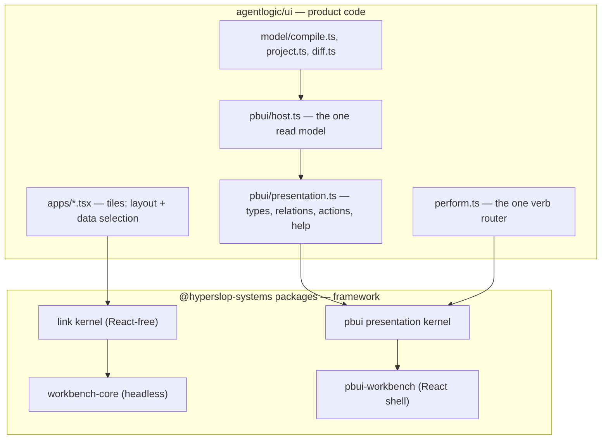
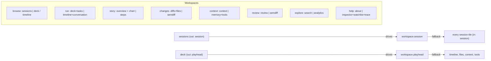
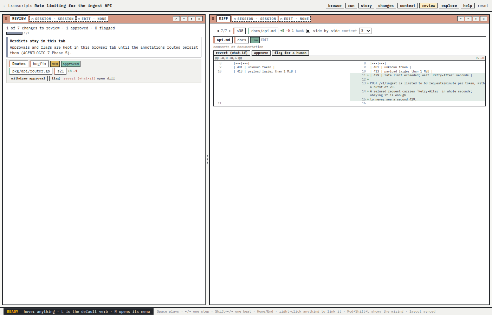
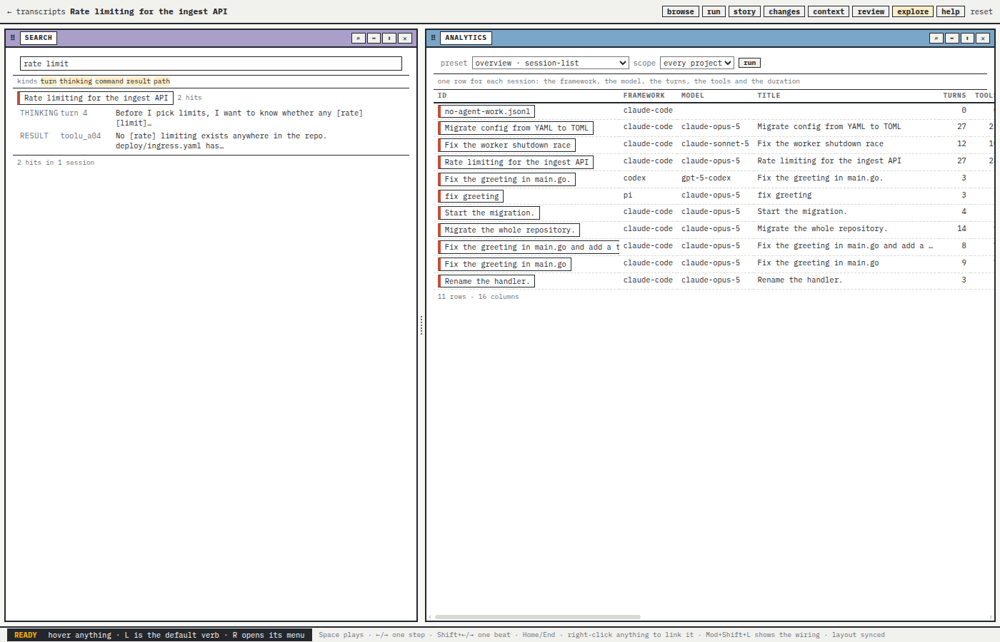
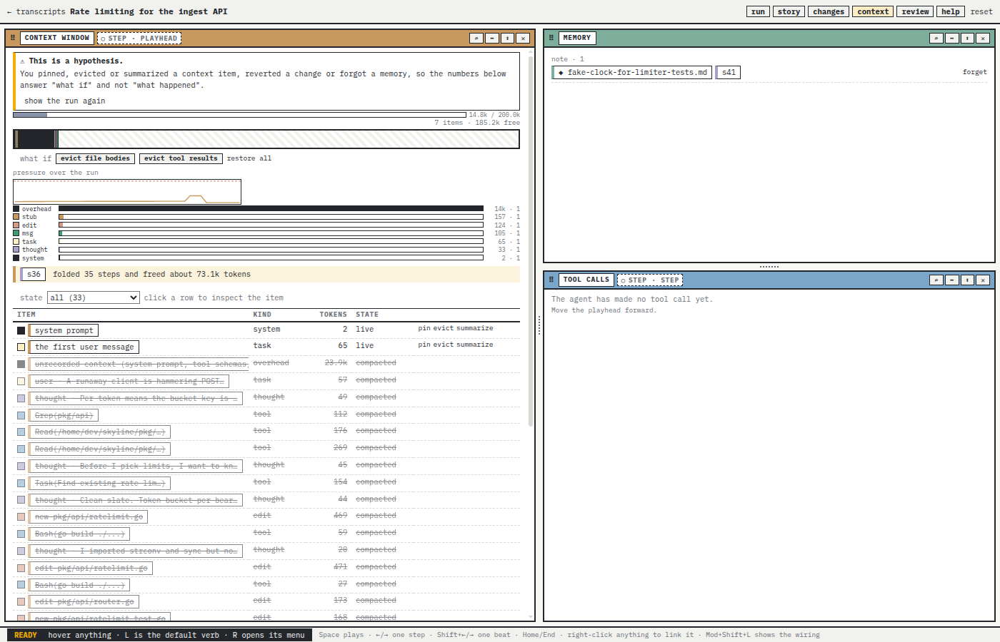
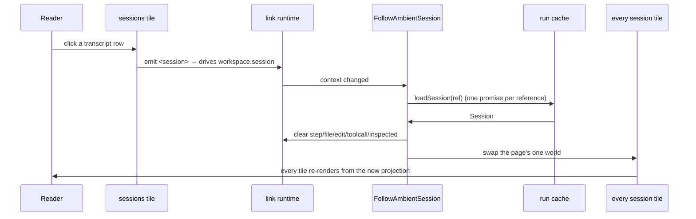

# Agentlogic: A Pragmatic Transcript Backend and the PBUI Presentation/Link Kernel — A Technical Deep Dive

Agentlogic is a single Go binary and React application that turns the JSONL transcripts of coding agents into a browsable, linkable workbench. This report documents a single day of work on 2026-09-20 that produced three ticket workspaces, thirteen commits, and a working end-to-end product: a server that accepts transcripts without authentication, explains them across many sessions, and persists what a reader decides about them; and a frontend that abandons ad-hoc React state coordination in favour of pbui's compiled presentation kernel and typed link kernel. The code lives in `/home/manuel/workspaces/2026-09-20/add-agentlogic-backend/agentlogic`, a `wsm` worktree of `github.com/hyperslop-systems/agentlogic` on branch `task/add-agentlogic-backend`.

The work has an unusual shape. The owner's request on the morning of 2026-09-20 was to "add a proper pragmatic useful backend" for transcript browsing and to adopt pbui's vocabulary of types, actions and links. The analysis that preceded implementation found that the backend already existed and worked end to end with authentication, that the frontend already compiled and projected sessions correctly, and that pbui had grown, between version 0.4 and 0.12, exactly the machinery the owner's 5 243-line prototype had hand-rolled. The genuinely missing work was therefore not a backend but a last mile: a no-auth single-principal mode, batch upload, listing and search, durable annotations, and the adoption of two kernels the product was not using. The three tickets record that discovery and then execute it. AGENTLOGIC-7 is the backend and browsing design plus its implementation; AGENTLOGIC-8 is the frontend rework on pbui's kernels; UNIFY-1 is a future-reference design that captures the cross-application duplication the analysis exposed and proposes how the four sibling apps could be unified.

The report proceeds in three parts. Part I explains the server: the build-health repairs that had to precede feature work, the single-principal authentication mode, the batch upload pipeline, full-text search with keyset pagination, durable annotations, and the resulting HTTP and data-model surface. Part II explains the frontend: what a presentation-based workbench is, the type graph and relation set that model a transcript, the action rules and the single verb router, the port and ambient-context system that replaces a React selection bus, the per-session read model, and the nine new tiles. Part III explains the unification design as a piece of engineering analysis rather than an implementation. Throughout, the report treats failures and misunderstandings as first-class evidence, because the day's most valuable output is often the list of things that did not work on the first attempt.

> [!summary]
> 1. **The backend was already there; the last mile was missing.** A `--auth none` single-principal mode of roughly fifty lines, a batch upload route, FTS5 search with keyset pagination, and an annotations side table turned a correct but gated server into a usable one. The existing auth middleware already installed a `Principal` and never rejected anonymous callers, so no route handler needed to change.
> 2. **Browsing logic splits by input cardinality, not by preference.** Work that needs one session and must run per frame (`compile`, `project`) stays in the browser; work that needs many sessions or must outlive a tab (listing, search, analytics, annotations, layout sync) moves to the server. A measurement on eight real archives from 5.9 MB to 42 MB put `compile` p95 at 237 ms against a 2 s budget, so no server-side derivation was added.
> 3. **PBUI's two kernels replace hand-rolled coordination.** One compiled presentation declares every transcript object as a typed value with a descriptor, relations, action rules bound to product verbs, help and accept mode. Typed ports and ambient contexts replace the React selection bus; explicit links are binding terms persisted in a `pbui.links` document. Tiles keep only layout and data selection.
> 4. **An extraction is only done when the copy is deleted.** UNIFY-1's ledger found the workbench HTTP host slice copied four times, the SQLite engine four times, `problem.go` in two incompatible dialects, and the frontend sync loop in three shapes. Its rule — one pbui PR plus one cutover PR per app, and a cutover that leaves a copy is not merged — is the durable part of that ticket.

## The problem this work addresses

A coding agent leaves behind a transcript: a JSONL or JSON log of every user message, assistant message, internal thought, tool call and tool result. Claude Code writes one file per session under `~/.claude/projects/`. Codex, Pi and GitHub Copilot CLI write other shapes. A transcript is the most complete record of what an agent did, and it is almost unreadable in its raw form: hundreds of thousands of tokens of JSONL, with the interesting structure — which files changed, which command failed, which context segment was evicted, which task was abandoned — implicit in the sequence rather than stated.

The product idea is to make that record browsable. The stored artifact is the transcript; the reading is a timeline of typed steps, a diff browser, a tool-call log, a context-window inspector, a plan, a memory list, and an overview. Every one of those readings is derived from one normalized document, which means the central design question is where derivation happens and how the derived objects relate to each other on screen.

The prior state of the product, established in July 2026, made a deliberate choice (decision record DR-10 in an earlier ticket) that all per-session derivation lives in the browser. The Session JSON is both the stored artifact and the wire format; the browser calls `compile(session)` to produce a `Run`, and `project(run, playhead)` to fold that Run into a `Projection` that every tile renders. This choice is what makes an improved reading possible without re-converting stored archives. The consequence on 2026-09-20 was that the server owned only storage and conversion, and had no answer to any question that needed more than one session.

Three gaps defined the day's work. First, every write was gated on an account, and the workbench persistence route refused even the root token, so a laptop deployment required a sign-in ceremony that the owner explicitly did not want. Second, the server could not list, filter, search or paginate across sessions, so a directory of transcripts was a pile rather than a library. Third, the frontend coordinated fourteen tiles through one React context object, `ui/src/store/world.tsx`, which meant that any new tile had to be taught the same selection idioms, and cross-linking between tiles was impossible by construction.

## System orientation

Before the design can be explained, the objects it manipulates must be named. The transcript pipeline has three layers of objects: what is stored, what is derived from what is stored, and what the framework uses to describe the interface.

### The stored objects

A **project** is a namespace, a slug such as `inbox` or `my-repo`, that holds transcripts. In the original design a project stood for a repository or a team; with no authentication the default project is a personal inbox. A **transcript** is a named upload inside a project, and it has **versions**. A version begins as a `draft` and becomes `committed`; pushing the same bytes again returns the existing version rather than creating a new one. Two blobs back a committed version: the **raw blob**, which is the uploaded bytes exactly as received, and the **archive blob**, which is the converted Session document. Both are content-addressed and stored once under `sha256:<hex>`.

The **Session** is go-minitrace's normalized document. It contains `turns[]`, `tool_calls[]`, `events[]`, `attachments[]`, `annotations[]`, `metrics`, `timing`, `environment` and `provenance`. Its schema version in go-minitrace 0.2.9 is `minitrace-v0.3.0`. The Session JSON is the wire format the browser reads, which is why the browser can be self-contained: one archive fetch gives every tile its input.

The **mirror**, or index, is the Session materialized into minitracedb's ten SQL tables — `sessions`, `turns`, `tool_calls`, `files`, `events` and their companions — inside the same SQLite file as the application tables. It exists so that cross-session questions become SQL. A **preset** is a named, read-only SQL query from go-minitrace; the API accepts a preset name and never SQL, which keeps the analytics surface closed.

### The derived objects

A **Run** is the browser's reading of a Session: an ordered list of typed steps (`think`, `tool`, `edit`, `create`, `taskAdd`, `taskDone`, `mem`, `memRead`, `compact`, `respond`, `user`), a reconstructed shadow workspace, context items, and a metrics table. It is produced by `compile(session)`. A **Projection** is the Run folded up to a playhead position, with any what-if overrides (pinned, evicted, squashed, skipped, forgotten) applied. It is produced by `project(run, position, overrides)` and recomputed on every seek.

### The framework objects

The **workbench document** is the pbui protocol document that describes layout: workspaces, split trees, **views** (an application plus its document bindings), and **placements** (a leaf that shows a view). It is stored server-side with a revision and edited by mutations. A **binding** is a view's reference to a document by name; agentlogic's only binding is `transcript`, whose document format is `agentlogic.transcript-ref`. A **presentation type** is a named kind of value the interface can show and act on. A **verb** is a product-defined data value that an action rule binds when a user picks a menu row, delivered to one interpreter. A **port** is a typed slot declared on an application manifest; a **link** is a binding term that makes one tile's inlet follow another tile's outlet.

| Term | Meaning | Where it is defined |
|---|---|---|
| Project | A slug namespace holding transcripts | `pkg/store/projects.go` |
| Transcript / version | A named upload and its immutable committed revisions | `pkg/store/transcripts.go` |
| Raw / archive blob | sha256-addressed uploaded bytes and converted Session | `pkg/blob/store.go` |
| Session | go-minitrace's normalized document, the wire format | `go-minitrace/pkg/minitrace/schema.go`; TS mirror `ui/src/model/session.generated.ts` |
| Mirror / index | The Session materialized into minitracedb tables | `pkg/index/index.go`, `pkg/index/query.go` |
| Preset | A named read-only SQL query | `pkg/index/query.go` |
| Run | The browser's typed reading of one Session | `ui/src/model/compile.ts` |
| Projection | The Run folded to a playhead with overrides | `ui/src/model/project.ts` |
| Workbench document | Layout, views, placements, bindings, links | `pbui/proto/.../workbench.proto` |
| Presentation type | A value kind with a descriptor, relations and rules | `ui/src/pbui/types.ts` |
| Verb | Product data an action rule binds | `ui/src/pbui/facts.ts` |
| Port / link | A typed slot and the binding term that feeds it | `ui/src/appkit/ports.ts` |

## Where the browsing logic lives

The owner's original question was whether browsing logic belongs in the browser, on the server, or in combination. The answer the design arrived at splits the computation by what it needs as input, and this principle is worth stating before any code because it explains almost every subsequent decision.

```mermaid
flowchart LR
    subgraph Browser["Browser — needs ONE session, runs per frame"]
        A1["compile(session) → Run"]
        A2["project(run, playhead) → Projection"]
        A3["hunks / lineDiff per edit"]
        A4["ports and links between tiles"]
        A5["demo-mode parse and convert"]
    end
    subgraph Server["Server — needs MANY sessions or must OUTLIVE a tab"]
        B1["list / filter / sort / paginate"]
        B2["full-text search (FTS5)"]
        B3["analytics presets across projects"]
        B4["annotations: verdicts, reverts, watchlist"]
        B5["layout documents and links"]
        B6["batch upload, default project"]
    end
    Browser -->|"GET archive (Session JSON)"| Server
    Server -->|"version rows, snippets, query rows"| Browser
```



The argument for keeping `compile` and `project` in the browser weighs three things. `compile` is deterministic over one Session and had 130 passing tests at the time; moving it to Go would duplicate 871 lines of TypeScript that encode product judgement about step kinds, drift and back-fit. `project` runs on every playback tick, so it belongs next to the renderer. And DR-10's reason still holds: a better reading must not require re-converting stored archives. The argument for the server is equally concrete: listing, searching and aggregating need the mirror tables; annotations and layouts must survive a reload and be visible from a second tab.

The only browser-side costs that could argue for server help are `compile`'s per-edit file snapshots and the quadratic compaction fold on sessions with thousands of steps. Phase 6 of the backend ticket measured these on real archives before deciding. Eight of the largest Claude Code transcripts on the machine, between 5.9 MB and 42 MB as archives and between 588 and 4 370 steps, compiled in 20 to 237 milliseconds and projected in 2 to 27 milliseconds. The p95 for `compile` was 237 milliseconds, an order of magnitude inside the two-second budget, and the heap after compiling the 42 MB archive was 274 MB. The decision was to add no server-side derived tables. The benchmark is kept as `ui/src/model/bench.test.ts`, gated on an environment variable like the smoke suite, so the measurement can be repeated on a larger corpus. The revisit condition is an archive over roughly 200 MB or a session past roughly 20 000 steps.

---

# Part I — The server

The server work landed as five commits: one for build health, one for authentication, one for upload/search, and two that share the browsing and annotation work with the frontend phases. Part I follows that order.

## 1. Build health had to come first

The workspace had `go test ./...` red before any feature work began, for two unrelated reasons, and one of them was hiding a generated-code drift that would have produced wrong types later. The decision record DR-46 ordered the go-minitrace upgrade to version 0.2.9 first, because several later phases read fields that only 0.2.9 has.

The first failure was a type change in the library. In 0.2.9, `ToolCallOutput.Success` changed from `bool` to `*bool`, because a transcript can state an outcome as unknown rather than false. Three tests and one assertion still assumed the old type:

```text
pkg/secrets/scan_test.go:20:48: cannot use true (untyped bool constant) as *bool value in struct literal
pkg/ingest/ingest_test.go:175:7: invalid operation: operator ! not defined on call.Output.Success
```

The fix in `pkg/secrets/scan_test.go` introduced a `boolPointer(true)` helper beside the existing `stringPointer`. The fix in `pkg/ingest/ingest_test.go` replaced `!call.Output.Success` with `call.Output.Failed()`, a new predicate that counts only an explicit false, which is what the assertion intends. This distinction matters: writing `call.Output.Success == nil || !*call.Output.Success` would be an ad-hoc double negative, whereas `Failed()` names the meaning.

### Generated-code drift: embedded struct promotion

The more interesting failure surfaced after the library bump, when the schema generator was regenerated. The generator in `pkg/schemagen/schemagen.go` reflects over go-minitrace's Go structs and emits a TypeScript file, `ui/src/model/session.generated.ts`. A staleness test, `TestTheGeneratedFileIsUpToDate`, compares the committed file against a fresh generation and fails if they differ.

In 0.2.9, `Metrics` embeds `ActivityCounts`. Go's `encoding/json` promotes the fields of an untagged embedded struct, so `Metrics` serializes as if those fields were declared directly on it. The generator did not know this rule, so the regenerated `Metrics` carried a bogus `ActivityCounts` object field instead of seven flat counters. The fix is a new `jsonFields(type)` helper that reproduces the promotion rule:

```go
// jsonFields returns the JSON fields of a struct the way encoding/json sees
// them: an untagged embedded struct's fields are promoted to the outer type.
func jsonFields(t reflect.Type) []field { ... }
```

After the fix, a regeneration added `record_kind`, `file_targets`, `status`, the seven activity counts and `FileTarget` to the generated TypeScript, and changed `success` to `boolean | null`. The first `make ui-test` after regeneration produced five `TS2741` errors — missing `file_targets`, `status` and `ActivityCounts` — in the browser converter and one test literal. Those were real shape changes and were filled in. The ordering mattered: bumping the library, regenerating, discovering the generator bug, fixing it, regenerating again, and only then patching the TypeScript literals avoided adding an `ActivityCounts` object that a later regeneration would have removed. The lesson recorded in the diary is that the staleness test is what turned a silent type drift into a red test, and it should be kept.

### A comment can break a SQL validator

The second build-health failure was an interaction between prose and a security check. The analytics presets are read-only SQL strings. Before any preset runs, `validatePresetSQL` scans the query for forbidden fragments such as `main.`, which is a substring that appears in unsafe cross-schema references. The `file-timeline` preset had a comment whose text happened to contain `main.`, so the preset could never run through the API; it always answered 422.

The fix strips SQL comments before the scan:

```go
func stripSQLComments(query string) string {
    var out strings.Builder
    out.Grow(len(query))
    for i := 0; i < len(query); {
        switch {
        case strings.HasPrefix(query[i:], "--"):
            end := strings.IndexByte(query[i:], '\n')
            if end < 0 {
                return out.String()
            }
            i += end // keep the newline so token boundaries survive
        case strings.HasPrefix(query[i:], "/*"):
            end := strings.Index(query[i+2:], "*/")
            if end < 0 {
                return out.String()
            }
            out.WriteByte(' ')
            i += 2 + end + 2
        default:
            out.WriteByte(query[i])
            i++
        }
    }
    return out.String()
}
```

The newline is deliberately kept on the line-comment branch, so that adjacent tokens on either side of a comment do not fuse into a different token. Two internal tests pin the behaviour — `TestPresetValidatorIgnoresComments` and `TestStripSQLCommentsKeepsTokenBoundaries` — and `TestEveryAdvertisedPresetRuns` in `index_test.go` proves that every preset the server advertises actually executes. The residual weakness, recorded honestly in the diary, is that `validatePresetSQL` still substring-matches inside string literals; a preset with `'main.'` inside a literal would be refused. That fails closed, which is acceptable, and would only be worth a tokenizer if presets grow more expressive.

Phase 0 closed with `go test ./...` green both under the workspace and with `GOWORK=off`, `make ui-test` passing 130 tests with one skipped, `make dist` green, and `pre-commit` running `go test` and `golangci-lint` with zero issues.

## 2. Single-principal no-auth mode

The owner wanted no authentication. The naive approaches — removing the auth middleware, or giving anonymous callers a constant owner identifier — both have known failure modes. The turboproof sibling application had already demonstrated the second: a constant `LocalOwner` made every visitor's workbenches listable and deletable. The design instead treats no-auth as a single-principal mode: one real user row exists, and every credential-less request becomes that user.

The change is small precisely because the authentication middleware already had the right shape. `authenticate` resolves a `Principal` and never rejects an anonymous caller for being anonymous; individual handlers enforce their own guards. The middleware gained five lines:

```go
func (s *Server) authenticate(next http.Handler) http.Handler {
    return http.HandlerFunc(func(w http.ResponseWriter, r *http.Request) {
        principal := Principal{}
        if s.local != nil {
            // Single-user mode: a request with no credential IS the local user.
            // The branches below still run, so a presented credential is
            // checked and a wrong one is still refused.
            principal = *s.local
        }
        if presented := bearerToken(r); presented != "" {
            // root token, then API token; a wrong token is still 401
        } else if cookie, err := r.Cookie(SessionCookieName); err == nil && cookie.Value != "" {
            // session cookie branch, unchanged
        }
        withPrincipal(...)
    })
}
```

The principal is installed *before* the credential branches rather than replacing them. A request that presents a wrong token is still refused with 401. This is the property that distinguishes single-principal mode from auth teardown: the mode adds an identity where there is none and never launders a bad credential.

The flag is spelled `--auth none`, not `--no-auth`, so that the value slots into UNIFY-1's proposed family flag `--auth none|local|oidc` unchanged. The empty default preserves every existing invocation by inferring the mode: an OIDC issuer implies `oidc`, otherwise `local`. `authMode` refuses conflicting combinations, and `serve_test.go` covers twelve cases:

```go
case AuthNone:
    if hasLocal || hasOIDC || hasDevice {
        return "", errors.New("--auth none cannot be combined with --root-token-file, --oidc-* or --device-pepper-file: in single-user mode nothing signs in")
    }
    return AuthNone, nil
```

At boot in `none` mode, `installLocalUser` upserts a user row with `issuer="local"`, `subject="single-user"`, and ensures a project named `inbox` with `public_read` and that user as owner. The principal it returns has `IsRoot: true`, which grants admin on every project through the existing role resolution, and a real `UserID`, which satisfies the workbench owner gate and the `workbenches.owner_id` foreign key. The importance of routing through a real row is that re-enabling authentication later needs no data migration: the workbenches already belong to a user. As a usability guard, a `--listen` left at the default `:8080` becomes `127.0.0.1:8080` in `none` mode, and the boot log prints `auth=<mode>` with a warning that the server is open.

The client side follows from two new fields on `/v1/me`, `no_auth` and `default_project`. The CLI's `resolveProject` resolves a named project, then the advertised default, then fails with an error that names `--auth none`. The `push` command treats a first argument that exists on disk as a path, so `agentlogic push ./transcripts` uploads into the inbox without a project argument; a slug that collides with a local file name is not worth a separate flag. The browser's source picker shows a single-user notice, labels the identity "the local user (single-user mode)", preselects the default project once the list arrives, and hides the sign-out button.

The gate for this phase is `pkg/server/noauth_test.go`. `TestNoAuthOpensEveryRoute` walks twenty-one routes plus the upload pipeline and asserts that none of them answers 401 or 403 in `none` mode, and that `/v1/me` reports the two new fields. `TestNoAuthWorkbenchSync` exercises create, mutate with `If-Match`, an SSE event, and list. `TestNoAuthStillRefusesAWrongToken` proves that the presented-credential branch is intact. A live smoke on `127.0.0.1:8123` with a scratch database showed `whoami` answering `no_auth=true default_project=inbox` with no token, a `push` of `testdata/demo/` committing three rows, the previously broken `file-timeline` preset answering, and a browser session reaching the workbench with no cookie.

The posture that must be stated plainly: a `none` server bound to a non-loopback address is readable and writable by anyone who can reach that port. The boot warning, the picker notice and the README say so, and there is no further guard. That is the owner's explicit choice for a laptop or a trusted network deployment.

## 3. Batch upload and the outcome refactor

The single-file upload path runs a three-step protocol: open a draft, upload the raw bytes, commit. A directory of twenty files therefore cost sixty round trips. The batch route collapses that into one multipart request that runs the same per-file pipeline on the server and returns one result per part. The subtlety is that a batch must not fail as a whole when one file is unreadable: the response is HTTP 200 with per-part statuses, so a directory push that contains one leaky or unconvertible file still commits the rest.

Achieving this required refactoring the commit handler so that it returns a value instead of writing a response. The former `handleCommit` body became `commitDraft`, which returns a `commitOutcome` carrying a status, a view and an optional problem specification:

```go
type commitOutcome struct {
    Status  int
    View    *versionView
    Problem problemSpec
}

func (s *Server) commitDraft(ctx context.Context, principal Principal, project, name string,
    version int, sourceFormat, formatHint string) commitOutcome
```

`handleCommit` decodes the body, calls `commitDraft`, and writes the outcome as an HTTP response, exactly as before. The batch handler calls `commitDraft` once per part and accumulates the outcomes. Two failure helpers, `quarantine` and `respondWithExisting`, were also converted to return values rather than writing responses. Part names use a `file:<slug>` convention: the client may name a part with the transcript's slug, and the server uses that name rather than deriving one from the filename, because the CLI knows the directory prefix that a browser upload does not. A batch holds at most one hundred parts, and a body over the upload cap is refused with 413. When a part fails, the draft opened for it is deleted, so a failed file leaves no half-committed row.

The test `TestBatchUploadMixedOutcomes` sends a committed file, a quarantined file, an existing file and an error in one request and asserts one result per file, and separately that the response body never contains the secret that triggered the quarantine. `TestBatchKeepsTheClientsSlug` pins the naming rule, and `TestBatchAdvertisedOnFormats` proves the server advertises `batch: true` so the CLI can choose the batched path.

## 4. Listing, search and keyset pagination

Listing grew from "return the rows in a project" to a filtered, sorted, paginated query across every project the caller may read. `ListFilter` carries `Query`, `Framework`, `Model`, `Since`, `Until`, `Sort`, `Order`, `Limit` and `Cursor`. `GET /v1/transcripts` lists across readable projects; the per-project route is the same query narrowed to one project. `POST /v1/query` answers an analytics preset across a caller-specified subset of readable projects.

### The full-text table

Search is FTS5 in a product-owned table, not in go-minitrace's schema. Migration `0005_no_auth_and_search.sql` creates `agentlogic_fts` with five kinds of text: what the user and the agent said, what the agent thought, the commands it ran, the results it read, and the paths it touched. The table is joined to the mirror by `session_id`, and `index.Materialize` rebuilds a session's rows after every commit, while `DeleteSession` clears them.

```sql
CREATE VIRTUAL TABLE agentlogic_fts USING fts5(
  session_id UNINDEXED, kind UNINDEXED, ref UNINDEXED, text,
  tokenize = 'unicode61'
);
```

The test `TestSearchFindsToolResultText` searches for a word that appears only inside a tool result, asserts that the snippet marks it, and asserts that nonsense finds nothing. `TestSearchIsScopedToReadableProjects` checks that a member of one of two projects sees only their own results while a root principal sees both.

### Validating a bad query is not string matching

One of the day's more instructive failures concerned how to turn a malformed FTS query into a 422 rather than a 500. The first attempt matched the string `"fts5"` in the driver's error message. The driver never uses that word. The second attempt checked the error returned by `QueryContext`, but SQLite reports an FTS5 syntax error when the rows are *stepped*, not when the statement is prepared, so the error appeared later, from `rows.Err()`. Both attempts answered 500.

The working solution runs a probe statement first:

```go
// validateSearchQuery runs a MATCH whose SQL is known-good, so the only
// possible fault is the caller's query text. The error surfaces when the
// probe is stepped, which is where the real query would have failed.
```

A probe whose SQL is correct makes any error the query's fault by construction, which is more robust than parsing driver error text that is not part of any contract.

### Keyset pagination

Pagination uses a keyset cursor rather than an offset. An offset skips or repeats rows when a push lands between two page requests, because the offset counts positions in a result set that has shifted underneath it. A keyset cursor names the last row and the next page starts strictly after it in a total order. The cursor encodes the sort value and the row's identity:

```go
type cursor struct {
    Key        any    `json:"k"`
    Project    string `json:"p"`
    Transcript string `json:"t"`
}
```

The query sorts by the requested expression, then by project, then by transcript, so the order is total; it requests `LIMIT n+1` to decide whether a next cursor exists without a second count. `TestCursorPaginationIsStable` requests five rows in pages of two, asserts each row appears exactly once, and asserts that a bad cursor and an unknown sort name both answer 422. Three snippets are returned per hit so the search tile can show context. The diary records the honest performance caveat: `SearchTranscripts` runs one snippet query per hit, which is fine at a page of one hundred and would be worth a join if the page cap grows.

## 5. Durable annotations

The prototypes had a review queue (`approve`, `flag`, `revert`), a watchlist and pinned memories. These are reader judgements about objects inside a session, and they must survive a reload and be visible from a second tab. The design chose to store them as annotations in a product-owned side table, never rewritten into the archive blob, because the archive's immutability and its `immutable` cache header depend on it. This differs deliberately from go-minitrace's `annotate sync`, which rewrites archive files.

Migration 0005 creates `annotations_app`, keyed by `(project, transcript, version, target)`. A unique partial index makes a verdict category idempotent per target:

```sql
CREATE UNIQUE INDEX annotations_app_verdict
  ON annotations_app(session_id, scope_type, target_id, category)
  WHERE category IN ('approved', 'flagged', 'reverted', 'watch');
```

`PutAnnotation` uses that index to turn a second approval into an update of the first rather than a duplicate row. The implementation carries a comment about a subtle constraint: the store pins one write connection, so a read on the pool from inside an open transaction would wait for itself. The upsert therefore does its work inside the transaction and reads the row back afterwards:

```go
// The reads happen AFTER the transaction: the store has one write
// connection, and a query on the pool from inside an open transaction
// would wait for itself.
```

The HTTP surface is four routes: list and put a version's annotations, and patch or delete one by id. A POST that creates answers 201; a POST that replaces an existing verdict answers 200 with the same id. That distinction lets a client know whether it created or replaced without listing first, and it avoids treating "a second tab approved first" as an error.

`index.SyncAnnotations` copies a session's rows into the mirror's `annotations` table after every write and after every materialization, so the `annotations` preset can see them, and a version delete cascades both. `TestAnnotationsRoundTrip`, `TestAnnotationsDeleteWithVersion` and `TestAnnotationsVisibleToPresets` pin those behaviours, including that the preset shows a verdict for the right project only and still shows it after a repeated push.

## 6. The resulting HTTP surface

The new and changed routes are small in number and uniform in error contract. The error body is RFC 9457 problem+json throughout, and an FTS syntax error maps to a 422 with `about:blank#invalid`.

| Method | Path | Purpose |
|---|---|---|
| GET | `/v1/me` | Adds `no_auth` and `default_project` |
| POST | `/v1/projects/{p}/transcripts:batch` | Batch upload; 200 with per-part statuses |
| GET | `/v1/projects/{p}/transcripts` | Filtered, sorted, paginated listing with snippets |
| GET | `/v1/transcripts` | The same listing across readable projects |
| POST | `/v1/query` | A preset across a subset of readable projects |
| GET/POST | `…/versions/{v}/annotations` | List or upsert a judgement |
| PATCH/DELETE | `…/annotations/{id}` | Edit or remove a judgement |
| GET | `/v1/presets` | Presets now advertise their parameters |

## Part I in one view

```mermaid
sequenceDiagram
    participant CLI as agentlogic CLI
    participant S as Server (net/http)
    participant DB as SQLite + blobs
    participant BR as Browser
    CLI->>S: POST …/transcripts:batch (multipart)
    S->>S: sniff format, scan raw bytes for secrets
    S->>S: commitDraft per part → commitOutcome
    S->>DB: archive blob + version row + mirror
    S->>DB: rebuild agentlogic_fts rows
    S-->>CLI: 200 {results: [...]} one per file
    BR->>S: GET /v1/transcripts?q=rate+limit
    S->>DB: FTS5 MATCH + signed keyset cursor
    S-->>BR: rows with snippets + next_cursor
    BR->>S: POST …/annotations {scope, category}
    S->>DB: upsert by (target, category); SyncAnnotations
    S-->>BR: 201 new or 200 replaced
```

---

# Part II — The workbench on the PBUI kernel

The frontend work is the part the owner cared about most: adopting pbui's presentation and link kernels instead of coordinating tiles by hand. Part II explains the concepts before the implementation.

## 1. What a presentation-based workbench is

A conventional interface renders data and attaches handlers to widgets. A presentation-based interface renders typed objects. Every chip, row, mark or header that stands for something in the domain is wrapped in a presentation that knows its type and its value. Everything else follows from the type: the label and tone come from a descriptor, the right-click menu from action rules matched by type, hover help from help rules, and a "pick one of these" prompt lights up every presentation of a compatible type on screen. Tiles stop owning behaviour; they own layout and data selection.

The second idea is that tiles have ports. A port is a typed slot on a tile. An `out` port publishes what the tile is showing or what was last clicked in it; an `in` port says what the tile is looking at. A link says one tile's inlet follows another tile's outlet. Because ports are typed, a link between different types goes through an adapter, a declared relation such as "an edit to its file". Unlinked inlets fall back to a shared ambient selection, so a workbench with no wires behaves like a normal application, and wiring is an opt-in refinement.



## 2. The type graph

The vocabulary is declared once in `ui/src/pbui/`. The type graph has an abstract `inspectable` parent and concrete children. `step` is concrete and also the parent of four kinds, which lets task and memory steps inherit step rules without inventing a fifth subtype.

```
                        inspectable (abstract)
   ┌────────┬────────┬─────┴────┬─────────┬─────────┬────────┬────────┬─────────┐
 session   step     file     edit     toolcall   ctxseg    mem      task      sem
            │
   ┌────────┼────────┬──────────┐
 thought  message  toolstep  editstep        (step subtypes)

 symbol (concrete, no parent)   workspace   |  tile · port · link  (workbench fragment)
```

Every concrete type gets a descriptor, and compilation throws if one is missing. A descriptor supplies `label(value, env)`, an optional `describe`, and a tone token. Because descriptors read the fold through `Environment.host`, labels stay live: an object that is evicted at the current cursor can render as `"(evicted)"` rather than its stale name. The design deliberately reuses the existing per-kind tone tokens in `styles/tokens.css` so that Phase A could be verified by taking a screenshot and confirming the interface was pixel-identical to before.

## 3. Descriptors, relations and actions

A **relation** is a named, typed partial function from one type to another, with an `exposure` that says how it may be used. An exposure of `acceptance` means the relation can coerce a picked object in accept mode ("show this edit as its file"); an exposure of `derivation` means a link term can name it as a standing binding. One declaration serves both readers, and because every relation reads the host, there is one data path and nothing to drift. Ten relations cover the transcript:

| Relation | From → To | Label |
|---|---|---|
| `edit.file` | edit → file | its file |
| `edit.step` | edit → step | the step that made it |
| `edit.sem` | edit → sem | its semantic class |
| `file.latestEdit` | file → edit | its latest change |
| `step.firstEdit` | step → edit | its first change |
| `step.file` | step → file | the file it touched |
| `toolcall.step` | toolcall → step | its step |
| `ctxseg.step` | ctxseg → step | where it entered |
| `mem.step` | mem → step | where it was learned |
| `task.step` | task → step | where it last changed |

The implementation is compact enough to read in full:

```ts
export const RELATIONS: readonly Rel[] = [
  rel("edit.file", "edit", "file", "its file", derivable, (edit, host) => host.file(edit.path)),
  rel("edit.step", "edit", "step", "the step that made it", derivable, (edit, host) => host.step(edit.stepId)),
  rel("edit.sem", "edit", "sem", "its semantic class", deriveOnly, (edit) => ({ id: edit.sem })),
  rel("file.latestEdit", "file", "edit", "its latest change", derivable, (file, host) => host.editsOfFile(file.path).at(-1)),
  ...
];
```

An **action rule** binds a product verb to a type. The rule carries an availability test, optional metadata, and a `bind` function that returns the verb. A rule whose effect arrives in a later phase is declared `unavailable` with the phase named in the reason, rather than being omitted, so the menu stays honest and the vocabulary stays complete.

The **verb union** is the product's half of the interface vocabulary, delivered to one interpreter:

```ts
type AgentVerb =
  | { kind: "run.jump"; stepId: string } | { kind: "run.play"; stepId: string }
  | { kind: "run.seek"; position: number }
  | { kind: "edit.revert"; editIds: string[] }
  | { kind: "edit.verdict"; editId: string; verdict: "approved" | "flagged" | null }
  | { kind: "ctx.pin" | "ctx.evict" | "ctx.squash" | "ctx.restore"; segId: string }
  | { kind: "ctx.evictKind"; segKind: string } | { kind: "ctx.restoreAll" }
  | { kind: "mem.pin" | "mem.forget"; memId: string }
  | { kind: "inspect"; reference: SerializableReference }
  | { kind: "session.show"; session: SessionValue }
  | { kind: "port.accept"; port: string; types: string[] }
  | WorkbenchVerb;
```

Groups sort alphabetically in the flat menu, so the prefixes `a-run`, `b-edit`, `c-context` and `z-tools` produce the intended order. "Open in the semantic diff" is implemented as a `show` of the edit into the role's ambient context rather than as a forced port write, so a tile that follows another keeps following and the shell's own "Show details…" family is the door that routes to a free inlet.

One decision worth recording is what the prototype called a `hunk` and what agentlogic calls an `edit`. The name `edit` was chosen because it matches `Step.kind`, and one edit step corresponds to one edit today. Memory kinds follow Claude Code's front matter (`user | feedback | project | reference`) rather than the prototype's five fixture values, because real memory files carry their kind in the YAML.

## 4. Ports, ambient contexts and binding terms

The link kernel is React-free. A port is identified as `${viewId}/${name}` and carries a contract of value type, semantic role and cardinality. A tile declares its ports on its application manifest, and the shell hands those declarations to the kernel. Ambient contexts are named shared values — `workspace.session`, `workspace.playhead`, `workspace.step`, `workspace.file`, `workspace.edit`, `workspace.toolcall`, `workspace.inspected` — that inlets fall back to and outlets drive.

```ts
/** The session a tile shows: ambient unless linked or pinned to another transcript. */
const sessionIn: PortDeclarationInput = {
  name: "session",
  direction: "in",
  contract: { valueType: "session", semanticRole: "session.current" },
  doc: "the session this tile shows",
  fallbackContext: CTX.session,
};
```

A **binding term** is what an inlet ultimately resolves to: an ambient context, a constant reference, a follow of another port, an alias, a derived term, a held value, or unresolved. The kernel evaluates the term and returns a badge that the tile renders. This is what makes the system composable: a tile never knows whether it is following the workspace, pinned to a constant, or standing at the end of a derivation chain.

Two behaviours are worth naming because they are chosen rather than accidental. An `inout` port with no term evaluates its fallback context, and its own emission drives that same context, so a click in a tile selects through the same path a link would. And `onSourceClose` decides what happens when the tile at the other end of a link closes: `ambient` returns to the fallback, while `freeze` holds the last value. The linking scene asserts what the kernel does rather than what a tile wishes.

## 5. One resolution helper

`useObjectPort` is the single helper through which every tile reads what it shows. It wraps the kernel's `evaluatePort` and `badgeOf` over the shell's snapshot with `useSyncExternalStore`. It exists because the kernel's own hook throws when no workbench is mounted above the tile, which is exactly the situation in a Storybook story or a jsdom panel test. The wrapper degrades to "unlinked and empty" there, so those render honestly without a fake shell.

The helper also enforces a correctness property that the raw kernel cannot know about. Two tiles bound to different transcripts share one link runtime, so a `<step>` from session A can land in a tile showing session B. That value must not resolve against the wrong session, so a foreign value reads as null with a `foreign: true` flag and the tile renders "from another session" instead:

```ts
const owner = (reference?.value as { sessionId?: string } | null | undefined)?.sessionId;
const foreign = reference !== null && owner !== undefined && owner !== sessionId;
return {
  value: foreign ? null : ((reference?.value as T | undefined) ?? null),
  reference,
  badge,
  foreign,
  linked: true,
};
```

A tile's own selection — the row the reader last clicked in *this* tile — lives in `useEmitted`, which reads that view's out port's last emission. It is shared across every placement of the view, persisted by nothing, and is exactly what "Link to…" reads as provenance. Nothing else remembers a selection.

## 6. The page follows the ambient session

Opening a stored session from the sessions tile raises a design question: every tile is a view of one session, so should each tile fetch and compile its own world, or should the page swap one world that all of them share? The answer is the page. The shared playhead is the property that makes the workbench an instrument, and compiling once per session is the cost model the design accepts.

`FollowAmbientSession` is a component that renders nothing and implements the swap. It watches `workspace.session`. When an empty cell appears, it publishes the page's current session so that a tile's session badge reads ambient rather than empty and the sessions tile can mark the current row. When the context names a different address, it loads that archive through the run cache, clears the other ambient contexts, and hands the new session up so the page swaps its world. On failure it puts the cell back and reports the error, so a badge never names a session no tile has.

```tsx
useEffect(() => {
  if (!ref || !ambient) return;
  if (sameTranscript(ref, world.ref) || asked.current === key) return;
  asked.current = key;
  let live = true;
  loadSession(ref)
    .then((session) => {
      if (!live) return;
      for (const context of CLEARED_ON_SWAP) shell.links.runtime.setContext(context, null);
      onSession(session, ambient);
    })
    .catch((error) => { ... });
  return () => { live = false; };
}, [key]);
```

Two details are load-bearing. Sessions are told apart by **address**, never by id, because a listing row's `session_id` is a per-version mirror key minted by the commit handler, not the archive's own identity. The first live check showed no row marked current because the follower was comparing the wrong identifiers; introducing `World.ref` and `sameTranscript` fixed it. The second detail is that the run cache keys one promise per transcript reference, so clicking the row already shown does not re-fetch and reset the playhead. The version is compared only when both sides carry one, which is what makes `latest` and version 1 the same transcript.

## 7. Model extensions

Phase C extended the read model so that later tiles and menus read the Run rather than computing on their own. Every edit step now carries a semantic class, a risk, a symbol, the agent's `why`, and the hunk the tool received. Memory steps carry their kind from front matter. The plan records task starts and drops. Steps are grouped into **beats** with per-beat statistics, and the run has totals.

Three extensions deserve explanation because they encode judgement.

**The `why` is scoped to the turn.** An edit's rationale is the thought of the edit's own turn, or the narration of the turn immediately before. The earlier `intent` field carried a thought across any number of tool-only turns, which produced a live mismatch: the edit at step 24 read "Created ratelimit_test.go" but its rationale was "I imported strconv and sync but not time". The fix also strips the truncation marker that belongs in a summary but reads wrong in a sentence.

**Classification moved into `compile`.** The classifier had been a lazy cache in the host, computed on first access. Phase D's rows and Phase E's grouping need it on every edit at once, so `compile` classifies once and stores the result. The symbol is asked on the hunk first, so an edit that changes `refill()` in a file whose first declaration is `New()` names `refill`. A Go method receiver defeated the first regex, which then fell back to the file's first declaration; the regex now accepts a receiver group.

**The revert fold.** The fold takes five override sets — pinned, evicted, squashed, skipped, forgotten — and answers them as what-ifs. After a revert, later edits are re-applied from their hunks, and an edit whose anchor is gone is marked `missed`. One exception was necessary: a whole-file write applies exactly on a dirty file, because its `after` content is the file regardless of what came before. The design's pseudocode would have marked it missed. Evict-by-kind gathers ids in the verb router at the playhead rather than storing a kind in the overrides, so "restore" on one item of that kind keeps working and "restore all" is one clear. Forget is keyed by the memory step the reader forgot from and resolved to the memory's path, so forgetting from the write or from a recall gives the same fold.

The fold also produces a **blame** map for the files tile: which edit owns each final line, or `"unknown"` past a drifted edit. This is line ownership by replay, not a git blame, and it is memoised on the projection's edit list.

## 8. The tiles

Five tiles that did not exist now read the model through the ports. The **overview** tile sums the run as of the playhead: the goal, eight statistics, semantic churn, what went wrong, and the last report. It reads the projection rather than the run, so scrubbing back changes its numbers, whereas `Run.stats` stays the whole-run total for a sessions list. The **steps** tile shows one card per beat with its measured cost and an event list. The **memory** tile groups by kind with in-window and pinned tags, and offers pin and forget. The **review** tile ranks the risky, flagged and unplaceable changes and keeps verdicts. The **watchlist** tile parks objects as live presentations.



Existing tiles gained the features the parity table asked for. The changes tile groups by file, step, class or risk and narrows to risky, new, reverted or unreviewed, with group headers as the group's own object. The diff tile carries a header card with the handle, class, risk, kind, standing, rationale and verdict, plus previous/next and approve/flag. The files tile has a final/original toggle and a blame gutter toned by the writing class. The context tile has "evict file bodies", "evict tool results", "restore all", and a pressure sparkline against the limit. Two tiles that came from the server phase, **search** and **analytics**, read the FTS route and the preset route; a heading emits a session, a turn hit emits its step and seeks, and a command or result hit emits its tool call.

The verdict flow is worth following end to end because it spans both parts. Approving an edit in the review tile dispatches `edit.verdict` through the verb router. The world updates its local verdict state, and because the world has a server address, it also persists the judgement through `store/annotations.ts`. On remount, the annotations endpoint hydrates the version's rows back into the world's shapes. The live check showed a verdict as `edit s21 approved`, a reload showing `1 approved` again, and the annotations preset listing it.


*The source picker in `--auth none` mode: no sign-in, the inbox preselected, and a single-user notice.*


*The `browse` workspace after Phase 3: the sessions tile drives `workspace.session`; clicking a row swaps the page's one world.*



*An approved edit in the review tile, persisted through the annotations route and restored on reload.*



*The `explore` workspace: FTS5 hits grouped by session with snippets, and an analytics preset answered as a table whose session cells are typed chips.*


*The `story` workspace: the run summed as of the playhead, with beats as the step granularity.*


*Changes grouped by semantic class, and the files tile's blame gutter toned by the writing class.*



*The context tile's pressure sparkline against the window limit, with the memory tile alongside.*

## 9. Layout sync through the kernel

The hand-rolled server loop that had lived in `workbenchContext.tsx` is gone. `store/sync.ts` is the product's HTTP client over `workbench-core/sync`. It implements `get`, `create`, `mutate` with `If-Match: "workbench-<id>-<rev>"` and the operation id as an idempotency key, maps 409, 422 and 404 to a typed error, and opens a lazy event stream that announces only revisions newer than the one held. The sync loop starts when `/v1/me` reports `authenticated`, which is true in single-user mode, so layouts persist server-side without any interface change. The test `store/sync.test.ts` exercises the client mapping, the stream filter, and one loop round trip against a real shell.

## Part II in one view



---

# Part III — The unification design

UNIFY-1 is analysis, not implementation, and its value is that it preserves a duplicated-code survey while the evidence was fresh. It was written from the same seven evidence reports that fed AGENTLOGIC-7, and every figure in it was re-verified before being cited.

Its central observation is that templates produce copies while imports produce a platform. The four sibling applications — datalab, hyperblog, turboproof and agentlogic — were each stamped from the same Go template at a time when pbui changed weekly, and they never converged. The only genuinely shared code is pbui's Go validator and protojson codec, `authkit` (adopted by two of four), glazed, logcopter and the npm packages. Everything else that looks shared is a copy.

The duplication ledger counted the copies and named their differences. The workbench HTTP host slice exists four times, five counting pbui's own SPA mount; hyperblog's header literally calls itself "the FOURTH copy" and asks not to be improved in place. The SQLite open-and-migrate engine exists four times in three variants; `problem.go` exists in two incompatible dialects, `code`/`hint` versus RFC 9457 `type`/`title`/`extra`; the frontend sync loop exists in three shapes, and turboproof's `SyncClient` is the cleanest. The pbui Go pseudo-version differs in each `go.mod`, hidden locally by the root `go.work`.

The design proposes four ideas that share one completion rule — an extraction is done only when every app deletes its copy, a rule inherited from an earlier ticket's DR-37:

1. **Auth unification.** Mechanics live in `pbui/pkg/authkit`; vocabulary (token prefix, scopes, cookie name, display names) stays in the host. One server flag `--auth none|local|oidc`. The `none` mode is a real synthetic user row, never a constant owner id.
2. **A backend host kit** in `pbui/pkg`: `workbenchhost`, `httpkit` (RFC 9457), `sqlkit`, `webui`. This closes the earlier DR-32, which said to promote the SSE hub and handler skeleton once two hosts held identical copies and which now has four.
3. **Frontend host wiring**: `createHostApp` owning stylesheet order, persistence and sync wiring, plus a shared `SyncClient` and auth client. This depends on datalab's workbench cutover landing first, because datalab-ui is the last product on a private window manager and extracting the abstraction from three consumers would shape it around the exception.
4. **A smaller npm package set**: merge `pbui`, `workbench-protocol`, `workbench-core` and `pbui-workbench` into one package with subpath exports; merge `pbui-sandbox` and `pbui-chat` into `pbui-agent`; demote the demo packages; move `datalab-ui` into the datalab repository. Ten publishable packages become three.

Six decision records `DR-U1` through `DR-U6` and a six-ticket sequencing table with per-app touch lists and gates complete the design. The sequencing is ordered so that a lockstep pbui pseudo-version bump is the first commit of every extraction, which avoids the failure mode in which a change compiles locally against the checkout but not against the pinned module. The rule that gives the design teeth is DR-U5: each extraction is one pbui PR plus one cutover PR per app, and a cutover PR that leaves a copy behind is not merged.

---

# The phase sequence and how it was validated

The work ran as two interleaved phase lists. The backend ticket defined six phases and the frontend ticket six more. Phases were worked in the recommended order, with a commit at each validated boundary and a diary step in investigation format. The owner asked for brutalist thermal work slips before and after each phase, and those YAML files are preserved under `sources/work-slips/` in each ticket.

| Phase | Ticket | What it delivered | Key gate |
|---|---|---|---|
| 0 | A7 | go-minitrace 0.2.9, schemagen fix, comment-safe preset validator, pbui 0.12.1 | `go test ./...` green; `make ui-test`; `make dist` |
| 1 | A7 | `--auth none`, inbox, CLI defaults, single-user picker | `TestNoAuthOpensEveryRoute` (21 routes), live smoke |
| 2 | A7 | `commitDraft`, batch route, migration 0005, FTS search, cross-project query, reindex | `TestBatchUploadMixedOutcomes`, `TestSearchFindsToolResultText`, `TestCursorPaginationIsStable` |
| 3 | A7 | run cache, sessions tile, session ports, the page follows the session, sync client | `scenes/browse.test.tsx`, `store/sync.test.ts` |
| A | A8 | vocabulary declared and Provider mounted; nothing visible changes | screenshot diff against the prior phase |
| B | A8 | atoms become presentations; object menu, help, accept banner mount | live menu resolution; updated panel tests |
| C | A8 | beats, sem/risk/symbol/why, five override sets, blame, memory kinds | four new model test suites |
| D | A8 | ports and ambient contexts replace the selection bus; link mode on | `scenes/linking.test.tsx` (eight scenes) |
| E | A8 | overview, steps, memory, review, watchlist; richer existing tiles | new panel tests; screenshots 14–17 |
| 5 / F | A7 + A8 | annotations routes and mirror copy; search and analytics tiles; verdicts and watchlist persisted | `TestAnnotations*`; scene 14 |
| 6 | A7 | measured compile/project on eight real archives; decision to add no server derivations | `sources/measurements/01-phase-6-compile-bench.txt` |

The validation boundary is not the commit boundary. Focused commits were treated as checkpoints; the full gates — `go test ./...` under the workspace and with `GOWORK=off`, `make ui-test`, `make dist`, and `golangci-lint` — ran at phase boundaries. The frontend work has no Go-side gate beyond the catalog parity test, so `make ui-test` and a rebuilt distribution were the visible checks. Every phase that changed what the interface showed was verified live against a server on `127.0.0.1:8123` with real transcripts, and screenshots were captured as the work progressed at the owner's explicit request.

The final state of the branch is twelve implementation commits on top of the ticket-documentation commit, touching 268 files with 17 431 insertions and 1 113 deletions, of which 221 files and 15 231 insertions are code outside `ttmp/`. The Go side accounts for 39 files and 3 403 insertions; `ui/src` accounts for 176 files and 11 719 insertions. The interface test suite finished at 26 files and 220 tests with one skipped, plus a token check that pbui owns every token it reads.

# Failure modes and tricky details

The diary entries preserve failures in detail, and several of them are more instructive than the successes.

**A safeguard terminated an analysis agent.** The first backend-analysis agent stopped before writing anything because the API refused one of its turns. The likely trigger was the credential-detection code in `pkg/secrets`, whose brief asked the agent to describe regex patterns and fake-token fixtures. The relaunched brief instructed the agent to describe the package from exported names only and never quote patterns. The lesson is that analysis briefs touching secret-scanning code should say up front not to reproduce the patterns.

**Zsh history expansion broke a changelog command.** `docmgr changelog update --file-note "$DD:the deliverable"` failed because zsh treated `:t` as a history modifier on the variable. Writing `${DD}:the deliverable` fixed it. In zsh, a variable followed by a colon and a letter must be braced.

**A `pkill` pattern matched the shell running it.** `pkill -f "agentlogic serve …"` matched the invoking shell and killed the command with exit 144. `pkill -x agentlogic` is the safe spelling.

**An FTS error is reported when rows are stepped.** Documented above: the fix was a probe statement, after two attempts that matched driver error text which the driver never emits.

**A singleton app cannot have two views.** Placing `deck` in two workspaces minted two views of a singleton and the shell threw `duplicate_singleton` at construction. The fix is one view with two leaves.

**An untested id comparison produced a wrong current row.** The sessions tile marked no row current because a listing row's `session_id` is a per-version mirror key, not the archive's identity. The fix was to compare by address through `World.ref` and `sameTranscript`.

**A falsified test held only in jsdom.** Two changes-panel tests asserted that a chip's `onSeek` did not fire on Enter and Space. The assertion held only because jsdom never synthesises a click from Enter on a button; a real browser bubbled that click to the row. The tests now assert the contract that matters — the chip's own handler runs once — rather than the jsdom artefact.

**A whole-file write needed an exception in the revert fold.** The design's pseudocode would have marked it missed on a dirty file; the implementation applies it exactly. This is the kind of edge case that only appears when the model meets a real transcript.

**Generated-code drift hides in a staleness test.** The `ActivityCounts` embedding bug would have silently corrupted the TypeScript types had the generator not been regenerated as part of the library bump. The staleness check converted a silent drift into a red test.

**An unexplained linked timeline.** During one live check a linked `timeline ×2` appeared in the changes workspace somewhere between a row click and a right-click, with three mutate batches in the server log. A scripted replay of the same sequence placed nothing, and the anomaly was not reproduced. It is recorded as warranting a second pair of eyes rather than being explained away.

# What warrants a second pair of eyes

The diaries name the residual risks rather than closing them. The single-principal mode's exposure on a non-loopback address is deliberate and documented but unguarded. The FTS design indexes truncated tool results and its size on a large corpus has not been measured. The batch handler commits parts sequentially with a per-part conversion timeout, so twenty large files can hold a request open for twenty timeouts; the CLI's batch size of twenty is the mitigation. The revert fold does string replacement per seek and asks for memoisation if profiling shows it. The overview's token figure is an estimator's input count, and its label says "estimated". The session-list preset names its mirror key `id` rather than `session_id`, and the panel resolves both.

# Open questions and next steps

The frontend's `session.compare` verb — opening a compare workspace with two pinned columns — remains designed but unshipped, as does the chart quartet that the design reserves types for and explicitly defers. The pre-generated text for a preset's parameters exists, but the analytics tile leaves the chart's colour encoding to its own decision. On the server, retention and blob garbage collection remain undesigned in every app, which the unification design notes as an open question it does not touch.

The largest open item is the unification ticket series itself, which is analysis-ready and not started. Its first two steps — the package merge and the workbench-host extraction — would delete the most duplicated code in the family. Its risk is named honestly: a kit must take only what is byte-identical or nearly so, or it grows a flag per difference. The completion rule is what keeps that honest.

# References

- AGENTLOGIC-7 intern guide: `agentlogic/ttmp/2026/09/20/AGENTLOGIC-7--pragmatic-backend-for-uploading-browsing-and-visualizing-agent-transcripts-in-the-pbui-workbench/design-doc/01-intern-guide-transcript-backend-browsing-model-and-pbui-workbench-integration.md`
- AGENTLOGIC-8 intern guide: `agentlogic/ttmp/2026/09/20/AGENTLOGIC-8--rework-the-agentlogic-workbench-on-pbui-principles-the-pbui-agent-workbench-vocabulary-of-types-actions-links-and-tiles/design-doc/01-intern-guide-adopting-the-pbui-kernel-in-agentlogic-and-reaching-pbui-agent-workbench-parity.md`
- UNIFY-1 design: `agentlogic/ttmp/2026/09/20/UNIFY-1--unify-the-four-hyperslop-apps-auth-modes-a-backend-host-kit-frontend-host-wiring-and-a-smaller-npm-package-set/design-doc/01-unification-design-auth-host-kit-frontend-wiring-package-consolidation.md`
- Coordinating diaries: `reference/01-diary.md` in each ticket; AGENTLOGIC-7 also carries seven per-analysis-agent diaries.
- Server code: `pkg/server/{auth,serve,handlers_batch,handlers_annotations,handlers_query}.go`, `pkg/store/{search,annotations}.go`, `pkg/index/{index,query}.go`, `pkg/cli/{serve,commands,reindex}.go`, `pkg/store/migrations/0005_no_auth_and_search.sql`.
- Frontend code: `ui/src/pbui/{types,host,values,facts,descriptors,relations,actions,help,presentation,perform}.ts`, `ui/src/appkit/ports.ts`, `ui/src/store/{useObjectPort,sessionFollow,runCache,world,sync,annotations}.tsx`, `ui/src/model/{compile,project,overview,grouping,blame,sem}.ts`.
- Phase 6 measurement: `agentlogic/ttmp/2026/09/20/AGENTLOGIC-7--…/sources/measurements/01-phase-6-compile-bench.txt`.
- Screenshots and wireframes: `sources/screenshots/` and `design-doc/wireframes/` in AGENTLOGIC-7 and AGENTLOGIC-8; the seven figures in this note are copied into `_assets/`.
