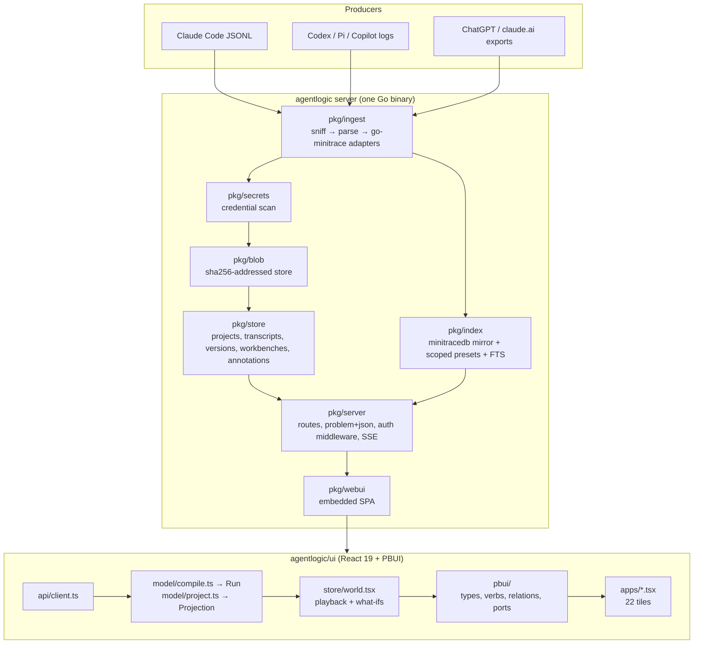
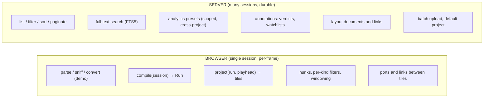
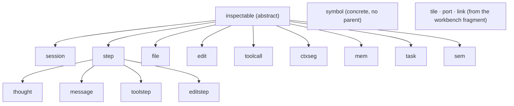
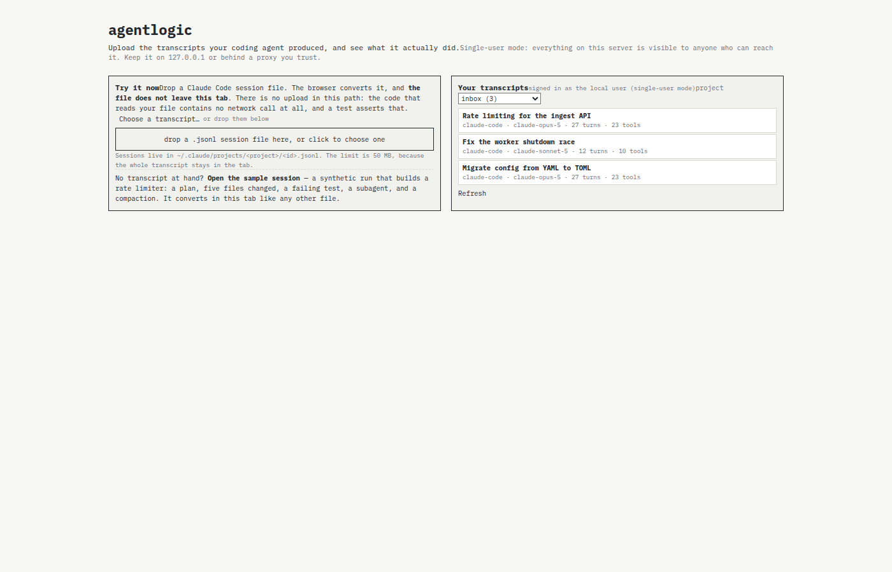
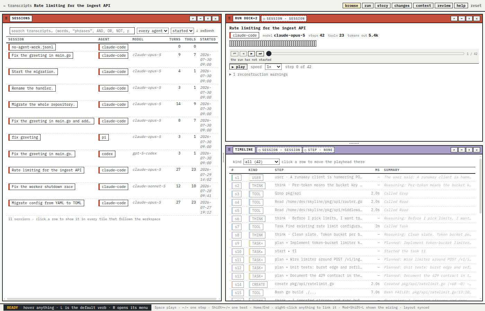
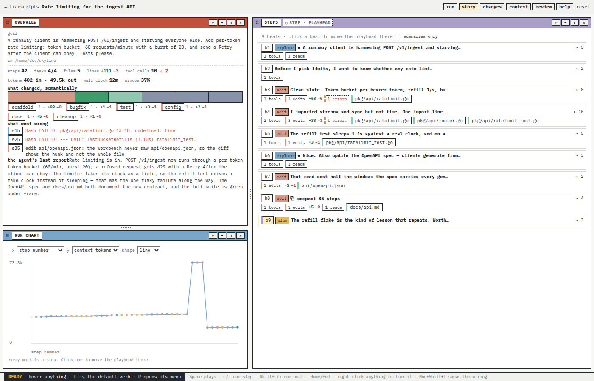
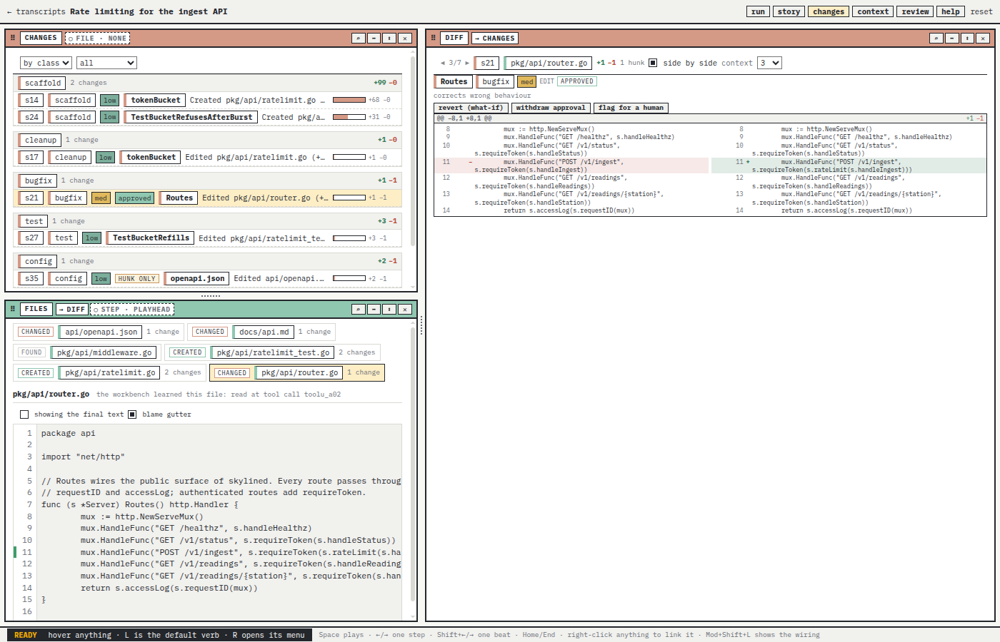

# Agentlogic: Transcript Backend and PBUI Kernel Implementation — A Technical Deep Dive

This report documents a single day of concentrated engineering on `agentlogic`, a Go server with a React workbench that stores coding-agent transcripts, converts them to a normalized form, and lets a reader browse them as linked tiles. The engineer under discussion (referred to below as "the implementer") had completed three design tickets earlier in the day — AGENTLOGIC-7, AGENTLOGIC-8 and UNIFY-1 — and then, on explicit instruction, executed the first two tickets as working software. The outcome is thirteen commits on `task/add-agentlogic-backend`, 339 changed files, 38 012 insertions and 1 111 deletions, a green Go test suite, 220 TypeScript tests, and a live single-user application that uploads a directory of transcripts, lists and searches them, and renders them in the PBUI presentation and link kernel.

The purpose of this note is not to summarize what shipped. It is to explain the architecture well enough that a future reader can modify it safely, and to preserve the engineering reasoning — including the mistakes and the dead ends — because that reasoning is the part that decays fastest. The note is organized as a sequence of chapters that build on one another: the system in its own terms, the backend work, the browser-versus-server decision, the frontend kernel adoption, the unification design, the verification evidence, and the lessons.

> [!summary]
> - A correct backend already existed; the real work was a ~50-line single-principal mode, batch upload, listing, full-text search, and durable annotations, plus a browser workbench moved onto PBUI's presentation and link kernels.
> - The decisive architectural rule is a split by input cardinality: one session and per-frame folds stay in the browser; anything needing many sessions or durability moves to the server. A benchmark on 42 MB archives (compile p95 237 ms) confirmed the split.
> - Every claim in this note is anchored to a commit, a ticket document, a source file, or a captured measurement. The failures are recorded with the same care as the successes.
> - The work left one unexplained artifact (a spontaneously linked `timeline ×2`) and several open questions, which are stated rather than concealed.

---

## 1. Why this note exists

Work that ships without its reasoning becomes opaque within weeks. The implementer left unusually complete primary sources: three intern-facing design docs (1 281, 1 133 and 422 lines), three coordinating diaries, twenty analysis-agent reports and diaries in `sources/`, fifteen SVG wireframes, and a directory of screenshots. Those artifacts are precise but distributed. This note assembles them into one narrative that a reader can follow without opening eight documents, and it adds a layer the ticket docs do not contain: a comparative analysis of *why* each decision was correct given the constraints at the time.

The scope is the three tickets and their implementation. UNIFY-1 is design-only for the future unification of the four Hyperslop applications, and it appears here because it constrained one naming decision (`--auth none`) and because it is part of the day's intellectual output. The note does not cover products outside those three tickets.

### 1.1 The three tickets

| Ticket | Goal | Nature | Output |
|---|---|---|---|
| **AGENTLOGIC-7** | A pragmatic backend for uploading, browsing and visualizing agent transcripts in the PBUI workbench | Design then implementation | Intern guide (DR-40..46), 7 analysis agents, 6 phases; Phases 0, 1, 2, 3, 5, 6 implemented |
| **AGENTLOGIC-8** | Rework the workbench on PBUI principles: types, actions, links and tiles to reach parity with the 5 243-line prototype | Design then implementation | Intern guide (DR-50..57), 15 wireframes, 3 analysis agents; Phases A–F implemented |
| **UNIFY-1** | Unify the four Hyperslop applications: auth modes, a backend host kit, frontend host wiring, a smaller npm package set | Design only, for future reference | Unification design with a duplication ledger, DR-U1..U6, a six-ticket sequence |

The ticket documents live inside the agentlogic worktree because the docmgr root for the workspace is `agentlogic/ttmp` (set in `.ttmp.yaml`), not the workspace root. This is worth recording because it is the kind of detail that costs an hour to rediscover.

### 1.2 The workspace

The work happened in a `wsm` workspace at `/home/manuel/workspaces/2026-09-20/add-agentlogic-backend` that holds worktrees of `agentlogic`, `datalab`, `pbui`, `hyperblog`, `turboproof`, `plot`, `glazed` and `go-minitrace` on the branch `task/add-agentlogic-backend`, with a `go.work` spanning the Go modules. The agentlogic worktree is the product and the documentation home. The `go.work` is a convenience for local editing; every Makefile and Dockerfile uses `GOWORK=off` and resolves dependencies to pinned versions, a distinction that matters for build reproducibility and that UNIFY-1 identified as a source of drift.

| Repository | Role | Pinned version in this work |
|---|---|---|
| `agentlogic` | The product: Go server + `ui/` SPA | — |
| `go-minitrace` | Session schema, six converters, SQLite mirror, nine SQL presets | `v0.2.9` |
| `pbui` | Presentation kernel, link kernel, components, workbench layers, Go validator | Go `v0.0.0-20260920185141-374575833789`; npm `0.12.1`, `pbui-workbench 0.6.1`, `workbench-core 0.2.0`, `workbench-protocol 0.5.0` |
| `glazed` | CLI framework for every agentlogic verb | (transitive) |

The npm and Go pins moved during the work. The npm packages moved from `pbui 0.12.0`/`pbui-workbench 0.6.0` to `0.12.1`/`0.6.1` in Phase 0. The Go module moved from a July pseudo-version to commit `3745758` because the design's "one-line fix" — chaining `workbench.LinksDocumentValidator` — assumed a symbol that the older pin did not contain. The implementer discovered this only when `go test ./pkg/workbenchapp` failed with `undefined: workbench.LinksDocumentValidator`, and then bumped the pin deliberately rather than reaching for a workaround.

---

## 2. Orientation: the system in its own terms

This chapter defines every term the later chapters depend on. A reader new to the codebase should be able to describe the architecture after reading it.

### 2.1 What the product does

A coding agent leaves behind a *transcript*: a JSONL or JSON log of every message, thought, tool call and tool result. `agentlogic` accepts such a file, stores the raw bytes once by content hash, converts it with the `go-minitrace` library into a normalized **Session** document, stores that as well, mirrors the Session into SQL tables for cross-session questions, and serves a React **workbench** made of **tiles**. Each tile shows one reading of the Session: a timeline of typed steps, the diffs, the tool calls, the context window, the plan. The Session JSON is simultaneously the stored artifact and the wire format; the browser derives every view from it.

### 2.2 The necessary vocabulary

The following terms are used with fixed meanings throughout. They are introduced in dependency order: a Project holds Transcripts, a Transcript has Versions, a Version points at blobs and a Session, a Session compiles into a Run, and a Run projects into a Projection.

| Term | Meaning | Defined or produced in |
|---|---|---|
| **Project** | A namespace (slug) holding transcripts. In single-user mode the default is a project named `inbox`. | `pkg/store/projects.go` |
| **Transcript** | A named upload inside a project. It has versions; a version is `draft` until committed. | `pkg/store/migrations/0001_init.sql` |
| **Version** | One attempt at a transcript. Repeated pushes of the same bytes return the existing version instead of minting a new one. | `transcript_versions` table |
| **Raw blob / archive blob** | The uploaded bytes and the converted Session JSON, each stored once under `sha256:<hex>`. | `pkg/blob/store.go` |
| **Session** | go-minitrace's normalized document: `turns[]`, `tool_calls[]`, `events[]`, `attachments[]`, `annotations[]`, `metrics`, `timing`, `environment`, `provenance`. | `go-minitrace/pkg/minitrace/schema.go`; TS mirror `ui/src/model/session.generated.ts` |
| **Mirror / index** | The Session materialized into minitracedb's ten tables in the same SQLite file, scoped per project at query time through temporary views. | `pkg/index/index.go`, `pkg/index/query.go` |
| **Preset** | A named read-only SQL query from go-minitrace. The API accepts a preset name, never raw SQL. | `pkg/index/query.go` |
| **Run** | The browser's reading of a Session: an ordered list of typed **steps** produced by `compile(session)`. | `ui/src/model/compile.ts` |
| **Projection** | The Run folded up to a playhead position with what-if overrides. Produced by `project(run, position, overrides)`. | `ui/src/model/project.ts` |
| **Workbench document** | The PBUI protocol document describing layout: workspaces, split trees, views and placements, with a monotonic revision. | PBUI `workbench.proto` |
| **Presentation type** | A named kind of value the UI can show and act on (`step`, `edit`, `file`, `toolcall`, …). PBUI compiles a closed set of types, descriptors, relations and action rules into one presentation. | `pbui/src/presentation/model/define.ts` |
| **Verb** | A product-defined data value that an action rule binds when the reader picks a menu row; delivered to one interpreter. | `pbui/src/presentation/createPbui.tsx` |
| **Port / link** | A typed slot declared on an app manifest. A tile publishes into it and reads from another; links between ports are binding terms persisted in a `pbui.links` document. | PBUI `links/`, `pbui-workbench/src/links/hooks.ts` |
| **Annotation** | A durable statement about an object inside a session: a verdict, a revert, a watch. Stored in a side table, never rewritten into the archive. | `pkg/store/annotations.go` |

### 2.3 The parts and how they relate



The diagram separates three concerns. The server owns storage, conversion and multi-session reads. The browser owns the derivation of one session into views. The kernel mediates between tiles through typed objects rather than through a shared mutable selection.

### 2.4 The data path, end to end

A concrete walkthrough of one upload and one view is the fastest way to internalize the architecture. The steps below describe the code as it works after this work.

1. The operator starts the server: `agentlogic serve --auth none --db ./agentlogic.db` (`pkg/cli/serve.go`). Migrations run, the mirror schema is created in the same SQLite file, a second read-only handle is opened for analytics, the blob directory is created, one local user and the `inbox` project are ensured, and the SPA is embedded at `/ui/`.
2. `agentlogic push ~/.claude/projects/x/` runs the three-step protocol for each file, or one multipart request per batch of twenty when the server advertises `batch: true` (`pkg/client/client.go`). For a single file: open a draft at `POST …/transcripts/{name}/versions`, check `HEAD /v1/blobs/sha256:…` to skip a known blob, `PUT …/versions/{v}/raw` with a `Digest` header, then `POST …/versions/{v}/commit`.
3. The commit handler (`pkg/server/handlers_transcripts.go`) scans the raw bytes for credentials, sniffs the format from structural keys (`pkg/ingest/sniff.go`), converts through the matching go-minitrace adapter, scans the Session again, writes the archive blob, mints a per-version mirror id `ses_…`, commits the row, and materializes the mirror — including the FTS rows — after the transaction.
4. The browser opens `/ui/`, sees `no_auth: true` from `/v1/me`, loads the `inbox` listing, and fetches `GET …/versions/latest/archive`, which returns Session JSON with `Cache-Control: private, no-cache`.
5. `WorldProvider` memoizes `compile(session)` once per world. Each tile calls `useWorld()` or the PBUI host and reads the `Projection`. Clicking a step in the timeline emits into a port; the link kernel decides which tiles observe it. The layout is persisted server-side through `workbench-core/sync` with `If-Match` and an idempotency key.

Steps 1, 2 and 4 are the ones the single-user mode changed. Steps 3 and 5 were already correct.

---

## 3. The backend: single-user mode and the browse API

The design's headline finding was that the backend already existed and worked with authentication. The gap was not storage or conversion; it was the last mile that turns a correct server into a usable product. This chapter covers that last mile: authentication as a mode rather than a teardown, batch upload, listing and pagination, full-text search, cross-project presets, annotations, and the build-health work that had to precede all of it.

### 3.1 Authentication is middleware, and single-user mode is one principal

The authentication model in `pkg/server` is a middleware plus per-handler guards that all read one `Principal`. The middleware `authenticate` resolves a bearer token or the `agentlogic_session` cookie and, crucially, installs a zero principal for anonymous callers instead of rejecting them. Rejection happens later, in guards such as `requireSignedIn`, `requireRole` and `requireWorkbenchOwner`.

That structure made the minimal change small. When `--auth none` is set, the server installs one synthetic local user as the principal for every request that carries no credential. The credential branches still run, so a wrong token is still refused. The code reads:

```go
// pkg/server/auth.go — authenticate
principal := Principal{}
if s.local != nil {
    // Single-user mode: a request with no credential IS the local user.
    // The branches below still run, so a presented credential is
    // checked and a wrong one is still refused.
    principal = *s.local
}

if presented := bearerToken(r); presented != "" {
    switch {
    case s.rootToken != "" && presented == s.rootToken:
        principal = Principal{IsRoot: true}
    default:
        user, token, err := s.store.ResolveToken(r.Context(), presented)
        if err != nil {
            problemUnauthenticated(w, r, "the credential is not valid")
            return
        }
        principal = Principal{UserID: user.ID, /* … */ Scopes: strings.Fields(token.Scopes)}
    }
} else if cookie, err := r.Cookie(SessionCookieName); err == nil && cookie.Value != "" {
    // … the cookie branch, unchanged
}
```

The CLI side refuses contradictory flags before boot and ensures the local user and project:

```go
// pkg/cli/serve.go
func authMode(settings *serveSettings) (string, error) {
    // …
    return "", errors.New("--auth none cannot be combined with --root-token-file, --oidc-* or " +
        "--device-pepper-file: in single-user mode nothing signs in")
}

func installLocalUser(ctx context.Context, database *store.Store) (*server.Principal, error) {
    user, err := database.UpsertUser(ctx, server.LocalIssuer, server.SingleUserSubject, "", "local user")
    // …
    _, err = database.GetProject(ctx, server.DefaultProjectName)
    if errors.Is(err, store.ErrNotFound) {
        _, err = database.CreateProject(ctx, /* Name: "inbox", Title: "Inbox", PublicRead: true, OwnerID: user.ID */)
    }
    // …
}
```

Three details make this design better than the obvious alternatives. First, it uses a real user row (`users(issuer="local", subject="single-user")`) rather than a constant owner identifier. UNIFY-1 records that turboproof had used a constant owner and that every visitor's workbenches became listable and deletable as a result; routing through a real row keeps every foreign key valid and means re-enabling authentication later is a flag change, not a data migration. Second, the local principal is installed *before* the credential branches rather than replacing them, so the mode adds an identity where there is none and never launders a wrong token. Third, `IsRoot: true` and an empty scope list grant admin on every project through the existing `resolveRole`, so every API route opens without a single per-handler edit (the ticket counts 48 API routes plus 5 static ones).

The endpoint `/v1/me` advertises the mode so that clients can adapt:

```json
{
  "authenticated": true,
  "no_auth": true,
  "default_project": "inbox",
  "is_root": true,
  "user_id": "usr_…",
  "name": "local user"
}
```

The CLI uses `default_project` so `agentlogic push <dir>` needs no project argument, and the picker hides the sign-in column entirely. The exposure is stated rather than hidden: in `none` mode on the default listen address, the flag changes `:8080` to `127.0.0.1:8080`, the boot log prints `auth=none` with a warning, the picker shows a single-user notice, and the README leads with the two-command quick start.

**Why this is the right shape.** The alternatives were to delete the authentication code and the six tables that exist only for it, or to make every handler public and the owner columns nullable. Deletion is irreversible and would have to be rebuilt for any hosted deployment; nullable owner columns break the invariants that `requireWorkbenchOwner` and the foreign keys enforce. The single-principal mode is reversible, keeps the schema, and is roughly fifty lines across four files.

### 3.2 Batch upload: a value-returning commit

A directory push in the original design was three HTTP round trips per file. A thousand-file directory therefore meant three thousand requests. Phase 2 introduced `POST /v1/projects/{p}/transcripts:batch`, a streaming multipart endpoint that runs the existing per-file pipeline server-side and returns one result per part.

The enabling refactor was to split the HTTP response from the commit decision. The single-commit handler's body became a function that returns a value:

```go
type commitOutcome struct {
    Status  int
    View    transcriptView
    Problem *problemSpec
}

func (s *Server) commitDraft(ctx context.Context, principal Principal, project, name string,
    version int, sourceFormat, formatHint string) commitOutcome {
    // scan the raw bytes, sniff, convert, rescan, write the archive blob, commit, materialize
}
```

The single route wraps this in `respond`, so its answers are byte-identical to before. The batch route calls `commitDraft` once per multipart part and accumulates outcomes, so a leaky or unconvertible file no longer stops a directory push. The handler streams the body through `MultipartReader`, caps the part count at one hundred, and enforces the upload byte limit. One subtlety: the server sees a filename, but the CLI knows the directory the file came from. The client therefore names each part `file:<slug>` when it has a better name than the base filename, and the server prefers the client's name.

The pseudocode for the handler:

```go
func (s *Server) handleBatchUpload(w, r) {
    principal, ok := s.requireRole(w, r, project, store.RoleWriter)
    if !ok { return }
    reader, err := r.MultipartReader()           // streaming, bounded by limitBody
    override := ""                               // optional leading "source_format" field
    results := []batchResult{}
    for part := reader.NextPart(); part != nil; part = reader.NextPart() {
        if part.FormName() == "source_format" { override = readSmall(part); continue }
        name := transcriptNameFor(part.FileName())     // slug from the filename or `file:<slug>`
        version, _ := s.store.Tx(ctx, func(tx) { return tx.OpenDraft(project, name, part.FileName()) })
        digest, size, _ := s.blobs.Put(part)           // stream to disk, compute the digest
        s.store.Tx(ctx, func(tx) { return tx.AttachRaw(project, name, version, digest, size) })
        results = append(results, s.commitDraft(ctx, principal, project, name, version, override))
    }
    writeJSON(w, 200, map[string]any{"results": results})
}
```

The CLI's `pushBatched` sends twenty files per request, prints one row per file, and continues to the next batch when a whole batch fails. On the browser side the picker's drop zone reuses the same route.

### 3.3 Listing, filtering and keyset pagination

The listing endpoint grew the parameters a reader actually uses: `q`, `framework`, `model`, `since`, `until`, `sort`, `order`, `limit` and an opaque cursor. A second route, `GET /v1/transcripts`, lists across every project the caller may read.

The interesting decision is pagination. The implementer chose a keyset cursor over an offset. An offset-based page skips or repeats rows when a new transcript is committed between two page fetches, because `OFFSET 20` counts whatever happens to be in the table at that moment. A keyset cursor names the last row and asks for rows strictly after it in a total order. The total order is the sort expression followed by `project_name` and `transcript_name`, so equal sort values cannot reorder. The SQL comparison is:

```sql
( sortExpr > ? OR ( sortExpr = ? AND ( project_name > ? OR ( project_name = ? AND transcript_name > ? ) ) ) )
```

with `<` when the order is descending. The cursor is a base64url-encoded JSON object naming the key and the row identity, and the query requests `LIMIT n+1` so the presence of an extra row decides whether a next cursor exists. Invalid sort names, invalid orders and malformed cursors are all `422` rather than server errors.

### 3.4 Full-text search without touching the upstream schema

The mirror that go-minitrace materializes has ten tables and no full-text index. A `LIKE '%term%'` over `tool_calls.result` is a full scan, and the mirror schema is owned upstream, so adding FTS there would make agentlogic a fork.

The chosen design is an agentlogic-owned FTS5 virtual table joined to the mirror by the mirror session id:

```sql
CREATE VIRTUAL TABLE agentlogic_fts USING fts5(
    session_id UNINDEXED,
    kind       UNINDEXED,   -- 'turn' | 'thinking' | 'command' | 'result' | 'path'
    ref        UNINDEXED,   -- the turn index, the tool call id, or the path
    text,
    tokenize = 'unicode61'
);
```

`index.Materialize` rebuilds one session's rows from the mirror after every commit, and `DeleteSession` clears them. The listing joins a `MATCH` subquery on `session_id`, and snippets come from FTS5's `snippet()` function with three matches per session.

The failure recorded in the diary is instructive. The first attempt to detect a bad search query matched the string `"fts5"` in the driver error. The driver never says `fts5`; it reports every refusal as a generic `SQL logic error`. The second attempt read the error from `QueryContext`, but the engine reports a bad query when the rows are *stepped*, not when the statement is prepared, so `rows.Err()` is where it appears. The final design uses a probe: it runs a constant, known-good `MATCH` on the empty table. Any error from that statement is necessarily about the query, regardless of what the opaque driver says about it:

```go
// validateSearchQuery asks the engine to parse the query on its own.
func (s *Store) validateSearchQuery(ctx context.Context, query string) error {
    var rowid int64
    err := s.db.QueryRowContext(ctx,
        `SELECT rowid FROM agentlogic_fts WHERE agentlogic_fts MATCH ? LIMIT 1`, query).Scan(&rowid)
    if err == nil || errors.Is(err, sql.ErrNoRows) { return nil }
    return errors.Wrapf(ErrInvalid, "the search query is not valid: %s",
        strings.TrimPrefix(err.Error(), "SQL logic error: "))
}
```

This is a general pattern worth naming: when an engine reports an error without a usable discriminator, construct a statement whose only possible fault is the input, and treat any error as the input's fault. It is more robust than string-matching driver messages, which change across versions.

### 3.5 Cross-project presets and the comment validator bug

The analytics path exposes nine named presets and scopes them to a project set through a temporary view mechanism. Phase 0 fixed a bug that had made one preset permanently unreachable: `validatePresetSQL` rejected any SQL containing the substring `main.`, and the `file-timeline` preset's *comment* contained the word "remain.". The fix strips line and block comments before the forbidden-fragment scan, with tests for token boundaries:

```go
func stripSQLComments(sql string) string { /* -- line and /* block */ comments removed */ }
```

The implementer chose comment stripping over a per-preset allow-list because the validator's job is to inspect the SQL, not the prose, and any future preset header would hit the same bug. The residual limitation is documented honestly: a preset containing the literal string `'main.'` inside a quoted string would still be refused. That fails closed, which is the right direction, and a tokenizer is the fix if presets ever need it.

Phase 2 also made presets declare parameters. `file-timeline` now takes `path_like`, and the binder refuses a placeholder that has disappeared. `POST /v1/query` answers a preset across the intersection of the requested projects and the readable set; a project outside that set answers `404` exactly like a missing one, so existence is not disclosed.

### 3.6 Durable judgements as annotations

The review queue, the watchlist and reverted edits are judgements a person makes about objects inside a session. They must survive a reload and be visible from a second tab. go-minitrace already has the shape for this in its `Annotation` type and mirror table, but its `annotate sync` rewrites archive files, and agentlogic's archives are immutable blobs with a one-year `immutable` cache header.

The design adds an `annotations_app` table and CRUD routes, and materializes the rows into the mirror's `annotations` table so presets can see them. The archive blob is never modified. The migration encodes the uniqueness rule that matters: a target holds at most one verdict of each kind, expressed as a partial unique index.

```sql
CREATE TABLE annotations_app (
    id              TEXT PRIMARY KEY,
    project_name    TEXT NOT NULL,
    transcript_name TEXT NOT NULL,
    version         INTEGER NOT NULL,
    session_id      TEXT NOT NULL,
    scope_type      TEXT NOT NULL,   -- 'edit' | 'step' | 'file' | 'session' | …
    target_id       TEXT NOT NULL,
    category        TEXT NOT NULL,   -- 'approved' | 'flagged' | 'reverted' | 'watch' | 'note'
    tags            TEXT NOT NULL DEFAULT '[]',
    title           TEXT,
    detail          TEXT,
    created_at      TEXT NOT NULL,
    updated_at      TEXT NOT NULL,
    FOREIGN KEY (project_name, transcript_name, version)
        REFERENCES transcript_versions (project_name, transcript_name, version) ON DELETE CASCADE
);
CREATE UNIQUE INDEX idx_annotations_app_verdict
    ON annotations_app (session_id, scope_type, target_id, category)
    WHERE category IN ('approved', 'flagged', 'reverted', 'watch');
```

`PutAnnotation` upserts a verdict category, so approving twice is one approval with one id, and returns `201` for a new row and `200` for a verdict that replaced itself; a second tab that approved first is not an error, and a client that wants to know whether it created or replaced can read the status. The store pins one write connection, so the implementer had to move the read-back *after* the transaction rather than inside it; a read on the pool from inside `s.Tx` waits for itself. That is a subtle deadlock that a test would likely surface as a timeout rather than a clean failure, and the diary records that it was caught by reading the code before it ran.

The browser bridge is deliberately optimistic. `hydrate` loads a version's rows into the world's verdict, revert and watchlist shapes; `persistVerdict`, `persistRevert` and `persistWatch` write one change each, fire-and-forget. The world moves first and the server follows. A failed write becomes a trace line, never a blocked click. A watchlist entry stores the reference itself as JSON in `detail`, so a `<file>` parked on the watchlist returns as the same `<file>` object with a live chip; the target key alone would not carry the value.

### 3.7 Build health: the hidden cost of a one-version bump

Phase 0 bumped go-minitrace from 0.2.8 to 0.2.9, which later phases needed for the nullable `success`, `record_kind` and `file_targets` fields. The bump exposed three failures and one generator bug. The failures were mechanical: `ToolCallOutput.Success` became `*bool`, so a test literal `true` no longer compiled and an assertion `!call.Output.Success` was invalid. The generator bug was not mechanical. The schemagen reflection code emitted JSON field names for structs, and go-minitrace 0.2.9 embeds `ActivityCounts` in `Metrics`. `encoding/json` promotes an untagged embedded struct's fields into the parent, but naive reflection sees a field named `ActivityCounts`. The regenerated TypeScript therefore carried a bogus object field. The fix is a `jsonFields(type)` helper that promotes untagged embedded structs the way `encoding/json` does:

```go
// pkg/schemagen/schemagen.go
func jsonFields(t reflect.Type) []field { /* untagged embedded structs are promoted, as encoding/json does */ }
```

The ordering mattered and is the general lesson. The implementer bumped, regenerated, discovered the generator bug, fixed the generator, regenerated again, and only then updated the TypeScript literals. Patching the literals first would have added an `ActivityCounts` object that the next regeneration removed. A separate `TestTheGeneratedFileIsUpToDate` test is what turned a silent type drift into a red test, and the diary flags it as something to keep.

---

## 4. Where browsing logic lives

This is the central architectural decision of the work, and it deserves its own chapter because it determines the boundary between the two halves of the system.

### 4.1 The question

The original request asked, in effect: should browsing be done in the browser, on the backend, or in combination? There were three realistic answers.

1. Port `compile` to Go and serve derived tables from the server.
2. Keep everything in the browser and add nothing server-side.
3. Keep the per-session derivation in the browser, add server-side listing, search, analytics and annotations, and reserve server-side derived tables for a later decision gated on measurement.

The implementer chose the third, and recorded it as DR-41.

### 4.2 The rule: split by input cardinality

The decision is not a preference; it follows from what each computation needs as input.



`compile` is deterministic over one Session, has a substantial test suite, and runs in milliseconds on large archives. Moving it to Go would duplicate hundreds of lines of TypeScript that encode product judgement — step kinds, edit drift, back-fitting measured usage onto estimated context — and DR-10's original reason still holds: an improved reading must not require re-converting stored archives. `project` runs on every playback tick, so it belongs next to the renderer. Listing, searching and aggregating need the mirror tables and the cached version columns; a browser holding one archive cannot do them. Annotations and layouts must survive a reload and be visible from a second tab, which is exactly what the workbench host and the annotations side table provide.

### 4.3 The measurement that closed the question

Phase 6 was written as a gate: benchmark `compile` on the largest real archives and act only if the 95th percentile exceeds two seconds. The implementer exported the eight largest Claude Code transcripts on the machine, ran the Go smoke exporter to convert them, and timed `compile` and `project` in a Vitest bench gated on an environment variable. The result:

| Archive | MB | turns | steps | compile ms | project end ms | heap MB after compile |
|---|---:|---:|---:|---:|---:|---:|
| smoke-src-3e | 42.1 | 5 656 | 4 370 | 237 | 13 | 274 |
| smoke-src-cc | 26.0 | 4 490 | 3 333 | 105 | 8 | 382 |
| smoke-src-02 | 22.4 | 4 807 | 3 517 | 113 | 4 | 458 |
| smoke-src-f2 | 19.6 | 2 939 | 2 012 | 89 | 3 | 553 |
| smoke-src-3b | 17.6 | 3 386 | 2 028 | 54 | 3 | 604 |
| smoke-src-d1 | 17.0 | 1 595 | 1 238 | 50 | 27 | 105 |
| smoke-src-e3 | 13.1 | 1 595 | 1 182 | 42 | 3 | 168 |
| smoke-src-68 | 5.9 | 881 | 588 | 20 | 2 | 190 |

`compile` p50 was 54 ms, p95 237 ms and max 237 ms; `project` p95 was 27 ms; the heap after compiling the 42 MB archive was 274 MB. The context invariants in `smoke.test.ts` held on all eight. The decision was therefore to add no server-side `derived/{name}` routes. `ui/src/model/bench.test.ts` keeps the measurement repeatable, asserting nothing about speed and printing the numbers, with a revisit trigger when an archive over roughly 200 MB or a session past 20 000 steps appears.

A gate that can conclude "do nothing" is more valuable than one that always produces work. The Phase 6 commit is the cheapest commit in the sequence and it closed a live architectural question with data.

---

## 5. The frontend: adopting the PBUI kernel

The frontend work is the largest part of the change and the part the owner cared about most. The goal was to match a 5 243-line prototype that had hand-rolled the PBUI idiom — typed presentations with hover documentation, per-type object menus, click-to-pick acceptance, ports with adapters, a connect modal and a wire overlay — but to build it on the real PBUI 0.12 APIs rather than on a copy.

The starting state was a React context acting as the sole coordination bus: the playhead, the selected file, edit and tool call, pin and evict state, and inspection all lived in one `useReducer` in `store/world.tsx`. No tile declared ports, no atom was a presentation, and nothing imported `createPbui`, `definePresentation`, `usePort`, `useEmitPort`, `acceptStep` or `linkVerbs`.

### 5.1 The presentation kernel

The presentation kernel compiles a closed set of types, descriptors, relations, action rules and help content into one object. The implementer declared the transcript vocabulary once in `ui/src/pbui/` and let compile-time checks guard it. The type graph is:



A key naming decision (DR-51) resolved an ambiguity in the prototype: the prototype's `hunk` value is what production calls `edit`, and the prototype never rendered an `edit` type. The implementer made `edit` the applied change and `step` abstract with four concrete kinds, which matches production's existing `Step.kind` and lets inherited rules on `step` cover every kind while `edit` keeps its own rules.

An `AgentHost` read model wraps the current session state and exposes finders by id plus a `revision()` that changes whenever the Run, the playhead or the overrides change. The revision function is what makes descriptors re-evaluate; a stale revision shows a stale label such as a file that has since been deleted.

### 5.2 One verb router

Every menu row, every primary click and every later agent request resolves to a plain verb value and passes through one interpreter, `makePerform`. Nothing else in the product interprets a verb, so a new tile cannot invent a second meaning for "rewind". The router maps playback and what-if verbs onto the world reducer, workbench verbs onto the shell, and persistence verbs onto the annotations bridge. A representative slice:

```ts
// ui/src/pbui/perform.ts
case "run.jump":
  world.log("verb", `rewind to ${verb.stepId} (from a <${subject}>)`);
  jumpTo(verb.stepId);   // the playhead counts DONE steps
  return;
case "ctx.evictKind": {
  // The ids are gathered now, at the playhead the reader is looking at:
  // "evict every tool result" means the ones in the window.
  const ids = world.host().ctxsegs()
    .filter((seg) => seg.kind === verb.segKind && seg.status !== "evicted" && seg.status !== "compacted")
    .map((seg) => seg.id);
  world.evictMany(ids);
  return;
}
case "port.accept":
  return world.accept({ types: verb.types, prompt: `BIND ${verb.port} — click a <${verb.types.join("|")}> (Esc cancels)` })
    .then((reference) => { if (reference) shell.perform(linkVerbs.bind(verb.port, reference)); });
```

Two design choices in this file are worth isolating. Rules whose effect lands in a later phase are declared `unavailable` with the phase named in the reason, rather than omitted. That keeps the vocabulary complete from the start and turns a later phase into flipping a test rather than editing a declaration. And the `open` verb presents a reference into the context that the target tile reads before opening the tile, so the target tile and every unlinked reader observe the same object; the alternative — writing the target tile's port directly — would break a tile that is already following another source.

### 5.3 The link kernel and one resolution helper

The link kernel turns the selection bus into typed ports with binding terms. Each tile manifest declares ports with a direction, a value type, a semantic role and a fallback context. An unlinked tile reads the ambient context; a linked tile follows, holds, aliases or derives from a specific source. The tile never learns which, because one helper resolves the port:

```ts
// ui/src/store/useObjectPort.ts
export function useObjectPort<T>(view: AppView, name: string): ObjectPort<T> {
  const { shell, snapshot } = useSnapshot();
  const sessionId = useWorld().session.id;
  if (!shell || !snapshot) return UNLINKED;   // a story or a panel test: unlinked, empty
  const id = portId(view.id, name);
  const evaluation = evaluatePort(id, snapshot, shell.links.deps);
  const reference = evaluation.kind === "value" ? evaluation.reference : null;
  const owner = (reference?.value as { sessionId?: string } | null | undefined)?.sessionId;
  const foreign = reference !== null && owner !== undefined && owner !== sessionId;
  return { value: foreign ? null : (reference?.value as T | undefined) ?? null, reference, foreign, linked: true };
}
```

The wrapper exists for two reasons the library's own `usePort` does not address. It *degrades*: a panel story or a jsdom test renders a tile with no workbench above it, where `usePort` throws; without a shell every port reads as unlinked and empty, and the tile shows its own fallback. And it *checks the session*: two tiles bound to different transcripts share one link runtime, so a `<step>` from session A can land in a tile showing session B; a foreign value reads as null with `foreign: true`, and the tile says "from another session" instead of resolving the wrong step.

The design also refused two tempting shortcuts. Symmetric sharing is identity, not two reciprocal links: two tiles that should move together declare `inout` ports with identical contracts, and no fan-in policy is used (DR-54). And adapters are explicit derivations plus convenience rules, never silent coercion (DR-53); the prototype coerced across types on every push, which makes the graph impossible to reason about.

The result is that `world.tsx` shrinks to playback and what-if state. The session identity and the reader's selection move to ports and ambient contexts, and the port table is a small, inspectable specification spanning twenty-two registered tiles, with `sessions`, `search` and `analytics` emitting `session`, and the diffs, files, context, tasks, memory, review and inspector tiles emitting the objects their charts display.

### 5.4 Model extensions: a fold with five override sets

The richer tiles need derived data the Run did not carry. The implementer ported the prototype's heuristics — the twenty-class semantic classifier, the symbol extractor, the risk levels, the agent's stated `why`, beats, blame — into `compile` and `project` rather than computing them in tiles, so there is one place that answers "what is this edit?". The classifier is labelled as a heuristic wherever it renders, and a future converter field carrying the real classification overrides it (DR-57).

The most consequential model change is the overrides fold. A reader can revert edits, squash a context segment into a summary, evict a segment or every segment of a kind, and forget a memory. These are hypotheses about the session, not edits to it, so `project` accepts five override sets and answers them as what-ifs:

```ts
interface Overrides {
  pinned:   ReadonlySet<string>;   // context segments kept in the window
  evicted:  ReadonlySet<string>;   // segments taken out of the window
  squashed: ReadonlySet<string>;   // segments replaced by a summary keeping ~18%
  skipped:  ReadonlySet<string>;   // edits the reader reverted
  forgotten: ReadonlySet<string>;  // memories whose recalls leave the window
}
```

The revert fold is the subtle one. Reverting an edit means removing its change from the reconstructed shadow workspace and re-applying later edits. The fold does this by string replacement on a dirty file, and an edit whose anchor no longer exists is marked `missed` rather than silently dropped. A whole-file write is the exception: it applies exactly on a dirty file because its `after` content is the file regardless of what came before. Two implementation notes matter for a future maintainer: the fold runs string replacement for every seek, so the design names memoisation per `(run, overrides)` prefix as the first profiling target if it shows; and `mem.pin` pins the recall segments of a memory's path, so a memory that was written but never recalled refuses with an explicit trace line rather than injecting itself.

### 5.5 The sessions tile and the ambient-session follower

Browsing inside the workbench required two pieces: a tile that lists sessions and a mechanism for the page to follow the reader's choice.

The list tile reads `GET /v1/transcripts` with a search box, a framework filter, a sort, an order and a keyset "next page". Its one port is `session`, out, driving `workspace.session`.

The follower is the more interesting piece. Rather than give every tile a world of its own, the page swaps the one world they share. `FollowAmbientSession` observes `workspace.session`; when the reader clicks a row, it loads the archive through the run cache and hands the new session up, and the page replaces its world. One archive fetch, one `compile`, one playhead, and every ambient tile swaps at once. A tile whose `session` inlet is linked or pinned to another transcript nests its own world and is untouched, which is how two sessions sit side by side.

Two details are load-bearing. Sessions are told apart by *address* (`{project, transcript, version}`), never by the listing row's `session_id`, because that id is a per-version mirror key and not the archive's own id. The first live check showed no row marked current because the follower compared the wrong ids, and `World.ref` plus `sameTranscript` were the fix. And on a swap the follower clears the other ambient contexts — step, file, edit, toolcall, inspected — because a `<step>` from the previous session would read as foreign in every tile until something re-emitted it, which is noise the reader did not earn. The run cache itself is a `Map` of promises keyed by the reference, with a failed fetch evicted at once so a transcript uploaded a minute later or a network blip becomes visible on the next mount rather than after a reload.

### 5.6 New tiles and durable judgements

Phase E and Phase F added five tiles that did not exist — `overview`, `steps`, `memory`, `review`, `watchlist` — and enriched the existing ones. The overview reads the projection as of the playhead, so scrubbing back changes its numbers; `Run.stats` stays the whole-run total for the sessions list. The steps tile renders one card per beat with its measured cost. The memory tile groups by kind with in-window and pinned tags. The review tile ranks risky, flagged and unplaceable changes and keeps verdicts. The watchlist parks objects as live presentations.

The review verdicts, reverts and watchlist were kept in the tab during Phase E and persisted in Phase F through the annotations routes described in §3.6. The important property is that the verbs did not change: `edit.verdict`, `edit.revert`, `watch.add` and `watch.remove` are the same, and the router's world verbs simply persist when the world has an address. A demo session has no address and nothing is written; its judgements stay in the tab, which preserves the network-free demo guarantee that a CI test enforces.

### 5.7 The failure log

The value of the diaries is that they record the dead ends. The table below collects the notable failures from the implementation, with the fix. This is the most reusable part of the work for a future engineer.

| Failure | Root cause | Fix |
|---|---|---|
| `go test` red in three packages | go-minitrace 0.2.9 made `ToolCallOutput.Success` a `*bool` | `boolPointer(true)`; `call.Output.Failed()` |
| Regenerated `Metrics` had a bogus `ActivityCounts` object field | naive reflection does not promote untagged embedded structs as `encoding/json` does | `jsonFields()` in `pkg/schemagen` |
| `file-timeline` always answered `422` | the validator substring-matched `main.` in the preset's comment | `stripSQLComments` before the scan |
| Bad FTS query reported `500` twice | the driver says only `SQL logic error`, and the error surfaces on `rows.Err()`, not `QueryContext` | a constant probe statement whose only fault is the query |
| `PutAnnotation` would deadlock | a read on the pool from inside `s.Tx` waits for itself (one write connection) | reads after the transaction |
| `resolveProject` test wrote through a nil store | test construction path differs from the real one | use the `httptest` `/v1/me` harness |
| List command printed the whole version struct | `row.Version` names the embedded struct; `row.Version.Version` is the number | corrected column access |
| Two workspaces minted two views of a singleton | a singleton may not have two views | one view, two leaves |
| Clicking the current session re-fetched and reset the playhead | `latest` and version 1 were two cache keys | `sameTranscript` ignores the version when either side has none |
| Session row never marked current | compared the listing's `session_id` with the archive's own id | `World.ref` and address comparison |
| Scene harness rendered tiles without the page's `BoundWorldGate` | the harness did not wrap as `toApp` does | wrap the harness |
| Native browser tooltips duplicated the hover help | PBUI's `ObjectChip` writes `title` onto its inner chip | `useNoNativeTooltips()` strips `title` inside presentations |
| `Link to diff · edit` missing from a row menu | the row's only handle was an `<editstep>`, which no `edit` inlet accepts | added an `EditChip` |
| Derived scene showed the first file, not the edit's | the shell evaluated over `EMPTY_HOST` | hand the shell the scene's world |
| `pkill -f "agentlogic serve …"` killed the shell running it | the pattern matched the command | `pkill -x agentlogic` |

One entry does not have a fix. During a live check, a linked `timeline ×2` appeared in the `changes` workspace between a row click and a right-click; the server log showed three mutation batches in the interval. A scripted replay did not reproduce it, and the diary records it as "unexplained" for a second pair of eyes. Recording an unexplained artifact instead of quietly retrying is the correct behavior, because an unreproduced mutation is exactly the kind of defect that later looks like data loss.

---

## 6. The unification design

UNIFY-1 is design-only and exists to preserve analysis while it was fresh. It matters to this work for one concrete reason: it fixed the spelling of the single-user flag. AGENTLOGIC-7's design proposed `--no-auth`; UNIFY-1's DR-U4 proposed one `--auth none|local|oidc` flag across all four applications, so the implemented flag is `--auth none`, with an empty value retaining the old inference. That is a small example of a design ticket changing an implementation detail before it was written.

### 6.1 The duplication ledger

The design's core observation is that all four Hyperslop applications carry the same workbench-host slice as near-verbatim copies: seven routes, a `workbench_hub.go`, a `store/workbenches.go` whose hyperblog and turboproof copies are byte-for-byte identical, and a `pkg/workbenchapp/{catalog,documents}.go`. Each copy's header claims it exists so that promotion into PBUI stays "a move and not a rewrite". After four copies, that claim is a liability. PBUI itself has no `/v1/workbenches` host; every application owns storage, revisions and routes, and PBUI's own `chatui.RegisterSPA` is a fifth copy of the SPA mount.

The ledger also records divergence: datalab requires OIDC and persists whole documents, hyperblog has optional OIDC and localStorage only, turboproof has no auth and a `SyncClient` over `workbench-core/sync`, and agentlogic had a hand-rolled sync loop. Two problem+json dialects coexist: `code`/`hint` in datalab and hyperblog, RFC 9457 `type` in turboproof and agentlogic.

### 6.2 The four ideas and their decisions

| Idea | Decision | Gist |
|---|---|---|
| Auth | DR-U4 | `pbui/pkg/authkit` owns the three modes; one `--auth none|local|oidc` flag; `none` is a real synthetic user row, never a constant owner id |
| Backend host kit | DR-U3 | `pbui/pkg/{workbenchhost,httpkit,sqlkit,webui}`; DR-U2 makes RFC 9457 the family dialect; move to a separate module later |
| Frontend host wiring | DR-U6 | `createHostApp`, a shared `SyncClient`, a shared auth client; datalab's cutover lands first |
| Fewer npm packages | DR-U1 | one `pbui` with subpath exports, `pbui-editor` and `pbui-agent` separate, demos unpublished, `datalab-ui` moved into datalab |

The design's governing rule is DR-U5: an extraction is complete only when every copy is deleted. A cutover that leaves a copy is not merged. That rule is what prevents a fifth copy from appearing while a promotion is in progress.

### 6.3 Sequencing

The design proposes six tickets in order: merge the npm packages, extract `workbenchhost`, extract `httpkit`/`sqlkit`/`webui`, extract `authkit`, migrate datalab's UI, then extract the frontend host. Each ticket has a gate, and the gates are shared-package tests running in every application rather than a per-application test that could pass while the extraction is incomplete. UNIFY-1 also names the risks honestly: over-generalization, `go.work` versus `GOWORK=off` drift, private-module plumbing, historical data such as agentlogic's `RFC3339Nano` timestamps and hyperblog's `hint` fields, and the fact that retention and garbage collection remain undesigned in every application.

---

## 7. Verification and evidence

### 7.1 Test results

The work kept a strict rule: every phase ends with a validation gate, and a commit is made only at a validated boundary. The test counts grew steadily as tiles and model code were added.

| Boundary | UI test files | UI tests | Go |
|---|---:|---:|---|
| Baseline | 13 | 130 passed, 1 skipped | `go test ./...` red: 3 packages |
| Phase 0 (build health) | 14 | 130 passed, 1 skipped | green under `go.work` and `GOWORK=off` |
| Phase A (vocabulary) | 15 | 141 passed, 1 skipped | green |
| Phase B (presentations) | 16 | 141 passed, 1 skipped | green |
| Phase C (model extensions) | 19 | 168 passed, 1 skipped | green |
| Phase D (ports) | 20 | 179 passed, 1 skipped | green |
| Phase D follow-up | 20 | 182 passed, 1 skipped | green |
| Phase E (new tiles) | 22 | 198 passed, 1 skipped | green |
| AGENTLOGIC-7 Phase 2 | 22 | 199 passed, 1 skipped | green |
| AGENTLOGIC-7 Phase 3 | 25 | 212 passed, 1 skipped | green |
| AGENTLOGIC-7 Phase 5 / Phase F | 26 | 220 passed, 1 skipped | green |

The gates were not only counts. Phase 1's gate is a table-driven test over the route list that opens every route with no credential and expects nothing in `{401, 403}`, plus a test that a wrong token is still refused, plus a workbench create-mutate-stream cycle without a cookie. Phase 2's gate covers mixed batch outcomes, search that finds text only inside a truncated tool result, search scoped to readable projects, and stable cursor pagination. Phase 5's gate covers annotation round-trips, cascading deletion with a version, and visibility through the `annotations` preset. The gates are named in the design docs in advance, so the implementation could not quietly redefine success.

### 7.2 Live verification

Each phase also produced live evidence on `127.0.0.1:8123` with a scratch database. The Phase 1 smoke ran `whoami` without a token, pushed a directory, listed, ran the repaired `file-timeline` preset, fetched a transcript, and opened the picker and workbench in a browser with no cookie. The Phase 2 smoke reindexed, pushed six files in one batch, searched for a phrase that appears only in a tool result, walked a sorted listing across nine rows, ran a parameterized preset, and dropped two transcripts through the browser. The Phase 3 smoke opened a session from the sessions tile and watched the header, deck and current row swap together. The Phase 5 smoke approved a verdict, reloaded, and found the approval still counted.

Representative captures (stored under `_assets/` beside this note):


*The source picker in single-user mode: no sign-in column, the inbox preselected, and the exposure notice at the top.*


*The `browse` workspace: the sessions tile on the left, the deck and timeline on the right.*


*The `story` workspace: the run summed up as of the playhead, with the beats below.*


*Changes grouped by semantic class, with the files tile's blame gutter toned by the writing class.*

### 7.3 The measurement

Phase 6's benchmark is the one place where a performance claim is backed by numbers rather than an argument. The table in §4.3 is the evidence, and the raw file is `sources/measurements/01-phase-6-compile-bench.txt` in the AGENTLOGIC-7 ticket, which also records the machine (`Node v24.18.0`, 8 cores, 11th Gen Intel i7-1165G7 at 2.80 GHz). The smoke suite ran 49 tests on the same eight archives and passed.

### 7.4 Repository state

The branch `task/add-agentlogic-backend` is thirteen commits ahead of `origin/main` and was not pushed at the time of writing. The diff since `main` is 339 files, 38 012 insertions and 1 111 deletions, dominated by the UI rewrite and the new tiles. The design documents and diaries are themselves committed (`68ff5b9`), which means the reasoning is versioned alongside the code.

---

## 8. Engineering lessons

This chapter states the transferable rules the work demonstrates. Each is grounded in a specific failure or decision above.

**A mode is reversible; a teardown is not.** The single-user backend exists because the implementer treated "no authentication for now" as a runtime mode over a real user row rather than as a deletion of the auth code. The same binary still serves an authenticated deployment. A future reader should prefer adding a mode to an existing mechanism over removing the mechanism.

**A gate that can conclude "do nothing" is worth more than one that always produces work.** Phase 6 benchmarked a plausible optimization, found p95 an order of magnitude inside the budget, and closed the question. The measurement artifact remains, so the question can be reopened with data rather than argument.

**When an engine reports an error without a discriminator, probe with a statement whose only fault is the input.** The FTS query validator is the canonical example: the driver said `SQL logic error` for every refusal, so the implementer ran a constant known-good match and treated any error as the query's fault. String-matching third-party error messages is a version-dependent trap.

**Keyset pagination is the correct default for a listing that changes.** An offset skips or repeats rows when a write lands between pages; a keyset cursor names the last row in a total order and is stable under insertion.

**A function that returns a value can be reused by two transports; a function that writes a response cannot.** Factoring `commitDraft` into a value-returning function is what made the single-commit and batch routes share one implementation with identical semantics.

**Identify transient objects by address, not by a derived id.** The session follower compares `{project, transcript, version}` rather than the mirror's per-version `session_id`, because the latter is not stable across a version or a reindex.

**One bus, not two.** The migration deliberately deleted `world.selection` rather than mirroring it into ports, because two buses will eventually disagree about "the selected file". The `useObjectPort` helper is the single resolution path.

**Read your own writes after the transaction, not inside it.** The store pins one write connection; a read on the pool from inside a transaction waits for itself.

**Reflection-based code generation must honour the language's field-promotion rules.** The `ActivityCounts` bug is a general hazard for any generator over structs with embedded fields; test that the generated file is up to date so drift is a red test rather than a runtime surprise.

**Availability is data.** Declaring unavailable actions with a reason keeps a menu honest and a vocabulary complete; it turns a later phase into flipping a test rather than editing a declaration.

**Record the unexplained.** The spontaneously linked timeline was written down as unexplained rather than retried until it disappeared. An unreproduced mutation is a defect signal, not noise.

---

## 9. Open questions and next steps

The work deliberately leaves several questions open. A future reader should treat these as the frontier.

- **The `none` exposure.** A `--auth none` server bound to a non-loopback address is readable and writable by anyone on that network. The boot warning, the picker notice and the README state this, but there is no further guard. UNIFY-1's `authkit` is the intended place to centralize the policy.
- **The unexplained linked `timeline ×2`.** Not reproduced. The mutation batches in the server log bracket the interval; a second pair of eyes is warranted.
- **The `existsOnDisk` heuristic.** `push` treats a first argument that exists on disk as a path, so `agentlogic push my-repo file.jsonl` uploads into `inbox` if a directory named `my-repo` exists in the working directory. Documented in `--help`; revisit if it bites.
- **Search cost at scale.** `SearchTranscripts` runs one snippet query per hit, and the batch handler commits parts sequentially with the per-part conversion timeout, so twenty large files can hold a request open for twenty timeouts. The CLI's batch of twenty is the mitigation.
- **The revert fold's cost.** It runs string replacement on a dirty file for every seek; memoisation per `(run, overrides)` prefix is the first profiling target.
- **`mem.pin` semantics.** Pinning a memory pins the recall segments of its path; a memory written but never recalled refuses rather than injecting itself. Honest, but potentially surprising.
- **The chart quartet.** The grammar-of-graphics tiles are deferred and their types reserved (DR-56); `MemChip` could join the context tile's recall rows.
- **`session.compare`.** A compare workspace with two pinned columns is designed but not built.
- **Unification.** UNIFY-1's six-ticket sequence is unstarted; the workbench-host slice still has four copies, and the npm package consolidation is the first step.

---

## 10. References

Primary sources, in decreasing order of authority.

**Decision records.** AGENTLOGIC-7 DR-40 (single-principal mode), DR-41 (browser/server split), DR-42 (FTS5 side table), DR-43 (annotations side table), DR-44 (adopt the PBUI kernels), DR-45 (do not make a fifth host copy), DR-46 (bump go-minitrace first). AGENTLOGIC-8 DR-50 (one compiled presentation), DR-51 (`hunk` is `edit`), DR-52 (ambient contexts plus links), DR-53 (no automatic coercion), DR-54 (identity, not reciprocal links), DR-55 (`transcript` stays a binding), DR-56 (chart quartet deferred), DR-57 (derived data in `compile`/`project`). UNIFY-1 DR-U1..U6.

**Diaries.** `reference/01-diary.md` in each of AGENTLOGIC-7, AGENTLOGIC-8 and UNIFY-1. The AGENTLOGIC-7 diary Steps 5–10 cover Phases 0–6; the AGENTLOGIC-8 diary Steps 4–9 cover Phases A–F. Each step records the verbatim user prompt, the commit, what worked, what did not, and what warrants a second pair of eyes.

**Key source files.**

| Area | Path |
|---|---|
| Single-user mode | `pkg/cli/serve.go` (`authMode`, `installLocalUser`), `pkg/server/auth.go`, `pkg/server/handlers_auth.go`, `pkg/server/handlers_me.go` |
| Batch upload | `pkg/server/handlers_transcripts.go` (`commitDraft`), `pkg/server/handlers_batch.go` |
| Listing, search, cursor | `pkg/store/search.go`, `pkg/store/transcripts.go` |
| Annotations | `pkg/store/annotations.go`, `pkg/server/handlers_annotations.go`, `pkg/index/index.go` (`SyncAnnotations`) |
| Schema | `pkg/store/migrations/0005_no_auth_and_search.sql` |
| Preset validator and params | `pkg/index/query.go` (`stripSQLComments`, `bindPresetParams`, `scopeToProjects`) |
| Schema generation | `pkg/schemagen/schemagen.go` (`jsonFields`) |
| PBUI vocabulary | `ui/src/pbui/{types,descriptors,relations,actions,help,values,facts,host}.ts`, `presentation.tsx` |
| Verb router | `ui/src/pbui/perform.ts` |
| Port resolution | `ui/src/store/useObjectPort.ts`, `ui/src/appkit/ports.ts` |
| Session browsing | `ui/src/store/runCache.ts`, `ui/src/store/sessionFollow.tsx`, `ui/src/apps/SessionsApp.tsx` |
| Sync | `ui/src/store/sync.ts`, `ui/src/store/workbenchContext.tsx` |
| Judgements | `ui/src/store/annotations.ts`, `ui/src/store/world.tsx` |
| Model extensions | `ui/src/model/{sem,overview,grouping,blame,memory}.ts`, `ui/src/model/{compile,project}.ts` |
| Measurement | `ui/src/model/bench.test.ts`, `ui/src/model/smoke.test.ts` |

**Ticket paths.**
- `/home/manuel/workspaces/2026-09-20/add-agentlogic-backend/agentlogic/ttmp/2026/09/20/AGENTLOGIC-7--pragmatic-backend-for-uploading-browsing-and-visualizing-agent-transcripts-in-the-pbui-workbench/`
- `/home/manuel/workspaces/2026-09-20/add-agentlogic-backend/agentlogic/ttmp/2026/09/20/AGENTLOGIC-8--rework-the-agentlogic-workbench-on-pbui-principles-the-pbui-agent-workbench-vocabulary-of-types-actions-links-and-tiles/`
- `/home/manuel/workspaces/2026-09-20/add-agentlogic-backend/agentlogic/ttmp/2026/09/20/UNIFY-1--unify-the-four-hyperslop-apps-auth-modes-a-backend-host-kit-frontend-host-wiring-and-a-smaller-npm-package-set/`

**Commits on `task/add-agentlogic-backend` (chronological).** `68ff5b9` design tickets; `653c2f9` Phase 0; `1f598c9` Phase 1; `859fca1` Phase A; `729f59a` Phase B; `9555ef1` Phase C; `09a5b49` Phase D; `4bc1b0f` Phase D follow-up; `8f4e278` Phase E; `0bb2c11` Phase 2; `0172d71` Phase 3; `2468c44` Phase 5 / Phase F; `a8a6166` Phase 6.
