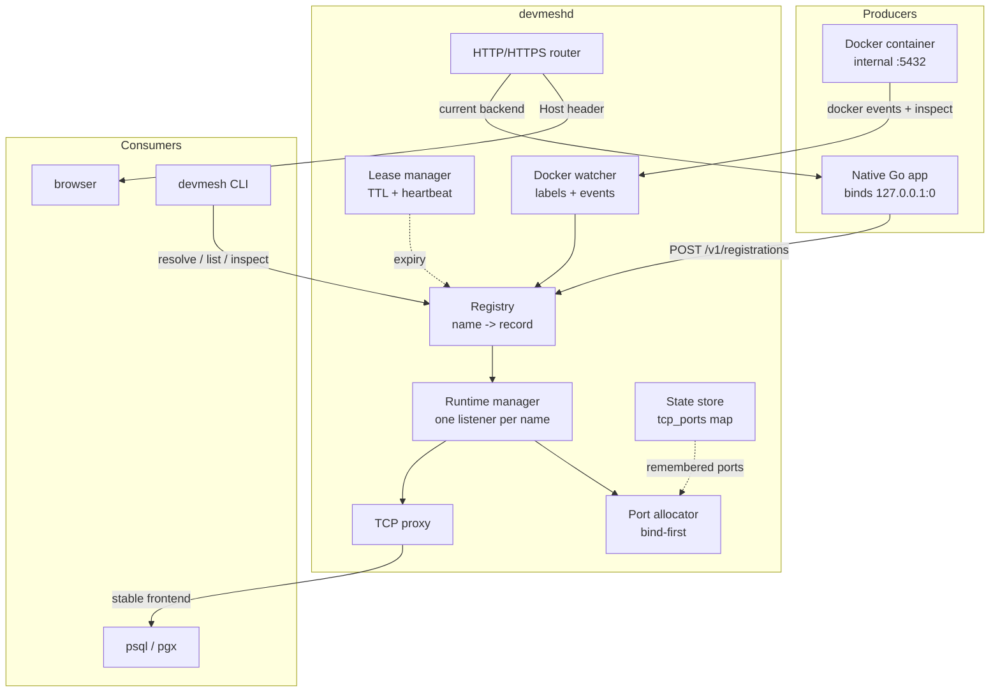
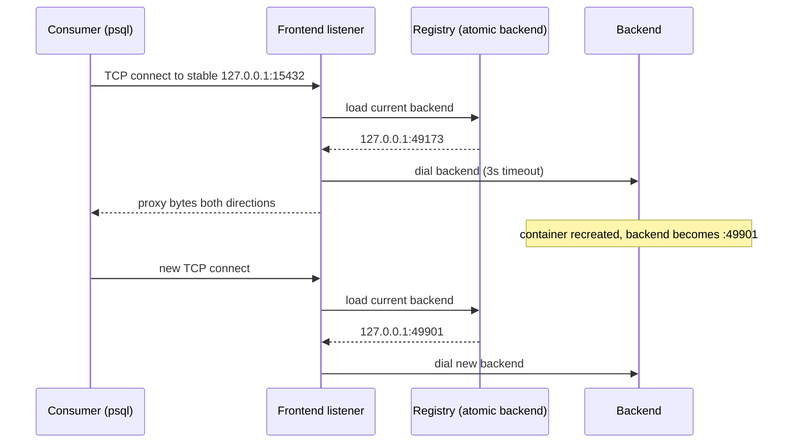
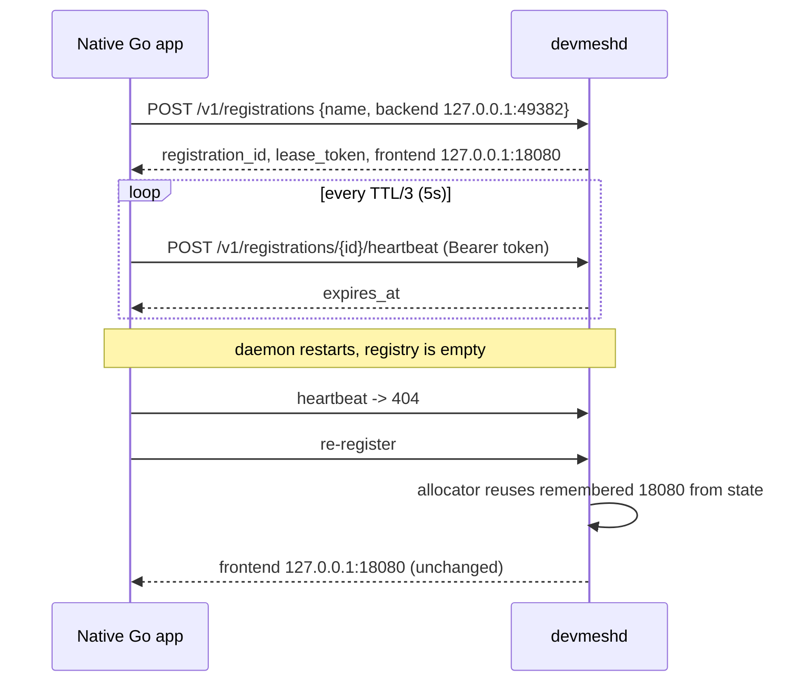
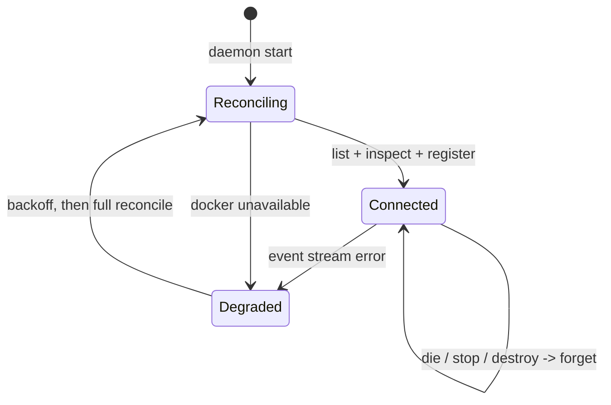

# Devmesh: Stable Local Endpoints for Ephemeral Backends — A Technical Deep Dive

Devmesh is a local daemon, command-line tool, Go client library, and Docker adapter that give development services stable, discoverable network endpoints even when the underlying process or container is listening on an arbitrary port chosen at runtime. The repository at `/home/manuel/code/wesen/2026-09-20--devmesh` contains a working implementation of the TCP portion of that idea together with a shared HTTP reverse proxy, optional TLS termination, and automatic Docker container registration. This report explains the problem the system addresses, the data model and ownership rules it enforces, the algorithms that make its central guarantee true, and the evidence that the implementation behaves as specified. It is written so that a reader who has never seen the repository can reconstruct the design, understand why each decision was made, and evaluate the trade-offs.

The central guarantee is stated precisely: a consumer that resolves a logical service name receives a stable endpoint, and that endpoint continues to reach a live backend after the backend process restarts or the backend container is recreated, without the consumer changing its configuration. The implementation achieves this by separating two concepts that are usually conflated. A **frontend** is a stable `host:port` owned by the daemon and bound for as long as the service is known. A **backend** is the current `host:port` that a producer is actually listening on, chosen by the producer and therefore unstable. The daemon maintains a mapping from logical name to frontend, and a separately mutable mapping from logical name to backend, and it forwards every new connection from the frontend to whichever backend is current at the moment the connection is accepted.

The decisive implementation choice is that frontend ports are allocated by **binding them**, not by checking whether they are free and subsequently binding them. That single rule removes an entire class of race conditions and is the reason the system can persist stable port assignments and survive daemon restarts. The second decisive choice is that the daemon is the only component that owns frontend ports; producers only publish backends. The third is that Docker is treated as an adapter that produces the same registration records native processes produce, so the core registry and proxy operate correctly with no Docker installed.

> [!summary]
> 1. A logical service name owns a stable frontend. Producers publish ephemeral backends. Consumers resolve the name and always connect to the frontend. The frontend and backend are intentionally different values, and that indirection is the entire product.
> 2. Frontend ports are allocated by calling `net.Listen` and keeping the returned listener open. The allocation result is a `{Port, Listener}` pair, not a bare integer, because returning only the port reintroduces the allocate-then-bind race.
> 3. Ownership is enforced with an **owner key** that survives container recreation (`docker:<compose-project>:<compose-service>:<container-port>`) but never includes the container ID. A different owner cannot silently replace a ready service; a dormant service may be taken over.
> 4. Native Go services bind port `0` themselves, register the port the kernel selected, and keep the registration alive with a lease. When a heartbeat returns `404` after a daemon restart, the client re-registers and the daemon reuses the remembered frontend port from persistent state.
> 5. Configuration precedence (`defaults < config file < env < args < flags`) is owned by the Glazed middleware chain, not by application code. The existing JSON config file shape is preserved through a `ConfigFileMapper`, and the config path itself can come from `--config` or `DEVMESH_CONFIG` through a Glazed pre-parse.

## The problem this work addresses

A TCP connection is identified by a pair of `host:port` endpoints. When a program calls `net.Listen("tcp", "127.0.0.1:0")`, the operating system selects an unused port from its ephemeral port range, commonly 32768 through 60999, and returns a listener bound to that port. The same behavior occurs when Docker publishes a container port with an omitted host port, as in `127.0.0.1::5432`: the container always listens on 5432 internally, while Docker selects a host port that is not specified in the configuration. The operating system does not guarantee that the same ephemeral port is selected twice. In practice it rarely is. A development service that stores the selected port in configuration therefore breaks on the next restart, and every consumer that recorded that port must be updated.

The conventional response is to assign fixed ports. This fails when more than one project wants the same canonical port. Two PostgreSQL containers both listen internally on 5432, and if both are published on host port 5432 then the second publication fails with an address-in-use error. Developers then change one project's host port, stop the other project, or serialize database usage. None of these scale past a small number of repositories.

A second response is to assign each service a DNS name. This works for HTTP because every HTTP request carries a `Host` header that the receiving server can inspect after the connection is established. HTTP therefore supports multiplexing many logical services onto one listening socket. It does not work for PostgreSQL, Redis, MySQL, or any other protocol that does not carry a logical name. A PostgreSQL client resolves `checkout.postgres` to an address such as `127.0.0.1`, then opens a TCP connection to `127.0.0.1:5432`. Once the connection is open, the original name is no longer present in the bytes. The kernel sees only the address and port. If two PostgreSQL services both need canonical port 5432, they require two distinct IP addresses, not two distinct names. Per-service loopback addresses and a local DNS resolver are a legitimate future direction, but they require operating-system-specific setup and are explicitly outside the scope of this implementation.

A third cause of instability is configuration drift. Even when a stable port exists, the value may be recorded in a file, an environment variable, a launch script, and a container definition, and those copies diverge. The system described here reduces the consumer's contract to one operation: resolve the logical name and connect to the result.

## The central abstraction

The system defines four entities. A **service name** is a logical identity such as `checkout.postgres` or `billing.api`. It is validated against a strict grammar, it is unique within one daemon, and it never changes when the underlying process changes. A **frontend** is the stable `host:port` that the daemon binds and that consumers connect to. A **backend** is the current `host:port` that a producer is listening on. A **registration** is a producer's assertion that, at the present moment, a named service's backend is a particular address. A registration carries an owner key and, for native processes, an expiry time.

Producers create capacity. A native Go application, a Docker container, or an operator using the `devmesh register` command is a producer. Consumers use capacity. A `psql` client, a `pgx` connection pool, a browser, or another service is a consumer. Producers send registrations to the daemon. Consumers connect to frontends. The two sets of ports never coincide, and that separation is the mechanism by which backend churn becomes invisible.

The following diagram shows the relationships. The daemon owns the registry, the frontend listeners, the proxy that connects frontends to backends, the lease manager, the Docker adapter, and the persistent state file.



The implementation rests on five invariants. They are stated here because every other section either protects one of them or depends on one of them.

- Producer-owned backends: the application or Docker selects the backend port. The daemon never hands out a supposedly free backend port and relies on it staying free.
- Devmesh-owned frontends: frontend ports are allocated by binding them, and the returned listener remains open for the lifetime of the service runtime.
- Stable identity: a logical service name survives backend churn and daemon restarts, and a frontend a consumer has already configured keeps working.
- Docker is an adapter: the registry and proxy are independent of Docker and work without it. Docker metadata is translated into the same registration records native processes use.
- Generic TCP is host and port: arbitrary TCP services cannot be demultiplexed by hostname on one shared socket, because the hostname is not present after name resolution. Only HTTP can be demultiplexed this way.

## Data model and ownership

The domain model is defined in `/home/manuel/code/wesen/2026-09-20--devmesh/internal/registry/model.go`. The central record is `ServiceRecord`, which holds the name, kind, application-protocol hint, owner key, source, current backend, frontend, optional HTTP hostname, status, and update time.

```go
type ServiceRecord struct {
    Name              string
    Kind              Kind      // KindTCP or KindHTTP
    AppProtocol       string    // display hint only, e.g. "postgres"
    OwnerKey          string
    Source            Source    // process, docker, or manual
    Backend           *Backend  // nil when unavailable
    Frontend          Frontend
    Hostname          string    // HTTP kind only
    Status            Status    // ready or unavailable
    DockerContainerID string
    UpdatedAt         time.Time
}
```

Service names must match `^[a-z0-9][a-z0-9-]*(\.[a-z0-9][a-z0-9-]*)*$`, are at most 120 characters, and use lowercase letters, digits, hyphens, and dots. The grammar is strict because names become command-line arguments, log fields, state keys, and eventually HTTP hostnames; a permissive grammar creates escaping problems later. Backend hosts must be loopback addresses in this implementation. The check accepts `127.0.0.1` and `::1` as literals, accepts `localhost`, and for other names resolves the name and verifies that every result is loopback. A remote address is rejected unless a future configuration setting explicitly allows it.

The owner key is the mechanism that makes container recreation and process restart safe. It identifies who owns a logical name, and the daemon's ownership rule is that two registrations with the same owner key may replace each other's backend, while two registrations with different owner keys may not silently replace each other. Docker owner keys have the form `docker:<compose-project>:<compose-service>:<container-port>`, for example `docker:checkout:db:5432`. When a container is destroyed and a new container is created from the same Compose service definition, the Compose project and service labels are identical and the container port is identical, so the new registration has the same owner key and is permitted to replace the old backend. The container ID is deliberately excluded from the owner key because Docker assigns a new ID on every recreation. Native process owner keys have the form `process:<registration-id>` and manual registrations have the form `manual:<registration-id>`.

One subtlety in the ownership rule is the treatment of dormant services. If a service is ready and owned by one owner key, a registration from a different owner key is rejected with a name conflict. If a service is unavailable because its producer died or was stopped, the record is retained so the frontend stays reserved, but the name may be taken over by a different owner. Without this exception, a service whose lease had expired could never be claimed again by a new process, because the stale record would hold the name forever. The implementation distinguishes the two cases using the record's status: a conflict is raised only when the existing record is not dormant.

```go
func (r *Registry) CheckOwnership(name, ownerKey string) error {
    r.mu.RLock()
    defer r.mu.RUnlock()
    existing, ok := r.services[name]
    if ok && existing.OwnerKey != ownerKey && existing.Status != StatusUnavailable {
        return &NameConflictError{Name: name, OwnerKey: ownerKey}
    }
    return nil
}
```

The registry protects its map with a `sync.RWMutex` and performs no network or filesystem input or output while holding the lock. Reads return deep copies so that callers cannot mutate registry state without the lock. The registry exposes `CreateOrReplaceOwned`, `Resolve`, `SetBackend`, `MarkUnavailable`, `Remove`, and `List`. Each of these is intentionally small; the orchestration that connects the registry to listeners and leases lives in the daemon package.

## Bind-first frontend allocation

The allocator in `/home/manuel/code/wesen/2026-09-20--devmesh/internal/runtime/allocator.go` is the component that makes stable frontends possible. The rule it enforces is that a port is allocated by binding it immediately, and the listener returned by that bind is the allocation. A check-then-bind implementation would first test whether a port is free, close the test socket, and later open the listener. Between the test and the bind, another process may claim the port. Even on a single developer machine, an unrelated service or a second instance of devmesh can win that race, and the result is a frontend that fails at the moment it is first used. Binding first removes the window entirely: the probe socket and the serving socket are the same object.

The allocation result therefore carries both the chosen port and the open listener.

```go
type Allocation struct {
    Port     int
    Listener net.Listener
}
```

The allocation algorithm has four stages, applied in order. First, if persistent state remembers a frontend port for the service name, attempt to bind that exact port. This is the stage that survives daemon restarts and keeps a consumer's configured endpoint valid. Second, if the registration requested a preferred port, attempt to bind it. A preferred port is advisory: if it is occupied, the allocator falls through rather than failing. Third, compute a deterministic starting offset within the configured range by hashing the service name, and probe ports from that offset, wrapping around, by calling `net.Listen` on each candidate. The first successful bind is the allocation. Fourth, if every port in the range is occupied, return a typed exhaustion error, which the API maps to `503 Service Unavailable` with the code `port_exhausted`.

```go
func (a *Allocator) Allocate(name string, preferred int) (Allocation, error) {
    remembered := a.state.Port(name)
    if remembered != 0 {
        if alloc, ok := a.try(name, remembered); ok {
            return alloc, nil
        }
    }
    if preferred != 0 {
        if alloc, ok := a.try(name, preferred); ok {
            return alloc, nil
        }
    }
    size := a.max - a.min + 1
    start := startOffset(name, size) // FNV-1a of the name, modulo the range size
    for i := 0; i < size; i++ {
        port := a.min + (start+i)%size
        if alloc, ok := a.try(name, port); ok {
            return alloc, nil
        }
    }
    return Allocation{}, &ErrPortExhausted{Min: a.min, Max: a.max}
}

func (a *Allocator) try(name string, port int) (Allocation, bool) {
    ln, err := net.Listen("tcp", net.JoinHostPort(a.host, strconv.Itoa(port)))
    if err != nil {
        return Allocation{}, false
    }
    a.state.SetPort(name, port) // persisted immediately
    return Allocation{Port: port, Listener: ln}, true
}
```

The starting offset is computed with FNV-1a over the service name. Hashing spreads services across the range rather than packing them from the low end, which reduces the number of failed binds when many services are present. The offset is deterministic, so the same name tends to probe the same neighborhood across runs, but the remembered-port stage takes precedence for any service that has been seen before.

The choice to use a configured range rather than asking the kernel for port `0` is deliberate. A kernel-selected port lands in the ephemeral range and is not stable across restarts; it also cannot be described in advance to a user. The default configured range is 15000 through 19999, which lies below the common Linux ephemeral range and is therefore unlikely to collide with ports chosen by applications. The range and bind host are configuration parameters.

The table below compares the allocation strategies that were considered. Only the first satisfies the stable-frontend invariant.

| Strategy | Stability across restart | Race-free | Inspectable in advance |
| --- | --- | --- | --- |
| Bind a configured range, remember the result | yes | yes | yes |
| Kernel port `0`, remember the result | yes, if remembered | yes | no, value is unknown until bind |
| Check a port is free, bind later | no | no | yes but unreliable |
| Fixed port per project in config | yes | manual coordination | yes |

The runtime manager serializes runtime creation and removal with a mutex. Its `EnsureTCPRuntime` operation is idempotent: if a runtime already exists for a name, it is returned unchanged and no new listener is bound. This idempotence is what allows repeated registrations and container recreation to preserve the frontend. The manager also exposes a reaper that closes the listener of a runtime whose backend has been absent for longer than the configured idle grace period, which defaults to ten minutes. Closing the listener frees the port for other uses, while the remembered assignment remains in the state file so the daemon retries it on the next registration. The grace period exists because a container restart is often only a few seconds long; freeing the frontend immediately would allow another process to claim it and would break a consumer's configured endpoint for a transient outage.

## The TCP proxy

Each service runtime owns one frontend listener and an atomic pointer to the current backend. The accept loop reads the backend pointer once per accepted connection and forwards that connection to the backend that was current at accept time.

```go
func (rt *ServiceRuntime) acceptLoop() {
    for {
        client, err := rt.listener.Accept()
        if err != nil {
            if rt.closed.Load() { return }
            continue
        }
        backend := rt.CurrentBackend()
        if backend == nil {
            client.Close()
            continue
        }
        go proxy.TCP(client, *backend, rt.dialTimeout, rt.logger)
    }
}
```

The proxy function dials the backend with a three-second timeout, then copies bytes in both directions with `io.Copy`, using `CloseWrite` on the underlying TCP connection when one direction finishes. Half-close matters for protocols that signal end-of-request by shutting down only the write side. PostgreSQL, Redis, and SMTP rely on this behavior. If the proxy closed the entire connection when the first copy finished, the peer could observe an abrupt reset in the middle of a query. The implementation defines a small interface for the write-half shutdown and falls back to a full close for connection types that do not support it.

```go
type closeWriter interface{ CloseWrite() error }

func TCP(client net.Conn, backend registry.Backend, timeout time.Duration, logger *slog.Logger) {
    defer client.Close()
    upstream, err := net.DialTimeout("tcp", backend.Addr(), timeout)
    if err != nil { return }
    defer upstream.Close()

    done := make(chan struct{}, 2)
    go func() { io.Copy(upstream, client); closeWrite(upstream); done <- struct{}{} }()
    go func() { io.Copy(client, upstream); closeWrite(client); done <- struct{}{} }()
    <-done
    <-done
}
```

A backend change does not migrate established connections. Once a connection has been dialed, it continues to exchange bytes with the backend it reached, even if the registry has since been updated to a new backend. New connections read the new pointer. This is the correct behavior for a database: a transaction in progress must not be moved to a server that has just restarted. The atomic backend pointer is the mechanism that makes the read free of locks on the connection hot path, while `ServiceRuntime.SetBackend` and `ClearBackend` perform atomic stores.



## Leases and the native Go client

A native process that crashes must not leave a stale registration forever. The daemon therefore assigns process and manual registrations a lease with a time-to-live, and the client renews the lease with periodic heartbeats. The default lease TTL is fifteen seconds and the client heartbeats every TTL divided by three, which is five seconds. The daemon sweeps expired leases once per second. A one-second sweep is more than adequate at local-development scale and avoids the complexity of a timing wheel.

The lease manager stores, for each registration, the registration ID, the service name, the owner key, a cryptographically random token, and the expiry time. The token is returned to the client exactly once, when the registration is created, and is presented as a bearer token on heartbeat and deletion. Token comparison uses `crypto/subtle.ConstantTimeCompare` so that an attacker cannot infer the token by measuring comparison time. The registration ID is not an authorization secret; only the random token is.

The public Go client lives in `/home/manuel/code/wesen/2026-09-20--devmesh/pkg/devmesh/`. Its convenience function `ListenTCP` binds an ephemeral loopback backend port first, then registers the address the kernel selected, then starts the heartbeat goroutine. The ordering is deliberate: the application owns its backend port from the moment it binds it, so there is no interval during which the daemon has promised a port that the application has not yet claimed.

```go
func ListenTCP(ctx context.Context, name string, preferredPort int) (*ListenerHandle, error) {
    ln, err := net.Listen("tcp", "127.0.0.1:0") // application owns the backend
    if err != nil { return nil, err }
    h, err := Register(ctx, RegistrationOptions{
        Name:          name,
        Kind:          KindTCP,
        Backend:       ln.Addr().String(),
        PreferredPort: preferredPort,
    })
    if err != nil { ln.Close(); return nil, err }
    return &ListenerHandle{Listener: ln, Registration: h}, nil
}
```

The heartbeat loop treats an HTTP `404 Not Found` from the heartbeat endpoint as the signal that the daemon has forgotten the registration, which happens when the daemon restarts and loses its in-memory registry. On `404` the client re-registers from scratch. The new registration may receive a different registration ID, but the daemon's allocator finds the remembered frontend port in the state file and reuses it, so the endpoint the consumer knows does not change. Transient network failures are retried with bounded exponential backoff starting at 100 milliseconds and capped at five seconds. The `Close` operation cancels the heartbeat context, waits briefly for the goroutine to finish, and issues a best-effort `DELETE` with a short timeout so that process shutdown is never blocked indefinitely.



## The Docker adapter

The Docker adapter translates container metadata into the same registration records that native processes produce. It does not require a Docker CLI plugin. It connects to the Docker Engine API using the official Go client with environment-aware configuration and API version negotiation, so Docker Desktop contexts and `DOCKER_HOST` are respected. The adapter has three jobs: discover containers that are already running when the daemon starts, react to container lifecycle events, and enforce a publication-safety policy.

Container opt-in is expressed with reverse-DNS labels. The required labels are `io.devmesh.enable=true`, `io.devmesh.name`, `io.devmesh.container-port`, and `io.devmesh.kind`. Optional labels are `io.devmesh.app-protocol`, `io.devmesh.preferred-port`, and `io.devmesh.http-host`. The label parser validates names and ports immediately. The following Compose fragment is the canonical contract.

```yaml
services:
  db:
    image: postgres:17-alpine
    ports:
      - "127.0.0.1::5432"          # ephemeral host port, loopback only
    labels:
      io.devmesh.enable: "true"
      io.devmesh.name: "checkout.postgres"
      io.devmesh.container-port: "5432"
      io.devmesh.kind: "tcp"
      io.devmesh.app-protocol: "postgres"
      io.devmesh.preferred-port: "5432"
```

The string `127.0.0.1::5432` publishes the container's port 5432 on an ephemeral host port bound to the loopback address. The container listens on 5432 regardless. Docker selects the host port, and that host port is the backend that devmesh registers. The advertisement of `io.devmesh.container-port` is what allows the adapter to find the correct entry in the container's published-port map, because a container may publish several ports, each corresponding to a distinct logical service.

The adapter discovers the published backend by inspecting the container and reading `NetworkSettings.Ports`, which maps a container port such as `5432/tcp` to a list of host bindings, each with a host IP and host port. If the expected key is absent or has no bindings, the adapter returns a typed `ErrNotPublished` and does not attempt to connect directly to the container IP. Direct container-network routing is not portable across Docker Engine and Docker Desktop and is intentionally excluded. The adapter prefers a loopback binding when several are present. If the only binding is on `0.0.0.0` or `::`, the container is exposed on every host interface; by default the adapter refuses the registration and logs an actionable error. A configuration flag, `docker.allow_non_loopback_published_ports`, can override this, and when it does the adapter connects through `127.0.0.1` rather than the wildcard address. Exposing a development database on the local network is a security event, so the safe behavior is the default.

Startup reconciliation is mandatory. When the daemon starts, it lists running containers, filters to those with `io.devmesh.enable=true`, inspects each, and registers every valid backend before it subscribes to events. If the adapter only reacted to future events, containers that started before the daemon would never be discovered, because their `start` events occurred in the past. The event stream handles `start` and `restart` by inspecting and upserting the registration, and `die`, `stop`, and `destroy` by clearing the backend if the stopping container currently owns the service. Docker event streams disconnect; the adapter reconnects with exponential backoff and runs a full reconciliation after reconnecting, which repairs any events that were missed during the gap.

A container may become visible in the Docker API before its host port is readable. The adapter therefore retries inspection with a bounded delay schedule of 50 milliseconds, 100, 200, 400, 800, 1500, and 2000 milliseconds. The retry stops as soon as the expected published port appears, and it also stops if the container is no longer running.



The `devmesh doctor` command includes a real capability test for loopback ephemeral publication. It creates a disposable container from a locally available `busybox` or `alpine` image with a port published on an ephemeral loopback host port, inspects the binding, verifies that the host IP is loopback, and removes the container. If no suitable image is present, the check reports `skip` rather than pulling an image silently. This test exists because the syntax for loopback-only ephemeral publication has had version-dependent behavior across Docker and Compose releases, and the correct response is to measure the capability on the actual machine rather than assume it.

## The shared HTTP proxy and TLS

HTTP differs from raw TCP because the request carries a `Host` header, so many logical services can share one listening socket. The router in `/home/manuel/code/wesen/2026-09-20--devmesh/internal/proxy/http.go` maps a normalized hostname to a backend provider function. The provider is called on each request, so the router does not cache a backend address. When the provider returns `nil`, which happens when the registry has marked the service unavailable, the router returns `503 Service Unavailable`. When no route exists for the requested hostname, the router returns `404 Not Found`. A request with a backend present is handed to an `httputil.ReverseProxy` whose director sets the upstream scheme and host, preserves the original host for the application to observe, and adds an `X-Forwarded-Host` header when one is not already present.

Hostnames are normalized by lowercasing, removing a port suffix, removing a bracketed IPv6 form, and removing a trailing dot. An HTTP registration supplies an explicit `http_host`, and the record stores the hostname and a frontend URL of the form `http://<hostname>`. Hostname uniqueness is enforced separately from service-name uniqueness, and automatic hostname generation is intentionally deferred. A wildcard certificate for `*.dev.example.com` covers exactly one label before the base domain, so a service named `checkout.api` cannot be mapped to `checkout.api.dev.example.com`; that value has two labels and would not be covered. A future generator must either use an explicit host or a single-label slug such as `checkout-api`.

TLS reuses the same router. At startup the daemon calls `tls.LoadX509KeyPair` on the configured certificate and key files. The load operation parses the certificate and verifies that the private key matches it, so a mismatched pair is rejected before the listener opens. Both files must be present together; supplying only one is a configuration error. The HTTPS listener serves the shared router with TLS 1.2 as the minimum version. Automatic ACME issuance is deliberately excluded from this phase because combining certificate provisioning with proxy correctness makes failures harder to attribute.

## Configuration ownership

Configuration precedence is `defaults < config file < env < args < flags`. The implementation assigns ownership of that ordering to the Glazed middleware chain rather than to application code. The `devmeshd serve` command declares every configuration field on its Glazed section, and the field names determine the environment variable names: a field named `tcp-frontend-min` is populated from `DEVMESH_TCP_FRONTEND_MIN`, and a field named `docker-enabled` is populated from `DEVMESH_DOCKER_ENABLED`. This is a deliberate reversal of an earlier implementation that read `os.Getenv` directly and merged a JSON file by hand. Moving the sources into the framework gives three properties: one precedence implementation, provenance in parse logs, and no need for lint suppressions.

The existing JSON config file shape is preserved. The file uses flat snake_case keys and nested `docker` and `http` objects, which does not match Glazed's default expectation of `section-slug: { field-name: value }`. A `ConfigFileMapper` function converts the file's shape into the expected section map, so the user-facing format is unchanged while the loading mechanism is the framework's config middleware. The mapper is a translation function, not a second loader, so the file participates in the same provenance chain as every other source. The following is a condensed sketch of the mapper; the repository version performs explicit type checks and returns errors for malformed sections.

```go
// Condensed sketch: map devmesh JSON keys onto default-section field names.
func FileMapper(raw any) (map[string]map[string]any, error) {
    root := requireMapping(raw)          // repository version returns an error here
    out := map[string]any{}
    out["tcp-frontend-min"] = root["tcp_frontend_min"]
    out["state"] = root["state_path"]
    if d := requireMapping(root["docker"]); d != nil {
        out["docker-enabled"] = d["enabled"]
        out["docker-allow-non-loopback-published-ports"] = d["allow_non_loopback_published_ports"]
    }
    // ... http mapping ...
    return map[string]map[string]any{"default": out}, nil
}
```

One ordering problem required a specific solution. The config middleware executes before the main environment source is applied, so a config path supplied through `DEVMESH_CONFIG` is not yet visible when the middleware decides which file to load. Reading the environment directly would undo the previous refactor. Instead, the command resolves the path with flag precedence first: it checks the `--config` Cobra flag, and if that is empty it runs Glazed's `FromEnv` source against the command schema in a throwaway `values.Values` and decodes the `config` field. The environment read therefore stays inside the framework, and application code still contains no `os.Getenv`. The result is that `--config` wins over `DEVMESH_CONFIG`, and both are honored.

The in-process `config.Config` struct remains as the domain representation. A conversion function turns the decoded Glazed fields into that struct, applying duration parsing with defaults and filling in the default socket and state paths when the fields are empty. The daemon receives a plain `config.Config` and does not know how it was assembled, which keeps the core testable without the command layer.

## The local API and error model

The administrative API is exposed as HTTP over a Unix domain socket. It is not exposed on a TCP port by default, and the socket is created with user-only permissions. The socket path resolution now prefers the Glazed-resolved `socket` field, which is populated by `--socket` or `DEVMESH_SOCKET`, and falls back to `~/.devmesh/run/devmesh.sock`. On startup the daemon probes an existing socket before removing it: if a connection to the existing socket succeeds, another daemon is running and startup fails; only if the probe fails is the socket treated as stale and removed. Removing a live daemon's socket would leave the daemon running but unreachable and would allow a second daemon to bind a new socket, producing two registries.

| Method | Path | Purpose |
| --- | --- | --- |
| GET | `/v1/health` | Daemon version and Docker status |
| GET | `/v1/services` | List services without backend internals |
| GET | `/v1/services/{name}` | Resolve a name to its frontend |
| GET | `/v1/services/{name}/inspect` | Debug view including backend and owner key |
| POST | `/v1/registrations` | Create a process or manual registration |
| POST | `/v1/registrations/{id}/heartbeat` | Renew a lease with a bearer token |
| DELETE | `/v1/registrations/{id}` | Remove a registration with a bearer token |

Errors use one envelope with a stable `code` and a human-readable `message`. The codes are `invalid_request`, `invalid_name`, `invalid_backend`, `name_conflict`, `port_exhausted`, `registration_not_found`, `unauthorized`, `service_not_found`, `unsupported_kind`, `docker_unavailable`, and `internal_error`. The API maps each code to an HTTP status, for example `name_conflict` to 409 and `port_exhausted` to 503. Clients check the code and never parse the message. Docker being unavailable does not make the daemon unhealthy; it changes the `docker` field of the health response to `degraded`, and the rest of the API continues to serve native and manual registrations.

## Testing and evidence

The repository contains 42 test functions across unit and integration suites. Unit tests cover name and backend validation, registry ownership rules, the allocator, the state store, the lease manager, the Docker label parser, the inspect-to-registration conversion, the watcher's reconciliation and forget behavior, the configuration file mapper, and the command settings conversion. Integration tests use real loopback listeners and a real daemon over a real Unix socket.

The allocator tests use real `net.Listen` calls rather than mocks, because the property under test is an operating-system guarantee. They verify that a free preferred port is returned, that an occupied preferred port falls back to another port, that a remembered port is reused, that an exhausted single-port range returns `ErrPortExhausted`, and that parallel allocations never return the same port.

The TCP integration test starts a daemon with a temporary state file and a narrow frontend range, starts a backend that echoes a prefix with the payload, registers the backend, resolves the frontend, and reads the echoed bytes back through the proxy. It then verifies that a heartbeat with the correct token succeeds and a heartbeat with a wrong token fails, that deletion marks the service unavailable while keeping the frontend, and that a same-owner registration can replace the backend without changing the frontend while a different owner receives a conflict.

The Go client integration test waits longer than the lease TTL to confirm that only heartbeats keep the registration alive, then closes the handle and confirms that the service becomes unavailable.

The Docker tests are skipped when Docker is unavailable and otherwise run against Docker 25.0.2 with a locally present `postgres:17` image. One test creates a labeled PostgreSQL container, waits for the watcher to register it, dials the stable frontend, inspects the record to confirm the source is `docker` and the owner key is `docker:devmesh-it:db:5432`, removes the container, creates a replacement with the same Compose project and service, waits for the backend port to change, and confirms that the frontend port is unchanged. A second test uses the `pgx` client to connect to `postgres://dev:dev@<frontend>/app` through the stable frontend and execute `select 1`, which is the end-to-end acceptance check for the database use case. The HTTP tests route two hostnames to two backends on one listener and confirm `200 A`, `200 B`, `404` for an unknown host, and `503` after the service is marked unavailable. The TLS test generates a self-signed certificate and performs a real HTTPS request through the router.

The following commands were used as the validation gate across the whole tree, and all of them pass.

```bash
go build ./...
go vet ./...
go test ./... -count=1
go test -race ./... -count=1
GOWORK=off make glazed-lint
```

`make glazed-lint` builds the analyzer from the pinned Glazed module version and reports zero findings. Earlier in the work the analyzer flagged direct `os.Getenv` calls in `internal/config` and `internal/transport`, which were resolved by moving env and file handling into the middleware chain rather than by suppressing the diagnostic. There are now no suppression directives in the repository.

A manual smoke test of the complete path was also performed. A Python echo server was bound to `127.0.0.1:25999`, registered under the name `test.echo` with a preferred frontend port of 25005, and a client connecting to `127.0.0.1:25005` received `ECHO:hello-devmesh`. A daemon restart with the same state file produced the log line `frontend_reused service=test.echo frontend=127.0.0.1:25005`, confirming that the remembered assignment survives the restart. A second daemon started against the same socket was rejected with `another devmeshd is already listening`, and a daemon that was killed with `SIGKILL`, leaving its socket file behind, was started successfully by the stale-socket recovery path.

The configuration middleware was verified with a file that set `tcp_frontend_min` to 24000. A registration produced frontend `127.0.0.1:24011`, and `devmeshd serve --print-parsed-fields` showed `tcp-frontend-min` receiving `defaults 15000` followed by `source: config 24000`. With `DEVMESH_TCP_FRONTEND_MIN=24500` the frontend was `127.0.0.1:24501`. With both the file and the environment set and a `--tcp-frontend-min 25000` flag, the frontend was `127.0.0.1:25035`, confirming that the flag has the highest precedence. Running with only `DEVMESH_CONFIG` pointing at the config file produced `127.0.0.1:24014` and provenance showing `source: config`, confirming the pre-parse path.

## Failure semantics and concurrency rules

The behavior of the system under failure is defined rather than incidental. When the daemon is unavailable, `devmesh resolve` fails clearly, the Go client retries registration and heartbeats with backoff, and an already-running application continues to serve its raw backend port; only the stable endpoint is unavailable. When a backend is unavailable but the frontend is bound, a new TCP connection is accepted and then closed quickly because there is no backend to dial, and an HTTP request receives `503`. When Docker is unavailable, the daemon continues to serve native and manual registrations, the Docker status becomes `degraded`, and the adapter reconnects and reconciles in the background. When a remembered frontend port has been claimed by another process after a daemon restart, the allocator logs a warning, selects another port, updates persistent state, and reports the new endpoint; it does not interfere with the process that owns the old port. When an unrelated owner attempts to claim a ready service name, the request fails with a conflict; the daemon never silently replaces an owner.

Concurrency is governed by explicit rules. The registry mutex protects in-memory metadata only. The implementation never dials a backend while holding the registry or runtime lock, never calls the Docker API while holding those locks, and never writes state while holding a lock that blocks connection handling. Backend pointers are replaced atomically, and runtime creation and removal are serialized by the runtime manager's mutex. Listener ownership belongs to exactly one runtime. During shutdown the daemon stops accepting new API requests, stops the Docker watcher and the lease sweeper, closes the frontend listeners, waits briefly for active proxy goroutines, flushes state, removes the socket, and exits. A configurable shutdown timeout prevents the process from waiting indefinitely on active TCP clients. The full test suite runs under the race detector, and race-detector failures are treated as blockers.

## Design decisions and non-goals

Several design decisions are load-bearing and should not be changed casually. Backend ports are producer-owned, because the producer is the only component that can bind the port and know that the bind succeeded. Frontend ports are daemon-owned, because the daemon is the only component that can bind them, persist the assignment, and release them on a schedule. The frontend and backend are intentionally different values; collapsing them would remove the indirection that makes the system useful. Docker is an adapter rather than the core abstraction, so container metadata is converted into registration records and the registry has no Docker dependency. Generic TCP is routed by host and port, and arbitrary TCP protocols are not demultiplexed by hostname.

The implementation deliberately excludes Kubernetes integration, a full service mesh data plane, mutual TLS between local services, transparent interception of arbitrary traffic, a local DNS server or per-service loopback addresses, UDP proxying, protocol-specific PostgreSQL or Redis proxy logic, multi-host discovery, cross-machine networking, automatic ACME certificate issuance, Windows named-pipe support, and advanced load balancing or health checking. These are deferred until the core registry and proxy are stable. The HTTP listener is served over the same registry, and TLS loads an existing certificate and key; automatic certificate provisioning is a separate future phase.

## Reproduction and commit history

The repository is at `/home/manuel/code/wesen/2026-09-20--devmesh`. The implementation was delivered in a sequence of commits, each a reviewable boundary.

| Commit | Change |
| --- | --- |
| `97103c6` | TCP MVP: registry, bind-first allocation, TCP proxy, leases, Go client, Glazed CLI |
| `a399d71` | Docker watcher, doctor publication probe, and PostgreSQL end-to-end tests |
| `5239164` | Shared HTTP reverse proxy with hostname routing |
| `7f180c4` | Wildcard TLS with an existing PEM certificate and key |
| `c07d2f1` | Configuration env and file loading moved into Glazed middleware |
| `d11d319` | Pre-parse of `DEVMESH_CONFIG` for the config-file path |

A reader can reproduce the primary result with three commands. Start the daemon, start a backend, register it, and connect through the stable frontend.

```bash
make build
./dist/devmeshd serve
./dist/devmesh register --name test.echo --backend 127.0.0.1:25999 --preferred-port 25005 --once
./dist/devmesh services resolve test.echo
```

The expected output of `resolve` is a table whose endpoint column is `127.0.0.1:25005`, and a TCP client connecting to that address reaches the echo server. The Docker path is reproduced with the Compose file in `examples/compose-postgres/compose.yaml`, which publishes the container's 5432 on an ephemeral loopback host port and labels the container so the watcher discovers it.

## Key points

- A stable frontend and an ephemeral backend are different values, and the mapping between them is read at connection-accept time and at HTTP-request time, so backend changes never require a consumer change.
- Frontend ports are allocated by binding them and returning the open listener. Any design that returns only a port number, or that checks a port before binding it, has a race and can violate the stable-frontend guarantee.
- Owner keys encode who owns a logical name and exclude container IDs, so container recreation replaces the backend under the same owner and never changes the frontend.
- Native Go services bind port `0` themselves and publish the resulting address under a lease; a heartbeat `404` triggers re-registration, and remembered state restores the same frontend port.
- Docker containers opt in with labels, the adapter reads the host-published port from the container's port map, and it refuses non-loopback publications by default because exposing a development service on the local network is a security event.
- HTTP is the only protocol in scope that can share one listener across many logical services, because the request carries a hostname; raw TCP requires a distinct address per service if canonical ports must be preserved.
- Configuration precedence is owned by the Glazed middleware chain, the existing JSON file shape is preserved by a mapper, and even the config path is read from the environment through a framework pre-parse rather than a direct environment call.
- The failure behavior is defined: frontends stay bound through backend outages, HTTP returns `503` when a route is known but unavailable, `404` when a route is unknown, and a daemon restart reuses remembered frontend assignments.
- Validation spans unit tests, loopback-listener allocator tests, live TCP proxy tests, a lease-liveness test, a Go client test, real-Docker discovery and recreation tests, a `pgx` PostgreSQL test, HTTP routing and TLS tests, the race detector, and a lint analyzer with no suppressions.

## Related notes

- [[PROJ - Session Overview - Turning Agent Transcripts into a Browsable Static Page]]
