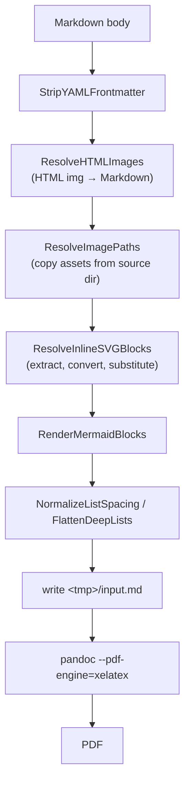

# remarquee: SVG Image Support in the Markdown-to-PDF Pipeline — A Technical Deep Dive

`remarquee` is a Go command-line tool that converts Markdown into PDFs and uploads those PDFs to a reMarkable device through the reMarkable cloud. The conversion path is `pandoc` with the `xelatex` PDF engine, wrapped by a preprocessing package named `mdpdf` that rewrites the Markdown and stages referenced assets before pandoc runs. A reMarkable device never receives Markdown; it receives the PDF. Every question about "rendering Markdown" is therefore a question about producing a correct PDF, and every asset that pandoc or LaTeX cannot represent natively must be transformed before or during conversion.

This report documents the work that added first-class SVG support to that pipeline, tracked as ticket `RMQ-0024` and delivered as pull request #28. The work began from a false premise — that XeLaTeX cannot render SVG at all and therefore a conversion step had to be introduced — and the first substantial outcome was the discovery, by experiment, that referenced SVG files already rendered correctly because pandoc itself invokes `rsvg-convert`. The actual gaps were narrower and more specific: inline raw `<svg>` blocks and HTML `` tags were silently dropped by pandoc's LaTeX writer, and a missing converter caused a hard XeLaTeX failure rather than a degraded but usable document. This report explains the pipeline, the four ways SVG reaches it, the conversion mechanism, the extraction algorithm, the ordering constraints that dictate where each pass runs, and the evidence collected on real hardware.

> [!summary]
> 1. Markdown becomes a PDF through `mdpdf` preprocessing followed by `pandoc --pdf-engine=xelatex`. The device receives only the PDF, so any Markdown construct that the LaTeX writer cannot express is lost silently.
> 2. Referenced SVG (``) and `data:image/svg+xml` URIs already rendered before this work: pandoc shells out to `rsvg-convert -f pdf --dpi-x 96 --dpi-y 96` and emits `\includegraphics{<hash>.pdf}`. The design work was redirected to the genuinely broken forms.
> 3. Inline raw `<svg>…</svg>` and HTML `` are parsed as raw HTML and discarded by the LaTeX writer. They are now extracted or rewritten, converted to vector PDFs, and substituted as Markdown image references.
> 4. The extraction algorithm is a line scan guarded by the existing literal-region detector, using a quote-aware tag-depth tokenizer. A regular expression cannot handle nested `<svg>`, `>` inside quoted attribute values, or fenced code that documents SVG.
> 5. Every failure is non-fatal. A missing converter, an unclosed block, or a conversion error produces a warning and leaves the source unchanged, so one bad diagram cannot abort a document. Contributor effort additionally produced a user-facing Markdown format guide and a tablet validation document.

## The system this work extends

The upload subcommands (`upload md`, `upload bundle`, `upload sync`, `upload src`) all route through the `mdpdf` package. `ConvertMarkdownFileToPDF` handles a single file; `BuildBundleMarkdown` concatenates several files into one document with a table of contents and page breaks. Both perform the same class of preprocessing and then invoke pandoc. The relevant entities are the Markdown body as a string, a temporary directory that becomes pandoc's working directory, and an `images/` subdirectory inside that temporary directory where staged assets live.

Two existing preprocessing passes define the conventions that the SVG work had to follow. The first is `ResolveImagePaths` in `pkg/mdpdf/images.go`, which finds Markdown image syntax with two regular expressions, resolves each relative path against the directory of the source Markdown file, copies the file into `<tmp>/images/`, and rewrites the reference to `./images/<name>`. The second is `RenderMermaidBlocks` in `pkg/mdpdf/mermaid.go`, which finds fenced ```` ```mermaid ```` blocks, renders each to a PNG by invoking the external `mmdc` binary, writes the PNG into `<tmp>/images/`, and substitutes a Markdown image reference. `RenderMermaidBlocks` established the degradation model that the SVG work copied: if the external tool is absent, warn and return the body unchanged; if one block fails, warn and leave only that block.

There is also `literalLines` in `pkg/mdpdf/literal_regions.go`, which returns a boolean per line marking whether the line is inside a fenced code block or line-start display math. Any code that rewrites the Markdown body must consult this guard, because otherwise it will corrupt documentation that contains example syntax.

## The problem this work addresses

The starting request was to make SVG files render on the device. That request contained an assumption about the failure mode, and the assumption determined the proposed fix. If the failure were "XeLaTeX cannot include an SVG at all", the fix would be a converter step for every SVG. If the failure were "some SVG authoring forms are discarded before LaTeX ever sees them", the fix would be narrower. The two are not equivalent, and building for the first when the second is true produces code that does work that already happens elsewhere.

The first step was therefore an experiment rather than an implementation. A small SVG was referenced from Markdown and converted with pandoc 3.1.3 on the target machine. To observe pandoc's internal behavior, the PDF engine and the expected external tools were replaced with wrappers that logged their arguments. The trace showed that pandoc invokes `rsvg-convert` directly:

```text
CALLED rsvg-convert: -f pdf -a --dpi-x 96 --dpi-y 96 \
  -o /tmp/tex2pdf.<hash>/<hash>.pdf /tmp/tex2pdf.<hash>/logo.svg
```

and then emits, in the intermediate LaTeX, `\includegraphics{<hash>.pdf}`. The referenced SVG rendered as vector output with no shell escape and no LaTeX `svg` package. The same experiment run through the installed `remarquee` binary produced a PDF containing the expected pixels. The premise was wrong for referenced files.

### Four ways SVG reaches the pipeline

SVG can enter a Markdown document in four distinct forms, and each behaves differently in the pipeline.

The first form is a Markdown image reference to a file, either inline (``) or reference-style (`![diagram][arch]` with a `[arch]: ./arch.svg` definition). This form is handled by `ResolveImagePaths`, which copies the file into the temporary directory, and then by pandoc, which converts it.

The second form is a raw inline SVG block, written directly in the Markdown body:

```markdown
<svg xmlns="http://www.w3.org/2000/svg" viewBox="0 0 100 100">
  <circle cx="50" cy="50" r="40" fill="steelblue"/>
</svg>
```

The third form is an HTML `` tag whose `src` points to an SVG file, for example ``. The fourth form is a data URI, `data:image/svg+xml;base64,...`.

A fifth case is not a distinct form but a constraint: SVG that appears inside a fenced code block is documentation about SVG and must not be transformed.

### What the LaTeX writer does with each form

The behavior of each form was determined by rendering fixtures and inspecting both the intermediate LaTeX and the pixels of the output PDF. The pixel inspection is necessary because a silently dropped image still produces a valid PDF.

| Form | Behavior before this work | Mechanism |
|---|---|---|
| Referenced file (``) | Rendered | pandoc runs `rsvg-convert`, then `\includegraphics` |
| Reference-style image | Rendered | `ResolveImagePaths` rewrites the definition first |
| `data:image/svg+xml;base64` | Rendered | pandoc decodes the URI to a temporary file and converts it |
| Inline raw `<svg>…</svg>` | Silently dropped | Reader emits `RawBlock (Format "html")`; LaTeX writer omits `html` |
| HTML `` | Silently dropped | Raw HTML is omitted by the LaTeX writer |
| SVG inside a fenced code block | Preserved as code | `literalLines` protects the region from rewriting |

The two dropped forms share one cause. Pandoc's Markdown reader classifies raw HTML as a block whose format is `html`, and the LaTeX writer emits raw content only for formats it recognizes (`latex`, `tex`). Everything else is discarded without a warning. An author who embeds an SVG directly in the Markdown body therefore sees a valid PDF with a missing diagram and no diagnostic.

A further failure mode appears when `rsvg-convert` is absent. With a broken `rsvg-convert` placed first on `PATH`, pandoc warns that it could not convert the image and falls back to `\includesvg`, after which XeLaTeX terminates:

```text
[WARNING] Could not convert image /tmp/tex2pdf.<hash>/logo.svg: conversion from SVG failed
! Package svg Error: File `logo_svg-tex.pdf' is missing.
```

The fallback path requires the LaTeX `svg` package, which requires `--shell-escape` and Inkscape. The pipeline does not pass `--shell-escape`, so the document fails outright. This is the concrete robustness defect the work addresses for all SVG forms, including referenced ones.

## Why not the LaTeX `svg` package

The direct route to SVG in LaTeX is the `svg` package with `\includesvg`. Experiment confirmed that it works only with shell escape enabled:

```text
$ xelatex t.tex
! Package svg Error: File `logo_svg-tex.pdf' is missing.

$ xelatex -shell-escape t.tex
('inkscape' -V ) (./svg-inkscape/logo_svg-tex.pdf_tex) [1]
```

With shell escape, xelatex invokes Inkscape and produces a `svg-inkscape/` sidecar directory containing a `.pdf_tex` file. This route was rejected for three reasons. Enabling `--shell-escape` permits a document to execute arbitrary commands during compilation, which is a security boundary the pipeline should not cross for an image. It adds a dependency on Inkscape, which is heavier and slower than `rsvg-convert`. And it produces sidecar files that must be tracked alongside the PDF. Pandoc's own PDF path already uses `rsvg-convert` and avoids all three problems, so the implementation follows pandoc's approach: keep shell escape disabled and invoke the converter directly where pandoc will not.

## Where SVG enters the pipeline

The preprocessing passes run in a fixed order, and the order is not arbitrary. Two constraints determine it.

The first constraint concerns HTML rewriting. Rewriting `` produces a Markdown reference ``. For that reference to survive, `ResolveImagePaths` must run afterward, because it is the pass that copies the file from the source directory into the temporary directory. A pass that rewrote HTML after `ResolveImagePaths` would produce a reference to a file that pandoc cannot find.

The second constraint concerns inline extraction, and it is the opposite. Inline extraction writes a finished PDF directly into `<tmp>/images/`. `ResolveImagePaths` resolves relative paths against the *source* directory of the Markdown file, not against the temporary directory, so running `ResolveImagePaths` after inline extraction would attempt to find `./images/svg-001.pdf` under the source directory, fail, and leave the reference untouched. That outcome is harmless because the file already exists in the temporary directory and pandoc resolves relative to the working directory, but the cleaner ordering runs inline extraction after `ResolveImagePaths` so that the pass never sees generated references.

These two constraints place the passes on opposite sides of `ResolveImagePaths`:



The bundle path applies the same order per input file, additionally prefixing generated filenames with `bundle-00N-` so that two inputs containing an image or an inline SVG named `svg-001` do not overwrite each other in the shared `images/` directory. The prefix is applied by cloning the configuration, following the existing `mermaidConfigWithImagePrefix` helper:

```go
func svgConfigWithImagePrefix(cfg *SVGRendererConfig, prefix string) *SVGRendererConfig {
	if cfg == nil {
		return nil
	}
	cloned := *cfg
	cloned.ImagePrefix = prefix + cloned.ImagePrefix
	return &cloned
}
```

## Configuration and converter discovery

All SVG behavior is governed by one value type, `SVGRendererConfig`. It carries an enable flag, an optional explicit converter path, a converter preference order, an optional default width for extracted inline images, an optional filename prefix for bundle mode, and a writer for warnings. `DefaultSVGRendererConfig` enables the feature and sets the preference order to `rsvg-convert` then `inkscape`.

Converter discovery returns two different things for two different conditions, and the distinction is deliberate:

```go
func ResolveSVGConverter(cfg *SVGRendererConfig) (string, error) {
	if cfg == nil || !cfg.Enabled {
		return "", nil
	}
	if cfg.ConverterPath != "" {
		if _, err := os.Stat(cfg.ConverterPath); err == nil {
			return cfg.ConverterPath, nil
		}
		return "", fmt.Errorf("configured svg converter %q not found", cfg.ConverterPath)
	}
	order := cfg.ConverterOrder
	if len(order) == 0 {
		order = []string{"rsvg-convert", "inkscape"}
	}
	for _, name := range order {
		if path, err := exec.LookPath(name); err == nil {
			return path, nil
		}
	}
	return "", nil // not an error: caller degrades gracefully
}
```

When the feature is disabled or no converter exists, the function returns `("", nil)`. Absence is not an error, because the caller must warn and continue rather than abort conversion. An error is reserved for the one condition that is genuinely a misconfiguration: a converter path that the user explicitly specified and that does not exist. This split is what allows the tool to run on a machine without SVG tooling and still produce a usable document.

## Inline SVG extraction

The central implementation problem is finding balanced `<svg>…</svg>` spans in the Markdown body without corrupting other content. Three properties of real documents make this harder than it appears.

Nested `<svg>` elements are legal. An SVG may contain another `<svg>` with its own coordinate system, so a scan must track depth rather than search for the first `</svg>`. Attribute values may contain `>` and even the character sequence `</svg>`; a scan that terminates a tag at the first `>` will misparse `<svg data-note="a > b">`. And fenced code frequently contains SVG as documentation, which must not be rewritten.

### The quote-aware depth tokenizer

The depth of a line is computed by `countTagDelta`, which walks the line character by character. When it encounters a quote character it skips to the matching quote, so tag-like text inside an attribute value is ignored. When it encounters `<` it checks case-insensitively for an opening or closing tag whose name is followed by a tag boundary, so `<svgfoo>` does not match. Opening tags are passed to `tagEnd`, which finds the closing `>` while skipping quoted values and reports whether the tag ends in `/>`. A self-closing tag contributes zero depth.

```go
func countTagDelta(line, tag string) int {
	delta := 0
	i := 0
	n := len(line)
	for i < n {
		c := line[i]
		if c == '"' || c == '\'' {
			quote := c
			i++
			for i < n && line[i] != quote {
				i++
			}
			if i < n {
				i++
			}
			continue
		}
		if c != '<' {
			i++
			continue
		}
		if hasPrefixFold(line[i+1:], "/"+tag) && isTagBoundary(line, i+1+1+len(tag)) {
			delta--
			for i < n && line[i] != '>' {
				i++
			}
			if i < n {
				i++
			}
			continue
		}
		if hasPrefixFold(line[i+1:], tag) && isTagBoundary(line, i+1+len(tag)) {
			end, selfClosing := tagEnd(line, i)
			if !selfClosing {
				delta++
			}
			i = end
			if i < n {
				i++
			}
			continue
		}
		i++
	}
	return delta
}
```

The tokenizer's behavior on the cases that matter is captured directly by unit tests:

| Input fragment | Delta | Reason |
|---|---|---|
| `<svg>` | +1 | Opening tag |
| `</svg>` | −1 | Closing tag |
| `<svg/>` | 0 | Self-closing, depth-neutral |
| `<svg data-x=">">` | +1 | `>` inside quotes ignored |
| `<svg data-x="</svg>">` | +1 | Closing tag inside quotes ignored |
| `<svg></svg>` | 0 | Balanced on one line |
| `<svgfoo>` | 0 | Not a tag boundary after `svg` |

### Collecting the block and honouring literal regions

`collectSVGBlock` accumulates lines and adds each line's depth until the running depth returns to zero or below. It also consults the `protect` slice produced by `literalLines`; if a protected line appears after the opening line, collection aborts and the caller leaves the source unchanged. An unclosed block is treated the same way: the caller warns and emits the original line.

Once a block is extracted, its text is written to `<tmp>/images/<prefix>svg-NNN.svg`, converted to `<prefix>svg-NNN.pdf`, and replaced by a Markdown image reference. Conversion selects arguments by the converter's base name:

```go
switch {
case strings.Contains(base, "rsvg-convert"):
	args = []string{"-f", "pdf", "-a", "--dpi-x", "96", "--dpi-y", "96", "-o", pdfPath, svgPath}
case strings.Contains(base, "inkscape"):
	args = []string{svgPath, "--export-type=pdf", "--export-filename=" + pdfPath}
default:
	args = []string{"-f", "pdf", "-o", pdfPath, svgPath}
}
```

The substitution uses standard Markdown image syntax, which is important for idempotence: bundle mode runs image resolution on already-rewritten content, and if the pass had re-emitted raw `<svg>` it would extract the same block twice. The default width, when configured, is attached as a pandoc `{width=...}` attribute:

```go
if cfg.DefaultWidth != "" {
	out = append(out, fmt.Sprintf("{width=%s}", alt, name, cfg.DefaultWidth))
} else {
	out = append(out, fmt.Sprintf("", alt, name))
}
```

## HTML img rewriting

The HTML `` pass is a single-line scan that reuses `tagEnd` for the same reason the SVG tokenizer does: an attribute value may contain `>`. For each `` tag, `parseTagAttrs` extracts lower-cased attribute pairs, and `htmlImgToMarkdown` decides whether to convert. Only SVG sources are converted, determined by `isSVGSource`, which strips any query string or fragment and checks for a `.svg` suffix case-insensitively.

Dimensions are normalized so that a bare number becomes pixels: `width="300"` becomes `{width=300px}`, while `width="50%"` is preserved. When `width` is absent, `height` is used; when both are absent, the configured `DefaultWidth` is used. The alt text is preserved, defaulting to `svg image`.

One correctness detail emerged during documentation rather than implementation. The HTML rewrite is gated on `ResolveImages`, in both the direct and bundle paths, because the rewrite produces a relative Markdown reference that must be staged by `ResolveImagePaths`. If `--resolve-images=false` were combined with an unguarded HTML rewrite, the result would be a Markdown reference to a file that was never copied and that pandoc therefore cannot find:

```go
if opts.ResolveImages {
	body, err = ResolveHTMLImages(body, opts.SVG)
	// ...
	body, err = ResolveImagePaths(body, sourceDir, tmpDir)
	// ...
}
```

Inline extraction is not gated on `ResolveImages`, because it produces its own finished assets and depends on no staging.

## Pipeline and bundle wiring

`DefaultPandocOptions` constructs a default `SVGRendererConfig`, so the feature is enabled for any library caller and for the CLI. The CLI constructs its own configuration from flags and assigns it to `PandocOptions.SVG`, overriding the default. `BuildBundleMarkdown` gained an `svgCfg` parameter and applies both passes with the per-input prefix; its call sites were updated accordingly, including the command layer that passes `pandocOpts.SVG`.

## Command-line surface

The flags are registered through a Glazed section named "SVG flags", which groups them in help output exactly as the existing Mermaid flags are grouped:

| Flag | Default | Effect |
|---|---|---|
| `--svg` | `true` | Enable or disable inline and HTML SVG handling |
| `--svg-converter` | auto-detect | Path to `rsvg-convert` or `inkscape` |
| `--svg-default-width` | natural size | Width applied to extracted inline SVGs, e.g. `70%`, `12cm` |

The section is added to all three Markdown upload commands. A `--svg=false` invocation returns a nil configuration from the flag parser, which the pipeline treats as a no-op.

## Testing and evidence

Testing proceeded in three layers. The first layer is unit tests that require no external tools. `svg_test.go` covers converter discovery across nil, disabled, explicit-path, PATH-order, fallback, and no-converter cases; the tokenizer across the edge cases in the table above; inline extraction across single-line, multi-line, nested, self-closing, fenced-code, unclosed, no-converter, conversion-failure, and width/prefix cases; and HTML rewriting across attributes, unit normalization, quoted `>`, non-SVG passthrough, and disabled behavior. A fake converter script that accepts the real argument shape makes these tests independent of `rsvg-convert`.

The second layer is integration tests that exercise the real pipeline. `TestResolveInlineSVGBlocks_RealConverter` runs the actual `rsvg-convert` and asserts that the output begins with `%PDF-`. `TestSVGPipelinePDF` renders a document containing a referenced SVG, an inline SVG, an HTML ``, and a fenced SVG through pandoc and xelatex and asserts that conversion succeeds and produces a PDF.

The third layer is end-to-end validation through the installed CLI, with pixel counts used as the success criterion. Exit status is insufficient here because the pre-fix behavior produced a valid PDF that simply omitted the inline diagram.

| Check | Result |
|---|---|
| Inline raw SVG pixels (red) | 0 before, 3044 after |
| Referenced and HTML SVG pixels (blue) | 9838 |
| Fenced `<svg>` in `pdftotext` | present as literal text |
| Bundle, two inputs with inline SVG | red pixels on both pages (3741, 3828) |
| `--svg=false` | red pixels 0 |
| Missing converter | warning printed, PDF still produced, exit 0 |

The missing-converter run used a minimal `PATH` containing only `pandoc` and `xelatex`, which makes `ResolveSVGConverter` return `("", nil)` and triggers the degradation path:

```text
WARNING: SVG: no SVG converter found; inline <svg> blocks left as-is
OK: generated out-noConv/inline-only.pdf
```

A tablet validation document covering ten cases was rendered, checked locally for the presence of each figure, uploaded, and confirmed legible on a color reMarkable display.

## Failure semantics

The design states one rule for all SVG failures: warn and continue, leaving the source as close to unchanged as possible. The concrete conditions are:

| Condition | Behavior |
|---|---|
| Feature disabled | No-op |
| No converter found | Warn once; inline and HTML SVG left as-is |
| Unclosed `<svg>` block | Warn with line number; leave the block |
| Converter exits non-zero | Warn per block; leave that block |
| Converter produces no output | Treated as failure; leave the block |
| Explicit converter path missing | Return an error; conversion aborts |
| Referenced SVG with no converter | Still delegated to pandoc; may hard-fail as before |

The last row is the one asymmetry the work did not remove. Referenced SVG is converted by pandoc, so remarquee cannot substitute a different converter for it; when no converter is present, pandoc's fallback still fails under xelatex. Converting referenced SVGs in remarquee would duplicate work pandoc already performs on the common path, so this was deliberately deferred and documented as a follow-up.

## Design decisions and non-goals

The work keeps `--shell-escape` disabled, converts through `rsvg-convert` or Inkscape directly, and treats absence as normal. It supports HTML `` only for SVG sources; other HTML images remain unsupported because the LaTeX writer drops them regardless, and widening the rewrite to all image types is a larger change with its own staging concerns. It matches only line-leading `<svg>` blocks, since block-level raw HTML is where pandoc's reader produces the `RawBlock` that the LaTeX writer discards; inline mid-paragraph SVG is out of scope. It prefers `rsvg-convert` over Inkscape but does not silently fall back from one to the other at conversion time, because that would make a single failing diagram unexpectedly slow.

A contributor deliverable outside the code is the Markdown format guide at `pkg/doc/topics/markdown-format-support.md`, registered in the Glazed help system and reachable as `remarquee help markdown-format-support`. It states the support matrix, documents all four SVG forms and the Mermaid path, and lists what is dropped. Its frontmatter follows the canonical Glazed field set (`SectionType: GeneralTopic`, `ShowPerDefault`, facet tags), which was corrected after an audit against `glaze help writing-help-entries`.

## Reproduction

The evidence in this report can be reproduced from a checkout of the repository. The inline extraction can be exercised without uploading:

```bash
remarquee upload md ./doc.md --pdf-only --output-dir ./out
pdftotext out/doc.pdf - | grep -i figure
```

The conversion mechanism for referenced SVG can be observed by placing a logging wrapper named `rsvg-convert` earlier on `PATH` and running pandoc over a document with a referenced SVG. The degradation path can be observed by placing a wrapper that exits non-zero on `PATH` and confirming that the warning appears and the command still exits zero for an inline-only document. The tablet fixture and its assets are committed under `ttmp/2026/09/20/RMQ-0024--svg-image-support-in-the-markdown-to-pdf-pipeline/scripts/svg-validation/`.

## Key points

- The reMarkable device receives a PDF, so SVG support is a PDF-production problem. The preprocessing package must transform anything the LaTeX writer cannot express.
- Referenced SVG and data URIs already worked before this change because pandoc invokes `rsvg-convert` and emits `\includegraphics`. The experiment that established this redirected the implementation toward the forms that were actually broken.
- Inline raw `<svg>` and HTML `` are parsed as raw HTML and discarded without a diagnostic. Both are now converted to vector PDFs and substituted as standard Markdown images.
- Block detection is a quote-aware depth scan guarded by the existing literal-region detector. A regular expression cannot handle nested tags, `>` inside attribute values, or fenced code that documents SVG.
- Ordering is constrained. HTML rewriting must precede image resolution; inline extraction must follow it. Reversing either produces references to files that do not exist where they are looked up.
- Every failure is non-fatal. Absence of a converter is not an error; only an explicitly configured missing path is. A single bad diagram cannot abort a document.
- Success was measured in pixels, not exit codes, because the broken behavior still produced a valid but incomplete PDF.

## Related notes

- [[PROJ - remarquee Sync Remediation Campaign - From 149 Failures to the Six-File Floor]]
- [[PROJ - remarquee Sync Convert Failures - Transcript Math Delimiters and Export Fidelity]]
- [[PROJ - reMarkable Cleanup 2 - Batch Reorg, Rate Limit Backoff, and Glob Recovery]]
