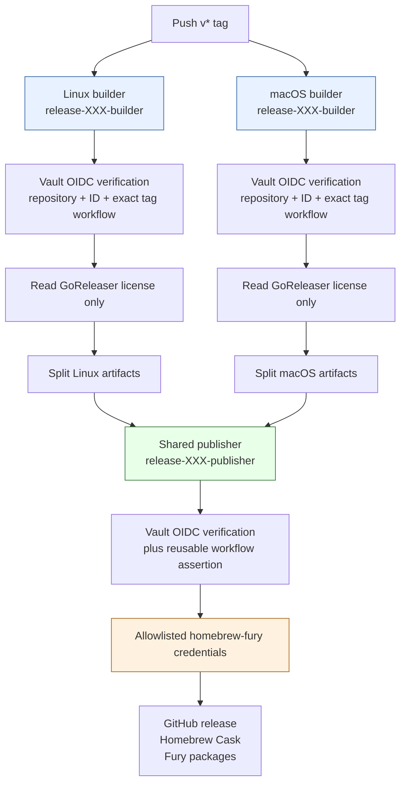
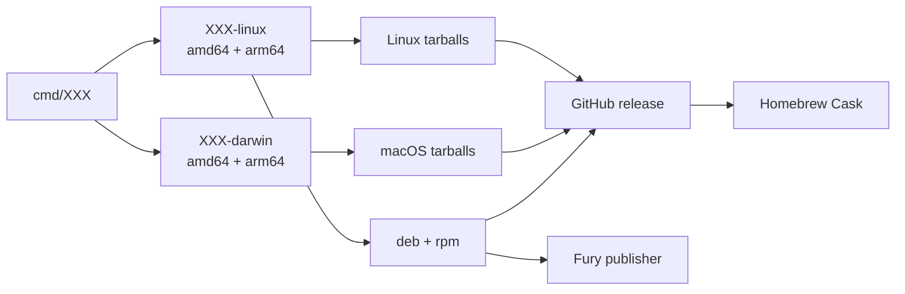

# go-go-template: Strict, Vault-Backed Go Binary Releases — A Technical Deep Dive

A repository template is executable policy. It decides what a newly created project treats as normal before that project has its own conventions, CI history, or release experience. For a Go binary, that policy reaches from `go.mod` and the local Makefile through GitHub Actions and GoReleaser to the credentials that publish a release. A template that compiles but leaves those boundaries underspecified transfers release risk to every generated repository.

This report examines the cleanup merged as [go-go-template PR #4](https://github.com/go-go-golems/go-template/pull/4), merged at `171c266` on 2026-09-21. The change replaced an outdated release path, repository-stored publication-secret assumptions, deprecated GoReleaser configuration, and loosely connected local checks with a single release contract. The contract was not accepted on configuration syntax alone: Devmesh adopted it, Terraform provisioned its repository-specific OIDC roles, and the public [Devmesh v0.1.0 release](https://github.com/go-go-golems/devmesh/releases/tag/v0.1.0) completed the Linux build, macOS build, and shared publication stages successfully.

The report is written for a maintainer who needs to generate a new go-go-golems binary, review a release workflow, or change the shared credential boundary without silently widening access.

> [!summary]
> 1. A generated repository now has a narrow, explicit release path: two platform-specific builders receive only a GoReleaser license, while one shared publisher receives the bounded credentials required for GitHub, Homebrew, and Fury publication.
> 2. The template never grants a new repository release access merely because it contains a workflow. Terraform must bind that repository’s immutable GitHub identity and exact tag-workflow reference before its first release tag.
> 3. The GoReleaser file was converted to current v2 configuration: strict validation passes, snapshots use `version_template`, and Homebrew distribution uses a Cask rather than the deprecated `brews` field.
> 4. The local developer contract now matches the hosted one: pinned golangci-lint, Glazed lint, Logcopter generation checks, a snapshot release build, Lefthook gates, and concise agent/repository documentation.

## The starting problem: a template must specify a complete release boundary

A Go binary release has more participants than a `go build` command. Source code becomes platform-specific binaries. Binaries become archives and operating-system packages. The resulting artifacts are uploaded to a GitHub release, optionally represented in a Homebrew tap, and sent to package infrastructure. Each transition has distinct authority requirements. A compiler requires source code and a build license; a publisher needs the right to create a release and credentials for external services. Treating every phase as one privileged GitHub job makes the build environment a holder of credentials it does not need.

The preceding template had a working split-build outline, but its final `goreleaser-merge` job downloaded artifacts and continued the release in the same repository workflow. That job imported a GPG key and received several repository Action secrets: `GORELEASER_KEY`, `COSIGN_PWD`, `HOMEBREW_TAP_TOKEN`, `FURY_TOKEN`, and GPG passphrase material. The design depended on every generated repository creating and protecting the same class of long-lived secrets. The workflow’s top-level permission was also `contents: write`, even though the build jobs only need to read source.

That design posed two distinct maintenance problems. First, a new repository had no source-controlled declaration of exactly what it was authorized to publish or why. Second, maintenance of the release mechanism was distributed through every generated repository: changing publisher behavior, rotating a credential, or improving credential restrictions required synchronized edits across multiple workflows.

The cleanup moved those responsibilities into a deliberate contract. A **builder** compiles release artifacts for one operating-system family. A **publisher** takes completed artifacts and performs the externally visible publication work. A **credential profile** is an allowlisted collection of publisher secrets chosen in Terraform, not a caller-supplied Vault path. An **OIDC role** is a Vault authentication rule that accepts a GitHub-issued identity token only when its immutable repository and workflow claims match the rule. These definitions make it possible to evaluate the release path precisely.

## The release contract in one view

The current template’s `.github/workflows/release.yaml` runs only for tags matching `v*`. Its top-level permission is `contents: read`. The Linux and Darwin jobs each request `id-token: write` because that permission is required to obtain an OpenID Connect token for Vault; neither receives general publication credentials. Both jobs authenticate to Vault with the placeholder role `release-XXX-builder`, read only the GoReleaser Pro license into `GORELEASER_KEY`, run `goreleaser release --clean --split`, and upload their `dist` directory under unambiguous platform-specific artifact names.

After both builds complete, the `publish` job calls the reusable workflow in `go-go-golems/infra-tooling`. It passes artifact names, the fixed `homebrew-fury` profile selector, and the placeholder `release-XXX-publisher` role. The reusable workflow receives the caller repository’s normal GitHub token for release creation and obtains a short-lived GitHub App token for the fixed Homebrew tap. It is the only release phase that can read publication credentials.



The distinction between artifact production and publication is not cosmetic. The Linux and macOS jobs run code from the tagged repository. A compromised build dependency or an accidental change in that code should not automatically grant access to Homebrew or Fury credentials. The builder policy therefore has one secret path: `kv/data/ci/release/shared/goreleaser-pro`. The publisher policy has the profile’s fixed, reviewed paths and is admitted only when the token reports both the repository’s tag workflow and the shared publisher workflow.

The template documents the prerequisite directly above the workflow trigger: replace `XXX`, add the new repository’s immutable GitHub repository ID and exact workflow reference to Terraform’s `release_publishers` allowlist, review and apply the resulting normal Terraform plan, and only then push the first release tag. A generated repository cannot create its own release authorization by editing YAML.

### The claim-level authorization model

The reusable boundary depends on claims supplied by GitHub, not names a workflow can simply choose at runtime. The Devmesh application of the template demonstrates the concrete tuple:

| Claim or policy fact | Devmesh value | Why it is required |
| --- | --- | --- |
| Repository | `go-go-golems/devmesh` | Prevents another repository from using the role name. |
| Immutable repository ID | `1378931603` | Repository names can change; the numeric identity does not have that ambiguity. |
| Event and ref | `push`, `refs/tags/v*` | Prevents branch and pull-request runs from releasing. |
| Caller workflow | `go-go-golems/devmesh/.github/workflows/release.yaml@refs/tags/v*` | Binds the role to the designated tag workflow. |
| Publisher reusable workflow | `go-go-golems/infra-tooling/.github/workflows/publish-goreleaser-release.yml@refs/heads/main` | Prevents the publisher role from being obtained by an arbitrary job in the caller repository. |
| Builder policy | `gha-release-devmesh-builder` | Reads only the GoReleaser license. |
| Publisher policy | `gha-release-devmesh-publisher` | Reads only the reviewed `homebrew-fury` release profile. |

The Terraform source that defines this pattern is `/home/manuel/code/wesen/terraform/vault/github-actions/envs/k3s/main.tf`. A map entry supplies repository identity, workflow reference, profile, and policy names. Generic `for_each` resources derive the builder and publisher Vault policies and JWT roles from that entry. This design is useful because the generic resource definitions remain stable while each repository-specific authorization remains visible in a short, reviewable data entry.

The relevant data shape is intentionally small:

```hcl
release_publishers = {
  devmesh = {
    repository_owner  = "go-go-golems"
    repository        = "go-go-golems/devmesh"
    repository_id     = "1378931603"
    workflow_ref      = "go-go-golems/devmesh/.github/workflows/release.yaml@refs/tags/v*"
    profile           = "homebrew-fury"
    policy_name       = "gha-release-devmesh-publisher"
    build_policy_name = "gha-release-devmesh-builder"
  }
}
```

The workflow does pass `credential_profile: homebrew-fury`, but the important enforcement point is not that input. Terraform selects the secret paths by profile while building the Vault policy. A workflow caller cannot change a YAML string into permission to read an unrelated Vault record. Similarly, no repository Action secret is required for GoReleaser, the Homebrew tap, Fury, signing material, or a Vault token.

## The GoReleaser cleanup: current configuration rather than tolerated deprecation

GoReleaser v2 treats its configuration as a versioned interface. A file may look valid to a permissive parser while relying on fields that are deprecated or rejected by strict validation. A template should not normalize warnings into every generated project. The cleanup uses the current `version: 2` schema and verifies both normal and soft GoReleaser checks during local validation.

The most visible change is the replacement of `snapshot.name_template` with `snapshot.version_template`:

```yaml
snapshot:
  version_template: "{{ incpatch .Version }}-next"
```

This produces an explicit next-version snapshot without requiring a real tag. Local contributors use it through the Makefile:

```bash
GORELEASER_ARGS='--skip=sign --snapshot --clean' \
  GORELEASER_TARGET='--single-target' make goreleaser
```

The `--single-target` setting keeps a local proof build bounded to the host target. It checks the same GoReleaser structure, hooks, artifact configuration, package definitions, and archive path that hosted split builds will use, without turning an ordinary pre-push hook into a multi-platform publication simulation.

The template also replaces the deprecated `brews` block with `homebrew_casks`:

```yaml
homebrew_casks:
  - name: XXX
    binaries: [XXX]
    description: "XXX is a tool"
    homepage: "https://github.com/go-go-golems/XXX"
    repository:
      owner: go-go-golems
      name: homebrew-go-go-go
      token: "{{ .Env.TAP_GITHUB_TOKEN }}"
    url:
      verified: github.com/go-go-golems/XXX/
```

A Cask is the appropriate generated Homebrew artifact for this organization’s binary distribution workflow. The `binaries` field is part of the Cask contract: it tells Homebrew which archive members should become executable commands. The template describes one placeholder binary. A repository with more than one shipped executable must deliberately change the list. Devmesh did that: its generated Cask contains `binary "devmesh"` and `binary "devmeshd"`. The template does not hide that project-specific decision behind a generic variable.

The Linux portion remains explicit. The `XXX-linux` build enables CGO and selects the C/C++ compiler from operating system and architecture-specific environment variables. The Linux GitHub runner installs the arm64 cross-compiler before invoking GoReleaser. The Darwin build uses native macOS runners and produces both amd64 and arm64 artifacts. `nfpms` creates `.deb` and `.rpm` packages, while the Fury publisher is restricted to the `packages` artifact ID.



This configuration has a useful division of responsibility. GoReleaser describes what is built and packaged. The workflow describes where different platform builds run. Terraform describes which credential classes a repository is allowed to read. The shared publisher describes how accumulated artifacts become public release outputs. None of these layers needs to duplicate the others’ data.

## A local quality gate that is reproducible

A release template has little value if developers can only discover release defects from a tag workflow. The cleanup therefore changes the Makefile from a loose collection of commands into a small build interface with named parameters:

```make
BINARY ?= XXX
MODULE ?= github.com/go-go-golems/XXX
CMD_DIR ?= ./cmd/$(BINARY)
GO_PACKAGES ?= ./...
LOGCOPTER_PACKAGES ?= ./cmd/... ./pkg/...

all: lint test build
```

The variables matter because template substitutions should be centralized. `build-bin` and `install` use `CMD_DIR`; `release` and Logcopter validation use `MODULE`; lint and test use `GO_PACKAGES`. A generated repository replaces the intended placeholders once rather than accumulating unrelated hard-coded module paths in several commands.

The lint target installs golangci-lint v2 at the version pinned in `.golangci-lint-version` into `.bin/`, which is now ignored by Git. It does not rely on a globally installed arbitrary version. It also builds the Glazed linter at the version selected in `go.mod`, then executes it through `go vet -vettool`. That has two consequences. First, a project gets the CLI-framework checks intended for its actual Glazed dependency, not whichever linter version happened to be available. Second, the command is ordinary Go tooling: it behaves consistently under `GOWORK=off` and is available to local contributors, CI, and agent-driven work.

The relevant targets are direct and composable:

```make
lint: golangci-lint-install glazed-lint-build
	$(GOLANGCI_LINT_BIN) run -v $(GO_PACKAGES)
	GOWORK=off go vet -vettool=$(GLAZED_LINT_BIN) \
		$(GLAZED_LINT_FLAGS) $(GLAZED_LINT_DIRS)

logcopter-check:
	GOWORK=off go tool logcopter-gen \
		-area-prefix go-go-golems.XXX \
		-strip-prefix $(MODULE) -check $(LOGCOPTER_PACKAGES)
```

The template’s `go.mod` was advanced to Go `1.26.6`. The change removes a separate `toolchain` directive and records the actual required patch level in the module’s Go version. In the downstream Devmesh validation, the Go tool selected the `go1.26.6` toolchain. This matters because security tooling had identified standard-library advisories resolved by that patch level; a release template should not ask generated projects to begin on an already superseded patch release.

The revised `lefthook.yml` makes the release shape observable before a push. Pre-commit runs lint and tests for staged Go source; pre-push runs a snapshot GoReleaser build, lint, and tests in parallel. The pre-push release check cannot publish because the Makefile default passes `--skip=sign --snapshot --clean` and the local configuration has no production publication credentials. It can, however, detect that a newly changed GoReleaser file, generation hook, or build matrix is no longer executable.

## Documentation is part of the template interface

The cleanup removes a large generic agent instruction file that mixed unrelated web, debugging, and implementation advice with vague commands. Its replacement, `AGENT.md`, is short enough to be read before implementation and specific enough to be executed without guessing. It names the project-local commands, the expected `cmd/` and `pkg/` boundaries, the requirement to use Glazed for CLI configuration/structured output/help when applicable, and the rule that domain packages stay independent of command-framework concerns.

The release section is the important addition. It tells an implementer that a tag uses split Linux/macOS GoReleaser builds; that `release-XXX-builder` is license-only; that `release-XXX-publisher` relies on the caller’s GitHub token and a short-lived App token for the fixed tap; and that Terraform identity binding is required before the first tag. It also forbids the common shortcut of creating repository Action secrets for publication credentials or accepting arbitrary Vault-path inputs.

The README is now a repository-shaped document rather than decorative template material. It contains a literal placeholder title, a concise purpose section that must be replaced, Homebrew Cask and `go install` installation forms, a quick-start command, the standard development gate, snapshot validation, and an explicit release-safety warning. A new project begins with an accurate outline of what it must fill in and what it must not bypass.

A disabled `publish-docs` reusable-workflow job remains in the release workflow. Its condition begins with `false`, so a generated repository cannot accidentally publish docs. It is an opt-in implementation pattern: replace `XXX`, provision a corresponding docsctl Terraform role, change the guard to a tag condition, and verify the concrete help export command. This preserves a working reference without claiming that every future binary already has a deployable documentation endpoint.

## Downstream proof: Devmesh v0.1.0

Template checks prove that a baseline is internally consistent. They do not prove that a new project can carry the baseline through real authorization and release publication. Devmesh supplied that second kind of evidence.

Devmesh adopted the release shape, using two binaries rather than the template’s one-binary placeholder. Its project setup commit, `82ae119`, added the distribution configuration and release workflow. Security and CI hardening followed in `1e39bc5` and `af20592`; the final project report and ticket closure were committed afterward. The local gate passed lint, unit and integration tests, race tests, Logcopter verification, GoSec, Govulncheck with two documented no-fix Docker Engine exceptions, strict and soft GoReleaser checks, and a snapshot GoReleaser package build.

Terraform commit `ab0d974` added the Devmesh entry to the `release_publishers` allowlist. The reviewed plan showed four additions and no changes or destroys: two policies and two GitHub Actions JWT roles. Applying the saved plan created exactly those resources; an immediate fresh plan reported no changes. This is an important boundary check: the role names referenced by the Devmesh workflow existed in Vault before the first tag was pushed.

The annotated `v0.1.0` tag then triggered [GitHub Actions run 35553737420](https://github.com/go-go-golems/devmesh/actions/runs/35553737420). All three jobs completed successfully:

| Job | Result | What it established |
| --- | --- | --- |
| `goreleaser-linux` | success | The builder role authenticated, read its license, cross-built Linux outputs, and uploaded split artifacts. |
| `goreleaser-darwin` | success | The same license-only design worked on macOS for both Darwin architectures. |
| `publish / publish` | success | The shared publisher could obtain the bounded publisher access, merge platform artifacts, create the public release, update the tap, and publish package outputs. |

The public release contains `checksums.txt`; Darwin amd64 and arm64 archives; Linux amd64 and arm64 archives; and Linux amd64 and arm64 `.deb` and `.rpm` packages. The generated Cask in `go-go-golems/homebrew-go-go-go/Casks/devmesh.rb` has version `0.1.0` and declares both `devmesh` and `devmeshd` as binaries. This is direct end-to-end evidence that the template’s split-build, Vault OIDC, shared publisher, modern GoReleaser, Cask, and package paths work together.

## How to apply the template safely

A new project should follow a fixed sequence. Each step exists to establish one property before the next step depends on it.

1. **Generate and normalize the repository.** Replace `XXX` in module paths, command paths, binary names, descriptions, Homebrew Cask metadata, artifact names, and workflow role names. Remove optional pieces that are not part of the product rather than leaving misleading placeholders.
2. **Make the local gate green.** Run `make lint`, `make test`, `make build`, `make logcopter-check`, strict and soft GoReleaser validation, and the snapshot build. Install Lefthook so the same checks run at the intended commit and push boundaries.
3. **Create the upstream repository before authorization.** Obtain its immutable GitHub repository ID. The Terraform rule binds this ID, not only the repository path.
4. **Add the Terraform `release_publishers` entry.** Use the exact `v*` workflow reference from the generated repository and select a reviewed credential profile. Review the plan for the expected four additions: builder policy, builder role, publisher policy, publisher role.
5. **Apply and re-plan.** The post-apply plan must be empty. Do not create the first tag if Terraform has not created the roles, even if the workflow text looks correct.
6. **Push one controlled release tag.** Observe the split builders and shared publisher. Verify the GitHub release assets and the generated Cask. Only after this proof should installation instructions be represented as an established public path.

The sequence can be represented as a state transition rather than an informal checklist:

```text
Template source
  -> repository-specific substitution
  -> local gate and snapshot package
  -> immutable GitHub identity
  -> reviewed Terraform authorization
  -> applied roles and empty re-plan
  -> v* tag
  -> split artifacts
  -> shared publication
  -> verified public installation artifacts
```

A later step cannot repair a missing earlier boundary. In particular, a tag cannot create its own permission to read publication credentials; a local snapshot cannot prove the production publisher; and a successful GoReleaser schema check cannot prove that a Homebrew Cask contains all shipped binaries. The Devmesh validation sequence addressed each property separately.

## Failure modes the cleanup prevents

The report’s central value is in the constraints it records. Each constraint rules out a concrete unsafe or misleading path.

| Failure mode | Preventive design | Observable check |
| --- | --- | --- |
| A builder job can publish or read tap/Fury secrets. | Builder policy grants only the GoReleaser license. | Terraform plan and builder role policy. |
| An arbitrary workflow in a repository can obtain publisher access. | Publisher role requires repository identity, exact tag workflow, and the shared reusable workflow reference. | Vault JWT bound claims. |
| A new repository releases before approval. | It has no matching immutable-ID Terraform entry or applied role. | Vault authentication fails before credential read. |
| A generated repository relies on a globally installed linter. | The Makefile installs pinned golangci-lint into `.bin/`. | `make lint` on a clean environment. |
| A project adopts obsolete GoReleaser fields. | Strict-clean v2 fields use `version_template` and `homebrew_casks`. | `goreleaser check --config .goreleaser.yaml`. |
| A developer changes release configuration without exercising it. | Pre-push Lefthook runs the snapshot GoReleaser target. | Hook output before a push. |
| A Cask installs only part of a multi-binary project. | The project explicitly sets the Cask binary list. | Inspect generated Cask and release archive members. |
| A disabled documentation deployment becomes live by accident. | The documentation job is guarded by `false && ...`. | Workflow source review. |

One verification detail from Devmesh is worth preserving because it distinguishes an artifact error from an incorrect test expectation. The first Cask assertion looked for a `bin` stanza and failed. GoReleaser’s generated Cask correctly uses Homebrew’s `binary` stanza. The corrected assertion checked `version "0.1.0"`, `binary "devmesh"`, and `binary "devmeshd"` and passed. The release output was correct; the local inspection command had used the wrong Cask vocabulary.

## Limits and maintenance obligations

This is a binary-project baseline, not a universal release system. The template’s release workflow has a single binary placeholder and a `homebrew-fury` credential profile. A project that requires several executables, signing, alternate taps, a different package registry, or non-Go build inputs must state those requirements and extend the configuration deliberately. It should not add secrets ad hoc to make a release pass.

The shared publisher reference and the Terraform `release_publish_job_workflow_ref` are an explicit compatibility contract. Changes to the reusable publisher workflow must be reviewed against the role claim binding, because an unintended change to the workflow identity string can cause a correctly configured publisher role to reject authentication. Conversely, changing a generated project’s release workflow file or tag pattern requires checking its Terraform entry at the same time.

GoReleaser, GitHub Actions, and the Go toolchain continue to evolve. The template already treats the first two as configuration interfaces and the third as a security-sensitive patch baseline. Future updates should continue the same practice: update a small representative downstream repository, run its local gate, apply a least-privilege authorization plan if the release contract changes, and perform a controlled release before declaring the baseline ready for broad reuse.

## Final assessment

PR #4 reduced the amount of release configuration while increasing the precision of the authorization model. It removed a repository-owned merge/publish job with a broad set of long-lived secrets and replaced it with platform builders that have license-only access plus a shared publisher governed by repository-specific OIDC roles. It converted the GoReleaser configuration to current v2 fields, made Homebrew Casks the standard artifact, made local commands reproducible, and documented the non-negotiable Terraform prerequisite in the locations where a project maintainer will encounter it.

The merge at `171c266` establishes the reusable baseline. Devmesh `v0.1.0` establishes that the baseline is operational: its builders, shared publisher, release assets, Linux packages, and generated Homebrew Cask all succeeded under the intended Vault/OIDC boundary. A new go-go-golems binary can now begin with a concrete release contract rather than treating release engineering as deferred project cleanup.

## Primary source material

- [go-go-template PR #4](https://github.com/go-go-golems/go-template/pull/4), merged 2026-09-21 as `171c266`.
- `/home/manuel/workspaces/2026-09-21/devmesh-project-setup/go-template/.github/workflows/release.yaml`
- `/home/manuel/workspaces/2026-09-21/devmesh-project-setup/go-template/.goreleaser.yaml`
- `/home/manuel/workspaces/2026-09-21/devmesh-project-setup/go-template/Makefile`
- `/home/manuel/workspaces/2026-09-21/devmesh-project-setup/go-template/AGENT.md`
- `/home/manuel/workspaces/2026-09-21/devmesh-project-setup/go-template/README.md`
- `/home/manuel/workspaces/2026-09-21/devmesh-project-setup/go-template/lefthook.yml`
- `/home/manuel/code/wesen/terraform/vault/github-actions/envs/k3s/main.tf`
- [Devmesh v0.1.0](https://github.com/go-go-golems/devmesh/releases/tag/v0.1.0) and [release workflow run 35553737420](https://github.com/go-go-golems/devmesh/actions/runs/35553737420).
- [[PROJECT REPORT - Devmesh - Stable Local Endpoints for Ephemeral Backends - A Technical Deep Dive]]
