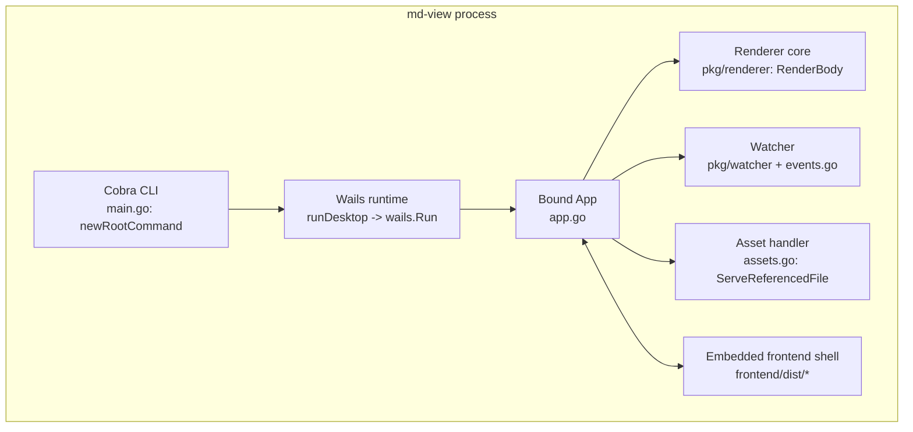
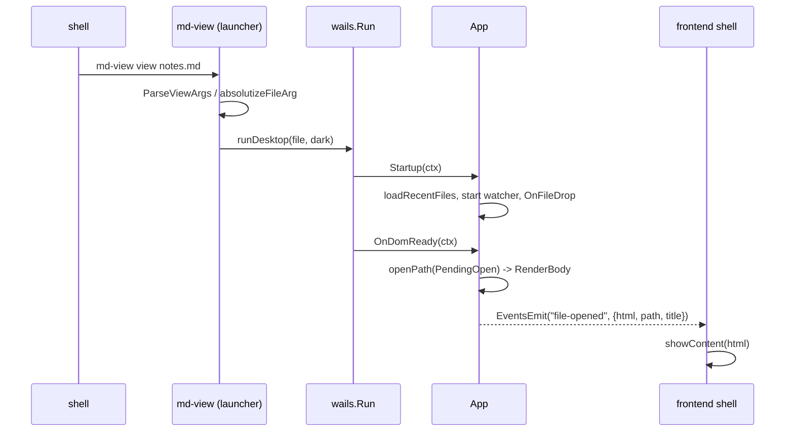
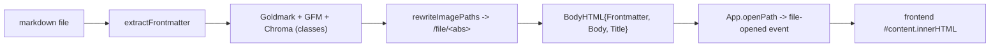

# md-view — Wails Desktop Architecture and the macOS Port

`md-view` renders Markdown in a native desktop window. It is one executable, one process, and one embedded frontend; there is no daemon, no socket, and no browser tab. The current form came from a deliberate rewrite that removed an earlier three-part runtime (short-lived CLI, background daemon, browser) and replaced it with a single Wails v2 application. This report explains that architecture from the ground up, then follows one concrete engineering episode through it: the port of the application to macOS, which surfaced four distinct defects and one false lead. The report is written for a reader who has to modify, debug, or reproduce the system, so it favors the reasoning behind the design over a description of the file tree.

> [!summary]
> - `md-view` is a single Wails v2 process. The CLI parses arguments, `wails.Run` owns the GUI event loop, and a bound `App` supplies the backend methods the WebView calls.
> - Markdown rendering is a preserved, self-contained subsystem. `RenderBody` returns a chrome-free HTML fragment (frontmatter block, body, title); the frontend swaps that fragment into a stable shell.
> - The macOS port (PR [#5](https://github.com/go-go-golems/md-view/pull/5), commit `5fb5f9e`) fixed four independent defects: a `make` comment-syntax failure that broke every target, an `x/tools`/Go-version mismatch in Wails' static analysis, a single-instance lock path that contained slashes, and a test that compared two different canonical forms of a macOS temp path.
> - A sixth change, a compatibility symlink, was a false lead that produced an intermittent `codesign` failure; it was removed. The correct fix was to make the Makefile target the platform's real output path.
> - The lesson that generalizes is that tool pins and failure semantics are part of the interface: a stale `x/tools` pin is a build-system defect, and a lock routine that treats "could not determine" as "already locked" turns a configuration error into silent process exit.

## 1. The problem the project solves

A Markdown file is plain text, but reading it is a formatting task: headings, tables, task lists, fenced code, syntax highlighting, math, and diagrams all have to be turned into a rendered document. The original `md-view` did this with a local HTTP server and a browser: a CLI started a daemon, the daemon rendered the document and served it, and the browser displayed it. That arrangement worked, but it distributed a single user-visible action — "show me this file" — across three processes and a set of state files (a PID file, a port file, and a Unix socket). Each of those is a failure surface: a stale PID can point at a dead process, a port can be occupied, and a socket can outlive its owner.

The Wails rewrite removes those surfaces by collapsing the system into one process. A *WebView* is an operating-system-provided browser engine embedded in an application window: WebKitGTK on Linux, WKWebView on macOS, and WebView2 on Windows. Wails v2 hosts that WebView, exposes Go methods to it as JavaScript functions (the *bindings*), and exposes an event channel from Go to JavaScript. Because the rendering happens in Go and the display happens in the WebView, the same binary can own both without an HTTP server. The result is that `md-view view notes.md` opens a window, and closing the window ends the program.

The architectural center of gravity is therefore not the window. It is the *rendering fragment*. The rewrite preserved the Markdown renderer and changed only the contract around it, so that the same code can serve a fragment to an embedded shell instead of a full HTML page to a browser. Everything else — process ownership, live reload, image serving, menus, recent files — is built around that fragment.

## 2. The single-process model

The runtime has one process and a small number of cooperating parts. The diagram below shows the parts and the direction of control.



The parts and their responsibilities:

| Part | File | Responsibility |
|---|---|---|
| CLI parser | `main.go` | Cobra root and `view` subcommand; dispatch to foreground or background launch |
| Desktop entry | `main.go: runDesktop` | Build `options.App`, embed the frontend, wire menu, drag-and-drop, single instance |
| Bound backend | `app.go` | Open/render files, theme, recent files, drop handling, upload/download |
| Argument parser | `cli.go` | Lenient parsing for forwarded second-instance arguments; path absolutization |
| Launch package | `internal/launch/` | Re-execute the binary detached, with a private log file |
| Renderer | `pkg/renderer/renderer.go` | Markdown → fragment; frontmatter; image path rewriting; CSS generation |
| Watcher | `pkg/watcher/watcher.go`, `events.go` | fsnotify → `file-changed` Wails event |
| Asset handler | `assets.go` | Serve `/file/<abs>` images under an allow-list |
| Frontend | `frontend/dist/` | Stable shell; swaps rendered fragments; re-runs augmentation |
| Build-time CSS | `cmd/gen-chroma-css/` | Generate `chroma.css` and `ui.css` before the app is built |

What disappeared in the rewrite is as important as what remains. There is no `pkg/daemon`, no `pkg/protocol`, no `pkg/server`, and no `cmd/md-view`. There are no `/render`, `/events`, `/raw`, or `/upload-remarkable` HTTP routes. The behaviors those routes provided still exist, but they are now methods on the bound `App` and events emitted into the WebView. Deleting the old scaffolding was the payoff of the rewrite: it removed a process model, a state model, and a dependency (`glazed`) that no longer served the design.

## 3. The command path

The command path begins with Cobra and ends with the Wails event loop. Its most important property is a readiness boundary: the file to display is known before the window exists, but it can only be rendered after the WebView DOM is ready.

`main.go` constructs the Cobra tree with an injected dispatch function, which makes the dispatch testable without opening a window:

```go
func newRootCommand(desktop, background func(string, bool) error) *cobra.Command {
    var viewDark, viewForeground bool
    viewCmd := &cobra.Command{
        Use:   "view [file]",
        Args:  cobra.MaximumNArgs(1),
        RunE: func(cmd *cobra.Command, args []string) error {
            file := ""
            if len(args) == 1 { file = args[0] }
            if viewForeground {
                return desktop(file, viewDark)
            }
            return background(file, viewDark)
        },
    }
    viewCmd.Flags().BoolVar(&viewDark, "dark", false, "Use the dark theme")
    viewCmd.Flags().BoolVar(&viewForeground, "foreground", false, "Stay in the foreground (do not detach)")
    // root command: bare `md-view` opens an empty window (double-click behavior)
    // ...
}
```

`view` is the primary command. A bare `md-view` invocation, which is also what happens when the binary is double-clicked, opens an empty window; it does not detach, so the process stays attached to the caller when one exists.

`runDesktop` is the single place where the Wails options are assembled. It resolves the file argument to an absolute path *before* entering Wails, for a reason that only becomes visible on macOS:

```go
file = absolutizeFileArg(file)

app := NewApp()
app.PendingOpen = file
app.PendingDark = dark
return wails.Run(&options.App{
    // ...
    OnStartup:  app.Startup,
    OnDomReady: app.OnDomReady,
    OnShutdown: app.Shutdown,
    Bind:       []interface{}{app},
    AssetServer: &assetserver.Options{
        Assets:  assets,
        Handler: http.HandlerFunc(app.ServeReferencedFile),
    },
    SingleInstanceLock: &options.SingleInstanceLock{
        UniqueId:               singleInstanceID,
        OnSecondInstanceLaunch: app.OnSecondInstanceLaunch,
    },
})
```

The file is stored in `PendingOpen` because the renderer cannot write into a DOM that does not exist yet. `OnDomReady` consumes `PendingOpen`, calls `openPath`, and emits the result as a `file-opened` event. The distinction matters: `Startup` runs before the frontend is live, and `OnDomReady` runs after it is. Any code that tries to render during argument parsing bypasses this boundary and has no target to render into.



## 4. Process ownership: background launch

Opening a document should return the shell prompt. `wails.Run` blocks until the window closes, so the default `view` command cannot itself be the process that runs Wails. The project separates *process ownership* from *rendering*: `view` starts a detached second execution of the same binary and returns, while `view --foreground` runs Wails in the invoking process.

The detached launch lives in `internal/launch`, a package with no Wails dependency:

```go
func Start(file string, dark bool) (Result, error) {
    executable, err := os.Executable()
    // ...
    args, err := childArgs(file, dark)
    // ...
    cache, err := os.UserCacheDir()
    // ...
    return start(exec.Command(executable, args...), filepath.Join(cache, "md-view"))
}

func childArgs(file string, dark bool) ([]string, error) {
    args := []string{"view", "--foreground"}
    if dark {
        args = append(args, "--dark")
    }
    if file != "" {
        abs, err := filepath.Abs(file)
        // ...
        args = append(args, "--", abs)
    }
    return args, nil
}
```

Several decisions in this package carry weight:

- The child is the same executable, invoked with `view --foreground`. A plain `wails.Run` in a goroutine would not detach, because the goroutine would still run inside the launcher's session. A fork without exec would re-enter the Go runtime in a state it does not support. Re-execution avoids both.
- The file is made absolute before crossing the process boundary. A relative path would otherwise be resolved against the child's working directory, which is not guaranteed to be the caller's.
- `--` is placed before the file so that a file whose name begins with `-` is not interpreted as a flag.
- The child inherits the environment and working directory but not the terminal streams. `detach` sets `SysProcAttr{Setsid: true}` on Linux and macOS, which places the child in a new session with no controlling terminal. On Windows it uses `DETACHED_PROCESS | CREATE_NEW_PROCESS_GROUP`. Stdin is the null device; stdout and stderr go to a private per-launch log under `os.UserCacheDir()/md-view`.
- `Process.Release` is called rather than `Wait`. Waiting would defeat the purpose: the launcher must not own the desktop's lifetime.

```go
//go:build linux || darwin

package launch

import (
    "os/exec"
    "syscall"
)

func detach(cmd *exec.Cmd) error {
    cmd.SysProcAttr = &syscall.SysProcAttr{Setsid: true}
    return nil
}
```

The contract is an *acknowledgement*, not a readiness signal. A successful `view` means the operating system accepted the child process; it does not mean the window opened or the file rendered. Failures after the spawn are asynchronous and appear in the log. This limitation is deliberate: a readiness handshake across processes would require a timeout policy and a synchronization protocol that the shell-detachment use case does not justify. `--foreground` is the synchronous diagnostic mode.

## 5. The single-instance handoff

When a second `md-view` starts, the desired behavior is that the existing window opens the requested file and the second process exits. Wails provides this through `SingleInstanceLock`: the first process holds a lock, and when a second process detects the lock it forwards its arguments to the first and terminates itself.

The forwarding mechanism is a channel on which Go sends data to JavaScript, and consequently the first process receives the second process's `os.Args`. Because those arguments were not validated by the second process's Cobra layer, the project parses them with a deliberately lenient parser, `cli.go: ParseViewArgs`:

```go
func ParseViewArgs(args []string) ViewArgs {
    var out ViewArgs
    for _, a := range args {
        switch {
        case a == "view":
        case a == "--dark":
            out.Dark = true
        case strings.HasPrefix(a, "-"):
            // unknown flag; tolerated for forward compatibility
        default:
            if out.File == "" {
                out.File = a
            }
        }
    }
    return out
}
```

This parser is not a replacement for Cobra. Cobra rejects unknown flags and validates argument counts for fresh commands; `ParseViewArgs` tolerates unknown flags because the forwarded vector may contain flags this version does not know. The two parsers occupy different positions: Cobra validates the invocation, `ParseViewArgs` interprets a message from another process.

The second-instance path also exposes a platform difference that shaped the code. Wails forwards `os.Args` verbatim and supplies a working directory. On Linux and Windows, that directory is the caller's current directory. On macOS, it is the executable's directory. If the forwarded argument were relative, joining it against the executable's directory would resolve to the wrong file. The project removes the ambiguity at the source by rewriting the matching `os.Args` entry to an absolute path before Wails runs:

```go
func absolutizeFileArg(file string) string {
    if file == "" || filepath.IsAbs(file) {
        return file
    }
    abs, err := filepath.Abs(file)
    // ...
    for i, arg := range os.Args {
        if arg == file {
            os.Args[i] = abs
            break
        }
    }
    return abs
}
```

With absolute arguments, `OnSecondInstanceLaunch` can open the file without depending on which directory the platform chose to forward. The handler then either shows the existing window (no file requested) or renders the file and emits the same `file-opened` event the first-instance path uses. Because both paths converge on `openPath`, there is exactly one implementation of "open a file".

## 6. The rendering pipeline

Rendering is the most important preserved subsystem, and its interface is the reason the rewrite was tractable. `RenderBody` reads a file and returns a `BodyHTML` structure — a frontmatter block, the rendered body, and a resolved title — containing no page chrome:

```go
type BodyHTML struct {
    Frontmatter string // collapsible <details> block, or ""
    Body        string // rendered Markdown, image paths rewritten to /file/<abs>
    Title       string // opts.Title, else frontmatter Title, else base name
}
```

The steps inside `RenderBody` are:

1. Read the file from disk.
2. Split YAML frontmatter from the body with `extractFrontmatter`.
3. Convert the body with Goldmark configured with the GFM extension and Chroma highlighting. Highlighting is emitted as CSS classes (`chroma_html.WithClasses(true)`), not inline styles, so the theme can change without re-rendering.
4. Rewrite relative `` values to absolute `/file/...` URLs with `rewriteImagePaths`.
5. Resolve the title in precedence order: explicit option, then frontmatter `Title`, then the file's base name.
6. Format the frontmatter as an HTML block if present.

The same fragment can be wrapped into a standalone page by `Render`, which adds the CSS, scripts, and reload machinery the old HTTP server needed. The desktop application calls `RenderBody` directly. This is the contract change at the center of the rewrite: the reused code computes a fragment; the caller decides how to present it.

Image rewriting is small but load-bearing. Markdown image paths are relative to the document, while the asset handler speaks in absolute paths, so the rewrite resolves each `src` against the document's directory and encodes it as `/file/<absolute-path-without-leading-slash>`. The leading slash is stripped to avoid a double slash in the URL, which would trigger an HTTP redirect. The handler restores it.



## 7. The frontend shell and the event channel

The frontend is a stable shell, not a page per document. It owns the toolbar, the drop zone, the theme attribute, and the recent-files sidebar; the document itself is a fragment that is swapped into `#content`. The single choke point for displaying a document is `showContent` in `frontend/dist/app.js`:

```js
function showContent(html) {
    contentDiv.innerHTML = html;
    contentDiv.style.display = 'block';
    dropzone.style.display = 'none';
    clearError();

    if (window.MDSAugmentPage) window.MDSAugmentPage();       // copy buttons, mermaid
    if (window.MDSInitButtons) window.MDSInitButtons();       // remarkable/copy/download
    // update filename, scroll to top, refresh recent files
}
```

Two properties of this shell are important. First, augmentation is re-runnable: `showContent` re-executes the scripts that attach behaviors to the new DOM after every swap, whether the swap came from opening a file, the recent-files list, drag-and-drop, live reload, or a second-instance handoff. Second, the frontend never computes state that Go owns. The current file, the theme, and the recent list come from bound methods.

Go and JavaScript communicate in two directions. JavaScript calls Go through the bindings (`window['go']['main']['App']['MethodName']()` returns a Promise). Go posts to JavaScript through Wails events. Menu callbacks run in Go and cannot touch the DOM, so a menu action must do its work in Go and then emit an event the frontend listens for. The event set is small and explicit:

| Event | Emitted when | Frontend reaction |
|---|---|---|
| `file-opened` | A file is rendered (menu, drop, config, handoff) | `showContent(html)` |
| `file-error` | Rendering or dialog failure | Show error banner |
| `theme-changed` | Theme toggled (button, menu, `--dark`) | `applyTheme(theme)` |
| `close-file` | File → Close | Clear `#content`, restore drop zone, rebuild buttons |
| `file-changed` | Watched file written | `ReopenCurrent()` then `showContent` |

## 8. Live reload and asset serving

Live reload replaces the old server-sent-events endpoint. `fsnotify` watches the current file; a write produces a `file-changed` event; the frontend calls `ReopenCurrent`, which re-renders and swaps the content. Each open file is watched once, and switching files unwatches the previous one. Without the unwatch, opening A and then B would leave A watched, and a save to A would fire `file-changed`, causing B to re-render while leaking a goroutine and a watcher for every file ever opened. The watcher itself guards against a send racing a close: both the dispatch send and `Unwatch`'s channel close run under the same mutex.

Relative images are served by the asset handler rather than by the embedded frontend. `openPath` registers the document's directory and all of its ancestors as allowed directories, excluding the filesystem root. Excluding the root is deliberate: if the root were registered, any system path would become readable once any document was opened. As implemented, a path inside an allowed directory is served with `http.ServeContent` (which handles range requests and content type), and everything else returns `403`. The behavior was verified directly: a rewritten image URL under `/tmp` returned `200`, and `/file/etc/passwd` returned `403`.

## 9. The macOS port: four defects and one false lead

The application was developed and verified on Linux. Running it on macOS required building it there, and the build exposed defects that are not visible from the architecture alone. The defects are independent of one another; they share only the property that each was a mismatch between an assumption and the platform.

| # | Defect | Symptom | Fix |
|---|---|---|---|
| 1 | `#` inside a `$(shell ...)` expression | Every `make` target failed to parse | Change the `sed` delimiter from `#` to `\|` |
| 2 | `x/tools v0.30.0` vs Go 1.27 | `wails build` aborted in static analysis with a randomized "without types" error | Build a patched Wails CLI with `x/tools v0.50.0` |
| 3 | Lock identifier contained slashes | The app exited immediately as if a second instance were running | Use the slash-free id `com.go-go-golems.md-view` |
| 4 | Two canonical forms of a temp path | `TestAbsolutizeFileArgRewritesOsArgs` failed | Derive the expected base from `os.Getwd()` |
| — | Compatibility symlink at the compile path | Intermittent `codesign` failure | Remove it; target the real `.app` binary path instead |

### 9.1 Defect 1 — `make` reads `#` as a comment

The Makefile computes the set of directories to lint with a shell pipeline:

```make
LINT_DIRS := $(shell git ls-files '*.go' | grep -vE '(^|/)ttmp/|(^|/)testdata/' \
    | xargs -r -n1 dirname | sed 's#^#./#' | sort -u)
```

The `sed` command uses `#` as its delimiter. `make` treats `#` as the start of a comment even inside a function call such as `$(shell ...)`. The comment begins at the first `#` and runs to the end of the line, which truncates the expression before its closing `)`. The parser then reports an unterminated function call, and because the assignment is evaluated when `make` reads the file, *every* target fails, including targets that never use `LINT_DIRS`:

```
Makefile:18: *** unterminated call to function 'shell': missing ')'.  Stop.
```

The fix is to choose a delimiter that `make` does not reserve:

```make
LINT_DIRS := $(shell git ls-files '*.go' | grep -vE '(^|/)ttmp/|(^|/)testdata/' \
    | xargs -r -n1 dirname | sed 's|^|./|' | sort -u)
```

This defect is not macOS-specific, but it blocked the macOS work first because the prescribed build command is `make build`.

### 9.2 Defect 2 — a stale `x/tools` pin against a newer Go toolchain

The first few `wails build` attempts failed during Wails' pre-compilation analysis, before the Go compiler was invoked, with a message whose package names changed between runs:

```
internal error: package "fmt" without types was imported from
"github.com/go-go-golems/md-view/pkg/watcher"
```

A subsequent attempt blamed `os/exec` and `internal/launch`. The variation is a clue about the source. The exact string is emitted by `golang.org/x/tools/go/packages`, not by the Go compiler:

```go
// x/tools v0.30.0, go/packages/packages.go:1232
log.Fatalf("internal error: package %q without types was imported from %q", path, lpkg)
```

Wails uses `go/packages` in `internal/staticanalysis` to inspect `//go:embed` directives, and it validates that imported packages have type information (`packages.NeedTypes | packages.NeedTypesInfo`). Wails v2.12.0 pins `golang.org/x/tools v0.30.0`. That version predates the export-data and type-alias changes in newer Go releases, so against the installed Go 1.27.1 toolchain it can load a package without producing its types, and the package loader treats that inconsistency as fatal. This matches the upstream report in [wailsapp/wails#4060](https://github.com/wailsapp/wails/issues/4060), whose fix was to update `x/tools` in the Wails CLI.

Three cheaper workarounds were ruled out by experiment:

- A fresh `GOCACHE` did not help, which rules out cache corruption.
- `-skipbindings` did not help, which shows the failing analysis is the embed-directive pass, not the TypeScript binding generator.
- `GODEBUG=gotypesalias=0` did not help and caused the loader to panic, because the older code does not handle the alias-disabled mode either.

The fix is to build a Wails CLI whose `x/tools` is current. The Makefile does this entirely inside the repository. It copies the Wails module source into `.wails-cli/`, adds a `replace` directive, tidies, and builds the CLI into `.bin/wails`:

```make
WAILS ?= $(if $(wildcard .bin/wails),.bin/wails,wails)
WAILS_VERSION ?= v2.12.0
WAILS_XTOOLS_VERSION ?= v0.50.0

.bin/wails:
	@mkdir -p .bin .wails-cli
	cp -R "$$(GOWORK=off go env GOMODCACHE)/github.com/wailsapp/wails/v2@$(WAILS_VERSION)" .wails-cli/wails
	chmod -R u+w .wails-cli/wails
	cd .wails-cli/wails && GOWORK=off go mod edit -replace=golang.org/x/tools=golang.org/x/tools@$(WAILS_XTOOLS_VERSION)
	cd .wails-cli/wails && GOWORK=off go mod tidy
	cd .wails-cli/wails && GOWORK=off go build -o ../../.bin/wails ./cmd/wails
```

`make wails-cli` builds the patched CLI explicitly; on macOS, `build` depends on `.bin/wails`, so `make build` is self-contained. The application's own `go.mod` is not modified. This is a workaround for a tool pin, not an application change; it should be removed when a Wails release ships with a newer `x/tools`.

### 9.3 Defect 3 — the lock identifier was a filesystem path

With the build fixed, the application launched and then exited immediately. Its private log contained a single line:

```
Failed to open lockfile /var/folders/.../T//github.com/go-go-golems/md-view.lock:
open /var/folders/.../T//github.com/go-go-golems/md-view.lock: no such file or directory
```

The relevant Wails macOS code constructs the lock path from the configured `UniqueId` and terminates the process when it cannot open the lock:

```go
func SetupSingleInstance(uniqueID string) *os.File {
    lockFilePath := getTempDir()
    lockFileName := uniqueID + ".lock"
    file, err := createLockFile(lockFilePath + "/" + lockFileName)
    if err != nil {
        // treat as "another instance is running": notify it and exit
        C.SendDataToFirstInstance(c.String(uniqueID), c.String(string(serialized)))
        os.Exit(0)
    }
    return file
}
```

The identifier was the Go import path `github.com/go-go-golems/md-view`. Substituting it into the path yields `<TMPDIR>/github.com/go-go-golems/md-view.lock`, which requires a directory named `github.com/go-go-golems` to exist under the temp directory. It does not, and `os.OpenFile` with `O_CREATE` creates files but not intermediate directories. The open therefore fails with `ENOENT`.

The consequence is more than a missing lock. The code interprets *any* failure to open the lock as evidence that another instance already holds it: it forwards the arguments to that supposed instance and exits. A path-construction error is thus indistinguishable from the condition the lock is designed to detect. The process ends silently, and the user sees no window and, unless they read the log, no error.

The fix is to use an identifier that is a single path segment:

```go
const singleInstanceID = "com.go-go-golems.md-view"
```

The double slash in the logged path (`T//github.com`) is cosmetic; the missing directory is the actual defect. With a slash-free identifier, the lock file is created directly in the temp directory, the first instance holds it, and a genuine second instance forwards its arguments to the first and exits.

### 9.4 Defect 4 — macOS canonicalizes `/var` to `/private/var`

One test failed on macOS while passing on Linux:

```
TestAbsolutizeFileArgRewritesOsArgs:
  absolutizeFileArg returned "/private/var/folders/.../notes.md",
  want "/var/folders/.../notes.md"
```

The test created a directory with `t.TempDir()`, changed into it, and compared the result of `absolutizeFileArg` against `filepath.Join(dir, "notes.md")`. On macOS, `t.TempDir()` returns a path under `/var/folders/...`, while `os.Getwd()` — and therefore `filepath.Abs` — returns the canonical path under `/private/var/folders/...`, because `/var` is a symlink to `/private/var` and `getwd(3)` resolves it. The function was correct; the test was comparing two representations of the same directory. The fix derives the expected base from the process's own view of its directory, so the test and the function share one canonicalization:

```go
realDir, err := os.Getwd() // after os.Chdir(dir)
// ...
want := filepath.Join(realDir, "notes.md")
```

The general rule this illustrates is that a test which compares paths must obtain the expected path through the same resolution the code under test uses. Constructing the expected value independently embeds an assumption about path normalization that is platform-dependent.

### 9.5 The false lead — a compatibility symlink and an intermittent `codesign` failure

On macOS, Wails does not leave a bare binary at `build/bin/md-view`; it compiles to that path and then moves the result into `build/bin/md-view.app/Contents/MacOS/md-view`. The documentation and the `run`/`install` targets assumed the bare path. The first attempted fix created a compatibility symlink after the build:

```make
build: frontend-css
	$(WAILS) build -tags $(WAILS_BUILD_TAGS) -s
	ln -sf md-view.app/Contents/MacOS/md-view build/bin/md-view
```

This produced an intermittent failure. Measured across consecutive runs, builds without the symlink passed three times out of three, and a build with the symlink present failed, repeatedly, at the signing step:

```
ERROR codesign failed: exit status 1 –
.../build/bin/md-view.app/Contents/MacOS/md-view: No such file or directory
```

The mechanism is that `build/bin/md-view` is the *compile output path*. When it is a symlink into the application bundle, the compile step and the packaging step disagree about which file is real: the compiler writes through the link into the bundle's binary, and packaging and signing then operate on a path whose state has already been changed. The correlation was reproducible, but the exact internal ordering was not traced to a Wails source line; the change was reverted rather than root-caused further, because the symlink was never necessary.

The correct fix makes the Makefile target the platform's real output path and leaves the compile path untouched:

```make
ifeq ($(UNAME_S),Darwin)
APP_BINARY := build/bin/$(BINARY).app/Contents/MacOS/$(BINARY)
else
APP_BINARY := build/bin/$(BINARY)
endif

run: build
	$(APP_BINARY) view $(FILE)
```

The documentation was updated to name the bundle path on macOS and to recommend `make run`, which resolves the path on either platform.

## 10. Build and release invariants

The build system encodes a small number of invariants that are easy to violate and expensive to rediscover. They are worth stating explicitly.

- **The production binary must be produced by `wails build`.** A plain `go build` compiles but produces a binary that refuses to start, because Wails injects build tags that a raw build omits. The tags used here are `desktop,webkit2_41,production`.
- **The generated CSS must exist before the app is built.** `make frontend-css` runs `cmd/gen-chroma-css`, which writes `frontend/dist/chroma.css` and `frontend/dist/ui.css`. `wails build` embeds `frontend/dist`, so the generated files must be present.
- **The Wails CLI is a tool with its own dependency pins.** A mismatch between the CLI's `x/tools` and the installed Go toolchain is a build-system defect, handled here by `make wails-cli`.
- **The macOS output is an application bundle.** `run` and `install` must target `build/bin/md-view.app/Contents/MacOS/md-view`, not `build/bin/md-view`.
- **Tests must be run with the Wails tag.** `make test` runs `go test -tags webkit2_41 ./...`.

## 11. Verification

The macOS work was verified on macOS 15.8 (Apple M1 Pro) with Go 1.27.1 and Wails v2.12.0. The checks and their outcomes:

| Check | Command | Result |
|---|---|---|
| Reproducible build | `make wails-cli` then `make build` (×3) | Passed 3/3; output `build/bin/md-view.app/Contents/MacOS/md-view` |
| Unit tests | `make test` | All packages passed |
| Static analysis | `go vet -tags webkit2_41 ./...` | Clean |
| Formatting | `gofmt -l main.go cli_test.go` | No output |
| Launch | `make run FILE=README.md` | Process stayed alive; private log empty |
| Handoff | Second `view` invocation | Second process exited; first remained alive (lock works) |
| Symlink hypothesis | Build with/without the symlink | 3/3 passed without; 1/1 failed with |

Two limitations are worth recording. First, the rendered window contents could not be inspected programmatically in this session because `osascript` lacks accessibility permission; process liveness, the empty error log, and the working handoff are the evidence for the GUI path being healthy. Second, a linker warning remains (`object file ... was built for newer 'macOS' version (13.0) than being linked (11.0)`); it is a deployment-target notice and does not affect execution.

## 12. What was tricky

Four lessons generalize beyond this project.

**A tool pin is part of the build interface.** The `x/tools` failure looked like a compiler bug because the message came from a package loader during a build. It was a version mismatch between a tool's pinned dependency and the installed toolchain. When a build failure names a standard library package and changes between runs, the first hypothesis should be the tool chain's own dependencies, not the application's code.

**Failure handling must distinguish "no" from "unknown."** The single-instance lock treated a file-open error as proof that another instance existed. That is a conflation of two different states: "the lock is held" and "the lock could not be created." The second state exited the program silently. A routine that decides whether to run should treat an indeterminate result as an error to report, not as a decision to stop.

**`make` has lexical rules that apply inside functions.** The `#`-comment defect was not about `sed` or about the pipeline; it was about the Makefile language noting that `#` begins a comment even within `$(shell ...)`. Choosing a delimiter that the surrounding language reserves is a correctness issue, not a style preference.

**Path tests must share the code's canonicalization.** The `/var` and `/private/var` forms are the same directory, and the test failed because it constructed the expected value independently. Tests that compare filesystem paths are sensitive to how the path was produced.

And one procedural lesson: the compatibility symlink was a plausible-looking fix that introduced a new, intermittent failure. The measurements that separated the two states — repeated builds with and without the symlink — were what justified removing it rather than continuing to add workarounds.

## 13. Open questions and near-term next steps

- **Review and merge PR #5.** The pull request is open with 8 changed files and a net change of +81/−14 lines; it is currently reported as mergeable.
- **Remove the patched-CLI workaround when upstream catches up.** The `wails-cli` target exists only because Wails v2.12.0 pins an old `x/tools`. A future Wails release with a newer pin makes `.bin/wails` unnecessary.
- **Add a macOS CI job.** The defects found here were platform-visible only at build and launch time. A CI runner that builds and tests on macOS would catch the `x/tools` and lockfile classes earlier.
- **Root-cause the symlink/`codesign` interaction** if the compile-path behavior is ever relevant again. The correlation is established; the internal ordering was not traced.
- **Record the deployment-target warning's cause.** The `-target` mismatch between the Go linker and the local SDK is benign here but should be understood before a release build is cut.

## 14. Implementation map

The following table points at the code discussed above. Line numbers shift; the symbols are stable.

| Symbol | Location | Role |
|---|---|---|
| `newRootCommand` | `main.go` | Cobra root and `view` command; testable dispatch |
| `runDesktop` | `main.go` | Wails options, bindings, asset handler, single-instance lock |
| `singleInstanceID` | `main.go` | Slash-free lock identifier (macOS fix) |
| `App` | `app.go` | Bound backend state and methods |
| `OnDomReady` | `app.go` | Opens `PendingOpen` after the DOM exists |
| `OnSecondInstanceLaunch` | `app.go` | Opens a file forwarded by a second instance |
| `openPath` | `app.go` | Shared open/render/state path |
| `ParseViewArgs`, `absolutizeFileArg` | `cli.go` | Lenient forwarded-argument parsing; path absolutization |
| `Start`, `childArgs`, `start` | `internal/launch/launch.go` | Detached re-execution |
| `detach` | `internal/launch/detach_unix.go` | `Setsid` on Linux/macOS |
| `RenderBody`, `BodyHTML` | `pkg/renderer/renderer.go` | Fragment rendering contract |
| `rewriteImagePaths` | `pkg/renderer/renderer.go` | Relative image → `/file/<abs>` |
| `FileWatcher`, `Watch`, `Unwatch` | `pkg/watcher/watcher.go` | fsnotify live reload |
| `watchFile`, `unwatchFile` | `events.go` | Watcher → `file-changed` event |
| `ServeReferencedFile`, `isAllowed` | `assets.go` | Allow-listed image serving |
| `showContent`, `applyTheme` | `frontend/dist/app.js` | Fragment swap and re-augmentation |
| `build`, `wails-cli`, `.bin/wails` | `Makefile` | Build invariants and patched CLI |
| `gen-chroma-css` | `cmd/gen-chroma-css/main.go` | Generated `chroma.css`, `ui.css` |

The pull request changes exactly eight files: `main.go`, `Makefile`, `cli_test.go`, `.gitignore`, `AGENT.md`, `README.md`, `docs/getting-started.md`, and `docs/user-guide.md`. No renderer, watcher, asset, or frontend logic changed, which is consistent with the defects being build-system, process-lifecycle, and test issues rather than rendering issues.

## 15. Related notes

- `ttmp/2026/06/13/MD-WAILS--port-md-view-to-a-wails-v2-desktop-application/` — the rewrite's design guide, diary, and implementation review.
- `ttmp/2026/09/05/MDV-BG-001--background-view-launch-with-explicit-foreground-mode/` — the background-launch design, platform detachment, and native smoke evidence.
- `AGENT.md` — authoritative build, test, and run instructions, including the macOS output path and the `wails-cli` note.
- `README.md`, `docs/getting-started.md`, `docs/user-guide.md` — user-facing commands, updated for the bundle path.
