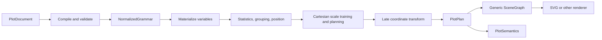
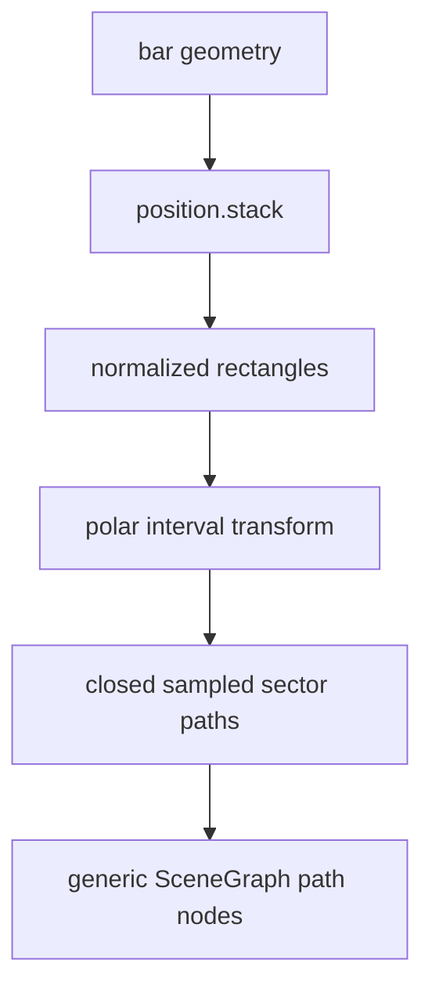

# Transpose and Polar Coordinates with Coherent Guides, Annotations, and Semantics

## Learning objectives

After reading this chapter, you should be able to:

1. distinguish statistical, normalized geometric, device-layout, scene, and semantic stages in a plotting pipeline;
2. derive transpose and polar transforms from normalized panel coordinates;
3. explain why ordinary bars can become polar sectors without adding a pie or rose geometry;
4. transform guides and annotations while preserving their original variable meaning;
5. identify geometries whose topology cannot be supported by pointwise transformation;
6. interpret deterministic diagnostics and browser evidence as part of a coordinate-system contract.

> [!abstract]
> A coordinate system should be a late, closed, serializable transformation of planned geometry. Statistics, grouping, position adjustment, facet partitioning, and scale training retain their ordinary Cartesian meanings. Geometry is transformed in normalized panel space; typography and layout offsets remain in device space. The scene renderer receives generic primitives, while a separate semantic projection preserves source variables and records how they are displayed.

## 1. The architectural question

A plotting grammar describes *what* variables, transformations, statistical operations, geometries, scales, guides, and annotations mean. A renderer describes *how* already-planned primitives become SVG, Canvas, or another output. Coordinate systems sit between those responsibilities. They alter the geometric interpretation of positions, but they must not silently alter the data computation or erase semantic identity.

HSPLOT’s implemented pipeline is:



The important ordering is that the coordinate transform occurs **after** statistical and positional work. A stacked bar is stacked before it becomes a sector. A grouped line is grouped before its points are mapped around a circle. A facet is partitioned before each panel receives an independent coordinate frame. Scale domains are trained on the original mapped variables, not on renderer coordinates.

This ordering prevents a coordinate option from becoming a disguised chart type. There is no separate horizontal-bar API, no pie geometry, no rose geometry, and no radial-line renderer branch. The public coordinate grammar is a closed union:

```ts
type CoordinateSpec =
  | { kind: "cartesian" }
  | { kind: "transpose" }
  | {
      kind: "polar"
      theta?: "x" | "y"
      startAngle?: number
      direction?: "clockwise" | "counterclockwise"
      innerRadius?: number
    }
```

A closed data structure is JSON-safe, exhaustively validated, and deterministic under a document round trip. It excludes projection callbacks and renderer-owned functions. In the HSPLOT-009 implementation, `startAngle` must be finite, `innerRadius` must be finite and satisfy $0 \le r_i < 1$, and defaults are explicit: `startAngle = -π/2`, clockwise direction, and `innerRadius = 0`.

## 2. Three spaces, not one

Coordinate bugs frequently arise when distinct spaces are treated as interchangeable. A coherent implementation separates at least three.

### 2.1 Data and scale space

Suppose a quantitative value $x$ has trained domain $[x_0,x_1]$. Its normalized coordinate is

$$
u_x = \frac{x-x_0}{x_1-x_0}.$$

A temporal scale may first parse dates to milliseconds; a categorical scale may map an ordered level to a band interval. Those are scale responsibilities. They are unchanged by transpose or polar display.

### 2.2 Normalized panel geometry

Normalized panel coordinates $(u,v)$ lie in a unit square. HSPLOT uses data-oriented bottom-to-top $v$, even though SVG device $y$ increases downward. Coordinate operations act here because normalized values are independent of a panel’s pixel aspect ratio.

Transpose is the involution

$$T(u,v)=(v,u), \qquad T(T(u,v))=(u,v).$$

That equation is simple, but its placement in the pipeline is decisive. Applying it before scales would exchange variable domains. Applying it after conversion to pixels would produce aspect-ratio-dependent behavior. Applying it in normalized panel space changes display axes while retaining the original x and y compositions.

### 2.3 Device geometry and typography

For a panel with left edge $L$, top edge $T$, width $W$, and height $H$, an ordinary normalized point becomes

$$X=L+uW, \qquad Y=T+(1-v)H.$$

Under transpose, the transformed normalized point $(v,u)$ becomes

$$X'=L+vW, \qquad Y'=T+(1-u)H.$$

Positions belong to geometric space. Tick lengths, label padding, font sizes, and legend gaps do not. A six-pixel tick should remain six pixels on a $500\times200$ panel; it should not be divided by one dimension, transposed, and multiplied by another.

> [!warning] Normalized geometry versus device typography
> Transform scale positions in normalized space, then apply tick, label, and text offsets on the resolved display side in device pixels. HSPLOT’s first transpose browser inspection exposed this boundary: a 39 px bottom-axis label offset was normalized and swapped on a rectangular panel, producing a much larger horizontal displacement and clipping “Observed at.” Keeping typography offsets in device space corrected the overflow.

The implementation therefore distinguishes transformations of *anchors* from layout of text relative to those anchors. This distinction also applies to annotation labels and guide titles.

## 3. Transpose: display changes, meaning remains

Consider a plot whose x variable is observation time and whose y variable is response in milliseconds. Before transpose, a point at normalized $(0.25,0.80)$ in a $600\times300$ panel beginning at $(50,30)$ has device position

$$X=50+0.25(600)=200,$$
$$Y=30+(1-0.80)(300)=90.$$

After transpose,

$$T(0.25,0.80)=(0.80,0.25),$$
$$X'=50+0.80(600)=530,$$
$$Y'=30+(1-0.25)(300)=255.$$

The time variable remains x in the grammar and semantics. It is displayed vertically. Response remains y and is displayed horizontally. Accessibility text can consequently say that the plot uses transposed positional coordinates without falsely renaming the variables.

Guide placement follows the coordinate, not merely the original grammar channel. In the implemented defaults:

- the original x/bottom guide resolves to the left display side;
- the original y/left guide resolves to the bottom display side;
- tick positions are transformed geometric positions;
- tick marks and labels are offset from the newly resolved side in pixels;
- legends remain outside the coordinate frame and unchanged.

This separation allows an exact semantic statement: “original temporal x ticks appear on the vertical display axis.” Calling that axis “y” would conflate display direction with composition.

A pure authoring example remains declarative:

```ts
import {
  coordinate,
  geom,
  layer,
  plot,
  value,
  variable,
} from "@optkit/plot/author"

const observedAt = variable.field("observedAt", { semanticType: "temporal" })
const response = variable.field("responseMs", { semanticType: "quantitative" })

const document = plot({
  variables: [observedAt, response],
  layers: [
    layer({
      geometry: geom.point(),
      mapping: {
        x: value.variable(observedAt),
        y: value.variable(response),
      },
    }),
  ],
  coordinate: coordinate.transpose(),
})
```

The exact constructor signatures may evolve, but the architectural property does not: authoring yields serializable grammar data and does not issue SVG commands.

## 4. Polar coordinates

Polar coordinates map one normalized positional channel to angle and the other to radius. Let $a\in[0,1]$ be normalized angular position, $q\in[0,1]$ normalized radial position, $\alpha_0$ the start angle, $d\in\{-1,+1\}$ the direction, and $r_i\in[0,1)$ the normalized inner radius. HSPLOT records clockwise SVG direction as $d=+1$ because device $y$ increases downward. Define

$$\theta=\alpha_0+d(2\pi a),$$
$$\rho=R\left(r_i+(1-r_i)q\right),$$

where

$$R=\frac{1}{2}\min(W,H).$$

For panel center $(C_x,C_y)$, device position is

$$X=C_x+\rho\cos\theta,$$
$$Y=C_y+\rho\sin\theta.$$

The default $\alpha_0=-\pi/2$ places normalized angle zero at the top. With an explicit start angle of zero, angle zero points right and one quarter turn points down for clockwise SVG coordinates.

### 4.1 Numeric cardinal example

Take a $400\times300$ panel at device origin, so $(C_x,C_y)=(200,150)$ and $R=150$. Let `startAngle = 0`, clockwise direction, and `innerRadius = 0.2`.

For $(a,q)=(0,1)$:

$$\theta=0,\quad \rho=150,$$
$$P=(350,150).$$

For $(a,q)=(0.25,1)$:

$$\theta=\pi/2,\quad P=(200,300).$$

For $(a,q)=(0.5,0)$:

$$\theta=\pi,\quad \rho=150(0.2)=30,$$
$$P=(170,150).$$

Thus `innerRadius` changes the radial baseline rather than discarding zero-valued geometry. The smaller panel dimension bounds the circle, preventing overflow in a rectangular panel.

### 4.2 Choosing theta

If `theta: "x"`, normalized x supplies $a$ and normalized y supplies $q$. If `theta: "y"`, those roles reverse. This choice does not rename variables. It records which existing composition channel is interpreted angularly.

```ts
const radialDocument = {
  ...document,
  coordinate: {
    kind: "polar",
    theta: "x",
    startAngle: -Math.PI / 2,
    direction: "clockwise",
    innerRadius: 0.15,
  },
}
```

## 5. Points, lines, rays, circles, and sectors

A point transforms by the equations above. A grouped line transforms each ordered point and emits a generic path. This is valid because a line’s topology remains a one-dimensional ordered trace.

Rules require channel-aware topology:

- a rule at constant angle becomes a **ray**, extending over a radial interval;
- a rule at constant radius becomes a **circle** or circular arc, extending over an angular interval.

A straight segment between transformed endpoints is not generally correct. For a constant radius, the endpoints lie on a circle, but the chord cuts through the interior. The planner must sample the arc or emit an equivalent generic path representation.

The same reasoning governs grids:

- angular grid positions become rays;
- radial grid positions become circles;
- axis paths become angular or radial paths;
- labels are anchored to transformed guide geometry, with text offsets applied in device space.

HSPLOT samples curved paths deterministically at 32 segments per full turn. Sampling density is an explicit quality boundary: too low produces visible facets; excessive sampling enlarges scenes. Determinism is more important than renderer-specific curve inference because JSON plans and scenes must compare exactly across round trips.

## 6. Ordinary bars become paths

An ordinary bar is planned from normalized interval bounds. Let its angular interval be $[a_0,a_1]$ and radial interval be $[q_0,q_1]$. Convert them to

$$\theta_0=\alpha_0+d2\pi a_0,\qquad
\theta_1=\alpha_0+d2\pi a_1,$$

$$\rho_0=R(r_i+(1-r_i)q_0),\qquad
\rho_1=R(r_i+(1-r_i)q_1).$$

A sector path traverses the outer arc from $\theta_0$ to $\theta_1$, then the inner arc in reverse from $\theta_1$ to $\theta_0$, and closes. With $r_i=0$ and $q_0=0$, the inner boundary collapses to the center. With stacking, each bar’s radial interval starts at the previous cumulative value, so stacked rectangles become adjacent annular sectors.

```text
outer boundary:  P(ρ1, θ0) → samples → P(ρ1, θ1)
radial boundary: P(ρ1, θ1) → P(ρ0, θ1)
inner boundary:  P(ρ0, θ1) → reverse samples → P(ρ0, θ0)
close:           P(ρ0, θ0) → P(ρ1, θ0)
```

This transformation happens after `position.stack`. Therefore a browser proof can truthfully report “15 ordinary stacked bars became 15 closed path sectors.” No statistic was redefined, no pie-specific data convention was introduced, and the renderer only received paths.



The scene layer does not branch on `coordinate.kind`. Its responsibility is mechanical lowering of planned line, rectangle, symbol, text, and path nodes. Coordinate reasoning remains in planning and coordinate modules.

## 7. Coordinate-aware guides

Configured guides are grammar components, not renderer preferences. Before coordinates are applied, HSPLOT can resolve axis side, automatic or explicit ticks, bounded number/percent/temporal formatting, grid policy, legend title, orientation, order, reversal, and entry limit. Layout reserves the requested edges deterministically.

A late coordinate transform must preserve this prior contract:

1. **Tick values retain scale meaning.** A date tick remains a date tick after transpose; a radial response tick remains a response value in polar display.
2. **Geometry follows the coordinate.** Positions, axis paths, rays, circles, and grids transform.
3. **Typography stays device-based.** Font size, tick length, and label padding do not undergo normalized anisotropic scaling.
4. **Legends remain external.** A color legend describes an aesthetic scale rather than positional geometry, so it is not wrapped around a polar frame.
5. **Formatting remains bounded and declarative.** `Intl.NumberFormat` and `Intl.DateTimeFormat` options are validated data; callback formatters would break serialization.

Explicit ticks are especially useful in numeric validation. In a radius domain $[0,100]$, ticks $[0,50,100]$ with $r_i=0.2$ and $R=150$ occupy radii $30$, $90$, and $150$. Their circles provide inspectable expected geometry. An automatic tick-count request must select no more than the requested count; merely requesting “nice” ticks can produce too many.

## 8. Coordinate-aware annotations

HSPLOT-008 introduced stable rule, text, region, and point annotations with data, datum, or normalized-panel anchors; semantic appearance; intent; and facet selection. HSPLOT-009 transforms their planned anchors through the same coordinate stage as marks and guides.

A panel anchor $(0.25,0.75)$ is interpreted bottom-to-top. Under transpose it becomes \$(0.75,0.25)`. Under polar with x as theta it becomes angle \$0.25\$ of a turn and radius \$0.75$ of the usable radial span. A data anchor is first resolved through trained scales and only then transformed. This keeps annotations aligned with their variables.

Rules and regions again require topology rather than naïve vertex mapping. A constant-radius annotation rule must become a circular path. A rectangular annotation region in angular/radial coordinates becomes a sector-like path. Text and point annotation anchors transform as positions, after which glyph sizing and text offsets remain in device space.

Not every declared anchor can resolve. A field-backed variable does not identify one scalar without datum identity. HSPLOT emits a stable missing-anchor diagnostic rather than choosing an arbitrary row. Datum anchors compile but remain a documented future interaction dependency. Out-of-domain annotations are omitted with `annotation.outside-domain`; omission is explicit and deterministic rather than clipped or guessed.

> [!note] Annotation identity
> Scene roles may also call titles or facet strips “annotations.” Stable document annotation IDs, not a broad scene role, connect grammar annotations to diagnostics, semantic records, and future interaction.

## 9. Semantics must survive display transforms

A scene graph answers visual questions: which path, line, symbol, rectangle, or text node should be rendered? It does not by itself preserve why those nodes exist. `PlotSemantics` is projected independently from the plan and records coordinate metadata, original composition, guide state, and annotation identity and intent.

For a transposed plot, semantics should preserve:

```json
{
  "composition": {
    "x": "observedAt",
    "y": "responseMs"
  },
  "coordinate": {
    "kind": "transpose"
  }
}
```

For polar display:

```json
{
  "composition": {
    "x": "treatment",
    "y": "response"
  },
  "coordinate": {
    "kind": "polar",
    "theta": "x",
    "direction": "clockwise",
    "innerRadius": 0
  }
}
```

The coordinate section describes display. The composition section describes the grammar. Keeping both enables accessibility text such as “bar plot of 15 rendered layer rows, displayed in polar coordinates with x as angle,” while retaining the fact that treatment and response drove the original channels.

This distinction also prevents downstream tools from reverse-engineering meaning from shape. A path could represent a line, a sampled radial grid circle, an annotation boundary, or a stacked sector. Its path commands do not reliably identify the source variable, statistical operation, group, or annotation intent. Conversely, semantic consumers do not need to reproduce device coordinates to answer which variable is angular, whether a guide is hidden, or which panels contain an annotation. Scene and semantics are parallel projections with different information requirements.

Structured semantics also makes coordinate accessibility testable without coupling tests to one renderer’s DOM. A test can assert the coordinate kind, theta channel, public direction string, original composition IDs, and guide domains directly. Renderer tests then verify that the accessible description exposes the relevant summary. The two checks establish both semantic correctness and delivery through the browser boundary.

Guide semantics independently record visibility, channel, variables, domain, and ticks or entries. Annotation semantics retain stable ID, intent, anchor type, and visible panels. This structure is suitable for nonvisual inspection and future interaction without parsing SVG geometry.

## 10. Unsupported topology and failure policy

Pointwise transformation is insufficient when a geometry’s boundary and interior have special meaning. The implemented support matrix is:

| Component | Cartesian | Transpose | Polar |
|---|---:|---:|---:|
| point | yes | yes | yes |
| grouped line | yes | yes | yes |
| bar/interval | rectangle | transformed | sector path |
| rule | line | transformed | ray or circle |
| area | yes | diagnosed | diagnosed |
| ribbon | yes | diagnosed | diagnosed |
| error bar | yes | diagnosed | diagnosed |
| boxplot | yes | diagnosed | diagnosed |
| annotations | yes | transformed | transformed/path |
| facets | yes | independent frames | independent frames |

Areas and ribbons require correct transformed boundaries, baseline closure, and possibly winding rules. Error bars require transformed caps and stems. Boxplots combine boxes, whiskers, medians, and outliers with channel-specific topology. Transforming a subset of vertices could produce a plausible picture that is mathematically wrong.

The failure policy is therefore atomic: emit `coordinate.geometry.unsupported` with the layer ID and return no partial plan or scene. A complete diagnostic is preferable to mixed output in which supported layers appear and unsupported layers silently disappear. Expansion should occur only when the topology is specified and tested.

Compiler diagnostics likewise reject invalid coordinate configuration at precise paths such as `coordinate.startAngle` and `coordinate.innerRadius`. They do not clamp infinity, coerce `innerRadius = 1`, or infer a fallback.

## 11. Validation and browser evidence

The implementation diary and coordinate matrix record several layers of evidence.

### 11.1 Mathematical and deterministic tests

Focused tests cover:

- transpose involution to 12 decimal places;
- hand-calculated polar cardinal points;
- clockwise/counterclockwise direction, start angle, and inner radius;
- ordinary stacked bars producing closed sectors;
- grouped polar lines;
- transformed guides and annotations;
- three facet panels with distinct centers and independent frames;
- semantic preservation and accessible descriptions;
- invalid options and unsupported geometry;
- deterministic plan and scene JSON after document round trip;
- architecture guards forbidding React, DOM, and SVG imports in coordinate code.

At HSPLOT-009 closure, 21 test files and 125 tests passed. The final HSPLOT-005–010 completion audit reports 22 files and 133 tests, typecheck, lint over 78 files, production build, Storybook build, packed author-only and React consumer smoke tests, package-content checks, and `git diff --check` all passing.

### 11.2 Rendered evidence

The polar Storybook proof used a `500×500` SVG. Browser inspection found 15 mark paths from 15 ordinary stacked bars, four radial grid paths, finite inspected numeric attributes, a rectangular external legend, visible angular and radial labels, and an accessible description that announced polar coordinates with x as angle.

![[assets/hsplot-polar-stacked-bars.png|600]]

The transpose proof retained temporal x meaning on the vertical display axis and quantitative y meaning on the horizontal display axis. Labels remained “Observed at” and “Response (ms),” and the treatment legend remained external.

![[assets/hsplot-transposed-points.png|600]]

The configured-guide proof from HSPLOT-008 demonstrates the prerequisite behavior: top and right axes, explicit grid lines, horizontal legend, threshold rule, region, and text annotation are planned before rendering.

![[assets/hsplot-configured-guides-and-annotations.png|600]]

Absolute-path embeds may not render on another machine; the source paths remain useful as provenance, and the screenshots should be copied into a vault attachment directory if the note is to be distributed.

### 11.3 Recorded failures

Failure evidence clarifies system boundaries:

- The first screenshot capture failed because the screenshot directory did not exist; creating it fixed the `ENOENT` failure.
- The first transpose label implementation transformed pixel offsets through normalized space, causing overflow on a nonsquare panel; device-space offsets fixed it.
- A browser-evaluation snippet had a syntax error and was replaced by a smaller explicit loop.
- Static Storybook serving produced a known missing-favicon 404, not a plot runtime error.
- Earlier guide work briefly referenced a nonexistent legend `scale` local and caused 32 test failures; stable mapped-variable identity plus resolved domain/order corrected the compatibility key.
- A guessed smoke-script name failed; the authoritative `pnpm consumer:smoke` command passed.

These are not incidental anecdotes. Each failure identifies where ownership belongs: filesystem setup in evidence capture, typography in device layout, semantic legend identity in planning, and package scripts in repository configuration.

## 12. Design checklist

When adding or reviewing a coordinate system, ask:

- Is it represented by a closed, serializable grammar value?
- Does compilation validate every bounded parameter at a precise path?
- Are statistics, grouping, stacking, faceting, and scale training complete before transformation?
- Does geometry transform in normalized panel coordinates?
- Do text sizes and offsets remain in device units?
- Are curved rules and interval boundaries handled topologically rather than as endpoint chords?
- Do generic scene primitives avoid coordinate-specific renderer branches?
- Do semantics retain source variables and separately describe display coordinates?
- Are legends kept outside positional coordinate transforms?
- Does each facet receive its own frame and center?
- Are unsupported geometries rejected atomically with layer-specific diagnostics?
- Are numeric formulas, deterministic JSON, accessibility, and browser geometry all tested?

## 13. Summary

Transpose and polar coordinates are coherent when they are late transformations of already-computed geometry. Transpose swaps normalized axes but not variable identity. Polar maps a selected normalized channel to angle and the other to radius, with explicit start angle, direction, and inner-radius conventions. Ordinary intervals become sampled closed sectors; rules become rays or circles according to topology. Guides and annotations share the coordinate transform for their anchors and paths, while typography remains in device space. Legends remain external. Semantics preserve original composition and add coordinate metadata.

The boundary is equally important for unsupported cases. Areas, ribbons, error bars, and boxplots require dedicated topology. A precise diagnostic and no scene is safer than partial, plausible output. Combined mathematical tests, architecture checks, deterministic serialization, browser inspection, screenshots, and recorded failures provide evidence that the coordinate contract holds across grammar, plan, scene, semantics, and rendering.

## References

1. HSPLOT-008, “Implementation Diary,” `ttmp/2026/08/29/HSPLOT-008--configured-guides-and-annotation-components/reference/01-implementation-diary.md`.
2. HSPLOT-008, “Validation and Rendered Inspection,” `ttmp/2026/08/29/HSPLOT-008--configured-guides-and-annotation-components/reference/02-validation-and-rendered-inspection.md`.
3. HSPLOT-008 screenshot, `reference/screenshots/configured-guides-and-annotations.png`.
4. HSPLOT-009, “Implementation Diary,” `ttmp/2026/08/29/HSPLOT-009--transpose-and-polar-coordinate-systems/reference/01-implementation-diary.md`.
5. HSPLOT-009, “Coordinate Matrix and Validation,” `ttmp/2026/08/29/HSPLOT-009--transpose-and-polar-coordinate-systems/reference/02-coordinate-matrix-and-validation.md`.
6. HSPLOT-009 screenshots, `reference/screenshots/transposed-points.png` and `reference/screenshots/polar-stacked-bars.png`.
7. HSPLOT-010, “HSPLOT-005 Through HSPLOT-010 Completion Audit,” `ttmp/2026/08/29/HSPLOT-010--public-variables-transforms-and-plot-algebra/reference/03-hsplot-005-010-completion-audit.md`.
8. HSPLOT source modules: `src/document.ts`, `src/compile.ts`, `src/coordinates.ts`, `src/plan.ts`, `src/scene.ts`, and `src/semantics.ts`.
