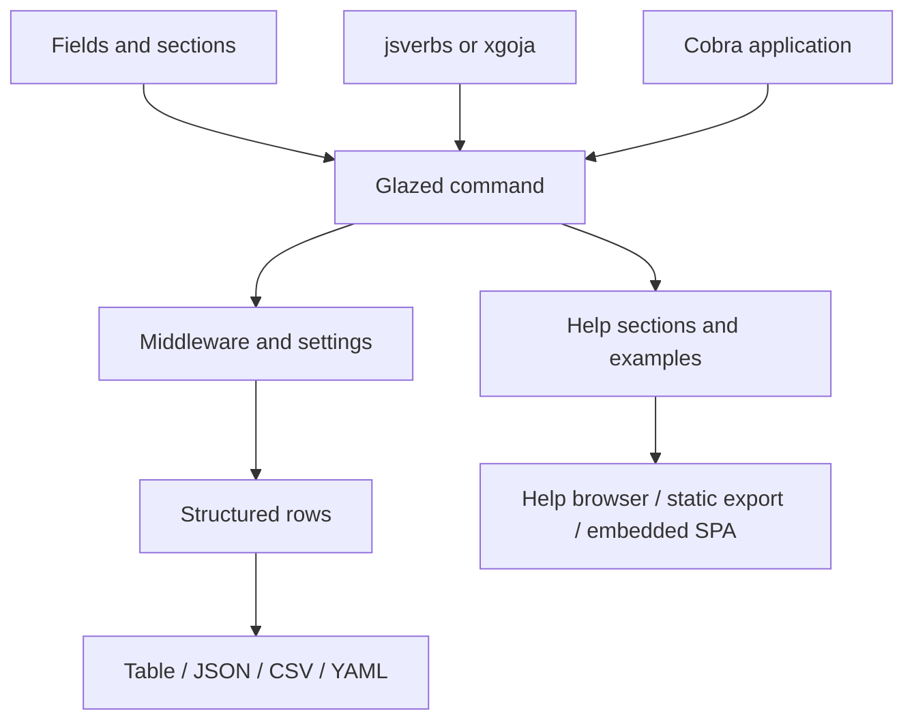

# Glazed — Structured Go CLI Applications and Help Systems

Glazed is the Go CLI framework used across the workspace for structured command schemas, field sections, middleware, output formats, help content, configuration, and composable command applications. Its core contract separates command definition from execution and lets the same command produce tables, JSON, CSV, YAML, or machine-readable rows while retaining a conventional Cobra-facing CLI.

> [!summary]
> - **Command model:** define fields and sections once, then expose structured output through Glazed middlewares.
> - **Application layer:** compose Cobra commands, settings, config, logging, and help into reusable Go binaries.
> - **Documentation layer:** embed help pages, export static sites, and serve interactive documentation from the same command metadata.

## Architecture

Glazed is both a runtime library and a design vocabulary. A command author decides which values are user-facing fields, how those fields are grouped, what output rows mean, and which help pages explain the command. The framework then supplies consistent parsing, output, configuration, and documentation behavior.

## Core capability areas

### Command schemas and structured output

- [[ARTICLE - Glazed Chain - From Cobra Flags to Typed Values]] — field values and command-chain composition.
- [[ARTICLE - Deep Dive - Building a Modern XML CLI in Go - Part 1]] — command architecture and schema foundations.
- [[ARTICLE - Deep Dive - Building a Modern XML CLI in Go - Part 2]] — middleware and typed command behavior.
- [[ARTICLE - Deep Dive - Building a Modern XML CLI in Go - Part 3]] — completion and application integration.
- [[ARTICLE - Implementing Go Analysis Linters - Glazed CLI Linter Deep Dive]] — a structured analysis command application.
- [[ARTICLE - Deep Dive - Building a Modern XML CLI in Go - Part 1]] — CLI design context.

### Help, docs, and static publishing

- [[PROJ - Glazed Serve - Help Browser, Embedded Docs, and SPA]] — interactive help serving.
- [[PROJ - Glazed Static Help Export - render-site and Static Snapshot Publishing]] — static help export.
- [[PROJ - Glazed Help Export and External Serve Sources - Technical Project Report]] — external help sources and publishing boundaries.
- [[ARTICLE - Docsctl and Docs-Yolo Documentation Deployment]] — Go-hosted documentation deployment.
- [[ARTICLE - Agent a14y for Go-Hosted React Docs - Converting docsctl from SPA Shell to Agent-Readable Site]] — agent-readable documentation surfaces.
- [[ARTICLE - xgoja Provider-Shipped Glazed Help Documents]] — shipping help through generated providers.

### JavaScript, xgoja, and application integrations

- [[PROJ - go-go-goja jsverbs - JavaScript to Glazed Commands]] — JavaScript-defined Glazed commands.
- [[ARTICLE - Playbook - Adding jsverbs to Arbitrary Go Glazed Tools]] — adding the JavaScript command surface.
- [[GUIDE - Goja JS Verbs to CLI]] — practical jsverbs integration.
- [[ARTICLE - xgoja - Building a Query Tool with Jsverbs and Embedded Modules]] — generated CLI composition.
- [[PROJ - TupleSpace - Go service and Glazed CLI]] — service plus structured CLI.
- [[PROJ - PinocchioRC - Declarative Config Plans and Cleanup]] — Glazed config plans shared across applications.

### Operations and security

- [[PROJ - Glazed Secret Redaction and Vault Bootstrap - Technical Project Report]] — secret-aware configuration and startup.
- [[ARTICLE - Logcopter - Package Scoped Logging for Go CLIs]] — structured logging integration.
- [[ARTICLE - Managing Go-Go-Golems Release Trains]] — release workflow for the surrounding Go CLI ecosystem.
- [[Projects/2026/05/26/ARTICLE - Vault OIDC for CI/CD Docs Publishing - Designing Short-Lived Package-Scoped Credentials]] — publishing credentials and help delivery.

## Recommended reading path

1. Start with the command schema and middleware articles.
2. Read the Glazed Serve and static-export reports to understand the documentation surface.
3. Read the jsverbs/xgoja links for generated and JavaScript-authored commands.
4. Read PinocchioRC for declarative configuration plans.
5. Read the secret, logging, and release notes for production concerns.

## Working rules

- Keep command schemas declarative and output rows structured.
- Separate command configuration from application-wide settings and runtime state.
- Treat help content as a first-class artifact with stable slugs and explicit examples.
- Reuse the same command semantics across CLI, JavaScript, generated hosts, and web help surfaces.
- Keep secrets out of rendered help, logs, and structured output.
- Prefer small composable middleware over command-specific format switches.

## Related project maps

- [[devctl]] — repository-local orchestration built on Glazed; its command namespace registry keeps built-in and provider-defined Cobra names consistent across catalog production and installation. See [[Research/Software Architecture Garden/devctl/01 - Project Architecture Overview#Pattern command namespace registry|Pattern: command namespace registry]].
- [[go-go-goja]] — JavaScript hosts, jsverbs, and generated applications.
- [[geppetto]] — model/runtime profiles and agent-facing Go APIs.
- [[pinocchio]] — CLI chat applications and TUI/RPC hosts.
- [[docmgr]] — ticketed documentation and project provenance.

## Repository map

Repository: `/home/manuel/code/wesen/go-go-golems/glazed`

| Concern | Location |
|---|---|
| Command and field model | `pkg/cmds`, `pkg/fields`, `pkg/types` |
| Middleware and output | `pkg/middlewares`, `pkg/formatters` |
| Help system | `pkg/help`, `pkg/doc`, `docs/` |
| Config and settings | `pkg/config`, `pkg/settings` |
| Documentation applications | `cmd/docsctl`, `cmd/glaze`, `cmd/docs-registry` |
| Examples and tests | `cmd/examples`, package tests |
