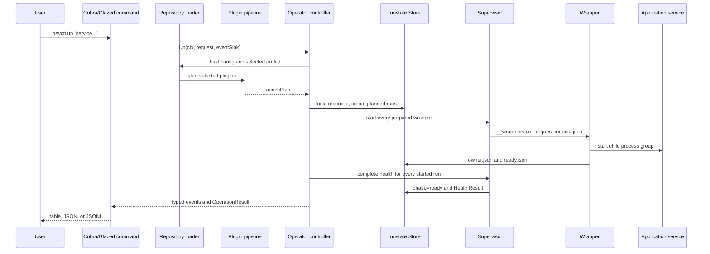
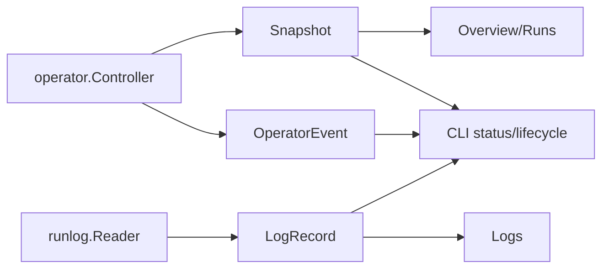
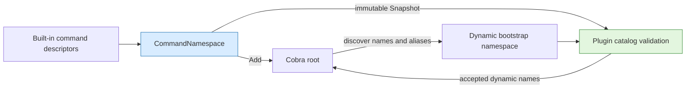

# Project Architecture Overview

`devctl` turns repository-specific knowledge into a controlled development environment. A repository declares plugins and profiles. Plugins derive configuration, validate prerequisites, execute finite build or preparation phases, and return a launch plan. The operator converts that plan into durable service attempts. Wrappers own long-running child processes. CLI and TUI clients inspect and manipulate the resulting environment through typed contracts.

The architecture is easier to understand when divided into four planes:

1. The **description plane** computes what the repository wants.
2. The **control plane** performs lifecycle transactions.
3. The **evidence plane** records what actually happened.
4. The **presentation plane** exposes the control and evidence contracts to people and scripts.

These planes are not separate programs. They are responsibility boundaries inside one Go binary and its plugin processes.

## The system boundary

The core binary owns orchestration, process supervision, state validation, log capture, output contracts, and user interfaces. A plugin owns repository-specific policy. A launched service owns its application behavior but not its supervision metadata.

| Concern | Owner | Representation |
|---|---|---|
| Plugin selection | Repository/profile loader | `.devctl.yaml`, optional override, profile |
| Effective configuration | Engine pipeline | configuration patches |
| Build and preparation | Plugin operations | typed phase requests and results |
| Intended services | Planner | `engine.LaunchPlan` |
| Lifecycle transaction | `operator.Controller` | typed request, event stream, result |
| Durable environment | `runstate.Store` | `.devctl/state.json` |
| Concrete execution attempt | `runstate.Store` | `.devctl/runs/<run-id>/run.json` |
| Process ownership | Supervisor and wrapper | PID/start token, owner and ready artifacts |
| Terminal result | Wrapper and reconciliation | `exit.json`, `ExitSummary` |
| Exact service output | Wrapper | `stdout.log`, `stderr.log` |
| Machine-readable output | `runlog` | sequenced `logs.jsonl` |
| Human and scripted operation | CLI/TUI | Glazed rows, JSONL, Bubble Tea views |

The key constraint is ownership. If a plugin started and supervised the service, the operator could not safely stop it. If the TUI maintained a separate process model, CLI and TUI status could disagree. If the wrapper decided which services should exist, repository policy would leak into a low-level process component. The current design keeps those responsibilities separate.

## The complete `up` path

An `up` command crosses every major boundary:



The 2026-07-26 reviewed snapshot deliberately uses two passes: all selected wrappers start before any health check begins. This ordering matters when an earlier service becomes healthy only after a later service is present. A single start-and-health loop would encode accidental launch-plan ordering as a readiness dependency.

Pseudocode for the control flow is:

```text
plan = planner.Plan(request)
selected = select(plan.services, request.selection)

with repositoryLock:
    reconcileExistingState()
    runs = createPlannedRuns(selected)
    publishDesiredEnvironment(runs)

    startErrors = {}
    for run in runs:
        startErrors[run.id] = supervisor.startWrapper(run)

    for run in runs:
        if startErrors[run.id]:
            recordStartFailure(run)
            continue
        if supervisor.completeHealth(run) fails:
            stopOwnedRun(run)
            recordHealthFailure(run)
            continue
        recordReady(run)
```

The two-pass staging is a small local algorithm with a broad architectural implication: a plan is treated as one environment, not a list of independent sequential programs.

## The description plane

`pkg/repository` loads configuration, resolves the selected profile, discovers plugin specifications, and constructs runtime inputs. `pkg/runtime` starts each provider and implements the NDJSON request/response transport. `pkg/engine.Pipeline` sequences supported operations such as:

- `config.mutate`;
- `build.run`;
- `prepare.run`;
- `validate.run`;
- `launch.plan`.

The engine does not supervise the long-running services returned by `launch.plan`. It produces the description consumed by the operator. This distinction permits plugins in Python, shell, JavaScript, or another language while preserving one Go implementation of process safety.

The pipeline also handles strictness, dry-run behavior, and merged configuration. These are description-time concerns. Once a `ServiceSpec` becomes a run record, it is copied into durable state so the concrete attempt can be inspected independently of a later config change.

## The control plane

`pkg/operator.Controller` is the public application boundary:

```go
type Controller interface {
    Up(context.Context, UpRequest, EventSink) (OperationResult, error)
    Down(context.Context, DownRequest, EventSink) (OperationResult, error)
    Restart(context.Context, RestartRequest, EventSink) (OperationResult, error)
    Snapshot(context.Context, SnapshotRequest) (Snapshot, error)
    Logs() runlog.Reader
    Doctor(context.Context, DoctorRequest) (DoctorReport, error)
}
```

The interface is narrow enough for the TUI to fake in tests and rich enough for the CLI to stream progress. It returns domain values rather than presentation text. The controller accepts injected planning, supervision, clocks, identifiers, and log readers through `ControllerOptions`, which makes lifecycle tests deterministic without replacing the public API.

The controller does not run continuously. Each command reconstructs the necessary view from durable state and artifacts. This is the defining difference between devctl and a daemon-based supervisor.

## The evidence plane

The evidence plane contains two levels:

- `state.json` describes the current desired environment and points to current or last runs.
- each run directory describes one execution attempt and contains its evidence.

The wrapper continues after the initiating CLI exits. It writes ownership and readiness artifacts, captures both streams, writes structured records, waits for the child, and publishes an exit artifact. Reconciliation later compares those artifacts with stored identities and current operating-system process facts.

This design accepts that no single writer observes the whole lifecycle synchronously. The controller observes planning and startup. The wrapper observes the child. A later CLI observes durable evidence. Reconciliation is the algorithm that joins those observations.

## The presentation plane

The CLI is a Cobra application with Glazed fields and renderers. The TUI is a Bubble Tea model. Both are clients:



This arrangement permits multiple output formats without multiplying lifecycle implementations. The CLI can render rows or JSONL. The TUI can maintain selection, modal state, and terminal dimensions. Neither decides whether a PID is owned or whether an exit artifact is valid.

Embedded Glazed help forms a third presentation surface. It teaches the same command and protocol contracts from Markdown compiled into the binary. The help system is initialized once in `cmd/devctl/main.go`, alongside logging and command registration.

## Why the architecture works

The system works because it distinguishes three kinds of fact:

- **Intent**: the selected profile and desired service state.
- **Evidence**: immutable observations about a concrete run.
- **Projection**: the current snapshot shown to a user.

A plan is intent. A ready artifact is evidence. A status row is a projection. Confusing these categories produces most supervision errors. For example, a desired-running service can have an exited run. Reporting only one value would lose either the operator's intent or the observed failure.

The design also gives each cross-process transition a durable publication point. Atomic files are visible only when complete. Run IDs prevent a restart from overwriting the prior attempt. Start tokens prevent PID reuse from turning old state into authority over a new process. Sequence cursors prevent timestamps from being the only log ordering mechanism.

## Failure paths define the architecture

Normal startup alone does not justify the design. The stronger evidence lies in failure handling:

- A malformed or old state version fails explicitly instead of being guessed.
- A concurrent lifecycle command receives an operation-busy error.
- A wrapper without readiness evidence cannot be treated as ready.
- A healthy process whose exit artifact later appears is reconciled to terminal state.
- A PID/start-token mismatch is not signaled.
- A health failure stops only the owned run and preserves the failed attempt.
- A dynamic command whose provider handshake changed is rejected as stale.
- A log journal replaced during follow is treated as corrupt rather than silently reset.

The error types and tests make these behaviors contracts rather than documentation claims.

## When another project should reuse this shape

This four-plane architecture applies to tools that:

- compute an environment or workflow from repository policy;
- start long-running local processes;
- must survive the initiating command;
- need several user interfaces;
- require post-failure evidence;
- can share a repository-local filesystem.

It is not automatically appropriate for a single foreground command, a production cluster already governed by Kubernetes, or a remote multi-user control plane. Those systems have different authority and consistency requirements.

## Key points

- Plugins describe repository policy; the operator owns lifecycle semantics.
- The desired environment and concrete run attempts are distinct durable objects.
- Wrappers own child processes and publish evidence after the initiating command exits.
- Reconciliation joins stored claims, wrapper artifacts, and operating-system facts.
- CLI, TUI, and help are presentation clients, not independent control planes.
- Two-pass start and health staging treats the launch plan as a complete environment.

## Pattern: command namespace registry

Project maps: [[devctl]] · [[glazed]]

A plugin-extensible CLI has a shared root namespace even though commands come from two sources: built-ins compiled into the binary and dynamic commands advertised by providers. The namespace is a policy object—not merely a property of the final Cobra tree. It decides whether a name or alias can be introduced before that command is rendered, cached, or executed.

The failure mode that motivated this pattern was a duplicated reserved-name list. `schema` was added as a built-in Cobra command but omitted from the list used by plugin catalog refresh. Refresh could therefore accept and cache a plugin command named `schema`; later bootstrap rediscovered the real Cobra command and rejected the same cache. Each stage was locally reasonable, but they consulted different symbol tables.

The corrected design introduces `CommandNamespace` in `cmd/devctl/cmds/command_namespace.go`:

```go
type CommandNamespace struct {
    names map[string]struct{}
}

func (n *CommandNamespace) Add(parent, command *cobra.Command) error
func (n *CommandNamespace) Snapshot() map[string]bool
func RootCommandNamespace(root *cobra.Command) *CommandNamespace
```

`Add` reserves the command's canonical name and aliases before attaching it to the Cobra parent. Built-in construction in `cmd/devctl/cmds/root.go` passes every root command through this operation. The plugin command retains the populated registry and supplies copied snapshots to catalog inspection, refresh, static fallback, and explicit plugin execution. Dynamic bootstrap can reconstruct the same namespace from the completed root tree. Cobra's lazily materialized `help` and `completion` names are seeded explicitly because they may not yet appear among root children.



The important invariant is:

```text
name accepted during catalog production
    iff
name remains valid during catalog consumption and command installation
```

This is an instance of the broader **namespace registry** or **symbol-table boundary** pattern. Whenever independently produced extensions occupy names in a host-owned namespace—CLI commands, routes, event types, schema identifiers, plugin capabilities—the host should expose one registry with three responsibilities:

1. register host-owned names and aliases;
2. validate extension-owned candidates against the same state;
3. return immutable snapshots when downstream APIs require a plain collection.

The registry should be scoped to one namespace. In Cobra, each parent command owns an immediate child namespace; nested plugin commands would therefore receive a registry per parent rather than one recursive global set.

### Working rules

- Do not maintain a parallel string list of objects already registered elsewhere.
- Register and validate through the same abstraction.
- Treat aliases as first-class namespace occupants.
- Reject collisions before mutating the renderer or persisting extension metadata.
- Give consumers snapshots rather than mutable access to registry state.
- Account explicitly for framework-provided names that are materialized lazily.

The implementation and regression evidence are in `cmd/devctl/cmds/command_namespace_test.go` and `dynamic_commands_test.go`. The latter proves that catalog refresh rejects a static provider command named `schema`, preventing the producer/consumer drift that prompted the extraction.
