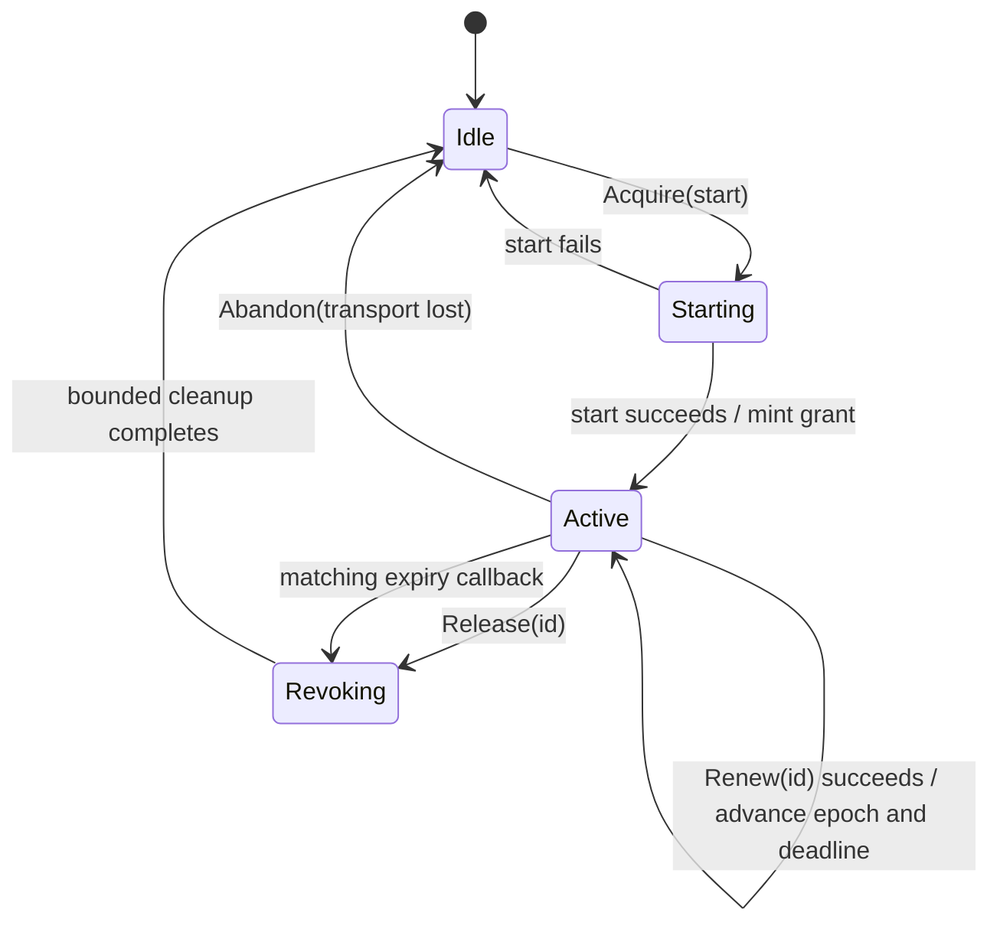

# Exclusive Renewable Authority — A Linearizable Lease for Hazardous Continuation

A continuous operation sometimes remains permissible only while one current owner repeatedly proves that it is still present. The implementation must answer more than whether a timer has expired. It must decide which owner may renew, whether a delayed request belongs to an obsolete generation, whether a renewal crossed a concurrent stop, and when a replacement owner may begin. Those are ownership and concurrency questions. A timer is only one mechanism used to answer them.

This chapter develops the **exclusive renewable authority** pattern: a single-process, linearizable, expiring capability that owns one domain resource, admits renewal only from the current generation, and fences all future renewal before invoking bounded cleanup. The concrete example is browser-held continuous jog in the Makera Z1 controller. The pattern itself is independent of CNC motion and is suitable for other continuously authorized resources with the same semantics.

> [!summary]
> - An exclusive renewable authority combines a one-owner state machine, an opaque generation-fenced ID, a renewable deadline, and exactly-once bounded revocation.
> - `Acquire`, `Renew`, and `Release` have explicit linearization points. A renewal either completes before revocation or is rejected after revocation; it cannot cross the transition ambiguously.
> - Generation identifies the owner. Renewal epoch identifies the current deadline. Both must match before a timer callback may revoke.
> - The generic component owns concurrency and time. A typed driver owns the domain effects: one renewal pulse and one revocation operation.
> - This is a local authority primitive, not a distributed lock and not a hard real-time guarantee. Its safe use still depends on bounded operations and, for physical safety, an independent device-side dead-man.

## 1. The problem begins with ownership, not time

Suppose a browser starts a continuous jog and sends one keepalive every 200 milliseconds while a button remains held. The server allows 750 milliseconds between accepted keepalives. A first implementation might store a session pointer and reset a `time.Timer` after every request.

That representation is incomplete. Consider two requests arriving near the deadline:

```text
renew(generation 7)             expiry callback for generation 7
        │                                      │
        ├── reads session pointer              │
        │                                      ├── removes session pointer
        ├── writes keepalive                   ├── begins stop
        │                                      │
```

If these operations use separate critical sections, the keepalive can be written after logical expiry but before the stop path marks the session as stopping. Resetting the timer does not fix this. A Go timer callback may already be queued when `Reset` is called, so an old callback can run after a successful renewal and revoke a lease whose deadline has moved.

The missing structure is an authority object that owns the complete transition. It must establish one total order over renewal and revocation. That requirement is **linearizability**: every concurrent operation appears to take effect at one instant between its invocation and return, and all operations agree on the resulting order.

The desired alternatives are precise:

```text
renewal linearizes first  → pulse is emitted, deadline advances, expiry is stale
revocation linearizes first → authority is fenced, renewal is rejected, no pulse occurs
```

There is no third outcome in which revocation begins and a keepalive still escapes.

## 2. Vocabulary in dependency order

A **resource** is the domain value being controlled. In the jog case it is a `*makera.JogSession`.

An **authority** is the local object that decides whether operations on that resource are currently admitted. It does not replace the resource. It governs access to it.

A **grant** is the result of successful acquisition. It contains an opaque ID and timestamps describing the current deadline.

A **generation** distinguishes successive owners. Once generation 7 ends, no request from generation 7 may affect generation 8.

A **renewal epoch** distinguishes successive deadlines within one generation. A timer scheduled after the third renewal must not revoke a grant that has since received a fourth renewal.

A **fencing token** is a value checked at the operation boundary to reject stale owners. The external opaque ID fences callers; the internal `(generation, renewalEpoch)` pair fences timer callbacks.

A **revocation** is the transition that ends authority. Revocation has two parts: authority is fenced synchronously, then domain cleanup runs with a bounded internal context.

An **abandonment** ends authority without attempting cleanup. It is used only when the transport is already dead and a cleanup command cannot reach the resource.

These distinctions matter because “the lease ended” and “the device acknowledged cleanup” are different facts. The first is controlled locally. The second depends on an external system and can fail after local authority has already ended.

## 3. The state machine

The authority is an explicit finite-state machine:



`Starting` prevents two callers from both starting domain resources before either installs ownership. `Revoking` prevents a replacement owner from starting while cleanup for the previous generation is still executing. Without these states, a Boolean named `active` hides important intermediate conditions.

The core invariants are:

$$
\left|\text{active authority}\right| \le 1
$$

$$
id \ne activeID \Longrightarrow \text{driver.Renew is not called}
$$

$$
state \ne Active \Longrightarrow \text{no renewal pulse is admitted}
$$

$$
successful\ renewal \Longrightarrow
expiresAt := now + TTL
$$

$$
\text{each generation invokes revocation cleanup at most once}
$$

The last property requires `Active → Revoking` to occur under the same lock used to admit renewal. Cleanup may execute outside that lock, but a new acquisition remains forbidden until cleanup changes `Revoking → Idle`.

## 4. API shape: behavior belongs in a typed driver

The recommended API separates the generic state machine from domain behavior:

```go
type Driver[T any] interface {
    Renew(context.Context, T) error
    Revoke(context.Context, T, Reason) error
}

type Policy struct {
    TTL           time.Duration
    RevokeTimeout time.Duration
}

type Exclusive[T any] struct {
    // mutex, state, active generation, renewal epoch, deadline, timer
}

func NewExclusive[T any](
    policy Policy,
    driver Driver[T],
) (*Exclusive[T], error)

func (a *Exclusive[T]) Acquire(
    ctx context.Context,
    start func(context.Context) (T, error),
) (Grant, error)

func (a *Exclusive[T]) Renew(
    ctx context.Context,
    id ID,
) (Grant, error)

func (a *Exclusive[T]) Release(
    id ID,
) (Revocation, error)

func (a *Exclusive[T]) Abandon(
    cause error,
) (Revocation, error)

func (a *Exclusive[T]) Snapshot() Snapshot
```

This API is intentionally narrower than a generic “run any callback under a lease” abstraction. A renewable authority normally has one renewal effect and one cleanup effect. Defining both once in a typed driver prevents separate handlers from interpreting the same lease differently.

The jog adapter contains only firmware semantics:

```go
type jogLeaseDriver struct {
    motionBusy *atomic.Bool
    logger     zerolog.Logger
}

func (d jogLeaseDriver) Renew(
    _ context.Context,
    session *makera.JogSession,
) error {
    return session.Keepalive()
}

func (d jogLeaseDriver) Revoke(
    ctx context.Context,
    session *makera.JogSession,
    reason authority.Reason,
) error {
    defer d.motionBusy.Store(false)
    return session.Stop(ctx)
}
```

The web handler no longer owns a timer, mutex, session pointer, or generation counter. It decodes input, calls the authority, and translates the result to the HTTP contract.

## 5. Why acquisition receives the start function

Starting the resource before acquiring authority creates an unsafe ownership gap:

```go
session, err := startJog(ctx)       // motion may now exist
grant, err := authority.Acquire(session) // acquisition can still fail
```

If a competing request acquires first, the first jog has started without an owner. The authority therefore reserves `Starting` before invoking the domain start function:

```go
grant, err := authority.Acquire(ctx, func(ctx context.Context) (*JogSession, error) {
    return client.JogStartManual(ctx, axis, positive, speed, preflight)
})
```

The ordering is:

```text
lock
  require Idle
  transition Idle → Starting
  allocate generation
unlock

start resource

lock
  on failure: Starting → Idle
  on success: install resource and grant
              Starting → Active
              schedule expiry(generation, epoch)
unlock
```

The start function runs outside the mutex because preflight and transport I/O can take time. The `Starting` state preserves exclusivity during that interval.

If authority-ID generation fails after the resource starts, the implementation must revoke the unowned resource before returning. Failure to allocate bookkeeping cannot leave the domain effect running.

## 6. Renewal is one atomic semantic operation

Renewal consists of three steps:

1. Validate the current ID.
2. Execute the domain pulse.
3. Advance the deadline only if the pulse succeeded.

```go
func (a *Exclusive[T]) Renew(ctx context.Context, id ID) (Grant, error) {
    a.mu.Lock()
    defer a.mu.Unlock()

    active, err := a.requireActiveLocked(id)
    if err != nil {
        return Grant{}, err
    }

    if err := a.driver.Renew(ctx, active.value); err != nil {
        return Grant{}, err
    }

    now := time.Now()
    active.renewalEpoch++
    active.grant.RenewedAt = now
    active.grant.ExpiresAt = now.Add(a.policy.TTL)
    a.scheduleLocked(active)
    return active.grant, nil
}
```

The lock remains held over the renewal pulse. This is deliberate. It places the write and the ownership decision in one ordered operation. Release and expiry cannot pass the lock until the pulse either succeeds or fails.

That choice introduces a bound requirement. If the pulse can block for at most `Wmax`, and cleanup can block for at most `Cmax`, then host-side revocation completion is bounded by:

$$
T_{host-stop} \le TTL + W_{max} + C_{max}
$$

The generic type is not hard real-time: Go scheduling, process suspension, and operating-system delays remain outside this bound. In the Makera design, the device-side dead-man remains the independent safety mechanism. The host lease limits controller authority and requests an explicit stop; it does not replace firmware omission-to-stop behavior.

A failed pulse never extends the deadline. Extending first and writing second would convert a transport failure into additional authority.

## 7. Timer callbacks require two-dimensional fencing

A stopped or reset timer may still have a queued callback. Timer identity therefore cannot be inferred from the `*time.Timer` pointer alone.

Each scheduled callback captures:

```text
(generation, renewalEpoch)
```

The callback may revoke only if both values still match the active entry:

```go
func (a *Exclusive[T]) expire(generation, epoch uint64) {
    a.mu.Lock()
    if a.state != StateActive ||
       a.active.generation != generation ||
       a.active.renewalEpoch != epoch {
        a.mu.Unlock()
        return // stale callback
    }

    entry := a.active
    a.state = StateRevoking
    a.mu.Unlock()

    a.finishRevocation(entry, ReasonExpired)
}
```

Generation answers “is this still the same owner?” Renewal epoch answers “is this still that owner’s current deadline?” Neither value is redundant.

A representative trace makes the distinction concrete:

```text
12:00:00.000 acquire       generation=7 epoch=1 expires=.750
12:00:00.200 renew success generation=7 epoch=2 expires=.950
12:00:00.201 callback      generation=7 epoch=1 → stale, ignored
12:00:00.950 callback      generation=7 epoch=2 → Active→Revoking
12:00:00.951 renew request generation=7         → rejected
12:00:00.980 cleanup done                         → Idle
```

The old callback matches generation 7 but not epoch 2. It cannot revoke the renewed grant.

## 8. Revocation separates authority from cleanup evidence

`Release` does not accept the HTTP request context. The request can disappear when a tab closes, precisely when cleanup still matters. The authority creates a bounded internal context:

```go
ctx, cancel := context.WithTimeout(
    context.Background(),
    policy.RevokeTimeout,
)
defer cancel()
cleanupErr := driver.Revoke(ctx, value, reason)
```

The returned receipt separates local and external outcomes:

```go
type Revocation struct {
    ID             ID
    Reason         Reason
    AuthorityEnded bool
    CleanupStarted bool
    CleanupError   error
    StartedAt      time.Time
    FinishedAt     time.Time
}
```

For a jog, this receipt is valid:

```text
AuthorityEnded = true
CleanupStarted = true
CleanupError   = "jog stop sent but no ^Y acknowledgement"
```

It means no further browser renewal is admitted, while firmware acknowledgement remains unavailable. The controller must not collapse those facts into one Boolean named `success`.

`Abandon` is different. When the TCP session has already died, no stop command can reach the machine. It fences local authority without invoking the driver:

```text
Reason         = abandoned
AuthorityEnded = true
CleanupStarted = false
CleanupError   = transport-lost evidence
```

For continuous jog, loss of transport also prevents keepalives from reaching firmware, so the independent device dead-man is expected to stop motion. That installed-firmware behavior still requires physical acceptance evidence.

## 9. Browser correlation and server authority are different identities

A browser gesture ID answers which pointer press produced a start request. It is useful when release occurs before the start response arrives. It should not be the server’s authority token.

The server returns a separate opaque lease ID:

```protobuf
message JogStartRequest {
  string axis = 1;
  bool positive = 2;
  double speed_scale = 3;
  string gesture_id = 6; // client correlation
}

message JogLeaseRequest {
  string lease_id = 2;   // server-issued authority
}
```

The browser lifecycle is:

```mermaid
sequenceDiagram
    participant P as Pointer gesture
    participant B as HeldJogController
    participant A as Server authority
    participant J as JogSession

    P->>B: pointerdown; create gesture ID
    B->>A: Acquire(start request, gesture ID)
    A->>J: start once
    A-->>B: Grant(lease ID, expiresAt)
    loop while same gesture remains held
        B->>A: Renew(lease ID)
        A->>J: one Keepalive
        A-->>B: updated expiresAt
    end
    P->>B: pointerup / cancel / hidden / dispose
    B->>A: Release(lease ID)
    A->>A: Active → Revoking; fence renewals
    A->>J: Stop with internal timeout
```

If the pointer is released before `Acquire` returns, the browser sends no renewal. Once the delayed grant arrives, it releases that lease immediately if the page is still alive. If the page has disappeared, the server deadline expires. In both cases, a delayed start response cannot create a renewal loop for a gesture that is no longer held.

## 10. What belongs in the generic component

The generic package should own only mechanisms shared across domains:

- States and legal transitions.
- One active generation.
- Opaque authority IDs.
- Renewal epochs and deadlines.
- Timer scheduling and stale-callback rejection.
- Serialization of renewal against revocation.
- Exactly-once bounded cleanup.
- Snapshots and typed admission errors.

The adapter should own domain meaning:

- What starts the resource.
- What one renewal pulse does.
- What revocation means physically or operationally.
- Which errors imply transport abandonment.
- Domain logs and outcome translation.

The HTTP layer should own transport concerns:

- Protobuf decoding and encoding.
- Authentication and same-origin guards.
- Mapping `ErrNotOwner`, `ErrNotActive`, and `ErrBusy` to status codes.
- Client gesture correlation.

This boundary prevents `motion.go` from becoming the owner of timers, mutexes, firmware bytes, browser identity, and error presentation at once.

## 11. Tests that establish the pattern

The generic tests should prove invariants, not merely execute happy paths.

| Test | Property established |
|---|---|
| Acquire, renew, release | The legal lifecycle reaches `Idle` and cleanup runs once. |
| Stale ID renew/release | An obsolete owner cannot operate on the active resource. |
| Failed renewal | A failed pulse does not extend deadline or epoch. |
| Stale expiry callback | An old epoch cannot revoke a renewed generation. |
| Concurrent renew/release | Release waits for an admitted pulse and fences every later pulse. |
| Revocation blocks acquire | A replacement cannot start before previous cleanup completes. |
| Expiry | Missing renewal invokes cleanup exactly once. |
| Abandon | Dead transport ends authority without pretending cleanup ran. |
| Invalid policy | Zero or negative safety durations are rejected rather than defaulted. |

The jog adapter then needs smaller integration tests:

- One HTTP renewal produces exactly one firmware keepalive digram.
- Start returns a server-issued lease ID distinct from the gesture ID.
- A stale lease ID cannot stop a newer jog.
- Page silence expires the authority and invokes one stop handshake.
- A missing stop acknowledgement yields `AuthorityEnded=true` with cleanup error evidence.
- Connection loss abandons the authority and releases the global motion gate.

Finally, physical acceptance must test the property fake transports cannot prove: installed firmware stops actual motion when browser-originated keepalives cease.

## 12. Failure modes and rejected APIs

### A timer embedded in the HTTP handler

This spreads generation, locking, cleanup, and status mapping across request functions. Timer reset races remain easy to miss because there is no single invariant owner.

### Calling `Keepalive` outside authority serialization

Validating an ID under a lock and then releasing the lock before writing creates a check/use race. Revocation can begin between validation and effect.

### Extending the deadline before the pulse

This grants more time even when no renewal reached the domain resource. Renewal must be commit-after-effect.

### Using only the browser gesture ID

A gesture is client correlation. A server-issued generation-fenced ID is authority. Conflating them weakens ownership and makes accidental reuse harder to distinguish.

### Returning only `error` from release

An external cleanup error does not mean authority remained active. A structured receipt is necessary to preserve that distinction.

### Allowing acquisition during cleanup

Transitioning directly `Active → Idle` before cleanup lets a new resource overlap the old resource’s stop operation. `Revoking` is a real state, not an implementation detail.

### Treating the primitive as a distributed lease

The authority exists in one Go process and uses one mutex and one clock. It does not survive process restart, establish consensus, protect resources accessed by other processes, or solve network partitions. Those require a different protocol and usually fencing enforced by the resource itself.

## 13. Where else this pattern applies in dropcut-studio

The pattern should be reused only when authority is exclusive, renewable, and safe to revoke after silence. Similar-looking operations often need different structures.

| Location or feature | Fit | Reason |
|---|---:|---|
| Browser-held continuous jog | Direct | One owner emits repeated enabling pulses; silence must revoke and stop. |
| CLI continuous jog | Partial | The process itself is the owner and currently has a typed `JogSession`; the generic authority may unify lifecycle bookkeeping, but the CLI’s timer semantics differ from browser causality. |
| Manual M6 continuation in MZ1-014 | Strong candidate | One tool-change generation waits for one authorized operator continuation; stale confirmation must not resume a newer wait. It may use a non-renewing or long-TTL specialization. |
| Future hold-to-run accessories | Conditional | Applicable only when repeated renewal genuinely gates continued operation and revocation has a meaningful stop. |
| Spindle authority | Not a safety substitute | A host lease could request M5 on expiry, but installed firmware does not make transport omission itself stop the spindle. It adds supervision, not fail-safe authority. |
| Typed probe contact | Wrong pattern | Probe contact is a bounded, at-most-once operation. It must not be renewed or replayed. |
| SD job play/suspend/resume | Usually wrong | A job is an admitted lifecycle with explicit state transitions, not a hold-to-continue resource. |
| File transfer | Usually wrong | Transfer ownership and integrity need a transaction/session abstraction; expiry may clean resources, but periodic renewal is not the central invariant. |
| Protocol transaction ownership | Related, not identical | Exclusive ownership and generations are useful, but command completion uses correlation and quarantine rather than lease renewal. |
| Outcome-unknown spindle latch | Wrong pattern | This is sticky safety state requiring reconciliation, not authority that expires into permissiveness. |

The most promising second application is manual M6 continuation. The reusable core would be the generation-fenced exclusive owner and bounded revocation, while the renewal operation may become a one-shot `Continue` that consumes the grant. That suggests a future family of authority types sharing ID and state machinery:

```text
ExclusiveRenewable[T]  Acquire → Renew* → Release/Expire
ExclusiveConsumable[T] Acquire → Consume once / Expire
```

The family should be introduced only after the second use demonstrates common semantics. Generalizing prematurely would obscure the current jog safety case.

## 14. Review checklist

Before adopting an exclusive renewable authority, answer these questions precisely:

1. Is there exactly one legitimate owner at a time?
2. Does the operation require repeated renewal rather than one-shot admission?
3. Is silence supposed to end authority?
4. Can renewal and revocation be given a total order?
5. Is each renewal operation bounded?
6. Is cleanup bounded and safe to run exactly once?
7. Does a stale owner have a generation-fenced ID?
8. Do stale timer callbacks have a separate renewal epoch?
9. Can transport death be distinguished from acknowledged cleanup?
10. Is an independent device-side mechanism required for physical safety?

If questions 2 or 3 are false, a lease is probably the wrong abstraction. If questions 5 or 6 are false, the implementation cannot offer a useful host-side time bound. If question 10 is true, the host authority must be documented as supervision rather than the final safety mechanism.

## 15. Current implementation status

The pattern is being extracted in the `dropcut-studio` working tree under:

```text
makera-z1-cli/pkg/authority/exclusive.go
makera-z1-cli/pkg/authority/exclusive_test.go
makera-z1-cli/pkg/webui/jog_authority.go
```

The protobuf draft separates `gesture_id` from `lease_id`, and the web handlers are being reduced to authority operations. At the time of this note, this work is not committed, the full validation suite has not passed, the React held-gesture controller is not implemented, and no physical motion has been sent through the extracted authority. The design is therefore a candidate with an implementation under review, not completed hardware evidence.

## 16. Key points

- A renewable lease is an ownership state machine whose deadline is one field, not a timer with surrounding bookkeeping.
- Generation fences old owners; renewal epoch fences old deadlines.
- `Starting` reserves ownership before domain start, and `Revoking` prevents replacement before cleanup completes.
- Renewal extends authority only after the domain pulse succeeds.
- Revocation ends local authority before attempting external cleanup, and the receipt preserves both facts.
- Browser gesture correlation and server-issued authority identity must remain distinct.
- Physical fail-safe behavior still belongs to an independent device-side dead-man; a Go timer cannot provide that guarantee.

## Evidence and related work

- `makera-z1-cli/pkg/makera/motion.go` — existing generation-owned `JogSession`, one-for-one manual keepalive, and suppress-before-stop handshake.
- `makera-z1-cli/pkg/authority/exclusive.go` — in-progress generic state machine described here.
- `makera-z1-cli/pkg/webui/jog_authority.go` — in-progress Makera jog driver.
- `proto/control/v1/control.proto` — in-progress distinction between browser gesture correlation and server lease identity.
- MZ1-013 — current design and acceptance ticket for dead-man testing before probe contact.
- [[Research/Software Architecture Garden/dropcut-studio/designs/03 - Dead-Man Keepalive - Fail-Safe Motion by Causal Inversion|03 — Dead-Man Keepalive]] — device-side omission-to-stop behavior and browser causality.
- [[Research/Software Architecture Garden/dropcut-studio/designs/04 - First-Class Session with Typed State Machine, Unique Correlation, and Quarantine Recovery|04 — First-Class Session Object]] — broader session ownership, correlation, and quarantine discipline.
