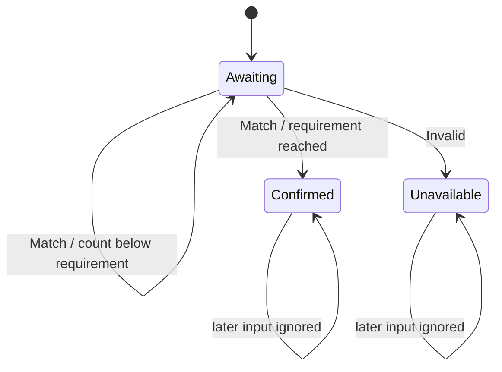

# Consecutive Evidence Observer — Completion Without Owning the Operation

A command returning successfully does not establish that its physical effect has completed. A spindle can still be rotating after a stop command has been dispatched. A sensor can remain triggered after a retract request. In both cases, completion requires observations obtained after the action, evaluated under an explicit policy.

This chapter develops a small reusable component for one part of that task: counting consecutive acceptable observations. It does not send the command, acquire observations, or choose what constitutes acceptable evidence. Separating these responsibilities makes the completion rule testable without turning a generic utility into the owner of machine control.

> [!summary]
> - Domain policy classifies each sample as matching, nonmatching, or invalid.
> - The observer counts consecutive matches, resets on nonmatches, and terminates on invalid evidence or sufficient matches.
> - The caller owns acquisition, freshness, deadlines, and evidence history.
> - Confirmation means the declared evidence criterion passed—not that transport delivery, firmware acceptance, or all physical hazards have been proven.

## 1. Start with the evidence question

Consider a spindle-stop operation. The controller sends one M5 and then requests fresh status reports. A report containing `Idle` and a measured speed of zero supports the claim that the spindle has stopped, but the application may require several consecutive acceptable reports before confirming it.

There are three independent decisions here. First, the domain decides which observations are acceptable: for the ordinary stop path, the current implementation accepts `Idle` with valid measured RPM in the inclusive interval `[0,50]`. Second, the observer decides whether enough consecutive observations have met that rule. Third, the operation decides when to acquire another report and when its observation window ends.

Combining all three in a polling loop is straightforward initially. It becomes harder to review when the same loop also handles transport errors, cancellation, diagnostic collection, and emergency escalation. The useful extraction is not necessarily a larger polling framework. It can be a smaller evidence reducer.

A **reducer** is an object that updates a compact state from one input at a time. Here its state is the current match count and a terminal or pending decision.

## 2. Classification is not a Boolean

A Boolean predicate cannot distinguish an observed nonmatch from an unusable observation. That distinction is safety-relevant.

```text
Idle, measured RPM 12, required fields valid  → Match
Run, measured RPM 5900, fields valid          → Pending
Idle, measured RPM absent                    → Invalid
```

`Pending` means the sample is usable but the desired condition is not established. During coast-down, that is expected. `Invalid` means the controller cannot evaluate the required condition. Treating missing RPM as zero would manufacture evidence; treating it as ordinary coast-down would hide an observability failure.

The current API expresses these alternatives directly:

```go
type Classification uint8
const (
    Pending Classification = iota
    Match
    Invalid
)

type Decision uint8
const (
    Awaiting Decision = iota
    Confirmed
    Unavailable
)

type Result struct {
    Decision    Decision
    Consecutive int
    Required    int
}

func New[T any](
    required int,
    classify func(T) Classification,
) (*Observer[T], error)

func (o *Observer[T]) Observe(sample T) Result
func (o *Observer[T]) Snapshot() Result
```

The classifier belongs to the domain. The observer knows nothing about RPM, machine state, probes, or firmware strings.

## 3. Deriving the transition rule

Let `N` be the required count and `c` the current count. While the observer is awaiting completion, each classified sample transforms its state as follows:

$$
c' = \begin{cases}
c + 1 & \text{if Match} \\
0 & \text{if Pending}
\end{cases}
$$

A match that makes `c' ≥ N` produces `Confirmed`. An invalid classification produces `Unavailable`. Both decisions are terminal.



Terminality is deliberate. An observer describes one operation's completion attempt. If invalid data made that attempt unavailable, a later valid report should not silently rewrite the earlier result into success. If the domain authorizes another observation attempt, it creates a new observer.

Unknown classification values also terminate as unavailable. This makes a malformed or extended classifier fail closed rather than accidentally contribute a match.

## 4. Follow one sample sequence

The following is an illustrative reducer trace, not captured hardware output. The requirement is three consecutive matches:

| Input | Classification | Count | Decision |
|---|---|---:|---|
| Idle, 40 RPM | Match | 1 | Awaiting |
| Idle, 25 RPM | Match | 2 | Awaiting |
| Run, 60 RPM | Pending | 0 | Awaiting |
| Idle, 15 RPM | Match | 1 | Awaiting |
| Idle, 0 RPM | Match | 2 | Awaiting |
| Idle, 0 RPM | Match | 3 | Confirmed |

The first two matches do not survive the intervening nonmatch. That is what “consecutive” contributes beyond a total match counter.

Now replace the fourth sample with a report lacking measured RPM. The outcome becomes `Unavailable` immediately. The counter is no longer a route to confirmation for this observer. The operation returns the corresponding domain error and retains the evidence collected so far.

## 5. Use point: spindle stop observation

The committed integration supplies a domain classifier:

```go
observer, err := completion.New(n, func(st Status) completion.Classification {
    spindle := st.SpindleObserved
    if !st.StateObserved.Valid || !spindle.Valid() {
        return completion.Invalid
    }
    stateOff := st.State == "Idle" || (allowAlarm && st.State == "Alarm")
    if stateOff && spindle.Current.Value >= 0 && spindle.Current.Value <= threshold {
        return completion.Match
    }
    return completion.Pending
})
```

The surrounding `Client.observeSpindleOffFor` still performs each `QueryStatus`, appends the report to the result history, and maps the observer decision to domain outcomes:

```go
result := observer.Observe(st)
if result.Decision == completion.Unavailable {
    return out, errors.New("spindle stop telemetry missing, malformed, or incomplete")
}
if result.Decision == completion.Confirmed {
    return out, nil
}
```

Alarm acceptance remains an explicit operation parameter, not a generic observer feature. So do the default five samples, 250 ms polling interval, and 50 RPM threshold.

The polling loop also retains a subtle transaction rule: it does not start another status exchange within one interval of the observation deadline. Beginning a query too near cancellation could turn an otherwise completed write into an uncertain exchange. Moving this rule into a generic scheduler would make the transport constraint less visible.

## 6. Sample count is not duration or statistical confidence

Three successive calls to `Observe` can confirm a three-sample policy immediately. The reducer cannot tell whether those calls represent three fresh device reports or three copies of the same cached value. Freshness and independence are acquisition contracts.

Likewise, five samples are not automatically five intervals of stable behavior. With regular spacing `Δ`, five sample timestamps span approximately `4Δ`, and transport and scheduling change the actual spacing. The current implementation establishes a sample-count criterion, not a minimum elapsed dwell.

Nor does repetition alone provide a statistical probability of physical correctness. That would require assumptions about measurement error, independence, and the relation between telemetry and the physical system. The observer makes no such claim.

A future duration-based observer should introduce timestamps, monotonic ordering, maximum gaps, and a minimum stable span explicitly. Those rules should not be inferred from this API's count.

## 7. Ownership and testing

The observer is single-owner and not internally synchronized. It stores no sample history, invokes no timers, and performs no I/O. Result snapshots are copied values. The caller retains evidence once, avoiding parallel histories that might disagree about which samples were considered.

The reducer tests establish:

- Partial matches remain awaiting.
- A nonmatch resets the count.
- Confirmation and unavailability remain terminal.
- Unknown classifications fail closed.
- Invalid constructor arguments are rejected.
- Two observers do not share operation state.

The spindle integration was validated with the existing Makera tests, Go race tests, and vet. This is controller-owned evidence. It does not newly establish installed firmware behavior or physical spindle-stop performance.

## 8. Where the pattern fits

A future fixed-setter release observer could require consecutive valid clear observations after a bounded retract. A service readiness check could require successive successful health samples. A calibration procedure could use this structure for a stable-condition gate, provided the classifier and acquisition rules are explicit.

Do not use it as a replacement for transaction correlation, command acceptance, or sticky uncertainty reconciliation. Those answer different questions. A sentinel may delimit command output without supplying any completion samples. Repeated valid reports may satisfy one completion policy without clearing unrelated session uncertainty.

## 9. Review exercises

1. If a sample repeats an earlier timestamp, which layer should reject it? In this implementation, acquisition or classification—not the count reducer.
2. If one valid nonmatch occurs after four matches, how many further matches are needed for a five-sample policy? Five.
3. If cleanup was dispatched but observations become invalid, should the observer report the cleanup failed physically? No. It reports evidence unavailable; the domain preserves dispatch separately.

## Sources and related patterns

Implementation commit: `a5faea1`, in `makera-z1-cli/pkg/completion/observer.go` and `pkg/makera/client.go`. Tests reside in `pkg/completion/observer_test.go` and the existing Makera spindle tests. The design and detailed diary are MZ1-013 documents `02-*`.

See [[Research/Software Architecture Garden/dropcut-studio/designs/05 - Exclusive Renewable Authority - A Linearizable Lease for Hazardous Continuation|Exclusive Renewable Authority]] for ownership that expires without renewal. The observer does not grant authority; it evaluates evidence supplied by the operation that already owns it.
