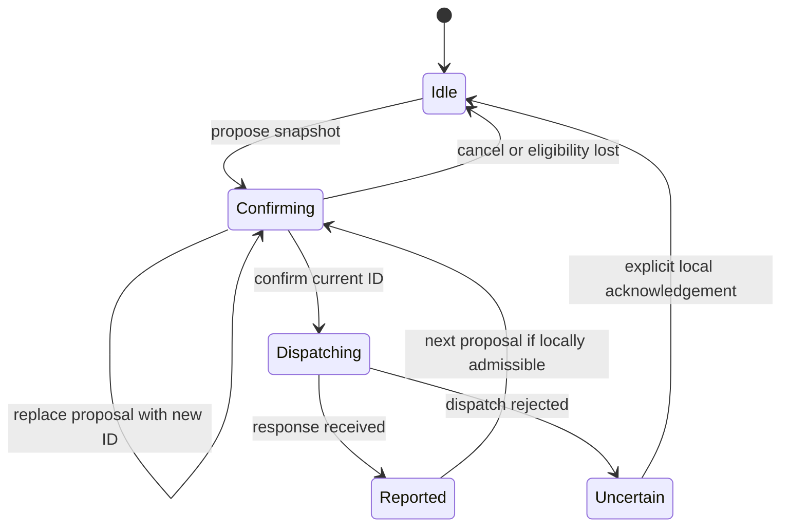
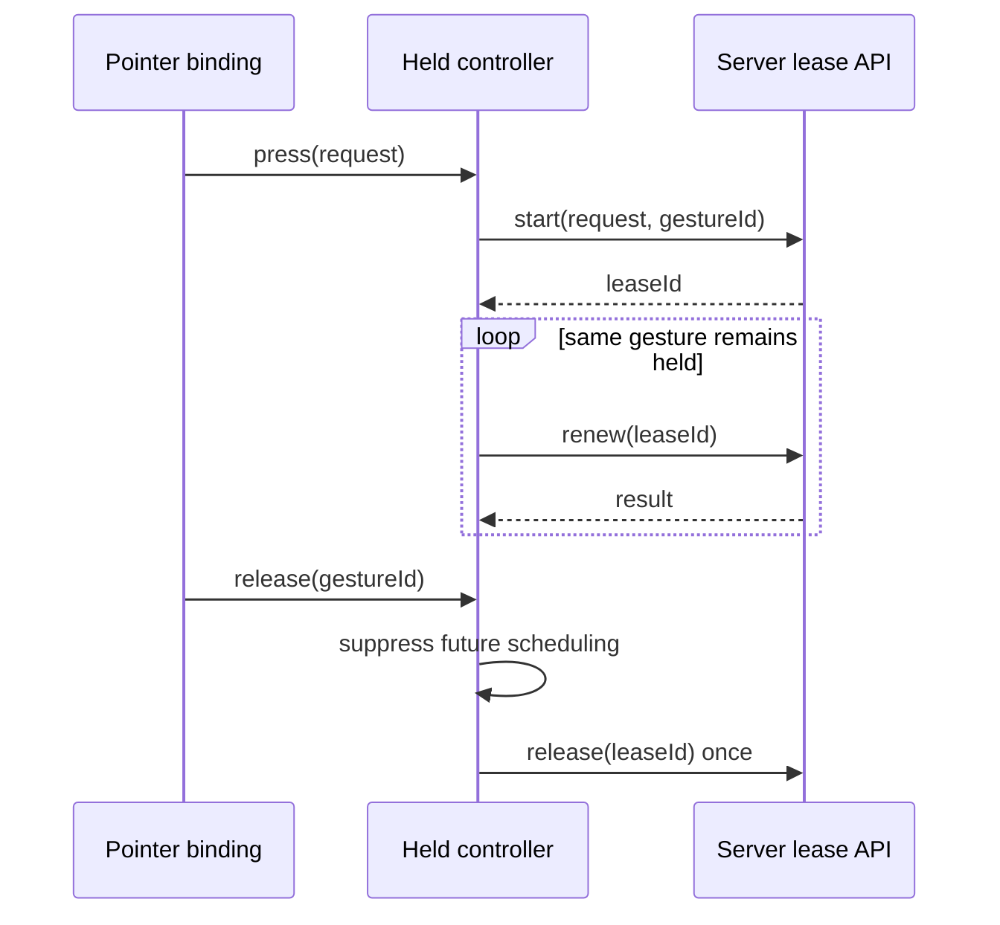

# Browser Intent Ownership — Confirm Once and Renew Only While Held

A browser event describes an intention at a particular time. A network response may arrive much later, after that intention has been cancelled, superseded, or made unsafe by new information. Correct UI behavior therefore depends on identifying which intention owns each asynchronous effect—not merely on showing a spinner while a promise is pending.

This chapter develops two related controllers. A confirmed-command controller consumes one confirmation before dispatching one enabling request. A held-gesture controller renews a server grant only while the original gesture remains active. Their state transitions live outside React so they can be tested with deferred promises and fake timers; React renders their snapshots.

> [!summary]
> - One-shot confirmation and held continuation are different protocols and need different state machines.
> - Intent identity fences stale callbacks, while synchronous state transitions prevent duplicate dispatch.
> - Cancellation can suppress future effects; it cannot undo a command already sent.
> - Late results may lose permission to replace the visible notice while still contributing safety-relevant uncertainty.
> - Browser lifecycle correctness complements server admission. It does not replace it or prove operator attentiveness.

## 1. Identify the asynchronous operation before handling its result

Suppose an operator confirms homing. While the request is pending, the operator sends a spindle-stop request. The stop reports an uncertain outcome; afterward, the older homing request succeeds.

A naive completion handler might replace the stop warning with “homing completed” and clear a shared error flag. That would confuse two independent facts: which operation should currently occupy the notice area, and whether any unresolved uncertainty blocks another enabling action.

An **intent** is a locally identified operation request with a lifecycle. **Fencing** means checking that identity or lifecycle before permitting a later effect. The browser uses fencing to reject obsolete confirmations, avoid resurrecting released gestures, and prevent older responses from replacing newer notices.

The server still decides whether a machine command is admissible. Browser intent is a local ownership model, not machine authority.

## 2. Confirmed commands consume permission once

A one-shot enabling request follows this lifecycle:



Uncertainty is also a sticky flag, not only a phase. A response can be successfully received while reporting an unavailable physical verdict. The phase is then `reported`, but future enabling proposals remain blocked.

The driver provides domain policy and dispatch:

```ts
interface IntentDriver<C, R> {
  check(command: C): boolean;
  dispatch(command: C): Promise<R>;
  isUncertain(result: R): boolean;
}

const intents = createIntentController(driver);
const id = intents.propose(command);
if (id !== undefined) await intents.confirm(id);
```

`propose` captures command data using `structuredClone`. Changing the caller's object afterward cannot change the command being confirmed. Commands must therefore be cloneable data rather than closures or live mutable service objects.

`confirm` checks the current ID and phase, rechecks local eligibility, and changes state to `dispatching` synchronously before invoking the driver. A second confirmation sees the new phase and cannot dispatch again—even if the first promise has not settled.

This is the key ordering:

```text
validate intent → consume confirmation → invoke dispatch once → await result
```

It is not sufficient to disable a button on the next React render. The controller must establish exclusion before any competing call can enter.

## 3. Cancellation and uncertainty have different meanings

`cancel(id)` removes a matching confirmation. It does nothing to a command already dispatching. At that point, cancellation of a browser operation is not cancellation of the physical effect.

`invalidate()` records local uncertainty and cancels any pending confirmation. A late successful response cannot erase it:

```ts
uncertain = previousUncertainty || driver.isUncertain(result);
```

`acknowledge()` clears local uncertainty only when no enabling request is dispatching. It is an operator UI action, not proof of machine safety or protocol recovery. Shared server admission must still reject enabling actions until its own requirements are satisfied.

New proposals are rejected while dispatch is pending. There is no queue of future moves whose confirmation may no longer represent current intent.

The public methods are:

```ts
intents.propose(command);       // ID or undefined
await intents.confirm(id);     // stale or duplicate IDs do not dispatch
intents.cancel(id);             // confirmation only
intents.invalidate();
intents.acknowledge();
intents.getSnapshot();
intents.subscribe(listener);
intents.dispose();
```

Disposal prevents later publication and new proposals. It does not abort a machine command already sent.

## 4. The React adapter owns presentation, not the lifecycle

The committed `useOperatorIntent` hook adapts typed `ControlCommand` and `CommandResponse` values to the generic controller. It owns local eligibility checks and notice formatting; `ControlPanel` obtains a stable snapshot through the hook's `useSyncExternalStore` subscription.

```tsx
const intent = useOperatorIntent({ ready, state, execute });
const { snapshot, request } = intent;

<button onClick={() => request(commands.home())}>Home</button>

{snapshot.phase === "confirming" && (
  <ConfirmationCard
    onConfirm={() => void intent.confirm()}
    onCancel={intent.cancel}
  />
)}
```

Urgent and other non-enabling requests bypass the enabling controller. A pending home request cannot prevent spindle-off dispatch. The adapter feeds uncertain stop outcomes back into local admission without placing stops in the enabling single-flight slot.

Notice ownership uses a separate counter. Each dispatched request advances the notice generation. Only the newest generation may publish text. An older response still contributes uncertainty even when it cannot replace the notice.

Illustrative trace:

```text
A: home dispatched         notice generation 1
B: spindle off dispatched  notice generation 2
B: stop outcome uncertain  publish warning; invalidate admission
A: success arrives         suppress old notice; retain uncertainty
```

This distinction generalizes beyond machine control. A response can be obsolete for presentation without being irrelevant to accounting, audit, or safety state.

## 5. Held gestures are not repeated confirmations

A held operation starts once, receives a server grant, and renews that grant while the same local gesture remains held. Its driver is different:

```ts
interface HeldDriver<C> {
  start(command: C, gestureId: string): Promise<{ leaseId: string }>;
  renew(leaseId: string): Promise<void>;
  release(leaseId: string): Promise<void>;
}

const held = createHeldIntentController(driver, 200);
const gesture = held.press(request);
if (gesture) held.release(gesture);
```

The browser gesture ID identifies one press. The server lease ID identifies the authority granted by the server. Neither should substitute for the other.



The renewal timer runs in the browser and schedules the next pulse after the preceding renewal settles. At most one renewal is in flight. There is no catch-up queue and no automatic retry. A network slowdown reduces renewal frequency instead of accumulating a burst of delayed enabling requests.

For an interval `I` and request duration `R`, the next request starts approximately `I + R` after the preceding start, plus scheduling delay. The nominal 200 ms interval is therefore not a promised fixed-rate cadence. Server TTL and device watchdog assumptions must account for this behavior.

## 6. The late-start race determines the design

Release can occur before the start response arrives:

```text
press → start sent
release → gesture marked no longer held; no lease ID known yet
start response arrives → release returned lease once; never renew
```

The controller retains the pending gesture until the start settles. It does not permit a replacement press while the old request could still return a grant. Otherwise many abandoned starts could accumulate, each requiring later cleanup.

Disposal has the same cleanup obligation. It disables publication and future press/renew activity, but a late successful start still receives one release attempt. The browser may disappear completely, so this is best effort. Server expiry and independent device watchdog behavior remain necessary.

A release may also race an in-flight renewal. The controller suppresses future scheduling immediately and requests release without waiting for that promise. It retains local exclusion until both renewal and release settle. The server must independently order keep and stop requests and reject renewal after revocation; browser ordering alone cannot establish wire-arrival order.

A renewal error initiates one release and records uncertainty. A start error does not retry: the server may have acquired authority even though its response was lost. Without a lease ID, the browser cannot invent a release token and must rely on expiry and reconciliation.

## 7. A typed jog adapter, without enabling hardware

The implemented adapter accepts this port:

```ts
interface JogLeaseAPI {
  start(request: JogRequest & { gestureId: string }): Promise<{ leaseId: string }>;
  keep(request: { leaseId: string }): Promise<void>;
  stop(request: { leaseId: string }): Promise<void>;
}

const jog = createJogIntent(api);
```

Its start method carries gesture correlation; keep and stop carry the returned server ID. The concrete HTTP implementation must reject unsuccessful responses and must not introduce retries.

The adapter and controller are committed and tested, but **not mounted as continuous-jog controls in ControlPanel**. Concrete HTTP wiring, pointer capture/release/cancel bindings, visibility and page-lifetime bindings, server lease hardening, and physical dead-man acceptance remain separate prerequisites. The current UI deliberately continues to display continuous jog as unavailable.

This boundary matters: writing a reusable browser controller does not authorize exposing an unaccepted physical motion path.

## 8. Component lifetime is not operation lifetime

React StrictMode can replay effect setup and cleanup during development. Permanently disposing a stable controller in the first cleanup would leave the replayed component connected to a dead controller.

The current hook marks the component unmounted during cleanup and defers permanent disposal to a microtask. If setup immediately runs again, the mounted flag prevents disposal. If the component truly unmounts, disposal fences future publication. Driver callbacks access current props through a ref so changing `execute` or eligibility does not leave the controller using the initial render's values.

These are adapter concerns. The standalone controller does not import React or know about effect replay. Its tests can exercise disposal directly, while integration tests cover the actual hook lifecycle.

## 9. Tests and proof boundaries

The controller tests use deferred promises to select response order and fake timers to control renewal scheduling. They establish stale-ID rejection, at-most-once dispatch, eligibility rechecks, uncertainty persistence, no renewal after release, late-grant cleanup, single-flight renewal, and no retries after errors.

The UI tests additionally establish that stops remain callable while enabling requests are pending, stale telemetry removes confirmation, StrictMode replay does not disable the controller, current callbacks are used, and an older success cannot erase newer stop uncertainty.

At commit `8b8d947`, the worktree validation passed 31 frontend tests, TypeScript checking, Vite production build, full Go race tests, and vet. The broader worktree included separately preserved lease changes; this browser feature does not depend on their new generated protobuf fields.

These tests do not prove that firmware stops a machine on lost renewal. They do not prove a browser timer corresponds to an attentive operator. They establish local control-flow invariants under the tested event schedules.

## 10. When to reuse this pattern

Use confirmed intent ownership when an action requires explicit confirmation and must not be replayed by stale UI callbacks. Use held intent ownership when permission genuinely depends on continued local engagement and a server-issued grant can be released or allowed to expire.

Do not force background jobs, file uploads, or arbitrary requests into the held model merely because they are asynchronous. They often need cancellable task ownership, not renewable permission. Likewise, do not route urgent stops through an enabling confirmation gate for API uniformity.

The reusable principle is to give each asynchronous effect a lifecycle owner. The specific lifecycle must match the operation.

## Sources and related patterns

Implementation: `apps/control/src/intent/` at commit `8b8d9477f44f1af7ab77dddcf04afdbf4de8ec4c`. Use point: `components/organisms/ControlPanel/ControlPanel.tsx`. Dedicated design and diary: MZ1-013 documents `03-*`.

- [[Research/Software Architecture Garden/dropcut-studio/designs/05 - Exclusive Renewable Authority - A Linearizable Lease for Hazardous Continuation|Exclusive Renewable Authority]] describes the server-side counterpart and its separate concurrency obligations.
- [[Research/Software Architecture Garden/dropcut-studio/designs/06 - Consecutive Evidence Observer - Completion Without Owning the Operation|Consecutive Evidence Observer]] distinguishes receiving a response from satisfying a completion criterion.
