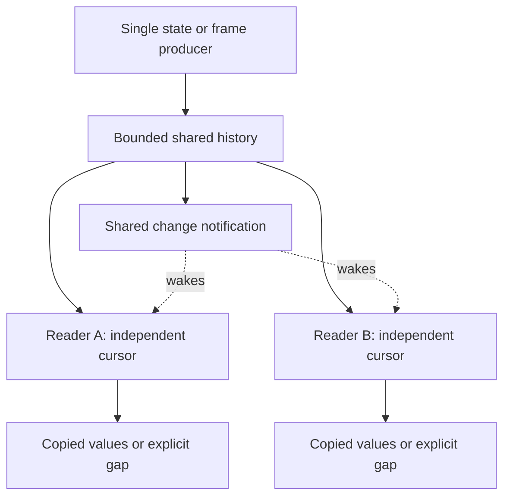
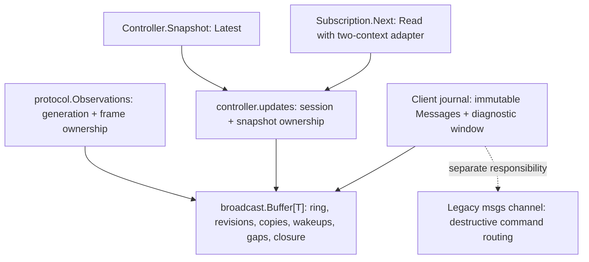

# Bounded Cursor Broadcast — Independent Readers with Explicit Gaps

A producer often needs to make the same sequence of updates available to several consumers without waiting for any of them. A controller publishes machine state to a UI while operation handling continues. A protocol reader publishes received frames while a command collector separately interprets replies. In both cases, consumers need independent progress, but retaining every update indefinitely is unnecessary or impossible.

The pattern is a bounded shared history with a cursor for each reader. Publishing retains a value and wakes readers; consuming advances only that reader's cursor. When a reader falls behind retention, the system reports a gap instead of silently skipping evidence or blocking the producer.

The concrete implementation is `pkg/broadcast.Buffer[T]`, extracted in commit `be7c744`. Three consumers now share it: raw protocol observations, public controller snapshots and the legacy client's diagnostic message journal. The first two expose cursor-based reading; the third uses the same retention mechanism without claiming continuity. This entry was initially written against `3a64a1c` as an extraction proposal and has now been updated to describe the completed consolidation.

> [!summary]
> - Retain one bounded sequence of values, not one delivery queue per subscriber.
> - Give each reader an independent generation/revision cursor.
> - Report retention loss explicitly; never silently reinterpret incomplete history as complete.
> - Keep publication, subscription lifetime and machine-operation lifetime separate.

## 1. Why a shared channel is not sufficient

Receiving from a Go channel consumes an item. If two readers receive from the same channel, they ordinarily divide the items rather than both observing every item. That behavior is appropriate for distributing work. It is wrong when a UI and an operation observer each need to inspect the same received status.

Creating one channel for every subscriber changes the problem but does not settle it. A publisher must decide whether to block on a slow subscriber, drop an update, allocate more memory or terminate the subscription. It must also manage subscriber registration and cleanup. These are real choices, but a separate queue is not necessary when all consumers can read a common retained sequence.

A **cursor** identifies the last update a reader consumed. An update is retained once and can be copied to any reader whose cursor precedes it. The publisher does not need to track the reader's progress to continue publishing.

## 2. The minimal data model

The logical feed combines a generation, a monotonically increasing revision, a bounded ordered collection of values, a change-notification channel and a closed flag. In the concrete extraction, the domain adapter owns the immutable generation; Buffer owns the other shared fields. A subscriber stores a cursor and its own cancellation context.

The **generation** distinguishes one incarnation of the producer. Revisions from a previous connection or controller instance must not be mistaken for current revisions after a restart. In the current controller implementation, the generation-like field is an opaque `Session` string. In the protocol implementation it is an owner-supplied numeric `Generation`.

```text
Shared state:
    generation
    current revision
    at most C retained values
    changed notification channel
    closed flag

Reader state:
    generation
    last consumed revision
    cancellation context
```

No broker, topic registry, durable journal or per-reader worker is required.



The notification only tells a reader that something changed. It does not carry the value and does not consume the update on behalf of another reader.

## 3. Publication and wake-up ordering

Publication assigns a revision and stores the value under a short mutex. It then closes the current notification channel and installs a new one. Closing the old channel wakes all readers currently waiting on it.

The following is a mechanism sketch, not the API of an extracted library:

```text
publish(value):
    lock shared state
    revision += 1
    append an owned copy tagged with generation and revision
    remove the oldest entry if retention exceeds C
    oldNotification = changed
    changed = a new channel
    close oldNotification
    unlock
```

A reader obtains the current notification channel while holding the same mutex used to inspect retained history. That ordering prevents a missed wake-up: either the new item is already visible, or the reader holds the channel that the next publication will close.

“Nonblocking publication” means the producer does not wait for a subscriber to consume an item. It does not mean lock-free execution or zero copying cost. The current implementations perform bounded work under mutexes. User callbacks and socket I/O do not run inside these publication critical sections.

## 4. Reading and detecting a gap

Let `r` be the reader's last consumed revision, `a` the oldest retained revision, and `z` the latest published revision. For a matching generation:

- `r > z` is an invalid future cursor.
- `r < a - 1` means unread updates have already been evicted.
- Otherwise, the reader may consume retained entries with revision greater than `r`.

The `a - 1` boundary is intentional. If revisions 101 through 132 are retained, a reader at 100 can still obtain every subsequent update. A reader at 99 has lost revision 100 and must receive a gap error.

```text
next(cursor):
    reject cancelled subscription or read context
    lock shared state
    validate generation and cursor range
    if an unread retained value exists:
        copy it, advance this reader's cursor, unlock and return
    if closed:
        unlock and return EOF
    notification = changed
    unlock
    wait for notification or cancellation
    repeat
```

Gap handling belongs partly to the consumer. A display that only needs current state can obtain a fresh snapshot and resume from its new cursor. A completion evaluator that requires uninterrupted distinct observations must mark its evidence incomplete rather than silently reset the cursor and claim continuity.

## 5. Snapshot followed by subscription

A common caller sequence is to fetch current state and then subscribe to changes. Without a shared revision contract, an update can occur between these calls and disappear from the caller's view.

The controller solves this by including its publication cursor in each query snapshot:

```go
snapshot := controller.Snapshot()
subscription, err := controller.Watch(ctx, snapshot.Cursor)
// Handle err, then use subscription.Next(ctx).
```

Suppose the snapshot has revision 42, and revision 43 is published before Watch is called. The subscription reads revision 43 from retained history. If enough updates occurred to evict it, registration or reading reports a gap. There is no silent interval between snapshot acquisition and subscription registration.

The extracted implementation removes the separate atomic query-snapshot cache. `Controller.Snapshot()` calls the buffer's `Latest()`, which reads the same retained entry that a subscription would receive. Both attach the controller's immutable session ID to the entry's revision. There is no second cache to synchronize before waking readers.

Revision assignment and retained storage happen under the buffer mutex before notification. Querying now takes that short mutex and copies the snapshot rather than loading an atomic pointer. Identical controller-state publications still do not advance revision: the coordinator compares its next state with the latest retained value before appending. An idle coordinator tick is not itself a state update.

## 6. Three integrations, one storage implementation

| Property | Protocol observations | Controller subscriptions | Legacy client journal |
|---|---|---|---|
| Value | Validated frame plus receipt metadata | Controller snapshot and operation state | Immutable `Message` values |
| Capacity | 256 frames in a connection | 32 snapshots | 256 messages |
| Domain cursor | Numeric generation and sequence | Session string and revision | None exposed |
| Producer | Protocol reader | Single-owner coordinator | Legacy `Client.deliver` |
| Read shape | Bounded pages | Single-reader `Next`; query through `Latest` | Copied diagnostic window through `Retained` |
| Copy policy | Frame payload bytes | Operation slice and nested spindle-result sample slices | Ordinary value copy; payload is a string |
| Closure | Retained frames drain before EOF | Final disconnected publication drains before EOF | No subscriber lifecycle exposed |

`protocol.Observations` translates `broadcast.ErrGap` and `ErrCursor` into its domain errors and checks numeric generation before reading. It records host receipt time before appending and attaches generation/sequence to returned entries. `controller.updates` similarly owns session validation, error translation and snapshot copying, but no longer owns a ring, notification channel or revision counter.

The legacy `Client` initializes its buffer using `sync.Once`, including for clients constructed directly by existing tests. `deliver` appends to this buffer before forwarding into the legacy routing channel. `RecentMessages` maps the copied retained entries back to messages. The destructive `msgs` channel remains separate: its overflow and sentinel policy serve command routing, not broadcast. This extraction removes duplicate diagnostic retention without silently redesigning the legacy execution owner, which is still scheduled for P4 removal.

These values represent different information. A controller publication revision is not a firmware sample number. Public snapshot subscriptions must not replace the protocol observation feed used to evaluate completion from fresh distinct observations.

The storage policies are also distinct from the controller's **recent operation history**. That history retains 128 resolved outcomes plus up to two unresolved records: a normal operation and an independently admitted spindle stop. The subscription feed retains 32 versions of controller state. The two capacities answer different questions: how many operation results remain queryable, and how far behind an update reader may fall.

Neither is a durable lossless journal or a request-deduplication store. Those facilities are explicitly deferred in MZ1-016.

## 7. Cancellation, closure and ownership

A subscription's context governs subscription lifetime. The context supplied to `Next` governs that particular wait. Neither context governs an admitted machine operation. Closing a browser subscription must not implicitly cancel a move.

The current controller Subscription permits one concurrent `Next` reader per handle; separate subscriptions read independently. `Close` can run concurrently with `Next`. Watch allocates neither a delivery queue nor a persistent worker.

The shared buffer's `Read` accepts one context. During each `Next`, the adapter creates a per-read child context and installs `context.AfterFunc(subscriptionContext, cancelRead)`. This bridges subscription closure into the pending read without teaching the generic buffer about subscription handles. The callback registration is removed when Next returns. Cancellation may schedule the short cancellation callback; the implementation does not claim that no goroutine can ever run during cancellation. It has no persistent goroutine per subscriber.

Controller shutdown first publishes its final disconnected snapshot and then closes the shared feed. A reader may consume retained updates before receiving EOF. Closing the feed is a software lifecycle fact, not physical motion-stop evidence.

Payload ownership is equally important. Returning a slice that aliases retained state would allow one reader to modify another reader's evidence. The implementations copy the mutable payload portions at their boundaries. If future snapshot fields introduce new mutable slices or maps, their copy policy must be extended; the pub/sub mechanism does not automatically make arbitrary Go values immutable.

## 8. Concrete reusable API and storage algorithm

The shared package is `github.com/go-go-golems/makera-z1-cli/pkg/broadcast`. Its public surface is deliberately small:

```go
type Entry[T any] struct {
    Revision uint64
    Value    T
}

func New[T any](capacity int, copyValue func(T) T) *Buffer[T]

func (*Buffer[T]) Append(value T) (uint64, error)
func (*Buffer[T]) Tail() uint64
func (*Buffer[T]) Validate(after uint64) error
func (*Buffer[T]) Latest() (Entry[T], bool)
func (*Buffer[T]) Retained() []Entry[T]
func (*Buffer[T]) Read(ctx context.Context, after uint64, limit int) ([]Entry[T], error)
func (*Buffer[T]) Close()
```

`New` requires positive capacity and panics for invalid allocation size. Public domain constructors validate user-supplied limits first. A nil copy function means ordinary value copying; it is suitable for the legacy immutable Message, not for frames containing mutable byte slices. A supplied function must be pure, bounded and nonblocking because it executes under the buffer mutex. This is a trusted ownership hook, not a subscriber callback.

The buffer preallocates a circular array of entries and tracks `head`, `count` and `revision`. For an append, the candidate slot is `(head + count) % capacity`. While not full, count increases. Once full, the producer overwrites head and advances head modulo capacity. This replaces the previous controller/legacy slice-shifting loops with constant-time slot replacement, excluding payload-copy cost.

Append copies the value into that slot, closes the current change channel and replaces it under the mutex. Appending after Close returns `io.ErrClosedPipe`. Close is idempotent and retains the array for draining.

Read scans the bounded retained entries in order and returns up to its positive limit with revisions strictly greater than the supplied cursor. It validates the future/gap boundary under the same lock used to capture the current notification channel. If no entry is available, it returns EOF when closed or waits on notification/context cancellation. It does not own or mutate a reader cursor; the domain adapter advances its cursor to the last returned entry.

`Latest` returns one copied latest entry plus a presence flag, which handles a newly constructed empty buffer without inventing revision zero as a published value. `Retained` copies the whole current window without validating continuity. That distinction makes the legacy journal a legitimate consumer of the same package without adding subscription machinery to its public API.

A minimal immutable-payload use looks like this:

```go
buffer := broadcast.New[string](32, nil)
after := buffer.Tail()
_, err := buffer.Append("ready")
// Handle err before continuing.
entries, err := buffer.Read(ctx, after, 8)
// Handle err; each reader advances only its own cursor.
if len(entries) > 0 {
    after = entries[len(entries)-1].Revision
}
```

Session identity is intentionally **not** part of Buffer. Revisions are local to one buffer; the owner must pair them with a connection generation or controller-session ID whenever exposing resumable cursors. The mechanism likewise does not decide whether a gap requires a refreshed display, failed evidence evaluation or operator reconciliation.

For capacity `C`, average retained value size `S` and `K` live reader handles, retained memory is proportional to `C × S + K`, excluding temporary copies. Append slot replacement is constant-time, but Read/Retained scan at most C entries and snapshot cloning includes nested spindle evidence. Capacity is a bound, not a claim of negligible memory or hard-real-time execution.



The extraction replaces all three bounded-history implementations. It does not add a second generic facade while leaving their storage algorithms intact.

## 9. Evidence and limits

The initial subscription checkpoint was `3a64a1c`; the shared extraction is committed as `be7c744` in `dropcut-studio`, following spindle implementation `13a38c5`. Existing domain tests passed unchanged after consolidation. They cover:

- Publication between initial snapshot acquisition and Watch registration.
- Independent readers and isolated copies.
- No new revision for unchanged state.
- Retention gaps, wrong generations and invalid future cursors.
- Final disconnected snapshot followed by EOF.
- Cancellation of a subscription while the admitted operation continues to completion.

The new `pkg/broadcast/buffer_test.go` additionally covers copied inputs and outputs, independent readers, the exact oldest-minus-one boundary, retained diagnostic copies, future cursors, cancellation, idempotent close, draining and rejected append after closure.

The following checks passed from `makera-z1-cli`:

```bash
GOWORK=off go test -race ./pkg/broadcast ./pkg/controller ./pkg/makera/...
GOWORK=off go vet ./pkg/broadcast ./pkg/controller ./pkg/makera/...
```

These establish software contracts. The public subscription API itself has not been qualified through the future browser/HTTP adapter, and it does not establish physical machine behavior. The protocol feed's hardware use is recorded in the P1/P2 report, but that does not turn either feed into a guarantee of complete physical history.

## Source navigation

All paths below are relative to `/home/manuel/workspaces/2026-08-11/cnc-control-dropcut/dropcut-studio/`:

- `makera-z1-cli/pkg/broadcast/buffer.go`: the shared generic circular history and read/wake algorithm.
- `makera-z1-cli/pkg/broadcast/buffer_test.go`: focused reusable-mechanism tests.
- `makera-z1-cli/pkg/broadcast/README.md`: copy, capacity and ownership contracts.
- `makera-z1-cli/pkg/makera/client.go`: the third consumer, `messageHistory`, `deliver` and `RecentMessages`.
- `makera-z1-cli/pkg/controller/subscriptions.go`: snapshot/session adapter and public subscription handles.
- `makera-z1-cli/pkg/controller/coordinator.go`: state publication and unchanged-state filtering.
- `makera-z1-cli/pkg/controller/subscriptions_test.go`: cursor, copying, gap and shutdown scenarios.
- `makera-z1-cli/pkg/controller/controller_test.go`: subscription cancellation independent of operation completion.
- `makera-z1-cli/pkg/makera/protocol/observations.go`: the frame-history adapter over the shared buffer.
- `makera-z1-cli/pkg/makera/protocol/observations_test.go`: independent readers, generation checks and retention behavior.
- `ttmp/2026/09/13/MZ1-016--controller-architecture-refactor-before-embedded-scripting/reference/01-architecture-investigation-and-delivery-diary.md`: implementation reasoning and checks, especially Steps 15–17.

## Related entries

- [[Research/Software Architecture Garden/dropcut-studio/README|dropcut-studio Garden project]]
- [[Research/Software Architecture Garden/dropcut-studio/designs/06 - Consecutive Evidence Observer - Completion Without Owning the Operation|Consecutive Evidence Observer]] — consumes evidence under domain policy; a feed gap cannot be silently treated as continuity.
- [[PROJ - Makera Z1 Control - P1 and P2 Protocol Ownership and Hardware Evidence]] — protocol architecture and installed-machine experiments preceding the public subscription implementation.
