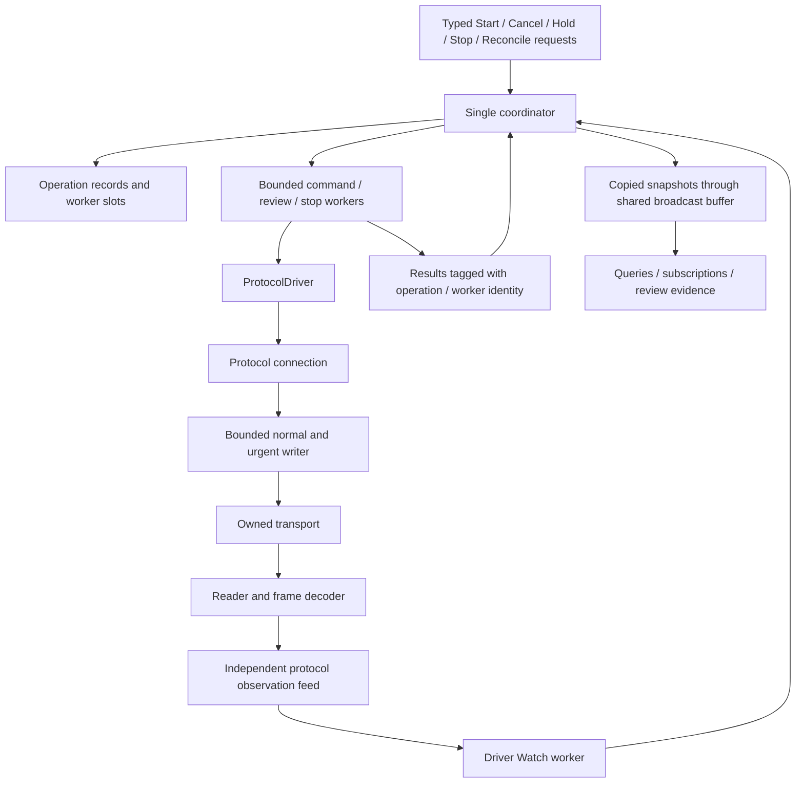

# Single-Owner CNC Controller — Worker Ownership Separate from Operation Evidence

A CNC command controller has to track two things that often finish at different times: software activity and machine activity. Sending a motion command may finish while the axis is still moving. Requesting cancellation may change the operation's reported outcome while its command goroutine is still shutting down. A fresh Idle report does not establish that no software worker can issue another command.

The Z1 controller addresses this with a single coordinator, bounded workers for blocking tasks, and operation-specific evidence checks. Its latest cleanup separates command/review worker ownership from operation phases using two identified slots. It does not turn that separation into a generic workflow engine.

This entry describes implementation commit **`da0d33d`**. The controller is real Go code with offline integration coverage, but it is not yet the sole production execution owner. Remaining P3 operations and recovery paths, followed by P4 adapter cutover, are still unfinished.

> [!summary]
> - The coordinator owns decisions and state; workers perform bounded blocking tasks.
> - Worker completion releases software ownership. Machine evidence resolves an operation. Neither substitutes for the other.
> - Two fixed command/review slots replace lifecycle flags; existing phases and concrete completion functions remain.
> - Identity-checked completion prevents an old result from releasing a newer worker.
> - Keep the machine-specific safety rules. Do not add a generic scheduler, evidence language or replay engine without a demonstrated requirement.

## 1. The controller in its protocol architecture

The new core is `makera-z1-cli/pkg/controller`. A single coordinator consumes requests, observations, worker results and timer events. It mutates operation records and publishes copied snapshots. Its transitions do not wait for network I/O or physical motion, which keeps the decision loop available while a command exchange is slow.

`ProtocolDriver` connects the controller to the new protocol stack rather than wrapping the legacy Client. The protocol connection owns its transport, reader, bounded writer and observation feed. Normal text commands use a single sentinel-delimited collector. Urgent control traffic has independent queue admission, although it can only take priority at writer batch boundaries. An uncertain exchange quarantines conflicting protocol work; that uncertainty is not repaired by receiving a later Idle report.



This is not a claim that Go scheduling or TCP priority guarantees a physical stop deadline. The physical E-stop remains authoritative. The HTTP server is managed through devctl, and stopping that server is not a motion-stop procedure.

## 2. Work is not its worker

An **operation** records an intent and what has happened to it. The existing `Operation` struct includes an ID, Kind, Phase, timestamps, Error, dispatch/hold receipts and specialised evidence such as a spindle-stop result. ReviewReason and CompletionEvidence explain outcomes where a short phase name is insufficient.

A **worker** is a Go goroutine doing potentially blocking work for that operation. For example, the command worker acquires preflight evidence, waits for the coordinator's permission, sends the command, waits for the protocol result and exits. The review worker performs fresh checks and waits for reported rest. The operation can remain unresolved long after either worker exits.

The initial implementation conflated some of these facts through `workerDone` on the active operation and a separate `reviewing` flag. This caused two ownership problems:

1. A pre-dispatch cancellation or rejection could clear the active operation pointer before its command worker had finished.
2. An independent stop could change or resolve an operation while its review worker remained alive. Releasing ownership based on the changed phase could permit an overlapping review or new command.

Adding another phase-specific flag for each case would make it harder to reason about the next interleaving. The cleanup instead makes worker ownership independent of that active operation pointer.

## 3. The smallest useful product-state model

Conceptually, controller state is a pair:

\[
S = (W, E)
\]

Here, \(W\) describes unfinished software workers and \(E\) describes operation state and machine evidence. A transition may update either side. The useful property is not mathematical notation itself, but the refusal to infer one side from the other:

\[
\text{worker finished} \not\Rightarrow \text{machine stopped}
\]

\[
\text{machine appears stationary} \not\Rightarrow \text{worker finished}
\]

The implementation does **not** introduce generic `Work`, `Disposition`, `EvidenceCriterion` or resource-allocation types to mirror this notation. It keeps existing operation fields and concrete predicates. Only the command/review lifetime bookkeeping gets a dedicated representation.

That is an important limit on the pattern: mathematical separation helps explain invariants, but does not require a framework implementing every concept as a configurable object.

## 4. Two identified slots, not an activity platform

`activities.go` contains a small structure with two optional records:

```go
type activity struct {
    token     uint64
    operation string
}

type activities struct {
    next            uint64
    command, review *activity
}
```

The slot name supplies the role. A present record means the worker has not reported completion. There is no separate Running/Cancelling/Exited enum: cancellation is carried by the existing context, and the slot remains present until completion.

`begin` requires an empty slot, increments the controller-local token counter and stores the token with the operation ID. `finishActivity` clears a slot only if both fields match. The token distinguishes successive worker invocations even when they belong to the same operation.

```text
finishActivity(slot, token, operationId):
    if slot is empty:
        return false
    if slot.token != token or slot.operation != operationId:
        return false
    slot = empty
    return true
```

These are host-side identities. They are not firmware command IDs, durable records, caller grants or authorization capabilities. A new Controller has its own slot lifetime; no cross-process uniqueness is promised or required.

The normal-admission predicate checks `workers.busy()` alongside the existing unresolved-operation, spindle-stop and fault conditions. Reconciliation also requires no occupied command/review slot. Urgent stop paths retain their separate availability and machine-specific policy.

## 5. Completion and cancellation follow one ownership rule

A command worker posts a final `worker_done` event carrying its operation ID and activity token. The coordinator handles this event before looking up the active operation, so cancellation or rejection cannot make the ownership record unreachable. The final event releases only the matching command slot and does not change an operation's evidence-based outcome.

The review completion event similarly calls `finishActivity` before handling its result. If the event is stale or duplicated, it cannot clear a newer review or alter the newer review's outcome. If an independent stop already resolved the original operation, the matching old review can still release its own slot without trying to resurrect that operation.

Conceptual pseudocode:

```text
start command worker:
    token = occupy command slot for operation ID
    launch existing prepare / permit / dispatch worker with token

cancel operation:
    request cancellation through its existing context
    update operation state as warranted
    keep worker slot occupied

receive command worker completion:
    release matching command slot
    do not infer motion completion

receive review completion:
    if review slot does not match:
        ignore result for ownership/outcome purposes
    otherwise:
        release review slot
        apply the existing review-result checks to its operation, if still relevant
```

A worker's final completion event is its last controller-relevant action; it performs no subsequent device I/O. The goroutine may still return through ordinary runtime bookkeeping afterward. `Close` separately cancels and joins owned workers. This does not turn socket closure or worker shutdown into physical rest evidence.

## 6. The cancelled-preparation case explains the changed test

A rejected operation can be visible before the worker's final event is processed. This is a legitimate intermediate state, not a history-capacity failure:

```text
Check fails
    → prepared(error) event
    → operation becomes Rejected
    → active operation pointer is cleared
    → worker_done(token) event
    → command slot is released
```

The first race-test run after the cleanup exposed a test that assumed Rejected meant immediate worker availability. `TestHistoryCapacityDoesNotRefuseNewWork` failed at history_test.go:71 with `controller has an unresolved operation or fault`.

The correction was to wait for both the Rejected outcome and an empty `CommandWorkerID` before starting the next test operation. Production admission was not weakened, and no automatic retry loop was added to the controller.

Snapshots now expose `CommandWorkerID` and `ReviewWorkerID`, which identify the operation owning an unfinished worker at publication time. This explains why a request can be Busy even after the previous operation has a terminal outcome. The internal completion tokens remain private. A final disconnected snapshot is historical state at publication, not a continuously updated monitor after shutdown.

## 7. Evidence checks remain ordinary machine-specific code

The cleanup preserves the controller's observation pipeline. Observations carry generation, sequence, host receipt time and explicit validity. Completion requires distinct fresh evidence; a cursor gap or missing field cannot silently stand in for a successful sample.

The concrete rules differ for good reasons:

- **Finite jog and positioning:** reported destination, not merely Idle. Selected-axis targets must all match within the declared tolerance.
- **Work-coordinate positioning:** arrival also requires consistent machine-minus-work offset evidence, so an offset change cannot imitate motion.
- **Work-coordinate assignment:** changed WPos and unchanged MPos are the intended result; requiring an unchanged offset would be wrong here.
- **Homing:** post-dispatch Home followed by stable Idle supports an observed cycle. Idle at the ambiguous boot/rest position does not establish one. The result does not manufacture independent reference proof.
- **Spindle stop:** a reviewed M5 grace/coast/one-halt policy evaluates current RPM, not retained target RPM, and records dispatch separately from confirmation.

These are ordinary functions and a small consecutive-sample counter, not a declarative evidence language. Their complexity represents CNC behavior and evidence limitations. Replacing them with a generic criterion engine would not remove that complexity; it would mostly move it somewhere harder to inspect.

## 8. Reconciliation remains a narrow operator review

The healthy-session reconciliation path requires operator-confirmed rest and a bounded explanation, successful fresh preflight, no conflicting command/review worker, no unfinished hold or spindle stop, and no blocking controller fault. It then requires three distinct fresh reports showing Idle, zero feed/RPM and stable valid XYZ machine position.

A successful review produces Reconciled while preserving the original failure. It means the interrupted disposition was reviewed, not that the original command achieved its target. A failed review remains Unknown. A quarantined protocol cannot pass the fresh exchange check merely because the machine later reports Idle.

Faulted-session replacement and unresolved spindle-stop reconciliation remain unfinished. There is no automatic unlock, reconnect-and-replay or motion/job retry subsystem. Asking for fresh status acquires new evidence; an operator deliberately issuing another command after inspection creates new work. Restarting a machining program from an intermediate line would be a separate CNC feature with modal-state and safe-entry requirements.

## 9. What is intentionally not generalised

The implementation retains useful specialised structures. Hold dispatch still has its own in-progress tracking, and spindle stopping retains its operation ID, receipts and observation policy. The command/review slot cleanup does not claim to be a universal worker registry.

The existing preparation/permit/dispatch worker also remains intact. There is no task graph splitting it into generic Prepare and Dispatch jobs. The single coordinator rechecks admission evidence at the permit boundary; that mechanism already solves the concrete requirement.

The shared `broadcast.Buffer[T]` is a different, justified extraction: it replaced repeated retention/wakeup mechanics in three actual consumers. Its existence does not justify introducing a broker or an orchestration platform into this controller.

A practical complexity budget is:

| Keep | Avoid without a demonstrated requirement |
|---|---|
| Single coordinator and bounded workers | General workflow/resource scheduler |
| Fixed identified command/review slots | Role hierarchy and lifecycle schema |
| Existing Phase, Error and evidence fields | Parallel disposition/reason models |
| Concrete predicates and consecutive counts | Configurable evidence engine |
| Explicit operator review and uncertain outcomes | Automatic motion/job replay |
| Bounded history and shared broadcast | Mandatory lossless journal/deduplication infrastructure |

The criterion for another abstraction is removal of actual duplication or prevention of an identified failure. It is not whether the architecture diagram would look more uniform.

## 10. Validation and implementation boundaries

The cleanup is committed as `da0d33d`. The following commands passed from `makera-z1-cli`:

```bash
GOWORK=off go test -race ./pkg/controller ./pkg/makera/protocol ./pkg/doc ./cmd/z1ctl
GOWORK=off go vet ./pkg/controller ./pkg/doc ./cmd/z1ctl
GOWORK=off go run ./cmd/z1ctl help z1-controller-core
```

`activities_test.go` verifies that cancellation does not release command ownership, a stale completion cannot clear a newer worker for the same operation, and a stale review result cannot resolve a newer review. The earlier interrupted-review regression now uses the slot model instead of the removed flags.

Existing target, homing and rest tests continue to cover operation evidence. `protocol_integration_test.go` runs the real Controller, ProtocolDriver, writer and decoder against a scripted net.Pipe peer. It exercises preflight, exact jog dispatch, caller-independent operation lifetime and observed target completion. The peer is a byte/timing fixture, not a model of machine mechanics.

No hardware commands were sent for this cleanup. P3 is still incomplete: safe-Z/park policy, accessories, jobs/files and broader recovery remain unfinished. The legacy production execution owner remains until the separate adapter cutover. Do not interpret documentation delivery as completion of those requirements.

## 11. Reading and extending the code

The coding-agent entry point is the embedded Glazed topic `z1-controller-core`, stored at `makera-z1-cli/pkg/doc/topics/controller-core.md`. Root README.md, root AGENT.md and the module README link to it. The root CLI loads its embedded sections before the existing single Glazed help setup, so it can be discovered without connecting to a machine.

Repository-relative source navigation:

- `makera-z1-cli/pkg/controller/activities.go`: fixed slots and matching completion.
- `makera-z1-cli/pkg/controller/coordinator.go`: admission, command launch, global worker completion and observation transitions.
- `makera-z1-cli/pkg/controller/reconciliation.go`: review admission, bounded evidence collection and identity-checked result handling.
- `makera-z1-cli/pkg/controller/types.go`: existing operation/evidence records and copied worker-owner projections.
- `makera-z1-cli/pkg/controller/activities_test.go`: focused ownership regressions.
- `makera-z1-cli/pkg/controller/history_test.go`: outcome versus worker availability at repeated admission.
- `makera-z1-cli/pkg/controller/protocol_integration_test.go`: real-stack offline scenario.
- `makera-z1-cli/pkg/doc/doc.go` and `cmd/z1ctl/main.go`: embedded help registration.
- `ttmp/2026/09/13/MZ1-016--controller-architecture-refactor-before-embedded-scripting/reference/01-architecture-investigation-and-delivery-diary.md`, Step 26: cleanup decisions, the failed history assumption and validation evidence.

Before changing this core, ask: **who can still send commands, why is another command blocked, and what evidence supports the reported outcome?** Put the answer in the existing slot, operation record or concrete predicate. If a proposed cleanup leaves the old lifecycle flags beside its replacement, it has added complexity rather than simplified it.

## Related entries

- [[Research/Software Architecture Garden/dropcut-studio/README|dropcut-studio Garden project]] — project index and historical entries.
- [[Research/Software Architecture Garden/dropcut-studio/designs/06 - Consecutive Evidence Observer - Completion Without Owning the Operation|Consecutive Evidence Observer]] — evidence counting separate from acquisition and ownership.
- [[Research/Software Architecture Garden/dropcut-studio/designs/08 - Bounded Cursor Broadcast - Independent Readers with Explicit Gaps|Bounded Cursor Broadcast]] — the reusable observation/publication mechanism beneath independent readers.
- [[PROJ - Makera Z1 Control - P1 and P2 Protocol Ownership and Hardware Evidence]] — earlier protocol architecture and the specific installed-machine experiments, not qualification of this newer controller cleanup.

Earlier Garden proposals about renewable grants or continuous dead-man motion remain historical analyses. They are not current controller requirements or evidence of installed stock-firmware support.
