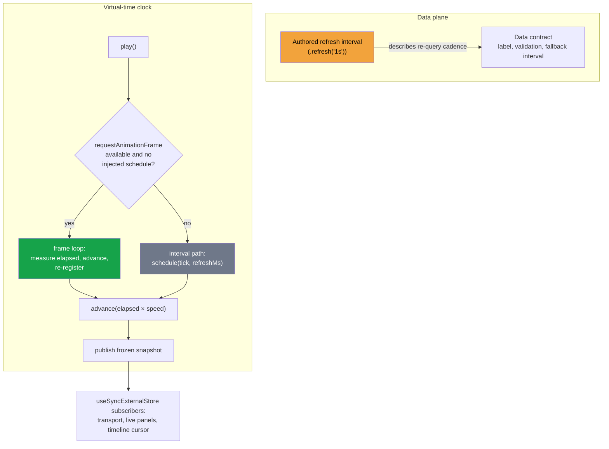

# Display-Frame-Driven Virtual Clock - Separate Animation Cadence From Data Refresh Cadence

A playback UI has two cadences that are easy to collapse into one: the rate at which data would be re-queried in production, and the rate at which an animation should move. When one number drives both, the animation inherits the data contract's granularity. A simulation page that declares "refresh every second" then moves its playhead in one-second jumps, and every derived visual — gauges, progress bars, lamp strips, cursors — steps at 1 Hz instead of moving continuously.

The load-bearing design rule: a configurable data-refresh interval is metadata about the data plane; the animation tick belongs to the display. A virtual-time clock should advance on the display's own frame callback (`requestAnimationFrame`), measure real elapsed wall time per frame, and leave the refresh interval to describe what it actually governs. The clock math must be interval-agnostic — advance by measured elapsed time, never by assumed tick size — so that swapping the scheduler changes smoothness without touching speed semantics.

> [!summary]
> - Data-refresh cadence and animation cadence are different contracts; using the first as the second produces visible stepping whenever the refresh interval exceeds the perception threshold.
> - The frame loop advances virtual time by measured elapsed wall time, so it is frame-rate independent: 60 Hz displays take 16 ms steps, 120 Hz displays take 8 ms steps, and total progression stays wall-clock accurate.
> - The scheduler is a seam: injected interval schedulers and frame-less hosts (test runners, server rendering) keep the interval path and deterministic tests never observe wall time.
> - Background tabs suspend animation frames, so playback pauses with visibility — usually the correct policy for a preview, and a decision that belongs to the clock's owner, not the caller of each panel.

## Why this pattern exists

The triggering system is a dashboard playback surface: a simulation runtime generates deterministic records under a fixed seed, and a preview renders live pages that follow a shared playhead — a live gauge reading the active cycle's elapsed time, a progress bar inside authored sigma bands, an andon lamp strip whose lamps stay lit within a takt window, and alert-rule pills evaluated at the current time. Pages author a refresh interval in the source language (`.refresh('1s')`) that the original design used to mean "how often this live page re-queries."

The port's first clock scheduled its tick with that interval:

```ts
timer = schedule(tick, refreshMs); // refreshMs = 1000 for a '.refresh(1s)' page
```

Each tick then advanced virtual time by the whole measured interval. The playhead published once per second, in 1 s × speed jumps. Users reported the playback as "very choppy," and the diagnosis was structural, not a performance problem: the render cost per publish was microseconds; the publish *rate* was one hertz. The original artifact the port preserved had never had this behavior — its IDE drove its clock with `requestAnimationFrame`, and its refresh setting only described data.

The failure generalizes. Any system where a configuration value describes a data-plane cadence (polling interval, recompute interval, subscription granularity) will look smooth in a backend and step visibly in a UI if that same value becomes the UI's animation tick. The bug class has three identifying marks:

- the animation updates in fixed jumps whose size equals the configured interval, multiplied by any speed factor;
- lowering the interval makes the UI smoother but silently changes what the configuration means everywhere else; and
- the jitter is phase-misaligned — an interval callback lands at an arbitrary offset from the display's repaint, so even frequent ticks can beat against the frame rate instead of landing inside it.

## Pattern shape

The clock keeps four ideas separate.

**1. Interval-agnostic advancement.** The tick never assumes how long it has been. It measures:

```ts
const tick = () => {
  const current = now();
  const elapsed = Math.max(0, current - lastWallMs);
  lastWallMs = current;
  api.advance(elapsed); // virtual time += elapsed × speed
};
```

This single property is what makes every other change safe. A test can advance 100 ms explicitly; a frame can advance 16 ms; a slow frame can advance 40 ms; the virtual clock consumes measured time and stays correct.

**2. A frame loop as the default scheduler.** When playback starts, the clock asks the display for the next frame and re-registers from inside the callback:

```ts
const frame = () => {
  frameId = undefined;
  tick();
  if (snapshot.playing && frameId === undefined && requestFrame !== undefined)
    frameId = requestFrame(frame);
};
const startTimer = () => {
  if (timer !== undefined || frameId !== undefined || !snapshot.playing) return;
  lastWallMs = now();
  if (requestFrame !== undefined) {
    frameId = requestFrame(frame);
    return;
  }
  timer = schedule(tick, refreshMs); // interval fallback: tests, injected schedulers
};
```

`requestAnimationFrame` invokes its callback immediately before the display paints, so whatever the tick computes is on screen in the same frame it was computed for. The callback also fires at whatever rate the display actually repaints, so no frame rate is configured anywhere — the display's rhythm is the rhythm.

**3. One stop path for every scheduler kind.** Pause, seek, reset, end-of-media, and dispose all funnel through a single `stopTimer` that cancels whichever scheduler is live. A clock with two scheduler kinds and two teardown paths is a clock with a leak waiting to happen; the re-registration guard (`frameId === undefined` after teardown) also makes a stale frame callback that fires after cancellation harmless — it runs `tick()`, observes `playing: false`, and does not re-register.

**4. The scheduler as an injected seam.** The interval path is not deleted; it is demoted to a fallback that tests inject explicitly. Deterministic test suites never need wall time or frame pumping to assert clock semantics, and hosts without animation frames (node test environments, server rendering) retain the old behavior automatically because `typeof globalThis.requestAnimationFrame === 'function'` is false there. The frame functions must be captured at clock creation, not per tick — stubbing globals in tests only affects clocks created after the stub.



## Costs and failure modes

- **Background tabs pause playback.** Displays do not paint hidden tabs, so the frame loop stops firing and virtual time stops. For previews and animation this is the desirable policy (an interval timer would burn virtual time unseen and snap the UI forward on refocus); for a wall-clock-accurate stream replay it would be wrong. The choice belongs to whoever owns the clock — the pattern's point is that it is now a *choice*.
- **Per-frame resolution cost.** Every published playhead re-runs the pure resolution of the visible panels. In the triggering system, resolving a dozen queries over a fifty-cycle study costs far less than one frame budget; if a host's resolution were heavier, the correct response is a publish throttle (a minimum interval between publishes, with the frame loop still measuring time), not a return to interval-driven animation.
- **Test environments must stub globals before construction.** Because the clock binds `requestAnimationFrame` at creation, a test that stubs the global after creating its clock exercises the fallback. Stubbing order is part of the test contract.
- **Speed multipliers amplify any remaining stepping.** Advancing `elapsed × speed` per frame keeps 128× playback smooth, but it also means an interval fallback at 1 Hz jumps 128 s per tick. Hosts that must fall back to intervals at high speeds should scale the fallback interval down with speed rather than shipping the product.

## Working rules

- Advance virtual time by measured elapsed time only; never by assumed tick size.
- Treat any authored polling or refresh interval as data-plane metadata; do not use it as the animation tick.
- Keep one teardown path for all schedulers and guard re-registration against stale callbacks.
- Inject the interval scheduler as a test seam rather than mocking timers globally; capture frame functions at creation time.
- Verify smoothness empirically: sample the playhead over a second of playback and assert many distinct positions with a bounded maximum step (the triggering change measured 20 distinct samples and a 110 ms maximum step under a throttled headless display, against the previous single 1000 ms jump).

## Evidence

The triggering implementation is `packages/dashboard/src/timeController.ts` in the playback-ui repository at commit `a831dd0` ("feat(dashboard): drive the playback clock from display frames"): the `requestFrame` capture, the `frame` loop, and the two-path `startTimer` shown above are the shipped code. `tests/dashboard-time-controller.test.ts` pins both paths deterministically: a stubbed frame pump advances five 16 ms frames to 80 ms with one re-registration per frame and proves pause cancels the frame; the injected-schedule test pins the interval contract. The project report "PROJ - Playback UI - Stage Compatibility Adapters and Real-Time Dashboard Semantics" (playback-vault, 2026-09-13) documents the surrounding system; the preserved original artifact (`stage-ide.jsx:1785`) is the prior art that drove its clock with `requestAnimationFrame`.

## Related notes

- [[Research/Software Architecture Garden/README|Software Architecture Garden]]
- [[PROJ - Playback UI - Stage Compatibility Adapters and Real-Time Dashboard Semantics]]
