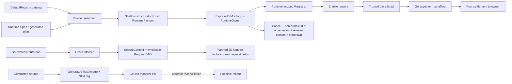

# Architecture Garden — Go-Go-Goja

Go-Go-Goja is a Go toolkit for constructing Goja JavaScript runtimes, packaging generated xgoja hosts, exposing native and RPC-backed modules, serving authorized JavaScript HTTP handlers, and maintaining persistent REPL sessions. Its central architecture is not “a sandbox.” It is a **trusted-script host with a configurable capability surface**: declarative selection narrows what can be installed, concrete registrars grant capabilities to one runtime, independently scheduled owner entries avoid concurrent Goja access across goroutines while verified same-owner `Call`/`Post` nest synchronously, and host code retains the authorization and lifecycle decisions that declarations cannot make.

It belongs in the Garden because the repository makes several easily confused boundaries concrete. Catalog registration is not a runtime grant; a runtime grant is not user authorization; lifecycle scope is not tenant policy; generated declarations witness intended shape rather than enforce behavior; plugin admission does not prove provenance or confinement; and a source-labelled image plus a GitOps pull request is not an activated release.

> [!summary]
> - A shallow structurally frozen `Factory` installs selected `Registrar` effects into one runtime before enabling `require()`; pointer-backed registrars and option internals can remain mutable.
> - Independently scheduled owner entries do not execute concurrently across goroutines and preserve async settlement context; verified same-owner `Call`/`Post` are synchronously reentrant, exported `VM`/`Loop` fields bypass the owner, and cancellation does not yet guarantee terminal Promises.
> - Every validated user-mode planned route authenticates and authorizes before JavaScript; conditional CSRF, resource, and grant checks run only when applicable, while public planned routes intentionally bypass authentication and authorization.
> - Plain engine defaults and the planned-handler request projection can expose ambient capabilities and raw credentials; declarations, plugin manifests, short image tags, and GitOps PRs also stop short of stronger enforcement or activation claims.

## Snapshot identity and evidence

| Field | Value |
|---|---|
| Repository | `/home/manuel/code/wesen/go-go-golems/go-go-goja` |
| Remote | `git@github.com:go-go-golems/go-go-goja.git` |
| Branch | `main` |
| Commit | `c265ae037c319aa90fd9c6c4e3818a2f6c9bd15e` |
| Commit date | `2026-07-23T12:31:23-04:00` |
| Commit subject | `Use Vault GitHub App tokens for Goja GitOps promotion` |
| Worktree | Dirty only because of unrelated untracked `.playwright-mcp/`; excluded from evidence |
| Analysis scope | Committed source, public interfaces, tests, schemas, persistence, transports, generated frontend codec, build/release workflows, delivery scripts, and selected migration history |

All claims refer to the committed snapshot, not the moving working tree. The target remained at the pinned commit before and after analysis; `git diff --exit-code` was clean and `git status --short` reported only `?? .playwright-mcp/`. Project instructions and the naming contract were read first (`AGENT.md:1-49`; `GLOSSARY.md:1-247`). Runtime code and tests are primary evidence; README prose and history explain intent or migration only.

The analysis traced native module construction, xgoja generation and installation, HashiCorp plugin admission, planned HTTP authorization, REPL persistence and transports, protobuf-to-TypeScript generation, the auth-host OCI workflow, and the GitOps patch script. It did not exercise live OIDC, Vault, GHCR, GitHub PR creation, Kubernetes reconciliation, hostile plugins, or untrusted-script containment. It did not modify Go-Go-Goja.

## Architecture and runtime path

### 1. Native discovery, selection, registration, `require()`, async work, and close

1. A native module implements `modules.NativeModule` and commonly registers itself from `init()` into process-global `modules.DefaultRegistry`; timer also supplies a TypeScript descriptor (`modules/common.go:28-38,48-62,85-107`; `modules/timer/timer.go:14-19,30-43,46-87`). Blank imports ensure built-in module initializers run (`pkg/engine/runtime.go:16-29`). This creates a **catalog**, not a runtime grant.
2. `RuntimeFactoryBuilder` collects explicit `RuntimeModuleRegistrar` values, module middleware, and post-setup initializers. `Build()` rejects empty or duplicate IDs, evaluates the module-selection pipeline, copies settings and slices, and makes the builder unusable after a shallow structural freeze (`pkg/engine/factory.go:30-46,61-68,77-105,107-179`). The copied registrar interface values and values captured by `require.Option` functions are not deep-copied or content-addressed, so pointer-backed internals may still change externally. A plain builder with no explicit modules preserves the permissive historical behavior of selecting every default-registry module; `Safe` and `Only` replace a selection, while `Exclude` and `Add` transform it (`pkg/engine/factory.go:137-151`; `pkg/engine/module_middleware.go:10-29,32-85,98-108`). “Safe” is a maintained name list, not a confinement proof.
3. `RuntimeFactory.NewRuntime()` checks startup cancellation, creates a Goja VM and event loop, starts the loop synchronously, creates one `RuntimeOwner`, derives a runtime lifetime context, publishes runtime services keyed by VM, and creates a fresh CommonJS registry (`pkg/engine/factory.go:182-238`).
4. Each concrete registrar receives a `RuntimeModuleRegistrationContext` containing startup `Context`, VM, loop, owner, closer hook, and runtime value bag. All registration completes before `reg.Enable(vm)` exposes `require()` and before runtime initializers run; failure closes the partial runtime (`pkg/engine/runtime_modules.go:12-30`; `pkg/engine/factory.go:238-289`). The phase order is therefore declarative selection → shallow structurally frozen `Factory` → active `Registrar` → enabled loader, not “registry entry equals authority.”
5. JavaScript `require("timer")` obtains the installed loader. `sleep(ms)` creates a Goja Promise on the owner thread, captures the current owner-entry context and runtime lifetime context, waits in a goroutine, and posts resolve or negative-duration rejection back to the owner (`modules/timer/timer.go:46-83`). Tests establish availability, successful resolution, and negative-duration rejection (`modules/timer/timer_test.go:14-85`).
6. `RuntimeOwner.Call` and `Post` reject a closed owner, carry caller cancellation, fast-path only a verified same-owner goroutine context, otherwise enqueue on the loop, and account for callbacks only while their bodies execute. `Call` returns recovered panics as errors; fire-and-forget `Post` swallows recovered panics (`pkg/runtimeowner/runner.go:30-50,53-87,90-187,189-247,256-268`). The fast path is synchronously reentrant: nested same-owner `Call`/`Post` executes before the outer callback returns, and nested `invoke` increments `active` while the outer invocation is still active (`pkg/runtimeowner/runner.go:106-107,160-165,189-247`; `pkg/runtimeowner/runner_test.go:115-133`). Separately, a race stress test serializes 500 independently scheduled increments without concurrent callback bodies across goroutines (`pkg/runtimeowner/runner_race_test.go:11-40`). This proves **non-concurrency of independently scheduled owner entries**, not disjoint callback intervals or VM confinement: synchronous same-owner invocations nest, and `engine.Runtime` exports `VM` and `Loop`, so embedders can bypass `Call`/`Post` (`pkg/engine/runtime.go:32-38`). It also does not prove FIFO, fairness, durable ordering, or exactly-once posting.
7. `Runtime.Close()` runs once: it marks only the runtime's closer-registration state as closing, cancels lifetime, observes owner idleness or interrupts active JavaScript after a bounded wait, invokes copied closers in reverse order while runtime services still exist, deletes those services, only then shuts down the owner, and finally stops the loop (`pkg/engine/runtime.go:32-47,66-84,86-162`). Lifecycle tests establish lifetime propagation, cancellation on close, and closer-before-service-deletion ordering (`pkg/engine/runtime_test.go:84-166`); immediate close is separately regression-tested (`pkg/engine/factory_test.go:12-26`). `WaitIdle()` observes only the currently executing `active` count, while `Call`/`Post` can accept queued or concurrent submissions until the later `Owner.Shutdown()` (`pkg/runtimeowner/runner.go:60-126,136-186,235-247`). There is no atomic submission/quiescence fence, so reverse closer order does not prove that cleanup cannot overlap previously accepted or concurrently submitted VM work.

The async limit is concrete: timer exits without resolving or rejecting when the owner-entry or runtime context is cancelled (`modules/timer/timer.go:70-79`). A disappearing VM makes a runtime-close case moot, but request cancellation while the runtime remains live can leave a Promise pending. An accepted `Post` can also be skipped if its context is cancelled before execution (`pkg/runtimeowner/runner.go:168-186`). No repository-wide Promise terminality law is established.

### 2. xgoja provider selection, generated plan, and runtime installation

A `ProviderRegistry` owns package records for modules, verb and help `Source` values, command sets, and package capabilities. It rejects duplicate package IDs and entries and returns copied package records (`pkg/xgoja/providerapi/provider_registry.go:9-60,63-143,145-238`). A provider `Module` contains an executable `NewModuleFactory`, optional `ConfigSchema`, and optional TypeScript descriptor (`pkg/xgoja/providerapi/module.go:13-23,41-50`). In repository glossary terms, a `Provider` contributes surfaces; a declarative `Spec` says what should exist; a setup `Context` supplies one operation's inputs; a `Factory` creates runtime objects; a `Registrar` actively installs; a `Source` identifies content origin; and a `Store` serves loaded content (`GLOSSARY.md:5-23,25-207`). Those roles are intentionally not synonyms.

During normal generation, `providergraph.Build()` accepts explicitly selected providers, rejects modules owned by unselected providers, rejects unknown modules and duplicate aliases, and indexes selected command sets (`cmd/xgoja/internal/plan/plan.go:84-105`; `pkg/xgoja/providergraph/graph.go:12-62,64-135`). Strict TypeScript collection fails if a selected module lacks a descriptor (`pkg/xgoja/providergraph/graph.go:189-204`; `pkg/xgoja/providergraph/graph_test.go:13-106`). This is a fail-closed generation-time selection/index graph, not a dependency graph, provenance graph, package solver, user policy graph, or validation of every plan accepted at runtime.

Generation embeds `xgoja/runtime/v2`: providers, selected runtime modules, sources, commands, artifacts, and optional auth. It deliberately omits build-only Go versions, imports, replacements, and source base directories. Runtime decoding rejects a fixed list of removed legacy top-level keys, but does not enforce `Schema`, reject other unknown keys, re-run provider membership admission, or check alias uniqueness (`pkg/xgoja/app/runtime_plan.go:1-31,50-75,77-160`). At runtime, `app.RuntimeFactory` resolves plan modules directly from the full provider registry, gathers package host-service capabilities once per package/capability ID, maps Glazed values into module config, and constructs a low-level engine factory with implicit defaults disabled (`pkg/xgoja/app/module_sections.go:14-33`; `pkg/xgoja/app/factory.go:62-140,147-222`). Each selected provider registrar calls `NewModuleFactory` with alias, raw config, host services, runtime owner, startup context, and closer hook, then installs the loader under that alias (`pkg/xgoja/app/factory.go:23-60`). `require(alias)` then follows the native path above. Provider and alias admission is therefore established for normally generated plans, not tampered or hand-constructed runtime plans.

The embedded plan is configuration identity, not behavior or release identity. `ConfigSchema` and generated `.d.ts` files are **declaration/schema witnesses, not generic runtime enforcement**: `providerapi.Module` stores them, but the generic registration path passes raw JSON to `NewModuleFactory` without invoking JSON Schema validation (`pkg/xgoja/providerapi/module.go:41-50`; `pkg/xgoja/app/factory.go:34-58`). Individual provider setup or config-section code may validate more. Strict descriptor presence does not prove the loader's exports or semantics match the declaration.

### 3. Plugin discovery and admission

The HashiCorp plugin adapter scans configured directories after resolving them to absolute paths, admits only regular executable files, deduplicates, and sorts candidates (`pkg/hashiplugin/host/discover.go:13-63`). `filepath.Abs` does not canonicalize or resolve symlinks. Manifest validation can require a namespace and exact module allowlist and rejects empty, duplicate, or unsupported export shapes (`pkg/hashiplugin/contract/validate.go:8-80`). Its runtime `Registrar` starts admitted modules, checks unique `require()` names, installs RPC-backed loaders, records a runtime snapshot, and registers process cleanup with the runtime (`pkg/hashiplugin/host/registrar.go:11-83,93-113`). JS arguments and return values cross RPC as `google.protobuf.Value` (`pkg/hashiplugin/contract/jsmodule.proto:1-51`; `pkg/hashiplugin/host/reify.go:14-88`).

This is plugin admission, not plugin security. The cited path performs no signature or digest verification, filesystem/network/process confinement, per-call principal authorization, or enforcement of manifest capability strings. The executable runs as an external process under the host principal, and synchronous invoke can block the runtime owner. Every export closes over the registrar's setup `RuntimeModuleRegistrationContext.Context` and reuses that fixed context for RPC (`pkg/hashiplugin/host/registrar.go:59-60,86-90`; `pkg/hashiplugin/host/reify.go:28-50,55-68`); the current owner-entry or request context is not propagated. Consequently, even a cooperative plugin can observe cancellation only from the registration/startup context on this path, not per-request cancellation.

### 4. Planned HTTP authorization before JavaScript

A route is first compiled into a Go-owned `RoutePlan` carrying method, pattern, security requirements, typed resource extraction, action, CSRF, audit, and rate limits (`pkg/gojahttp/auth_plan.go:62-129`). Credential method, durable principal kind, actor, resource, and non-secret `AuthResult` remain distinct; raw credentials are forbidden from `AuthResult` (`pkg/gojahttp/auth_plan.go:21-41,131-188`).

`Enforcer.Enforce()` revalidates the plan, charges pre-auth limits, authenticates validated user-mode routes, verifies required credential/principal/OAuth families, performs CSRF, resource, and grant checks only when their predicates apply, asks the host `Authorizer` for nonpublic actioned plans, then charges post-auth resource limits (`pkg/gojahttp/enforcer.go:61-176,247-295`). Missing services required by an applicable plan check fail closed. Public planned routes intentionally skip authentication and authorization; validation permits public mode but requires user mode to declare an action (`pkg/gojahttp/auth_plan.go:308-327`; `pkg/gojahttp/enforcer.go:79-103,153-169`). Only after enforcement succeeds does `servePlannedRoute()` attach the actor to the owner-entry context and invoke the JavaScript handler through `RuntimeOwner`; returned Promises are awaited, production errors are redacted, and allowed/denied/failed/completed audit outcomes are recorded (`pkg/gojahttp/planned_dispatch.go:35-104`). Tests cover public invocation, successful user-mode authorization, native-module actor propagation, the non-secret `AuthResult` projection, conditional CSRF behavior, resource-before-authorization ordering, not-found mapping, and denial (`pkg/gojahttp/planned_dispatch_test.go:120-267,390-424,501-595`).

The JavaScript `auth` object is a separately constructed projection of non-secret `AuthResult` fields (`pkg/gojahttp/planned_dispatch.go:197-229`). The enclosing handler context is **not** a redacted or non-secret request envelope: `secureEnvelope.JSObject()` also projects `RequestDTO.Map()` wholesale, including `headers`, `cookies`, `session`, and `rawBody`; request construction copies every HTTP header and cookie without an allowlist (`pkg/gojahttp/planned_dispatch.go:197-205`; `pkg/gojahttp/request_response.go:30-67`). An `Authorization` header, session cookie, or other credential-bearing cookie can therefore reach trusted handler JavaScript after enforcement. Existing tests establish the narrowed `AuthResult` projection but do not establish header/cookie removal.

Authentication and authorization therefore dominate JavaScript invocation for **validated user-mode planned routes**. Public planned routes intentionally do neither, and arbitrary Express routes, REPL endpoints, native module calls, plugin processes, and direct filesystem/process/database/network effects remain outside the adapter. Even on a user route, domination does not imply credential-minimized disclosure because the wholesale request projection follows the checks. Runtime lifecycle says whether VM work may execute; it does not decide which principal or tenant may request it. Audit evidence records a decision; it is not itself the decision, and key-name redaction (`pkg/gojahttp/auth/audit/audit.go:303-354`) is not information-flow noninterference.

### 5. REPL session, persistence, and transports

`replsession.Service` owns the session-ID map, one engine runtime and serialized operation gate per session, service/session lifetime contexts, health and pending-commit state, and optional lease/fencing state (`pkg/replsession/service.go:34-81`). Session creation generates or accepts an ID, separates startup context from service-owned lifetime, creates the runtime, and cleans runtime and lease on failure (`pkg/replsession/service.go:177-255`). This lifecycle scope is not an HTTP principal, tenant boundary, or authorization policy.

`Evaluate()` acquires the per-session gate, rejects unhealthy or fenced sessions, starts lease guarding, analyzes and optionally rewrites source, handles top-level await through an async-IIFE rewrite, executes on the owned runtime, snapshots observations, and then commits a cell report (`pkg/replsession/evaluate.go:29-63,65-101,103-211,249-280`). Canonical submitted source, transformed source, static observations, before/after runtime snapshots, console observations, provenance records, and the durable evaluation materialization remain different object families. SQLite stores sessions, evaluations, ordered console rows, bindings, binding versions, and docs under explicit uniqueness keys (`pkg/repldb/schema.go:3-88`). Optional lease renewal constructs a write fence, and durable evaluation commit calls `PersistEvaluationFenced` when ownership is enabled (`pkg/replsession/ownership.go:39-129`; `pkg/replsession/persistence.go:20-53`).

The effect/commit boundary is not atomic. JavaScript can mutate the live VM or external systems before persistence commits; when commit fails, HTTP reports the honest condition “evaluation executed but could not be committed” (`pkg/replhttp/handler.go:185-207`). Replaying a cell is therefore not automatically idempotent, and the evaluation record is not an event log that can reconstruct arbitrary external effects.

Protobuf owns the canonical transport schema and carries an explicit `schema_version`; the same schema generates Go and TypeScript (`proto/goja/replapi/v1/replapi.proto:1-18,66-134,141-196`; `buf.gen.yaml:1-10`). TypeScript fixture tests decode protobuf JSON, preserve 64-bit values as `bigint`, and round-trip tested structured JSON (`web/packages/replapi-types/src/replapi_decode.test.ts:35-95`). This proves codec compatibility for those fixtures, not semantic equivalence between all Go/JS values or enforcement of session policy. HTTP defaults bound body/source sizes, hide internal errors, validate request IDs, and set `no-store`/`nosniff`, but authentication and authorization explicitly belong to outer middleware (`pkg/replhttp/handler.go:20-55,112-207`). The repository supplies REPL service, HTTP, TUI/Bobatea, and TypeScript codec boundaries; it does not contain one REPL SPA.

### 6. Source, image, and GitOps proposal

The auth-host Docker build compiles the generated host described by `examples/xgoja/21-generated-host-auth/xgoja.yaml`, copies it into a distroless nonroot image, and selects the demo serve command (`Dockerfile.auth-host:1-21`). CI runs the generated-host smoke test, labels and publishes `sha-<7>`, `main`, and `latest` tags, and smoke-runs the loaded PR image (`.github/workflows/publish-auth-host-image.yaml:39-103`). On `main`, a separate job uses GitHub Actions OIDC to read GitHub App credentials from Vault, mints a token scoped to the configured GitOps repository, and invokes the promotion script with the short SHA tag (`.github/workflows/publish-auth-host-image.yaml:104-154`; `deploy/gitops-targets.json:1-10`).

The script validates target configuration, finds one named container using a deliberately narrow text-level YAML patch, replaces its image string, and can commit/push/open a PR whose body links source commit and workflow run (`scripts/open_gitops_pr.py:27-50,68-123,210-258`). Thus the concrete path is source → generated binary → OCI image and tag → proposed manifest mutation. A short, potentially mutable tag is not an OCI digest; neither tag nor digest is complete behavior/release identity; a GitOps PR is not merge, reconciliation, rollout, readiness, database compatibility, secret validity, or deployment success. GoReleaser binaries/docs, this OCI image, and the npm codec package are separate release surfaces (`.github/workflows/release.yaml:15-143`; `.github/workflows/publish-npm.yml:27-128`).

## Authority and state map

| Object | Owner | Identity/lifecycle | Durable? | Must not be confused with |
|---|---|---|---|---|
| Default native module catalog | `modules.DefaultRegistry` | Process-global module name | No | Capability granted to one runtime |
| Shallow structurally frozen engine composition | `engine.RuntimeFactory` | Copied registrar/settings containers after `Build()` | No | Deep immutability, VM, artifact digest, behavior identity |
| Concrete engine runtime | `engine.Runtime` | Exported VM, loop, owner, lifetime context | No | Enforced VM confinement, principal, tenant, or user session policy |
| Owner entry | `RuntimeOwner.Call/Post` | Operation label plus call context | No | Durable request identity or global event order |
| Provider package | `providerapi.ProviderRegistry` | Package ID and registered entries | No | Security principal or deployment package |
| Runtime module plan | generated xgoja host | Provider, module, alias, config | Embedded | Installed behavior proof or authorization |
| TypeScript descriptor | module `spec.Module` | Declared JS name and shape | Generated | Runtime conformance or effect enforcement |
| Plugin manifest | plugin/host contract | Module/version/export metadata | Process-local | Signed provenance or confined capability |
| Route plan | Go HTTP host | Method/pattern/name/action/resources | Runtime config | Authentication or authorization decision |
| Secure context | host enforcer | Enforcement result plus one wholesale request DTO | No | Credential-minimized projection or tenant policy store |
| REPL cell report | session service/store | `(session_id, cell_id)` | Optional | Canonical event, retry key, or rollback record |
| Image reference | registry/workflow | Tag or digest | External | Complete behavior/release identity |
| GitOps PR | source delivery workflow | Target, branch, proposed image string | External | Applied rollout or healthy deployment |

## Capability and trust boundaries

| Surface | Concrete capability and default | Admission/control | Boundary that remains |
|---|---|---|---|
| Engine defaults | Blank-imported crypto, database, events, `exec`, `fs`, `os`, path, time, timer, YAML; plain builder selects all (`pkg/engine/runtime.go:16-29`; `pkg/engine/factory.go:137-151`) | Module middleware or explicit registrars | Trusted host, not sandbox |
| Filesystem | Default `fs` reads, writes, appends, renames, and removes arbitrary host paths (`modules/fs/backend.go:45-73`; `modules/fs/fs_sync.go:12-16,29-97`) | Omit it or inject a narrower/read-only backend | Presence is ambient host filesystem authority |
| Process | `exec.run` executes caller-selected commands and arguments synchronously (`modules/exec/exec.go:40-49`) | Omit `exec` | No wrapper timeout, output bound, cwd/env policy, or process confinement |
| Database | Configurable module opens caller-selected DSN and exposes arbitrary query/exec/transactions (`modules/database/database.go:220-257,273-395`) | Omit it or inject preconfigured handle with `configure` disabled | SQL authority equals the granted handle/DSN |
| Network | Opt-in `fetch` enforces HTTP(S), timeout, response bound, optional origins and credential rules (`modules/fetch/config.go:11-102`; `modules/fetch/fetch.go:68-100,167-218`) | Narrow provider policy or omit module | `fetch.New()` permits all HTTP(S) origins plus env/file credentials by default (`modules/fetch/fetch.go:31-42`) |
| Process metadata | Default `os` exposes home/temp paths, platform, hostname, and CPU data; opt-in `ProcessEnv` exposes host environment variables (`modules/os/os.go:23-49`; `pkg/engine/module_specs.go:179-234`) | Omit `os`; do not add process registrars/initializer | No secret-isolation claim |
| Planned HTTP | User-mode authentication/authorization plus conditional resolvers, grants, CSRF, audit, and limits | `RoutePlan` plus `Enforcer` | Public mode bypasses auth/authz; handler `request` includes raw headers, cookies, session, and body |
| REPL HTTP | Remote source evaluation and session mutation | Bounded/redacted transport plus outer middleware | Handler is not self-authorizing |
| Plugins | External executable with protobuf RPC exports | Path checks, namespace, module allowlist | No provenance, confinement, or per-call policy |

There is no first-class Git native module in the committed `modules/` tree. An admitted script could still invoke `git` through `exec`; that is process authority, not a separately mediated Git capability.

## Candidate common vocabulary

| Proposed term | Project-local name | Invariant | Nearby ecosystem names | Difference retained |
|---|---|---|---|---|
| **Module catalog** | `modules.DefaultRegistry`, `ProviderRegistry` | Discovers and resolves possible modules | Registry, plugin catalog | Not a per-runtime grant or policy decision |
| **Runtime capability selection** | module middleware, xgoja runtime module plan | Chooses loaders eligible for installation | Module set, runtime profile | Not OS sandboxing or user authorization |
| **Runtime registrar** | `RuntimeModuleRegistrar` | Actively installs one runtime's loaders before `require()` | Installer, interpreter setup | Active effect, not declarative `Spec` |
| **Shallow structurally frozen runtime composition** | `engine.RuntimeFactory` | Reusable copied construction containers after validation | Runtime factory | Registrar and option internals may remain externally mutable; not VM, artifact, digest, or release |
| **Owner-mediated scheduled-entry serialization** | `runtimeowner.RuntimeOwner` | Independently scheduled entries do not execute concurrently across goroutines; verified same-owner calls nest synchronously | Executor, foreign-runtime owner | Reentrant callback intervals overlap; exported `VM`/`Loop` permit bypass, confinement is conventional, and lifecycle ordering is not domain authority |
| **Owner-entry context** | `CurrentOwnerContext` | Carries the active request context through native code | Call scope | Not runtime lifetime or auth result |
| **Generated declaration witness** | `spec.Module`, generated `.d.ts` | Describes intended JS names and shapes | Schema, interface definition | Not runtime conformance or authorization |
| **Generated-plan admission graph** | `providergraph.Graph` | Normally generated provider/module/alias selections are checked before embedding | Registry projection | Runtime-plan decoding does not re-enforce schema, provider membership, or alias uniqueness |
| **Post-enforcement handler context** | `SecureContext`, JS `ctx` | Carries enforcement results plus the wholesale request projection to a handler | Authorized context | `auth` fields are non-secret, but `request` can disclose raw credential-bearing headers/cookies; not a redacted envelope or policy engine |
| **Evaluation materialization** | `CellReport`, protobuf response | Derived observations for one evaluated cell | Report, snapshot | Not canonical source, event log, or rollback |
| **Source delivery coordinate** | `sha-<7>` image tag | Conventionally links an image label to source | Version tag | Not digest or complete release identity |
| **Deployment proposal** | GitOps PR | Reviewable requested manifest transition | Promotion request | Not merge, reconciliation, rollout, or health |

> [!important] Vocabulary discipline
> Preserve the repository glossary's `Spec`, `Registrar`, `Factory`, `Context`, `Provider`, `Source`, and `Store`. Also preserve catalog registration ≠ runtime grant ≠ user authorization; lifecycle scope ≠ tenant policy; trusted host ≠ sandbox; declaration witness ≠ runtime enforcement; plugin admission ≠ provenance/confinement; image tag/digest ≠ behavior/release identity; and GitOps PR ≠ rollout.

## Mathematical and computer-science foundations

Each subsection defines a fresh, path-derived domain. Symbols are not reused for different object families.

### 1. Standard module middleware is a name-set projection; custom middleware has a wider codomain

Let $N_D$ be the finite set of module names available from the committed process-global default registry, and let $\mathcal{P}(N_D)$ be its powerset. A selector is a function $q:\mathcal{P}(N_D)\to\mathcal{P}(N_D)$; the base selector $q_0$ is the identity. Each standard middleware is a higher-order transformation $M_i$ from selectors to selectors. For an available set $A\subseteq N_D$ and normalized, alias-expanded request set $X\subseteq N_D$, the four standard forms are

$$
\begin{aligned}
M_{\mathrm{Safe}}(q)(A)&=A\cap N_{\mathrm{safe}},\\
M_{\mathrm{Only},X}(q)(A)&=A\cap X,\\
M_{\mathrm{Exclude},X}(q)(A)&=q(A)\setminus X,\\
M_{\mathrm{Add},X}(q)(A)&=q(A)\cup(A\cap X),
\end{aligned}
$$

where $N_{\mathrm{safe}}\subseteq N_D$ is the maintained safe-name set. If the configured middleware order is $M_1,\ldots,M_n$, the builder computes

$$
N_S=\kappa\bigl(M_1(M_2(\cdots M_n(q_0)))(N_D)\bigr)\subseteq N_D,
$$

with $\kappa$ sorting names and removing duplicates. `Add` therefore cannot escape $N_D$, and `Only` is idempotent as a selector transformer:

$$
M_{\mathrm{Only},X}(M_{\mathrm{Only},X}(q))(A)
=M_{\mathrm{Only},X}(q)(A)=A\cap X.
$$

For `MiddlewareCustom`, instead let $N_U$ be the set of all finite strings and type its arbitrary function as $f:\mathcal{P}_{\mathrm{fin}}(N_U)\to\mathcal{P}_{\mathrm{fin}}(N_U)$, where $\mathcal{P}_{\mathrm{fin}}$ denotes finite subsets; then $M_{\mathrm{Custom},f}(q)(A)=f(q(A))$. A custom result can contain names outside $N_D$; `Build()` still turns them into default-registry registrars, and runtime registration later fails when a name is unresolved (`pkg/engine/module_middleware.go:68-95`; `pkg/engine/module_specs.go:77-92,143-148`).

**Operational consequence:** with a fixed catalog and only the four standard middlewares, `Build()` produces sorted, duplicate-normalized selected names inside the catalog and rejects duplicate registrar IDs (`pkg/engine/factory.go:107-179`; `pkg/engine/module_middleware.go:32-85`).

**Limit:** custom middleware can widen the name codomain and can depend on mutable or effectful captured state. Either result still states loader admission only, not effects, principal authority, declaration conformance, plugin provenance, or OS confinement.

### 2. Owner-mediated execution is a well-bracketed stack trace

Let $C_G$ be the set of owner callback bodies, $K_G$ the set of owner-entry contexts, $V_G$ the set of callback return values (including a unit value for `Post`), and $E_G$ the set of callback error values, including recovered-panic errors for `Call`. Let $O_G=V_G\times E_G$ be the returned value/error-pair domain used by the engine's panic-recovering owner configuration. A callback frame belongs to $F_G=C_G\times K_G$. Let $F_G^*$ be the set of finite frame stacks, with $\sigma\cdot f$ denoting frame $f$ pushed on stack $\sigma$. An execution trace is a word over the typed alphabet

$$
A_G=\{\operatorname{enter}(f),\operatorname{exit}(f,o)\mid f\in F_G,\ o\in O_G\}.
$$

The owner produces well-bracketed traces: entering $f$ changes $\sigma$ to $\sigma\cdot f$, and $\operatorname{exit}(f,o)$ is legal only when $f$ is the top frame and then restores $\sigma$. Independently scheduled owner entries may enter only as root frames and do not execute concurrently across goroutines. A verified same-owner `Call` or `Post` instead enters a nested frame synchronously before its caller exits:

$$
\sigma\cdot f_{\mathrm{outer}}
\xrightarrow{\operatorname{enter}(f_{\mathrm{inner}})}
\sigma\cdot f_{\mathrm{outer}}\cdot f_{\mathrm{inner}}
\xrightarrow{\operatorname{exit}(f_{\mathrm{inner}},o)}
\sigma\cdot f_{\mathrm{outer}}.
$$

The synchronous fast paths and active-count nesting establish this stack shape (`pkg/runtimeowner/runner.go:106-107,160-165,189-247`), `TestOwnerContextAllowsReentrantCall` establishes supported same-owner nesting (`pkg/runtimeowner/runner_test.go:115-133`), and the 500-call stress test covers independent concurrent submissions (`pkg/runtimeowner/runner_race_test.go:11-40`).

**Operational consequence:** independently scheduled Promise settlements and other owner entries avoid concurrent Goja callback execution across goroutines, while code inside an owner callback must expect same-owner `Call`/`Post` to run immediately and reentrantly.

**Limit:** an outer callback can perform effects both before and after a nested callback, so overlapping callback intervals cannot be reduced to either composition order of two whole-callback transitions. The public `RuntimeOwner` also permits `RecoverPanics == false`, where a panic exits abruptly rather than producing an $O_G$ pair; recovered `Post` panics are swallowed rather than exposed as an outcome (`pkg/runtimeowner/runner.go:189-232`). Acceptance does not guarantee execution because cancellation may skip queued work. This is not FIFO, fairness, deterministic replay, durable order, rollback, or exactly-once posting. `engine.Runtime` exports `VM` and `Loop`, so direct embedder access can bypass the stack discipline entirely; confinement is conventional rather than enforced (`pkg/engine/runtime.go:32-38`).

### 3. User-mode planned-route authorization dominates JavaScript invocation

Let $G_P=(V_P,E_P)$ be the control-flow graph for one validated user-mode planned route, where $V_P$ is its node set and $E_P\subseteq V_P\times V_P$ is its directed-edge relation. The named nodes are ingress $v_I$, authentication $v_T$, conditional CSRF check $v_C$, conditional resource resolution $v_R$, conditional grant check $v_G$, authorization $v_A$, and JavaScript invocation $v_J$. Let $L_P$ be the set of directed node sequences from $v_I$ to $v_J$. Let $b_C$ mean that the plan requires CSRF, the method is unsafe, and the authenticated result requires verification; let $b_R$ mean that at least one resource is declared; and let $b_G$ mean that an action and at least one grant are present. The committed adapter establishes

$$
\forall \ell\in L_P:\quad
\{v_T,v_A\}\subseteq\ell,\qquad
b_C\Rightarrow v_C\in\ell,\qquad
b_R\Rightarrow v_R\in\ell,\qquad
b_G\Rightarrow v_G\in\ell.
$$

Here $\ell$ denotes one such node sequence and membership means that the path visits the node. Thus authentication and authorization dominate $v_J$ for validated user-mode planned routes (`pkg/gojahttp/auth_plan.go:308-327`; `pkg/gojahttp/enforcer.go:61-176`; `pkg/gojahttp/planned_dispatch.go:35-79`).

**Operational consequence:** a user-mode authentication, applicable conditional check, or authorization denial returns before handler JavaScript is invoked.

**Limit:** public planned routes intentionally bypass $v_T$ and $v_A$; unplanned routes, REPL HTTP, native module effects, and plugin processes are also outside $G_P$. After checks pass, the projected `request` can still disclose raw credential-bearing headers and cookies. This is invocation domination for one protected adapter, not a non-secret envelope, repository-wide authorization, or information-flow noninterference.

### 4. REPL execution and durable commit are ordered but not atomic

Let $S_J$ be the set of live REPL VM/session states, $Q$ the set of submitted source strings, $O_R$ the set of derived evaluation observations, and $D_R$ the set of durable evaluation rows. Define execution $\epsilon:S_J\times Q\to S_J\times O_R$ and persistence $\pi_R:O_R\rightharpoonup D_R$, where $\rightharpoonup$ denotes a partial function because commit can fail. For $s\in S_J$ and $q\in Q$, write $\epsilon(s,q)=(s',o)$ with $s'\in S_J$ and $o\in O_R$. On success, $\pi_R(o)=d$ for $d\in D_R$; otherwise the API returns the distinguished error $e_F=\mathrm{CommitFailed}$. The path is

$$
(s,q)\xrightarrow{\epsilon}(s',o)\xrightarrow{\pi_R}d
\quad\text{or}\quad
(s',o)\xrightarrow{\pi_R}e_F.
$$

**Operational consequence:** the API can truthfully distinguish “not executed” from “executed but could not be committed” (`pkg/replhttp/handler.go:185-207`).

**Limit:** no transaction rolls back $s'$ or external effects when $\pi_R$ fails. A durable cell report is not exactly-once effect evidence, and replay is unsafe without effect-specific identity.

### 5. A source tag and manifest update are not a release root

Let $C_G$ be the set of Git commits, $T_I$ the set of image tag strings, $I_R$ the set of complete image-reference strings, and $M_K$ the set of target manifest texts. Define $\tau:C_G\to T_I$ by $\tau(c)=\texttt{sha-}$ followed by the first seven hexadecimal characters of commit $c$. Let $\rho:T_I\to I_R$ attach the workflow's fixed GHCR repository to a tag. Let $u:M_K\times I_R\rightharpoonup M_K$ be the script's partial update of one configured container image field; it is undefined when that field cannot be found. For a source commit $c\in C_G$ and original manifest $m\in M_K$, CI proposes the updated manifest $m'\in M_K$:

$$
m'=u(m,\rho(\tau(c))).
$$

**Operational consequence:** the generated PR is a human-reviewable source coordinate and manifest delta (`.github/workflows/publish-auth-host-image.yaml:56-76,141-154`; `scripts/open_gitops_pr.py:210-233`).

**Limit:** $\tau$ is truncated and tags are not proven immutable; $u$ records neither OCI digest nor behavior. PR creation does not imply merge, reconciliation, rollout, readiness, or deployment success.

## Correlation with the Pattern Zoos

| Project evidence | Zoo relation | Comparison grade | Boundary retained |
|---|---|---|---|
| Validated user-mode planned routes authenticate and authorize before JavaScript invocation | [[Transcripts/Research/09 - RAG-MATHS Pattern Zoo#Pattern 12 — Authorization Dominates Disclosure|RAG 12 — Authorization Dominates Disclosure]] | **Partial correspondence** | Invocation is dominated only for user mode; public routes bypass auth/authz intentionally, and the wholesale request projection can disclose raw credentials after enforcement |
| Normally generated provider selections plus plugin/descriptor admission validate selected names and shapes | [[Transcripts/Research/09 - RAG-MATHS Pattern Zoo#Pattern 10 — Large Producers, Small Trusted Validators / Proof-Carrying Artifacts|RAG 10 — Large Producers, Small Trusted Validators]] | **Partial correspondence** | Runtime plans are not revalidated for schema/provider/alias laws; no plugin provenance, declaration truth, effect safety, or authorization certificate |
| Short SHA tag and GitOps PR fall short of an immutable synchronization root | [[Transcripts/Research/09 - RAG-MATHS Pattern Zoo#Pattern 11 — Immutable Release as Synchronization Root|RAG 11 — Immutable Release as Synchronization Root]] | **Negative evidence** | Tag and proposal are not digest-rooted activation or complete release identity |
| Selected registrars install typed modules into one concrete runtime | [[Transcripts/Research/10 - PBUI-MATHS Pattern Zoo Handbook#Pattern 9 — Registry and Module Boundary|PBUI 9 — Registry and Module Boundary]] | **Strong correspondence** | Registry membership does not grant execution, and these are not PBUI presentation modules |
| Independently scheduled owner entries, synchronous same-owner nesting, startup/lifetime/entry contexts, values, and reverse closers | [[Transcripts/Research/10 - PBUI-MATHS Pattern Zoo Handbook#Pattern 10 — Scoped Runtime and Context|PBUI 10 — Scoped Runtime and Context]] | **Partial correspondence** | Same-owner `Call`/`Post` are reentrant rather than disjoint; exported `VM`/`Loop` bypass owner confinement, and close lacks an atomic submission/quiescence fence; runtime scope is neither UI mount scope nor principal/tenant policy |
| Runtime plans and protobuf reports cross generation/process/language boundaries | [[Transcripts/Research/10 - PBUI-MATHS Pattern Zoo Handbook#Pattern 8 — Serializable Semantic Contract|PBUI 8 — Serializable Semantic Contract]] | **Partial correspondence** | Executable provider callbacks and capabilities remain Go values |
| REPL effects happen before report persistence | [[Transcripts/Research/10 - PBUI-MATHS Pattern Zoo Handbook#Pattern 14 — Transactional Interaction and Evidence|PBUI 14 — Transactional Interaction and Evidence]] | **Negative evidence** | Interaction and durable evidence are explicitly not one transaction |

A REPL cell/report is not a PBUI mounted occurrence or canonical append-only event. A provider selection graph is not a RAG provenance graph. An image coordinate is not a semantic retrieval or scientific identity. Those non-equivalences are more useful than forcing vocabulary alignment.

## Cross-project comparison

| Project | Comparison grade | Shared invariant | Important difference |
|---|---|---|---|
| [[Research/Software Architecture Garden/geppetto/README|Geppetto]] | **Strong correspondence** | Owner-mediated Goja callbacks and Promise/event settlement pass through a Go-owned runtime owner; executable capabilities remain in Go | Go-Go-Goja exports VM/loop bypasses, Geppetto's tool/session/credential authority is inference-specific, shared lineage weakens independence, and owner lifecycle is not user policy |
| [[Research/Software Architecture Garden/pinocchio/README|Pinocchio]] | **Partial correspondence** | Trusted local Goja modules preserve configuration/capability and owner boundaries | Chat commands, events, projections, profiles, and credentials are application-owned; module aliases are not chat occurrence identity |
| [[Research/Software Architecture Garden/researchctl/README|Researchctl]] | **Partial correspondence** | Trusted JavaScript declares data while hosts retain effects and can narrow module surfaces | Researchctl owns specification/run/attempt/evidence custody; Go-Go-Goja runtimes have no scientific coordinate or durable terminal fence |
| [[Research/Software Architecture Garden/rag-evaluation-system/README|rag-evaluation-system]] | **Strong correspondence** | Its generated xgoja provider packaging demonstrates JS-authored typed serializable values interpreted by a trusted host | Widget IR/action specs cross a browser presentation boundary; runtime plans and REPL reports have different objects and authority |
| [[Research/Software Architecture Garden/scraper/README|Scraper]] | **Negative evidence** | Writable `scraper-db` shows an admitted Goja module can bypass higher-level store/lease authority | Go-Go-Goja supplies capability mechanisms but cannot enforce Scraper's workflow invariants |
| [[Research/Software Architecture Garden/devctl/README|devctl]] | **Partial correspondence** | Both separate discovery/catalog metadata from live installation/execution | Devctl's controller retains process lifecycle and durable evidence; plugin admission here neither confines effects nor reauthorizes each call |
| [[Research/Software Architecture Garden/go-go-datadrop/README|go-go-datadrop]] | **Adjacent analogy** | Per-instance injection and structural tests suggest how to validate runtime scoping and a maintained safe set | Datadrop stores/data boundaries are not Goja owner entries, module grants, or HTTP authorization |
| [[Research/Software Architecture Garden/zitadel-go-test/README|zitadel-go-test]] | **Partial correspondence** | Both separate external identity from application authorization and use Vault/GitOps delivery boundaries | Zitadel's tenant/database/bootstrap controls are stronger deployment authority; planned routes do not prove tenant isolation or rollout |
| [[Research/Software Architecture Garden/publish-vault/README|publish-vault]] | **Adjacent analogy** | Both combine Goja-generated server values, OCI/GitOps delivery, and potentially narrowed filesystem views | Publish-vault's rooted publication choke point is request-time content authority; default Go-Go-Goja `fs` is unrestricted |
| [[Research/Software Architecture Garden/ragkit/README|Ragkit]] | **Non-equivalent** | Both expose typed values and perform validation | Ragkit derivation/source rebound and cache/bundle identity concern evidence custody; aliases, plans, and declarations are not source evidence or retrieval identity |
| [[Research/Software Architecture Garden/ragopt/README|Ragopt]] | **Non-equivalent** | Both validate typed configuration before effects | Ragopt freezes experiment/cell custody and emits non-applying promotion evidence; runtime plans and GitOps PRs are not experiment coordinates or quality gates |

## Pattern maturity assessment

| Pattern | Maturity | Evidence or limitation |
|---|---|---|
| Shallow structural composition freeze before runtime effects | **Established** | Builder reuse is blocked, containers are copied, IDs are unique, and registration precedes `require()`; registrar/option internals are not deeply immutable (`pkg/engine/factory.go:107-179,182-289`) |
| Owner-mediated scheduled-entry serialization with synchronous same-owner reentrancy | **Candidate ecosystem pattern** | Owner implementation, same-owner nesting test, stress/race evidence for independent submissions, timer/fetch consumers, and Geppetto comparison; exported VM/loop bypasses prevent an enforced confinement claim |
| Generated-plan provider admission separated from runtime registration | **Established** | Normal generation uses the fail-closed graph and generated runtimes disable implicit defaults (`cmd/xgoja/internal/plan/plan.go:84-105`; `pkg/xgoja/app/factory.go:100-140`); runtime plans are not equivalently revalidated |
| Runtime-plan schema/provider/alias validation | **Open correctness obligation** | Decode rejects only fixed legacy keys; hand-constructed or tampered plans can bypass generation-time schema, selected-provider, and alias checks (`pkg/xgoja/app/runtime_plan.go:143-160`; `pkg/xgoja/app/module_sections.go:14-33`) |
| Generated declaration witness | **Emergent** | Descriptor presence and fixture codecs exist, but generic runtime export/config conformance does not |
| User-mode host-authorized planned scripting | **Established** | Validated user routes authenticate and authorize before handler invocation; public routes bypass both intentionally (`pkg/gojahttp/auth_plan.go:308-327`; `pkg/gojahttp/enforcer.go:61-176`) |
| Credential-minimized planned handler projection | **Architecture debt** | `auth` is non-secret, but wholesale `RequestDTO.Map()` exposes unfiltered headers, cookies, session, and raw body to JavaScript (`pkg/gojahttp/planned_dispatch.go:197-229`; `pkg/gojahttp/request_response.go:30-67`) |
| Enforced VM confinement | **Open correctness obligation** | `RuntimeOwner` prevents concurrent independently scheduled entries while allowing synchronous same-owner nesting, but exported `Runtime.VM` and `Runtime.Loop` permit bypass (`pkg/runtimeowner/runner.go:106-107,160-165`; `pkg/engine/runtime.go:32-38`) |
| Atomic close admission/quiescence fence | **Open correctness obligation** | `WaitIdle` counts executing bodies only, while owner shutdown occurs after closers, leaving queued/concurrent submission overlap unproved (`pkg/engine/runtime.go:93-124`; `pkg/runtimeowner/runner.go:60-79,90-186,235-247`) |
| Plugin owner-entry/request cancellation propagation | **Architecture debt** | RPC exports reuse registration/setup context rather than the current owner-entry context (`pkg/hashiplugin/host/registrar.go:59-60,86-90`; `pkg/hashiplugin/host/reify.go:28-68`) |
| Default trusted capability surface | **Architecture debt** | Plain builder admits ambient filesystem, process, database, OS, and timer modules despite sandbox-adjacent prose |
| Async terminal settlement while VM remains alive | **Open correctness obligation** | Timer cancellation returns without settling and `Post` may be accepted then skipped (`modules/timer/timer.go:70-79`; `pkg/runtimeowner/runner.go:168-186`) |
| Lease-fenced persistent REPL sessions | **Emergent** | Per-session gates, persistence, optional leases, bounded transports, and tests exist; auth mounting and effect/commit atomicity remain external |
| Source-coordinate image promotion through GitOps PR | **Emergent** | Smoke/build/push/proposal workflow is concrete; digest identity and downstream reconciliation evidence are absent |

## Architecture debt and open laws

### Explicit trust mode and least-privilege defaults

**Required law:** constructing a runtime intended for untrusted input must begin with no ambient host capability, and every filesystem, process, database, network, environment, or plugin effect must require an explicit grant.

**Current evidence:** plain `NewRuntimeFactoryBuilder().Build()` selects all registered defaults (`pkg/engine/factory.go:137-151`), including unrestricted default `fs`, caller-selected `exec`, configurable database, and process metadata (`pkg/engine/runtime.go:16-29`). Opt-in xgoja generation is narrower, but that does not change the plain-engine default.

**Gap:** no OS sandbox, syscall confinement, principal-bound capability, secret noninterference, or structural proof of the maintained “safe” set.

**Likely validation:** empty-by-default or explicit `TrustedDefaultModules()` constructors, structural capability tests, and hostile-script tests in a separately confined process.

### Enforced owner confinement and atomic close quiescence

**Required law:** all Goja access for an owned runtime must pass through one owner, and close must atomically stop admission before waiting for every accepted callback to terminate or be cancelled, then begin cleanup.

**Current evidence:** independently scheduled entries through `RuntimeOwner` do not execute concurrently across goroutines, verified same-owner `Call`/`Post` nest synchronously, `Runtime.Close()` cancels lifetime and runs reverse closers, and tests cover reentrancy, independent concurrent submissions, active callback idleness, and lifecycle ordering (`pkg/runtimeowner/runner.go:90-247`; `pkg/runtimeowner/runner_test.go:115-133`; `pkg/runtimeowner/runner_race_test.go:11-40`; `pkg/engine/runtime_test.go:84-166`).

**Gap:** `engine.Runtime` publicly exposes `VM` and `Loop`, so confinement is an embedder convention. `WaitIdle()` counts only executing callback bodies, `Call`/`Post` remain open to queued and concurrent submissions, and `Owner.Shutdown()` occurs only after closers; cleanup therefore lacks a proven linearization/quiescence fence (`pkg/engine/runtime.go:32-38,93-124`; `pkg/runtimeowner/runner.go:60-79,90-186,235-247`).

**Likely validation:** hide or guard direct VM/loop access, atomically close owner admission before draining accepted work, define queued-work cancellation, and add submission-versus-close race tests that assert no callback body overlaps cleanup.

### One terminal async outcome

**Required law:** for an async operation whose VM remains live, exactly one value from `Resolved + Rejected + Cancelled + RuntimeClosed` must be observed.

**Current evidence:** timer resolves elapsed sleeps and rejects negative durations; independently scheduled owner access avoids concurrent execution across goroutines, while same-owner calls are synchronously reentrant (`modules/timer/timer_test.go:14-85`; `pkg/runtimeowner/runner.go:106-107,160-165`; `pkg/runtimeowner/runner_race_test.go:11-40`).

**Gap:** request/runtime cancellation returns silently, accepted `Post` may be skipped, and recovered fire-and-forget panics are swallowed. Synchronous plugin invoke and `exec.run` can also block/starve the owner.

**Likely validation:** reusable cancellation/close race tests and an owner API that returns explicit terminal settlement or acknowledges abandoned work.

### Declaration and plugin admission are not enforcement

**Required law:** every claimed runtime contract must identify the component that validates it, and every security-sensitive plugin identity/capability must be host-verifiable rather than self-declared.

**Current evidence:** selected descriptors can be required, manifest names and exports are validated, and plugin executable shape is checked (`pkg/xgoja/providergraph/graph.go:189-204`; `pkg/hashiplugin/contract/validate.go:13-80`; `pkg/hashiplugin/host/discover.go:51-62`).

**Gap:** no generic loader-to-declaration conformance, automatic `ConfigSchema` enforcement, plugin signature/digest verification, confinement, or interpretation of capability strings.

**Likely validation:** runtime export-shape probes, provider-owned semantic config tests, digest/signature allowlists, and narrow host-mediated plugin capabilities.

### Runtime-plan admission and plugin call context

**Required law:** every runtime plan must satisfy the same schema, selected-provider membership, and alias-uniqueness laws regardless of origin, and each plugin RPC must receive the current owner-entry/request cancellation scope when that is the intended operation lifetime.

**Current evidence:** normal xgoja generation calls `providergraph.Build()` before embedding a plan, and plugin registration supplies a setup context (`cmd/xgoja/internal/plan/plan.go:84-105`; `pkg/hashiplugin/host/registrar.go:59-60`).

**Gap:** `RuntimePlan.UnmarshalJSON()` checks only a fixed legacy-key list; runtime module resolution uses the full registry and does not revalidate schema, selected-provider membership, or alias uniqueness (`pkg/xgoja/app/runtime_plan.go:143-160`; `pkg/xgoja/app/module_sections.go:14-33`; `pkg/xgoja/app/factory.go:78-140`). Plugin exports close over and reuse the registration/setup context for every invocation, so per-request owner-entry cancellation never reaches RPC on this path (`pkg/hashiplugin/host/reify.go:28-68`).

**Likely validation:** one runtime-plan validator shared by generation and runtime decoding, negative tests for schema/unknown key/provider/alias violations, and plugin export wrappers that derive RPC context from `runtimebridge.CurrentOwnerContext(vm)` with explicit lifetime fallback.

### Authorization and credential disclosure at protected adapters

**Required law:** every user-mode route to protected disclosure or mutation must cross the same host-owned authentication and authorization boundary before JavaScript or native effects, and the post-enforcement handler projection must disclose only request fields the trusted handler actually needs.

**Current evidence:** validated user-mode planned routes authenticate and authorize before invocation, with CSRF/resource/grant checks conditional on their predicates; public planned routes deliberately bypass authentication and authorization (`pkg/gojahttp/auth_plan.go:308-327`; `pkg/gojahttp/enforcer.go:61-176`; `pkg/gojahttp/planned_dispatch.go:35-79`). `authJSMap()` separately projects non-secret `AuthResult` fields (`pkg/gojahttp/planned_dispatch.go:211-229`).

**Gap:** arbitrary routes and native capabilities are outside that adapter; REPL HTTP delegates auth to outer middleware (`pkg/replhttp/handler.go:34-40`). More immediately, `ctx.request` receives the wholesale DTO, including copied `Authorization` and other headers, all cookies and session data, and `rawBody`; there is no credential allowlist/removal regression test (`pkg/gojahttp/planned_dispatch.go:197-205`; `pkg/gojahttp/request_response.go:30-67`). Audit redaction remains heuristic and does not repair handler disclosure.

**Likely validation:** an allowlisted request projection with explicit credential-bearing header/cookie removal tests, deployment tests for authenticated REPL mounting, and structural tests proving every protected user-mode route adapter invokes the shared enforcer.

### REPL execution needs effect-aware commit semantics

**Required law:** retry or recovery must never silently repeat an external effect whose prior execution may have succeeded before report persistence failed.

**Current evidence:** sessions serialize local operations and optional leases fence persistence; transport reports commit failure honestly (`pkg/replsession/evaluate.go:29-63`; `pkg/replhttp/handler.go:185-207`).

**Gap:** VM/external effects precede report commit and cannot be rolled back. `(session_id, cell_id)` is not a client retry key or effect identity.

**Likely validation:** effect declarations and idempotency keys for replayable operations, plus fault injection between execution and persistence.

### Delivery identity and activation evidence

**Required law:** immutable artifact identity, source provenance, requested deployment state, reconciled rollout, and health evidence must remain separate coordinates.

**Current evidence:** CI emits source-derived tags and a reviewable manifest PR (`.github/workflows/publish-auth-host-image.yaml:56-76,104-154`). The patcher detects missing target container/image fields (`scripts/open_gitops_pr.py:68-123`).

**Gap:** promotion writes a tag rather than digest, short tags can collide, mutable tags are also published, actions are tag-pinned rather than commit-pinned, and no downstream rollout/readiness evidence is returned.

**Likely validation:** publish and promote OCI digests, fixture-test the text patcher, and record external reconciliation/readiness separately from PR creation.

## Implications for composable APIs

1. Make trust explicit: distinguish an empty-by-default runtime from `TrustedDefaultModules()`; do not use “sandbox” for module selection alone.
2. Serialize stable provider/module/alias/config intent, validate the same runtime-plan laws at decode/use time, and keep loader callbacks and host services as nonserializable capabilities behind `Registrar` interfaces.
3. Brand `ProviderID`, `ModuleID`, `ModuleAlias`, `SessionID`, `LeaseOwnerID`, `PrincipalID`, `CredentialID`, `RequestID`, and `ImageDigest` rather than sharing unconstrained strings.
4. Standardize async native modules on explicit terminal outcomes and owner-mediated settlement; document that independently scheduled entries avoid cross-goroutine concurrency while verified same-owner calls nest synchronously, and preserve startup, lifetime, and owner-entry `Context` values as different scopes, including per-call plugin RPC propagation.
5. Hide or guard direct VM/loop access and give close an atomic stop-admission/drain/cleanup sequence before documenting owner confinement or quiescence.
6. Offer loader/declaration conformance helpers, but continue to label `.d.ts` and `ConfigSchema` as witnesses rather than semantic proofs.
7. Keep planned route intent serializable while Go interpreters own authentication, conditional checks, authorization, audit, and rate limiting. New protected adapters should prove user-mode enforcer domination, and handler request projection should be allowlisted rather than wholesale.
8. Provide an authenticated REPL mounting API instead of relying only on outer-middleware documentation.
9. Separate plugin manifest advertisement from host-issued capabilities; do not treat a plugin's capability strings as authority.
10. Publish source commit and OCI digest as separate fields, write digest-pinned GitOps references, and report rollout/readiness as later outcomes.
11. Keep protobuf wire details behind generated codecs while preserving `schema_version`, 64-bit `bigint`, error variants, and exact round trips.

## Candidate ecosystem patterns

1. **Shallow structural composition freeze before runtime effects** — validate and copy construction containers, then let runtime-scoped registrars install concrete capabilities before user code can resolve them; do not infer deep immutability of registrar or option internals.
2. **Owner-mediated foreign-runtime callbacks with explicit settlement** — prevent concurrent independently scheduled entries, make synchronous same-owner reentrancy explicit, and require every live async operation to reach one explicit terminal outcome; enforce or explicitly forbid direct VM/scheduler bypass before claiming confinement.
3. **Host-authorized trusted scripting** — for protected user-mode adapters, interpret route/security intent in the host so authentication and authorization dominate script invocation, keep public mode explicit, and minimize the post-enforcement request projection.

Promotion beyond candidate status requires an independent implementation with the same semantic objects, authority boundary, and failure mode. Geppetto's shared lineage supports API extraction but is not independent confirmation; Scraper currently supplies negative evidence for confusing admission with higher-level authority.

## Validation evidence

The following commands were run from the target repository and passed:

- `GOWORK=off go test ./pkg/engine ./pkg/runtimeowner ./modules/timer ./pkg/xgoja/providerapi ./pkg/xgoja/providergraph ./pkg/xgoja/app ./pkg/hashiplugin/... ./pkg/gojahttp/... ./pkg/replsession ./pkg/repldb ./pkg/replapi ./pkg/replhttp -count=1`
- `GOWORK=off go test -race ./pkg/runtimeowner ./pkg/engine ./modules/timer ./pkg/replsession ./pkg/repldb -count=1`
- `GOWORK=off go test ./... -count=1`
- `GOWORK=off go build ./...`
- `pnpm replapi-types:typecheck`
- `pnpm replapi-types:test`
- `pnpm replapi-types:build`
- `pnpm replapi-types:pack-smoke`
- `pnpm replapi-types:consumer-smoke`
- `make -C examples/xgoja/21-generated-host-auth smoke`

A disposable local Git repository was used to run `scripts/open_gitops_pr.py --config deploy/gitops-targets.json --target goja-auth-host-demo --image ghcr.io/wesen/go-go-goja-auth-host@sha256:1111111111111111111111111111111111111111111111111111111111111111 --gitops-repo-dir /tmp/go-go-goja-gitops-fixture --dry-run`; it produced only the expected container image diff. No push or PR was attempted. Garden-specific validation commands and exact results are recorded in the writer handoff at `/tmp/go-go-goja-garden-writer.md`.

## Recommended next investigations

1. Fault-inject concurrent submission, cancellation, owner shutdown, cleanup, and persistence failure to define quiescence, terminal Promise, and REPL effect/commit laws.
2. Replace wholesale planned-request projection with an allowlist and test removal of authorization headers and credential-bearing cookies; audit public/unplanned and REPL mounts separately.
3. Share schema/provider/alias validation across xgoja generation and runtime-plan admission, and propagate owner-entry context into plugin RPC.
4. Add declaration/export probes, plugin provenance controls, safe-set structural tests, and hostile capability tests.
5. Promote OCI digest rather than tag and inspect downstream reconciliation/readiness as a separate study.

## Related studies

- [[Research/Software Architecture Garden/README|Software Architecture Garden]]
- [[Transcripts/Research/09 - RAG-MATHS Pattern Zoo|RAG-MATHS Pattern Zoo]]
- [[Transcripts/Research/10 - PBUI-MATHS Pattern Zoo Handbook|PBUI-MATHS Pattern Zoo Handbook]]
- [[Research/Software Architecture Garden/geppetto/README|Geppetto]]
- [[Research/Software Architecture Garden/pinocchio/README|Pinocchio]]
- [[Research/Software Architecture Garden/scraper/README|Scraper]]
- [[Research/Software Architecture Garden/researchctl/README|Researchctl]]
