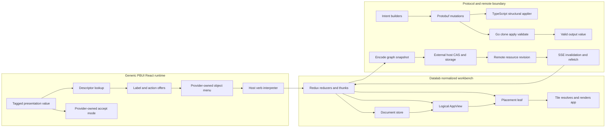

k
# Architecture Garden — PBUI

PBUI combines three systems whose boundaries matter more than their shared vocabulary: a generic React presentation/accept/menu mechanism, Datalab's normalized document/view/placement workbench, and a protobuf graph with Go and TypeScript mutation paths plus a revision-aware remote frontend. Together they demonstrate typed intent with host-owned effects, scope-owned UI runtime, and alias-preserving graph edits. They do **not** implement the complete formal system hypothesized by the generated [[Transcripts/Research/10 - PBUI-MATHS Pattern Zoo Handbook|PBUI-MATHS handbook]].

The central corrective is that generic `PresentationReference` is a tagged embedded value, not a resolver-backed stable reference. Datalab's document, logical `AppView`, placement, React mount, and remote revision identities are separate. Presentation applicability and `AppScope` are UI policy rather than authorization, while authoritative remote compare-and-swap, idempotency, audit, and authorization belong to a host outside this repository.

> [!summary]
> - Descriptor-derived offers become typed verb data, and a host interpreter owns Redux actions, thunks, and effects.
> - Documents, logical views, and placements form a normalized graph whose linked and cloned aliases have tested behavior.
> - Go clone/apply/full-validate gives in-memory value atomicity; shared Go/TypeScript fixtures establish structural-applier parity only.
> - Stable presentation references, mounted-occurrence identity, pending-accept cleanup, registry determinism, and the authoritative remote transaction remain debt or open obligations.

## Snapshot identity and evidence

| Field | Value |
|---|---|
| Repository | `/home/manuel/code/wesen/hyperslop-systems/pbui` |
| Remote | `git@github.com:hyperslop-systems/pbui` |
| Branch | `main` |
| Commit | `c865ea5ed11ee16ed47cf3b35cedea99305aec95` |
| Commit date | `2026-08-02T13:46:01-04:00` |
| Commit subject | `Merge remote-tracking branch 'origin/main'` |
| Worktree | Dirty only because `docs/playbooks/deriving-a-pbui-application.md` is untracked; this study excludes it and describes committed source only. |
| Analysis date | `2026-08-10` |
| Scope | Generic PBUI presentation runtime; Datalab consumer; protobuf schema and generated materializations; Go validator/applier; TypeScript client, codec, Redux, remote controller, tests, package, CI, release, and committed failure history. |
| Non-goals | No PBUI source edits; no audit of the separate Datadrop server; no live browser, deployed API, or authorization test. |

The decisive claims below were checked against runtime code and tests at the pinned commit. Public package manifests and `.github/workflows/ci.yml:1-81` establish the intended Go, protocol-generation, TypeScript, package, Storybook, consumer-smoke, and packing gates. Generated Go and TypeScript are materializations of `proto/hyperslop/pbui/workbench/v1/workbench.proto`, not independent architecture evidence.

## Architecture and runtime path

### System 1 — generic presentation, accept, menu, and verb path

1. A product defines a `Values` map. `PresentationReference` correlates an exact string tag with its embedded value as `{type, value}` (`src/presentation/types.ts:3-14`). It carries no key, authority scope, resolver, revision, or occurrence identity.
2. `createPresentationRegistry` closes over a partial descriptor object and derives label, description, actions, and tone. Missing descriptors receive fallback presentation behavior (`src/presentation/registry.ts:30-79`). Registry lookup is presentation dispatch, not permission checking.
3. `createPbui` creates a private React context. Each `Provider` owns its environment, one pending accept, menu state, and mouse documentation; `perform` closes the menu and delegates verb data to product `onPerform` (`src/presentation/createPbui.tsx:82-188`). Two providers' environments are tested as isolated (`src/presentation/createPbui.test.tsx:34-52`).
4. `Presentation` computes the descriptor label and acceptability, but product code still supplies the rendered child. PBUI wraps it in `span`, `div`, or SVG `g`, adds `data-ptype`, and routes pointer and keyboard gestures (`src/presentation/createPbui.tsx:197-282`). React/DOM lifetime is the only mount lifecycle; there is no semantic occurrence registry.
5. Right-click captures the embedded value in Provider menu state. `ObjectMenu` recomputes actions against the current environment, focuses an enabled item, clamps its geometry, and passes the selected verb to `perform` (`src/presentation/createPbui.tsx:285-379`). The fixed-position/z-index regression in `src/presentation/instanceChrome.test.tsx:108-124` protects the committed playbook's recorded invisible-menu incident (`docs/playbooks/starting-a-new-pbui-family-product.md:4-9`), CSS consequence (`docs/playbooks/starting-a-new-pbui-family-product.md:36-40`), and geometry-testing lesson (`docs/playbooks/starting-a-new-pbui-family-product.md:106-112`).
6. `AcceptRequest` asks for exact type tags plus an optional predicate (`src/presentation/types.ts:50-64`). Direct equality wins; conversions are tried in array order, once each, and the first matching one-hop output wins (`src/presentation/createPbui.tsx:90-105`). Datalab installs only `cat -> field` (`packages/datalab-ui/src/pbui/runtime.tsx:19-32`). This is not a subtype relation, multi-hop translation graph, or coherent path-selection system.
7. Selection or Escape clears the stored resolver before resolving the pending JavaScript Promise, whose resolution is once-only; a competing request resolves that newcomer directly to `null` without replacing the live resolver (`src/presentation/createPbui.tsx:120-155,423-459`). This is not a terminal fence for the separate `onAccept` callback: `settle` invokes it even when no resolver is live, and `abortAccept` can call that path without a pending request (`src/presentation/createPbui.tsx:120-126,157-163`). There is no request identity, deadline, unmount settlement, resolver revalidation, authorization witness, or revision witness.

### System 2 — Datalab document, AppView, placement, render, and store path

1. Datalab registers `AppDescriptor` modules in a process-global map. A descriptor owns component, title, tone, document binding, duplication, and singleton presentation policy (`packages/datalab-ui/src/appkit/registry.ts:25-75`). `WorkbenchProviders` imports applications for registration side effects (`packages/datalab-ui/src/components/pages/Workbench/WorkbenchProviders.tsx:1-9`). Duplicate IDs silently overwrite because `registerApp` calls `Map.set`.
2. Canonical browser state separates documents, logical `AppView` records, and workspace placement leaves. `Tile` resolves `node.viewId -> layout.views -> appFor(view.appId) -> primary document -> Component` (`packages/datalab-ui/src/components/organisms/Tile/Tile.tsx:18-24,65-72,204-228`). The app receives both placement ID and logical view (`packages/datalab-ui/src/appkit/registry.ts:25-30`).
3. One logical view may have multiple placement leaves. Geometry belongs to placement; app choice, title, and named document bindings belong to the view. `Tile` makes its title a PBUI presentation whose `TileRef` embeds resolved placement count, close eligibility, title, app, and document context (`packages/datalab-ui/src/components/organisms/Tile/Tile.tsx:141-178`). That is useful menu context, not stable resolver-backed identity.
4. The actual tile element is separately registered for drag hit testing. Disconnected elements are pruned; pointer cancel, blur, and unmount converge on teardown (`src/chrome/useTileDrag.ts:26-80,92-203`). This module-global geometry registry is not a mounted-presentation occurrence registry.
5. Product descriptors map pure `(value, environment)` computations to action offers, retaining unavailable actions with a disabled reason (`packages/datalab-ui/src/pbui/registry.ts:41-74`; `packages/datalab-ui/src/pbui/verbs.ts:123-147`). `AppScope` intersects instance, stage, and workspace allow-lists for what pickers offer, but deliberately does not stop an already named app from mounting (`packages/datalab-ui/src/appkit/AppScope.tsx:15-24,125-142`). Both mechanisms are presentation policy, not authorization.
6. Datalab's closed `Verb` union represents inspection, document, account, upload, and layout intent (`packages/datalab-ui/src/pbui/verbs.ts:26-103`). `actionsForVerb` plans Redux actions or thunks from current state; ambient `docId: null` is resolved at application time (`packages/datalab-ui/src/store/applyVerb.ts:18-60`). `WorkbenchProviders` reads current world/layout and dispatches every planned result (`packages/datalab-ui/src/components/pages/Workbench/WorkbenchProviders.tsx:27-72`). Reducers and thunks, not action offers, own consequences.
7. This seam does not make all interaction transactional. `commitImport` adds documents and then dispatches a separate layout insertion, so subscribers can observe an intermediate action boundary (`packages/datalab-ui/src/store/effects.ts:245-285`). By contrast, `remoteWorkbenchLoaded` is one cross-slice action, and its test requires one notification with consistent view/document references (`packages/datalab-ui/src/store/remote.ts:21-28`; `packages/datalab-ui/test/remote-load.test.ts:18-106`).
8. The repository explicitly says its signed-out UI gate is not a security boundary; the server is expected to deny unauthorized data access (`packages/datalab-ui/src/components/pages/Workbench/Workbench.tsx:99-106`). No `AppScope`, descriptor, registry, or disabled offer should be cited as authorization evidence.

### System 3 — protobuf, Go/TypeScript graph mutation, and remote revision path

1. Protobuf owns distinct workbench, workspace, node/placement, view, document payload, resource revision, and mutation families (`proto/hyperslop/pbui/workbench/v1/workbench.proto:11-72,89-110,132-207`). A mutation is a closed `oneof`; it has no invocation or retry identity inside the message.
2. TypeScript builders produce ordered mutation lists. For example, swap replaces two placement references, while dock first places the source view beside the target and then closes the old placement (`packages/workbench-protocol/src/client/builders.ts:151-237`). IDs are minted before application.
3. TypeScript `applyMutation` clones for each structural step and throws stable `MutationError` codes; `applyMutations` folds left-to-right (`packages/workbench-protocol/src/client/apply.ts:32-59,338-345`). Its own contract excludes Go's catalog, limits, credential, and host document validation (`packages/workbench-protocol/src/client/apply.ts:1-15`).
4. Go `ApplyMutations` deep-clones once, applies all mutation bodies in order, and validates the complete output graph before returning it (`pkg/workbench/mutation.go:13-38`; `pkg/workbench/clone.go:5-10`). A failed batch leaves the caller's input unchanged (`pkg/workbench/workbench_test.go:414-429`). This is atomicity of an in-memory returned value only—not storage atomicity, serializability, or atomic audit/effect commit.
5. Go `Validate` enforces format/version, size and object limits, unique IDs, bounded tree shape, exact view order, map-key identity, host application membership, singleton and named binding rules, document references, credential-shaped key rejection, and host document validation (`pkg/workbench/validate.go:20-190,193-253`). The package deliberately contains no storage, HTTP, authentication, or UI (`pkg/workbench/model.go:1-5`).
6. Both languages execute one shared fixture corpus. Go explicitly tests the pure structural applier rather than full validation; TypeScript additionally checks input immutability (`pkg/workbench/parity_fixtures_test.go:15-31,55-99`; `packages/workbench-protocol/src/client/applierParity.test.ts:8-17,32-64`). This establishes structural parity, not full semantic, storage, or authorization parity.
7. The Datalab codec strictly decodes protobuf JSON, checks document envelope identity, exact view order, node depth/ratios, bindings, and namespace collisions, then maps to Redux state (`packages/datalab-ui/src/remote/codec.ts:21-113,136-220`). Go remains the broader semantic validator.
8. `useRemoteWorkbench` keeps exact `bigint` revision outside Redux, rejects a wrong workbench identity, defers incoming revisions while saving, and reports rather than overwrites when local state is dirty (`packages/datalab-ui/src/appkit/useRemoteWorkbench.ts:42-148`). It applies `JSON.stringify` to the protobuf JSON mapping as a local graph fingerprint, reuses one UUID while retrying that same fingerprint, sends the expected revision, and advances from a successful response (`packages/datalab-ui/src/remote/codec.ts:136-145`; `packages/datalab-ui/src/appkit/useRemoteWorkbench.ts:163-232,307-365`). No key-sorting or semantic canonical-identity law is established.
9. The HTTP adapter emits `If-Match` and `Idempotency-Key` for replacement and mutation batch (`packages/datalab-ui/src/api/client.ts:413-453`). Comparison, revision advancement, key-to-body binding, durable storage, audit, and authorization are external host obligations and are not established here.
10. SSE reconnects using the current revision in its `after` query parameter, emits newer revision notifications, and is aborted on cleanup (`packages/datalab-ui/src/api/workbenchStream.ts:17-50,58-102`). When clean, the controller refetches the full resource; when dirty or saving it records conflict/deferred state (`packages/datalab-ui/src/appkit/useRemoteWorkbench.ts:245-271`). This is invalidation/refetch—not event replay, a replay suffix, or snapshot-then-live delivery.

### Delivery and failure boundaries

The root, protocol, and Datalab manifests publish separate packages. React is a peer of the root package; Datalab consumes the root and workbench-protocol workspaces (`package.json:1-43`; `packages/datalab-ui/package.json:1-58`). CI freezes the lockfile, checks Go, protobuf compatibility and generated drift, runs protocol/root/Datalab typecheck-test-build gates, builds both Storybooks, runs consumer smokes, and packs artifacts (`.github/workflows/ci.yml:22-81`). Manual publish workflows and package versions are release discipline, not proof of behavior-complete deployment or activation.

The committed menu-geometry regression is concrete historical failure evidence. Other debt below is current code risk or an unproved law, not a claimed production incident.

## Authority and state map

| Object                    | Owner                                        | Identity or freshness                                 | Durable?                       | Must not be confused with                    |
| ------------------------- | -------------------------------------------- | ----------------------------------------------------- | ------------------------------ | -------------------------------------------- |
| Presentation value        | React call site                              | exact type tag plus embedded value                    | Only if a consumer persists it | scoped stable reference                      |
| Mounted `Presentation`    | React                                        | no semantic mount ID; DOM lifetime only               | No                             | placement or `AppView`                       |
| Descriptor-derived offer  | descriptor plus current Provider environment | action `id`; Datalab derives it from type/index/label | No                             | authorization, committed command, or outcome |
| Datalab verb              | host UI intent producer                      | target IDs where present; no general invocation ID    | No                             | performed effect                             |
| Document                  | Redux world or protocol `DocumentPayload`    | document ID plus format/schema version                | In snapshots                   | view or placement                            |
| Logical view              | Redux layout or protocol `AppView`           | view ID                                               | In snapshots                   | React mount or placement                     |
| Placement                 | workspace tree `Node`                        | node/placement ID                                     | In snapshots                   | logical view; many may point to one view     |
| Workbench graph           | Redux/protobuf                               | workbench ID; remote resource revision is separate    | When host persists it          | append-only event history                    |
| Protocol mutation         | generated `Mutation.oneof`                   | no invocation ID; host envelope may carry request ID  | Request-dependent              | committed transition or audit evidence       |
| Remote revision           | frontend controller and host response        | exact `bigint` resource version                       | Host-defined                   | semantic identity or event ordinal           |
| Go application catalog    | host dependency                              | application ID                                        | Host-defined                   | authorization policy                         |
| Structural parity fixture | repository corpus                            | fixture filename and expected graph/error             | Yes                            | full Go validation parity                    |

## Identity discipline

The following substitutions are invalid:

- presentation value ≠ resolver-backed semantic reference;
- document ID ≠ logical view ID;
- logical view ID ≠ placement ID;
- placement ID ≠ React mount generation;
- workbench ID ≠ remote resource revision;
- revision ≠ event ordinal or replay cursor;
- action offer ID ≠ request/idempotency identity;
- generated schema identity ≠ proof of runtime behavior.

This discipline explains the graph renderer: a view can be linked into multiple placement leaves and remounted without changing view identity, while one tile can contain many nested generic presentations that have no individual occurrence identities.

## Candidate common vocabulary

| Proposed term | Project-local name | Invariant | Nearby ecosystem names | Difference retained |
|---|---|---|---|---|
| **Presentation value** | `PresentationReference` | tag and embedded value remain correlated | semantic value, presentation | not necessarily stable or resolver-backed |
| **Logical application view** | `AppView` | owns app choice, title, and named document bindings | shared view | not placement or mount |
| **Placement occurrence** | leaf `Node` | one durable geometric occurrence of a logical view | tile, pane | not one React mount generation or nested presentation occurrence |
| **Named document binding** | `AppView.documents` | maps one app role name to shared document identity | port, binding | string-keyed and catalog-validated, not a typed port API |
| **Descriptor-derived offer** | `PresentationAction`, Datalab `Action` | advisory operation derived from value and environment | action offer | not authorization or outcome |
| **Intent value** | Datalab `Verb`, protocol `Mutation` | data naming a requested consequence | command, tool call | local TS union and wire protobuf have different boundaries |
| **Effect interpreter** | `actionsForVerb` plus dispatch | maps intent to host-owned reducers, thunks, or capabilities | action runtime, tool executor | Redux dispatch does not imply remote authority |
| **Graph snapshot** | `WorkbenchDocument` | complete normalized graph at a resource revision | snapshot, document | not an event-prefix cut or immutable release |
| **Revision fence** | revision plus `If-Match` | intended stale-write rejection at host commit | CAS version | not identity or cursor |
| **Structural applier parity** | shared Go/TS fixtures | same structural mutation gives the same graph/error code | codec parity | excludes full validation and storage |

> [!important] Vocabulary discipline
> “Reference,” “occurrence,” “scope,” “command,” “transaction,” and “revision” retain the narrower concrete meanings above. Registry membership and presentation policy never imply authority.

## Mathematical and computer-science foundations

### 1. Normalized graph and placement multiplicity

Let $D$ be the set of document IDs, $V$ the set of logical view IDs, $P$ the set of placement IDs, $A$ the set of application IDs, and $B$ the set of binding names. Let $\mathrm{Payload}$ be the set of document payload values. A valid workbench contains partial maps:

$$
\mathrm{document}:D\rightharpoonup\mathrm{Payload}
$$

$$
\mathrm{view}:V\rightharpoonup\left(A\times(B\rightharpoonup D)\right)
$$

and a placement relation:

$$
\mathrm{places}\subseteq P\times V.
$$

Validation requires every referenced view and document to resolve (`pkg/workbench/validate.go:143-156,220-227`). The relation is many-to-one: linked duplication adds a fresh $p\in P$ paired with an existing $v\in V$; independent view duplication adds a fresh $v'\in V$ whose binding map initially equals that of $v$. Both behaviors and input preservation are tested (`pkg/workbench/workbench_test.go:310-349`).

**Operational consequence:** geometry can change without copying application state, and linked placements observe the same view/document state.

**Limit:** a durable placement is not a mounted generic PBUI occurrence; remount generations are absent.

### 2. Scope intersection is monotone presentation policy

Let $U$ be the set of registered application IDs. Let $I\subseteq U$, $S\subseteq U$, and $Q\subseteq U$ be instance, stage, and workspace allow-sets respectively; an absent constraint denotes $U$. The offered set is:

$$
\mathrm{Offered}(I,S,Q)=I\cap S\cap Q.
$$

For any $X,Y,Z\subseteq U$:

$$
X\subseteq Y\Longrightarrow X\cap Z\subseteq Y\cap Z.
$$

`useAvailableApps` implements this filter while preserving registration order (`packages/datalab-ui/src/appkit/AppScope.tsx:125-142`).

**Operational consequence:** adding a narrower inner constraint cannot re-offer an app excluded by an outer constraint.

**Limit:** this is picker/render policy. It neither prevents a named app from mounting nor establishes authorization.

### 3. Ordered clone/apply/validate as a partial transition

Let $\mathcal S$ be the set of workbench graph values accepted by Go `Validate`, let $\mathcal M$ be the set of generated mutation values, and let $\mathcal M^*$ be the set of finite ordered mutation sequences. Go implements the partial function:

$$
\mathrm{Apply}:\mathcal S\times\mathcal M^*\rightharpoonup\mathcal S.
$$

For input $s\in\mathcal S$ and sequence $m\in\mathcal M^*$, either `Apply` returns a validated clone $s'\in\mathcal S$, or it returns an error while the caller's $s$ remains unchanged (`pkg/workbench/mutation.go:13-38`; `pkg/workbench/workbench_test.go:414-429`). Mutation order matters; no commutativity law is claimed.

**Operational consequence:** a graph edit does not return a partially changed caller-owned value.

**Limit:** this establishes neither a database linearization point nor atomicity with audit, authorization, or external effects.

### 4. Alias-preserving view clone

Using the sets $V$, $B$, and $D$ defined above, let:

$$
\mathrm{bind}:V\times B\rightharpoonup D
$$

be the document-binding lookup. For a `ViewClone` from $v\in V$ to fresh $v'\in V$, the implementation preserves every existing binding $b\in B$:

$$
\mathrm{bind}(v',b)=\mathrm{bind}(v,b)
$$

whenever $\mathrm{bind}(v,b)$ is defined (`pkg/workbench/mutation.go:161-184`). Linked placement instead preserves $v$ itself.

**Operational consequence:** “linked placement” and “independent view sharing documents” are distinct, testable alias contracts.

**Limit:** there is no general deep-copy/fork/snapshot algebra for every state layer.

### 5. Revision-fenced replacement is an open host law

Let $G$ be the set of complete workbench graph snapshots, $K$ the set of request IDs, and $R=\{0,1,2,\ldots\}$ the set of resource revisions. Let $S=G\times R$ be the set of replacement request signatures, pairing the protobuf-JSON graph body with the separately transmitted expected revision. Model an idempotency record as the accepted request signature and saved output associated with a key:

$$
\mathcal I=K\rightharpoonup_{\mathrm{fin}}\bigl(S\times(G\times R)\bigr),
$$

where $\rightharpoonup_{\mathrm{fin}}$ denotes a finite partial map. Define authoritative host states, replacement requests, and successful outputs as

$$
H=G\times R\times\mathcal I,
\qquad
Q=G\times R\times K,
\qquad
U=G\times R.
$$

A request $q=(g',e,k)\in Q$ contains the desired graph, expected revision, and request ID. The intended successful host behavior is a partial state-transition relation

$$
\mathrm{Replace}\subseteq (H\times Q)\times(H\times U).
$$

For a fresh key $k\notin\operatorname{dom}(i)$ and host state $h=(g,r,i)\in H$, success should require $e=r$, choose $r'>r$, return $u=(g',r')\in U$, and produce

$$
h'=\bigl(g',r',i[k\mapsto((g',e),u)]\bigr)\in H.
$$

For an exact retry whose record is $i(k)=((g',e),u)$, the intended relation may instead replay $u$ with unchanged host state $h$, even after the current revision has advanced. A conflict, rejection, failure, or same-key/different-request-signature request has no successful pair in this relation. These are intended CAS/idempotency laws, not audited host behavior. The browser computes a local fingerprint by applying `JSON.stringify` to the protobuf JSON mapping and reuses the same $k\in K$ while retrying that fingerprint (`packages/datalab-ui/src/remote/codec.ts:136-145`; `packages/datalab-ui/src/appkit/useRemoteWorkbench.ts:170-232,363-365`; `packages/datalab-ui/src/api/client.ts:413-430`).

**Operational consequence:** the request's success or conflict depends on authoritative host state—including its current revision and idempotency records—not on the request triple alone. The browser does not knowingly overwrite a newer resource and does not mint a new retry identity for the same local fingerprint.

**Limit:** PBUI supplies the desired graph, expected revision, request ID, and a local fingerprint convention, but does not contain the server linearization point, key-to-body binding, idempotency transition, revision increment, authorization, audit, or storage transaction. `JSON.stringify` is not canonical semantic identity, and even an increment of exactly one is not proved here.

## Correlation with the Pattern Zoos

The generated [[Transcripts/Research/10 - PBUI-MATHS Pattern Zoo Handbook|PBUI-MATHS Pattern Zoo Handbook]] is a hypothesis source, not implementation evidence. Every grade below is based on the pinned committed repository and uses exactly one controlled comparison grade.

| # | Handbook hypothesis | Grade | Repository evidence and retained boundary |
|---:|---|---|---|
| 1 | [[Transcripts/Research/10 - PBUI-MATHS Pattern Zoo Handbook#Pattern 1 — Semantic Reference|Semantic Reference]] | **Negative** | Generic `PresentationReference` embeds a value and has no scope, key, resolver, or revision (`src/presentation/types.ts:3-14`). Workbench IDs are useful but do not repair that generic contract. |
| 2 | [[Transcripts/Research/10 - PBUI-MATHS Pattern Zoo Handbook#Pattern 2 — Semantic Occurrence|Semantic Occurrence]] | **Partial** | Placement IDs identify durable geometric occurrences of views, but mounted presentations have no occurrence ID, generation fence, or lifecycle record. |
| 3 | [[Transcripts/Research/10 - PBUI-MATHS Pattern Zoo Handbook#Pattern 3 — Runtime Semantic Type|Runtime Semantic Type]] | **Partial** | String tags select descriptors and exact accept compatibility; there is no namespace law, subtype preorder, capability relation, or refinement evidence. |
| 4 | [[Transcripts/Research/10 - PBUI-MATHS Pattern Zoo Handbook#Pattern 4 — Typed Input Context|Typed Input Context]] | **Partial** | Provider supplies typed promise-based acquisition and Escape cancellation, but lacks session/owner identity, unmount settlement, cardinality beyond one, revision, and authority revalidation. |
| 5 | [[Transcripts/Research/10 - PBUI-MATHS Pattern Zoo Handbook#Pattern 5 — Command as Data|Command as Data]] | **Strong** | Datalab descriptors emit a closed verb union interpreted by host planners/dispatch; protobuf supplies a second typed mutation language. Offers remain non-authoritative, and generic verbs need not be runtime-codec checked. |
| 6 | [[Transcripts/Research/10 - PBUI-MATHS Pattern Zoo Handbook#Pattern 6 — Explicit Translation|Explicit Translation]] | **Partial** | `cat -> field` is explicit, but conversion is an anonymous ordered one-hop callback with no edge ID, provenance, ambiguity policy, graph search, or coherence test. |
| 7 | [[Transcripts/Research/10 - PBUI-MATHS Pattern Zoo Handbook#Pattern 7 — Contextual Applicability and Dispatch|Contextual Applicability and Dispatch]] | **Partial** | Descriptors derive offers from current value/environment and AppScope intersects offer sets; neither is authoritative permission or specificity-based multimethod dispatch. |
| 8 | [[Transcripts/Research/10 - PBUI-MATHS Pattern Zoo Handbook#Pattern 8 — Serializable Semantic Contract|Serializable Semantic Contract]] | **Strong** | The workbench boundary has versioned protobuf, generated Go/TS, strict decoding, limits, protobuf JSON mapping, parity fixtures, and drift gates. The frontend's `JSON.stringify` fingerprint is local rather than canonical identity; React descriptors and generic verbs remain local, and schema generation does not prove behavior. |
| 9 | [[Transcripts/Research/10 - PBUI-MATHS Pattern Zoo Handbook#Pattern 9 — Registry and Module Boundary|Registry and Module Boundary]] | **Negative** | Extension works, but the process-global app map silently overwrites duplicates and has no freeze, version, dependency, or typed conflict phase (`packages/datalab-ui/src/appkit/registry.ts:72-83`). |
| 10 | [[Transcripts/Research/10 - PBUI-MATHS Pattern Zoo Handbook#Pattern 10 — Scoped Runtime and Context|Scoped Runtime and Context]] | **Strong** | Provider and Redux store instances isolate environment/state, with direct tests (`src/presentation/createPbui.test.tsx:34-52`; `packages/datalab-ui/test/instances.test.ts:116-176`). Drag, Escape, and app registration retain deliberate global boundaries; scope is not tenant policy. |
| 11 | [[Transcripts/Research/10 - PBUI-MATHS Pattern Zoo Handbook#Pattern 11 — Authoritative State, Resolver, and Revision|Authoritative State, Resolver, and Revision]] | **Partial** | Redux resolves normalized current state and the remote controller fences revisions, but generic values stay captured and authoritative CAS/storage/authorization live outside the repository. |
| 12 | [[Transcripts/Research/10 - PBUI-MATHS Pattern Zoo Handbook#Pattern 12 — Typed Port and Shared Binding|Typed Port and Shared Binding]] | **Partial** | `AppView.documents` gives explicit named shared bindings coordinated through Redux. Names are strings and host catalog data; no typed port topology, unlink history, or reconciliation protocol exists. |
| 13 | [[Transcripts/Research/10 - PBUI-MATHS Pattern Zoo Handbook#Pattern 13 — Graph-Aware Copy and Persistence|Graph-Aware Copy and Persistence]] | **Strong** | Separate document/view/placement nodes, linked versus cloned view behavior, clone-before-batch, close laws, codec round trips, and shared structural fixtures preserve intended aliases. External references and migration remain host concerns. |
| 14 | [[Transcripts/Research/10 - PBUI-MATHS Pattern Zoo Handbook#Pattern 14 — Transactional Interaction and Evidence|Transactional Interaction and Evidence]] | **Partial** | Go batches atomically return a valid in-memory value or error, and browser replacement carries expected revision/request ID. There is no end-to-end invocation/evidence/outcome record or local authoritative storage/audit/auth transaction. |

The table deliberately does not turn placement into mounted occurrence, conversion into a translation category, SSE into replay, presentation scope into authorization, or frontend headers into server transaction proof.

## Cross-project comparison

| Project | Correspondence | Grade and important difference |
|---|---|---|
| [[Research/Software Architecture Garden/rag-evaluation-system/04 - Serializable Actions and Host Owned Effects#Action flow|rag-evaluation Widget actions]] | Serializable intent crosses a boundary and a trusted host owns effects. | **Strong** for intent/effect separation; Widget IR crosses Goja/server/browser, while Datalab descriptors are trusted browser functions and only the workbench protobuf is a wire contract. |
| [[Research/Software Architecture Garden/rag-evaluation-system/03 - React Components Adapters and Rendering|rag-evaluation React adapters]] | Registry/adapter code selects presentation behavior while presentational components remain separate. | **Partial**; PBUI wraps product-rendered children rather than recursively rendering server-driven Widget IR. |
| [[Research/Software Architecture Garden/go-go-datadrop/02 - The Presentation Protocol#4. Why it works|go-go-datadrop presentation protocol]] | Typed visible values, descriptor actions, verb data, and one reducer seam share direct lineage. | **Strong** migration continuity, but not independent confirmation because PBUI contains the extracted/evolved descendant. |
| [[Research/Software Architecture Garden/go-go-datadrop/03 - The Store as an Instance Boundary#4. Why it works|go-go-datadrop store boundary]] | Factory-created stores and explicit persistence keys isolate instances. | **Strong** lineage, not independent evidence; PBUI adds Provider isolation and retains named page-global mechanisms. |
| [[Research/Software Architecture Garden/geppetto/README#Architecture and runtime path|Geppetto]] | Typed intent is interpreted by a host effect owner. | **Partial**; model-generated tool calls have execution occurrence IDs and retry concerns, whereas PBUI verbs are UI affordances mapped to Redux/thunks. |
| [[Research/Software Architecture Garden/go-go-goja/README#Architecture and runtime path|Go-Go-Goja]] | Runtime/context scope and registries separate selection from use. | **Partial**; Go-Go-Goja freezes a duplicate-rejecting provider graph and has one VM owner, while PBUI's app registry is mutable/global and React has no foreign-runtime scheduler. Neither scope implies tenant authorization. |
| [[Research/Software Architecture Garden/sessionstream/README#The architecture in one diagram|Sessionstream]] | Typed commands and explicit schema/revision coordinates clarify authority. | **Non-equivalent** for streaming: Sessionstream appends canonical events and delivers snapshot-before-live suffixes; PBUI stores mutable full graphs and uses revision invalidation/refetch. A Sessionstream UI event is not a PBUI mount occurrence. |

## Pattern maturity assessment

| Pattern or finding | Maturity | Evidence or limitation |
|---|---|---|
| Descriptor offer -> verb data -> host interpreter | Established | Generic and Datalab runtime paths plus menu/dispatch tests agree. |
| Provider and store instance ownership | Established | Provider isolation and independent store/persistence tests protect it. |
| Document / logical view / placement identity separation | Established | Schema, Tile renderer, builders, Go tests, and codec round trip agree. |
| Clone-before-batch full-graph validation | Established | Go implementation and failed-batch input-preservation test agree. |
| Cross-language structural mutation parity | Established | Shared corpus is asserted in Go and TypeScript and explicitly excludes full validation. |
| Workbench protobuf contract | Established | Versioned schema, strict codecs, generated drift checks, and package gates agree. |
| Typed accept acquisition | Emergent | Useful one-request state machine lacks IDs, unmount cleanup, and final revalidation. |
| Revision-aware remote controller | Emergent | Frontend race handling is substantial but not directly covered by a complete hook race matrix. |
| Named shared document binding | Established | `AppView.documents` is consumed by tile/app binding and enforced by graph validation; clone tests preserve the named aliases (`packages/datalab-ui/src/components/organisms/Tile/Tile.tsx:141-178`; `pkg/workbench/validate.go:143-156,220-227`; `pkg/workbench/workbench_test.go:310-349`). String names still do not establish typed-port compatibility. |
| Graph-aware normalized copy | Established | Document/view/placement identity, linked placement, alias-preserving view clone, clone-before-batch, and input-preservation tests agree locally (`pkg/workbench/mutation.go:13-38,161-184`; `pkg/workbench/workbench_test.go:310-349,414-429`). No independent interactive-graph comparison is claimed. |
| Generic resolver-backed reference/occurrence claim | Architecture debt | Captured values have no stable resolver/revision and mounts have no occurrence identity. |
| Mutable global app registry | Architecture debt | Duplicate IDs silently overwrite and the registry never freezes. |
| Action IDs beyond local React-key use | Emergent | IDs derive from presentation type, array index, and display label and are consumed here as React keys (`packages/datalab-ui/src/pbui/registry.ts:59-73`; `src/presentation/createPbui.tsx:359-368`). They would be unstable if promoted to persistent API identity, but no such consumer or concrete cost is established. |
| Pending accept settles on Provider unmount | Open correctness obligation | No cleanup settles the stored resolver when Provider unmounts. |
| Frontend/server semantic parity | Open correctness obligation | TypeScript intentionally omits host catalog, document, credential, and limit validation. |
| Authoritative remote CAS/idempotency/audit/authorization | Open correctness obligation | Headers and frontend policy exist; the committing host is outside this repository. |
| End-to-end transactional interaction evidence | Open correctness obligation | In-memory graph atomicity does not unify UI acquisition, effects, storage, audit, and outcomes. |

## Architecture debt and open laws

### Captured presentation freshness

**Required law:** if an effect depends on current entity state, the host must resolve and revalidate that state at execution rather than trust a stale captured presentation value.

**Current evidence:** menu actions are recomputed against the current environment but from the captured `{type,value}` (`src/presentation/createPbui.tsx:318-320`).

**Gap:** PBUI does not define resolver-backed identity or observed revision. Preserve the current value-presentation semantics unless a separately named stable reference is introduced.

**Likely validation:** a menu-open/state-change/execute test with a host resolver and explicit stale outcome.

### Mounted occurrence lifecycle

**Required law:** an API that claims exact mounted occurrence identity needs a mount-owned ID and generation, registered only after commit and removed on cleanup.

**Current evidence:** React mounts wrappers and the drag system registers tile DOM geometry, but neither records generic presentation occurrences.

**Gap:** placement cannot safely substitute for mount identity because a placement can remount and contain many presentations.

**Likely validation:** StrictMode/remount tests proving generation fencing and cleanup.

### Accept cancellation and supersession

**Required law:** an acquisition API exposing both a Promise and `onAccept` must terminally fence both channels, and a live pending Promise must settle on selection, abort, supersession policy, or Provider unmount.

**Current evidence:** `settle` clears the stored resolver before resolving it, so the pending JavaScript Promise resolves once; a competing newcomer resolves directly to `null` and does not replace or resolve the older pending request (`src/presentation/createPbui.tsx:120-138,148-155,423-440`).

**Gap:** Provider unmount has no Promise settlement cleanup. Separately, `settle` invokes `onAccept` even when `pending.current` is already null, and `abortAccept` calls `settle(null)` without checking for a live pending request, so `onAccept` is not terminally fenced (`src/presentation/createPbui.tsx:120-126,157-163`).

**Likely validation:** unmount and concurrent-request tests that separately assert Promise outcomes and callback cardinality.

### Applicability must not masquerade as authority

**Required law:** every durable or externally effectful host rechecks current identity, authorization, and preconditions at its authoritative commit boundary.

**Current evidence:** descriptor disabled states and AppScope improve offers; PBUI contains no authoritative remote commit.

**Gap:** no repository-local proof covers host authorization domination, CAS, idempotency body binding, audit, and revision advancement.

**Likely validation:** pin and audit the host service transaction independently, including adapter-bypass and same-key/different-body negative tests.

### Registry determinism

**Required law:** application IDs are unique and the runtime catalog is immutable after construction.

**Current evidence:** registration is one process-global `Map.set` (`packages/datalab-ui/src/appkit/registry.ts:72-83`).

**Gap:** duplicate diagnostics, build/freeze phase, version compatibility, and dependency checks are absent.

**Likely validation:** duplicate-rejection and post-build-mutation tests; add manifests only when real module dependencies require them.

### Client/server validation and remote races

**Required law:** optimistic client state must either satisfy the server's overlapping validation profile or expose server rejection as a normal typed outcome; callbacks from old workbench epochs must not publish into a new epoch.

**Current evidence:** TypeScript declares itself structurally weaker, and `activeWorkbenchId` fences old save callbacks (`packages/datalab-ui/src/appkit/useRemoteWorkbench.ts:63-85,193-231`).

**Gap:** direct hook tests are absent for stale query/save completion after switch, deferred revisions, same-fingerprint retry UUID, and dirty SSE arrival.

**Likely validation:** hook-level fake transport tests plus generated overlap fixtures for the client-safe subset.

### Multi-dispatch import visibility

**Required law:** if subscribers require graph consistency after every notification, documents and layout bindings must change in one root action.

**Current evidence:** remote load uses one action and one consistent notification; import dispatches documents before layout.

**Gap:** imports can expose an intermediate unbound document set.

**Likely validation:** either consolidate import under one root action or document/test the permissible intermediate observation.

## Implications for composable APIs

1. Keep the lightweight tagged value API honest—prefer the conceptual name `PresentationValue`. Add a distinct branded `{scope, type, key, observedRevision}` form only when a real resolver-backed use case exists.
2. Keep `DocumentID`, `ViewID`, `PlacementID`, `MountOccurrenceID`, `WorkbenchID`, `Revision`, and `RequestID` distinct in TypeScript even though protobuf uses strings and `uint64`.
3. Give descriptor actions stable author-supplied IDs if identity survives beyond a React key. Return an explicit success/rejected/cancelled/failed outcome from host execution rather than ignoring its optional asynchronous return value.
4. Keep conversion documented as ordered one-hop behavior until a second real conversion justifies named edges, ambiguity policy, bounded search, and provenance.
5. Prefer explicit graph operations such as `linkView`, `cloneViewSharingDocuments`, `forkDocuments`, and `movePlacement`; a generic “duplicate” hides alias policy.
6. Expose remote replacement as explicit saved/conflict/rejected/failed outcomes. Bind one request ID to one exact accepted request signature—including the graph body and separately transmitted expected revision—in the authoritative host; do not treat the frontend's `JSON.stringify` fingerprint as canonical identity.
7. Keep the TypeScript structural applier explicitly weaker than Go `Validate`, or generate a client-safe validation profile and parity tests for precisely the overlapping law.
8. Name recovery honestly: PBUI has `refetchOnRevision`, not `replayFrom` or `snapshotThenLive`.

## Candidate ecosystem patterns

**Typed intent with a host-owned interpreter** is the supported candidate: presentation code offers data; only the host interpreter owns reducers, effects, policy revalidation, and outcomes. Independent support exists in [[Research/Software Architecture Garden/rag-evaluation-system/04 - Serializable Actions and Host Owned Effects#Action flow|rag-evaluation-system]] and [[Research/Software Architecture Garden/geppetto/README#Architecture and runtime path|Geppetto]], while object and transport differences remain explicit.

**Alias-explicit normalized workbench graph** is **Established** locally, not a candidate ecosystem pattern: documents, logical views, and placements have distinct IDs, and each copy/link operation states which identities and bindings it preserves. No independent interactive graph with the same alias and failure laws is named, so similar tree representations do not promote it.

## Validation evidence

Validation ran from the pinned PBUI root on `2026-08-10` using Node `v22.22.1`, pnpm `10.15.1`, and the installed Go toolchain.

| Gate | Exact result |
|---|---|
| `GOWORK=off go test ./pkg/workbench ./pkg/workbenchapi -count=1` | Passed: both packages. |
| Focused root Vitest over presentation registry, Provider/menu, menu chrome, surfaces, and chrome | Passed: 5 files, 33 tests. |
| `pnpm --filter @hyperslop-systems/workbench-protocol test` | Passed: 3 files, 44 tests. |
| Focused Datalab Vitest selection | Dependency-incomplete invocation: 1 file/6 tests passed, 7 suites could not load workspace dependencies. This is not evidence of behavioral test failure. |
| `make ci-check` | Passed. |
| `make protocol-check` | Passed; generated Go/TS remained unchanged. |
| Protocol TypeScript build | Passed. |
| Root typecheck, full test, build, Storybook build, and consumer smoke | All passed. Root full test passed 8 files/53 tests. |
| Datalab typecheck, full test, lint, build, Storybook, and consumer smoke | Could not complete because full `pnpm install --frozen-lockfile` received HTTP 403 for private `@hyperslop-systems/plot@0.2.0`; partial install omitted required workspace/package links. Datalab test still ran 24 files/234 tests before 20 suites failed to load missing packages. Storybook/build failures were unresolved imports, and lint could not find Biome—not established product regressions. |
| Lockfile/worktree safety | Filtered root/protocol install used the frozen lockfile; no tracked PBUI file changed. |

The Garden validator and repository-local Markdown/source/controlled-vocabulary/math/fence checks are recorded after the entry itself. No live browser geometry, two-tab CAS, deployed API, or authorization probe was run.

## Recommended next investigations

1. Pin and audit the external host's CAS/idempotency/authorization/audit transaction before strengthening any remote guarantee.
2. Add direct remote-hook race tests and pending-accept unmount settlement tests.
3. Decide whether generic PBUI remains deliberately value-based or gains a separate resolver-backed reference and mounted-occurrence API.
4. Replace mutable app registration with duplicate-rejecting construction/freeze if dynamic registration is not required.
5. Re-run the full Datalab gates with authorized access to `@hyperslop-systems/plot`, then perform browser geometry and two-tab conflict probes.

## Related studies

- [[Research/Software Architecture Garden/README|Software Architecture Garden]]
- [[Transcripts/Research/10 - PBUI-MATHS Pattern Zoo Handbook|PBUI-MATHS Pattern Zoo Handbook]] — hypothesis source, not repository evidence
- [[Research/Software Architecture Garden/rag-evaluation-system/04 - Serializable Actions and Host Owned Effects|rag-evaluation-system — Serializable Actions and Host-Owned Effects]]
- [[Research/Software Architecture Garden/rag-evaluation-system/03 - React Components Adapters and Rendering|rag-evaluation-system — React Components, Adapters, and Rendering]]
- [[Research/Software Architecture Garden/go-go-datadrop/02 - The Presentation Protocol|go-go-datadrop — Presentation Protocol]] — direct lineage, not independent confirmation
- [[Research/Software Architecture Garden/go-go-datadrop/03 - The Store as an Instance Boundary|go-go-datadrop — Store as Instance Boundary]] — direct lineage, not independent confirmation
- [[Research/Software Architecture Garden/geppetto/README|Geppetto]]
- [[Research/Software Architecture Garden/go-go-goja/README|Go-Go-Goja]]
- [[Research/Software Architecture Garden/sessionstream/README|Sessionstream]]
