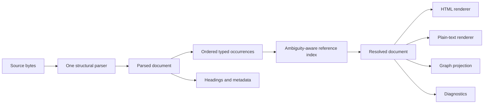
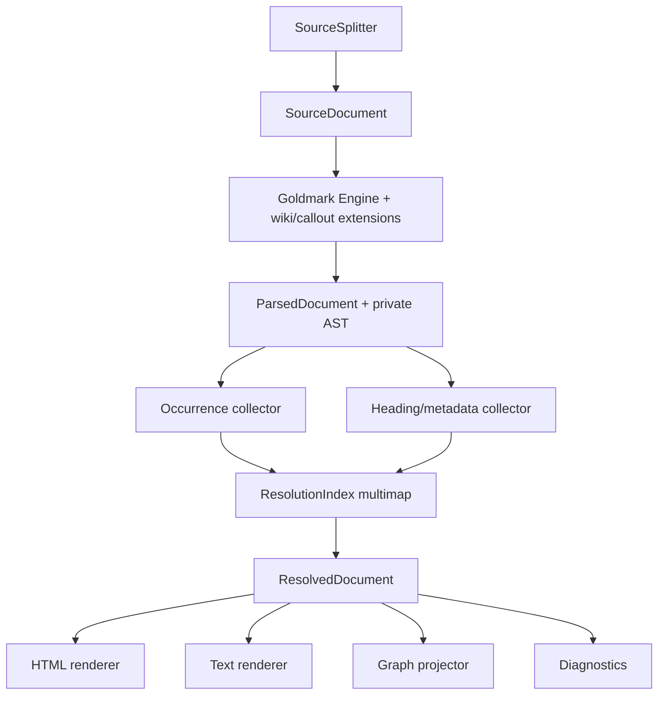

# Parser-Owned Structure and Typed Reference Resolution

A source-processing system becomes fragile when several passes independently decide what the source means, discard authored occurrences early, and transport unresolved state through rendered output. `publish-vault` demonstrates all three failure modes in a compact Markdown/wiki-link pipeline. It also provides the evidence for a stronger candidate pattern: let one parser own structural context, preserve typed occurrences until consumers project them, represent ambiguity explicitly, and render only after resolution.

> [!summary]
> - **Structural law:** every source transform must consume one parser-owned classification of literal and active regions; protected regions remain byte-identical under transforms that do not own them.
> - **Occurrence law:** parsing preserves every authored occurrence with its kind and source span; graph edges are a later projection with their own deduplication rule.
> - **Resolution law:** a reference key maps to a candidate set. Zero candidates is unresolved, one is resolved, and more than one is ambiguous; insertion order is never identity.
> - **Rendering law:** parse, then resolve typed references, then render once. Rendered HTML is output, not an internal state transport or a structure to parse back with regular expressions.

## Why this note exists

PR #20 fixed wiki links inside code spans and fenced blocks. The visible defect was escaped anchor markup inside code samples. The less visible defect was graph corruption: `[[Target]]` in a fenced example entered `ParsedNote.WikiLinks`, so `Target` received a backlink from a note that never linked to it.

Review then found two more disagreements. A backtick inside valid YAML frontmatter could pair with a body backtick for extraction but not rendering, silently dropping a rendered body link from the graph. Escaped backticks opened code spans in the wiki-link scanner even though the math scanner already consumed them as literals.

PV-MARKDOWN-023 expanded the investigation across the parser, vault resolver, tests, and TypeScript static renderer. Its edge probe established further facts:

- valid four-dash goldmark frontmatter is mutated because parse-time masking uses a narrower splitter;
- `[[Note#One]]` and `[[Note#Two]]` render twice but collapse to one structured link;
- `[[Note]]` and `![[Note]]` render as different constructs but collapse to one structured link;
- a global HTML resolution pass rewrites unrelated authored `data-target` attributes and ordinary `/note/...` anchors;
- ambiguous suffixes are inserted into a first-wins single-value index while iterating a Go map;
- static HTML rendering uses a marked extension, while static graph extraction still uses a raw regex.

These are not six unrelated regex bugs. They are violations of four reusable laws.

## Pattern statement

**Parser-Owned Structure and Typed Reference Resolution** applies when a document language is extended with application references that require external state to resolve.

The parser owns source context and emits typed occurrences. A resolver interprets occurrences against an explicit index and returns resolved, unresolved, or ambiguous states. Renderers and graph projectors consume that typed state independently. No stage reconstructs parser context from bytes after another parser has already established it, and no stage recovers domain state from rendered HTML.



The pattern does not require one output renderer or one storage engine. It requires one structural interpretation and typed boundaries between interpretation, resolution, and projection.

## Law 1: parser-owned structural context

Let source positions be partitioned by one parser-owned context function:

$$
C : \{0,\ldots,|S|-1\} \to \{\text{prose},\text{code},\text{frontmatter},\text{math},\text{raw HTML},\ldots\}.
$$

For transform $T_f$ that owns feature $f$, positions protected from $f$ must remain unchanged:

$$
C(i) \in P_f \implies T_f(S)[i] = S[i]
$$

modulo an explicit source map when earlier transformations change offsets.

The important requirement is not that two handwritten scanners are each correct. It is that they cannot disagree because they consume the same structural classification.

### Concrete evidence

The math pass and wiki-link pass both needed to skip code. `internal/parser/math.go` already encoded fence lengths, blank-line termination, three-space indentation, and backslash escaping. PR #20 reused those scanners in `codeRegions`, which is stronger than reimplementing them. Review still found disagreement in the loops around the shared scanners: frontmatter was split in one path but not the other, and backslash escapes were consumed in one loop but not the other.

The target architecture uses goldmark's `parser.InlineParser` and custom AST nodes. Goldmark then decides whether the current position is inline prose, code, a fence, or another block. The wiki-link extension receives only contexts in which inline parsing is legal.

### Negative space

- Sharing a regular expression is not sharing structural context.
- A pre-pass that guesses code boundaries is not equivalent to the Markdown parser that owns them.
- Correct HTML output does not prove graph extraction used the same context.
- Frontmatter is metadata context even when it contains Markdown-looking bytes.

## Law 2: preserve occurrences; derive edges

An authored link occurrence has more identity than its target:

```go
type LinkOccurrence struct {
    Span    SourceSpan
    Kind    LinkKind       // link, note embed, image embed
    Ref     LinkRef        // path, heading, block
    Alias   string
    Raw     string
    Context LinkContext
}
```

For an ordered occurrence sequence $O=[o_1,\ldots,o_n]$, graph projection is a later function:

$$
E = \operatorname{unique}\{(source,\operatorname{resolve}(o.Ref)) \mid o \in O,\ o\text{ contributes an edge}\}.
$$

The equivalence relation for graph edges is not the equivalence relation for occurrences. Two headings may become one backlink edge while remaining two API occurrences. A link and an embed may share a target while requiring different rendering and lifecycle behavior.

### Concrete evidence

`extractWikiLinks` currently deduplicates with:

```go
key := target + "|" + alias
```

Heading and `IsEmbed` are absent. The probe shows HTML retaining both constructs while `WikiLinks` retains only the first. The parser has performed graph projection before it knows which consumer is asking.

### Applicability

Use occurrence preservation when one parse feeds several products: rendering, graphs, diagnostics, audits, refactoring tools, or navigation. It is unnecessary when the only contract is set membership and source position/kind can never matter.

### Negative space

- A content hash is not occurrence identity.
- A unique target set is not a source link list.
- A backlink is not proof of how many references were authored.
- Deduplication is a projection policy, not parser cleanup.

## Law 3: ambiguity is a resolution result

Reference resolution maps a normalized key to a candidate set:

$$
R(k)=
\begin{cases}
\text{Unresolved} & |C(k)|=0\\
\text{Resolved}(c) & C(k)=\{c\}\\
\text{Ambiguous}(C(k)) & |C(k)|>1.
\end{cases}
$$

A single-value `map[key]candidate` cannot represent this function. It must discard candidates or hide them behind an insertion-order policy.

### Concrete evidence

`buildWikiLinkIndex` iterates `v.notes`, a Go map, and keeps the first note for each suffix/title key. Go map iteration is intentionally unstable. The README describes first registration as deterministic, but the implementation has no stable registration order.

A robust index is a multimap with ranked match classes:

```text
register exact path
register path suffixes
register basename
register title alias
sort candidates by canonical path

resolve(key):
  choose the best rank
  zero  -> unresolved
  one   -> resolved
  many  -> ambiguous + candidates
```

Compatibility mode may choose a lexicographic candidate, but that policy must be named and must emit a diagnostic. The candidate pattern's default is to preserve ambiguity because a visible unresolved reference is safer than a silent wrong-note link.

### Related Garden evidence

This law also appears in devctl's dynamic command resolution: provider qualification resolves an ambiguous namespace explicitly rather than choosing by discovery order. Upwork Tracker rejects ambiguous receipt binding instead of guessing. Those mechanisms differ, but the invariant is the same: discovery order is not identity.

### Negative space

- Deterministic wrong selection is still ambiguity suppression.
- Sorting candidates does not make the first candidate correct.
- A convenient short name is not globally unique identity.
- A resolver warning after rendering does not repair a wrong graph edge already projected.

## Law 4: resolve typed state before rendering

The intended composition is:

$$
\operatorname{HTML} = \operatorname{Render}(\operatorname{Resolve}(\operatorname{Parse}(S), I)).
$$

The current pipeline often approximates:

$$
\operatorname{HTML} = T_n(\cdots T_2(T_1(\operatorname{Render}(\operatorname{Rewrite}(S))))),
$$

where `Rewrite` injects placeholder HTML and each $T_i$ recovers one field with a regex. Attributes such as `data-target`, `data-heading`, `data-raw`, and `data-alias` form an undocumented internal protocol whose validity depends on exact tag and attribute order.

### Concrete evidence

`ReplaceWikiLinksString` matches every `data-target` and `/note/` href in the document. Other passes require exact generated attribute order. `BuildHeadingIndex` parses rendered heading tags after the goldmark AST has been discarded. The edge probe proves that unrelated authored HTML is rewritten.

The typed model resolves `LinkOccurrence` into `ResolvedLink` before HTML exists:

```go
type ResolvedLink struct {
    Occurrence LinkOccurrence
    State      ResolutionState
    NoteSlug   string
    HeadingID  string
    Candidates []string
}
```

The HTML renderer escapes and emits that state once. A plain-text renderer and graph projector consume the same resolved document without parsing HTML.

### Negative space

- HTML is not an application IR.
- A `data-*` attribute used by a later server pass is not merely presentation metadata.
- A DOM parser would improve HTML correctness but would not restore source spans or typed occurrences.
- Rendering once does not prohibit browser-facing data attributes; it prevents using them as hidden server-side state transport.

## Concrete target architecture



The current math masking can remain behind the engine while wiki links move to typed nodes. A later phase can evaluate typed math nodes without making the risky subsystem a prerequisite for reference correctness.

## Failure modes and tricky details

### Frontmatter must be split once

`splitFrontmatter` recognizes exact `---`; `stripFrontmatter` recognizes any goldmark-meta separator. Four-dash metadata is therefore parsed by goldmark after wiki HTML has already been injected into it. One `SourceSplitter` must produce frontmatter, body, and body base offset for all later stages.

### Reload must remain reversible

`Vault.rebuildHTML` correctly starts from immutable parser output. Typed resolution must preserve this property: a target removal changes a resolved link to unresolved, and restoring the target resolves it again without reparsing previously rendered HTML.

### Published IDs are compatibility surfaces

Note slugs and goldmark heading IDs are shared URLs. Moving to typed nodes does not authorize changing either algorithm. URL changes require redirects and a separate migration.

### Trust mode must be explicit

Current aliases can emit raw HTML while `html.WithUnsafe` accepts raw source HTML. A reusable engine must declare whether aliases are escaped text, parsed Markdown children, or trusted HTML. The application may preserve trusted-vault behavior; the package default should not imply trust silently.

### Backend/static conformance is semantic

The Go and TypeScript implementations do not need one runtime. They need one versioned corpus containing source, expected occurrences, diagnostics, resolution state, graph edges, and essential HTML assertions.

## Testing and verification

Existing incident regressions remain seeds. Add properties:

```text
Every successful inline parser match advances.
No wiki occurrence crosses a line unless the grammar permits it.
Links in code, fences, or math produce no occurrence.
Shuffling document load order does not change resolution.
Every occurrence has a valid source span and kind.
Graph edges equal an explicit projection of resolved occurrences.
Plain-text and HTML renderers consume the same parsed document.
Parse-resolve-render is deterministic.
Target removal and restoration are reversible.
```

Run old/new differential parsing over the real vault. Differences require a reviewed allowlist tied to an implementation ticket.

## Why alternatives are insufficient

**More precise regular expressions** can fix individual matches but do not establish shared context or typed state.

**A DOM-based rewrite pass** prevents malformed HTML matching but retains render-then-resolve ordering and loses source provenance.

**A custom Markdown parser** recreates GFM, footnotes, tables, IDs, and renderer compatibility without need. Goldmark's extension API already supplies the correct boundary.

**One generated parser for Go and TypeScript** adds cross-runtime build coupling. Shared conformance fixtures establish the law at lower cost.

## Applicability

Use this pattern when:

- a base language is extended with references resolved against external state;
- one parse feeds rendering, indexing, graphs, and diagnostics;
- protected contexts such as code or metadata matter;
- short names can be ambiguous;
- reload or incremental resolution must be reversible.

Do not introduce the full architecture for a format with no external resolution, one output, and a trivial grammar. A small parser returning typed values may be sufficient. The essential test is whether several consumers need different projections of the same authored occurrences.

## Candidate ecosystem guidance

1. Let the base parser own structural context; extensions consume parser context rather than recreate it.
2. Preserve authored occurrences until a consumer explicitly projects or deduplicates them.
3. Model reference ambiguity as data and reject or qualify it; never let discovery order choose identity silently.
4. Resolve typed references before rendering, and treat rendered HTML as output rather than internal state transport.
5. Use one conformance corpus when multiple language implementations must preserve the same semantics.

## Open questions

- Should frontmatter wiki references create graph edges, and if so should they have a distinct context/kind?
- Should ambiguous short links be strict by default or warn-and-select during migration?
- Are aliases text, inline Markdown, or trusted HTML?
- Should parsed documents retain goldmark ASTs or copy a compact application IR?
- Which current `data-*` attributes are browser contracts and which are removable server transport?
- What evidence from a second parser/resolver project would move this pattern from Candidate/Documented to Validated?

## Evidence and references

- Source PR: [publish-vault #20](https://github.com/go-go-golems/publish-vault/pull/20)
- Source ticket: `PV-MARKDOWN-023`
- Primary analysis: `ttmp/2026/08/16/PV-MARKDOWN-023--fundamentals-first-markdown-and-wiki-link-parser-architecture-review/design-doc/01-markdown-and-wiki-link-parsing-algorithms-architecture-and-robust-building-blocks.md`
- Probe: `ttmp/2026/08/16/PV-MARKDOWN-023--fundamentals-first-markdown-and-wiki-link-parser-architecture-review/scripts/01-parser-edge-probe/main.go`
- Current implementation:
  - `internal/parser/parser.go:39–190,252–690,897–1000`
  - `internal/parser/math.go:31–115,281–470`
  - `pkg/vault/vault.go:250–420,480–575,675–691`
  - `web/src/vault/staticVault.ts:20–175,255–315`
- Related patterns:
  - [[Research/Software Architecture Garden/devctl/05 - Declarative Plugins and Validated Dynamic Commands|Validated Dynamic Commands]]
  - [[Research/Software Architecture Garden/upwork-tracker/05 - Proposal Lifecycle and Human Submission Boundary|Human Submission Boundary]]
