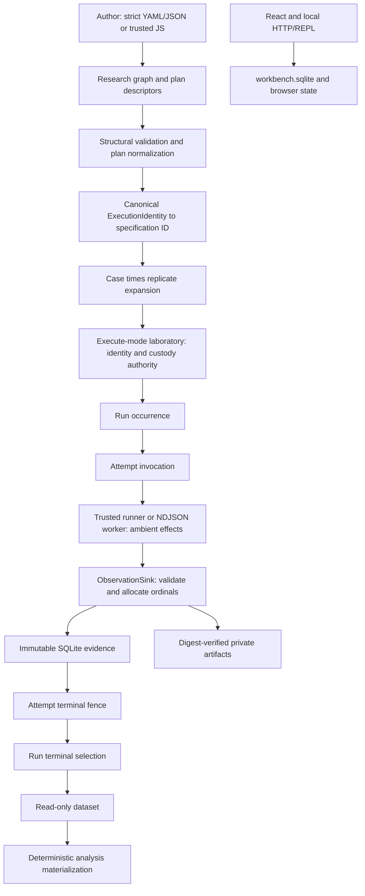

# Architecture Garden — Researchctl

Researchctl manages an author-controlled research graph and an experiment laboratory. YAML, JSON, and trusted JavaScript describe projects and plans; the host validates and interprets those values, a trusted in-process or external runner produces effects, and the laboratory admits immutable observation metadata and terminal outcomes. The central shape is **descriptor before authority, admitted evidence after effect**.

The graph and laboratory are related without becoming one store. A project specification describes goals, questions, hypotheses, experiments, evidence, decisions, and reports, while the laboratory owns execution identity, occurrence allocation, evidence admission, ordering, and terminal outcomes. This separation makes Researchctl useful Garden evidence for typed plans, exact experimental coordinates, host-owned execution admission and evidence, and small trusted validation boundaries. It does not dominate arbitrary effects: runners execute under the same OS principal with ambient filesystem, environment, and network authority.

> [!summary]
> - Canonical specification identity, scientific replicate, execution attempt, event sequence, artifact digest, analysis result, and workbench session are distinct coordinates.
> - Only an execute-mode laboratory may perform live execution writes; read-write mode is reserved for import and migration paths.
> - Cooperative runner APIs expose sink-mediated evidence admission: the laboratory allocates order, verifies artifact bytes at admission, and closes attempts and runs, while same-principal runners retain ambient OS authority.
> - Terminal resume is identity-based, but concurrent command convergence, stale-active recovery, retry classification, and file/row atomicity remain open.

## Snapshot identity and evidence

| Field | Value |
|---|---|
| Repository | `/home/manuel/code/wesen/go-go-golems/researchctl` |
| Remote | `git@github.com:go-go-golems/researchctl.git` |
| Branch | `main` |
| Commit | `87acdacc2cadfadaeec04f045e17a23701b0c81f` |
| Tag at commit | `v0.0.3` |
| Commit date | `2026-07-24T11:44:31-04:00` |
| Commit subject | `Merge pull request #4 from go-go-golems/fix/release-oidc` |
| Worktree | Clean before and after analysis; claims refer only to committed source |
| Analysis date | 2026-08-10 |
| Scope | Whole repository: ingress, graph/schema, planning, execution, persistence, protocol, artifacts, analysis, Goja/workbench, tests, CI, and release configuration |

The analysis independently checked runtime code and public interfaces, lifecycle/concurrency/import tests, Goja and frontend boundaries, SQLite migrations, and build/release workflows. Source citations below are repository-relative to the pinned Researchctl checkout. Documentation supplied orientation but does not establish runtime claims. No Researchctl source was changed. A live downstream worker, release publication, crash injection, and a two-process command race were not exercised.

## Architecture and runtime path

### Authoring and admission

`ResearchProjectSpec` is strict-decoded from YAML or JSON, and project JavaScript runs as trusted author code with only the `researchctl` native module installed by the loader (`pkg/research/spec/types.go:286-320`; `pkg/research/projectio/load.go:31-80`). The module restriction narrows accidental API surface; it is not an untrusted-code security boundary. Structural validation builds an index, checks global IDs and typed references, and detects work-package cycles (`pkg/research/validate/structural.go:24-102`; `pkg/research/validate/structural.go:205-247`). It establishes graph coherence, not the truth of a research claim.

Experiment JavaScript likewise returns data. Normalization validates unique cases and specifications, exact factors, positive concurrency, and an explicit seed for randomized order; expansion then derives a deterministic case-by-replicate schedule (`pkg/experimentplan/plan.go:50-179`; `pkg/experimentplan/plan.go:192-242`). Builder callbacks remain inside one Goja runtime and are not persisted or sent to a worker (`pkg/gojamodules/researchctl/experiment_plan.go:14-200`). Generated plans and descriptors are therefore intent data, not execution authority.

### Concrete `experiment run-plan` trace

1. Cobra loads the project and plan, confirms the declared experiment exists, opens `.researchctl/lab.sqlite` in execute mode, checks project ownership, and constructs the process runner (`cmd/researchctl/cmds/experiment_plan.go:64-100`; `cmd/researchctl/cmds/experiment_plan.go:223-267`).
2. `experimentservice.Execute` normalizes and hashes the plan, persists digest-named canonical plan data, expands desired runs, and adds plan identity and artifact provenance to every attempt environment (`pkg/experimentservice/service.go:67-91`; `pkg/experimentservice/service.go:219-296`).
3. For each `(specification ID, replicate index)`, a matching terminal run is reused. A foreign project/experiment conflicts, while an active run stops admission with “explicit recovery is required” (`pkg/experimentservice/service.go:92-113`). Pending work enters a bounded worker pool. On the first fail-fast error, the shared execution context is cancelled, which stops undispatched jobs and propagates cancellation to already in-flight laboratory attempts; without fail-fast, failures are joined after scheduled work completes (`pkg/experimentservice/service.go:115-172`; `pkg/experimentservice/service_test.go:19-99`).
4. `Laboratory.Execute` requires execute mode and a domain/version-compatible runner, recomputes the semantic specification ID, transactionally creates a run plus its project-experiment link, and starts attempts sequentially up to `maxAttempts` (`internal/labsqlite/execute.go:14-58`; `internal/labsqlite/execution.go:46-179`). A specification insert, run creation, each observation, each attempt close, and run close are separate transactions; a live run is not one transaction.
5. `lab.Runner.Start` receives an `AttemptRequest` and an `ObservationSink`; the cooperative API and NDJSON protocol expose only sink-mediated admission into laboratory records (`pkg/lab/runtime.go:24-83`). The process adapter verifies local input digest/size, writes one canonical request, requires a versioned `hello`, checks runner and domain identity, bounds NDJSON frames, and translates event, trace, metric, artifact, and terminal frames into sink calls (`pkg/lab/processrunner/resolver.go:11-65`; `pkg/lab/processrunner/runner.go:77-180`; `pkg/lab/processrunner/runner.go:189-268`). This is not authority domination or a sandbox: in-process and external runners are trusted, and the external process inherits the host working directory/environment under the same OS principal (`pkg/lab/processrunner/runner.go:103-114`). It can perform arbitrary ambient filesystem/network effects or reach known storage paths outside the protocol.
6. Every sink write checks that the attempt remains open, allocates its own per-attempt ordinal, validates/canonicalizes the value, inserts an immutable row, and commits (`internal/labsqlite/execution.go:267-429`). Concurrent event writers receive contiguous unique laboratory sequences, and concurrent completion permits one terminal winner (`internal/labsqlite/execution_test.go:131-258`). Producer sequence and producer time remain annotations rather than laboratory order.
7. External artifact bytes are created with `O_EXCL` below the attempt root; the laboratory recomputes digest and size before recording metadata, and the process adapter removes a new file when metadata admission fails (`pkg/lab/processrunner/runner.go:270-307`; `internal/labsqlite/execution.go:305-358`). This is admission-time digest/size verification and a write-once application path, not immutable-byte enforcement, a security sandbox, or an atomic file-plus-SQL commit. The retained file remains writable by the same principal; ordinary reads do not reverify it, and neither post-admission tampering nor the verification-to-insert TOCTOU interval is fenced (`pkg/lab/lab_test.go:171-195`).
8. A successful attempt must contain all required measures with the expected kind and unit. One immutable attempt summary fences later writes, and one run summary may select only a succeeded attempt (`internal/labsqlite/execution.go:432-530`; `pkg/lab/validation.go:246-286`). If a runner returns, panics, or is cancelled without closing, the host attempts to persist a terminal record under an uncancelled five-second context (`internal/labsqlite/execute.go:61-114`).
9. A second plan invocation reuses exact terminal coordinates without creating duplicate runs (`internal/labsqlite/experiment_plan_test.go:16-109`). This is terminal identity-based resume, not exactly-once effects or idempotent concurrent command admission.

### Import, analysis, workbench, and delivery paths

Import has a narrower law than live execution. `(source namespace, external run ID)` plus export digest identifies admission: identical replay reuses the existing run; changed content conflicts. All imported SQL evidence and the project link commit together (`internal/labsqlite/import.go:59-149`; `internal/labsqlite/import.go:151-262`; `internal/labsqlite/store_test.go:151-278`). Artifact verification and staging happen outside that transaction, so bundle admission is SQL-atomic but not file-and-row atomic.

Analysis opens the laboratory read-only, selects terminal exports, reduces a strict, source-digested analysis specification intended to be checked in, and publishes digest-coordinated immutable files (`cmd/researchctl/cmds/analysis.go:32-109`; `pkg/experimentanalysis/reduce.go:17-67`; `pkg/experimentanalysis/publish.go:20-120`). Missing observations remain missing rather than becoming zero, and mixed units or ambiguous within-run metrics are rejected (`pkg/experimentanalysis/reduce.go:69-179`). The output is a derived materialization, not canonical laboratory evidence or a behavior-complete release root.

The local workbench has a separate REPL/session database and Goja runtime that installs only `researchctl` and `codesign`; its workspace endpoints are path-contained but have no authentication middleware (`pkg/workbench/server/server.go:21-90`; `pkg/workbench/server/workbench.go:90-145`). React owns browser presentation state (`web/workbench/src/App.tsx:34-230`). Neither workbench sessions nor browser state are laboratory runs. GoReleaser builds CGO Linux/Darwin binaries and packages checksums, deb/rpm, and Homebrew artifacts, but no frontend build or embed step appears in `.goreleaser.yaml:1-103` or `.github/workflows/release.yaml:1-148`; the Vite SPA is a separately built surface, not content of the released Go binary.

## Authority and state map

| Object | Owner | Identity or order | Durable form | Must not be confused with |
|---|---|---|---|---|
| Research graph | Author plus structural validator | Project/global node IDs | YAML, JSON, or trusted JS source | Laboratory observations or run history |
| Experiment plan | Author plus normalizer | Plan ID and canonical digest | Digest-named plan artifact | A run, attempt, or workflow DAG |
| Semantic specification | Laboratory | Hash of canonical `ExecutionIdentity` | Immutable `lab_specifications` row | Display name, run occurrence, or plan case label |
| Scientific run/replicate | Laboratory | `(specification ID, replicate index)` and run ULID | Immutable `lab_runs` plus one summary | Retry attempt or request-idempotency key |
| Execution attempt | Laboratory | `(run ID, attempt index)` and attempt ULID | Immutable attempt and summary rows | Replicate or explicit child rerun |
| Event, metric, trace | Worker proposes; sink admits | Separate per-attempt sequences/ordinals | Immutable observation rows | Project event, global clock, or sole replay truth |
| Artifact | Worker creates; laboratory verifies and retains | Contained URI, digest, and size | Private file plus immutable metadata | Analysis output or release root |
| Analysis result | Reducer and publisher | Dataset/source/runtime/result digests | Immutable derived files | Canonical laboratory evidence |
| Workbench session | REPL store/runtime | Session-owned IDs | `workbench.sqlite` | Laboratory run or attempt |
| Browser value | React component | Component/request-local | Browser memory | Durable project or laboratory state |

`ModeReadOnly`, `ModeReadWrite`, and `ModeExecute` are explicitly different (`pkg/lab/runtime.go:10-16`). Live specification, run, attempt, observation, and terminal methods call `requireExecute`; read-write mode supports import and migration without granting execution (`internal/labsqlite/execution.go:46-49`; `internal/labsqlite/execution.go:255-259`; `internal/labsqlite/execution_test.go:341-357`). Database-to-project ownership checks are integrity and routing constraints, not principal or tenant authorization (`internal/labsqlite/migrations.go:187-220`; `internal/labsqlite/store.go:105-156`).

## Candidate common vocabulary

| Proposed term | Project-local name | Invariant | Nearby ecosystem names | Difference retained |
|---|---|---|---|---|
| **Research graph source** | `ResearchProjectSpec` | Author-controlled typed claims, evidence, and decisions | Semantic graph | Mutable source, not laboratory evidence |
| **Execution descriptor** | `ExecutionIdentity` / `SpecificationRecord` | Canonical behavior-relevant data exists before effect | Typed plan, experiment coordinate | Domain payload can remain opaque, versioned JSON |
| **Semantic specification coordinate** | Specification ID | Hash projection of canonical identity | Semantic/cache identity | Not a run, request key, or artifact digest |
| **Scientific replicate** | `RunRecord.ReplicateIndex` | One sample occurrence for one specification | Experiment run coordinate | Not a retry attempt |
| **Execution attempt** | `AttemptRecord` | One runner invocation below a replicate | Attempt/lease occurrence | Sequential and terminal-fenced; no renewable lease |
| **Laboratory observation** | Event/metric/trace/artifact row | Evidence admitted only while its attempt is open | Event, telemetry | Does not by itself rebuild run truth |
| **Terminal evidence fence** | Attempt/run summary | First terminal row prevents later observation or closure | Terminal record | Durable row, not process reconciliation |
| **Admission-verified artifact** | `RunArtifact` plus private file | URI is contained and digest/size are verified before metadata admission | Artifact custody record | File bytes remain same-principal writable and are not reverified on ordinary reads; not an analysis result or release root |
| **Analysis materialization** | Published `Result` directory | Deterministic derived output over selected terminal evidence | Projection, aggregate | Rebuildable output, not canonical evidence |

> [!important] Vocabulary discipline
> Specification ≠ run ≠ attempt; retry attempt ≠ replicate, while an explicit child rerun is a new replicate linked to its parent; event ≠ artifact ≠ terminal summary; producer sequence ≠ laboratory sequence; project evidence node ≠ laboratory observation; artifact ≠ analysis materialization ≠ release; workbench session ≠ laboratory run; project ownership ≠ authorization.

## Mathematical and computer-science foundations

### 1. Semantic identity is an explicit projection

Let $\mathcal{I}$ be the set of `ExecutionIdentity` values accepted by `ValidateExecutionIdentity`, $\mathcal{B}$ the set of finite byte strings, and $\mathcal{T}$ the set of finite UTF-8 text strings. Let $C:\mathcal{I}\rightarrow\mathcal{B}$ be Researchctl canonical JSON encoding and $H:\mathcal{B}\rightarrow\mathcal{T}$ be SHA-256 rendered as lowercase hexadecimal text. Let $p\in\mathcal{B}$ be the fixed bytes `researchctl-execution-identity/v1` and $z\in\mathcal{B}$ the one-byte zero separator. Let $\Vert_{\mathcal{B}}$ concatenate byte strings and $\Vert_{\mathcal{T}}$ concatenate text strings. Define $Q:\mathcal{I}\rightarrow\mathcal{T}$ by

$$
Q(i)=\text{`sha256:'}\mathbin{\Vert_{\mathcal{T}}}H(p\mathbin{\Vert_{\mathcal{B}}}z\mathbin{\Vert_{\mathcal{B}}}C(i)).
$$

The identity contains domain/schema version, verified inputs, domain configuration, requested measures, and factors (`pkg/lab/types.go:39-57`; `pkg/lab/canonical.go:22-65`). `PersistSpecification` recomputes \(Q(i)\) and rejects a supplied mismatch (`internal/labsqlite/execution.go:46-95`).

**Operational consequence:** equal canonical descriptors reuse one specification coordinate; a changed identity field changes the coordinate with overwhelming probability.

**Limit:** collision resistance is assumed, not injectivity proved. Display name, labels, provenance, runner binary, project graph revision, secrets, operating system, and external service state are outside this function.

### 2. Replicates and attempts are different indexed products

Let \(\mathcal{S}\) be the set of stored specification IDs, \(\mathcal{U}\) the set of persisted run ULIDs, and \(\mathbb{N}_{+}=\{1,2,3,\ldots\}\) the positive integers. Let \(\mathcal{R}\subseteq\mathcal{S}\times\mathbb{N}_{+}\) be accepted run coordinates, with uniqueness enforced on `(specification_id, replicate_index)` (`internal/labsqlite/migrations.go:33-40`). For any \(r\in\mathcal{U}\), let \(k_r\in\mathbb{N}_{+}\) be its number of started attempts and define \(\mathcal{A}_r=\{(r,j)\mid j\in\mathbb{N}_{+},1\leq j\leq k_r\}\).

A retry preserves its member of \(\mathcal{R}\) and chooses the next member of \(\mathcal{A}_r\). A deliberate rerun supplies `ParentRunID` with replicate index zero; `CreateRun` allocates `MAX(replicate_index)+1`. It therefore creates a new scientific replicate/run coordinate linked to its parent, not another attempt or a fourth coordinate family (`cmd/researchctl/cmds/experiment_plan.go:137-193`; `internal/labsqlite/execution.go:120-130`).

**Operational consequence:** analysis counts scientific runs rather than inflating sample size with retries; the six-run/seven-attempt test protects this distinction (`internal/labsqlite/experiment_plan_test.go:16-109`).

**Limit:** uniqueness prevents two durable runs for one coordinate, but concurrent `run-plan` commands can race after lookup; one caller may fail instead of converging on the winner.

### 3. Attempt events form ordered words

Let \(\mathcal{E}\) be the set of admitted `EventRecord` values, \(\mathcal{V}\) the set of persisted attempt IDs, and \(\mathcal{E}^{*}\) the set of all finite sequences over \(\mathcal{E}\). For any \(a\in\mathcal{V}\), let \(W_a\in\mathcal{E}^{*}\) be its finite event word ordered by laboratory sequence. Let \(\epsilon\in\mathcal{E}^{*}\) be the empty word and let \(\cdot:\mathcal{E}^{*}\times\mathcal{E}^{*}\rightarrow\mathcal{E}^{*}\) be word concatenation. For all \(x,y,z\in\mathcal{E}^{*}\),

$$
(x\cdot y)\cdot z=x\cdot(y\cdot z),\qquad \epsilon\cdot x=x=x\cdot\epsilon.
$$

The store allocates contiguous per-attempt sequences at commit (`internal/labsqlite/execution.go:267-303`; `internal/labsqlite/execution_test.go:131-225`).

**Operational consequence:** `lab runs follow` can request events after the greatest sequence already observed for each attempt (`cmd/researchctl/cmds/lab.go:165-225`).

**Limit:** concatenation is not commutative. Producer order may differ from recording order; no cross-attempt causal clock, pure reducer, snapshot-plus-live protocol, or event-sourced reconstruction of run truth is established. Metrics, traces, artifacts, and terminal summaries use separate ordinal families.

### 4. Import idempotence has an exact boundary

Let \(\mathcal{N}\) be the set of source-namespace strings, \(\mathcal{X}\) the set of external-run-ID strings, \(\mathcal{K}=\mathcal{N}\times\mathcal{X}\) the set of import keys, \(\mathcal{D}\) the set of export-digest strings, and \(\mathcal{L}\) the set of valid durable laboratory states. Let \(J:(\mathcal{K}\times\mathcal{D})\times\mathcal{L}\rightharpoonup\mathcal{L}\) be the partial import transition, where \(\rightharpoonup\) means the transition can return a conflict instead of a state. For any accepted key \(k\in\mathcal{K}\), digest \(d\in\mathcal{D}\), and initial state \(\ell\in\mathcal{L}\), define \(\ell_1=J((k,d),\ell)\). Identical replay satisfies

$$
J((k,d),\ell_1)=\ell_1.
$$

For \(d'\in\mathcal{D}\) with \(d'\neq d\), \(J((k,d'),\ell_1)\) is undefined and returns a conflict (`internal/labsqlite/import.go:59-72`; `internal/labsqlite/import.go:125-149`).

**Operational consequence:** exact bundle replay does not duplicate admitted rows, while changed content cannot hide under the same source coordinate.

**Limit:** this law covers bundle admission only. It does not make worker effects, plan commands, or concurrent run creation idempotent.

## Correlation with the Pattern Zoos

| Project evidence | Zoo relation | Comparison grade | Boundary |
|---|---|---|---|
| Canonical `ExecutionIdentity` is projected to a digest coordinate (`pkg/lab/canonical.go:56-65`) | [[Transcripts/Research/09 - RAG-MATHS Pattern Zoo#Pattern 1 — Semantic Identity as Explicit Projection|RAG 1 — Semantic Identity as Explicit Projection]] | Strong | Explicit projection and invalidation match; hash collision resistance is assumed and provenance is excluded. |
| Normalized plan data supports explain/inspect/execute paths (`cmd/researchctl/cmds/experiment_plan.go:21-51`; `pkg/experimentservice/service.go:67-217`) | [[Transcripts/Research/09 - RAG-MATHS Pattern Zoo#Pattern 4 — Typed Plans and Multiple Interpreters|RAG 4 — Typed Plans and Multiple Interpreters]] | Strong | One plan supports pure inspection and effectful execution, but domain config remains opaque JSON rather than a closed Go sum. |
| Specification, factors, replicate, and attempt remain separate (`pkg/experimentplan/plan.go:101-179`; `internal/labsqlite/migrations.go:33-66`) | [[Transcripts/Research/09 - RAG-MATHS Pattern Zoo#Pattern 8: Exact Experimental Coordinates and Explicit Coupling|RAG 8 — Exact Experimental Coordinates and Explicit Coupling]] | Strong | Coordinates match; runner binary and external state are not fully coupled into specification identity. |
| Worker frames and artifacts cross a small host validator (`pkg/lab/processrunner/runner.go:189-307`) | [[Transcripts/Research/09 - RAG-MATHS Pattern Zoo#Pattern 10 — Large Producers, Small Trusted Validators / Proof-Carrying Artifacts|RAG 10 — Large Producers, Small Trusted Validators]] | Strong | Admission proves protocol, shape, and custody—not scientific truth. |
| JavaScript builders yield serializable descriptors while the host owns execution admission and laboratory evidence (`pkg/gojamodules/researchctl/experiment_plan.go:14-200`) | [[Transcripts/Research/10 - PBUI-MATHS Pattern Zoo Handbook#Pattern 5 — Command as Data|PBUI 5 — Command as Data]] | Partial | The intent/effect split matches, but these are experiment descriptors, not UI offers or mounted occurrences. |
| Strict schemas, canonical JSON, runner protocol versions, and TypeScript declarations (`pkg/experimentplan/plan.go:20-47`; `pkg/lab/canonical.go:22-65`; `pkg/lab/processrunner/types.go:15-77`; `pkg/gojamodules/researchctl/module.go:14-57`) | [[Transcripts/Research/10 - PBUI-MATHS Pattern Zoo Handbook#Pattern 8 — Serializable Semantic Contract|PBUI 8 — Serializable Semantic Contract]] | Partial | Named boundaries are serializable; `json.RawMessage` slots and broad handwritten declarations prevent an end-to-end closed type claim. |
| Import commits evidence and project linkage in one SQL transaction (`internal/labsqlite/import.go:125-262`) | [[Transcripts/Research/10 - PBUI-MATHS Pattern Zoo Handbook#Pattern 14 — Transactional Interaction and Evidence|PBUI 14 — Transactional Interaction and Evidence]] | Partial | SQL bundle admission matches; artifact staging is outside the transaction and live execution spans many transactions. |

Explicit non-equivalences matter: a research graph node is not a RAG entity–derivation–observation proof; an experiment case is not a PBUI semantic occurrence; a Goja callback is authoring convenience rather than serialized authority; an immutable event row is not event sourcing; a digest-named artifact is not a release root; project/workspace scope is not authorization.

## Cross-project comparison

| Project | Shared invariant | Comparison grade | Important difference |
|---|---|---|---|
| [[Research/Software Architecture Garden/rag-ttc/03 - Reproducible Experiment Custody and Semantic Identity#1. Reproducibility begins with identity|rag-ttc experiment identity and custody]] | Exact configuration/input coordinates retain completed evidence under a run coordinate. | Strong | Researchctl centralizes generic SQLite run/attempt/artifact authority; rag-ttc uses experiment-owned JSONL streams and semantic caches. Researchctl terminal resume is not rag-ttc zero-budget item replay. |
| [[Research/Software Architecture Garden/rag-evaluation-system/04 - Serializable Actions and Host Owned Effects#Action flow|rag-evaluation-system host-owned effects]] | JavaScript-authored serializable intent is interpreted by a trusted host. | Partial | Researchctl descriptors schedule scientific attempts; Widget actions describe browser interaction. Neither a row context nor a UI occurrence maps to a laboratory replicate. |
| [[Research/Software Architecture Garden/sessionstream/README#1. Session-indexed event words|sessionstream event words]] | Scoped append order and explicit terminal state support replay/follow coordinates. | Partial | Sessionstream canonical events feed projections and snapshot-plus-live delivery; Researchctl events are attempt evidence and do not rebuild run truth. |
| [[Research/Software Architecture Garden/scraper/README#Architecture and runtime path|Scraper durable execution]] | An external runner boundary exposes cancellation, retries, observations, and artifacts to host policy. | Partial | Scraper is a lease-fenced dependency-graph scheduler; Researchctl treats an external workflow as one attempt and owns scientific coordinates. Direct integration is consumer evidence, not an independent implementation. |
| [[Research/Software Architecture Garden/devctl/README#Pattern map|devctl lifecycle evidence]] | Host-owned lifecycle records distinguish current status from durable process evidence. | Partial | devctl reconciles mutable external process truth; Researchctl freezes experiment occurrences and refuses ambiguous active recovery. A supervised service is not a scientific run. |

## Pattern maturity assessment

| Pattern | Local maturity | Evidence or limitation |
|---|---|---|
| Descriptor before authority, admitted evidence after effect | Candidate ecosystem pattern | Project/plan loaders, host runner interface, execute-mode checks, and independent intent/effect comparisons agree. |
| Semantic specification, replicate, and attempt separation | Established | Schema uniqueness and plan execution tests preserve sample-versus-retry identity. |
| Immutable terminal laboratory ledger | Established | Update/delete triggers, unique summaries, and concurrent terminal tests fence later writes; this does not imply event sourcing. |
| Admission-time artifact verification and write-once application paths | Established | Containment, digest/size checks, exclusive creation, import copying, and source-removal tests protect admission; same-principal post-admission mutation and verification-to-insert TOCTOU remain open. |
| Identity-based terminal resume | Emergent | Terminal coordinates resume, but stale-active reconciliation and concurrent-command convergence are absent. |
| Remote retry disposition | Architecture debt | `RemoteError.Retryable` exists, while `Execute` retries every non-success under `maxAttempts` unless the parent context is cancelled. |
| Artifact/row crash consistency | Open correctness obligation | File and SQL operations are coordinated but do not share one atomic commit or startup reconciler. |
| Legacy domain-owned lifecycle | Retired | Commit `b96a90235ade4e6cf9e1917ad457e69c56e0f31e` removed the direct codesign lifecycle; current replacement authority is `internal/labsqlite/execute.go:14-114` plus `pkg/experimentservice/service.go:67-217`. |

## Architecture debt and open laws

### Concurrent plan admission

**Required law:** for each specification ID \(s\in\mathcal{S}\) and replicate index \(n\in\mathbb{N}_{+}\), concurrent admissions should either return the same accepted run or a documented conflict without duplicate effects.

**Current evidence:** the unique schema coordinate prevents two accepted durable runs (`internal/labsqlite/migrations.go:33-40`).

**Gap:** plan lookup precedes creation, so two commands can both observe “missing”; one can start while the other fails. There is no stable invocation key or compare-and-swap convergence (`pkg/experimentservice/service.go:92-130`).

**Likely validation:** a two-process barrier test around lookup/create plus an explicit conflict or winner-reuse API.

### Active attempts and bounded terminal fallback

**Required law:** every admitted attempt eventually receives one terminal disposition, either from its runner or an explicit operator/reconciler action.

**Current evidence:** the host writes a missing terminal summary through an uncancelled five-second context and active plan coordinates fail closed (`internal/labsqlite/execute.go:61-79`; `pkg/experimentservice/service.go:105-107`).

**Gap:** a crash or database outage can leave an active row; no general abandon/resume reconciler was found. The existing rerun command starts a child only from a terminal run.

**Likely validation:** crash injection after attempt creation and explicit `inspectActive`/`abandonAttempt` transitions with operator reason and fencing.

### Retry classification

**Required law:** an attempt's retry disposition and the operator's maximum-attempt policy must compose into one documented decision.

**Current evidence:** sequential attempts preserve the same run coordinate and cancellation stops after the current attempt (`internal/labsqlite/execute.go:39-100`).

**Gap:** `processrunner.RemoteError.Retryable` is not consulted (`pkg/lab/processrunner/types.go:62-90`). Cancelled, abandoned, and non-retryable remote failures can be attempted again while budget remains.

**Likely validation:** an exhaustive outcome-by-policy table and tests, followed by either honoring the flag or removing the unsupported contract.

### Artifact and analysis publication

**Required law:** every referenced artifact has verified retained bytes, and every unreferenced staged file is eventually removed or safely adopted.

**Current evidence:** normal process-runner failure removes the new file; import verifies and copies bytes; analysis refuses conflicting existing files (`pkg/lab/processrunner/runner.go:270-307`; `pkg/lab/artifacts.go:57-157`; `pkg/experimentanalysis/publish.go:20-98`).

**Gap:** crashes can leave unreferenced files; import stages before SQL; a late analysis failure can leave a partial digest directory. These are safe leftovers, not an atomic publication guarantee.

**Likely validation:** crash-point tests and an orphan reconciler or explicit prepare/admit/finalize protocol.

### Authorization and schema evolution

Project binding, path containment, and module selection do not authorize a principal. The local workbench exposes file and trusted-JavaScript effects without authentication (`pkg/workbench/server/workbench.go:90-145`). If exposed beyond a trusted local environment, authentication and authorization must dominate file, REPL, session, and artifact operations. Separately, the migration registry and future-version rejection exist, but only schema V1 is present (`internal/labsqlite/migrations.go:8-12`; `internal/labsqlite/store.go:105-182`), so multi-version compatibility remains untested.

## Implications for composable APIs

1. Brand `SpecificationID`, `PlanDigest`, `ReplicateIndex`, `RunID`, `AttemptID`, `EventSequence`, `ArtifactDigest`, and `AnalysisDigest` separately in Go and TypeScript; current declarations flatten many to strings and numbers.
2. Keep JavaScript descriptor-only: normalize and persist data plus provenance, never callbacks or runtime-bound Goja values.
3. Replace status-string/result/error combinations with an exhaustive attempt outcome whose retry disposition is explicit.
4. Name recovery honestly with APIs such as `inspectActive`, `abandonAttempt`, and `rerunFromTerminal`; do not call current polling `snapshotThenLive` or claim automatic recovery.
5. Add a stable command-admission key or compare-and-swap only if concurrent callers must converge rather than receive a uniqueness conflict.
6. Bind project revision, runner executable digest, and behavior-relevant environment in a higher-level reproducibility manifest when needed; do not silently force them into semantic specification identity.
7. Keep analysis outputs typed as derived materializations and prevent report publication from mutating laboratory evidence.

## Candidate ecosystem patterns

1. **Descriptor before authority, admitted evidence after effect** — trusted authoring surfaces emit typed data; a mode-gated host allocates execution coordinates and mediates laboratory admission, while trusted runners retain ambient authority over effects outside the cooperative API/protocol.
2. **Specification–replicate–attempt separation** — semantic identity, scientific sample occurrence, and retry invocation use non-substitutable coordinates so retry does not change sample size.
3. **Terminal evidence fence** — observations are admitted only while an attempt is open, one terminal record wins, and a successful run selects only a successful attempt.

Promotion requires another independent implementation under comparable experimental-custody constraints. Shared dependencies, Researchctl's Scraper fixture, or repeated vocabulary alone are not independent evidence.

## Validation evidence

Run on 2026-08-10 from the pinned Researchctl root:

- `GOWORK=off go test ./internal/labsqlite ./pkg/experimentservice ./pkg/experimentplan ./pkg/experimentplanjs ./pkg/lab ./pkg/lab/processrunner ./pkg/research/... ./pkg/gojamodules/researchctl ./pkg/workbench/server -count=1` — passed all listed packages.
- `GOWORK=off go test ./... -count=1` — passed the complete Go suite.
- `pnpm install --frozen-lockfile && pnpm workbench:typecheck && pnpm workbench:test && pnpm workbench:build` — passed; Vite reported only a large-chunk warning. Installation did not change tracked Researchctl files.

Garden structure, exact headings, source citation ranges, whitespace, pinned commit, and worktree cleanliness were checked after writing; commands and results are reported in the writer handoff at `/tmp/researchctl-garden-writer.md`.

## Recommended next investigations

1. Race two `run-plan` processes and crash-inject artifact/terminal boundaries.
2. Decide whether remote retryability or operator `maxAttempts` owns retry admission.
3. Design explicit stale-active inspection and abandonment before adding any automatic recovery.
4. Exercise a real V1-to-V2 migration and add frontend checks to CI before claiming those contracts are release-gated.

## Related studies

- [[Research/Software Architecture Garden/README|Software Architecture Garden]]
- [[Research/Software Architecture Garden/rag-ttc/03 - Reproducible Experiment Custody and Semantic Identity|rag-ttc — Reproducible Experiment Custody and Semantic Identity]]
- [[Research/Software Architecture Garden/rag-evaluation-system/04 - Serializable Actions and Host Owned Effects|rag-evaluation-system — Serializable Actions and Host-Owned Effects]]
- [[Research/Software Architecture Garden/sessionstream/README|sessionstream]]
- [[Research/Software Architecture Garden/scraper/README|Scraper]]
- [[Research/Software Architecture Garden/devctl/README|devctl]]
- [[Transcripts/Research/09 - RAG-MATHS Pattern Zoo|RAG-MATHS Pattern Zoo]]
- [[Transcripts/Research/10 - PBUI-MATHS Pattern Zoo Handbook|PBUI-MATHS Pattern Zoo Handbook]]
