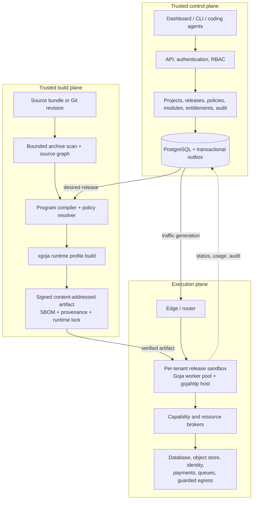
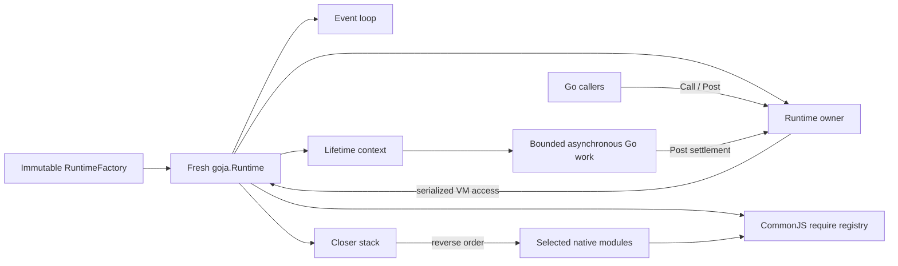
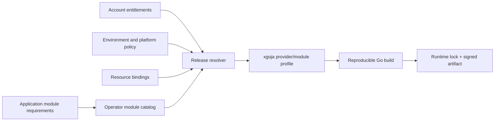
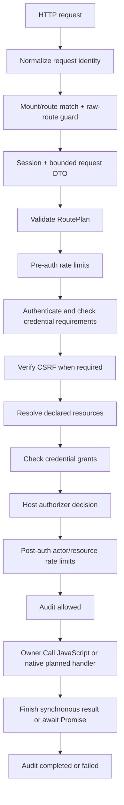
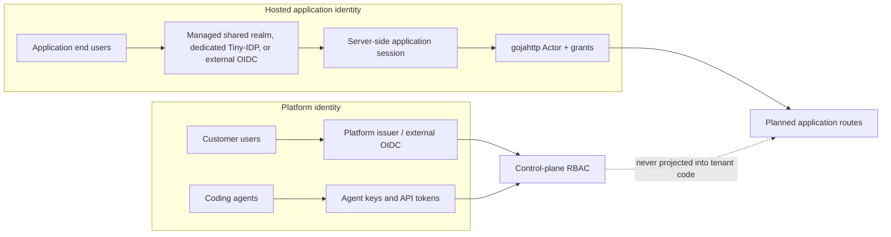
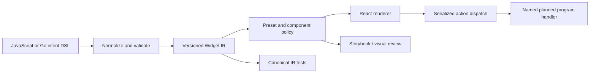
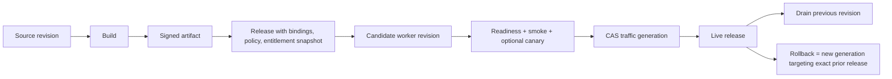

# Building a Secure JavaScript Hosting Platform with Goja

## An intern's guide to go-go-goja, xgoja, gojahttp, go-go-host, Tiny-IDP, Widget DSL, releases, paid modules, and isolated execution

**Status:** Architecture textbook and implementation guide  
**Audience:** Engineers joining the project, including interns and coding-agent operators  
**Scope:** The existing repositories, the design principles already embodied in them, the gaps between the current components, and the proposed production hosting architecture

---

## Contents

- Preface
- **Part I. The Product and Its Boundaries**
  - 1. The product is a controlled application host
  - 2. Trust is expressed as capabilities and data flow
- **Part II. The go-go-goja Runtime**
  - 3. A runtime is an owned execution environment
  - 4. Native modules convert Go authority into JavaScript APIs
  - 5. xgoja is the trusted composition compiler
- **Part III. The Secure HTTP Application Framework**
  - 6. gojahttp is the primary web-application substrate
  - 7. Staged builders make invalid routes unrepresentable
  - 8. The enforcement pipeline runs before JavaScript
  - 9. Host-owned identity supports browsers, agents, and OAuth resources
  - 10. The HTTP framework includes operations, not just routing
- **Part IV. Application Programs and User Interfaces**
  - 11. A serializable program contract makes agent output reviewable
  - 12. Widget DSL makes web UI a typed protocol
- **Part V. The Control Plane and Release System**
  - 13. go-go-host supplies the control-plane skeleton
  - 14. A release is more precise than a deployment
  - 15. Coding agents are principals, not trusted administrators
- **Part VI. Identity Workflows and Native Effects**
  - 16. Tiny-IDP remains the identity kernel
- **Part VII. Paid Modules, Resources, and Billing**
  - 17. Subscriptions authorize release construction
- **Part VIII. The Production Execution Plane**
  - 18. Each tenant release runs in an isolated worker boundary
- **Part IX. End-to-End Example**
  - 19. Project Desk from source to request
- **Part X. Implementation Plan and Intern Guide**
  - 20. Repository changes in dependency order
  - 21. Delivery stages
  - 22. An intern's code-reading path
  - 23. Practical exercises
- **Part XI. Review Checklists**
  - 24. Runtime review checklist
  - 25. Module review checklist
  - 26. HTTP review checklist
  - 27. Release review checklist
  - 28. Identity and payment review checklist
- **Part XII. Glossary**
  - 29. Terms
- **Appendix A. Source and Evidence Map**
  - A.1 go-go-goja runtime and xgoja
  - A.2 HTTP and authentication
  - A.3 go-go-host
  - A.4 Tiny-IDP
  - A.5 Widget DSL
- **Appendix B. Final Design Principles**

## Preface

The system described in this book has one central purpose: let a customer upload a JavaScript or TypeScript program, select a controlled set of Go-backed modules, and run the result as a secure hosted application. The application may expose HTTP routes, render web interfaces, use a database, authenticate users, call approved external services, accept payments, and be deployed repeatedly by coding agents. A release must be inspectable, versioned, reproducible, auditable, and reversible.

The interesting problem is not JavaScript evaluation. `goja` already evaluates JavaScript in Go. The engineering problem is deciding which authority JavaScript receives, how Go owns the runtime around it, how HTTP security is declared and enforced, how native modules are selected and paid for, how application code becomes an immutable release, and how a failed release is prevented from becoming live.

This book explains those decisions in their dependency order. It begins with trust boundaries and runtime ownership, then moves through modules and xgoja, the secure HTTP framework, UI rendering, the control plane, identity, billing, releases, and isolated execution. Each chapter distinguishes three things:

1. **What exists now.** This is grounded in the reviewed repositories.
2. **What principle the implementation expresses.** This is the reusable reasoning behind the code.
3. **What the hosting platform should do next.** This is the proposed production architecture.

The codebase is active. Names and package boundaries will continue to evolve. The invariants should change much more slowly.

### How to read the diagrams

The diagrams show authority and lifecycle, not package imports alone. A solid arrow usually means data or control moves in that direction. A boundary labeled *trusted* means code inside that boundary is operated by the platform and is not supplied by a tenant. A tenant program is always treated as less trusted than the process that validates its release.

### Running example: Project Desk

The chapters use a small application called **Project Desk**. It combines a public health route, authenticated resource-bound project pages, SQLite, Widget IR, a CI agent with an API token, a payment checkout action, and releases deployed by an automated agent. It is not a special product; it is a compact example that exercises the system's main boundaries.

---

# Part I. The Product and Its Boundaries

## 1. The product is a controlled application host

A hosted program is not merely a file executed by an interpreter. It is a unit of source, native-module selection, permissions, resource bindings, configuration, tests, assets, and operational policy. The platform must preserve that complete unit across build, release, activation, rollback, and audit.

A useful first model is:

```text
source + program contract + module lock + bindings + policy = release
release + traffic decision + worker state = running application
```

This model prevents a common failure: treating source code as the only versioned input. A program compiled with one SQLite module version, one Widget renderer, and one authorization policy is not the same release when any of those components changes.



*Figure 1. Target platform planes and authority flow.*

### 1.1 Three planes

The target architecture separates three planes.

| Plane | Owns | Must not do |
|---|---|---|
| Control plane | Accounts, projects, environments, policies, entitlements, releases, domains, audit, desired state | Execute tenant JavaScript |
| Build plane | Source scanning, compilation, static validation, module resolution, tests, provenance, artifact signing | Serve public application traffic |
| Execution plane | Route requests to an immutable release and run bounded tenant invocations | Decide billing entitlements or mutate release history |

The separation is not organizational ceremony. It controls the impact of a compromise. A worker that runs a malicious program should not possess control-plane database credentials. A build service that processes an adversarial archive should not also terminate customer traffic. A dashboard should not be able to bypass server-side release policy.

> **Decision: separate control, build, and execution.**  
> **Problem:** One process that accepts uploads, compiles code, manages tenants, and serves applications accumulates every privilege.  
> **Selected rule:** Each plane gets only the data and credentials needed for its role.  
> **Rejected alternative:** A universal daemon with in-process runtimes and direct access to all platform stores.  
> **Resulting invariant:** No tenant program can reach the control-plane store through an ambient process credential.

### 1.2 Current repositories and their roles

The existing repositories already contain most of the required concepts, but they are distributed across projects.

| Repository or subsystem | Existing strength | Intended platform role |
|---|---|---|
| `go-go-goja` | Owned Goja runtimes, module APIs, async boundaries, HTTP framework, authentication helpers | Runtime SDK and secure application host foundation |
| `xgoja` | Provider composition, source graphs, generated binaries, declarations, command surfaces | Trusted build planner and runtime-profile compiler |
| `go-go-host` | Organizations, sites, deployments, agents, grants, audit, quotas, routing | Control-plane seed and release orchestrator |
| `tiny-idp` | Strict OAuth/OIDC kernel and a bounded JavaScript program model | Platform/app identity service and source of generic program-contract patterns |
| Widget DSL | Intent-level UI grammar, typed IR, React target | Safe server-driven web UI protocol |

The platform should not copy each implementation wholesale. It should preserve the strongest boundary from each project and remove duplicated weaker paths.

### 1.3 A vocabulary that prevents category errors

Several words are easy to conflate. The distinction matters because each word is checked at a different time.

| Term | Definition | Checked when |
|---|---|---|
| Provider | A Go package that contributes xgoja modules, sources, command sets, declarations, or host extensions | Build planning |
| Runtime module | A selected JavaScript-visible API such as `express`, `database`, `auth`, or `fetch` | Build and worker startup |
| Permission | An authority granted to a running program, such as outbound access to one origin | Release resolution and invocation |
| Entitlement | A commercial right held by an account, such as use of the SQLite module | Release creation and reconciliation |
| Quota | A numerical limit, such as database bytes or requests per minute | Build, control, and execution |
| Binding | A connection from a release to a concrete resource, secret, issuer, or database | Release creation and worker startup |
| Artifact | A content-addressed built output plus metadata and provenance | Build completion |
| Release | An immutable artifact combined with environment bindings, policy, and entitlement snapshot | Promotion |
| Traffic generation | An immutable routing decision that assigns traffic to releases | Activation and rollback |

A subscription for SQLite is an entitlement. The JavaScript name `db` is a module alias. The database file or managed database is a resource. The right to execute SQL is a permission. The maximum database size is a quota. The connection between the release and that database is a binding. One boolean called `sqliteEnabled` cannot represent all six concepts safely.

### 1.4 Key points

- The product hosts immutable releases, not loose source files.
- Control, build, and execution are separate trust domains.
- Existing repositories should converge around their strongest boundaries rather than retain parallel runtimes.
- Module, permission, entitlement, quota, binding, artifact, and release are separate domain concepts.

---

## 2. Trust is expressed as capabilities and data flow

The platform makes JavaScript useful by giving it carefully selected capabilities. A capability is not a promise that the code will behave. It is the exact authority the host makes available through a typed interface.

Examples include:

- execute a prepared SQLite query against the application's database;
- resolve the current authenticated actor;
- create a payment checkout session for configured products;
- read an object from one application-owned bucket;
- call one allow-listed HTTP origin;
- return a Widget IR page;
- publish a bounded job to one queue.

The unsafe alternative is ambient authority: unrestricted filesystem access, process execution, environment variables, host networking, raw database handles, or control-plane credentials. Ambient authority makes code review incomplete because behavior depends on what happens to be available in the process.

### 2.1 Capability flow

A capability has four layers:

```text
catalog declaration
    -> release requirement
        -> host binding
            -> invocation-scoped JavaScript object
```

The catalog declaration identifies the module version and its security contract. The release requirement records what the application asks for. The host binding supplies the concrete implementation, such as one database. The invocation object exposes only the methods available during one request.

The Tiny-IDP scripting work demonstrates a particularly strong version of this model. Lambdas declare required capabilities and effect classes. At invocation time, the host supplies exactly those bindings, applies call and byte budgets, and discards a worker after an unsafe interruption. The general hosting platform should extract this model into a neutral application-program package.

### 2.2 Authority must be host-owned

JavaScript may declare intent, but it should not manufacture security objects. This rule appears repeatedly in the codebase:

- Express authentication specs are Go-backed objects returned by `express.user()`, `express.agent()`, or `express.oauth()`.
- Resource specs are Go-backed objects returned by `express.resource(type)`.
- Rate-limit specs are Go-backed objects returned by `express.rateLimit(policy)`.
- Guarded fetch credentials are Go-backed builders rather than arbitrary JavaScript maps.
- Tiny-IDP evidence and secret handles originate in Go and cannot be forged from plain objects.

The pattern protects more than type safety. It gives the host an unambiguous identity for security-sensitive declarations and prevents a plain object from bypassing validation.

> **Decision: JavaScript declares intent using host-issued builder objects.**  
> **Problem:** Plain JavaScript objects are easy to forge, omit required fields, or reinterpret inconsistently.  
> **Selected rule:** Security-sensitive builders carry hidden Go identity and are normalized into immutable plans.  
> **Rejected alternative:** Let handlers pass arbitrary policy maps that are interpreted at request time.  
> **Resulting invariant:** A route cannot become protected, resource-bound, rate-limited, or credential-bearing without passing through Go validation.

### 2.3 The sandbox is not the whole boundary

`goja` is an interpreter, not a complete multi-tenant operating-system sandbox. A Go native module can read files, open sockets, allocate memory, or block a goroutine if the host gives it those powers. The execution plane therefore needs two layers:

1. **Language and capability isolation.** The runtime exposes only approved modules, validates inputs and outputs, applies deadlines, and owns the event loop.
2. **Process and operating-system isolation.** A worker runs with memory, CPU, PID, filesystem, and network constraints, and can be killed if native code does not return.

The first layer prevents normal code from obtaining authority. The second limits damage when a runtime, module, or tenant program is defective or hostile.

### 2.4 Key points

- Capabilities are explicit, typed authority supplied by the host.
- Security-sensitive JavaScript values should carry host-issued identity.
- An interpreter boundary does not replace process isolation.
- The safest default module and permission set is empty.

---

# Part II. The go-go-goja Runtime

## 3. A runtime is an owned execution environment

A `goja.Runtime` is not goroutine-safe. Only one goroutine may use a VM at a time, and values from one runtime cannot be passed directly into another. The repository therefore wraps the VM in an owned execution environment containing an event loop, a scheduler, a CommonJS registry, lifecycle context, runtime values, and cleanup hooks.



*Figure 2. The owned Goja runtime and its serialized execution path.*

### 3.1 Construction sequence

The runtime factory follows a deliberate order:

```text
validate immutable factory plan
    -> create goja VM
    -> create and start event loop
    -> create runtime owner
    -> create lifetime context and closer registry
    -> create require registry
    -> register selected native modules
    -> enable require and common globals
    -> run runtime initializers
    -> return owned Runtime
```

Each step depends on the previous one. Native modules that create asynchronous work need the event loop and owner before they are registered. Initializers that call `require()` must run after the registry is enabled. Partial construction must close resources in reverse order.

The factory is immutable after `Build()`. That gives every runtime created from the factory the same module composition. Per-runtime state is still fresh: each runtime receives a new VM, event loop, module loaders, and value map.

### 3.2 The runtime owner

The runtime owner exposes two essential operations:

```go
Call(ctx, operation, func(ctx, vm) (value, error))
Post(ctx, operation, func(ctx, vm))
```

`Call` schedules work onto the owning event-loop path and waits for a result. `Post` schedules fire-and-forget work. Both associate the current Go context with the VM call so native modules can inherit cancellation, deadlines, and request metadata.

A native asynchronous function follows this pattern:

```text
on VM owner:
    create JavaScript Promise
    validate input
    start bounded Go work

on worker goroutine:
    perform I/O using invocation context

back on VM owner:
    resolve or reject Promise
```

The Promise must be settled on the owner path. Calling Goja objects from a random goroutine violates the runtime's ownership rule even when the code appears to work in a small test.

### 3.3 Runtime context versus invocation context

Two contexts coexist:

- The **runtime lifetime context** exists for the lifetime of the VM. It is canceled during runtime close and stops runtime-owned background work.
- The **invocation context** belongs to one request, function invocation, or command. It carries a shorter deadline and cancellation signal.

A native module should normally use the current invocation context when one exists, then fall back to the lifetime context for runtime-owned background work. It should not replace both with `context.Background()`.

### 3.4 Closing a runtime

Closing is a protocol, not just `loop.Stop()`:

1. Mark the runtime as closing so no new closers are added.
2. Cancel the lifetime context.
3. Wait briefly for owner work to become idle.
4. Interrupt active JavaScript if it does not become idle.
5. Run module closers in reverse order.
6. remove runtime bridge state;
7. shut down the owner;
8. stop the event loop.

A runtime that was interrupted during an untrusted invocation should be treated as poisoned. Clearing an interrupt does not prove that all JavaScript and module state returned to a valid application boundary. A pool should discard the worker and create a fresh one.

> **Decision: one active invocation per VM worker.**  
> **Problem:** A Goja VM is single-owner, and one long-running handler can block all work scheduled to that VM.  
> **Selected rule:** A worker is acquired exclusively for one invocation; timeouts poison and discard it.  
> **Rejected alternative:** Share one site-wide VM across arbitrary concurrent HTTP requests.  
> **Resulting invariant:** Request concurrency is controlled by pool size, and a stuck invocation cannot permanently monopolize the entire release.

### 3.5 What the platform should add

The runtime layer should expose an explicit invocation primitive that owns the complete timeout protocol:

```go
type InvocationResult struct {
    Value      json.RawMessage
    SafeToReuse bool
    Usage      Usage
}

Invoke(ctx, handlerID, input, capabilityBindings, budget) (InvocationResult, error)
```

The primitive should:

- validate input before acquiring a worker where possible;
- acquire one worker exclusively;
- install invocation-scoped capabilities and secret handles;
- interrupt on timeout;
- bound output and log bytes;
- wait for capability settlement;
- validate the structured result;
- erase invocation state;
- release only a safe worker;
- kill the process if the VM cannot be reclaimed.

### 3.6 Key points

- A runtime is a VM plus ownership, scheduling, context, modules, and cleanup.
- All VM mutation and Promise settlement happens on the owner path.
- Runtime lifetime and request lifetime are separate.
- Interrupted workers should be discarded, not casually reused.

---

## 4. Native modules convert Go authority into JavaScript APIs

A native module defines a JavaScript-visible name and a loader that populates CommonJS exports. Simple modules can be registered by name and loader. Runtime-scoped modules receive richer context: the VM, owner, event loop, host services, configuration, values, and closer registration.

The important design question for a module is not “what functions should JavaScript see?” It is “what authority does this module grant, what state does it own, and how is that authority bounded?”

### 4.1 Module categories

| Category | Examples | Typical lifetime | Security concern |
|---|---|---|---|
| Data-only | path manipulation, YAML encoding, pure builders | Runtime | CPU and output size |
| Bound resource | database, object store, application auth | Runtime or invocation | Tenant/resource isolation |
| Network | guarded fetch, payment client, webhook sender | Invocation | Egress and credentials |
| HTTP host | Express/gojahttp registrar | Runtime | Route ownership and request security |
| Native transport | WebSocket or protocol handler mounted as `http.Handler` | Runtime | Path handoff and lifecycle |
| UI grammar | Widget DSL, safe HTML builder | Runtime | Output validation and injection |
| Unsafe compatibility | unrestricted filesystem, process execution, raw HTML | Runtime | Broad host authority |

A paid module may span more than one category. SQLite includes a JavaScript API, a persistent resource, migration policy, backup policy, and placement constraint. The module descriptor must not hide those operational requirements.

### 4.2 Provider packages

xgoja provider packages can contribute:

- runtime modules;
- command sets;
- JavaScript verb sources;
- help and assets;
- TypeScript declarations;
- host services;
- runtime initializers;
- public configuration sections.

This is a good extension mechanism, but the current name `PackageCapability` describes provider extension hooks rather than application security authority. The hosting platform should rename it to `ProviderExtension` or `ProviderContribution` before adding a commercial permission system.

### 4.3 A hosted module descriptor

The existing module descriptor has a name, default alias, description, configuration schema, TypeScript declarations, and a per-runtime factory. A managed platform needs additional fields:

```go
type HostedModuleVersion struct {
    ID                   string
    Version              string
    RuntimeABI           string
    ProviderModule       string
    ProviderVersion      string
    ProviderChecksum     string
    FactoryDigest        string
    Aliases              []string
    RiskClass            string
    RequiredPermissions  []Permission
    ConfigSchema         json.RawMessage
    BindingSchema        json.RawMessage
    Dependencies         []ModuleRequirement
    Conflicts            []ModuleRequirement
    NetworkPolicy        NetworkPolicy
    MeteringDimensions   []Meter
    PricingFeature       string
    TypeScriptDigest     string
    DocumentationDigest  string
}
```

Aliases such as `database`, `db`, and `sqlite` must resolve to one canonical module identity. Otherwise an alias can become an entitlement or policy bypass.

### 4.4 Module configuration and resource bindings

Static module configuration belongs in the release. Secrets and concrete resource locations belong in bindings. For example:

```yaml
modules:
  sqlite:
    version: 1.3.2
    config:
      maxRowsPerQuery: 1000
      maxResultBytes: 1048576
    binding: primary-database
```

The release can include the digest of the configuration without exposing the database path or encryption key. At worker startup, the platform resolves `primary-database` to a scoped handle.

### 4.5 Key points

- A native module is an authority boundary, not just an import name.
- Provider extensions and runtime security permissions are different concepts.
- Hosted module versions need ABI, provenance, permission, resource, and billing metadata.
- Aliases resolve to canonical identities before policy and entitlement checks.

---

## 5. xgoja is the trusted composition compiler

xgoja turns a declarative plan into a focused Go application containing selected providers, runtime modules, sources, commands, declarations, and assets. This is the correct direction for a hosting platform because it avoids one ambient mega-runtime that exposes every native module.



*Figure 3. Module, entitlement, policy, and binding resolution into a signed runtime profile.*

### 5.1 The v2 plan

A v2 specification distinguishes:

- provider packages imported into the generated Go program;
- selected Go-backed runtime modules;
- source sets executed inside Goja;
- command surfaces;
- generated artifacts;
- browser assets built outside Goja.

Runtime modules and command sets are intentionally separate. The `express` module is imported by JavaScript; the HTTP `serve` command set owns a long-running command that creates a runtime, loads a JavaScript verb, and serves its registered routes.

### 5.2 Closed source graphs

xgoja validates static imports before generation. Bare imports must match selected module names or aliases. Nonliteral dynamic imports are rejected because they prevent the build from proving the dependency graph.

This principle is important for agent-generated code. A coding agent should receive immediate build diagnostics when it references a module that is not selected. The platform should not defer that failure to the first production request.

### 5.3 Browser code is a different artifact

Browser applications, web workers, CSS processing, and frontend package installation do not belong in the Goja runtime compiler. They are built by frontend tooling and included as assets. This prevents the server runtime profile from growing Node-compatible behavior solely to build a browser bundle.

The hosting platform can support two frontend modes:

1. a conventional static browser application built separately;
2. server-driven Widget IR rendered by a generic browser client.

### 5.4 Development workspace resolution is not production resolution

xgoja supports local workspace discovery and replacement precedence. This is useful for repository development. A managed build must disable ambient workspace resolution and accept provider packages only from the platform catalog.

A production build should pin:

- Go toolchain;
- `go-go-goja` version;
- provider Go module versions and checksums;
- exact module versions and aliases;
- compiler settings;
- source digest;
- program-contract digest;
- renderer version;
- policy and entitlement snapshot digests.

### 5.5 Runtime plan versus runtime lock

The current runtime plan intentionally omits build-only provider imports and versions. That is sufficient for a generated binary to construct its runtime, but insufficient to identify a commercial reproducible release. The platform needs a **runtime lock** alongside the plan.

```json
{
  "runtimeAbi": "gogo-host/v1",
  "toolchain": "go1.26.x",
  "goGoGoja": "...",
  "sourceDigest": "sha256:...",
  "programDigest": "sha256:...",
  "profileDigest": "sha256:...",
  "policyDigest": "sha256:...",
  "modules": [
    {
      "id": "go-go-goja-http/express",
      "version": "...",
      "alias": "express",
      "providerSum": "h1:...",
      "configDigest": "sha256:..."
    }
  ]
}
```

The lock is included in artifact signing and release audit. Host-owned configuration may substitute approved bindings, but it must not mutate the module set after signing.

> **Decision: the platform generates xgoja specifications.**  
> **Problem:** Allowing tenant-supplied provider imports, Go replacements, build tags, or workspace paths would turn a JavaScript hosting product into arbitrary Go build execution.  
> **Selected rule:** Tenants request catalog modules; the trusted build service generates the provider plan and pins dependencies.  
> **Rejected alternative:** Accept arbitrary `xgoja.yaml` as the production build instruction.  
> **Resulting invariant:** Every native module in an artifact was selected from an operator-controlled catalog.

### 5.6 Key points

- xgoja is a build-time composition system, not merely a CLI wrapper.
- Static graph validation moves dependency failures into build time.
- Browser bundles remain separate assets.
- Production builds use catalog-pinned dependencies and an exact runtime lock.

---

# Part III. The Secure HTTP Application Framework

## 6. gojahttp is the primary web-application substrate

The secure HTTP framework in `go-go-goja` is much broader than a simple Express bridge. `pkg/gojahttp` owns route matching, request identity, body parsing, sessions, static and native handler mounts, response helpers, request logging, planned security enforcement, authorization, resource resolution, CSRF, rate limiting, audit, Promise completion, and both JavaScript and native Go handlers.

The `express` module is the JavaScript authoring surface over that host. It is intentionally Express-style rather than fully Express-compatible. It does not implement arbitrary middleware stacks, `next()`, template engines, npm Express plugins, or every Node API. This is a product decision: a smaller language can compile route intent into a Go-owned security plan.

### 6.1 The layers

```text
JavaScript route declaration
    -> Go-backed staged builder
        -> validated RoutePlan
            -> gojahttp route registry
                -> reusable Enforcer
                    -> JavaScript or native Go handler
```

`gojahttp.Enforcer` can also wrap ordinary `net/http` routes through `PlannedMiddleware`, so the security model is not coupled to JavaScript routing. Native authentication endpoints, OAuth callbacks, WebSocket handlers, and generated routes can share the same plan contract.

### 6.2 Raw routes and planned routes

A raw route registers a callable and receives a request DTO. A planned route registers both a handler and a Go-owned `RoutePlan`.

The production option `RejectRawRoutes` rejects matched raw routes. Static mounts and planned routes remain available. This makes “all application routes are planned” an enforceable host policy rather than a documentation convention.

### 6.3 The route plan

A route plan contains:

```go
type RoutePlan struct {
    Name       string
    Method     string
    Pattern    string
    Security   SecuritySpec
    Resources  []ResourceSpec
    Action     string
    CSRF       CSRFSpec
    Audit      AuditSpec
    RateLimits []RateLimitSpec
}
```

It is data. It can be validated, listed, reviewed, compared between releases, included in a release contract, and used by both JavaScript and native handlers.

### 6.4 A public route is still explicit

```javascript
const express = require("express");
const app = express.app();

app.get("/healthz")
  .name("health")
  .public()
  .rateLimit(express.rateLimit("health.read").perMinute(120).byIP())
  .handle((_ctx, res) => res.json({ ok: true }));
```

Calling `.public()` records an intentional exposure. It is not equivalent to omitting authentication configuration.

### 6.5 A protected resource route

Project Desk updates a project with the following plan:

```javascript
app.patch("/orgs/:orgId/projects/:projectId")
  .name("project.update")
  .auth(express.sessionUser().mfaFresh("10m"))
  .resource(
    express.resource("project")
      .idFromParam("projectId")
      .tenantFromParam("orgId")
      .mustExist()
  )
  .csrf()
  .rateLimit(
    express.rateLimit("project.write")
      .perMinute(30)
      .byActor()
      .byResource("project")
  )
  .allow("project.update")
  .audit("project.updated")
  .handle(async (ctx, res) => {
    const project = ctx.resource("project");
    const updated = await projects.update(project.id, ctx.body);
    res.json({ project: updated });
  });
```

The handler does not parse the session cookie, load the project row for authorization, decide whether the user owns the resource, verify CSRF, or construct a rate-limit key. Those operations run before the handler.

> **Decision: security is a compiled route plan, not handwritten handler middleware.**  
> **Problem:** A handler that manually reads cookies, loads a resource, checks ownership, and verifies CSRF can forget or reorder a check.  
> **Selected rule:** JavaScript declares route intent; Go validates and enforces the plan before invoking JavaScript.  
> **Rejected alternative:** Unrestricted Express middleware and convention-based security helpers.  
> **Resulting invariant:** A protected handler cannot register until the route declares an authentication mode and required action.

### 6.6 Key points

- gojahttp is the core secure HTTP host; Express is its JavaScript grammar.
- Planned routes are data contracts compiled at script load time.
- Production hosts can reject raw routes.
- The same enforcer can protect JavaScript and native Go handlers.

---

## 7. Staged builders make invalid routes unrepresentable

The Express route builder does not expose every method at every stage. Each call returns a new JavaScript object representing the next legal stage.

| Stage | Methods | Meaning |
|---|---|---|
| Needs security | `.name()`, `.public()`, `.auth()` | Method and path exist, but exposure is undecided |
| Needs policy | `.resource()`, `.csrf()`, `.rateLimit()`, `.audit()`, `.allow()` | An actor is required; resource and action policy are being declared |
| Needs handler | `.csrf()`, `.rateLimit()`, `.audit()`, `.handle()` | The route has enough metadata to register |

The builder objects are backed by Go state. The `.auth()` method accepts only objects issued by the Express module. `.resource()` and `.rateLimit()` follow the same rule. When `.handle()` is called, the host validates the complete plan and registers it.

### 7.1 Why registration-time failure matters

Consider an error in which the route path is `/projects/:projectId`, but the resource plan asks for `idFromParam("id")`. The host can detect that mismatch while loading the script. The deployment fails before traffic is switched.

If validation waited until request time, the first real user would discover the error. Worse, behavior might differ between path variants.

### 7.2 Authentication specifications

The framework supports host-issued specifications for several principal and credential shapes:

```javascript
express.user().required()
express.sessionUser().mfaFresh("10m")
express.agent()
express.oauth()
  .issuer("https://issuer.example")
  .resource("project-api")
  .scopes("project.read", "project.write")
express.anyOf(express.sessionUser(), express.agent())
```

The Go plan distinguishes authentication method from principal kind. A user may authenticate through a server-side session. An agent may authenticate with an API token. An OAuth access token is checked against issuer, resource, and scopes. The route can require the exact shape it needs.

OAuth requirements are deliberately strict. The plan requires issuer, resource, scopes, and an audit event. This makes bearer-token endpoints visible during route review.

### 7.3 Resource specifications

A resource plan describes where identifiers come from:

- route parameter;
- query parameter;
- body field;
- literal value.

The JavaScript route does not receive a raw store handle to perform authorization. A host `ResourceResolver` converts the declared identifier into a minimal `ResourceRef`. The `Authorizer` then receives the actor, action, first resource, and all resolved resources.

This supports multi-resource decisions without leaking database records into generic security code.

### 7.4 Rate-limit specifications

Rate-limit plans can combine key parts:

- client IP;
- route;
- actor;
- route or tenant parameter;
- header;
- body field;
- resolved resource.

Policies that depend only on transport values run before authentication. Policies that require actor or resource identity run after authorization. Denied callers do not consume a shared resource bucket.

The host may provide an in-memory limiter for tests or a distributed limiter for production. The route declaration does not change.

### 7.5 Route descriptors and release review

Because the host can list route descriptors, a build can generate a route manifest:

```text
PATCH /orgs/:orgId/projects/:projectId
  name: project.update
  auth: session user, MFA <= 10m
  resource: project from projectId in tenant orgId
  action: project.update
  csrf: required
  rate limit: project.write / actor + project
  audit: project.updated
```

A coding agent's pull request or release proposal should include a diff of this manifest. New public routes, new OAuth scopes, weaker MFA, removed CSRF, or broader rate-limit keys become reviewable authority changes.

### 7.6 Key points

- Builder stages encode the required declaration order.
- Host-issued builder identity prevents forged policy objects.
- Route/resource mismatches fail during application load.
- Route manifests turn HTTP authority into reviewable release data.

---

## 8. The enforcement pipeline runs before JavaScript

The route plan is valuable because one reusable pipeline enforces it. Understanding the order is essential; changing the order can change security semantics.



*Figure 4. Planned HTTP enforcement before JavaScript execution.*

### 8.1 Step-by-step request trace

For the Project Desk update route, one request follows this sequence.

#### Step 1: normalize network identity

The outer host determines the direct peer and trusted client IP. Forwarding headers are ignored unless the direct peer belongs to a configured trusted proxy range. Malformed forwarded chains from trusted peers fail rather than being partially trusted.

#### Step 2: request logging and request ID

The host ensures a request ID, creates an access-log response writer, and records request completion metadata. This happens outside JavaScript so a handler cannot suppress the basic access record.

#### Step 3: static/native mount dispatch

Static or mounted Go handlers are checked first. Mounts can preserve the original path or strip the prefix. Exclusion prefixes allow a broad mount to defer selected paths to later routes.

#### Step 4: route match and raw-route guard

The registry matches method and path parameters. `HEAD` may fall back to `GET`. When `RejectRawRoutes` is enabled, an unplanned JavaScript route is rejected before its handler runs.

#### Step 5: build the request DTO

The host creates or loads the lightweight request session identifier and parses the body. JSON, URL-encoded forms, multipart forms, and raw bodies are normalized into a request DTO. The current implementation caps the body at 64 MiB and multipart in-memory parsing at 32 MiB; a hosted product should allow smaller per-route or per-plan limits.

#### Step 6: validate the route plan

The plan is normalized again at enforcement. Invalid modes, empty actions, missing parameters, malformed OAuth requirements, and invalid rate-limit keys fail closed.

#### Step 7: pre-authentication rate limits

Policies keyed only by route, IP, header, body field, or route parameters run before expensive authentication. This protects login and token endpoints from unauthenticated floods.

#### Step 8: authenticate

The host `Authenticator` converts a session, API token, access token, or other approved credential into an `AuthResult`. The result contains non-secret metadata: actor, method, principal kind and ID, credential hint, grants, scopes, and verified OAuth assertions. Raw bearer tokens are not projected into handler context.

#### Step 9: check route authentication requirements

The actual authentication method and principal kind must match one of the plan requirements. A valid agent token therefore fails a browser-session-only route even if both credentials belong to authorized identities.

#### Step 10: verify CSRF where required

For unsafe methods, a route with `.csrf()` invokes the host `CSRFProtector`. Session authentication normally requires CSRF; bearer credentials may not, depending on the normalized `AuthResult`. A missing CSRF service is a host misconfiguration and fails closed.

#### Step 11: resolve resources

The host extracts resource and tenant identifiers from the validated request DTO and calls `ResourceResolver`. Missing required resources can become a 404 without exposing whether an unauthorized resource exists.

#### Step 12: check embedded grants

If the credential carries normalized grants, the enforcer checks whether they permit the route action against the resolved resource. This provides a fast credential-scope boundary before the application authorizer.

#### Step 13: authorize

The host `Authorizer` receives the actor, action, first resource, and resource map. It returns an explicit decision. Denial becomes 403; resource lookup can remain 404.

#### Step 14: post-authentication rate limits

Policies keyed by actor or resource run only after authorization succeeds. An unauthorized caller cannot exhaust a shared project budget.

#### Step 15: audit the allowed outcome

When the plan declares an audit event, the host records the allowed security envelope before handler execution.

#### Step 16: invoke JavaScript through the owner

The host constructs `SecureContext`, projects a bounded JavaScript `ctx`, and calls the handler through the runtime owner. The handler receives authenticated facts, not raw policy services.

#### Step 17: finish synchronous or Promise output

A synchronous return is converted through response helpers. If a Promise is returned, the host checks its state on the owner path until fulfilled, rejected, or the request context ends.

#### Step 18: audit completion or failure

The host records completed or failed outcomes with status and reason. In production, client error bodies remain generic.

### 8.2 Status semantics

| Condition | Status |
|---|---:|
| Missing or invalid credentials | 401 |
| Valid actor but denied action or CSRF | 403 |
| Resource hidden or absent | 404 |
| Rate limit exceeded | 429 with `Retry-After` when available |
| Required host service missing | 500 or service-unavailable, depending on failure |
| Handler failure | 500 with generic production body |

This status mapping is part of the application contract. A platform should test it as black-box behavior, not only unit-test individual interfaces.

### 8.3 Audit reliability

The current MVP treats audit sink errors as best-effort in several paths. That is acceptable for local examples but not for evidence-grade release, identity, payment, or administrative actions. The managed platform should write security mutations and their audit/outbox record in one database transaction, or fail the mutation.

Route request audit has a different availability tradeoff. A high-volume read route may not be allowed to fail solely because an external analytics sink is down. The platform should classify audit events:

- **transactional security events:** account, permission, release, secret, token, payment, and destructive data changes;
- **request evidence:** allowed/denied/completed/failed route observations delivered through a durable buffer;
- **metrics:** bounded aggregates that may tolerate sampling.

### 8.4 Key points

- Enforcement order is part of the security design.
- JavaScript runs only after identity, CSRF, resources, grants, authorization, and relevant budgets pass.
- Authentication metadata is non-secret and credential-type aware.
- Audit durability requirements depend on event class, but ignored errors are not sufficient for critical mutations.

---

## 9. Host-owned identity supports browsers, agents, and OAuth resources

The HTTP framework deliberately separates identity proof from application authorization. An identity provider proves who authenticated. The application decides what that principal may do to a project, document, report, or tenant.

### 9.1 Server-side browser sessions

`sessionauth.Manager` stores opaque sessions on the server. The browser receives only a cookie identifier. A session includes:

- application user ID;
- external identity subject and selected claims;
- tenant memberships;
- CSRF token;
- MFA timestamp;
- idle and absolute expiry;
- revocation state.

The secure default cookie uses the `__Host-` prefix, `HttpOnly`, `Secure`, path `/`, and `SameSite=Lax`. Insecure HTTP must be enabled explicitly for local demonstrations. The manager validates expiry and revocation, refreshes idle expiry, projects an application actor, verifies CSRF with constant-time comparison, and enforces route-declared MFA freshness.

The lightweight request session ID in the base `gojahttp` host is not authentication. It is useful for anonymous correlation or application state keys. Authenticated browser routes should use the server-side session manager.

### 9.2 OIDC and Keycloak

The Keycloak adapter uses standard OIDC Authorization Code with PKCE:

```text
browser -> Go login endpoint
    -> identity provider
    -> Go callback verifies state, code, ID token, nonce
    -> normalize external subject into application user
    -> create server-side application session
    -> browser receives only application session cookie
```

Provider access and refresh tokens remain server-side. The application stores its own users, memberships, resource ownership, and fine-grained policy. Identity-provider groups can inform policy, but they should not replace application domain state.

### 9.3 Agents and API tokens

Programmatic identities are separate durable principals. An agent has an ID, kind, tenant, and grants. API-token issuance returns the raw token once; later list and revoke operations return only redacted metadata such as token ID, prefix, credential hint, scopes, expiry, and revocation state.

An agent route declares its requirement:

```javascript
app.get("/agent/reports/:reportId")
  .auth(express.agent())
  .allow("report.read")
  .audit("agent.report.read")
  .handle((ctx, res) => {
    res.json({
      reportId: ctx.params.reportId,
      principal: ctx.auth.principalId,
      credential: ctx.auth.credentialHint
    });
  });
```

The handler never parses the bearer token. The authenticator validates it, resolves its agent, normalizes grants, and provides non-secret context.

### 9.4 OAuth resource-server routes

A route can require an external access token with exact issuer, resource, and scopes. This is useful when Project Desk exposes an API to another service using Tiny-IDP or an external issuer.

```javascript
app.get("/api/projects/:projectId")
  .auth(
    express.oauth()
      .issuer("https://id.example")
      .resource("project-desk-api")
      .scopes("project.read")
  )
  .resource(express.resource("project").idFromParam("projectId").mustExist())
  .allow("project.read")
  .audit("project.api.read")
  .handle((ctx, res) => res.json({ project: ctx.resource("project") }));
```

The route plan requires audit for OAuth requirements. This is a deliberate review signal for externally accessible bearer-token APIs.

### 9.5 Trusted proxies

Client IP is security data because rate limits and audits use it. The host trusts `X-Forwarded-For` only when the direct TCP peer is in a configured proxy CIDR. It bounds the header length and hop count, parses every address, and chooses the first untrusted address from the right side of the chain.

A platform deployment must configure this once at the outer server boundary. Individual JavaScript handlers should never interpret forwarding headers.

### 9.6 Tiny-IDP in the platform

There are two populations:

- **platform users:** customers, team members, billing administrators, approvers, and coding agents;
- **application users:** end users of a hosted customer application.

They should not share administrative authority, issuer keys, or subject namespaces by accident. The platform can offer:

1. a managed shared application realm with strict logical isolation;
2. a dedicated managed issuer;
3. an external OIDC issuer supplied by the customer.



*Figure 5. Separation between platform identity and hosted-application identity.*

### 9.7 Key points

- Identity proof and application authorization are separate.
- Browser tokens stay server-side; the browser receives an opaque app session.
- Agents are durable principals with separately managed credentials and grants.
- Forwarded client identity is trusted only through explicit proxy policy.
- Platform identity and hosted-application identity are separate populations.

---

## 10. The HTTP framework includes operations, not just routing

A secure application host also needs bounded transport, outbound calls, native integrations, reload behavior, and operational state.

### 10.1 Request and response DTOs

Planned handlers receive a context with:

```typescript
type PlannedContext = {
  request: Request;
  auth: AuthMetadata;
  actor: Actor | null;
  body: unknown;
  params: Record<string, string>;
  resources: Record<string, ResourceRef>;
  resource(name: string): ResourceRef | null;
  action: string;
  routeName: string;
};
```

Response helpers include status, headers, content type, JSON, text, HTML rendering, redirects, and end. The host owns whether development errors are exposed.

A managed platform should add per-route limits for request bytes, response bytes, header count, multipart files, and execution time. The current global body limits are useful defaults but too broad for all applications.

### 10.2 Static and mounted handlers

`app.static` serves a host directory, while `app.staticFromAssetsModule` serves from a read-only embedded filesystem module. The hosted safe profile should prefer embedded or object-store-backed assets; arbitrary host directories should be privileged.

`app.mount` accepts a Go-backed object carrying a hidden `http.Handler`. The mount uses prefix matching and preserves the original path unless `stripPrefix` is requested. This allows native modules to own WebSocket, streaming, OAuth, or protocol-specific handlers without reimplementing them in JavaScript.

The route ownership must remain explicit. A paid module that mounts `/payments/webhook` should declare that mount in its module descriptor and release manifest so collisions are caught before activation.

### 10.3 Native planned handlers and middleware

`Host.RegisterPlannedHTTP` and `PlannedMiddleware` apply the same route-plan enforcer to native Go handlers. This means a host-owned endpoint can use the same actor, resource, action, CSRF, rate-limit, and audit contract as a JavaScript handler.

That is valuable for:

- OAuth login and callback routes;
- binary downloads;
- WebSocket upgrades;
- payment webhooks;
- health and readiness endpoints;
- high-throughput endpoints that should not enter Goja.

### 10.4 Guarded outbound fetch

Outbound HTTP is a native capability. The xgoja host provider offers a guarded `fetch` module with:

- an explicit `allow: true` gate;
- origin allow-lists;
- default and per-request timeouts;
- maximum buffered response size;
- policy over environment and file credential sources;
- Go-owned bearer credential builders;
- a small low-level API and a fluent client.

A hosted platform should make the allowed origins part of the release permission diff. Direct arbitrary egress remains disabled. Payment and identity integrations should usually receive narrower domain-specific modules rather than generic fetch.

### 10.5 Blue/green hot reload

The xgoja HTTP serve path includes a hot-reload manager. It:

1. creates a fresh candidate host;
2. creates and loads a fresh runtime;
3. invokes the selected JavaScript verb to register routes;
4. optionally performs an HTTP smoke request;
5. atomically swaps the active snapshot;
6. closes the retired runtime after a grace period;
7. exposes bounded status.

This local mechanism expresses the right release principle: construct and validate a candidate before changing traffic. The managed platform should generalize it from an in-memory snapshot pointer to an immutable database traffic generation and distributed router reconciliation.

### 10.6 HTTP server lifecycle

The generated serve command owns a real `net/http.Server`, sets `ReadHeaderTimeout`, reacts to process signals or context cancellation, and performs graceful shutdown with a bounded timeout. It can also mount native authentication handlers before the JavaScript application fallback and wrap the entire mux in trusted request-identity middleware.

### 10.7 How go-go-host should converge

The reviewed `go-go-host` main branch contains a smaller `internal/sitejs/web` host. It has useful route registration, response helpers, sessions, and supervisor integration, but it does not contain the full planned route, auth, rate-limit, proxy, programmatic credential, guarded fetch, and hot-reload framework described above.

The target platform should migrate `go-go-host` execution to `gojahttp` rather than maintain a parallel HTTP implementation. `go-go-host` should own projects, releases, routing, quotas, and orchestration; `gojahttp` should own the application HTTP security contract.

### 10.8 Key points

- Secure web hosting includes request limits, response semantics, egress, native mounts, and lifecycle.
- Native and JavaScript routes can share one plan enforcer.
- Guarded fetch turns network access into reviewable host policy.
- Hot reload provides a local candidate-then-swap model for production release design.
- go-go-host should converge on gojahttp instead of extending its smaller web fork.

---

# Part IV. Application Programs and User Interfaces

## 11. A serializable program contract makes agent output reviewable

Traditional startup scripts register callbacks directly into a VM. That is flexible, but it gives the control plane little structured information about the application. The Tiny-IDP scripting branch introduces a stronger pattern: JavaScript produces a serializable `Program` contract while callbacks remain indexed by stable IDs inside each runtime.

The generic platform should extract that pattern into a neutral package.

### 11.1 Program shape

```go
type Program struct {
    APIVersion   string
    Name         string
    Routes       map[string]RouteSpec
    Functions    map[string]HandlerSpec
    Pages        map[string]PageSpec
    Actions      map[string]HandlerSpec
    Schedules    map[string]ScheduleSpec
    Schemas      map[string]Schema
    Capabilities map[string]CapabilityRequirement
    Resources    map[string]ResourceRequirement
    Tests        []ProgramTest
}
```

Callbacks are not serialized. A handler specification records the stable callback ID and its contract:

```go
type HandlerSpec struct {
    ID                   string
    Kind                 HandlerKind
    InputSchema          string
    OutputSchema         string
    AllowedOutcomes      []OutcomeKind
    RequiredCapabilities []CapabilityRequirement
    AllowedEffects       []EffectKind
    AuthPolicy           AuthPolicy
    Idempotency          IdempotencyPolicy
    Budget               InvocationBudget
    SourceLocation       SourceLocation
}
```

### 11.2 Compilation

The program compiler runs source in an isolated collector runtime that exposes only the application DSL. It rejects ambient module loading, applies source and time limits, captures callback IDs, copies the serializable contract, validates it in Go, runs declared tests with fake capabilities, and calculates fingerprints.

```text
source
  -> goja compile
  -> isolated collector runtime
  -> serializable Program + callback registry
  -> deterministic validation
  -> declarative tests
  -> source/program/callback/schema fingerprints
  -> immutable application artifact
```

At worker startup, the source is loaded again into a fresh runtime. The worker verifies that the callback registry and contract fingerprints match the artifact. A source file that registers different callbacks based on ambient state fails activation.

### 11.3 Budgets

A useful invocation budget includes:

- wall-clock timeout;
- maximum capability calls;
- maximum concurrent capability calls;
- input and output bytes;
- log bytes;
- database rows and result bytes;
- network requests and bytes;
- response body size;
- maximum effects;
- continuation payload size.

The budget is part of the handler contract and release review. A coding agent that raises a route timeout from 100 ms to 30 seconds is changing resource authority.

### 11.4 Outcomes and effects

Handlers should return structured outcomes rather than use exceptions for expected policy results. A generic vocabulary may include:

- `complete`: successful terminal value;
- `respond`: HTTP or function response;
- `page`: validated Widget page;
- `continue`: immediate transition to another handler;
- `present`: durable browser continuation;
- `challenge`: start or continue a native proof;
- `commit`: request a validated native effect plan;
- `deny`: valid negative decision;
- `error`: infrastructure or invalid program behavior.

Native effects are separate from the decision to request them. JavaScript can propose `payment_session_create`; Go validates product, amount, idempotency, entitlement, and credential policy before calling the provider.

### 11.5 Express compatibility and the contract compiler

The existing planned Express DSL already compiles route security into Go data. The program compiler should absorb those route descriptors rather than replace the HTTP framework. A practical migration path is:

1. load an Express-style application in a collector runtime;
2. capture planned route descriptors and callback IDs;
3. reject raw routes in the managed profile;
4. merge route plans with schemas, budgets, module requirements, pages, actions, and tests;
5. emit one application `Program`.

This preserves the extensive gojahttp framework while making a release statically inspectable.

### 11.6 Key points

- A program contract separates VM callbacks from serializable release metadata.
- Compilation verifies stable callback and schema fingerprints.
- Budgets and effects are reviewable handler authority.
- The generic compiler should incorporate planned Express routes rather than invent a second HTTP framework.

---

## 12. Widget DSL makes web UI a typed protocol

Widget DSL separates author intent from renderer implementation. JavaScript or Go constructs semantic widgets, the host normalizes them into a typed intermediate representation, and a React application renders that IR through a versioned component registry.



*Figure 6. Intent-level UI authoring through Widget IR to a named application action.*

### 12.1 Why IR instead of arbitrary HTML

Arbitrary HTML gives server code control over tags, attributes, script injection, form actions, and styling. A typed Widget IR gives the platform a stable boundary that can be:

- serialized and content-limited;
- validated independently of React;
- diffed between releases;
- rendered by multiple clients;
- tested with golden IR;
- reviewed in Storybook and browser automation;
- constrained to approved components and actions.

A page may have this conceptual wire shape:

```typescript
type WidgetPage = {
  schemaVersion: string;
  rendererVersion: string;
  id: string;
  title: string;
  shell?: ShellSpec;
  root: WidgetNode;
};

type WidgetNode =
  | { kind: "text"; text: string }
  | { kind: "element"; tag: SafeTag; attrs?: SafeAttrs; children?: WidgetNode[] }
  | { kind: "component"; type: ComponentID; props?: object; children?: WidgetNode[] };
```

The managed profile should prefer components and a very small safe element set. Raw HTML, arbitrary script/style tags, event attributes, and `javascript:` URLs should require an explicitly privileged compatibility module, if they are offered at all.

### 12.2 Actions are data

A server-driven interface cannot serialize JavaScript closures into the browser. Actions are defunctionalized into data:

```json
{
  "type": "server",
  "handler": "start-checkout",
  "input": {
    "productId": { "from": "row.id" }
  }
}
```

The browser dispatches the action to a named application handler. The host then applies authentication, CSRF, input validation, idempotency, rate limits, effect policy, and audit using the same program contract.

### 12.3 Static browser applications remain supported

Widget IR is not a requirement for every application. A customer may build a conventional React, Vue, Svelte, or plain browser application. That bundle is a separate immutable artifact and calls planned HTTP APIs.

The two modes can coexist:

- static assets for complex client-side interaction;
- Widget pages for rapid agent-generated dashboards, forms, tables, and administrative surfaces.

### 12.4 Renderer compatibility

Each release should pin:

- Widget schema version;
- renderer package version;
- component-registry digest;
- design-system or preset version.

A component registry change can alter behavior without changing application source. It is therefore part of the release identity.

### 12.5 Validation layers

Widget UI requires three different test classes:

1. **Semantic tests:** the application returns the expected widget intent and action contracts.
2. **IR tests:** canonical serialized output matches a golden or schema predicate.
3. **Visual/browser tests:** the target renderer displays the page and interactions correctly.

The Widget DSL project found that IR goldens alone do not detect every integration mismatch. Browser tests are part of the contract.

> **Decision: Widget IR is the default agent-generated UI surface.**  
> **Problem:** Arbitrary HTML or arbitrary React generation expands the security and compatibility surface of every release.  
> **Selected rule:** Agents author semantic UI and actions; the platform owns normalization, component policy, styling, and browser dispatch.  
> **Rejected alternative:** Expose unrestricted raw HTML as the standard server-rendered UI API.  
> **Resulting invariant:** Every interactive server-driven action resolves to a named, policy-enforced application handler.

### 12.6 Key points

- Widget DSL is an intent language over a typed UI protocol.
- Renderer and registry versions are release inputs.
- Actions are data that call named program handlers.
- Semantic, IR, and visual tests cover different failure classes.

---

# Part V. The Control Plane and Release System

## 13. go-go-host supplies the control-plane skeleton

The current go-go-host repository already models users, organizations, memberships, sites, domains, quotas, site capabilities, deployments, agents, keys, grants, nonces, deploy runs, audit, and runtime status. Its layering—HTTP adapters, control services, store wrappers, deployment validation, and runtime supervision—is a useful starting point.

The production platform should retain these concepts while replacing the in-process execution path and refining the release model.

### 13.1 What is worth preserving

- Authorization and product invariants belong in control services, not only handlers or dashboards.
- Store wrappers hide SQL implementation details.
- Upload and activation are separate operations.
- Deployment records and artifact paths are immutable.
- A candidate runtime is built and smoke-tested before a traffic swap.
- Machine agents use separate credentials and grants from human users.
- Path, channel, and activation permissions can be scoped per agent.
- Operational mutations emit audit events.

### 13.2 Where the current execution path diverges

As reviewed, go-go-host currently:

- builds one in-process runtime per site;
- always opens a per-site SQLite database;
- registers database aliases independently of the effective requested capability set;
- loads every `.js` file in lexical traversal order rather than one compiled program contract;
- uses an in-memory supervisor map as live routing state;
- applies an HTTP response timeout that does not itself guarantee JavaScript interruption;
- contains a smaller HTTP host rather than the full gojahttp planned framework;
- performs some audit writes best-effort.

These are reasonable beta implementation choices. They are not the final multi-tenant boundary.

### 13.3 Capability enforcement must be end-to-end

The bundle validator currently computes requested and effective capabilities. The runtime constructor must receive exactly that resolved set. No later code may replace it with broad defaults.

The platform sequence should be:

```text
manifest requirements
  ∩ account entitlement
  ∩ environment policy
  ∩ operator module policy
  = effective release permissions
```

The effective set is canonicalized, persisted, included in the release digest, and used directly by worker construction.

### 13.4 Control-plane source of truth

The database should hold desired state. Routers and workers reconcile it. In-memory maps are caches, not authorities.

For example, environment `production` may point to traffic generation 42:

```json
{
  "generation": 42,
  "allocations": [
    { "release": "rel_new", "weight": 100 }
  ],
  "previousGeneration": 41
}
```

A router observes generation 42 and updates its cache. If it restarts, it reconstructs state from the database or a durable stream.

### 13.5 Key points

- go-go-host is a useful control-plane seed.
- Its current in-process runtime is a beta execution mechanism, not the final tenant boundary.
- Effective capabilities must survive unchanged from validation to worker construction.
- Persistent desired state, not an in-memory supervisor, is the authority for traffic.

---

## 14. A release is more precise than a deployment

One mutable deployment record cannot accurately represent source, build, artifact, environment configuration, rollout, and live traffic. The platform should model them separately.



*Figure 7. Immutable build, release, promotion, drain, and rollback lifecycle.*

### 14.1 Domain objects

| Object | Meaning |
|---|---|
| Source revision | Exact uploaded archive or Git commit and source digest |
| Build | One attempt to compile and validate a source revision under a runtime profile |
| Artifact | Signed content-addressed output, runtime lock, SBOM, provenance, and test evidence |
| Release | Artifact plus environment bindings, effective permissions, policy, and entitlement snapshot |
| Deployment | One attempt to start or promote a release |
| Worker revision | A concrete process, sandbox, or pool serving one release |
| Traffic generation | Immutable allocation of traffic to releases |
| Rollback | A new traffic generation pointing to an explicitly selected prior release |

### 14.2 Candidate-to-live sequence

```text
create release
    -> start candidate worker revision
    -> wait for readiness
    -> run smoke and synthetic checks
    -> optional canary traffic
    -> compare-and-swap expected traffic generation
    -> write new generation + audit + outbox transactionally
    -> routers adopt generation
    -> drain previous worker revision
    -> retire after in-flight count reaches zero or deadline
```

The compare-and-swap prevents two coding agents from silently promoting different releases over each other.

### 14.3 Blue/green and canary

The local xgoja hot-reload manager proves the core blue/green rule: build and smoke a candidate before swapping an atomic pointer. The distributed platform adds persistent generations and weighted allocations.

A canary generation may be:

```json
{
  "generation": 43,
  "allocations": [
    { "release": "rel_old", "weight": 95 },
    { "release": "rel_new", "weight": 5 }
  ]
}
```

Sticky allocation may be based on a stable request key so one user does not alternate between incompatible releases during a session.

### 14.4 Rollback and databases

Code rollback and database rollback are different operations. A prior release may no longer run against the current schema. The release contract should declare schema compatibility and migration phases.

Prefer expand/contract migrations:

1. expand schema so old and new releases can run;
2. deploy new release;
3. backfill data;
4. move traffic;
5. remove old code;
6. contract schema in a later release.

A destructive restore is a privileged resource operation, not an automatic side effect of switching code.

### 14.5 Artifact evidence

An artifact should contain or reference:

- source digest;
- program contract and callback fingerprint;
- runtime lock;
- module and provider checksums;
- SBOM;
- compiler and toolchain identity;
- static graph diagnostics;
- unit and declared program-test results;
- route manifest;
- authority diff;
- Widget IR schema/renderer pins;
- signature and provenance.

### 14.6 Key points

- Source, build, artifact, release, deployment, worker, and traffic are separate objects.
- Promotion is a persistent compare-and-swap, not an in-memory side effect.
- Rollback selects an exact release and must respect database compatibility.
- Build evidence travels with the artifact.

---

## 15. Coding agents are principals, not trusted administrators

Coding agents will create most source revisions and release proposals. Their automation is a product feature, but an agent signature does not make a release safe. It identifies the requester and protects the request from tampering.

### 15.1 Agent identity

An agent has:

- durable principal ID;
- organization and optional project/environment scope;
- active public keys or API tokens;
- allowed actions;
- allowed source paths or channels;
- expiry and revocation state;
- separate authority to build, propose, canary, or promote.

Human credentials must not be reused by machines.

### 15.2 Canonical signed release request

A promotion request should cover:

```text
organization, project, environment
source revision digest
build/artifact digest
release digest
expected current traffic generation
module lock digest
permission and policy digest
binding/config digest
migration plan digest
rollout policy
idempotency key
timestamp and nonce
```

The control plane recomputes every policy decision. The signature proves who asked for the operation.

### 15.3 Authority diff

Every release proposal should include a machine-generated diff such as:

```text
+ route POST /checkout/start: public -> session user
+ module payments@1.2.0
+ permission egress api.stripe.com:443
+ secret binding stripe-production
+ effect payment_session_create
~ project.update MFA freshness 30m -> 10m
~ database schema 12 -> 13
- module legacy-mailer@0.8.1
```

Some changes can be auto-approved under policy. Others require human review.

Require review for:

- a new native module or major version;
- new network origin;
- new secret or production resource binding;
- identity, payment, or destructive data effects;
- removal of CSRF, audit, MFA, or authorization requirements;
- new public route;
- unsafe HTML or filesystem/process access;
- increased memory, timeout, body, output, or concurrency limits;
- destructive schema migration;
- domain or certificate changes.

### 15.4 Idempotency and replay

Agent requests use nonce and timestamp replay protection, but operational APIs also need idempotency keys. Repeating a request after a network timeout should return the original build or release result rather than create a second release.

### 15.5 Key points

- Agents are durable machine principals with limited grants.
- Signed requests are authenticated proposals, not policy overrides.
- Authority diffs make generated changes reviewable.
- Nonces prevent replay; idempotency keys prevent duplicate operations.

---

# Part VI. Identity Workflows and Native Effects

## 16. Tiny-IDP remains the identity kernel

Tiny-IDP's strict engine demonstrates a valuable division of responsibility. Go owns OAuth/OIDC validation, HTTP and browser security, cookies, password processing, cryptography, signing keys, replay-sensitive state, atomic effects, sessions, token issuance, and audit. JavaScript receives bounded typed values and returns structured decisions.

This boundary should be preserved even when identity workflows become scriptable.

### 16.1 Why identity JavaScript is different

An ordinary application handler may return a page or update a project. An identity handler participates in credential establishment and token issuance. It must not receive:

- raw passwords or password hashes;
- signing keys;
- refresh tokens;
- authorization codes;
- cookies;
- Fosite objects;
- SQL transactions;
- unconstrained networking.

JavaScript may decide how signup branches, how a virtual identity is mapped, or whether an invitation is acceptable. Go validates evidence and applies the effects.

### 16.2 Explicit browser continuations

A browser form or email challenge spans multiple HTTP requests. A pending Promise inside one Goja heap is not durable across process restart, worker replacement, source upgrade, or another node.

The identity workflow therefore returns a presentation or challenge with a named resume handler. Go stores a continuation containing:

- workflow and handler IDs;
- program and schema version;
- original validated protocol request digest;
- client and redirect binding;
- browser and session binding;
- bounded carry data;
- opaque secret/evidence references;
- expiry and one-time consumption state.

The next request is validated by Go and invokes the resume handler as a fresh bounded call.

### 16.3 Remote workflow execution for tenant code

The Tiny-IDP design explicitly warns that its in-process scripting sandbox is not containment for hostile tenant code. The hosting platform should therefore execute customer-authored identity workflows in the isolated worker plane.

```text
Tiny-IDP validates protocol request
    -> sends bounded workflow event to pinned release
    -> receives structured outcome
    -> validates outcome and evidence references
    -> applies native identity effects transactionally
    -> stores continuation or issues protocol artifact
```

If the workflow service is unavailable or returns invalid output, Tiny-IDP fails closed.

### 16.4 Managed application identity modes

A hosted project can choose:

- managed shared realm with tenant isolation;
- dedicated managed Tiny-IDP instance and keys;
- external OIDC issuer.

Application code receives verified claims and a stable application actor. It does not receive the identity store.

A narrow `users.v1` capability may support invitation, disable, role assignment, public profile lookup, and reset/login-link requests. Those operations remain host-authorized and audited.

### 16.5 Key points

- Go remains the identity and cryptographic authority.
- JavaScript decides bounded workflow behavior and requests effects.
- Browser-spanning waits use durable continuations, not suspended VM heaps.
- Untrusted identity workflow code runs outside the IdP process.

---

# Part VII. Paid Modules, Resources, and Billing

## 17. Subscriptions authorize release construction

A customer may subscribe to native modules such as SQLite, payments, advanced identity, queues, or premium UI components. Billing state should determine which releases may be created or continue after a defined grace policy. It should not be queried from Stripe during every request.

### 17.1 Internal entitlement ledger

Stripe or another billing provider emits asynchronous events. The control plane verifies, deduplicates, stores, and projects them into an internal entitlement table.

```text
verified billing webhook
  -> durable billing event
  -> entitlement projection
  -> entitlement-changed outbox event
  -> release/reconciliation policy
```

A release captures an immutable entitlement snapshot. This answers the historical question: why was this module allowed when the release was created?

### 17.2 Release resolution

For each requested module, the build/control plane:

1. resolves a canonical catalog version;
2. checks account entitlement;
3. checks project/environment policy;
4. validates dependencies and conflicts;
5. resolves resource bindings;
6. derives effective permissions;
7. calculates quotas and metering dimensions;
8. generates the xgoja profile and runtime lock;
9. signs the artifact and release.

A downgrade policy can immediately block new releases, allow an existing release through a grace period, then suspend it. Security revocation may bypass grace.

### 17.3 SQLite is a module and a resource

The SQLite JavaScript API is one concern. The persistent database file, storage allocation, migration state, backup schedule, encryption, and worker placement are another.

A SQLite resource should define:

- one active writer placement or lease policy;
- filesystem/volume ownership;
- soft and hard byte limits;
- connection and statement budgets;
- backup, verify, and restore operations;
- migration generation;
- compatible release range;
- observability and corruption checks.

Do not promise arbitrary horizontal scale over one local SQLite file. For scalable profiles, offer managed Postgres or a remote database service as a different resource product.

### 17.4 Payments as a narrow module

Project Desk should not receive a Stripe secret and unrestricted fetch. A `payments.v1` capability can expose:

- create checkout session;
- create customer portal session;
- read a bounded subscription summary;
- cancel or schedule cancellation under policy;
- create a refund request with explicit authority;
- retrieve configured products and prices;
- consume host-verified webhook evidence.

The host owns:

- provider credentials;
- product/price/currency allow-lists;
- redirect-domain policy;
- idempotency keys;
- webhook signature verification using raw body;
- event deduplication;
- conversion to native evidence;
- irreversible effect execution and audit.

JavaScript owns product behavior: which approved checkout to start, what page to show, and how the application responds to verified subscription events.

### 17.5 Metering

Module subscription and usage metering are separate. A module descriptor may declare dimensions such as:

- invocation count;
- database bytes;
- query CPU or rows;
- egress requests and bytes;
- payment operations;
- identity active users;
- object storage bytes;
- queue messages.

Workers emit bounded usage events identified by release, project, environment, module, and invocation. The control plane aggregates them. A worker never edits the billing ledger directly.

### 17.6 Key points

- Billing events feed an internal entitlement ledger.
- Entitlements are checked during release resolution, not every request.
- A release records the entitlement snapshot used to authorize it.
- SQLite and payments combine a JS module with host-owned resources and effects.

---

# Part VIII. The Production Execution Plane

## 18. Each tenant release runs in an isolated worker boundary

The final execution plane should not run unrelated customer programs inside the control-plane daemon. Each release runs in a dedicated process or sandbox group with a bounded worker pool.

### 18.1 Worker contents

A worker receives:

- signed artifact and runtime lock;
- exact selected module binary or image;
- release program contract;
- non-secret configuration;
- short-lived resource binding credentials or broker handles;
- network policy;
- quotas and handler budgets;
- workload identity;
- log and usage destinations.

It does not receive:

- control-plane database credentials;
- billing-provider administrative credentials;
- secrets for modules not selected;
- host filesystem paths outside declared mounts;
- unrestricted egress;
- other tenant data.

### 18.2 Process controls

A first production sandbox should provide:

- read-only root filesystem;
- unprivileged UID;
- separate process namespace;
- memory and CPU limits;
- PID and file-size limits;
- no host socket mounts;
- no network by default;
- egress through a policy gateway;
- ephemeral writable storage;
- explicit persistent resource mounts;
- hard process kill as final timeout enforcement.

Language-level interruption remains useful for fast recovery and diagnostics. Process-level kill is the final safety mechanism when native code fails to cooperate.

### 18.3 Worker pools

A pool belongs to one release. It never mixes runtimes from different tenants or release digests.

```text
request
  -> route to release
  -> acquire exclusive VM worker
  -> install invocation bindings
  -> invoke handler with budget
  -> validate result and usage
  -> release safe worker or discard unsafe worker
```

Cold starts can be hidden by maintaining a minimum warm pool. Pool size is a release quota and concurrency limit.

### 18.4 Resource brokers

A worker should call narrow brokers rather than hold broad credentials:

- database broker or scoped connection;
- object-store client restricted to a prefix;
- payment broker restricted to an account/product set;
- identity workflow interface;
- queue publisher restricted to a topic;
- guarded egress proxy.

The broker receives workload identity and release metadata, checks policy again, applies quotas, emits audit/usage, and performs the operation.

### 18.5 Router behavior

The edge/router:

- maps host and path to project environment;
- reads the active traffic generation;
- selects a release allocation;
- attaches request and trace IDs;
- forwards to a ready worker revision;
- enforces coarse body/header/time limits;
- retries only idempotent operations under explicit policy;
- records routing status and latency.

Application authorization remains inside the gojahttp host because it depends on route plans and resources. The router does not duplicate application policy.

> **Decision: process isolation surrounds the Goja capability boundary.**  
> **Problem:** A native module or interpreter defect can escape language-level assumptions and block or access process resources.  
> **Selected rule:** Tenant releases run in resource-constrained worker processes or sandboxes with no ambient control-plane authority.  
> **Rejected alternative:** One long-lived daemon hosting every customer VM in one address space.  
> **Resulting invariant:** The platform can terminate one release without terminating or exposing another customer's release or the control plane.

### 18.6 Key points

- One release pool is one isolation and policy unit.
- Workers receive signed artifacts and scoped bindings, not control-plane authority.
- Capability brokers centralize secrets, quotas, audit, and usage.
- Process kill backs up VM interruption.

---

# Part IX. End-to-End Example

## 19. Project Desk from source to request

This chapter assembles the pieces into one concrete flow.

### 19.1 Application request

The customer selects:

- secure HTTP/Express;
- server-side application authentication;
- SQLite;
- Widget DSL;
- payments;
- guarded fetch to one internal API.

An illustrative application manifest is:

```yaml
schema: gogo/app/v1
name: project-desk
runtime:
  modules:
    - id: http/express
    - id: auth/application
    - id: data/sqlite
      binding: primary-db
    - id: ui/widget-dsl
      version: "3"
    - id: payments/checkout
      binding: stripe-production
    - id: host/fetch
      config:
        allowedOrigins:
          - https://reports.internal.example
sources:
  server: ./server
  webAssets: ./web/dist
entrypoint: ./server/app.ts
checks:
  smokePath: /healthz
```

The customer does not provide Go imports or workspace replacements. The platform translates catalog IDs into xgoja providers and exact module versions.

### 19.2 Program source

A simplified application declares routes and actions:

```javascript
const express = require("express");
const widget = require("widget.dsl");
const db = require("db");
const payments = require("payments");

const app = express.app();

app.get("/healthz")
  .public()
  .handle((_ctx, res) => res.json({ ok: true }));

app.get("/orgs/:orgId/projects/:projectId")
  .auth(express.sessionUser())
  .resource(
    express.resource("project")
      .idFromParam("projectId")
      .tenantFromParam("orgId")
      .mustExist()
  )
  .allow("project.read")
  .audit("project.read")
  .handle((ctx, res) => {
    const project = ctx.resource("project");
    const rows = db.query(
      "select id, title, status from tasks where project_id = ? limit 100",
      project.id
    );
    return widget.page(project.claims.title, p =>
      p.section("Tasks", s => s.view(widget.data.table(rows)))
    );
  });

app.post("/checkout/start")
  .auth(express.sessionUser().mfaFresh("10m"))
  .csrf()
  .rateLimit(express.rateLimit("checkout.start").perMinute(5).byActor())
  .allow("billing.checkout.create")
  .audit("billing.checkout.created")
  .handle(async (ctx, res) => {
    const session = await payments.createCheckout({
      product: "project-desk-pro",
      customer: ctx.actor.id,
      idempotencyKey: ctx.request.headers["idempotency-key"]
    });
    res.json({ redirect: session.url });
  });
```

In the managed compiler, these route descriptors are combined with handler schemas, budgets, effects, module requirements, and declared tests into the program contract.

### 19.3 Build

The build service performs:

```text
scan archive with compressed/uncompressed/file limits
verify paths and duplicate canonical names
compile TypeScript
validate static imports against selected modules
execute collector runtime
validate program, routes, schemas, budgets, effects
run declared tests with fake capabilities
build or retrieve runtime-profile image
build static browser assets separately
produce runtime lock, route manifest, SBOM, provenance
sign content-addressed artifact
```

### 19.4 Release resolution

The control plane verifies:

- the account is entitled to SQLite, Widget DSL, and payments;
- the environment allows payment effects;
- `primary-db` belongs to the project environment;
- `stripe-production` is an approved production binding;
- the fetch origin is allowed by platform policy;
- quotas fit the subscription;
- the agent may propose this release;
- any authority changes have required approval.

The resulting release is immutable.

### 19.5 Promotion

A candidate worker starts in an isolated sandbox, verifies the signature and lock, opens scoped resources, loads a fresh pool, checks callback fingerprints, registers planned routes, and serves an internal smoke request.

The control plane then compare-and-swaps the production traffic generation. Routers adopt the new generation. The previous pool drains.

### 19.6 One authenticated request

A browser requests the project page:

```text
edge selects release
  -> worker gojahttp host matches route
  -> server-side session authenticates user
  -> project resource resolves in tenant
  -> grants and authorizer permit project.read
  -> audit allowed
  -> exclusive VM worker invokes handler
  -> bounded SQLite query returns rows
  -> Widget DSL returns validated page IR
  -> response sent
  -> audit completed + usage event
```

### 19.7 One automated request

A CI agent calls a report route with its API token. The route requires `express.agent()`, so a browser session cannot accidentally satisfy it. The guarded fetch client reads its credential from an allowed secret source, calls the exact origin, and receives a bounded response.

### 19.8 Failure cases

| Failure | Detection point | Result |
|---|---|---|
| Source imports unselected module | Static graph validation | Build rejected |
| Public route omits `.public()` | Staged builder / plan validation | Runtime load rejected |
| Resource references missing path param | Plan validation | Build or candidate rejected |
| Account lacks payments entitlement | Release resolution | Release not created |
| Candidate health returns 500 | Smoke check | Current traffic unchanged |
| Handler exceeds timeout | Invocation manager | VM interrupted, worker discarded; process killed if necessary |
| Audit/outbox transaction fails during promotion | Control-plane transaction | Traffic generation unchanged |
| Payment webhook signature invalid | Native payment endpoint | Request rejected before JavaScript |
| Prior release incompatible with DB schema | Rollback policy | Rollback blocked or requires restore plan |

### 19.9 Key points

- Every stage checks a different class of invariant.
- JavaScript remains the business-logic language, while Go owns authority and lifecycle.
- The release contains enough evidence to reproduce and review what runs.
- Candidate failure never requires disturbing the active release.

---

# Part X. Implementation Plan and Intern Guide

## 20. Repository changes in dependency order

### 20.1 go-go-goja

1. Add a neutral application-program package extracted from Tiny-IDP patterns.
2. Add an invocation manager with interrupt, poison, output, log, and capability budgets.
3. Add hosted security/resource descriptors to provider modules.
4. Rename provider `PackageCapability` to avoid collision with runtime permissions.
5. Freeze provider and module registries after build.
6. Produce a canonical route manifest from gojahttp planned routes.
7. Add per-route request/response limits to `RoutePlan`.
8. Make critical audit behavior configurable by durability class.
9. Harden database result, transaction, SQL logging, and migration authority.
10. Keep guarded fetch disabled unless explicit policy is supplied.

### 20.2 xgoja

1. Add runtime-lock generation with exact provider and module provenance.
2. Add a hosted build mode that disables workspace auto-resolution and arbitrary imports.
3. Let the platform generate specs from catalog requirements.
4. Include program, route, renderer, and policy digests in artifacts.
5. Emit agent-facing TypeScript declarations and module documentation from the resolved lock.
6. Keep browser builds separate and content-addressed.

### 20.3 go-go-host

1. Persist the effective permission/module set and pass it unchanged to workers.
2. Replace `DefaultCapabilities()` on hosted paths with deny-by-default resolution.
3. Migrate application HTTP execution to gojahttp.
4. Split source revisions, builds, artifacts, releases, traffic generations, and workers.
5. Move bundles and artifacts to content-addressed object storage.
6. Replace in-process site runtimes with an execution-plane worker API.
7. Make promotion a database compare-and-swap with transactional outbox and audit.
8. Add graceful drain and exact rollback target selection.
9. Add module catalog, entitlements, resources, bindings, secrets, usage, and policy decisions.
10. Rewrite archive ingestion as bounded streaming validation with duplicate-path rejection.

### 20.4 tiny-idp

1. Keep strict protocol validation and native effects in Tiny-IDP.
2. Extract generic program, schema, budget, artifact, pool, and capability patterns.
3. Repair pool shutdown and failed-replacement capacity behavior.
4. Add a remote workflow executor for untrusted hosted application workflows.
5. Add managed realm lifecycle, export, suspension, key rotation, and deletion APIs.
6. Add a horizontally scalable store before advertising shared multi-node availability.

### 20.5 Widget DSL

1. Publish a standalone versioned IR and Go validator.
2. Pin renderer and registry digests in releases.
3. Map server actions to named program handlers.
4. Enforce node, depth, text, property, collection, and total-byte limits.
5. Separate privileged raw HTML from the safe profile.
6. Maintain semantic, golden IR, Storybook, accessibility, and browser test suites.

### 20.6 Key points

- Changes start at runtime contracts and build identity before distributed orchestration.
- gojahttp is reused, not reimplemented.
- Control-plane schema changes follow the release model.
- Identity and UI retain separate native security boundaries.

---

## 21. Delivery stages

### Stage 0: make the current prototype honest

Before serving unrelated customers:

- enforce the effective capability set end-to-end;
- conditionally register SQLite and all other native modules;
- force development errors off in production;
- add hard invocation interruption and worker discard;
- bound archive extraction and reject duplicates;
- disable unsafe HTML primitives in the safe profile;
- use gojahttp planned routes with raw-route rejection;
- make activation, host ownership, drain, and audit consistent;
- repair Tiny-IDP pool close behavior.

### Stage 1: single-node hosted alpha

Build the target boundaries even on one machine:

- Postgres control plane;
- content-addressed source and artifact store;
- separate build process;
- separate worker process;
- generic application compiler;
- planned HTTP routes, functions, actions, and Widget pages;
- core, SQLite, auth, and Widget profiles;
- signed artifacts and exact release locks;
- explicit promotion and rollback;
- invocation records, logs, metrics, and usage.

### Stage 2: subscriptions, payments, and application identity

Add:

- module catalog and entitlement ledger;
- billing webhook ingestion and reconciliation;
- payments resource and effects;
- managed application-user realms and external OIDC;
- remote identity workflow execution;
- resource provisioning and backup;
- subscription-aware release resolution.

### Stage 3: distributed execution

Add:

- multiple routers and worker nodes;
- sandbox scheduling and worker leases;
- weighted canary traffic;
- distributed rate limits;
- guarded egress gateway;
- central logs and traces;
- scalable database profiles;
- automated reconciliation and dead-worker recovery.

### Stage 4: ecosystem

Add:

- third-party provider certification;
- signed module publishing;
- compatibility and deprecation policies;
- reproducible module-profile cache;
- enterprise identity and policy adapters;
- richer Widget component packs;
- regional placement and data-residency controls.

---

## 22. An intern's code-reading path

Read in this order. The sequence follows runtime authority from the inside out.

### 22.1 Runtime ownership

1. `go-go-goja/pkg/engine/factory.go`
2. `go-go-goja/pkg/engine/runtime.go`
3. `go-go-goja/pkg/runtimeowner/types.go`
4. `go-go-goja/pkg/runtimeowner/runner.go`
5. `go-go-goja/pkg/runtimebridge/runtimebridge.go`

Questions to answer:

- Which goroutine owns the VM?
- Where is current call context installed?
- What happens when runtime construction fails halfway?
- What resources can a module register for cleanup?

### 22.2 Modules and xgoja

1. `go-go-goja/modules/common.go`
2. `go-go-goja/pkg/engine/module_specs.go`
3. `go-go-goja/pkg/xgoja/providerapi/`
4. `go-go-goja/pkg/xgoja/app/`
5. `go-go-goja/cmd/xgoja/doc/17-xgoja-v2-reference.md`

Questions:

- Which module decisions happen at build time and which at runtime?
- What information is absent from `RuntimePlan`?
- How does a provider contribute declarations and host services?

### 22.3 Secure HTTP

1. `go-go-goja/pkg/gojahttp/auth_plan.go`
2. `go-go-goja/modules/express/auth_builders.go`
3. `go-go-goja/pkg/gojahttp/enforcer.go`
4. `go-go-goja/pkg/gojahttp/planned_dispatch.go`
5. `go-go-goja/pkg/gojahttp/host.go`
6. `go-go-goja/pkg/gojahttp/ratelimit.go`
7. `go-go-goja/pkg/gojahttp/auth/sessionauth/`
8. `go-go-goja/pkg/xgoja/hostauth/`

Questions:

- Which checks happen before JavaScript?
- Why are pre-auth and post-auth rate limits separate?
- What values are intentionally omitted from `AuthResult`?
- Why can `RejectRawRoutes` be enforced by the host?

### 22.4 Serving and reload

1. `go-go-goja/pkg/xgoja/providers/http/http.go`
2. `go-go-goja/pkg/xgoja/providers/http/serve.go`
3. `go-go-goja/pkg/xgoja/hotreload/manager.go`

Questions:

- Who owns the listener?
- How are native auth handlers mounted before the app fallback?
- When is the active runtime swapped?
- What happens to a candidate that fails smoke?

### 22.5 Control plane

1. `go-go-host/docs/architecture/data-model.md`
2. `go-go-host/internal/control/deployments.go`
3. `go-go-host/internal/deploy/bundle.go`
4. `go-go-host/internal/runtime/runtime.go`
5. `go-go-host/internal/runtime/supervisor.go`
6. agent, grant, nonce, and audit services

Questions:

- Which records are immutable?
- Where can in-memory and persistent state diverge?
- Does the effective capability set reach runtime construction unchanged?
- What happens when audit persistence fails?

### 22.6 Program contracts and identity

1. `tiny-idp/pkg/idpprogram/`
2. `tiny-idp/pkg/idpscript/`
3. Tiny-IDP lambda-first workflow design
4. `tiny-idp/pkg/embeddedidp/`
5. strict engine security profile

Questions:

- Which values cross the Go/JavaScript boundary as JSON?
- How are callback registries fingerprinted?
- When is a worker considered unsafe to reuse?
- Why are browser continuations durable records?

### 22.7 UI

1. Widget DSL knowledge-base note
2. Widget IR types and validators
3. Widget DSL fluent builders
4. React registry and adapters
5. Storybook and browser fixtures

Questions:

- Which layer owns styling?
- Which actions are serializable?
- How is renderer compatibility pinned?
- What can golden IR tests miss?

---

## 23. Practical exercises

### Exercise 1: trace a protected request

Choose one planned route. Write down:

1. route plan fields;
2. authentication requirement;
3. CSRF decision;
4. resource value sources;
5. authorizer input;
6. pre- and post-auth rate-limit keys;
7. JavaScript context fields;
8. audit outcomes.

Then write a test for 401, 403, 404, 429, success, and handler failure.

### Exercise 2: make a route invalid on purpose

Create a route whose resource references a path parameter that does not exist. Confirm that the application fails during load. Explain why registration-time failure is safer than request-time failure.

### Exercise 3: add an invocation budget

Add a handler that loops forever. Implement a deadline that interrupts the VM, marks the worker unsafe, and replaces it. Verify that the next invocation uses a fresh runtime.

### Exercise 4: produce a route authority diff

Compare two route manifests. Detect:

- newly public route;
- removed CSRF;
- broader OAuth scopes;
- changed action;
- changed MFA freshness;
- increased rate limit.

Classify which changes require review.

### Exercise 5: model SQLite correctly

Draw separate records for module version, entitlement, permission, quota, resource, and binding. Show how a release refers to each. Do not use one `enabled` field.

### Exercise 6: test a Widget page at three layers

For one page:

1. assert semantic intent;
2. compare canonical IR;
3. render it in a browser fixture and exercise an action.

Record one failure that only the browser test detects.

### Exercise 7: analyze a release race

Two agents both read traffic generation 41 and propose different releases. Show how compare-and-swap permits one generation 42 and rejects the other proposal for reconciliation.

### Exercise 8: design a payment effect

Define the JavaScript request shape, Go validation, idempotency key, product allow-list, secret binding, provider call, audit event, and returned non-secret result for `payment_session_create`.

---

# Part XI. Review Checklists

## 24. Runtime review checklist

- Every VM is accessed through its owner.
- Promise resolution returns to the owner path.
- Runtime and invocation contexts are not confused.
- Timeouts interrupt JavaScript and poison unsafe workers.
- Native work observes cancellation.
- Output, logs, and capability calls are bounded.
- Runtime close is idempotent and retry-safe.
- A partial startup closes every acquired resource.

## 25. Module review checklist

- The module has a canonical ID and version.
- Required permissions are explicit.
- Resource bindings are typed.
- Secrets never enter serializable release metadata.
- Aliases cannot bypass policy or entitlement.
- Configuration rejects unknown fields.
- TypeScript declarations match runtime behavior.
- Network and filesystem authority are deny-by-default.
- Metering and quota dimensions are defined.
- Closers are registered for runtime-owned resources.

## 26. HTTP review checklist

- Production enables `RejectRawRoutes`.
- Every route declares `.public()` or an exact auth requirement.
- Protected routes declare an action.
- Resource identifiers and tenant boundaries are host-resolved.
- Unsafe browser/session routes declare CSRF.
- OAuth routes declare exact issuer, resource, scopes, and audit.
- Pre-auth limits protect expensive authentication.
- Post-auth limits use actor/resource keys where needed.
- Proxy forwarding headers are trusted only from configured peers.
- Body, response, and execution limits fit the route.
- Handler context contains no raw credentials.
- Native handlers use planned middleware where policy applies.
- Production errors are generic.

## 27. Release review checklist

- Source revision is immutable and content-addressed.
- Archive extraction is streaming and bounded.
- Static imports match selected modules.
- Program and callback fingerprints match.
- Route and authority diffs are attached.
- Module versions and provider checksums are locked.
- Entitlement and policy snapshots are recorded.
- Secrets appear only as binding references.
- Candidate worker passes readiness and smoke.
- Promotion uses expected-generation compare-and-swap.
- Audit and outbox are transactional.
- Previous workers drain before close.
- Rollback target and schema compatibility are explicit.

## 28. Identity and payment review checklist

- Protocol verification remains in native Go.
- JavaScript receives no password, token, cookie, key, or raw store handle.
- Browser tokens remain server-side.
- Sessions have idle, absolute, revocation, CSRF, and MFA semantics.
- Application authorization is separate from identity-provider groups.
- Webhook signatures are checked over the exact raw body.
- Events are deduplicated.
- Effects use idempotency keys.
- Payment products, prices, currencies, and redirects are allow-listed.
- Sensitive mutations produce transactional audit evidence.

---

# Part XII. Glossary

## 29. Terms

**Actor**  
A non-secret application representation of an authenticated principal.

**Agent**  
A durable machine principal such as a coding agent, CI bot, or integration.

**Artifact**  
A content-addressed built output plus lock, provenance, test evidence, and signature.

**AuthResult**  
The host-normalized authentication result containing actor, method, principal identity, grants, scopes, and verified OAuth assertions without raw credentials.

**Binding**  
A release-time connection to a concrete resource or secret-backed service.

**Capability**  
A narrow host-supplied operation made available to JavaScript.

**Collector runtime**  
An isolated runtime used during compilation to capture a serializable program contract and callback IDs.

**Control plane**  
The trusted service that owns accounts, projects, policy, releases, entitlements, audit, and desired state.

**Effect**  
A host-applied operation with externally visible or durable consequences.

**Entitlement**  
A commercial right to use a product feature or module.

**Execution plane**  
The workers, routers, brokers, and sandboxes that serve immutable releases.

**Grant**  
A normalized permission attached to a principal or credential, often scoped to a tenant or resource.

**Handler budget**  
Limits on time, calls, bytes, logs, effects, and other invocation resources.

**Host service**  
A Go-owned service object provided to runtime modules during setup.

**Invocation**  
One exclusive bounded execution of a named handler.

**Module alias**  
The JavaScript import name for a canonical runtime module.

**Planned route**  
An HTTP route with a validated Go-owned `RoutePlan` describing exposure, identity, resources, action, CSRF, rate limits, and audit.

**Program contract**  
A serializable description of handlers, routes, pages, schemas, capabilities, effects, budgets, tests, and continuation edges.

**Provider**  
A Go package that contributes xgoja modules, commands, sources, declarations, or host extensions.

**Quota**  
A numerical limit applied by control, build, or execution services.

**Release**  
An immutable artifact combined with environment bindings, effective policy, and entitlement snapshot.

**ResourceRef**  
A minimal host-resolved resource identity projected into authorization and handler context.

**RoutePlan**  
The validated data contract enforced before a JavaScript or native handler runs.

**Runtime lock**  
The exact reproducibility and provenance record for a runtime profile.

**Traffic generation**  
An immutable routing decision assigning traffic to one or more releases.

**Widget IR**  
A typed serializable user-interface representation rendered by a versioned target.

**Worker revision**  
A concrete process, sandbox, or pool serving one immutable release.

---

# Appendix A. Source and Evidence Map

This book is derived from the following reviewed code and documentation. Paths are relative to their repositories. The map is intended to help an intern verify statements against working code.

## A.1 go-go-goja runtime and xgoja

- `pkg/engine/factory.go`
- `pkg/engine/runtime.go`
- `pkg/runtimeowner/types.go`
- `pkg/runtimeowner/runner.go`
- `pkg/runtimebridge/runtimebridge.go`
- `modules/common.go`
- `pkg/engine/module_specs.go`
- `pkg/xgoja/providerapi/`
- `pkg/xgoja/app/`
- `cmd/xgoja/doc/17-xgoja-v2-reference.md`
- `cmd/xgoja/internal/generate/templates/runtime_package.go.tmpl`
- `Research/KB/Projects/go-go-goja.md` in go-go-parc

## A.2 HTTP and authentication

- `pkg/gojahttp/host.go`
- `pkg/gojahttp/auth_plan.go`
- `pkg/gojahttp/enforcer.go`
- `pkg/gojahttp/planned_dispatch.go`
- `pkg/gojahttp/middleware.go`
- `pkg/gojahttp/ratelimit.go`
- `pkg/gojahttp/request_identity.go`
- `pkg/gojahttp/body.go`
- `pkg/gojahttp/session.go`
- `modules/express/auth_builders.go`
- `pkg/doc/18-express-module.md`
- `pkg/doc/29-express-auth-user-guide.md`
- `pkg/doc/33-auth-module-guide.md`
- `pkg/gojahttp/auth/sessionauth/`
- `pkg/gojahttp/auth/keycloakauth/`
- `pkg/gojahttp/auth/programauth/`
- `pkg/xgoja/hostauth/`
- `pkg/xgoja/providers/http/http.go`
- `pkg/xgoja/providers/http/serve.go`
- `pkg/xgoja/hotreload/manager.go`
- `cmd/xgoja/doc/25-programmatic-auth-javascript-apis.md`
- `cmd/xgoja/doc/27-guarded-fetch-client-api.md`

## A.3 go-go-host

- `README.md`
- `docs/contributing/runtime-and-deployment-guidelines.md`
- `docs/architecture/data-model.md`
- `internal/deploy/bundle.go`
- `internal/control/deployments.go`
- `internal/control/agents.go`
- `internal/runtime/runtime.go`
- `internal/runtime/supervisor.go`
- `internal/sitejs/web/`

## A.4 Tiny-IDP

Reviewed primarily on `task/prod-tiny-idp`:

- `pkg/idpprogram/`
- `pkg/idpscript/`
- `internal/gojamodules/tinyidp/`
- `pkg/idpworkflow/`
- `pkg/idpcontinuation/`
- `pkg/embeddedidp/`
- `docs/security-profile.md`
- `docs/embedding-foundations.md`
- `ttmp/2026/07/10/TINYIDP-GOJA-001--go-go-goja-identity-microkernel-scripting-layer/design-doc/03-lambda-first-tiny-idp-javascript-api-with-explicit-browser-continuations.md`

## A.5 Widget DSL

- `Research/KB/Projects/widget-dsl.md` in go-go-parc
- `Projects/2026/07/08/ARTICLE - Widget DSL v3 - From Split Modules to a Real Host Migration.md`
- Widget DSL/IR packages and React renderer registries in the associated frontend repositories
- Storybook, golden IR, and browser fixtures associated with the Widget DSL project

---

# Appendix B. Final Design Principles

1. **Go owns authority; JavaScript owns bounded application behavior.**
2. **A runtime is owned, single-threaded, contextual, and disposable.**
3. **Native modules are selected explicitly and carry security, resource, and billing metadata.**
4. **xgoja compiles focused runtime profiles from an operator-controlled catalog.**
5. **gojahttp planned routes are the standard secure web surface.**
6. **Authentication, resource resolution, authorization, CSRF, rate limits, and audit run before JavaScript.**
7. **The application program is serializable, fingerprinted, schema-validated, budgeted, and tested.**
8. **Widget IR is the default server-driven UI protocol; raw HTML is privileged.**
9. **A release includes source, program, module lock, renderer, bindings, policy, entitlement snapshot, and evidence.**
10. **Traffic changes through immutable generations and compare-and-swap.**
11. **Agents propose signed changes but do not bypass policy.**
12. **Identity and payment protocols remain native effects with narrow scriptable decisions.**
13. **Entitlements authorize releases; workers emit usage but do not control billing.**
14. **Tenant releases run in isolated processes or sandboxes with no ambient control-plane authority.**
15. **Candidate construction and smoke precede every live swap.**

The system is coherent when these principles reinforce one another. A planned route is useful because the program compiler can inspect it. The program compiler is useful because xgoja can build an exact runtime profile. The runtime profile is trustworthy because modules come from a catalog. The release is reproducible because it has a lock and provenance. Promotion is safe because a candidate is tested before an immutable traffic generation changes. Runtime failure is contained because the worker is bounded and disposable. Identity, payments, and storage remain host-owned because the program receives only narrow capabilities.

That is the architecture an intern should preserve when changing the code. Package names may move. These boundaries should remain visible.
