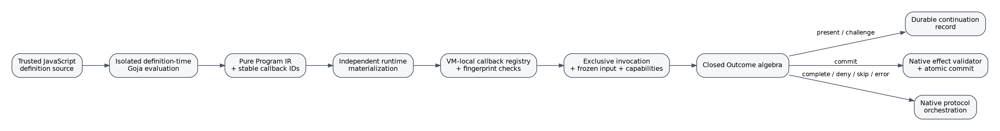
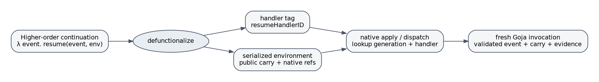
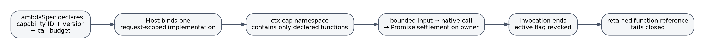
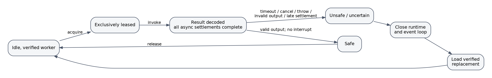
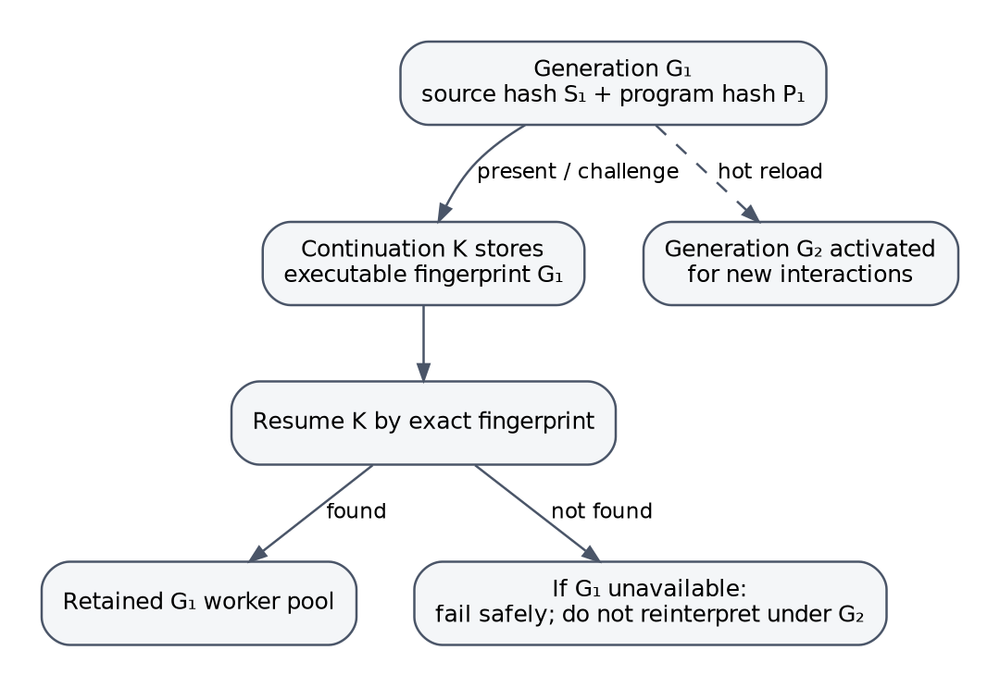
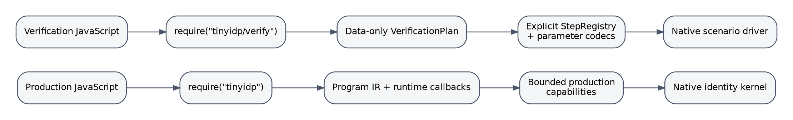

# Abstract

Tiny-IDP's Goja layer is interesting because it does not treat JavaScript as a convenient configuration syntax pasted onto an identity server. It treats scripting as a language-design problem under adversarial and failure-prone conditions. The resulting implementation combines several ideas that are familiar separately in programming-languages research, capability security, concurrency theory, database systems, and formal methods: defunctionalization, continuation-passing structure, dynamic contracts, type-and-effect disciplines, dynamic sealing, object capabilities, algebraic-effect-style command interpretation, linearizable one-use state transitions, actor-like runtime ownership, fail-stop replacement, generation-pinned resumption, staged interpretation, and separate production and verification object languages.

This document develops those connections in detail. For each concept it gives the relevant theoretical lineage, a compact formal reading, the concrete Tiny-IDP mapping, the engineering consequences, and a precision note explaining where the analogy stops. The goal is not to claim that Tiny-IDP proves theorems already established for typed calculi or capability machines. The goal is to show that the implementation has been shaped by the same semantic distinctions: code versus data, value type versus effect authority, continuation versus heap snapshot, name versus behavior, proposal versus commit, failure versus denial, and current code versus the historical generation that created durable state.

The source analysis is pinned to [`go-go-golems/tiny-idp` commit `d164ae59408bdd8bc21516274b446339b1761b1e`](https://github.com/go-go-golems/tiny-idp/commit/d164ae59408bdd8bc21516274b446339b1761b1e), dated 2026-07-20. The active design is [`design-doc/03`](https://github.com/go-go-golems/tiny-idp/blob/d164ae59408bdd8bc21516274b446339b1761b1e/ttmp/2026/07/10/TINYIDP-GOJA-001--go-go-goja-identity-microkernel-scripting-layer/design-doc/03-lambda-first-tiny-idp-javascript-api-with-explicit-browser-continuations.md); the assurance-oriented companion is [`design-doc/02`](https://github.com/go-go-golems/tiny-idp/blob/d164ae59408bdd8bc21516274b446339b1761b1e/ttmp/2026/07/10/TINYIDP-GOJA-001--go-go-goja-identity-microkernel-scripting-layer/design-doc/02-assurance-oriented-core-grammar-and-codebase-refactoring-proposal.md).

# How to read the claims

The strongest useful interpretation is that Tiny-IDP implements a **family of small interpreters around a Go-owned identity microkernel**. JavaScript defines and executes bounded decisions; Go owns protocol validation, browser authority, secrets, replay-sensitive durable state, evidence verification, cryptographic operations, and atomic effects.

Several terms in this report deliberately end in *-style* or *-like*. That wording matters.

- **Runtime type-and-effect discipline** does not mean a static effect system with a published preservation and progress proof. It means the runtime enforces a contract structurally analogous to a type-and-effect judgment.
- **Nominal branding** does not mean JavaScript has gained a nominal static type system. It means the host recognizes fresh objects by identity, not by forgeable structure.
- **Algebraic-effect-style commits** do not constitute a general algebraic-effects calculus. They use the same separation between an inert operation description and a privileged interpreter.
- **Fail-stop worker leasing** does not turn a Goja VM into a formal fail-stop processor. It adopts the operational rule that uncertain components are destroyed rather than trusted again.
- **Generation-aware resumption** is not transparent dynamic software updating. It intentionally avoids state migration by retaining and routing to the exact historical generation.
- **Separate production and verification languages** does not mean two surface syntaxes. The surface language is JavaScript in both cases; the object languages, module profiles, authority, and native interpreters are disjoint.

These precision notes are not qualifications added out of caution after the fact. They identify the exact theoretical property the implementation borrows and the stronger property it does not claim.

# Executive concept map

| Tiny-IDP construct | Closest theoretical lens | Core implementation idea | Strongest defensible claim | Important non-claim |
|---|---|---|---|---|
| Stable handler ID plus public carry | Defunctionalization and explicit continuations | Replace a browser-spanning closure with a tag and bounded environment | Durable control state is first-order, inspectable, and restart-safe | The system does not serialize arbitrary continuations or Goja heaps |
| `LambdaSpec` schemas, outcomes, capabilities, effects, budgets | Dynamic contracts and type-and-effect systems | Validate both declarations and actual crossings | Every invocation is checked against a finite value, control, authority, effect, and resource contract | No static JavaScript soundness theorem is implied |
| Blank Goja objects tracked in Go maps | Dynamic sealing and nominal identity | Accept handles only by object identity | Structural forgery inside the VM does not reproduce authority | This is not cryptographic authenticity outside the process |
| Invocation-scoped `ctx.cap` | Object-capability security | Authority arrives only as a direct host-supplied reference | Ambient authority is sharply reduced and capability lifetime is explicit | The in-process sandbox is not a hostile-code containment boundary |
| `OutcomeCommit` containing effect plans | Algebraic effects, command data, and handlers | Script constructs an inert request; native Go interprets it | Scripts can select declared effects without receiving effect authority | This is not an extensible free-effect calculus |
| One exclusive Goja worker; discard on uncertainty | Actor ownership, affine resources, fail-stop/crash-only recovery | Reuse requires a positive safety result | Interrupted or contaminated VM state is not silently returned to service | Destruction cannot undo external side effects already performed by capabilities |
| Continuation pinned to source and program fingerprints | Dynamic software update theory and versioned semantics | Resume old state only on compatible retained code | Hot reload does not reinterpret historical control state under unrelated semantics | No automatic state-transformer synthesis is attempted |
| Production module vs `tinyidp/verify` module | Staging, DSL separation, proof/checker architectures | Compile to different data languages with different native interpreters | Verification scripts cannot acquire production policy or protocol authority through the verification DSL | Verification plans are evidence-generating tests, not formal proofs by themselves |
| Repeated independent callback registration plus fingerprints | Separate compilation, linking, reproducible materialization | Re-execute source and compare stable registries | Runtime workers agree on symbolic callback linkage and serializable contract identity | Equal registries do not prove callback behavioral determinism |
| Atomic continuation/account/session commit | Linearizability and transaction processing | Revalidate effect sequence and consume one-use state in one transaction | Concurrent terminal attempts have one native commit point | External mail delivery is not made atomic with database state |

{width=96%}

# Part I — A language architecture for an identity microkernel

## 1. Why this is an interpreter problem

An identity provider is a particularly hostile place to add a general scripting API. A conventional embedded-language design tends to expose a large host object—`store`, `request`, `response`, `tokens`, `mailer`, `crypto`, `users`—and then rely on documentation and code review to preserve invariants. That converts protocol correctness into a global property of every script path. An accidental branch can then become an alternate OAuth implementation, an alternate credential store, or an alternate transaction coordinator.

Tiny-IDP takes the opposite position. The script can calculate, branch, call a small number of bounded services, choose a presentation, request a native challenge, or propose an effect plan. It cannot directly make an authorization code valid, set a browser cookie, mark an email verified, consume an invitation, write a password verifier, or commit an identity session. Those are native transitions.

This resembles the old programming-language distinction between a **metalanguage** and an **object language**. Reynolds showed that a definitional interpreter can accidentally inherit semantic properties from the language in which the interpreter is written [@reynolds1972]. Tiny-IDP uses that lesson defensively: it refuses to let JavaScript's ordinary objects, exceptions, Promises, and closures *become* the durable or security-critical semantics of the identity system. JavaScript is the metalanguage in which bounded policy computations are authored; the object language consists of `Program`, `Workflow`, `LambdaSpec`, `Outcome`, `EffectPlan`, `WorkflowContinuation`, provider contracts, and verification plans.

The architecture also follows Landin's enduring idea that language design separates a stable semantic core from domain-specific surface conveniences [@landin1966]. `require("tinyidp").v1` is not primarily a library of helper functions. It is a constructor for a small identity-oriented object language. JavaScript syntax supplies ordinary lexical binding and branching, but the host controls which values cross the semantic boundary.

## 2. The five interpreters

A precise reading identifies at least five interpreters.

### 2.1 Definition-time interpreter

The top level of the JavaScript source executes in an isolated Goja runtime. The native module records schemas, lambda metadata, workflow edges, provider handlers, tests, and VM-local callables. The result is a serializable [`idpprogram.Program`](https://github.com/go-go-golems/tiny-idp/blob/d164ae59408bdd8bc21516274b446339b1761b1e/pkg/idpprogram/program.go) plus a callback registry that never leaves that runtime as data.

This is a staged computation. A source program runs now in order to construct an artifact that will govern later executions. Multi-stage programming research makes such stage distinctions explicit because values and effects that are safe in one stage may be invalid in another [@taha2000]. Tiny-IDP does not use MetaML syntax, but it enforces the equivalent architectural rule: definition-time code may build a contract; it may not start listeners, open stores, or retain request authority.

### 2.2 Materialization and linking interpreter

A compiled `*goja.Program` is executed independently in each owned runtime. The collector reconstructs callback IDs and the serializable program. The loader compares canonical program data and fingerprints. [`pkg/idpscript/runtime_factory.go`](https://github.com/go-go-golems/tiny-idp/blob/d164ae59408bdd8bc21516274b446339b1761b1e/pkg/idpscript/runtime_factory.go) treats materialization as a checked link step, not as “run whatever this VM happened to register.”

### 2.3 Request-time lambda interpreter

The invocation layer validates a native JSON input, leases one runtime, installs only declared capabilities, projects invocation-scoped secret and evidence handles, deep-freezes the context, calls one named callback on the runtime owner, awaits bounded in-request Promises, and decodes one closed outcome. [`pkg/idpscript/invoke.go`](https://github.com/go-go-golems/tiny-idp/blob/d164ae59408bdd8bc21516274b446339b1761b1e/pkg/idpscript/invoke.go) is therefore an interpreter for a small effectful lambda protocol.

### 2.4 Durable workflow interpreter

A browser boundary ends the request and therefore ends the JavaScript invocation. Go stores a versioned [`WorkflowContinuation`](https://github.com/go-go-golems/tiny-idp/blob/d164ae59408bdd8bc21516274b446339b1761b1e/pkg/idpcontinuation/types.go), later validates a fresh request, resolves the historical generation, and invokes the named handler. This interpreter advances a first-order state machine across process restarts.

### 2.5 Native effect and protocol interpreter

The final script result is not self-authorizing. `present` is interpreted through host-owned descriptors and rendering. `challenge` is interpreted by native challenge services. `commit` is interpreted by a named effect validator and transaction. Policy results are normalized by native authorization, claims, or presentation interfaces. This last interpreter is where security-relevant truth is established.

The phrase **identity microkernel** is apt because the native layer is small in *authority shape*, not necessarily in line count. JavaScript may be expressive, but all sensitive effects funnel through a few native gates.

## 3. The semantic firewall: pure data between runtime and kernel

[`pkg/idpprogram`](https://github.com/go-go-golems/tiny-idp/tree/d164ae59408bdd8bc21516274b446339b1761b1e/pkg/idpprogram) deliberately has no Goja dependency. Its values can be copied, canonically encoded, hashed, validated, explained, tested, stored, and compared without a live VM. That package boundary is the system's semantic firewall.

A useful partition is:

```text
runtime-local world                    VM-independent world
-------------------                    --------------------
goja.Callable                          LambdaSpec.ID
blank branded object                   stable descriptor ID
Promise and resolver                   Outcome / pending count
closure environment                    JSON carry + native references
mutable JavaScript object              copied canonical JSON
host callback                          CapabilityRequirement
thrown exception                       classified native error
```

The firewall produces four obligations:

1. **No runtime value leakage.** Durable artifacts contain no function, Promise, resolver, Goja object, goroutine-local state, or SQL transaction.
2. **Total symbolic linkage.** Every callback ID in the program must resolve in every accepted worker.
3. **Closed interpretation.** Every outcome and effect must belong to a finite host vocabulary.
4. **Revalidation at each authority boundary.** A value being serializable does not make it authorized; the next interpreter checks it again.

This pattern is related to domain-specific embedded languages: a host language is used to construct a smaller, inspectable representation that another interpreter executes [@hudak1996; @mernik2005]. The distinguishing security property is that the representation is not merely an optimization IR. It is the boundary that removes ambient host authority.

# Part II — Closed outcomes, typestate, and protocol-shaped control

## 4. A closed outcome algebra

The branch defines a finite result family:

```text
continue   present   challenge   commit
complete   deny      skip        error
```

Mathematically, this can be read as a tagged sum, or coproduct:

$$
\mathrm{Outcome}
  = \mathrm{Continue}(H)
  + \mathrm{Present}(K,P)
  + \mathrm{Challenge}(K,Q)
  + \mathrm{Commit}(E^*)
  + \mathrm{Complete}(V)
  + \mathrm{Deny}(D)
  + \mathrm{Skip}(D?)
  + \mathrm{Error}(D).
$$

Here `H` is a next-handler identifier, `K` is a continuation descriptor, `P` is a presentation value, `Q` is a native challenge request, `E*` is an effect sequence, `V` is a bounded result value, and `D` is a stable diagnostic code.

In a statically typed ML-family language this would naturally be an algebraic data type. In JavaScript it is represented by JSON-shaped objects, but [`ValidateOutcome`](https://github.com/go-go-golems/tiny-idp/blob/d164ae59408bdd8bc21516274b446339b1761b1e/pkg/idpprogram/outcomes.go) restores the closed-family invariant dynamically. The lambda declaration further refines the sum: each handler is allowed only a subset of constructors.

### 4.1 Why exceptions are not decisions

A critical semantic distinction is that a thrown exception is not `deny`, and `undefined` is not `skip`. `deny` is a valid domain decision: the evidence was understood and rejected. `skip` says that a provider or branch is not applicable. `error` says that the computation failed. Conflating them would create security-sensitive fallback behavior—for example, treating a password-verifier outage as “try another factor” or treating malformed invitation data as a normal negative result.

This is a small example of a broader principle from typed protocol design: control alternatives must be explicit in the type or transition vocabulary rather than encoded through ambient exceptions and sentinel values. Typestate systems associate legal operations with an object's current state [@strom1986]. Session types associate legal messages with a protocol position [@honda1998]. Tiny-IDP's outcome declarations perform a dynamic, local version of both ideas: a handler in a particular workflow position may emit only the transitions declared for that position.

### 4.2 Outcome edges as a finite transition system

For a workflow $W$, let handlers be $H_W$. Each compiled edge has the form

$$
(h, o, h', \sigma)
$$

where $h$ is the source handler, $o\in\{\texttt{continue},\texttt{present},\texttt{challenge}\}$, $h'$ is the destination, and $\sigma$ is the destination input schema. Program validation checks that:

- the source and destination exist;
- the source lambda declares outcome $o$;
- the edge schema equals the destination lambda's input schema;
- duplicate edges are rejected;
- all handlers are reachable from the entry.

The graph therefore provides a finite approximation of control even though the body of each JavaScript lambda is opaque to static analysis. Model checking can treat each lambda as nondeterministically choosing one of its declared outcomes, while runtime validation checks the concrete choice. This is a standard abstraction move: retain the security-relevant control alphabet while abstracting away ordinary computation.

### 4.3 Precision note

The workflow graph is not a full session-type derivation and does not statically prove termination. JavaScript can loop until interrupted; a handler can choose among legal results based on arbitrary computation. The graph's value is narrower and practical: it closes the set of externally meaningful transitions and makes browser-spanning edges explicit before requests exist.

## 5. Runtime typestate around browser and durable state

The durable workflow has an observable state machine:

```text
active --Advance--> advanced
active --Consume--> consumed
active --Revoke---> revoked
active --time-----> expired / unavailable
```

Only an active record with the expected revision and complete bindings can advance or terminate. That resembles typestate: operations are legal only in certain states. Because the state is stored in a database and accessed concurrently, however, the guarantee must be stronger than an in-memory type discipline. It requires atomic compare-and-transition behavior.

The combination is useful:

- the **program graph** states which semantic transition is legal;
- the **continuation record** states which concrete instance is current;
- the **store operation** ensures only one concurrent request performs the transition;
- the **native interpreter** decides what effect the transition has.

A static type alone cannot stop two browser POSTs racing. A database constraint alone cannot tell whether `present -> emailVerified` was a declared edge. The implementation layers both.

# Part III — Defunctionalization and serialized continuations

## 6. Defunctionalization: turning functions into first-order data

Reynolds introduced defunctionalization as a whole-program transformation that replaces higher-order function values with a finite family of first-order constructors and replaces application with a dispatcher [@reynolds1972]. Danvy and Nielsen later showed how the technique exposes deep correspondences between higher-order evaluators, abstract machines, and first-order specifications [@danvy2001]. Nielsen supplied a denotational correctness treatment for a typed setting [@nielsen2000].

A schematic transformation begins with closures:

```text
k1 = λx. e1[x, a, b]
k2 = λx. e2[x, c]
```

and produces data:

```text
Kont = K1(a, b) | K2(c)

apply(K1(a,b), x) = e1[x,a,b]
apply(K2(c),   x) = e2[x,c]
```

The constructor tag records *which code* should run. Its fields record the closure's free-variable environment.

{width=92%}

### 6.1 Tiny-IDP mapping

A browser-spanning conceptual continuation might be imagined as:

```javascript
async function signup() {
  const profile = await showSignupForm();
  const verified = await verifyEmail(profile.email);
  const password = await showPasswordForm();
  return commitAccount(profile, verified, password);
}
```

An ordinary implementation of `await` retains a continuation in the language runtime. Tiny-IDP instead makes each browser suspension explicit:

```text
code tag         = ResumeHandlerID
closure env      = Carry + SecretReferences + EvidenceReferences
code generation  = ProgramFingerprint + WorkflowVersion
expected argument= InputSchema + PresentationState
context binding  = request/client/browser/session digests
```

When the next request arrives, the host performs the equivalent of `apply`:

1. hash and load the opaque public handle;
2. verify record state, expiry, revision, browser, client, request, and generation bindings;
3. resolve the exact program generation;
4. find the workflow handler named by `ResumeHandlerID`;
5. validate the fresh event against `InputSchema`;
6. project native evidence and invocation-scoped secrets;
7. invoke the VM-local callback registered under that handler's `LambdaID`.

The serialized record is therefore not “the continuation” in the sense of an arbitrary captured machine stack. It is a **defunctionalized continuation descriptor** understood by a particular native dispatcher.

### 6.2 Why this is more than persistence engineering

The transformation changes the assurance surface.

- **Finite code choices.** The resume target must be a registered handler ID.
- **Schema-visible environments.** Persisted carry is bounded and validated.
- **Version-visible semantics.** The program generation is explicit.
- **Inspectable state.** Operators and tests can reason about the record without a VM heap.
- **Replay control.** The continuation has a revision and terminal state.
- **Secret separation.** Sensitive fields cannot simply be captured by a closure.

Defunctionalization is often introduced as a compiler technique. Here its main benefit is security and durability: it converts implicit language-runtime control into an explicit domain state machine.

### 6.3 Precision note

Tiny-IDP does not automatically transform arbitrary JavaScript `await` expressions into continuation constructors. Authors write named handlers and edges explicitly. The implementation is therefore **defunctionalization-inspired design**, not a source-to-source implementation of Reynolds's general transformation. A future restricted compiler could offer direct-style syntax, but the durable object language would still need the same tags, environments, schemas, and generation bindings.

## 7. Continuations, CPS, and the browser boundary

A continuation represents “the rest of the computation.” In continuation-passing style, a function receives that rest explicitly. Continuations have a long history as both semantic devices and implementation techniques [@reynolds1993; @appel1992]. Web programming made the idea concrete because HTTP naturally fragments one logical interaction into separate requests. Queinnec's work examined how continuations can recover direct-style web programming and also highlighted the new persistence, resource, and deployment problems they create [@queinnec2000; @queinnec2004].

Tiny-IDP makes a strict distinction between two kinds of waiting.

### 7.1 In-request waiting

A capability may return a Promise, and the lambda may `await` it while the HTTP request remains open. The VM, Promise, invocation bindings, and request context remain live. This is ordinary asynchronous control within one failure and lifetime domain.

### 7.2 Browser-spanning waiting

Displaying a form ends the response. The next request may arrive:

- after a process restart;
- on another process in a future deployment topology;
- after a hot reload;
- after the original worker has served many other calls;
- after secrets from the first request should have been erased.

A pending Promise is therefore the wrong semantic object. It has process-local identity, heap reachability, implicit captured data, and a lifetime coupled to one VM. Tiny-IDP terminates the invocation and emits `present` or `challenge`, which the host interprets as a durable continuation record.

### 7.3 CPS reading of a workflow

A handler can be modeled as:

$$
h : I \times C \times A \to O
$$

where $I$ is validated input, $C$ is native context/evidence, $A$ is the capability environment, and $O$ is the closed outcome sum.

A `present` result contains a continuation tag $h'$ and carry $e$:

$$
h(i,c,a) = \mathrm{Present}(h',e,p,t).
$$

The native workflow interpreter then creates record $k$:

$$
k = \langle g,w,h',\sigma,e,b,r,t_{exp}\rangle
$$

with generation $g$, workflow $w$, input schema $\sigma$, bindings $b$, revision $r$, and expiry. A later request event $x$ resumes by:

$$
\mathrm{resume}(k,x) = \mathrm{invoke}(g,h',\mathrm{validate}_{\sigma}(e\oplus x),c',a').
$$

This is continuation-passing structure without retaining a first-class continuation value.

## 8. The continuation record as a security protocol

[`WorkflowContinuation`](https://github.com/go-go-golems/tiny-idp/blob/d164ae59408bdd8bc21516274b446339b1761b1e/pkg/idpcontinuation/types.go#L56-L84) includes much more than a handler and form values. It binds:

- record version;
- keyed hash of a high-entropy public handle;
- workflow and resume handler;
- executable program fingerprint;
- workflow and schema versions;
- validated authorization-request digest;
- client ID, exact redirect URI, and client generation;
- browser, session, and browser-context hashes;
- host-owned presentation state;
- destination input schema;
- public carry;
- native secret and evidence references;
- revision, creation time, expiry, status, and terminal outcome.

This structure makes a continuation a **protocol capability**. Possessing the public handle is necessary but not sufficient. The caller must also arrive through a request whose native bindings match the stored context. The handle is stored only as a domain-separated HMAC, so database disclosure does not directly yield a bearer value.

The service intentionally returns a uniform browser failure while retaining bounded internal failure classes such as missing, expired, replayed, client mismatch, browser mismatch, request mismatch, and generation unavailable. This follows the security-engineering principle of failing safely without turning error detail into an enumeration oracle. Saltzer and Schroeder's fail-safe defaults and least-privilege principles remain directly relevant [@saltzer1975].

## 9. One-use continuation transitions and linearizability

The continuation store exposes `Create`, `Load`, `Advance`, `Consume`, `Revoke`, and cleanup operations. `Advance` must mark the current record advanced and insert the next record atomically. `Consume` must produce exactly one terminal transition. The memory and SQLite implementations share a conformance suite, including concurrent races.

This is naturally analyzed with linearizability. Herlihy and Wing define a concurrent operation as linearizable when it appears to take effect at one instant between invocation and response, preserving a legal sequential specification [@herlihy1990]. For a one-use continuation, the sequential object is simple:

```text
Advance(active, expected revision) -> next active; old advanced
Advance(non-active or wrong revision) -> conflict
Consume(active, expected revision) -> consumed
Consume(non-active or wrong revision) -> conflict
```

For concurrent POSTs $p_1,\ldots,p_n$ against the same revision, the required property is:

$$
\sum_{i=1}^{n} [\mathrm{success}(p_i)] \le 1.
$$

The persistent store determines the linearization point, not the Goja worker. This matters because two lambdas could both compute apparently valid effect plans before either transaction commits. The native compare-and-transition operation is what makes one-use semantics real.

### 9.1 State-machine connection

Schneider's state-machine approach emphasizes defining services by deterministic transitions over replicated or durable state [@schneider1990]. Tiny-IDP's continuation object is not itself a replicated state machine, but the same abstraction discipline applies: public concurrency is reduced to a small sequential transition specification, then store implementations are tested against it.

### 9.2 Precision note

Repository tests demonstrate intended one-winner behavior; this report does not supply a mechanized linearizability proof of the memory or SQLite implementation. The value of the lens is to identify the exact correctness property and the operation that must serve as the linearization point.

# Part IV — Runtime contracts, effects, and nominal identity

## 10. A runtime type-and-effect discipline

Effect systems extend ordinary typing judgments with information about what a computation may do. A simplified judgment has the shape

$$
\Gamma \vdash e : \tau \; ! \; \epsilon,
$$

meaning that under value environment $\Gamma$, expression $e$ produces a value of type $\tau$ and may perform effects described by $\epsilon$. Lucassen and Gifford's polymorphic effect system separated values, effects, and regions to support conservative reasoning about side effects [@lucassen1988]. Talpin and Jouvelot developed related type, region, and effect inference [@talpin1992]. Modern algebraic-effect systems make operation sets similarly explicit [@bauer2014].

Tiny-IDP has no static JavaScript checker of that form. It does, however, assign each lambda a runtime contract with the same dimensions. [`LambdaSpec`](https://github.com/go-go-golems/tiny-idp/blob/d164ae59408bdd8bc21516274b446339b1761b1e/pkg/idpprogram/lambda.go#L20-L39) records:

```text
ID
kind
input schema
output schema
allowed outcome constructors
required capability IDs and versions
allowed native effect kinds
invocation timeout
maximum capability calls
maximum output bytes
source location
```

A compact judgment for the implementation is:

$$
P;\Gamma_C;B \Vdash \lambda_i : \sigma_{in}
  \Rightarrow \{o_1,\ldots,o_k\}[\sigma_{out}] \; ! \; E
$$

where:

- $P$ is the validated program;
- $\Gamma_C$ is the concrete host binding for the lambda's declared capabilities;
- $B$ is its resource budget;
- $\sigma_{in}$ and $\sigma_{out}$ are named schemas;
- $o_1,\ldots,o_k$ are allowed outcome families;
- $E$ is the allowed native effect vocabulary.

The judgment is checked in phases rather than derived statically.

### 10.1 Activation-time checks

[`idpprogram.Validate`](https://github.com/go-go-golems/tiny-idp/blob/d164ae59408bdd8bc21516274b446339b1761b1e/pkg/idpprogram/validate.go) rejects, among other conditions:

- unknown or mismatched schema identifiers;
- recursive schema cycles;
- unsupported or duplicate outcome kinds;
- undeclared or version-mismatched capabilities;
- unsupported or duplicate effect kinds;
- nonpositive time/output budgets or negative call budgets;
- missing workflow handlers;
- incompatible continuation edges;
- unreachable handlers;
- invalid provider state, replay, revocation, or handler contracts.

### 10.2 Invocation-time checks

[`pkg/idpscript/codec.go`](https://github.com/go-go-golems/tiny-idp/blob/d164ae59408bdd8bc21516274b446339b1761b1e/pkg/idpscript/codec.go) and the invocation layer check:

- actual input bytes and structure against the declared input schema;
- exact capability binding IDs and versions;
- call count and payload byte bounds;
- total invocation deadline;
- output byte bound and single-JSON-value encoding;
- output constructor against `AllowedOutcomes`;
- effect kinds against `AllowedEffects`;
- output `Value` against the declared output schema;
- presentation, challenge, and commit-specific invariants.

The result resembles a higher-order contract system. Findler and Felleisen showed how runtime monitors can enforce contracts at higher-order boundaries even where full static checking is unavailable [@findler2002]. Tiny-IDP applies the same broad principle to a host/guest security boundary: declarations are not comments; values and calls are monitored when they cross.

### 10.3 Why the effect component is security-relevant

An ordinary API might validate only input and output shapes. Tiny-IDP additionally asks:

- Which host operations can this callback invoke?
- How many times?
- Which native effects may its result request?
- Which control outcomes may it select?
- How long may it retain a worker?
- How much data may it return?

That is why “type-and-effect” is more accurate than “schema validation.” A stringly typed callback with a JSON schema can still be dangerously overpowered. Authority and resource use are part of the contract.

### 10.4 Precision note

A static effect system typically proves that all reductions preserve a conservative effect approximation. Tiny-IDP checks declarations and observed boundary behavior, but it does not inspect all internal JavaScript actions. For example, pure CPU computation and mutation of permitted runtime-local globals are not represented in `AllowedEffects`; the timeout and worker lifecycle contain them operationally. The contract is sound only for the host-visible vocabulary it mediates.

## 11. Schema design as a bounded information-flow boundary

The schema language supports objects, strings, booleans, integers, and encoded bytes, with explicit byte and length bounds. Object fields refer to named schemas, and `Additional: false` can close the object. This deliberately avoids the full complexity of JSON Schema.

The reduction in expressiveness is valuable because each schema is used in several roles:

- compile-time graph compatibility;
- invocation input validation;
- output validation;
- continuation carry validation;
- public-carry sensitivity checks;
- declarative embedded tests;
- generation compatibility.

A field's `Sensitive` bit acts as a small information-flow label. [`ValidatePublicJSON`](https://github.com/go-go-golems/tiny-idp/blob/d164ae59408bdd8bc21516274b446339b1761b1e/pkg/idpprogram/value.go#L41-L65) rejects values occupying sensitive fields when a value is destined for durable public carry. The same structural type is therefore interpreted under two policies:

$$
\mathrm{ValidateJSON}(\sigma,v)
$$

and

$$
\mathrm{ValidatePublicJSON}(\sigma,v)
  = \mathrm{ValidateJSON}(\sigma,v) \land \mathrm{NoSensitiveOccupancy}(\sigma,v).
$$

This is not a general noninterference system. It does not track derived information or prevent a script from copying a secret it can read into a public string. The stronger design choice is that passwords and comparable secrets are not projected as readable JavaScript strings at all. The sensitivity marker then protects public carry and presentation values from structural mistakes.

## 12. Nominal branding in an untyped language

JavaScript normally uses structural tests: an object is accepted because it has properties with certain names. Structural acceptance is dangerous for authority-bearing handles. A script can manufacture `{ kind: "password", token: "..." }`, copy a field descriptor, or pass an object from a different module instance.

Tiny-IDP instead creates blank Goja objects and records their identity in host-side maps:

```text
map[*goja.Object]string                    // lambda handles
map[*goja.Object]idpworkflow.FieldID       // field handles
map[*goja.Object]idpworkflow.ActionID      // action handles
map[*goja.Object]idpworkflow.SecretHandle  // invocation secret handles
```

A later builder accepts the object only if the exact pointer appears in the expected map. Its JavaScript-visible properties are irrelevant.

### 12.1 Historical lineage: seals and trademarks

Morris's 1973 paper distinguished access limitation from authentication and described seals and trademarks as language mechanisms for protecting and authenticating values [@morris1973]. A seal pairs a wrapping operation with a corresponding unsealing authority; a trademark can attest that a value was produced by a particular abstraction.

Sumii and Pierce later formalized dynamic sealing in an untyped lambda calculus, providing a basis for reasoning about data abstraction in open dynamic settings [@sumii2004]. The essential idea is generativity: a fresh seal identity cannot be reproduced merely by copying the wrapped value's structure.

The Goja handle pattern is a lightweight, in-process version of that idea:

- the host generates a fresh object identity;
- the authority table is private to the native module or invocation;
- a structural lookalike has a different identity;
- the object can be interpreted only by the component that holds the table.

### 12.2 Lambda handles as nominal link references

When `A.lambda(...)` returns a blank object, that object is not the callback. It is a nominal reference to a callback registration. `program.workflow` and `program.provider` accept only such branded references. This prevents scripts from inserting arbitrary functions directly into the serializable graph or forging a reference with a string property.

### 12.3 Field and action handles as grammar tokens

`A.field.email()` and `A.action.submit()` return identities recognized by the collector. Scripts can select among host-defined tokens but cannot invent HTML names, normalization policies, sensitivity rules, or form-validation behavior. The blank object is effectively a terminal symbol in a nominal grammar.

### 12.4 Secret handles as affine capabilities

Invocation secrets use an even tighter form. The JavaScript object has no serializable properties and is accepted only by the matching `ctx.commit` builder in the same invocation. Its native token is not exposed as a JavaScript field.

### 12.5 Precision note

Object identity is unforgeable only within the assumptions of the embedding: the script cannot access the private Go map or manufacture an existing `*goja.Object` pointer. It is not a cryptographic signature and is not suitable as a durable or cross-process credential. Once an effect plan crosses back into Go, the native code must still resolve and validate the token against the request-scoped `SecretSet`.

## 13. Deterministic callback registration as symbolic linking

The program artifact stores callback IDs, not closures. Every worker re-executes the same compiled source and obtains its own VM-local closures. This creates a linking problem:

```text
Program IR:      "signup.submitted"  ----symbolic reference---->
Worker registry: "signup.submitted"  ----local closure---------> function
```

Linking theory asks when separately compiled fragments can be combined safely. Cardelli studied program fragments and linksets as a formal setting for separate compilation and linking [@cardelli1997]. Leroy's module work similarly emphasized interfaces that support independent compilation [@leroy1994]. Tiny-IDP's scale is smaller, but the same distinction appears:

- the serializable artifact is a separately inspectable interface;
- each worker contains local implementations;
- stable names are link symbols;
- activation checks that implementations satisfy the artifact's registry shape.

### 13.1 Four fingerprints

[`pkg/idpprogram/canonical.go`](https://github.com/go-go-golems/tiny-idp/blob/d164ae59408bdd8bc21516274b446339b1761b1e/pkg/idpprogram/canonical.go) computes hashes for:

1. source text;
2. canonical program data;
3. sorted callback registry IDs;
4. schema registry.

These identities serve different purposes.

- **Source hash** detects body changes even if declarations remain identical.
- **Program hash** identifies semantic contract data.
- **Callback-registry hash** identifies symbolic link shape.
- **Schema hash** isolates boundary-shape changes.

The artifact load path checks that independently materialized workers reproduce the expected program, registry, and schema fingerprints. It also checks that `module.exports` is exactly the value produced by `A.program`, preventing an unrelated export from masquerading as the contract.

### 13.2 Reproducible materialization

Build-system theory distinguishes the dependency graph, the tasks that produce outputs, and the mechanisms used to detect whether outputs correspond to inputs [@mokhov2018]. Tiny-IDP's worker load is a miniature reproducible build:

```text
input: compiled source + native schema catalog + module profile
output: program contract + callback registry + runtime image
acceptance: output fingerprints equal artifact fingerprints
```

The system does not trust that “running the same source probably registers the same callbacks.” It checks the observable build products.

### 13.3 Stable names as an ABI

A callback ID functions as an application binary interface at the semantic level. Continuations, workflow edges, provider handlers, audits, explanations, and tests refer to stable names. A rename is therefore not merely a refactor when durable continuations exist; it can be a compatibility break.

This is analogous to symbol names and type identities in linking, but with a stronger temporal dimension: an old database row may contain a name that must still resolve in a retained historical runtime.

### 13.4 What deterministic registration proves

It proves or detects:

- callback name set agreement across workers;
- serializable program agreement;
- schema agreement;
- source identity agreement at artifact level;
- absence of unregistered callback IDs in the accepted runtime image.

It does **not** prove:

- that callbacks are pure;
- that two invocations with equal input return equal output;
- that top-level code has no nondeterministic internal state invisible to the artifact;
- that external capabilities behave deterministically;
- that two different functions cannot share the same explicit ID if the module incorrectly allowed it—hence duplicate registration is rejected.

The phrase *deterministic callback registration* should therefore mean **deterministic symbolic materialization**, not behavioral determinism.

# Part V — Object capabilities and invocation authority

## 14. From ambient authority to explicit capability graphs

Capability systems treat possession of a reference as both designation and authority. Dennis and Van Horn's work on protected objects and computation environments is foundational [@dennis1966], and Levy surveys the development of capability-based systems [@levy1984]. Object-capability systems bring the idea into language-level object references: code can act only through references it has been given.

The security payoff is easiest to see through the confused deputy problem. Hardy described a privileged program that is tricked into using its authority on behalf of an unprivileged caller because authority is ambient and the deputy cannot reliably distinguish whose authority should justify an operation [@hardy1988]. Capability designs address the problem by requiring the caller to supply or possess the specific authority used for the operation. Miller, Yee, and Shapiro connect this to least privilege, confinement, and revocation [@miller2003]; Miller's thesis develops the object-capability model as a composition discipline [@miller2006].

Tiny-IDP does not expose a general object-capability language, but its invocation model follows the central rule:

> A lambda can invoke a host operation only because the host inserted that operation into this invocation's `ctx.cap` object.

There is no global `store`, `fetch`, `process`, `database`, or `mailer`. The runtime factory disables implicit module registries and ambient loaders. The program declares capability requirements by stable ID and version; the selected lambda lists the subset it requires; the host supplies concrete bindings for the call.

{width=94%}

## 15. Authority as a graph intersection

Let:

- $C_P$ be capabilities declared by the program;
- $C_\lambda\subseteq C_P$ be capabilities required by a lambda;
- $C_H$ be concrete capabilities supplied by the host for the invocation.

The usable authority is not a dynamic lookup from the union. It is the checked intersection:

$$
C_{usable} = \{c \in C_\lambda \mid c \in C_H \land \mathrm{version}_H(c)=\mathrm{version}_P(c)\}.
$$

If any required capability is missing or version-incompatible, invocation fails before the callback executes. Extra host bindings are not projected unless required. This is a concrete least-authority rule.

Capability IDs are namespaced (`community.lookup`, `mailer.send`, and so on), and the host constructs nested JavaScript namespaces. The string ID is not itself the authority; it identifies the contract at activation. The actual authority is the invocation-scoped function object inserted by the host.

## 16. Temporal authority and revocation

A subtle risk arises because JavaScript can retain function references in globals. If a callback stores `ctx.cap.community.lookup`, another invocation might try to call it later. Tiny-IDP's binding object contains an `active` flag and an invocation context. When the invocation closes:

- `active` becomes false;
- the capability context is canceled;
- a retained function checks `active` and fails;
- late native completion does not settle authority into a later invocation.

This is temporal revocation by indirection. Capability literature often notes that revocation is possible by inserting a revocable forwarding object between holder and resource [@miller2003]. The invocation function is precisely such a membrane: it mediates each use and can become inert.

There is also a resource aspect. The lambda has a maximum call count, while each capability binding has maximum input and output bytes. Authority is therefore not binary. It is bounded by:

$$
\langle \text{operation}, \text{version}, \text{lifetime}, \text{calls}, \text{input bytes}, \text{output bytes}, \text{deadline} \rangle.
$$

## 17. The Promise bridge as an actor-safe capability protocol

Goja VM access must be serialized through the runtime owner. A native capability may need to perform database or application work off the VM thread. The bridge follows this protocol:

1. on the owner thread, validate the call and encode one bounded JSON argument;
2. create a Goja Promise and its resolver/rejector;
3. increment the invocation's pending-settlement count;
4. perform native work under the invocation context in a goroutine;
5. validate output size and JSON shape;
6. post a settlement task back to the runtime owner;
7. resolve or reject only if the binding is still active;
8. decrement pending state and wait for all settlement goroutines before worker reuse.

This is closely related to actor/event-loop discipline. Actors process messages through a serialized mailbox and own their local state [@hewitt1973; @agha1986]. The Goja runtime is not a full actor, but the owner scheduler provides the key property: arbitrary request goroutines do not concurrently mutate VM state. Capability completion becomes a message posted to the owner.

Maffeis, Mitchell, and Taly's work on object capabilities and JavaScript isolation emphasizes that authority safety depends on the language subset and available ambient references [@maffeis2010]. Tiny-IDP accordingly treats module selection and runtime ownership as part of the security boundary, not as deployment details.

### 17.1 Promise rejection and information control

A native capability panic is recovered and converted into a rejected Promise. The rejection value is a fixed `capability_failed` category rather than a raw backend error. This serves two goals:

- host panics do not cross the VM ownership boundary;
- backend details do not become script-visible or browser-visible data by default.

The script may catch the rejection and return a declared outcome. It cannot obtain an unrestricted error object containing SQL, network, or account-enumeration details.

### 17.2 Precision note

The capability boundary assumes trusted deployment-authored scripts, not arbitrary hostile tenants. The restricted module profile and direct-reference authority substantially reduce accidental and exploitable power, but an in-process JavaScript engine is not claimed as a complete hostile-code sandbox. CPU denial is limited by interruption; memory behavior and engine vulnerabilities remain part of the process threat model.

## 18. Opaque secrets as non-readable capabilities

Password form values enter Go through an exact native parser. Sensitive fields are copied into byte slices, assigned random request-scoped tokens, and removed from ordinary public values. JavaScript receives blank branded objects under `ctx.secret`, not strings.

This has a stronger information-flow effect than marking a string “sensitive.” A readable secret string can be copied, concatenated, logged, stored in a global, returned in JSON, or captured in a continuation. An opaque handle supports only operations the host chooses to interpret.

The authority relation is:

```text
blank Goja object
    -> private invocation map
        -> SecretHandle token
            -> request-local SecretSet
                -> secret bytes for immediate native work
```

The commit builder accepts the blank object only by identity and emits an effect payload containing the native token, not the secret. The final native committer resolves the token against the original submission's `SecretSet`, compares or verifies bytes, and destroys the set after use.

This resembles dynamic sealing [@morris1973; @sumii2004] and object capabilities: the value is both opaque and useful only through a narrow operation. It also has an affine flavor. Linear logic treats resources as values that cannot be duplicated or discarded arbitrarily [@girard1987], and linear-type programming applies that discipline to resource protocols [@wadler1990]. Tiny-IDP does not statically enforce linearity, but the handle is scoped to one invocation and the native set is explicitly destroyed. It is best described as a **dynamically affine secret capability**.

### 18.1 Limitations of erasure

Go's `clear` erases the byte slices owned by `SecretSet`, but complete physical erasure is difficult to prove in a garbage-collected, optimizing system. Copies may have existed in HTTP parsing buffers, runtime internals, operating-system pages, or crash dumps. The architectural guarantee is more modest and still important: secret bytes are not intentionally represented in durable continuation JSON, script-visible strings, effect payloads, metrics, or audits.

## 19. Native evidence: facts that scripts cannot assert

An email-code workflow illustrates the difference between data and evidence. A script may request an email challenge with a declared resume handler and approved template. Native Go:

- generates the code;
- stores only a keyed hash;
- binds the challenge to workflow, handler, generation, client, and browser context;
- controls attempts, resend limits, expiry, and status;
- sends through a typed mailer;
- atomically verifies a submitted code;
- produces `VerifiedEmailEvidence` only after native success.

The resumed lambda receives a bounded evidence projection. It cannot construct the native record, choose the verification result, or mark an email verified by returning `{ verified: true }`.

This is conceptually close to a proof object or authenticated fact: possession of ordinary data is not enough; the trusted checker must produce the evidence. It also follows Morris's distinction between access and authentication [@morris1973]. The system's later commit boundary rechecks evidence bindings rather than trusting that it was once projected into a previous invocation.

# Part VI — Algebraic-effect-style commands and atomic native commits

## 20. The algebraic-effects lens

Algebraic effects model computational effects as operations from a signature, while handlers interpret those operations [@plotkin2009; @plotkin2013]. In a programming language such as Eff, a computation may invoke an operation like `get`, `put`, or `choose`; a handler assigns semantics to those operations, possibly resuming the captured continuation [@bauer2015]. Free structures can represent effectful programs as data that is later folded by an interpreter; “data types à la carte” is a classic modular account of such syntax and interpretation [@swierstra2008].

Tiny-IDP's commit path uses the same essential separation:

```text
script side:   construct inert EffectPlan values
native side:   validate and interpret plans under privileged authority
```

For signup, the effect signature includes operations such as:

```text
createLocalIdentity(payload)
attachPasswordCredential(payload)
consumeInvitation(payload)
establishBrowserSession(... native-owned ...)
```

The JavaScript callback returns `OutcomeCommit{Effects: [...]}`. It does not receive a database transaction or an `accounts.Create` function.

## 21. Effect plans as a free command language

A minimal formalization treats effect plans as syntax:

$$
E ::= \mathrm{CreateIdentity}(p)
   \mid \mathrm{AttachCredential}(q)
   \mid \mathrm{ConsumeInvitation}(r)
   \mid \cdots
$$

and a plan as a sequence $[E_1,\ldots,E_n]$. The script can construct syntax only for effect kinds declared by its `LambdaSpec`. The native committer is an interpreter:

$$
\llbracket [E_1,\ldots,E_n] \rrbracket_{N,S,B}
  \to \mathrm{TransactionResult}
$$

parameterized by native services $N$, request-scoped secret set $S$, and validated browser/protocol bindings $B$.

The important security rule is that constructing a command is not executing it. Authority resides in the interpreter, not in the syntax.

### 21.1 Exact sequence validation

The signup committer does more than check that each effect kind is individually allowed. It accepts only a specific sequence:

```text
[createLocalIdentity, attachPasswordCredential]
```

or

```text
[createLocalIdentity, attachPasswordCredential, consumeInvitation]
```

It then decodes each payload, resolves password tokens against the active submission, verifies confirmation, optionally checks verified-email binding, applies registration policy, prepares the password verifier, and performs one transaction. This resembles a typed handler specialized to one protocol position.

Why reject arbitrary permutations? Because effect sets are not enough to express workflow semantics. `consumeInvitation` before identity creation, two credential effects, or a session effect without validated identity might each use “allowed” operations but represent an invalid protocol. The native sequence validator preserves a stronger grammar.

## 22. Named committers versus generic transactions

The branch's design favors named atomic operations such as signup commit over script-visible transaction primitives. This follows transaction-processing practice: correctness depends on defining the unit of work and its invariants, not merely on exposing `BEGIN`, `COMMIT`, and SQL [@gray1992].

A generic transaction capability would still leave scripts responsible for:

- operation ordering;
- one-time continuation consumption;
- duplicate-login behavior;
- password-verifier preparation;
- invitation redemption;
- session creation;
- interaction terminal state;
- rollback interpretation;
- audit classification.

A named committer packages those into one native transition whose preconditions and postconditions can be reviewed and tested.

### 22.1 Signup atomicity

The native transaction performs, in one store update:

1. consume the already binding-checked workflow continuation;
2. commit the prepared account and credential;
3. redeem a durable invitation if present;
4. create the browser session;
5. consume the OAuth authorization interaction as approved.

The effect plan is therefore only a proposal. The transaction is the authoritative state change.

### 22.2 Linearization point

For concurrent signup submissions, the transaction provides a natural linearization point. Before it commits, multiple workers may have computed plans. After it commits, exactly one continuation and interaction are terminal, and duplicate or replaying attempts fail.

### 22.3 External effects and sagas

Email delivery exposes a boundary transactions cannot hide. The challenge record can be stored before delivery, but SMTP or an external mailer cannot generally participate in the SQLite transaction. Garcia-Molina and Salem's saga model addresses long-lived work decomposed into transactions with compensating actions [@garcia1987]. Tiny-IDP's resend and retry classifications are closer to that world than to one ACID transaction.

The design appropriately keeps the guarantee narrow:

- code generation and challenge-state transitions are native and bounded;
- retries and resends are explicit;
- database state is atomic;
- delivery failure is classified;
- no claim is made that “email sent” and “row committed” are one atomic event.

### 22.4 Precision note

Tiny-IDP does not implement algebraic-effect handlers in the formal sense. There are no first-class user-defined handlers, no general continuation resumption from effect operations, and no proof that operations satisfy an algebraic theory. The analogy identifies the architectural separation between **operation syntax** and **privileged interpretation**. “Command algebra” or “effect-plan interpreter” is equally accurate engineering language.

## 23. Presentation as a constrained effect language

`ctx.present.form` is another effect-like request. The script may select:

- a title;
- a registered resume handler;
- registered field and action descriptors;
- bounded public values and stable field-error codes;
- public carry and expiry.

It may not select:

- arbitrary HTML;
- form action URLs;
- hidden interaction handles;
- CSRF tokens;
- cookies or response headers;
- redirects or HTTP status codes;
- input names or secret redisplay policy;
- arbitrary JavaScript event handlers.

The host validates the presentation against the compiled workflow edge, descriptor registry, destination schema, public-carry policy, and TTL. It then renders provider-owned HTML with provider-owned security headers.

This is a tiny UI command language. The script expresses intent; the native renderer interprets it. As with commit effects, the reduction in authority produces a smaller and more analyzable object language.


# Part VII — Runtime ownership, failure containment, and worker leasing

## 24. The runtime owner as an actor-like authority boundary

Goja values are owned by a particular VM, and the VM is not treated as an object that arbitrary request goroutines may touch concurrently. Tiny-IDP therefore puts every callback lookup, invocation, Promise inspection, settlement, interruption cleanup, and runtime mutation through the `RuntimeOwner` associated with that VM. The resulting shape is close to an actor: one locus owns mutable state, other goroutines communicate with it by scheduled calls or posts, and there is no shared direct access to the VM heap [@hewitt1973; @agha1986].

The analogy is useful because it changes the question from “is this Go object protected by a mutex?” to “who is allowed to execute code *inside this semantic world*?” A mutex can serialize individual method calls while still permitting callers to retain and use runtime-local objects in invalid contexts. An owner API makes possession of a Goja value insufficient. The caller must also execute through the owner that controls its runtime.

A compact ownership invariant is:

$$
\forall v \in \mathrm{GojaValue}(R),\quad
\mathrm{touch}(v) \Rightarrow \mathrm{onOwner}(R).
$$

For a callback `f`, Promise `p`, or object `o` allocated in runtime `R`, all semantically relevant operations occur on `Owner(R)`. Off-owner goroutines may hold copied bytes, stable identifiers, native references, and synchronization state, but not exercise VM semantics.

### 24.1 Calls and posts have different roles

The implementation uses two owner-scheduler forms:

- a **call** enters the owner, performs a bounded operation, and returns a native result;
- a **post** schedules settlement or mutation back onto the owner after asynchronous native work.

This distinction is the concurrency counterpart of the data/authority firewall. A capability implementation runs outside the VM and returns copied JSON. It cannot resolve a Goja Promise directly from its worker goroutine. Instead, it posts a settlement closure to the owner, where the output is parsed into an ordinary JavaScript value and the Promise is resolved or rejected.

The protocol can be written as:

```text
VM owner: create Promise p and native resolver pair
    |
    +--> native worker: invoke bounded capability on copied JSON
                              |
                              +--> owner.Post(settle p with copied result)
```

This is not merely an implementation detail. Promise resolution mutates VM state and schedules JavaScript reactions. Settling from the wrong goroutine would violate both concurrency safety and the intended order of events.

### 24.2 An affine lease, not a shared pointer

A worker obtained from the pool behaves like an **affine resource**: it may be used by at most one invocation at a time, and after use it must be either returned once or destroyed once. Linear logic and linear-type research provide the conceptual background for values that cannot be duplicated arbitrarily [@girard1987; @wadler1990]. Tiny-IDP does not have a static linear type, but the pool protocol enforces an affine lifecycle dynamically.

Let a worker state be:

$$
W \in \{\mathsf{Idle},\mathsf{Leased},\mathsf{Unsafe},\mathsf{Closed}\}.
$$

The legal structural transitions are:

$$
\mathsf{Idle}\to\mathsf{Leased}\to
\begin{cases}
\mathsf{Idle} & \text{after a positive safety result},\\
\mathsf{Unsafe}\to\mathsf{Closed} & \text{after uncertainty or contamination}.
\end{cases}
$$

There is no transition from `Unsafe` back to `Idle`. Replacement creates a fresh worker with a freshly materialized runtime rather than rehabilitating the uncertain one.

### 24.3 Why this is not a complete actor system

The worker is actor-like, but Tiny-IDP does not expose actor identities, mailboxes, selective receive, supervision trees, or location-transparent messaging to JavaScript. The owner is an internal concurrency discipline. The strongest claim is that VM state has one serialized executor and asynchronous re-entry is explicit. That is enough to reason locally about invocation ordering and settlement.

## 25. Fail-stop worker leasing

The phrase **fail-stop worker leasing** combines two ideas. Fail-stop systems attempt to make a component either behave correctly or stop in a way that other components can detect [@schlichting1983]. Crash-only design treats crash and ordinary shutdown as a unified recovery path, reducing the number of lifecycle modes that must be trusted [@candea2003]. Tiny-IDP adopts a local version of both ideas: when an invocation leaves uncertainty about a VM's future behavior, the VM is not reused.

The key policy is asymmetric:

> Reuse requires positive evidence of safety. Disposal requires only uncertainty.

A worker is returned to the pool only when all of the following are true:

1. input validation completed before execution;
2. the named callback existed;
3. the owner call completed without an unsafe interruption;
4. a synchronous value or Promise settled successfully;
5. all capability settlements associated with the invocation finished;
6. the output decoded as one JSON value within its byte budget;
7. the outcome matched the lambda's closed outcome and effect contract;
8. invocation-scoped bindings were revoked.

Timeout, caller cancellation during execution, uncaught exception, Promise rejection at the invocation boundary, malformed or oversized output, interruption cleanup uncertainty, or incomplete settlement makes the worker unsafe.

{width=94%}

### 25.1 Why `ClearInterrupt` is not a rollback

Goja provides interruption and `ClearInterrupt`, but clearing an interrupt only resets one runtime mechanism. It does not prove that:

- user code did not mutate module-level globals before interruption;
- a `finally` block did or did not run;
- a Promise reaction is not queued;
- a native capability is not about to post a late settlement;
- a partially constructed object graph is semantically acceptable;
- a callback did not capture an invocation-scoped authority reference;
- a library invariant survived at an arbitrary interruption point.

In transactional terminology, the VM does not provide rollback of its heap to a pre-invocation snapshot. In language semantics, an asynchronous interrupt is not generally a reduction to a known normal form. Therefore `ClearInterrupt` is cleanup needed before closing or inspecting the runtime, not evidence that the runtime may serve another principal.

### 25.2 Failure classification matters

Not every error destroys a worker. A missing required capability detected before invocation, an unknown lambda ID, or an input schema failure does not run untrusted callback code and leaves the VM untouched. Such errors can return the worker safely. The distinction is:

```text
pre-execution contract failure   -> safe worker, rejected request
post-entry semantic uncertainty  -> unsafe worker, discard and replace
```

This is an important operational refinement. Destroying on every bad request would turn validation errors into a resource-exhaustion attack. Reusing after arbitrary post-entry errors would risk cross-request contamination. The implementation chooses the boundary where runtime state could have changed.

### 25.3 Replacement as local recovery

After discard, the pool loads the same immutable artifact into a new owned runtime and rechecks its fingerprints. Recovery therefore restores a known construction invariant rather than attempting an ad hoc reset procedure. This resembles crash-only recovery: the trusted initialization path is narrower than the set of possible partially failed states.

The design also creates a clean audit and metric vocabulary:

- invocation failed;
- invocation interrupted;
- worker discarded;
- replacement loaded;
- pool capacity restored or degraded.

These are bounded operational dimensions. Raw exception strings and request identities need not enter metrics.

### 25.4 Limits of fail-stop containment

Destroying the VM does not undo effects that escaped through a capability. A directory read is harmless to repeat only if the backend semantics permit it. A mail send, payment request, or mutation may already have occurred. The capability contract, native idempotency keys, or named committer must address those external effects. Worker disposal contains *future VM behavior*; it is not distributed rollback.

## 26. Cancellation, deadlines, and late settlement

Asynchronous embedding creates three clocks:

1. the caller's request context;
2. the lambda's declared timeout budget;
3. each native capability's completion schedule.

A correct bridge must handle every ordering among them. In particular, a capability may ignore cancellation and complete after the JavaScript invocation has timed out. If that completion can resolve a Promise in a worker that has already been returned to the pool, one principal's result may enter another principal's invocation.

Tiny-IDP prevents that with invocation-scoped binding state:

- `active` is set while the invocation owns the binding;
- the capability call count and pending-settlement count are per invocation;
- closing the binding clears `active` and cancels its context;
- settlement posts recheck `active` on the owner before touching the Promise;
- a timed-out worker is discarded, so even an incorrectly retained VM-local reference is not given to another request.

The safety property is:

$$
\neg \mathrm{active}(I) \Rightarrow
\mathrm{settle}(I,p,x) \text{ performs no VM-visible mutation}.
$$

### 26.1 The timeout race

A context timer may fire while the owner call is finishing. The code records whether interruption was initiated and uses a deferred cleanup path to force `safe = false` whenever interruption may have happened. This deliberately resolves ambiguous races toward disposal.

A typical race is:

```text
T0 callback computes a result
T1 context deadline fires and calls VM.Interrupt
T2 owner call returns
T3 stopInterrupt reports that the callback may have run
```

Even if the returned value looks valid, the runtime experienced an uncertain interruption ordering. Returning it to the pool would require a proof that no queued or partially executed state remains. The implementation discards instead.

### 26.2 Promise polling and ownership

The worker checks Promise state through owner calls. It never reads `promise.State()` concurrently from an arbitrary goroutine. Once fulfilled, it serializes the exported result while on the owner. Once rejected, the invocation produces a bounded native error instead of exporting arbitrary rejection objects across the boundary.

Polling is not the only possible design; an event-driven completion channel could also work. The semantic requirements are the same:

- Promise state is observed on the owner;
- completion is bounded by the invocation context;
- rejection is classified;
- output is copied before the worker can be released;
- all invocation capability settlements are accounted for.

### 26.3 Temporal non-interference

The combination of active flags, per-invocation contexts, settlement accounting, deep-frozen inputs, and worker discard approximates a temporal non-interference property:

> Authority and asynchronous consequences installed for invocation $I_1$ must not become usable or observable as authority in later invocation $I_2$.

This is weaker than a formal non-interference theorem: shared native backends and timing channels still exist. It is nevertheless a strong and testable embedding invariant. The branch includes explicit tests in which a slow capability completes after timeout and must not affect the replacement worker.

## 27. Saturation, backpressure, and resource effects

A bounded worker pool is not only a performance optimization. It is an authority and resource boundary. Every active worker owns a Goja heap, event loop, callback registry, native module instance, and potential pending capabilities. Creating one runtime per incoming request without an admission limit would convert request volume directly into memory and goroutine growth.

The pool therefore exposes a finite capacity $N$. An invocation must acquire one exclusive worker before its context expires. If none becomes available, the call fails with a saturation error rather than creating unbounded runtime state.

This can be modeled as a counting resource:

$$
0 \le \mathrm{ActiveWorkers}(t) \le N.
$$

The lambda's own budget adds nested limits:

$$
\mathrm{capCalls}(I) \le B_c,\qquad
\mathrm{outputBytes}(I) \le B_o,\qquad
\mathrm{duration}(I) \le B_t.
$$

Traditional type-and-effect systems track semantic effects such as state or I/O. Here the runtime contract also tracks **resource effects**: time, call count, bytes, and worker occupancy. These do not prove a tight worst-case complexity bound, but they convert several unbounded behaviors into explicit rejection points.

### 27.1 Backpressure instead of hidden queues

A saturated pool may wait until the caller's context expires, but it does not grow an unbounded internal work queue. The caller therefore participates in backpressure. Production policy can place an HTTP-level timeout, rate limit, or concurrency limit around the pool according to service objectives.

### 27.2 Readiness versus saturation

The generation manager distinguishes a warmed but currently busy pool from an unavailable generation. `Idle == 0` is not a readiness failure if all workers are legitimately active. A closed pool, zero capacity, or failed generation is different: no amount of waiting can make it serve correctly.

This separation prevents a common operational mistake in which normal load causes readiness probes to remove healthy instances, amplifying overload.

### 27.3 What to measure

Useful bounded metrics include:

- capacity, active, and idle workers;
- acquisitions that timed out;
- invocation latency by coarse outcome class;
- interruption count;
- discarded and replacement workers;
- activation and warmup failures;
- retained generation count.

Callback IDs, user IDs, emails, raw errors, and arbitrary capability names should not become unbounded metric labels. The code's use of stable outcome and reason categories follows that rule.

# Part VIII — Generation-aware resumption and semantic updates

## 28. A continuation resumes in semantic time

A durable continuation is created under a particular executable interpretation. Handler names alone are insufficient to identify that interpretation. A later source file could reuse `signup.submitted` while changing its logic, capability set, effect plan, or security meaning. Resuming the old record under the new body would silently reinterpret historical state.

Tiny-IDP therefore gives an executor an **executable generation fingerprint** derived from both source and serializable program identity. The continuation persists that fingerprint. New browser interactions use the active generation; resumed interactions resolve the persisted generation explicitly.

{width=95%}

A useful judgment is:

$$
G \vdash C \Downarrow h
$$

meaning generation $G$ validates continuation $C$ and resolves its resume handler $h$. The first premise is exact identity:

$$
C.\mathrm{programFingerprint}=G.\mathrm{fingerprint}.
$$

Only then are workflow version, handler existence, and schema compatibility checked.

### 28.1 Source identity and program identity

The code distinguishes several hashes:

- source fingerprint;
- canonical program fingerprint;
- callback-registry fingerprint;
- schema fingerprint.

For runtime-worker equivalence, the program, callback, and schema fingerprints detect materialization drift. For durable resumption, source plus program identity matters because two sources can produce the same declared contract while containing different callback bodies. A lambda body change is semantically relevant even when handler IDs and schemas are unchanged.

This is an important correction to “configuration hash” thinking. Durable control state depends on executable behavior, not only on the shape of configuration data.

## 29. Comparison with dynamic software updating

Dynamic software updating research asks how a running program can replace code while preserving live state, often using explicit state transformers and update points [@hicks2005; @stoyle2005; @neamtiu2006; @hayden2014]. Tiny-IDP deliberately chooses a simpler semantic strategy:

- do not mutate a live Goja runtime into a new version;
- do not transform suspended JavaScript stacks or closure environments;
- do not route old durable state to the newest code by default;
- construct a fresh generation, warm it, then atomically publish it for new work;
- retain old generations long enough for compatible continuations to finish.

This is **version coexistence**, not transparent DSU. It resembles blue-green deployment inside one process, with content-addressed routing for durable control state.

### 29.1 Advantages of coexistence

Coexistence removes several hard proof obligations:

- no heap-state transformer between arbitrary JavaScript versions;
- no need to define the meaning of a suspended Promise after update;
- no mixed old-stack/new-function execution;
- no need to determine whether a closure's lexical environment remains valid;
- rollback is pointer publication, not inverse state migration.

It also makes the operational story inspectable: the continuation names the generation; the manager either retains it or reports generation unavailable.

### 29.2 Costs of coexistence

The tradeoff is resource retention. If the maximum continuation lifetime is $T_c$, reload frequency is $f$, and each generation owns $N$ workers with average footprint $M$, naive retention may require roughly:

$$
\mathrm{Memory} \approx (1 + fT_c)NM
$$

until bounded eviction or natural completion reduces the set. Production policy must therefore align:

- maximum continuation TTL;
- maximum retained generation count;
- reload frequency;
- worker count per generation;
- expected completion distribution.

Evicting a generation earlier than its live continuation TTL converts a liveness promise into a safe terminal failure. That may be acceptable, but it should be an explicit operational contract.

### 29.3 When migration may eventually be needed

For very long-lived workflows, retaining full runtimes may be too expensive. A future design could introduce a versioned, native continuation schema with explicit migrations:

$$
\mu_{v\to v+1}: C_v \to C_{v+1}.
$$

Such a migration should transform only first-order durable data, never a Goja heap. It would need validation, idempotency, audit, rollback strategy, and probably a rule that security bindings cannot be weakened. The existing first-order continuation format is what makes such migration imaginable.

## 30. Activation as a transaction and a checked build

The generation manager does not publish source immediately after parsing. A candidate passes a multi-stage activation protocol:

1. compile bounded source;
2. materialize the serializable program;
3. validate graph, schema, capability, effect, and budget invariants;
4. compute fingerprints;
5. create the isolated runtime factory;
6. load multiple independent workers and verify their registries;
7. bind the host-owned profile and capabilities;
8. run embedded deterministic tests;
9. warm the bounded pool;
10. atomically publish the candidate;
11. retain and later drain prior generations.

This resembles both a database transaction and a build system. The candidate is prepared privately; publication is the commit point. Any precommit failure leaves the previous active generation unchanged.

Build-system research emphasizes dependency structure, reproducibility, and the difference between constructing an artifact and making it current [@mokhov2018]. Content-addressed deployment systems similarly use immutable build results and explicit references to avoid mutable-name ambiguity [@dolstra2004]. Tiny-IDP's fingerprints are not a full reproducible-build system, but they serve the same local purpose: activation and continuation routing refer to immutable semantic identities rather than a mutable filename.

### 30.1 Checked linking

Cardelli characterized linking as a distinct semantic operation rather than an incidental loader step [@cardelli1997]. Tiny-IDP performs a form of dynamic linking:

```text
symbolic LambdaSpec.ID
          + independently registered runtime callback
          + matching schema/program fingerprints
          ------------------------------------------------
          accepted executable generation
```

The linker refuses missing callbacks, extra callbacks, changed schemas, changed program contracts, or a `module.exports` value that does not equal the program collected by the native module.

### 30.2 Embedded tests as an activation predicate

Program tests are serializable cases naming a lambda, input, expected outcome, and bounded fake outputs. The candidate runs them before publication. Thus activation has a predicate:

$$
\mathrm{Ready}(G)=
\mathrm{Valid}(G)\land
\mathrm{Linked}(G)\land
\mathrm{Warmed}(G)\land
\bigwedge_{t\in G.Tests}\mathrm{Pass}(G,t).
$$

Passing tests does not prove general correctness. It does, however, prevent a known bad candidate from replacing a working generation and makes operational expectations part of the artifact.

## 31. Retention, draining, and generation liveness

The manager maintains:

- one active executor for new interactions;
- a map from fingerprints to retained executors;
- an ordered retention set;
- a bounded number of predecessors;
- close and drain behavior for evicted generations.

A continuation resolver is therefore an explicit semantic dependency service. `ResolveProgram(fingerprint)` succeeds only while the corresponding generation remains retained.

### 31.1 Safety and liveness are separate

Generation pinning gives a safety property:

> A continuation is never resumed by a different executable generation merely because it is current.

Retention policy gives a liveness property:

> A continuation whose generation remains retained can still make progress.

The first is fail-closed and local. The second depends on operational capacity, TTLs, reload policy, and process lifecycle. Conflating them would lead to an overclaim such as “all continuations survive reload.” The accurate statement is “reload does not reinterpret them; compatible retained generations can resume them.”

### 31.2 Draining without use-after-close

An evicted generation must not be closed while a request is using one of its workers. The pool's close protocol waits for active leases, cancels pool lifetime, then closes owned runtimes. Generation eviction occurs outside the publication lock so expensive close work does not block selection of the active generation.

### 31.3 Rollback

Rollback is naturally represented by activating a previously retained fingerprint or by leaving the active pointer unchanged after a failed candidate. No source mutation is needed. Because continuations already name their own generation, rollback for new work does not change the meaning of old in-flight workflows.

### 31.4 Fingerprint caveats

A hash proves byte equality with respect to the hashed representation, not semantic correctness. It also depends on canonicalization remaining stable and on cryptographic collision resistance. Operational keying should treat fingerprints as identifiers, not as authorization secrets. Where source secrecy matters, hashes may still reveal equality across deployments.

# Part IX — Separate production and verification languages

## 32. One metalanguage, two object languages

Both production policy and verification scenarios are authored in JavaScript, but they compile into different object languages and are interpreted by different native engines.

{width=96%}

The separation is:

| Dimension | Production scripting | Verification scripting |
|---|---|---|
| Native module | `require("tinyidp").v1` | `require("tinyidp/verify")` |
| Artifact | `idpprogram.Program` plus callbacks | `verifyplan.Plan` |
| Runtime use | request-time owned worker pool | compile-only plan construction |
| Authority | explicitly bound policy capabilities | no provider, store, network, assertion, or driver authority |
| Result interpreter | workflow/provider executor and native committers | registered native scenario driver and assertions |
| Failure effect | deny/error request or reject activation | reject plan or mark scenario failed |

This is a form of **language-based privilege separation**. The same familiar syntax does not imply the same semantics. An expression can only name constructors installed by its module profile, and the produced data is accepted only by the corresponding native interpreter.

### 32.1 Why not one universal scripting module?

A universal module containing both production capabilities and test controls would create dangerous confusion:

- a verification script could accidentally or maliciously invoke live policy services;
- a production callback could acquire fake clock or failpoint authority;
- scenario steps could become a backdoor command language in the request path;
- audits could not distinguish declarative test intent from production decisions.

Separate modules make the authority distinction syntactic, material, and testable. The verification compiler creates a fresh Goja runtime with only the verification module and an ambient-module-denying loader. It exports plain plan data and closes.

### 32.2 DSLs as object languages

Research on domain-specific languages distinguishes the host notation from the restricted domain semantics it constructs [@hudak1996; @mernik2005]. Tiny-IDP has two embedded DSLs:

- a production DSL whose dynamic leaves are named lambdas with bounded contracts;
- a verification DSL whose leaves are data-only scenario steps and assertions.

The verification DSL is even more restrictive: JavaScript does no request-time execution after compilation. Native Go executes the plan.

## 33. Verification plans and typed step materialization

A `verifyplan.Plan` contains suites, scenarios, steps, and assertions. A step has a stable `Kind` and bounded JSON parameters. Early versions of such designs often stop there and let a driver switch on arbitrary strings. That leaves an open command language: misspelled or unknown kinds fail only during execution, and parameter grammars live implicitly in driver code.

The branch introduces an explicit `StepRegistry`:

```go
type StepValidator func(json.RawMessage) error
type StepRegistry map[string]StepValidator
```

Before a driver sees any scenario, `Plan.ValidateWithSteps` checks every step against a nonempty registry. Each registered kind owns a strict parameter validator. Parameter-free steps use `ExactObjectValidator`, which requires exactly one JSON object and rejects unknown fields or trailing values.

The materialization judgment is:

$$
\Gamma_{steps}\vdash \mathrm{Step}(k,p)\;\mathrm{ok}
\quad\text{iff}\quad
k\in\mathrm{dom}(\Gamma_{steps})
\land \Gamma_{steps}(k)(p)=\mathrm{success}.
$$

A complete plan is executable only if every step materializes under the driver's registry.

### 33.1 A finite, reviewable instruction set

The registry turns the scenario plan into a small instruction set. Adding an instruction requires:

1. a stable step identifier;
2. an exact parameter codec;
3. a native driver implementation;
4. tests connecting accepted parameters to behavior.

This makes accepted verification authority enumerable. There is no fallback “unknown step” handler and no arbitrary function name lookup.

### 33.2 Validation before observation

The runner validates the entire plan before the driver executes the first step. This avoids partial execution of a plan that later turns out to contain an unknown operation. It is analogous to validating bytecode before interpretation or linking all symbols before starting a transaction.

### 33.3 Assertions remain separately registered

Assertions are also named native functions. A scenario records observation data; the runner resolves `assertion.ID@version` in an explicit map. This preserves the same producer/checker separation: JavaScript may request an assertion but cannot supply the code that decides whether the property holds.

## 34. The proof-carrying-code analogy—and its limit

Proof-carrying code separates an untrusted producer from a trusted, relatively small checker. Code is accepted only when accompanied by evidence that the checker validates against a safety policy [@necula1997]. Tiny-IDP's artifacts have a related architecture:

- JavaScript produces a program or verification plan;
- native validation checks schemas, effects, capabilities, edges, budgets, and step codecs;
- fingerprints bind the checked representation;
- activation or execution occurs only after checking.

This is a **checker-centric architecture**, but the artifacts are not proof-carrying code in the formal sense. They do not contain machine-checkable proofs of semantic safety. Embedded examples, fingerprints, and declarative metadata are evidence and contracts, not derivations in a logic.

The useful lesson from proof-carrying systems is organizational:

> Keep the trusted acceptance predicate smaller and more stable than the language that produces candidates.

Tiny-IDP does this repeatedly. The compiler may be expressive JavaScript; the activation validator operates on pure Go data. A workflow lambda may branch arbitrarily; the native output checker accepts only one closed outcome. A scenario author may generate plans programmatically; the step registry accepts only finite native operations.

### 34.1 Toward richer certificates

The architecture could later attach stronger certificates without changing the basic boundary:

- model-checker results keyed by program fingerprint;
- static-analysis summaries of capability use;
- proof that every `commit` path requires verified evidence;
- signed review approvals for production profiles;
- transition-coverage reports;
- conformance-suite evidence.

The native activation policy would need to define which certificates are advisory and which are mandatory. A certificate should never silently confer runtime authority beyond the checked program contract.

## 35. Security automata, scenario drivers, and model-based testing

A verification plan describes actions; a native driver produces observations; registered assertions evaluate traces. This resembles model-based testing, where abstract operations drive the system and observations are compared against model properties [@utting2007]. It also relates to security automata, which recognize allowed prefixes of an execution trace and can enforce safety properties [@schneider2000].

Suppose a scenario produces observations:

$$
\tau = o_1,o_2,\ldots,o_n.
$$

An assertion may check a safety property such as:

$$
\Box(\mathrm{artifactIssued}\Rightarrow
\mathrm{previously}(\mathrm{interactionApproved})).
$$

A runtime monitor may similarly reject or flag a trace prefix when it observes a terminal outcome twice. The same stable IDs can connect:

- scenario steps;
- native transition descriptors;
- runtime observations;
- model actions;
- static-analysis rules;
- human audit explanations.

### 35.1 Safety properties fit especially well

Security automata are strongest for safety properties—violations detectable by a finite bad prefix. Tiny-IDP's core invariants have that form:

- a continuation is consumed twice;
- an artifact is issued before approval;
- a script effect commits without verified evidence;
- a browser binding changes;
- an unknown outcome is accepted;
- an unsafe worker is reused.

Liveness properties such as “every valid continuation eventually completes” require assumptions about availability, user action, generation retention, and scheduling. They need different reasoning.

### 35.2 The driver remains trusted

A scenario plan does not validate itself. The driver maps abstract steps to real calls, and assertions interpret observations. Bugs or omissions there can produce false confidence. The design's registered codecs reduce ambiguity, but assurance still requires differential tests, trace completeness checks, and review of driver-to-production correspondence.

## 36. Embedded tests and deterministic fakes

Production program artifacts may include bounded declarative tests. The test runner provides only a fixed set of deterministic fake capabilities such as clock, random, mailer, identity lookup, invitation lookup, and store lookup. A lambda must declare the capability, and the fake exists only inside the test runner.

This yields a hermetic test judgment:

$$
G, F_t \vdash \mathrm{invoke}(\lambda,x)\Downarrow o
$$

where $F_t$ is a finite test-only binding environment. The same artifact under production has a different environment $F_p$; test fakes are not globally registered or available to request workers.

Property-based testing popularized generation of many inputs against executable properties [@claessen2000]. Tiny-IDP's embedded tests are example-based rather than fully generative, but the pure schemas and deterministic runner make property-based extensions straightforward. A generator could produce schema-valid inputs and fake responses, while the closed outcome set supplies a compact oracle surface.

### 36.1 Determinism as a test resource

A fake clock and random source make scenarios replayable. Determinism here does not mean production callbacks are mathematically deterministic. It means the test interpreter can control nondeterministic inputs explicitly instead of inheriting wall clock, ambient randomness, or live network state.

### 36.2 Test authority must not leak

The strongest negative test is not merely “the fake works.” It is “production runtimes cannot resolve or retain the fake.” That includes:

- different module profiles;
- different capability binding construction;
- no global fake registry;
- invocation-scoped lifetime;
- tests for retained-global reuse failure.

# Part X — Assurance grammar and formal reasoning

## 37. Stable vocabulary and the three-schema boundary

As a system grows, the same security concept tends to acquire several unrelated names: a persistence bit, a trace event string, a model action, a test-driver command, and a static-analysis rule. Vocabulary drift is dangerous because each assurance layer may appear green while referring to subtly different semantics.

The branch begins consolidating stable versioned identifiers for resources, facts, obligations, steps, effects, outcomes, observations, and properties in a dependency-neutral `internal/assurance` package. Examples include:

```text
interaction@v1
request.validated@v1
authn.login.required@v1
authorize.commit@v1
consume_once@v1
continuation.created@v1
authorization.artifacts_once@v1
```

The IDs are bounded ASCII names, not Go type names or user-controlled labels. Versioning acknowledges that semantic meaning may evolve.

### 37.1 Configuration schema

A configuration reference identifies an already compiled script generation. It says what is selected or desired. It does **not** claim that a transition ran or a property held.

### 37.2 Native transition catalog

A transition descriptor records metadata about a Go-owned operation:

- resources read and written;
- required and produced facts;
- obligations discharged or created;
- effects;
- possible outcomes;
- emitted observations.

The catalog is initially descriptive. It supports review, model export, and instrumentation; it is not itself a generic production dispatcher.

### 37.3 Scenario and trace schema

A scenario requests registered native steps with bounded parameters. A trace records actual observations and outcomes. A catalog saying that a step *should* emit an observation does not manufacture that observation in a trace. This prevents metadata from conferring evidence.

The separation can be summarized as:

$$
\mathrm{Configuration}\not\Rightarrow\mathrm{Execution}\not\Rightarrow\mathrm{PropertyProof}.
$$

Each arrow requires independent evidence.

### 37.4 Why dependency neutrality matters

If the vocabulary imported Fosite, HTTP, persistence, or Goja packages, it could not serve as a common language for models, analyzers, tests, and traces without circular dependencies. Keeping it data-only allows multiple consumers to share identities without sharing authority or implementation types.

## 38. An abstract state machine for the scripting subsystem

A useful formal model need not reproduce every HTTP or OAuth detail. It can isolate the interpreter boundaries. Let system state be:

$$
\Sigma = (G_a,G_r,W,C,E,I,S,T)
$$

where:

- $G_a$ is the active generation;
- $G_r$ is the set of retained generations;
- $W$ maps workers to lifecycle state and generation;
- $C$ maps continuation hashes to versioned records;
- $E$ maps native evidence references to challenge state;
- $I$ maps OAuth interactions to pending or terminal state;
- $S$ is native identity/session/store state;
- $T$ is the secret-free observation trace.

Representative transitions include:

```text
ActivateCandidate
AcquireWorker
InvokeLambda
SettleCapability
DiscardWorker
CreateContinuation
LoadContinuation
AdvanceContinuation
VerifyEvidence
CommitEffects
ConsumeContinuation
EvictGeneration
```

### 38.1 Core invariants

**I1 — Symbolic callback integrity**

$$
\forall w\in W_{usable},\quad
\mathrm{registryFingerprint}(w)=
\mathrm{registryFingerprint}(w.generation).
$$

**I2 — Exclusive worker ownership**

$$
\forall w,\quad \#\{i\mid \mathrm{owns}(i,w)\}\le 1.
$$

**I3 — Unsafe workers are never reused**

$$
W(w)=\mathsf{Unsafe}\Rightarrow
\neg\Diamond(W(w)=\mathsf{Idle}).
$$

**I4 — Temporal capability scope**

$$
\mathrm{capCall}(i,c)\Rightarrow
\mathrm{active}(i)\land c\in\mathrm{declaredCaps}(i.lambda).
$$

**I5 — Secret non-serialization**

$$
\forall c\in C,\quad
\mathrm{Carry}(c)\cap\mathrm{SecretBytes}=\varnothing.
$$

**I6 — Generation fidelity**

$$
\mathrm{resume}(c,g)\Rightarrow
c.fingerprint=g.fingerprint\land g\in G_r.
$$

**I7 — One-use continuation transition**

For any active continuation revision, at most one `Advance` or terminal `Consume` linearizes successfully.

**I8 — Native evidence authenticity**

$$
\mathrm{verifiedEmail}(x)\Rightarrow
\exists e\in E:\mathrm{NativeVerify}(e)=x.
$$

A script-created JSON object with the same fields is not evidence.

**I9 — Commit authority**

$$
\mathrm{identityOrSessionMutation}\Rightarrow
\mathrm{insideNamedNativeCommitter}.
$$

**I10 — Artifact issuance ordering**

$$
\mathrm{OAuthArtifactIssued}(i)\Rightarrow
I(i)=\mathsf{Approved}\land
\mathrm{nativeValidationComplete}(i).
$$

### 38.2 Refinement obligations

An abstract model becomes meaningful only when connected to code. For each transition descriptor, refinement work should identify:

- the concrete Go entry point;
- the concrete state read and written;
- the atomicity boundary;
- the error-to-outcome mapping;
- the observations emitted on every terminal path;
- tests that compare concrete execution with the abstract transition.

Metadata alone does not prove refinement. The branch's proposed transition catalog is valuable precisely because it can become a checklist for this mapping.

## 39. Which formal tools fit which question?

Different tools illuminate different parts of the design.

### 39.1 TLA+ for concurrency and lifecycle

TLA+ is well suited to state machines with concurrency, nondeterminism, safety, and liveness [@lamport2002]. A compact specification could model:

- simultaneous continuation advances;
- worker acquisition and discard;
- late capability settlement;
- activation and generation eviction;
- challenge verification and resend;
- transaction commit versus conflict.

Useful safety properties include one-use consumption, no unsafe reuse, and no cross-generation resume. Liveness properties require fairness assumptions, for example that a retained generation's worker eventually becomes available.

### 39.2 Alloy for finite relational structure

Alloy is well suited to finite structural questions and counterexample generation [@jackson2016]. A model could check:

- every workflow handler is reachable;
- every continuation edge's schema matches its destination;
- provider handlers refer to compatible lambdas;
- no secret-marked field appears in public carry;
- every effect requested at a slot belongs to its allowed set;
- every production profile binds all required capabilities;
- generations and continuations form valid reference relations.

These are closer to activation-time structure than to request-time scheduling.

### 39.3 Redex for the object-language semantics

PLT Redex supports executable reduction semantics, randomized testing, and metafunctions for programming languages [@felleisen2009]. A small Tiny-IDP calculus could define:

$$
e ::= \mathrm{invoke}(h,x)\mid
\mathrm{present}(h,c)\mid
\mathrm{challenge}(h,c,q)\mid
\mathrm{commit}(\vec E)\mid\cdots
$$

and reduction rules showing which outcomes suspend, which continue immediately, and which require native authority. Redex could test determinism of validation rules and preservation of well-formed workflow states.

### 39.4 Stateful property and model-based tests

Go tests can generate sequences of abstract actions and compare memory and SQLite stores against a reference model. Linearizability checking is particularly appropriate for one-use continuation, invitation, and evidence consumption [@herlihy1990]. Property-based generation can search interleavings and minimize counterexamples [@claessen2000]. Model-based testing provides the engineering workflow for turning abstract state machines into executable drivers [@utting2007].

### 39.5 Static analysis

A transition catalog can generate or validate static rules such as:

- only approved functions may call the artifact-issuance sink;
- only a named committer may call certain store mutations;
- every invocation boundary emits a bounded trace event;
- raw secret types do not flow to JSON encoders or audit fields;
- production runtime factories disable ambient modules.

Static metadata should point to real symbols and be checked against the implementation. Otherwise it risks becoming aspirational documentation.

## 40. Threat model, limits, and honest claims

The scripting layer is designed for trusted deployment code reviewed and operated with the identity provider. It is not a claim that hostile multi-tenant JavaScript can safely execute in-process. The isolation posture limits accidental authority and many classes of exploit impact, but Goja, native module code, and the Go process remain one address space.

### 40.1 Trusted computing base

The TCB includes at least:

- Goja and go-go-goja runtime ownership;
- the native Tiny-IDP module and codecs;
- `idpprogram` validators;
- capability implementations;
- continuation and challenge services;
- memory or SQLite stores and transaction implementations;
- Fosite integration;
- native committers;
- cryptographic keys and random sources;
- generation manager and activation policy;
- audit and renderer boundaries.

A narrow script surface does not make defects in these components harmless.

### 40.2 Behavioral determinism is not guaranteed

Deterministic callback registration means workers agree on names and serializable contracts. It does not prove that callback bodies return the same outcome for the same input. JavaScript may depend on permitted capability results, mutable module globals, property enumeration details, or other runtime behavior.

Production profiles should either prohibit or carefully review mutable globals. A particularly strong future profile could reload or reset runtime state per invocation, but that has performance costs. Another option is static analysis that rejects top-level mutable bindings used by callbacks.

### 40.3 Resource bounds are not full denial-of-service isolation

Timeouts, byte limits, call budgets, and pool capacity sharply reduce unbounded work. They do not guarantee precise CPU, allocation, or garbage-collection quotas. A script may allocate heavily before interruption or exploit expensive host conversions. Process-level isolation remains the stronger boundary for hostile code.

### 40.4 External effects are not exactly once

Native transactions give one commit point for store state. External mail, directory services, or other capabilities may observe retries or ambiguous completion. Idempotency keys, replay-safe native references, delivery state, and compensating workflows must address those systems individually.

### 40.5 Secret erasure has platform limits

The code keeps password bytes in short-lived native slices and calls `clear`, which is materially better than normal JavaScript strings or durable JSON. Go runtimes, copies made by libraries, kernel buffers, swap, crash dumps, and compiler/runtime behavior can still limit claims of perfect erasure. The defensible claim is minimization of exposure and serialization, not cryptographic proof that no copy remains.

### 40.6 Handle branding is process-local

Blank Goja object identity prevents structural forgery inside the VM. It is not a network bearer-token format and should not be persisted. Public browser handles use independent random and keyed-hash designs. Conflating these two handle classes would be a serious error.

### 40.7 Generation retention can fail safely but not invisibly

If a required generation is evicted or unavailable after restart, the continuation fails with a generic browser response and bounded audit classification. Operators need metrics and runbooks to distinguish this from replay or browser mismatch. Safe failure is not successful completion.

### 40.8 Theory labels are explanatory, not certifications

The branch exhibits structures analogous to defunctionalization, effects, dynamic sealing, capabilities, actors, linearizable objects, and DSU. It has not been mechanically proved equivalent to the cited calculi. The value of the literature is to sharpen design and review questions, not to borrow theorems without premises.

# Part XI — Synthesis, alternatives, and design guidance

## 41. Alternatives and why they are weaker

### 41.1 Serialize the Goja heap or Promise

**Attraction:** author browser workflows with ordinary `await` across requests.

**Problems:** heap format stability, process restart, source-version coupling, secret retention, runtime pinning, unresolved native resources, and no small validation boundary.

**Chosen design:** defunctionalize browser waits into stable handler IDs, public carry, and native references.

### 41.2 One global runtime behind a mutex

**Attraction:** simple callback registry and low startup cost.

**Problems:** head-of-line blocking, shared mutable globals across all requests, difficult failure recovery, late Promise contamination, and inability to discard one bad execution without disrupting all others.

**Chosen design:** a bounded pool of independently materialized, exclusively leased runtimes.

### 41.3 One fresh runtime per request

**Attraction:** strong state reset and simple contamination story.

**Problems:** repeated compile/load cost, uncontrolled concurrency without another pool, startup latency, and more complex Promise/event-loop lifecycle.

**Chosen design:** reuse only after a positive safety check; discard on uncertainty.

### 41.4 Expose a large host object

**Attraction:** rapid feature development and familiar application scripting.

**Problems:** ambient authority, confused-deputy risk, broad TCB, unbounded method surface, direct access to stores or HTTP state, and weak static/explain tooling. The object-capability literature shows why authority should be conveyed by explicit references rather than global reachability [@dennis1966; @hardy1988; @miller2006].

**Chosen design:** bind only declared, versioned, invocation-scoped capabilities.

### 41.5 Let scripts open transactions

**Attraction:** flexible composition of account, invitation, and session state.

**Problems:** scripts must reconstruct business atomicity, retry semantics, operation ordering, and one-use state; they can hold transactions across arbitrary computation.

**Chosen design:** scripts propose a closed effect plan; a named native committer validates and executes one transaction.

### 41.6 Use structural objects as handles

**Attraction:** easy serialization and JavaScript ergonomics.

**Problems:** `{kind: "password", token: "..."}` is forgeable and copyable. Duck typing confuses description with authority.

**Chosen design:** fresh blank objects branded by host-side identity maps, analogous to dynamic sealing [@morris1973; @sumii2004].

### 41.7 Resume all continuations on the newest code

**Attraction:** minimal generation retention and simple operations.

**Problems:** historical state is reinterpreted under potentially incompatible semantics; handler-name reuse hides behavior changes; rollback becomes ambiguous.

**Chosen design:** pin continuations to executable generations and retain bounded predecessors.

### 41.8 Keep old and new registration implementations as fallbacks

**Attraction:** easier incremental rollout.

**Problems:** two semantic paths drift, tests split, and attackers may reach the less hardened branch.

**Chosen design:** differential-test the scripted path, then remove the hardcoded branch.

### 41.9 Treat exceptions and booleans as policy results

**Attraction:** idiomatic JavaScript.

**Problems:** `false` cannot distinguish deny, not applicable, infrastructure failure, or malformed output. Exceptions become accidental policy decisions.

**Chosen design:** a closed outcome algebra with explicit `deny`, `skip`, and `error`.

### 41.10 Use one scripting language for production and verification

**Attraction:** reuse builders and reduce code.

**Problems:** test-only failpoints and fake capabilities can leak into production; production authority can leak into tests; object-language semantics become ambiguous.

**Chosen design:** separate native modules, artifacts, capability profiles, and interpreters.

## 42. A review checklist for bounded interpreter embeddings

The following questions generalize beyond identity systems.

### 42.1 Staging and artifacts

- Does top-level script execution construct data, or can it start services and open resources?
- Is the compiled artifact independent of the VM heap?
- Are callback identities explicit and stable?
- Can the same artifact be materialized independently and compared?
- Is activation separate from compilation and atomic at publication?

### 42.2 Values and schemas

- Are all host/guest crossings bounded in bytes and shape?
- Are numbers decoded without silent floating-point coercion where integers matter?
- Are unknown fields rejected where closed schemas are intended?
- Are secrets structurally excluded from serializable carry and output?
- Is output validated against the destination's contract, not merely parsed?

### 42.3 Control outcomes

- Is the result family closed?
- Are denial, non-applicability, and internal failure distinct?
- Does every suspension name an allowed destination edge?
- Can an exception or `undefined` accidentally acquire policy meaning?
- Are effect-bearing outcomes legal only at declared slots?

### 42.4 Capabilities and authority

- Can scripts acquire services by ambient names or global objects?
- Is each capability versioned and bound to one invocation?
- Are input, output, call-count, and time budgets enforced?
- Can a retained closure reuse a capability after invocation end?
- Are capability failures redacted before crossing back to scripts or users?

### 42.5 Runtime ownership

- Is every VM-local operation serialized through one owner?
- Can request goroutines retain or touch VM objects directly?
- How are Promises settled from native asynchronous work?
- What exact condition allows a worker to be reused?
- Does uncertain interruption cause disposal?
- Can late settlement reach a replacement or later request?

### 42.6 Durable continuations

- Is durable state first-order, versioned, and schema-checked?
- Are public handles stored only as keyed hashes?
- Are workflow, client, request, browser, generation, revision, and expiry bound?
- Is advance or consume atomic and one-use?
- Are sensitive values represented by native references rather than carry?
- Is cleanup idempotent and retry-safe?

### 42.7 Effects and commits

- Does script code describe effects or execute them?
- Is the exact effect sequence validated at the native boundary?
- Does one named operation own the transaction?
- Where is the linearization point?
- Which external effects remain outside the transaction?
- Are evidence and secret handles revalidated during commit?

### 42.8 Updates and operations

- What semantic identity is persisted with durable state?
- Does reload migrate state, retain old code, or reinterpret it?
- Are generation TTL and retention policy aligned?
- Does a failed candidate leave the previous generation active?
- Can operators explain why a generation is unready?
- Are metrics bounded and secret-free?

### 42.9 Verification

- Is test JavaScript data-only or does it receive live authority?
- Are scenario steps accepted through an explicit registry?
- Are parameters decoded before any driver action?
- Are assertions native and versioned?
- Can test fakes ever resolve in production runtimes?
- Is trace completeness tested rather than assumed?

## 43. What is genuinely interesting about the synthesis

None of the individual ideas is new by itself. Defunctionalization dates to Reynolds; object capabilities to early capability machines and later object-capability systems; effects and handlers have a large literature; fail-stop recovery, linearizability, staged DSLs, and DSU are established fields.

The interesting contribution is the **composition of these ideas into one production-shaped interpreter boundary for identity workflows**.

### 43.1 Semantically narrow dynamism

The design allows ordinary JavaScript branching and asynchronous application lookups while keeping the set of authoritative meanings small:

- finite callback IDs;
- finite outcome kinds;
- finite effect kinds;
- finite capability requirements;
- finite UI descriptors;
- finite continuation edges;
- finite verification steps;
- finite audit and assurance IDs.

Expressiveness lives inside lambdas. Authority lives in the finite native vocabulary. This can be called **semantically narrow dynamism**: the implementation permits rich computation but restricts the meanings that computation can impose on the host.

### 43.2 First-order state at every long-lived boundary

Whenever execution crosses a boundary that may outlive a stack frame—compilation, worker materialization, browser suspension, hot reload, testing, audit—the system converts runtime behavior into first-order data:

```text
source execution       -> Program + callback IDs
callback return        -> Outcome
browser suspension     -> WorkflowContinuation
secret persistence     -> native reference
challenge verification -> native evidence
mutation request       -> EffectPlan
verification source    -> VerificationPlan
runtime behavior       -> bounded observations
```

This repeated move is the deepest unifying pattern in the branch.

### 43.3 Native authority as interpretation, not exposure

The host rarely hands JavaScript a powerful object. It instead interprets a restricted request:

- a capability call is one named operation;
- a presentation is a descriptor list;
- a challenge is a typed request;
- a commit is an effect plan;
- a continuation names a handler;
- a verification plan names registered steps.

The result is not “JavaScript with a secure API.” It is a layered set of object languages interpreted by native Go.

### 43.4 Failure semantics are part of the language

Timeout, cancellation, exception, malformed output, replay, generation absence, binding mismatch, and capability failure are not incidental logging cases. They determine whether a worker is reusable, whether a continuation is terminal, and what the browser may learn. The interpreter therefore includes a failure algebra alongside its success algebra.

### 43.5 Historical semantics are explicit

Many reload systems treat current code as the only semantic reality. Tiny-IDP records that durable state was created by a historical generation. That makes semantic time explicit and reviewable. It is particularly important for identity workflows, where a resumed path may create credentials, sessions, or protocol artifacts.

### 43.6 The pattern generalizes

The architecture applies to other sensitive programmable systems:

- payment authorization and fraud workflows;
- approval and compliance systems;
- secrets rotation and access requests;
- deployment orchestration;
- durable customer onboarding;
- policy-driven API gateways.

The common requirements are bounded scripting, multi-request continuation, native secrets/evidence, atomic commits, hot reload, and strong auditability.

## 44. Annotated reading paths

### 44.1 Defunctionalization and continuations

Start with Reynolds's definitional interpreters and Danvy and Nielsen's operational account of defunctionalization [@reynolds1972; @danvy2001]. Nielsen's thesis develops the technique systematically [@nielsen2000]. Queinnec's work connects continuations to Web interaction and explains why browser protocols force continuation representation choices [@queinnec2000; @queinnec2004].

Read these while comparing:

- `pkg/idpprogram/workflow.go`;
- `pkg/idpcontinuation/types.go`;
- `pkg/idpcontinuation/service.go`;
- `internal/fositeadapter/scripted_signup.go`.

### 44.2 Types, effects, contracts, and typestate

Lucassen and Gifford and Talpin and Jouvelot provide the effect-system lineage [@lucassen1988; @talpin1992]. Findler and Felleisen show how runtime contracts assign blame and enforce boundaries in higher-order settings [@findler2002]. Strom and Yemini's typestate work highlights protocols in which legal operations depend on current state [@strom1986]. Pierce and Harper provide broader type-system foundations [@pierce2002; @harper2016].

Read these while comparing:

- `pkg/idpprogram/lambda.go`;
- `pkg/idpprogram/outcomes.go`;
- `pkg/idpprogram/validate.go`;
- `pkg/idpprogram/value.go`;
- `pkg/idpscript/codec.go`.

### 44.3 Dynamic sealing and nominal authority

Morris's protection mechanisms and Sumii and Pierce's dynamic sealing explain how fresh names can enforce abstraction in otherwise flexible languages [@morris1973; @sumii2004]. Pitts provides the deeper theory of names and symmetry [@pitts2013].

Read these while comparing:

- the collector maps from `*goja.Object` to lambda, field, and action IDs;
- `InvocationSecrets` and `requireSecretHandle`;
- `pkg/idpworkflow/secrets.go`.

### 44.4 Object capabilities

Dennis and Van Horn give the early capability-machine foundation [@dennis1966]. Saltzer and Schroeder frame least privilege and complete mediation [@saltzer1975]. Hardy's confused-deputy paper motivates explicit authority [@hardy1988]. Miller and collaborators develop the object-capability model and address common misconceptions [@miller2003; @miller2006]. Maffeis, Mitchell, and Taly formalize object-capability security for JavaScript-like languages [@maffeis2010].

Read these while comparing:

- `idpprogram.CapabilityRequirement`;
- `idpscript.CapabilityBinding`;
- `invocationBindings.capabilityObject`;
- active-flag revocation and call budgets.

### 44.5 Algebraic effects and command interpretation

Plotkin and Pretnar provide the algebraic-effects and handlers foundation [@plotkin2009; @plotkin2013]. Bauer and Pretnar present practical programming with handlers [@bauer2014; @bauer2015]. Swierstra's compositional data-type work is useful for thinking about operation syntax separated from interpretation [@swierstra2008]. Gray and Reuter and Garcia-Molina and Salem supply the transaction and saga background [@gray1992; @garcia1987].

Read these while comparing:

- `idpprogram.EffectPlan`;
- `ctx.commit.signup`;
- `commitScriptedSignup`;
- email challenge send/resend ordering.

### 44.6 Concurrency, fail-stop recovery, and linearizability

Hewitt and Agha establish actor-style ownership [@hewitt1973; @agha1986]. Schlichting and Schneider define fail-stop processors [@schlichting1983]. Candea and Fox advocate crash-only lifecycle simplification [@candea2003]. Herlihy and Wing define linearizability [@herlihy1990].

Read these while comparing:

- runtime owner `Call` and `Post` usage;
- `pkg/idpscript/pool.go` and `invoke.go`;
- continuation store conformance and concurrent-advance tests;
- native transaction-scoped continuation consumption.

### 44.7 Updates, linking, and reproducible activation

Cardelli treats linking as a semantic phase [@cardelli1997]. Leroy's module work illuminates separate compilation and abstract interfaces [@leroy1994]. Hicks and Nettles survey and formalize dynamic software updating [@hicks2005], with later systems showing state transformation and practical update points [@stoyle2005; @neamtiu2006; @hayden2014]. Mokhov and colleagues and the Nix work help frame checked builds and immutable deployment identity [@mokhov2018; @dolstra2004].

Read these while comparing:

- artifact fingerprints;
- independent runtime loads;
- `GenerationManager.Activate`;
- continuation `ProgramFingerprint` routing.

### 44.8 Verification DSLs and formal methods

Necula's proof-carrying-code architecture is useful for producer/checker separation [@necula1997]. Schneider connects trace monitors to enforceable safety policies [@schneider2000]. Lamport, Jackson, and Felleisen, Findler, and Flatt provide complementary state-machine, relational, and operational-semantics tools [@lamport2002; @jackson2016; @felleisen2009]. Utting and Legeard and Claessen and Hughes cover model-based and property-based testing [@utting2007; @claessen2000].

Read these while comparing:

- `internal/gojaverify/compiler.go`;
- `pkg/verifyplan/plan.go`;
- `pkg/verifyplan/registry.go`;
- `internal/assurance` vocabulary and schemas.

# Appendix A — Concept-to-code map

| Concept | Primary implementation locations | What to inspect |
|---|---|---|
| Pure program IR | `pkg/idpprogram/program.go`, `workflow.go`, `lambda.go` | No Goja dependency; callbacks represented by IDs |
| Closed outcomes | `pkg/idpprogram/outcomes.go` | Outcome family, continuation/effect constraints, validation |
| Runtime effect contract | `pkg/idpprogram/capabilities.go`, `validate.go` | capability/effect declaration, budgets, edge compatibility |
| Canonical identity | `pkg/idpprogram/canonical.go` | source, program, callback, and schema fingerprints |
| Definition-time module | `internal/gojamodules/tinyidp/module.go` | collector, branded handles, builders, deep copied program |
| Isolated compiler | `pkg/idpscript/compiler.go` | source and time bounds; validate before artifact creation |
| Checked materialization | `pkg/idpscript/runtime_factory.go` | ambient modules disabled; independent registry verification |
| Immutable artifact | `pkg/idpscript/artifact.go` | defensive program copies and compiled source identity |
| Runtime pool | `pkg/idpscript/pool.go` | exclusive lease, saturation, discard, replacement, close |
| Invocation machine | `pkg/idpscript/invoke.go` | frozen context, owner call, Promise awaiting, interruption |
| Capability bridge | `pkg/idpscript/capabilities.go` | version checks, budgets, active lifetime, owner-posted settlement |
| Output codec | `pkg/idpscript/codec.go` | single JSON value, byte bound, outcome and schema validation |
| Provider linking | `pkg/idpscript/provider.go` | provider/handler lookup against compiled contract |
| Durable continuation | `pkg/idpcontinuation/types.go` | versioned first-order state and bindings |
| Continuation service | `pkg/idpcontinuation/service.go` | HMAC handles, load/advance/consume, safe failure classes |
| Store contract | `pkg/idpcontinuation/store.go` | atomic one-use operations and generation resolver |
| Field/action language | `pkg/idpworkflow/descriptors.go` | host-owned names, normalization, sensitivity, redisplay |
| Presentation checker | `pkg/idpworkflow/presentation.go` | edge, descriptor, schema, TTL, public value validation |
| Exact POST projection | `pkg/idpworkflow/submission.go` | duplicate/extra rejection, normalization, opaque secrets |
| Secret handles | `pkg/idpworkflow/secrets.go` | native byte ownership, random tokens, destruction |
| Scripted signup | `pkg/idpsignup/open_signup.js` | minimal workflow expressed through presentation and commit APIs |
| Signup executor | `pkg/idpsignup/executor.go` | profile schemas, tests, native invocation projection |
| Generation manager | `pkg/idpsignup/manager.go` | warm-before-publish, retain, route, drain, rollback |
| Fosite integration | `internal/fositeadapter/scripted_signup.go` | native validation before scripts and native commit afterward |
| Native effect commit | `commitScriptedSignup` | exact effect sequence and one atomic store update |
| Native challenge | `pkg/idpemailchallenge` | code hashing, typed mailer, verification evidence, one-use consume |
| Policy providers | `pkg/idppolicy/executor.go` | bounded authorization, claims, and presentation callbacks |
| Verification compiler | `internal/gojaverify/compiler.go` | compile-only runtime and ambient-module denial |
| Verification language | `pkg/verifyplan/plan.go`, `registry.go` | bounded plans, explicit step codecs, native assertions |
| Assurance vocabulary | `internal/assurance/vocabulary.go`, `schemas.go` | versioned IDs and non-conferring schema separation |

# Appendix B — Glossary

**Activation.** Private construction, validation, testing, warmup, and atomic publication of one executable generation.

**Ambient authority.** Authority available by global lookup or environmental reachability rather than explicit receipt.

**Artifact.** Immutable compiled source plus its VM-independent program and fingerprints.

**Binding.** A host-supplied implementation of a declared capability for one invocation.

**Brand.** Host-side recognition of a fresh Goja object's identity as a lambda, field, action, or secret handle.

**Capability.** A direct reference to a narrow, host-owned operation, with explicit version, lifetime, and budgets.

**Carry.** Bounded public JSON persisted with a browser continuation and validated against the destination schema.

**Continuation.** A first-order durable record naming the handler that receives a later validated browser event.

**Defunctionalization.** Replacement of a higher-order continuation by a finite tag plus first-order environment interpreted by an apply function.

**Effect plan.** Inert data requesting one or more declared native operations; it has no authority until a native committer validates it.

**Evidence.** A native-produced proof object or reference, such as verified-email evidence, that scripts cannot forge by constructing equivalent JSON.

**Generation.** One exact source/program interpretation with its own warmed runtime pool and fingerprint.

**Interpreter.** Native code that assigns authoritative meaning to an object-language value such as an outcome, presentation, continuation, effect plan, or verification step.

**Lambda contract.** The schemas, outcomes, capabilities, effects, and resource budgets associated with a named callback.

**Linearization point.** The single conceptual instant at which a concurrent operation takes effect in an abstract sequential history.

**Materialization.** Re-execution of compiled source in a fresh runtime to reconstruct callbacks and serializable program data, followed by fingerprint checking.

**Object language.** The restricted language represented by pure data and interpreted by Go, even when JavaScript is used as the authoring metalanguage.

**Outcome algebra.** The closed family `continue`, `present`, `challenge`, `commit`, `complete`, `deny`, `skip`, and `error`.

**Owner.** The serialized scheduler authorized to access one Goja VM and its values.

**Presentation descriptor.** A host-registered field or action identity whose HTML name, normalization, sensitivity, and rendering behavior are native.

**Production language.** The Tiny-IDP program/workflow/provider DSL and its bounded request-time lambdas.

**Retained generation.** A prior executor kept available so durable continuations can resume under their original semantics.

**Runtime image.** One owned Goja runtime loaded from an artifact, with VM-local callbacks and verified fingerprints.

**Safe terminal failure.** A generic browser-visible failure paired with a bounded internal classification that does not reveal whether state was missing, replayed, expired, or mismatched.

**Secret handle.** A request-scoped branded object referring to native secret bytes without exposing those bytes as a JavaScript value.

**Step registry.** The explicit allow-list and parameter codec map used to materialize verification plan steps before a native driver executes them.

**Verification language.** The data-only scenario-plan DSL compiled by `tinyidp/verify`, separate from production runtime authority.

**Worker lease.** Exclusive temporary ownership of one runtime image by one invocation, ending in release or discard.

# Appendix C — A compact abstract machine

The entire scripting path can be summarized by three judgments.

## C.1 Compilation and materialization

$$
\mathrm{Compile}_{\Gamma_s}(source)\Downarrow
A=(P,bc,F)
$$

where $\Gamma_s$ is the host schema catalog, $P$ the pure program, $bc$ compiled bytecode/program representation, and $F$ fingerprints. Compilation succeeds only if source bounds, top-level execution, program validation, and fingerprint checks succeed.

For each runtime worker:

$$
\mathrm{Load}(A)\Downarrow R
\quad\text{only if}\quad
F_R.program=F.program\land
F_R.callbacks=F.callbacks\land
F_R.schemas=F.schemas.
$$

## C.2 Invocation

$$
G;\Gamma_c;\Gamma_s;\Gamma_e
\vdash \mathrm{invoke}(h,x)\Downarrow o
$$

where:

- $G$ is the exact generation;
- $\Gamma_c$ is the invocation capability environment;
- $\Gamma_s$ is the schema environment;
- $\Gamma_e$ is native evidence and secret-handle context;
- $h$ is a registered handler;
- $x$ is bounded JSON;
- $o$ is a closed outcome.

The judgment requires:

$$
\mathrm{schema}(x)=h.input
$$

$$
\mathrm{dom}(\Gamma_c)=h.requiredCapabilities
$$

$$
o.kind\in h.allowedOutcomes
$$

$$
\mathrm{effects}(o)\subseteq h.allowedEffects
$$

plus time, call, and output budgets.

## C.3 Native interpretation

$$
\mathrm{Interpret}_{N,B}(o)\Downarrow(\Sigma',r)
$$

where $N$ is the native service environment and $B$ validated protocol/browser bindings. Selected rules are:

$$
\frac{\mathrm{edge}(h,\mathrm{present},h')\quad
\mathrm{validPresentation}(p,h')}
{\mathrm{Interpret}(\mathrm{Present}(h',c,p))
\Downarrow \mathrm{PersistContinuationAndRender}}
$$

$$
\frac{\mathrm{edge}(h,\mathrm{challenge},h')\quad
\mathrm{validChallenge}(q)}
{\mathrm{Interpret}(\mathrm{Challenge}(h',c,q))
\Downarrow \mathrm{CreateNativeChallengeAndContinuation}}
$$

$$
\frac{\mathrm{validPlan}(\vec E)\quad
\mathrm{validEvidence}(B)\quad
\mathrm{transactionCommit}(\vec E,B)}
{\mathrm{Interpret}(\mathrm{Commit}(\vec E))
\Downarrow \mathrm{Committed}}
$$

No rule allows a JavaScript object itself to set an OAuth response, persist a password, or establish native evidence.

# Appendix D — Suggested next research and assurance steps

1. **Specify the worker lifecycle in TLA+.** Model timeout, interrupt, late settlement, discard, and replacement; check that no late settlement reaches an idle replacement and no unsafe worker is leased again.
2. **Model continuation stores as linearizable objects.** Use one abstract operation for advance/consume and compare memory and SQLite histories under concurrency.
3. **Define a Redex semantics for the outcome algebra.** Make browser suspension, immediate continuation, challenge, and commit interpretation executable and test validation determinism.
4. **Generate transition metadata from code-adjacent descriptors.** Require every named committer and artifact sink to map to a stable transition ID, effect set, and observation set.
5. **Prove trace terminal-path completeness.** Instrument one authorization vertical slice so every return path produces a transition result and bounded observation.
6. **Strengthen mutable-global policy.** Analyze or restrict top-level mutable state in production callbacks, or document it as generation-local shared state with explicit review rules.
7. **Align generation retention with continuation TTL mathematically.** Expose an operator check that warns when configured reload frequency and retention cannot cover the maximum live continuation window.
8. **Version key rotation for public-handle hashing.** Add key identifiers or a bounded verification key set so continuation and challenge handle rotation has explicit migration semantics.
9. **Add idempotency contracts to mutating capabilities.** Capability descriptors should state read-only, idempotent, at-most-once-native, or externally ambiguous behavior.
10. **Normalize model counterexamples into VerificationPlan.** Use stable step codecs so a minimized formal or property-test trace can be replayed without a handwritten action-name adapter.
11. **Attach optional assurance certificates to fingerprints.** Static-analysis, model, conformance, and review results can be indexed by exact source/program identity without becoming runtime authority themselves.
12. **Preserve the two-language separation.** Verification features should continue to compile into data-only plans and must never become a prerequisite or hidden control channel in the production request path.
