# Go-Go-WM Documentation Guide

- URL: https://chatgpt.com/c/6a612e46-e5f4-83ea-9c23-f09d36b80918
- Created: 2026-07-22T20:55:35.436Z

---

> I am working on a window manager :https://github.com/go-go-golems/go-go-wm
>
> It is a special window manager that uses the presentation based UI pattern from the 80ies (genera dynamic windows, common lisp CLIM) and is fully sriptable by my github.com/go-go-golems/go-go-goja scripting environment, with a lot of DSL research https://parc.yolo.scapegoat.dev/note/research/kb/projects/widget-dsl and https://parc.yolo.scapegoat.dev/note/research/kb/projects/go-go-goja
>
> Read up on all the go-go-wm entries of the last 3 days : https://parc.yolo.scapegoat.dev/note/projects/2026/07/18/proj-go-go-wm-building-a-presentation-based-window-manager-in-go
>
> Read the code carefully.
>
> ---
>
> Research:
>
> - how we can extend this WM with the ability to script / build apps that richly interact / expand the capabilities of what a WM can do, thinking of smalltalk, advanced / experimental / novel UI concepts from Xerox PARC and that time, inspiration from scifi interfaces like diamond age
> - how we can use JS to build apps on demand / transient apps, see hypercard concepts too
> - rich semantic messaging protocols to extend the broker
> - what is possible when one can execute JS sent over the broker / can run it in contained sandboxes that can still access WM primitives / access existing apps also built in JS
> - using event buses to have many different parts of the system interact with each other, including external devices to create something like a OS / window manager UX interface mesh that combines physical devices (like an external eink tablet or rotary encoders or push buttons or LED matrix displays)
>
> See for example experiments at https://github.com/go-go-golems/go-go-os-frontend and its scripting / JS sandboxes and its hypercard surfaces and its DSL creations for widgets. 
>
> Create a detailed document that is very educational as well in purpose, it goes really deep but explains all the necessary concepts for a new developer / intern. I'm attaching some writing guidelines whch can help. We are creating something quite novel here, using UX patterns that have also been forgotten over time (inspired by smalltalk and genera and hypercard and all the cool stuff from the 70 80ies).
>
> I'm attaching my oriignal self contained sketch of what became go-go-wm, and also a textbook writing skill. The basketball one has really interesting widgets and stuff that can be quite useful for a developer wm like the one we are building.
>
> ---
>
> focus also heavily on the custom REPL / JS scriptability as building bloks for the OS
>
> Create a markdown document for the output, no docx/pdf .

I’ll inspect the recent notes, repositories, and attachments, then produce an intern-friendly architecture document emphasizing REPL-driven JavaScript, sandboxes, semantic messaging, transient apps, and device-mesh integration.

<details><summary>💭 Thinking</summary>

**Listed conversation files and searched for basketball writing files**

**Listed recent library files and read basketball content**

</details>

```json
{"search_query":[{"q":"site:parc.yolo.scapegoat.dev/note/projects/2026/07 go-go-wm GGWM July 2026"},{"q":"site:parc.yolo.scapegoat.dev/note/projects/2026/07/20 go-go-wm"},{"q":"site:parc.yolo.scapegoat.dev/note/projects/2026/07/21 go-go-wm"},{"q":"site:parc.yolo.scapegoat.dev/note/projects/2026/07/22 go-go-wm"}],"response_length":"long"}
```

<details><summary>💭 Thinking</summary>

**Searching the web**

</details>

```unknown
bash -lc python - <<'PY'
import requests
u='https://parc.yolo.scapegoat.dev/note/projects/2026/07/18/proj-go-go-wm-building-a-presentation-based-window-manager-in-go'
r=requests.get(u,timeout=20)
print(r.status_code, r.url, r.headers.get('content-type'), len(r.content))
print(r.text[:500])
PY
```

<details><summary>💭 Thinking</summary>

**Tested curl via container exec**

</details>

```json
{"open":[{"ref_id":"https://github.com/go-go-golems/go-go-wm/archive/refs/heads/main.zip"},{"ref_id":"https://github.com/go-go-golems/go-go-goja/archive/refs/heads/main.zip"},{"ref_id":"https://github.com/go-go-golems/go-go-os-frontend/archive/refs/heads/main.zip"}],"response_length":"short"}
```

<details><summary>💭 Thinking</summary>

**Searching the web**

**Searched GitHub repositories, commit history, and fetched README content**

</details>

```json
{"search_query":[{"q":"github go-go-golems go-go-wm"},{"q":"github go-go-golems go-go-goja"},{"q":"github go-go-golems go-go-os-frontend"}],"response_length":"short"}
```

<details><summary>💭 Thinking</summary>

**Searched 9 websites**

**Evaluated GitHub API tree fetching and fetched directory listing**

</details>

```json
{"open":[{"ref_id":"https://github.com/go-go-golems/go-go-wm"},{"ref_id":"https://github.com/go-go-golems/go-go-goja"},{"ref_id":"https://github.com/go-go-golems/go-go-os-frontend"}],"response_length":"medium"}
```

<details><summary>💭 Thinking</summary>

**Searched 3 websites**

</details>

Because the note site is unindexed, I’m cross-checking direct entries against eleven GGWM workspaces, tracing their semantic core-to-REPL progression through runtime, broker, and X11 ownership code.

```json
{"open":[{"ref_id":"https://codeload.github.com/go-go-golems/go-go-wm/zip/refs/heads/main"},{"ref_id":"https://codeload.github.com/go-go-golems/go-go-goja/zip/refs/heads/main"},{"ref_id":"https://codeload.github.com/go-go-golems/go-go-os-frontend/zip/refs/heads/main"}],"response_length":"short"}
```

<details><summary>💭 Thinking</summary>

**Searched 5 websites**

</details>

```unknown
bash -lc rm -rf /mnt/data/go-go-wm-src && git clone --depth 1 https://github.com/go-go-golems/go-go-wm.git /mnt/data/go-go-wm-src && find /mnt/data/go-go-wm-src -maxdepth 3 -type f | sed 's#/mnt/data/go-go-wm-src/##' | head -200
```

<details><summary>💭 Thinking</summary>

**Cloned GitHub repository in container**

**Fetched files and content from GitHub repository**

**Fetched design document and index for ticket 002**

</details>

```json
{"open":[{"ref_id":"turn772981view0"}],"response_length":"long"}
```

<details><summary>💭 Thinking</summary>

**Searched 1 website**

**Searched files and fetched task list and changelog from GitHub**

**Fetched changelog and file content from GitHub repository**

**Fetched file and design content from GitHub repository**

</details>

```json
{"open":[{"ref_id":"turn772981view2"}],"response_length":"long"}
```

<details><summary>💭 Thinking</summary>

**Searched 1 website**

**Fetched file content from GitHub repository**

**Fetched and analyzed code files from repository paths**

**Fetched and inspected code for analysis and implementation**

</details>

```json
{"open":[{"ref_id":"https://github.com/go-go-golems/go-go-wm/tree/main/pkg/jsmod/pbuimod"}],"response_length":"long"}
```

<details><summary>💭 Thinking</summary>

**Searching the web**

**Fetched and inspected files from GitHub repository for review**

**Fetched files and inspected code for documentation and evaluation**

</details>

Code review confirms Go retains X11/rendering authority while serialized operations and immutable snapshots isolate JavaScript; the missing OS layer is a supervisor for identities, capabilities, leased resources, persistence, and audit.

<details><summary>💭 Thinking</summary>

**Fetched and inspected project files and code in repository**

**Fetched and analyzed files and documentation from repository**

**Inspected design documentation and broker message structure**

**Planning research strategy**

To gather accurate facts, I'll explore primary sources like technical papers and official documentation. I'll prioritize historical context, factual clarity, and include citations where necessary.

**Planned research strategy**

</details>

```json
{"search_query":[{"q":"McCLIM manual presentations presentation translators command tables official"},{"q":"Xerox PARC Rooms multiple virtual workspaces Henderson Card official paper"},{"q":"ThingLab constraint-oriented simulation laboratory Alan Borning official paper"},{"q":"Apple HyperCard Script Language Guide HyperTalk official manual"}],"response_length":"long"}
```

<details><summary>💭 Thinking</summary>

**Searched 91 websites**

**Creating user’s research artifact**

I’ll process the user’s detailed request by combining sources from go-go-wm project updates, current code, and the provided materials. Then, I’ll craft a research doc in Markdown with educational focus.

**Evaluating system design**

I’m refining the design based on prior engineering handbooks, current commit history, and detailed analysis. I'll focus on the protocols for transient applications, broker messages, and the REPL as an OS component.

**Clarifying runtime separation**

I'm finalizing the distinction between runtime environments, where trusted session code interacts with the WM, while standalone scripts get limited capabilities. I'm focusing on implementing a supervisor for security and persistence.

**Created research artifact and evaluated system design**

</details>

```json
{"search_query":[{"q":"site:datatracker.ietf.org RFC 8949 CBOR RFC 9052 COSE"},{"q":"site:w3.org/TR trace-context W3C Recommendation"},{"q":"site:opensoundcontrol.stanford.edu specification Open Sound Control 1.0"},{"q":"site:computerhistory.org Smalltalk personal dynamic media Xerox PARC Alan Kay"}],"response_length":"long"}
```

<details><summary>💭 Thinking</summary>

**Searched 37 websites**

</details>

```unknown
bash -lc python - <<'PY'
import requests
urls=[
'https://parc.yolo.scapegoat.dev/note/research/kb/projects/widget-dsl',
'https://parc.yolo.scapegoat.dev/note/research/kb/projects/go-go-goja',
'https://parc.yolo.scapegoat.dev/note/projects/2026/07/18/proj-go-go-wm-building-a-presentation-based-window-manager-in-go',
]
for u in urls:
    try:
        r=requests.get(u,timeout=20)
        print(u, r.status_code, r.headers.get('content-type'), len(r.content))
        print(r.text[:500])
    except Exception as e:
        print(u,repr(e))
PY
```

<details><summary>💭 Thinking</summary>

**Downloaded content from URLs via container**

</details>

```json
{"search_query":[{"q":"site:github.com/go-go-golems/go-go-wm/tree/main/ttmp/2026/07/21 GGWM"},{"q":"site:github.com/go-go-golems/go-go-wm/tree/main/ttmp/2026/07/22 GGWM"},{"q":"site:github.com/go-go-golems/go-go-wm/tree/main/ttmp/2026/07/20 GGWM"}],"response_length":"medium"}
```

<details><summary>💭 Thinking</summary>

**Searched 12 websites**

**Searched GitHub repository for query dates and GGWM-012**

</details>

```json
{"search_query":[{"q":"site:kernel.org/doc/html/latest/userspace-api/landlock.html Landlock official documentation"},{"q":"site:kernel.org/doc/html/latest/userspace-api/seccomp_filter.html seccomp official documentation"},{"q":"site:github.com/endojs/endo SES compartments official README"},{"q":"site:github.com/dop251/goja README goroutine safe Interrupt"}],"response_length":"long"}
```

<details><summary>💭 Thinking</summary>

**Searched 54 websites**

**Created artifact and verified commit information**

</details>

```unknown
bash -lc cat > /mnt/data/go-go-wm-programmable-presentation-os-research-and-architecture.md <<'EOF'
# The Programmable Presentation Desktop

## A research and architecture guide for go-go-wm

**Scope:** current `go-go-wm` architecture, the GGWM project sequence dated July 18–20, 2026, `go-go-goja`, the HyperCard/runtime experiments in `go-go-os-frontend`, the attached PBUI sketches, and relevant historical and protocol research.

**Code snapshot inspected:** `go-go-golems/go-go-wm` at merge commit [`5b73c9f37c97538f6767ecdc3ece4fb599932377`](https://github.com/go-go-golems/go-go-wm/commit/5b73c9f37c97538f6767ecdc3ece4fb599932377), dated July 20, 2026.

**Document date:** July 22, 2026.

**Audience:** a new developer or intern who knows basic Go and JavaScript but has not worked with presentation-based user interfaces, live programming systems, capability security, or event-driven operating environments.

---

## How to read this document

This document uses three labels consistently:

- **Current** describes behavior present in the inspected code.
- **Proposed** describes a concrete architecture that fits the current boundaries and can be implemented incrementally.
- **Experimental** describes a research direction that should be prototyped and measured before it becomes a platform contract.

The distinction matters. `go-go-wm` already has unusually strong foundations: pure window-tree operations, single-owner mutable state, typed PBUI objects, a broker, goja runtime ownership, script-defined surfaces, transient windows, a command launcher, and a rich REPL. The recommendation is not to replace those pieces with a generic desktop framework. It is to make their implicit model explicit and extend it carefully.

The direct PARC note host was not retrievable from the research environment. The project chronology was therefore reconstructed from the corresponding source material under `ttmp/2026/07/18`, `ttmp/2026/07/19`, and `ttmp/2026/07/20` in the repository, then checked against the current implementation and commit history. Those repository entries appear to be the source records behind the published notes.

---

# Executive thesis

`go-go-wm` should evolve from a scriptable tiling window manager into a **programmable presentation desktop**: a small operating environment in which windows are views, application values are typed objects, commands are semantic messages, JavaScript runtimes are supervised actors, and the REPL is the primary construction and inspection interface.

The central idea is not “put JavaScript inside the window manager.” That would create a fragile extension mechanism. The central idea is:

> Keep the window manager deterministic and host-owned; let supervised JavaScript actors describe state, presentations, commands, and relationships; connect those actors through a typed semantic fabric.

This produces a system with several unusual properties.

1. A value produced in a terminal, REPL cell, dashboard, device, or script app can remain the same semantic object even when it has different visual representations.
2. A command can request an object of a type and let the user satisfy that request from any visible surface or connected physical device.
3. A transient application can be generated, run, inspected, granted limited authority, and discarded without becoming part of the trusted WM process.
4. An application can expose objects, verbs, views, and services without another application importing its code or sharing its memory.
5. The REPL can create not only values, but also commands, rules, surfaces, services, device mappings, and installable applications.
6. Physical controls and displays can participate in the same interaction model instead of pretending to be keyboards or monitors.

The architecture proposed here has six principal layers:

| Layer | Responsibility | Hard rule |
|---|---|---|
| Window core | Tree state, focus/fullscreen state, X11 ownership, layout and paint | No JavaScript and no broker callbacks inside the X event or paint paths |
| Semantic broker | Typed objects, commands, events, queries, accepts, routing, leases, presence | Messages are data; authority is broker-verified, never inferred from fields supplied by a client |
| Runtime supervisor | JavaScript actor identity, lifecycle, capabilities, quotas, persistence, restart and audit | Every runtime has one owner loop and a bounded mailbox |
| Surface engine | Validate semantic scene trees, reconcile snapshots, render trusted widgets, hit-test and route events | Scripts describe UI; the host renders it and owns focus/accessibility mechanics |
| Live REPL | Evaluate, present, inspect, transact, publish and package | Every result is a typed object with provenance, not merely formatted text |
| Device mesh | Describe, pair and adapt physical devices to semantic properties/actions/events | Transport adapters terminate at the edge; the broker sees one canonical message model |

The main implementation recommendation is therefore **not** a large rewrite. It is a sequence of narrow additions around the current seams:

1. Specify a PBUI v2 envelope while preserving PBUI v1 behavior.
2. Add a type/schema registry and stable object references.
3. Add a runtime supervisor around existing `go-go-goja` factories and runtime owners.
4. Evolve `uispec` into a keyed, retained, semantic scene IR with trusted widget packs.
5. Make REPL cells durable, transactional, inspectable, and publishable.
6. Execute untrusted or broker-delivered JavaScript only in isolated worker processes with attenuated capabilities.
7. Separate the current best-effort event fan from a durable semantic journal.
8. Add device descriptors and transport adapters after the broker and capability model are stable.

---

# Part I — What exists today

## 1. The three-day GGWM sequence

The project entries form a coherent architectural progression rather than a collection of unrelated features. The sequence is important because each later feature depends on an ownership boundary established earlier.

| Ticket | Date | Main result | Architectural consequence |
|---|---:|---|---|
| `GGWM-001-PBUI-WM` | 2026-07-18 | Split-tree X11 WM, PBUI broker, typed presentations, accepts, verbs, Kitty/terminal integration | Establishes the semantic shell and serializable WM operations |
| `GGWM-002-GOJA-DSL` | 2026-07-18 | `pbui` and `wm` JavaScript modules, runtime-owner integration, rc/repl/run modes, rules and layout DSLs | Establishes JavaScript as a client of stable Go capabilities, not as an owner of WM state |
| `GGWM-003-UI-MODULE` | 2026-07-18 | Data-only UI specification, `ui.app`, snapshot handoff, in-WM script tiles, xgoja provider | Establishes host-rendered script surfaces and the no-JS-in-render invariant |
| `GGWM-004-THEMES-I3` | 2026-07-19 | Theme engine and i3-like JavaScript configuration surface | Demonstrates that familiar configuration models can compile into the same operation/backend layer |
| `GGWM-005-PERF` | 2026-07-19 | Fill/conversion/cache improvements and drag coalescing | Demonstrates that interactive latency depends on keeping scripting outside hot rendering paths |
| `GGWM-006-XSHM` | 2026-07-19 | MIT-SHM shared pixmaps, fallbacks, batch operations | Reinforces the distinction between semantic UI production and low-level pixel transport |
| `GGWM-007-TRANSIENTS` | 2026-07-19 | Floating/transient overlay layer, stacking, focus, workspace association, fullscreen | Supplies the window substrate needed for launchers, dialogs, inspectors and transient apps |
| `GGWM-008-LAUNCHER` | 2026-07-19 | Unified command registry, fuzzy/frecency launcher, popup/tile surfaces, daemon commands | Establishes commands as first-class system objects instead of hard-coded key actions |
| `GGWM-009-RICH-REPL` | 2026-07-19 | Wolfram-style typed REPL values, live views, `Out[n]`, presentation verbs and accept integration | Establishes the REPL as a producer of live semantic objects rather than a text console |
| `GGWM-010-PR1-REVIEW` | 2026-07-19 | Concurrency, copy, normalization, focus and provider-state fixes | Hardens the ownership assumptions exposed by the first integration pass |
| `GGWM-011-FOCUS-FS` | 2026-07-20 | Explicit fullscreen and unified focus state machines with regression tests | Replaces coupled state fields with structural single sources of truth |

### 1.1 GGWM-001: the semantic shell

The first entry contains the project’s most important conceptual decision: applications interoperate through **typed presentations** and **verbs**, not by importing each other or coordinating through widget-specific callbacks.

A PBUI object has a presentation type, value, label and documentation. A command can enter an accept state for one or more presentation types. A visible object with a matching type can answer that request. A right-click can ask the broker for applicable verbs. This is a direct descendant of Dynamic Windows and CLIM, but the code expresses it using small JSON-compatible messages and ordinary Go data structures.

At the same time, the WM tree is immutable in style and mutations are expressed as serializable operations. This gives the system a control language that can be used by key bindings, IPC, JavaScript, tests, a future journal, and the REPL without exposing mutable tree nodes.

### 1.2 GGWM-002: JavaScript reaches capabilities, not internals

The second entry studies and adopts the `go-go-goja` runtime ownership model. Blocking broker calls happen away from the VM owner. Promise settlement and callbacks return to the owner loop. JavaScript values are not shared across runtime boundaries. Declarative layout and rule specifications are normalized when defined and compiled to WM operations later.

This is a stronger architecture than a typical “scripting hook” system. It means a runtime can be treated as an actor with a mailbox, lifecycle and authority profile. The current code already contains most of the mechanics; what is missing is a supervisor that names and governs those actors.

### 1.3 GGWM-003: scripts describe surfaces; Go renders them

The third entry introduces `uispec` and `ui.app`. Scripts produce a data-only description. Go validates and renders that description into pixels and hit regions. Actions, key handlers and verbs are posted back to the runtime owner. Visible surfaces consume snapshots under a mutex and never call JavaScript while painting.

This is the correct foundation for rich scriptable UI. It avoids a DOM, avoids arbitrary script drawing during paint, and makes UI output serializable, testable and potentially portable to non-X11 renderers and physical devices.

### 1.4 GGWM-004 through GGWM-006: configurability and performance validate the boundary

The i3-derived JavaScript configuration demonstrates that a convenient DSL can sit above a stable backend. The performance work then shows why the boundary must remain hard: fill paths, image conversion, upload, coalescing and shared-memory transport belong to Go and X11-specific code. A JavaScript runtime may decide *what* should change, but it must not participate in the frame-critical mechanics of *how pixels reach the display*.

### 1.5 GGWM-007 and GGWM-008: transient windows and commands become platform primitives

Transient windows are not merely a compatibility feature for X11 dialogs. They are the substrate for a programmable desktop’s temporary surfaces: launchers, inspectors, accept prompts, context menus, notebooks, error explainers and generated micro-apps.

The launcher then unifies built-ins, desktop applications and script-defined commands. This is a major step toward an operating environment: a command has identity, documentation, execution behavior and usage history. It can be presented in multiple surfaces and invoked from scripts or devices.

### 1.6 GGWM-009: the REPL becomes a presentation producer

The rich REPL maps evaluated values to PBUI objects and `uispec` views. Numbers, colors, series, palettes, datasets and JSON receive typed summaries and alternate representations. Output cells are named `Out[n]`, remain actionable, and can answer accepts.

The important result is not the chart renderer. It is the semantic pipeline:

```text
JavaScript value
  -> normalized rich value
  -> presentation type + identity + views
  -> rendered output record
  -> verbs and accept participation
```

This pipeline should become the operating system’s general construction path.

### 1.7 GGWM-010 and GGWM-011: ownership is made explicit

The review and focus/fullscreen work reveal a recurring design principle. Coupled mutable fields are dangerous even in a single-threaded owner loop because different call sites can re-derive the same invariant differently. The fix was not a mutex. The fix was to make `focusState` and `fullscreenState` the structural owners of their invariants and route all transitions through them.

The same principle should be applied to future runtime state, broker sessions, capabilities, surface ownership, leases and device presence. Each domain needs one explicit owner and one transition language.

---

## 2. Current architecture, reconstructed from code

The following diagram describes the current control paths at a conceptual level.

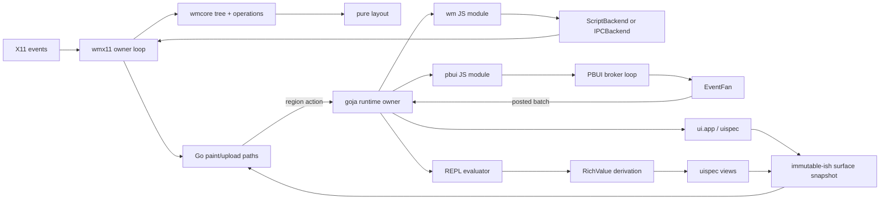

### 2.1 `pkg/wmcore`: a pure, replayable control language

`pkg/wmcore/tree.go`, `ops.go` and `layout.go` are the cleanest part of the system and should remain dependency-light.

The tree uses stable node IDs and immutable-style updates. `wmcore.Op` represents mutations such as split, close, ratio change, app assignment, swap, leaf movement and workspace operations. `Apply` and `ApplyBatch` provide a uniform mutation path. Layout consumes a tree and rectangle and produces geometry without reaching into X11.

This yields several valuable properties:

- Operations can be logged, inspected and replayed.
- A REPL can preview an operation plan before committing it.
- Rules and DSLs can compile to the same operation format.
- Tests can exercise behavior without an X server.
- Undo can be implemented for operations with known inverses or snapshots.

### 2.2 `pkg/wmx11`: one owner for X11 and interactive state

The WM loop owns X11 interaction and mutable window state. Script backends post functions to that loop rather than touching state from runtime or broker goroutines. `focusState` and `fullscreenState` encode invariants explicitly. Script tiles expose a VM-free render closure and post actions back to the VM.

This is the system’s hard interactive boundary. Future features must preserve it:

- no JavaScript evaluation in X event handlers;
- no broker round trip in focus, configure or paint paths;
- no blocking filesystem or network work in the WM loop;
- no script-owned X resources;
- no mutable runtime objects retained by the renderer.

### 2.3 `pkg/pbui`: typed values and a deliberately small wire protocol

The current `pbui.Object` is intentionally small:

```go
type Object struct {
    Ptype string
    Value any
    Label string
    Doc   string
}
```

The protocol is newline-delimited JSON with a bounded message size. It supports hello/welcome, verb registration and invocation, accept sessions, menu requests, pointer documentation and a general event channel.

The smallness is an advantage for the prototype. It exposes the essential interaction model without prematurely choosing a schema registry, identity model or durable broker. PBUI v2 should wrap and extend this behavior rather than discard it.

### 2.4 `pkg/pbui/broker`: single-owner state, best-effort distribution

The broker owns clients, verbs, one pending accept session, subscriptions and an event sequence. A new accept supersedes an old one. A matching presentation click can answer the accept instead of opening a menu. Verbs are upserted by owner and ID. General events are broadcast to subscribed clients.

Current limitations are explicit in the implementation:

- subscriptions have no filters;
- all general events are best effort;
- slow-client queues can drop data;
- there is one global accept session;
- client roles are descriptive strings, not security authority;
- event payloads have no registered schema;
- requests lack a general correlation, reply, deadline and cancellation model;
- object identity is embedded in application-defined values;
- no durable event log or replay exists.

These are appropriate prototype constraints. They also define exactly where PBUI v2 work belongs.

### 2.5 `pkg/jsmod`: the VM boundary is already disciplined

`bridge.go` converts wire messages and operations into plain JavaScript-compatible data. `eventfan.go` is particularly important: one broker subscription fans out to bounded per-runtime queues; JavaScript callbacks are invoked only after a batch is posted to the runtime owner; queue loss becomes a typed `script.error` event.

The `pbui` module performs blocking calls on workers and settles promises through runtime services. The `wm` module exposes queries, operations, themes, focus, floating/fullscreen behavior, commands, execution, bindings, rules and layouts through a backend interface. The module does not receive a mutable `WM` object.

This code supports a general actor contract:

```text
external I/O or host event
  -> copy into plain data
  -> bounded runtime mailbox
  -> execute handler on runtime owner
  -> issue host capability request
  -> host validates and posts to owning subsystem
```

### 2.6 `pkg/apps/uispec` and `pkg/jsmod/uimod`: data, snapshots and regions

`uispec` supports text, objects, buttons, hints, tables, images and fields. It normalizes and renders a specification to an image plus semantic regions. Script apps cannot submit raw pixels; they submit render data. Go-side REPL views may include pre-rendered images for plots.

`ui.app` owns JavaScript state and handlers but publishes snapshots. Every visible surface has a redraw hook. Errors preserve the previous valid snapshot. A region click is resolved according to presentation semantics: answer a matching accept, run an action, or open an object menu.

This is a robust first version of a semantic scene system. Its main limitation is that it is row/segment oriented and snapshot-wide. A richer system needs stable node keys, reconciliation, focus semantics, accessibility metadata and trusted compound widgets while preserving the same host-rendered boundary.

### 2.7 `pkg/repl`: values already carry semantic structure

A REPL `Value` has a presentation type, summary, documentation, views, input source and raw evaluated value. Derivation is total and bounded: unsupported values degrade to JSON-like views rather than failing the session. `Out[n]` chips are typed PBUI objects. Console output and evaluation are serialized.

The current REPL is already closer to a notebook kernel than to a line-oriented shell. The next step is to make cell identity, dependencies, effects, provenance and publication durable and explicit.

### 2.8 `go-go-goja`: runtime mechanics are present

The inspected `go-go-goja` code supplies:

- immutable runtime factories built from explicit module and runtime options;
- runtime ownership through a serialized `RuntimeOwner`;
- cancellation-aware synchronous calls and asynchronous posts;
- runtime lifetime contexts;
- event-loop integration;
- explicit shutdown and closer ordering;
- interruption of active JavaScript;
- per-runtime values and module profiles.

This means `go-go-wm` does not need a second JavaScript framework. It needs an operating-system-level **runtime supervisor** that uses these mechanics to assign identity, capabilities, quotas, leases, persistence and audit records.

### 2.9 `go-go-os-frontend`: a useful parallel experiment

The frontend HyperCard work reaches the same conclusion using QuickJS and React:

- VM code returns a structured UI tree;
- the host validates and renders it;
- privileged effects pass through capability policy;
- rich widgets are exposed as curated, versioned runtime packs;
- the VM controls semantic state and high-level composition;
- the host controls DOM-specific mechanics, overlays, focus, accessibility, async effects, retries and logging.

The implementation technologies differ, but the boundary is directly reusable. For `go-go-wm`, a runtime pack should bind together a JavaScript helper vocabulary, a schema, a trusted Go renderer, event contracts and default capabilities.

---

## 3. Invariants to preserve

These are the non-negotiable invariants around which the proposed system is designed.

### Invariant 1: one owner per mutable domain

The X11 WM loop owns X resources and WM state. The broker loop owns routing state. Each JavaScript runtime owner serializes VM access. A future journal writer, type registry and runtime supervisor should follow the same pattern.

A mutex may protect memory, but it does not define a valid transition. Prefer commands posted to an owner and explicit state machines.

### Invariant 2: data crosses boundaries; live VM values do not

Messages, operation plans, UI trees, object references and event payloads must be serializable plain data. A `goja.Value`, Go closure, X resource handle or mutable pointer must not cross a process, runtime or renderer boundary.

### Invariant 3: the window core is deterministic

Window mutations remain `wmcore.Op` values. Layout remains pure. Rules, launchers, devices and scripts compile to operations or higher-level commands that eventually produce operations.

### Invariant 4: scripts never render synchronously

A script may create or replace a validated surface snapshot. The renderer consumes that snapshot without entering the VM. Trusted Go widget packs may perform complex layout and drawing, but their input is still validated data.

### Invariant 5: asynchronous completion returns to the runtime owner

Broker workers, timers, device I/O and process workers may run concurrently. Any promise settlement, callback invocation or VM object creation occurs on the runtime owner.

### Invariant 6: every queue has a declared overload policy

A bounded queue is only safe when its overflow behavior matches the message class. It may coalesce state, drop telemetry, reject commands, or disconnect a slow consumer. “Best effort” must be a declared property rather than an accident.

### Invariant 7: authority is explicit and attenuable

A runtime receives only the capabilities it needs. A role string or message field does not confer authority. Remote or transient code cannot acquire `wm.exec`, filesystem, network or broad mutation access merely by importing a module name.

### Invariant 8: semantic identity is separate from visual representation

The same object can appear as a chip, row, plot mark, inspector, e-ink item or REPL output. Interaction targets the object reference and presentation type, not the pixels or widget instance.

### Invariant 9: failure is visible as a typed object

Script errors, dropped events, denied capabilities, stale references, expired leases and validation failures should be presentable, inspectable and actionable. They should not be reduced to log lines.

---

## 4. What should not be rewritten

A novel architecture can tempt a team to replace working foundations with a grand unified framework. That would be a mistake here.

Keep the following pieces and evolve them in place:

- `wmcore.Op` as the mutation language;
- the pure split-tree and layout code;
- one X11/WM owner loop;
- `go-go-goja` runtime factories and runtime owners;
- the backend seam between in-process and IPC WM access;
- PBUI v1 behavior for objects, accepts and verbs;
- snapshot handoff from script apps to Go rendering;
- the command registry and launcher;
- total/bounded rich-value derivation in the REPL;
- explicit focus and fullscreen state machines;
- bounded runtime event queues with visible loss reporting.

The new work belongs around those pieces: stronger envelopes, identity, schemas, supervision, capabilities, retained UI trees, durable cells, journaling and adapters.

---

# Part II — Foundations for a presentation operating environment

## 5. Presentation-based UI, explained from first principles

Most contemporary desktop frameworks start with widgets. An application creates a button, list, text field or canvas; the framework delivers events to those widget instances. Interoperation usually happens through clipboard formats, drag-and-drop MIME types, deep links, accessibility APIs or application-specific RPC.

A presentation-based system starts one level deeper. It asks:

> What application object is represented here, what type of thing is it for interaction purposes, and what operations are valid in the current context?

### 5.1 Object, presentation and view are different things

Consider a Git commit.

```json
{
  "repo": "go-go-golems/go-go-wm",
  "sha": "5b73c9f37c97538f6767ecdc3ece4fb599932377",
  "subject": "Feat: Introduce JavaScript scripting, application launcher, and REPL"
}
```

The object is the commit or a stable reference to it. Its presentation type might be `git.commit@1`. It can have several views:

- a short chip containing the abbreviated SHA;
- a row with author, date and subject;
- a graph node;
- a detailed inspector;
- an e-ink summary;
- a compact spoken representation.

Those views are not different objects. A command such as “compare commits” should receive the commit references, not parse text copied from a row or infer which plot point was clicked.

### 5.2 Presentation type is an interaction type

A presentation type need not be identical to the host language’s type. CLIM makes this distinction explicitly: a visible representation is associated with an application object and a presentation type, and an input request can be satisfied by clicking a compatible presentation. A type can also be parameterized, such as an integer in a particular range.

For `go-go-wm`, presentation types should describe interaction contracts. Examples:

- `git.commit@1`
- `wm.window@1`
- `color.srgb@1`
- `build.run@2`
- `device.encoder@1`
- `repl.cell@1`
- `error.script@1`

The Go or JavaScript representation may change without changing the semantic interaction type, provided compatibility rules are explicit.

### 5.3 Accept is a dynamic input context

An accept session says, “the system is currently looking for an object matching this type constraint.” In CLIM terminology, this is an input context. In the current PBUI broker, one session broadcasts accepted presentation types and visible matching objects can answer it.

This creates a desktop-wide form of direct manipulation:

```js
const base = await pbui.accept(["git.commit@1"], {
  prompt: "Choose the base commit"
});
```

The user may answer by:

- clicking a commit in a terminal;
- selecting a point on a history graph;
- choosing an `Out[n]` result in the REPL;
- pressing a physical button while a commit is selected on an e-ink companion;
- invoking a saved object from a watchlist.

The accepting application does not need to know which surface supplied the object.

### 5.4 Verbs and translators are not context menus glued to widgets

A verb describes an operation applicable to one or more presentation types. Examples for a commit include “show,” “compare with,” “copy SHA,” “open files,” or “start bisect.” The owner of the verb can be different from the owner of the object.

A translator converts a presentation into something required by the current input context or into a command. A pure, lossless conversion may be automatic. A lossy or effectful conversion should remain a visible verb.

This distinction will matter in PBUI v2:

- **verb:** an operation the user can invoke;
- **coercion:** a pure type conversion;
- **view:** a representation of the same object;
- **command:** an addressed request to perform work;
- **event:** a fact that work or state change occurred.

### 5.5 Output history is semantic, not merely graphical

CLIM output history records what was displayed so it can be redisplayed and interacted with. The attached PBUI sketch similarly treats every rendered object as live. The rich REPL begins to implement this with `Out[n]` and alternate views.

A future surface should therefore retain semantic output records:

```text
output record
  = object reference
  + presentation type
  + view selection
  + layout result
  + provenance
  + interaction metadata
```

A redraw can regenerate pixels. A click can recover the object. A trace can identify which cell, event or service produced it.

### 5.6 Widget-centric versus presentation-centric architecture

| Question | Widget-centric answer | Presentation-centric answer |
|---|---|---|
| What was clicked? | A widget instance or coordinate | A presentation of a typed object |
| How is an action chosen? | Widget callback or app menu | Type-directed verb/translator resolution |
| How does another app request input? | Custom dialog or clipboard | Accept a semantic type from any surface |
| What persists after redraw? | App state; widget tree is incidental | Object identity, output records and selected views |
| How do devices participate? | Emulate keys/pointer or mirror pixels | Publish and consume semantic objects, commands and events |
| How does the REPL integrate? | Print text or open a custom viewer | Produce live typed objects with verbs and views |

The goal is not to eliminate widgets. Widgets remain trusted renderers and interaction techniques. The goal is to stop treating widget instances as the system’s semantic boundary.

---
EOF
wc -l /mnt/data/go-go-wm-programmable-presentation-os-research-and-architecture.md
wc -c /mnt/data/go-go-wm-programmable-presentation-os-research-and-architecture.md
```

<details><summary>💭 Thinking</summary>

**Wrote research guide and appended historical details**

</details>

```unknown
bash -lc cat >> /mnt/data/go-go-wm-programmable-presentation-os-research-and-architecture.md <<'EOF'

## 10. PBUI v2: a rich semantic broker protocol

PBUI v1 should remain a compact compatibility protocol. PBUI v2 should introduce a general envelope and a small number of message classes. The goal is not to copy a cloud message bus. The goal is to make desktop interactions traceable, routable and secure across processes, runtimes and devices.

The envelope can borrow stable ideas from [CloudEvents](https://github.com/cloudevents/spec), [W3C Trace Context](https://www.w3.org/TR/trace-context/), JSON Schema and JSON-LD while remaining a local protocol with a deliberately smaller surface.

### 10.1 Proposed envelope

```json
{
  "specversion": "pbui/2.0",
  "id": "01J37QYCMBX0J8P3H9TQ2M6R7A",
  "kind": "command",
  "type": "wm.window.focus.request@1",
  "source": "app://repl/session/7f6d/cell/18",
  "subject": "wm://display/:1/window/0x0460000a?generation=17",
  "time": "2026-07-22T14:36:12.817Z",
  "schema": "schema://wm/window-focus-request/1",
  "datacontenttype": "application/json",
  "data": {
    "raise": true,
    "switchWorkspace": true
  },
  "correlation": "01J37QY76DBTFHWXSMZDM4C4H0",
  "causation": "01J37QY76DBTFHWXSMZDM4C4H0",
  "replyTo": "broker://client/repl-7f6d/inbox",
  "deadline": "2026-07-22T14:36:14.817Z",
  "traceparent": "00-4bf92f3577b34da6a3ce929d0e0e4736-00f067aa0ba902b7-01",
  "delivery": {
    "mode": "at-most-once",
    "priority": "interactive",
    "dedupeKey": "focus:wm-window-17:repl-cell-18"
  }
}
```

Several fields must be broker-controlled. In particular, the authenticated principal, granted capability references, receive timestamp and broker sequence should be stamped after the client message is accepted. A client must not be allowed to assert its own authority by writing those fields.

A broker-internal representation may therefore add:

```json
{
  "principal": "principal://local-user/1000",
  "actor": "runtime://transient/build-inspector/01J37QWZ",
  "capabilityRefs": ["cap://broker/9ad0..."],
  "brokerSequence": 91831,
  "receivedAt": "2026-07-22T14:36:12.819Z"
}
```

### 10.2 Message classes

Use a small set of classes with distinct semantics.

| Kind | Meaning | Typical delivery |
|---|---|---|
| `event` | A fact that already occurred | best effort or durable, depending on type |
| `command` | A request for one owner to perform an action | acknowledged; idempotency declared |
| `query` | A request for current information | request/reply with deadline |
| `reply` | Result or error correlated to a command/query | routed to `replyTo` |
| `stream.open` | Establish a named ordered stream | acknowledged |
| `stream.item` | One item in a stream | ordered within stream; backpressure declared |
| `stream.close` | End a stream with status | reliable enough to terminate consumer state |
| `lease.*` | Acquire, renew, release or expire temporary ownership | reliable and time-aware |
| `schema.*` | Register or resolve type/schema/view metadata | administrative |
| `capsule.*` | Offer, validate, start, stop or inspect executable content | capability-gated and audited |
| `surface.*` | Create, replace, patch, show or close a surface | owner-routed |
| `accept.*` | Start, update, answer or cancel an input context | interactive and correlated |

Avoid using one generic `event.emit` for all of these. Commands and facts have different failure semantics. A lost pointer-hover fact is acceptable. A lost “delete workspace” command is not. A duplicate “set selected build to X” may be safe; a duplicate “spawn process” may not be.

### 10.3 Command flow

A command has one logical owner and an acknowledgement path.

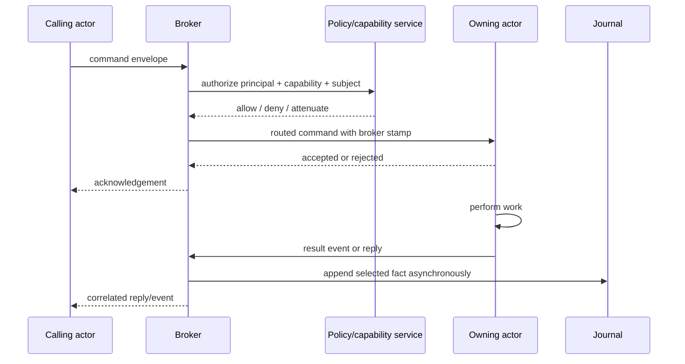

“Accepted” means the owner has taken responsibility, not that the effect completed. Long-running commands should return a job entity or stream.

### 10.4 Query and streaming flow

A query includes a deadline and can produce one reply or a stream.

```js
const windows = await os.broker.query(
  "wm.windows.query@1",
  { workspace: "current" },
  { timeout: 500 }
);

for await (const event of os.broker.stream(
  "build.log.follow@1",
  { build: buildRef }
)) {
  // Handler runs on this runtime's owner loop.
  state.lines.push(event.data.line);
}
```

The JavaScript API can look synchronous at the promise/iterator level while the implementation remains message-based.

### 10.5 Correlation, causation and trace

These identifiers answer different questions:

- **message ID:** which exact envelope is this?
- **correlation ID:** which user-visible operation or workflow does it belong to?
- **causation ID:** which preceding message directly caused it?
- **trace ID/span ID:** where did time go across services and runtimes?

A user clicks a build object, invokes “open failure explainer,” a transient app starts, queries logs and repository state, and presents a surface. All resulting messages should share a correlation ID. Each message records its immediate cause. Trace context allows performance analysis without conflating it with business identity.

### 10.6 Subjects and ownership

`subject` identifies the semantic target. Routing should normally use a registered owner rather than pattern-matching arbitrary clients.

Examples:

```text
wm://display/:1/workspace/3
wm://display/:1/window/0x0460000a?generation=17
app://build-monitor/instance/01J37QWZ
surface://build-monitor/01J37QWZ/main
device://desk/eink-1
repl://session/7f6d/cell/18
git://github.com/go-go-golems/go-go-wm/commit/5b73c9f...
```

An ownership registry maps subject prefixes or exact entity IDs to active actors. Leases prevent abandoned registrations from remaining authoritative after a crash.

### 10.7 Subscription filters

The current global subscription flag should evolve into declarative filters compiled by the broker. An initial filter language can support:

```json
{
  "types": ["build.*", "script.error@1"],
  "sources": ["service://ci/*"],
  "subjects": ["project://go-go-wm/**"],
  "where": {
    "data.status": ["failed", "cancelled"]
  }
}
```

Only indexed equality and prefix matches should be allowed initially. Filters must have known cost. Arbitrary JavaScript predicates belong in the consuming actor, not in the broker.

### 10.8 Delivery classes and overload policy

Define overload behavior per message or registered event type.

| Class | Example | Queue policy |
|---|---|---|
| Interactive command | focus window, answer accept | reject sender when queue is full; never silently drop |
| State update | current selection, device battery | coalesce by subject and type; retain latest |
| Telemetry | pointer motion, encoder deltas | bounded drop or aggregate; expose loss count |
| Durable fact | build completed, capability granted | append before fan-out or use a recoverable journal offset |
| Stream data | log lines | bounded buffer with pause/cancel or explicit gap item |
| UI snapshot | surface replacement | retain latest; obsolete snapshots may be discarded |

The existing `script.error` overflow reporting is a good precedent. PBUI v2 should standardize a typed `delivery.gap@1` object containing the affected subscription, count, range and recovery options.

### 10.9 Durable journal versus event bus

Do not turn every event into an append-only database write. Use two related paths:

```text
Ephemeral event bus
  - pointer/hover/focus hints
  - animation state
  - intermediate progress
  - high-rate sensor data
  - surface invalidation

Semantic journal
  - accepted commands
  - durable domain facts
  - app/runtime lifecycle changes
  - capability grants and denials
  - room snapshots
  - published REPL cells
  - script capsule provenance
  - device pairing and authority changes
```

The broker can assign one sequence to routed messages and the journal can assign a durable offset to selected records. Consumers must not assume every broker sequence can be replayed.

### 10.10 Idempotency and retries

Every command type should declare one of:

- `idempotent`: same command may be applied repeatedly;
- `deduplicated`: owner stores a dedupe key for a time window;
- `at-most-once`: broker does not retry after uncertain delivery;
- `transactional-owner`: accepted only within an owner-local transaction;
- `non-repeatable`: requires explicit user confirmation after uncertainty.

For WM operations, batches are naturally owner-local and can carry an expected tree revision:

```json
{
  "type": "wm.ops.apply@1",
  "data": {
    "expectedRevision": 9182,
    "ops": [
      {"op": "workspace.switch", "workspace": "dev"},
      {"op": "leaf.focus", "leaf": "leaf-42"}
    ]
  }
}
```

A revision mismatch returns a typed conflict with the current revision and an optional rebase suggestion.

### 10.11 Accept sessions in v2

The current single global accept can be generalized without losing its directness.

An accept session should have:

- a stable ID and correlation ID;
- requester actor and return address;
- type selector;
- cardinality (`one`, `many`, optional);
- prompt and documentation;
- scope (`desktop`, room, surface, device set);
- deadline and cancellation token;
- optional preview/validation query;
- an authority policy for resolving selected objects.

Example:

```json
{
  "kind": "command",
  "type": "accept.start@2",
  "data": {
    "selector": {"subtypeOf": "vcs.revision@1"},
    "cardinality": {"min": 2, "max": 2},
    "prompt": "Choose two revisions to compare",
    "scope": {"room": "room://development"},
    "deadline": "2026-07-22T14:41:00Z"
  }
}
```

Multiple accepts can coexist if their scopes do not conflict. A desktop-level interaction manager decides which context is active for a pointer or device. The UI should make this state visible rather than guessing.

### 10.12 Versioning and compatibility

PBUI v2 should run beside v1 through a bridge:

```text
v1 hello/register/accept/menu/event
  <-> broker compatibility adapter
  <-> v2 actor registration, verb descriptors, accept sessions and events
```

Initial v2 objects can carry a v1 `ptype` alias. V1 verbs become simple one-argument command descriptors. V1 subscribers receive only event payloads that can be represented in the old union message.

Do not add fields indefinitely to the v1 union. Freeze it as the compact prototype protocol.

---

## 11. Runtime supervision: JavaScript actors as operating-system processes

The current code has three materially different script contexts:

1. `rc.js` runs in-process and is trusted session configuration.
2. standalone `run` and REPL runtimes are broker peers with module and `--allow-exec` choices;
3. script-defined surfaces can live inside the WM’s trusted runtime while rendering through snapshots.

A runtime supervisor should make these trust and lifecycle differences explicit.

### 11.1 Actor model

A JavaScript application is an actor with:

- a stable actor ID;
- one `goja.Runtime` and one runtime owner;
- an immutable runtime factory/profile;
- a bounded mailbox;
- a capability set;
- lifecycle and cancellation context;
- optional persistent state namespace;
- zero or more surfaces, commands, verbs, subscriptions and exported services;
- metrics, logs and audit identity.

Actors share messages and object references, not JavaScript objects or Go pointers.

### 11.2 Trust profiles

| Profile | Placement | Typical authority | Use |
|---|---|---|---|
| `system-rc` | In WM process | broad WM control, bindings, command registration, optional process execution | user-owned session configuration |
| `system-service` | Trusted local process | narrowly defined native/broker capabilities | broker helpers, indexers, device gateway |
| `installed-app` | Prefer separate process; optionally in-process when audited | manifest-granted capabilities | durable user-installed JavaScript app |
| `transient-app` | Separate worker process by default | short-lived, attenuated capabilities | generated inspector, workflow card, one-task tool |
| `repl-session` | Separate or dedicated trusted process | interactive grants; transaction previews | live development and inspection |
| `remote-capsule` | Isolated worker, never WM process | no ambient authority; explicit one-shot handles | code received over broker/network |
| `device-script` | Isolated gateway worker | one device subtree and limited broker topics | mappings and local automation |

“In-process” is a performance and trust decision, not a feature flag scripts can request.

### 11.3 Runtime descriptor

```json
{
  "id": "runtime://transient/build-explainer/01J37QWZ",
  "profile": "transient-app@1",
  "engine": "goja",
  "bundle": "sha256:1fb8...",
  "entry": "main.js",
  "modules": [
    "@go-go-wm/pbui",
    "@go-go-wm/ui",
    "@go-go-wm/objects",
    "@go-go-wm/repl-readonly"
  ],
  "limits": {
    "startupCpuMs": 100,
    "handlerCpuMs": 50,
    "wallClockMs": 2000,
    "mailboxMessages": 256,
    "surfaceNodes": 5000,
    "surfaces": 4,
    "subscriptions": 16,
    "stateBytes": 1048576
  },
  "lifecycle": {
    "ttl": "20m",
    "idleTimeout": "3m",
    "restart": "never"
  }
}
```

Goja itself does not provide hard memory isolation. Memory, filesystem and process limits for untrusted code must be enforced by placing the runtime in a worker process and applying operating-system controls.

### 11.4 Lifecycle state machine

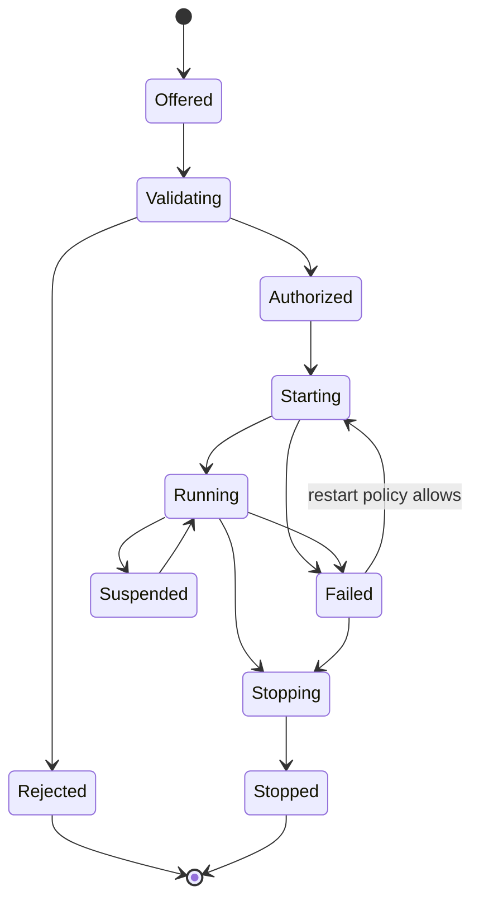

Each transition emits a typed lifecycle fact. The supervisor owns the transition rules. An app cannot mark itself “authorized” or “system.”

### 11.5 Mailboxes and scheduling

Each runtime has a bounded mailbox partitioned or prioritized by class:

```text
P0: cancellation, stop, capability revocation
P1: user interaction and command replies
P2: surface and app messages
P3: normal subscribed events
P4: telemetry and coalescible state
```

The runtime owner drains a bounded batch so one actor cannot monopolize a worker thread. Handlers execute serially unless the app explicitly starts host-side asynchronous work. Completion re-enters the mailbox.

A long-running native Go module call is dangerous because goja interruption only interrupts JavaScript execution, not arbitrary native calls. Native modules must therefore be asynchronous, cancellation-aware and executed outside the owner loop whenever they can block.

### 11.6 State persistence

An actor can choose one state mode:

- `ephemeral`: discarded at stop;
- `session`: retained until user session ends;
- `room`: associated with a room/context object;
- `persistent`: stored under the app’s versioned namespace;
- `external`: app owns state in another service and stores only references.

Persist plain, schema-validated data. Do not serialize a goja heap. On restart:

```text
bundle + manifest + state schema + state snapshot + journal cursor
  -> create fresh runtime
  -> run migrations in constrained mode
  -> call restore/start handler
  -> re-register services and surfaces
```

This makes upgrades and crash recovery inspectable.

### 11.7 Registration and leases

Commands, verbs, object resolvers, surfaces and subscriptions registered by an actor are tied to its actor lease. If the actor exits or stops renewing, registrations expire automatically. This prevents the current “owner gone” condition from leaving stale semantic metadata.

### 11.8 Hot replacement

A Smalltalk-like development loop can be implemented safely as actor replacement:

1. compile and validate a new bundle;
2. ask the current actor for a state snapshot;
3. run migration in a temporary restricted runtime;
4. start a new actor with the migrated state;
5. let it register services and render candidate surfaces;
6. atomically move actor aliases and surface ownership;
7. drain and stop the old actor;
8. preserve both versions in the trace for rollback.

This avoids mutating arbitrary functions inside a live goja heap while still preserving state and continuity.

---

## 12. A capability model for WM and OS primitives

Module imports are not a sufficient security model. A module can expose many methods, and an actor’s authority may need to be restricted to one workspace, one app, one file tree or one device. Capabilities should therefore be explicit host objects or opaque handles.

### 12.1 Capability vocabulary

A first vocabulary might include:

```text
wm.query
wm.focus(subject selector)
wm.layout.read(workspace selector)
wm.layout.mutate(allowed ops, workspace selector)
wm.window.control(window selector, allowed actions)
wm.command.register(namespace)
wm.binding.register(key scope)
process.spawn(command allowlist, cwd scope, env policy)
fs.read(path roots)
fs.write(path roots)
net.connect(host/port allowlist)
broker.publish(type/source constraints)
broker.subscribe(filter constraints)
object.resolve(type/subject constraints)
surface.create(pack allowlist, count and node limits)
surface.embed(source constraints)
state.read(namespace)
state.write(namespace, quota)
device.observe(device selector)
device.command(device selector, action allowlist)
repl.inspect(session selector)
repl.publish(kind allowlist)
```

Capabilities are parameterized. `wm.layout.mutate` for the current room is materially different from unrestricted WM control.

### 12.2 Opaque host handles

A script can receive a proxy-like object whose methods invoke broker- or supervisor-validated operations:

```js
const window = await os.objects.resolve(windowRef, {
  capability: caps.windowInspector
});

const info = await window.inspect();
await window.focus();
// window.close() is absent if the handle lacks that method.
```

The handle’s authority comes from an unforgeable host-side record, not from the JavaScript object’s visible fields. Serializing the wrapper produces only a non-authoritative reference or fails.

### 12.3 Attenuation

A holder can delegate less authority for a shorter time:

```js
const readOnlyForDialog = caps.currentWorkspace.attenuate({
  methods: ["listWindows", "inspectWindow"],
  expiresIn: "2m",
  maxCalls: 50
});

await os.apps.start(capsuleRef, {
  grants: { workspace: readOnlyForDialog }
});
```

The supervisor creates a new capability record with constraints no broader than the parent. The child cannot remove those constraints.

### 12.4 Capability prompts

A prompt should explain concrete authority, not display a generic “Allow access?” dialog.

```text
Build Explainer requests:

Read:
  - build objects for project go-go-wm
  - Git repository history in /home/user/src/go-go-wm
  - REPL cell 18 and its output

Create:
  - up to 2 transient surfaces using core.table@1 and trace.timeline@1

It cannot:
  - modify files
  - spawn processes
  - access the network
  - change window layout

Duration: until the app is closed, at most 20 minutes.
```

The grant itself becomes a typed, inspectable object with “revoke,” “show uses” and “derive narrower grant” verbs.

### 12.5 No authority in message data

A field such as:

```json
{"role": "admin", "capabilities": ["wm.exec"]}
```

is merely data unless the broker has authenticated and replaced it with verified internal capability references. This rule must be visible in APIs and documentation to prevent confused-deputy bugs.

### 12.6 Authority across apps

One JavaScript app should not receive another app’s runtime object. Instead, an app exports a service or object resolver:

```js
os.services.expose("build-monitor@1", {
  async getBuild({ id }) { /* ... */ },
  async selectBuild({ id }) { /* ... */ },
  async openSurface({ id, view }) { /* ... */ }
}, {
  schemas: "schema://build-monitor/service/1",
  policy: "user-session"
});
```

Another app invokes it through an attenuated service handle:

```js
const builds = await os.services.connect("service://build-monitor", {
  capability: caps.buildReadOnly
});

const build = await builds.getBuild({ id: "build-418" });
```

The call is a message exchange with correlation, deadline and audit identity. The service owner can disappear; callers receive a typed lease-expired or owner-offline error.

---
EOF
wc -l /mnt/data/go-go-wm-programmable-presentation-os-research-and-architecture.md
wc -c /mnt/data/go-go-wm-programmable-presentation-os-research-and-architecture.md
```

<details><summary>💭 Thinking</summary>

**Appended broker section and runtime supervisor details**

**Continuing deep dive**

I'm analyzing recent entries, focusing on transient app mechanics, JS scripting, broker messages, and UI experiments. I'll clarify the system's flow, from structured UI to broker messaging, and synthesis for the documentation.

**Continued deep dive**

</details>

```unknown
bash -lc wc -l -c /mnt/data/go-go-wm-programmable-presentation-os-research-and-architecture.md && tail -n 80 /mnt/data/go-go-wm-programmable-presentation-os-research-and-architecture.md
```

<details><summary>💭 Thinking</summary>

**Inspected file, appended sections, and searched for references**

</details>

```unknown
bash -lc cat >> /mnt/data/go-go-wm-programmable-presentation-os-research-and-architecture.md <<'EOF'
# Part IV — Transient applications and executable semantic media

## 13. HyperCard-style applications on demand

### 13.1 The application is a semantic actor, not a window

**Proposed.** A conventional desktop application is usually identified with one process, one executable and one or more windows. That model is too coarse for a programmable presentation desktop. It conflates four different things:

1. the code that implements behavior;
2. the actor that owns mutable state and subscriptions;
3. the semantic services and objects that actor publishes;
4. the surfaces through which the user sees and manipulates those objects.

A `go-go-wm` application should instead be defined as a supervised semantic actor that may expose zero, one or many surfaces. A service-only actor has no window. A transient inspector may have one overlay surface for thirty seconds. A notebook actor may expose a main tile, a detached plot, a device projection and several temporary menus. Closing one view does not necessarily kill the actor; terminating the actor invalidates every lease and surface it owns.

This distinction is the key to combining HyperCard’s approachable construction model with Smalltalk’s live object world and CLIM’s presentation semantics.

### 13.2 Application kinds

A small explicit taxonomy prevents every script from inventing its own lifecycle.

| Kind | Typical lifetime | State | Surfaces | Example |
|---|---|---|---|---|
| `service` | whole session or user-managed | persistent | optional | build index, Git object resolver, device gateway |
| `app` | until closed or stopped | persistent by default | one or more | notes, project dashboard, rich REPL |
| `transient` | tied to a task or parent | checkpointed optionally | usually overlay or temporary tile | commit comparator, color chooser, build explainer |
| `lens` | while attached to an object/type/surface | derived | embedded or overlay | dependency lens, provenance lens, accessibility lens |
| `card-stack` | navigable task session | persistent or exportable | current card plus detached cards | incident runbook, hardware setup wizard |
| `automation` | until rule disabled | small durable state | usually none | window placement, event correlation, cleanup policy |
| `device-agent` | while device is paired | durable pairing state | remote/ambient | e-ink status surface, encoder bank, LED matrix |
| `cell-actor` | tied to a REPL cell publication | checkpointed | optional | watched query, computed dashboard, published command |

These are supervisor policies, not separate JavaScript engines. The same `go-go-goja` runtime machinery can host them with different manifests, capability profiles and restart rules.

### 13.3 A proposed application descriptor

The descriptor should be plain data, validate before code runs, and separate declared needs from granted authority.

```js
export default os.app.define({
  apiVersion: "os.go-go.dev/app/v1",
  id: "dev.go-go.commit-compare",
  title: "Commit Compare",
  version: "0.1.0",
  kind: "transient",

  entry: "main.js",
  runtime: {
    profile: "isolated-goja",
    restart: "never",
    maxHeapBytes: 32 * 1024 * 1024,
    maxMailbox: 128,
    idleTimeout: "15m"
  },

  requests: {
    capabilities: [
      { name: "git", interface: "service://git-reader@1", mode: "read" },
      { name: "surface", interface: "cap://surface.create", limit: 2 },
      { name: "accept", interface: "cap://pbui.accept", ptypes: ["git.commit"] }
    ]
  },

  state: {
    schema: "schema://dev.go-go.commit-compare/state/1",
    initial: { left: null, right: null, mode: "summary" }
  },

  surfaces: {
    main: {
      type: "surface://pbui.scene/2",
      placement: { role: "dialog", parent: "invoker", preferredSize: [720, 520] }
    }
  },

  exports: {
    commands: ["compare-commits"],
    objectTypes: ["git.comparison"],
    services: []
  }
});
```

The descriptor does not contain a granted capability token. The supervisor resolves each request against policy, user consent and the invoker’s delegable authority, then supplies opaque handles as runtime endowments.

### 13.4 The HyperCard mapping

HyperCard’s concepts can be translated without cloning its visual appearance.

| HyperCard concept | Proposed `go-go-wm` equivalent | Important difference |
|---|---|---|
| Stack | an exportable app/session package containing cards, shared state, assets and scripts | may be generated and supervised; authority is external to the package |
| Card | a named surface state or route | can render into a tile, overlay, e-ink display or notebook output |
| Background | shared layout and handlers inherited by cards | expressed as reusable scene fragments and message scopes |
| Part | keyed semantic scene node | never a raw mutable widget pointer |
| Field | host-rendered input node bound to app state | editing and focus remain host-managed |
| Button | action-emitting semantic node | action is a typed message with origin and trace identity |
| Message | event/command dispatched through a declared handler path | routing is inspectable, bounded and capability-checked |
| HyperTalk handler | JavaScript handler registered by symbolic name | code runs only on the runtime owner and returns state/effects |
| `pass` | continue to the next handler scope | explicit result such as `{handled:false}` rather than hidden control flow |
| Home stack | session/system handler scopes and launcher | no global ambient script authority |

The valuable HyperCard mechanism is the comprehensible local message path. A button event should not disappear into an arbitrary event emitter graph. The runtime can use a declared path such as:

```text
part handler
  -> card handler
  -> background/template handler
  -> app handler
  -> optional supervisor/system handler
```

Each hop is visible in a trace and may return one of four outcomes:

```ts
type HandlerResult =
  | { handled: true; state?: unknown; effects?: Effect[] }
  | { handled: false }
  | { redirect: { message: string; target: SemanticRef } }
  | { error: ErrorObject };
```

This is easier to understand than unrestricted bubbling/capture plus cross-component closures, and it gives the REPL a natural inspection view: “show the path this message followed.”

### 13.5 Card stacks as exportable task media

A card stack is useful when a task has a small state machine and a sequence of views. Examples include:

- pairing a physical controller;
- triaging a failing build;
- provisioning a development workspace;
- exploring a dataset and bookmarking findings;
- conducting a code review;
- teaching an intern how an operation moves through the WM;
- running an incident-response checklist.

A stack package might contain:

```yaml
apiVersion: os.go-go.dev/stack/v1
id: dev.go-go.device-pairing
version: 1.0.0
home: discover
stateSchema: schema://dev.go-go.device-pairing/state/1
cards:
  discover:
    template: centered-task
    on:
      device.discovered: consider-device
  authorize:
    template: capability-review
  map-controls:
    template: two-pane-mapper
  verify:
    template: test-console
  done:
    template: receipt
backgrounds:
  centered-task:
    scene: backgrounds/centered-task.json
scripts:
  entry: main.js
```

The package is declarative enough to inspect before execution. Its scripts enrich the stack but do not obscure its navigation graph, requested capabilities or data schemas.

### 13.6 Transient application lifecycle

A transient app must have a precise lifecycle because its short lifetime is a feature, not an excuse for unmanaged resources.

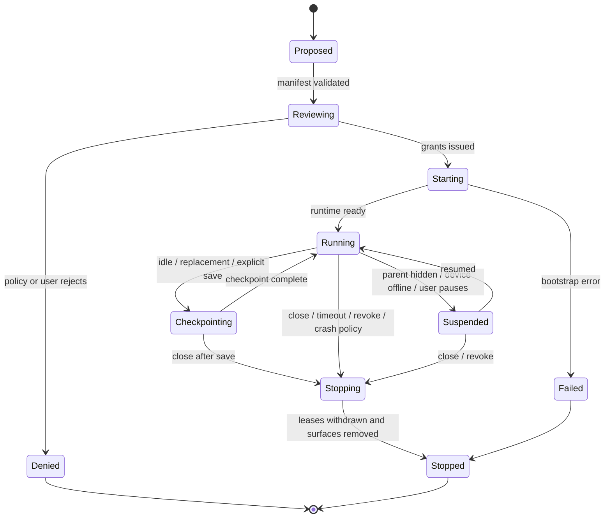

The supervisor owns the transition. Script code receives lifecycle notifications but cannot declare itself “stopped” while retaining subscriptions or surfaces.

### 13.7 Parent-child relationships

A transient app usually has a semantic parent:

- the REPL cell that generated it;
- a command invocation;
- an object menu action;
- another app’s surface;
- a workflow run;
- a device session.

The parent relationship controls default placement, capability delegation, cancellation and provenance. It should not imply unrestricted access to the parent runtime.

```json
{
  "parent": {
    "kind": "repl-cell",
    "ref": "repl-cell://session-7/18",
    "trace": "01J3...",
    "cancelPolicy": "stop-child",
    "surfacePolicy": "anchor-to-invoker"
  }
}
```

A child may outlive its visual invoker only when its manifest and user choice permit detachment.

### 13.8 State: durable data, ephemeral execution

Transient code can be disposable while state remains inspectable. Persist only schema-validated data and metadata:

```json
{
  "app": "dev.go-go.commit-compare",
  "instance": "appinst://01J3...",
  "schema": "schema://dev.go-go.commit-compare/state/1",
  "revision": 14,
  "value": {
    "left": {"\$ref": "object://git.commit/abc123"},
    "right": {"\$ref": "object://git.commit/def456"},
    "mode": "files"
  },
  "updatedAt": "2026-07-22T15:04:32Z",
  "sourceEvent": "event://01J3..."
}
```

Do not persist closures, promises, `goja.Value`s, socket descriptors or host handles. On restart, reconstruct a fresh runtime, validate/migrate state, restore registrations and rerender.

### 13.9 On-demand generation flow

An LLM, a human in the REPL or a rule may generate a micro-app. Generation must produce a reviewable capsule, not immediately execute text.

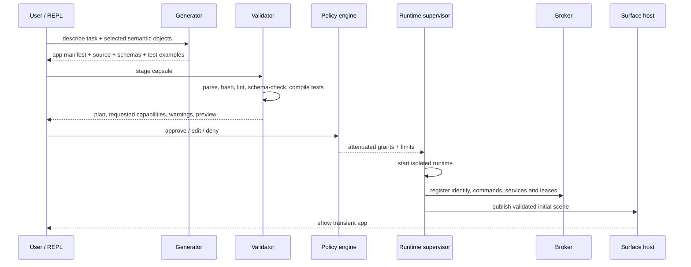

The review surface should show:

- what code will run;
- what authority it requests;
- what objects and conversation context were included;
- which host modules are available;
- resource and lifetime limits;
- its generated tests and whether they passed;
- the exact content hash and signer/provenance;
- whether it can publish services or only render a private surface.

### 13.10 Example: generating a build-failure explainer

The user selects a `build.run` presentation and invokes “Explain failure as a temporary app.” The generator receives only:

- the selected build reference;
- a read-only build/log service capability;
- the `trace.timeline@1`, `core.table@1` and `core.markdown@1` widget schemas;
- an app template;
- a maximum of two surfaces and fifteen minutes of lifetime.

It produces an app with three cards:

1. **Summary:** failure class, responsible stage and confidence.
2. **Timeline:** semantic events with clickable log spans, commits and test cases.
3. **Next actions:** verbs that open relevant source locations, rerun a test or create a REPL cell.

Every item is a presentation. Clicking a commit can answer an accept in a separate diff tool. The app does not need direct access to the editor or build daemon; it publishes and consumes typed objects and services through the broker.

### 13.11 What not to copy from browser application models

A transient app system should avoid several familiar but harmful shortcuts:

- **No ambient DOM.** A script cannot query or mutate another surface’s widget tree.
- **No arbitrary global event bus.** Subscriptions are typed, filtered, leased and inspected.
- **No direct component import from another app.** Reuse occurs through widget packs, scene fragments and services.
- **No implicit local storage.** State storage is a named capability with schema and quota.
- **No raw network by default.** Network services are explicit capabilities or broker services.
- **No hidden background survival.** Detachment and restart policy are declared.
- **No window title as identity.** Actor, surface, object and X window identities are distinct.

---

## 14. Broker-delivered JavaScript: script capsules, not remote `eval`

### 14.1 The central safety distinction

**Proposed.** Sending JavaScript through the broker can be powerful, but the operation must never be modeled as:

```js
broker.on("code", source => eval(source)); // never acceptable
```

That design combines untrusted code, ambient authority, unclear lifecycle and no audit boundary. The safe primitive is a **script capsule**: an immutable, content-addressed package with a manifest, schemas, code, limits, signatures/provenance and an explicit requested capability set.

The broker transports the capsule or a reference to it. The runtime supervisor decides whether, where and with what authority it may execute.

### 14.2 Capsule modes

The mode determines expected lifetime, input/output contract and allowable effects.

| Mode | Contract | Typical use |
|---|---|---|
| `expression` | one input value/context → one serializable value | formatter, computed column, REPL expression |
| `action` | typed input → operation/effect plan → result | object verb, command implementation |
| `lens` | object/state stream → derived presentation tree | dependency lens, log lens, provenance view |
| `surface` | initial state + events → scene snapshots | transient micro-app, inspector |
| `service` | request messages → replies/streams | Git resolver, build query facade |
| `rule` | event stream → filtered actions | placement rule, alert, automation |
| `workflow` | durable event-driven state machine | incident flow, release checklist |
| `migration` | old schema value → new schema value | app/state upgrade |
| `device-map` | device events/properties ↔ semantic commands/views | encoder bank, e-ink dashboard |

A capsule declares exactly one primary mode. A complex app may contain several modules, but the supervisor must still know the actor contract it is starting.

### 14.3 Proposed capsule envelope

```json
{
  "apiVersion": "os.go-go.dev/capsule/v1",
  "kind": "ScriptCapsule",
  "metadata": {
    "id": "capsule://sha256/98b2...",
    "name": "commit-compare",
    "version": "0.1.0",
    "createdAt": "2026-07-22T14:52:00Z",
    "author": "principal://local/user",
    "provenance": {
      "kind": "repl-cell",
      "ref": "repl-cell://session-7/18",
      "generator": "model://example/model-version",
      "promptDigest": "sha256:..."
    }
  },
  "spec": {
    "mode": "surface",
    "engine": "goja",
    "entry": "main.js",
    "modules": ["pbui@2", "surface@2", "state@1"],
    "requestedCapabilities": [
      {"interface": "service://git-reader@1", "methods": ["getCommit", "diff"]},
      {"interface": "cap://surface.create", "max": 2}
    ],
    "limits": {
      "wallTime": "15m",
      "cpuMillisPerTurn": 25,
      "maxHeapBytes": 33554432,
      "maxMailbox": 128,
      "maxMessageBytes": 262144,
      "maxSurfaces": 2,
      "maxPublishedObjects": 500
    },
    "inputSchema": "schema://dev.go-go.commit-compare/input/1",
    "stateSchema": "schema://dev.go-go.commit-compare/state/1",
    "outputSchema": "schema://surface.scene/2"
  },
  "content": {
    "digest": "sha256:98b2...",
    "mediaType": "application/vnd.go-go.capsule+json",
    "files": [
      {"path": "main.js", "digest": "sha256:...", "size": 8421},
      {"path": "schemas/state.json", "digest": "sha256:...", "size": 733}
    ]
  },
  "signatures": [
    {"format": "cose-sign1", "key": "key://local/user-signing", "value": "..."}
  ]
}
```

The manifest is included in the signed digest. A signature proves provenance and integrity; it does **not** grant authority. Policy still evaluates the requested capabilities and execution profile.

### 14.4 Admission pipeline

The supervisor should use a fixed admission sequence:

```text
1. Decode with byte and nesting limits.
2. Validate envelope and manifest schemas.
3. Resolve every referenced content blob by digest.
4. Recompute all digests.
5. Verify signatures when present.
6. identify sender, signer, parent and user session.
7. Apply source policy: local file, signed package, device, peer, generated cell.
8. Parse JavaScript before creating the runtime.
9. Inspect module imports against the declared profile.
10. Run static policy checks and package tests in a no-authority runtime.
11. Calculate the effective capability request.
12. Present user review when policy requires it.
13. Create an isolated worker and OS sandbox.
14. Inject only granted capabilities and immutable startup data.
15. Start the actor, issue leases and publish an audit event.
```

Every rejection is a typed object with a stage, reason and remediation. “Script failed” is insufficient.

### 14.5 Trust profiles

The current code already distinguishes trusted `rc.js` from standalone scripts with gated process execution. Extend that into explicit profiles.

| Profile | Placement | Typical source | Authority | Notes |
|---|---|---|---|---|
| `wm-config` | in WM process, separate goja owner | user-owned `rc.js` | broad session authority | trusted like an i3 config; still must never run on WM/X loop |
| `system-service` | separate process preferred | installed, signed package | fixed service-specific grants | restartable; audited |
| `user-app` | separate worker process | installed or user-authored capsule | prompted/remembered grants | durable state allowed |
| `transient-generated` | fresh worker process | REPL/LLM generated | minimal delegated grants | short TTL; no raw filesystem/network/exec |
| `remote-untrusted` | strongest isolated worker | remote/device/peer | normally data-only | code execution may be disabled entirely by policy |
| `pure-evaluator` | pooled or fresh worker | expression/lens | no effects, bounded input/output | deterministic clock/random by default |

The profile selects both JavaScript modules and operating-system containment. A module allowlist alone is not a complete sandbox if native code, process APIs or host file descriptors remain reachable.

### 14.6 Process isolation for untrusted capsules

`goja.Runtime` is not goroutine-safe and must be owned by one loop. It is also an embedded language runtime, not an OS security boundary. For code received over the broker or generated dynamically, use a separate worker process.

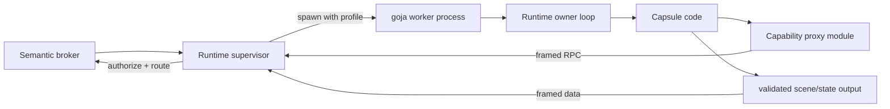

The worker should receive no inherited broker socket, X connection, home-directory descriptor or privileged environment variable. It communicates with the supervisor through one framed control channel. The supervisor is the reference monitor for host capabilities.

### 14.7 Linux containment layers

A practical Linux worker can combine several controls. None is sufficient alone.

1. **Separate uid or user namespace where practical.** Prevent ordinary process-level interference.
2. **`no_new_privs`.** Forbid privilege gains across `execve`.
3. **Mount namespace with a minimal read-only root.** Expose only the capsule files and required runtime libraries.
4. **No ambient network namespace access.** Network calls occur through explicit broker services.
5. **Landlock restrictions.** Apply an unprivileged, stackable filesystem policy to deny undeclared paths. Modern Landlock can also restrict selected network operations on supporting kernels.
6. **Seccomp filtering.** Reduce the syscall surface after startup. Linux documentation is explicit that seccomp filtering alone is not a complete sandbox; use it as one layer.
7. **cgroup or rlimit controls.** Bound memory, process count, CPU and open files.
8. **Parent-death signal and supervisor watchdog.** A worker cannot become an orphaned service.
9. **Closed descriptor table.** Keep only stdin/stdout control pipes or a dedicated Unix socket.
10. **Read-only clock/random modules where deterministic execution is requested.**

The initial prototype can start with a worker process, module allowlist, rlimits, no inherited descriptors and supervisor-enforced deadlines. Landlock/seccomp/cgroups can be introduced behind a `sandbox.Profile` interface without changing capsule APIs.

### 14.8 Resource accounting and turn budgets

A runtime can deny service without calling a dangerous syscall. It can loop, allocate, flood events, publish huge scenes or make many small service calls. The supervisor therefore needs per-actor accounting.

Recommended counters:

- current and peak worker RSS;
- JavaScript turn duration;
- owner-loop queue wait;
- mailbox depth and drops;
- messages and bytes in/out;
- capability calls by interface/method;
- live subscriptions, timers, object leases and surfaces;
- scene node count and patch bytes;
- journal writes;
- restart/crash count.

A JavaScript turn should have a deadline and an interrupt path. Long native module operations must not run synchronously inside the owner call because interrupting goja does not interrupt arbitrary Go work. Native capability proxies should start cancellable host work and settle promises later through `runtimebridge`.

### 14.9 Capability proxy modules

An isolated runtime does not link the full `wm`, `pbui` or filesystem implementation. It receives proxy modules generated from granted interfaces.

```js
const wm = require("cap:wm");

// A proxy request. The opaque `workspace` handle was granted by the host.
const plan = await wm.plan([
  { op: "split-leaf", node: workspace.focusedLeaf, dir: "row" },
  { op: "set-leaf-app", node: { fromResult: [0, "newLeaf"] }, app: "script:trace" }
]);

// Reviewable transaction, not immediate mutation.
await plan.commit({ reason: "Open a trace tile next to the focused app" });
```

The worker sees an ergonomic API, but the wire message contains a capability handle, method, arguments, deadline and idempotency key. The supervisor validates all arguments and target scopes before forwarding to the WM owner.

### 14.10 Access to other JavaScript applications

Two script apps should communicate through broker services, object references and events. They must not share a goja heap or pass JavaScript functions.

An app can expose:

```js
os.services.expose({
  interface: "service://palette-manager@1",
  methods: {
    list: { output: "schema://color/list/1", handler: "listColors" },
    add: {
      input: "schema://color/value/1",
      output: "schema://color/item/1",
      capability: "palette.write",
      handler: "addColor"
    },
    watch: {
      output: "schema://color/event/1",
      streaming: true,
      handler: "watchColors"
    }
  }
});
```

Another app connects to the interface, not to a runtime object:

```js
const palettes = await os.services.connect("service://palette-manager@1", {
  scope: { collection: "project-colors" }
});

const rows = await palettes.list();
const stop = await palettes.watch(event => {
  state.colors = event.snapshot;
  app.refresh();
});
```

If both apps happen to be written in JavaScript, that fact is an implementation detail. The same service may later be implemented in Go, on another machine or by a physical device agent.

### 14.11 Determinism and replay modes

Pure expressions, lenses and many rules benefit from deterministic execution. A deterministic profile provides:

- a logical clock supplied in the input event;
- a seeded pseudo-random generator;
- no wall-clock, environment, network or filesystem access;
- ordered input messages;
- content-addressed modules;
- bounded, serializable outputs.

The journal can then replay the same input and compare output hashes. Stateful apps cannot always be perfectly deterministic because external services evolve, but their host interactions can still be recorded as effect results and replayed in a diagnostic mode.

### 14.12 Revocation and failure

Capabilities and service leases can be revoked while a runtime is active. The proxy API should reject outstanding and future calls with typed errors:

```json
{
  "type": "capability.revoked",
  "capability": "cap://01J3...",
  "reason": "parent app closed",
  "revokedAt": "2026-07-22T15:31:18Z",
  "recoverable": false
}
```

The runtime receives a lifecycle event and a short grace period to checkpoint allowed state. It cannot veto revocation.

A worker crash causes the supervisor to:

1. close its broker identity and remove leases;
2. remove or mark its surfaces as failed;
3. publish a typed crash report with stderr tail and resource counters;
4. apply restart policy;
5. preserve the last valid scene and state checkpoint when policy permits;
6. make the crash report clickable from the launcher, REPL and trace viewer.

### 14.13 Signed code is not trusted code

A signature answers “who signed these bytes?” It does not answer:

- whether the code is correct;
- whether the signer should receive a requested capability;
- whether a dependency is safe;
- whether the capsule should run in process;
- whether its UI is deceptive;
- whether the content was generated from sensitive context.

Signature policy, capability policy, sandbox profile and user review remain separate decisions.

### 14.14 Recommended first implementation

Do not begin with remote code execution. Build the pipeline in safer stages:

1. **Capsule as data:** package, hash, inspect and store scripts without executing them.
2. **Pure expression worker:** no capabilities; JSON input/output; hard limits.
3. **Surface worker:** may emit a validated scene; receives only local interaction events.
4. **Read-only broker capability:** query typed objects and services.
5. **Transactional WM plans:** preview and explicitly commit bounded operations.
6. **Short-lived generated apps:** delegated authority and parent cancellation.
7. **Signed/installable services:** durable state and restart policy.
8. **Remote sources:** only after identity, policy, audit and revocation are mature.

---

## 15. Surface IR v2: retained semantic scenes

### 15.1 What the current `uispec` gets right

**Current.** `pkg/apps/uispec` already has the essential safety boundary:

- JavaScript produces plain objects and arrays;
- normalization rejects malformed nodes at definition/render time;
- Go renders pixels and builds hit regions;
- scripts cannot supply arbitrary pixels through the ordinary UI DSL;
- actions and keys are posted to the runtime owner;
- rendering reads a snapshot and never calls JavaScript;
- the previous valid snapshot remains visible when a handler or render fails.

Those properties should be preserved exactly.

### 15.2 Why a second version is needed

The current row/segment IR is excellent for compact linear surfaces and the rich REPL, but it will become awkward for:

- nested layout and reusable scene fragments;
- keyed state preservation across rerenders;
- focus traversal and accessibility metadata;
- scrollable/virtualized data;
- richer widgets with structured events;
- responsive variants for e-ink or narrow devices;
- partial updates and damage tracking;
- overlays, portals and detached views;
- semantic plotting whose marks remain presentations;
- explicit loading, empty, error and stale states.

The solution is not a DOM. It is a small retained semantic scene with stable keys and trusted renderer-owned widget packs.

### 15.3 Proposed scene envelope

```json
{
  "apiVersion": "surface.go-go.dev/scene/v2",
  "surface": "surface://appinst-01J3/main",
  "revision": 42,
  "title": "Build 418",
  "root": {
    "kind": "column",
    "key": "root",
    "gap": "md",
    "children": []
  },
  "focus": {"requested": "search"},
  "announcements": [],
  "resources": [],
  "diagnostics": []
}
```

The `surface` and `revision` let the host reject stale patches. Every stateful or interactive node needs a stable `key` unique among its siblings.

### 15.4 Core node family

Keep the core small.

| Family | Nodes | Purpose |
|---|---|---|
| Layout | `row`, `column`, `grid`, `stack`, `scroll`, `spacer`, `separator` | composition and containment |
| Text | `text`, `code`, `markdown`, `hint`, `heading` | host-shaped textual content |
| Semantic | `presentation`, `object-list`, `object-field` | typed values, accepts and verbs |
| Controls | `button`, `toggle`, `input`, `select`, `slider` | common host-owned interaction |
| State | `loading`, `empty`, `error`, `stale`, `progress` | explicit operational state |
| Data | `table`, `tree`, `list` | bounded/virtualized structured data |
| Extension | `widget` | versioned trusted widget pack |
| Composition | `fragment`, `slot`, `portal`, `surface-ref` | reuse and cross-surface embedding |

Not every node has to ship in the first release. The important point is that top-level kinds remain host-defined and schema-validated.

### 15.5 Example scene

```js
return ui.scene({
  title: `Build ${state.build.id}`,
  root: ui.column("root", [
    ui.row("header", [
      ui.heading("title", `Build ${state.build.id}`, { level: 1 }),
      ui.presentation("status", state.build.statusObject),
      ui.spacer("push"),
      ui.button("rerun", "Rerun", { onPress: "rerun", tone: "warning" })
    ]),

    ui.widget("timeline", "trace.timeline@1", {
      events: state.events,
      selected: state.selectedEvent,
      onSelect: "select-event"
    }),

    ui.row("footer", [
      ui.hint("updated", `Updated ${format.relative(state.updatedAt)}`),
      ui.progress("load", state.loadingProgress)
    ])
  ])
});
```

JavaScript handler names are symbolic strings. The scene does not contain closures. The runtime maps handler IDs to functions in its own private table.

### 15.6 Host event envelope

A renderer converts native input into semantic events:

```json
{
  "apiVersion": "surface.go-go.dev/event/v1",
  "surface": "surface://appinst-01J3/main",
  "sceneRevision": 42,
  "nodeKey": "timeline",
  "event": "select",
  "handler": "select-event",
  "data": {
    "item": {"$ref": "object://build.event/evt-88"},
    "modifiers": []
  },
  "input": {
    "kind": "pointer",
    "device": "device://local/mouse-1"
  },
  "timestamp": "2026-07-22T15:12:03.222Z",
  "traceparent": "00-..."
}
```

The host verifies that `nodeKey`, handler and revision occurred in the last accepted scene. This prevents scripts from fabricating a privileged handler invocation by sending a raw event name through another channel.

### 15.7 Reconciliation

The host stores the previous normalized scene. A new full snapshot is normalized, then reconciled by `(kind, key)`.

Preserve host-local state only when the semantic node survives:

- text selection and cursor position;
- scroll offset;
- expanded tree rows;
- table column widths;
- accessibility focus;
- drag interaction state;
- incremental image/widget resources.

A key change means replacement. A kind change under the same key should normally be rejected or treated as replacement with a diagnostic, because preserving local state across incompatible node kinds is unsafe.

The runtime may later send explicit patches, but full snapshots should remain the canonical authoring interface. Patch support is an optimization after normalization, not a second semantic API.

### 15.8 Layout and appearance

Scripts should express intent through constrained tokens:

```ts
type Density = "compact" | "normal" | "comfortable";
type Tone = "neutral" | "info" | "success" | "warning" | "danger";
type Emphasis = "low" | "normal" | "high";
type Width = "content" | "fill" | { min?: number; max?: number; preferred?: number };
```

They should not provide arbitrary CSS, X resources or paint callbacks. The renderer maps appearance tokens onto the current theme and output profile.

This preserves global theme swaps, accessibility, e-ink adaptation and future non-X11 backends.

### 15.9 Focus and accessibility

A script may request focus by semantic key, but the host decides whether to honor it. Each interactive node supplies:

```json
{
  "key": "search",
  "role": "searchbox",
  "label": "Filter builds",
  "description": "Filters by branch, author, status or commit",
  "tabIndex": "auto",
  "focusGroup": "main-form"
}
```

The host owns:

- keyboard traversal;
- focus rings and modality detection;
- input-method handling;
- accessible names and descriptions;
- screen-reader events where supported;
- preventing focus theft by background apps;
- restoring focus when overlays close.

A generated app cannot imitate privileged system chrome. The host should render a distinct frame and capability indicator for generated/untrusted surfaces.

### 15.10 Presentation nodes

A presentation node references a semantic object, not a preformatted string:

```json
{
  "kind": "presentation",
  "key": "commit",
  "object": {
    "$ref": "object://git.commit/7d9c...",
    "ptype": "git.commit",
    "version": 3
  },
  "view": "compact",
  "fallback": {"label": "7d9c2e1", "doc": "commit reference is offline"}
}
```

The host resolves a view through the type/view registry. If resolution fails, it renders the fallback and exposes “resolve,” “inspect reference” and “copy URI” verbs.

This separates object identity from the app that currently shows it.

### 15.11 Trusted widget packs

A widget pack is a versioned host extension consisting of:

```go
type WidgetPack interface {
    ID() string                        // e.g. "trace.timeline@1"
    Schema() json.RawMessage           // props + event payload schemas
    Normalize(raw any) (Props, error)  // strict, bounded validation
    Render(ctx RenderContext, p Props) Rendered
    EventSchema(name string) Schema
    Fallback(p Props) uispec.Spec
    Profiles() []RenderProfile
}
```

The JavaScript helper merely constructs a node:

```js
ui.widget("timeline", "trace.timeline@1", props)
```

The runtime does not receive a Go renderer or React component. This mirrors the strongest result of the `go-go-os-frontend` experiments: rich widget packs can share a host renderer and schema while the VM controls semantic state and high-level interaction.

### 15.12 Widget pack versioning

Use exact major versions in scenes. A renderer may support compatible minor revisions internally, but the wire identity should be stable:

```text
trace.timeline@1
core.table@2
code.diff@1
device.control-bank@1
```

A pack descriptor includes:

- canonical ID and schema URI;
- supported render profiles;
- event names and payload schemas;
- object types produced/consumed;
- limits such as maximum rows or points;
- fallback scene generator;
- test vectors and golden images;
- accessibility contract;
- migration notes.

A missing widget renders a useful fallback instead of a blank rectangle.

### 15.13 Portals and surface references

A portal embeds or links another actor’s published surface without sharing its runtime:

```json
{
  "kind": "surface-ref",
  "key": "build-log",
  "surface": "surface://build-service/log/build-418",
  "mode": "embedded",
  "permissions": ["view", "focus"],
  "fallback": "Open build log"
}
```

The referenced owner decides what surface state is public and what events it accepts. The host composes pixels/scene output, not JavaScript objects. A portal can be downgraded to a card or link on a small/e-ink display.

### 15.14 Semantic plots

Charts in a presentation desktop should not flatten their data into pixels. A plot pack receives data and mark descriptors; marks can carry object references.

```js
ui.widget("failures", "plot.scatter@1", {
  x: { field: "durationMs", label: "Duration", scale: "log" },
  y: { field: "failureRate", label: "Failure rate" },
  marks: runs.map(run => ({
    id: run.id,
    x: run.durationMs,
    y: run.failureRate,
    object: run.objectRef,
    label: run.branch
  })),
  interactions: {
    select: "select-run",
    lasso: "select-runs",
    hover: "hover-run"
  }
});
```

A mark can answer an accept, open a verb menu, participate in a lasso selection or be projected to another display. This generalizes the attached basketball sketch’s strongest idea: bars, shot dots, trend points, table cells and player bubbles are not decorative marks; they are presentations of players, games, shots and teams.

### 15.15 Render profiles

One scene may be rendered on different outputs. The host selects a profile based on capabilities:

```ts
type RenderProfile =
  | "desktop.interactive"
  | "desktop.compact"
  | "eink.static"
  | "eink.touch"
  | "led.matrix"
  | "text.terminal"
  | "voice.summary";
```

A widget pack may provide specialized renderers or a semantic fallback. For example, `plot.scatter@1` can render a graphic on desktop, a binned table on e-ink and a one-line outlier summary on an LED/text profile.

### 15.16 Scene limits and failure behavior

Normalization must impose hard limits before allocation or paint:

- maximum depth;
- maximum nodes;
- maximum text bytes per node and scene;
- maximum table rows/columns supplied in one snapshot;
- maximum plot marks;
- maximum resource count and bytes;
- unique sibling keys;
- known widget IDs;
- bounded action/event payload schemas.

When a scene is invalid, keep the last valid scene and attach a visible diagnostic banner supplied by the host. The error itself is a presentation with “open source,” “inspect rejected node,” “copy JSON path” and “open in REPL” verbs.

---

## 16. A widget library for a developer operating environment

### 16.1 Widgets are semantic instruments

The attached basketball prototype is valuable because it demonstrates what a rich presentation widget can do beyond “draw data”:

- a sortable leader table uses bars to make magnitude visible while each row and player name remains actionable;
- a shot chart turns every dot into a shot/player/game object;
- a radar chart compares a player across several semantic dimensions;
- a trend graph makes every point a game presentation;
- a scatter plot turns each bubble into a player presentation;
- a watchlist begins a global accept and lets the user choose a player from any surface;
- standings, leaders, games and player cards share one type world.

The developer desktop should apply the same ideas to code, events, processes, operations, capabilities and devices.

### 16.2 Core widget design checklist

Every rich widget pack should answer these questions:

1. **What semantic objects does it present?**
2. **Which marks or rows carry object references?**
3. **Which accepts can it answer?**
4. **Which verbs are meaningful on its objects?**
5. **Which events does it emit, with what schemas?**
6. **How does it degrade to compact, e-ink and text profiles?**
7. **What data limits and virtualization strategy apply?**
8. **What local state belongs to the host rather than the script?**
9. **How is it keyboard-accessible?**
10. **What can be inspected when it behaves incorrectly?**

### 16.3 `core.table@2`: semantic data table

A developer-grade table needs more than strings.

Features:

- stable row keys and row object references;
- per-cell presentations;
- sort/filter/group state owned by the host but controllable semantically;
- virtualized rows;
- inline magnitude bars or mini-sparklines;
- column schemas and formatters;
- selection as a typed object collection;
- copy/export verbs;
- e-ink page mode;
- exact event payloads.

```js
ui.widget("builds", "core.table@2", {
  columns: [
    { id: "status", label: "Status", cell: { kind: "presentation", field: "status" } },
    { id: "branch", label: "Branch", field: "branch" },
    { id: "duration", label: "Duration", field: "durationMs", format: "duration",
      visual: { kind: "bar", domain: "column" } },
    { id: "commit", label: "Commit", cell: { kind: "presentation", field: "commit" } }
  ],
  rows: state.builds,
  rowObject: "object",
  selection: { mode: "multiple", onChange: "select-builds" },
  sort: [{ column: "duration", direction: "desc" }]
});
```

### 16.4 `trace.timeline@1`: causality and concurrency viewer

This should become one of the desktop’s central diagnostic instruments.

It displays:

- correlated broker messages;
- actor turns;
- WM operation batches;
- service calls;
- capability checks;
- surface renders;
- device events;
- errors and retries.

Each span and event is a presentation. The user can select a message, actor, capability or object and invoke verbs such as “show causation,” “replay from here,” “open owning runtime,” “show payload schema” or “make a filter rule.”

A timeline is not merely a log viewer. It is a visual projection of the semantic journal and trace context.

### 16.5 `state.machine@1`: explicit transition explorer

The focus/fullscreen refactor shows why state machines deserve first-class tooling. This widget accepts a state-machine descriptor plus live transition events and renders:

- current state;
- allowed transitions;
- guards and reasons for rejected transitions;
- transition history;
- invariants;
- source locations and tests associated with each transition.

Use it for runtime lifecycle, accept sessions, focus/fullscreen, device pairing, workflows and surface leases.

### 16.6 `operation.plan@1`: previewable mutation plans

Any potentially disruptive WM or system action should be representable as a plan:

```json
{
  "ptype": "wm.operation-plan",
  "operations": [
    {"op": "add-workspace", "name": "review"},
    {"op": "move-leaf", "node": "n42", "workspace": {"fromResult": [0, "workspace"]}},
    {"op": "switch-workspace", "workspace": {"fromResult": [0, "workspace"]}}
  ],
  "preconditions": [
    {"kind": "tree-revision", "equals": 815},
    {"kind": "node-exists", "node": "n42"}
  ],
  "reason": "Move the selected diff into a review room"
}
```

The widget shows a before/after tree, warnings, affected surfaces and buttons for commit, edit, copy as JavaScript and discard. The committed result carries the plan’s idempotency key and provenance.

### 16.7 `object.inspector@1`

An object inspector should display:

- semantic reference, type and schema versions;
- current resolved value or summary;
- all registered views;
- applicable verbs and required capabilities;
- provenance and producing actor/cell/event;
- leases and freshness;
- links to related objects;
- serialization forms;
- watchers and recent uses.

This is the equivalent of a Smalltalk inspector for the distributed presentation world. It must be launchable from every presentation menu and from the REPL.

### 16.8 `capability.graph@1`

Capabilities are otherwise invisible and hard to reason about. A graph view should show:

- principals and actors;
- capability grants;
- derivation/attenuation edges;
- scopes, methods, quotas and expiry;
- recent uses;
- revocations;
- services reached through each capability.

Selecting an edge should expose “revoke,” “derive narrower,” “show audit events” and “explain why granted.” This turns security from a hidden policy file into a live, understandable system object.

### 16.9 `actor.monitor@1`

A runtime/actor monitor combines:

- lifecycle state;
- source capsule and hash;
- trust profile;
- owner-loop latency;
- current turn;
- mailbox depth, drops and oldest message age;
- memory/CPU counters;
- subscriptions and timers;
- surfaces, services and commands owned;
- last checkpoint;
- recent errors and restart count.

Its controls should be semantic commands: pause mailbox delivery, inspect next message, take checkpoint, restart from checkpoint, revoke grants, open source, stop.

### 16.10 `mailbox.queue@1`

A bounded queue needs a visible overload story. This widget shows messages grouped by type/source, queue age, coalescing and drop policy. It can run in a live mode or inspect a crash snapshot.

A useful visualization is a horizontal timeline with:

- enqueue time;
- owner-loop start time;
- completion time;
- dropped/coalesced markers;
- causation links.

This directly teaches interns why queue length is not the only latency metric.

### 16.11 `event.stream@1`

An event viewer should support:

- live and journal-backed modes;
- structured filtering by event type, subject, source, schema and trace;
- fold/unfold payloads;
- rate aggregation;
- pause without losing journal position;
- bookmark as a typed cursor;
- “turn selection into rule”;
- “replay into sandbox.”

Payload fields containing object references render as presentations rather than raw strings.

### 16.12 `code.diff@1` and `code.location@1`

A semantic diff widget presents hunks, files, symbols, diagnostics and commits as objects. It can accept `git.commit`, `git.tree`, `code.location` and `patch` values. Lines and symbols expose verbs such as open in editor, blame, inspect history, run test and create REPL cell.

The widget pack owns complex selection, folding and keyboard behavior. JavaScript supplies data and handles high-level actions.

### 16.13 `constraint.network@1`

Inspired by ThingLab, this widget visualizes declarative relationships:

- layout constraints;
- reactive dependencies;
- workflow guards;
- device mappings;
- dataflow between REPL cells;
- capability attenuation conditions.

It should distinguish sources, derived values, unsatisfied constraints and cycles. Users can select a constraint and inspect its definition, current inputs and explanation trace.

### 16.14 `toggled.viewer@1`

The textbook writing material’s toggled-viewer pattern is useful for technical UI. It shows one semantic object through several synchronized representations:

- human explanation;
- raw JSON;
- schema;
- source code;
- trace;
- graph/table/plot;
- operation plan.

Unlike arbitrary tabs, views are registered against the object type. The selected view can be remembered per user/type/output profile.

### 16.15 `checklist.run@1`

A checklist is not a list of booleans. Each item can have:

- a condition that can be evaluated;
- evidence objects;
- an action or remediation command;
- an owner;
- a deadline;
- a state transition and audit record.

This widget is suitable for release readiness, incident response, device setup and intern exercises. It can be exported as a card stack or durable workflow.

### 16.16 `device.control-bank@1`

This widget maps physical controls to semantic actions and shows live feedback:

- encoder/button IDs;
- current target object or command;
- sensitivity/range;
- LED/e-ink feedback mapping;
- active layer/profile;
- event rate and last input;
- offline/reconnect state.

Mapping should be done by semantic intent, not synthesized keypress. The same mapping can be tested with an on-screen simulator.

### 16.17 `repl.cell@1`

A REPL cell widget exposes the full cell object: input, status, console, result, views, dependencies, effects, provenance and publication state. It can be embedded in a project room, a stack or a diagnostic surface without duplicating the evaluator.

### 16.18 Widget implementation order

A pragmatic order is:

1. `object.inspector@1` — immediately useful across the whole system;
2. `event.stream@1` and `trace.timeline@1` — required to debug the broker/supervisor;
3. `operation.plan@1` — required before broad scripted mutation authority;
4. `core.table@2` — reusable data workhorse;
5. `actor.monitor@1` and `mailbox.queue@1` — runtime operations;
6. `state.machine@1` and `capability.graph@1` — correctness/security visibility;
7. `code.diff@1`, plot packs and device widgets — domain expansion.

Each pack should ship with schema tests, golden renders, event round-trip tests, text/e-ink fallbacks and a small demo capsule.

---
EOF
wc -l -c /mnt/data/go-go-wm-programmable-presentation-os-research-and-architecture.md
```

<details><summary>💭 Thinking</summary>

**Appended sections to documentation**

</details>

```unknown
bash -lc cat >> /mnt/data/go-go-wm-programmable-presentation-os-research-and-architecture.md <<'EOF'
# Part V — The REPL and event fabric as operating-system building blocks

## 17. The custom REPL as the desktop’s construction workbench

### 17.1 The REPL is not a terminal with richer formatting

**Current.** The inspected rich REPL already provides several unusual properties:

- `wm`, `pbui` and `ui` are prebound;
- each submission becomes an `In[n]` / `Out[n]` cell;
- `Out(n)` and `$_` return raw JavaScript values for further computation;
- exported values are derived into typed rich values;
- values can opt into custom `__pbui__` views;
- output presentations can answer global accepts and expose verbs;
- evaluations are serialized to preserve history and console ownership;
- view switching, folding and scrolling are host-managed.

This is the correct seed. The next step is to treat the REPL as the desktop’s **reader, evaluator, presenter, transaction editor, publisher and debugger**.

A useful formula is:

```text
REPL = read + evaluate + present + interact + publish + remember
```

Most REPLs stop after evaluate/print. A live operating environment becomes possible when evaluated values remain named, inspectable and publishable.

### 17.2 Five roles of a cell

A cell can serve one or more roles:

1. **Computation:** derive a value from inputs.
2. **Inquiry:** query live desktop state or an external service.
3. **Plan:** construct mutations without immediately applying them.
4. **Presentation:** define one or more live views of a value or stream.
5. **Publication:** turn successful exploratory code into a command, rule, app, lens, service or device mapping.

The UI should show these roles explicitly. A cell that merely computed a palette is different from a cell that installed a persistent event rule.

### 17.3 Proposed durable cell object

```json
{
  "apiVersion": "repl.go-go.dev/cell/v1",
  "id": "repl-cell://session-7/18",
  "number": 18,
  "session": "repl-session://session-7",
  "input": {
    "language": "javascript",
    "source": "wm.plan([...])",
    "digest": "sha256:...",
    "parsedAs": "expression"
  },
  "execution": {
    "status": "done",
    "startedAt": "2026-07-22T15:40:12.100Z",
    "finishedAt": "2026-07-22T15:40:12.127Z",
    "runtime": "runtime://repl/session-7",
    "turn": 88,
    "trace": "trace://01J3..."
  },
  "dependencies": [
    {"kind": "cell", "ref": "repl-cell://session-7/16", "revision": 2},
    {"kind": "object", "ref": "object://wm.tree/current", "version": 815}
  ],
  "console": [],
  "result": {
    "object": {"$ref": "object://wm.operation-plan/plan-42", "ptype": "wm.operation-plan"},
    "views": ["summary", "tree-diff", "json"]
  },
  "effects": [],
  "provenance": {
    "parent": "repl-cell://session-7/16",
    "sourceObjects": ["object://wm.window/n42"]
  },
  "publication": null,
  "revision": 1
}
```

The durable record stores source, dependencies, effect summaries, result references and provenance. The live JavaScript value may exist only in the session runtime. Durable outputs use serializable values or semantic references.

### 17.4 Cell status model

Extend the current evaluating/done/error statuses:

```text
editing
queued
evaluating
waiting          # awaiting accept/service/effect
preview-ready    # produced a transaction or capability request
committing
streaming
paused
completed
cancelled
stale            # dependency changed
error
interrupted
```

The status is a presentation. An error cell is not dead text; it exposes structured remediation verbs.

### 17.5 Results are objects, streams or surfaces

A cell result belongs to one of four broad categories.

| Result kind | Example | REPL behavior |
|---|---|---|
| Value object | number, commit, dataset, operation plan | derive views and publish object reference |
| Stream | broker query, log tail, device events | show live cursor, rate and pause/resume controls |
| Surface | app preview, plot, inspector | embed, detach, tile or project to a device |
| Effect receipt | committed WM batch, launched process, sent command | show intent, authorization, execution and result trace |

A Promise is an execution mechanism, not a result type. The cell remains `waiting` until the promise settles, then records the semantic result.

### 17.6 Transactional system operations

Exploration becomes dangerous when ordinary JavaScript calls mutate the desktop immediately. The REPL should default to **plan-first** APIs for broad effects.

```js
const target = wm.focusedWindow();

const plan = wm.plan(builder => {
  const ws = builder.workspace("review", { create: true });
  builder.move(target, ws);
  builder.switchTo(ws);
  builder.split(target, "row", { app: "script:trace" });
});

plan; // Out[n] is a wm.operation-plan presentation
```

The plan result shows:

- exact operations;
- preconditions and tree revision;
- projected before/after layout;
- affected windows and workspaces;
- capability required;
- reversible versus irreversible steps;
- conflicts detected since creation.

The user invokes `commit` through a verb or code:

```js
await Out(18).commit({ reason: "Create isolated review room" });
```

The committed result is an `effect.receipt` with the applied operation results, event IDs and trace.

### 17.7 Undo and compensation

Not every effect is reversible. The API should distinguish:

- **pure preview:** no effects;
- **reversible transaction:** an inverse plan can be derived reliably;
- **compensatable workflow:** a best-effort compensating action exists;
- **irreversible effect:** requires explicit confirmation and cannot claim undo.

For WM tree operations, an inverse batch can often be generated from the prior serialized desktop state. For process execution or external APIs, the receipt should never display a misleading “undo” button unless a real compensation contract exists.

### 17.8 Dependency tracking without spreadsheet magic

Reactive notebooks often hide reevaluation behind implicit dependency discovery. For an operating environment, that can cause surprising side effects. Use explicit or inspectable dependencies.

```js
const failures = repl.watch({
  id: "recent-failures",
  inputs: [events.topic("build.failed"), settings.ref("project.current")],
  debounce: "250ms",
  evaluate: async ({ project }) => builds.recentFailures(project, { limit: 20 })
});
```

A watched cell declares:

- its input streams/objects/cells;
- debounce/coalescing policy;
- whether evaluation is pure;
- whether effects require renewed approval;
- stale and error behavior;
- output retention.

The dependency graph is inspectable through `constraint.network@1`.

### 17.9 Staleness and object versions

A cell that used WM tree revision 815 should not silently present its operation plan as current after the tree reaches revision 821. The result becomes `stale` and the plan view explains which preconditions changed.

Staleness policies:

| Policy | Behavior |
|---|---|
| `mark` | retain output but visibly mark stale |
| `refresh-pure` | automatically reevaluate a pure cell |
| `prompt` | offer reevaluation before use |
| `invalidate` | prevent commands/commits from using the old result |
| `follow-ref` | resolve the latest version of an entity reference |

Value objects can remain immutable; entity references resolve to current versions unless pinned.

### 17.10 Publishing cells

A successful cell should have a standard publication path.

```js
repl.publish(Out(18), {
  as: "command",
  id: "workspace.open-review-room",
  title: "Open Review Room",
  input: { accepts: ["wm.window", "git.commit?"] },
  capabilities: ["wm.layout.write"],
  shortcut: null,
  package: "local-user"
});
```

Publication modes:

| `as` | Result |
|---|---|
| `command` | launcher command and optional object verb |
| `verb` | type-specific action registered with broker |
| `rule` | event subscription plus action plan |
| `lens` | reusable object-to-scene projection |
| `app` | transient or persistent application capsule |
| `service` | broker service interface implementation |
| `widget-demo` | test surface for a widget pack |
| `device-map` | mapping between semantic actions and physical controls |
| `stack` | HyperCard-style task package |
| `module` | reusable JavaScript module in a local package |

Publication freezes a content-addressed source snapshot, inferred/declared schemas, tests, capability request and provenance. It does not simply keep the exploratory REPL runtime alive forever.

### 17.11 From cell to capsule

The publication pipeline can be:

```text
cell source + captured imports + explicit inputs
  -> normalize free variables
  -> infer or request input/output schemas
  -> identify effects and capability calls
  -> generate manifest
  -> run unit examples in no-authority runtime
  -> stage capsule
  -> review
  -> sign/store/start
```

The tooling should flag hidden dependencies such as accidental use of `$_`, mutable globals or another cell’s unpinned object.

### 17.12 Cell-local capabilities

A REPL session may have broad authority, but a published cell should receive only the capabilities it actually needs. During exploratory evaluation, the runtime owner records capability calls. The publication inspector can propose:

```text
Observed in 7 successful runs:
  build.read: getBuild, getLogSpan
  surface.create: 1 surface
  pbui.accept: git.commit

Not observed:
  wm.layout.write
  exec.spawn
  network.http
```

Observed use is evidence, not proof. The developer edits the final declaration. The resulting capsule receives newly issued attenuated handles.

### 17.13 The REPL as universal inspector

The REPL should be able to name every important runtime object:

```js
os.inspect("runtime://appinst-01J3")
os.inspect("cap://01J3...")
os.inspect("event://01J3...")
os.inspect("surface://appinst-01J3/main")
os.inspect("device://studio/encoder-bank")
os.inspect("repl-cell://session-7/18")
os.inspect(wm.focusedWindow())
```

`os.inspect` returns a typed inspector object with registered views rather than printing ad hoc debug text. The same object can be opened in a detached inspector app.

### 17.14 Reader commands and JavaScript

Keep JavaScript as the language. Add a small command layer for REPL operations that should not pollute JavaScript syntax.

Suggested commands:

```text
:help [topic]
:inspect <Out(n)|URI>
:trace [cell|object|event]
:deps [cell]
:watch <cell>
:pause <cell|actor>
:publish <cell> as <kind>
:stage <cell>
:grants [cell|actor]
:checkpoint
:restore <checkpoint>
:fork [session|cell]
:room <name>
:project <surface> to <device>
:clear-view                  # hides cells; does not destroy history
:gc                          # shows candidates before collecting
```

These commands operate on the notebook/session model. They are not passed through `vm.RunString`.

### 17.15 Object holes and semantic command composition

CLIM commands can request typed arguments interactively. The REPL can expose a related construct without inventing new JavaScript grammar: an object hole.

```js
const left = await repl.hole("git.commit", { prompt: "Left commit" });
const right = await repl.hole("git.commit", { prompt: "Right commit" });
await git.compare(left, right);
```

`repl.hole` starts an accept session and renders an inline placeholder. The user can satisfy it from any surface or device. The completed cell records the selected object references and provenance.

For command authoring, holes can be declared without executing them:

```js
repl.command({
  id: "git.compare-two",
  title: "Compare two commits",
  args: [
    repl.arg("left", "git.commit"),
    repl.arg("right", "git.commit", { prompt: "Compare with…" })
  ],
  run: ({ left, right }) => git.compare(left, right)
});
```

### 17.16 Example: compare two commits from anywhere

```js
const git = await os.services.connect("service://git-reader@1");

const left = await pbui.accept("git.commit", "Choose the base commit");
const right = await pbui.accept("git.commit", "Choose the comparison commit");

const comparison = await git.diff({
  left: left.ref,
  right: right.ref,
  includeStats: true
});

comparison;
```

The user can click the first commit in a terminal, the second in a build timeline, and receive a `git.comparison` output with summary, file table, semantic diff and graph views. That output can be published as a transient app or passed into another cell.

### 17.17 Example: construct and install a rule

Exploration:

```js
const rule = os.rules.define({
  id: "focus-urgent-build",
  when: events.match({
    type: "build.failed",
    data: { severity: { $gte: 3 }, project: settings.currentProject }
  }),
  then: async event => {
    const plan = wm.plan(b => {
      const room = b.workspace("build-failure", { create: true });
      b.switchTo(room);
      b.openApp("build-explainer", { build: event.data.build });
    });
    return plan;
  },
  delivery: { coalesceBy: "data.build", window: "2s" }
});

rule;
```

`Out[n]` renders a rule explanation: filter, expected rate, authority, generated operation plan and sample matching events from the journal. The user tests it against recorded events before installing:

```js
await Out(22).simulate({ from: "-24h", limit: 1000 });
await Out(22).install({ enabled: false });
```

Installation disabled-by-default avoids surprising live effects.

### 17.18 Example: create a transient app from a value

```js
const builds = await buildService.failed({ project: "go-go-wm", limit: 50 });

const draft = repl.app({
  title: "Failure Explorer",
  input: builds,
  render({ input, state }) {
    return ui.scene({
      root: ui.row("root", [
        ui.widget("table", "core.table@2", {
          rows: input,
          columns: ["status", "branch", "duration", "commit"],
          selection: { mode: "single", onChange: "select" }
        }),
        ui.widget("timeline", "trace.timeline@1", {
          events: state.selected?.events || []
        })
      ])
    });
  },
  handlers: {
    async select({ value }, ctx) {
      ctx.state.selected = await buildService.getBuild(value.id);
    }
  }
});

draft; // a reviewable app draft, not running code
```

The output has preview, manifest, capability, source and test views. `draft.startTransient()` starts it under the cell as parent. `draft.publish()` stages a reusable capsule.

### 17.19 Example: map a rotary encoder

```js
const device = await devices.accept("device.encoder", {
  prompt: "Turn or press the encoder to bind"
});

const mapping = devices.map(device, {
  rotate: {
    command: "wm.focus-cycle",
    args: event => ({ delta: event.steps })
  },
  press: {
    command: "launcher.open",
    args: { mode: "objects" }
  },
  feedback: {
    display: state => ({ line1: state.workspace, line2: state.focusedTitle }),
    led: state => state.accepting ? "pulse" : "dim"
  }
});

mapping;
```

The result is a `device.mapping` object with a simulator, event trace, permission view and install verb.

### 17.20 Console, logs and structured diagnostics

Console output should remain subordinate to semantic results. Capture each line with:

- level;
- timestamp/logical time;
- cell and runtime;
- structured arguments when serializable;
- trace/span identity;
- source location.

`console.log(obj)` should retain an inspectable snapshot or object reference rather than eagerly JSON-stringifying everything. The display may show a compact line, but the line is a presentation.

### 17.21 Errors as live presentations

A runtime error object should include:

```json
{
  "ptype": "script.error",
  "phase": "handler",
  "name": "TypeError",
  "message": "Cannot read property 'id' of null",
  "source": {"capsule": "capsule://sha256/...", "file": "main.js", "line": 88, "column": 17},
  "cell": "repl-cell://session-7/24",
  "runtime": "runtime://repl/session-7",
  "trace": "trace://01J3...",
  "cause": null,
  "relatedObjects": ["object://build.run/build-418"],
  "lastMessages": ["event://..."],
  "recoverable": true
}
```

Views:

- concise explanation;
- source excerpt;
- stack trace;
- causal timeline;
- relevant state snapshot;
- rejected scene node or protocol message;
- suggested fixes;
- raw JSON.

Verbs:

- open source;
- rerun cell;
- rerun with trace;
- inspect input object;
- create regression test;
- ask an assistant using explicitly selected context;
- publish error report.

### 17.22 Session persistence and branching

Persist notebook structure, source and durable output references, not the VM heap. A session checkpoint includes:

- ordered cells and revisions;
- JavaScript prelude/module profile;
- serializable global bindings explicitly marked durable;
- object references and pinned versions;
- publication records;
- capability grants that may be re-requested, not reusable secret tokens;
- current room/layout projection;
- journal cursor.

A restored session starts a fresh runtime and replays safe setup cells or loads a generated checkpoint module. Cells with non-replayable effects remain receipts, not silently reexecuted effects.

Forking creates a new notebook branch:

```text
session-7 @ cell 18
  ├─ branch A: try layout plan
  └─ branch B: build transient app
```

The branch graph is itself inspectable.

### 17.23 Rooms and notebooks

A room can bind a notebook branch, workspace layout and semantic context:

```json
{
  "room": "room://project/go-go-wm/review",
  "workspace": "workspace://review",
  "notebook": "repl-session://session-7#branch-B",
  "pinnedObjects": [
    "object://git.commit/abc123",
    "object://pull-request/1"
  ],
  "surfaces": [
    "surface://repl/session-7",
    "surface://diff/pr-1",
    "surface://trace/current"
  ],
  "deviceProfile": "device-profile://review-controls"
}
```

Switching rooms restores more than a numeric workspace: it restores the active semantic task context, notebook branch, device mapping and relevant surfaces. This is the mechanism worth recovering from the Rooms research.

### 17.24 Collaborative and remote REPL considerations

Collaboration is possible later, but the first implementation should remain local. A collaborative notebook requires explicit answers for:

- cell ownership and concurrent edits;
- capability delegation between principals;
- which results are shared values versus local views;
- secret redaction;
- shared versus local effect commits;
- deterministic order of publications;
- remote actor trust and sandboxing.

Do not expose the local privileged REPL runtime directly over a socket. Remote evaluation must create a separate principal and supervised runtime profile.

### 17.25 LLM integration: assistant as capsule author and explainer

The assistant should operate through typed context selection and staged artifacts.

Good flow:

1. User selects cells, objects, traces and source locations.
2. The system builds a context manifest showing exactly what will be sent.
3. The model returns explanations, code patches, rule/app drafts or tests as typed artifacts.
4. Artifacts are parsed and validated.
5. Code is staged as a capsule with requested capabilities.
6. The user reviews source, tests and authority.
7. Execution occurs in an isolated runtime.

Bad flow:

- stream arbitrary desktop state into a prompt;
- execute fenced JavaScript automatically;
- give the model an ambient privileged REPL;
- infer user approval from natural-language intent;
- let generated UI imitate system authorization chrome.

### 17.26 The REPL’s relationship to the launcher

The launcher finds named commands and objects. The REPL constructs, inspects and publishes them. They should share registries:

- a published cell command appears in the launcher;
- the launcher can open a command’s source cell or capsule inspector;
- recent `Out[n]` objects appear in object-search mode;
- the launcher can insert a selected command/object into the REPL rather than execute it;
- command usage receipts flow back into notebook history when invoked from a cell.

### 17.27 Minimum viable REPL evolution

A safe sequence:

1. Give cells stable IDs and serialize the notebook model.
2. Make errors, events and WM operation results typed PBUI objects.
3. Add operation plans with preview/commit.
4. Add `:inspect`, `:trace`, `:deps` and `:publish` commands.
5. Add staged publication to a local capsule directory.
6. Add explicit watched cells for pure queries.
7. Add isolated execution for published transient apps.
8. Add room bindings and device projection after the underlying services exist.

---

## 18. Event fabric: from a broadcast fan to an inspectable semantic mesh

### 18.1 One system, several event layers

**Current.** The broker exposes a simple event stream, and `EventFan` safely fans broker messages into JavaScript runtimes through bounded queues and owner-loop posts. This is useful and should remain the lightweight path for local live notifications.

**Proposed.** Do not force every event concern into one bus. Separate four layers:

| Layer | Purpose | Examples | Durability |
|---|---|---|---|
| Owner-loop posts | serialize mutations inside one subsystem | WM closures, goja callbacks | no |
| Live semantic bus | low-latency notifications and commands | focus changed, object updated, device input | best effort or selected QoS |
| Durable journal | audit, replay, projections, workflow recovery | capability grant, effect receipt, actor crash | append-only |
| Edge transport | bridge constrained/remote devices and services | MQTT, OSC, WebSocket, serial | transport-specific |

A runtime should not subscribe to raw X events. The WM translates significant changes into semantic events after updating its owned state.

### 18.2 Event versus command versus query

Use precise terms.

- **Event:** a fact that already occurred. `window.focus.changed`.
- **Command:** a request for an actor to attempt a state transition. `window.focus.request`.
- **Query:** a request for current or streamed information without intent to mutate. `window.list.query`.
- **Reply:** the result of a command/query.
- **State snapshot:** a versioned representation of current state.
- **Receipt:** an immutable record of an authorized effect and outcome.

Do not name commands in the past tense or use events as hidden requests. Consumers must be able to reason about retries.

### 18.3 Event naming

Use namespaced, stable names:

```text
wm.window.managed
wm.window.focus.changed
wm.workspace.switched
wm.layout.applied
pbui.accept.started
pbui.accept.answered
runtime.actor.started
runtime.actor.crashed
surface.scene.accepted
surface.event.dispatched
capability.granted
capability.used
capability.revoked
device.input.rotated
object.version.published
repl.cell.completed
```

The schema URI and version belong in the envelope. Avoid encoding schema versions into every event name unless semantics are genuinely incompatible.

### 18.4 Canonical event envelope

The PBUI v2 envelope can use CloudEvents-like fields while preserving local terminology:

```json
{
  "specversion": "1.0",
  "id": "01J3R8F1X42...",
  "type": "wm.window.focus.changed",
  "source": "actor://wm",
  "subject": "window://x11/0x04600007",
  "time": "2026-07-22T15:22:31.512Z",
  "datacontenttype": "application/json",
  "dataschema": "schema://wm.window.focus.changed/1",
  "traceparent": "00-...",
  "correlation": "cmd://01J3R8E...",
  "causation": "event://01J3R8E...",
  "tenant": "session://local-user",
  "seq": 99102,
  "data": {
    "previous": {"\$ref": "object://wm.window/n41"},
    "current": {"\$ref": "object://wm.window/n42"},
    "workspace": "workspace://dev",
    "reason": "navigation.right"
  }
}
```

A JSON-LD context may be offered for selected schemas when linked-data interoperability is useful, but normal local routing should not require RDF processing.

### 18.5 Correlation and causation

These fields answer different questions:

- **Correlation:** which high-level operation or user task groups these messages?
- **Causation:** which exact prior message caused this message?
- **Trace parent:** which distributed trace span should this work join?

Example:

```text
User turns encoder
  event device.input.rotated                causation: none
  command wm.focus.request                  causation: device event
  event wm.window.focus.changed             causation: focus command
  event device.feedback.requested           causation: focus event
  event device.display.updated              causation: feedback command
```

The timeline widget can reconstruct this chain without guessing from timestamps.

### 18.6 Delivery classes

Every subscription chooses an explicit delivery class.

| Class | Meaning | Suitable for |
|---|---|---|
| `latest` | retain only newest value per key | mouse docs, focus summary, encoder position |
| `coalesced` | merge events inside a window | resize, drag, progress, sensor updates |
| `best-effort` | bounded queue, drops reported | visual telemetry |
| `at-least-once` | durable cursor and redelivery | workflows, projections, service jobs |
| `exactly-once-effect` | at-least-once message plus idempotent effect key | WM operation commit, external side effect |
| `request-reply` | one correlated result or timeout | queries and commands |
| `stream` | ordered chunks with flow control and end status | logs, search results, device samples |

“Exactly once” is not a magic transport guarantee. For effects, implement it with an idempotency key and an effect receipt owned by the target.

### 18.7 Subscription descriptors

```json
{
  "subscription": "sub://runtime/appinst-01J3/build-events",
  "owner": "actor://appinst-01J3",
  "filter": {
    "types": ["build.failed", "build.completed"],
    "subjects": ["project://go-go-wm/**"],
    "where": {"data.branch": {"$in": ["main", "release/*"]}}
  },
  "delivery": {
    "class": "coalesced",
    "windowMs": 100,
    "key": "data.build.id",
    "maxQueue": 128,
    "overflow": "drop-oldest-and-signal"
  },
  "lease": {"expiresAt": "2026-07-22T16:00:00Z", "renew": true},
  "cursor": null
}
```

Filter syntax must be deliberately small, bounded and schema-aware. Do not embed arbitrary JavaScript in the broker. Complex transforms belong in supervised rule actors.

### 18.8 Backpressure

Backpressure is end-to-end, not just a channel capacity.

For each stream, declare:

- producer rate or burst expectation;
- consumer mailbox bound;
- buffering location;
- coalescing key/window;
- overflow action;
- replay availability;
- slow-consumer diagnostics.

A runtime receiving 10,000 pointer or sensor events per second should not enqueue 10,000 owner turns. The device/WM edge should aggregate to semantic deltas, and the subscription can use `latest` or `coalesced` delivery.

### 18.9 The semantic journal

The journal stores events that matter for reconstruction, audit or durable workflows. It should not record every paint or raw pointer move.

Recommended durable classes:

- capability grant/use/revoke for sensitive interfaces;
- actor lifecycle and capsule installation;
- command admission and effect receipts;
- WM operation batches and resulting tree revisions;
- object version publication and tombstones;
- workflow transitions;
- device pairing and mapping changes;
- REPL publication and commits;
- errors/crashes;
- explicit user bookmarks.

Use append-only segments with checksums and an index by event ID, type, subject, source, time and trace. SQLite can be a practical first implementation before a custom log is justified.

### 18.10 Projections

A projection consumes journal events and maintains a queryable view:

- current object registry;
- command frecency;
- actor health summary;
- capability graph;
- room history;
- device presence;
- recent errors;
- notebook publication catalog.

A projection has a schema version and cursor. It can be rebuilt from the journal. The live broker may update the same in-memory state for immediate reads, but the journal remains the recovery source for durable projections.

### 18.11 Rules as supervised actors

A rule is more than a broker filter because it can hold state, join events, call services and produce actions. Run it as a constrained actor.

```js
os.rules.define({
  id: "device-idle-dim",
  state: { lastActivity: null },
  subscriptions: [
    events.match({ type: "input.activity" }),
    events.interval("30s")
  ],
  async onEvent(event, ctx) {
    if (event.type === "input.activity") {
      ctx.state.lastActivity = event.time;
      return;
    }
    if (time.since(ctx.state.lastActivity) > "5m") {
      await ctx.commands.send("device.display.dim", {
        subject: "device://studio/led-matrix"
      });
    }
  }
});
```

The runtime supervisor gives it a bounded mailbox, durable state checkpoint and only the device command capability it requires.

### 18.12 Workflows and sagas

A workflow handles long-running tasks with waits and compensations:

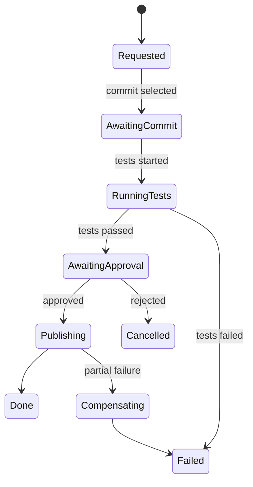

Represent transitions as journaled events. The workflow actor may restart and resume from state. Do not hold a JavaScript Promise open for hours as the source of truth.

### 18.13 Replay modes

Three replay modes are useful:

1. **Projection rebuild:** replay durable events into pure reducers.
2. **Diagnostic actor replay:** feed recorded inputs/effect results into an isolated runtime and compare outputs.
3. **Simulation:** run a rule/workflow/capsule against a journal slice without committing real effects.

Simulation replaces effect calls with plan/receipt stubs. The UI must make simulated versus live output unmistakable.

### 18.14 Presence and leases

Clients, services, objects, surfaces and devices should publish leased presence. A lease has an owner, scope, renewal interval and expiry. The broker emits expiring/expired events and removes ephemeral registrations.

Leases solve several current ambiguities:

- verbs owned by a disconnected script;
- stale surface references;
- services whose runtime crashed;
- device controls still shown while offline;
- generated apps whose parent disappeared.

### 18.15 Transport adapters

The semantic broker should have one canonical local model. Adapters translate at the edge.

| Adapter | Strength | Use |
|---|---|---|
| Unix socket / framed JSON | simple local integration | apps, CLI, workers |
| WebSocket | browser/remote inspection | trusted local web tools, remote dashboards |
| MQTT 5 | constrained devices, retained state, QoS | e-ink agents, sensors, distributed controllers |
| OSC | low-latency control messages and timed bundles | encoders, media/control surfaces |
| MIDI | widely available physical controllers | knobs, pads, faders |
| Serial/USB HID | custom hardware | button boxes, LED matrices |
| CBOR framing | compact local/edge payloads | constrained links |

OSC supplies address patterns, typed arguments and bundles/timetags, but it deliberately leaves application semantics to the user. The adapter must therefore map OSC addresses into canonical device/property/action/event descriptors rather than exposing raw OSC as the desktop ontology.

MQTT can carry retained properties, request/response metadata and delivery QoS, but broker capability identity must not be inferred from a topic string. The gateway authenticates the connection and maps it to a principal.

### 18.16 Schema registry and evolution

Every nontrivial event, command and service method references a schema. The registry stores:

- schema URI and version;
- media type/encoding;
- compatibility policy;
- example values;
- object/reference fields;
- sensitivity labels;
- generated Go and TypeScript/JavaScript bindings where useful;
- migration/coercion functions;
- maximum encoded size.

A producer cannot silently change a payload shape under the same schema version.

### 18.17 Semantic links and JSON-LD

Most messages can use ordinary JSON with URI-shaped identifiers. For selected domains, an optional JSON-LD context can make terms interoperable:

```json
{
  "@context": {
    "build": "https://schema.go-go.dev/build#",
    "project": {"@id": "build:project", "@type": "@id"},
    "commit": {"@id": "build:commit", "@type": "@id"}
  },
  "@id": "object://build.run/418",
  "@type": "build:Run",
  "project": "project://go-go-wm",
  "commit": "object://git.commit/abc123"
}
```

Use this for export, federation and tooling—not in every hot local code path. The local type registry remains authoritative for runtime behavior.

### 18.18 Event fabric implementation sequence

1. Add correlation, causation, subject, schema and source fields to a backward-compatible envelope.
2. Add typed filters and per-subscription delivery policy.
3. Give subscriptions stable IDs, metrics and leases.
4. Add a journal for selected event classes.
5. Add a trace/timeline viewer before complex workflows.
6. Add request/reply and streaming service interfaces.
7. Add durable rule/workflow actors.
8. Add edge adapters after identity/capability mapping is defined.

---
EOF
wc -l -c /mnt/data/go-go-wm-programmable-presentation-os-research-and-architecture.md
```

<details><summary>💭 Thinking</summary>

**Appended research content on REPL and event fabric**

</details>

```unknown
bash -lc cat >> /mnt/data/go-go-wm-programmable-presentation-os-research-and-architecture.md <<'EOF'
# Part VI — A physical and ambient interface mesh

## 19. Devices as semantic participants

### 19.1 The wrong model: every device is a keyboard or monitor

Desktop systems usually integrate custom hardware by translating it into generic input or display primitives:

- a rotary encoder becomes left/right arrow keys;
- a button becomes a key chord;
- a touch tablet becomes a pointer;
- an LED matrix becomes a tiny framebuffer;
- an e-ink tablet mirrors a window.

That approach is convenient but loses meaning. The system cannot tell whether an encoder requested “next workspace,” changed a numeric parameter, scrubbed a timeline or selected the next object. Feedback becomes fragile because the device sees pixels or key state rather than semantic context.

**Proposed.** A device should join the desktop as an authenticated actor that exposes **properties, actions and events**, following the useful conceptual shape of the W3C Web of Things Thing Description while keeping a smaller local protocol.

### 19.2 Device descriptor

```json
{
  "apiVersion": "device.go-go.dev/descriptor/v1",
  "id": "device://studio/encoder-bank-1",
  "title": "Desk Encoder Bank",
  "model": "custom-enc4-v2",
  "firmware": "1.3.2",
  "principal": "principal://device/ed25519:abcd...",
  "tags": ["input", "feedback", "desk"],
  "properties": {
    "online": {
      "schema": {"type": "boolean"},
      "readOnly": true,
      "retained": true
    },
    "layer": {
      "schema": {"type": "string", "enum": ["wm", "repl", "media", "custom"]},
      "readOnly": false,
      "observable": true
    },
    "brightness": {
      "schema": {"type": "number", "minimum": 0, "maximum": 1},
      "readOnly": false
    }
  },
  "actions": {
    "setLed": {
      "input": "schema://device.led.command/1",
      "idempotent": true
    },
    "showText": {
      "input": "schema://device.text-frame/1",
      "idempotent": true
    },
    "vibrate": {
      "input": "schema://device.haptic/1"
    }
  },
  "events": {
    "rotated": {"schema": "schema://device.encoder.delta/1"},
    "pressed": {"schema": "schema://device.button.event/1"},
    "longPressed": {"schema": "schema://device.button.event/1"}
  },
  "forms": [
    {
      "transport": "mqtt5",
      "endpoint": "mqtt://edge-broker/devices/encoder-bank-1",
      "contentType": "application/cbor"
    },
    {
      "transport": "serial",
      "endpoint": "serial:///dev/serial/by-id/...",
      "contentType": "application/cbor-seq"
    }
  ],
  "renderProfiles": ["text.2x16", "led.rgb.4", "none"],
  "security": {
    "pairing": "physical-confirmation",
    "auth": "cose-sign1",
    "allowedPrincipals": ["principal://local/user"]
  }
}
```

The `forms` section describes protocol bindings. The semantic model remains properties/actions/events regardless of MQTT, serial or another transport.

### 19.3 Pairing flow

Pairing establishes identity and user intent.

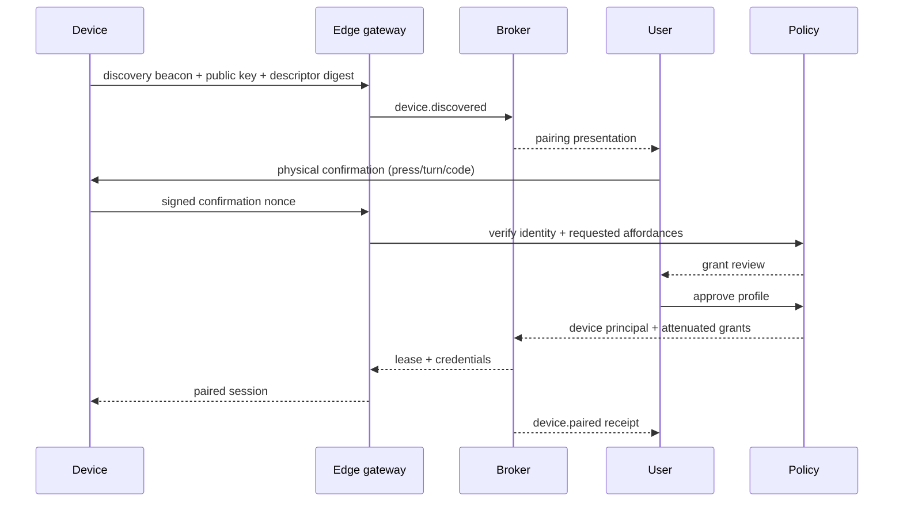

Physical confirmation can be a button press, displayed code, NFC tap or signed USB presence. The device does not gain general broker rights. It receives only the events/actions required by its installed mappings.

### 19.4 Device identity and trust

A descriptor is a claim until authenticated. The gateway maps a transport connection to a device principal through:

- a pre-shared key for simple prototypes;
- an Ed25519 or similar device key;
- OS-level USB/serial identity plus user confirmation;
- mTLS for networked devices;
- signed COSE messages for constrained CBOR links.

Do not use MQTT client ID, OSC path, serial device name or IP address alone as identity. Those are routing attributes.

### 19.5 Semantic mappings

A mapping connects device affordances to commands, properties, object accepts or surface events.

```json
{
  "apiVersion": "device.go-go.dev/mapping/v1",
  "id": "mapping://review-desk-controls",
  "device": "device://studio/encoder-bank-1",
  "scope": "room://project/go-go-wm/review",
  "bindings": [
    {
      "source": {"event": "rotated", "where": {"control": 0}},
      "target": {"command": "wm.focus-cycle"},
      "transform": {"field": "steps", "clamp": [-8, 8]},
      "delivery": {"class": "coalesced", "windowMs": 16}
    },
    {
      "source": {"event": "pressed", "where": {"control": 0}},
      "target": {"command": "pbui.accept-focused-or-open-menu"}
    },
    {
      "source": {"event": "longPressed", "where": {"control": 0}},
      "target": {"command": "launcher.open", "args": {"mode": "objects"}}
    }
  ],
  "feedback": [
    {
      "source": {"event": "wm.window.focus.changed"},
      "target": {"action": "showText"},
      "render": "template://device/focused-window-2x16"
    },
    {
      "source": {"event": "pbui.accept.started"},
      "target": {"action": "setLed"},
      "value": {"control": 0, "mode": "pulse", "tone": "accept"}
    }
  ]
}
```

Mappings are typed, inspectable objects. A physical event is transformed into a command with causation and trace identity, not a fake keyboard event.

### 19.6 Context layers

Physical controls often need modes. Hidden modes are error-prone, so model them as explicit layers with visible feedback.

```text
Global layer
  -> room layer
    -> focused-surface layer
      -> active-accept layer
        -> temporary interaction capture
```

Resolution rules should be deterministic. The control-bank widget and device display show the active layer and mappings. A temporary capture has a lease and ends automatically when its parent interaction completes.

Example: during a `number` accept, encoder 0 may adjust a candidate value and press may answer the accept. When the accept clears, the encoder returns to workspace navigation.

### 19.7 E-ink as a semantic surface host

An e-ink device should not mirror arbitrary desktop pixels. It should host a render profile optimized for:

- infrequent full refresh;
- partial updates and ghosting limits;
- high contrast and no animation dependence;
- coarse touch/pen input;
- explicit stale/offline indicators;
- page-based navigation;
- durable last-known content.

The device agent subscribes to a published surface or object view and requests `eink.static` or `eink.touch` rendering.

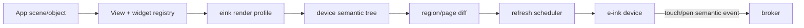

The scheduler may coalesce scene revisions, enforce minimum refresh intervals and choose partial/full refresh based on accumulated change.

### 19.8 E-ink content contract

A device frame should carry semantic item IDs so touches can map back to objects/actions even if the device is temporarily offline.

```json
{
  "frame": "frame://01J3...",
  "surface": "surface://build-dashboard/main",
  "revision": 91,
  "profile": "eink.touch",
  "expiresAt": "2026-07-22T16:20:00Z",
  "regions": [
    {
      "id": "build-418",
      "rect": [10, 72, 520, 42],
      "object": {"$ref": "object://build.run/418"},
      "events": ["select", "menu"]
    }
  ],
  "pages": ["...render resource refs..."],
  "fallbackText": "3 failed builds; newest is build 418"
}
```

A delayed touch includes frame and region IDs. The broker rejects or resolves stale interactions according to policy rather than guessing coordinates against a new frame.

### 19.9 Rotary encoders

Encoders produce relative deltas and often press/long-press events. Useful semantic interpretations include:

- move focus through a relation, not screen coordinates;
- adjust a typed numeric property with unit/range;
- scrub a trace timeline by event;
- change a selected REPL output view;
- rotate through applicable verbs;
- tune a parameter in a preview plan;
- page an e-ink surface.

Acceleration belongs in the mapping or target control contract. A `duration` editor might specify fine/normal/coarse steps and unit-aware snapping.

```json
{
  "ptype": "control.numeric-binding",
  "valueType": "duration",
  "range": {"min": "10ms", "max": "10s"},
  "steps": {"fine": "10ms", "normal": "100ms", "coarse": "1s"},
  "acceleration": {"thresholdPerSecond": 8, "mode": "step-tier"}
}
```

### 19.10 Button boxes

A button should invoke a semantic command by stable ID. The device display/LED communicates availability and state.

A command descriptor can expose:

- enabled/disabled with reason;
- toggle/tri-state state;
- dangerous/confirmation requirement;
- current key label/icon/text fallback;
- required object input;
- active progress.

The same descriptor drives an on-screen command palette and the physical button.

### 19.11 LED matrices and ambient displays

LED matrices are good for glanceable state, not dense application UI. Define semantic patterns:

```json
{
  "kind": "ambient.indicator-set",
  "items": [
    {"id": "build", "state": "failure", "severity": 3, "count": 2},
    {"id": "accept", "state": "waiting", "ptype": "git.commit"},
    {"id": "runtime", "state": "degraded", "count": 1}
  ]
}
```

A host renderer maps those states to device-specific pixels/animation. The app does not send an unrestricted RGB framebuffer. This preserves consistent semantics, accessibility alternatives and device portability.

### 19.12 Pen and tablet interactions

A pen tablet or e-ink notebook can participate in higher-level interactions:

- circle several presentations to create an object collection;
- drag an object into a typed hole;
- annotate an object or event with ink linked by semantic reference;
- sketch a window split/layout plan;
- mark timeline ranges;
- sign/approve a capability or workflow step.

Ink should be stored as a separate annotation object with coordinate system and target references. Do not bake it irreversibly into screenshots.

### 19.13 External device as accept source

An accept session can advertise device-compatible views:

```json
{
  "session": "accept://s42",
  "ptypes": ["git.commit"],
  "prompt": "Choose the base commit",
  "renderHints": {
    "eink": "recent-object-list",
    "encoder": "cycle-and-press",
    "voice": "read-short-labels"
  }
}
```

The device agent may show recent compatible objects or let the user navigate the focused surface. The answer still contains the semantic object reference and accept-session ID.

### 19.14 Device-side code

Avoid sending arbitrary JavaScript to constrained devices. Prefer:

- declarative mappings;
- preinstalled renderer profiles;
- signed firmware/plugins under device-specific policy;
- CBOR/COSE messages;
- simple local fallback behavior.

A capable tablet may host an isolated runtime, but it should still join as a separate actor with its own principal and capabilities. Desktop code is not automatically trusted on the device.

### 19.15 Offline behavior

A mapping and surface must declare offline semantics:

| Policy | Behavior |
|---|---|
| `disable` | controls do nothing and show offline state |
| `queue-safe` | queue idempotent actions with expiry |
| `local-fallback` | execute a predefined device-local behavior |
| `last-known-view` | retain the last frame with stale marker |
| `reconcile` | on reconnect, report local property changes and resolve conflicts |

Never queue arbitrary commands indefinitely. Each queued action needs an idempotency key, expiry and maximum count.

### 19.16 Device simulation

Every device descriptor and mapping should run against a desktop simulator. The simulator emits the same canonical events and renders the same feedback actions. This enables:

- automated integration tests;
- development without hardware;
- replay of device traces;
- accessibility alternatives;
- debugging mapping layers;
- safe review before installing a mapping.

### 19.17 Transport notes

#### MQTT 5

Use MQTT for retained properties, constrained devices and intermittent links. Map:

- retained messages → current observable properties;
- response topic/correlation data → command replies;
- message expiry → action/event TTL;
- user properties → adapter metadata only;
- QoS → edge delivery policy, not semantic exactly-once effects.

#### OSC

Use OSC for low-latency control surfaces and timed bundles. Define a versioned address space such as:

```text
/go-go/device/{device}/event/encoder/{control}/rotate
/go-go/device/{device}/event/button/{control}/press
/go-go/device/{device}/action/led/{control}
```

The gateway validates types and maps each address into canonical event/action schemas. OSC timetags can support synchronized feedback or media controls.

#### MIDI

Map notes, controls and pitch/fader values to device events. Preserve the raw MIDI message in adapter diagnostics, but publish normalized values and semantic control IDs.

#### CBOR and COSE

CBOR is useful when JSON overhead is material. COSE can sign or authenticate compact messages. Keep the canonical schema independent of encoding; desktop tools should be able to view a decoded JSON-equivalent representation.

### 19.18 Device mesh implementation sequence

1. Define descriptor, principal, lease and mapping schemas.
2. Build an in-process simulated encoder/button/LED device.
3. Add device events and feedback actions to the broker.
4. Build `device.control-bank@1` and a mapping inspector.
5. Add a serial or MIDI adapter for real local hardware.
6. Add an e-ink render profile with a simulated page device.
7. Add MQTT gateway and offline/retained semantics.
8. Add signed pairing and compact CBOR/COSE only after the basic model is stable.

---

# Part VII — Experimental interaction concepts

## 20. Research prototypes worth building

The following ideas should be treated as measured experiments, not immediate platform promises. Each one uses the same semantic object, surface, event and capability foundations, so a failed experiment does not require discarding the architecture.

### 20.1 Universal semantic lasso

**Idea.** Let the user draw a lasso across a surface or multiple adjacent surfaces. Every intersected presentation contributes its object reference to a typed collection.

```text
Visual gesture
  -> host hit-tests semantic regions
  -> collection<object-ref>
  -> type registry computes common/sum type
  -> applicable collection verbs appear
```

Examples:

- circle three failed builds and invoke “compare failure signatures”;
- select commits from a graph and send them to a release-notes app;
- select windows and apply a room/layout operation;
- select event spans and create a replay fixture.

Research questions:

- How should mixed-type collections advertise verbs?
- How are duplicate/entity versions handled?
- Can lasso crossing window boundaries remain visually and behaviorally clear?
- What is the keyboard equivalent?

Success metrics: task time versus repeated menus, error rate, and how often users inspect/modify the collection before invoking a verb.

### 20.2 Presentation lenses

**Idea.** A lens overlays or replaces a view without changing the underlying app.

Examples:

- provenance lens: shows where every visible object came from;
- capability lens: colors interactions by required authority;
- freshness lens: marks stale/offline object references;
- performance lens: shows render cost and event latency per region;
- dependency lens: draws relations among visible code/build/test objects;
- novice lens: adds explanations and safe-action previews.

A lens subscribes to semantic scene metadata and object refs, not another app’s private widget tree. It emits an overlay scene hosted by the compositor/WM.

Risks: visual overload, privacy leaks and spoofing. Lenses need explicit activation, a distinct host-owned chrome and capability checks for metadata they reveal.

### 20.3 Portals and detachable subworlds

**Idea.** Any published surface fragment can be embedded elsewhere as a portal or detached into its own window/device.

A REPL plot can be:

- embedded in `Out[n]`;
- detached as a floating inspector;
- tiled beside source code;
- projected to e-ink;
- embedded in a project room;
- referenced from a HyperCard stack.

The semantic surface identity remains the same. Each host may choose a different render profile and local view state.

Research question: which local state is per-host (scroll, zoom) and which is actor-owned (selected semantic object)? Make this explicit in widget contracts.

### 20.4 Object constellation

**Idea.** Present the current task as a spatial graph of semantic objects and relations rather than windows.

Nodes might include:

- repository, branch, commit, pull request;
- build, test, log span;
- source file and symbol;
- REPL cell, operation plan, runtime actor;
- device and room.

Selecting a node reveals views and verbs; selecting an edge explains the relation and provenance. Windows become portals into parts of the constellation.

This is inspired by Smalltalk’s object world and science-fiction “knowledge interfaces,” but it remains grounded in the object/type registry.

Measure whether the graph improves navigation or merely creates an attractive map. Start with a bounded project context, not the whole desktop.

### 20.5 Temporal desktop

**Idea.** The journal makes time a navigable dimension. A room can be viewed at an earlier semantic revision:

- which windows and objects were active;
- which REPL cells existed;
- which app versions and capabilities were installed;
- what events led to a failure.

The user can fork a simulation from that point without rewinding the live system.

Distinguish clearly:

- **historical view:** read-only recorded state;
- **simulation:** isolated actors consuming recorded inputs;
- **restore:** explicit new live operations that reconstruct selected state;
- **replay effect:** potentially dangerous and separately authorized.

### 20.6 Constraint-based workspace composition

**Idea.** Allow scripts/users to state relationships instead of exact split sequences:

```js
wm.constraints.define("review-layout", {
  keepVisible: [objects.ofType("git.diff"), surfaces.named("repl")],
  relations: [
    layout.rightOf("repl", "editor"),
    layout.below("tests", "editor"),
    layout.ratio("editor", 0.62),
    layout.minWidth("repl", 420)
  ],
  priorities: { "keepVisible": "required", "ratio": "preferred" }
});
```

A solver produces a `wm.operation-plan`; the user can inspect which constraints were satisfied or relaxed. This recovers ThingLab’s inspectable constraint idea while preserving the WM tree as the actual state model.

Do not put a solver in the X event hot path. Recompute asynchronously and commit a bounded operation plan.

### 20.7 Adaptive explanation surfaces

**Idea.** Inspired by the Primer in *The Diamond Age*, a view can adapt explanation depth to the user’s current task and demonstrated understanding.

A state-machine inspector might offer:

- direct controls for an expert;
- invariant explanations for an intern;
- a guided exercise with checkpoints;
- a replay of a prior bug;
- links into source and tests.

Adaptation should be explicit and inspectable. The system can store a local learning profile, but it must not silently hide important controls or infer competence from opaque surveillance. The user can switch explanation levels at any time.

### 20.8 Semantic ambient projections

**Idea.** Publish selected system state as low-bandwidth ambient representations:

- an LED pulse for an active accept;
- e-ink list of current review objects;
- a small display showing the focused object and top verbs;
- a physical button indicating a pending workflow approval.

The projection consumes semantic objects/events and applies a declared privacy policy. A lock-screen or shared-room profile must redact titles, repository names and object values.

### 20.9 Command composer

**Idea.** Build commands by placing typed objects into visible argument slots.

```text
COMPARE [ git.commit: abc123 ] WITH [ click a git.commit ]
IN [ workspace: review ]
OUTPUT AS [ diff.surface ]
```

Slots are accepts. Objects can come from any surface/device. The composed command is itself a presentation that can be saved, edited, published or copied as JavaScript.

This is a direct contemporary expression of CLIM command argument acquisition and HyperCard’s visible construction ethos.

### 20.10 Semantic drag and drop without file-only assumptions

**Idea.** Dragging a presentation transports an object reference plus offered types/views, not just text or a file URI.

A target declares accepted presentation types and optional coercions. During drag, targets can show why they accept or reject the object. Dropping initiates a command or accept answer with full provenance.

Security rule: drag payloads carry no authority. The target uses its own capabilities to resolve/use the object, or requests a delegated capability explicitly.

### 20.11 Living documentation

**Idea.** Documentation examples can be executable cells and widgets connected to the running system under constrained profiles.

An intern reading about focus state can:

- inspect the live state machine;
- run a pure decision helper against fixtures;
- replay a regression trace;
- edit a copy of the transition logic in a sandbox;
- see property-test counterexamples;
- publish a proposed patch/test artifact.

The textbook writing skill’s emphasis on complete explanations, traces and interactive widgets maps naturally onto a presentation notebook.

### 20.12 Semantic screenshot

**Idea.** A “screenshot” captures not only pixels but a redacted semantic scene snapshot:

- surface tree and revision;
- object references and fallback labels;
- focus and selected items;
- app/runtime/capsule versions;
- trace cursor;
- optional pixels.

This enables accessible bug reports, replayable UI tests and object-aware sharing. Sensitive object values must be redacted according to schema labels and sharing policy.

### 20.13 Error theater

**Idea.** When a complex failure occurs, open a temporary room that stages the relevant actors, messages, state machines, source locations and operation receipts as a guided causal narrative.

This is not an animated gimmick. It is an automatically assembled diagnostic stack:

1. what the user did;
2. which command was admitted;
3. which capability authorized it;
4. which actor handled it;
5. which state transition failed;
6. what remained consistent;
7. available recovery actions;
8. a one-click regression fixture.

### 20.14 Experimental evaluation discipline

Every prototype should declare:

- hypothesis;
- target users/tasks;
- baseline interaction;
- instrumented metrics;
- failure/abandon criteria;
- privacy implications;
- capability needs;
- fallback path;
- which platform contracts it exercises.

A novel UI should graduate into the core only when it proves repeated value and can be expressed through stable semantic primitives.

---
EOF
wc -l -c /mnt/data/go-go-wm-programmable-presentation-os-research-and-architecture.md
```

<details><summary>💭 Thinking</summary>

**Updated device mesh and UI sections**

</details>

```json
{"search_query":[{"q":"site:cloudevents.io specification CloudEvents official"},{"q":"site:w3.org/TR wot thing description 1.1 official"},{"q":"site:w3.org/TR trace-context official"},{"q":"site:kernel.org landlock userspace API seccomp filter official"}],"response_length":"long"}
```

The draft is complete, including broker migration, three-tier sandboxing, REPL workbench, transient capsules, and physical-device semantics; I’m now verifying sources, formatting, and placeholders.

<details><summary>💭 Thinking</summary>

**Searched 15 websites**

</details>

```unknown
bash -lc cat >> /mnt/data/go-go-wm-programmable-presentation-os-research-and-architecture.md <<'EOF'
# Part VIII — Security, performance and verification

## 21. Threat model and security architecture

### 21.1 Assets and trust boundaries

The system protects more than files. Important assets include:

- control of the X session and window layout;
- input focus and user interaction integrity;
- semantic objects and potentially sensitive values;
- source code, build logs and credentials reachable through services;
- capability grants and signing keys;
- durable journal and notebook history;
- physical device control;
- user attention and authorization decisions;
- availability of the WM and broker.

Trust boundaries:

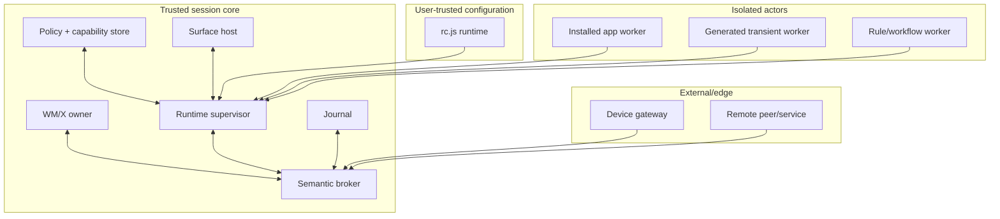

The trusted session core is small but security-critical. JavaScript code is trusted according to profile, never merely because it is local.

### 21.2 Principal types

Every action is attributable to a principal:

```text
principal://local/user
principal://system/wm
principal://package/dev.go-go.build-monitor
principal://capsule/sha256:...
principal://device/ed25519:...
principal://remote/user@example
```

An actor runs *as* a principal or delegated child principal. Broker messages cannot override their authenticated source.

### 21.3 Threat matrix

| Threat | Example | Primary controls | Residual concern |
|---|---|---|---|
| Arbitrary code execution | broker sender transmits malicious JS | capsule admission, disabled-by-default remote execution, isolated worker, module allowlist | interpreter/native runtime vulnerabilities |
| Ambient authority | script reaches home dir or X socket | closed descriptors, minimal root, Landlock, no network, capability proxies | host misconfiguration |
| Confused deputy | untrusted app asks privileged service to act on arbitrary ref | opaque capabilities, scoped methods, target validation, caller identity | overly broad service interface |
| Event spoofing | app emits `capability.granted` | broker-owned source/type namespaces, authorization on publish | compromised trusted broker client |
| Replay | repeated command mutates state twice | idempotency keys, deadlines, nonces, receipts | poorly designed external service |
| Resource exhaustion | infinite loop, giant scene, event flood | process limits, turn interruption, scene/message limits, bounded queues | kernel/GC pressure before limit triggers |
| UI spoofing | generated app imitates capability dialog | host-owned security chrome, origin/trust badge, restricted placement | social engineering through content |
| Object reference forgery | guessed `object://...` reads secret data | refs are identifiers, resolution requires capability and scope | metadata leakage from labels |
| Stale reference/TOCTOU | plan applies to changed tree | versions, preconditions, compare-and-apply | external effects with weak concurrency APIs |
| Dependency substitution | capsule imports changed module | content-addressed dependencies, lock manifest, signature/provenance | trusted dependency compromise |
| Secret exfiltration | app reads token then encodes via UI/events | do not grant raw secret reads; service mediation; output limits; audit | covert channels through allowed outputs |
| Device impersonation | attacker publishes encoder events | pairing keys, gateway auth, leases, sequence/replay checks | stolen device key |
| Journal tampering | erase capability-use history | append checksums, restricted writer, backups/seals | compromised trusted host/root |
| Runtime cross-talk | one app receives another app’s callback/state | one runtime owner, no shared VM values, per-runtime state and identity | bugs in supervisor routing |
| Focus theft | background app opens overlay and captures keys | host focus policy, parent/activation tokens, trusted overlay roles | X11 limitations and malicious native clients |

### 21.4 Capability security rules

1. A capability is an unforgeable host record referenced by an opaque handle.
2. Possessing an object reference does not imply authority to resolve or mutate it.
3. A capability can be attenuated but not broadened by its holder.
4. Every capability has issuer, holder, interface, method set, scope, quota, expiry and revocation status.
5. Capability use is checked at the trusted boundary, not only in JavaScript wrapper code.
6. User prompts issue new grants; they do not mutate untrusted message fields into authority.
7. Services must validate both the capability and semantic target.
8. Delegation creates a child grant linked to its parent for audit and revocation.
9. Long-lived grants require a visible management surface.
10. Sensitive capability use creates receipts or journal records according to policy.

### 21.5 Capability scopes

Prefer structural scopes:

```json
{
  "interface": "service://git-reader@1",
  "methods": ["getCommit", "diff", "listHistory"],
  "scope": {
    "repositories": ["repo://local/go-go-wm"],
    "paths": ["**"],
    "maxObjects": 10000
  },
  "expiresAt": "2026-07-22T17:00:00Z"
}
```

Avoid textual scopes that services interpret inconsistently. Scope schemas belong to the interface definition.

### 21.6 Authorization flow

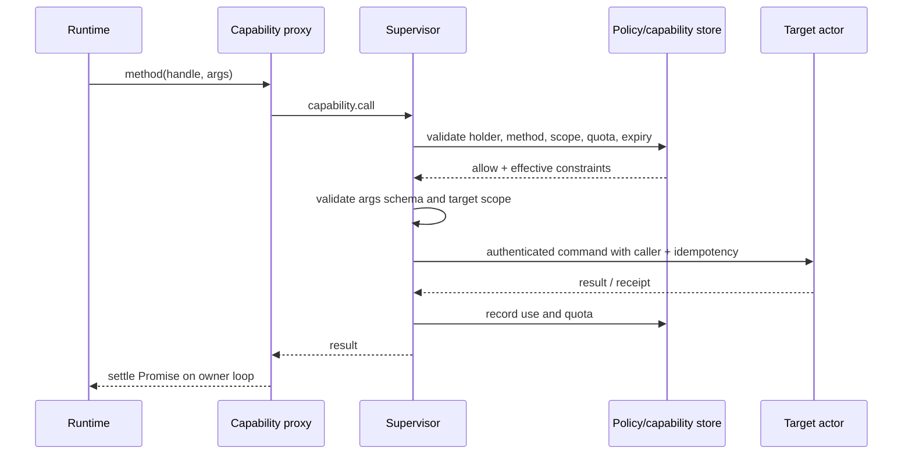

The target can make an additional domain authorization decision. Capability validation should not force every service to trust arbitrary identifiers supplied by a caller.

### 21.7 UI integrity

The host owns security-sensitive visual elements:

- capability prompts;
- package/capsule origin and trust badge;
- generated-app indicator;
- effect commit confirmation;
- password/secret entry;
- device pairing confirmation;
- permission-use indicator;
- simulation versus live mode;
- privileged system errors.

Script scenes cannot set the surface role to `system-auth`, hide origin chrome or draw over trusted prompt boundaries. On X11, perfect anti-spoofing is difficult because native clients can draw arbitrary windows. `go-go-wm` can still enforce distinct decorations, placement and input activation for its own supervised surfaces and avoid granting untrusted code a direct X connection.

### 21.8 Secret handling

Scripts should rarely receive secret material. Expose services such as:

```js
await credentials.signRequest({
  service: "git-host",
  requestDigest: digest,
  audience: "api.example"
});
```

rather than:

```js
const token = await credentials.readToken("git-host"); // avoid
```

Service-mediated use supports audience restriction, expiry, audit and non-exportability. Secret input widgets should return a capability to use the entered secret, not necessarily the secret string.

### 21.9 Object labels and redaction

Even unresolved references can leak information through labels and documentation. Schemas should mark fields with sensitivity:

```json
{
  "properties": {
    "repository": {"type": "string", "x-go-go-sensitivity": "private"},
    "status": {"type": "string", "x-go-go-sensitivity": "public"},
    "logExcerpt": {"type": "string", "x-go-go-sensitivity": "secret-derived"}
  }
}
```

Rendering and export profiles apply redaction. A shared e-ink display may show “2 builds failed” without repository names.

### 21.10 Broker namespace ownership

Reserve event/command prefixes:

```text
wm.*             owner: WM actor
runtime.*        owner: supervisor
capability.*     owner: policy store
surface.*        owner: surface host
journal.*        owner: journal service
device.*         owner: authenticated gateway/agent with subtype policy
app.<id>.*       owner: package/app principal
```

A client cannot publish another owner’s authoritative event type. It may request a command or publish an observation under its own namespace.

### 21.11 Schema and parser attacks

Every decoder needs:

- maximum message bytes before allocation;
- maximum JSON nesting and collection lengths;
- duplicate-key policy;
- UTF-8 validation;
- numeric range handling;
- unknown-field policy by message version;
- time/deadline validation;
- reference URI length and character rules;
- bounded schema recursion/ref resolution;
- content-type allowlist.

Do not fetch schemas or code from arbitrary network URLs during admission. Resolve only through configured registries and content digests.

### 21.12 Native module checklist

A `go-go-goja` native module exposed to constrained runtimes should satisfy:

- no ambient singleton state shared across principals unless explicitly designed;
- no direct VM access from background goroutines;
- all asynchronous settlement posted through runtime services/owner;
- current-call context propagated into host work;
- lifetime cancellation honored;
- blocking work outside owner loop;
- input/output schemas and size bounds;
- explicit capability parameter or module construction from a grant;
- no raw Go pointers, file descriptors or host objects exported;
- panic recovery at trusted boundary;
- cleanup registered with runtime lifecycle;
- fuzz tests for conversion and malformed values;
- audit category documented.

### 21.13 Worker protocol security

The supervisor-worker control channel should be framed, authenticated by process creation and intentionally tiny. Message classes might be:

```text
worker.hello
worker.ready
worker.turn
worker.turn.result
worker.capability.call
worker.capability.result
worker.scene.publish
worker.checkpoint
worker.log
worker.metrics
worker.stop
```

The worker cannot choose its principal/profile after startup. Sequence numbers, message-size limits and state-machine validation prevent cross-turn confusion.

### 21.14 Supply-chain model

A capsule lock manifest records:

- every source file digest;
- native/JS module IDs and digests;
- widget pack/schema versions;
- generated bindings version;
- engine/runtime version range;
- signer and provenance;
- build tool version.

Installed packages can be rescanned when a dependency is revoked. A package update creates a new capsule identity and goes through migration/review; it does not mutate running code invisibly.

### 21.15 Remote peers

Federation should initially exchange data, object summaries and service requests—not executable capsules. A remote principal receives a narrow broker gateway with:

- explicit namespace mapping;
- type/schema allowlist;
- message rate/size limits;
- trace restart at trust boundary where appropriate;
- redaction;
- no local capability handles crossing the boundary;
- locally reissued service grants;
- audit.

Remote code execution can remain disabled indefinitely without weakening the local programmable desktop.

### 21.16 Security testing

Required tests:

- forged principal/source fields are ignored/rejected;
- capability handles cannot be guessed/reused by another actor;
- attenuation never broadens methods/scope/expiry/quota;
- revocation cancels outstanding calls where possible;
- expired leases remove verbs/services/surfaces;
- malformed/deep/oversized messages fail before expensive processing;
- generated scene cannot invoke a handler absent from its accepted revision;
- worker inherits no unexpected descriptors/environment;
- blocked filesystem/network/process operations actually fail;
- seccomp/Landlock profile detects unsupported kernel features and fails according to policy;
- effect retries use idempotency receipts;
- system prompt chrome cannot be requested by a script;
- journal records sensitive grants/effects without secret payloads.

### 21.17 Security posture by development stage

| Stage | Allowed code | Minimum containment |
|---|---|---|
| Prototype | trusted local rc/scripts only | module gating, owner loop, no broker code execution |
| Local transient preview | locally authored/generated capsules | separate worker, no ambient IO, hard limits, review |
| Installable user apps | signed/local packages | worker profiles, capability store, durable audit, updates/migrations |
| Devices | declarative mappings, trusted gateways | pairing identity, leases, rate limits, no script injection |
| Remote peers | data/services only | authenticated gateway, redaction, namespace policy |
| Remote capsules | optional future research | strongest worker sandbox, explicit per-run approval, no default authority |

---

## 22. Performance architecture and budgets

### 22.1 Preserve the fast-path separation

The GGWM performance work establishes a non-negotiable rule:

```text
X event / focus / geometry / paint / pixel upload
    must not wait for
broker I/O / JavaScript / service calls / journal fsync / device network
```

Semantic events are emitted after local state transitions. Script-requested mutations are validated and posted into the WM owner loop. Scene snapshots are prepared before the paint path. The journal can batch writes independently unless a particular effect requires durable admission before execution.

### 22.2 Latency classes

The following are **proposed engineering targets**, not claims about current measurements.

| Interaction | Target | Notes |
|---|---:|---|
| pointer/key to local focus/navigation response | p95 < 16 ms | no JS round trip |
| transient overlay/menu first paint from cached data | p95 < 50 ms | host-owned surface |
| broker local command admission + actor enqueue | p95 < 5 ms | excluding actor work |
| simple JavaScript handler turn | p95 < 25 ms | interrupt/diagnose over budget |
| scene normalize + reconcile, 1,000 nodes | p95 < 8 ms | benchmark by widget mix |
| ordinary full frame paint/upload | within 16.7 ms at 60 Hz | existing optimized Go path |
| launcher search update | p95 < 30 ms | incremental index/fuzzy search |
| object menu query | p95 < 75 ms | cached registry; show progressive state if slower |
| e-ink semantic update admission | < 100 ms | physical refresh can be seconds |
| durable journal append batch | p95 < 20 ms | effects requiring sync may be slower and explicit |

Budgets should be configurable for development hardware and measured in trace spans.

### 22.3 JavaScript turn budgeting

A runtime turn includes one posted callback/evaluation and the synchronous JavaScript it invokes. Track:

```text
queue wait
  + owner scheduling
  + JS execution
  + synchronous native conversion
  + scene/state serialization
```

Suggested thresholds:

- 8 ms: development warning for interactive handler;
- 25 ms: slow-turn event;
- 100 ms: severe warning, optional interrupt for constrained profile;
- profile deadline: hard interrupt/restart policy.

A long operation should yield by starting asynchronous host work or processing bounded chunks. Do not solve this with multiple goroutines touching one runtime.

### 22.4 Mailbox scheduling

One runtime owner preserves correctness but can starve categories. Use a bounded scheduler with categories:

```text
lifecycle/control
capability replies
user interaction
service requests
semantic events
background timers/maintenance
```

This need not become a complex preemptive scheduler. Weighted FIFO queues and per-turn limits may be sufficient. Preserve ordering where the subscription contract requires it.

Expose queue wait and oldest-message age. A queue of two messages can still be unhealthy if the first has waited ten seconds.

### 22.5 Coalescing at semantic boundaries

Coalesce where meaning is known:

- pointer motion → latest pointer position;
- resize → latest geometry per window;
- encoder rotations → summed delta within 8–16 ms;
- progress → latest value per operation;
- focus hover docs → latest target;
- scene refresh requests → one pending render flag;
- sensor values → profile-specific sampling/window.

Never coalesce events whose individual identity matters, such as button presses, capability grants, effect receipts or workflow transitions.

### 22.6 Scene rendering cost model

Normalization should produce a compact host representation with precomputed:

- node kind and key lookup;
- resolved theme tokens;
- text shaping/cache keys;
- object view resolution status;
- event handler table;
- intrinsic size hints;
- widget resource handles.

Reconciliation identifies dirty subtrees. Layout may still affect ancestors, but paint damage should remain bounded where possible.

Metrics per scene revision:

```text
input bytes
node count / depth
normalize time
reconcile time
layout time
paint time
upload time
dirty rect count/area
text cache hits
widget-specific time
host-local state retained/replaced
```

### 22.7 Large data

Do not send 100,000 table rows or plot points in every scene snapshot. Use data handles and paged/streamed models:

```js
const data = await datasets.publish(rows, {
  schema: "schema://build.row/1",
  index: ["status", "branch", "durationMs"]
});

return ui.widget("builds", "core.table@2", {
  source: data.ref,
  pageSize: 200,
  query: state.query,
  selection: state.selection
});
```

The widget host or a data service requests pages with a capability and query schema. Selection returns row object refs, not copied entire rows.

### 22.8 Object resolution caches

Cache immutable values by `(ref, version, view)` and entities by short TTL/lease revision. Invalidate through object-version events. A cache entry records sensitivity and principal scope so values are not reused across authority boundaries incorrectly.

### 22.9 Journal performance

The live bus should not require synchronous durable writes for ordinary telemetry. For sensitive effects:

```text
validate command
  -> reserve/idempotency receipt durably
  -> execute effect
  -> append outcome
  -> reply
```

For other events, batch append and expose the durability class in the envelope/receipt. Segment rotation, indexing and retention should occur outside broker routing turns.

### 22.10 Worker startup

Transient-app experience depends on startup latency. Optimizations may include:

- preloaded but unprivileged worker process templates;
- cached parsed/compiled JavaScript where goja APIs permit safely;
- immutable module bundles;
- lazy broker/service connections;
- initial static scene in the capsule for immediate preview;
- process pools only for identical security profiles, with complete state reset.

Do not reuse a goja runtime between unrelated principals unless isolation can be proven. Process pooling should pool empty workers, not heaps.

### 22.11 E-ink scheduling

Track:

- semantic revision rate;
- changed regions and coverage;
- time since partial/full refresh;
- device temperature/battery if available;
- interaction urgency;
- stale deadline.

A high-rate source may update the desktop view continuously while the e-ink projection publishes a summary every 30 seconds or on significant state transitions.

### 22.12 Performance regression suite

Benchmarks should cover:

- `wmcore.ApplyBatch` and layout on generated trees;
- broker routing with N clients/subscriptions/verbs;
- EventFan queue/coalescing and owner-post latency;
- JS handler turn with plain data conversion;
- scene normalization/reconciliation by node count/depth;
- table/plot widget paging and selection;
- object resolution cache;
- worker startup/shutdown;
- journal append/query/projection rebuild;
- device gateway encoding/decoding and coalescing;
- X11 render/upload paths already optimized by GGWM-005/006.

Store representative traces and scene fixtures. Performance tests need semantic assertions so an optimization cannot silently drop required events or hit regions.

---

## 23. Observability and verification

### 23.1 Observability is part of the interaction model

A programmable desktop cannot be understandable if its scripts, broker and capabilities are invisible. Every subsystem should publish structured state that the presentation layer can inspect.

Three complementary tools:

- **logs:** human-oriented diagnostic records;
- **metrics:** aggregates and health thresholds;
- **traces/events:** per-operation causality and semantic history.

The trace timeline and object inspector make these ordinary desktop objects rather than separate infrastructure dashboards.

### 23.2 Required trace spans

Instrument:

```text
broker.receive / decode / authorize / route
broker.query / stream chunk
runtime.mailbox.wait
runtime.turn
runtime.capability.call
runtime.checkpoint
surface.normalize / reconcile / layout / paint / upload
wm.command.admit / apply-batch / relayout
object.resolve / view.resolve / verb.query
journal.append / projection.apply
worker.spawn / sandbox.apply / bootstrap / stop
device.decode / map / command / feedback
repl.evaluate / derive / publish / commit
```

Propagate `traceparent` across broker, supervisor and service calls. Restart or sanitize traces at untrusted remote boundaries according to policy.

### 23.3 Metrics

Core metrics:

- broker connections, message rate/bytes, route latency, per-type rejects;
- subscription queue depth, drops/coalesces, cursor lag;
- actor count by profile/state, restarts/crashes;
- owner-loop wait/turn percentiles;
- capability grants, denied calls, revocations, quota use;
- scene node count, reject count, render latency and dirty area;
- WM operation latency and tree size;
- journal append lag/size/projection cursor;
- object resolver hit/miss/stale counts;
- device online/offline, event rates, command failures;
- REPL cell status counts, evaluation/publish failures.

Metrics labels must avoid high-cardinality raw object IDs unless explicitly sampled.

### 23.4 Diagnostic snapshots

On crash or severe timeout, capture a bounded snapshot:

- actor descriptor and capsule digest;
- capability summary without secret values;
- last N mailbox headers and event IDs;
- current/last valid scene metadata;
- current cell/handler/source location;
- resource counters;
- related trace IDs;
- state checkpoint digest;
- worker exit status/stderr tail.

The snapshot is a typed `runtime.crash-report` object.

### 23.5 Test pyramid

#### Pure unit tests

Use pure tests for:

- `wmcore` operations/layout;
- type matching/coercion selection;
- schema normalization;
- capability attenuation;
- state-machine transitions;
- event filters/coalescing;
- scene normalization/reconciliation;
- projection reducers;
- device mapping transforms.

#### Property tests

Properties:

- applying valid WM operations preserves tree invariants and unique IDs;
- plan inverses restore equivalent state where declared reversible;
- capability attenuation is monotonic;
- encode/decode round trips preserve canonical messages;
- reconciliation preserves host state only for compatible keyed nodes;
- event coalescing preserves declared aggregate semantics;
- journal replay yields the same projection hash;
- schema migrations are deterministic/idempotent where required.

#### Fuzz tests

Fuzz:

- NDJSON/framed protocol decoders;
- PBUI v1/v2 compatibility bridge;
- object/type/schema parsing;
- scene and widget props;
- worker protocol;
- capability method arguments;
- CBOR/JSON edge messages;
- device descriptors and mappings;
- JS-to-Go export normalization.

#### Concurrency and race tests

Test:

- broker connection churn while verbs/subscriptions/accepts exist;
- runtime shutdown during promise settlement;
- event delivery while actor restarts;
- surface close during handler post;
- capability revocation during service call;
- journal backpressure;
- worker crash during scene publish;
- theme swap while surfaces rerender;
- focus/fullscreen transitions already hardened in GGWM-011.

Run Go race tests for all host code. The actor design reduces shared state but does not eliminate races in snapshots, connection state and shutdown paths.

### 23.6 Protocol conformance fixtures

Maintain versioned fixtures:

```text
testdata/protocol/v1/*.ndjson
testdata/protocol/v2/*.json
testdata/scenes/v2/*.json
testdata/capsules/v1/*
testdata/devices/v1/*.json
testdata/journal/*.jsonl
```

Each fixture declares expected validation, routing and normalized output. Third-party clients can reuse a published conformance corpus.

### 23.7 Deterministic runtime tests

A pure worker test harness supplies:

- fixed clock;
- seeded random;
- scripted service replies;
- bounded event sequence;
- captured scene/state/effect outputs;
- no ambient modules.

Test a capsule using transcript fixtures:

```yaml
input:
  - event: build.failed
    data: { build: 418, severity: 3 }
serviceReplies:
  - call: build.get
    result: fixtures/build-418.json
expect:
  scenes:
    - match: fixtures/failure-explainer-scene.json
  effects: []
  stateHash: sha256:...
```

### 23.8 X11 integration tests

Use Xvfb or Xephyr-based tests for:

- manage/unmanage, focus and fullscreen;
- transient parent placement/stacking;
- script tile snapshots and action routing;
- menu/accept overlays;
- theme changes;
- render damage and hit regions;
- no JS invocation on paint path;
- launcher/repl surface behavior.

Keep display-free decision helpers for most logic, following GGWM-011’s successful pattern.

### 23.9 Device simulation tests

Simulated devices should test:

- discovery/pairing/lease expiry;
- encoder coalescing;
- mapping layer precedence;
- stale e-ink frame touches;
- offline queue expiry/idempotency;
- feedback rendering;
- transport reconnect and sequence gaps;
- principal mismatch/replay rejection.

### 23.10 Chaos tests

Inject:

- broker restart;
- worker kill -9;
- delayed/out-of-order service replies where protocol permits;
- journal disk-full/read-only conditions;
- device disconnect during accept;
- capability revocation during a workflow;
- corrupted capsule blob;
- renderer/widget panic;
- overload events above queue capacity.

The system should fail visibly, revoke leases and preserve core WM responsiveness.

### 23.11 Manual research evaluation

For novel UI prototypes, collect:

- task completion time;
- interaction count;
- errors/recoveries;
- whether users can predict message/authority flow;
- use of cross-surface presentations and accepts;
- cognitive load interviews;
- abandonment reasons;
- performance traces;
- accessibility findings.

The goal is not maximum feature novelty. It is a more composable and understandable working environment.

---
EOF
wc -l -c /mnt/data/go-go-wm-programmable-presentation-os-research-and-architecture.md
```

<details><summary>💭 Thinking</summary>

**Appended security, performance, and observability sections**

</details>

```unknown
bash -lc cat >> /mnt/data/go-go-wm-programmable-presentation-os-research-and-architecture.md <<'EOF'
# Part IX — Implementation plan

## 24. Sequencing the work without destabilizing the WM

### 24.1 Strategy

The project should advance through thin vertical slices. Each slice must preserve these current properties:

- WM/X ownership remains single-threaded;
- `wmcore` remains pure and testable;
- PBUI v1 clients continue to work during migration;
- the existing `rc.js`, `run`, launcher and rich REPL remain usable;
- no JavaScript enters paint/X event paths;
- every new queue and lease is observable;
- security boundaries are introduced before remote/generated code execution.

Do not begin by rewriting the broker, replacing `uispec`, or introducing a distributed database. Add versioned seams and migrate consumers incrementally.

### 24.2 Proposed package boundaries

```text
pkg/
  sem/
    object/          # refs, descriptors, value/entity categories
    ptype/           # type registry, matching, views, coercions
    schema/          # schema IDs, validation, compatibility
    identity/        # principal and actor IDs
  semwire/
    envelope/        # PBUI v2/common envelope
    protocol/        # command/query/event/reply/stream types
    compatv1/        # PBUI v1 bridge
  semBroker/
    core/            # owner loop and routing
    subscriptions/   # filters, delivery classes, leases
    services/        # request/reply and streams
    presence/        # actor/service/object/surface leases
  caps/
    store/            # grants, attenuation, revocation, audit
    proxy/            # host-side capability dispatch
    policy/           # profile and prompt decisions
  runtimes/
    supervisor/       # actor lifecycle and registry
    workerproto/      # supervisor-worker framing
    profiles/         # trusted, isolated, pure profiles
    checkpoint/       # schema-validated runtime state
  capsule/
    manifest/         # package schemas and digests
    admission/        # verify, lint, policy, stage
    store/            # content-addressed local storage
  scene/
    ir/               # v2 normalized scene types
    reconcile/        # keyed retained tree
    host/             # surface lifecycle and event validation
    widget/           # pack registry/contracts
  widgets/
    inspector/
    table/
    timeline/
    operationplan/
  journal/
    log/               # append/query segments
    projection/        # reducers and cursors
    replay/            # simulation/diagnostic modes
  repl/
    cell/              # durable cell model
    notebook/          # sessions, branches and persistence
    publish/           # cell -> capsule/command/rule
    transaction/       # operation plans and receipts
  device/
    descriptor/
    mapping/
    gateway/
    simulator/
```

Names are illustrative. The key is dependency direction:

```text
wmcore, sem.object, semwire types
        ↓
broker/caps/journal/runtimes
        ↓
scene/repl/device/apps
        ↓
wmx11 and command integration
```

The pure semantic types should not import X11 or goja.

### 24.3 Ticket sequence

#### `GGWM-012-SEM-ENVELOPE` — PBUI v2 envelope and typed errors

**Goal:** establish identity, correlation, causation, subject, schema, deadlines and typed errors while preserving v1.

Deliverables:

- `semwire.Envelope` and canonical JSON encoding;
- ULID/UUID-style IDs and URI validation;
- v1↔v2 adapter for hello/register/event/accept/verb paths;
- typed error object and codes;
- trace propagation helpers;
- message-size/depth limits;
- protocol fixtures and fuzz tests;
- a CLI protocol inspector.

Acceptance criteria:

- existing v1 examples pass through the bridge unchanged;
- a v2 command/reply carries correlation and deadline;
- malformed/oversized frames fail deterministically;
- source identity is assigned by the connection, not accepted from payload;
- trace timeline can display a basic message chain.

Non-goal: durable storage or complex filters.

#### `GGWM-013-TYPES-OBJECTS` — type registry and stable object references

**Goal:** make semantic identity, type descriptors and view/verb lookup explicit.

Deliverables:

- value/entity/capability/stream/surface reference types;
- type descriptor registry with supertypes and schemas;
- exact/supertype/`any` matching compatible with current PBUI;
- object resolvers and leases;
- view registry and fallback rendering;
- coercion graph with bounded path selection;
- `object.inspector@1` first version;
- migration helpers from current `{ptype,value,label,doc}`.

Acceptance criteria:

- current objects remain presentable and acceptable;
- two apps can refer to the same entity without copying its current value;
- stale/offline references render a fallback and typed error;
- inspector shows type, views, verbs, provenance and resolver owner;
- resolution is capability-checked.

#### `GGWM-014-CAPS` — capability records and transactional WM authority

**Goal:** replace coarse module availability as the only authority model.

Deliverables:

- capability store, opaque handles and attenuation;
- interface/method/scope schemas;
- expiry/revocation/quota;
- host-owned grant review surface;
- audit events;
- `wm.operation-plan` and `effect.receipt` types;
- plan preview/commit on top of `wmcore.Op` batches;
- capability graph prototype.

Acceptance criteria:

- a script with read-only WM capability cannot commit operations;
- a delegated capability cannot exceed parent scope or lifetime;
- stale tree-revision preconditions prevent commit;
- committed batches produce an idempotent receipt;
- revocation causes later calls to fail and removes dependent leases.

#### `GGWM-015-RUNTIME-SUPERVISOR` — actor lifecycle around go-go-goja

**Goal:** make runtime ownership, profiles, mailboxes and cleanup first-class.

Deliverables:

- actor descriptor/registry and lifecycle state machine;
- factory/profile selection using existing `go-go-goja` builders;
- bounded typed mailboxes and metrics;
- shared capability proxy construction;
- registration leases for verbs/services/surfaces;
- state checkpoint hooks;
- restart/stop/revoke behavior;
- `actor.monitor@1` and `mailbox.queue@1` prototypes;
- migration of `run` and optionally REPL through the supervisor.

Acceptance criteria:

- one actor always maps to one runtime owner;
- no callback accesses a VM outside the owner;
- stopping an actor removes all registrations and settles/cancels pending work;
- queue overflow follows a declared policy and emits a typed diagnostic;
- process-wide and per-runtime module state do not leak across actors.

#### `GGWM-016-SCENE-V2` — retained semantic surface IR

**Goal:** evolve `uispec` without breaking existing apps.

Deliverables:

- v2 scene schemas, normalization and key validation;
- v1 row/segment adapter;
- retained reconciliation and host-local state;
- semantic event envelope with scene revision validation;
- focus/accessibility metadata;
- widget pack registry;
- first packs: `core.table@2`, `object.inspector@1`, `trace.timeline@1`;
- desktop/text fallback render profiles.

Acceptance criteria:

- current `ui.app` surfaces render through the adapter;
- paint reads accepted host state and never calls JavaScript;
- stale/fabricated node events are rejected;
- keyed input/scroll state survives compatible rerenders;
- invalid scenes preserve the previous valid scene and show a typed diagnostic;
- widget schemas and event contracts have golden/conformance tests.

#### `GGWM-017-REPL-WORKBENCH` — durable cells and publication

**Goal:** turn the rich REPL into a durable, inspectable construction environment.

Deliverables:

- stable cell/session IDs and serialized notebook model;
- structured dependencies, traces, effects and error objects;
- operation-plan preview/commit views;
- `:inspect`, `:trace`, `:deps`, `:publish`, `:fork`;
- staged cell publication as command/verb/lens;
- explicit watched pure cells;
- notebook restore without serializing VM heap;
- `repl.cell@1` widget.

Acceptance criteria:

- reopening a session restores cells, source and durable outputs without replaying effects;
- a cell can accept typed objects from any surface;
- a cell-generated WM plan cannot mutate until committed;
- published command runs from a fresh runtime/capsule context;
- errors link to source, trace, input objects and a regression-test action.

#### `GGWM-018-CAPSULE-WORKER` — isolated capsule execution

**Goal:** safely run local/generated code outside the trusted process.

Deliverables:

- capsule manifest, content digest, lock manifest and local store;
- staging/review UI;
- pure expression worker process;
- supervisor-worker protocol;
- hard message/heap/time/process limits;
- no inherited ambient descriptors or network;
- optional Landlock/seccomp profile with feature detection;
- deterministic clock/random test mode;
- surface capsule profile after pure evaluator is stable.

Acceptance criteria:

- a pure capsule can receive JSON/semantic refs and return validated data;
- attempts to read undeclared files, create network sockets or spawn processes fail;
- infinite JavaScript is interrupted and worker cleaned up;
- native capability calls are asynchronous and cancellation-aware;
- capsule source/hash/profile/grants are visible before start;
- worker crash cannot block or crash the WM.

#### `GGWM-019-JOURNAL-TRACE` — durable semantic journal and projections

**Goal:** support audit, replay, rules and historical inspection.

Deliverables:

- selected-event append log with checksums;
- indexes/query API and cursors;
- projection framework;
- trace timeline integration;
- effect receipt persistence/idempotency;
- simulation API for rules/capsules;
- retention and redaction policy.

Acceptance criteria:

- projection rebuild produces the same state hash;
- an effect retry returns the prior receipt rather than reapplying;
- a trace can be reconstructed across broker/runtime/WM/device boundaries;
- journal failure has explicit behavior and does not silently lose required receipts;
- sensitive values are redacted from audit records by schema policy.

#### `GGWM-020-TRANSIENT-STACKS` — HyperCard-style app and stack runtime

**Goal:** make on-demand micro-apps and task stacks a supported product surface.

Deliverables:

- application descriptor and transient lifecycle;
- parent-child cancellation and capability delegation;
- card/background/part handler scopes;
- navigable stack state and export/import;
- generated-app staging template;
- build-failure or commit-compare reference app;
- room/notebook bindings.

Acceptance criteria:

- one staged capsule can run as a transient app and publish multiple surfaces;
- closing parent stops or detaches child according to policy;
- card message path is visible in trace;
- state checkpoint/migration uses schemas, not VM serialization;
- app can consume another JS app through a service interface only.

#### `GGWM-021-DEVICE-MESH` — semantic devices and external surfaces

**Goal:** integrate physical devices through descriptors and mappings.

Deliverables:

- device descriptor/principal/presence/lease;
- simulator;
- event/action/property bridge;
- mapping object and layer resolution;
- encoder/button/LED reference device;
- e-ink render profile simulator;
- one real adapter: MIDI, serial or MQTT;
- pairing and mapping inspector.

Acceptance criteria:

- simulated and real adapters produce identical canonical events;
- encoder mapping invokes semantic commands with causation trace;
- stale e-ink touches are handled by frame revision;
- offline/lease expiry removes active mappings;
- device has no ambient command authority beyond installed grants.

#### `GGWM-022-EXPERIMENTS` — lenses, command composer and semantic lasso

**Goal:** evaluate novel interfaces only after observability and safety exist.

Start with two experiments:

1. command composer with typed argument holes;
2. provenance/performance presentation lens.

Each experiment includes hypothesis, baseline, metrics and deletion criteria.

### 24.4 Dependency graph

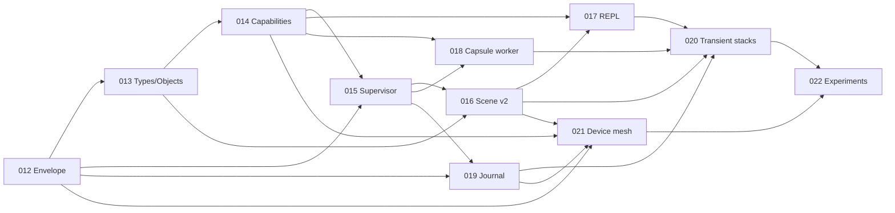

Some work can overlap, but capability semantics must precede broad untrusted execution.

### 24.5 First end-to-end demonstration

Build one vertical story across the phases:

> From a terminal presentation, select a commit; in the REPL accept a second commit; preview and start an isolated transient comparison app; detach its timeline to a tile; project the summary to a simulated e-ink display; use an encoder simulator to move between changed files; inspect the complete causation trace and stop the app, revoking all leases.

This story tests:

- existing PBUI/Kitty interoperability;
- v2 object references and accepts;
- REPL cells and publication;
- capsule worker;
- widget packs;
- transient lifecycle;
- device mapping;
- tracing and cleanup.

It is more valuable than ten disconnected demos.

### 24.6 Migration of current APIs

#### PBUI objects

Keep current construction:

```js
pbui.object("color", "#b0563f")
```

Normalize internally to an inline value object. Add opt-in entity refs:

```js
pbui.ref("git.commit", "object://git.commit/abc123")
```

#### Events

Keep:

```js
pbui.emit("theme.changed", { theme: "paper-dark" });
```

The v1 bridge assigns source/id/schema fallback. New code uses:

```js
events.publish({
  type: "app.my-tool.selection.changed",
  subject: selected.ref,
  schema: "schema://app.my-tool.selection.changed/1",
  data: { selected: selected.ref }
});
```

#### UI

Keep existing `ui.row`, `ui.text`, `ui.object`, `ui.button`. Adapt them into a v2 scene fragment. Introduce `ui.scene` and keyed helpers for new apps.

#### WM

Keep direct operations for trusted `rc.js`. Add plan-first APIs for constrained runtimes and REPL publication. Mark direct write methods as requiring a broad trusted capability.

#### REPL

Existing session values and `Out(n)` remain. Durable serialization stores derived outputs/reference data; raw heap values remain available only while the session runtime is live.

### 24.7 Compatibility policy

- Wire protocols have explicit major versions and compatibility fixtures.
- Type/schema/widget IDs are immutable within a major version.
- Capsule manifests pin dependencies by digest.
- Deprecated JS APIs emit typed warnings with replacement examples.
- Adapters remain for at least one development cycle before removal.
- Migration commands produce reviewable diffs and backups.
- Durable state migrations are pure, versioned capsules with test vectors.

### 24.8 Engineering gates

A phase cannot be called complete without:

- documentation for an intern;
- pure/conformance/fuzz tests as applicable;
- observable metrics and typed errors;
- shutdown/cleanup behavior;
- security review for new authority;
- performance fixture and budget;
- example script/app;
- migration note;
- a manual end-to-end playbook.

### 24.9 Explicit anti-goals

For the first architecture cycle, do not attempt:

- a Wayland compositor rewrite;
- a browser DOM or CSS engine;
- arbitrary React/Go component injection from scripts;
- transparent distributed shared memory;
- automatic execution of remote/generated code;
- a universal ontology for all desktop data;
- a full package marketplace;
- perfect deterministic replay of native/external effects;
- a general constraint solver in the frame path;
- every possible physical device protocol;
- multi-user collaboration inside the privileged local REPL.

These can be revisited after the semantic kernel proves itself.

### 24.10 Likely early refactors

Before new features, several current prototype limitations deserve targeted cleanup:

- make provider/module state rigorously per-runtime;
- ensure every WM IPC timeout has clear late-operation semantics;
- give all subscriptions/verbs/surfaces stable registrations and cleanup hooks;
- centralize message size/normalization limits;
- extract current accept state into an explicit state-machine owner;
- move current command/verb registries behind interfaces suitable for leases;
- define a stable error-object path instead of ad hoc strings;
- add generation of TypeScript declarations for WM/PBUI/UI modules from descriptors;
- make UI snapshot revision and handler IDs explicit.

---

# Part X — Onboarding a new developer

## 25. Mental model for an intern

Before touching code, internalize six statements:

1. The WM owns windows and layout; scripts request operations.
2. A presentation is a visible view of a typed object, not the object itself.
3. An accept asks the whole environment for an object of a compatible type.
4. A JavaScript runtime has one owner loop; all callbacks return to it.
5. Data and references cross boundaries; Go pointers and JavaScript values do not.
6. Authority comes from capabilities, not from knowing a URI or sending a field named `role`.

### 25.1 Recommended code-reading order

#### Step 1: pure window state

Read:

```text
pkg/wmcore/tree.go
pkg/wmcore/ops.go
pkg/wmcore/layout.go
```

Questions to answer:

- Which IDs remain stable across an operation?
- Why are operations better than direct method calls for IPC and replay?
- Which invariants belong to the tree?
- Which functions can be tested without X11?

Exercise: construct a three-leaf tree, serialize an operation batch, apply it and render the before/after tree as text.

#### Step 2: PBUI semantic interaction

Read:

```text
pkg/pbui/object.go
pkg/pbui/wire.go
pkg/pbui/broker/broker.go
pkg/pbui/client/
```

Questions:

- How does type matching work today?
- What happens when an accept is active and a matching presentation is clicked?
- Who owns a verb?
- Why does the broker need a single state owner?
- What is missing for durability, correlation and authority?

Exercise: add a small CLI client that registers one type-specific verb and answers an accept.

#### Step 3: JavaScript ownership

Read in `go-go-goja`:

```text
pkg/engine/runtime.go
pkg/runtimeowner/types.go
pkg/runtimeowner/runner.go
pkg/runtimebridge/runtimebridge.go
```

Then read in `go-go-wm`:

```text
pkg/jsmod/bridge.go
pkg/jsmod/eventfan.go
pkg/jsmod/pbuimod/
pkg/jsmod/wmmod/
```

Questions:

- Why is `goja.Runtime` never touched from arbitrary goroutines?
- How does a blocking broker call become a Promise?
- What context should an async callback inherit?
- How does shutdown avoid settling promises into a dead runtime?

Exercise: implement a toy asynchronous native module that sleeps outside the owner loop, honors cancellation and resolves on the owner.

#### Step 4: script-defined surfaces

Read:

```text
pkg/apps/uispec/uispec.go
pkg/jsmod/uimod/module.go
pkg/jsmod/uimod/app.go
pkg/wmx11/scripttiles.go
examples/scripts/rc-tile.js
examples/scripts/js-colors.js
```

Questions:

- Where is the scene validated?
- What does the renderer read while painting?
- How does a click get back to JavaScript?
- Why is the previous snapshot useful after an error?

Exercise: add a small new bounded segment/node option, plus validation and a render test, without adding a render-time JS call.

#### Step 5: focus, fullscreen and transients

Read:

```text
pkg/wmx11/focus_state.go
pkg/wmx11/fullscreen.go
pkg/wmx11/float.go
pkg/wmx11/transient-related code
```

Questions:

- What is the single source of truth for keyboard focus?
- Why did a state machine fix bugs that a mutex would not?
- How is a floating transient associated with a workspace/parent?

Exercise: write a display-free regression test for one transition decision before changing X11 behavior.

#### Step 6: launcher and REPL

Read:

```text
pkg/repl/value.go
pkg/repl/derive.go
pkg/repl/session.go
pkg/cmds/replui.go
pkg/cmds/run.go
pkg/cmds/rc.go
examples/scripts/project-switcher.js
```

Questions:

- How does a raw result become a `RichValue`?
- Why is derivation total and bounded?
- How are evaluations serialized?
- What differs between trusted rc and standalone run modes?

Exercise: add a new typed rich value with two views and a verb, then use it to answer an accept.

### 25.2 Eight practical labs

#### Lab 1 — Presentation anatomy

Build a script surface showing colors as typed objects. Register a `color.lighten` verb. Start a color accept in the REPL and answer it from the script surface.

Deliverable: diagram the exact broker messages.

#### Lab 2 — Operation plan

Construct a batch that creates/switches a workspace and places a script tile. Render the plan as a table/tree diff before applying.

Deliverable: list preconditions needed to make the plan safe against concurrent WM changes.

#### Lab 3 — Runtime owner

Write a native module with an async operation and cancellation. Add a test that shuts down the runtime while the operation is pending.

Deliverable: prove no background goroutine accesses the VM.

#### Lab 4 — Surface snapshot

Create a counter surface with an intentional render exception every fifth update. Verify the previous scene stays visible and the error appears as a separate diagnostic.

Deliverable: trace event→handler→state→snapshot→paint.

#### Lab 5 — Semantic timeline

Consume broker events into a small timeline surface. Add correlation/causation to two test events.

Deliverable: show how broadcast order differs from causal structure.

#### Lab 6 — Publish a REPL command

Explore a layout operation in a cell, stage it as a command and run it from the launcher in a fresh context.

Deliverable: identify captured dependencies and final capability declaration.

#### Lab 7 — Isolated expression worker

Run a pure capsule with fixed clock/random and JSON fixtures. Test timeout and memory/size rejection.

Deliverable: worker state-machine diagram and threat checklist.

#### Lab 8 — Device simulator

Create a simulated encoder and LED. Map rotation to focus cycling and LED feedback to accept mode.

Deliverable: trace the full semantic causation chain without synthesized keys.

### 25.3 Debugging recipes

#### A script callback never runs

Check in order:

1. actor lifecycle and owner status;
2. registration/lease is active;
3. broker event/command exists and filter matches;
4. EventFan/subscription queue depth and drops;
5. owner-loop queue wait;
6. handler ID exists in the accepted scene/runtime registry;
7. runtime error/interrupt;
8. shutdown/revocation race.

Do not call the handler directly from the broker goroutine as a “fix.”

#### UI does not update

Check:

1. handler mutated intended state;
2. refresh was requested/coalesced;
3. render produced a valid scene;
4. scene revision was accepted;
5. normalization diagnostic;
6. surface still has an active lease;
7. paint damage was scheduled;
8. current theme/profile renderer exists.

#### A WM operation applies late after timeout

Distinguish request timeout from target cancellation. A timed-out caller does not prove the posted WM closure was never applied. Use operation IDs, admission state and receipts. For new APIs, define whether cancellation before owner-loop admission prevents execution and how late completion is reported.

#### Focus appears inconsistent

Inspect `focusState`, `fullscreenState`, floating/transient ownership and the causal command/event trace. Do not infer focus solely from border colors or one X property.

#### A device seems to “double trigger”

Inspect raw adapter sequence, canonical event IDs, mapping coalescing, command idempotency and effect receipts. Do not mask it with a global debounce until the layer producing duplicates is known.

### 25.4 Code review checklist

For any change touching scripting/broker/UI:

- Which goroutine/actor owns each mutable field?
- Does any callback access goja outside the owner?
- What plain data crosses the boundary?
- What is the maximum message/scene/value size?
- What happens on cancellation and shutdown?
- Is the queue bounded, and what is overflow behavior?
- Does this introduce authority? Where is it checked?
- Can a stale object/scene/operation be used?
- Is failure a typed, inspectable object?
- Is JavaScript or I/O now on an X/paint path?
- What tests lock in the invariant?
- What trace/metric makes the path observable?

### 25.5 Documentation standard

A subsystem guide should contain:

1. the user/developer problem;
2. first-principles mental model;
3. current ownership and data flow;
4. complete example;
5. wire/state trace;
6. invariants;
7. failure behavior;
8. security and performance limits;
9. testing strategy;
10. file map and extension recipe.

Use interactive widgets where they teach causality or state better than prose: timeline, state machine, toggled object view, checklist, protocol client and operation-plan viewer.

### 25.6 Suitable first contributions

Good starter tasks:

- protocol fixture/conformance tests;
- rich error view;
- typed object URI parser and fuzz tests;
- `object.inspector` field/view;
- event timeline filter UI;
- scene key validation diagnostics;
- Xvfb regression test;
- device simulator control;
- TypeScript declaration generation for a module;
- documentation trace for an existing example.

Avoid assigning an intern “implement the sandbox” or “rewrite the broker” without the foundational work and review structure above.

---
EOF
wc -l -c /mnt/data/go-go-wm-programmable-presentation-os-research-and-architecture.md
```

<details><summary>💭 Thinking</summary>

**Appended roadmap and intern curriculum**

</details>

```unknown
bash -lc cat >> /mnt/data/go-go-wm-programmable-presentation-os-research-and-architecture.md <<'EOF'
# Part XI — API and protocol appendices

## Appendix A — Proposed JavaScript module surface

These signatures are illustrative. They show separation of concerns and ownership, not final naming.

### A.1 `objects`

```ts
interface ObjectRef<T = unknown> {
  readonly ref: string;
  readonly ptype: string;
  readonly version?: number;
}

interface InlineObject<T = unknown> {
  ptype: string;
  value: T;
  label?: string;
  doc?: string;
  schema?: string;
}

interface ObjectsModule {
  value<T>(ptype: string, value: T, options?: {
    label?: string;
    doc?: string;
    schema?: string;
  }): InlineObject<T>;

  ref<T>(ptype: string, ref: string, options?: {
    version?: number;
    fallback?: { label?: string; doc?: string };
  }): ObjectRef<T>;

  resolve<T>(ref: ObjectRef<T>, options?: {
    view?: string;
    consistency?: "latest" | "pinned" | "cached";
  }): Promise<T>;

  inspect(value: ObjectRef | InlineObject | unknown): Promise<ObjectRef>;
  views(value: ObjectRef | InlineObject): Promise<ViewDescriptor[]>;
  verbs(value: ObjectRef | InlineObject): Promise<VerbDescriptor[]>;
  coerce(value: ObjectRef | InlineObject, targetType: string): Promise<ObjectRef | InlineObject>;
}
```

### A.2 `events`

```ts
interface EventDescriptor<T = unknown> {
  type: string;
  subject?: string | ObjectRef;
  schema?: string;
  data: T;
  correlation?: string;
  causation?: string;
  deadline?: string;
}

interface Subscription<T> {
  readonly id: string;
  pause(): Promise<void>;
  resume(): Promise<void>;
  close(): Promise<void>;
  stats(): Promise<SubscriptionStats>;
}

interface EventsModule {
  publish<T>(event: EventDescriptor<T>): Promise<EventReceipt>;

  subscribe<T>(filter: EventFilter, handler: (event: SemanticEvent<T>) => void | Promise<void>, options?: {
    delivery?: "latest" | "coalesced" | "best-effort" | "at-least-once";
    maxQueue?: number;
    overflow?: "drop-oldest-and-signal" | "drop-newest-and-signal" | "pause-source";
    coalesceKey?: string;
    coalesceWindow?: string;
    durableCursor?: string;
  }): Promise<Subscription<T>>;

  query(filter: EventFilter, options?: {
    from?: string;
    to?: string;
    limit?: number;
    order?: "asc" | "desc";
  }): Promise<SemanticEvent[]>;

  interval(period: string): EventSource;
  match(filter: EventFilter): EventSource;
}
```

### A.3 `services`

```ts
interface ServicesModule {
  expose(descriptor: ServiceDescriptor, handlers: Record<string, Function>): Promise<ServiceLease>;

  connect<T>(interfaceId: string, options?: {
    subject?: string | ObjectRef;
    capability?: CapabilityHandle;
    deadline?: string;
  }): Promise<T>;

  discover(filter: {
    interface?: string;
    owner?: string;
    subject?: string;
  }): Promise<ServiceDescriptor[]>;
}
```

Service method descriptors declare input/output schemas, streaming, idempotency and required capability method.

### A.4 `caps`

```ts
interface CapabilityHandle {
  readonly id: string;       // opaque to script
  describe(): Promise<CapabilitySummary>;
  attenuate(constraints: CapabilityConstraints): Promise<CapabilityHandle>;
  revoke(reason?: string): Promise<void>; // only when holder has revoke authority
}

interface CapsModule {
  granted(name: string): CapabilityHandle | undefined;
  request(request: CapabilityRequest): Promise<CapabilityHandle>;
  list(): Promise<CapabilitySummary[]>;
}
```

`request` always goes through host policy/prompt. A returned handle cannot be serialized into a normal broker message as usable authority.

### A.5 `wm`

Trusted rc may retain convenient direct methods. Constrained contexts use read/plan/commit.

```ts
interface WMModule {
  snapshot(options?: { includeTitles?: boolean }): Promise<WMStateRef>;
  focusedWindow(): Promise<ObjectRef<WindowState> | null>;
  workspaces(): Promise<ObjectRef<WorkspaceState>[]>;

  plan(build: WMOp[] | ((builder: WMPlanBuilder) => void), options?: {
    baseRevision?: number;
    reason?: string;
  }): Promise<WMOperationPlan>;

  commands: {
    invoke(id: string, args?: unknown): Promise<EffectReceipt>;
  };
}

interface WMOperationPlan extends ObjectRef {
  validate(): Promise<PlanValidation>;
  commit(options?: { reason?: string; idempotencyKey?: string }): Promise<EffectReceipt>;
  inverse(): Promise<WMOperationPlan | null>;
}
```

### A.6 `surface`

```ts
interface SurfaceModule {
  app(definition: SurfaceAppDefinition): SurfaceApp;
  scene(definition: SceneDefinition): Scene;

  row(key: string, children: SceneNode[], props?: LayoutProps): SceneNode;
  column(key: string, children: SceneNode[], props?: LayoutProps): SceneNode;
  text(key: string, text: string, props?: TextProps): SceneNode;
  presentation(key: string, object: ObjectRef | InlineObject, props?: PresentationProps): SceneNode;
  button(key: string, label: string, props: { onPress: string } & AppearanceProps): SceneNode;
  input(key: string, value: string, props: { onChange: string } & InputProps): SceneNode;
  widget(key: string, widgetId: string, props: unknown): SceneNode;
  surfaceRef(key: string, surface: string, props?: SurfaceRefProps): SceneNode;
}

interface SurfaceAppDefinition<S> {
  id: string;
  initialState: S;
  render(ctx: { state: Readonly<S>; props: unknown }): Scene;
  handlers: Record<string, (event: SurfaceEvent, ctx: SurfaceActionContext<S>) => void | Promise<void>>;
  onKey?: Record<string, string>;
  verbs?: VerbRegistration[];
}
```

The action context exposes controlled state mutation and effect requests. It does not expose renderer objects.

### A.7 `app`

```ts
interface AppModule {
  define<S>(descriptor: AppDescriptor<S>): AppPackage;
  start(packageOrCapsule: string | AppPackage, options?: {
    parent?: string;
    input?: unknown;
    grants?: Record<string, CapabilityHandle>;
    placement?: SurfacePlacement;
  }): Promise<AppInstance>;

  current(): AppInstanceInfo;
  checkpoint(): Promise<StateCheckpoint>;
  stop(reason?: string): Promise<void>;
}
```

### A.8 `state`

```ts
interface StateModule<S> {
  get(): Readonly<S>;
  update(recipe: (draft: S) => void): void;
  replace(next: S): void;
  revision(): number;
  checkpoint(label?: string): Promise<StateCheckpoint>;
}
```

Updates occur during owner turns. The supervisor validates the resulting state against the declared schema before durable checkpoint.

### A.9 `repl`

```ts
interface ReplModule {
  hole(ptype: string | string[], options?: { prompt?: string; optional?: boolean }): Promise<ObjectRef | InlineObject | null>;
  watch(definition: WatchDefinition): WatchedCell;
  publish(valueOrCell: unknown, descriptor: PublicationDescriptor): Promise<CapsuleDraft>;
  app(definition: AppDraftDefinition): AppDraft;
  command(definition: CommandDefinition): CommandDraft;
  inspect(value: unknown): Promise<ObjectRef>;
  cell(n?: number): CellRef;
  fork(options?: { at?: number; name?: string }): Promise<NotebookBranch>;
}
```

### A.10 `devices`

```ts
interface DevicesModule {
  accept(type: string, options?: { prompt?: string }): Promise<DeviceRef>;
  list(filter?: DeviceFilter): Promise<DeviceRef[]>;
  describe(device: DeviceRef): Promise<DeviceDescriptor>;
  map(device: DeviceRef, mapping: DeviceMappingDefinition): DeviceMappingDraft;
  project(surfaceOrObject: string | ObjectRef, device: DeviceRef, options?: {
    profile?: string;
    updatePolicy?: string;
  }): Promise<ProjectionLease>;
}
```

### A.11 A complete small app

```js
const { app, objects, services, surface: ui } = require("os");

module.exports = app.define({
  apiVersion: "os.go-go.dev/app/v1",
  id: "dev.go-go.recent-commits",
  title: "Recent Commits",
  kind: "transient",
  state: {
    schema: "schema://dev.go-go.recent-commits/state/1",
    initial: { loading: true, commits: [], selected: null, error: null }
  },
  requests: {
    capabilities: [
      { name: "git", interface: "service://git-reader@1", methods: ["recent"] },
      { name: "surface", interface: "cap://surface.create", limit: 1 }
    ]
  },

  async start(ctx) {
    const git = await services.connect("service://git-reader@1", {
      capability: ctx.caps.git
    });
    try {
      ctx.state.update(s => { s.commits = await git.recent({ limit: 50 }); s.loading = false; });
    } catch (error) {
      ctx.state.update(s => { s.loading = false; s.error = objects.value("script.error", error); });
    }
  },

  render({ state }) {
    if (state.loading) return ui.scene({ root: ui.widget("load", "core.progress@1", { label: "Loading commits" }) });
    if (state.error) return ui.scene({ root: ui.presentation("error", state.error) });

    return ui.scene({
      title: "Recent Commits",
      root: ui.widget("commits", "core.table@2", {
        rows: state.commits,
        columns: [
          { id: "hash", label: "Commit", cell: { kind: "presentation", field: "object" } },
          { id: "subject", label: "Subject", field: "subject" },
          { id: "author", label: "Author", field: "author" },
          { id: "time", label: "Time", field: "time", format: "relative-time" }
        ],
        selection: { mode: "single", onChange: "select" }
      })
    });
  },

  handlers: {
    select(event, ctx) {
      ctx.state.update(s => { s.selected = event.data.row.object; });
      ctx.answerAcceptIfCompatible(event.data.row.object);
    }
  }
});
```

---

## Appendix B — Protocol traces

### B.1 v2 hello and presence

```json
{"v":2,"kind":"command","id":"cmd-1","type":"broker.hello","data":{"name":"repl-session-7","roles":["repl"],"protocols":["pbui/2","pbui/1"]}}
{"v":2,"kind":"reply","id":"reply-1","correlation":"cmd-1","type":"broker.welcome","source":"actor://broker","data":{"protocol":"pbui/2","principal":"principal://local/user","actor":"actor://repl-session-7"}}
```

The connection cannot claim `source` or `principal`; the broker assigns them.

### B.2 Register a verb with lease

```json
{
  "v": 2,
  "kind": "command",
  "id": "cmd-verb-1",
  "type": "verb.register",
  "source": "actor://appinst-01J3",
  "data": {
    "verb": {
      "id": "git.commit.compare-with",
      "title": "Compare with…",
      "accepts": ["git.commit"],
      "arguments": [{"name":"other","ptype":"git.commit","acquire":"accept"}],
      "handler": {"service":"service://appinst-01J3/verbs","method":"compare"}
    },
    "lease": {"ttlMs": 30000}
  }
}
```

Reply contains registration and lease IDs. Renewal is a separate command; disconnect/expiry removes the verb.

### B.3 Accept across surfaces

```text
REPL                    Broker                  Build timeline             WM surface host
 | accept.start            |                           |                         |
 |------------------------>|                           |                         |
 |                         | accept.mode event         |                         |
 |                         |-------------------------->|                         |
 |                         |---------------------------------------------------->|
 |                         |                           | user clicks commit      |
 |                         |<--------------------------| menu/request object     |
 |                         | type matches session      |                         |
 |<------------------------| accept.result(commit ref) |                         |
 |                         | accept.clear event        |                         |
 |                         |-------------------------->|                         |
 |                         |---------------------------------------------------->|
```

Representative messages:

```json
{
  "v":2,
  "kind":"command",
  "id":"cmd-accept-1",
  "type":"accept.start",
  "data":{
    "ptypes":["git.commit"],
    "prompt":"Choose comparison commit",
    "cardinality":"one",
    "deadline":"2026-07-22T16:10:00Z"
  }
}
```

```json
{
  "v":2,
  "kind":"reply",
  "id":"reply-accept-1",
  "correlation":"cmd-accept-1",
  "type":"accept.result",
  "data":{
    "session":"accept://s42",
    "object":{"$ref":"object://git.commit/abc123","ptype":"git.commit","version":1},
    "answeredBy":"actor://build-timeline",
    "inputDevice":"device://local/mouse-1"
  }
}
```

### B.4 Service query and stream

```json
{
  "v":2,
  "kind":"query",
  "id":"query-log-1",
  "type":"service.call",
  "subject":"service://build-monitor@1",
  "deadline":"2026-07-22T16:11:00Z",
  "data":{
    "method":"streamLog",
    "args":{"build":{"$ref":"object://build.run/418"}},
    "capability":"cap-handle-local-opaque"
  }
}
```

The capability handle is interpreted only on the authenticated local channel and should not be persisted or forwarded as authority.

```json
{"v":2,"kind":"stream","id":"chunk-1","correlation":"query-log-1","type":"service.stream.chunk","seq":1,"data":{"lines":[{"n":1,"text":"..."}]}}
{"v":2,"kind":"stream","id":"chunk-2","correlation":"query-log-1","type":"service.stream.chunk","seq":2,"data":{"lines":[{"n":2,"text":"..."}]}}
{"v":2,"kind":"reply","id":"end-1","correlation":"query-log-1","type":"service.stream.end","data":{"status":"ok","lastSeq":2}}
```

### B.5 Transactional WM commit

```json
{
  "v":2,
  "kind":"command",
  "id":"cmd-plan-commit",
  "type":"wm.operation-plan.commit",
  "subject":"object://wm.operation-plan/plan-42",
  "idempotency":"idem-7b73...",
  "data":{
    "baseTreeRevision":815,
    "operations":[
      {"op":"add-workspace","name":"review"},
      {"op":"move-leaf","node":"n42","workspace":{"fromResult":[0,"workspace"]}}
    ],
    "reason":"Move selected diff into review room"
  }
}
```

```json
{
  "v":2,
  "kind":"reply",
  "id":"reply-plan-commit",
  "correlation":"cmd-plan-commit",
  "type":"effect.receipt",
  "data":{
    "effect":"wm.apply-batch",
    "status":"applied",
    "idempotency":"idem-7b73...",
    "beforeRevision":815,
    "afterRevision":816,
    "results":[{"workspace":"ws-review"},{"node":"n42"}],
    "inverse":{"$ref":"object://wm.operation-plan/inverse-43"}
  }
}
```

### B.6 Scene publish and event

```json
{
  "v":2,
  "kind":"command",
  "id":"cmd-scene-42",
  "type":"surface.scene.publish",
  "subject":"surface://appinst-01J3/main",
  "data":{
    "revision":42,
    "scene":{"apiVersion":"surface.go-go.dev/scene/v2","root":{"kind":"button","key":"rerun","label":"Rerun","onPress":"rerun"}}
  }
}
```

```json
{
  "v":2,
  "kind":"event",
  "id":"evt-surface-1",
  "type":"surface.node.pressed",
  "source":"actor://surface-host",
  "subject":"surface://appinst-01J3/main",
  "causation":"input://local/mouse/991",
  "data":{"revision":42,"nodeKey":"rerun","handler":"rerun"}
}
```

The supervisor verifies that revision 42 registered `rerun` for node `rerun` before posting the handler turn.

### B.7 Device causation trace

```text
01 event   device.input.rotated        source device://desk/enc1
02 command wm.focus.request            caused by 01
03 event   wm.window.focus.changed     caused by 02
04 command device.showText             caused by 03
05 event   device.display.updated      caused by 04
```

This chain should appear as one correlated trace in `trace.timeline@1`.

---

## Appendix C — Current source map

### C.1 `go-go-wm`

| Area | Current files inspected | Why they matter |
|---|---|---|
| Pure WM model | `pkg/wmcore/tree.go`, `ops.go`, `layout.go` | stable tree IDs, serializable mutation language, pure layout |
| PBUI objects/wire | `pkg/pbui/object.go`, `wire.go` | current type/value representation and v1 protocol |
| Broker | `pkg/pbui/broker/broker.go` | single-owner verbs, accepts, events and menu routing |
| JS bridge | `pkg/jsmod/bridge.go`, `eventfan.go` | plain-data conversion, bounded event fan, owner-loop posting |
| PBUI JS module | `pkg/jsmod/pbuimod/module.go` | JS object/accept/verb/event API and Promise bridging |
| WM JS module | `pkg/jsmod/wmmod/module.go`, `backend.go`, `rules.go` | backend seam, declarative rules/layouts and operation dispatch |
| UI IR/app | `pkg/apps/uispec/uispec.go`, `pkg/jsmod/uimod/app.go`, `module.go` | host-rendered snapshots and script actions |
| X/script integration | `pkg/wmx11/scripting.go`, `scripttiles.go` | posting to WM loop and VM-free render closure |
| Focus/fullscreen | `pkg/wmx11/focus_state.go` and related files | explicit single-source state-machine pattern |
| Rich REPL | `pkg/repl/value.go`, `derive.go`, `session.go`, `pkg/cmds/replui.go` | typed values, bounded derivation, serialized evaluation, live output |
| Runtime composition | `pkg/xgojaprovider/provider.go`, `pkg/cmds/run.go`, `rc.go` | module providers and trust-mode differences |
| Examples | `examples/scripts/rc-tile.js`, `js-colors.js`, `project-switcher.js` | executable demonstrations of tiles, presentations and layouts |

### C.2 `go-go-goja`

| Area | Files | Reuse |
|---|---|---|
| Runtime lifecycle | `pkg/engine/runtime.go`, builder/factory files | immutable runtime composition and explicit close |
| Owner serialization | `pkg/runtimeowner/types.go`, `runner.go` | safe `Call`, `Post`, idle wait and shutdown |
| Async context bridge | `pkg/runtimebridge/runtimebridge.go` | lifetime/current-call context and owner settlement |
| Module registry/middleware | `modules/*`, engine module specs | profile-based module exposure |
| REPL/session APIs | repository REPL packages/commands | potential shared notebook/evaluator infrastructure |
| xgoja providers | provider APIs/code generation | generated host bindings and declarations |

### C.3 `go-go-os-frontend`

| Experiment | Relevant area | Lesson carried into this document |
|---|---|---|
| QuickJS runtime surfaces | `packages/os-scripting` | sandbox code returns structured UI and dispatches validated actions |
| HyperCard stacks | HyperCard runtime/design records | separate DSL, renderer and domain action concerns |
| Artifact/runtime surfaces | artifact projection/runtime files | generated artifacts can reference runtime code and stable surface IDs |
| Widget DSL evolution | GEPA-25 design | keep primitives small; add curated schema-validated widget extension |
| Rich widget packs | APP-14/APP-15 design | VM controls semantic state/composition; host owns React/DOM mechanics |
| Runtime capabilities | bundle definitions and capability policy | no ambient DOM/network/filesystem; host routes authorized effects |

### C.4 GGWM project records

The source chronology is under:

```text
ttmp/2026/07/18/GGWM-001-...
ttmp/2026/07/18/GGWM-002-...
ttmp/2026/07/18/GGWM-003-...
ttmp/2026/07/19/GGWM-004-...
...
ttmp/2026/07/20/GGWM-011-...
```

Read each `index.md`, `tasks.md`, `changelog.md` and design/reference documents together; the changelogs state what reached the code, while design docs include alternatives and known limitations.

---

## Appendix D — Glossary

**Accept**  
A temporary input context requesting an object compatible with one or more presentation types. A matching presentation anywhere in the environment can answer it.

**Actor**  
A named component with private mutable state, a mailbox and explicit lifecycle. A supervised JavaScript runtime is an actor; so are the WM, broker and device agents.

**Capability**  
An unforgeable reference to authority over a particular interface and scope. Knowing an object URI is not a capability.

**Capsule**  
An immutable, content-addressed package of code, schemas, manifest, limits and provenance admitted by the runtime supervisor.

**Causation**  
The exact prior message or input responsible for a message. Different from broad correlation.

**Cell**  
A durable REPL/notebook record containing source, execution metadata, dependencies, typed result, effects and publication state.

**Coercion**  
A registered conversion from one presentation type to another, with declared loss/cost and authority.

**Command**  
A request for an actor to attempt a state transition. Commands can fail, time out or be rejected.

**Correlation**  
An identifier grouping messages belonging to one high-level user task or operation.

**Effect receipt**  
An immutable record that an authorized side effect was admitted and its outcome, often keyed for idempotency.

**Entity object**  
A semantic object with stable identity and versions over time, such as a build, commit or window.

**Event**  
A statement that something already occurred. Events should not secretly function as commands.

**Lease**  
A time-bounded registration/presence record that must be renewed. Expiry cleans up stale verbs, services, objects, surfaces or devices.

**Lens**  
A derived presentation or overlay that reveals an aspect of objects/surfaces without taking over their owning app.

**Object reference**  
A serializable semantic identifier plus type/version metadata. It carries identity, not authority.

**Operation plan**  
A reviewable set of mutations plus preconditions, projected outcome and required authority. It is not applied until committed.

**Owner loop**  
The one serialized execution context allowed to access a mutable subsystem such as a goja runtime or WM state.

**Presentation**  
A visible representation associated with an underlying typed object and interaction metadata.

**Presentation type (`ptype`)**  
A semantic interaction type used for matching accepts, views, verbs and coercions.

**Projection**  
A durable derived view built by reducing journal events, or a rendering of a surface/object onto a device profile. Context disambiguates the term.

**Room**  
A task context binding workspace layout, notebook branch, pinned objects, surfaces and device mappings.

**Scene**  
A data-only, schema-validated description of a surface. The trusted host renders it and routes semantic events.

**Service**  
A broker-visible interface implemented by an actor through request/reply or streaming methods.

**Surface**  
A published interactive view with identity and lifecycle. It may be hosted in an X window, tile, overlay, REPL cell or physical display.

**Transient app**  
A supervised short-lived actor tied to a task/parent, with limited authority and one or more surfaces.

**Value object**  
An immutable semantic value represented inline or by content identity, such as a color, duration or operation plan.

**Verb**  
An action applicable to one or more presentation types. A verb may acquire additional typed arguments through accepts.

**Widget pack**  
A versioned trusted host renderer, schema and event contract exposed to scripts through data-only scene nodes.

---

## Appendix E — Research and source references

### E.1 Project sources

- [`go-go-golems/go-go-wm`](https://github.com/go-go-golems/go-go-wm), inspected at merge commit [`5b73c9f37c97538f6767ecdc3ece4fb599932377`](https://github.com/go-go-golems/go-go-wm/commit/5b73c9f37c97538f6767ecdc3ece4fb599932377).
- [`go-go-golems/go-go-goja`](https://github.com/go-go-golems/go-go-goja), especially runtime factory, runtime owner and runtime bridge packages.
- [`go-go-golems/go-go-os-frontend`](https://github.com/go-go-golems/go-go-os-frontend), especially `packages/os-scripting` and the HyperCard/widget-pack design records.
- The provided PARC project note starting at `projects/2026/07/18/proj-go-go-wm-building-a-presentation-based-window-manager-in-go`; repository `ttmp` records were used as the retrievable source mirror for July 18–20.
- Attached original PBUI shell sketch and basketball prototype, supplied with this research request.
- Attached textbook-writing skill, supplied with this research request.

### E.2 Presentation systems and historical UI

- [McCLIM User’s Manual](https://mcclim.common-lisp.dev/static/manual/mcclim.html), especially presentation types, input contexts, output records and translators.
- [HyperTalk Reference: The Message Passing Order](https://www.hypercard.center/HyperTalkReference/hypertalkbasics/The-message-passing-order).
- Alan C. Kay, [*The Early History of Smalltalk*](https://worrydream.com/EarlyHistoryOfSmalltalk/), in *History of Programming Languages II*.
- Austin Henderson, Jr. and Stuart Card, “Rooms: The Use of Multiple Virtual Workspaces to Reduce Space Contention in a Window-Based Graphical User Interface,” *ACM Transactions on Graphics* 5(3), 1986, [DOI](https://dl.acm.org/doi/10.1145/2263.2236).
- Alan Borning, “The Programming Language Aspects of ThingLab, a Constraint-Oriented Simulation Laboratory,” *ACM Transactions on Programming Languages and Systems* 3(4), 1981, [DOI](https://dl.acm.org/doi/10.1145/357133.357135).
- [The Self Programming Language](https://selflanguage.org/) and Morphic documentation/history for direct manipulation and composable graphical worlds.
- Neal Stephenson, *The Diamond Age*, used here as design inspiration for adaptive, situated explanatory media—not as a literal interface specification.

### E.3 Event, schema and semantic standards

- [CloudEvents specification](https://github.com/cloudevents/spec), used as inspiration for a common event envelope.
- [W3C Trace Context](https://www.w3.org/TR/trace-context/), used for interoperable trace propagation.
- [JSON Schema specification](https://json-schema.org/specification), used for bounded wire/state/widget contracts.
- [JSON-LD 1.1](https://www.w3.org/TR/json-ld11/), considered as an optional semantic/export layer.
- [W3C Web of Things Thing Description 1.1](https://www.w3.org/TR/wot-thing-description/), especially metadata, data schemas, security definitions, forms and property/action/event affordances.

### E.4 Device and transport standards

- [MQTT Version 5.0, OASIS Standard](https://docs.oasis-open.org/mqtt/mqtt/v5.0/mqtt-v5.0.html).
- [Open Sound Control 1.0 Specification](https://opensoundcontrol.stanford.edu/spec-1_0.html).
- [RFC 8949: Concise Binary Object Representation (CBOR)](https://www.rfc-editor.org/rfc/rfc8949).
- [RFC 9052: CBOR Object Signing and Encryption (COSE)](https://www.rfc-editor.org/rfc/rfc9052).

### E.5 JavaScript runtime and sandboxing

- [`dop251/goja`](https://github.com/dop251/goja), including its runtime concurrency and interruption constraints.
- [Linux Landlock userspace API](https://docs.kernel.org/userspace-api/landlock.html), an unprivileged stackable restriction layer for ambient rights.
- [Linux seccomp filter documentation](https://www.kernel.org/doc/html/latest/userspace-api/seccomp_filter.html), explicitly a syscall-surface reduction tool rather than a complete sandbox.
- [Endo/SES documentation](https://docs.endojs.org/), useful background on compartments, explicit endowments and object-capability discipline. The proposed worker design does not depend on SES.
- Mark S. Miller, [*Robust Composition: Towards a Unified Approach to Access Control and Concurrency Control*](http://www.erights.org/talks/thesis/), background for object-capability reasoning.

### E.6 Why these sources were selected

The sources are used for mechanisms, not nostalgia:

- CLIM contributes typed presentations, input contexts and translators;
- HyperCard contributes a comprehensible local message path and end-user construction model;
- Smalltalk contributes live inspection and incremental publication;
- Rooms contributes task contexts larger than individual windows;
- ThingLab contributes inspectable constraints;
- modern event/schema standards contribute interoperable envelopes and contracts;
- WoT contributes a compact device affordance model;
- Linux/goja documentation constrains the sandbox and ownership design.

---

## Appendix F — Architectural decision summary

The document’s principal recommendations can be condensed into fifteen decisions.

1. **Keep `wmcore` and the X owner deterministic, Go-owned and free of JavaScript.**
2. **Treat serialized WM operations as the stable mutation language.**
3. **Make semantic objects, presentation types, views, verbs and accepts the interoperability kernel.**
4. **Separate object identity from value snapshots and from authority.**
5. **Evolve the broker through a v2 envelope/compatibility layer rather than a flag-day rewrite.**
6. **Represent JavaScript runtimes as supervised actors with one owner loop and bounded mailbox.**
7. **Use explicit capabilities and transactional plans for privileged effects.**
8. **Execute generated/broker-delivered code as reviewed capsules in separate worker processes.**
9. **Keep scripts data-driven: they return state, scenes, plans and messages; the host owns rendering and side-effect mechanics.**
10. **Evolve `uispec` into a keyed semantic scene IR with curated trusted widget packs, not a DOM.**
11. **Make the REPL a durable construction and publication environment, not merely an evaluator.**
12. **Separate the live bus from the durable journal and long-running workflows.**
13. **Integrate physical devices through semantic properties/actions/events and mappings, not keypress emulation.**
14. **Make security, overload, causality and failure visible as ordinary presentations.**
15. **Evaluate novel UI through measured prototypes built on the stable semantic kernel.**

### Open research questions

- How much type inference is useful before explicit schemas become clearer?
- Should entity resolution be broker-native or a standard service interface?
- Which UI local state should follow a semantic surface across hosts/devices?
- Can operation-plan inverses cover enough WM behavior to make undo broadly useful?
- What is the smallest capability vocabulary that remains understandable to users?
- How should mixed-type object collections compute verbs and coercions?
- Which journal events are worth retaining by default, and for how long?
- Can a room reliably restore task context without becoming a brittle session snapshot?
- Which generated-app review UI best communicates authority and provenance?
- How much Linux sandbox hardening is practical across target distributions?
- Which device transport should be the first real adapter: MIDI, serial or MQTT?
- Which experimental interface—command composer, lens, semantic lasso or temporal view—produces the clearest productivity gain?

### Closing perspective

The unusual opportunity in `go-go-wm` is that the architectural ingredients already agree with each other. The pure operation-based WM core, typed PBUI objects, accept sessions, JavaScript owner model, script-defined snapshots, transient windows, command registry and rich REPL are not isolated features. Together they form the beginning of a small semantic operating environment.

The next step is not to add arbitrary scripting hooks. It is to make actors, objects, authority, scenes, events, provenance and lifecycle explicit. Once those foundations are in place, transient HyperCard-like apps, live Smalltalk-style inspection, CLIM-style cross-application object selection, safe generated code and physical interface meshes become variations of one coherent model rather than separate integrations.
EOF
wc -l -c /mnt/data/go-go-wm-programmable-presentation-os-research-and-architecture.md
```

<details><summary>💭 Thinking</summary>

**Appended API and protocol appendices**

</details>

```unknown
bash -lc python3 - <<'PY'
from pathlib import Path
p=Path('/mnt/data/go-go-wm-programmable-presentation-os-research-and-architecture.md')
text=p.read_text()
lines=text.splitlines()
print('bytes', len(text.encode()))
print('lines', len(lines))
print('fences', sum(1 for l in lines if l.startswith('```')))
print('headings', sum(1 for l in lines if l.startswith('#')))
# fence balance and language inventory
open_fence=None
fences=[]
for i,l in enumerate(lines,1):
    if l.startswith('```'):
        if open_fence is None:
            open_fence=(i,l[3:].strip())
        else:
            fences.append((open_fence,(i,l[3:].strip())))
            open_fence=None
print('open_fence',open_fence)
from collections import Counter
print('languages', Counter(a[1] or '(plain)' for a,b in fences))
for pat in ['TODO','FIXME','TBD','PLACEHOLDER','lorem ipsum','sit tight','If you want']:
    hits=[i for i,l in enumerate(lines,1) if pat.lower() in l.lower()]
    print(pat, hits[:20], 'count', len(hits))
# duplicate exact H1/H2 headings
heads=[]
for i,l in enumerate(lines,1):
    if l.startswith('# ') or l.startswith('## '): heads.append((l,i))
c=Counter(h for h,i in heads)
print('duplicate H1/H2', [(h,n,[i for hh,i in heads if hh==h]) for h,n in c.items() if n>1])
# print top headings
for l,i in heads:
    print(f'{i}: {l}')
PY
```

<details><summary>💭 Thinking</summary>

**Validating and inspecting markdown file structure and content**

</details>

```unknown
bash -lc grep -n -iE 'basketball|attached PBUI|shell sketch|watchlist|leader table|shot chart|radar' /mnt/data/go-go-wm-programmable-presentation-os-research-and-architecture.md | head -n 60
```

<details><summary>💭 Thinking</summary>

**Searched for content issues and updated documentation**

</details>

```json
{"paths":["files","GitHub"],"query":"search"}
```

```json
{"paths":["GitHub"],"query":"contents"}
```

```json
{"paths":["GitHub"],"query":"tree"}
```

```json
{"paths":["GitHub"],"query":"directory"}
```

```json
{"paths":["GitHub"]}
```

```json
{"uri":"/response/turn24","query":"ttmp/2026/07/18/GGWM-001"}
```

```json
{"uri":"/response/turn24","query":"PBUI-WM"}
```

```json
{"uri":"/response/turn24","start_line":1,"num_lines":20}
```

```json
{"paths":["GitHub"],"query":"list"}
```

```json
{"paths":["files"],"query":"materialize"}
```

# Completed document

[Download the Markdown document](sandbox:/mnt/data/go-go-wm-programmable-presentation-environment.md)

**Title:** *From Window Manager to Programmable Presentation Operating Environment*  
**Length:** 30,751 words across 19 sections  
**Format:** Markdown only

The document is fixed to `go-go-wm` commit `5b73c9f`, including the merged JavaScript scripting, launcher, rich REPL, and related WM work. fileciteturn61file0L1-L7 It also follows the explicit runtime ownership and lifecycle model in `go-go-goja`. fileciteturn48file0L36-L44

Major areas covered include:

- a code-level assessment of the current WM, broker, Goja bridge, UI IR, scripted tiles, rules, launcher, and rich REPL;
- Smalltalk, Morphic, Genera/CLIM, HyperCard, Acme, ThingLab, and Diamond Age design principles;
- a broker-v2 model with authenticated principals, capabilities, leases, live references, schemas, traces, scoped accepts, commands, facts, snapshots, and streams;
- three JavaScript trust tiers, including an out-of-process sandbox for broker-delivered or generated code;
- the REPL as system shell, debugger, object memory, plan/commit interface, app factory, and promotion mechanism;
- transient HyperCard-style app capsules with live surface and handler replacement;
- a retained semantic scene DSL with host-rendered surface packs and semantic chart marks;
- e-ink, rotary encoder, button deck, LED matrix, MQTT, NATS, OSC, and local device-mesh integration;
- a dependency-ordered implementation roadmap with package boundaries, tests, and exit criteria;
- threat analysis, negative security tests, observability surfaces, intern labs, design laws, glossary, and annotated references.

The sandbox architecture also draws on the existing `go-go-os-frontend` model in which runtime bundles execute separately, return structured surfaces, and dispatch validated effects rather than receiving browser or host globals directly. fileciteturn65file0L128-L145 fileciteturn65file0L188-L190

The linked PARC note host was unavailable from the research environment. The corresponding dated `ttmp/2026/07/18` through `ttmp/2026/07/20` repository records were used instead and are individually indexed in the document.


---

> I am working on a window manager :https://github.com/go-go-golems/go-go-wm
>
> It is a special window manager that uses the presentation based UI pattern from the 80ies (genera dynamic windows, common lisp CLIM) and is fully sriptable by my github.com/go-go-golems/go-go-goja scripting environment, with a lot of DSL research https://parc.yolo.scapegoat.dev/note/research/kb/projects/widget-dsl and https://parc.yolo.scapegoat.dev/note/research/kb/projects/go-go-goja
>
> Read up on all the go-go-wm entries of the last 3 days : https://parc.yolo.scapegoat.dev/note/projects/2026/07/18/proj-go-go-wm-building-a-presentation-based-window-manager-in-go
>
> Read the code carefully.
>
> ---
>
> Research:
>
> Create a detailed document that is very educational as well in purpose, it goes really deep but explains all the necessary concepts for a new developer / intern. I'm attaching some writing guidelines whch can help. We are creating something quite novel here, using UX patterns that have also been forgotten over time (inspired by smalltalk and genera and hypercard and all the cool stuff from the 70 80ies).
>
> I'm attaching my oriignal self contained sketch of what became go-go-wm, and also a textbook writing skill. The basketball one has really interesting widgets and stuff that can be quite useful for a developer wm like the one we are building.
>
> ---
>
> focus also heavily on the custom REPL / JS scriptability as building bloks for the OS
>
> Create a markdown document for the output, no docx/pdf .

