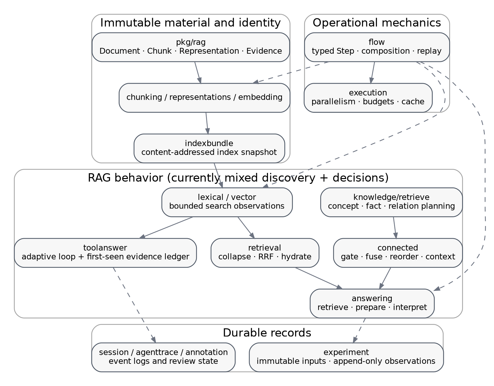

# Contents

- **Executive summary** - architectural verdict and immediate priorities.
- **1. Scope, method, and limitations** - review boundary, source inventory, and validation limits.
- **2. What `rag-ttc` is today** - existing architecture, package roles, and strengths.
- **3. The semantic audit model** - facts, derivations, views, traces, identity, merge, and closure.
- **4. Findings register** - concrete defects, risks, and design findings.
- **5. Target architecture** - proposed semantic spine and package placement.
- **6. Core data model** - Go types for facts, derivations, requests, rules, closure, and views.
- **7. Operational semantics and `flow`** - separation of semantic meaning from execution history.
- **8. Package-by-package adaptation guide** - mapping the current repository into the target model.
- **9. Laws and proof obligations** - invariants, proof sketches, and engineering consequences.
- **10. Law-based test design** - reusable conformance and regression tests.
- **11. Migration plan** - seven incremental phases with exit criteria.
- **12. Developer operating handbook** - checklists for sources, rules, views, caches, concurrency, and experiments.
- **13. Anti-patterns and non-goals** - boundaries that preserve simplicity and correctness.
- **14. Minimal mathematical background** - programmer-oriented definitions.
- **15. Recommended end state** - end-to-end example and guarantees.
- **16. Prioritized decision record** - adopt, preserve, refactor, and defer.
- **Appendices** - package inventory, code reference index, research connections, and bibliography.

# Executive summary

`rag-ttc` should **not** be turned into a workflow language. Its existing architectural choice - ordinary Go programs, narrow typed components, explicit artifacts, and no hidden scheduler - is correct and should remain. The best next step is smaller and more precise: add an **information-semantic spine** underneath the existing orchestration.

That spine has four ideas:

- A content-addressed **fact** is an immutable piece of information: a source chunk, a concept candidate, a graph edge, a claim, or an external observation.
- A **derivation** records why a fact exists: the rule, input fact IDs, semantic configuration, and external observation that produced it.
- A state combines facts and derivations with a merge that is **associative, commutative, and idempotent**. In programmer terms, regrouping, reordering, or repeating merges has the same result.
- Ranking, `top-k`, ambiguity resolution, token budgeting, and answer generation are **views** over a candidate state. They are intentionally selective and must not be confused with the add-only candidate layer.

This design maps closely onto structures that already exist in the repository. `pkg/rag` provides immutable source objects and narrow ports. `pkg/flow` and `pkg/execution` provide an unusually strong operational layer for cache, retry, budgets, batching, and stable output order. `pkg/experiment`, `pkg/app/session`, and the trace packages already provide much of a proof/audit bundle. `pkg/rag/answering` already separates retrieval, deterministic preparation, interpretation, and the full call. The missing piece is a shared representation of candidate facts, alternative derivations, lossless merge, and closure.

The highest-priority work is not abstract theory. It is identity hardening:

1. Fix the evidence fallback digest so it uses the same byte digest as canonical chunks.
2. Include the RRF constant and algorithm version in the connected-runtime semantic digest.
3. Add a non-secret inference fingerprint to generation cache identity; reasoning and decoding settings can change generated content and therefore cannot be treated as execution-only details.
4. Separate stable stage identity from display names in `flow` reports.
5. Make tool evidence admission deterministic under concurrent completion, or explicitly document it as order-sensitive.

Once those are addressed, a small `pkg/rag/derive` package can provide facts, derivations, lawful merge, a finite closure loop, and conformance tests. Existing packages can adopt it incrementally. No top-level rewrite is required.

# 1. Scope, method, and limitations

## 1.1 Scope

This handbook analyzes the uploaded `rag-ttc` source snapshot as a semantic system, not only as a collection of APIs. The review covers:

- core source and retrieval types;
- chunk and representation identity;
- lexical/vector retrieval, fusion, reranking, and context selection;
- answering orchestration;
- knowledge and connected retrieval;
- tool-oriented retrieval and evidence ledgers;
- execution, cache, retry, budgets, and batching;
- experiment and application artifacts;
- session, annotation, comment, judgment, and agent traces;
- architectural boundaries and design notes.

The target is an embedded Go design with strong laws, not a separate DSL runtime.

## 1.2 Method

The review used static source inspection, package/declaration inventory, architecture-document inspection, and a targeted identity/dataflow audit. The snapshot contains:

| Measure | Count |
|---|---:|
| Go source files | 449 |
| Go test files | 151 |
| Package directories | 70 |
| Top-level declarations | 3,908 |
| Type declarations | 699 |
| Function declarations | 2,519 |

The largest semantic clusters are `pkg/rag`, `pkg/flow`, `pkg/execution`, `pkg/experiment`, `pkg/ttcrag`, and the application packages under `pkg/app`.

## 1.3 Validation limitation

The report is based on static analysis. The repository declares Go `1.26.5`, while the available environment contains Go `1.23.2`; the environment also cannot download the requested toolchain or missing module data. The full test suite therefore could not be executed. Findings labeled **confirmed static defect** follow directly from code paths and identity definitions. Findings labeled **risk** depend on runtime scheduling or provider behavior and should be verified in the project’s normal Go environment.

## 1.4 Terminology used in the report

The report distinguishes three outputs that are often accidentally conflated:

- **Semantic state:** the stable facts and derivations known by the system.
- **View:** an ordered or bounded projection such as fused hits, top-k evidence, or packed context.
- **Trace:** what happened operationally: attempts, cache outcomes, completion order, timings, budgets, and errors.

Two runs can have the same semantic state but different traces. Two policies can use the same semantic state but produce different ranked views. This distinction is central to rigorous cache identity and reproducibility.

# 2. What `rag-ttc` is today

## 2.1 Architectural intent

The repository describes itself as a deliberately small toolbox for reproducible RAG experiments. Experiments are ordinary Go programs that compose typed components and write inspectable artifacts; the README explicitly rejects a workflow DSL or hidden pipeline runtime (`README.md:3-6`). It also separates the research lab from the interactive application and enforces the dependency direction with a source-level boundary test (`README.md:12-20`, `cmd/rag-ttc/boundary_test.go:12-64`).

That intent is reinforced by the internal design documents:

- scientific choices belong in experiment programs;
- reusable packages should provide strong mechanism rather than prescribe one research procedure;
- a stage registry, generic workflow graph, or runner interface would be scope expansion;
- `flow` is execution mechanics, not a scheduler or workflow language.

This is a good boundary. The semantic kernel proposed here is compatible with it because it is a small data model and a set of laws, not a new orchestration authority.

{width=92%}

## 2.2 Existing package roles

| Area | Current responsibility | Semantic interpretation |
|---|---|---|
| `pkg/rag` | Documents, chunks, representations, vectors, queries, hits, evidence, ports | Source objects and typed effects |
| `pkg/rag/retrieval` | Collapse, weighted RRF, hydration | Deterministic but selective views |
| `pkg/rag/reranking` | Reorder evidence | Non-monotone view |
| `pkg/rag/answering` | Retrieve, prepare, generate, parse, validate | Phase boundary between candidates, selected context, and answer observation |
| `pkg/rag/knowledge` | Concepts, facts, evidence spans, relations | Domain facts and support graph |
| `pkg/rag/knowledge/retrieve` | Candidate discovery, ambiguity handling, ranking, limits | Candidate discovery currently mixed with selection |
| `pkg/rag/connected` | Gate and fuse baseline with knowledge retrieval | Composition policy currently implemented as mutation of a completed result |
| `pkg/rag/toolanswer` / `pkg/ttcrag` | Turn-scoped search and citation ledger | Observation/candidate ledger with admission limits |
| `pkg/flow` | Typed steps, pipeline composition, cache/retry/budget policies | Operational algebra |
| `pkg/execution` | Cache, bounded parallel map, limiter, budget | Execution substrate |
| `pkg/experiment` | Immutable run inputs, append-only observations, terminal state | Reproducibility and audit bundle |
| `pkg/app/session` | Append-only interaction records and projections | Application trace and materialized views |

## 2.3 The strongest existing structures

### Immutable source lineage

`Document` is explicitly an immutable source revision, `Chunk` is an exact half-open byte slice, and `Representation` is explicitly retrieval material rather than source evidence (`pkg/rag/types.go:3-41`). Fixed chunking binds the chunk ID to document ID, chunker identity, byte range, and text digest, then validates exact source slicing (`pkg/rag/chunking/fixed.go:93-119`). This is an excellent base for content-addressed facts.

### Narrow typed ports

`Chunker`, `Generator`, `Embedder`, `Searcher`, `Index`, and `Reranker` are small interfaces (`pkg/rag/components.go:8-82`). They expose domain operations without imposing a workflow object model. This makes them suitable effect handlers for a semantic rule layer.

### Explicit deterministic ordering

Retrieval and ranking packages use explicit tie-breaking rather than relying on map iteration. Score-independent evidence identity is ordered and intentionally ignores ranker scores (`pkg/rag/evidence_identity.go:10-21`). This is the right instinct: source identity and view scores are different concepts.

### Strong operational execution contracts

`flow.Step` combines a typed function with cache identity, execution policy, optional barrier, metering, and result observation (`pkg/flow/step.go:13-64`). `execution.Map` preserves input order under bounded parallel execution; cached mapping stores successful misses immediately and shares duplicate in-flight work; cache envelopes validate schema, complete key, value digest, and payload. Budgets are explicit and attempts consume them. These are the mechanics required to execute effect requests reliably.

### Inspectable artifacts

`pkg/experiment` owns immutable configuration and input references, append-only JSONL observations, atomic JSON writes, and a one-way terminal state. Application sessions and agent traces record provider-independent observations, evidence ledgers, tool calls, usage, and failures. This is already close to a proof-carrying run artifact.

### Useful answering phase split

`pkg/rag/answering.Service` exposes `Retrieve`, `Prepare`, `Interpret`, and `Answer`. `Prepared` captures deterministic pre-generation work and the exact request. This split should become the public semantic boundary:

1. derive candidates;
2. select a view and build a request;
3. execute generation;
4. interpret and validate the observation.

# 3. The semantic audit model

## 3.1 Facts, derivations, views, and traces

A rigorous RAG system benefits from four explicit data categories.

### Fact

A fact is immutable and identified by its meaning. Examples:

- document revision `D` has digest `h`;
- chunk `C` is bytes `[a,b)` of document `D`;
- representation `R` is a raw or generated view of `C`;
- query `Q` matched concept `K` by alias `A`;
- fact record `F` is supported by source span `S`;
- search request `E` returned observation `O`.

A fact does not contain a mutable rank. Scores and positions belong to views or observations.

### Derivation

A derivation says why a fact is present:

```text
output fact
  was produced by rule R at semantic version V
  using input fact IDs [A, B, C]
  under environment digest H
  and, when effectful, observation O
```

Multiple derivations may support one fact. Deduplicating the fact must not discard those alternatives.

### View

A view is a deterministic projection of a fixed candidate state under a versioned policy. Examples:

- collapse by chunk;
- weighted reciprocal rank fusion;
- reranking;
- ambiguity resolution;
- top-k;
- greedy token packing;
- citation label assignment.

Views may remove or reorder items. They are not add-only and should not participate in the candidate closure.

### Trace

A trace records execution history:

- cache hit or miss;
- retry attempts and delays;
- worker completion order;
- resource admission and budget spend;
- wall-clock timestamps;
- provider usage and errors.

Trace data is essential for diagnosis and cost accounting, but it normally does not define semantic identity.

## 3.2 Three identities

A single `digest` field is insufficient unless the system states what equivalence it represents.

| Identity | Meaning | Typical fields |
|---|---|---|
| Semantic ID | Same fact or same request meaning | canonical payload, source IDs, rule/policy version, inference fingerprint |
| Observation ID | Same captured external result | semantic request ID, normalized response bytes, adapter version |
| Invocation/run ID | Same occurrence | random UUID, timestamp, worker, attempt |

A cache key is a semantic request ID. A session turn ID is an invocation ID. A provider response digest is an observation ID. They should not be substituted for one another.

## 3.3 Add-only merge

The candidate state should merge by stable IDs. Its merge must satisfy three laws:

```text
(a JOIN b) JOIN c == a JOIN (b JOIN c)   // associative

a JOIN b == b JOIN a                    // commutative

a JOIN a == a                           // idempotent
```

These laws are the basis of retry safety, duplicate-message safety, batching independence, and merge-order independence. A collision where one semantic ID maps to different canonical bytes is an error, not “last write wins.”

Mathematically this is a join-semilattice. The practical interpretation is just a collection with a lawful lossless merge.

## 3.4 Closure

Given a seed state and rules that only add facts, repeatedly apply rules until no new IDs appear:

```text
S0 = seed
S1 = S0 JOIN rules(S0)
S2 = S1 JOIN rules(S1)
...
```

The stable result is the smallest state containing the seed that is closed under the rules. In most `rag-ttc` use cases the relevant universe and depth are finite, so ordinary finite rounds are sufficient. The transfinite notation from the earlier design contributes one useful general rule: at a limit, merge all earlier compatible states. In this codebase that merge is normally set/map union.

## 3.5 Why the candidate/view boundary matters

Suppose `top1({a}) = {a}`, while `top1({a,b}) = {b}` because `b` scores higher. Adding a candidate removed `a` from the result. Therefore `top-k`, ambiguity rejection, greedy context packing, and winner selection are not monotone. They require coordination over the candidate snapshot and must occur after candidate production, or at an explicit barrier with a complete policy scope.

This is not a criticism of ranking. It is a placement rule:

> Candidate derivation grows information. Views decide what to expose.

# 4. Findings register

| ID | Severity | Finding | Practical consequence | Recommended action |
|---|---|---|---|---|
| F-01 | High | Generation cache identity omits a complete inference fingerprint | Different result-affecting profiles may share a cache key | Add canonical non-secret inference semantics to request identity |
| F-02 | High | Connected runtime semantic digest omits `RRFConstant` | Different fusion behavior may share the same semantic digest | Include fusion constant and algorithm/policy versions |
| F-03 | Medium | Evidence fallback digest uses JSON-string hashing rather than canonical text hashing | Equivalent evidence can receive different identities | Use `digest.Text` and add equivalence regression test |
| F-04 | Medium risk | Tool evidence admission and citation labels depend on arrival order under limits | Parallel completion may change accepted evidence and labels | Merge candidates first; deterministically select and label at a barrier |
| F-05 | Medium | `flow.Report` keys steps only by display name | Repeated same-name stages are conflated | Introduce stable `StageID` separate from `Name` |
| F-06 | Design | `rag.Evidence` mixes immutable source material with mutable rank/score observations | Identity, cache, and transformations become harder to specify | Split source evidence from ranked evidence view |
| F-07 | Design | Knowledge planner interleaves candidate discovery, ambiguity rejection, ranking, and limits | Candidate growth is non-monotone and hard to incrementally maintain | Produce an add-only candidate graph, then apply a selector |
| F-08 | Design | `RetrievalAugmenter` can arbitrarily rewrite a completed baseline result | Preservation and composition laws are only documentary | Replace with candidate producer, gate, composer, selector, projector |
| F-09 | Caution | Answer contract verifies citation syntax/membership, not claim entailment | “Grounded” can be overinterpreted | Name guarantees precisely; optionally add claim-support judgments |
| F-10 | Caution | Append-only event logs project to order-sensitive current state | Monotone log does not imply monotone materialized view | Separate event-set semantics from projection semantics |

## 4.1 F-01: generation cache identity is incomplete

`GenerationCacheKeyInput` states that it covers every semantic input that can affect a generation result. It currently includes model, kind, query digest, evidence identities, prompt digest, schema digest, adapter version, and context policy (`pkg/rag/generation/cached.go:18-29`). The provider generator, however, wraps an engine already built from resolved profile settings (`pkg/rag/providers/geppetto/generation.go:13-43`). The persisted provider metadata records profile name and provider/model identity, but not a canonical digest of all result-affecting inference settings (`pkg/rag/providers/geppetto/bundle.go:25-42`). The Codex extension explicitly says `ReasoningEffort` is not part of the generation cache key (`pkg/rag/providers/geppetto/codex/credentials.go:50-53`).

That equivalence is too weak for a cache advertised as byte- or digit-exact replay. Reasoning effort, temperature, seed, sampling controls, response-format behavior, tool mode, maximum-output behavior, and provider-specific inference options can change generated content. Worker count and retry policy are operational; reasoning and decoding semantics are not.

**Recommendation:** introduce a safe, canonical `InferenceFingerprint`:

```go
type InferenceFingerprint struct {
    Provider          string            `json:"provider"`
    Model             string            `json:"model"`
    AdapterVersion    string            `json:"adapter_version"`
    ProfileSemantics  string            `json:"profile_semantics_digest"`
    ResponseMode      string            `json:"response_mode"`
    ResultSettings    map[string]string `json:"result_settings,omitempty"`
}
```

The map must contain only non-secret, result-affecting settings and must be canonicalized. Add its digest to `GenerationCacheKeyInput`. Keep credentials, headers, retry counts, workers, and rate limits out.

Also qualify reproducibility correctly: an uncached LLM call is an external observation and may be nondeterministic. Strong replay means “same semantic request plus the same captured observation/cache snapshot,” not “the provider will necessarily regenerate identical bytes.”

## 4.2 F-02: connected semantic digest omits a fusion parameter

`connected.Open` computes `SemanticDigest` from the loaded config digest and database digest only (`pkg/rag/connected/runtime.go:118-125`). `RRFConstant` is supplied separately and stored on the runtime (`runtime.go:126-131`), then used in knowledge fusion and baseline/knowledge fusion (`runtime.go:170-188`). Therefore two runtimes can have the same `SemanticDigest` while computing different rankings.

**Recommendation:** make the digest input explicit and versioned:

```go
type ConnectedSemantics struct {
    ConfigDigest     string  `json:"config_digest"`
    DatabaseDigest   string  `json:"database_digest"`
    RRFConstant      float64 `json:"rrf_constant"`
    FusionVersion    string  `json:"fusion_version"`
    GateVersion      string  `json:"gate_version"`
    SelectionVersion string  `json:"selection_version"`
}
```

The corresponding regression test should assert that changing each semantic field changes the digest, while changing a worker count or trace callback does not.

## 4.3 F-03: fallback evidence digest differs from canonical chunk digest

Canonical chunks use `digest.Text(chunkText)` for both their ID input and `ContentDigest` (`pkg/rag/chunking/fixed.go:93-115`). When evidence lacks an explicit content digest, `EvidenceIdentities` instead calls `digest.JSON(item.Chunk.Text)` (`pkg/rag/evidence_identity.go:28-34`). JSON marshaling a string includes JSON quoting and escaping, so the two byte sequences are generally different.

This is a **confirmed static defect**: one source chunk represented with an explicit digest and the same chunk represented without it can produce different evidence identities and therefore different generation cache keys.

**Fix:** replace `digest.JSON(item.Chunk.Text)` with `digest.Text(item.Chunk.Text)`. Add a test asserting that explicit and fallback identity are equal for plain text, quotes, newlines, and non-ASCII UTF-8.

## 4.4 F-04: turn evidence admission can be completion-order dependent

The tool evidence ledger assigns labels and admits distinct chunks while holding a mutex. Limits are enforced as candidates arrive. The corresponding `ttcrag` search ledger uses the same turn-scoped pattern. This is race-safe, but under concurrent tool calls it can still be schedule-sensitive: the first candidates to arrive consume the evidence/rune budget and receive `E1`, `E2`, and so on.

The risk is conditional on actual parallel tool completion, but the data structure itself does not guarantee permutation invariance.

Two valid designs exist:

1. **Deterministic barrier semantics:** collect all candidates by stable chunk ID, union alternative provenance, sort by a stable policy, apply limits, then assign labels.
2. **Intentional streaming semantics:** preserve first-admitted behavior, record the total order as semantic input, and explicitly state that results may differ with completion order.

For research reproducibility and backend independence, the first design is preferable.

## 4.5 F-05: report identity and display name are conflated

`flow.Report` stores one `StepReport` per step name and merges repeated names (`pkg/flow/report.go:37-75`). A human-readable name is not necessarily a unique position in a composed pipeline. Two semantically distinct stages named `generate` or `rerank` can be merged into one report.

Add a stable stage identity:

```go
type StageID string

type Step[I, O any] struct {
    ID   StageID // unique in a composed program
    Name string  // display label
    // ...
}
```

Key reports by `StageID`; retain `Name` as metadata. The ID may be explicit or derived from composition path plus step semantic version.

## 4.6 F-06: source evidence and ranked evidence are one type

`rag.Evidence` contains a `Chunk` together with retrieval rank, retrieval score, and optional reranker score (`pkg/rag/types.go:101-108`). The chunk is source material; ranks and scores are policy observations. Keeping them in one struct makes it easy to accidentally include rank in source identity, overwrite scores in place, or pass a ranked object into APIs that only need source evidence.

Prefer:

```go
type SourceEvidence struct {
    Chunk rag.Chunk `json:"chunk"`
}

type RankedEvidence struct {
    Source         SourceEvidence `json:"source"`
    Rank           int            `json:"rank"`
    RetrievalScore float64        `json:"retrieval_score"`
    RerankerScore  *float64       `json:"reranker_score,omitempty"`
    PolicyDigest   string         `json:"policy_digest"`
}
```

This can be introduced with aliases/adapters to avoid a flag-day migration.

## 4.7 F-07: knowledge retrieval mixes discovery and selection

The knowledge planner validates limits, finds concept candidates, resolves ambiguity and lower-priority matches, truncates by concept limit, fetches chunks and facts, ranks and truncates facts/evidence, optionally expands one-hop relations, and truncates graph nodes. These operations are all useful, but they have different semantics.

Candidate discovery is add-only: a concept match, supporting span, fact, or relation can be added without invalidating prior candidates. Ambiguity rejection, priority selection, rank limits, and graph limits are views over the candidate set. Interleaving them means adding a stronger concept can remove a previously selected concept and all of its downstream facts. That blocks simple incremental maintenance and schedule-independence claims.

Refactor the planner into:

```text
Discover(query, snapshot) -> KnowledgeCandidateState
Select(candidateState, SelectionPolicy) -> KnowledgeSelection
Project(selection) -> retrieval channels + trace
```

`KnowledgeCandidateState` should retain accepted and rejected alternatives with reasons as facts or view annotations. One-hop graph traversal can remain a finite rule with `MaxDepth(1)`.

## 4.8 F-08: augmentation is broader than its intended law

`answering.RetrievalAugmenter` can transform a completed `RetrievalResult`. The connected runtime discovers knowledge, evaluates a gate, fuses channels, optionally reorders for coverage, truncates, selects evidence, mutates channels, and replaces fused/evidence fields (`pkg/rag/connected/runtime.go:153-212`). When the gate is closed it mostly preserves the baseline but still changes strategy metadata.

The intended components are clearer as separate interfaces:

```go
type CandidateProducer interface {
    Produce(context.Context, CandidateSnapshot) (CandidateDelta, Trace, error)
}

type Gate interface {
    Decide(CandidateSnapshot) GateDecision
}

type Composer interface {
    Compose(CandidateSnapshot, CandidateSnapshot) CandidateSnapshot
}

type Selector interface {
    Select(CandidateSnapshot, SelectionPolicy) RankedView
}
```

This yields local laws: a closed gate returns the same semantic candidate state; composition is a lawful join; selection is deterministic for a fixed state and policy.

## 4.9 F-09: citation validation is not entailment validation

The answer contract performs strict parsing, safe abstention, allowed citation membership, and duplicate checks. These are strong syntactic and referential guarantees. They do not prove that every answer claim is entailed or supported by the cited text.

Documentation and artifact schemas should use precise labels:

- `citation_valid`: cited label exists and is allowed;
- `citation_complete`: required answer units have citations;
- `support_judged`: a separate judge or verifier accepted the claim/evidence relation;
- `entailed`: reserved for a stronger formal or domain-specific proof.

## 4.10 F-10: an append-only log can have a non-monotone projection

Annotations, comments, and judgments are represented as append-only records. This is excellent for audit. Their “current” state, however, may use last-write, tombstone, approval, or commit semantics. Adding a removal event can cause an item to disappear from the current projection.

The correct model is:

```text
EventSet: add-only, mergeable, provenance-complete
CurrentView = Fold(EventSet, ordering/conflict policy)
```

Do not claim the current projection is monotone merely because the underlying log is append-only.

# 5. Target architecture: a semantic spine, not a workflow engine

## 5.1 Design verdict

The elegant design is a layered system in which each layer has one kind of contract:

1. **Immutable source:** content-addressed documents, chunks, representations, vectors, and corpus snapshots.
2. **Candidate derivation:** add-only facts and alternative derivations, merged lawfully and optionally closed under finite rules.
3. **Views:** ranking, fusion, ambiguity resolution, limits, context packing, and citation labeling.
4. **Answer contract:** exact generation request, captured provider observation, parsing, citation validation, and optional support judgment.
5. **Artifacts:** semantic request, observations, derivation DAG, selected view, operational trace, and terminal status.

`flow` remains the operational interpreter for effectful work. Top-level experiments and applications remain ordinary Go.

{width=92%}

## 5.2 Why this boundary composes

Each layer has a different equality:

- Source and candidate layers compare canonical facts and derivations.
- View layers compare ordered outputs under a policy digest.
- Answer layers compare parsed contracts and captured observations.
- Trace layers compare event histories only when that is actually required.

This prevents several common category errors:

- a retry setting cannot silently change a semantic cache key;
- a reranker score cannot silently become part of source identity;
- a timestamp cannot make two otherwise identical facts unequal;
- a top-k change cannot invalidate the candidate state;
- two traces with different worker completion order may still be semantically equivalent.

## 5.3 Package placement

A conservative package layout is:

```text
pkg/rag/derive/
    id.go             semantic IDs and canonical collision checks
    fact.go           fact envelopes and typed codecs
    derivation.go     rule/observation provenance
    state.go          immutable-ish state and lawful Join
    request.go        content-addressed effect requests/observations
    rule.go           pure and effectful rule adapters
    closure.go        frontier-based finite closure
    laws.go           reusable conformance checkers

pkg/rag/view/
    types.go          candidate snapshots and ranked views
    collapse.go       stable collapse policies
    fusion.go         weighted RRF adapters
    selection.go      deterministic limits and tie-breaks
    context.go        context packing policies
```

The existing packages do not need to be moved immediately. `derive` can adapt `rag.Chunk`, knowledge records, and tool observations. `view` may initially be interfaces and wrappers around `retrieval`, `reranking`, and `answering.ContextPolicy`.

## 5.4 Non-goals

The semantic spine must not become:

- a scheduler;
- a persisted workflow graph;
- a stage registry controlling all experiments;
- a generic distributed runtime;
- a replacement for ordinary Go control flow;
- a claim that every RAG operation is monotone;
- a requirement that one global fact schema fit every research experiment.

The kernel is a small set of value types and laws. A program may use only identity and provenance without using closure. Another may use closure for graph expansion. An agent loop may use only the observation log and safety invariants.

# 6. Core data model

## 6.1 Fact IDs

A semantic fact ID should bind:

- fact kind and schema version;
- canonical payload bytes;
- source identities where lineage is not already in the payload;
- no rank, score, timestamp, retry count, or worker identity.

```go
package derive

type FactID string
type Kind string

type Envelope struct {
    ID      FactID          `json:"id"`
    Kind    Kind            `json:"kind"`
    Version string          `json:"version"`
    Payload json.RawMessage `json:"payload"`
}

func NewEnvelope(kind Kind, version string, value any) (Envelope, error) {
    payload, err := canonicalJSON(value)
    if err != nil {
        return Envelope{}, err
    }
    id := digest.Bytes(joinCanonical(
        []byte(kind), []byte(version), payload,
    ))
    return Envelope{
        ID: FactID(id), Kind: kind, Version: version, Payload: payload,
    }, nil
}
```

The actual code should reuse the repository’s digest package and define one canonical JSON policy. If ordinary `encoding/json` is retained, maps and float edge cases must be documented. For persistent semantic IDs, schema/version changes must be deliberate.

## 6.2 Typed codecs over a heterogeneous store

Go does not support generic methods with new type parameters, but free generic functions are sufficient:

```go
type Codec[T any] struct {
    Kind     Kind
    Version  string
    Validate func(T) error
}

func Encode[T any](codec Codec[T], value T) (Envelope, error)
func Decode[T any](codec Codec[T], envelope Envelope) (T, error)
```

Domain packages define codecs next to their types:

```go
var ChunkFact = derive.Codec[rag.Chunk]{
    Kind:    "rag.chunk",
    Version: "v1",
    Validate: func(chunk rag.Chunk) error {
        if chunk.ID == "" || chunk.ContentDigest == "" {
            return errors.New("chunk identity is incomplete")
        }
        return nil
    },
}
```

The store remains heterogeneous at serialization boundaries while rule implementations remain typed.

## 6.3 Derivations

A fact can have zero or more derivations. Source facts use a source/import derivation; derived facts name a rule and inputs.

```go
type RuleID string
type DerivationID string
type ObservationID string

type Derivation struct {
    ID                 DerivationID  `json:"id"`
    Rule               RuleID        `json:"rule"`
    RuleVersion        string        `json:"rule_version"`
    Inputs             []FactID      `json:"inputs,omitempty"`
    Output             FactID        `json:"output"`
    Observation        ObservationID `json:"observation,omitempty"`
    EnvironmentDigest  string        `json:"environment_digest"`
    ParametersDigest   string        `json:"parameters_digest,omitempty"`
}
```

Derivation IDs should be content-addressed from all fields except the ID itself. Input order is semantic only when the rule is ordered. For commutative rules, canonicalize input IDs before hashing.

A fact collision and a derivation collision are hard errors:

```text
same FactID + different canonical fact bytes       => corruption or ID bug
same DerivationID + different derivation bytes     => corruption or ID bug
```

## 6.4 State and lawful merge

```go
type State struct {
    Facts  map[FactID]Envelope
    Proofs map[FactID]map[DerivationID]Derivation
}

func (s State) Join(other State) (State, error) {
    out := s.Clone()
    for id, fact := range other.Facts {
        if existing, ok := out.Facts[id]; ok && !bytes.Equal(
            canonical(existing), canonical(fact),
        ) {
            return State{}, errors.Errorf("fact collision %s", id)
        }
        out.Facts[id] = fact
    }
    for factID, proofs := range other.Proofs {
        if out.Proofs[factID] == nil {
            out.Proofs[factID] = map[DerivationID]Derivation{}
        }
        for proofID, proof := range proofs {
            if existing, ok := out.Proofs[factID][proofID]; ok &&
                !reflect.DeepEqual(existing, proof) {
                return State{}, errors.Errorf("proof collision %s", proofID)
            }
            out.Proofs[factID][proofID] = proof
        }
    }
    return out, nil
}
```

For performance, the implementation can use persistent structures, copy-on-write maps, a database, or mutable internals. The public contract is what matters: merge is lossless and satisfies the three laws.

## 6.5 Requests and observations

External operations should be split into a deterministic request and a captured observation.

```go
type EffectKind string
type RequestID string

type EffectRequest struct {
    ID                  RequestID       `json:"id"`
    Kind                EffectKind      `json:"kind"`
    Version             string          `json:"version"`
    InputFacts          []FactID        `json:"input_facts,omitempty"`
    SemanticPayload     json.RawMessage `json:"semantic_payload"`
    EnvironmentDigest   string          `json:"environment_digest"`
}

type Observation struct {
    ID          ObservationID `json:"id"`
    RequestID   RequestID     `json:"request_id"`
    Payload     json.RawMessage `json:"payload"`
    Adapter     string        `json:"adapter"`
    CapturedAt  time.Time     `json:"captured_at"`
}
```

The request ID excludes workers, retry, deadlines, and attempt counters. The observation may record timestamps, provider usage, and invocation metadata, but its normalized payload should be separately digestible.

This structure aligns naturally with `execution.Key`, `flow.Identity`, cache envelopes, experiment observations, and session traces.

## 6.6 Rules

An effectful rule has two deterministic halves around an operational execution:

```go
type Snapshot struct {
    State    State
    Frontier []FactID
    Round    int
}

type Rule interface {
    ID() RuleID
    Version() string

    // Plan is pure for a fixed snapshot.
    Plan(context.Context, Snapshot) ([]EffectRequest, error)

    // Admit is deterministic for a fixed snapshot, request, and observation.
    Admit(
        context.Context,
        Snapshot,
        EffectRequest,
        Observation,
    ) (State, error)
}
```

Pure rules can use a helper that skips the external observation:

```go
type PureRule interface {
    ID() RuleID
    Version() string
    Derive(context.Context, Snapshot) (State, error)
}
```

Rules must declare whether they are valid for closure:

```go
type Traits struct {
    AddOnly             bool
    DeterministicPlan   bool
    DeterministicAdmit  bool
    RequiresBarrier     bool
    MaxDepth            int
}
```

These are not decorative flags. Conformance tests should exercise them.

## 6.7 Plan -> Execute -> Admit

The core loop isolates nondeterministic effects from deterministic semantics.

{width=95%}

1. **Plan:** inspect a stable snapshot and frontier; emit content-addressed requests.
2. **Execute:** use `flow`/`execution` for cache, retry, budget, rate limits, and batching.
3. **Admit:** validate and normalize observations; create facts and derivations deterministically.
4. **Join:** merge deltas lawfully.
5. **Repeat:** use only newly added IDs as the next frontier.

This lets an experiment replay captured observations without contacting providers. It also makes cache behavior testable at the request boundary.

## 6.8 Frontier-based closure

A practical implementation should use semi-naive evaluation: rules inspect the newly added frontier rather than recomputing every old combination on every round.

```go
type StopReason string

const (
    Saturated     StopReason = "saturated"
    RoundLimit    StopReason = "round-limit"
    BudgetLimit   StopReason = "budget-limit"
    Cancelled     StopReason = "cancelled"
)

type ClosureResult struct {
    State       State      `json:"state"`
    Frontier    []FactID   `json:"frontier,omitempty"`
    Rounds      int        `json:"rounds"`
    Saturated   bool       `json:"saturated"`
    StopReason  StopReason `json:"stop_reason"`
}

func Close(
    ctx context.Context,
    seed State,
    program Program,
    executor Executor,
    options Options,
) (ClosureResult, error) {
    state := seed
    frontier := sortedFactIDs(seed)

    for round := 0; ; round++ {
        if len(frontier) == 0 {
            return ClosureResult{
                State: state, Rounds: round,
                Saturated: true, StopReason: Saturated,
            }, nil
        }
        if options.MaxRounds > 0 && round >= options.MaxRounds {
            return ClosureResult{
                State: state, Frontier: frontier, Rounds: round,
                Saturated: false, StopReason: RoundLimit,
            }, nil
        }

        snapshot := Snapshot{State: state, Frontier: frontier, Round: round}
        delta, err := program.Step(ctx, snapshot, executor)
        if err != nil {
            return ClosureResult{}, err
        }
        next, err := state.Join(delta)
        if err != nil {
            return ClosureResult{}, err
        }
        frontier = Difference(sortedFactIDs(next), sortedFactIDs(state))
        state = next
    }
}
```

In production, use sets rather than sorting entire states each round. The pseudocode emphasizes semantics, not optimal complexity.

## 6.9 Views

Views are separate, policy-versioned transformations:

```go
type CandidateDigest string
type PolicyDigest string

type RankedView[T any] struct {
    CandidateDigest CandidateDigest `json:"candidate_digest"`
    PolicyDigest    PolicyDigest    `json:"policy_digest"`
    Items           []T             `json:"items"`
}

type View[I, O any] struct {
    Name    string
    Version string
    Apply   func(I) (O, error)
}
```

A view must be deterministic for a fixed canonical input and policy. It need not be monotone. Its cache key must include the candidate-state digest and the full policy digest.

Existing `Collapse`, `WeightedRRF`, reranking adapters, requested-part coverage ordering, evidence selection, and context packing all belong here.

## 6.10 Minimal embedded DSL

The word “DSL” need not mean a parser or hidden runtime. A small fluent constructor can make semantics visible while preserving ordinary Go:

```go
program := derive.Program(
    derive.Pure(
        "query-to-normalized-query", "v1",
        NormalizeQuery,
    ),
    derive.Effect(
        "query-to-concept-candidates", "v2",
        PlanConceptSearch,
        AdmitConceptSearch,
    ),
    derive.Pure(
        "concept-to-direct-facts", "v1",
        DirectFacts,
    ),
    derive.Pure(
        "relation-to-neighbor-concept", "v1",
        FollowRelations,
        derive.MaxDepth(1),
    ),
)

closed, err := derive.Close(ctx, seed, program, flowExecutor,
    derive.WithMaxRounds(2),
)
if err != nil {
    return err
}

selected, err := view.Pipe(
    view.CollapseByChunk("v1"),
    view.WeightedRRF("v2", rrfConstant, weights),
    view.TopK("v1", fusedTopK),
    view.ContextBudget("greedy-whole-chunk-v1", policy),
).Apply(closed.State)
```

This is an embedded vocabulary for facts, effects, closure, and views. The experiment still owns all control flow.

# 7. Operational semantics and `flow`

## 7.1 What `flow` already proves

`flow` is best understood as an operational algebra. Its useful contracts include:

- typed input/output steps;
- exact cache identity supplied by the caller;
- bounded workers;
- retry and admission policy;
- shared budgets;
- barriers for cross-item state;
- order-restoring result collection;
- quarantine/skip/fail behavior;
- metrics and completion events;
- replay from cache rather than persisted workflow state.

These are valuable and should not be duplicated in `derive`.

## 7.2 Denotational meaning versus operational history

{width=92%}

For a step, distinguish:

```text
Semantic function:
    request -> admitted value

Operational execution:
    request -> attempts, waits, cache events, completion order, value/error
```

Composition of pure semantic functions has ordinary identity and associativity. Trace-level composition may not, because callbacks, wall-clock times, randomized backoff, budgets, and failures are observable.

Therefore, avoid statements such as “`Pipe` is associative” without specifying the observation level. A safer contract is:

> For successful executions with equivalent semantic identities and no order-sensitive side effects, regrouping compatible pipeline stages produces the same ordered semantic outputs. Reports and traces may differ.

## 7.3 Correct the identity comment

`pkg/flow/step.go:16-18` currently groups workers, retry, and reasoning settings as execution details that must not enter identity. Workers and retry are operational. Reasoning settings can affect generated content and therefore belong in semantic request identity.

Suggested wording:

```go
// Execution mechanics such as workers, retry schedule, and rate limits do not
// enter semantic identity. Any setting that can change the successful result -
// including model inference, decoding, response mode, or tool semantics - must
// be represented in Key, directly or through an environment fingerprint.
```

## 7.4 Barriers are semantic boundaries

A `Barrier` is not merely a performance switch. It changes when a stage can observe cross-item state. Use it only for an explicitly batch-scoped view or reducer.

Examples requiring a barrier:

- global top-k over candidates;
- deterministic citation label assignment;
- ambiguity resolution across all concept candidates;
- a budget allocation that compares all items.

Examples not requiring a barrier:

- validating one chunk;
- embedding one independent batch item;
- parsing one provider response;
- admitting one content-addressed observation.

Any barrier stage should define:

- the exact batch scope;
- whether input order is semantic;
- its stable sort/tie-break policy;
- whether output is a candidate delta or a view.

## 7.5 Side-effect observers

`Step.OnResult` runs in completion order. That is appropriate for append-only traces, but dangerous for semantic artifacts whose order or admission limits matter. Use completion callbacks only to record events keyed by stable request/result IDs. Build ordered semantic artifacts later from those records.

A good rule is:

```text
OnResult may append an observation.
OnResult must not assign semantic rank, citation number, or winner status.
```

## 7.6 Failure outcomes

`flow.Result` represents success, quarantine, skip, and error through several fields. A stronger type would prevent impossible combinations:

```go
type OutcomeKind string

const (
    OutcomeValue       OutcomeKind = "value"
    OutcomeQuarantined OutcomeKind = "quarantined"
    OutcomeSkipped     OutcomeKind = "skipped"
)

type Outcome[T any] struct {
    Kind  OutcomeKind
    Value *T
    Err   error
}
```

Go cannot encode a closed sum type perfectly, but constructors and `Validate` can enforce one valid variant. This becomes important when outcomes are serialized into proof artifacts.

# 8. Package-by-package adaptation guide

## 8.1 `pkg/digest`

**Keep:** exact byte SHA-256, file hashing with cancellation, deterministic JSON digest helper.

**Add:**

- a documented semantic canonicalization policy;
- helpers that make string-vs-JSON intent explicit in call sites;
- a `Domain` or schema/version prefix to prevent cross-kind collisions;
- conformance tests for UTF-8, maps, float values, and struct evolution.

Recommended API:

```go
func Semantic(domain, version string, canonical []byte) string
func Text(value string) string
func CanonicalJSON(value any) ([]byte, error)
func JSONSemantic(domain, version string, value any) (string, error)
```

Do not silently change old persisted digest algorithms. Introduce versions and migration adapters.

## 8.2 `pkg/rag` core types

**Map directly to source facts:**

- `Document` -> `rag.document/v1`;
- `Chunk` -> `rag.chunk/v1`;
- `Representation` -> `rag.representation/v1`;
- `Vector` -> `rag.vector/v1` or an external artifact reference for large vectors;
- `Query` -> `rag.query/v1`.

**Split observations/views:**

- `Hit`, `Contribution`, `FusedHit`, and ranked `Evidence` are view records;
- provider `Usage` and finish reason are observation metadata;
- source evidence should contain only the source chunk and perhaps source-validation status.

**Add semantic traits to adapters, not necessarily to the base interfaces:**

```go
type SemanticDescriptor struct {
    Name              string
    Version           string
    EnvironmentDigest string
    Deterministic     bool
}
```

A provider-backed `Generator` is not deterministic, but it can still expose a deterministic request identity and adapter version.

## 8.3 Chunking and representations

Chunking is already close to an ideal pure rule:

```text
Document + ChunkerSemanticVersion -> Chunk facts
```

Its law set should include:

- exact source slicing;
- deterministic IDs for fixed input/version;
- no overlapping or coverage guarantee unless the chunker explicitly declares it;
- collision failure;
- stable ordinal/range consistency.

Generated representations are effectful:

```text
Chunk + RepresentationPrompt + InferenceFingerprint
    -> EffectRequest
    -> Observation
    -> Representation fact
```

The representation fact should bind the source chunk ID, representation kind, text digest, model/inference fingerprint, and prompt digest. Provider usage and timestamps remain observation metadata.

## 8.4 Embeddings and indexes

An embedding is an observation-derived fact:

```text
Representation + embedding model/version/dimensions -> Vector
```

The vector ID should bind all semantic settings. An index build is better represented as an artifact with:

- corpus/representation snapshot digest;
- index implementation and version;
- index settings;
- source fact IDs or a Merkle/root digest;
- build observation/metrics.

Approximate search deserves a precise equivalence. A cache may replay a captured hit list, but fresh searches can differ after index changes or due to approximate execution. Include index snapshot and search-policy digest in request identity.

## 8.5 Retrieval, fusion, reranking, and context

These packages are views, not closure rules:

| Operation | Candidate-preserving? | Order-sensitive? | Policy fields that belong in identity |
|---|---:|---:|---|
| Channel search observation | Produces candidates | Provider/index-defined | query, index snapshot, top-k, search settings |
| Collapse | No | Tie-break policy | target key, score/tie-break version |
| Weighted RRF | No | Input ranks are semantic | rank constant, channel weights, algorithm version |
| Rerank | No | Yes | model/inference fingerprint, candidate order/set, result count |
| Hydrate top-k | No | Yes | limit, chunk snapshot |
| Context packing | No | Yes | token/rune policy, separators, whole/partial chunk rule |

The view output should retain `CandidateDigest` and `PolicyDigest` so it can be audited and cached independently.

## 8.6 `pkg/rag/answering`

Preserve the existing phase structure and sharpen its contracts:

```text
Retrieve  -> CandidateSnapshot (or legacy RetrievalResult adapter)
Prepare   -> SelectedView + exact GenerationRequest
Execute   -> captured Generation Observation
Interpret -> Answer Contract Result
```

Recommended new types:

```go
type Prepared struct {
    Candidates      derive.State
    CandidateDigest string
    Selected        view.RankedView[rag.SourceEvidence]
    Request         rag.GenerationRequest
    RequestID       derive.RequestID
}

type InterpretedAnswer struct {
    Contract          AnswerContract
    CitationValid     bool
    SupportJudgments  []SupportJudgment
    ObservationID     derive.ObservationID
}
```

The exact current `Prepared` type can be extended rather than replaced.

Replace `RetrievalAugmenter` gradually:

1. adapt the baseline `RetrievalResult` into a candidate snapshot;
2. let connected retrieval add candidate facts;
3. select the final view once;
4. project back to the legacy result for callers.

This removes “fuse, truncate, then augment, then fuse again” ambiguity.

## 8.7 `pkg/rag/knowledge`

The knowledge schema already contains good domain primitives: concepts, aliases, mentions, facts, fact evidence, source spans, chunk topics, and relations. Add a generic derivation envelope rather than replacing these types.

Suggested fact kinds:

```text
knowledge.query-token/v1
knowledge.concept-candidate/v1
knowledge.concept-resolution-evidence/v1
knowledge.concept-rejection/v1
knowledge.fact/v1
knowledge.fact-support/v1
knowledge.relation/v1
knowledge.relation-traversal/v1
knowledge.chunk-topic/v1
```

A concept candidate should not disappear when a stronger candidate arrives. The selector can mark it rejected for the current policy and retain the reason:

```go
type ConceptDecision struct {
    CandidateID  derive.FactID
    Status       string // selected, ambiguous, shadowed, generic, over-limit
    Reason       string
    PolicyDigest string
}
```

This gives better diagnostics and allows alternative selection policies to reuse one discovery snapshot.

The current one-hop graph expansion maps cleanly to a bounded closure:

```text
round 0: query and direct concept candidates
round 1: direct facts/chunks and relation edges
round 2: neighbor concept facts/chunks
stop: MaxDepth(1) for relation traversal
```

No ordinals beyond ordinary finite rounds are needed.

## 8.8 `pkg/rag/connected`

Refactor connected retrieval into four explicit values:

```go
type ConnectedCandidates struct {
    Baseline  derive.State
    Knowledge derive.State
}

type GateDecision struct {
    Open         bool
    Reason       string
    PolicyDigest string
}

type Composition struct {
    Candidates derive.State
    Trace      Trace
}

type Selection struct {
    View  view.RankedView[rag.SourceEvidence]
    Trace Trace
}
```

A closed gate law becomes:

```text
Compose(baseline, closed knowledge gate).Candidates == baseline
```

Strategy labels and gate traces are view/trace metadata and do not change semantic equality.

The final fusion identity includes:

- baseline candidate digest;
- knowledge candidate digest;
- gate policy digest;
- RRF constant and weights;
- coverage-ordering policy/version;
- final top-k and evidence-selection policy.

## 8.9 `pkg/rag/toolanswer` and `pkg/ttcrag`

The stable production search boundary is a good place to expose source candidates and provenance. Split the current ledger into two stages.

### Candidate ledger

```go
type CandidateLedger struct {
    ByChunk map[string]Candidate
}

type Candidate struct {
    Chunk       rag.Chunk
    Derivations map[derive.DerivationID]derive.Derivation
}
```

Merge candidates by chunk identity and union derivations. Do not assign `E1` labels here.

### Turn selection

At a deterministic barrier:

1. sort candidates by declared priority and stable tie-break;
2. enforce distinct-count and rune/token limits;
3. assign `E1`, `E2`, ...;
4. record the selection policy digest.

If the desired UX is streaming citations, labels can use stable short IDs rather than arrival-position numbers, or the system can reserve deterministic ranges per tool call. The current sequential labels should not be treated as stable semantic IDs.

### Agent limitation

An LLM-controlled tool loop is not a fixed-point query engine. Future queries depend on a nondeterministic controller observation. The semantic kernel can still guarantee:

- every admitted source has valid lineage;
- duplicate tool results merge safely;
- budgets are enforced;
- the trace is complete;
- an answer cites only admitted evidence.

It cannot prove global retrieval completeness or schedule independence of the controller’s choices without a much stronger controller model.

## 8.10 `pkg/flow` and `pkg/execution`

Use them as the `Executor` implementation for `EffectRequest`:

```go
type FlowExecutor struct {
    Steps map[derive.EffectKind]flowStepAdapter
}

func (e FlowExecutor) Resolve(
    ctx context.Context,
    requests []derive.EffectRequest,
) ([]derive.Observation, flow.Report, error)
```

Each adapter maps `EffectRequest.ID` and semantic payload to an exact `execution.Key`. Cache validation remains strict. Retry and budget are operational. Successful results become observations; quarantine/skip become explicit non-success outcomes in the closure report rather than malformed facts.

## 8.11 `pkg/experiment`

Extend each run with a compact semantic proof bundle:

```text
semantic/
    seed.json
    program.json
    requests.jsonl
    observations.jsonl
    facts.jsonl
    derivations.jsonl
    closure.json
    views.jsonl
    answer.json
```

Large payloads can be content-addressed blobs referenced by digest. Existing immutable config, append-only observations, atomic writes, and terminal status are the right custody model.

The manifest should record:

- code/build identity;
- corpus and index snapshot digests;
- effective semantic configuration digest;
- inference fingerprints;
- rule and view versions;
- cache snapshot/reference;
- explicit approximation flags.

## 8.12 `pkg/app/session` and agent traces

Session records are invocation traces. Add stable references into the semantic bundle rather than copying every source payload into every event.

A turn should be able to answer:

```text
Which semantic query request did this invocation execute?
Which observations were admitted?
Which candidate snapshot and selected view were used?
Which generation observation produced the answer?
Which exact sources support each citation label?
```

Keep the existing projection distinction between fixed retrieval and agent trajectories. A fixed pipeline may have a closed candidate snapshot; an agent has a sequence of controller decisions and observations.

## 8.13 Annotations, comments, and judgments

Treat these as event stores with explicit folds:

```go
type Projection[E, V any] interface {
    Name() string
    Version() string
    Fold([]E) (V, error)
}
```

Projection identity includes event-set digest, ordering/conflict policy, and projection version. A committed evaluation set is a new immutable fact; proposals remain events or candidate judgments until committed.

## 8.14 Connected configuration

The strict layered YAML loader, rejection of unknown/null fields, asset resolution, and digest of effective config plus assets are strong patterns. Generalize the output into an `EffectiveSemantics` record that includes code-level constants and algorithm versions that are not present in YAML.

```go
type EffectiveSemantics struct {
    ConfigDigest        string            `json:"config_digest"`
    AssetDigests        map[string]string `json:"asset_digests"`
    AlgorithmVersions   map[string]string `json:"algorithm_versions"`
    SemanticConstants   map[string]string `json:"semantic_constants"`
}
```

The digest of this record should be the environment digest attached to requests and derivations.

# 9. Laws and proof obligations

The value of the semantic kernel is not the vocabulary; it is the small set of laws that every implementation can test. This section states each law in programmer form, gives a short proof idea, and explains its consequence in `rag-ttc`.

## 9.1 Law 1: source integrity

For every admitted source chunk:

```text
chunk.DocumentID identifies the source revision
chunk.Range is valid and half-open
chunk.Text == document.Text[ByteStart:ByteEnd]
chunk.ContentDigest == digest.Text(chunk.Text)
chunk.ID matches its declared identity algorithm/version
```

**Proof idea:** validate each seed/import and preserve the immutable chunk unchanged in every derivation. Derived facts refer to the chunk ID; they do not rewrite it.

**Consequence:** citations can always resolve to exact source bytes. A representation, summary, concept, or claim cannot silently replace source evidence.

## 9.2 Law 2: merge is associative, commutative, and idempotent

For valid states `a`, `b`, and `c`:

```go
Equal(Join(Join(a, b), c), Join(a, Join(b, c)))
Equal(Join(a, b), Join(b, a))
Equal(Join(a, a), a)
```

**Proof idea:** facts and proofs are maps keyed by content-addressed IDs; merge is map union, and equal IDs must contain equal canonical bytes. Set/map union has these laws.

**Consequence:**

- duplicate queue delivery is harmless;
- retrying successful admission is harmless;
- worker completion order does not affect the candidate state;
- partial states can be regrouped and merged hierarchically;
- checkpoint restore can replay overlapping deltas.

This law does **not** imply that ordered views or traces are equal.

## 9.3 Law 3: rules are inflationary through join

A rule returns a delta. The next state is:

```text
next = current JOIN delta
```

Therefore:

```text
current is a subset of next
```

**Proof idea:** lawful join never removes an existing fact or derivation.

**Consequence:** every partial closure result is sound relative to admitted facts. Stopping early can omit deeper facts but cannot invalidate facts already present.

## 9.4 Law 4: monotone rules preserve input growth

For closure-safe rule `R`:

```text
A subset-of B  =>  R(A) subset-of R(B)
```

In practice, the rule may emit the same or more candidate facts when given more facts. It must not use absence, global winner selection, or top-k as a premise.

**Proof idea:** each emitted fact has a positive derivation from facts present in `A`. Those facts are also present in `B`, so the same derivation remains available.

**Consequence:** discovery rules may run incrementally and in parallel. The knowledge candidate graph can safely grow as new source facts arrive.

**Non-examples:**

- “select the best concept”;
- “emit a fact only if no conflicting fact exists”;
- “keep the first ten candidates”;
- “remove candidates below the current median.”

These are views or coordinated decisions.

## 9.5 Law 5: closure laws

For a fixed rule program `C`:

```text
seed subset-of C(seed)                     // includes input
A subset-of B => C(A) subset-of C(B)       // monotone input
C(C(seed)) == C(seed)                       // stable/idempotent
Step(C(seed)) adds nothing                 // saturated
```

**Proof idea:** start at the seed, repeatedly join rule deltas, and stop when no new IDs appear. Because each stage includes the previous stage, the result contains the seed. Starting from more facts can replay every old derivation. Once no new fact appears, repeating the closure does nothing.

**Consequence:** a saturated knowledge snapshot is a reusable materialized result. Re-closing it is safe.

## 9.6 Law 6: finite termination

Assume:

- the set of possible canonical fact IDs for this corpus/query/program is finite;
- every successful round adds at least one new ID or stops;
- rules only add facts.

Then closure terminates after at most the number of possible new IDs.

**Proof idea:** an add-only process cannot add a finite ID twice as a new item. Each nonterminal round consumes at least one remaining ID.

**Consequence:** current bounded corpus, one-hop knowledge, and finite candidate systems do not require exotic transfinite execution. A round/depth cap remains useful for cost control and for effectful rules with potentially unbounded request generation.

## 9.7 Law 7: stage/depth correspondence

Assign each seed fact depth `0`. A fact derived from inputs has depth:

```text
1 + max(input depths)
```

Then every fact first admitted in round `n` has a derivation depth no greater than `n` under the chosen round convention.

**Proof idea:** ordinary induction. Seeds satisfy the base case. A rule in the next round consumes only already-known facts, so its output is one layer deeper. Union at a checkpoint preserves earlier depths.

**Consequence:** `MaxRounds` has a precise completeness statement: complete for derivations within the admitted rule depth, subject to successful external observations and resource policy.

## 9.8 Law 8: fair schedule independence

Suppose:

- candidate rules are monotone;
- deltas merge with ACI join;
- every enabled request/rule instance is eventually processed;
- admission is deterministic for a fixed request and observation;
- external observations are fixed or replayed from the same snapshot.

Then any fair batching or worker schedule reaches the same saturated semantic state.

**Proof idea:** every fair execution eventually includes every finitely derivable fact, and no execution can include a fact without a valid derivation. Both therefore equal the same least closed state.

**Consequence:** worker count, queue order, batching, and duplicate delivery can change latency and trace but not the candidate state.

This is the codebase-specific benefit of monotonic design. The CALM theorem connects logical monotonicity to consistent coordination-free distributed implementations; the report uses the constructive engineering direction, not a claim that the entire RAG pipeline is coordination-free [CALM].

## 9.9 Law 9: deterministic views for a fixed snapshot

For view `V`:

```text
V(candidateSnapshot, policy) == V(candidateSnapshot, policy)
```

across process runs, map iteration orders, input permutations declared non-semantic, and supported backends.

Required ingredients:

- canonical candidate enumeration;
- explicit stable tie-breaks;
- complete policy identity;
- deterministic numeric behavior where exact equality is promised;
- no wall-clock or completion-order dependence.

**Consequence:** weighted RRF, concept selection, context packing, and citation labels become independently reproducible and cacheable.

## 9.10 Law 10: retry and duplicate transparency

For a content-addressed request `r` and fixed observation `o`:

```text
Admit(r, o) JOIN Admit(r, o) == Admit(r, o)
```

**Proof idea:** admitted facts and derivations have stable IDs; repeated admission unions the same entries.

**Consequence:** retries after uncertain acknowledgement and duplicate cache/result delivery do not duplicate semantic content.

Provider billing and attempt budgets are not idempotent; they belong to the trace and must count every attempt.

## 9.11 Law 11: cache transparency

A cache is semantically transparent when:

```text
Key(x) == Key(y)  =>  x and y are equivalent for the step's promised result
```

and a stored value is validated against the complete key and schema.

**Proof idea:** cache lookup replaces execution only when the key denotes the same semantic request. Strict envelope validation ensures the stored record belongs to that key and schema.

**Consequence:** cache hits and fresh successful work admit equivalent facts or observations.

This law is exactly why F-01, F-02, and F-03 matter. A missing semantic field or inconsistent digest breaks the implication.

For nondeterministic providers, the cache establishes a replay equivalence: it reuses one captured observation for the request. It does not prove all possible fresh observations are equal.

## 9.12 Law 12: incremental additions

Let `C` be closure, `old` a seed, and `delta` new source facts. Then:

```text
C(C(old) JOIN delta) == C(old JOIN delta)
```

**Proof idea:** `C(old)` contains exactly the facts already derivable from `old`. Starting from those facts plus `delta` skips recomputation but does not create derivations unavailable from `old JOIN delta`; closure idempotence and monotonicity establish equality.

**Consequence:** new documents, new aliases, or newly admitted observations can extend an existing saturated snapshot without rebuilding from zero.

## 9.13 Deletions require a different algebra

Removing a source may invalidate some derivations. Add-only closure alone cannot decide which facts to retract, especially when one fact has multiple alternative derivations.

Use dependency-aware truth maintenance:

```text
fact remains present if at least one valid derivation remains
fact is retracted only when all derivations are invalid
```

A provenance DAG makes this possible. For high-volume arbitrary insert/delete streams, differential dataflow or DBSP-style incremental view maintenance provides a more general model based on changes rather than only sets [Differential Dataflow] [DBSP]. This is a future direction, not a requirement for the first kernel.

## 9.14 Law 13: provenance completeness

Every non-seed fact has at least one valid derivation whose input facts exist. Every derivation output points to the fact it claims to derive. The derivation graph is well-founded for finite closure rounds.

```go
for _, fact := range state.Facts {
    if !IsSeed(fact) {
        require.NotEmpty(t, state.Proofs[fact.ID])
    }
}
```

**Proof idea:** the only admission API for non-seed facts requires a derivation; each round can refer only to facts already in the snapshot; therefore parent depth is lower than child depth.

**Consequence:** every candidate can be explained and independently checked. Alternative derivations can be retained instead of overwritten.

W3C PROV supplies a standard conceptual vocabulary for entities, activities, agents, usage, generation, and derivation. The proposed data model can map to PROV without adopting RDF internally [PROV-DM]. Database provenance semirings offer a deeper model for combining alternative and joint support; a simple derivation DAG is the pragmatic first step [Provenance Semirings].

## 9.15 Law 14: backend conformance by local constructors

Suppose two stores implement the same fact and derivation constructors and preserve join. Then folding the same canonical derivation state into either store yields equivalent semantic contents.

Programmer proof method:

1. define canonical insert/read behavior for each fact kind;
2. check collision behavior;
3. check derivation insertion;
4. check join/union;
5. check canonical enumeration or digest;
6. run the same conformance suite.

**Consequence:** in-memory, SQLite, graph, JSONL, or future distributed stores can be substituted without comparing every whole pipeline program.

The mathematical phrase “initial algebra” captures this local-to-global principle: once each constructor has an interpretation, recursive derivation structures have a unique fold into that interpreter. The current code does not need to expose that jargon in APIs.

## 9.16 Law 15: schema migration commutes with rules

For migration `M`, old rule `R`, and new rule `R'`:

```text
M(R(oldState)) == R'(M(oldState))
```

Check this for every rule constructor. Then migration before closure and migration after closure produce equivalent results.

**Consequence:** schema changes can be validated locally. A migration that drops timestamps, source spans, or inference fingerprints used by a rule will fail the law instead of silently changing retrieval meaning.

## 9.17 Law 16: authorization is inherited

If access levels form an ordered lattice, a derived fact must require at least the join of all source requirements:

```text
label(output) >= label(input_i) for every input_i
```

**Proof idea:** seed labels are correct; every admission rule enforces conservative label propagation; induction over derivation depth proves the property for all facts.

**Consequence:** a summary or inferred claim derived from confidential evidence remains confidential even if it does not quote the source.

## 9.18 Law 17: sound early stopping

Every intermediate candidate state is a subset of the saturated state. Therefore a round or budget stop is sound but potentially incomplete.

Return explicit status:

```go
type Completeness struct {
    Saturated       bool
    CompletedRounds int
    StopReason      string
}
```

Never label a budget-stopped result “complete.” A monotone goal such as “at least one primary source and three independent supports exist” can justify early stop once true, because adding facts cannot make it false.

## 9.19 Limits of the proof model

The laws do not prove:

- that a retriever finds every relevant source in the world;
- that an LLM answer is factually correct;
- that approximate vector search is deterministic unless snapshotted;
- that agent-selected future queries are complete or schedule-independent;
- that a citation entails a claim;
- that deletions are correct without dependency maintenance;
- that float computations are byte-identical across every backend.

They prove structural properties under explicit assumptions. That is still operationally valuable because failures become classifiable rather than mysterious.

# 10. Law-based test design

## 10.1 Reusable conformance harness

Create a package such as `pkg/rag/derive/lawtest` rather than scattering bespoke examples.

```go
type StateFactory interface {
    Empty() derive.State
    Arbitrary(seed int64, size int) derive.State
}

func CheckJoinLaws(t *testing.T, factory StateFactory)
func CheckClosureLaws(t *testing.T, program derive.Program, seeds []derive.State)
func CheckBackend(t *testing.T, backend derive.Store, cases []derive.State)
func CheckViewPermutationInvariance[I, O any](
    t *testing.T,
    view view.View[I, O],
    equivalentPermutations []I,
)
```

The project already uses `testify`; property generation can be handwritten, use fuzz tests, or add a property-testing library only if justified.

## 10.2 Join tests

```go
func TestStateJoinLaws(t *testing.T) {
    for seed := int64(0); seed < 1_000; seed++ {
        a := arbitraryState(seed, 20)
        b := arbitraryState(seed+1, 20)
        c := arbitraryState(seed+2, 20)

        left := mustJoin(mustJoin(a, b), c)
        right := mustJoin(a, mustJoin(b, c))
        require.Equal(t, left.CanonicalDigest(), right.CanonicalDigest())

        require.Equal(t,
            mustJoin(a, b).CanonicalDigest(),
            mustJoin(b, a).CanonicalDigest(),
        )
        require.Equal(t, a.CanonicalDigest(), mustJoin(a, a).CanonicalDigest())
    }
}
```

Also test that equal IDs with different bytes fail deterministically.

## 10.3 Closure tests

```go
func TestClosureLaws(t *testing.T) {
    result := mustClose(seed)
    require.True(t, seed.IsSubsetOf(result.State))

    again := mustClose(result.State)
    require.Equal(t, result.State.Digest(), again.State.Digest())
    require.True(t, again.Saturated)

    bigger := mustClose(mustJoin(seed, extraSeed))
    require.True(t, result.State.IsSubsetOf(bigger.State))
}
```

Generate small graph reachability programs to test depth and schedule independence. Run the same worklist under FIFO, LIFO, randomized, and batched schedules using a fixed observation map.

## 10.4 Exact regression tests for current findings

### Evidence identity fallback

```go
func TestEvidenceIdentityFallbackMatchesCanonicalChunkDigest(t *testing.T) {
    for _, text := range []string{"plain", "quote: \"", "a\nb", "lambda: lambda"} {
        withDigest := evidence(text, digest.Text(text))
        withoutDigest := evidence(text, "")
        require.Equal(t,
            mustIdentities(withDigest),
            mustIdentities(withoutDigest),
        )
    }
}
```

### Connected semantic digest sensitivity

```go
func TestConnectedSemanticDigestIncludesRRFConstant(t *testing.T) {
    a := mustOpen(Options{RRFConstant: 60})
    b := mustOpen(Options{RRFConstant: 10})
    require.NotEqual(t, a.SemanticDigest, b.SemanticDigest)
}
```

Add one table row per semantic parameter and one per operational parameter. Semantic changes must alter the digest; operational changes must not.

### Generation inference fingerprint

```go
func TestGenerationKeyChangesWithReasoningEffort(t *testing.T) {
    low := key(request, fingerprint("low"))
    high := key(request, fingerprint("high"))
    require.NotEqual(t, low, high)
}
```

Repeat for response mode, temperature, seed, tool mode, and provider adapter semantics where available.

### Tool ledger permutation invariance

After refactor, feed the same candidate set in all relevant completion orders and assert identical selected chunk IDs and labels.

```go
for _, permutation := range permutations(candidates) {
    ledger := NewCandidateLedger()
    for _, candidate := range permutation {
        ledger.Add(candidate)
    }
    got := SelectAndLabel(ledger, policy)
    require.Equal(t, want, got)
}
```

### Stage report identity

Compose two stages with the same display name and different IDs. Assert that reports remain separate and an optional roll-up by name is explicit.

## 10.5 View tests

Every view should test:

- complete key sensitivity to all policy fields;
- deterministic stable ties;
- map/input permutation invariance where input order is declared irrelevant;
- exact behavior at zero/negative/overlarge limits;
- NaN and infinity rejection for numeric policies;
- duplicate candidate handling;
- preservation of source identity;
- no mutation of the candidate state.

For RRF specifically:

```text
changing channel map iteration order does not change output
changing RankConstant changes PolicyDigest
changing a weight changes PolicyDigest
identical scores resolve by stable chunk/representation ID
```

## 10.6 Provenance tests

Build an independent verifier that does not share admission implementation internals. It should verify:

- every proof references existing inputs/output;
- proof ID matches canonical proof bytes;
- rule/version is registered;
- environment digest is present;
- source facts pass source validation;
- derivation graph is acyclic when the program promises finite well-founded derivations;
- every selected evidence item resolves to at least one source chunk;
- every citation label resolves to one selected source.

A small independent checker is more trustworthy than reusing the same constructors that produced the bundle.

## 10.7 Cache tests

The existing strict cache envelope is a strong base. Add systematic “semantic sensitivity matrices.” For each cache family, list every configuration field and classify it:

| Field class | Key behavior |
|---|---|
| Changes successful result meaning | Must change key |
| Changes only scheduling/latency | Must not change key |
| Secret credential selecting same provider semantics | Excluded from persisted key; provider/account equivalence must be documented |
| Changes external snapshot | Must change key |
| Trace-only callback/metrics | Must not change key |

Tests should mutate one field at a time and check the classification.

## 10.8 Artifact tests

A completed proof bundle should pass:

```text
manifest and semantic digests resolve
all JSONL records parse
all referenced blobs exist and match digest
all observations reference known requests
all derivations reference known facts/observations
closure status matches a replayed no-new-facts step when saturated
selected view candidate digest matches the fact snapshot
answer request ID matches the selected evidence and inference fingerprint
terminal status is one-way
```

# 11. Migration plan

The safest migration is evolutionary. Each phase should ship with adapters and laws before changing higher-level behavior.

## Phase 0: identity hardening

**Goal:** remove known semantic-key inconsistencies before introducing new abstractions.

Changes:

- fix evidence fallback to `digest.Text`;
- include `RRFConstant` and algorithm versions in connected semantic digest;
- add `InferenceFingerprint` to generation identity;
- revise `flow.Identity` documentation;
- add `StageID` to reports;
- add semantic sensitivity tests for all cache families.

Exit criteria:

- every cache key has a documented input classification;
- exact regression tests pass in the project’s supported Go toolchain;
- old cache compatibility is deliberately versioned rather than accidentally broken.

## Phase 1: introduce facts and derivations without changing behavior

**Goal:** create the semantic vocabulary and artifact format.

Changes:

- add `pkg/rag/derive` IDs, envelopes, derivations, state, join, digest;
- add codecs/adapters for `Document`, `Chunk`, `Representation`, `Query`, and retrieval observations;
- emit facts/proofs alongside existing result structs;
- add independent verifier and join-law tests.

Do not yet replace `RetrievalResult` or knowledge planner behavior.

Exit criteria:

- existing runs can emit a semantically equivalent proof bundle;
- source evidence in the bundle resolves exactly to corpus bytes;
- duplicate fact/proof admission is harmless.

## Phase 2: split source evidence from ranked evidence

**Goal:** make source identity impossible to confuse with scores.

Changes:

- introduce `SourceEvidence` and `RankedEvidence`;
- adapt reranking, generation requests, context packing, and cache identity;
- retain compatibility constructors for `rag.Evidence` during transition.

Exit criteria:

- no source identity function accepts rank or score fields;
- views carry policy digests;
- selected evidence can be reconstructed from candidate snapshot plus policy.

## Phase 3: refactor knowledge into discovery and selection

**Goal:** make candidate discovery add-only and reusable.

Changes:

- emit concept, fact, relation, support, and rejection-candidate facts;
- preserve all alternatives in `KnowledgeCandidateState`;
- move ambiguity, priority, limits, and ranking into a deterministic selector;
- retain a legacy `Retrieve` facade that returns the current trace/channels.

Exit criteria:

- discovery is monotone under added source/candidate facts;
- selector is permutation-invariant for a fixed candidate state;
- old behavior is reproduced by a compatibility policy, except intentional bug fixes.

## Phase 4: refactor connected augmentation

**Goal:** replace broad result mutation with candidate composition and one final selection.

Changes:

- adapt baseline retrieval into candidate facts;
- add knowledge candidates by lawful join;
- express gate as a view/policy decision;
- run fusion, coverage ordering, top-k, and evidence selection once;
- define a closed-gate semantic identity law.

Exit criteria:

- baseline and knowledge candidate snapshots are independently inspectable;
- all fusion semantics are in one policy digest;
- no in-place mutation is required for semantic composition.

## Phase 5: deterministic tool evidence ledger

**Goal:** remove schedule dependence from accepted turn evidence.

Changes:

- merge candidates by stable chunk identity during tool execution;
- record tool call/provenance alternatives;
- apply limits and labels at a deterministic barrier;
- optionally use stable citation IDs independent of arrival position.

Exit criteria:

- completion-order permutation tests pass;
- repeated/retried tool responses do not duplicate evidence;
- selected labels and evidence are reproducible from the candidate ledger and policy.

## Phase 6: optional closure engine

**Goal:** support explicit multi-round finite derivation where it adds value.

Initial users:

- one-hop or bounded-depth knowledge graph expansion;
- recursive link following in experiments;
- claim/support composition;
- corpus ingestion derivations.

Do not force the agent loop or simple one-shot retrieval through closure.

Exit criteria:

- closure laws and fair-schedule tests pass;
- frontiers avoid full recomputation;
- budget/round stops produce explicit completeness metadata.

## Phase 7: proof-carrying experiments and sessions

**Goal:** make every result independently inspectable and replayable.

Changes:

- write request/observation/fact/derivation/view bundles;
- add `verify-run` command;
- reference semantic bundle IDs from app sessions;
- expose “why this evidence?” and “which policy selected it?” views.

Exit criteria:

- a verifier can validate a completed run without provider credentials;
- a cached/captured run can replay deterministic admission, selection, and answer interpretation;
- artifact version migrations are tested.

# 12. Developer operating handbook

## 12.1 Adding a source type

Before adding a new source-bearing type, answer:

- What immutable source revision does it identify?
- What canonical bytes define equality?
- Is the payload source evidence or a generated representation?
- Which schema/version prefix prevents collisions?
- How is it independently validated?
- Can two records share an ID but differ in metadata? If so, which metadata is semantic?

Do not include timestamps, ranks, or provider usage in source IDs.

## 12.2 Adding a discovery rule

A closure-safe rule should pass this checklist:

- Inputs are positive facts, not absence tests.
- More input facts cannot invalidate an output.
- The rule emits a delta rather than replacing state.
- Output fact IDs are stable.
- Every output has a derivation.
- Planning is deterministic for a fixed snapshot/frontier.
- Admission is deterministic for a fixed request/observation.
- Rule and semantic environment versions are explicit.
- Duplicate admission is harmless.
- Depth/breadth bounds are explicit for recursive expansion.

If the rule chooses winners, enforces a global limit, or depends on “nothing better exists,” it is a selector/view instead.

## 12.3 Adding a view

A view should declare:

- candidate input digest;
- complete policy fields and version;
- whether input order is semantic;
- stable sort/tie-break behavior;
- behavior for duplicate candidates;
- numeric edge-case handling;
- output identity/digest;
- whether it requires a barrier;
- whether it may call an external model.

An external reranker is an effectful view: deterministic request identity, captured observation, deterministic interpretation.

## 12.4 Adding a cache family

Write the key contract before code:

```text
Two inputs share a key exactly when the cache is allowed to substitute one
captured successful result for the other.
```

Then enumerate every input:

- payload seen by provider/algorithm;
- source/corpus/index snapshot;
- model/provider adapter semantics;
- prompts and schemas;
- inference/decoding settings;
- result count and selection behavior;
- algorithm versions and constants;
- authorization scope where results differ.

Explicitly exclude:

- workers;
- retry schedule;
- rate limiter;
- trace callback;
- output file path;
- invocation timestamp.

Version the cache when the equivalence changes.

## 12.5 Adding concurrency

Concurrency is semantically safe when:

- each task has a stable request ID;
- duplicate tasks share or merge idempotently;
- completion callbacks only append keyed observations;
- semantic state merges with ACI join;
- rank, budget allocation, and labels are assigned at deterministic barriers;
- every enabled task is eventually processed or the result explicitly reports incomplete status.

A mutex proves race freedom, not schedule independence.

## 12.6 Adding an experiment

An experiment should record:

- immutable corpus/input references;
- effective semantic configuration digest;
- rule/view versions;
- provider/model/inference fingerprints;
- cache snapshot or cache root;
- source candidate state or its content-addressed reference;
- selected view and policy digest;
- exact generation request and captured observation;
- evaluation judgments and their version;
- operational report and terminal status.

Keep scientific choices in the experiment program. Reuse the semantic types and conformance checks, not a global workflow definition.

## 12.7 Debugging by layer

| Symptom | First layer to inspect |
|---|---|
| Relevant source never appears as a candidate | source/index/effect request or candidate derivation |
| Candidate exists but final evidence omits it | view policy: collapse, fusion, rerank, top-k, context |
| Evidence is in prompt but answer ignores it | generation observation or answer interpretation |
| Two worker counts produce different candidate facts | request identity, order-sensitive admission, merge law |
| Cache hit changes output versus fresh call | incomplete key, stale/corrupt envelope, nondeterministic promise |
| Citation points to wrong chunk | deterministic label projection or source identity |
| Corpus addition requires full rebuild | candidate closure not separated from views or no frontier index |
| Deletion leaves stale claim | missing derivation dependency/truth maintenance |
| Two runs look different but answer is same | compare semantic/view equality before trace equality |

# 13. Anti-patterns and non-goals

## 13.1 Top-k inside candidate production

Bad:

```go
func Discover(state State) State {
    candidates := findAll(state)
    return keepTopK(candidates, 10)
}
```

This prevents monotone growth. Return all bounded-by-source candidates, then apply `TopK` as a view.

## 13.2 Last-write-wins semantic facts

Bad:

```go
state.Facts[id] = newFact // silently overwrites different bytes
```

Same ID with different bytes means the identity function or data is wrong. Fail closed.

## 13.3 Treating append order as identity

Completion order, JSONL order, and map enumeration should not define semantic identity unless the contract explicitly says order matters.

## 13.4 Treating a mutex as determinism

A mutex serializes access. It does not specify which goroutine wins or whether limits/labels are permutation-invariant.

## 13.5 Calling all configuration “execution policy”

Workers and retries are execution policy. Temperature, reasoning effort, RRF constants, top-k, prompt versions, and context policy affect semantic or view results.

## 13.6 Claiming exact reproducibility from an uncached model call

Exact replay requires the same captured observation or a provider contract stronger than is normally available. Store and identify observations.

## 13.7 One generic pipeline object

A universal pipeline graph would erase the repository’s useful distinction between experiment-owned scientific choices and reusable mechanisms. Prefer typed functions and small semantic values.

## 13.8 Generic `any` facts everywhere

Use typed codecs and domain types in rule implementations. Restrict erased `Envelope` values to storage, hashing, interchange, and generic verification.

# 14. Minimal mathematical background

This section translates the theory into implementation concepts.

## 14.1 Partial order

A state `A` is “less than or equal to” state `B` when every fact/proof in `A` is also in `B`.

```text
A <= B  means  A is a subset of B
```

This is an information order: `B` knows at least what `A` knows.

## 14.2 Monotone function

A function is monotone when more input information cannot produce less output information:

```text
A <= B  =>  F(A) <= F(B)
```

Candidate discovery should be monotone. Top-k is not.

## 14.3 Join-semilattice

A join-semilattice is a type with a merge operation satisfying associative, commutative, and idempotent laws. For fact maps, join is checked union.

This is the algebra behind safe duplicate delivery and order-independent merge. CRDT designs use related laws to obtain convergent replicated state; `rag-ttc` does not need a networked CRDT to benefit from the same merge discipline.

## 14.4 Fixed point and least fixed point

A fixed point is a state where another rule step changes nothing:

```text
Step(S) == S
```

The least fixed point is the smallest stable state containing the seed. It excludes irrelevant facts that were never derived.

## 14.5 Induction

To prove an invariant for every derivation round:

1. prove it for seeds;
2. prove every rule preserves it;
3. conclude it holds for every finite round.

Examples: source lineage, authorization, valid provenance, and depth.

## 14.6 Transfinite induction and colimits

Transfinite induction adds a limit case: if a stage represents everything found at all earlier stages, show the invariant survives their lossless merge.

In this system, that “colimit” is usually just union of compatible fact/proof maps. Current practical programs are finite or at most use the union of finite rounds. Larger ordinals are theoretical headroom, not an implementation requirement.

## 14.7 Algebra and fold

An algebra here means an implementation of constructors such as:

```text
source chunk
search observation
concept match
fact support
relation traversal
```

A fold interprets a derivation structure into another representation: SQLite rows, a graph, JSONL, a prompt, or an audit report. If each constructor is preserved, the whole recursive transformation is preserved.

## 14.8 Provenance semiring intuition

Alternative derivations behave like “OR”; multiple inputs required by one derivation behave like “AND.” A derivation DAG records these combinations directly. Provenance semirings generalize this idea so annotations can answer why a result exists, how many derivations support it, or how confidence/cost propagates. Start with the DAG; add richer annotation algebra only when a concrete query requires it.

# 15. Recommended end state

A mature `rag-ttc` run would have the following shape:

```go
func Run(ctx context.Context, input ExperimentInput) error {
    // Ordinary Go owns the experiment.
    sources := loadAndValidateSources(input.Corpus)
    seed := derive.Seed(sources, input.Query)

    // Candidate rules are additive and provenance-producing.
    candidates, err := derive.Close(
        ctx,
        seed,
        knowledgeProgram(input.Semantics),
        flowExecutor(input.Execution),
        derive.WithMaxRounds(input.MaxRounds),
    )
    if err != nil {
        return err
    }

    // Selective operations are explicit views over a fixed snapshot.
    selected, err := answerView(input.ViewPolicy).Apply(candidates.State)
    if err != nil {
        return err
    }

    // Generation is an external observation with complete semantic identity.
    prepared := answering.PrepareFromView(input.Query, selected)
    observation, err := executeGeneration(ctx, prepared.Request)
    if err != nil {
        return err
    }
    answer, err := answering.Interpret(prepared, observation)
    if err != nil {
        return err
    }

    // Existing artifact custody records the proof bundle and trace.
    return writeRunBundle(candidates, selected, prepared, observation, answer)
}
```

The system then supports concrete statements:

- Candidate facts are independent of worker order and duplicate delivery under fixed observations.
- Every selected evidence item resolves to immutable source bytes and at least one derivation.
- Ranking and context selection are reproducible from the candidate digest and policy digest.
- Cache replay is valid under a complete semantic request identity.
- New source additions can resume from a previous closed candidate snapshot.
- A run can be verified without repeating provider calls.
- Different storage backends can be checked with one conformance suite.
- Agent traces remain explicit trajectories rather than being falsely described as fixed-point retrieval.

# 16. Prioritized decision record

## Adopt

- Content-addressed facts and alternative derivations.
- ACI merge with collision failure.
- Plan -> Execute -> Admit separation.
- Candidate/view/trace separation.
- Complete semantic environment and inference fingerprints.
- Frontier-based finite closure where recursive expansion exists.
- Deterministic barrier policies for global limits and labels.
- Proof-bundle artifacts and an independent verifier.
- Law-based conformance suites.

## Preserve

- Ordinary Go experiment orchestration.
- Research/application dependency boundary.
- Narrow typed RAG interfaces.
- `flow` as operational mechanics.
- Strict cache envelopes and explicit budgets.
- Immutable experiment inputs and append-only observations.
- Existing answering phase split.

## Refactor

- `rag.Evidence` source/view mixing.
- Knowledge discovery/selection interleaving.
- Broad retrieval augmentation.
- Arrival-ordered tool evidence admission.
- Report display-name identity.
- Semantic digest/key omissions.

## Defer

- General deletion calculus/differential updates.
- Distributed replicated semantic state.
- Full W3C PROV serialization.
- General-purpose provenance semiring evaluation.
- Transfinite stages beyond finite/omega-style unions.
- Any workflow DSL or generic scheduler.

# Appendix A. Detailed package inventory summary

The static inventory found 70 package directories. The highest-declaration areas were:

| Package/area | Approximate role | Declarations |
|---|---|---:|
| `pkg/app/chatui` | Interactive UI state and rendering | 778 |
| `pkg/flow` | Typed execution mechanics | 198 |
| experiment answer-quality command | Research orchestration/evaluation | 194 |
| `pkg/app/chat` | Headless chat runtime | 183 |
| `pkg/rag/knowledge` | Knowledge domain/storage model | 141 |
| `pkg/rag/toolanswer` | Tool answer and evidence ledger | 130 |
| `pkg/rag/indexbundle` | Index artifact/runtime bundle | 123 |
| `pkg/execution` | Cache, parallelism, budgets | 103 |
| `pkg/rag/representations` | Representation generation | 102 |
| `pkg/app/session` | Session records/projections | 99 |
| `pkg/rag/answering` | Retrieval/prepare/interpret service | 92 |
| `pkg/rag/generation` | Cached generation adapters | 90 |

The size distribution supports an incremental kernel rather than a rewrite: the semantic changes can be concentrated in small research packages and adapted into larger app code through existing boundaries.

# Appendix B. Code reference index

| Topic | Primary source locations |
|---|---|
| Repository intent/no workflow DSL | `README.md:3-6`; clean-slate design doc sections on dependency direction and non-goals |
| Research/app boundary | `README.md:12-20`; `cmd/rag-ttc/boundary_test.go:12-64` |
| Immutable source types | `pkg/rag/types.go:3-48` |
| Hit/fusion/ranked evidence types | `pkg/rag/types.go:74-108` |
| Narrow component ports | `pkg/rag/components.go:8-82` |
| Canonical chunk digest/ID | `pkg/rag/chunking/fixed.go:93-119` |
| Evidence identity fallback | `pkg/rag/evidence_identity.go:10-41` |
| Digest algorithms | `pkg/digest/digest.go:14-55` |
| Retrieval collapse/RRF/hydrate | `pkg/rag/retrieval/retrieval.go:19-133` |
| Context packing | `pkg/rag/answering/context.go:9-26` |
| Answer phase split | `pkg/rag/answering/service.go:122-184` |
| Augment/select path | `pkg/rag/answering/service.go:323-400` |
| Answer contract | `pkg/rag/answering/contract.go:28-109` |
| Flow identity and callbacks | `pkg/flow/step.go:13-64` |
| Flow report identity | `pkg/flow/report.go:21-75` |
| Ordered parallel execution | `pkg/execution/map.go:32-105`; `pkg/flow/run.go:264-299,416-479` |
| Cache key/envelope | `pkg/execution/cache.go:24-36,136-214` |
| Duplicate in-flight work | `pkg/flow/run.go:561-588`; `pkg/execution/cached_map.go:40-43` |
| Budget consumption | `pkg/execution/budget.go:13-58` |
| Generation cache identity | `pkg/rag/generation/cached.go:18-88` |
| Provider profile/inference adapter | `pkg/rag/providers/geppetto/generation.go:13-67`; `bundle.go:25-42` |
| Reasoning effort cache comment | `pkg/rag/providers/geppetto/codex/credentials.go:50-53` |
| Knowledge schema | `pkg/rag/knowledge/types.go:12-164` |
| Knowledge planner | `pkg/rag/knowledge/retrieve/planner.go:60-289,340-410` |
| Connected semantic digest/fusion | `pkg/rag/connected/runtime.go:105-212` |
| Tool evidence ledger | `pkg/rag/toolanswer/evidence.go:12-63`; `pkg/ttcrag/search.go:194-232` |
| Experiment custody | `pkg/experiment/types.go:15-45`; `pkg/experiment/run.go:32-206` |
| Session/agent trace | `pkg/app/session/types.go`; `pkg/rag/agenttrace/types.go` |

# Appendix C. Research connections

The design uses established ideas selectively:

- **CALM and monotonicity.** Monotone programs are the boundary for consistent coordination-free implementations. This motivates isolating add-only candidate derivation from top-k and other coordinated views [CALM].
- **Datalog fixed points and semi-naive evaluation.** Bottom-up recursive rules compute a least fixed point; semi-naive evaluation propagates only newly derived tuples, matching the proposed frontier loop [Semi-naive Evaluation].
- **Differential dataflow and DBSP.** These systems generalize incremental and iterative computation and are relevant if `rag-ttc` later supports high-volume insertions/deletions or continuously maintained views [Differential Dataflow] [DBSP].
- **W3C PROV.** PROV distinguishes entities, activities, agents, usage, generation, and derivation; the fact/request/observation/derivation model maps naturally to this vocabulary [PROV-DM].
- **Provenance semirings.** Alternative and joint derivations can be represented algebraically, informing future confidence, why-provenance, and deletion support [Provenance Semirings].
- **Initial algebras and transfinite chains.** Recursive structures can be constructed by iterating constructors and taking colimits at limits; folds then interpret the canonical structure into backends. This supports the local backend-conformance argument [Initial Algebras].
- **Algebraic small-object constructions.** The “attach evidence cells until obligations are filled” analogy is relevant for richer proof-producing saturation, but it is not needed for the first implementation [Small Object Argument].

# Bibliography

[CALM] Joseph M. Hellerstein and Peter Alvaro. “Keeping CALM: When Distributed Consistency is Easy.” 2019. https://arxiv.org/abs/1901.01930

[Differential Dataflow] Frank McSherry, Derek G. Murray, Rebecca Isaacs, and Michael Isard. “Differential Dataflow.” CIDR 2013. https://www.microsoft.com/en-us/research/publication/differential-dataflow/

[DBSP] Mihai Budiu, Frank McSherry, Leonid Ryzhyk, and Val Tannen. “DBSP: Automatic Incremental View Maintenance for Rich Query Languages.” 2022/2023. https://arxiv.org/abs/2203.16684

[PROV-DM] W3C. “PROV-DM: The PROV Data Model.” W3C Recommendation, 2013. https://www.w3.org/TR/prov-dm/

[PROV Constraints] W3C. “Constraints of the PROV Data Model.” W3C Recommendation, 2013. https://www.w3.org/TR/prov-constraints/

[Provenance Semirings] Todd J. Green, Grigoris Karvounarakis, and Val Tannen. “Provenance Semirings.” PODS 2007. https://doi.org/10.1145/1265530.1265535

[Semi-naive Evaluation] Michael Arntzenius and Neel Krishnaswami. “Semi-naive Evaluation for a Higher-Order Functional Language.” POPL 2020. https://www.cl.cam.ac.uk/~nk480/seminaive-datafun.pdf

[Initial Algebras] Jiri Adamek, Stefan Milius, and Lawrence S. Moss. “An Initial Algebra Theorem Without Iteration.” 2021. https://arxiv.org/abs/2104.09837

[Small Object Argument] Richard Garner. “Understanding the Small Object Argument.” 2007/2009. https://arxiv.org/abs/0712.0724

# Closing assessment

`rag-ttc` does not need more orchestration. It needs a sharper account of **what information exists, why it exists, how it merges, and which later policies merely select a view of it**.

The repository is already well positioned for this change. Its source objects are mostly immutable and content-addressed; its component interfaces are narrow; its execution layer has explicit cache/retry/budget mechanics; its artifacts are inspectable; and its architecture rejects hidden workflow control. A small fact/provenance kernel would connect those strengths.

The resulting system would remain recognizable as `rag-ttc`: ordinary Go, explicit experiments, inspectable artifacts. The improvement is that each layer would carry a precise contract, and the most important claims - retry safety, schedule independence of candidate growth, cache correctness, deterministic selection, provenance completeness, and incremental additions - would be enforced by reusable laws rather than convention.
