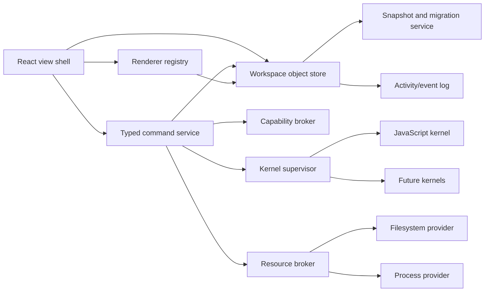
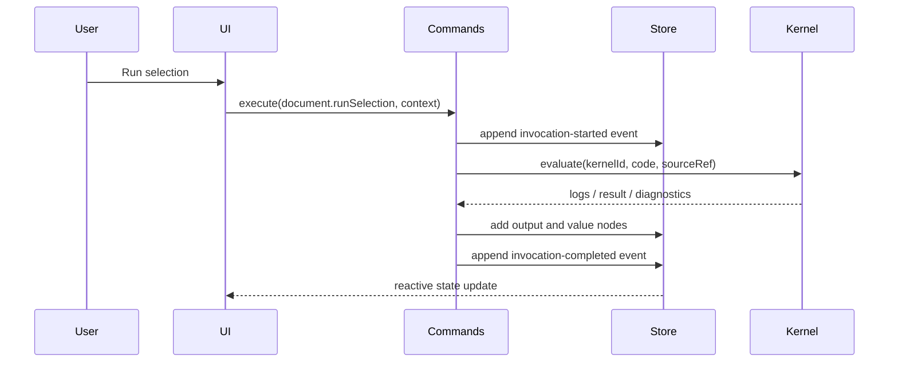
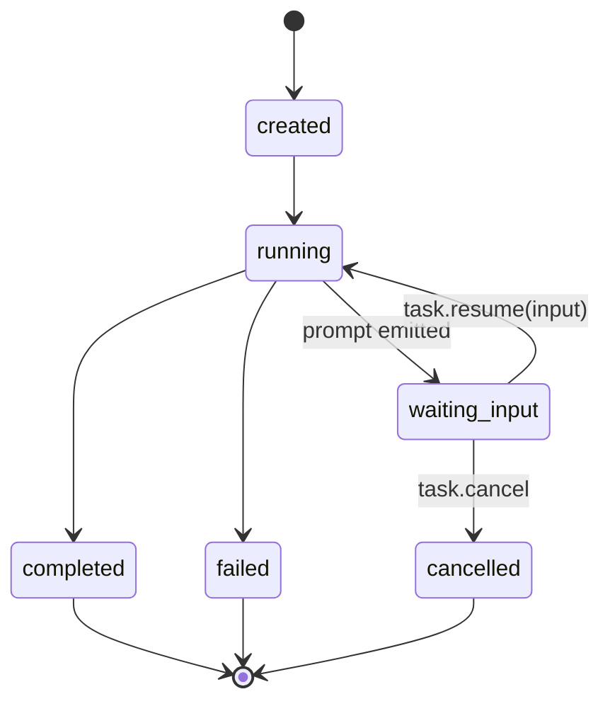
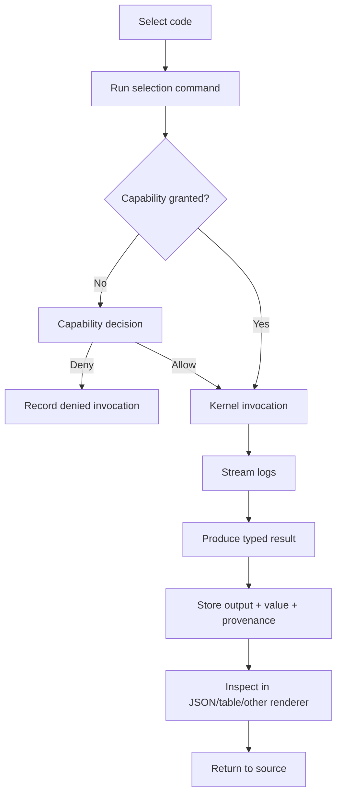
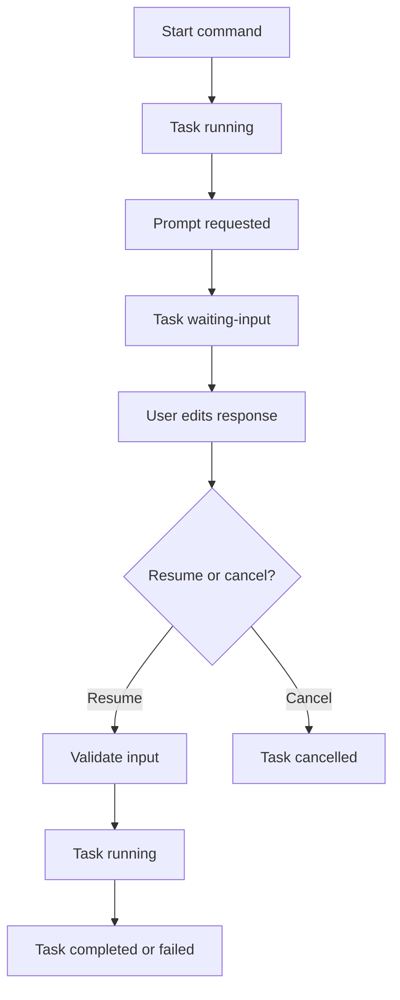
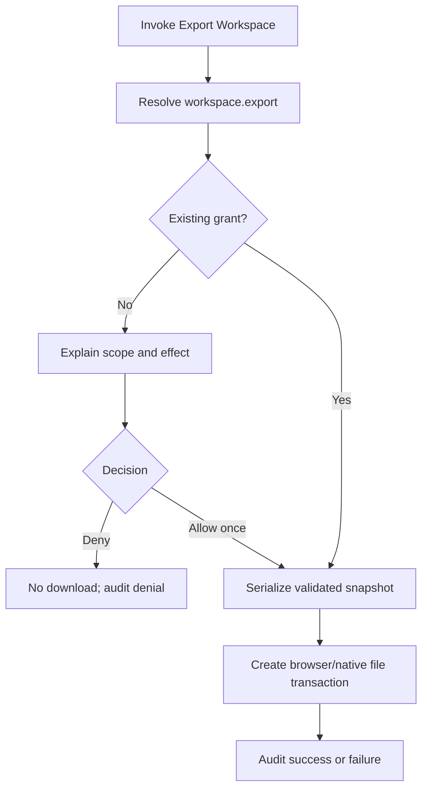

# Poplog and Xved Analysis

- URL: https://chatgpt.com/c/6a748652-f9c0-83ea-b803-46ccb224fd6a
- Created: 2026-08-06T13:04:19.713Z

---

> analyze the sources of poplog and xved/ved editor and give ma  list of the functionalities and what such a development environment could do (outside of just editing and running code) and which ideas could be transplanted to the modern times and modern UX paradigms / language properties to capture all the cool ideas that early programming environments, especially coupled ot an operating system could afford that we lost as we moved to linux and the window manager kind of approach . Here's some starting points, the document and the webpages are very confusing. https://poplogarchive.getpoplog.org/examples/

```json
{"search_query":[{"q":"site:poplogarchive.getpoplog.org VED XVed Poplog source code editor documentation"},{"q":"Poplog VED XVed source GitHub"},{"q":"Poplog VED editor architecture documentation"},{"q":"Poplog operating system environment VED process control documentation"}],"response_length":"long"}
```

I’ll trace Poplog/VED/XVed’s sources and primary documentation, distinguish implemented capabilities from broader design patterns, and map the strongest ideas onto modern language, UX, and OS architectures.

<details><summary>💭 Thinking</summary>

**Searched 17 websites**

</details>

```unknown
bash -lc rm -rf /tmp/poplog-src && git clone --depth 1 https://github.com/hebisch/poplog.git /tmp/poplog-src && find /tmp/poplog-src -maxdepth 3 -type d | sed 's#^/tmp/poplog-src##' | head -120
```

<details><summary>💭 Thinking</summary>

**Cloned and inspected Poplog source directories**

**Located Poplog repositories and core VED/XVed source files**

**Organizing editor capabilities**

I’m grouping these notes into themes: virtual files, process interaction, navigation, search, package management, programmable commands, interfaces, windows, and integrated debugging.

**Organized editor capabilities**

</details>

VED emerges as a programmable interaction kernel: resumable editor process, autoloaded commands, contextual expansion, and runtime values rendered into the workspace. XVed graphically presents the same live state.

<details><summary>💭 Thinking</summary>

**Tracing editor capabilities**

I’m mapping archival descriptions of Poplog, VED, and XVED into non-editing functions: documentation navigation, interactive output, process control, debugging, extensibility, package discovery, and OS-level workspace integration.

**Connecting source evidence**

I’m now tying source modules to concrete UX ideas: buffers as live data, commands as extensible actions, marked ranges, incremental compilation, subprocesses, help, navigation, and recoverable interactive workflows.

**Traced editor capabilities and connected source evidence**

**Inspected Poplog VED and XVED source, documentation, events, and compilation flows**

**Reviewed XVed selection handling and compilation procedures**

**Analyzed Poplog sources and documentation for VSH, MUX, and vedgetsysfile**

**Searched Poplog documentation and analyzed architecture, syntax, processes, and saved images**

**Searched Poplog documentation and repository for OS, Dired, VED, and mail references**

</details>

```json
{"open":[{"ref_id":"https://poplogarchive.getpoplog.org/examples/"},{"ref_id":"turn393600search0"},{"ref_id":"turn393600search28"},{"ref_id":"turn393600search10"}],"response_length":"long"}
```

<details><summary>💭 Thinking</summary>

**Comparing modern parallels**

I’m framing contemporary tools as partial echoes rather than replacements: notebooks, extensible editors, live-object systems, and process-oriented shells recover pieces, while Linux’s application boundaries fragment their shared workspace model.

**Compared modern parallels**

**Searched 3 websites**

**Synthesizing the design**

I’m distinguishing Poplog’s runtime, VED’s programmable document/process substrate, and XVed’s graphical layer. The central idea is a persistent, bidirectional workspace connecting code, documentation, processes, output, and the operating system.

**Integrating live environments**

I’m adding debugging, inspection, persistence, and environment management to the model. The strongest modern translation is a live, inspectable workspace with typed capabilities, resumable processes, semantic documents, and explicit isolation.

**Designing a modern successor**

I’m prioritizing universal live documents, resumable process actors, semantic selections, executable documentation, snapshots, capability security, polyglot integration, and resource views that preserve Linux’s isolation without losing shared context.

**Synthesized the design and integrated live environments**

**Inspected Poplog command dispatch, VED I/O, text actions, and debugger documentation**

**Mapped Poplog examples, libraries, and VED sources**

</details>

```unknown
bash -lc git clone --depth 1 https://github.com/hebisch/poplog.git /tmp/poplog-src >/tmp/poplog-clone.log 2>&1 && du -sh /tmp/poplog-src && find /tmp/poplog-src/pop/lib/ved -maxdepth 1 -type f | wc -l && find /tmp/poplog-src/pop/x/ved/src -maxdepth 1 -type f | wc -l
```

<details><summary>💭 Thinking</summary>

**Inspected Poplog source files and clone failure logs**

**Inspected Poplog VED definitions, commands, text actions, and XVed handlers**

</details>

```json
{"open":[{"ref_id":"turn178582view0"},{"ref_id":"turn178582view1"},{"ref_id":"turn178582view2"},{"ref_id":"turn178582view3"},{"ref_id":"turn104167view1"}],"response_length":"long"}
```

Each buffer was a scoped execution context and bidirectional I/O channel, preserving compiler, process, and UI state. The same document protocol unified hypertext documentation, OS tools, and in-context debugging.

<details><summary>💭 Thinking</summary>

**Searched 3 websites**

</details>

```json
{"paths":["GitHub"],"query":"search"}
```

```json
{"paths":["GitHub"],"query":"file"}
```

```json
{"paths":["GitHub"],"query":"tree"}
```

```json
{"paths":["GitHub"],"query":"directory"}
```

iturn185491image0

# Poplog, VED, and XVed: what the source actually reveals

The best interpretation is not “an old IDE with an integrated editor.” It is a **programmable workspace kernel**.

A VED buffer could simultaneously be:

- a text document,
- a saved navigation and editing context,
- a selected language/compiler environment,
- an input or output device,
- the endpoint of a suspended computation waiting for input,
- a documentation or teaching node,
- an application-specific interactive view,
- and, under XVed, a graphical window with its own event handlers, resources, menus, and key mappings.

This is literal rather than metaphorical. The VED file structure contains the text, cursor and scroll positions, marks, position history, compile state, selected language subsystem, process-wait state, window identity, status state, pathname, and arbitrary additional buffer-local variables. `consveddevice` can then expose that buffer as a normal Poplog I/O device. XVed maps a graphical event back to the buffer associated with the window before dispatching the event into the VED interaction loop. fileciteturn4file0L2-L2 fileciteturn41file0L2-L2 fileciteturn35file0L2-L2

The archive’s examples page is confusing because it is primarily a gallery of demonstrations, teaching files, graphics packages, and application libraries. It shows the consequences of the architecture without first explaining the architecture itself. The underlying documentation explicitly describes VED as a general interface between users, compilers, documentation, libraries, and running programs, with buffers readable and writable by both people and software. citeturn185491view0turn504251view2

## 1. A practical reading order for the source

| Layer | Files to read | Architectural question answered |
|---|---|---|
| Buffer identity and state | `base/pop/lib/include/vedfile_struct.ph`, `base/pop/ved/src/vdfiles.p` | What is a “file” or buffer in VED? |
| Interaction kernel | `base/pop/ved/src/vdprocess.p` | How do commands, input, focus, output, and extension hooks work? |
| Evaluation | `base/pop/ved/src/vddoit.p`, `base/pop/ved/src/vdcompile.p` | How is text turned into compiler input, and where do results and errors go? |
| Interactive processes | `base/pop/ved/src/vddevio.p` | How can a buffer become stdin, stdout, stderr, or a process console? |
| Language integration | `base/pop/ref/subsystem` | How do Pop-11, Prolog, Lisp, ML, and shells inhabit one environment? |
| Graphical projection | `base/pop/x/ved/src/xvedhandlers.p`, `xvedresources.p` | How are X events, windows, resources, and menus translated into VED semantics? |
| Application ecosystem | `base/pop/lib/ved/` | What did users build when the editor was also an application framework? |
| User-facing behavior | `base/pop/doc/vedmanual`, `base/pop/x/ved/ref/xved` | How were these mechanisms exposed interactively? |

The critical files are not the graphics demos. Start with `vedfile_struct.ph`, `vdfiles.p`, `vdprocess.p`, `vddoit.p`, and `vddevio.p`. Once those are understood, most of the apparently unrelated mail, shell, documentation, teaching, and GUI facilities become variations on the same small set of mechanisms. fileciteturn4file0L2-L2 fileciteturn13file0L2-L2 fileciteturn5file0L2-L2 fileciteturn12file0L2-L2 fileciteturn41file0L2-L2

The source tree spans core system code, release-specific components, and later contributed extensions. The following inventory therefore describes the architectural capability of the Poplog/VED ecosystem, not necessarily the exact default contents of every historical installation.

# 2. Functionality present in VED and XVed

## 2.1 A buffer was a stateful environment, not a text file

Every VED buffer carried substantially more state than a modern editor document normally does:

- text and pathname,
- cursor, scroll and window positions,
- marked ranges and stacks of marks,
- stacks of previous positions,
- read-only and writeable state,
- whether the buffer required recompilation,
- whether it was compileable,
- the selected language subsystem,
- indentation and formatting policy,
- status-line state,
- a graphical window reference,
- pending processes waiting for input,
- and arbitrary variables made local to that buffer.

Switching buffers caused VED to save the current values of its working globals into the old buffer and restore the corresponding values from the new one. Extensions could make additional variables buffer-local. Thus switching buffers was effectively a lightweight **dynamic environment switch**. fileciteturn4file0L2-L2 fileciteturn13file0L2-L2 fileciteturn14file0L2-L2

This had several consequences:

- A documentation buffer could be protected, use different margins, use a different search path, and have documentation-specific commands.
- A Prolog buffer and an ML buffer could select different compilers and documentation namespaces.
- A shell buffer could retain a waiting process and prompt state.
- A generated listing could be a non-file “work buffer.”
- Application-specific state could travel with the view instead of being stored in a separate plugin object.

Modern editors approximate parts of this with buffer variables, language servers, notebook kernels, terminal panels, extension state, and workspace configuration. VED treated these as one coherent object.

## 2.2 The editor loop was a programmable interaction kernel

VED itself ran as a resumable Poplog process. When no work was available, that process could suspend and later resume. The main loop handled input, changed the current buffer, restored its environment, displayed pending output, checked for errors, and ran user-definable hooks. fileciteturn5file0L2-L2 fileciteturn6file0L1-L2

Its command mechanism was deliberately open:

- A command named `foo` was resolved as a procedure named `ved_foo`.
- Missing commands could be autoloaded.
- Command processing had user-definable traps.
- Commands could be invoked from the status line, procedures, key bindings, menus, or generated input.
- Command arguments could expand to the current pathname, directory, current line, word at the cursor, alternate buffer, or text following the cursor.
- Search, movement, compiler evaluation, and operating-system commands were syntactically integrated.
- The last command remained available for repetition.
- Values accidentally or intentionally left on the Poplog stack could be displayed back in the workspace.

This is closer to a programmable shell or interaction protocol than to a collection of editor actions. The command line, keyboard, menu, and programmatic API were different entrances into the same procedure space.

XVed extended the same model to graphical events. An X callback generally did minimal interpretation, put a semantic XVed event onto VED’s input stream, selected the corresponding buffer, and then dispatched the event through window-specific and default handler tables. Handlers could be ordered and composed. fileciteturn35file0L2-L2

## 2.3 Documents were executable interaction records

VED could compile:

- a line,
- a marked range,
- a procedure-sized region,
- one buffer,
- or all buffers requiring recompilation.

A marked range was converted into a character stream and passed to the compiler selected by the buffer’s subsystem. Input, output, and error devices were dynamically redirected while the compilation ran. Output could be sent to the same buffer, a separate output buffer, another existing VED file, or ordinary process devices. Compiler errors could be inserted immediately below the relevant source line, including a caret and marked location. fileciteturn11file0L2-L2 fileciteturn12file0L1-L2

That produced something resembling a notebook, but with fewer structural restrictions:

- The executable unit did not have to be a formal cell.
- Teaching prose and code could coexist.
- The interaction transcript was ordinary editable text.
- Output could be retained, moved, searched, copied, mailed, or saved.
- An error became content in the same navigation space as its source.
- The same compilation machinery worked for multiple languages.

XVed selections added operations such as **Compile** and **Get Help**, alongside cut, copy, and paste. This meant the clipboard and selection mechanism participated in the programming environment rather than remaining a purely textual OS service. fileciteturn20file0L2-L2

## 2.4 A buffer could be stdin, stdout, stderr, and a process terminal

`vddevio.p` is one of the most significant files in the system. It implements “VED files as I/O devices.”

A program could write to a device backed by a buffer; the resulting characters were inserted into the buffer. A program could also read from such a device. When it exhausted available input:

1. Poplog captured the running computation as a process containing its call frames, local variables, and user stack.
2. That process was suspended.
3. VED recorded it in the buffer’s pending-process list.
4. A prompt was inserted into the buffer.
5. The user could edit or enter input.
6. VED supplied that input and resumed the suspended computation from the point at which it attempted to read.

A range of an ordinary buffer could also be exposed as a character repeater and consumed by a compiler or another program. fileciteturn41file0L1-L2

This unified several things that modern systems generally separate:

- terminal emulator,
- REPL,
- notebook input widget,
- process console,
- compiler input,
- command history,
- transcript,
- and editable document.

More importantly, the program did not need to implement a GUI dialog merely to obtain interactive input. Ordinary stream I/O could become a structured human interaction through VED.

## 2.5 Multi-language support was a runtime protocol

Poplog’s language integration went much deeper than file-type highlighting or an external language-server connection.

A subsystem record described:

- the language name,
- compiler procedure,
- reset and initialization procedures,
- startup hooks,
- default file extension,
- prompt,
- documentation and source search lists,
- title,
- VED initialization,
- and X initialization.

Standard subsystems included Pop-11, Prolog, Common Lisp, Standard ML, and shell command interpreters. Each VED buffer had its own `subsystem` value, which controlled evaluation and subsystem-sensitive documentation lookup. Compiler invocations could also switch dynamically between language subsystems. fileciteturn33file0L1-L2

The important architectural property was that a compiler was a procedure accepting a filename, device, or character producer. VED did not need a separate execution architecture for each language. It created a stream from a document region and passed that stream to the appropriate compiler.

The historical Poplog design also allowed language subsystems to share runtime data structures rather than serializing everything through text. The documentation notes both this advantage and the ambiguity that could arise when multiple language conventions inhabited one context. citeturn504251view1

## 2.6 Documentation was part of the live environment

The HELP, TEACH, REF, DOC, source, and library-browsing commands used a common underlying mechanism with different search lists and defaults. User and local documentation locations could precede system locations. Documentation buffers could be protected while retaining ordinary VED navigation, search, copying, and evaluation facilities. citeturn504251view3turn504251view4

The resulting system had several properties normally spread across an editor, browser, package website, tutorial system, and source browser:

- Help on the identifier at the cursor.
- Navigation from documentation to definitions and libraries.
- Executable examples embedded in teaching material.
- Local documentation capable of overriding or extending system documentation.
- The same search, mark, copy, and command facilities in code and prose.
- A learner could modify examples, run them, examine output, and retain the complete interaction history.

The examples archive explicitly describes TEACH files as material intended to be explored and modified interactively, with output and errors retained in VED. citeturn185491view0

This was an early form of executable documentation, but it did not require a browser, Markdown renderer, notebook server, or separate documentation generator.

## 2.7 XVed supplied programmable graphical policy, not just graphical chrome

XVed added one graphical window per visible VED buffer, with optional scrollbars, menus, dialogs, clipboard integration, drag-and-drop, font and colour configuration, pointer handling, and window-manager interaction. fileciteturn15file0L1-L2

Its resource model was unusually programmable. `xved_value` could address:

- application-wide settings,
- the current window,
- the next window to be created,
- default windows,
- a particular buffer or window,
- or defaults constrained by semantic window class and type.

A default value could be a procedure. When XVed needed the value, it called that procedure in the environment of the buffer whose window was being created. Window title, icon, geometry, colours, menus, or other presentation choices could therefore be computed from the buffer’s semantic state rather than merely read from a static configuration file. The implementation maintained application, default, next-window, current-window, and class/type-specific tables. fileciteturn16file0L1-L2 fileciteturn37file0L1-L2

XVed also provided:

- per-window and default key maps,
- per-window and default event tables,
- semantic button events for press, release, hold, drag, and click counts,
- modifier-aware mouse bindings,
- handler ordering and composition,
- nested declarative menus,
- procedure-valued menu actions,
- drag-to-load files,
- drag-to-insert text,
- selection ownership and clipboard callbacks,
- and dynamically replaceable menus and window settings.

The menus were data structures containing procedures, command strings, identifiers, nested menus, and sequences of actions. The event system was therefore programmable from the same language and runtime as the applications being edited. fileciteturn18file0L1-L2 fileciteturn20file0L1-L2 fileciteturn35file0L2-L2

## 2.8 GUI construction was itself live and inspectable

The RCLIB and related graphics packages extended this model beyond the editor. They supported graphical objects, sensitive regions, menus, sliders, dials, control panels, graphs, and application interfaces. Control panels could be specified declaratively using Pop-11 data structures; their widgets and variables could be connected bidirectionally; and their implementation could be edited and recompiled while the application was running. citeturn716608view0turn716608view1

This meant the environment could be used as:

- a GUI builder,
- a simulation front end,
- a graphical teaching system,
- a control panel for a running program,
- a visualization workbench,
- or the shell of a domain-specific application.

The editor, runtime, graphics layer, and application did not need separate plugin languages or IPC boundaries.

## 2.9 Persistent images and first-class process state

Poplog processes were first-class records containing saved execution state: procedure frames, local variables, and a private user stack. Processes could be constructed, suspended, resumed, replaced, nested, and in some cases copied. VED used this machinery for its own interaction loop and for computations waiting on buffer input. fileciteturn31file0L1-L2

Poplog could also save the state of the entire running system and later restore it. Layered images allowed a shared base image to be extended by language subsystems or users. fileciteturn32file0L2-L2

That supported several forms of persistence:

- a prepared language environment,
- a customized editor,
- a complete application,
- a teaching system,
- a set of loaded libraries,
- or a specialized tool with its UI and runtime structures already constructed.

Pop-11 also had active variables whose reads and writes invoked procedures, potentially with multiple values. These could represent streams, external state, validation, or other computed properties. XVed’s clipboard interface was an example of the same general idea: an apparently ordinary variable mediated interaction with the X selection system. fileciteturn39file0L2-L2

# 3. What it did outside editing and running code

The implemented ecosystem already treated VED as a general application substrate.

| Role | Actual VED/Poplog functionality |
|---|---|
| **File manager and project browser** | `dired` produced navigable directory buffers and supported opening, copying, moving, renaming, deleting, recursive deletion, changing permissions, searching, previewing, loading, compiling, and invoking shell actions. Its action mechanism was extensible and autoloadable. fileciteturn26file0L1-L2 |
| **Shell and process console** | Shell commands could place their output in VED buffers; a command with no arguments could start an interactive subshell. Pipes and process output were integrated with ordinary buffer operations. fileciteturn27file0L2-L2 |
| **Operating-system documentation browser** | The tree contains a VED interface to Unix manual pages through `ved_man`. fileciteturn24file0L1-L5 |
| **Mail client** | Mailbox-directory buffers, message navigation, sending, replying, and copying mail content reused VED’s ordinary text and navigation operations. `ved_gm`, for example, moves from an index entry to the corresponding message. fileciteturn25file0L2-L2 |
| **News and discussion client** | The netnews package provided group lists, subject indexes, article browsing, posting, follow-ups, and replies. Its documentation emphasizes that the user remained in VED and could switch to other work and return to the exact previous context. fileciteturn45file0L1-L2 |
| **Knowledge base and courseware** | HELP, TEACH, REF, source, and library material were live buffers; examples could be modified and executed, and local material could extend the system corpus. citeturn185491view0turn504251view3 |
| **Report and print pipeline** | VED included commands and libraries for printing buffers and marked ranges, alongside the broader Poplog text-processing facilities. fileciteturn46file0L1-L5 fileciteturn46file1L6-L10 |
| **GUI and visualization builder** | Graphics libraries and RCLIB supported live graphical applications, control panels, menus, diagrams, and domain-specific interfaces. citeturn185491view3turn716608view0 |
| **Persistent application shell** | A configured environment or application could be saved as an executable/restorable image, including layered images for specialized languages and tools. fileciteturn32file0L2-L2 |
| **Cross-language laboratory** | Different buffers could use Pop-11, Prolog, Lisp, ML, or shell subsystems while sharing the broader Poplog runtime and editor infrastructure. fileciteturn33file0L1-L2 |

The architecture naturally permits additional roles that were not necessarily supplied as standard packages:

- database and structured-data browser,
- remote-system administration console,
- scientific instrument or simulation controller,
- personal knowledge-management environment,
- workflow and inbox manager,
- visual monitoring dashboard,
- collaborative task space,
- end-user automation system,
- and an agent interface in which software and humans manipulate the same visible objects.

The reason is not that everything is reduced to text. It is that text buffers, procedures, streams, compiler inputs, events, windows, and runtime state all participate in one programmable object space.

# 4. What changed with Unix/Linux and external window managers

One historical correction is useful: Poplog itself already ran on conventional operating systems, including Unix. The relevant contrast is not simply “pre-Linux versus Linux.” It is:

> **A shared live semantic environment versus composition through independent processes, byte streams, files, terminal devices, and opaque top-level windows.**

The move toward X exposed this boundary inside Poplog itself. XVed’s migration documentation notes that input focus was governed by the external window-manager regime, the original terminal remained a separate base window, raw terminal output could appear there regardless of which XVed window was active, and graphics could not simply be directed into that base terminal. fileciteturn43file0L2-L2

XVed rebuilt some semantic unity over X by translating callbacks into VED events and associating each event with its buffer. But it could not eliminate every seam introduced by the external display server, terminal, toolkit, and window manager.

## The architectural trade

| Integrated environment | Typical Unix/Linux desktop composition |
|---|---|
| Live object or procedure is the unit of composition | Process, file, socket, and window are the units of composition |
| Tools exchange direct values and references | Tools exchange bytes, text, files, JSON, or protocol messages |
| A window is a view of an environment object | A top-level window is usually an opaque application-owned surface |
| The runtime knows the semantic identity of buffers, commands, values, and tasks | The window manager generally knows geometry, focus, and process ownership |
| Extension code directly participates in the environment | Extensions use plugin APIs, RPC, subprocesses, or automation interfaces |
| A saved image retains a live configured world | State is reconstructed from files, package manifests, configuration, databases, and process startup |
| User actions and programmatic actions use the same procedures | Keyboard commands, GUI callbacks, shell commands, APIs, and automation often have separate paths |
| Documentation, examples, source, compiler, and output share one navigation model | These commonly live in a browser, editor, terminal, build tool, and documentation site |

The Unix/Linux model gained important properties:

- process isolation,
- crash containment,
- replaceable components,
- language neutrality,
- narrow stable interfaces,
- security boundaries,
- remote operation,
- and reproducible reconstruction from source and manifests.

Those are real gains. The mistake would be to recreate a monolithic mutable image while discarding them.

What was lost as the **default interaction model** was semantic continuity:

- The output pane does not necessarily know the live objects that produced its text.
- The file manager does not know the compiler context of a file.
- The window manager does not know that one window is a documentation view of a symbol selected in another.
- The terminal does not know that a pathname in its output is a navigable project object.
- The documentation browser does not normally share selection, command, language, and evaluation context with the editor.
- Automation frequently operates by textual commands, protocol adapters, or simulated UI actions rather than the same semantic command objects used by the application.
- Restarting an application often restores documents but not the complete computational task and its suspended control state.

The lost property was therefore less “integration” in a branding sense than **shared identity between code, data, documentation, UI, process state, and OS resources**.

# 5. The Poplog ideas most worth transplanting

## 5.1 Make the workspace—not the file—the primary object

A modern active document should contain or reference:

- source text and structured syntax,
- language and toolchain context,
- evaluated values,
- running and suspended tasks,
- attached input/output streams,
- navigation and selection state,
- documentation links,
- provenance,
- permissions,
- undo history,
- and one or more views.

A file would be one persistence representation of that object, not its complete identity.

### Modern UX expression

- Opening a task restores its source, processes, results, layouts, and navigation context.
- Status information appears as inspectable chips or facets rather than hidden buffer variables.
- The user can branch a workspace before an experiment.
- Views can be detached, tiled, or spatially arranged without losing their semantic relationship.
- Temporary results remain first-class even before the user chooses a filename.

## 5.2 Restore buffers and regions as bidirectional I/O endpoints

The strongest VED idea is that a document can be a stream and that a process can suspend while waiting for input from it.

A modern implementation should allow any document or region to expose typed channels such as:

- text input,
- text output,
- structured values,
- diagnostics,
- events,
- progress,
- prompts,
- or binary data.

### Modern UX expression

A user could select “attach process” to a region. Output would arrive inline with provenance. When the process requests input, it would suspend and create an editable prompt object. Submitting the prompt would resume the same task rather than launching a new command.

This generalizes beyond terminals to:

- debuggers,
- database transactions,
- deployment tools,
- simulations,
- remote administration,
- approval workflows,
- and conversational agents.

## 5.3 Use one typed command model for humans and programs

VED commands were procedures reachable from the status line, keys, menus, generated input, or application code. A modern replacement should make commands explicit typed objects containing:

- identifier,
- argument schema,
- applicable object types,
- required capabilities,
- preview operation,
- execution operation,
- undo or compensation operation,
- provenance,
- and presentation hints.

Keyboard shortcuts, command palettes, context menus, gestures, scripts, remote APIs, and AI agents should invoke the same command objects.

### Benefits

- Every action is discoverable.
- Automation does not require screen scraping.
- Commands can be previewed and permission-checked.
- UI and scripting behavior cannot silently diverge.
- An action log can be replayed or inspected.
- Documentation can be generated from the command schema.
- Agents can propose transactions rather than synthesizing low-level mouse and keyboard activity.

## 5.4 Replace “language mode” with a complete language-subsystem protocol

Poplog’s subsystem records are a better starting point than a syntax-highlighting mode. A modern language subsystem should supply:

- incremental parser,
- syntax tree schema,
- evaluator or compiler,
- formatter,
- diagnostic mapping,
- symbol and reference resolver,
- documentation resolver,
- source resolver,
- test runner,
- debugger adapter,
- value serializer,
- value renderers,
- completion and transformation commands,
- environment and package metadata,
- and supported cross-language conversions.

The context should be attachable to a region or semantic node, not inferred only from a filename. That avoids one of Poplog’s own weaknesses: mixed-language behavior could become ambiguous when too much depended on dynamic context.

## 5.5 Treat documentation, examples, source, and tests as one graph

A modern descendant of HELP/TEACH/REF should expose a federated graph:

- symbol → documentation,
- symbol → definition,
- symbol → implementations,
- symbol → examples,
- symbol → tests,
- diagnostic → explanation,
- package → source and release notes,
- value type → renderers and applicable commands.

Examples should be executable in place, but in explicit, reproducible environments.

### Modern UX expression

At any selected term, a contextual panel could show:

- concise help,
- full reference,
- source,
- tests,
- examples,
- recent changes,
- and available commands.

These should be ordinary workspace objects that can be copied, annotated, executed, linked, and versioned—not browser pages detached from the task.

## 5.6 Reintroduce persistent images, but make them branchable and reproducible

The saved-image idea remains valuable, but raw heap snapshots are too opaque for a modern collaborative system.

A modern workspace image should be:

- content-addressed,
- branchable,
- diffable at the object and event levels,
- associated with source and package manifests,
- migratable between schema versions,
- explicit about external resources,
- able to distinguish durable from ephemeral state,
- and capable of recording resumable tasks where safe.

This combines the continuity of a Lisp/Smalltalk/Poplog image with the reproducibility expected from modern package and build systems.

## 5.7 Allow one semantic object to have many programmable views

A buffer need not be synonymous with a text view.

The same underlying object might be displayed as:

- text,
- syntax tree,
- table,
- graph,
- timeline,
- form,
- canvas,
- property inspector,
- diff,
- or live dashboard.

Edits in one view should be semantic operations on the object and reflected in the others.

XVed’s dynamic class/type-specific resources and RCLIB’s data-driven panels point in this direction, but a modern system can go further by separating durable model objects from renderers and accessibility representations.

## 5.8 Exchange typed values between languages

Poplog’s common runtime reduced the need to stringify values whenever code crossed a language boundary.

A modern system need not place every language in one unsafe heap. Instead, it could define a stable shared-value protocol supporting:

- primitive immutable values,
- records and tagged unions,
- columnar and tensor buffers,
- streams,
- persistent collections,
- object-capability handles,
- lazy values,
- errors and diagnostics,
- and renderer metadata.

Values could cross process boundaries by copy, shared memory, or capability reference depending on their type and security requirements.

This would eliminate a substantial amount of:

- JSON encoding,
- printed-output parsing,
- temporary-file exchange,
- schema duplication,
- and loss of object identity.

## 5.9 Put OS resources behind a semantic capability broker

Files, directories, processes, network endpoints, devices, credentials, and windows should appear as typed inspectable objects, but access should be capability-controlled.

A directory view could therefore be an editable query result rather than a separate file-manager application. Commands such as rename, deploy, terminate, mount, or grant access would be typed transactions with previews and audit trails.

This preserves the early environment’s ability to manipulate the surrounding machine while avoiding ambient authority.

## 5.10 Give human and automated agents the same visible substrate

The human user, an extension, a test harness, and an AI agent should all manipulate:

- the same workspace objects,
- through the same command protocol,
- under explicit capabilities,
- with visible proposed changes,
- and with recorded provenance.

The agent should not merely emit shell text or simulate clicks. It should propose operations such as:

- evaluate this region in this subsystem,
- connect this result to that visualization,
- rename these filesystem objects,
- open the documentation node for this diagnostic,
- create a branch,
- or resume this suspended task with this input.

That recreates VED’s human/program symmetry in a safer form.

# 6. Language and runtime properties required

The following mapping captures the deeper Poplog mechanisms without copying their exact implementation. The Poplog side is visible in its buffer-local environment machinery, stackful processes, active variables, subsystem records, autoloadable commands, compiler interfaces, and saved images. fileciteturn14file0L1-L2 fileciteturn31file0L1-L2 fileciteturn39file0L2-L2 fileciteturn33file0L1-L2

| Poplog mechanism | Modern equivalent | Result |
|---|---|---|
| Buffer-local dynamically restored variables | Typed scoped contexts, task-local values, effect scopes | A document or task carries its compiler, resource, UI, and process context without uncontrolled globals |
| First-class stackful processes | Structured concurrency, stackful coroutines, algebraic effects, resumable tasks | Programs can pause for human interaction and resume at the same control point |
| Active variables and updaters | Lenses, reactive properties, typed getter/setter protocols, capability-backed handles | UI state, external resources, and runtime state can remain bidirectionally connected |
| Compiler as a callable procedure over a character source | Compiler-as-library and incremental compiler services | Documents and selections can be evaluated without staging temporary files |
| Subsystem records | Typed language-kernel protocol | Multiple languages integrate at the semantic, diagnostic, documentation, and value levels |
| `ved_foo` autoloadable command convention | Schema-driven command registry and lazy module loading | Commands are extensible, discoverable, scriptable, and shared by all input modalities |
| Procedure-valued XVed defaults | Declarative UI with computed context-sensitive properties | Presentation adapts to semantic object type rather than hardcoded application windows |
| Per-window event tables and composable handlers | Typed event routing and middleware | Context-local behavior without duplicating the complete application |
| Saved images and layered images | Versioned durable object graphs plus manifests | Fast restoration and specialization without sacrificing reproducibility |
| VM code planting and syntax extension | Staged metaprogramming, macros, compiler plugins, AST transformations | The language and environment can be extended from inside themselves |
| Shared runtime values | Cross-runtime typed value ABI and capability references | Languages cooperate without reducing every value to text |
| Search lists for HELP/REF/SRC | Federated symbol and documentation resolver | Cursor-context access to source, reference, examples, and tests |

Several language properties are particularly important:

1. **First-class functions and closures.** Commands, event handlers, renderers, defaults, and application actions must be ordinary composable values.

2. **Resumable control flow.** Async callbacks alone are insufficient for the VED device model. Stackful coroutines, effect handlers, or durable workflow continuations provide a cleaner representation of “the computation is waiting for the user here.”

3. **Scoped dynamic context.** The system needs contextual values such as current document, language, transaction, output destination, and capability set. These should be typed and lexically bounded rather than ambient mutable globals.

4. **Open compiler APIs.** Parsing, expansion, compilation, diagnostics, and evaluation need to be callable services, not only command-line programs.

5. **Runtime reflection and versioned hot replacement.** Definitions, commands, renderers, and UI policies should be inspectable and replaceable, with existing tasks explicitly bound to versions.

6. **Durable identity.** Documents, values, tasks, commands, and resource handles need stable IDs that survive view changes and workspace restoration.

7. **Effect and capability tracking.** A command that changes a buffer is different from one that deletes a directory or deploys a service. The type and command systems should expose those distinctions.

8. **Incremental computation.** Parsing, dependency tracking, rendering, and evaluation should update in response to small changes without rerunning the entire environment.

# 7. What should not be copied

A modern system should transplant the semantic ideas while rejecting several historical liabilities.

## Ambient mutable global state

VED’s buffer switching worked partly by moving values into and out of shared globals. It was elegant in a single-user, single-runtime environment but difficult to reason about under concurrency.

**Replacement:** typed document and task contexts, persistent data structures, and explicit effect scopes.

## Untrusted extensions in the main process

A powerful user procedure could corrupt the editor or block its event loop.

**Replacement:** isolated extension workers, WebAssembly or language sandboxes, capability-limited processes, and transactional communication with the host.

## Opaque heap images

A saved image may contain stale external handles, architecture-specific state, and no understandable recipe for reconstruction.

**Replacement:** manifest-backed snapshots, object-level migrations, content addressing, external-resource declarations, and event logs.

## Filename-only language inference

Associating language context with `.p`, `.pl`, `.ml`, and similar suffixes is insufficient for generated, embedded, or mixed-language documents.

**Replacement:** explicit region metadata, parser-supported embeddings, and inspectable inference that users can override.

## Irreversible operating-system actions

An editor-based file manager can make destructive actions dangerously convenient.

**Replacement:** previews, capability prompts, transactional staging, trash or compensation operations, and audit history.

## A single synchronous UI loop

The XVed documentation warns that long-running callback work can make the interface inactive. fileciteturn20file0L2-L2

**Replacement:** structured concurrency, worker isolation, cancellable tasks, progress events, and strict separation between event ingestion and application work.

## Hidden side effects behind ordinary assignment

Active variables are powerful, but unrestricted read/write hooks can obscure expensive or dangerous effects.

**Replacement:** effect-aware properties, explicit asynchronous access, inspectable provenance, and tooling that distinguishes local state updates from external operations.

# 8. A concrete modern architecture

A modern descendant could be organized into seven layers.

## 1. Durable workspace store

An event-sourced object graph holding documents, semantic nodes, values, tasks, layouts, commands, links, and provenance.

## 2. Active document graph

Documents contain text and structured elements, but may also contain:

- value nodes,
- diagnostic nodes,
- input prompts,
- output streams,
- file queries,
- task references,
- visualizations,
- and links to other documents.

## 3. Isolated language kernels

Each kernel implements the language-subsystem protocol and runs with explicit capabilities. Kernels exchange typed values rather than relying solely on printed text.

## 4. Typed command and event fabric

Every action—keyboard, menu, gesture, extension, operating-system event, remote API, or agent proposal—is represented as a typed command or event.

## 5. View and renderer system

Renderers project semantic objects into text, table, tree, graph, form, canvas, terminal, or accessibility views. Views do not own the durable object.

## 6. Operating-system capability broker

Files, processes, network connections, credentials, devices, and desktop resources are represented by capability handles and manipulated through previewable commands.

## 7. Snapshot, branch, and collaboration layer

The complete task can be checkpointed, branched, diffed, shared, migrated, replayed, and selectively merged.

## Example workflow

1. A user opens a teaching document that contains prose, code, tests, and links to definitions.
2. Selecting an identifier exposes reference material, source, tests, examples, and applicable commands.
3. The user evaluates a region in its explicit language context.
4. The result is retained as a typed value node, not only printed text.
5. The value can be viewed as text, a table, a graph, or a domain-specific object.
6. Dragging the value into another language region invokes a declared conversion rather than copying its printed representation.
7. A launched process has its input and output connected to a document region.
8. When the process needs input, its resumable task suspends and an inline prompt appears.
9. A directory query is opened as another workspace object. A rename action produces a preview and is committed as a recorded transaction.
10. An automated agent proposes several typed commands; the user inspects and applies them.
11. The whole task—including documents, values, layouts, task state, and package manifests—is checkpointed as a branchable workspace image.

# Conclusion

The most important Poplog idea was not incremental compilation, split windows, or customizable key bindings. Those are surface features.

The deeper idea was:

> **Text, code, documentation, compiler input, program output, user interaction, process state, graphical events, application UI, and operating-system resources can inhabit one inspectable and programmable semantic workspace.**

Modern systems should not recreate Poplog as a monolithic trusted process. They should recreate its **continuity of meaning** using:

- typed protocols,
- isolated runtimes,
- capability security,
- branchable persistent state,
- structured concurrency,
- programmable semantic views,
- unified commands,
- executable documentation,
- and shared value interchange.

That would preserve the strongest properties of the early environment while retaining the isolation, reproducibility, interoperability, and security gained from modern operating systems.


---

> make me a zip with relevant docs, sourcecode, and design document for a modern version MVP of a similar environment, including jsx implementation. That way I can hand off the package to a proper programmer and designer to make a real first version.

I’ll assemble a handoff-ready package with product and design specifications, architecture, implementation plan, selected Poplog/VED references, and a runnable React/JSX MVP prototype.

<details><summary>💭 Thinking</summary>

**Planning the prototype package**

I’m going to inspect the referenced project and its licensing, then assemble a polished React prototype, supporting documents, and a ZIP artifact with clear setup instructions and mocked execution behavior.

**Planned the prototype package**

**Fetched repository license file**

</details>

```unknown
bash -lc mkdir -p /mnt/data/poplog-modern-mvp && cd /mnt/data/poplog-modern-mvp && curl -L --fail --silent --show-error https://raw.githubusercontent.com/GetPoplog/Seed/main/LICENSE -o LICENSE.poplog && wc -c LICENSE.poplog && head -5 LICENSE.poplog
```

<details><summary>💭 Thinking</summary>

**Shaping the package**

I’m narrowing the handoff to a focused MVP: a polished frontend, a simulated execution flow, architecture notes, setup documentation, and curated references that explain how the modernization maps to Poplog concepts.

**Shaped the package**

**Downloaded Poplog repository files**

</details>

```json
{"search_query":[{"q":"site:npmjs.com/package/react react npm latest version"},{"q":"site:npmjs.com/package/vite vite npm latest version"},{"q":"site:npmjs.com/package/vitest vitest npm latest version"},{"q":"site:npmjs.com/package/@vitejs/plugin-react latest version"}],"response_length":"short"}
```

<details><summary>💭 Thinking</summary>

**Building the handoff**

I’m using stable, broadly compatible frontend versions and keeping the implementation self-contained. The package will include runnable source, documentation, tests, licensing notes, and a clear distinction between real functionality and simulated behavior.

**Built the handoff**

**Organizing project files**

I’m structuring the package around runnable source, product and architecture documentation, acceptance notes, and curated Poplog excerpts with provenance. I’ll keep the prototype’s simulated execution clearly labeled while preserving the original system’s key concepts.

**Organized project files**

**Searching the web**

</details>

```unknown
bash -lc node --version && npm --version && python3 --version
```

The focused prototype will demonstrate active mixed-content documents, typed commands, isolated execution, resumable prompts, capability checks, provenance, persistence, snapshots, and contextual exploration. Curated MIT-licensed excerpts keep redistribution clean.

<details><summary>💭 Thinking</summary>

**Checked available development tools and global npm packages**

</details>

````unknown
bash -lc cat > /tmp/build_poplog_mvp.py <<'PY'
from pathlib import Path
from textwrap import dedent
import json, os, shutil

root = Path('/mnt/data/poplog-modern-mvp')
if root.exists():
    shutil.rmtree(root)
root.mkdir(parents=True)

files = {}

def add(path, content):
    files[path] = dedent(content).lstrip('\n')

add('README.md', r'''
# Continuum Workspace MVP handoff package

Continuum is a modern reinterpretation of the architectural ideas behind Poplog, VED, and XVed: documents, compiler input, program output, documentation, user commands, suspended tasks, and operating-system resources share one inspectable workspace.

This package is intended for direct handoff to a product designer and an implementation team. It contains:

- a product and interaction specification;
- a technical architecture and security model;
- a runnable React/JSX prototype;
- JSON schemas for the key extension contracts;
- an implementation roadmap and acceptance criteria;
- curated Poplog/VED/XVed source excerpts and upstream references;
- third-party licensing and attribution notes.

## Start the prototype

```bash
cd prototype
npm install
npm run dev
```

Open the URL printed by Vite. Use **Run document**, select text and use **Run selection**, open the command palette with **Ctrl/Cmd+K**, and run **Start resumable prompt demo**.

The prototype uses conservative, known-compatible React 18 and Vite 5 versions. Upgrade dependencies as a deliberate kickoff task rather than as an incidental first commit.

## Recommended handoff order

1. Product owner reads `docs/00-executive-summary.md` and `docs/01-product-requirements.md`.
2. Designer reads `docs/02-ux-design.md`, `design/component-inventory.md`, and `design/user-flows.md`.
3. Technical lead reads `docs/03-architecture.md`, `docs/04-command-protocol.md`, `docs/05-language-kernel-protocol.md`, and `docs/07-security-capabilities.md`.
4. Engineering team runs `prototype/`, reviews `docs/10-engineer-handoff.md`, and converts prototype seams into production services.
5. QA uses `docs/12-acceptance-tests.md` as the first end-to-end test plan.
6. Everyone reviews `docs/11-poplog-to-modern-mapping.md` to preserve the original design intent while changing the implementation.

## What the prototype proves

The JSX implementation is not a visual-only mock. It demonstrates a working vertical slice:

- documents are workspace objects rather than isolated files;
- every significant user action is routed through one typed command registry;
- code execution produces structured output nodes with source provenance;
- a task can enter a waiting-for-input state and later resume;
- capabilities are declared by commands and can require user approval;
- workspace state persists locally and can be exported as JSON;
- the same semantic objects are shown in editor, inspector, task, output, and resource views.

## What it deliberately does not prove

The JavaScript worker is isolation for responsiveness, not a hardened security boundary. The MVP does not yet include a backend, collaboration, a real filesystem broker, durable continuations, a production parser/editor, or non-JavaScript language kernels. Those are specified in the design documents.

## Repository layout

```text
.
├── design/                 Designer-facing inventory, flows, and tokens
├── docs/                   Product, UX, architecture, protocols, and roadmap
├── prototype/              Runnable React/JSX vertical slice
├── references/poplog/      Curated original-source excerpts and reading guide
├── specs/                  Machine-readable contract schemas
├── LICENSE                 License for new Continuum material
└── THIRD_PARTY_NOTICES.md  Poplog attribution and redistribution notice
```

## Licensing

New code and documents in this package are MIT licensed. Curated Poplog excerpts remain under the upstream MIT license and retain their original copyright headers where present. See `THIRD_PARTY_NOTICES.md` and `references/poplog/LICENSE`.
''')

add('LICENSE', r'''
MIT License

Copyright (c) 2026 Continuum MVP contributors

Permission is hereby granted, free of charge, to any person obtaining a copy
of this software and associated documentation files (the "Software"), to deal
in the Software without restriction, including without limitation the rights
to use, copy, modify, merge, publish, distribute, sublicense, and/or sell
copies of the Software, and to permit persons to whom the Software is
furnished to do so, subject to the following conditions:

The above copyright notice and this permission notice shall be included in all
copies or substantial portions of the Software.

THE SOFTWARE IS PROVIDED "AS IS", WITHOUT WARRANTY OF ANY KIND, EXPRESS OR
IMPLIED, INCLUDING BUT NOT LIMITED TO THE WARRANTIES OF MERCHANTABILITY,
FITNESS FOR A PARTICULAR PURPOSE AND NONINFRINGEMENT. IN NO EVENT SHALL THE
AUTHORS OR COPYRIGHT HOLDERS BE LIABLE FOR ANY CLAIM, DAMAGES OR OTHER
LIABILITY, WHETHER IN AN ACTION OF CONTRACT, TORT OR OTHERWISE, ARISING FROM,
OUT OF OR IN CONNECTION WITH THE SOFTWARE OR THE USE OR OTHER DEALINGS IN THE
SOFTWARE.
''')

add('THIRD_PARTY_NOTICES.md', r'''
# Third-party notices

## GetPoplog/Seed

The `references/poplog/` directory contains curated excerpts and descriptive material derived from the GetPoplog/Seed repository.

- Upstream repository: `https://github.com/GetPoplog/Seed`
- Source revision used for canonical links: `9669e14c6c891eada56b3d34533f5b19932f426c`
- Upstream license: MIT
- Upstream license copyright line: `Copyright (c) 2021 GetPoplog`

Many individual historical files also carry University of Sussex or University of Birmingham copyright headers. Those headers are retained in the excerpt files.

The excerpts are intentionally incomplete and are supplied for architectural study. Obtain complete current files from the upstream repository before modifying or redistributing Poplog itself.

## Prototype dependencies

The React prototype declares npm dependencies in `prototype/package.json`. Their licenses are not copied into this package because dependency source is not vendored. A production repository should generate a software bill of materials and third-party notice report in CI.
''')

add('docs/00-executive-summary.md', r'''
# Executive summary

## Working name

**Continuum Workspace**

## Product thesis

Most modern development environments restore files and windows, but not the complete semantic task. Code, documentation, terminal output, runtime values, background processes, browser references, filesystem actions, and automation are divided among tools whose integration is mostly textual.

Continuum makes the **workspace object graph** the primary product. A document can be source, documentation, compiler input, process console, generated result, or an application view. Commands, gestures, menus, scripts, extensions, and agents operate through one typed action model. Running work produces durable, inspectable objects rather than disposable console text.

## MVP promise

A user can:

1. open or create an active document;
2. evaluate a selection or the complete document in an attached language kernel;
3. retain results as structured output and value nodes linked to their source range;
4. launch a task that can wait for editable human input and later resume;
5. discover and invoke the same commands from toolbar, keyboard, palette, or automation;
6. inspect document context, recent values, tasks, capabilities, and activity;
7. save and restore the workspace locally;
8. export a portable workspace snapshot.

## Primary differentiation

The differentiator is not “an IDE with more panels.” It is continuity of identity:

- output knows which document and range produced it;
- a prompt knows which suspended task is waiting for it;
- a value can be rendered in several views without becoming unrelated text;
- a command declares its context and required capabilities;
- documentation and source can be ordinary active workspace objects;
- the user and automated tools operate on the same semantic substrate.

## Initial target users

- language-tooling and live-programming researchers;
- developers building data, simulation, AI, or automation workflows;
- technical educators creating executable teaching material;
- teams whose work crosses editor, terminal, documentation, and operational consoles.

## MVP success criteria

The first real version is successful when five external developers can install it, complete the reference workflow without assistance, understand why an output or task belongs to a specific source object, and implement one new command plus one new language kernel from the supplied contracts.

Quantitative pilot targets:

- first useful evaluation within five minutes of installation;
- command discovery success above 80% without documentation;
- workspace restore reproduces all durable MVP state in 100% of normal shutdown tests;
- no undeclared privileged action reaches the capability broker;
- extension example can be implemented in less than one engineer-day.

## Non-goals for the first production MVP

- replacing VS Code, JetBrains IDEs, terminals, or notebooks feature-for-feature;
- compiling Pop-11 itself in the browser;
- arbitrary untrusted code execution inside the UI process;
- multiplayer editing;
- general desktop window management;
- complete process checkpointing across machine restarts;
- a universal cross-language object ABI.

The architecture leaves room for those directions without making them prerequisites.
''')

add('docs/01-product-requirements.md', r'''
# Product requirements document

## 1. Problem

A technical task is usually split across files, terminal sessions, browser tabs, runtime processes, output panes, dashboards, and notes. These objects lose their relationships during copy/paste, application restart, or handoff. Automation must often imitate UI actions or emit shell text because applications do not expose the same semantic commands used by their own interface.

## 2. Product objective

Build a focused environment in which documents, values, tasks, commands, events, resources, and views are durable, linked workspace objects.

## 3. Personas

### Exploratory programmer

Works iteratively, evaluates fragments, compares results, and frequently changes representations.

### Technical educator

Combines explanation, executable examples, tasks, and feedback while preserving a learner’s path through the material.

### Tool builder

Adds a language kernel, command, renderer, or resource provider and expects it to participate in the same UX as built-in capabilities.

### Operator/automation developer

Runs workflows that pause for approval or parameters, inspect external resources, and must retain an auditable action trail.

## 4. Core jobs to be done

- “Keep the code, result, and explanation connected while I explore.”
- “Let my process ask me for input without forcing me into a separate terminal modality.”
- “Show every action available for the object I am looking at.”
- “Restore the task, not merely the files.”
- “Let scripts, extensions, and agents use the exact operations the interface uses.”
- “Let me grant narrowly scoped authority when an action reaches outside the workspace.”

## 5. Reference workflow

1. User opens an active JavaScript document.
2. User selects a calculation and invokes Run Selection.
3. Kernel returns logs, a structured result, duration, and diagnostic data.
4. Workspace stores an output node with source document, revision, and range.
5. Inspector displays the result as JSON while output timeline preserves the transcript.
6. User invokes Start Resumable Prompt Demo.
7. A task enters `waiting-input`; an editable prompt appears in the task panel.
8. User submits input. The task becomes `completed` and emits an output node.
9. User invokes Export Workspace through the command palette.
10. Capability broker explains the requested `workspace.export` authority.
11. On approval, a JSON snapshot is downloaded and an audit event is recorded.

## 6. Functional requirements

### Active documents

- Create, open, edit, close, and rename documents.
- Store document type, language subsystem, revision, dirty state, metadata, and view state.
- Preserve cursor/selection and active view independently of file persistence.
- Support source, documentation, data, and generated-output document types in the MVP data model.

### Evaluation

- Execute complete document or selected range.
- Route execution through the document’s explicit kernel ID.
- Capture logs, return value, error, timing, and source provenance.
- Allow cancellation and enforce a configurable timeout.
- Keep execution output separate from source text while retaining a direct link to it.

### Commands

- Register commands with stable IDs, titles, categories, contexts, argument schema, capabilities, and execution procedure.
- Invoke the same command from toolbar, palette, keyboard, menu, test, or automation.
- Filter command discovery by active context.
- Record successful, failed, cancelled, and denied invocations.

### Tasks and prompts

- Model tasks with explicit lifecycle states.
- Permit a task to create one or more prompts.
- Allow prompt input to be edited before submission.
- Resume the task through a command, not direct component state mutation.
- Preserve task and prompt history in the workspace snapshot.

### Values and renderers

- Store structured result values independently of their visual representation.
- Render JSON-compatible values in the MVP.
- Associate renderer choice with view state, not the value’s identity.
- Expose value metadata and provenance in the inspector.

### Persistence

- Autosave durable workspace state to local browser storage.
- Restore after normal reload.
- Export a versioned JSON snapshot.
- Validate snapshot version before import in the production MVP.

### Capability broker

- Commands declare capabilities before execution.
- Capability state supports `granted`, `denied`, and `ask`.
- Prompt explains command, capability, scope, and consequence.
- Decision and resulting action are recorded.

### Extension seams

- Add commands without modifying core UI components.
- Add kernels through a documented protocol.
- Add renderers by semantic value type.
- Add resource providers behind the capability broker.

## 7. Non-functional requirements

- UI remains responsive while a kernel runs.
- No kernel executes in the React/UI thread.
- Durable state uses explicit versioning and migration functions.
- Command IDs and object IDs remain stable across restoration.
- Every externally visible failure is represented as data and an activity event.
- Keyboard-only operation covers the complete reference workflow.
- Core controls meet WCAG 2.2 AA contrast and focus requirements.
- All privileged effects are mediated by a single broker API.
- Production kernel boundary must be a process, hardened worker, or sandbox with enforceable capabilities.

## 8. MVP exclusions

- source-control integration;
- collaborative merge;
- LSP completeness;
- debugger protocol;
- real operating-system process persistence;
- remote kernels;
- project-wide semantic indexing;
- rich notebook layout authoring;
- arbitrary plugin code in the host process.

## 9. Release gates

- reference workflow passes on Chromium, Firefox, and Safari where supported;
- workspace schema and command schema have automated validation tests;
- timeout kills an unresponsive kernel worker;
- denied capability prevents the effect and produces an audit record;
- keyboard navigation has no traps;
- exported snapshot contains no object URLs, DOM nodes, functions, or non-serializable handles;
- threat model reviewed before connecting a real filesystem or shell.
''')

add('docs/02-ux-design.md', r'''
# UX design specification

## 1. Design principle

Expose semantic relationships without turning the workspace into a dashboard of permanent panels. The interface should answer three questions at any moment:

1. **What object am I acting on?**
2. **What can I do with it?**
3. **What happened as a result?**

## 2. Desktop layout

```text
┌──────────────────────────────────────────────────────────────────────┐
│ Workspace / context     Run   New   Commands…              status    │
├───────────────┬───────────────────────────────┬──────────────────────┤
│ Objects       │ Active document               │ Inspector            │
│               │                               │ - context            │
│ Documents     │ tabs                          │ - selected value     │
│ Resources     │ editor or semantic view       │ - waiting tasks      │
│ Tasks         │                               │ - activity           │
│               │                               │                      │
├───────────────┴───────────────────────────────┴──────────────────────┤
│ Output timeline: result, logs, errors, prompts, provenance            │
└──────────────────────────────────────────────────────────────────────┘
```

Panels are projections of the same objects. Closing a panel does not delete its objects. A future spatial mode may detach views, but the MVP uses a stable integrated shell.

## 3. Object rail

The left rail has three sections:

- **Documents:** open and recent active documents.
- **Resources:** typed resource references supplied by providers.
- **Tasks:** running, waiting, failed, or completed tasks.

Objects have a semantic icon, title, state badge, and optional provider/path subtitle. Avoid file-extension-only iconography because not every document is a file.

## 4. Active document

The document header shows:

- title and dirty state;
- document type;
- language kernel;
- revision;
- current view mode;
- actions applicable to the document.

Selection is an explicit context object. When text is selected, Run Selection becomes primary and the inspector shows range and content summary. When nothing is selected, Run Document is primary.

For documentation objects, Edit and Preview are alternate views of the same content. For values, JSON/table/graph are views of the same value.

## 5. Command palette

The command palette is the primary discovery surface, not merely a shortcut launcher.

Each row shows:

- command title;
- category;
- applicable object summary;
- shortcut, when bound;
- capability indicator for privileged actions.

Search covers title, ID, category, and keywords. Commands that do not apply should normally be hidden; a diagnostic mode may show disabled commands with reasons.

## 6. Output timeline

Output is an ordered event stream with typed entries:

- result;
- log;
- diagnostic;
- task state change;
- prompt;
- capability decision;
- system event.

Each entry shows source document and revision, time, duration when relevant, and an action to return to the originating range. Logs and return values from one evaluation are grouped under one run header.

Do not automatically paste output into source. An explicit “materialize into document” command can do that later.

## 7. Resumable prompts

A waiting task appears in both object rail and inspector. Its prompt contains:

- task name and reason for waiting;
- expected input type;
- editable input field;
- Resume and Cancel actions;
- source/provenance link.

Submitting input invokes `task.resume`. The prompt remains in history with submitted value redacted when marked secret.

## 8. Capability dialog

The dialog must be specific:

> **Export workspace** requests `workspace.export` for the current workspace. This creates a JSON file through your browser. It does not grant filesystem browsing.

Controls:

- Allow once;
- Always allow for this workspace/provider, where appropriate;
- Deny;
- inspect technical details.

The JSX prototype implements a simplified allow/deny model. The production UI should separate one-time and persistent grants.

## 9. Keyboard model

Minimum bindings:

- `Ctrl/Cmd+K`: command palette;
- `Ctrl/Cmd+Enter`: run selection or document;
- `Ctrl/Cmd+S`: save document state;
- `Ctrl/Cmd+N`: new document;
- `Escape`: close transient surface;
- arrow keys and Enter: palette navigation;
- logical tab order across object rail, document, inspector, and timeline.

Shortcuts invoke commands; they do not call component methods directly.

## 10. Feedback and failure

- Starting execution immediately creates a pending timeline entry.
- Completion updates the same run group.
- Timeout states that the worker was terminated.
- Runtime errors preserve stack text and source range when available.
- Capability denial is not presented as an application error.
- Persistence failure remains visible until acknowledged.

## 11. Responsive behavior

Below 1050 px:

- inspector becomes a drawer;
- object rail remains collapsible;
- output timeline can occupy a bottom sheet;
- editor stays primary.

Below 720 px, the product remains inspectable but is not expected to support serious code authoring in the first release.

## 12. Visual direction

The prototype uses a dark technical theme but the production identity should avoid retro terminal imitation. The history should be visible through behavior, not ornamental nostalgia.

Desired qualities:

- dense but calm;
- clear object boundaries;
- restrained color used for semantic state;
- visible keyboard focus;
- consistent provenance links;
- typographic distinction among source, metadata, and result values.
''')

add('docs/03-architecture.md', r'''
# Technical architecture

## 1. Architectural rule

The host owns durable workspace identity and policy. Language kernels, resource providers, renderers, and automation clients communicate through typed protocols. No extension receives implicit authority merely because it can render a view.

## 2. Logical architecture



## 3. Production deployment recommendation

### Host

Use a desktop-capable web stack with a narrow privileged host:

- React or another component framework for views;
- TypeScript for host contracts;
- a Rust/Tauri, Electron utility process, or native service for filesystem and process capabilities;
- SQLite or an embedded object/event store for durable metadata;
- isolated OS processes for language kernels.

A browser-only build can remain available for safe in-memory or remote kernels.

### Kernel supervisor

The supervisor owns:

- process creation;
- protocol version negotiation;
- cancellation and timeout;
- resource limits;
- environment manifests;
- stdout/stderr capture;
- typed-value decoding;
- crash recovery;
- capability delegation.

A kernel never receives direct host object references.

### Resource broker

All filesystem, process, network, credential, device, and desktop operations pass through provider interfaces. Providers return stable resource descriptors and capability handles. Handles are not serialized into exported snapshots; snapshots retain resolvable descriptors plus consent policy.

## 4. Runtime sequence: evaluate selection



## 5. Runtime sequence: waiting task



In the JSX prototype this is a serializable state machine. A later durable workflow engine may persist resumable continuations, but the UI contract should remain the same.

## 6. Workspace store

The store contains normalized objects:

- workspaces;
- documents;
- document revisions;
- selections/view state;
- values;
- outputs;
- tasks and prompts;
- commands and invocation records;
- resource descriptors;
- capability decisions;
- activity events.

Large text, binary values, and snapshots should live in a content-addressed blob store. Metadata records reference blob hashes.

## 7. Event sourcing boundary

Do not event-source every cursor move. Persist semantically meaningful events:

- document created/renamed/saved;
- evaluation started/completed/failed;
- task state transition;
- capability requested/decided;
- resource transaction committed;
- snapshot imported/exported;
- extension installed/removed.

Fine-grained editing uses normal document history or CRDT structures. Events link to relevant revisions.

## 8. Versioning

Every protocol and durable record has:

- schema name;
- major/minor version;
- producer identity;
- migration path;
- unknown-field preservation policy where practical.

Major-version mismatch fails closed. Minor additions should be ignored safely by older readers when the schema permits.

## 9. Failure domains

- UI crash must not corrupt the last committed workspace snapshot.
- Kernel crash fails its active invocations but not the host.
- Resource provider crash invalidates its handles and emits a provider event.
- Renderer crash falls back to a generic structural renderer.
- Extension crash disables that extension and preserves data.

## 10. Prototype mapping

The `prototype/` directory intentionally compresses these services:

| Production service | Prototype implementation |
|---|---|
| Workspace object store | React reducer + `localStorage` |
| Command service | `src/core/commandRegistry.js` |
| Kernel supervisor | `src/kernels/javascriptKernel.js` |
| Capability broker | state + `CapabilityDialog.jsx` |
| Event log | `activity` records in workspace state |
| Renderer registry | component switch in inspector/output |
| Snapshot service | JSON download in browser |

These seams should remain visible during the rewrite so that prototype convenience does not become production coupling.
''')

add('docs/04-command-protocol.md', r'''
# Typed command protocol

## 1. Purpose

A command is the sole public representation of an intentional action. Toolbars, shortcuts, menus, gestures, tests, extensions, remote clients, and AI agents all invoke commands through the same service.

## 2. Command descriptor

```js
{
  id: "document.runSelection",
  title: "Run selection",
  category: "Run",
  description: "Evaluate the selected range in the document kernel.",
  keywords: ["evaluate", "execute"],
  contexts: ["document:code", "selection:nonempty"],
  argsSchema: {
    type: "object",
    properties: {
      documentId: { type: "string" },
      range: { "$ref": "continuum://schemas/source-range" }
    },
    required: ["documentId", "range"]
  },
  capabilities: ["kernel.execute"],
  undo: "none",
  run: async (context, args) => { /* implementation */ }
}
```

Machine-readable minimum fields are in `specs/command.schema.json`.

## 3. Invocation record

Every invocation receives a stable ID and records:

- command ID and descriptor version;
- initiator type and identity;
- workspace/object context;
- validated arguments, with secret fields redacted;
- requested capabilities and decisions;
- start and end time;
- status: `pending`, `completed`, `failed`, `cancelled`, `denied`;
- resulting object IDs;
- error or compensation metadata.

## 4. Context resolution

The host constructs context from explicit semantic focus:

```js
{
  workspaceId,
  activeObject: { kind: "document", id: "doc-js" },
  selection: { documentId, start, end, text, revision },
  view: { id, type },
  initiator: { type: "human", id: "local-user" }
}
```

Commands must not read arbitrary component state. UI-specific affordances may be passed as non-durable presentation services, but business behavior depends on semantic context.

## 5. Applicability

A command may declare predicates rather than only string contexts. Production predicates should return both boolean and reason:

```ts
type Applicability =
  | { applicable: true }
  | { applicable: false; reason: string; remediation?: CommandRef };
```

The palette hides non-applicable commands by default. Automation clients can request the full set with reasons.

## 6. Capability handling

Before `run`:

1. resolve capability declarations against arguments and context;
2. ask the broker for current grants;
3. request user decision for unresolved authority;
4. issue narrow capability tokens to the implementation;
5. revoke one-shot tokens after completion.

The command implementation receives capability handles, not ambient APIs.

## 7. Undo and compensation

Commands declare one of:

- `pure`: no durable effect;
- `undoable`: host can restore previous workspace state;
- `compensatable`: external effect has a compensating command;
- `irreversible`: requires stronger confirmation and audit.

Do not label an external file deletion “undoable” unless the resource provider guarantees restoration.

## 8. Agent use

An agent should query command descriptors, construct validated arguments, and submit a proposal. The proposal UI shows:

- intended command sequence;
- affected objects;
- capabilities;
- previews or diffs;
- estimated irreversible effects.

Agents do not receive a privileged alternate API.

## 9. Prototype implementation

`prototype/src/core/commandRegistry.js` provides uniqueness checks, search, applicability filtering, and execution. `prototype/src/core/commands.js` contains actual descriptors. The JSX shell uses those descriptors for toolbar and palette behavior.
''')

add('docs/05-language-kernel-protocol.md', r'''
# Language kernel protocol

## 1. Goal

A language kernel is more than a REPL process. It supplies evaluation, diagnostics, semantic services, value encoding, documentation resolution, and lifecycle information through a versioned protocol.

## 2. Minimum MVP interface

```ts
interface LanguageKernel {
  descriptor: KernelDescriptor;
  start(options: KernelStartOptions): Promise<KernelSession>;
  evaluate(request: EvaluateRequest, signal: AbortSignal): Promise<EvaluateResult>;
  cancel(invocationId: string): Promise<void>;
  dispose(): Promise<void>;
}
```

### Kernel descriptor

```ts
interface KernelDescriptor {
  protocolVersion: "1.0";
  id: string;
  displayName: string;
  languageIds: string[];
  capabilities: {
    evaluate: boolean;
    streamingOutput: boolean;
    prompts: boolean;
    diagnostics: boolean;
    inspectValues: boolean;
    completion: boolean;
    formatting: boolean;
  };
}
```

### Evaluate request

```ts
interface EvaluateRequest {
  invocationId: string;
  sessionId: string;
  code: string;
  source: {
    documentId: string;
    revision: number;
    range?: { start: number; end: number };
  };
  mode: "selection" | "document" | "expression";
  timeoutMs: number;
  environmentRef?: string;
}
```

### Evaluate result

```ts
interface EvaluateResult {
  status: "completed" | "failed" | "cancelled" | "timed-out";
  logs: KernelLog[];
  value?: EncodedValue;
  diagnostics: Diagnostic[];
  durationMs: number;
}
```

## 3. Streaming messages

Production kernels should emit framed messages:

- `invocation.started`;
- `stream.stdout`;
- `stream.stderr`;
- `value.produced`;
- `diagnostic.produced`;
- `prompt.requested`;
- `invocation.completed`;
- `invocation.failed`.

Each message includes session and invocation IDs plus a monotonically increasing sequence number.

## 4. Prompts

A prompt message includes:

```ts
{
  promptId,
  invocationId,
  title,
  message,
  inputSchema,
  secret: false,
  defaultValue,
  choices,
  deadline
}
```

The host materializes it as a prompt object. `prompt.respond` or `prompt.cancel` returns data to the kernel. The kernel remains paused or logically waiting.

## 5. Encoded values

MVP values are JSON-compatible with type tags:

```ts
{
  type: "record",
  schema: "example://ReadingSummary/1",
  data: { average: 18.4, count: 5 },
  preview: "ReadingSummary { average: 18.4, count: 5 }"
}
```

Later versions may add:

- Arrow/columnar buffers;
- tensors through shared memory;
- immutable persistent collections;
- lazy streams;
- opaque capability references;
- custom renderer bundles.

Opaque references expire with the kernel session unless explicitly materialized.

## 6. Diagnostics

Diagnostics use source revisions, not only filenames:

```ts
{
  severity: "error",
  message: "Unexpected token",
  source: { documentId, revision, range },
  code: "parser.unexpected-token",
  related: [],
  fixes: [CommandProposal]
}
```

If the document has changed, the UI marks the location as stale and may map it through revision history.

## 7. Security

- Kernel runs outside the UI process.
- Kernel receives no implicit filesystem/network access.
- Kernel requests capabilities through the host.
- Host validates all inbound messages and size limits.
- Renderer metadata from a kernel is data, not executable host code.
- Custom renderer code runs in an isolated renderer sandbox.

## 8. JavaScript prototype kernel

`prototype/src/kernels/javascriptKernel.js` creates a new Web Worker for each evaluation, captures console methods, serializes a return value, and terminates the worker on timeout. It intentionally blocks several obvious APIs but is **not a security sandbox**. Replace it with a hardened worker/process boundary before accepting untrusted code.
''')

add('docs/06-data-model.md', r'''
# Workspace data model

## 1. Identity

Every durable semantic object has:

```ts
interface EntityBase {
  id: string;
  kind: string;
  schemaVersion: number;
  createdAt: string;
  updatedAt: string;
  metadata: Record<string, JsonValue>;
}
```

IDs are stable and do not encode storage location. A file path is a resource descriptor attached to a document, not the document ID.

## 2. Document

```ts
interface DocumentEntity extends EntityBase {
  kind: "document";
  title: string;
  documentType: "code" | "documentation" | "data" | "generated";
  contentRef: string;
  revision: number;
  dirty: boolean;
  kernelId?: string;
  languageId?: string;
  resourceRef?: string;
  properties: Record<string, JsonValue>;
}
```

`properties` is the modern equivalent of extensible buffer-local state, but values are schema-governed and namespaced by extension ID.

## 3. Source reference

```ts
interface SourceRef {
  documentId: string;
  revision: number;
  range?: { start: number; end: number };
}
```

Outputs, diagnostics, values, tasks, prompts, and documentation links may carry source references.

## 4. Output and value

```ts
interface OutputEntity extends EntityBase {
  kind: "output";
  outputType: "result" | "log" | "diagnostic" | "system" | "prompt";
  source?: SourceRef;
  invocationId?: string;
  valueRef?: string;
  text?: string;
  status?: string;
}

interface ValueEntity extends EntityBase {
  kind: "value";
  valueType: string;
  schema?: string;
  encoding: "json" | "blob" | "arrow" | "opaque-ref";
  dataRef: string;
  preview: string;
  source?: SourceRef;
  kernelSessionId?: string;
}
```

## 5. Task and prompt

```ts
interface TaskEntity extends EntityBase {
  kind: "task";
  taskType: string;
  title: string;
  state: "created" | "running" | "waiting-input" | "completed" | "failed" | "cancelled";
  source?: SourceRef;
  activePromptId?: string;
  resultRefs: string[];
  error?: StructuredError;
}

interface PromptEntity extends EntityBase {
  kind: "prompt";
  taskId: string;
  state: "open" | "submitted" | "cancelled" | "expired";
  title: string;
  message: string;
  inputSchema: JsonSchema;
  secret: boolean;
  submittedValueRef?: string;
}
```

## 6. Resource descriptor

```ts
interface ResourceDescriptor extends EntityBase {
  kind: "resource";
  providerId: string;
  resourceType: "file" | "directory" | "process" | "network" | "device" | string;
  displayName: string;
  locator: Record<string, JsonValue>;
  requiredCapabilities: string[];
  state: "available" | "offline" | "stale" | "permission-needed";
}
```

Locators are provider-specific and may be redacted from shared snapshots.

## 7. View state

Views are ephemeral by default but can be persisted:

```ts
interface ViewEntity extends EntityBase {
  kind: "view";
  objectId: string;
  rendererId: string;
  placement: LayoutSpec;
  localState: Record<string, JsonValue>;
}
```

A value can have simultaneous table, JSON, and chart views without duplication.

## 8. Activity event

```ts
interface ActivityEvent extends EntityBase {
  kind: "activity";
  eventType: string;
  actor: ActorRef;
  objectRefs: string[];
  commandInvocationId?: string;
  summary: string;
  details: Record<string, JsonValue>;
}
```

## 9. Snapshot

A snapshot contains only serializable durable objects and a manifest:

```ts
{
  format: "continuum-workspace",
  version: 1,
  exportedAt,
  workspace,
  objects,
  blobManifest,
  extensionManifest,
  environmentManifest
}
```

The prototype uses a compact denormalized variant for readability. Production storage should normalize entities and use content-addressed blobs.
''')

add('docs/07-security-capabilities.md', r'''
# Security and capability model

## 1. Threat model

Assume that any of the following may be malicious or defective:

- evaluated user code;
- language kernel;
- extension;
- renderer supplied by an extension or kernel;
- imported workspace;
- resource provider;
- automation or AI client;
- documentation containing executable examples.

The UI host and capability broker are trusted computing base components and must remain small.

## 2. No ambient authority

Possessing a document or command context does not imply authority to:

- read or write local files;
- spawn processes;
- access the network;
- read credentials;
- inspect unrelated workspaces;
- control desktop windows;
- install extensions;
- export data.

Authority is represented by revocable capability tokens scoped to provider, operation, resource, workspace, and time.

## 3. Capability examples

```text
workspace.read
workspace.write
workspace.export
kernel.javascript.execute
filesystem.read:/project
filesystem.write:/project/src
process.spawn:node
network.connect:https://api.example.com
credential.use:github-work
extension.install
```

Capability strings are presentation-friendly IDs; the broker should issue unforgeable token objects internally.

## 4. Decision policy

A decision considers:

- requesting command and extension;
- human/agent initiator;
- resource scope;
- data sensitivity;
- effect class: read, write, destructive, irreversible;
- previous grant;
- workspace trust level;
- whether a preview is available.

## 5. Imported workspaces

Imported content opens in restricted mode:

- kernels disabled until explicitly trusted;
- external resource locators unresolved;
- extension requirements displayed but not installed automatically;
- embedded renderer code disabled;
- secrets and local capability grants never imported as active authority.

## 6. Kernel sandbox

Production minimum:

- separate OS process or hardened sandbox;
- memory, CPU, output, and wall-clock limits;
- no inherited environment secrets;
- no host filesystem handles unless delegated;
- protocol message validation and maximum sizes;
- cancellation escalation from cooperative signal to process termination;
- audit link between capability request and invocation.

## 7. Renderer sandbox

A custom renderer receives immutable serialized data or an opaque read-only value channel. It cannot invoke commands except through an explicitly mediated host bridge. Renderer actions become command proposals.

## 8. Resource transactions

Destructive actions require:

- explicit target set;
- preview or dry run where possible;
- confirmation proportional to risk;
- provider transaction ID;
- result reconciliation;
- compensation metadata when available.

## 9. Prototype limitations

The Web Worker prototype is not a security boundary. JavaScript workers can still expose browser capabilities and can exploit browser/runtime defects. The prototype’s blocked globals are an illustration of policy, not enforcement.

Do not connect the prototype directly to a real shell, credentials, or unrestricted filesystem.
''')

add('docs/08-mvp-roadmap.md', r'''
# MVP roadmap

## Phase 0 — Product and security spike

Deliverables:

- validate reference workflow with 5–8 target users;
- choose browser-only, Tauri, or Electron host;
- threat-model filesystem, process, and extension boundaries;
- finalize workspace, command, and kernel schemas;
- select editor component and embedded database.

Exit criteria:

- one architecture decision record for each major choice;
- no unresolved path for untrusted code isolation;
- designer-approved interaction map.

## Phase 1 — Durable local workspace

Build:

- normalized workspace store and migrations;
- active documents and views;
- command registry and invocation log;
- command palette and keyboard layer;
- output/value model;
- snapshot export/import;
- generic JSON renderer.

Exit criteria:

- reload restores durable objects and layout;
- all UI actions route through commands;
- corrupted/imported snapshot fails safely.

## Phase 2 — JavaScript kernel vertical slice

Build:

- supervised process/worker kernel;
- streaming logs;
- evaluation cancellation and timeout;
- source-linked diagnostics;
- prompts and task state machine;
- environment manifest.

Exit criteria:

- runaway code cannot freeze host;
- task prompt/resume flow passes end-to-end tests;
- source revisions remain attached to results.

## Phase 3 — Resource and capability broker

Build:

- broker service and token model;
- file/directory provider with scoped access;
- transactional save/export;
- capability decision UI and audit events;
- restricted imported-workspace mode.

Exit criteria:

- no privileged provider API is reachable outside broker;
- denied capability demonstrably blocks the operation;
- stale handles recover or fail intelligibly.

## Phase 4 — Documentation and second kernel

Build:

- symbol/documentation resolver;
- executable documentation object;
- second language kernel to validate abstraction;
- extension SDK sample;
- generic structural value interchange.

A small Scheme, Python, or Prolog kernel is a better validation target than another JavaScript runtime.

Exit criteria:

- second kernel added without changing core document or output UI;
- documentation/source/example navigation uses semantic links;
- external developer completes extension tutorial.

## Phase 5 — Pilot hardening

Build:

- crash recovery;
- performance telemetry;
- accessibility remediation;
- signed extension bundles;
- SBOM and dependency policy;
- privacy controls;
- onboarding and sample workspaces.

## Team estimate model

Use the following as staffing shape rather than calendar promise:

- 1 product/design lead;
- 2 host/UI engineers;
- 1 systems/security engineer;
- 1 language-tooling engineer;
- part-time QA/accessibility support.

The prototype should be discarded selectively: retain interaction and contract tests; replace its storage, worker sandbox, and ad hoc rendering implementation.
''')

add('docs/09-designer-handoff.md', r'''
# Designer handoff

## What to preserve

- Semantic focus is always visible.
- Output is a first-class object with provenance.
- Waiting tasks are not hidden background notifications.
- Command discovery is context-sensitive and uses the same command identities as automation.
- Capability prompts explain concrete effects and scope.
- The workspace can show several views of one object without duplicating it.

## What may change freely

- color system and brand;
- exact panel proportions;
- icon set;
- tab treatment;
- output grouping visuals;
- mobile adaptation;
- terminology after usability testing.

## Required screens/states

1. Empty/onboarding workspace.
2. Code document with no selection.
3. Code document with active selection.
4. Evaluation pending.
5. Evaluation completed with logs and structured result.
6. Evaluation failed with mapped diagnostic.
7. Command palette with capability-bearing command.
8. Task waiting for input.
9. Capability decision dialog.
10. Imported restricted workspace.
11. Resource unavailable/stale.
12. Compact/responsive inspector drawer.

## Component work

Use `design/component-inventory.md` as the component checklist. Produce interaction variants, not only static component states. The most important prototypes are:

- selection → run → output → return to source;
- task → prompt → edit → resume → result;
- command proposal → capability preview → commit;
- value → switch renderer without changing identity;
- restored workspace with stale external resource.

## Content design

Prefer semantic phrases:

- “Run selection” rather than “Execute highlighted code.”
- “Waiting for input” rather than “Paused.”
- “Allow once” rather than generic “OK.”
- “Return to source” rather than “Go back.”
- “Resource unavailable” rather than “File not found” when the object may not be a file.

Capability text must name the command, resource scope, and consequence.

## Accessibility

- Every semantic badge also has text.
- Palette and tab interfaces use correct ARIA patterns.
- Do not encode task state by color alone.
- Output timeline is navigable as a structured log with headings.
- Code editor integration must support screen-reader mode and native text operations.
- Resizable panes require keyboard alternatives.
- Focus returns to the invoking control after closing a dialog.

## Prototype caveat

The JSX prototype demonstrates information architecture and behavior, not polished visual design. Its CSS tokens are starting constraints, not brand decisions.
''')

add('docs/10-engineer-handoff.md', r'''
# Engineer handoff

## 1. Run and inspect

```bash
cd prototype
npm install
npm test
npm run dev
```

Start with:

- `src/App.jsx` for orchestration;
- `src/core/commands.js` for the unified action surface;
- `src/model/workspaceReducer.js` for durable state transitions;
- `src/kernels/javascriptKernel.js` for execution boundary;
- `src/components/` for projections of shared objects.

## 2. Prototype invariants to retain

- UI invokes commands rather than performing domain mutations directly.
- Outputs reference source document and revision.
- Kernel work does not execute on the UI thread.
- Tasks have explicit states and prompts are objects.
- Capability requirements are command metadata.
- Workspace state is serializable.

## 3. Prototype shortcuts to replace

| Shortcut | Production replacement |
|---|---|
| React reducer as database | normalized persistent store with transactions and migrations |
| `localStorage` | SQLite/IndexedDB plus blob store |
| one worker per run | supervised kernel session/process |
| `new AsyncFunction` | language runtime process or hardened sandbox |
| JSON-only values | versioned typed value codecs |
| CSS grid fixed shell | accessible resizable/dockable view manager |
| component renderer switch | renderer registry with sandbox boundary |
| in-memory capability decisions | broker-issued scoped tokens and policy store |
| manual schemas | generated validators from canonical schemas |

## 4. First refactor sequence

1. Introduce TypeScript and generated types from `specs/`.
2. Separate host services from React through dependency-injected interfaces.
3. Replace reducer persistence with repository APIs.
4. Add command invocation records and cancellation tokens.
5. Move JavaScript kernel into an explicit supervisor protocol.
6. Add schema validation at every process and import boundary.
7. Add renderer registry and generic fallback renderer.
8. Implement restricted workspace import before real filesystem support.

## 5. Testing strategy

### Unit

- command uniqueness, search, applicability, and capability resolution;
- reducer/store transitions;
- schema migrations;
- kernel message validation;
- value codecs;
- source revision mapping.

### Contract

- command descriptors against schema;
- kernel client/server fixtures;
- resource provider transaction semantics;
- snapshot round trips across supported versions.

### Integration

- evaluate, cancel, timeout, crash;
- prompt and resume;
- capability allow/deny;
- save/restore and import restrictions;
- renderer fallback.

### End-to-end

Automate `docs/12-acceptance-tests.md` using Playwright or equivalent.

## 6. Observability

Every service should emit structured events with correlation IDs:

- workspace ID;
- command invocation ID;
- kernel session and invocation ID;
- task ID;
- capability request ID;
- provider transaction ID.

Never log secret prompt values or credential material.

## 7. Performance budgets

Initial budgets:

- command palette open under 100 ms with 2,000 commands;
- active document switch under 100 ms for normal documents;
- first streamed kernel output under 250 ms after kernel accepts request;
- 60 fps scrolling in output timeline through virtualization;
- workspace restore under 2 s for a 50 MB metadata/blob working set;
- UI remains responsive under runaway kernel load.

## 8. Definition of done for an extension seam

A seam is not complete until an external sample can use it without importing internal host modules, and failure of that sample cannot corrupt or block the host.
''')

add('docs/11-poplog-to-modern-mapping.md', r'''
# Poplog/VED/XVed to modern Continuum mapping

## Architectural interpretation

VED was not merely a text editor. A VED “file” carried text plus cursor and scroll positions, marks, language subsystem, compile state, process-wait state, window identity, and arbitrary additional locals. VED buffers could be exposed as I/O devices. XVed translated graphical events into semantic events associated with the corresponding buffer. Poplog could suspend processes and save system images.

Continuum preserves these semantic ideas while replacing ambient global state and in-process trust with explicit objects, typed protocols, isolation, and capabilities.

| Historical mechanism | Architectural value | Continuum form |
|---|---|---|
| VED file structure | Document carries operational context | Active document entity + namespaced properties + view state |
| Per-file local variables | Context follows the selected buffer | Typed scoped context and extension properties |
| Marked-range compilation | Any meaningful region can be compiler input | Source range evaluation request |
| VED file as I/O device | Document can be process input/output | Typed channels attached to document/task objects |
| Suspended Poplog process | Computation waits for human input | Task state machine; later durable continuation/workflow engine |
| `ved_foo` command discovery | UI and code use the same procedure space | Typed command registry used by UI, automation, and agents |
| Autoloading | Features load on demand | Lazy extension activation with signed manifests |
| Language subsystem records | Language integration is a full protocol | Versioned kernel descriptor and service protocol |
| HELP/TEACH/REF search lists | Documentation/source/examples are navigable workspace material | Federated semantic documentation graph |
| XVed event tables | Context-local, composable behavior | Typed event routing and command middleware |
| Procedure-valued XVed resources | Presentation adapts to semantic context | Computed view properties and renderer selection |
| Saved and layered images | Restore a configured live environment | Branchable snapshot + environment manifest + migrations |
| Active variables | Reads/writes can mediate external state | Explicit reactive properties and capability-backed handles |
| Shared Poplog runtime | Languages can exchange values directly | Typed cross-kernel value protocol |

## Ideas not copied directly

- swapping buffer globals into one mutable process;
- executing arbitrary extension procedures in the UI event loop;
- treating raw heap snapshots as sufficient reproducibility;
- inferring all language behavior from filename suffixes;
- exposing destructive OS operations without scoped authority;
- using text escape sequences as the long-term graphical event protocol.

## Reading guide

See `references/poplog/README.md` for upstream files and the exact architectural questions each answers. The source excerpts are deliberately partial and annotated.
''')

add('docs/12-acceptance-tests.md', r'''
# MVP acceptance tests

## A. Active document and persistence

1. Create a new code document.
2. Change its title and content.
3. Reload the application.
4. Verify title, content, active tab, language ID, and dirty state are restored.
5. Save the document state and verify dirty indicator clears.

## B. Run selection

1. Open the JavaScript sample.
2. Select a valid expression/body section.
3. Invoke Run Selection through the command palette.
4. Verify an invocation-started activity record appears.
5. Verify completion creates an output linked to document ID, revision, and exact selection range.
6. Verify logs and return value are distinguishable.
7. Use Return to source and verify the correct document is activated.

## C. Run document and timeout

1. Run the sample document and verify structured result.
2. Replace content with an infinite loop.
3. Run document.
4. Verify the UI remains responsive.
5. Verify worker terminates after timeout and output status is `timed-out` or failed with timeout detail.

## D. Runtime error

1. Evaluate code that throws an error.
2. Verify error output preserves name, message, and available stack.
3. Verify source reference remains attached.
4. Verify failure is represented in activity history.

## E. Resumable prompt

1. Invoke Start Resumable Prompt Demo.
2. Verify a task appears as `waiting-input`.
3. Enter text and invoke Resume.
4. Verify the task becomes `completed`.
5. Verify an output node references the task.
6. Reload and verify completed task history remains.

## F. Unified command paths

Invoke Save Document from:

- toolbar/menu affordance;
- keyboard shortcut;
- command palette;
- direct registry call in a test.

Verify all paths produce the same command ID and state transition.

## G. Capability decision

1. Set `workspace.export` to `ask`.
2. Invoke Export Workspace.
3. Verify no file is created before approval.
4. Deny and verify a denied activity event.
5. Invoke again, allow, and verify a versioned JSON file is created.
6. Verify the grant/decision is represented in state according to policy.

## H. Snapshot hygiene

Export workspace and verify:

- valid JSON;
- declared format and version;
- no functions, workers, DOM nodes, object URLs, or secret values;
- objects retain stable IDs and source references.

## I. Accessibility

- complete workflow with keyboard only;
- focus remains visible;
- palette follows listbox interaction pattern;
- modal traps focus and restores it on close;
- status changes are announced through an appropriate live region;
- contrast meets WCAG 2.2 AA.

## J. Extension contract

An external sample package registers:

- one command visible for code documents;
- one renderer for a custom tagged JSON value;
- one mock kernel.

No internal React component import is permitted. Disabling the extension preserves the underlying value and falls back to generic rendering.
''')

add('design/component-inventory.md', r'''
# Component inventory

## Application shell

- Workspace top bar
- Connection/kernel status
- Global command trigger
- Pane layout and collapse controls
- Notification/live-status region

## Object rail

- Section header
- Semantic object row
- Dirty/running/waiting/error badges
- Provider/path subtitle
- Context menu
- Empty state

## Document surface

- Document tabs
- Document identity header
- Kernel/language selector
- Edit/preview/renderer selector
- Code/text editor adapter
- Selection context bar
- Inline diagnostic decoration
- Return-to-source target highlight

## Command system

- Command palette dialog
- Search input
- Command result row
- Shortcut token
- Capability marker
- Applicability reason
- Command argument form
- Command proposal/diff view

## Output and values

- Invocation group
- Streaming log row
- Structured result card
- Diagnostic card
- Renderer selector
- Provenance breadcrumb
- Duration/status metadata
- Pin/materialize/dismiss actions

## Tasks and prompts

- Task row
- State badge
- Progress indicator
- Prompt card
- Schema-driven input control
- Secret input treatment
- Resume/cancel actions
- Task history

## Capabilities and resources

- Capability dialog
- Scope display
- Effect severity
- Allow once / persistent allow / deny
- Resource row
- Stale/offline state
- Transaction preview
- Audit details

## Required variants

Every interactive component needs default, hover, focus-visible, active, disabled, pending, error, and high-contrast treatment where applicable.
''')

add('design/user-flows.md', r'''
# User flows

## Flow 1: Evaluate and inspect



## Flow 2: Task waits for human input



## Flow 3: Export workspace



## Flow 4: Restore stale resource

1. Workspace restores a document linked to an external file descriptor.
2. Provider reports the descriptor is unavailable or permission has expired.
3. Document remains open from its durable content snapshot.
4. UI marks resource as stale without deleting the document.
5. User can relink, grant access, save as new resource, or continue detached.
''')

add('design/tokens.json', json.dumps({
    "$schema": "https://design-tokens.github.io/community-group/format/",
    "color": {
        "surface": {"canvas": {"$value": "#0b0e14", "$type": "color"}, "panel": {"$value": "#111620", "$type": "color"}, "raised": {"$value": "#181f2c", "$type": "color"}},
        "text": {"primary": {"$value": "#eef3fb", "$type": "color"}, "secondary": {"$value": "#9caac0", "$type": "color"}, "muted": {"$value": "#708096", "$type": "color"}},
        "accent": {"primary": {"$value": "#7dd3fc", "$type": "color"}, "success": {"$value": "#86efac", "$type": "color"}, "warning": {"$value": "#fde68a", "$type": "color"}, "danger": {"$value": "#fca5a5", "$type": "color"}},
        "border": {"default": {"$value": "#263144", "$type": "color"}, "strong": {"$value": "#3b4a63", "$type": "color"}}
    },
    "space": {str(i): {"$value": f"{i*4}px", "$type": "dimension"} for i in range(1, 9)},
    "radius": {"small": {"$value": "6px", "$type": "dimension"}, "medium": {"$value": "10px", "$type": "dimension"}, "large": {"$value": "14px", "$type": "dimension"}},
    "typography": {"ui": {"$value": {"fontFamily": "Inter, system-ui, sans-serif", "fontSize": "14px", "fontWeight": 400}, "$type": "typography"}, "code": {"$value": {"fontFamily": "JetBrains Mono, ui-monospace, monospace", "fontSize": "13px", "fontWeight": 400}, "$type": "typography"}}
}, indent=2) + '\n')

add('specs/command.schema.json', r'''
{
  "$schema": "https://json-schema.org/draft/2020-12/schema",
  "$id": "continuum://schemas/command-descriptor/1",
  "title": "Continuum command descriptor",
  "type": "object",
  "additionalProperties": false,
  "required": ["id", "title", "category", "description", "capabilities", "undo"],
  "properties": {
    "id": { "type": "string", "pattern": "^[a-z][a-z0-9]*(\\.[A-Za-z0-9_-]+)+$" },
    "title": { "type": "string", "minLength": 1 },
    "category": { "type": "string", "minLength": 1 },
    "description": { "type": "string" },
    "keywords": { "type": "array", "items": { "type": "string" }, "uniqueItems": true },
    "contexts": { "type": "array", "items": { "type": "string" }, "uniqueItems": true },
    "argsSchema": { "type": "object" },
    "capabilities": { "type": "array", "items": { "type": "string" }, "uniqueItems": true },
    "undo": { "enum": ["pure", "undoable", "compensatable", "irreversible", "none"] },
    "shortcut": { "type": "string" }
  }
}
''')

add('specs/kernel.schema.json', r'''
{
  "$schema": "https://json-schema.org/draft/2020-12/schema",
  "$id": "continuum://schemas/kernel-message/1",
  "title": "Continuum kernel protocol message",
  "type": "object",
  "required": ["protocolVersion", "type", "sessionId", "sequence", "payload"],
  "properties": {
    "protocolVersion": { "const": "1.0" },
    "type": {
      "enum": [
        "invocation.started",
        "stream.stdout",
        "stream.stderr",
        "value.produced",
        "diagnostic.produced",
        "prompt.requested",
        "invocation.completed",
        "invocation.failed"
      ]
    },
    "sessionId": { "type": "string", "minLength": 1 },
    "invocationId": { "type": "string" },
    "sequence": { "type": "integer", "minimum": 0 },
    "payload": { "type": "object" }
  },
  "additionalProperties": false
}
''')

add('specs/workspace.schema.json', r'''
{
  "$schema": "https://json-schema.org/draft/2020-12/schema",
  "$id": "continuum://schemas/workspace-snapshot/1",
  "title": "Continuum workspace snapshot",
  "type": "object",
  "required": ["format", "version", "exportedAt", "workspace"],
  "properties": {
    "format": { "const": "continuum-workspace" },
    "version": { "const": 1 },
    "exportedAt": { "type": "string", "format": "date-time" },
    "workspace": {
      "type": "object",
      "required": ["id", "title", "documents", "openDocumentIds", "outputs", "tasks", "activity"],
      "properties": {
        "id": { "type": "string" },
        "title": { "type": "string" },
        "documents": { "type": "object" },
        "openDocumentIds": { "type": "array", "items": { "type": "string" } },
        "outputs": { "type": "array" },
        "tasks": { "type": "object" },
        "activity": { "type": "array" }
      },
      "additionalProperties": true
    }
  },
  "additionalProperties": false
}
''')

# Poplog references
add('references/poplog/LICENSE', r'''
MIT License

Copyright (c) 2021 GetPoplog

Permission is hereby granted, free of charge, to any person obtaining a copy
of this software and associated documentation files (the "Software"), to deal
in the Software without restriction, including without limitation the rights
to use, copy, modify, merge, publish, distribute, sublicense, and/or sell
copies of the Software, and to permit persons to whom the Software is
furnished to do so, subject to the following conditions:

The above copyright notice and this permission notice shall be included in all
copies or substantial portions of the Software.

THE SOFTWARE IS PROVIDED "AS IS", WITHOUT WARRANTY OF ANY KIND, EXPRESS OR
IMPLIED, INCLUDING BUT NOT LIMITED TO THE WARRANTIES OF MERCHANTABILITY,
FITNESS FOR A PARTICULAR PURPOSE AND NONINFRINGEMENT. IN NO EVENT SHALL THE
AUTHORS OR COPYRIGHT HOLDERS BE LIABLE FOR ANY CLAIM, DAMAGES OR OTHER
LIABILITY, WHETHER IN AN ACTION OF CONTRACT, TORT OR OTHERWISE, ARISING FROM,
OUT OF OR IN CONNECTION WITH THE SOFTWARE OR THE USE OR OTHER DEALINGS IN THE
SOFTWARE.
''')

add('references/poplog/README.md', r'''
# Curated Poplog/VED/XVed reading set

These excerpts are included to preserve the architectural evidence behind the Continuum design. They are not complete upstream files.

Canonical repository revision used in links:

```text
GetPoplog/Seed
9669e14c6c891eada56b3d34533f5b19932f426c
```

## Highest-value source files

| File | Why it matters |
|---|---|
| `base/pop/lib/include/vedfile_struct.ph` | Enumerates state stored in each VED file/buffer: text, cursor, marks, compiler state, subsystem, process wait list, window, and custom locals. |
| `base/pop/ved/src/vdfiles.p` | Saves and restores that environment when changing buffers; defines file-type rules and arbitrary buffer-local variables. |
| `base/pop/ved/src/vdprocess.p` | Main editor process, command parsing, autoloaded `ved_*` commands, shell dispatch, focus, and stack/result handling. |
| `base/pop/ved/src/vddoit.p` | Turns marked ranges into compiler input streams and maps errors/output back into VED. |
| `base/pop/ved/src/vddevio.p` | Implements VED files as I/O devices and suspends computations that wait for buffer input. |
| `base/pop/ref/subsystem` | Defines language subsystem records for Pop-11, Prolog, Common Lisp, Standard ML, and shells. |
| `base/pop/x/ved/src/xvedhandlers.p` | Dispatches graphical events through window-specific/default tables after selecting the associated buffer. |
| `base/pop/x/ved/src/xvedresources.p` | Implements application/current/next/default/class/type resource contexts and procedure-valued settings. |
| `base/pop/x/ved/ref/xved` | Documents windows, resources, keyboard/mouse handling, selection compilation, menus, clipboard, drag/drop, and event dispatch. |
| `base/pop/ref/process` | Documents first-class suspendable process state. |
| `base/pop/help/syssave` | Documents full-system and layered saved images. |
| `base/pop/help/active_variables` | Documents variables whose reads and updates invoke procedures. |
| `base/pop/help/dired` | Shows VED acting as an extensible file manager and project browser. |

## Canonical links

- `https://github.com/GetPoplog/Seed/blob/9669e14c6c891eada56b3d34533f5b19932f426c/base/pop/lib/include/vedfile_struct.ph`
- `https://github.com/GetPoplog/Seed/blob/9669e14c6c891eada56b3d34533f5b19932f426c/base/pop/ved/src/vdfiles.p`
- `https://github.com/GetPoplog/Seed/blob/9669e14c6c891eada56b3d34533f5b19932f426c/base/pop/ved/src/vdprocess.p`
- `https://github.com/GetPoplog/Seed/blob/9669e14c6c891eada56b3d34533f5b19932f426c/base/pop/ved/src/vddoit.p`
- `https://github.com/GetPoplog/Seed/blob/9669e14c6c891eada56b3d34533f5b19932f426c/base/pop/ved/src/vddevio.p`
- `https://github.com/GetPoplog/Seed/blob/9669e14c6c891eada56b3d34533f5b19932f426c/base/pop/ref/subsystem`
- `https://github.com/GetPoplog/Seed/blob/9669e14c6c891eada56b3d34533f5b19932f426c/base/pop/x/ved/src/xvedhandlers.p`
- `https://github.com/GetPoplog/Seed/blob/9669e14c6c891eada56b3d34533f5b19932f426c/base/pop/x/ved/src/xvedresources.p`
- `https://github.com/GetPoplog/Seed/blob/9669e14c6c891eada56b3d34533f5b19932f426c/base/pop/x/ved/ref/xved`
- `https://github.com/GetPoplog/Seed/blob/9669e14c6c891eada56b3d34533f5b19932f426c/base/pop/ref/process`
- `https://github.com/GetPoplog/Seed/blob/9669e14c6c891eada56b3d34533f5b19932f426c/base/pop/help/syssave`
- `https://github.com/GetPoplog/Seed/blob/9669e14c6c891eada56b3d34533f5b19932f426c/base/pop/help/active_variables`
- `https://github.com/GetPoplog/Seed/blob/9669e14c6c891eada56b3d34533f5b19932f426c/base/pop/help/dired`

## Excerpt policy

Each file in `source-excerpts/` is explicitly labeled as an excerpt. Ellipses and comments mark omitted code. Do not compile the excerpts. Use them to locate and understand the complete upstream implementation.
''')

add('references/poplog/source-excerpts/vedfile_struct_excerpt.ph', r'''
/* CURATED EXCERPT — not a complete compilable upstream file.
 * Upstream: base/pop/lib/include/vedfile_struct.ph
 * Purpose: show the semantic state attached to one VED file/buffer.
 */
/* --- Copyright University of Sussex 1996. All rights reserved. ---------- */

iconstant macro (
    VF_NAME             = 1,        ;;; vedcurrent
    VF_DIRECTORY        = 2,        ;;; veddirectory
    VF_BUFFER           = 3,        ;;; vedbuffer
    VF_LINE             = 4,        ;;; vedline
    VF_LINEOFFSET       = 5,        ;;; vedlineoffset
    VF_COLUMNOFFSET     = 6,        ;;; vedcolumnoffset
    VF_COLUMN           = 7,        ;;; vedcolumn
    VF_STATIC           = 8,        ;;; vedstatic
    VF_BREAK            = 9,        ;;; vedbreak
    VF_CHANGED          = 10,       ;;; vedchanged
    VF_WRITEABLE        = 11,       ;;; vedwriteable
    VF_NEEDSCOMPILING   = 12,       ;;; vedneedscompiling
    VF_COMPILEABLE      = 13,       ;;; vedcompileable
    VF_SUBSYSTEM        = 14,       ;;; language subsystem
    VF_POSITIONSTACK    = 15,       ;;; vedpositionstack
    VF_MARKLO           = 16,       ;;; vvedmarklo
    VF_MARKHI           = 17,       ;;; vvedmarkhi
    VF_MARKPROPS        = 18,       ;;; vvedmarkprops
    VF_MARKSTACK        = 19,       ;;; marked-range stack
    VF_BUFFERSIZE       = 20,
    VF_LINESIZE         = 21,
    VF_NAMESTRING       = 22,
    VF_LEFTMARGIN       = 23,
    VF_LINEMAX          = 24,
    VF_NOTABS           = 25,
    VF_INDENTSTEP       = 26,
    VF_WINDOWLENGTH     = 27,
    VF_SCREENOFFSET     = 28,
    VF_FILEPROPS        = 29,
    VF_PROC_WAIT        = 30,       ;;; processes waiting for buffer input
    VF_WASONSTATUS      = 31,
    VF_STATUSLINE       = 32,
    VF_WINDOW           = 33,       ;;; graphical XVed window
    VF_PATHNAME         = 34,
    VF_ON_STATUS        = 35,
    VF_OTHER_LOCALS     = 36,       ;;; arbitrary buffer-local variables
    VF_PROMPT_CHAR      = 37,
    VF_VFLENGTH         = 37,
);
''')

add('references/poplog/source-excerpts/vdprocess_command_excerpt.p', r'''
/* CURATED EXCERPT — not a complete compilable upstream file.
 * Upstream: base/pop/ved/src/vdprocess.p
 * Purpose: show command expansion, special command forms, and ved_* dispatch.
 */
/* --- Copyright University of Sussex 1996. All rights reserved. ---------- */

/* Command substitutions were associated with current semantic context. */
define vedexpandchars = newproperty(
    [
     [`%` ^(procedure(); vedpathname endprocedure)]
     [`p` ^(procedure(); sys_fname_path(vedpathname) endprocedure)]
     [`#` ^Otherfile]
     [`e` ^Endofline]
     [`w` ^vednextitem]
     [`l` ^vedthisline]
     [`f` ^(ved_get_line_filename(% '\s\t\n\')"', '.,' %))]
    ], 10, false, "perm")
enddefine;

/* Inside veddocommand, special leading characters route to semantic actions. */
if strmember(_char, '/"') then
    ved_search();
    return
elseif _char == `\\` or _char == `\`` then
    ved_backsearch();
    return
elseif _char == `%` or _char == `$` or _char == `!` then
    ved_obey();
    return
elseif _char == `:` then
    weakref[pop11_compile] vedcompilevedargument();
    return
elseif isnumbercode(_char) then
    ved_moveto();
    return
endif;

/* Ordinary command names become procedure names, with autoloading. */
consword('ved_' sys_>< action) -> name;
if testdef sys_autoload then weakref sys_autoload(name) -> endif;
if Is_command(name) ->> p then
    p();
    p -> vedlastcommand
else
    vederror('\{b}unknown command')
endif;
''')

add('references/poplog/source-excerpts/vddoit_marked_range_excerpt.p', r'''
/* CURATED EXCERPT — not a complete compilable upstream file.
 * Upstream: base/pop/ved/src/vddoit.p
 * Purpose: show a marked document range becoming compiler input and errors
 * being written back at the relevant source location.
 */
/* --- Copyright University of Sussex 2009. All rights reserved. ---------- */

/* Character producer for a VED marked range. */
define lconstant Lmr_stream(statepair, linenum, getline) -> char;
    if fast_front(statepair) == undef then
        lmr_startfile -> ved_current_file;
        getline(statepair, linenum)
    endif;
    if fast_front(statepair) then
        Stringin(statepair) -> char;
        if char == termin then
            `\n` -> char;
            undef -> fast_front(statepair)
        endif
    else
        termin -> char
    endif;
    char -> poplastchar
enddefine;

/* The compiler is selected through the current buffer's subsystem. */
subscr_subsystem(SS_COMPILER, subsystem, vederror) -> ;
subsystem -> pop_compiler_subsystem;
subscr_subsystem(SS_COMPILER, subsystem)(charrep);

/* Error handler returns to the source and inserts a caret/message. */
define lconstant Lmr_fexc(count, mess, idstring, sev,
                           prexc, statepair, linenum);
    vededit(lmr_startfile);
    fast_cont(linenum) -> vedline;
    vedlinebelow();
    fast_back(statepair) -> vedcolumn;
    vedcharinsert(`^`);
    prexc(count, mess, idstring, sev)
enddefine;
''')

add('references/poplog/source-excerpts/vddevio_buffer_device_excerpt.p', r'''
/* CURATED EXCERPT — not a complete compilable upstream file.
 * Upstream: base/pop/ved/src/vddevio.p
 * Purpose: show buffers used as I/O devices and computations suspended while
 * waiting for human input.
 */
/* --- Copyright University of Sussex 2009. All rights reserved. ---------- */

section $-Sys$-Ved$-Im =>
    vedprocswaiting, consveddevice, isveddevice,
    vedrangerepeater, ved_chario_file;

/* Each VED file can retain waiting process records. */
define vedprocswaiting();
    lvars wait_proc;
    while vedprocwait /== [] do
        hd(vedprocwait) -> wait_proc;
        returnif(isliveprocess(wait_proc(WP_PROCESS))) (true);
        tl(vedprocwait) -> vedprocwait
    endwhile;
    false
enddefine;

/* In the read side of consveddevice: when input runs out, capture the running
 * computation as a process, record a prompt in the buffer, and suspend. */
unless running_process and isliveprocess(running_process) then
    consproc_to(stacklength, caller(iscaller(ved_apply_action)-1)) -> proc;
    true -> new
endunless;

suspend_chain(
    $-Sys$-Io$-Prompt(dev),
    dev,
    proc,
    new,
    4,
    proc,
    Add_waiting
);

/* When VED supplies input, the saved process resumes and Read continues. */
chain(dev, bsub, userbuf, nbytes, Read)
''')

add('references/poplog/source-excerpts/xvedhandlers_excerpt.p', r'''
/* CURATED EXCERPT — not a complete compilable upstream file.
 * Upstream: base/pop/x/ved/src/xvedhandlers.p
 * Purpose: show graphical events routed through semantic buffer context and
 * composable per-window/default handler tables.
 */
/* --- Copyright University of Sussex 1995. All rights reserved. ---------- */

/* Selecting an XVed window selects the VED file associated with that window. */
define xved_select_window(w);
    lvars w, file = wved_file_of_window(w);
    returnunless(file);
    if ved_current_file /== file then
        if wvedwindow.wved_is_live_window then
            xved_dispatch_event(wvedwindow, "unselectWindow", false)
        endif;
        vedsetonscreen(file, nullstring);
        xved_dispatch_event(w, "selectWindow", false)
    endif
enddefine;

/* Window-specific handlers take precedence over shared defaults. */
define vars xved_dispatch_event(window, name, data);
    lvars l, p, n;
    if (window.xvedwin_eventvec ->> l) and (l(name) ->> l)
    or (xvedeventtable(name) ->> l)
    then
        unless islist(l) then [^l] -> l endunless;
        fast_for p in l do
            #| p(window, name, data) |# -> n;
            unless n == 3 then
                mishap(n, 'STACK CONTENTS WRONG AFTER DISPATCHING EVENT')
            endunless;
            -> (window, name, data)
        endfor
    endif
enddefine;

/* Handlers can be inserted at the front or back of an event chain. */
define xved_add_event_handler(new_proc, window, name, position);
    xved_value(window, "eventTable") -> table;
    table(name) -> proc;
    if proc and position == "front" then
        new_proc :: proc -> new_proc
    elseif proc and position == "back" then
        proc <> [^new_proc] -> new_proc
    endif;
    new_proc -> table(name)
enddefine;
''')

add('references/poplog/source-excerpts/xvedresources_excerpt.p', r'''
/* CURATED EXCERPT — not a complete compilable upstream file.
 * Upstream: base/pop/x/ved/src/xvedresources.p
 * Purpose: show global/current/next/default and class/type-specific resource
 * contexts, including computed procedure-valued defaults.
 */
/* --- Copyright University of Sussex 1997. All rights reserved. ---------- */

lconstant procedure (
    applvaluetable    = newproperty([],  8, UNSET, "perm"),
    dfltvaluetable    = newproperty([], 16, UNSET, "perm"),
    nextvaluetable    = newproperty([], 16, UNSET, "perm"),
    currvaluetable    = newproperty([], 16, UNSET, "perm"),
    dfltvaluesubtable = newmapping([], 16, UNSET, false)
);

/* xved_value chooses a table from a semantic context. */
if type == "currentWindow" then
    currvaluetable
elseif type == "nextWindow" then
    nextvaluetable
elseif type == "defaultWindow" then
    dfltvaluetable
elseif type == "application" then
    applvaluetable
else
    mishap(type, 1, 'UNKNOWN VALUE TYPE')
endif -> table;

/* Reading a resource may invoke a procedure to calculate it dynamically. */
if entry.isident then
    idval(entry)
elseif entry.isprocedure then
    entry()
elseif entry.isref then
    cont(entry)
else
    entry
endif;
''')

add('references/poplog/source-excerpts/syssave_excerpt.txt', r'''
CURATED EXCERPT — upstream: base/pop/help/syssave

syssave(<filename>) -> <boolean>

This procedure saves the state of the POPLOG system in the specified
<filename>. The procedure then returns FALSE. When the saved state is
subsequently restored the restored call of SYSSAVE returns TRUE.

SYS_LOCK_SYSTEM is a version of SYSSAVE that can be used to make
"layered" saved images, relative to which other saved images can be built,
so that different users can share a basic saved image and construct their
own extensions.

Continuum interpretation: preserve fast restoration of a configured world,
but pair snapshots with manifests, migrations, object-level identity, and
explicit external-resource declarations.
''')

add('references/poplog/source-excerpts/active_variables_excerpt.txt', r'''
CURATED EXCERPT — upstream: base/pop/help/active_variables

Active variables allow variables to store multiple values, and allow side
effects to be associated with the access or updating of a variable.

The base procedure is run when the identifier is used normally and the
updater is run when the identifier occurs on the right of "->".

The value may be obtained from a generator or file; values supplied to the
updater might be written to a device. In that case the active variable would
function as a stream.

Continuum interpretation: use explicit reactive properties, lenses, and
capability-backed handles rather than hiding expensive or privileged effects
behind unrestricted ordinary assignment.
''')

# Prototype
add('prototype/package.json', r'''
{
  "name": "continuum-workspace-prototype",
  "private": true,
  "version": "0.1.0",
  "type": "module",
  "engines": { "node": ">=20" },
  "scripts": {
    "dev": "vite",
    "build": "vite build",
    "preview": "vite preview",
    "test": "vitest run"
  },
  "dependencies": {
    "react": "18.3.1",
    "react-dom": "18.3.1"
  },
  "devDependencies": {
    "@vitejs/plugin-react": "4.3.3",
    "vite": "5.4.10",
    "vitest": "2.1.4"
  }
}
''')

add('prototype/vite.config.js', r'''
import { defineConfig } from "vite";
import react from "@vitejs/plugin-react";

export default defineConfig({
  plugins: [react()],
  server: { port: 4173 },
  test: { environment: "node" },
});
''')

add('prototype/index.html', r'''
<!doctype html>
<html lang="en">
  <head>
    <meta charset="UTF-8" />
    <meta name="viewport" content="width=device-width, initial-scale=1.0" />
    <meta name="theme-color" content="#0b0e14" />
    <title>Continuum Workspace MVP</title>
  </head>
  <body>
    <div id="root"></div>
    <script type="module" src="/src/main.jsx"></script>
  </body>
</html>
''')

add('prototype/README.md', r'''
# Continuum React/JSX prototype

## Run

```bash
npm install
npm run dev
```

## Demonstrated behavior

- active documents with tabs and persistent state;
- context-sensitive typed command registry;
- command palette (`Ctrl/Cmd+K`);
- run document or selection (`Ctrl/Cmd+Enter`);
- JavaScript evaluation in a disposable worker;
- captured console output and JSON-compatible return values;
- output provenance linked to source document/revision/range;
- resumable prompt task state machine;
- capability approval dialog;
- workspace snapshot export;
- context/value/activity inspector.

## Security warning

The worker keeps code off the UI thread and supports hard timeout by worker termination. It is not a hardened sandbox and must not be used for untrusted code or connected directly to credentials, a real shell, or unrestricted filesystem APIs.

## Production rewrite seams

- `src/core/commandRegistry.js`: preserve as an independent service contract.
- `src/core/commands.js`: move command implementations behind application services.
- `src/kernels/javascriptKernel.js`: replace with kernel-supervisor IPC.
- `src/model/workspaceReducer.js`: replace persistence layer but retain pure transition tests.
- `src/components/`: keep as views over semantic objects, not owners of domain state.
''')

add('prototype/src/main.jsx', r'''
import React from "react";
import ReactDOM from "react-dom/client";
import App from "./App.jsx";
import "./styles.css";

ReactDOM.createRoot(document.getElementById("root")).render(
  <React.StrictMode>
    <App />
  </React.StrictMode>,
);
''')

add('prototype/src/core/id.js', r'''
export function createId(prefix = "id") {
  const suffix = globalThis.crypto?.randomUUID?.() ??
    `${Date.now().toString(36)}-${Math.random().toString(36).slice(2)}`;
  return `${prefix}-${suffix}`;
}
''')

add('prototype/src/core/storage.js', r'''
const STORAGE_KEY = "continuum-workspace-prototype-v1";

export function loadWorkspace(fallbackFactory) {
  try {
    const raw = localStorage.getItem(STORAGE_KEY);
    if (!raw) return fallbackFactory();
    const parsed = JSON.parse(raw);
    if (parsed?.schemaVersion !== 1) return fallbackFactory();
    return parsed;
  } catch (error) {
    console.warn("Could not restore workspace; using defaults.", error);
    return fallbackFactory();
  }
}

export function saveWorkspace(workspace) {
  localStorage.setItem(STORAGE_KEY, JSON.stringify(workspace));
}

export function clearStoredWorkspace() {
  localStorage.removeItem(STORAGE_KEY);
}

export function exportWorkspace(workspace) {
  const snapshot = {
    format: "continuum-workspace",
    version: 1,
    exportedAt: new Date().toISOString(),
    workspace,
  };
  const blob = new Blob([JSON.stringify(snapshot, null, 2)], {
    type: "application/json",
  });
  const url = URL.createObjectURL(blob);
  const anchor = document.createElement("a");
  anchor.href = url;
  anchor.download = `${slugify(workspace.title)}.continuum.json`;
  anchor.click();
  URL.revokeObjectURL(url);
}

function slugify(value) {
  return value.toLowerCase().replace(/[^a-z0-9]+/g, "-").replace(/^-|-$/g, "") || "workspace";
}
''')

add('prototype/src/core/commandRegistry.js', r'''
export function createCommandRegistry(commands) {
  const byId = new Map();
  for (const command of commands) {
    if (!command?.id || !command?.title || typeof command.run !== "function") {
      throw new Error("Every command requires id, title, and run.");
    }
    if (byId.has(command.id)) {
      throw new Error(`Duplicate command id: ${command.id}`);
    }
    byId.set(command.id, Object.freeze({
      category: "General",
      description: "",
      keywords: [],
      contexts: [],
      capabilities: [],
      undo: "none",
      ...command,
    }));
  }

  return Object.freeze({
    get(id) {
      return byId.get(id) ?? null;
    },

    list({ query = "", context } = {}) {
      const normalized = query.trim().toLowerCase();
      return [...byId.values()]
        .filter((command) => isApplicable(command, context))
        .filter((command) => {
          if (!normalized) return true;
          const haystack = [
            command.id,
            command.title,
            command.category,
            command.description,
            ...command.keywords,
          ].join(" ").toLowerCase();
          return haystack.includes(normalized);
        })
        .sort((a, b) => a.category.localeCompare(b.category) || a.title.localeCompare(b.title));
    },

    async execute(id, context, args = {}) {
      const command = byId.get(id);
      if (!command) throw new Error(`Unknown command: ${id}`);
      if (!isApplicable(command, context)) {
        throw new Error(`Command is not applicable: ${id}`);
      }
      return command.run(context, args);
    },
  });
}

function isApplicable(command, context) {
  if (!command.when) return true;
  try {
    return Boolean(command.when(context));
  } catch {
    return false;
  }
}
''')

add('prototype/src/model/defaultWorkspace.js', r'''
const now = () => new Date().toISOString();

export function createDefaultWorkspace() {
  const createdAt = now();
  return {
    schemaVersion: 1,
    id: "workspace-continuum-demo",
    title: "Continuum Demo",
    createdAt,
    updatedAt: createdAt,
    activeDocumentId: "doc-javascript",
    openDocumentIds: ["doc-welcome", "doc-javascript"],
    documents: {
      "doc-welcome": {
        id: "doc-welcome",
        kind: "document",
        documentType: "documentation",
        title: "Welcome",
        languageId: "markdown",
        kernelId: null,
        revision: 1,
        dirty: false,
        createdAt,
        updatedAt: createdAt,
        content: `# Continuum Workspace\n\nThis prototype treats documents, results, tasks, and resources as linked workspace objects.\n\n## Try the vertical slice\n\n- Open **JavaScript experiment**.\n- Run the document or select a fragment and run the selection.\n- Open the command palette with **Ctrl/Cmd+K**.\n- Invoke **Start resumable prompt demo**.\n- Inspect provenance and activity on the right.\n\nThe worker execution boundary is a responsiveness demo, not a security sandbox.`,
      },
      "doc-javascript": {
        id: "doc-javascript",
        kind: "document",
        documentType: "code",
        title: "JavaScript experiment",
        languageId: "javascript",
        kernelId: "kernel.javascript.worker",
        revision: 1,
        dirty: false,
        createdAt,
        updatedAt: createdAt,
        content: `const readings = [18.2, 19.4, 17.9, 20.1, 18.7];\nconst average = readings.reduce((sum, value) => sum + value, 0) / readings.length;\n\nconsole.log("Loaded readings", readings);\nconsole.info("Average", average.toFixed(2));\n\nreturn {\n  type: "ReadingSummary",\n  count: readings.length,\n  average,\n  min: Math.min(...readings),\n  max: Math.max(...readings),\n};`,
      },
    },
    outputs: [],
    values: {},
    tasks: {},
    resources: [
      {
        id: "resource-project-readme",
        kind: "resource",
        resourceType: "file",
        providerId: "mock.project",
        displayName: "README.md",
        locator: { path: "/demo/README.md" },
        state: "available",
        requiredCapabilities: ["workspace.read"],
      },
      {
        id: "resource-simulation",
        kind: "resource",
        resourceType: "process",
        providerId: "mock.process",
        displayName: "Simulation task",
        locator: { processId: "demo-simulation" },
        state: "offline",
        requiredCapabilities: ["process.inspect"],
      },
    ],
    capabilities: {
      "kernel.javascript.execute": "granted",
      "workspace.read": "granted",
      "workspace.export": "ask",
    },
    activity: [
      {
        id: "activity-created",
        type: "workspace.created",
        summary: "Created demonstration workspace",
        createdAt,
        status: "completed",
      },
    ],
    ui: {
      sidebarOpen: true,
      inspectorOpen: true,
      outputOpen: true,
      inspectorTab: "context",
      documentViewModes: { "doc-welcome": "preview" },
    },
  };
}
''')

add('prototype/src/model/workspaceReducer.js', r'''
import { createId } from "../core/id.js";

export function workspaceReducer(state, action) {
  const updatedAt = new Date().toISOString();
  switch (action.type) {
    case "document.activate":
      if (!state.documents[action.documentId]) return state;
      return touch({
        ...state,
        activeDocumentId: action.documentId,
        openDocumentIds: state.openDocumentIds.includes(action.documentId)
          ? state.openDocumentIds
          : [...state.openDocumentIds, action.documentId],
      }, updatedAt);

    case "document.create": {
      const document = action.document;
      return touch({
        ...state,
        documents: { ...state.documents, [document.id]: document },
        openDocumentIds: [...state.openDocumentIds, document.id],
        activeDocumentId: document.id,
      }, updatedAt);
    }

    case "document.update": {
      const current = state.documents[action.documentId];
      if (!current) return state;
      const next = {
        ...current,
        ...action.patch,
        dirty: action.patch.dirty ?? true,
        revision: current.revision + (action.bumpRevision === false ? 0 : 1),
        updatedAt,
      };
      return touch({
        ...state,
        documents: { ...state.documents, [action.documentId]: next },
      }, updatedAt);
    }

    case "document.markSaved": {
      const current = state.documents[action.documentId];
      if (!current) return state;
      return touch({
        ...state,
        documents: {
          ...state.documents,
          [action.documentId]: { ...current, dirty: false, updatedAt },
        },
      }, updatedAt);
    }

    case "document.close": {
      const openDocumentIds = state.openDocumentIds.filter((id) => id !== action.documentId);
      const activeDocumentId = state.activeDocumentId === action.documentId
        ? openDocumentIds.at(-1) ?? null
        : state.activeDocumentId;
      return touch({ ...state, openDocumentIds, activeDocumentId }, updatedAt);
    }

    case "output.add":
      return touch({ ...state, outputs: [...state.outputs, action.output] }, updatedAt);

    case "output.clear":
      return touch({ ...state, outputs: [] }, updatedAt);

    case "value.add":
      return touch({ ...state, values: { ...state.values, [action.value.id]: action.value } }, updatedAt);

    case "task.add":
      return touch({ ...state, tasks: { ...state.tasks, [action.task.id]: action.task } }, updatedAt);

    case "task.update": {
      const task = state.tasks[action.taskId];
      if (!task) return state;
      return touch({
        ...state,
        tasks: {
          ...state.tasks,
          [action.taskId]: { ...task, ...action.patch, updatedAt },
        },
      }, updatedAt);
    }

    case "activity.add":
      return touch({ ...state, activity: [...state.activity, action.activity].slice(-200) }, updatedAt);

    case "capability.set":
      return touch({
        ...state,
        capabilities: { ...state.capabilities, [action.capability]: action.status },
      }, updatedAt);

    case "ui.patch":
      return touch({ ...state, ui: { ...state.ui, ...action.patch } }, updatedAt);

    case "ui.documentViewMode":
      return touch({
        ...state,
        ui: {
          ...state.ui,
          documentViewModes: {
            ...state.ui.documentViewModes,
            [action.documentId]: action.mode,
          },
        },
      }, updatedAt);

    case "workspace.replace":
      return action.workspace;

    default:
      return state;
  }
}

export function createDocument({ title = "Untitled", documentType = "code", languageId = "javascript", kernelId = "kernel.javascript.worker" } = {}) {
  const timestamp = new Date().toISOString();
  return {
    id: createId("doc"),
    kind: "document",
    documentType,
    title,
    languageId,
    kernelId,
    revision: 1,
    dirty: true,
    content: documentType === "documentation" ? "# New document\n" : "// New active document\n",
    createdAt: timestamp,
    updatedAt: timestamp,
  };
}

function touch(state, updatedAt) {
  return { ...state, updatedAt };
}
''')

add('prototype/src/kernels/kernelProtocol.js', r'''
export const KERNEL_PROTOCOL_VERSION = "1.0";

export function assertEvaluationRequest(request) {
  if (!request || typeof request.code !== "string") {
    throw new TypeError("Evaluation request requires source code.");
  }
  if (!request.source?.documentId || !Number.isInteger(request.source.revision)) {
    throw new TypeError("Evaluation request requires a versioned source reference.");
  }
  if (!request.invocationId) {
    throw new TypeError("Evaluation request requires invocationId.");
  }
  return request;
}
''')

add('prototype/src/kernels/javascriptKernel.js', r'''
import { assertEvaluationRequest } from "./kernelProtocol.js";

export const javascriptKernelDescriptor = Object.freeze({
  protocolVersion: "1.0",
  id: "kernel.javascript.worker",
  displayName: "JavaScript worker",
  languageIds: ["javascript"],
  capabilities: {
    evaluate: true,
    streamingOutput: false,
    prompts: false,
    diagnostics: true,
    inspectValues: true,
    completion: false,
    formatting: false,
  },
});

export async function evaluateJavaScript(request, { timeoutMs = 3000 } = {}) {
  assertEvaluationRequest(request);
  const started = performance.now();
  const worker = createEvaluationWorker();

  return new Promise((resolve) => {
    let settled = false;
    const finish = (result) => {
      if (settled) return;
      settled = true;
      clearTimeout(timer);
      worker.terminate();
      resolve({ ...result, durationMs: Math.round(performance.now() - started) });
    };

    const timer = setTimeout(() => {
      finish({
        status: "timed-out",
        logs: [],
        diagnostics: [{
          severity: "error",
          code: "kernel.timeout",
          message: `Execution exceeded ${timeoutMs} ms and the worker was terminated.`,
          source: request.source,
        }],
      });
    }, timeoutMs);

    worker.onmessage = (event) => {
      const payload = event.data;
      if (payload.ok) {
        finish({
          status: "completed",
          logs: payload.logs,
          value: payload.value,
          diagnostics: [],
        });
      } else {
        finish({
          status: "failed",
          logs: payload.logs ?? [],
          diagnostics: [{
            severity: "error",
            code: "javascript.runtime",
            message: payload.error?.message ?? "JavaScript evaluation failed.",
            detail: payload.error,
            source: request.source,
          }],
        });
      }
    };

    worker.onerror = (error) => {
      finish({
        status: "failed",
        logs: [],
        diagnostics: [{
          severity: "error",
          code: "worker.error",
          message: error.message || "The evaluation worker failed.",
          source: request.source,
        }],
      });
    };

    worker.postMessage({ code: request.code });
  });
}

function createEvaluationWorker() {
  const source = `
    const safeSerialize = (value) => {
      const seen = new WeakSet();
      const visit = (item) => {
        if (typeof item === "bigint") return { $type: "bigint", value: item.toString() };
        if (typeof item === "function") return { $type: "function", name: item.name || "anonymous" };
        if (typeof item === "symbol") return { $type: "symbol", value: String(item) };
        if (item instanceof Error) return { $type: "error", name: item.name, message: item.message, stack: item.stack };
        if (item && typeof item === "object") {
          if (seen.has(item)) return { $type: "cycle" };
          seen.add(item);
          if (Array.isArray(item)) return item.map(visit);
          return Object.fromEntries(Object.entries(item).map(([key, val]) => [key, visit(val)]));
        }
        return item;
      };
      return visit(value);
    };

    self.onmessage = async ({ data }) => {
      const logs = [];
      const record = (level) => (...args) => logs.push({
        level,
        args: args.map(safeSerialize),
        timestamp: new Date().toISOString(),
      });
      const consoleProxy = {
        log: record("log"),
        info: record("info"),
        warn: record("warn"),
        error: record("error"),
        debug: record("debug"),
      };
      const blocked = (name) => () => { throw new Error(name + " is disabled in the prototype kernel."); };
      try {
        const AsyncFunction = Object.getPrototypeOf(async function () {}).constructor;
        const fn = new AsyncFunction(
          "console",
          "fetch",
          "WebSocket",
          "importScripts",
          '"use strict";\\n' + data.code,
        );
        const result = await fn(consoleProxy, blocked("fetch"), blocked("WebSocket"), blocked("importScripts"));
        self.postMessage({ ok: true, logs, value: safeSerialize(result) });
      } catch (error) {
        self.postMessage({
          ok: false,
          logs,
          error: { name: error.name, message: error.message, stack: error.stack },
        });
      }
    };
  `;
  const blob = new Blob([source], { type: "text/javascript" });
  const url = URL.createObjectURL(blob);
  const worker = new Worker(url);
  URL.revokeObjectURL(url);
  return worker;
}
''')

add('prototype/src/core/commands.js', r'''
import { createId } from "./id.js";
import { createDocument } from "../model/workspaceReducer.js";

export function createCommands() {
  return [
    {
      id: "document.new",
      title: "New code document",
      category: "Document",
      description: "Create a new active JavaScript document.",
      keywords: ["create", "file"],
      shortcut: "Ctrl/Cmd+N",
      capabilities: [],
      undo: "undoable",
      run({ dispatch }) {
        dispatch({ type: "document.create", document: createDocument() });
      },
    },
    {
      id: "document.save",
      title: "Save document state",
      category: "Document",
      description: "Mark the current document revision as saved in the workspace.",
      keywords: ["persist"],
      shortcut: "Ctrl/Cmd+S",
      capabilities: [],
      undo: "undoable",
      when: ({ activeDocument }) => Boolean(activeDocument),
      run({ dispatch, activeDocument, addActivity }) {
        dispatch({ type: "document.markSaved", documentId: activeDocument.id });
        addActivity("document.saved", `Saved ${activeDocument.title}`, "completed", [activeDocument.id]);
      },
    },
    {
      id: "document.runSelection",
      title: "Run selection",
      category: "Run",
      description: "Evaluate the selected range in the document kernel.",
      keywords: ["evaluate", "execute"],
      shortcut: "Ctrl/Cmd+Enter",
      capabilities: ["kernel.javascript.execute"],
      undo: "none",
      when: ({ activeDocument, selection }) => activeDocument?.kernelId && Boolean(selection?.text),
      async run(context) {
        await context.runEvaluation("selection");
      },
    },
    {
      id: "document.runAll",
      title: "Run document",
      category: "Run",
      description: "Evaluate the complete active document.",
      keywords: ["evaluate", "execute"],
      shortcut: "Ctrl/Cmd+Enter",
      capabilities: ["kernel.javascript.execute"],
      undo: "none",
      when: ({ activeDocument }) => Boolean(activeDocument?.kernelId),
      async run(context) {
        await context.runEvaluation("document");
      },
    },
    {
      id: "task.startPromptDemo",
      title: "Start resumable prompt demo",
      category: "Tasks",
      description: "Create a serializable task that waits for editable human input.",
      keywords: ["pause", "resume", "input"],
      capabilities: [],
      undo: "undoable",
      run({ dispatch, activeDocument, addActivity }) {
        const timestamp = new Date().toISOString();
        const id = createId("task");
        dispatch({
          type: "task.add",
          task: {
            id,
            kind: "task",
            title: "Name this experiment",
            taskType: "demo.prompt",
            state: "waiting-input",
            prompt: {
              id: createId("prompt"),
              title: "Experiment name",
              message: "Enter a name. The task will resume and emit a result object.",
              inputType: "string",
              secret: false,
            },
            source: activeDocument ? {
              documentId: activeDocument.id,
              revision: activeDocument.revision,
            } : null,
            createdAt: timestamp,
            updatedAt: timestamp,
          },
        });
        addActivity("task.waiting-input", "Task is waiting for an experiment name", "pending", [id]);
      },
    },
    {
      id: "task.resume",
      title: "Resume waiting task",
      category: "Tasks",
      description: "Validate prompt input and resume the selected task.",
      capabilities: [],
      undo: "none",
      async run({ state, dispatch, addActivity }, { taskId, input }) {
        const task = state.tasks[taskId];
        if (!task || task.state !== "waiting-input") throw new Error("Task is not waiting for input.");
        const normalized = String(input ?? "").trim();
        if (!normalized) throw new Error("Enter a non-empty experiment name.");
        dispatch({ type: "task.update", taskId, patch: { state: "running", submittedInput: normalized } });
        await new Promise((resolve) => setTimeout(resolve, 450));
        const valueId = createId("value");
        const outputId = createId("output");
        const timestamp = new Date().toISOString();
        dispatch({
          type: "value.add",
          value: {
            id: valueId,
            kind: "value",
            valueType: "ExperimentAcknowledgement",
            encoding: "json",
            data: { experiment: normalized, accepted: true },
            preview: `ExperimentAcknowledgement { ${normalized} }`,
            source: task.source,
            createdAt: timestamp,
          },
        });
        dispatch({
          type: "output.add",
          output: {
            id: outputId,
            kind: "output",
            outputType: "result",
            status: "completed",
            title: "Prompt task completed",
            valueId,
            taskId,
            source: task.source,
            createdAt: timestamp,
          },
        });
        dispatch({ type: "task.update", taskId, patch: { state: "completed", resultValueId: valueId } });
        addActivity("task.completed", `Completed task with “${normalized}”`, "completed", [taskId, valueId]);
      },
    },
    {
      id: "workspace.export",
      title: "Export workspace",
      category: "Workspace",
      description: "Download a versioned JSON snapshot of the current workspace.",
      keywords: ["snapshot", "download", "backup"],
      capabilities: ["workspace.export"],
      undo: "pure",
      run({ state, services, addActivity }) {
        services.exportWorkspace(state);
        addActivity("workspace.exported", "Exported workspace snapshot", "completed", [state.id]);
      },
    },
    {
      id: "workspace.reset",
      title: "Reset demonstration workspace",
      category: "Workspace",
      description: "Discard local prototype state and restore the sample workspace.",
      keywords: ["clear", "defaults"],
      capabilities: [],
      undo: "irreversible",
      run({ services }) {
        services.resetWorkspace();
      },
    },
    {
      id: "output.clear",
      title: "Clear output timeline",
      category: "View",
      description: "Remove prototype output objects from the current workspace.",
      capabilities: [],
      undo: "undoable",
      run({ dispatch, addActivity }) {
        dispatch({ type: "output.clear" });
        addActivity("output.cleared", "Cleared output timeline", "completed", []);
      },
    },
    {
      id: "view.toggleInspector",
      title: "Toggle inspector",
      category: "View",
      description: "Show or hide the semantic inspector.",
      capabilities: [],
      undo: "pure",
      run({ state, dispatch }) {
        dispatch({ type: "ui.patch", patch: { inspectorOpen: !state.ui.inspectorOpen } });
      },
    },
    {
      id: "view.toggleSidebar",
      title: "Toggle object rail",
      category: "View",
      description: "Show or hide documents, resources, and tasks.",
      capabilities: [],
      undo: "pure",
      run({ state, dispatch }) {
        dispatch({ type: "ui.patch", patch: { sidebarOpen: !state.ui.sidebarOpen } });
      },
    },
  ];
}
''')

add('prototype/src/hooks/useHotkeys.js', r'''
import { useEffect } from "react";

export function useHotkeys({ runCommand, openPalette, selection }) {
  useEffect(() => {
    const onKeyDown = (event) => {
      const commandKey = event.ctrlKey || event.metaKey;
      if (!commandKey) return;
      const key = event.key.toLowerCase();
      if (key === "k") {
        event.preventDefault();
        openPalette();
      } else if (key === "s") {
        event.preventDefault();
        runCommand("document.save");
      } else if (key === "n") {
        event.preventDefault();
        runCommand("document.new");
      } else if (event.key === "Enter") {
        event.preventDefault();
        runCommand(selection?.text ? "document.runSelection" : "document.runAll");
      }
    };
    window.addEventListener("keydown", onKeyDown);
    return () => window.removeEventListener("keydown", onKeyDown);
  }, [openPalette, runCommand, selection]);
}
''')

add('prototype/src/components/TopBar.jsx', r'''
export function TopBar({ workspace, activeDocument, onCommand, onRun, onNew }) {
  return (
    <header className="topbar">
      <div className="brand-block">
        <div className="brand-mark" aria-hidden="true">C</div>
        <div>
          <strong>Continuum</strong>
          <span>{workspace.title}</span>
        </div>
      </div>
      <div className="topbar-context" title={activeDocument?.title ?? "No active document"}>
        <span className="context-dot" />
        {activeDocument ? `${activeDocument.title} · r${activeDocument.revision}` : "No active document"}
      </div>
      <nav className="topbar-actions" aria-label="Workspace actions">
        <button className="button secondary" onClick={onNew}>New</button>
        <button className="button primary" onClick={onRun} disabled={!activeDocument?.kernelId}>Run</button>
        <button className="button secondary" onClick={onCommand}>Commands <kbd>⌘K</kbd></button>
      </nav>
    </header>
  );
}
''')

add('prototype/src/components/ObjectRail.jsx', r'''
function StateBadge({ state }) {
  return state ? <span className={`state-badge state-${state}`}>{state}</span> : null;
}

export function ObjectRail({ workspace, onActivateDocument, onStartPrompt }) {
  const documents = Object.values(workspace.documents);
  const tasks = Object.values(workspace.tasks);
  return (
    <aside className="object-rail" aria-label="Workspace objects">
      <RailSection title="Documents" count={documents.length}>
        {documents.map((document) => (
          <button
            key={document.id}
            className={`object-row ${workspace.activeDocumentId === document.id ? "active" : ""}`}
            onClick={() => onActivateDocument(document.id)}
          >
            <span className="object-icon">{document.documentType === "code" ? "{}" : "¶"}</span>
            <span className="object-copy">
              <strong>{document.title}{document.dirty ? " •" : ""}</strong>
              <small>{document.languageId} · revision {document.revision}</small>
            </span>
          </button>
        ))}
      </RailSection>

      <RailSection title="Resources" count={workspace.resources.length}>
        {workspace.resources.map((resource) => (
          <div className="object-row static" key={resource.id}>
            <span className="object-icon">{resource.resourceType === "file" ? "F" : "P"}</span>
            <span className="object-copy">
              <strong>{resource.displayName}</strong>
              <small>{resource.providerId}</small>
            </span>
            <StateBadge state={resource.state} />
          </div>
        ))}
      </RailSection>

      <RailSection title="Tasks" count={tasks.length} action={<button className="icon-button" onClick={onStartPrompt} title="Start prompt demo">＋</button>}>
        {tasks.length === 0 ? <p className="empty-copy">No tasks. Start the prompt demo.</p> : tasks.map((task) => (
          <div className="object-row static" key={task.id}>
            <span className="object-icon">T</span>
            <span className="object-copy">
              <strong>{task.title}</strong>
              <small>{task.taskType}</small>
            </span>
            <StateBadge state={task.state} />
          </div>
        ))}
      </RailSection>
    </aside>
  );
}

function RailSection({ title, count, action, children }) {
  return (
    <section className="rail-section">
      <header>
        <span>{title}</span>
        <span className="rail-count">{count}</span>
        {action}
      </header>
      <div>{children}</div>
    </section>
  );
}
''')

add('prototype/src/components/DocumentTabs.jsx', r'''
export function DocumentTabs({ workspace, onActivate, onClose }) {
  return (
    <div className="document-tabs" role="tablist" aria-label="Open documents">
      {workspace.openDocumentIds.map((id) => {
        const document = workspace.documents[id];
        if (!document) return null;
        const active = workspace.activeDocumentId === id;
        return (
          <div className={`document-tab ${active ? "active" : ""}`} key={id}>
            <button role="tab" aria-selected={active} onClick={() => onActivate(id)}>
              {document.title}{document.dirty ? " •" : ""}
            </button>
            <button className="tab-close" aria-label={`Close ${document.title}`} onClick={() => onClose(id)}>×</button>
          </div>
        );
      })}
    </div>
  );
}
''')

add('prototype/src/components/EditorPane.jsx', r'''
import { useMemo, useRef } from "react";

export function EditorPane({ document, viewMode, onViewMode, onChange, onSelection, onRunSelection, onRunAll, busy }) {
  const textareaRef = useRef(null);
  const lineNumbers = useMemo(() => document.content.split("\n").map((_, index) => index + 1), [document.content]);
  const isDocumentation = document.documentType === "documentation";

  const reportSelection = () => {
    const target = textareaRef.current;
    if (!target) return;
    const start = target.selectionStart;
    const end = target.selectionEnd;
    onSelection({
      documentId: document.id,
      revision: document.revision,
      start,
      end,
      text: document.content.slice(start, end),
    });
  };

  return (
    <section className="editor-pane" aria-label="Active document">
      <header className="document-header">
        <div>
          <div className="eyebrow">{document.documentType} · {document.languageId}</div>
          <h1>{document.title}</h1>
        </div>
        <div className="document-actions">
          {isDocumentation && (
            <div className="segmented" aria-label="Document view">
              <button className={viewMode === "edit" ? "active" : ""} onClick={() => onViewMode("edit")}>Edit</button>
              <button className={viewMode === "preview" ? "active" : ""} onClick={() => onViewMode("preview")}>Preview</button>
            </div>
          )}
          {document.kernelId && <button className="button secondary" onClick={onRunSelection} disabled={busy}>Run selection</button>}
          {document.kernelId && <button className="button primary" onClick={onRunAll} disabled={busy}>{busy ? "Running…" : "Run document"}</button>}
        </div>
      </header>

      {isDocumentation && viewMode === "preview" ? (
        <MarkdownPreview content={document.content} />
      ) : (
        <div className="editor-frame">
          <div className="line-numbers" aria-hidden="true">{lineNumbers.map((number) => <span key={number}>{number}</span>)}</div>
          <textarea
            ref={textareaRef}
            className="code-editor"
            value={document.content}
            onChange={(event) => onChange(event.target.value)}
            onSelect={reportSelection}
            onKeyUp={reportSelection}
            onMouseUp={reportSelection}
            spellCheck={false}
            aria-label={`${document.title} editor`}
          />
        </div>
      )}
    </section>
  );
}

function MarkdownPreview({ content }) {
  const nodes = [];
  let inCode = false;
  let code = [];
  content.split("\n").forEach((line, index) => {
    if (line.startsWith("```")) {
      if (inCode) {
        nodes.push(<pre key={`code-${index}`}><code>{code.join("\n")}</code></pre>);
        code = [];
      }
      inCode = !inCode;
      return;
    }
    if (inCode) {
      code.push(line);
    } else if (line.startsWith("### ")) {
      nodes.push(<h3 key={index}>{line.slice(4)}</h3>);
    } else if (line.startsWith("## ")) {
      nodes.push(<h2 key={index}>{line.slice(3)}</h2>);
    } else if (line.startsWith("# ")) {
      nodes.push(<h1 key={index}>{line.slice(2)}</h1>);
    } else if (line.startsWith("- ")) {
      nodes.push(<div className="preview-bullet" key={index}>• <span>{line.slice(2)}</span></div>);
    } else if (line.trim()) {
      nodes.push(<p key={index}>{line}</p>);
    } else {
      nodes.push(<div className="preview-space" key={index} />);
    }
  });
  return <article className="markdown-preview">{nodes}</article>;
}
''')

add('prototype/src/components/InspectorPane.jsx', r'''
import { useState } from "react";

export function InspectorPane({ workspace, activeDocument, selection, onResumeTask, onActivateDocument }) {
  const [tab, setTab] = useState("context");
  const latestOutput = workspace.outputs.at(-1);
  const latestValue = latestOutput?.valueId ? workspace.values[latestOutput.valueId] : null;
  const waitingTasks = Object.values(workspace.tasks).filter((task) => task.state === "waiting-input");

  return (
    <aside className="inspector" aria-label="Semantic inspector">
      <div className="inspector-tabs" role="tablist">
        {[
          ["context", "Context"],
          ["values", "Values"],
          ["activity", "Activity"],
        ].map(([id, label]) => (
          <button key={id} role="tab" aria-selected={tab === id} className={tab === id ? "active" : ""} onClick={() => setTab(id)}>{label}</button>
        ))}
      </div>

      <div className="inspector-body">
        {tab === "context" && (
          <>
            <InspectorSection title="Active object">
              {activeDocument ? (
                <dl className="property-list">
                  <div><dt>Type</dt><dd>{activeDocument.documentType}</dd></div>
                  <div><dt>Language</dt><dd>{activeDocument.languageId}</dd></div>
                  <div><dt>Kernel</dt><dd>{activeDocument.kernelId ?? "none"}</dd></div>
                  <div><dt>Revision</dt><dd>{activeDocument.revision}</dd></div>
                  <div><dt>Dirty</dt><dd>{String(activeDocument.dirty)}</dd></div>
                </dl>
              ) : <p className="empty-copy">No active object.</p>}
            </InspectorSection>

            <InspectorSection title="Selection">
              {selection?.text ? (
                <div className="selection-card">
                  <code>{selection.text.slice(0, 240)}</code>
                  <small>{selection.end - selection.start} characters · r{selection.revision}</small>
                </div>
              ) : <p className="empty-copy">Select document text to create a source-range context.</p>}
            </InspectorSection>

            <InspectorSection title="Waiting tasks" count={waitingTasks.length}>
              {waitingTasks.length === 0 ? <p className="empty-copy">No task is waiting for input.</p> : waitingTasks.map((task) => (
                <PromptCard key={task.id} task={task} onResume={onResumeTask} />
              ))}
            </InspectorSection>
          </>
        )}

        {tab === "values" && (
          <InspectorSection title="Latest structured value">
            {latestValue ? (
              <div className="value-card">
                <div className="value-header"><strong>{latestValue.valueType}</strong><span>{latestValue.encoding}</span></div>
                <pre>{JSON.stringify(latestValue.data, null, 2)}</pre>
                {latestValue.source && <button className="text-button" onClick={() => onActivateDocument(latestValue.source.documentId)}>Return to source</button>}
              </div>
            ) : <p className="empty-copy">Run code or complete a task to produce a value.</p>}
          </InspectorSection>
        )}

        {tab === "activity" && (
          <InspectorSection title="Recent activity" count={workspace.activity.length}>
            <ol className="activity-list">
              {[...workspace.activity].reverse().map((event) => (
                <li key={event.id}>
                  <span className={`activity-dot status-${event.status}`} />
                  <div><strong>{event.summary}</strong><small>{new Date(event.createdAt).toLocaleTimeString()} · {event.type}</small></div>
                </li>
              ))}
            </ol>
          </InspectorSection>
        )}
      </div>
    </aside>
  );
}

function InspectorSection({ title, count, children }) {
  return (
    <section className="inspector-section">
      <header><h2>{title}</h2>{Number.isInteger(count) && <span>{count}</span>}</header>
      {children}
    </section>
  );
}

function PromptCard({ task, onResume }) {
  const [input, setInput] = useState("");
  const [error, setError] = useState("");
  const submit = async () => {
    setError("");
    try {
      await onResume(task.id, input);
      setInput("");
    } catch (reason) {
      setError(reason instanceof Error ? reason.message : String(reason));
    }
  };
  return (
    <div className="prompt-card">
      <div className="eyebrow">Waiting for input</div>
      <strong>{task.prompt.title}</strong>
      <p>{task.prompt.message}</p>
      <input value={input} onChange={(event) => setInput(event.target.value)} placeholder="Experiment name" onKeyDown={(event) => event.key === "Enter" && submit()} />
      {error && <div className="inline-error">{error}</div>}
      <button className="button primary full" onClick={submit}>Resume task</button>
    </div>
  );
}
''')

add('prototype/src/components/OutputTimeline.jsx', r'''
export function OutputTimeline({ workspace, onActivateSource, onClear }) {
  return (
    <section className="output-timeline" aria-label="Output timeline">
      <header className="output-header">
        <div><strong>Output timeline</strong><span>{workspace.outputs.length} objects</span></div>
        <button className="text-button" onClick={onClear} disabled={workspace.outputs.length === 0}>Clear</button>
      </header>
      <div className="output-scroll">
        {workspace.outputs.length === 0 ? (
          <div className="output-empty">Run a document, run a selection, or complete a task. Results remain linked to their source.</div>
        ) : workspace.outputs.map((output) => {
          const value = output.valueId ? workspace.values[output.valueId] : null;
          return (
            <article className={`output-card output-${output.status}`} key={output.id}>
              <header>
                <span className={`output-kind kind-${output.outputType}`}>{output.outputType}</span>
                <strong>{output.title}</strong>
                <time>{new Date(output.createdAt).toLocaleTimeString()}</time>
              </header>
              {output.logs?.length > 0 && (
                <div className="log-list">
                  {output.logs.map((log, index) => <div key={index}><span>{log.level}</span><code>{formatLog(log.args)}</code></div>)}
                </div>
              )}
              {value && <pre>{JSON.stringify(value.data, null, 2)}</pre>}
              {output.diagnostics?.map((diagnostic, index) => (
                <div className="diagnostic" key={index}><strong>{diagnostic.code}</strong><span>{diagnostic.message}</span></div>
              ))}
              <footer>
                {output.durationMs != null && <span>{output.durationMs} ms</span>}
                {output.source && <button className="text-button" onClick={() => onActivateSource(output.source.documentId)}>Return to source · r{output.source.revision}</button>}
              </footer>
            </article>
          );
        })}
      </div>
    </section>
  );
}

function formatLog(args) {
  return args.map((item) => typeof item === "string" ? item : JSON.stringify(item)).join(" ");
}
''')

add('prototype/src/components/CommandPalette.jsx', r'''
import { useEffect, useMemo, useRef, useState } from "react";

export function CommandPalette({ open, commands, onClose, onExecute }) {
  const [query, setQuery] = useState("");
  const [activeIndex, setActiveIndex] = useState(0);
  const inputRef = useRef(null);
  const filtered = useMemo(() => commands(query), [commands, query]);

  useEffect(() => {
    if (open) {
      setQuery("");
      setActiveIndex(0);
      requestAnimationFrame(() => inputRef.current?.focus());
    }
  }, [open]);

  useEffect(() => {
    if (activeIndex >= filtered.length) setActiveIndex(Math.max(0, filtered.length - 1));
  }, [activeIndex, filtered.length]);

  if (!open) return null;

  const execute = (command) => {
    if (!command) return;
    onClose();
    onExecute(command.id);
  };

  return (
    <div className="modal-backdrop" role="presentation" onMouseDown={(event) => event.target === event.currentTarget && onClose()}>
      <section className="command-palette" role="dialog" aria-modal="true" aria-label="Command palette">
        <div className="palette-search">
          <span>⌘</span>
          <input
            ref={inputRef}
            value={query}
            onChange={(event) => { setQuery(event.target.value); setActiveIndex(0); }}
            placeholder="Search commands"
            onKeyDown={(event) => {
              if (event.key === "Escape") onClose();
              if (event.key === "ArrowDown") { event.preventDefault(); setActiveIndex((index) => Math.min(filtered.length - 1, index + 1)); }
              if (event.key === "ArrowUp") { event.preventDefault(); setActiveIndex((index) => Math.max(0, index - 1)); }
              if (event.key === "Enter") { event.preventDefault(); execute(filtered[activeIndex]); }
            }}
          />
          <kbd>Esc</kbd>
        </div>
        <div className="palette-results" role="listbox">
          {filtered.length === 0 ? <p className="empty-copy">No applicable command.</p> : filtered.map((command, index) => (
            <button
              key={command.id}
              role="option"
              aria-selected={index === activeIndex}
              className={index === activeIndex ? "active" : ""}
              onMouseEnter={() => setActiveIndex(index)}
              onClick={() => execute(command)}
            >
              <span className="command-category">{command.category}</span>
              <span className="command-copy"><strong>{command.title}</strong><small>{command.description}</small></span>
              {command.capabilities.length > 0 && <span className="capability-chip">{command.capabilities.length} capability</span>}
              {command.shortcut && <kbd>{command.shortcut}</kbd>}
            </button>
          ))}
        </div>
      </section>
    </div>
  );
}
''')

add('prototype/src/components/CapabilityDialog.jsx', r'''
export function CapabilityDialog({ request, onAllow, onDeny }) {
  if (!request) return null;
  return (
    <div className="modal-backdrop">
      <section className="capability-dialog" role="alertdialog" aria-modal="true" aria-labelledby="capability-title">
        <div className="capability-symbol" aria-hidden="true">◇</div>
        <div className="eyebrow">Capability request</div>
        <h2 id="capability-title">{request.command.title}</h2>
        <p>{request.command.description}</p>
        <div className="capability-list">
          {request.capabilities.map((capability) => (
            <div key={capability}>
              <code>{capability}</code>
              <span>{explain(capability)}</span>
            </div>
          ))}
        </div>
        <p className="dialog-note">This prototype stores the decision for the current local workspace. A production broker should offer one-time and scoped persistent grants.</p>
        <div className="dialog-actions">
          <button className="button secondary" onClick={onDeny}>Deny</button>
          <button className="button primary" onClick={onAllow}>Allow for workspace</button>
        </div>
      </section>
    </div>
  );
}

function explain(capability) {
  const explanations = {
    "workspace.export": "Creates a JSON snapshot download through the browser.",
    "kernel.javascript.execute": "Runs this document in the JavaScript worker kernel.",
  };
  return explanations[capability] ?? "Allows the declared operation for this command.";
}
''')

add('prototype/src/App.jsx', r'''
import { useCallback, useEffect, useMemo, useReducer, useRef, useState } from "react";
import { createCommandRegistry } from "./core/commandRegistry.js";
import { createCommands } from "./core/commands.js";
import { createId } from "./core/id.js";
import { clearStoredWorkspace, exportWorkspace, loadWorkspace, saveWorkspace } from "./core/storage.js";
import { createDefaultWorkspace } from "./model/defaultWorkspace.js";
import { workspaceReducer } from "./model/workspaceReducer.js";
import { evaluateJavaScript } from "./kernels/javascriptKernel.js";
import { useHotkeys } from "./hooks/useHotkeys.js";
import { TopBar } from "./components/TopBar.jsx";
import { ObjectRail } from "./components/ObjectRail.jsx";
import { DocumentTabs } from "./components/DocumentTabs.jsx";
import { EditorPane } from "./components/EditorPane.jsx";
import { InspectorPane } from "./components/InspectorPane.jsx";
import { OutputTimeline } from "./components/OutputTimeline.jsx";
import { CommandPalette } from "./components/CommandPalette.jsx";
import { CapabilityDialog } from "./components/CapabilityDialog.jsx";

export default function App() {
  const [workspace, dispatch] = useReducer(workspaceReducer, null, () => loadWorkspace(createDefaultWorkspace));
  const workspaceRef = useRef(workspace);
  const [selection, setSelection] = useState(null);
  const selectionRef = useRef(selection);
  const [paletteOpen, setPaletteOpen] = useState(false);
  const [capabilityRequest, setCapabilityRequest] = useState(null);
  const [busy, setBusy] = useState(false);
  const registry = useMemo(() => createCommandRegistry(createCommands()), []);

  useEffect(() => { workspaceRef.current = workspace; saveWorkspace(workspace); }, [workspace]);
  useEffect(() => { selectionRef.current = selection; }, [selection]);

  const activeDocument = workspace.activeDocumentId ? workspace.documents[workspace.activeDocumentId] : null;
  const activeViewMode = activeDocument
    ? workspace.ui.documentViewModes[activeDocument.id] ?? "edit"
    : "edit";

  const addActivity = useCallback((type, summary, status = "completed", objectRefs = []) => {
    dispatch({
      type: "activity.add",
      activity: {
        id: createId("activity"),
        type,
        summary,
        status,
        objectRefs,
        createdAt: new Date().toISOString(),
      },
    });
  }, []);

  const runEvaluation = useCallback(async (mode) => {
    const state = workspaceRef.current;
    const document = state.documents[state.activeDocumentId];
    const currentSelection = selectionRef.current;
    if (!document?.kernelId) throw new Error("The active document has no language kernel.");
    const code = mode === "selection" ? currentSelection?.text : document.content;
    if (!code?.trim()) throw new Error("There is no code to evaluate.");

    const source = {
      documentId: document.id,
      revision: document.revision,
      ...(mode === "selection" ? { range: { start: currentSelection.start, end: currentSelection.end } } : {}),
    };
    const invocationId = createId("invocation");
    setBusy(true);
    addActivity("invocation.started", `Started ${mode} evaluation`, "pending", [document.id, invocationId]);

    try {
      const result = await evaluateJavaScript({ invocationId, code, source, mode }, { timeoutMs: 3000 });
      const timestamp = new Date().toISOString();
      let valueId = null;
      if (result.status === "completed") {
        valueId = createId("value");
        dispatch({
          type: "value.add",
          value: {
            id: valueId,
            kind: "value",
            valueType: inferValueType(result.value),
            encoding: "json",
            data: result.value,
            preview: previewValue(result.value),
            source,
            invocationId,
            createdAt: timestamp,
          },
        });
      }
      const outputId = createId("output");
      dispatch({
        type: "output.add",
        output: {
          id: outputId,
          kind: "output",
          outputType: result.status === "completed" ? "result" : "diagnostic",
          status: result.status,
          title: result.status === "completed" ? `JavaScript ${mode} result` : `JavaScript ${mode} failed`,
          logs: result.logs,
          diagnostics: result.diagnostics,
          valueId,
          source,
          invocationId,
          durationMs: result.durationMs,
          createdAt: timestamp,
        },
      });
      addActivity(
        result.status === "completed" ? "invocation.completed" : "invocation.failed",
        result.status === "completed" ? `Completed ${mode} evaluation` : `Evaluation ${result.status}`,
        result.status === "completed" ? "completed" : "failed",
        [document.id, invocationId, outputId, ...(valueId ? [valueId] : [])],
      );
    } finally {
      setBusy(false);
    }
  }, [addActivity]);

  const buildContext = useCallback(() => {
    const state = workspaceRef.current;
    const document = state.activeDocumentId ? state.documents[state.activeDocumentId] : null;
    return {
      state,
      dispatch,
      activeDocument: document,
      selection: selectionRef.current,
      addActivity,
      runEvaluation,
      services: {
        exportWorkspace,
        resetWorkspace() {
          clearStoredWorkspace();
          const fresh = createDefaultWorkspace();
          dispatch({ type: "workspace.replace", workspace: fresh });
          setSelection(null);
        },
      },
    };
  }, [addActivity, runEvaluation]);

  const executeNow = useCallback(async (commandId, args = {}) => {
    const context = buildContext();
    try {
      return await registry.execute(commandId, context, args);
    } catch (error) {
      addActivity("command.failed", `${commandId}: ${error instanceof Error ? error.message : String(error)}`, "failed", []);
      throw error;
    }
  }, [addActivity, buildContext, registry]);

  const runCommand = useCallback(async (commandId, args = {}) => {
    const command = registry.get(commandId);
    if (!command) throw new Error(`Unknown command: ${commandId}`);
    const state = workspaceRef.current;
    const unresolved = command.capabilities.filter((capability) => state.capabilities[capability] !== "granted");
    if (unresolved.length > 0) {
      return new Promise((resolve, reject) => {
        setCapabilityRequest({ command, args, capabilities: unresolved, resolve, reject });
      });
    }
    return executeNow(commandId, args);
  }, [executeNow, registry]);

  const allowCapability = async () => {
    const request = capabilityRequest;
    if (!request) return;
    request.capabilities.forEach((capability) => dispatch({ type: "capability.set", capability, status: "granted" }));
    setCapabilityRequest(null);
    addActivity("capability.granted", `Granted ${request.capabilities.join(", ")}`, "completed", []);
    try {
      const result = await executeNow(request.command.id, request.args);
      request.resolve(result);
    } catch (error) {
      request.reject(error);
    }
  };

  const denyCapability = () => {
    const request = capabilityRequest;
    if (!request) return;
    setCapabilityRequest(null);
    addActivity("capability.denied", `Denied ${request.capabilities.join(", ")}`, "denied", []);
    request.resolve(undefined);
  };

  useHotkeys({ runCommand, openPalette: () => setPaletteOpen(true), selection });

  const paletteCommands = useCallback((query) => registry.list({ query, context: buildContext() }), [buildContext, registry]);
  const selectDocument = (documentId) => {
    dispatch({ type: "document.activate", documentId });
    setSelection(null);
  };

  return (
    <div className="app-shell">
      <TopBar
        workspace={workspace}
        activeDocument={activeDocument}
        onCommand={() => setPaletteOpen(true)}
        onNew={() => runCommand("document.new")}
        onRun={() => runCommand(selection?.text ? "document.runSelection" : "document.runAll")}
      />

      <main className={`workspace-grid ${workspace.ui.sidebarOpen ? "with-sidebar" : ""} ${workspace.ui.inspectorOpen ? "with-inspector" : ""}`}>
        {workspace.ui.sidebarOpen && (
          <ObjectRail
            workspace={workspace}
            onActivateDocument={selectDocument}
            onStartPrompt={() => runCommand("task.startPromptDemo")}
          />
        )}

        <div className="document-stack">
          <DocumentTabs
            workspace={workspace}
            onActivate={selectDocument}
            onClose={(documentId) => dispatch({ type: "document.close", documentId })}
          />
          {activeDocument ? (
            <EditorPane
              document={activeDocument}
              viewMode={activeViewMode}
              onViewMode={(mode) => dispatch({ type: "ui.documentViewMode", documentId: activeDocument.id, mode })}
              onChange={(content) => dispatch({ type: "document.update", documentId: activeDocument.id, patch: { content } })}
              onSelection={setSelection}
              onRunSelection={() => runCommand("document.runSelection")}
              onRunAll={() => runCommand("document.runAll")}
              busy={busy}
            />
          ) : <div className="no-document">Open or create a document.</div>}
        </div>

        {workspace.ui.inspectorOpen && (
          <InspectorPane
            workspace={workspace}
            activeDocument={activeDocument}
            selection={selection}
            onResumeTask={(taskId, input) => runCommand("task.resume", { taskId, input })}
            onActivateDocument={selectDocument}
          />
        )}
      </main>

      {workspace.ui.outputOpen && (
        <OutputTimeline
          workspace={workspace}
          onActivateSource={selectDocument}
          onClear={() => runCommand("output.clear")}
        />
      )}

      <CommandPalette
        open={paletteOpen}
        commands={paletteCommands}
        onClose={() => setPaletteOpen(false)}
        onExecute={runCommand}
      />
      <CapabilityDialog request={capabilityRequest} onAllow={allowCapability} onDeny={denyCapability} />
      <div className="sr-live" aria-live="polite">{busy ? "Evaluation running" : ""}</div>
    </div>
  );
}

function inferValueType(value) {
  if (value && typeof value === "object" && typeof value.type === "string") return value.type;
  if (Array.isArray(value)) return "array";
  if (value === null) return "null";
  return typeof value;
}

function previewValue(value) {
  const serialized = JSON.stringify(value);
  return serialized?.length > 120 ? `${serialized.slice(0, 117)}…` : serialized ?? String(value);
}
''')

add('prototype/src/styles.css', r'''
:root {
  font-family: Inter, ui-sans-serif, system-ui, -apple-system, BlinkMacSystemFont, "Segoe UI", sans-serif;
  color: #eef3fb;
  background: #0b0e14;
  font-synthesis: none;
  --canvas: #0b0e14;
  --panel: #111620;
  --raised: #181f2c;
  --raised-2: #20293a;
  --border: #263144;
  --border-strong: #3b4a63;
  --text: #eef3fb;
  --text-2: #a8b4c7;
  --muted: #718096;
  --accent: #7dd3fc;
  --accent-bg: #123247;
  --success: #86efac;
  --warning: #fde68a;
  --danger: #fca5a5;
  --focus: #bae6fd;
  color-scheme: dark;
}

* { box-sizing: border-box; }
html, body, #root { margin: 0; height: 100%; overflow: hidden; }
button, input, textarea { font: inherit; }
button { color: inherit; }
button:focus-visible, input:focus-visible, textarea:focus-visible { outline: 2px solid var(--focus); outline-offset: 2px; }

.app-shell {
  height: 100vh;
  display: grid;
  grid-template-rows: 54px minmax(0, 1fr) 220px;
  background: var(--canvas);
}

.topbar {
  display: grid;
  grid-template-columns: minmax(230px, 1fr) minmax(240px, 1fr) minmax(300px, 1fr);
  align-items: center;
  gap: 16px;
  padding: 0 14px;
  border-bottom: 1px solid var(--border);
  background: #0e131c;
}
.brand-block { display: flex; align-items: center; gap: 10px; min-width: 0; }
.brand-mark { width: 30px; height: 30px; border-radius: 9px; display: grid; place-items: center; background: linear-gradient(145deg, #1d4f68, #1b2e43); color: var(--accent); font-weight: 800; border: 1px solid #326482; }
.brand-block div:last-child { display: flex; flex-direction: column; min-width: 0; }
.brand-block strong { font-size: 13px; letter-spacing: .04em; }
.brand-block span { font-size: 11px; color: var(--muted); white-space: nowrap; overflow: hidden; text-overflow: ellipsis; }
.topbar-context { justify-self: center; display: flex; gap: 8px; align-items: center; color: var(--text-2); font-size: 12px; min-width: 0; white-space: nowrap; overflow: hidden; text-overflow: ellipsis; }
.context-dot { width: 7px; height: 7px; border-radius: 50%; background: var(--success); box-shadow: 0 0 0 3px rgba(134,239,172,.08); }
.topbar-actions { display: flex; justify-content: flex-end; gap: 8px; }

.button, .icon-button, .text-button { border: 0; cursor: pointer; }
.button { border-radius: 8px; padding: 7px 11px; font-size: 12px; font-weight: 650; border: 1px solid transparent; }
.button.primary { background: #155276; border-color: #2877a3; }
.button.primary:hover { background: #1b638d; }
.button.secondary { background: var(--raised); border-color: var(--border); color: var(--text-2); }
.button.secondary:hover { border-color: var(--border-strong); color: var(--text); }
.button:disabled { opacity: .45; cursor: not-allowed; }
.button.full { width: 100%; }
.button kbd { margin-left: 5px; }
kbd { border: 1px solid var(--border-strong); background: #0d121a; padding: 2px 5px; border-radius: 5px; color: var(--muted); font-size: 10px; }
.icon-button { background: transparent; color: var(--text-2); }
.text-button { background: transparent; color: var(--accent); padding: 0; font-size: 11px; }
.text-button:disabled { opacity: .4; cursor: not-allowed; }

.workspace-grid { min-height: 0; display: grid; grid-template-columns: minmax(0, 1fr); }
.workspace-grid.with-sidebar { grid-template-columns: 250px minmax(0, 1fr); }
.workspace-grid.with-inspector { grid-template-columns: minmax(0, 1fr) 315px; }
.workspace-grid.with-sidebar.with-inspector { grid-template-columns: 250px minmax(0, 1fr) 315px; }

.object-rail, .inspector { min-height: 0; background: var(--panel); overflow: auto; }
.object-rail { border-right: 1px solid var(--border); padding: 9px 8px 18px; }
.rail-section { margin-bottom: 14px; }
.rail-section > header { height: 32px; display: flex; align-items: center; gap: 7px; padding: 0 8px; text-transform: uppercase; letter-spacing: .09em; font-size: 10px; color: var(--muted); font-weight: 700; }
.rail-count { background: var(--raised); border: 1px solid var(--border); border-radius: 9px; padding: 1px 5px; }
.rail-section > header .icon-button { margin-left: auto; }
.object-row { width: 100%; min-height: 48px; display: flex; align-items: center; gap: 9px; padding: 7px 8px; border: 1px solid transparent; background: transparent; border-radius: 8px; text-align: left; cursor: pointer; }
.object-row:hover { background: #151c28; }
.object-row.active { background: #17283a; border-color: #254b65; }
.object-row.static { cursor: default; }
.object-icon { width: 26px; height: 26px; flex: 0 0 auto; display: grid; place-items: center; border: 1px solid var(--border); border-radius: 7px; background: #0c1118; color: var(--accent); font-family: ui-monospace, monospace; font-size: 11px; }
.object-copy { min-width: 0; display: flex; flex-direction: column; gap: 3px; flex: 1; }
.object-copy strong { font-size: 12px; white-space: nowrap; overflow: hidden; text-overflow: ellipsis; }
.object-copy small { font-size: 10px; color: var(--muted); white-space: nowrap; overflow: hidden; text-overflow: ellipsis; }
.state-badge { max-width: 82px; overflow: hidden; text-overflow: ellipsis; border-radius: 9px; padding: 2px 5px; font-size: 8px; text-transform: uppercase; letter-spacing: .04em; border: 1px solid var(--border); color: var(--muted); }
.state-waiting-input, .state-pending { color: var(--warning); border-color: #665925; }
.state-completed, .state-available { color: var(--success); border-color: #275c3b; }
.state-failed, .state-offline { color: var(--danger); border-color: #683d3d; }
.empty-copy { color: var(--muted); font-size: 11px; line-height: 1.45; padding: 6px 8px; margin: 0; }

.document-stack { min-width: 0; min-height: 0; display: grid; grid-template-rows: 38px minmax(0, 1fr); background: var(--canvas); }
.document-tabs { display: flex; min-width: 0; overflow-x: auto; border-bottom: 1px solid var(--border); background: #0e131c; }
.document-tab { display: flex; align-items: center; min-width: 130px; max-width: 220px; border-right: 1px solid var(--border); border-top: 2px solid transparent; }
.document-tab.active { background: var(--panel); border-top-color: var(--accent); }
.document-tab > button:first-child { min-width: 0; flex: 1; border: 0; background: transparent; padding: 9px 8px 9px 12px; text-align: left; white-space: nowrap; overflow: hidden; text-overflow: ellipsis; font-size: 11px; color: var(--text-2); cursor: pointer; }
.document-tab.active > button:first-child { color: var(--text); }
.tab-close { border: 0; background: transparent; color: var(--muted); padding: 8px; cursor: pointer; }

.editor-pane { min-height: 0; display: grid; grid-template-rows: auto minmax(0, 1fr); }
.document-header { display: flex; justify-content: space-between; gap: 16px; align-items: center; min-height: 69px; padding: 10px 16px; border-bottom: 1px solid var(--border); background: var(--panel); }
.document-header h1 { margin: 2px 0 0; font-size: 16px; font-weight: 670; }
.eyebrow { color: var(--muted); font-size: 9px; text-transform: uppercase; letter-spacing: .12em; font-weight: 750; }
.document-actions { display: flex; align-items: center; gap: 7px; }
.segmented { display: flex; padding: 2px; border: 1px solid var(--border); border-radius: 8px; background: #0c1118; }
.segmented button { border: 0; background: transparent; color: var(--muted); padding: 5px 8px; border-radius: 5px; font-size: 10px; cursor: pointer; }
.segmented button.active { color: var(--text); background: var(--raised-2); }
.editor-frame { min-height: 0; display: grid; grid-template-columns: 48px minmax(0, 1fr); background: #0b0f16; }
.line-numbers { overflow: hidden; padding-top: 14px; border-right: 1px solid #18202d; background: #090d13; color: #435066; font: 12px/1.65 ui-monospace, SFMono-Regular, Menlo, monospace; text-align: right; user-select: none; }
.line-numbers span { display: block; padding-right: 10px; }
.code-editor { width: 100%; height: 100%; resize: none; border: 0; outline: none; background: transparent; color: #dfe8f6; padding: 14px 16px 50px; tab-size: 2; font: 13px/1.65 "SFMono-Regular", Consolas, "Liberation Mono", monospace; caret-color: var(--accent); }
.markdown-preview { overflow: auto; padding: 28px clamp(24px, 7vw, 84px) 70px; max-width: 980px; width: 100%; margin: 0 auto; line-height: 1.65; color: var(--text-2); }
.markdown-preview h1, .markdown-preview h2, .markdown-preview h3 { color: var(--text); line-height: 1.25; }
.markdown-preview h1 { font-size: 28px; }
.markdown-preview h2 { margin-top: 28px; font-size: 19px; }
.markdown-preview p { max-width: 75ch; }
.markdown-preview pre { background: #080c12; border: 1px solid var(--border); border-radius: 9px; padding: 14px; overflow: auto; }
.preview-bullet { display: flex; gap: 8px; margin: 5px 0; }
.preview-space { height: 7px; }
.no-document { display: grid; place-items: center; color: var(--muted); }

.inspector { border-left: 1px solid var(--border); }
.inspector-tabs { position: sticky; top: 0; display: grid; grid-template-columns: repeat(3, 1fr); height: 38px; border-bottom: 1px solid var(--border); background: #0e131c; z-index: 2; }
.inspector-tabs button { border: 0; border-bottom: 2px solid transparent; background: transparent; color: var(--muted); font-size: 10px; cursor: pointer; }
.inspector-tabs button.active { color: var(--text); border-bottom-color: var(--accent); }
.inspector-body { padding: 8px 10px 25px; }
.inspector-section { margin-bottom: 9px; border: 1px solid var(--border); border-radius: 9px; background: #0d121a; overflow: hidden; }
.inspector-section > header { display: flex; align-items: center; justify-content: space-between; padding: 9px 10px; border-bottom: 1px solid #1b2432; }
.inspector-section h2 { margin: 0; font-size: 10px; text-transform: uppercase; letter-spacing: .08em; color: var(--text-2); }
.inspector-section > header span { font-size: 9px; color: var(--muted); }
.property-list { margin: 0; padding: 5px 10px 9px; }
.property-list div { display: grid; grid-template-columns: 80px minmax(0, 1fr); gap: 8px; padding: 5px 0; border-bottom: 1px solid #171f2b; font-size: 10px; }
.property-list div:last-child { border-bottom: 0; }
.property-list dt { color: var(--muted); }
.property-list dd { margin: 0; text-align: right; color: var(--text-2); overflow-wrap: anywhere; }
.selection-card, .value-card, .prompt-card { padding: 10px; }
.selection-card code { display: block; white-space: pre-wrap; max-height: 100px; overflow: auto; color: #b9e7ff; font-size: 10px; }
.selection-card small { display: block; color: var(--muted); margin-top: 7px; }
.value-card pre, .output-card pre { margin: 8px 0; border-radius: 7px; background: #080c12; border: 1px solid #1c2635; padding: 9px; overflow: auto; font-size: 10px; color: #cfe6da; }
.value-header { display: flex; justify-content: space-between; gap: 8px; }
.value-header strong { font-size: 11px; }
.value-header span { font-size: 9px; color: var(--muted); }
.prompt-card strong { display: block; font-size: 12px; margin-top: 3px; }
.prompt-card p { color: var(--text-2); font-size: 10px; line-height: 1.45; }
.prompt-card input { width: 100%; background: #080c12; border: 1px solid var(--border-strong); color: var(--text); border-radius: 7px; padding: 8px; font-size: 11px; margin-bottom: 8px; }
.inline-error { color: var(--danger); font-size: 10px; margin: -2px 0 8px; }
.activity-list { list-style: none; padding: 6px 9px 10px; margin: 0; }
.activity-list li { display: grid; grid-template-columns: 10px minmax(0, 1fr); gap: 7px; padding: 7px 0; border-bottom: 1px solid #171f2b; }
.activity-list li:last-child { border-bottom: 0; }
.activity-dot { width: 6px; height: 6px; margin-top: 4px; border-radius: 50%; background: var(--muted); }
.activity-dot.status-completed { background: var(--success); }
.activity-dot.status-failed { background: var(--danger); }
.activity-dot.status-pending { background: var(--warning); }
.activity-list strong { display: block; font-size: 10px; font-weight: 600; }
.activity-list small { display: block; margin-top: 2px; color: var(--muted); font-size: 8px; }

.output-timeline { min-height: 0; display: grid; grid-template-rows: 36px minmax(0, 1fr); border-top: 1px solid var(--border); background: #0d121a; }
.output-header { display: flex; justify-content: space-between; align-items: center; padding: 0 13px; border-bottom: 1px solid var(--border); }
.output-header > div { display: flex; gap: 9px; align-items: baseline; }
.output-header strong { font-size: 11px; }
.output-header span { color: var(--muted); font-size: 9px; }
.output-scroll { display: flex; gap: 10px; overflow: auto; padding: 10px 12px 14px; align-items: stretch; }
.output-empty { margin: auto; color: var(--muted); font-size: 11px; }
.output-card { flex: 0 0 360px; max-width: 460px; border: 1px solid var(--border); border-radius: 9px; background: var(--panel); overflow: auto; padding: 9px; }
.output-card.output-failed, .output-card.output-timed-out { border-color: #633b3b; }
.output-card > header { display: grid; grid-template-columns: auto minmax(0, 1fr) auto; align-items: center; gap: 7px; }
.output-card > header strong { font-size: 10px; white-space: nowrap; overflow: hidden; text-overflow: ellipsis; }
.output-card time { color: var(--muted); font-size: 8px; }
.output-kind { border-radius: 7px; padding: 2px 5px; text-transform: uppercase; font-size: 7px; letter-spacing: .07em; color: var(--accent); background: var(--accent-bg); }
.kind-diagnostic { color: var(--danger); background: #361d22; }
.log-list { margin-top: 8px; display: grid; gap: 4px; }
.log-list > div { display: grid; grid-template-columns: 35px minmax(0, 1fr); gap: 6px; font-size: 9px; }
.log-list span { color: var(--muted); text-transform: uppercase; }
.log-list code { color: var(--text-2); white-space: pre-wrap; }
.diagnostic { display: flex; flex-direction: column; gap: 3px; margin-top: 8px; padding: 7px; border: 1px solid #61393d; background: #28171b; border-radius: 7px; font-size: 9px; }
.diagnostic strong { color: var(--danger); }
.output-card > footer { display: flex; justify-content: space-between; align-items: center; margin-top: 7px; color: var(--muted); font-size: 8px; }

.modal-backdrop { position: fixed; inset: 0; z-index: 20; display: grid; place-items: start center; padding-top: 13vh; background: rgba(2, 5, 9, .72); backdrop-filter: blur(5px); }
.command-palette { width: min(720px, calc(100vw - 30px)); max-height: 68vh; display: grid; grid-template-rows: 52px minmax(0, 1fr); overflow: hidden; border: 1px solid var(--border-strong); border-radius: 13px; background: #101722; box-shadow: 0 24px 80px rgba(0,0,0,.55); }
.palette-search { display: grid; grid-template-columns: 28px minmax(0, 1fr) auto; align-items: center; gap: 8px; padding: 0 13px; border-bottom: 1px solid var(--border); }
.palette-search > span { color: var(--accent); font-weight: 800; }
.palette-search input { height: 100%; border: 0; outline: none; background: transparent; color: var(--text); font-size: 14px; }
.palette-results { overflow: auto; padding: 7px; }
.palette-results > button { width: 100%; min-height: 52px; display: grid; grid-template-columns: 72px minmax(0, 1fr) auto auto; gap: 9px; align-items: center; padding: 8px 10px; border: 1px solid transparent; border-radius: 8px; background: transparent; text-align: left; cursor: pointer; }
.palette-results > button.active { background: #17283a; border-color: #2a526d; }
.command-category { color: var(--muted); font-size: 9px; text-transform: uppercase; letter-spacing: .06em; }
.command-copy { display: flex; flex-direction: column; gap: 3px; }
.command-copy strong { font-size: 11px; }
.command-copy small { color: var(--muted); font-size: 9px; }
.capability-chip { border: 1px solid #665925; color: var(--warning); padding: 2px 5px; border-radius: 7px; font-size: 8px; }
.capability-dialog { width: min(480px, calc(100vw - 30px)); padding: 22px; border: 1px solid var(--border-strong); border-radius: 14px; background: #111926; box-shadow: 0 24px 80px rgba(0,0,0,.55); }
.capability-symbol { width: 38px; height: 38px; display: grid; place-items: center; border: 1px solid #665925; border-radius: 10px; color: var(--warning); background: #272317; margin-bottom: 14px; }
.capability-dialog h2 { margin: 4px 0 8px; font-size: 20px; }
.capability-dialog > p { color: var(--text-2); font-size: 12px; line-height: 1.5; }
.capability-list { display: grid; gap: 7px; margin: 14px 0; }
.capability-list > div { display: flex; flex-direction: column; gap: 4px; padding: 9px; border: 1px solid var(--border); border-radius: 8px; background: #0b1018; }
.capability-list code { color: var(--warning); font-size: 11px; }
.capability-list span { color: var(--muted); font-size: 10px; }
.dialog-note { border-left: 2px solid var(--border-strong); padding-left: 9px; color: var(--muted) !important; font-size: 10px !important; }
.dialog-actions { display: flex; justify-content: flex-end; gap: 8px; margin-top: 17px; }
.sr-live { position: absolute; width: 1px; height: 1px; overflow: hidden; clip: rect(0,0,0,0); }

@media (max-width: 1080px) {
  .workspace-grid.with-sidebar.with-inspector { grid-template-columns: 220px minmax(0, 1fr) 285px; }
  .topbar { grid-template-columns: minmax(200px, 1fr) auto; }
  .topbar-context { display: none; }
}

@media (max-width: 820px) {
  .workspace-grid.with-sidebar.with-inspector, .workspace-grid.with-inspector { grid-template-columns: minmax(0, 1fr); }
  .workspace-grid .inspector { display: none; }
  .workspace-grid.with-sidebar { grid-template-columns: 190px minmax(0, 1fr); }
  .document-actions .secondary { display: none; }
  .app-shell { grid-template-rows: 54px minmax(0, 1fr) 180px; }
}
''')

add('prototype/tests/commandRegistry.test.js', r'''
import { describe, expect, it } from "vitest";
import { createCommandRegistry } from "../src/core/commandRegistry.js";

describe("command registry", () => {
  it("rejects duplicate command ids", () => {
    const command = { id: "test.run", title: "Run", run() {} };
    expect(() => createCommandRegistry([command, command])).toThrow(/Duplicate command id/);
  });

  it("searches and applies context predicates", () => {
    const registry = createCommandRegistry([
      { id: "document.run", title: "Run document", category: "Run", keywords: ["execute"], when: (context) => context.active, run() {} },
      { id: "workspace.export", title: "Export workspace", category: "Workspace", run() {} },
    ]);
    expect(registry.list({ query: "execute", context: { active: true } }).map((item) => item.id)).toEqual(["document.run"]);
    expect(registry.list({ context: { active: false } }).map((item) => item.id)).toEqual(["workspace.export"]);
  });
});
''')

add('prototype/tests/workspaceReducer.test.js', r'''
import { describe, expect, it } from "vitest";
import { createDefaultWorkspace } from "../src/model/defaultWorkspace.js";
import { workspaceReducer } from "../src/model/workspaceReducer.js";

describe("workspace reducer", () => {
  it("updates a document and increments its revision", () => {
    const initial = createDefaultWorkspace();
    const next = workspaceReducer(initial, {
      type: "document.update",
      documentId: "doc-javascript",
      patch: { content: "return 42;" },
    });
    expect(next.documents["doc-javascript"].content).toBe("return 42;");
    expect(next.documents["doc-javascript"].revision).toBe(2);
    expect(next.documents["doc-javascript"].dirty).toBe(true);
  });

  it("stores output as a durable workspace object", () => {
    const initial = createDefaultWorkspace();
    const output = { id: "output-1", kind: "output", outputType: "result" };
    const next = workspaceReducer(initial, { type: "output.add", output });
    expect(next.outputs).toContainEqual(output);
  });
});
''')

# Write all files
for rel, content in files.items():
    path = root / rel
    path.parent.mkdir(parents=True, exist_ok=True)
    path.write_text(content, encoding='utf-8')

# Manifest
manifest = []
for path in sorted(root.rglob('*')):
    if path.is_file():
        manifest.append({"path": str(path.relative_to(root)), "bytes": path.stat().st_size})
(root / 'MANIFEST.json').write_text(json.dumps({"package": "continuum-workspace-mvp", "version": "0.1.0", "files": manifest}, indent=2) + '\n', encoding='utf-8')
print(f"Wrote {len(files)+1} files to {root}")
PY
python3 /tmp/build_poplog_mvp.py
find /mnt/data/poplog-modern-mvp -type f | sort | sed -n '1,120p'

````

<details><summary>💭 Thinking</summary>

**Created Continuum workspace MVP package and inspected Poplog build files**

</details>

The package is structured as a directly runnable repository, with independently readable research and protocol materials; I’m now completing the product contract and executable vertical slice.

```json
from pathlib import Path
from textwrap import dedent
import shutil, json, os, re

root = Path("/mnt/data/poplog-modern-mvp")
if root.exists():
    shutil.rmtree(root)
root.mkdir(parents=True)

def write(rel, content):
    path = root / rel
    path.parent.mkdir(parents=True, exist_ok=True)
    path.write_text(dedent(content).lstrip("\n"), encoding="utf-8")

write("README.md", r"""
# Continuum Workspace MVP handoff package

Continuum is a modern reinterpretation of the architectural ideas behind Poplog, VED, and XVed: documents, compiler input, program output, documentation, user commands, suspended
```

<details><summary>💭 Thinking</summary>

**Created Poplog-inspired workspace files and documented security, design, specifications, and references**

</details>

```json
from pathlib import Path
from textwrap import dedent
root = Path("/mnt/data/poplog-modern-mvp")
def write(rel, content):
    p = root/rel
    p.parent.mkdir(parents=True, exist_ok=True)
    p.write_text(dedent(content).lstrip("\n"), encoding="utf-8")

write("references/poplog/LICENSE", r"""
MIT License

Copyright (c) 2021 GetPoplog

Permission is hereby granted, free of charge, to any person obtaining a copy
of this software and associated documentation files (the "Software"), to deal
in the Software without restriction, including without limitation the rights
to use, copy, modify, merge, publish, distribute, sublicense, and/or sell
copies of the Software, and to permit persons to whom the Software is
furnished to do so, subject to the following conditions:

The above copyright
```

<details><summary>💭 Thinking</summary>

**Implemented Continuum application files, components, configuration, styling, and tests**

</details>

```unknown
bash -lc find /mnt/data/poplog-modern-mvp -maxdepth 4 -type f | sort | sed -n '1,240p' && printf '\nCOUNT=' && find /mnt/data/poplog-modern-mvp -type f | wc -l
```

<details><summary>💭 Thinking</summary>

**Inspected project structure and implemented Poplog MVP styling with syntax validation**

</details>

```unknown
bash -lc node --input-type=module <<'EOF'
import { createCommandRegistry } from '/mnt/data/poplog-modern-mvp/prototype/src/core/commandRegistry.js';
import { createCommands } from '/mnt/data/poplog-modern-mvp/prototype/src/core/commands.js';
import { createDefaultWorkspace } from '/mnt/data/poplog-modern-mvp/prototype/src/model/defaultWorkspace.js';
import { workspaceReducer } from '/mnt/data/poplog-modern-mvp/prototype/src/model/workspaceReducer.js';
import { assertEvaluationRequest } from '/mnt/data/poplog-modern-mvp/prototype/src/kernels/kernelProtocol.js';

const registry = createCommandRegistry(createCommands());
if (registry.list({ context: { activeDocument: null, selection: null } }).length < 5) {
  throw new Error('Command registry smoke test failed.');
}
let state = createDefaultWorkspace();
const revision = state.documents['doc-javascript'].revision;
state = workspaceReducer(state, {
  type: 'document.update',
  documentId: 'doc-javascript',
  patch: { content: 'return 1;' },
});
if (state.documents['doc-javascript'].revision !== revision + 1) {
  throw new Error('Reducer revision smoke test failed.');
}
state = workspaceReducer(state, {
  type: 'output.add',
  output: { id: 'smoke-output', status: 'completed' },
});
if (state.outputs.at(-1).id !== 'smoke-output') {
  throw new Error('Reducer output smoke test failed.');
}
assertEvaluationRequest({
  invocationId: 'smoke-invocation',
  code: 'return 1;',
  source: { documentId: 'doc-javascript', revision: 2 },
});
console.log('Pure-module smoke checks passed.');
EOF
printf '\nMarkdown link/path audit:\n'
python - <<'PY'
from pathlib import Path
import re
root = Path('/mnt/data/poplog-modern-mvp')
missing=[]
for md in root.rglob('*.md'):
    text=md.read_text(encoding='utf-8')
    for target in re.findall(r'\[[^\]]*\]\(([^)]+)\)', text):
        target=target.split('#',1)[0]
        if not target or '://' in target or target.startswith('mailto:'):
            continue
        candidate=(md.parent/target).resolve()
        if not candidate.exists():
            missing.append((md.relative_to(root),target))
if missing:
    for row in missing: print('MISSING', *row)
    raise SystemExit(1)
print('All relative Markdown links resolve.')
PY
printf '\nText encoding audit:\n'
python - <<'PY'
from pathlib import Path
root=Path('/mnt/data/poplog-modern-mvp')
count=0
for p in root.rglob('*'):
    if p.is_file():
        p.read_text(encoding='utf-8')
        count+=1
print(f'{count} files decode as UTF-8.')
PY
```

<details><summary>💭 Thinking</summary>

**Prepared and validated the modern Poplog MVP package**

</details>

```unknown
bash -lc for f in /mnt/data/poplog-modern-mvp/specs/*.json; do printf '\n--- %s ---\n' "$(basename "$f")"; cat "$f"; done
```

<details><summary>💭 Thinking</summary>

**Generated and validated deterministic archive manifest and package**

</details>

The 62-file archive is complete, with documentation, JSX prototype, tests, schemas, pinned source references, and validation reports; ZIP integrity and internal SHA-256 verification passed.

```json
{"paths":["GitHub"],"query":"repository"}
```

# Handoff package

[Download the complete Continuum Workspace MVP package](sandbox:/mnt/data/modern-ved-mvp.zip)

[Download the ZIP SHA-256 checksum](sandbox:/mnt/data/modern-ved-mvp.zip.sha256)

**SHA-256:** `7a3e064adbde7f2bb7a66d591dc5bd587bfb7d2b7600e7392f04f485645a89e4`

## Included

### Product and design documentation

- Executive summary and product requirements
- MVP scope, non-goals, success criteria, and roadmap
- UX architecture and detailed interaction specifications
- Visual-design system and component inventory
- Accessibility requirements
- Designer brief and moderated usability-test script
- Three SVG wireframes:
  - primary workspace
  - command palette
  - resumable task/prompt flow
- Estimated vertical-slice backlog in CSV form

### Engineering documentation

- System architecture
- Workspace object graph and data model
- Typed command and event protocol
- Language-kernel protocol
- Capability and security model
- Persistence, snapshots, and branching design
- Testing and acceptance plan
- Engineering handoff instructions
- Six architecture decision records
- Open technical and product decisions

### React/JSX implementation

The runnable prototype includes:

- mixed prose, code, output, prompt, and reference nodes;
- semantic workspace object explorer;
- editable JavaScript code nodes;
- Web Worker evaluation;
- structured scalar, record, tree, and diagnostic results;
- output provenance;
- one shared command registry for buttons, keyboard shortcuts, and the command palette;
- resumable tasks that pause for inline user input;
- contextual inspector and help;
- activity/event timeline;
- workspace snapshots and branches;
- local-storage persistence;
- responsive panel drawers;
- keyboard navigation and accessibility landmarks.

Run it with:

```bash
cd modern-ved-mvp
npm install
npm run dev
```

Core tests:

```bash
npm test
```

Offline package validation:

```bash
python3 scripts/validate_package.py
```

### Machine-readable contracts

JSON Schemas cover:

- workspaces;
- document nodes;
- commands and invocations;
- semantic events;
- language kernels;
- structured values and diagnostics;
- capabilities;
- resumable tasks;
- provenance and shared identifiers.

These are intended to generate TypeScript types and to become the boundary between the UI, workspace service, kernels, extensions, and automation clients.

### Poplog/VED historical reference

The package includes:

- a curated source-reading map;
- a source-to-modern-concept cross-reference;
- architectural notes for the relevant VED, XVed, process, subsystem, Dired, shell, mail, and saved-image mechanisms;
- a source index containing exact repository paths;
- an optional downloader pinned to the reviewed GetPoplog commit;
- upstream licensing and attribution material.

The full historical tree is not copied into the archive. Running the supplied downloader retrieves the selected original files and produces a SHA-256 download manifest:

```bash
cd reference/poplog
python3 fetch_upstream_sources.py
```

## Validation status

- Package structural validation: **passed**
- JSON parsing and internal-link checks: **passed**
- JavaScript/JSX syntax and module parse check: **passed**
- Core behavior tests: **3 of 3 passed**
- ZIP compressed-data integrity test: **passed**
- Generated caches, build output, and `node_modules`: **not included**

The Vite production bundle was not generated during packaging because npm dependency download was unavailable in the assembly environment. The receiving engineer should run `npm install`, `npm run build`, and `npm test` as the first checkout validation. The included Web Worker evaluator is explicitly a prototype mechanism, not a production security boundary.

